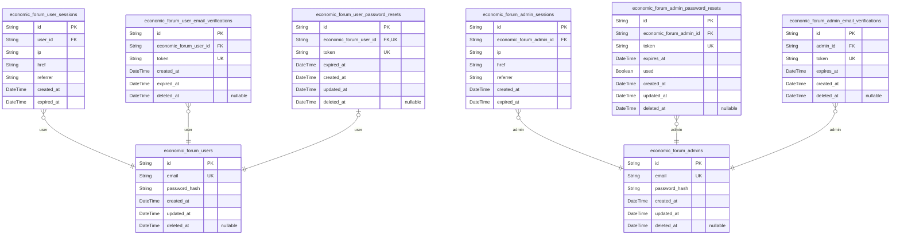
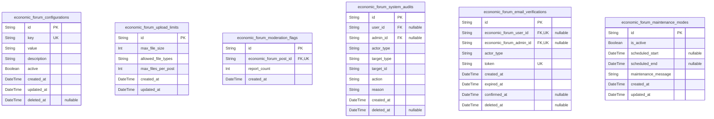
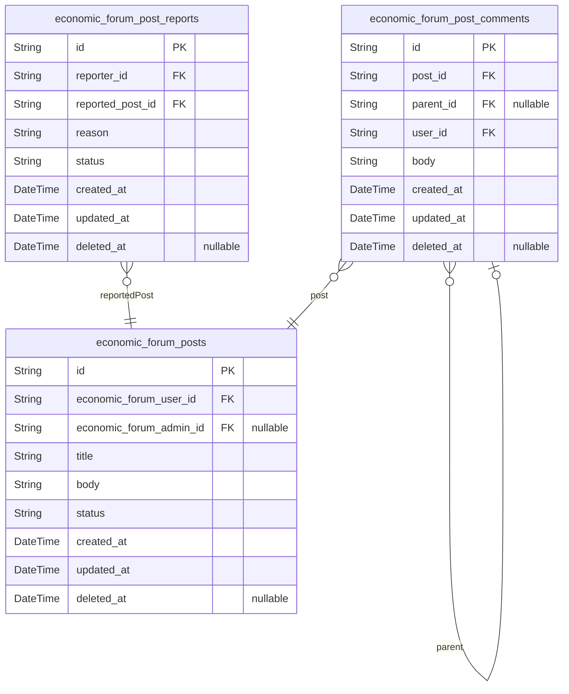
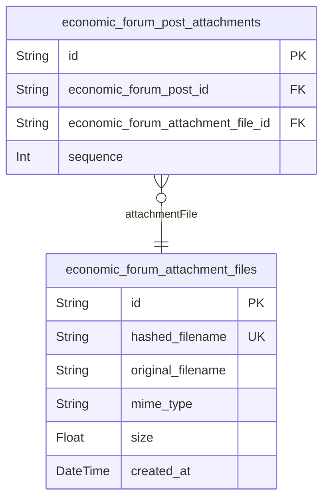

# Prisma Markdown

> Generated by [`prisma-markdown`](https://github.com/samchon/prisma-markdown)

- [Actors](#actors)
- [Systematic](#systematic)
- [Posts](#posts)
- [Attachments](#attachments)

## Actors

```mermaid
erDiagram
"economic_forum_users" {
  String id PK
  String email UK
  String password_hash
  DateTime created_at
  DateTime updated_at
  DateTime deleted_at "nullable"
}
"economic_forum_user_sessions" {
  String id PK
  String user_id FK
  String ip
  String href
  String referrer
  DateTime created_at
  DateTime expired_at
}
"economic_forum_user_email_verifications" {
  String id PK
  String economic_forum_user_id FK
  String token UK
  DateTime created_at
  DateTime expired_at
  DateTime deleted_at "nullable"
}
"economic_forum_user_password_resets" {
  String id PK
  String economic_forum_user_id FK,UK
  String token UK
  DateTime expired_at
  DateTime created_at
  DateTime updated_at
  DateTime deleted_at "nullable"
}
"economic_forum_admins" {
  String id PK
  String email UK
  String password_hash
  DateTime created_at
  DateTime updated_at
  DateTime deleted_at "nullable"
}
"economic_forum_admin_sessions" {
  String id PK
  String economic_forum_admin_id FK
  String ip
  String href
  String referrer
  DateTime created_at
  DateTime expired_at
}
"economic_forum_admin_password_resets" {
  String id PK
  String economic_forum_admin_id FK
  String token UK
  DateTime expires_at
  Boolean used
  DateTime created_at
  DateTime updated_at
  DateTime deleted_at "nullable"
}
"economic_forum_admin_email_verifications" {
  String id PK
  String admin_id FK
  String token UK
  DateTime expires_at
  DateTime created_at
  DateTime deleted_at "nullable"
}
"economic_forum_user_sessions" }o--|| "economic_forum_users" : user
"economic_forum_user_email_verifications" }o--|| "economic_forum_users" : user
"economic_forum_user_password_resets" |o--|| "economic_forum_users" : user
"economic_forum_admin_sessions" }o--|| "economic_forum_admins" : admin
"economic_forum_admin_password_resets" }o--|| "economic_forum_admins" : admin
"economic_forum_admin_email_verifications" }o--|| "economic_forum_admins" : admin
```

### `economic_forum_users`

Registered user accounts with email/password authentication credentials,
email verification status, and profile information.

Stores primary identity information for authenticated users of the
economic forum platform. Each user account is uniquely identified by
email and secured with a hashed password. This table serves as the
canonical source of user identity for the entire system, serving as the
root of all ownership and permission relationships. User accounts are
linked to their corresponding sessions through the
economic_forum_user_sessions table and are referenced by
economic_forum_user_email_verifications and
economic_forum_user_password_resets for authentication workflows.

The designation of this table as an "actor" means it represents a true
user type with its own distinct authentication flow, separate from any
business domain entities like posts or attachments.

Properties as follows:

- `id`: Primary Key.
- `email`
  > Unique email address used for login and communication. Must be a valid
  > email format and globally unique across all users.
- `password_hash`
  > Cryptographic hash of the user's password. Never store plain text
  > passwords. Generated using bcrypt or similar secure algorithm.
- `created_at`
  > Timestamp when this user account was created. Automatically set upon
  > account registration and never modified.
- `updated_at`
  > Timestamp when this user account was last updated. Updated on any profile
  > changes, password resets, or account status modifications.
- `deleted_at`
  > Timestamp when this user account was soft-deleted. Nullable - if null,
  > account is active. Used to preserve audit trail while hiding inactive
  > accounts from user interfaces.

### `economic_forum_user_sessions`

JWT session tokens for user authentication with access token, refresh
token, and 24-hour expiration.

This table tracks login sessions for users of the economic_forum
platform, serving as an append-only audit trail of authentication events.
Each record represents a single user session established through
successful login, containing connection metadata and temporal context
necessary for security monitoring and session management.

Sessions are created upon successful authentication and expire after 24
hours by default. The system does not permit unlimited sessions for
security reasons, so expired_at is always set.

This table has no independent API endpoints - all lifecycle operations
are managed exclusively through the authentication subsystem.

Properties as follows:

- `id`: Primary Key.
- `user_id`: The user's [economic_forum_users.id](#economic_forum_users) who owns this session.
- `ip`: The IP address used to establish this session.
- `href`: The URL of the connection that established this session.
- `referrer`: The referrer URL that led to this session establishment.
- `created_at`: The timestamp when this session was created.
- `expired_at`
  > The timestamp when this session will expire. Always set to 24 hours after
  > created_at. Not nullable to enforce security policy.

### `economic_forum_user_email_verifications`

Email verification tokens with 24-hour expiration to confirm user email
addresses during registration before enabling file uploads.

This subsidiary table stores temporary one-time verification tokens
issued during account registration or email change workflows. Each token
is associated with a specific user and expires after exactly 24 hours for
security. The presence of a record indicates the email address is
unverified, while deletion (or expiration) signifies successful
verification.

Tokens are designed to be single-use and cannot be reused. Users will
receive the token via email and must enter it on the verification page to
complete the process. The system uses this table to prevent unauthorized
email changes and enforce reliable communication channels.

This table is managed entirely by the system during user registration and
account modification flows, not through direct user CRUD operations -
making it a subsidiary entity.

Properties as follows:

- `id`: Primary Key.
- `economic_forum_user_id`
  > User associated with this verification request. {@link
  > economic_forum_users.id}.
- `token`
  > Unique one-time verification token generated for email confirmation. Must
  > be cryptographically random and unguessable.
- `created_at`
  > Timestamp when this verification token was issued. Used to calculate
  > 24-hour expiration window and enforce security policies.
- `expired_at`
  > Timestamp when this verification token expires (24 hours after
  > created_at). Must be exactly 24 hours after creation. Sessions cannot be
  > extended beyond this point.
- `deleted_at`
  > Timestamp when this verification record was soft-deleted (upon successful
  > verification or manual cleanup). Absence indicates active/unverified
  > status.

### `economic_forum_user_password_resets`

Password reset tokens for user account recovery with 1-hour expiration
window.

Supports secure password recovery workflow by generating unique,
time-limited tokens that users can use to reset their authentication
credentials. Each token is associated with exactly one user account and
becomes invalid after one hour from creation.

Tokens are used exclusively in the password reset workflow and are not
exposed to users except via secure, encrypted communication channels.
Once a password is successfully reset, the corresponding token is marked
for deletion to maintain audit trail and prevent token reuse.

Properties as follows:

- `id`: Primary Key.
- `economic_forum_user_id`
  > Reference to the user account requesting password reset. {@link
  > economic_forum_users.id}.
- `token`
  > Unique hashed token used for password reset validation. Generated
  > securely and sent to user via email.
- `expired_at`
  > Exact datetime when the password reset token expires. Fixed 1-hour window
  > from creation per security requirements.
- `created_at`
  > Timestamp when the password reset token was generated and issued to the
  > user.
- `updated_at`
  > Timestamp when the password reset token was last modified (e.g. marked as
  > used or deleted).
- `deleted_at`
  > Timestamp when the password reset token was logically deleted (soft
  > delete). Used for audit trail tracking.

### `economic_forum_admins`

Administrator accounts with email/password authentication credentials and
elevated privileges for content moderation and user management.

Stores credentials and profile information for system administrators who
have the authority to moderate content, delete inappropriate posts, and
manage user accounts. This table serves as the canonical identity record
for admin actors, with all authentication and session management flows
centered around this entity.

Administrators are distinct from regular users because they have elevated
permissions and are responsible for system integrity. Each admin has a
unique email address for secure authentication and communication.

Properties as follows:

- `id`: Primary Key.
- `email`
  > Administrator email address for authentication and communication. Must be
  > unique and used as the primary login identifier.
- `password_hash`
  > Hashed password for authentication. Never stored in plain text. Used for
  > secure login verification via bcrypt or equivalent hashing algorithm.
- `created_at`
  > Timestamp when the administrator account was created. Records the initial
  > registration date for audit purposes.
- `updated_at`
  > Timestamp of the last update to the administrator record. Updated
  > whenever profile information is modified.
- `deleted_at`
  > Soft delete timestamp for administrator accounts. When set, the account
  > is considered deactivated but retained for audit trails. Null value
  > indicates active status.

### `economic_forum_admin_sessions`

JWT session tokens for admin authentication with access and refresh token
support for secure, persistent sessions.

Tracks login sessions for economic_forum_admins users with connection
metadata including IP address, requested URL, and referrer information.
This is an append-only audit trail that records each authentication
event. Sessions expire after a defined period for security, and the
expired_at field is mandatory to prevent unlimited sessions which pose
security risks.

Each session is tied to exactly one admin account and cannot exist
independently. The system uses this table to validate active sessions
during requests and to audit login activity for security investigations.

Properties as follows:

- `id`: Primary Key.
- `economic_forum_admin_id`
  > The admin account associated with this session. {@link
  > economic_forum_admins.id}.
- `ip`
  > The IP address from which the session was initiated. Required for
  > security monitoring and geo-location tracking.
- `href`
  > The full URL of the page that initiated the session. Used for tracking
  > access patterns and identifying entry points.
- `referrer`
  > The referrer URL that led to this session initiation. Provides context
  > about the source of the authentication request.
- `created_at`
  > The timestamp when this session was created. Required to establish
  > session lifecycle and track duration.
- `expired_at`
  > The timestamp when this session will expire. Mandatory for security
  > compliance to prevent unlimited sessions. Sessions must have an explicit
  > expiration time.

### `economic_forum_admin_password_resets`

Password reset tokens for administrative accounts with expiration and
usage tracking.

Stores one-time tokens used to initiate password recovery workflows for
economic_forum_admins. Each token is generated when an admin requests a
password reset and is valid for a limited time. The system marks the
token as used once it has been applied, rendering it invalid for future
use.

Tokens are stored with explicit expiration dates and timestamps for
security auditing. Soft deletion is supported to maintain a complete
audit trail of all password reset attempts, including those that were
never completed.

This table is managed entirely by the authentication system and not
directly accessed or modified by end users.

Properties as follows:

- `id`: Primary Key.
- `economic_forum_admin_id`: Admin account requesting password reset. [economic_forum_admins.id](#economic_forum_admins).
- `token`
  > Randomly generated unique token string for password reset. Used to
  > authenticate the reset request.
- `expires_at`
  > Expiration timestamp for the password reset token. After this time, the
  > token is no longer valid.
- `used`
  > Flag indicating whether the password reset token has been successfully
  > used to change the password.
- `created_at`
  > Timestamp when the password reset token was created and issued to the
  > admin.
- `updated_at`
  > Timestamp when the password reset token was last updated (typically when
  > marked as used).
- `deleted_at`
  > Timestamp when the password reset token record was soft-deleted. Null
  > indicates the record is active. Used for audit trail preservation.

### `economic_forum_admin_email_verifications`

Email verification tokens to confirm admin email addresses during account
registration or update.

Stores temporary tokens used to verify the authenticity of admin email
addresses during account creation or email change procedures. Each token
is unique, single-use, and expires after a defined period (typically 24
hours) to ensure security.

The token is sent to the admin's email address and must be presented to
complete the verification process. Once verified, the token is
invalidated. This table maintains an audit trail of all verification
attempts, including successful validations and expired or unused tokens.

Properties as follows:

- `id`: Primary Key.
- `admin_id`
  > Admin account that this email verification is associated with. {@link
  > economic_forum_admins.id}.
- `token`
  > Unique verification token generated for email confirmation. Must be
  > cryptographically random and URL-safe to prevent guessing attacks.
- `expires_at`
  > Expiration timestamp for the verification token. Tokens are always valid
  > for a limited time (typically 24 hours) for security reasons.
- `created_at`
  > Timestamp when this verification token was created and issued to the
  > admin.
- `deleted_at`
  > Soft delete timestamp indicating when this verification record was
  > logically deleted, either upon successful verification or manual cleanup.

## Systematic

```mermaid
erDiagram
"economic_forum_configurations" {
  String id PK
  String key UK
  String value
  String description
  Boolean active
  DateTime created_at
  DateTime updated_at
  DateTime deleted_at "nullable"
}
"economic_forum_upload_limits" {
  String id PK
  Int max_file_size
  String allowed_file_types
  Int max_files_per_post
  DateTime created_at
  DateTime updated_at
}
"economic_forum_moderation_flags" {
  String id PK
  String economic_forum_post_id FK,UK
  Int report_count
  DateTime created_at
}
"economic_forum_system_audits" {
  String id PK
  String user_id FK "nullable"
  String admin_id FK "nullable"
  String actor_type
  String target_type
  String target_id
  String action
  String reason
  DateTime created_at
  DateTime deleted_at "nullable"
}
"economic_forum_email_verifications" {
  String id PK
  String economic_forum_user_id FK,UK "nullable"
  String economic_forum_admin_id FK,UK "nullable"
  String actor_type
  String token UK
  DateTime created_at
  DateTime expired_at
  DateTime confirmed_at "nullable"
  DateTime deleted_at "nullable"
}
"economic_forum_maintenance_modes" {
  String id PK
  Boolean is_active
  DateTime scheduled_start "nullable"
  DateTime scheduled_end "nullable"
  String maintenance_message
  DateTime created_at
  DateTime updated_at
}
```

### `economic_forum_configurations`

System-wide configuration settings and feature flags governing the
application's behavior.

Stores modifiable parameters that control forum functionality, such as
feature toggles, display settings, rate limits, and system behaviors.
Administrative users can enable or disable features through this
centralized configuration system.

Each configuration key represents a specific behavioral control point
that can be updated dynamically without code deployment. The active flag
determines whether the configuration is currently applied to the running
system.

Properties as follows:

- `id`: Primary Key.
- `key`
  > Unique configuration key identifier. Must be a dot-separated hierarchical
  > name (e.g., 'feature.upload.enabled'). All keys must be unique.
- `value`
  > Configuration value stored as string. Can represent boolean, number, or
  > text values encoded as string (e.g., "true", "5000", "default_template").
- `description`
  > Human-readable description explaining the purpose and impact of this
  > configuration setting.
- `active`
  > Indicates whether this configuration is currently active and applied to
  > the system. Inactive configurations are preserved for historical
  > reference but ignored by the application.
- `created_at`: Timestamp when this configuration was first created in the system.
- `updated_at`: Timestamp of the last modification to this configuration.
- `deleted_at`
  > Timestamp when this configuration was logically deleted. NULL means the
  > configuration is still active (not deleted). Used for audit trail and
  > recovery of configuration changes.

### `economic_forum_upload_limits`

System-wide file upload restrictions governing attachment size, type, and
quantity limits for posts and comments.

Defines the technical constraints for all file uploads in the forum
system, ensuring consistent policy enforcement across all user
interactions. This configuration table establishes non-negotiable limits
on file size, permitted MIME types, and the maximum number of files that
can be attached to a single post.

These restrictions are applied globally to both post and comment
attachments and are enforced by the application layer before any file
upload processing occurs. The values in this table constitute the
definitive policy for file upload operations and must be updated by
administrators who have elevated privileges.

All attachments must comply with the declared constraints - any attempt
to upload a file that exceeds the size limit, uses a disallowed
extension, or exceeds the per-post limit will result in immediate
rejection with a user-facing error message.

Properties as follows:

- `id`: Primary Key.
- `max_file_size`
  > Maximum allowed file size in bytes for any single uploaded file. The
  > system enforces a strict threshold of 5,242,880 bytes (5MB) to ensure
  > performance and storage efficiency.
- `allowed_file_types`
  > Comma-separated list of file extensions permitted for uploads. Must
  > include: .jpg, .jpeg, .png, .gif, .pdf, .txt, .docx, .csv. Any other file
  > MIME types will be rejected at the application layer.
- `max_files_per_post`
  > Maximum number of files that can be attached to a single post or comment.
  > Limits the total count of attachment files per post to prevent abuse or
  > performance degradation.
- `created_at`
  > Timestamp of when this upload limit configuration was first created in
  > the system. Used for audit trail and change tracking.
- `updated_at`
  > Timestamp of the most recent modification to this upload limit
  > configuration. Tracks when administrators last revised the file upload
  > restrictions.

### `economic_forum_moderation_flags`

Tracks moderation flags for posts triggered by three or more distinct
user reports.

This subsidiary table records when a post has accumulated sufficient
reports from distinct users to trigger automated moderation review. Each
flag represents a single post that has reached the threshold requiring
administrative attention. The table does not store individual report
details but aggregates the count of distinct reporters.

This table exists purely to support the moderation workflow of posts and
has no independent user operations. It's automatically created and
managed by the system when report thresholds are met, and is referenced
by moderation systems to identify posts needing review.

Properties as follows:

- `id`: Primary Key.
- `economic_forum_post_id`
  > The post that has been flagged for moderation. {@link
  > economic_forum_posts.id}.
- `report_count`
  > Total number of distinct users who have reported this post. When this
  > reaches 3 or more, the moderation flag is activated.
- `created_at`
  > Timestamp when the moderation flag was activated (i.e., when report_count
  > reached threshold).

### `economic_forum_system_audits`

Audit log of all administrative actions including bans, post deletions,
and moderation approvals.

Records immutable events when administrators perform system management
actions. Each audit entry captures the actor who performed the action,
the type of target entity affected, the specific action taken, and the
reason provided.

This table is critical for accountability, legal compliance, and
operational transparency. Audit entries are created once and never
modified, ensuring data integrity of system actions.

Multiple actors (users and admins) can perform audits, so the actor_type
discriminator field indicates whether the action came from a user or
admin account. The target_type field identifies the entity type being
modified (e.g., "post", "user", "comment").

Properties as follows:

- `id`: Primary Key.
- `user_id`: User who performed the audit action. [economic_forum_users.id](#economic_forum_users).
- `admin_id`: Admin who performed the audit action. [economic_forum_admins.id](#economic_forum_admins).
- `actor_type`
  > Type of actor who performed the action. Values: "user" or "admin". Used
  > to determine which actor table the foreign key references.
- `target_type`
  > Type of entity that was affected by the audit action. Examples: "post",
  > "comment", "user", "admin", "attachment". Used to identify the context of
  > the action.
- `target_id`
  > ID of the entity that was affected by the audit action. References a
  > record in another table (e.g., economic_forum_posts,
  > economic_forum_users).
- `action`
  > The specific administrative action performed. Values: "ban", "unban",
  > "delete", "restore", "approve", "reject", "modify". Follows standard
  > moderation action taxonomy.
- `reason`
  > Detailed explanation provided by the administrator for the action taken.
  > Required for accountability and audit review.
- `created_at`
  > Timestamp when the audit entry was created. This is immutable - the time
  > the administrative action was performed.
- `deleted_at`
  > Soft delete timestamp for audit entries. Required to maintain audit trail
  > integrity without deleting records from the database.

### `economic_forum_email_verifications`

Email verification tokens for users and administrators to confirm
ownership of email addresses.

Records generated during user registration or email change workflows.
Contains unique verification tokens with expiration time to ensure secure
email confirmation.

System automatically generates these tokens and sends them via email.
When a user clicks the verification link, the system validates the token
and records the confirmation timestamp.

The token is invalidated after expiration or upon confirmation. Soft
delete is supported to maintain audit trails while retaining the ability
to identify invalid tokens.

Uses actor_type to differentiate between user and admin verification
records, with corresponding foreign keys to economic_forum_users and
economic_forum_admins.

Properties as follows:

- `id`: Primary Key.
- `economic_forum_user_id`
  > The user who requested email verification. {@link
  > economic_forum_users.id}.
- `economic_forum_admin_id`
  > The admin who requested email verification. {@link
  > economic_forum_admins.id}.
- `actor_type`
  > Type of actor this verification record belongs to. Valid values: 'user'
  > or 'admin'. Used to determine which actor table the foreign key
  > references.
- `token`
  > Unique random token generated for email verification. Used in
  > verification link sent to user's email address. Must be encrypted in
  > transit and at rest.
- `created_at`: Timestamp when the verification token was created and issued.
- `expired_at`
  > Timestamp when the verification token expires. After this point, the
  > token is invalidated and cannot be used for verification.
- `confirmed_at`
  > Timestamp when the email address was successfully verified by the user.
  > NULL if verification is pending or failed.
- `deleted_at`
  > Timestamp when the verification record was soft-deleted. NULL means the
  > record is active. Used to retain audit trail for revoked or expired
  > tokens.

### `economic_forum_maintenance_modes`

Tracks whether the system is currently in maintenance mode and provides
scheduling information for planned downtime.

This configuration table controls system-wide maintenance operations,
determining whether users see a maintenance message instead of normal
application content.

The maintenance mode is activated and managed by administrators through
system controls, not by end users. It serves as a passive system control
point that affects all users simultaneously.

When active, the application redirects users to a maintenance page
instead of serving regular content.

This table does not track historical maintenance events - it only
reflects the current or next scheduled maintenance state.

Properties as follows:

- `id`: Primary Key.
- `is_active`
  > Indicates whether maintenance mode is currently active. True means the
  > system displays a maintenance message instead of regular content.
- `scheduled_start`
  > The scheduled start time for maintenance window. NULL means no upcoming
  > scheduled maintenance.
- `scheduled_end`
  > The scheduled end time for maintenance window. NULL means no upcoming
  > scheduled maintenance.
- `maintenance_message`
  > The message displayed to users when the system is in maintenance mode.
  > Contains guidance about expected downtime and when service will resume.
- `created_at`: Timestamp when this maintenance mode configuration was created.
- `updated_at`: Timestamp when this maintenance mode configuration was last updated.

## Posts

```mermaid
erDiagram
"economic_forum_posts" {
  String id PK
  String economic_forum_user_id FK
  String economic_forum_admin_id FK "nullable"
  String title
  String body
  String status
  DateTime created_at
  DateTime updated_at
  DateTime deleted_at "nullable"
}
"economic_forum_post_comments" {
  String id PK
  String post_id FK
  String parent_id FK "nullable"
  String user_id FK
  String body
  DateTime created_at
  DateTime updated_at
  DateTime deleted_at "nullable"
}
"economic_forum_post_reports" {
  String id PK
  String reporter_id FK
  String reported_post_id FK
  String reason
  String status
  DateTime created_at
  DateTime updated_at
  DateTime deleted_at "nullable"
}
"economic_forum_post_comments" }o--|| "economic_forum_posts" : post
"economic_forum_post_comments" }o--o| "economic_forum_post_comments" : parent
"economic_forum_post_reports" }o--|| "economic_forum_posts" : reportedPost
```

### `economic_forum_posts`

User-created discussion posts with text content, moderation status, and
chronological metadata.

Stores the primary content objects of the economic forum platform,
representing questions, insights, or arguments posted by authenticated
users. Each post can receive multiple replies in the form of comments and
may be flagged or hidden through moderation workflows.

Posts are independently managed entities requiring full CRUD operations:
users can create new posts, search across all posts, edit their own
content, and delete posts they no longer wish to maintain. Administrators
can flag or hide inappropriate content while preserving the audit trail.

The post remains attached to its original author even if author profile
information changes, ensuring historical integrity of discussion context.
Soft deletion is implemented to facilitate moderation policies while
maintaining data integrity for audit purposes.

Properties as follows:

- `id`: Primary Key.
- `economic_forum_user_id`: Author's user account. [economic_forum_users.id](#economic_forum_users).
- `economic_forum_admin_id`
  > Moderator who performed the last action (flag/hide). {@link
  > economic_forum_admins.id}.
- `title`
  > Title of the post, limited to 200 characters for display clarity and
  > search optimization.
- `body`
  > Main content of the post in Markdown format. Contains the full text of
  > the user's contribution, which may include formatting, links, and code
  > blocks.
- `status`
  > Current moderation status of the post. Valid values: 'active', 'flagged',
  > 'hidden'. Status transitions follow moderation workflow rules.
- `created_at`
  > Timestamp when the post was originally created. Immutable and used for
  > chronological ordering and feed generation.
- `updated_at`
  > Timestamp when the post was last modified. Updated whenever title or body
  > is edited by the author or administrator.
- `deleted_at`
  > Timestamp when the post was soft-deleted. NULL indicates the post is
  > active. Used for moderation workflows where posts are hidden rather than
  > permanently removed.

### `economic_forum_post_comments`

Threaded comments and replies to posts, supporting up to 5 levels of
nesting with parent-child relationships.

Stores user-generated replies to forum posts with hierarchical structure,
allowing users to respond directly to specific comments or posts. Each
comment is associated with a single post and created by an authenticated
user through their session.

Comments have a nested structure where replies can be posted to other
comments, forming parent-child relationships up to five levels deep. This
enables threaded discussions while maintaining performance through proper
indexing.

Comments are soft-deletable for moderation purposes and tracked with full
audit trail via created_at, updated_at, and deleted_at timestamps. Users
can edit their own comments within a reasonable time window, with updates
reflected in the updated_at field.

Each comment is tied to exactly one post through post_id and one user
through user_id, ensuring proper ownership and attribution. File
attachments are managed separately in the Attachments component via
economic_forum_post_attachments junction table.

Properties as follows:

- `id`: Primary Key.
- `post_id`: The forum post this comment belongs to. [economic_forum_posts.id](#economic_forum_posts).
- `parent_id`
  > The parent comment this is a reply to. Self-referential relationship.
  > [economic_forum_post_comments.id](#economic_forum_post_comments).
- `user_id`
  > The authenticated user who created this comment. {@link
  > economic_forum_users.id}.
- `body`: The text content of the comment. Contains the user's reply or response.
- `created_at`: Timestamp when this comment was created.
- `updated_at`: Timestamp when this comment was last updated.
- `deleted_at`
  > Timestamp when this comment was soft-deleted for moderation purposes. If
  > null, comment is active.

### `economic_forum_post_reports`

User-submitted reports on forum posts for moderation review.

Records reports made by authenticated users against specific posts. Each
report contains a reason provided by the reporter and a status that
tracks the moderation workflow (pending, reviewed, resolved, or
rejected). Reports are independent entities with their own lifecycle and
can be searched, filtered, and acted upon by moderators regardless of the
associated post.

Reports are linked to the reporter through economic_forum_users and to
the reported post through economic_forum_posts. When a post is deleted,
its reports remain in the system for audit purposes. Soft deletion is
supported to preserve historical data while allowing moderators to clean
up obsolete reports.

Properties as follows:

- `id`: Primary Key.
- `reporter_id`: Reporter user's [economic_forum_users.id](#economic_forum_users).
- `reported_post_id`: Reported post's [economic_forum_posts.id](#economic_forum_posts).
- `reason`
  > The reason provided by the user for reporting this post. Maximum 1000
  > characters.
- `status`
  > The current moderation status of the report. Valid values: 'pending',
  > 'reviewed', 'resolved', 'rejected'.
- `created_at`: Timestamp when this report was created.
- `updated_at`: Timestamp when this report was last updated (e.g., when status changed).
- `deleted_at`
  > Timestamp when this report was soft-deleted. If null, the report is
  > active.

## Attachments

```mermaid
erDiagram
"economic_forum_attachment_files" {
  String id PK
  String hashed_filename UK
  String original_filename
  String mime_type
  Float size
  DateTime created_at
}
"economic_forum_post_attachments" {
  String id PK
  String economic_forum_post_id FK
  String economic_forum_attachment_file_id FK
  Int sequence
}
"economic_forum_post_attachments" }o--|| "economic_forum_attachment_files" : attachmentFile
```

### `economic_forum_attachment_files`

Stores file metadata for uploaded attachments including unique hashed
filename, original filename, MIME type, file size, and upload timestamp.

Contains immutable metadata for files attached to posts, ensuring file
integrity, tracking, and efficient retrieval. Each record represents a
single uploaded file with its technical properties, used by the
application to serve files and validate uploads. The actual file storage
is managed externally (e.g., cloud storage), with this table storing only
reference and metadata information.

Files are linked to posts via the economic_forum_post_attachments
junction table. This table exists purely as supporting metadata and is
not independently managed by users - attachments are created and deleted
via their parent posts.

Properties as follows:

- `id`: Primary Key.
- `hashed_filename`
  > Unique hashed filename generated to prevent storage conflicts and enable
  > secure file referencing. Uses secure hashing algorithm to create unique
  > identifier from original filename and content.
- `original_filename`
  > The original filename as provided by the user during upload. Preserved
  > for display purposes and to maintain user intent, but never used for file
  > storage or direct access.
- `mime_type`
  > The official MIME type of the file (e.g., 'image/jpeg',
  > 'application/pdf'). Used for content delivery and validation to ensure
  > only permitted file types are uploaded.
- `size`
  > Size of the file in bytes. Enforces maximum 5MB (5,242,880 bytes) limit
  > per file as specified in requirements. Stored as double to accommodate
  > precise byte counting.
- `created_at`
  > Timestamp when the file was uploaded and metadata was recorded. Used for
  > sorting attachments in upload order within posts and for audit purposes.

### `economic_forum_post_attachments`

Junction table linking posts to their attached files, ensuring each
attachment is associated with exactly one post and maintaining order of
upload.

This table manages the many-to-many relationship between
economic_forum_posts and economic_forum_attachment_files by creating a
direct association with an explicit sequence number. Each attachment
record in this table points to one specific post and one specific file,
establishing the parent-child relationship between content and media.

The sequence field (integer) determines the display order of attachments
under each post, with lower numbers appearing first. This ensures
attachments are presented in the exact order they were uploaded by the
user.

This junction table enables efficient querying of all attachments for a
given post while maintaining the upload sequence, and prevents direct
interaction with attachments outside the context of their parent post.

When a post is deleted, all associated attachment records in this table
are automatically removed as a cascading deletion through the foreign key
relationship.

Properties as follows:

- `id`: Primary Key.
- `economic_forum_post_id`
  > Reference to the post that this attachment belongs to. {@link
  > economic_forum_posts.id}.
- `economic_forum_attachment_file_id`
  > Reference to the file record containing metadata for this attachment.
  > [economic_forum_attachment_files.id](#economic_forum_attachment_files).
- `sequence`
  > Numeric order of attachment within the post. Lower values appear first,
  > ensuring attachments are displayed in upload sequence. Must be positive
  > integer.
