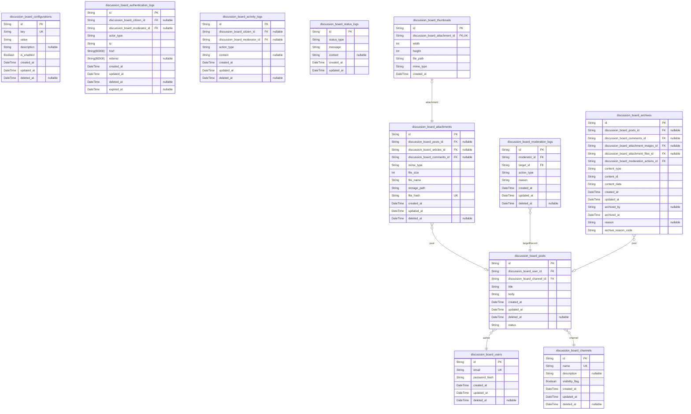
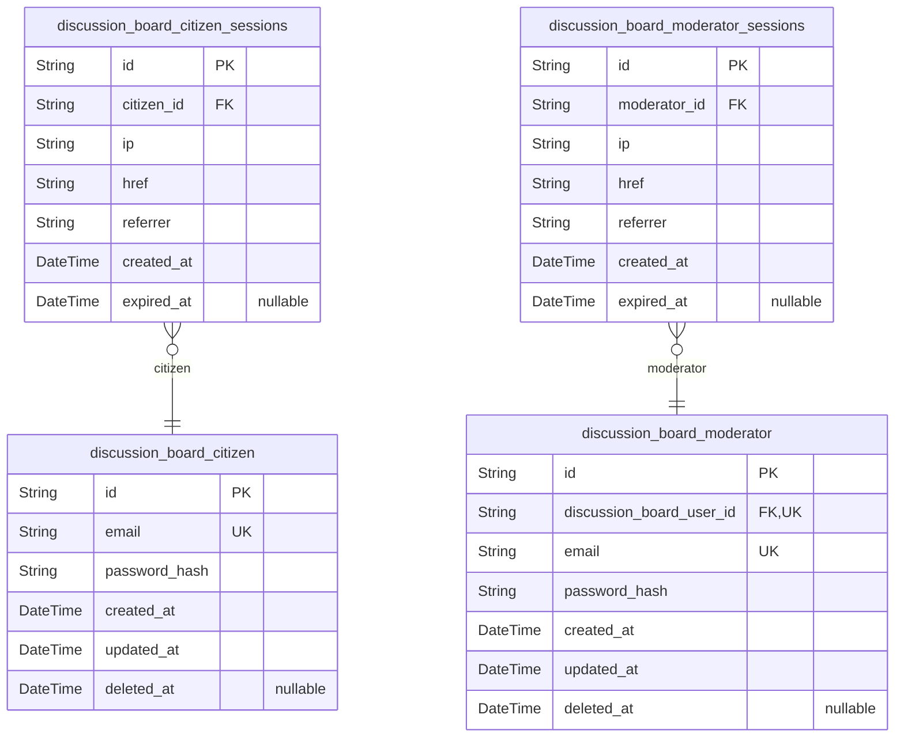
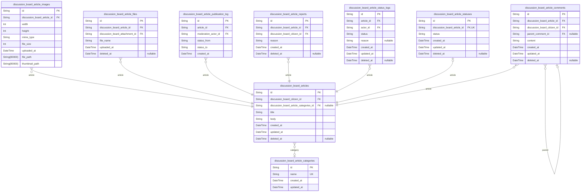
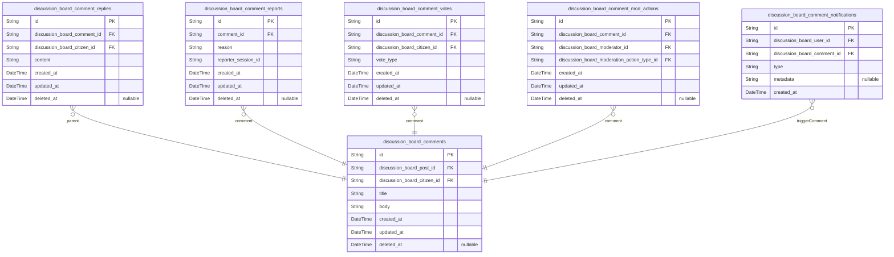
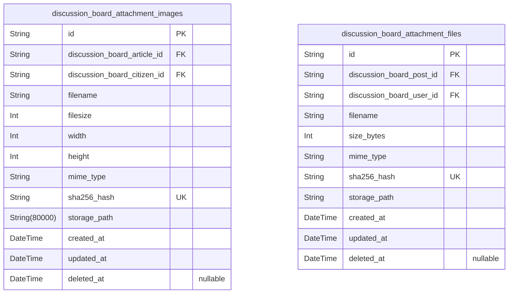
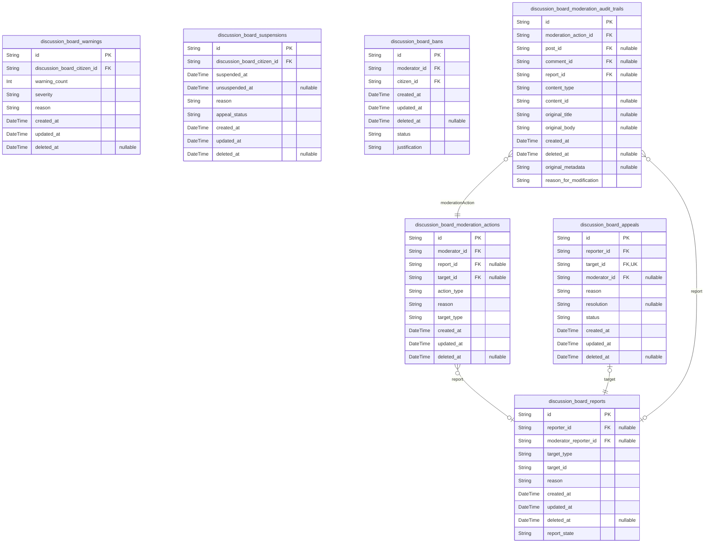
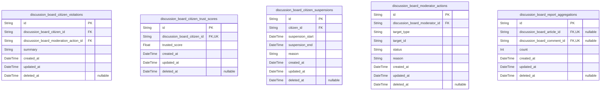
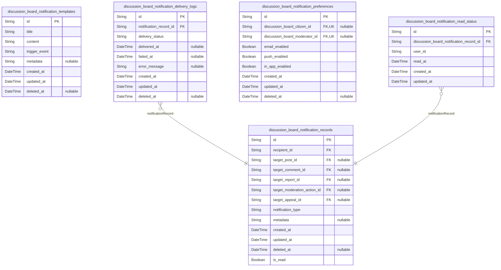
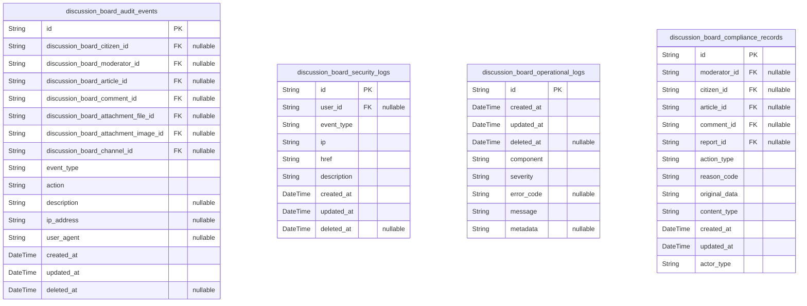

# Prisma Markdown

> Generated by [`prisma-markdown`](https://github.com/samchon/prisma-markdown)

- [Systematic](#systematic)
- [Actors](#actors)
- [Articles](#articles)
- [Comments](#comments)
- [Attachments](#attachments)
- [Moderation](#moderation)
- [Reputation](#reputation)
- [Notifications](#notifications)
- [Audit](#audit)

## Systematic

```mermaid
erDiagram
"discussion_board_configurations" {
  String id PK
  String key UK
  String value
  String description "nullable"
  Boolean is_enabled
  DateTime created_at
  DateTime updated_at
  DateTime deleted_at "nullable"
}
"discussion_board_channels" {
  String id PK
  String name UK
  String description "nullable"
  Boolean visibility_flag
  DateTime created_at
  DateTime updated_at
  DateTime deleted_at "nullable"
}
"discussion_board_attachments" {
  String id PK
  String discussion_board_posts_id FK "nullable"
  String discussion_board_articles_id FK "nullable"
  String discussion_board_comments_id FK "nullable"
  String mime_type
  Int file_size
  String file_name
  String storage_path
  String file_hash UK
  DateTime created_at
  DateTime updated_at
  DateTime deleted_at "nullable"
}
"discussion_board_moderation_logs" {
  String id PK
  String moderator_id FK
  String target_id FK
  String action_type
  String reason
  DateTime created_at
  DateTime updated_at
  DateTime deleted_at "nullable"
}
"discussion_board_posts" {
  String id PK
  String discussion_board_user_id FK
  String discussion_board_channel_id FK
  String title
  String body
  DateTime created_at
  DateTime updated_at
  DateTime deleted_at "nullable"
  String status
}
"discussion_board_authentication_logs" {
  String id PK
  String discussion_board_citizen_id FK "nullable"
  String discussion_board_moderator_id FK "nullable"
  String actor_type
  String ip
  String(80000) href
  String(80000) referrer "nullable"
  DateTime created_at
  DateTime updated_at
  DateTime deleted_at "nullable"
  DateTime expired_at "nullable"
}
"discussion_board_users" {
  String id PK
  String email UK
  String password_hash
  DateTime created_at
  DateTime updated_at
  DateTime deleted_at "nullable"
}
"discussion_board_archives" {
  String id PK
  String discussion_board_posts_id FK "nullable"
  String discussion_board_comments_id FK "nullable"
  String discussion_board_attachment_images_id FK "nullable"
  String discussion_board_attachment_files_id FK "nullable"
  String discussion_board_moderation_actions_id FK
  String content_type
  String content_id
  String content_data
  DateTime created_at
  DateTime updated_at
  String archived_by "nullable"
  DateTime archived_at
  String reason "nullable"
  String archive_reason_code
}
"discussion_board_activity_logs" {
  String id PK
  String discussion_board_citizen_id FK "nullable"
  String discussion_board_moderator_id FK "nullable"
  String action_type
  String context "nullable"
  DateTime created_at
  DateTime updated_at
  DateTime deleted_at "nullable"
}
"discussion_board_status_logs" {
  String id PK
  String status_type
  String message
  String context "nullable"
  DateTime created_at
  DateTime updated_at
}
"discussion_board_thumbnails" {
  String id PK
  String discussion_board_attachment_id FK,UK
  Int width
  Int height
  String file_path
  String mime_type
  DateTime created_at
}
"discussion_board_attachments" }o--o| "discussion_board_posts" : post
"discussion_board_moderation_logs" }o--|| "discussion_board_posts" : targetRecord
"discussion_board_posts" }o--|| "discussion_board_users" : author
"discussion_board_posts" }o--|| "discussion_board_channels" : channel
"discussion_board_archives" }o--o| "discussion_board_posts" : post
"discussion_board_thumbnails" |o--|| "discussion_board_attachments" : attachment
```

### `discussion_board_configurations`

System-wide configuration settings and feature flags controlling platform
behavior.

Manages customizable platform parameters that determine feature
availability, performance limits, moderation thresholds, and system
behavior. These configurations are independently managed by
administrators through direct UI or API interactions, allowing dynamic
control of platform functionality without code deployments.

Each configuration setting is a key-value pair that can be toggled,
modified, or deactivated. Configurations affect the entire platform and
are cached for performance. Changes take effect immediately across all
users and sessions.

Examples include: comment character limits, attachment size restrictions,
posting frequency caps, moderation automation thresholds, and feature
flags for experimental functionality.

Properties as follows:

- `id`: Primary Key.
- `key`
  > Unique configuration identifier (e.g., "comment_max_length",
  > "attachment_file_size_limit"). Must be unique across all configurations.
- `value`
  > Configuration value stored as string for flexibility. Can represent
  > boolean ("true"/"false"), numeric ("100"), or string values ("default").
- `description`
  > Human-readable description explaining the purpose and usage of this
  > configuration setting.
- `is_enabled`
  > Whether this configuration is currently active and applied to the system.
  > When false, system falls back to default behavior.
- `created_at`
  > Timestamp when this configuration was initially created and added to the
  > system.
- `updated_at`: Timestamp when this configuration was last modified by an administrator.
- `deleted_at`
  > Timestamp when this configuration was soft-deleted. NULL indicates active
  > configuration. Used for audit trails and potential recovery.

### `discussion_board_channels`

Data channels for organizing content categories such as Economics,
Politics, and Society.

Defines hierarchical and thematic categories that organize all
user-generated content on the platform. Each channel represents a
distinct topic area where citizens can post articles, engage in
discussions, and find relevant content. Channels serve as the primary
organizational structure for content discovery and navigation.

Channels are created and managed by moderators with appropriate
permissions. Citizens can browse and search content by channel, but
cannot create or delete channels. Each article belongs to exactly one
channel, and the channel metadata (name, description) remains consistent
even if the content within changes.

Soft deletion is supported to maintain audit trails while allowing for
channel deactivation or reorganization.

Properties as follows:

- `id`: Primary Key.
- `name`
  > Unique display name of the channel (e.g., "Economics", "Politics",
  > "Society"). Used for URL routing and category selection.
- `description`
  > Detailed description explaining what topics this channel covers, any
  > specific rules, and target audience. Provides context for users browsing
  > available channels.
- `visibility_flag`
  > Determines whether the channel is visible to citizens. True = visible in
  > listings and search results. False = hidden from general browsing (but
  > existing content remains accessible).
- `created_at`
  > Timestamp when the channel was created. Immutable and used for audit
  > trails and chronological sorting.
- `updated_at`
  > Timestamp when the channel's name or description was last modified.
  > Updated when moderators edit channel metadata.
- `deleted_at`
  > Soft delete timestamp. When set, the channel is considered archived and
  > hidden from all user interfaces. Used for content moderation without
  > permanent data loss.

### `discussion_board_attachments`

Metadata for media attachments including file type, size, and upload
timestamp.

Stores technical information about files uploaded by users to associate
with posts, articles, or other content entities. Each attachment is
linked to a parent content item and contains only metadata information,
not the actual file content which is stored separately in object storage.

Attachment records track file characteristics (MIME type, size) and
timing for operational, billing, and compliance purposes. The actual file
data resides in external object storage systems referenced by storage
paths.

Properties as follows:

- `id`: Primary Key.
- `discussion_board_posts_id`
  > Parent post that this attachment belongs to. {@link
  > discussion_board_posts.id}.
- `discussion_board_articles_id`
  > Parent article that this attachment belongs to. {@link
  > discussion_board_articles.id}.
- `discussion_board_comments_id`
  > Parent comment that this attachment belongs to. {@link
  > discussion_board_comments.id}.
- `mime_type`
  > MIME type of the uploaded file (e.g., image/jpeg, application/pdf). Used
  > for content type validation and client rendering.
- `file_size`
  > Size of the uploaded file in bytes. Used for storage quota calculation
  > and upload validation against system limits.
- `file_name`
  > Original filename of the uploaded file. Preserved for user reference and
  > download purposes.
- `storage_path`
  > Path to the actual file in the external object storage system. Used to
  > retrieve the file content from CDN or storage service.
- `file_hash`
  > SHA-256 hash of the uploaded file content. Used for integrity
  > verification and duplicate detection across uploads.
- `created_at`
  > Timestamp when the attachment record was created. Immutable record of
  > upload time for audit purposes.
- `updated_at`
  > Timestamp when the attachment record was last updated. Used for tracking
  > metadata changes (e.g., renaming).
- `deleted_at`
  > Timestamp when the attachment was logically deleted (soft delete). Null
  > if still active. Used for compliance and recovery workflows.

### `discussion_board_moderation_logs`

Immutable audit trail of all moderation actions taken on the platform.

Stores a complete historical record of moderator decisions including
deletions, warnings, suspensions, and other enforcement actions. This
table serves as the primary compliance mechanism for regulatory
requirements, providing an unalterable log of all content modifications
and user sanctions.

Each audit entry records which moderator performed the action, what
content or user was targeted, the specific action taken, the reason
provided, and the exact timestamp. The table uses soft delete to maintain
audit integrity while allowing for system cleanup of obsolete records.

All entries are timestamped at creation and cannot be modified after
logging - even if the target content is later restored or deleted, the
audit trail remains intact for forensic review.

Properties as follows:

- `id`: Primary Key.
- `moderator_id`: Moderator who performed the action. [discussion_board_moderator.id](#discussion_board_moderator).
- `target_id`
  > Unique identifier of the content or user targeted by the moderation
  > action. This may reference a post, comment, user account, or other entity
  > depending on the action type. [discussion_board_posts.id](#discussion_board_posts) or {@link
  > discussion_board_comments.id} or [discussion_board_users.id](#discussion_board_users).
- `action_type`
  > Type of moderation action performed. Valid values: 'delete', 'warn',
  > 'suspend', 'ban', 'unhide', 'approve'.
- `reason`
  > Detailed reason for the moderation action, including policy violation
  > details and moderator justification.
- `created_at`
  > Timestamp when the moderation action was logged. The immutable
  > point-in-time when this audit record was created.
- `updated_at`
  > Timestamp of the last update to this audit record, typically used if
  > metadata is corrected after initial logging.
- `deleted_at`
  > Soft delete timestamp for audit record lifecycle management in compliance
  > with data retention policies.

### `discussion_board_posts`

Persistent records of all citizen-authored posts, including title,
content, and timestamp.

Stores user-generated content created by citizens on the discussion board
platform. Each post represents a complete message with title and body
text, linked to a specific author and category channel. Posts are the
primary content entities that users create, browse, search, and interact
with.

Posts remain accessible even if their associated channel is modified,
ensuring content persistency. Authors can edit their own posts, and posts
may be hidden or deleted based on moderation actions, which are tracked
separately in the Moderation component.

This table supports comprehensive search and filtering across all posts
regardless of channel context, enabling users to find content by author,
keyword, date, or other criteria independently.

Properties as follows:

- `id`: Primary Key.
- `discussion_board_user_id`: The citizen who authored this post. [discussion_board_users.id](#discussion_board_users).
- `discussion_board_channel_id`
  > The content channel where this post is published. {@link
  > discussion_board_channels.id}.
- `title`
  > The subject or heading of the post. Must be concise and descriptive,
  > typically limited to 150 characters.
- `body`
  > The main content body of the post. Contains the full text of the user's
  > message without formatting.
- `created_at`
  > Timestamp when the post was initially created. Used for ordering and
  > chronological display.
- `updated_at`
  > Timestamp when the post was last modified. Updated whenever the user
  > edits the title or body content.
- `deleted_at`
  > Timestamp when the post was soft-deleted. If null, the post is active.
  > Enables content recovery and moderation audit trails.
- `status`
  > Current publication status of the post. Valid values: draft, pending,
  > published, hidden. Used to enforce workflow control and moderation
  > decisions. Post visibility and accessibility are determined by status
  > rather than deletion. This field separates workflow state from
  > soft-deletion mechanism.

### `discussion_board_authentication_logs`

Tracks authentication sessions and login events for security auditing.

Records every successful and failed authentication attempt by citizens
and moderators, providing critical security audit trails for compliance
and forensic analysis. Each entry links to an authenticated actor
(citizen or moderator) and captures connection context including IP
address, requested URL, and referrer information.

This table is append-only for audit integrity and supports soft deletion
only for compliance archival purposes. It does not store authentication
credentials but references the primary actor entities in the Actors
component.

Properties as follows:

- `id`: Primary Key.
- `discussion_board_citizen_id`
  > References the citizen entity if the login was performed by a citizen.
  > [discussion_board_citizen.id](#discussion_board_citizen).
- `discussion_board_moderator_id`
  > References the moderator entity if the login was performed by a
  > moderator. [discussion_board_moderator.id](#discussion_board_moderator).
- `actor_type`
  > Indicates the actor type that performed this authentication: 'citizen' or
  > 'moderator'. Used for polymorphic relationship with actor_id fields.
- `ip`: The IP address from which the authentication attempt originated.
- `href`
  > The URL the user was accessing when authentication occurred. Should
  > include full path.
- `referrer`
  > The previous webpage URL from which the user navigated to this
  > authentication endpoint.
- `created_at`: Timestamp when this authentication event was recorded.
- `updated_at`: Timestamp when this authentication event was last updated.
- `deleted_at`
  > Timestamp when this authentication record was soft-deleted for archival
  > purposes. Null indicates the record is active.
- `expired_at`
  > Timestamp when this authentication session expired. Null indicates the
  > session is still active or session expiration isn't applicable.

### `discussion_board_users`

Storage system for user email addresses and hashed credentials for secure
authentication.

Contains the core identity information for citizens who register and
authenticate to use the discussion board platform.
Each record represents a unique user account with an email address and
securely hashed password.

This table is the foundation of user authentication across the entire
system, referenced by session tables in the Actors component.
Email addresses are enforced as unique to prevent duplicate registrations.

Soft delete support is provided through deleted_at field to maintain
audit trails while allowing account removal.
All authentication logic and user session management occur through this
entity.

Properties as follows:

- `id`: Primary Key.
- `email`
  > User's unique email address for authentication and communication. Must be
  > globally unique across the platform.
- `password_hash`
  > BCrypt-hashed password for secure authentication. Never stores plaintext
  > passwords.
- `created_at`: Timestamp when the user account was created.
- `updated_at`: Timestamp when the user account was last updated (e.g., password change).
- `deleted_at`
  > Timestamp when the user account was soft-deleted. Null indicates active
  > account.

### `discussion_board_archives`

Historical archive of deleted or hidden content for compliance and audit
requirements.

Stores immutable snapshots of content (posts, comments, attachments)
after they have been removed or hidden by moderators. Each archive record
captures the complete state of an entity at the moment of deletion,
preserving data for legal compliance, moderation review, and historical
analysis.

Archives are automatically created by the system following moderation
actions (hide, delete) and are only accessible to moderators and
auditors. This table is strictly read-only from a user perspective and
serves solely as a regulatory audit trail.

Content type is indicated by the content_type field, which references the
original entity's table (posts, comments, attachment_images,
attachment_files). The content_id field links to the original entity's
primary key before deletion.

Entries in this table are append-only, never modified or deleted once
created, ensuring integrity of the audit trail.

Properties as follows:

- `id`: Primary Key.
- `discussion_board_posts_id`: Reference to the archived post. [discussion_board_posts.id](#discussion_board_posts).
- `discussion_board_comments_id`: Reference to the archived comment. [discussion_board_comments.id](#discussion_board_comments).
- `discussion_board_attachment_images_id`
  > Reference to the archived image attachment. {@link
  > discussion_board_attachment_images.id}.
- `discussion_board_attachment_files_id`
  > Reference to the archived file attachment. {@link
  > discussion_board_attachment_files.id}.
- `discussion_board_moderation_actions_id`
  > Reference to the moderation action that triggered this archive. {@link
  > discussion_board_moderation_actions.id}.
- `content_type`
  > Type of archived content ("post", "comment", "image", "file"). Used to
  > determine which foreign key field contains the reference.
- `content_id`
  > The original entity's ID before deletion (as stored in the original
  > table). Used along with content_type to reconstruct context.
- `content_data`
  > JSON-encoded string containing the complete state of the archived content
  > at the time of deletion, including all fields.
- `created_at`: Timestamp when this archive record was created.
- `updated_at`
  > Timestamp when this archive record was last updated (typically only when
  > metadata is added).
- `archived_by`
  > The username or identifier of the moderator who triggered the archive
  > action, if available.
- `archived_at`
  > The exact timestamp when the original content was removed or hidden by
  > moderation action.
- `reason`
  > Reason provided by the moderator for archiving this content, extracted
  > from the moderation action.
- `archive_reason_code`
  > Standardized code representing the reason for archiving, mapped from
  > moderation action reason (e.g., "abuse", "spam", "inappropriate",
  > "copyright").

### `discussion_board_activity_logs`

Tracks user behavior and activity patterns for rate-limiting enforcement
and platform usage monitoring.

Records all significant user actions that may trigger rate-limiting
mechanisms, such as frequent post creation, comment submissions, or
report submissions. This log is used by the platform's operational
systems to detect abusive behavior patterns and enforce usage policies.

Each record captures the actor (citizen or moderator) who performed the
action, the type of activity, the timestamp, and an optional context
field for additional details.

This table is append-only for audit purposes and supports soft deletion
for compliance with data retention requirements.

Properties as follows:

- `id`: Primary Key.
- `discussion_board_citizen_id`
  > The citizen who performed the activity. {@link
  > discussion_board_citizen.id}.
- `discussion_board_moderator_id`
  > The moderator who performed the activity. {@link
  > discussion_board_moderator.id}.
- `action_type`
  > Type of user activity being logged. Examples: 'post_creation',
  > 'comment_submission', 'report_submission', 'upload_attempt',
  > 'login_failed'.
- `context`
  > Optional context information about the activity, such as specific content
  > IDs, error codes, or additional metadata.
- `created_at`: Timestamp when the activity was recorded.
- `updated_at`: Timestamp when the record was last updated.
- `deleted_at`
  > Timestamp for soft deletion, enabling audit trail preservation while
  > allowing content moderation.

### `discussion_board_status_logs`

System status recordings including uptime, maintenance windows, and error
events.

Tracks operational health and diagnostic events of the discussion board
platform. These are system-generated records used for monitoring,
incident analysis, and maintenance tracking. Each entry captures the
state of the system at a specific moment with detailed context.

These logs are append-only and immutable - once recorded, status entries
are never modified or deleted. They provide the foundation for system
reliability reporting and operational audits.

Events are categorized by type (uptime, maintenance, error) and include a
human-readable message and technical context for troubleshooting.

Properties as follows:

- `id`: Primary Key.
- `status_type`
  > Category of the system status event. Valid values: "uptime",
  > "maintenance", "error". Indicates the nature of the system event being
  > logged.
- `message`
  > Human-readable description of the system status event. Provides brief
  > context about what occurred, such as "System restarted after update" or
  > "Database connection timeout".
- `context`
  > JSON-formatted technical details about the system event. Contains
  > structured data for automated analysis, such as error codes, stack
  > traces, affected services, or metrics. May include system environment
  > info, server identifiers, or request IDs.
- `created_at`
  > Timestamp when this system status event was recorded. Indicates the exact
  > moment the system captured this status change or event.
- `updated_at`
  > Timestamp when this record was last modified in the database. For system
  > logs, this is typically the same as created_at since these records are
  > immutable, but maintained for consistency with database patterns.

### `discussion_board_thumbnails`

Metadata for automatically generated image thumbnails used in display
previews.

Contains resized versions of uploaded images optimized for quick loading
in listings and feeds. Thumbnails are automatically created when an image
attachment is uploaded and are deleted when the source attachment is
removed. This table enables faster UI rendering by serving pre-scaled
images instead of processing original uploads on-demand.

Each thumbnail record is uniquely linked to a single image attachment
through a foreign key relationship and cannot exist independently. No
direct user interaction occurs with thumbnail records - they are managed
entirely by the system.

Properties as follows:

- `id`: Primary Key.
- `discussion_board_attachment_id`
  > Reference to the source image attachment that generated this thumbnail.
  > [discussion_board_attachments.id](#discussion_board_attachments).
- `width`
  > Width of the thumbnail image in pixels. Standardized dimensions for UI
  > display consistency.
- `height`
  > Height of the thumbnail image in pixels. Standardized dimensions for UI
  > display consistency.
- `file_path`
  > Absolute path or URL to the thumbnail file in the content delivery
  > network (CDN).
- `mime_type`
  > MIME type of the thumbnail image (e.g., 'image/jpeg', 'image/png'). Must
  > match the source file format.
- `created_at`
  > Timestamp when the thumbnail was generated and stored in the system.
  > Follows system-wide temporal field pattern.

## Actors

```mermaid
erDiagram
"discussion_board_citizen" {
  String id PK
  String email UK
  String password_hash
  DateTime created_at
  DateTime updated_at
  DateTime deleted_at "nullable"
}
"discussion_board_citizen_sessions" {
  String id PK
  String citizen_id FK
  String ip
  String href
  String referrer
  DateTime created_at
  DateTime expired_at "nullable"
}
"discussion_board_moderator" {
  String id PK
  String discussion_board_user_id FK,UK
  String email UK
  String password_hash
  DateTime created_at
  DateTime updated_at
  DateTime deleted_at "nullable"
}
"discussion_board_moderator_sessions" {
  String id PK
  String moderator_id FK
  String ip
  String href
  String referrer
  DateTime created_at
  DateTime expired_at "nullable"
}
"discussion_board_citizen_sessions" }o--|| "discussion_board_citizen" : citizen
"discussion_board_moderator_sessions" }o--|| "discussion_board_moderator" : moderator
```

### `discussion_board_citizen`

Stores profile information and authentication details for regular users
of the discussion board.

Represents citizens who can register, create posts, submit comments, and
upload attachments. Each citizen has a unique email and encrypted
password for secure authentication. This entity is linked to their active
sessions via the citizen_sessions table.

Citizens are primary actors - they independently manage their account,
view their posted content, and interact with other users. Soft deletion
is supported to maintain audit trails during account deactivation or
moderation actions.

Properties as follows:

- `id`: Primary Key.
- `email`
  > Unique email address for authentication and notification. Must be
  > validated and verified.
- `password_hash`
  > Securely hashed password using Argon2 or bcrypt. Never stored in plain
  > text.
- `created_at`: Timestamp when the citizen account was created.
- `updated_at`: Timestamp of the last update to citizen profile or authentication data.
- `deleted_at`
  > Soft delete timestamp; if set, account is deactivated but preserved for
  > audit.

### `discussion_board_citizen_sessions`

Tracks authentication sessions for discussion board citizens, including
session tokens and expiration.

Each session represents a user's active connection to the application.
Sessions are automatically created upon successful authentication and
invalidated upon logout or expiration. This table supports security
auditing by tracking IP addresses, connection URLs, and referrer
information for each session.

Sessions are managed by authentication flows and do not require direct
user interaction. They provide critical audit trails for investigating
suspicious activity and verifying user identity attribution.

Properties as follows:

- `id`: Primary Key.
- `citizen_id`: Citizen's [discussion_board_citizen.id](#discussion_board_citizen).
- `ip`: IP address from which the session was initiated.
- `href`: URL of the connection that established this session.
- `referrer`: Referrer URL that led the user to initiate this session.
- `created_at`: Timestamp when this session was created.
- `expired_at`
  > Timestamp when this session expires or is invalidated. Null indicates
  > session is still active.

### `discussion_board_moderator`

Privileged account information for moderators who manage content and user
reports.

Stores credentials and authentication details for users with elevated
permissions to review, edit, or remove content.
This table exists independently of the main user table to provide
specialized access controls for moderation roles.
Each moderator account has unique authentication credentials and cannot
be a regular citizen account.
Soft deletion is supported to maintain audit trails while allowing
temporary deactivation of moderator privileges.

Properties as follows:

- `id`: Primary Key.
- `discussion_board_user_id`
  > Reference to the primary user account in the Systematic component. {@link
  > discussion_board_users.id}.
- `email`
  > Unique email address used for authentication and communication. Must be
  > distinct from citizen accounts.
- `password_hash`
  > Hashed password for secure authentication. Never store plain text
  > passwords.
- `created_at`: Timestamp when the moderator account was created.
- `updated_at`: Timestamp of the last update to the moderator account metadata.
- `deleted_at`
  > Timestamp when the moderator account was deactivated (soft delete). Null
  > indicates active account.

### `discussion_board_moderator_sessions`

Authentication sessions for moderators with elevated access privileges.

Tracks active and expired sessions for moderator accounts, enabling audit
tracing of moderator authentication events and connection contexts. Each
session is associated with a single moderator and captures IP address,
connection URL, and referrer information.

Sessions are managed automatically by the identity system and are not
directly created or manipulated by users. They serve as operational logs
for security monitoring and compliance tracking, with expired sessions
automatically cleaned up by system processes.

No personal authentication data is stored here; moderator identity is
referenced via the foreign key to the moderator table.

Properties as follows:

- `id`: Primary Key.
- `moderator_id`
  > The moderator account this session belongs to. {@link
  > discussion_board_moderator.id}.
- `ip`: IP address from which the session was initiated.
- `href`: The URL of the connection endpoint (e.g., the page or API route accessed).
- `referrer`: The referrer URL that led to this session.
- `created_at`: Timestamp when the session was created.
- `expired_at`: Timestamp when the session expired. Null indicates an active session.

## Articles

```mermaid
erDiagram
"discussion_board_articles" {
  String id PK
  String discussion_board_citizen_id FK
  String discussion_board_article_categories_id FK "nullable"
  String title
  String body
  DateTime created_at
  DateTime updated_at
  DateTime deleted_at "nullable"
}
"discussion_board_article_images" {
  String id PK
  String discussion_board_article_id FK
  Int width
  Int height
  String mime_type
  Int file_size
  DateTime uploaded_at
  String(80000) file_path
  String(80000) thumbnail_path
}
"discussion_board_article_files" {
  String id PK
  String discussion_board_article_id FK
  String discussion_board_attachment_id FK
  String file_name
  DateTime uploaded_at
  DateTime deleted_at "nullable"
}
"discussion_board_article_publication_log" {
  String id PK
  String article_id FK
  String moderation_actor_id FK
  String status_from
  String status_to
  DateTime created_at
}
"discussion_board_article_reports" {
  String id PK
  String discussion_board_article_id FK
  String discussion_board_citizen_id FK
  String reason
  DateTime created_at
  DateTime deleted_at "nullable"
}
"discussion_board_article_categories" {
  String id PK
  String name UK
  DateTime created_at
  DateTime updated_at
}
"discussion_board_article_comments" {
  String id PK
  String discussion_board_article_id FK
  String discussion_board_citizen_id FK
  String parent_comment_id FK "nullable"
  String content
  DateTime created_at
  DateTime updated_at
  DateTime deleted_at "nullable"
}
"discussion_board_article_status_logs" {
  String id PK
  String article_id FK
  String actor_id FK
  String status
  String reason "nullable"
  DateTime created_at
  DateTime updated_at
  DateTime deleted_at "nullable"
}
"discussion_board_article_statuses" {
  String id PK
  String discussion_board_article_id FK,UK
  String status
  DateTime created_at
  DateTime updated_at
  DateTime deleted_at "nullable"
}
"discussion_board_articles" }o--o| "discussion_board_article_categories" : category
"discussion_board_article_images" }o--|| "discussion_board_articles" : article
"discussion_board_article_files" }o--|| "discussion_board_articles" : article
"discussion_board_article_publication_log" }o--|| "discussion_board_articles" : article
"discussion_board_article_reports" }o--|| "discussion_board_articles" : article
"discussion_board_article_comments" }o--|| "discussion_board_articles" : article
"discussion_board_article_comments" }o--o| "discussion_board_article_comments" : parent
"discussion_board_article_status_logs" }o--|| "discussion_board_articles" : article
"discussion_board_article_statuses" |o--|| "discussion_board_articles" : article
```

### `discussion_board_articles`

Core article entities with title, content, publication status, and metadata.

Represents user-submitted content on the discussion board platform. Each
article contains a title, body text, and associated metadata including
category assignment and publication status.

Articles are created by citizens and can be moderated by administrators.
The system tracks creation and modification timestamps for audit
purposes. Soft deletion is supported to maintain historical integrity
while allowing content removal according to moderation decisions.

Articles have a many-to-one relationship with categories and a one-to-one
relationship with their current status. Article content is separate from
attachments (images and files) which are managed through dedicated
tables.

Properties as follows:

- `id`: Primary Key.
- `discussion_board_citizen_id`: Author's [discussion_board_citizen.id](#discussion_board_citizen).
- `discussion_board_article_categories_id`
  > Assigned category [discussion_board_article_categories.id](#discussion_board_article_categories). May be
  > null if article is uncategorized.
- `title`
  > Article title, limited to 200 characters. Should be concise but
  > descriptive of content.
- `body`
  > Main content of the article in Markdown format. Can contain paragraphs,
  > lists, and basic formatting.
- `created_at`
  > Timestamp when the article was created and first published. Set once at
  > creation.
- `updated_at`
  > Timestamp of the last modification to the article. Updated whenever title
  > or body is changed.
- `deleted_at`
  > Timestamp when the article was logically deleted. If null, the article is
  > active. Used for soft delete functionality.

### `discussion_board_article_images`

Image attachments linked to articles with metadata for storage and
rendering.

Stores metadata for images uploaded as attachments to articles, including
dimensions, file type, size, and CDN paths for delivery. These
attachments are managed entirely through their parent articles and do not
have independent user interactions.

Each image has exactly one associated article and is referenced by unique
file paths for retrieval. The system preserves original files and
generates thumbnails for display efficiency while maintaining the
original source for archival purposes. No modifications occur to uploaded
images after initial storage.

Properties as follows:

- `id`: Primary Key.
- `discussion_board_article_id`
  > Parent article this image is attached to. {@link
  > discussion_board_articles.id}.
- `width`: Width of the image in pixels.
- `height`: Height of the image in pixels.
- `mime_type`: MIME type of the image file (e.g., image/jpeg, image/png, image/webp).
- `file_size`: File size of the image in bytes (maximum 5MB as per business rules).
- `uploaded_at`: Timestamp of when the image was uploaded to the system.
- `file_path`: Absolute URL path to the original image file in the cloud storage system.
- `thumbnail_path`
  > Absolute URL path to the thumbnail version of the image in the cloud
  > storage system.

### `discussion_board_article_files`

Stores file attachments linked to articles with metadata for download and
integrity verification.

Each file attachment is associated with exactly one article through a
foreign key relationship. These files are uploaded by citizens when
creating articles and are managed exclusively through the article's
lifecycle - citizens do not create, search, or manage these files
independently. The actual storage metadata (location, MIME type, file
size, SHA-256 hash) is referenced from the system-wide
discussion_board_attachments table to avoid duplication and ensure
consistency.

This table exists solely to establish the relationship between articles
and their associated non-image file attachments. File access and
retrieval occur through the article context. Soft deletion is supported
to maintain audit trails while allowing for moderation actions that
remove attachments from articles.

Properties as follows:

- `id`: Primary Key.
- `discussion_board_article_id`
  > Reference to the article this file is attached to. {@link
  > discussion_board_articles.id}.
- `discussion_board_attachment_id`
  > Reference to the master attachment metadata in Systematic component.
  > [discussion_board_attachments.id](#discussion_board_attachments).
- `file_name`: Original filename as uploaded by the user. May include extension.
- `uploaded_at`: Timestamp when the file was uploaded and associated with the article.
- `deleted_at`
  > Optional soft delete timestamp. When set, the file is no longer
  > accessible through the article but remains in audit trail.

### `discussion_board_article_publication_log`

Historical audit trail of all publication status transitions for articles.

Records every state change in an article's lifecycle: draft -> pending ->
published -> hidden -> deleted. Each record captures the exact moment a
status transition occurred, who performed the action, and the
before/after status values. This table is append-only and serves as the
authoritative audit trail for compliance and moderation review.

Used by moderators to trace the history of content decisions, by analysts
to study platform moderation patterns, and by compliance systems to
satisfy regulatory requirements for content retention and change
tracking. This table is never modified after creation. User actions
trigger new records but never update existing ones.

Properties as follows:

- `id`: Primary Key.
- `article_id`: The article whose status changed. [discussion_board_articles.id](#discussion_board_articles).
- `moderation_actor_id`
  > The moderator or citizen who performed the status change. {@link
  > discussion_board_moderator.id}.
- `status_from`
  > The publication state before the transition. Valid values: draft,
  > pending, published, hidden, deleted.
- `status_to`
  > The publication state after the transition. Valid values: draft, pending,
  > published, hidden, deleted.
- `created_at`
  > Timestamp when the status transition occurred. Immutable record creation
  > time.

### `discussion_board_article_reports`

Records user reports submitted against articles, including reason,
timestamp, and anonymous reporter ID.

This table captures citizen-initiated reports of problematic content.
Each report is linked to a specific article and the reporting citizen,
providing a traceable record for moderator review.

Reports support soft deletion to maintain audit trails while allowing
users to withdraw or correct their submissions. Moderators can use this
table to identify patterns of abuse and prioritize content review.

The report reason field is indexed for full-text search, allowing
moderators to quickly find reports mentioning specific violations (e.g.,
"hate speech", "spam").

Properties as follows:

- `id`: Primary Key.
- `discussion_board_article_id`: Target article being reported. [discussion_board_articles.id](#discussion_board_articles).
- `discussion_board_citizen_id`: Citizen who submitted the report. [discussion_board_citizen.id](#discussion_board_citizen).
- `reason`
  > User-provided reason for the report, describing the violation (e.g.,
  > "hate speech", "spam", "inaccurate information"). Max 500 characters.
- `created_at`: Timestamp when the report was submitted by the citizen.
- `deleted_at`
  > Soft delete timestamp if the report was withdrawn by the citizen or
  > deleted by moderator.

### `discussion_board_article_categories`

Manages category assignments for articles to enable content organization
and filtering.

This table defines the taxonomy of categories that articles can be
grouped under, such as "Politics", "Economics", "Technology". Categories
are pre-defined by system administrators and assigned to articles during
creation to facilitate efficient content discovery and navigation.

Users do not create or manage categories directly - they are static
reference data that are referenced by articles. The category name serves
as the primary business identifier for content classification and is used
in filtering and search operations.

This is a subsidiary table that supports the article publishing workflow
through relationships with discussion_board_articles, without requiring
independent CRUD operations by end users.

Properties as follows:

- `id`: Primary Key.
- `name`
  > The unique category name used for content organization and filtering.
  > Examples: "Politics", "Economics", "Technology". This field serves as the
  > primary business identifier for the category.
- `created_at`
  > Timestamp when the category was created in the system. Used for audit
  > purposes and system administration.
- `updated_at`
  > Timestamp when the category name was last modified. Used for audit
  > purposes and system administration.

### `discussion_board_article_comments`

User comments on articles with threaded replies and citizen authorship.

Stores individual comments submitted by citizens on articles, supporting
up to 5 levels of threaded replies. Each comment is linked to a specific
article and authored by a citizen. Comments can be replied to, and
replies can themselves have replies up to the maximum depth limit.

Comments are managed independently of articles - citizens can search,
edit, delete, or moderate comments without navigating through their
parent articles. This table enables critical features like "Find all my
comments" and "Show all comments on this topic across articles." Soft
deletion preserves audit history while allowing content moderation.

Properties as follows:

- `id`: Primary Key.
- `discussion_board_article_id`
  > Reference to the article this comment belongs to. {@link
  > discussion_board_articles.id}.
- `discussion_board_citizen_id`
  > Reference to the citizen who authored this comment. {@link
  > discussion_board_citizen.id}.
- `parent_comment_id`
  > Reference to the parent comment this is replying to, for threaded
  > discussions. [discussion_board_article_comments.id](#discussion_board_article_comments).
  > Self-referential relationship for comment threads.
- `content`
  > The text content of the comment. Must contain user-submitted text for the
  > article discussion.
- `created_at`: Timestamp when the comment was created. Required for audit and ordering.
- `updated_at`: Timestamp when the comment was last updated. Required for tracking edits.
- `deleted_at`
  > Soft delete timestamp. When set, the comment is hidden from normal views
  > but preserved in audit history.

### `discussion_board_article_status_logs`

Tracks all publication status transitions for articles including
timestamp, actor, and new status (draft, pending, published, hidden,
deleted).

This snapshot table maintains an audit trail of every status change
throughout an article's lifecycle. Each record captures the moment an
article's publication state was modified, who made the change, and the
resulting status value.

The table is append-only - records are never updated or deleted,
preserving historical accuracy for compliance and operational review. It
references the main article entity to associate status transitions with
specific content and records the actor (citizen or moderator) responsible
for each transition.

Properties as follows:

- `id`: Primary Key.
- `article_id`
  > References the article being monitored. {@link
  > discussion_board_articles.id}.
- `actor_id`
  > References the citizen or moderator who initiated the status change.
  > [discussion_board_citizen.id](#discussion_board_citizen).
- `status`
  > The new publication status assigned to the article. Valid values:
  > 'draft', 'pending', 'published', 'hidden', 'deleted'. Represents the
  > state after the transition.
- `reason`
  > Optional reason provided for status change (e.g., 'Inappropriate
  > content', 'Correction needed', 'System auto-approve').
- `created_at`
  > Timestamp when this status transition record was created. This reflects
  > the exact moment the status changed.
- `updated_at`
  > Timestamp when this record was last updated. Will always equal created_at
  > since this table is append-only and never modified after creation.
- `deleted_at`
  > Soft delete timestamp. May be set for compliance or audit archiving
  > purposes, but records are retained in the system.

### `discussion_board_article_statuses`

Current publication status of articles with timestamp and audit context
(draft, pending, published, hidden, deleted).

Tracks the authoritative current state of each article in its publication
lifecycle. This table is not a history log but the single source of truth
for an article's status at any given moment.

Each article can have only one active status record, creating a 1:1
relationship with discussion_board_articles. The status transitions occur
when moderators approve, hide, or delete articles, and this table
reflects the latest state.

The status field uses string enumeration for clarity, and the updated_at
field captures when the status last changed. The deleted_at field enables
soft deletion while maintaining auditability.

Properties as follows:

- `id`: Primary Key.
- `discussion_board_article_id`
  > Reference to the article whose status is being tracked. {@link
  > discussion_board_articles.id}.
- `status`
  > Current publication status of the article. Valid values: draft, pending,
  > published, hidden, deleted.
- `created_at`: Timestamp when this status record was first created. Used for audit trail.
- `updated_at`
  > Timestamp when this status was last updated. Reflects the time of the
  > last status transition.
- `deleted_at`
  > Soft deletion timestamp. If null, status is active. If set, this status
  > record is considered deleted.

## Comments

```mermaid
erDiagram
"discussion_board_comments" {
  String id PK
  String discussion_board_post_id FK
  String discussion_board_citizen_id FK
  String title
  String body
  DateTime created_at
  DateTime updated_at
  DateTime deleted_at "nullable"
}
"discussion_board_comment_replies" {
  String id PK
  String discussion_board_comment_id FK
  String discussion_board_citizen_id FK
  String content
  DateTime created_at
  DateTime updated_at
  DateTime deleted_at "nullable"
}
"discussion_board_comment_reports" {
  String id PK
  String comment_id FK
  String reason
  String reporter_session_id
  DateTime created_at
  DateTime updated_at
  DateTime deleted_at "nullable"
}
"discussion_board_comment_votes" {
  String id PK
  String discussion_board_comment_id FK
  String discussion_board_citizen_id FK
  String vote_type
  DateTime created_at
  DateTime updated_at
  DateTime deleted_at "nullable"
}
"discussion_board_comment_mod_actions" {
  String id PK
  String discussion_board_comment_id FK
  String discussion_board_moderator_id FK
  String discussion_board_moderation_action_type_id FK
  DateTime created_at
  DateTime updated_at
  DateTime deleted_at "nullable"
}
"discussion_board_comment_notifications" {
  String id PK
  String discussion_board_user_id FK
  String discussion_board_comment_id FK
  String type
  String metadata "nullable"
  DateTime created_at
}
"discussion_board_comment_replies" }o--|| "discussion_board_comments" : parent
"discussion_board_comment_reports" }o--|| "discussion_board_comments" : comment
"discussion_board_comment_votes" }o--|| "discussion_board_comments" : comment
"discussion_board_comment_mod_actions" }o--|| "discussion_board_comments" : comment
"discussion_board_comment_notifications" }o--|| "discussion_board_comments" : triggerComment
```

### `discussion_board_comments`

Main comment entities linked to articles, storing content, author, and
timestamps.

Stores user-generated comments on discussion board articles. Each comment
is associated with a specific article and created by an authenticated
citizen through their active session.

Comments remain attached to the article even if the article content
changes, providing historical context. Citizens can post multiple
comments per article, and each comment can receive replies and votes.

The comment content includes title and body fields for structured input
formatting. Soft deletion is supported to maintain audit trails while
allowing content moderation.

Properties as follows:

- `id`: Primary Key.
- `discussion_board_post_id`: The article this comment belongs to. [discussion_board_posts.id](#discussion_board_posts).
- `discussion_board_citizen_id`: The citizen who created this comment. [discussion_board_citizen.id](#discussion_board_citizen).
- `title`
  > Short summary or subject of the comment. Used as the comment header and
  > in notification messages.
- `body`
  > Full text content of the comment. Supports markdown formatting for rich
  > text input.
- `created_at`
  > Timestamp when the comment was initially posted. Used for feed ordering
  > and audit trails.
- `updated_at`
  > Timestamp when the comment was last edited or modified. If never edited,
  > equals created_at.
- `deleted_at`
  > Timestamp when the comment was soft-deleted. If null, the comment is
  > active. Used for moderation and content recovery.

### `discussion_board_comment_replies`

Nested reply relationships for comments, enabling up to 5 levels of
threading.

Stores comment replies that are attached to parent comments in a
hierarchical structure. Each reply is associated with a specific parent
comment and authored by a citizen. Replies can form threads of up to 5
levels deep as required by the commenting system.

The reply content is stored as a string field with full text search
capability. Replies inherit the moderation context of their parent
comment but do not have independent moderation permissions. Users can
only create replies in the context of viewing a parent comment, and
replies cannot exist without a parent.

When a parent comment is deleted, the replies are soft-deleted with it,
maintaining data integrity. Replies are only accessible via the parent
comment endpoint and are never exposed as independent resources in the
API.

Properties as follows:

- `id`: Primary Key.
- `discussion_board_comment_id`
  > Parent comment that this reply belongs to. {@link
  > discussion_board_comments.id}.
- `discussion_board_citizen_id`: Citizen who authored this reply. [discussion_board_citizen.id](#discussion_board_citizen).
- `content`
  > The text content of the comment reply. Must contain the user-submitted
  > reply text without HTML formatting.
- `created_at`
  > Timestamp when this reply was created. Automatically set by system on
  > creation.
- `updated_at`
  > Timestamp when this reply was last updated. Updated automatically when
  > content is modified.
- `deleted_at`
  > Soft delete timestamp. Indicates when this reply was removed by
  > moderation or system. If null, reply is active.

### `discussion_board_comment_reports`

User reports on comments with reasons and timestamps for moderation
tracking.

Records instances where citizens report comments for potential policy
violations. Each report contains a reason code and timestamp, and is
associated with the reported comment and the anonymous reporter's
session.

Reports are processed by moderators through the comment moderation
workflow and do not have independent existence outside of the comment
moderation system. This table provides the audit trail for moderation
actions and helps identify patterns of abuse without revealing reporter
identity.

All reports are subject to soft deletion for compliance and audit purposes.

Properties as follows:

- `id`: Primary Key.
- `comment_id`: The comment that was reported. [discussion_board_comments.id](#discussion_board_comments).
- `reason`
  > The reason code for the report (e.g., spam, harassment, misinformation).
  > Standardized codes are defined in system configuration.
- `reporter_session_id`
  > The session ID of the anonymous reporter. Cannot be linked to a specific
  > citizen account to protect reporter privacy.
- `created_at`
  > Timestamp when the report was submitted. Required for audit trail
  > compliance.
- `updated_at`
  > Timestamp when the report was last updated (e.g., status change by
  > moderator).
- `deleted_at`
  > Soft delete timestamp for audit trail compliance. If null, the report is
  > active.

### `discussion_board_comment_votes`

Tracks user upvotes and downvotes on discussion board comments.

Each vote represents a citizen's preference for a specific comment,
either as a positive upvote or negative downvote. Users can change their
vote at any time, and the system tracks the history through created_at
and updated_at timestamps.

This table enables features such as comment popularity ranking, user
reputation calculation, and moderation decisions based on community
feedback. Each citizen can cast exactly one vote per comment, enforced by
a unique constraint on the citizen_id and comment_id combination.

Votes are soft-deletable to maintain audit trails, with deleted_at
tracking when a vote was removed (typically by moderation or user
revocation).

Properties as follows:

- `id`: Primary Key.
- `discussion_board_comment_id`: The comment being voted on. [discussion_board_comments.id](#discussion_board_comments).
- `discussion_board_citizen_id`: The citizen who cast the vote. [discussion_board_citizen.id](#discussion_board_citizen).
- `vote_type`
  > The type of vote: 'upvote' or 'downvote'. Represents the citizen's
  > sentiment toward the comment.
- `created_at`: Timestamp when the vote was first cast. Immutable after creation.
- `updated_at`
  > Timestamp when the vote was last modified (e.g., changed from upvote to
  > downvote).
- `deleted_at`
  > Timestamp when the vote was soft-deleted (e.g., by moderation or user
  > revocation). Indicates the vote is no longer active.

### `discussion_board_comment_mod_actions`

Audit trail of moderator actions taken on comments for compliance and
accountability.

Records all actions performed by moderators on comments including
approve, hide, or warn actions. This table serves as a legal audit trail
documenting the moderation workflow for regulatory compliance and dispute
resolution.

Each record is tied to a specific comment and the moderator who performed
the action. No user-initiated operations can modify this table - it is
created systemically when moderators execute actions through approved
interfaces. Deleted records are preserved with soft delete to maintain
complete audit history.

Properties as follows:

- `id`: Primary Key.
- `discussion_board_comment_id`: The comment that was acted upon. [discussion_board_comments.id](#discussion_board_comments).
- `discussion_board_moderator_id`
  > The moderator who performed the action. {@link
  > discussion_board_moderator.id}.
- `discussion_board_moderation_action_type_id`
  > The category and nature of the moderator action taken. References the
  > moderation action type definition. {@link
  > discussion_board_moderation_actions.id}.
- `created_at`
  > Timestamp when this moderation action was recorded. Indicates when the
  > moderator executed the action.
- `updated_at`
  > Timestamp of the last update to this moderation action record. This helps
  > track any edits to the audit entry itself (rare).
- `deleted_at`
  > Soft delete timestamp for compliance with data retention policies. Record
  > remains in system for audit purposes.

### `discussion_board_comment_notifications`

Notification records for comment replies and @mentions, tied to user
recipients.

Automatically generated system notifications triggered when a user
receives a reply to their comment or is mentioned in a comment thread.
These notifications are tracked for user engagement metrics and user
interface rendering in notification centers without requiring direct user
management.

Each notification links to the recipient user and the source comment that
triggered the notification. Notifications are immutable after creation
and are typically cleared when viewed by the user, but remain in system
records for analytics and audit purposes.

The type field identifies the notification category (reply or mention),
and the metadata field stores additional context such as thread depth or
mentioned username.

Properties as follows:

- `id`: Primary Key.
- `discussion_board_user_id`
  > The recipient user who receives this notification. {@link
  > discussion_board_users.id}.
- `discussion_board_comment_id`
  > The comment that triggered this notification (e.g., a reply or mention).
  > [discussion_board_comments.id](#discussion_board_comments).
- `type`
  > Type of notification event. Valid values: "reply" (user replied to their
  > comment) or "mention" (user was mentioned in comment).
- `metadata`
  > Additional JSON-formatted context about the notification, such as
  > {"mentionedUsername":"john_doe", "threadDepth":2}. Used for UI rendering
  > and analytics.
- `created_at`
  > Timestamp when this notification was generated and queued for delivery.
  > Never updated after creation.

## Attachments

```mermaid
erDiagram
"discussion_board_attachment_images" {
  String id PK
  String discussion_board_article_id FK
  String discussion_board_citizen_id FK
  String filename
  Int filesize
  Int width
  Int height
  String mime_type
  String sha256_hash UK
  String(80000) storage_path
  DateTime created_at
  DateTime updated_at
  DateTime deleted_at "nullable"
}
"discussion_board_attachment_files" {
  String id PK
  String discussion_board_post_id FK
  String discussion_board_user_id FK
  String filename
  Int size_bytes
  String mime_type
  String sha256_hash UK
  String storage_path
  DateTime created_at
  DateTime updated_at
  DateTime deleted_at "nullable"
}
```

### `discussion_board_attachment_images`

Stores image attachments for posts with metadata including file size,
dimensions, MIME type, and upload timestamp.

Contains all metadata for images uploaded by citizens to articles. This
table tracks the physical attributes and integrity of image files while
maintaining association with both the article they belong to and the
citizen who uploaded them.

Each image entry represents a single file upload with precise technical
specifications: file size in bytes, dimensions in pixels, MIME type for
content validation, and SHA-256 hash for content integrity verification.
All images are stored with temporary storage paths before CDN
integration.

Soft deletion is supported to maintain audit trails while allowing
content moderation. The created_at and updated_at timestamps ensure
accurate tracking of the image lifecycle. The system uses this table to
enforce attachment limits (5 images per post) and image quality
constraints (max 5MB, JPG/PNG/WebP formats).

Properties as follows:

- `id`: Primary Key.
- `discussion_board_article_id`
  > The article this image is attached to. {@link
  > discussion_board_articles.id}.
- `discussion_board_citizen_id`: The citizen who uploaded this image. [discussion_board_citizen.id](#discussion_board_citizen).
- `filename`: Original filename of the uploaded image file.
- `filesize`
  > Size of the image file in bytes. Must not exceed 5MB (5242880 bytes) as
  > per business rules.
- `width`: Image width in pixels as determined by metadata extraction.
- `height`: Image height in pixels as determined by metadata extraction.
- `mime_type`
  > MIME type of the image file. Only allows: 'image/jpeg', 'image/png',
  > 'image/webp' as specified in business rules.
- `sha256_hash`
  > SHA-256 cryptographic hash of the file content for integrity verification
  > and duplicate detection.
- `storage_path`: Temporary storage path for the image file before CDN integration.
- `created_at`: Timestamp when the image was uploaded. Required for all business entities.
- `updated_at`
  > Timestamp when the image metadata was last updated. Required for all
  > business entities.
- `deleted_at`
  > Timestamp when the image was soft-deleted. Allows for content moderation
  > and retrieval.

### `discussion_board_attachment_files`

Non-image file attachments for articles including PDFs, documents,
spreadsheets, and archives.

Stores all non-image file attachments that users can upload with their
posts. Each file is identified by its SHA-256 hash for content integrity,
with filename, size (in bytes), and MIME type metadata for proper
handling and security validation.

Files are linked to specific posts through foreign key relationship and
are managed exclusively through their parent post operations. Uploads are
restricted to specific formats (PDF, DOCX, TXT, CSV, ZIP) and maximum
size of 10MB as specified in business rules.

The system tracks full metadata including creation and update timestamps
for audit purposes and implements soft deletion to preserve historical
context during content moderation.

Properties as follows:

- `id`: Primary Key.
- `discussion_board_post_id`: The article this file is attached to. [discussion_board_posts.id](#discussion_board_posts).
- `discussion_board_user_id`: The user who uploaded this file. [discussion_board_users.id](#discussion_board_users).
- `filename`
  > Original filename of the uploaded file including extension. Example:
  > "annual_report.pdf".
- `size_bytes`
  > File size in bytes (must not exceed 10MB = 10,485,760 bytes as per
  > business rules).
- `mime_type`
  > MIME type of the file (e.g., application/pdf,
  > application/vnd.openxmlformats-officedocument.wordprocessingml.document).
  > Must be one of: application/pdf,
  > application/vnd.openxmlformats-officedocument.wordprocessingml.document,
  > text/plain, text/csv, application/zip for compliance with specified file
  > types.
- `sha256_hash`
  > SHA-256 hash of the file content. Used for content integrity verification
  > and duplicate detection. Format is 64-character hexadecimal string.
- `storage_path`
  > Path where the file is stored in the CDN or storage system. Format:
  > /attachments/files/{sha256_hash}/{filename} to ensure uniqueness and
  > avoid collisions.
- `created_at`
  > Timestamp when this file was first uploaded. Required for audit trail and
  > tracking upload history.
- `updated_at`
  > Timestamp when this file's metadata was last updated. Used to track
  > modifications to attachments.
- `deleted_at`
  > Optional timestamp for soft deletion. When set, indicates the file has
  > been logically removed but preserved in the database for audit purposes.
  > Null means file is still active.

## Moderation

```mermaid
erDiagram
"discussion_board_reports" {
  String id PK
  String reporter_id FK "nullable"
  String moderator_reporter_id FK "nullable"
  String target_type
  String target_id
  String reason
  DateTime created_at
  DateTime updated_at
  DateTime deleted_at "nullable"
  String report_state
}
"discussion_board_moderation_actions" {
  String id PK
  String moderator_id FK
  String report_id FK "nullable"
  String target_id FK "nullable"
  String action_type
  String reason
  String target_type
  DateTime created_at
  DateTime updated_at
  DateTime deleted_at "nullable"
}
"discussion_board_warnings" {
  String id PK
  String discussion_board_citizen_id FK
  Int warning_count
  String severity
  String reason
  DateTime created_at
  DateTime updated_at
  DateTime deleted_at "nullable"
}
"discussion_board_suspensions" {
  String id PK
  String discussion_board_citizen_id FK
  DateTime suspended_at
  DateTime unsuspended_at "nullable"
  String reason
  String appeal_status
  DateTime created_at
  DateTime updated_at
  DateTime deleted_at "nullable"
}
"discussion_board_bans" {
  String id PK
  String moderator_id FK
  String citizen_id FK
  DateTime created_at
  DateTime updated_at
  DateTime deleted_at "nullable"
  String status
  String justification
}
"discussion_board_appeals" {
  String id PK
  String reporter_id FK
  String target_id FK,UK
  String moderator_id FK "nullable"
  String reason
  String resolution "nullable"
  String status
  DateTime created_at
  DateTime updated_at
  DateTime deleted_at "nullable"
}
"discussion_board_moderation_audit_trails" {
  String id PK
  String moderation_action_id FK
  String post_id FK "nullable"
  String comment_id FK "nullable"
  String report_id FK "nullable"
  String content_type
  String content_id "nullable"
  String original_title "nullable"
  String original_body "nullable"
  DateTime created_at
  DateTime deleted_at "nullable"
  String original_metadata "nullable"
  String reason_for_modification
}
"discussion_board_moderation_actions" }o--o| "discussion_board_reports" : report
"discussion_board_appeals" |o--|| "discussion_board_reports" : target
"discussion_board_moderation_audit_trails" }o--|| "discussion_board_moderation_actions" : moderationAction
"discussion_board_moderation_audit_trails" }o--o| "discussion_board_reports" : report
```

### `discussion_board_reports`

Records all user reports on posts and comments including reason,
timestamp, and anonymous reporter ID.

Tracks violations reported by citizens or moderators against platform
content (articles, comments). Each report contains the reporting actor's
identifier, the targeted content identifier, and a detailed reason for
the violation. Reports remain in system regardless of target content
being deleted, preserving audit trail for compliance and moderation
reviews.

Supports both citizen and moderator reporting. The system does not store
the report content itself but captures the reason and context. Reports
are processed by moderation team through independent workflows.

Properties as follows:

- `id`: Primary Key.
- `reporter_id`
  > The citizen who submitted this report. {@link
  > discussion_board_citizen.id}. Nullable because moderators can also report
  > content.
- `moderator_reporter_id`
  > The moderator who submitted this report. {@link
  > discussion_board_moderator.id}. Nullable because citizens can also report
  > content.
- `target_type`
  > Type of content being reported. Valid values: 'article', 'comment'.
  > Required to identify the target context for the report.
- `target_id`
  > ID of the content being reported. References either
  > discussion_board_articles.id or discussion_board_comments.id depending on
  > target_type. Required for linking report to specific content.
- `reason`
  > The reason provided for the report. User-entered text describing why the
  > content was reported. Must include sufficient detail for moderation
  > review.
- `created_at`
  > The timestamp when the report was submitted. Always recorded and cannot
  > be null.
- `updated_at`
  > The timestamp when the report was last updated. Tracks when moderation
  > actions modify the report status.
- `deleted_at`
  > Soft delete timestamp. If set, indicates this report has been archived
  > for compliance or resolution. Records when the report was removed from
  > active queue.
- `report_state`
  > Current state of the report. Valid values: 'pending', 'reviewed',
  > 'dismissed', 'action_taken'. Tracks moderation workflow status for
  > reporting system.

### `discussion_board_moderation_actions`

Records every moderator action (dismiss, remove, warn) with reason,
timestamp, moderator ID, and target content ID.

Tracks all actions taken by moderators on reported content such as posts,
comments, or user accounts. Each action is logged with a specific type
(dismiss, remove, warn), reason for the action, the moderator who
performed it, and the target entity that was acted upon. This table
serves as the primary audit trail for moderation activities across the
entire platform.

Actions can be viewed independently by moderators for review, analytics,
and performance evaluation. The target entity can be any content type
(discussion_board_posts, discussion_board_comments, etc.) using a generic
target_id with target_type discrimination. Soft delete capability allows
for moderation reversal with full historical preservation.

Properties as follows:

- `id`: Primary Key.
- `moderator_id`
  > The moderator who performed this moderation action. {@link
  > discussion_board_moderator.id}.
- `report_id`
  > The user report that triggered this moderation action, if any. {@link
  > discussion_board_reports.id}.
- `target_id`
  > Generic ID of the target entity (post, comment, user, etc.) that was
  > moderated. [discussion_board_posts.id](#discussion_board_posts) or other relevant entity if
  > target_type matches.
- `action_type`
  > Type of moderation action taken. Valid values: 'dismiss', 'remove',
  > 'warn', 'suspend', 'ban'. Represents the specific action performed by the
  > moderator.
- `reason`
  > Detailed reason for the moderation action, including policy violation
  > specifics. Required for transparency and appeal review.
- `target_type`
  > Type of the target entity being moderated. Valid values: 'post',
  > 'comment', 'user', 'account', 'attachment'. Indicates what kind of
  > content was acted upon.
- `created_at`
  > Timestamp when the moderation action was performed. Tracks exact moment
  > of moderator decision.
- `updated_at`
  > Timestamp when the moderation action record was last updated. Tracks
  > changes to action details like reason revision.
- `deleted_at`
  > Timestamp when this moderation action was logically deleted (soft
  > delete). Null if action is still active. Preserves audit trail even when
  > reversed.

### `discussion_board_warnings`

Tracks user warnings for policy violations, including count, date,
severity level, and moderator-provided reason.

Used by moderators to document and track violations committed by
citizens. Each warning is associated with a specific citizen and records
the severity level (e.g., low, medium, high) and a justification from the
moderator. Warnings contribute to reputation scores and suspension
decisions.

Warnings remain active until expiring or being lifted through appeal.
Multiple warnings can exist for one citizen, but only one active warning
per citizen at a time. Deleted warnings preserve audit history for
compliance purposes.

Properties as follows:

- `id`: Primary Key.
- `discussion_board_citizen_id`
  > The citizen who received this warning. {@link
  > discussion_board_citizen.id}.
- `warning_count`
  > Cumulative warning count for this citizen at time of issuing. Used to
  > determine escalation thresholds for suspensions.
- `severity`
  > Severity level of the warning. Values are: low, medium, high. Determines
  > impact on reputation score and suspension eligibility.
- `reason`
  > Moderator-provided explanation for issuing this warning. Must include
  > specific policy violation reference.
- `created_at`: Timestamp when this warning was issued by the moderator.
- `updated_at`: Timestamp when this warning was last updated (e.g., edited by moderator).
- `deleted_at`
  > Timestamp when this warning was administratively removed. Soft delete
  > preserves audit trail.

### `discussion_board_suspensions`

Manages temporary account suspensions for policy violations with defined
start and end dates.

Tracks periods during which citizens are temporarily restricted from
platform access due to moderation decisions. Suspensions are initiated by
moderators and maintain audit trails through temporal fields. Each
suspension is linked to a specific citizen and includes a reason for the
action, as well as the status of any related appeals. The system supports
resumption of access through the unsuspended_at field, which may be null
if the suspension is still active or indefinite.

Suspensions are managed entirely through the moderation workflow and have
no direct interaction or management by citizens. This ensures that access
restrictions follow proper bureaucratic procedures and are not bypassed
by users. All suspension records are preserved for compliance and audit
purposes, even after suspension periods end.

Properties as follows:

- `id`: Primary Key.
- `discussion_board_citizen_id`
  > The citizen whose account has been suspended. {@link
  > discussion_board_citizen.id}.
- `suspended_at`
  > Timestamp when the suspension took effect. Always set when a suspension
  > is applied by a moderator.
- `unsuspended_at`
  > Timestamp when the suspension ends and access is restored. If null, the
  > suspension is still active or indefinite.
- `reason`
  > Detailed explanation of the policy violation that led to the suspension.
  > Must be specific enough for audit trail purposes.
- `appeal_status`
  > Current status of any appeal against this suspension. Valid values:
  > pending, approved, denied. Used to track user appeals and resolution
  > pathways.
- `created_at`: Timestamp when the suspension record was created in the system. Immutable.
- `updated_at`
  > Timestamp when the suspension record was last modified (e.g., appeal
  > status changed).
- `deleted_at`
  > Soft delete marker. When set, indicates the suspension record has been
  > logically removed but retained for audit purposes.

### `discussion_board_bans`

Permanent account bans as a final moderation action.

Records permanent removals of citizens from the discussion board as a
consequence of policy violations. Each ban represents a final moderation
decision that is immutable unless formally appealed and overturned
through the appeals process.

Bans are created by moderators based on accumulated violations, serious
misconduct, or repeated policy breaches. The ban record includes the
justification for the decision, the initiating moderator, and the target
citizen account.

Bans may eventually be appealed through the discussion_board_appeals
table, but the ban record itself remains as a permanent audit trail.

Soft deletion is supported to maintain data integrity while allowing for
potential reversal in exceptional circumstances.

Properties as follows:

- `id`: Primary Key.
- `moderator_id`
  > The moderator who issued the permanent ban. {@link
  > discussion_board_moderator.id}.
- `citizen_id`
  > The citizen account that was permanently banned. {@link
  > discussion_board_citizen.id}.
- `created_at`: Timestamp when the permanent ban was issued by the moderator.
- `updated_at`
  > Timestamp when the ban record was last modified (e.g., when appeal status
  > changed).
- `deleted_at`
  > Soft delete timestamp for audit trail maintenance. Null means ban is
  > active - non-null indicates ban has been lifted or reversed.
- `status`
  > Current state of the ban. Valid values: 'active', 'appealed', 'lifted'.
  > Indicates whether the ban is ongoing, under appeal, or has been reversed.
- `justification`
  > Detailed explanation of why the permanent ban was issued. Must include
  > specific policy violations, accumulated violations, or misconduct
  > evidence that led to this final decision.

### `discussion_board_appeals`

Stores user appeals of moderation decisions with explanation text and
final moderator resolution.

Allows citizens to formally appeal moderation actions taken against their
content or accounts. Each appeal contains a detailed explanation of why
the user believes the moderation decision was incorrect or unfair.
Moderators review these appeals and issue resolutions with justification.

Appeals are independent entities with their own lifecycle: submitted by a
citizen, reviewed by a moderator, and resolved with a final outcome. The
system tracks the status of each appeal and preserves historical records
for audit.

This table supports direct user-facing UI for submitting appeals and
moderator workflows for handling them, requiring independent CRUD API
endpoints.

Properties as follows:

- `id`: Primary Key.
- `reporter_id`: The citizen who submitted the appeal. [discussion_board_citizen.id](#discussion_board_citizen).
- `target_id`
  > The moderation report this appeal is addressing. {@link
  > discussion_board_reports.id}.
- `moderator_id`
  > The moderator who resolved this appeal. {@link
  > discussion_board_moderator.id}. Null until resolved.
- `reason`
  > The user's explanation for why they are appealing the moderation
  > decision. Must contain specific details about the perceived error or
  > unfairness.
- `resolution`
  > The moderator's formal resolution and justification for their final
  > decision. Null until the appeal is resolved.
- `status`
  > Current status of the appeal. Valid values: pending (awaiting moderator
  > review), under_review (actively being reviewed), resolved (moderator made
  > a decision), withdrawn (user withdrew the appeal).
- `created_at`
  > Timestamp when the appeal was created. Always recorded when user submits
  > the appeal.
- `updated_at`
  > Timestamp when the appeal was last modified (e.g., when status changed or
  > resolution was added). Updated on every state transition.
- `deleted_at`
  > Soft delete timestamp. Used for compliance and audit trail purposes. Null
  > if appeal is active, set when formally deleted.

### `discussion_board_moderation_audit_trails`

Comprehensive audit log preserving complete original content, metadata,
and moderation history for all removed or hidden items.

This snapshot table captures the exact state of content before moderation
actions, providing a permanent compliance record of what existed before
deletion, hiding, or modification. Used for legal compliance, dispute
resolution, and auditing purposes. Records are append-only and cannot be
modified after creation.

Each audit record links to a specific moderation action and preserves the
complete state of the original content (title, body, attachments,
metadata, timestamps) as it appeared prior to the moderation decision.
This ensures transparency and accountability in platform governance.

Properties as follows:

- `id`: Primary Key.
- `moderation_action_id`
  > The moderation action that triggered this audit record. {@link
  > discussion_board_moderation_actions.id}.
- `post_id`
  > The original post that was moderated, if applicable. {@link
  > discussion_board_posts.id}.
- `comment_id`
  > The original comment that was moderated, if applicable. {@link
  > discussion_board_comments.id}.
- `report_id`
  > The user report that initiated this moderation action, if applicable.
  > [discussion_board_reports.id](#discussion_board_reports).
- `content_type`
  > The type of content being audited (e.g., "post", "comment", "profile").
  > Used for quick filtering and type-specific processing.
- `content_id`
  > The original unique identifier of the content being audited (independent
  > of foreign keys to allow referencing different content types).
- `original_title`
  > The exact title of the content before moderation. Preserved for
  > historical accuracy and context.
- `original_body`
  > The complete original body text of the content before any moderation
  > action. Preserved exactly as submitted by the user.
- `created_at`
  > The exact timestamp when this audit record was created, capturing when
  > the moderation decision was enacted.
- `deleted_at`
  > Soft delete flag to maintain audit trail integrity while managing record
  > lifecycle. If null, record is active and preserved.
- `original_metadata`
  > JSON string containing original content metadata (tags, categories,
  > attachment references, etc.) preserved in its original format.
- `reason_for_modification`
  > The specific reason provided for the moderation action taken on this
  > content. Includes policy violation details.

## Reputation

```mermaid
erDiagram
"discussion_board_citizen_violations" {
  String id PK
  String discussion_board_citizen_id FK
  String discussion_board_moderation_action_id FK
  String summary
  DateTime created_at
  DateTime updated_at
  DateTime deleted_at "nullable"
}
"discussion_board_citizen_trust_scores" {
  String id PK
  String discussion_board_citizen_id FK,UK
  Float trusted_score
  DateTime created_at
  DateTime updated_at
  DateTime deleted_at "nullable"
}
"discussion_board_citizen_suspensions" {
  String id PK
  String citizen_id FK
  DateTime suspension_start
  DateTime suspension_end
  String reason
  DateTime created_at
  DateTime updated_at
  DateTime deleted_at "nullable"
}
"discussion_board_moderator_actions" {
  String id PK
  String discussion_board_moderator_id FK
  String target_type
  String target_id
  String status
  String reason
  DateTime created_at
  DateTime updated_at
  DateTime deleted_at "nullable"
}
"discussion_board_report_aggregations" {
  String id PK
  String discussion_board_article_id FK,UK "nullable"
  String discussion_board_comment_id FK,UK "nullable"
  Int count
  DateTime created_at
  DateTime updated_at
  DateTime deleted_at "nullable"
}
```

### `discussion_board_citizen_violations`

Tracks violation records for citizens, including moderation actions and
counts for suspension decisions.

Records specific violations committed by citizens that trigger reputation
penalties and potential suspensions. Each violation is tied to a specific
moderation action taken by a moderator and represents a concrete policy
breach.

Violations persist as audit records even when associated content is
removed. This table enables reputation scoring algorithms by providing a
comprehensive history of citizen misconduct. The data in this table is
critical for automated suspension decisions and manual review workflows.

Properties as follows:

- `id`: Primary Key.
- `discussion_board_citizen_id`: Citizen who committed the violation. [discussion_board_citizen.id](#discussion_board_citizen).
- `discussion_board_moderation_action_id`
  > Moderation action that resulted in this violation. {@link
  > discussion_board_moderation_actions.id}.
- `summary`
  > Concise summary of the violation reason, including the policy violated
  > (e.g., "Spam advertising", "Harassment", "Illegal content").
- `created_at`
  > Timestamp when this violation record was created, matching the time of
  > the moderation action.
- `updated_at`
  > Timestamp when this violation record was last updated, typically when
  > additional context was added.
- `deleted_at`
  > Soft delete timestamp to maintain audit trail while allowing moderation
  > to 'hide' records when necessary.

### `discussion_board_citizen_trust_scores`

Cumulative trust score for citizens based on approved content and
positive interaction history.

Represents the system's calculated trust level for each citizen, derived
from the quality of their posts, comments, moderation history, and report
responses. Higher scores indicate more reliable and constructive
community members. The score is algorithmically updated based on peer
feedback, content moderation outcomes, and community engagement patterns.

This table supports features like trusted-user badges, priority content
visibility, and reduced moderation scrutiny. It is not directly editable
by users but is updated automatically in response to community
interactions.

Each citizen has exactly one trust score record, creating a 1:1
relationship with the citizen profile. The record is soft-deletable to
maintain audit trails when citizen accounts are suspended or removed.

Properties as follows:

- `id`: Primary Key.
- `discussion_board_citizen_id`
  > Citizen profile this trust score belongs to. {@link
  > discussion_board_citizen.id}.
- `trusted_score`
  > Current trust score value, calculated as a weighted average based on post
  > quality, comment reception, moderation history, and report outcomes.
  > Higher values indicate greater community trust.
- `created_at`: Timestamp when this trust score record was initially created.
- `updated_at`: Timestamp of the most recent update to this trust score value.
- `deleted_at`
  > Timestamp when this trust score was logically deleted (e.g., due to
  > citizen account suspension or removal). Null indicates active record.

### `discussion_board_citizen_suspensions`

Historical records of temporary suspensions imposed on citizens for
policy violations.

Captures the complete history of account restrictions applied by
moderators, providing an immutable audit trail for compliance and review.
Each suspension represents a period during which a citizen's account was
temporarily disabled due to accumulated violations or severe misconduct.

Suspension records are append-only and never modified after creation. The
system uses these records to enforce access restrictions and determine
eligibility for appeal or reinstatement. Querying this table allows
moderators to analyze patterns of repeated behavior and assess the
effectiveness of disciplinary actions.

This table is linked to the citizen entity via citizen_id, and each
suspension has defined start and end timestamps to indicate the exact
period of restriction.

Properties as follows:

- `id`: Primary Key.
- `citizen_id`: The citizen who was suspended. [discussion_board_citizen.id](#discussion_board_citizen).
- `suspension_start`
  > The exact date and time when the suspension took effect. This is the
  > moment access was revoked.
- `suspension_end`
  > The exact date and time when the suspension will expire and access will
  > be restored. This may be in the future or may have already passed.
- `reason`
  > The specific reason for suspension as stated by the moderator. Must
  > follow standardized reasons from moderation policy documentation (e.g.,
  > 'repeated violations', 'inflammatory content', 'impersonation').
- `created_at`
  > Timestamp when this suspension record was created in the system. Matches
  > suspension_start in most cases.
- `updated_at`
  > Timestamp of the last modification to this suspension record. Will be
  > updated if the suspension was modified (e.g., extended) by a moderator.
- `deleted_at`
  > Soft delete timestamp. If set, the suspension record is logically deleted
  > but preserved for audit purposes. Only system administrators can perform
  > this.

### `discussion_board_moderator_actions`

Logs all moderation actions taken by moderators on content, user reports,
or citizens.

Tracks every decision made by moderators including actions like
dismissal, removal, warnings, suspensions, and bans. Each action is
linked to a specific moderator, target entity (article, comment, report,
or citizen), and includes the reason for the action. This table serves as
the primary audit trail for moderation workflows and enables independent
querying of moderation history by type, target, or moderator.

Moderators can search and filter actions across all content types, making
this a core independent entity rather than a subsidiary of specific
items. System reports and compliance audits rely on this table for
visibility into moderation activities.

Properties as follows:

- `id`: Primary Key.
- `discussion_board_moderator_id`: Moderator who performed the action. [discussion_board_moderator.id](#discussion_board_moderator).
- `target_type`
  > Type of target entity being moderated. Valid values: article, comment,
  > report, citizen. Used for polymorphic relationship.
  >
  > Enforces business-rule validation to prevent invalid target values.
- `target_id`
  > ID of the target entity being moderated (article, comment, report, or
  > citizen). Must correspond to target_type field.
  >
  > For example, if target_type is 'article', target_id references
  > discussion_board_articles.id.
- `status`
  > Type of moderation action taken. Valid values: dismiss, remove, warn,
  > suspend, ban, approve.
- `reason`
  > Detailed reason for the moderation action, including policy violation and
  > context.
- `created_at`: Timestamp when the moderation action was performed.
- `updated_at`: Timestamp when the moderation action was last updated (e.g., if edited).
- `deleted_at`
  > Timestamp when the record was logically deleted (soft delete). Null if
  > active.

### `discussion_board_report_aggregations`

Aggregates total reports per content item, triggering automated
moderation when thresholds are exceeded.

System-generated aggregation that counts the total number of user reports
submitted against each content item (article or comment). This table
serves as the basis for automated moderation workflows - when report
counts reach predefined thresholds, the system triggers review queues or
automatic content actions.

The aggregation updates in real-time as new reports are submitted and
older reports are resolved. Each row represents a single content item's
aggregated report count, enabling efficient threshold checks without live
joins across report tables. This is a purely operational table that is
managed by system logic, not by direct user interaction.

Properties as follows:

- `id`: Primary Key.
- `discussion_board_article_id`
  > Reference to the article being reported. {@link
  > discussion_board_articles.id}.
- `discussion_board_comment_id`
  > Reference to the comment being reported. {@link
  > discussion_board_comments.id}.
- `count`
  > Total number of reports aggregated for this content item. When this count
  > reaches the system threshold (e.g., 5), automated moderation actions are
  > triggered.
- `created_at`
  > Timestamp when the aggregation record was first created. Records the
  > initial moment the content item received its first report.
- `updated_at`
  > Timestamp when the report count was last updated. Updated every time a
  > new report is added or an existing report is resolved.
- `deleted_at`
  > Timestamp when this aggregation record was logically deleted. Supports
  > soft deletion for data retention compliance and audit trail requirements,
  > allowing historical tracking of report aggregation lifecycle.

## Notifications

```mermaid
erDiagram
"discussion_board_notification_templates" {
  String id PK
  String title
  String content
  String trigger_event
  String metadata "nullable"
  DateTime created_at
  DateTime updated_at
  DateTime deleted_at "nullable"
}
"discussion_board_notification_delivery_logs" {
  String id PK
  String notification_record_id FK
  String delivery_status
  DateTime delivered_at "nullable"
  DateTime failed_at "nullable"
  String error_message "nullable"
  DateTime created_at
  DateTime updated_at
  DateTime deleted_at "nullable"
}
"discussion_board_notification_preferences" {
  String id PK
  String discussion_board_citizen_id FK,UK "nullable"
  String discussion_board_moderator_id FK,UK "nullable"
  Boolean email_enabled
  Boolean push_enabled
  Boolean in_app_enabled
  DateTime created_at
  DateTime updated_at
  DateTime deleted_at "nullable"
}
"discussion_board_notification_read_status" {
  String id PK
  String discussion_board_notification_record_id FK
  String user_id
  DateTime read_at
  DateTime created_at
  DateTime updated_at
}
"discussion_board_notification_records" {
  String id PK
  String recipient_id FK
  String target_post_id FK "nullable"
  String target_comment_id FK "nullable"
  String target_report_id FK "nullable"
  String target_moderation_action_id FK "nullable"
  String target_appeal_id FK "nullable"
  String notification_type
  String metadata "nullable"
  DateTime created_at
  DateTime updated_at
  DateTime deleted_at "nullable"
  Boolean is_read
}
"discussion_board_notification_delivery_logs" }o--|| "discussion_board_notification_records" : notificationRecord
"discussion_board_notification_read_status" }o--|| "discussion_board_notification_records" : notificationRecord
```

### `discussion_board_notification_templates`

System-generated notification templates defining message content and
metadata for alerts and communications.

Contains predefined message templates used by the notification system to
inform users about system events, moderation actions, and platform
updates. These templates are configured by administrators and referenced
by notification_records to generate personalized messages.

Each template includes a title for identification and a content body that
may contain placeholders for dynamic data (e.g., {username},
{post_title}). The trigger_event field specifies the system event that
activates this template. Metadata can store additional configuration
parameters such as priority level or communication channel preference.

Templates are versioned through soft deletion rather than historical
snapshots, allowing administrators to disable outdated templates while
preserving audit trail. Actual historical versions are not tracked in
this table - only the current active state.

Properties as follows:

- `id`: Primary Key.
- `title`
  > Human-readable title for this notification template, used for
  > administrative identification and management.
- `content`
  > The actual message content of the notification, potentially containing
  > placeholders for dynamic substitution (e.g., {username}, {post_title})
  > that are resolved at runtime.
- `trigger_event`
  > The system event or condition that triggers this notification template to
  > be dispatched (e.g., 'comment_reply', 'report_submitted',
  > 'moderation_action').
- `metadata`
  > JSON-formatted string containing additional configuration parameters for
  > this template (e.g., priority level, channel preference, visibility
  > rules).
- `created_at`: Timestamp when this notification template was created.
- `updated_at`: Timestamp when this notification template was last modified.
- `deleted_at`
  > Timestamp when this notification template was soft-deleted (null if
  > active). Used for audit trail and template versioning without destroying
  > historical reference.

### `discussion_board_notification_delivery_logs`

Tracks delivery status and history for system-generated notifications.

Records when each notification was attempted to be delivered to
recipients, including success/failure outcomes and timestamps.
Automatically generated by the system when notification_records are
processed for delivery. This table provides audit trail for notification
delivery reliability and performance metrics.

Used for monitoring delivery success rates, troubleshooting failed
notifications, and ensuring compliance with communication requirements.
Does not contain notification content itself but links to the associated
notification_record for full context.

Properties as follows:

- `id`: Primary Key.
- `notification_record_id`
  > Reference to the notification event being tracked. {@link
  > discussion_board_notification_records.id}.
- `delivery_status`
  > Current delivery status: 'pending', 'delivered', or 'failed'. Indicates
  > delivery state at time of recording.
- `delivered_at`
  > Timestamp when notification was successfully delivered to recipient. null
  > if delivery failed or not yet attempted.
- `failed_at`
  > Timestamp when notification delivery attempt failed. null if delivery was
  > successful or not yet attempted.
- `error_message`
  > Detailed error message explaining why delivery failed if delivery_status
  > is 'failed'. Provide specific error details for debugging support.
- `created_at`
  > Timestamp when this delivery log record was created. Represents when the
  > system first attempted to deliver the notification.
- `updated_at`
  > Timestamp when this delivery log record was last updated. Updates when
  > delivery_status changes or failed_at/error_message are added.
- `deleted_at`
  > Soft delete timestamp for audit trail purposes. If null, record is still
  > active; if set, the record is marked for archival.

### `discussion_board_notification_preferences`

User-specific settings that control notification delivery preferences
across different communication channels.

Stores opt-in/opt-out preferences for each user regarding different
notification types and delivery methods. Users can configure their
preferences to receive notifications via email, push notifications, or
in-app alerts for various system events.

The preferences are associated with either a citizen or moderator account
(mutually exclusive), allowing personalized notification control based on
user role.

This table supports user customization of notification behavior while
maintaining data integrity through strict foreign key relationships with
actor tables. All preference settings are timestamped for audit and
compliance purposes.

Properties as follows:

- `id`: Primary Key.
- `discussion_board_citizen_id`
  > Reference to the citizen user whose preferences are stored. {@link
  > discussion_board_citizen.id}.
- `discussion_board_moderator_id`
  > Reference to the moderator user whose preferences are stored. {@link
  > discussion_board_moderator.id}.
- `email_enabled`
  > Whether email notifications are enabled for this user. True allows email
  > delivery of notifications.
- `push_enabled`
  > Whether push notifications are enabled for this user. True allows mobile
  > app push alerts.
- `in_app_enabled`
  > Whether in-app notifications are enabled for this user. True allows
  > notifications within the web interface.
- `created_at`: Timestamp when these notification preferences were first created.
- `updated_at`: Timestamp when these notification preferences were last modified.
- `deleted_at`
  > Timestamp when these notification preferences were deleted (soft delete).
  > Null indicates active preferences.

### `discussion_board_notification_read_status`

Tracks when users have read specific notifications, enabling read/unread
indicators and notification management.

Records the read status of notifications for individual users. Each
record represents a single user's read state for a specific notification
event, automatically updated when the user views the notification.

Used to maintain notification visibility state across device sessions and
provide UI indicators for unread notifications. The system automatically
creates and updates these records without direct user interaction,
ensuring accurate status tracking across all platforms.

Properties as follows:

- `id`: Primary Key.
- `discussion_board_notification_record_id`
  > The notification record this read status pertains to. {@link
  > discussion_board_notification_records.id}.
- `user_id`
  > The citizen or moderator user who has read the notification. References
  > the actor's unique identifier in their respective table.
- `read_at`
  > The exact timestamp when the user marked this notification as read. This
  > is automatically set when the notification is viewed by the user.
- `created_at`: When this read status record was initially created in the system.
- `updated_at`
  > When this read status record was last updated (e.g., when status changed
  > or was reconfirmed).

### `discussion_board_notification_records`

Records notification events triggered by user actions such as replies,
reports, moderator actions, and appeal outcomes.

Captures business-critical notifications that users receive when their
content is interacted with or modified by others. These events must be
independently managed by users in a notification center UI, enabling
filtering by type (e.g., 'all moderator actions affecting me') and
marking as read/unread regardless of the source entity.

The notification event is decoupled from its source (post, comment,
etc.), allowing independent lifecycle management without affecting the
original content. Each record points to a specific recipient (user) and
has a type defining the triggering action, with targeted foreign keys to
ensure referential integrity to the triggering entity.

Soft delete is supported to allow users to clear notification history
while preserving audit trail for compliance.

Properties as follows:

- `id`: Primary Key.
- `recipient_id`
  > The user who receives this notification. {@link
  > discussion_board_users.id}.
- `target_post_id`
  > The post that triggered this notification (e.g., reply to post). {@link
  > discussion_board_posts.id}.
- `target_comment_id`
  > The comment that triggered this notification (e.g., reply to comment).
  > [discussion_board_comments.id](#discussion_board_comments).
- `target_report_id`
  > The report on content that triggered this notification (e.g., report
  > processed). [discussion_board_reports.id](#discussion_board_reports).
- `target_moderation_action_id`
  > The moderation action that triggered this notification (e.g., post
  > hidden). [discussion_board_moderation_actions.id](#discussion_board_moderation_actions).
- `target_appeal_id`
  > The appeal that triggered this notification (e.g., appeal resolved).
  > [discussion_board_appeals.id](#discussion_board_appeals).
- `notification_type`
  > Type of notification event. Valid values: 'comment_reply', 'post_report',
  > 'moderation_action', 'appeal_outcome'. Indicates the business action that
  > triggered this notification.
- `metadata`
  > JSON-encoded additional context or data specific to the notification
  > type. May include sender ID, reason, action details, or custom metadata.
  > Use only for variable data that doesn't warrant dedicated fields.
- `created_at`: Timestamp when the notification event was created and queued for delivery.
- `updated_at`
  > Timestamp of the last update to this notification record (e.g., when
  > marked as read).
- `deleted_at`
  > Timestamp when this notification was soft-deleted by the recipient. Null
  > if still active.
- `is_read`
  > Indicates whether the recipient has viewed this notification. False when
  > created, true when marked as read in the notification center.

## Audit

```mermaid
erDiagram
"discussion_board_audit_events" {
  String id PK
  String discussion_board_citizen_id FK "nullable"
  String discussion_board_moderator_id FK "nullable"
  String discussion_board_article_id FK "nullable"
  String discussion_board_comment_id FK "nullable"
  String discussion_board_attachment_file_id FK "nullable"
  String discussion_board_attachment_image_id FK "nullable"
  String discussion_board_channel_id FK "nullable"
  String event_type
  String action
  String description "nullable"
  String ip_address "nullable"
  String user_agent "nullable"
  DateTime created_at
  DateTime updated_at
  DateTime deleted_at "nullable"
}
"discussion_board_security_logs" {
  String id PK
  String user_id FK "nullable"
  String event_type
  String ip
  String href
  String description
  DateTime created_at
  DateTime updated_at
  DateTime deleted_at "nullable"
}
"discussion_board_operational_logs" {
  String id PK
  DateTime created_at
  DateTime updated_at
  DateTime deleted_at "nullable"
  String component
  String severity
  String error_code "nullable"
  String message
  String metadata "nullable"
}
"discussion_board_compliance_records" {
  String id PK
  String moderator_id FK "nullable"
  String citizen_id FK "nullable"
  String article_id FK "nullable"
  String comment_id FK "nullable"
  String report_id FK "nullable"
  String action_type
  String reason_code
  String original_data
  String content_type
  DateTime created_at
  DateTime updated_at
  String actor_type
}
```

### `discussion_board_audit_events`

Tracks all system-level audit events including user actions, moderation
decisions, and system state changes.

Records comprehensive audit trail of activities across the entire system,
providing security, compliance, and operational monitoring capabilities.
Each audit event captures the action performed, the actor responsible,
the target entity affected, and the precise timestamp of occurrence.

This table supports critical functions such as security investigations,
regulatory compliance reporting, system behavior analysis, and
troubleshooting of system anomalies. The audit trail enables forensic
analysis of system operations and ensures accountability for all system
modifications and user actions.

Properties as follows:

- `id`: Primary Key.
- `discussion_board_citizen_id`
  > The citizen who performed the action, if applicable. {@link
  > discussion_board_citizen.id}.
- `discussion_board_moderator_id`
  > The moderator who performed the action, if applicable. {@link
  > discussion_board_moderator.id}.
- `discussion_board_article_id`
  > The article affected by this audit event, if applicable. {@link
  > discussion_board_articles.id}.
- `discussion_board_comment_id`
  > The comment affected by this audit event, if applicable. {@link
  > discussion_board_comments.id}.
- `discussion_board_attachment_file_id`
  > The file attachment affected by this audit event, if applicable. {@link
  > discussion_board_attachment_files.id}.
- `discussion_board_attachment_image_id`
  > The image attachment affected by this audit event, if applicable. {@link
  > discussion_board_attachment_images.id}.
- `discussion_board_channel_id`
  > The channel affected by this audit event, if applicable. {@link
  > discussion_board_channels.id}.
- `event_type`
  > Classification of the audit event type. Valid values: user_action,
  > moderation_action, system_state_change, security_event, compliance_event.
  > Defines category of operation performed.
- `action`
  > Specific action performed. Examples: post_created, comment_deleted,
  > article_hidden, user_login, configuration_changed, file_uploaded.
  > Describes the exact operation executed.
- `description`
  > Detailed description of the audit event including context, parameters,
  > and additional metadata. May include JSON-encoded structured data for
  > complex events.
- `ip_address`
  > The IP address from which the action originated, if available for
  > traceability and security analysis.
- `user_agent`
  > The user agent string of the client device that generated the event,
  > useful for identifying platform and browser context.
- `created_at`
  > Timestamp when the audit event was recorded in the system. Never null as
  > every event must be logged at time of occurrence.
- `updated_at`
  > Timestamp of the last modification to this audit record, if any. Useful
  > for timestamp consistency verification.
- `deleted_at`
  > Soft delete marker indicating when this audit record was marked for
  > deletion. Maintains compliance audit trail while allowing logical
  > removal.

### `discussion_board_security_logs`

Records security-related events including authentication attempts, IP
changes, and access violations.

Tracks system security events for compliance and threat detection. Each
record captures the exact time, origin (IP), and context of a
security-relevant system event. These logs are immutable and are used for
forensic analysis, intrusion detection, and regulatory auditing.

Event types include failed authentication attempts, suspicious login
patterns, privilege escalation attempts, and configuration changes that
impact system security. The logs preserve original context for security
investigations and serve as the primary audit trail for security
operations.

Properties as follows:

- `id`: Primary Key.
- `user_id`
  > The user who triggered the security event. {@link
  > discussion_board_users.id}.
- `event_type`
  > Type of security event (e.g., 'failed_login', 'ip_change',
  > 'privilege_escalation'). Standardized values for consistent
  > categorization.
- `ip`
  > IP address from which the security event originated. Used for
  > geo-location and threat analysis.
- `href`
  > URL endpoint or system path where the security event occurred. Useful for
  > identifying affected system components.
- `description`
  > Detailed text description of the security event, including contextual
  > information and system-generated messages.
- `created_at`: Timestamp when the security event was recorded in the system.
- `updated_at`
  > Timestamp when the security log entry was last updated. Typically same as
  > created_at for immutable records.
- `deleted_at`
  > Timestamp when this security log entry was logically deleted. Always null
  > for audit compliance - retained indefinitely for forensic purposes.

### `discussion_board_operational_logs`

Captures system performance metrics, error events, and operational
diagnostics for monitoring and troubleshooting.

Records critical system events including service failures, resource
exhaustion, timeout thresholds, and internal processing errors. These
logs are essential for monitoring system health, identifying performance
bottlenecks, and supporting incident response.

Each entry represents a discrete operational event with context about
which system component triggered the event, the severity level, and any
associated error codes or diagnostic metadata. The logs are append-only
and never modified after creation to preserve integrity for compliance
and debugging purposes.

Applications use these logs to trigger alerts, generate system health
reports, and analyze failure patterns over time.

Refer to discussion_board_audit_events for user-facing audit events and
discussion_board_security_logs for authentication-related events.

Properties as follows:

- `id`: Primary Key.
- `created_at`: When the operational event occurred. Immutable timestamp of system event.
- `updated_at`
  > When the log entry was written. Always equal to created_at since logs are
  > immutable.
- `deleted_at`: Timestamp for soft deletion in compliance with data retention policies.
- `component`
  > System component that generated the log event (e.g., "auth-service",
  > "notification-queue", "search-engine").
- `severity`: Severity level of the event: "info", "warning", "error", "critical".
- `error_code`
  > System-specific error code for machine processing (e.g., "DB_TIMEOUT",
  > "QUEUE_FULL").
- `message`: Human-readable description of the operational event and context.
- `metadata`
  > JSON string containing additional diagnostic details such as stack
  > traces, process IDs, or system metrics.

### `discussion_board_compliance_records`

Stores legally required audit trails including moderation decisions with
timestamps and reason codes for regulatory compliance.

This snapshot table captures immutable records of compliance-related
events for regulatory auditing and legal investigations. Each record
stores the action performed, the reason code, original data snapshot, and
references to both the actor who performed the action and the affected
content entity.

The table follows an append-only pattern - records are never modified or
deleted, ensuring data integrity for compliance purposes. Records are
referenced by external audit systems and are subject to retention
policies governed by regulatory requirements.

This table serves as the primary audit trail source for compliance
verification, enabling reconstruction of historical events with full
context including the original state of content before moderation
actions.

Properties as follows:

- `id`: Primary Key.
- `moderator_id`
  > Moderator who performed the compliance action. {@link
  > discussion_board_moderator.id}.
- `citizen_id`
  > Citizen who performed or was affected by the compliance action. {@link
  > discussion_board_citizen.id}.
- `article_id`
  > Article affected by the compliance action. {@link
  > discussion_board_articles.id}.
- `comment_id`
  > Comment affected by the compliance action. {@link
  > discussion_board_comments.id}.
- `report_id`
  > User report that triggered the compliance action. {@link
  > discussion_board_reports.id}.
- `action_type`
  > Type of compliance action performed (e.g., 'content_removed',
  > 'account_suspended', 'warning_issued'). Must be a predefined system value
  > from compliance policy.
- `reason_code`
  > Standardized compliance reason code (e.g., 'POL-001', 'HAR-005',
  > 'SPM-002') from regulatory policy documentation. Used for audit
  > categorization and reporting.
- `original_data`
  > JSON string representation of the content state at time of action,
  > including full text, metadata, and attachments. Used for forensic
  > reconstruction during compliance audits.
- `content_type`
  > Type of content affected by this action (e.g., 'article', 'comment',
  > 'report'). Used for routing and filtering compliance events.
- `created_at`
  > Timestamp when the compliance event was recorded. This is immutable and
  > represents the point-in-time of the action.
- `updated_at`
  > Timestamp when this record was last updated. For compliance tables, this
  > typically mirrors created_at since records are immutable.
- `actor_type`
  > Type of actor who performed the action ('moderator' or 'citizen'). Used
  > for indexing and filtering audit events by actor role.
