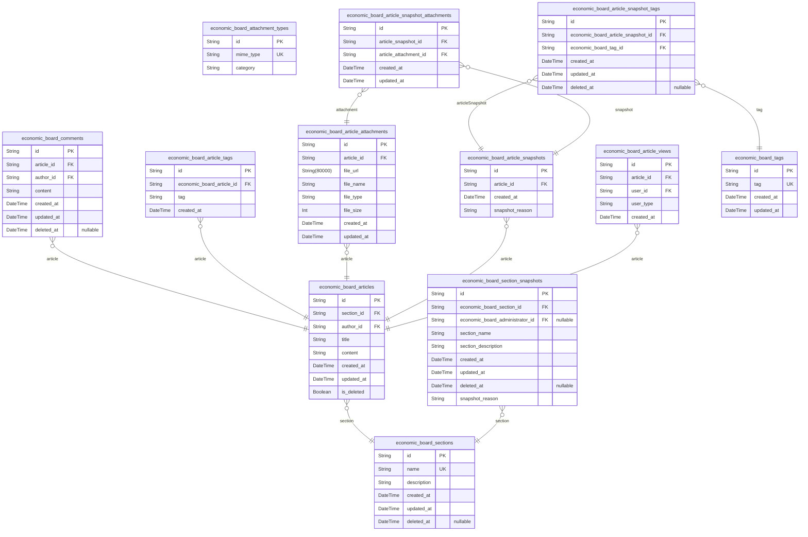

# Prisma Markdown

> Generated by [`prisma-markdown`](https://github.com/samchon/prisma-markdown)

- [Systematic](#systematic)
- [Articles](#articles)

## Systematic

```mermaid
erDiagram
"economic_board_citizens" {
  String id PK
  String email UK
  String password_hash
  String display_name "nullable"
  String bio "nullable"
  Boolean is_banned
  String ban_reason "nullable"
  DateTime created_at
  DateTime updated_at
}
"economic_board_administrators" {
  String id PK
  String email UK
  String password_hash
  String display_name "nullable"
  String bio "nullable"
  Boolean is_banned
  String ban_reason "nullable"
  String admin_request_status
  String admin_request_reason "nullable"
  DateTime created_at
  DateTime updated_at
}
"economic_board_super_administrators" {
  String id PK
}
"economic_board_citizen_sessions" {
  String id PK
  String citizen_id FK
  String access_token
  String refresh_token
  String device_fingerprint
  String ip
  String href
  String referrer
  DateTime created_at
  DateTime expired_at
}
"economic_board_administrator_sessions" {
  String id PK
  String administrator_id FK
  String ip
  String href
  String referrer
  DateTime created_at
  DateTime expired_at
}
"economic_board_super_administrator_sessions" {
  String id PK
  String administrator_id FK
  String access_token
  String refresh_token
  String device_fingerprint "nullable"
  DateTime created_at
  DateTime expired_at
  String ip_address "nullable"
}
"economic_board_citizen_password_resets" {
  String id PK
  String user_id FK
  String token
  DateTime expires_at
}
"economic_board_citizen_email_verifications" {
  String id PK
  String citizen_id FK,UK
  String token UK
  DateTime expires_at
  DateTime created_at
  DateTime updated_at
  Boolean is_used
}
"economic_board_administrator_audit_logs" {
  String id PK
  String actor_id FK
  String target_id FK "nullable"
  String action_type
  String reason "nullable"
  String ip_address
  DateTime created_at
  DateTime updated_at
}
"economic_board_administrator_password_resets" {
  String id PK
  String administrator_id FK
  String token UK
  DateTime expires_at
  DateTime created_at
}
"economic_board_super_administrator_password_resets" {
  String id PK
  String super_administrator_id FK
  String token UK
  DateTime expires_at
  DateTime created_at
}
"economic_board_citizen_sessions" }o--|| "economic_board_citizens" : citizen
"economic_board_administrator_sessions" }o--|| "economic_board_administrators" : administrator
"economic_board_super_administrator_sessions" }o--|| "economic_board_administrators" : administrator
"economic_board_citizen_password_resets" }o--|| "economic_board_citizens" : citizen
"economic_board_citizen_email_verifications" |o--|| "economic_board_citizens" : citizen
"economic_board_administrator_audit_logs" }o--|| "economic_board_administrators" : actor
"economic_board_administrator_audit_logs" }o--o| "economic_board_citizens" : target
"economic_board_administrator_password_resets" }o--|| "economic_board_administrators" : administrator
"economic_board_super_administrator_password_resets" }o--|| "economic_board_administrators" : superAdministrator
```

### `economic_board_citizens`

Main actor table for standard users. Stores email, password_hash,
display_name, bio, and account status. Email is unique and required. All
citizens have is_admin=false and is_super_admin=false.

Properties as follows:

- `id`: Primary Key.
- `email`: User's email address for authentication. Must be unique across the system.
- `password_hash`: BCrypt hash of the user's password. Never stored in plain text.
- `display_name`
  > Public-facing name displayed on articles and comments. Can be changed by
  > user.
- `bio`: Optional short biography or introduction about the user.
- `is_banned`
  > Flag indicating if the account has been banned. When true, user cannot
  > log in and all sessions are revoked.
- `ban_reason`
  > Reason provided by administrator for banning this user. Must be at least
  > 10 characters when is_banned is true.
- `created_at`: Timestamp when the user account was created. Set once and never changed.
- `updated_at`
  > Timestamp of the last modification to the user profile. Updated on
  > display_name, bio, or password changes.

### `economic_board_administrators`

Main actor table for standard administrators (not super administrators).
Stores email, password hash, account status, and admin-specific fields.
This table is exclusively for users promoted to administrator role but
not super administrator. It has its own session, password reset, and
audit trail records. All super administrators are stored in a separate
table, economic_board_super_administrators, following the actor
separation principle.

Properties as follows:

- `id`: Primary Key.
- `email`: Unique email address for authentication. Must be verified before login.
- `password_hash`: BCrypt-hashed password. Never stored in plain text.
- `display_name`
  > Public display name shown on articles and comments. Can be modified by
  > user.
- `bio`
  > Optional self-description briefly explaining the user's expertise or
  > interest.
- `is_banned`
  > If true, user is banned and cannot authenticate. True by default when
  > banned.
- `ban_reason`
  > Reason provided by the banning administrator. Required when is_banned is
  > true.
- `admin_request_status`
  > Status of the administrator promotion request from citizen: pending,
  > approved, or rejected.
- `admin_request_reason`
  > The reason provided by the citizen when requesting promotion to
  > administrator.
- `created_at`: Timestamp when the administrator account was created.
- `updated_at`: Timestamp when the administrator record was last updated.

### `economic_board_super_administrators`

This table is marked for deletion. It is a redundant duplicate of
economic_board_administrators and violates the single-actor-per-table
principle. Do not create this table. The superAdministrator role is
managed via is_super_admin flag in economic_board_administrators.

Properties as follows:

- `id`: Primary Key.

### `economic_board_citizen_sessions`

Session table for citizen users. Stores JWT access token, refresh token,
device fingerprint, and expiration times. Tied to citizen via user_id.
Append-only audit trail of login events, managed through authentication
flows, not direct user CRUD.

Properties as follows:

- `id`: Primary Key.
- `citizen_id`: Reference to the citizen user account. [economic_board_citizens.id](#economic_board_citizens).
- `access_token`: JWT access token issued for this session.
- `refresh_token`: JWT refresh token issued for this session, stored as hash for security.
- `device_fingerprint`
  > Unique identifier derived from browser/user agent properties to detect
  > device changes.
- `ip`: IP address from which the session was initiated.
- `href`: Full URL of the page from which the login request originated.
- `referrer`: Referer header value indicating previous website or page.
- `created_at`: Timestamp when the session was created. Always required.
- `expired_at`: Timestamp when this session expires. Default is 14 days from creation.

### `economic_board_administrator_sessions`

Session table for administrator and super administrator users. Stores
connection metadata (IP, href, referrer) and session expiration times.
Append-only audit trail of login events. Linked to
economic_board_administrators via foreign key.

Properties as follows:

- `id`: Primary Key.
- `administrator_id`: Administrator's [economic_board_administrators.id](#economic_board_administrators).
- `ip`: Client IP address of login session.
- `href`: Current page URL when session was created.
- `referrer`: Referrer URL that led to login.
- `created_at`: Timestamp when the session was created.
- `expired_at`: Timestamp when the session expires. Default is 7 days from created_at.

### `economic_board_super_administrator_sessions`

Session table for super administrator users. Stores JWT access token,
refresh token, device fingerprint, and expiration times. Tied to super
administrator via user_id. This table is redundant with
economic_board_administrator_sessions and will be removed in next
version.

Properties as follows:

- `id`: Primary Key.
- `administrator_id`
  > Reference to the administrator actor table. This is a technical
  > placeholder; in reality, this table should not exist and super
  > administrators share the same session table as administrators.
- `access_token`: JWT access token for session authentication.
- `refresh_token`: JWT refresh token stored in secure cookie.
- `device_fingerprint`: Unique identifier for the device used in the session.
- `created_at`: Timestamp when the session was created.
- `expired_at`: Timestamp when the session expires. Never null per security policy.
- `ip_address`: IP address from which the session was initiated.

### `economic_board_citizen_password_resets`

Password reset tokens for citizen users. Contains a secure token,
expiration timestamp, and user_id. Generated when a citizen requests a
password reset. Token is single-use and becomes invalid after use or
expiration. Tokens are purged after successful reset or expiration, not
logically deleted.

Properties as follows:

- `id`: Primary Key.
- `user_id`
  > References the citizen user requesting the password reset. {@link
  > economic_board_citizens.id}.
- `token`
  > Secure, randomly generated password reset token. Must be unguessable and
  > unique per request.
- `expires_at`
  > Expiration timestamp for the password reset token. Token becomes invalid
  > after this time.

### `economic_board_citizen_email_verifications`

Email verification tokens for citizens. Contains secure token, expiration
timestamp, and user_id. Sent during registration and re-sent upon
request. This is a transient verification table with one-time use tokens.
Records are deleted after successful verification or expiration.

Properties as follows:

- `id`: Primary Key.
- `citizen_id`
  > References the citizen account that requested verification. {@link
  > economic_board_citizens.id}
- `token`
  > Unique, secure, random token for email verification. Must be
  > cryptographically secure and URL-safe.
- `expires_at`
  > Expiration timestamp for the verification token. After this time, the
  > token is invalid and must be regenerated.
- `created_at`: Timestamp when the verification token was generated.
- `updated_at`: Timestamp when the token was last updated (e.g., resent).
- `is_used`
  > Flag indicating whether the token has been successfully used to verify
  > the email address.

### `economic_board_administrator_audit_logs`

Audit trail for all administrative actions. Records actor_id, target_id,
action_type (ban, promote, delete, etc.), reason, timestamp, and IP
address. Captures all actions by administrators and super administrators.
Each record is immutable and append-only. Used for forensic
accountability, regulatory compliance, and privilege monitoring.

Properties as follows:

- `id`: Primary Key.
- `actor_id`
  > The administrator who performed the action. References
  > economic_board_administrators.id.
- `target_id`
  > The user (citizen or administrator) who was acted upon. References
  > economic_board_citizens.id or economic_board_administrators.id. Nullable
  > when action targets system resources, not users.
- `action_type`
  > Type of administrative action performed. Values: 'ban', 'unban',
  > 'promote', 'demote', 'delete_article', 'delete_comment',
  > 'delete_section', 'approve_admin_request', 'reject_admin_request'.
- `reason`
  > The administrative reason for the action (e.g., policy violation,
  > inappropriate content). Limited to 500 characters by application logic.
- `ip_address`
  > IP address from which the action was performed. Used for geo-location and
  > abuse detection.
- `created_at`: Timestamp when the audit log entry was created. Always set by server.
- `updated_at`
  > Timestamp of the last update to the log entry. Always equal to created_at
  > as entries are immutable.

### `economic_board_administrator_password_resets`

Password reset tokens for administrator accounts. Stores secure reset
tokens with expiration timestamps. Used during password recovery flow for
administrator type users. Each token is single-use and tied to one
administrator. Separate from citizen password reset table to enforce
actor-specific security boundaries.

Properties as follows:

- `id`: Primary Key.
- `administrator_id`
  > References the administrator account requesting the password reset.
  > [economic_board_administrators.id](#economic_board_administrators).
- `token`
  > Secure, random, single-use token used to reset the password. Must be
  > cryptographically random and URL-safe.
- `expires_at`
  > DateTime when this reset token expires and becomes invalid. After this
  > time, the token cannot be used for password reset.
- `created_at`: DateTime when the reset request was created and token was generated.

### `economic_board_super_administrator_password_resets`

Password reset tokens for super administrators. Stores unique reset
tokens with expiration dates to allow secure password recovery. Each
token is single-use and expires after a set time window to maintain
security. References the superAdministrator actor via foreign key to
economic_board_administrators.

This table is essential for authentication workflows and follows the
session pattern: ephemeral tokens tied to actor authentication state,
managed entirely by system logic, not direct user interaction.

[economic_board_administrators.id](#economic_board_administrators)

Properties as follows:

- `id`: Primary Key.
- `super_administrator_id`
  > References the superAdministrator actor account that requested the
  > password reset. [economic_board_administrators.id](#economic_board_administrators)
- `token`
  > Secure, randomly generated token used for password reset. Must be unique
  > per reset request.
- `expires_at`
  > Timestamp when this password reset token expires. After this time, the
  > token becomes invalid and cannot be used.
- `created_at`: Timestamp when the password reset token was generated.

## Articles

```mermaid
erDiagram
"economic_board_articles" {
  String id PK
  String section_id FK
  String author_id FK
  String title
  String content
  DateTime created_at
  DateTime updated_at
  Boolean is_deleted
}
"economic_board_sections" {
  String id PK
  String name UK
  String description
  DateTime created_at
  DateTime updated_at
  DateTime deleted_at "nullable"
}
"economic_board_comments" {
  String id PK
  String article_id FK
  String author_id FK
  String content
  DateTime created_at
  DateTime updated_at
  DateTime deleted_at "nullable"
}
"economic_board_article_tags" {
  String id PK
  String economic_board_article_id FK
  String tag
  DateTime created_at
}
"economic_board_article_attachments" {
  String id PK
  String article_id FK
  String(80000) file_url
  String file_name
  String file_type
  Int file_size
  DateTime created_at
  DateTime updated_at
}
"economic_board_article_snapshots" {
  String id PK
  String article_id FK
  DateTime created_at
  String snapshot_reason
}
"economic_board_section_snapshots" {
  String id PK
  String economic_board_section_id FK
  String economic_board_administrator_id FK "nullable"
  String section_name
  String section_description
  DateTime created_at
  DateTime updated_at
  DateTime deleted_at "nullable"
  String snapshot_reason
}
"economic_board_article_views" {
  String id PK
  String article_id FK
  String user_id FK
  String user_type
  DateTime created_at
}
"economic_board_tags" {
  String id PK
  String tag UK
  DateTime created_at
  DateTime updated_at
}
"economic_board_attachment_types" {
  String id PK
  String mime_type UK
  String category
}
"economic_board_article_snapshot_tags" {
  String id PK
  String economic_board_article_snapshot_id FK
  String economic_board_tag_id FK
  DateTime created_at
  DateTime updated_at
  DateTime deleted_at "nullable"
}
"economic_board_article_snapshot_attachments" {
  String id PK
  String article_snapshot_id FK
  String article_attachment_id FK
  DateTime created_at
  DateTime updated_at
}
"economic_board_articles" }o--|| "economic_board_sections" : section
"economic_board_comments" }o--|| "economic_board_articles" : article
"economic_board_article_tags" }o--|| "economic_board_articles" : article
"economic_board_article_attachments" }o--|| "economic_board_articles" : article
"economic_board_article_snapshots" }o--|| "economic_board_articles" : article
"economic_board_section_snapshots" }o--|| "economic_board_sections" : section
"economic_board_article_views" }o--|| "economic_board_articles" : article
"economic_board_article_snapshot_tags" }o--|| "economic_board_article_snapshots" : articleSnapshot
"economic_board_article_snapshot_tags" }o--|| "economic_board_tags" : tag
"economic_board_article_snapshot_attachments" }o--|| "economic_board_article_snapshots" : snapshot
"economic_board_article_snapshot_attachments" }o--|| "economic_board_article_attachments" : attachment
```

### `economic_board_articles`

Main article entries with title, content, author, and section reference.
Articles represent user-submitted content within a section. Articles can
be edited by the original author within the edit window (2 hours) and
deleted by authors or administrators. Deleted articles retain their
record with is_deleted=true for audit purposes. Comments and attachments
are linked via foreign keys but stored separately to maintain
normalization.

Properties as follows:

- `id`: Primary Key.
- `section_id`
  > Reference to the section this article belongs to. {@link
  > economic_board_sections.id}
- `author_id`
  > Reference to the citizen who created this article. {@link
  > economic_board_citizens.id}
- `title`
  > Title of the article. Must be between 5 and 200 characters, trimmed of
  > whitespace.
- `content`
  > Full content of the article. Must be at least 10 characters, up to 50,000
  > characters.
- `created_at`
  > Timestamp of when the article was created. Always set to server time
  > (Asia/Seoul).
- `updated_at`
  > Timestamp of when the article was last edited. Updated on every content
  > modification.
- `is_deleted`
  > Soft delete flag. If true, article is hidden from public views but
  > preserved in database for audit purposes.

### `economic_board_sections`

Content sections where articles are categorized and managed by
administrators. Each section defines a top-level category for organizing
articles (e.g., Politics, Economy). Administrators create, edit, and
delete sections independently. Sections have unique names to prevent
ambiguity. Soft deletion is implemented via deleted_at to preserve
history for associated articles without cascading deletion.

Properties as follows:

- `id`: Primary Key.
- `name`
  > Unique name of the section (e.g., 'Economy', 'Politics'). Must be unique
  > across all active sections. Case-insensitive comparison enforced by
  > unique index.
- `description`
  > Brief description explaining the section's purpose and scope. Used in UI
  > to guide users on content expectations.
- `created_at`: Timestamp when the section was created. Immutable.
- `updated_at`
  > Timestamp when the section was last updated. Updated automatically on any
  > edit.
- `deleted_at`
  > Timestamp when the section was logically deleted. NULL indicates active
  > section. Non-NULL indicates deleted status. Used for soft deletion and
  > audit.

### `economic_board_comments`

User comments attached to articles, linked by article_id and author_id.
Each comment is an independent entity that can be searched, filtered,
edited, and deleted by its author or moderated by administrators.
Comments are not owned by articles but are associated with them via
foreign key, enabling cross-article comment queries and moderation
workflows. Always references citizen from Systematic component. Track
creation and update times for audit. Allow soft deletion for compliance
and moderation workflows. Support full-text search on content for user
search functionality. Never store JSON, arrays, or derived values. Follow
3NF with no transitive dependencies.

For API operations:
- POST /comments creates a new comment
- GET /comments?article_id=...&limit=20&sort=newest lists comments by
article
- PATCH /comments/{id} edits comment (within 60-minute window)
- DELETE /comments/{id} deletes comment (deleted_at timestamp)
- GET /search/comments?q=... searches comment content using GIN index

Relationships:
- Comment is owned by citizen only; administrators can delete but are not
owners as per permission matrix.
- Comments do not form a hierarchy; replies are out of scope for this
version.

Properties as follows:

- `id`: Primary Key.
- `article_id`
  > The article this comment is associated with. {@link
  > economic_board_articles.id}
- `author_id`: The citizen who authored this comment. [economic_board_citizens.id](#economic_board_citizens)
- `content`
  > Plain text content of the comment, up to 1000 characters. Required and
  > trimmed of whitespace.
- `created_at`
  > Timestamp when comment was created. Always recorded in Asia/Seoul
  > timezone.
- `updated_at`
  > Timestamp when comment was last edited. Updated on every edit. Used for
  > edit window validation (1-hour).
- `deleted_at`
  > Timestamp when comment was soft-deleted. If null, comment is active. Used
  > for moderation and audit purposes.

### `economic_board_article_tags`

Junction table that associates articles with their tags in a many-to-many
relationship. Each row represents one tag applied to one article,
enabling efficient filtering and preventing tag duplication. Tag strings
are stored as-is to support free-form user input while maintaining
referential integrity through composite unique index. Used for search
filtering and content categorization.

Properties as follows:

- `id`: Primary Key.
- `economic_board_article_id`
  > References the article being tagged. [economic_board_articles.id](#economic_board_articles).
  > Required for normalization.
- `tag`
  > The actual tag string provided by the user. Free-form text, trimmed of
  > whitespace on input. Maximum 50 characters as per requirements.
  > Case-insensitive uniqueness enforced via unique index.
- `created_at`: Timestamp when this tag was first applied to the article.

### `economic_board_article_attachments`

Metadata for files and images attached to articles, including URL, type,
and size. This is a subsidiary entity—managed exclusively through
articles and not directly by users. Each file or image upload creates a
separate record. Retained for audit purposes even after article deletion.

Business context: This table holds critical metadata for media
attachments (files and images) uploaded by users. The system tracks:
exact file URL (for CDN access), original filename, MIME type (e.g.,
image/jpeg), file size in bytes, and upload timestamp. Used by the
frontend to display previews and enable downloads. Must be immutable
after upload.

Relationships:
- Belongs to one article (one-to-many) via article_id
- Used in article views to render attachments
- Audited via economic_board_administrator_audit_logs when manually deleted

Properties as follows:

- `id`: Primary Key.
- `article_id`
  > Reference to the parent article this attachment belongs to. {@link
  > economic_board_articles.id}.
- `file_url`: CDN-accessible URL where the file or image is stored.
- `file_name`: Original filename as uploaded by the user. Preserved exactly for download.
- `file_type`
  > MIME type of the file (e.g., image/png, application/pdf). Determined by
  > file headers, not extension.
- `file_size`
  > Size of the file in bytes. Used for bandwidth estimation and quota
  > tracking.
- `created_at`: Timestamp when the file was uploaded. Set server-side on insert.
- `updated_at`
  > Timestamp last modified. Always equals created_at unless explicitly
  > edited (rare). Set on insert and update.

### `economic_board_article_snapshots`

Point-in-time snapshots of article state for audit and historical
retrieval. Captures the exact state of an article at the moment it was
saved, preserving changes for compliance and version tracking. The
original economic_board_articles record may be edited or deleted, but
snapshots remain immutable. Used to display historical versions of
articles and audit editing activity. Reference original article via
article_id. This table only tracks the snapshot creation context - tags
and attachments are stored in separate subsidiary tables:
economic_board_article_snapshot_tags and
economic_board_article_snapshot_attachments.

Properties as follows:

- `id`: Primary Key.
- `article_id`
  > Reference to the original article being snapshotted. {@link
  > economic_board_articles.id}.
- `created_at`
  > Timestamp when this snapshot was created (not the original article
  > creation time).
- `snapshot_reason`
  > Reason for snapshot creation: "initial", "edit", "deletion",
  > "admin_delete".

### `economic_board_section_snapshots`

Point-in-time snapshots of section name and description to audit how
sections evolved over time. Each snapshot records the exact state of a
section at the moment it was modified. References the original section
via section_id. Used to reconstruct historical versions of sections,
track changes, and ensure accountability in administrative edits.
Snapshots are append-only and never modified after creation.

Properties as follows:

- `id`: Primary Key.
- `economic_board_section_id`
  > Reference to the original section record. {@link
  > economic_board_sections.id}
- `economic_board_administrator_id`
  > The administrator who triggered this snapshot via edit. {@link
  > economic_board_administrators.id}
- `section_name`: The name of the section at the time of this snapshot.
- `section_description`: The description of the section at the time of this snapshot.
- `created_at`
  > Timestamp when this snapshot was created. Always matches the edit
  > timestamp of the source section.
- `updated_at`
  > Timestamp for consistency with other models. Always equals created_at
  > since snapshots are immutable.
- `deleted_at`
  > Always NULL; snapshots are never soft-deleted as they represent
  > historical audit data.
- `snapshot_reason`
  > Reason for the snapshot creation (e.g. 'section edited', 'section
  > deleted').

### `economic_board_article_views`

Tracks views of articles by users for analytics and popularity ranking.
Each record represents a unique view by a user during a session. Data is
used to compute popular articles, trending content, and user engagement
metrics. Note: user_id references either economic_board_citizens or
economic_board_administrators via polymorphic relationship using
user_type and user_id. Views are timestamped to enable time-series
analysis and hourly/daily popularity tracking.

Properties as follows:

- `id`: Primary Key.
- `article_id`: References the article being viewed. [economic_board_articles.id](#economic_board_articles)
- `user_id`
  > References the viewing user (either citizen or administrator). {@link
  > economic_board_citizens.id} or [economic_board_administrators.id](#economic_board_administrators)
- `user_type`
  > Type of user: 'citizen' or 'administrator'. Required to disambiguate
  > polymorphic reference when user_id is used across multiple tables.
- `created_at`
  > Timestamp of when the view occurred. Used for time-series analytics,
  > trend analysis, and calculating view counts over time periods.

### `economic_board_tags`

Master catalog of unique tags used across articles. Each tag is stored
once, and article_tags table references this table via tag_id. This
ensures 3NF compliance, avoids string duplication, and enables consistent
tagging and filtering.

Tags are managed independently by the system: they are auto-created when
first used, and preserved even if no article references them. Used in
search, filtering, and analytics. Never deleted unless manually purged by
admin.

Properties as follows:

- `id`: Primary Key.
- `tag`
  > The normalized tag string, stored in lowercase. Must be unique across the
  > system. Max 50 characters. Trims whitespace on insertion. Example:
  > 'economics'.
- `created_at`: Timestamp when the tag was first created in the system.
- `updated_at`
  > Timestamp of the last update. Updates when the tag string is edited
  > (though edits are rare).

### `economic_board_attachment_types`

Master catalog of attachment MIME type categorizations (e.g., image/jpeg
→ image) for standardized handling across the system. This lookup table
normalizes MIME types into categorical groups to avoid redundancy in
article_attachments. When a file is uploaded, its MIME type is stored as
a string here and referenced in article_attachments, ensuring consistent
handling of file types (image, document, video, etc.) without duplicating
full MIME type strings in every attachment record.

Used in article_attachments to categorize attachments for UI rendering
and filtering. For example, when displaying 'image' category, the system
queries this table for all mime_types mapped to 'image', then finds all
article_attachments matching those mime_types.

Must be seeded with common MIME types from the file type allowlist:
text/plain, application/pdf, image/jpeg, image/png, image/gif,
image/webp, video/mp4, audio/mp3, application/zip,
application/octet-stream, etc.

Properties as follows:

- `id`: Primary Key.
- `mime_type`
  > The complete MIME type string (e.g., 'image/jpeg', 'application/pdf').
  > Must be unique and match exactly the Content-Type header from upload.
  > This is the primary key (not ID) to ensure referential integrity and
  > avoid duplication.
- `category`
  > The standardized category group for this MIME type. Values are: 'image',
  > 'document', 'video', 'audio', 'archive', or 'other'. Maps broad
  > categories for UI filtering and display logic.

### `economic_board_article_snapshot_tags`

Snapshot of tag associations for a specific article version. Stores which
tags were applied to the article at the exact moment the article snapshot
was created. Each record links a snapshot to one tag. This table is
necessary for 1NF compliance as tags are a repeating group that cannot be
stored as comma-separated strings.

This table is a subsidiary entity, only accessed via parent article
snapshots. It is never created, updated, or deleted independently by
users. It supports audit trails and historical tag analysis for article
revisions.

Properties as follows:

- `id`: Primary Key.
- `economic_board_article_snapshot_id`
  > Reference to the article snapshot this tag association belongs to. {@link
  > economic_board_article_snapshots.id}.
- `economic_board_tag_id`: Reference to the tag being applied. [economic_board_tags.id](#economic_board_tags).
- `created_at`: When this tag association was recorded in the snapshot.
- `updated_at`
  > When this tag association was last updated (typically same as created_at,
  > for consistency).
- `deleted_at`: Soft delete timestamp. Null if not deleted.

### `economic_board_article_snapshot_attachments`

Junction table for attaching files and images to article snapshots. Each
record links one article snapshot (economic_board_article_snapshots.id)
to one attachment (economic_board_article_attachments.id). This table is
required for 1NF compliance as attachments are a repeating group that
cannot be stored as arrays or JSON. Preserves the exact state of
attachments at the time the article snapshot was created. This table is
not accessed directly by users but is used internally for historical
versioning and audit purposes. Linked to @\link
economic_board_article_snapshots and @\link
economic_board_article_attachments.

Properties as follows:

- `id`: Primary Key.
- `article_snapshot_id`
  > Reference to the article snapshot this attachment belongs to. A snapshot
  > may have multiple attachments. @\link
  > economic_board_article_snapshots.id.
- `article_attachment_id`
  > Reference to the actual file attachment. This links to a single
  > attachment record in economic_board_article_attachments. @\link
  > economic_board_article_attachments.id.
- `created_at`: Timestamp when this snapshot-attachment link was created.
- `updated_at`
  > Timestamp when this snapshot-attachment link was last updated. Always
  > equal to created_at since this table is append-only.
