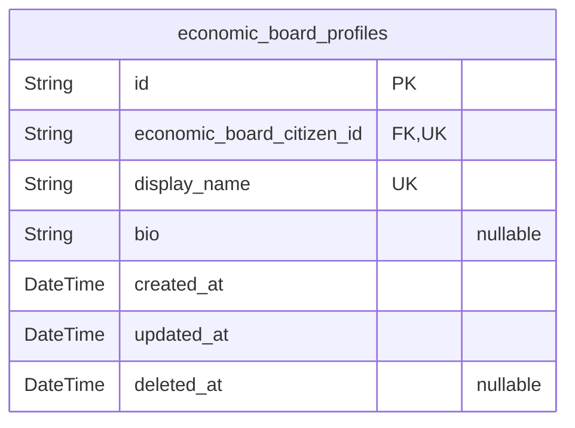
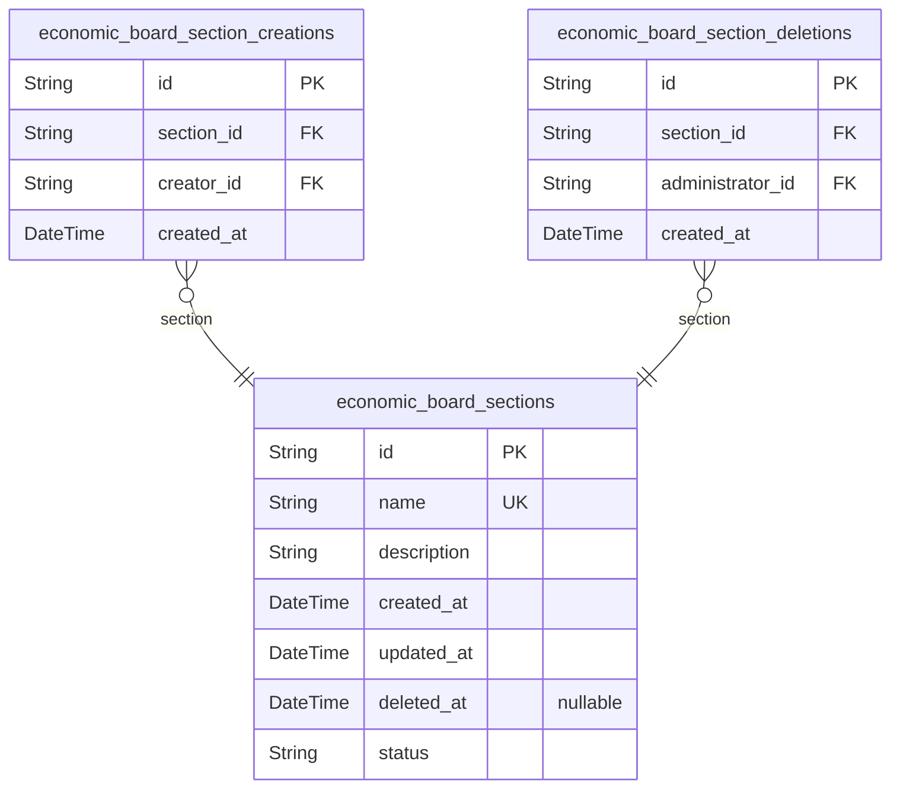
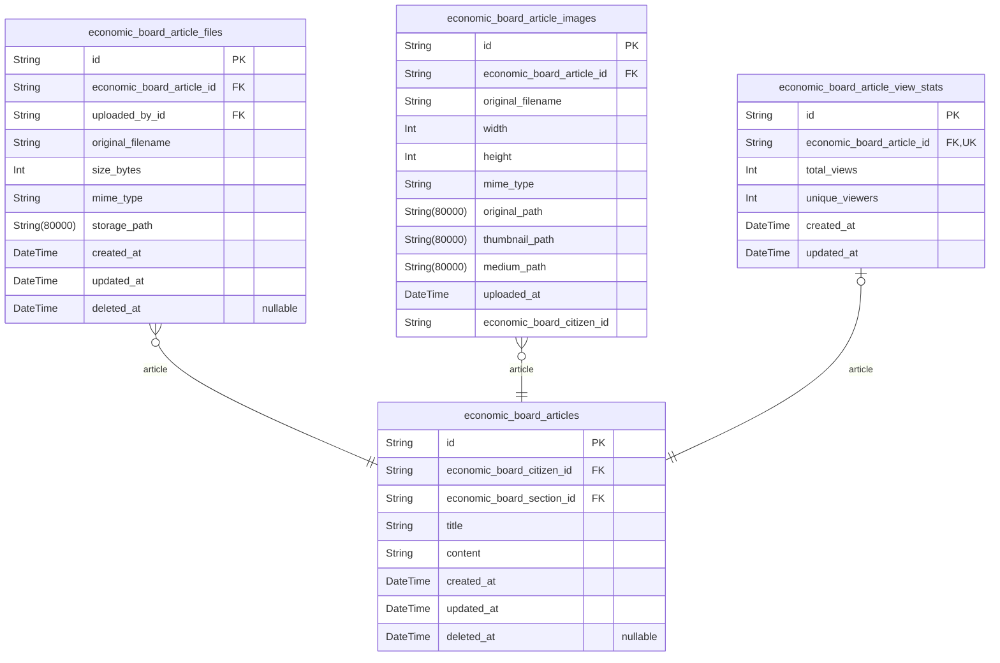
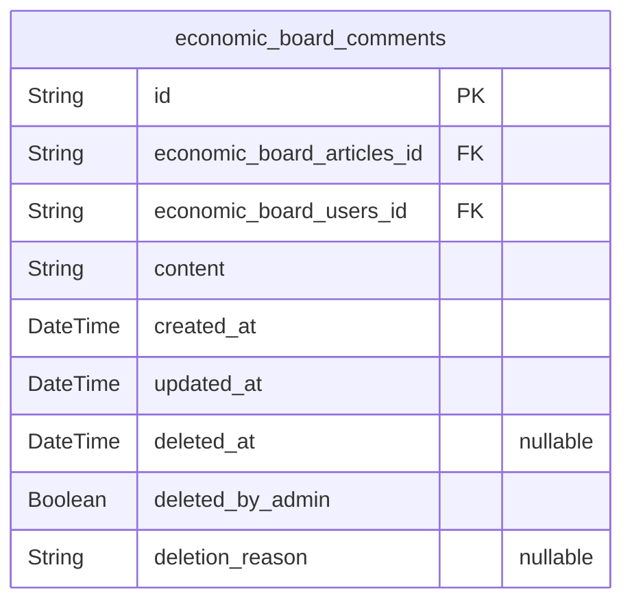
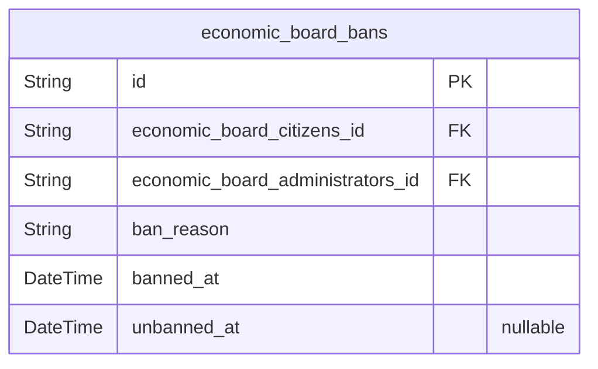
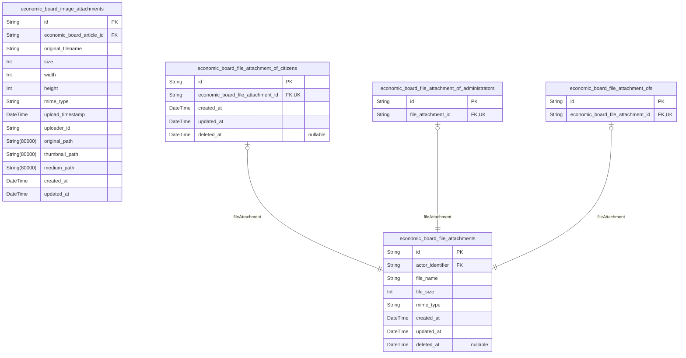
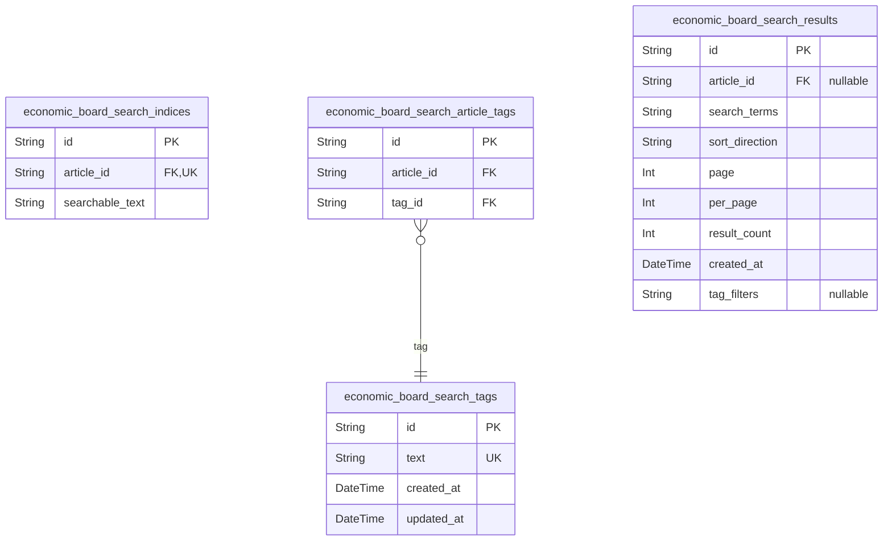
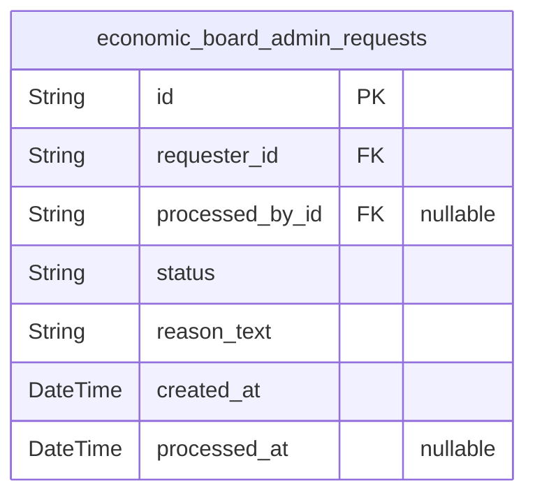

# Prisma Markdown

> Generated by [`prisma-markdown`](https://github.com/samchon/prisma-markdown)

- [Actors](#actors)
- [Profile](#profile)
- [Section](#section)
- [Article](#article)
- [Comment](#comment)
- [Ban](#ban)
- [Attachment](#attachment)
- [Search](#search)
- [AdminRequest](#adminrequest)

## Actors

```mermaid
erDiagram
"economic_board_citizens" {
  String id PK
  String email UK
  String password_hash
  String display_name UK
  String bio "nullable"
  DateTime created_at
  DateTime updated_at
  DateTime deleted_at "nullable"
  DateTime banned_at "nullable"
  Boolean is_verified
  Boolean is_banned
}
"economic_board_citizen_sessions" {
  String id PK
  String economic_board_citizen_id FK
  String ip
  String href
  String referrer
  DateTime created_at
  DateTime expired_at
}
"economic_board_citizen_email_verifications" {
  String id PK
  String citizen_id UK
  String token UK
  DateTime expires_at
  DateTime created_at
  DateTime used_at "nullable"
}
"economic_board_citizen_password_resets" {
  String id PK
  String economic_board_citizen_id FK,UK
  String token UK
  DateTime expires_at
  DateTime created_at
}
"economic_board_administrators" {
  String id PK
  String email UK
  String password_hash
  String display_name
  String bio "nullable"
  String status
  DateTime created_at
  DateTime updated_at
  DateTime deleted_at "nullable"
}
"economic_board_administrator_sessions" {
  String id PK
  String administrator_id FK
  String ip
  String href
  String referrer "nullable"
  DateTime created_at
  DateTime expired_at
}
"economic_board_administrator_email_verifications" {
  String id PK
  String economic_board_administrator_id FK
  String token UK
  DateTime created_at
  DateTime expired_at
  DateTime deleted_at "nullable"
}
"economic_board_administrator_password_resets" {
  String id PK
  String administrator_id FK
  String token UK
  DateTime expires_at
  DateTime created_at
}
"economic_board_super_administrators" {
  String id PK
  String email UK
  String password_hash
  String display_name
  String bio "nullable"
  String status
  DateTime created_at
  DateTime updated_at
  DateTime deleted_at "nullable"
}
"economic_board_super_administrator_sessions" {
  String id PK
  String super_administrator_id FK
  String ip
  String(80000) href
  String(80000) referrer
  DateTime created_at
  DateTime expired_at
}
"economic_board_super_administrator_email_verifications" {
  String id PK
  String economic_board_super_administrator_id FK,UK
  String token UK
  DateTime expires_at
  Boolean used
}
"economic_board_super_administrator_password_resets" {
  String id PK
  String economic_board_super_administrator_id FK
  String token UK
  DateTime expires_at
  DateTime created_at
  DateTime deleted_at "nullable"
}
"economic_board_citizen_sessions" }o--|| "economic_board_citizens" : citizen
"economic_board_citizen_password_resets" |o--|| "economic_board_citizens" : citizen
"economic_board_administrator_sessions" }o--|| "economic_board_administrators" : administrator
"economic_board_administrator_email_verifications" }o--|| "economic_board_administrators" : administrator
"economic_board_administrator_password_resets" }o--|| "economic_board_administrators" : administrator
"economic_board_super_administrator_sessions" }o--|| "economic_board_super_administrators" : superAdministrator
"economic_board_super_administrator_email_verifications" |o--|| "economic_board_super_administrators" : superAdministrator
"economic_board_super_administrator_password_resets" }o--|| "economic_board_super_administrators" : superAdministrator
```

### `economic_board_citizens`

Main table storing citizen account information including email, password
hash, display name, bio, and account status (active/banned/deleted).

Properties as follows:

- `id`: Primary Key.
- `email`
  > Unique email address for authentication. Must be verified before account
  > activation.
- `password_hash`: bcrypt hash of the user's password for secure authentication.
- `display_name`
  > Publicly visible name for profile presentation. Must be unique among all
  > citizens.
- `bio`
  > Optional personal bio text displayed on user profile. Limited to 500
  > characters.
- `created_at`
  > Timestamp when the citizen account was created. Always set to current
  > server time in Asia/Seoul timezone.
- `updated_at`
  > Timestamp when the citizen account was last updated. Automatically
  > updated on any profile change.
- `deleted_at`
  > Timestamp when the account was deleted (soft delete). Null indicates
  > active account.
- `banned_at`
  > Timestamp when the account was banned. Null indicates account is not
  > banned.
- `is_verified`
  > Boolean flag indicating whether email verification has been completed.
  > Defaults to false on account creation.
- `is_banned`
  > Boolean flag indicating whether account is currently banned. Maintained
  > for query performance and synchronization with banned_at timestamp.

### `economic_board_citizen_sessions`

Stores JWT access and refresh tokens for citizen sessions, with creation
and expiration timestamps for session management.

This is a session table that maintains the authentication state of
citizens. Each record represents a single login session and contains
connection metadata to track where and when users logged in. Session
tables only maintain connection context and temporal information - they
do not store user profile data or authentication credentials.

Session records are created during authentication and invalidated during
logout or expiration. The expired_at field ensures sessions have limited
lifetimes for security, while the created_at field allows auditing of
login patterns.

This table is referenced exclusively by the authentication flow and is
never directly accessed by business logic or frontend interfaces.
Instead, users interact with the system using JWT tokens obtained from
these sessions.

Properties as follows:

- `id`: Primary Key.
- `economic_board_citizen_id`: The citizen who owns this session. [economic_board_citizens.id](#economic_board_citizens).
- `ip`
  > The IP address from which the session was initiated. Used for security
  > auditing and geolocation purposes.
- `href`
  > The URL path the user was visiting when initiating the session. Tracks
  > user entry point into the system.
- `referrer`
  > The previous web page that linked to the authentication endpoint. Used
  > for traffic analysis and security detection.
- `created_at`
  > Timestamp when this session was created. This field is mandatory for all
  > session records to enable auditing of login events.
- `expired_at`
  > Timestamp when this session expires. Sessions have a limited lifetime for
  > security. When expired_at is reached, the session is no longer valid and
  > the user must re-authenticate.

### `economic_board_citizen_email_verifications`

Holds email verification tokens for citizen registration, enabling secure
confirmation of email ownership before account activation. This table
stores temporary verification tokens that citizens use to confirm their
email addresses during registration. Each token has a limited lifespan
enforced by an expiration timestamp, ensuring tokens cannot be used
indefinitely. Once verified, the token is invalidated and no longer
usable. This table maintains the security of the registration process by
preventing unauthorized email address changes.

This table is exclusively used for citizen verification and is not shared
with administrators or super administrators. Foreign key relationships
with the citizen actor (economic_board_citizens) are managed by the
Authorization Agent and not modeled in this schema since the actor table
is in a separate component.

Properties as follows:

- `id`: Primary Key.
- `citizen_id`
  > The citizen account ID that this verification token belongs to. This
  > references the citizen actor account that is undergoing email
  > verification.
- `token`
  > The unique verification token generated for email confirmation. This
  > token is sent to the user's email address and must be presented to
  > complete registration.
- `expires_at`
  > The timestamp when this verification token expires and becomes invalid.
  > Tokens must be used before this time to complete email verification.
- `created_at`: The timestamp when this verification token was created.
- `used_at`
  > The timestamp when this token was successfully used to verify the email
  > address. Null if the token has not been used yet.

### `economic_board_citizen_password_resets`

Stores password reset tokens for citizens with expiration timestamps to
enable secure password recovery workflows. Each record represents a
single password reset request initiated by a citizen. The token is a
unique, random string that must be presented to reset the password. The
expires_at field ensures tokens are temporary and invalid after a set
period (e.g., 1 hour). When used, the record is deleted to prevent replay
attacks. This table is only referenced by the authentication service and
has no direct user-facing interface. Foreign key to
economic_board_citizens.id. The table follows the session stance because
it tracks a specific authentication workflow tied to the citizen actor.

Related entities:
- [economic_board_citizens](#economic_board_citizens) - citizen account owning this reset
request
- [economic_board_citizen_sessions](#economic_board_citizen_sessions) - other authentication session
records

Properties as follows:

- `id`: Primary Key.
- `economic_board_citizen_id`
  > Citizen account that requested this password reset. {@link
  > economic_board_citizens.id}.
- `token`
  > Unique, random token string generated for this password reset request.
  > Must be URL-safe and cryptographically random. Used in the reset link
  > sent via email.
- `expires_at`
  > Timestamp when this password reset token expires. After this time, the
  > token becomes invalid and cannot be used to reset the password. Typically
  > set to 1 hour after created_at.
- `created_at`: Timestamp when this password reset request was created.

### `economic_board_administrators`

Main table storing administrator account information including email,
password hash, display name, bio, and account status
(active/banned/deleted). This table serves as the canonical identity
record for administrators, with its own authentication flow and session
tracking managed separately in economic_board_administrator_sessions.
Administrators use this identity to perform elevated operations including
section management and banning users. All administrators must be properly
authenticated before accessing administrative features.

Properties as follows:

- `id`: Primary Key.
- `email`
  > Unique email address used for authentication and communication. Must be a
  > valid business email address.
- `password_hash`
  > Hashed password using bcrypt algorithm with cost factor of 12. Never
  > stored in plain text. Used for secure authentication verification.
- `display_name`
  > Public-facing identifier displayed to other users on articles and
  > comments. Must be unique across all user types. Maximum 50 characters.
- `bio`
  > Short biography text describing the administrator's background or areas
  > of expertise. Maximum 500 characters.
- `status`
  > Account status indicating whether the administrator is active, banned, or
  > deleted. Valid values: 'active', 'banned', 'deleted'.
- `created_at`
  > Timestamp when the administrator account was created. Always set to
  > server time (Asia/Seoul) at account creation.
- `updated_at`
  > Timestamp when the administrator account was last updated. Automatically
  > updated on any profile modification.
- `deleted_at`
  > Timestamp when the administrator account was logically deleted. NULL if
  > account is still active. Used for soft deletion to preserve audit trail.

### `economic_board_administrator_sessions`

Stores JWT access and refresh tokens for administrator sessions, with
creation and expiration timestamps for session management. Each session
is tied to exactly one administrator via administrator_id, maintains
connection metadata (IP address, referrer, href), and enforces session
lifecycle through generated and expired timestamps. This table follows
the session stance pattern: append-only audit trail of login events,
managed through authentication flows and not direct user CRUD operations.
Every record represents a single login event, with no duplicate sessions
for any administrator at any given time. A session becomes invalid when
expired_at is reached or when the administrator logs out, changes
password, or is banned.

Properties as follows:

- `id`: Primary Key.
- `administrator_id`
  > Reference to the administrator this session belongs to. {@link
  > economic_board_administrators.id}.
- `ip`
  > IP address from which the administrator logged in. Captured at time of
  > session creation.
- `href`
  > The full URL path and query string that the administrator was accessing
  > when logging in.
- `referrer`
  > The URL that referred the administrator to the login page. Optional
  > field, may be null if no referrer information is available.
- `created_at`
  > Timestamp when this session was created and the administrator
  > successfully logged in. Always set to the server's current time
  > (Asia/Seoul timezone) at login.
- `expired_at`
  > Timestamp when this session expires and becomes invalid. Always set to
  > created_at + 14 days (336 hours) for refresh token expiration, or +20
  > minutes (1200 seconds) for access token expiration. Used to enforce
  > session lifetime.

### `economic_board_administrator_email_verifications`

Holds email verification tokens for administrator registration, enabling
secure confirmation of email ownership before account activation. Each
verification token is single-use and expires after 7 days. This table
enables the administrator registration workflow by confirming that the
email address provided during signup belongs to the user. The token is
sent via email and must be presented to complete registration. Once the
token is verified, the record is marked as deleted_at but retained for
audit purposes.

Properties as follows:

- `id`: Primary Key.
- `economic_board_administrator_id`
  > The administrator account this verification belongs to. {@link
  > economic_board_administrators.id}.
- `token`
  > Unique verification token generated for the email confirmation link. Must
  > be URL-safe and generated with cryptographically secure randomization.
  > Used once and invalidated upon successful verification.
- `created_at`
  > Timestamp when the email verification record was created. Set to the
  > exact time of registration request.
- `expired_at`
  > Timestamp when the verification token expires. Must be set to 7 days
  > after created_at for security.
- `deleted_at`
  > Timestamp when the verification record was marked as deleted (after
  > successful verification). Used for soft deletion and audit trail. NULL
  > means the token is still active and unverified.

### `economic_board_administrator_password_resets`

Stores password reset tokens for administrators with expiration
timestamps to enable secure password recovery workflows. Each token is
unique, single-use, and expires after 24 hours. This table is referenced
by the authentication service when administrators request password reset
via email. When a reset token is used, it is immediately invalidated and
removed from this table. The table is append-only and never updated once
created.

Properties as follows:

- `id`: Primary Key.
- `administrator_id`
  > The administrator account this reset request belongs to. {@link
  > economic_board_administrators.id}.
- `token`
  > The unique, cryptographically secure password reset token generated for
  > the administrator. This token must be URL-safe and unique across the
  > system.
- `expires_at`
  > The timestamp when the reset token expires. Tokens are valid for 24 hours
  > from creation and are automatically invalidated after this time.
- `created_at`
  > The timestamp when the password reset request was created. Used for
  > auditing and calculating token validity duration.

### `economic_board_super_administrators`

Main table storing superAdministrator account information including
email, password hash, display name, bio, and account status
(active/banned/deleted). This table serves as the canonical identity
record for super administrators who have elevated permissions to manage
admin requests, promote/demote other administrators, and perform all
administrative actions without restriction. Super administrators are
distinct actor entities with their own authentication flows and cannot be
demoted by regular administrators.

Properties as follows:

- `id`: Primary Key.
- `email`: Unique email address used for login and authentication.
- `password_hash`
  > BCrypt hashed password for secure authentication. Never stored in plain
  > text.
- `display_name`: Public display name shown on user profiles and content interactions.
- `bio`: Optional biography or personal statement about the super administrator.
- `status`
  > Account status: 'active', 'banned', or 'deleted'. Determines whether the
  > user can authenticate.
- `created_at`: Timestamp when the super administrator account was created.
- `updated_at`
  > Timestamp of the last update to the super administrator's account
  > information.
- `deleted_at`
  > Timestamp when the account was marked as deleted (soft delete). Nullable
  > - indicates active account if null.

### `economic_board_super_administrator_sessions`

Stores JWT access and refresh tokens for superAdministrator sessions,
with creation and expiration timestamps for session management.

This table is a session tracking entity for the superAdministrator actor
type. Each record represents a single authenticated session started by a
superAdministrator. The table contains session metadata including IP
address, referrer, and href, which are essential for security auditing
and session monitoring. This table does not store actual token values but
captures the context of the login session. When a superAdministrator logs
in, a new record is created; when they log out or the session expires,
the record remains for audit purposes but becomes inactive. This
structure enables tracking of login patterns, geographic locations, and
potential security incidents.

[economic_board_super_administrators.id](#economic_board_super_administrators) references the
superAdministrator who initiated the session.

Note: This table follows the strict session pattern defined in the AutoBE
architecture and must NOT contain any additional fields beyond those
specified in the core design principles.

Properties as follows:

- `id`: Primary Key.
- `super_administrator_id`
  > Reference to the superAdministrator who initiated this session. {@link
  > economic_board_super_administrators.id}.
- `ip`
  > The IP address from which the session was initiated. Used for security
  > monitoring and geolocation tracking.
- `href`
  > The URL of the page the superAdministrator was on when initiating the
  > session. Used for navigation context and potential security analysis.
- `referrer`
  > The referrer URL indicating the source from which the superAdministrator
  > navigated to the platform. Used for traffic analysis and security
  > auditing.
- `created_at`
  > The exact timestamp when the session was created. This field is required
  > for session duration calculation and security audit trails.
- `expired_at`
  > The exact timestamp when the session will expire. This field is required
  > for automatic session cleanup and to enforce session timeouts as a
  > security practice.

### `economic_board_super_administrator_email_verifications`

Holds verification tokens for superAdministrator registration, enabling
secure confirmation of email ownership before account activation. Each
super administrator can have one verification record at a time, linked by
foreign key to economic_board_super_administrators. This table is used
during the registration flow to validate email ownership before granting
superAdministrator privileges. Once the verification token is used, the
used flag is set to true and the record is retained for audit purposes.
This is a critical security mechanism that prevents unauthorized account
creation and ensures all superAdministrators have valid, verified email
addresses before being granted elevated privileges. {@link
economic_board_super_administrators}.

Note: This table follows the same pattern as
economic_board_citizen_email_verifications,
economic_board_administrator_email_verifications, and other
actor-specific verification tables, ensuring consistency across the
authorization component.

Properties as follows:

- `id`: Primary Key.
- `economic_board_super_administrator_id`
  > Reference to the superAdministrator account that this verification record
  > belongs to. [economic_board_super_administrators.id](#economic_board_super_administrators).
- `token`
  > Cryptographically secure random token used for verifying email ownership
  > during registration. Must be a high-entropy, unpredictable string.
- `expires_at`
  > Timestamp when this verification token expires and becomes invalid. All
  > tokens have a limited lifetime for security.
- `used`
  > Flag indicating whether this verification token has been successfully
  > used to verify the superAdministrator's email. Once set to true, the
  > token cannot be reused.

### `economic_board_super_administrator_password_resets`

Stores password reset tokens for superAdministrators with expiration
timestamps to enable secure password recovery workflows. Each record
represents a single password reset attempt tied to one
superAdministrator. Tokens are single-use and expire after a set period.
When a token is used, the record is marked as deleted. This table is
purely operational and contains no business data beyond authentication
state.

Properties as follows:

- `id`: Primary Key.
- `economic_board_super_administrator_id`
  > References the superAdministrator who requested the password reset.
  > [economic_board_super_administrators.id](#economic_board_super_administrators).
- `token`
  > Unique, random token string used to authenticate the password reset
  > request. Must be cryptographically secure and single-use.
- `expires_at`
  > The timestamp when the reset token expires. After this time, the token is
  > invalid and cannot be used.
- `created_at`: The timestamp when this password reset request was created.
- `deleted_at`
  > Soft delete timestamp. When the token is used or expired and purged, this
  > field is set to record deletion.

## Profile

```mermaid
erDiagram
"economic_board_profiles" {
  String id PK
  String economic_board_citizen_id FK,UK
  String display_name UK
  String bio "nullable"
  DateTime created_at
  DateTime updated_at
  DateTime deleted_at "nullable"
}
```

### `economic_board_profiles`

Stores user display name and bio text for profile presentation in the
economic_board platform. Contains fields for user-specific identity
information that is separate from authentication credentials. Associated
with user accounts via foreign key reference to the Authorization Agent's
actor tables. This is a subsidiary table that is always managed through
the citizen actor entity, as all user roles (administrator and
superAdministrator) are promotions from the citizen role. The profile
data belongs to the user's identity, not their role, and is referenced
exclusively by economic_board_citizens.id.

Properties as follows:

- `id`: Primary Key.
- `economic_board_citizen_id`
  > Reference to the citizen identity account that owns this profile. Since
  > administrators and superAdministrators are promoted from citizens, all
  > profiles are linked to economic_board_citizens.id and never to direct
  > administrator or superAdministrator tables. This avoids multiple nullable
  > foreign keys and maintains 3NF normalization.
- `display_name`
  > The public display name for the user profile. Must be non-empty and
  > unique within the system. Used in article and comment attribution.
- `bio`
  > A short biographical description provided by the user. Limited to 500
  > characters for layout consistency.
- `created_at`
  > Timestamp when this profile was first created. Required for all business
  > entities.
- `updated_at`: Timestamp of the last profile update. Required for all business entities.
- `deleted_at`
  > Timestamp when this profile was soft-deleted. Nullable to support
  > soft-delete functionality. If null, profile is active.

## Section

```mermaid
erDiagram
"economic_board_sections" {
  String id PK
  String name UK
  String description
  DateTime created_at
  DateTime updated_at
  DateTime deleted_at "nullable"
  String status
}
"economic_board_section_creations" {
  String id PK
  String section_id FK
  String creator_id FK
  DateTime created_at
}
"economic_board_section_deletions" {
  String id PK
  String section_id FK
  String administrator_id FK
  DateTime created_at
}
"economic_board_section_creations" }o--|| "economic_board_sections" : section
"economic_board_section_deletions" }o--|| "economic_board_sections" : section
```

### `economic_board_sections`

Main section configuration with name, description, and status. Represents
an organization category for articles on the discussion board (e.g.,
Politics, Economy). Each section serves as a thematic container for
articles that are directly navigated and browsed by users, and managed
exclusively by administrators through creation, editing, and deletion
operations.

Properties as follows:

- `id`: Primary Key.
- `name`
  > The unique name of the section that appears in the navigation UI. Must be
  > unique across all sections.
- `description`
  > Detailed description of the section's focus and purpose. Used in section
  > listings and search indexing.
- `created_at`: Timestamp when the section was created.
- `updated_at`: Timestamp when the section was last updated.
- `deleted_at`
  > Timestamp when the section was logically deleted (soft-delete). Null
  > means active.
- `status`
  > Current status of the section. Values: 'active', 'deleted'. Used to
  > control visibility without physical deletion.

### `economic_board_section_creations`

Audit trail recording when a section was created, by which administrator,
and which section was created. This immutable historical record tracks
administrative actions on the section entity for compliance and debugging
purposes. Each record represents a single section creation event linked
to the administrator who performed it and the section that was created.
[economic_board_sections.id](#economic_board_sections) and {@link
economic_board_administrators.id}.

Properties as follows:

- `id`: Primary Key.
- `section_id`
  > Reference to the section that was created. {@link
  > economic_board_sections.id}.
- `creator_id`
  > Reference to the administrator who created this section. {@link
  > economic_board_administrators.id}.
- `created_at`: Timestamp when the section was created.

### `economic_board_section_deletions`

Audit trail that records every deletion event of a section on the
economic_board platform. Each record contains the ID of the section that
was deleted, the administrator who performed the deletion, and the
precise timestamp of the deletion event. This table ensures transparency
in administrative actions and enables forensic analysis of section
lifecycle. References to the original section (economic_board_sections)
and the administering administrator (economic_board_administrators)
maintain referential integrity even after the section itself is removed
from active records.

Properties as follows:

- `id`: Primary Key.
- `section_id`
  > The section that was deleted. References the original section in
  > economic_board_sections. [economic_board_sections.id](#economic_board_sections).
- `administrator_id`
  > The administrator who performed the section deletion. References the
  > administrator account in economic_board_administrators. {@link
  > economic_board_administrators.id}.
- `created_at`
  > The precise timestamp when the section deletion was recorded. This is the
  > audit timestamp indicating when the deletion event occurred.

## Article

```mermaid
erDiagram
"economic_board_articles" {
  String id PK
  String economic_board_citizen_id FK
  String economic_board_section_id FK
  String title
  String content
  DateTime created_at
  DateTime updated_at
  DateTime deleted_at "nullable"
}
"economic_board_article_files" {
  String id PK
  String economic_board_article_id FK
  String uploaded_by_id FK
  String original_filename
  Int size_bytes
  String mime_type
  String(80000) storage_path
  DateTime created_at
  DateTime updated_at
  DateTime deleted_at "nullable"
}
"economic_board_article_images" {
  String id PK
  String economic_board_article_id FK
  String original_filename
  Int width
  Int height
  String mime_type
  String(80000) original_path
  String(80000) thumbnail_path
  String(80000) medium_path
  DateTime uploaded_at
  String economic_board_citizen_id
}
"economic_board_article_view_stats" {
  String id PK
  String economic_board_article_id FK,UK
  Int total_views
  Int unique_viewers
  DateTime created_at
  DateTime updated_at
}
"economic_board_article_files" }o--|| "economic_board_articles" : article
"economic_board_article_images" }o--|| "economic_board_articles" : article
"economic_board_article_view_stats" |o--|| "economic_board_articles" : article
```

### `economic_board_articles`

Core article entity containing title, content, section reference, author
reference, and publication metadata. Articles are the primary content
units on the economic discussion board, created and managed by citizens.
Each article is assigned to exactly one section and authored by exactly
one citizen. This table is the foundation for all article-related
operations including creation, editing, deletion, searching, and viewing.
Foreign keys link to economic_board_citizens (author) and
economic_board_sections (section). All temporal fields (created_at,
updated_at, deleted_at) are included to support soft deletion, audit
trails, and time-based queries. This table is designed for full-text
search capability using GIN indexes on title and content.

Properties as follows:

- `id`: Primary Key.
- `economic_board_citizen_id`
  > Reference to the citizen author of this article. {@link
  > economic_board_citizens.id}.
- `economic_board_section_id`
  > Reference to the section this article belongs to. {@link
  > economic_board_sections.id}.
- `title`
  > Article title (required), limited to 200 characters. Used for search,
  > display in lists, and metadata.
- `content`
  > Full text content of the article (required), limited to 50,000
  > characters. This is the main body of the article content, where users
  > express their economic or political analysis and arguments.
- `created_at`
  > Timestamp when the article was first created. Immutable, used for sorting
  > articles by publication date. Follows Asia/Seoul timezone.
- `updated_at`
  > Timestamp of the last modification to the article's title or content.
  > Updated on every edit within the allowed time window.
- `deleted_at`
  > Timestamp when the article was logically deleted. Null if active. Used
  > for soft deletion to preserve audit trails while hiding inactive content
  > from users.

### `economic_board_article_files`

Stores metadata for all non-image file attachments to articles, including
original filename, size, MIME type, and storage path. This is a
subsidiary entity that exists only in the context of an article and is
managed through article creation/editing, not independently.

Properties as follows:

- `id`: Primary Key.
- `economic_board_article_id`
  > The article to which this file is attached. {@link
  > economic_board_articles.id}
- `uploaded_by_id`
  > The user who uploaded this file. [economic_board_citizens.id](#economic_board_citizens) or
  > [economic_board_administrators.id](#economic_board_administrators) or {@link
  > economic_board_super_administrators.id}
- `original_filename`: The original filename as provided by the user during upload.
- `size_bytes`: Size of the file in bytes.
- `mime_type`: MIME type of the file (e.g., application/pdf, text/plain).
- `storage_path`
  > The secure storage path where the file is stored (e.g.,
  > /files/uuid-filename.pdf).
- `created_at`: Timestamp when the file was uploaded.
- `updated_at`: Timestamp of the last update to this file's metadata.
- `deleted_at`: Timestamp when the file was logically deleted (null if active).

### `economic_board_article_images`

Store metadata for all image attachments to articles, including original
filename, dimensions, thumbnail paths, and storage locations. Each image
is associated with exactly one article (many images per article). This
table stores the physical and metadata attributes of uploaded images,
including original dimensions and optimized versions for display. Images
are never accessed directly by users but are embedded within article
content, making this a subsidiary entity managed solely through its
parent article.

Properties as follows:

- `id`: Primary Key.
- `economic_board_article_id`
  > Reference to the article this image is attached to. {@link
  > economic_board_articles.id}.
- `original_filename`: The original filename provided by the user when uploading the image.
- `width`: The width of the original image in pixels.
- `height`: The height of the original image in pixels.
- `mime_type`
  > The MIME type of the image (e.g., image/jpeg, image/png) to ensure
  > correct rendering.
- `original_path`: The storage path where the original, full-resolution image is stored.
- `thumbnail_path`
  > The storage path where the thumbnail (300x300px) version of this image is
  > stored.
- `medium_path`
  > The storage path where the medium-sized (1200x1200px) version of this
  > image is stored for viewing in article detail.
- `uploaded_at`: Timestamp of when the image was uploaded and stored.
- `economic_board_citizen_id`
  > Reference to the citizen who uploaded this image. {@link
  > economic_board_citizens.id}.

### `economic_board_article_view_stats`

Aggregated view statistics for articles, tracking total views and unique
viewers per article.

This table provides performance metrics for article engagement without
storing individual view events, which would be inefficient at scale. All
values are aggregate counters updated on each view, with atomic
increments to handle concurrent traffic.

Properties as follows:

- `id`: Primary Key.
- `economic_board_article_id`
  > Reference to the article this view statistics belongs to. {@link
  > economic_board_articles.id}.
- `total_views`
  > Total number of times this article has been viewed by any user, including
  > multiple views by the same user.
- `unique_viewers`: Number of unique users who have viewed this article at least once.
- `created_at`: Timestamp when this view statistics record was first created.
- `updated_at`: Timestamp when this view statistics record was last updated.

## Comment

```mermaid
erDiagram
"economic_board_comments" {
  String id PK
  String economic_board_articles_id FK
  String economic_board_users_id FK
  String content
  DateTime created_at
  DateTime updated_at
  DateTime deleted_at "nullable"
  Boolean deleted_by_admin
  String deletion_reason "nullable"
}
```

### `economic_board_comments`

Stores user comments on articles with content, timestamps, and
relationships to users and articles. Each comment has a single parent
article and is authored by one user. Comments include text content,
creation timestamp, last edited timestamp, and deletion status. This
single table handles all comment operations as specified: creation,
editing (within 1-hour window), deletion, and reading. Foreign keys link
to economic_board_users (author) and economic_board_articles (parent
article). Comments are displayed sorted by oldest first and are
paginated. The table supports moderation workflows with soft deletion and
administrative deletion tracking. All comment metadata is stored in raw
form without calculated fields to maintain 3NF compliance.

Properties as follows:

- `id`: Primary Key.
- `economic_board_articles_id`
  > Reference to the article this comment belongs to. {@link
  > economic_board_articles.id}
- `economic_board_users_id`
  > Reference to the user who authored this comment. {@link
  > economic_board_citizens.id} or [economic_board_administrators.id](#economic_board_administrators)
  > or [economic_board_super_administrators.id](#economic_board_super_administrators)
- `content`
  > The text content of the comment, limited to 2,500 characters as per
  > business rules.
- `created_at`
  > Timestamp when the comment was originally created. Immutable after
  > creation.
- `updated_at`
  > Timestamp when the comment was last edited. Updated only when author
  > modifies content within the 1-hour edit window.
- `deleted_at`
  > Timestamp when the comment was marked as deleted. Null if comment is
  > active. Supports soft delete for audit trails.
- `deleted_by_admin`
  > Flag that indicates if the comment was deleted by an administrator (true)
  > or by the author (false). Maintains audit trail of deletion actions.
- `deletion_reason`
  > Optional reason provided by an administrator when deleting a comment.
  > Stored only when deleted_by_admin is true.

## Ban

```mermaid
erDiagram
"economic_board_bans" {
  String id PK
  String economic_board_citizens_id FK
  String economic_board_administrators_id FK
  String ban_reason
  DateTime banned_at
  DateTime unbanned_at "nullable"
}
```

### `economic_board_bans`

Records each user ban event with reason, administrator who issued the
ban, and timestamp. This table logs when a citizen has been banned from
the platform by an administrator, including the reason for the ban and
timestamps for when the ban was issued and (if applicable) lifted. The
ban status of a user is determined by the existence of an active
(unbanned_at is null) record in this table. The system tracks which
administrator imposed each ban for accountability and audit purposes.

Properties as follows:

- `id`: Primary Key.
- `economic_board_citizens_id`
  > The citizen account that has been banned. {@link
  > economic_board_citizens.id}.
- `economic_board_administrators_id`
  > The administrator who issued this ban. {@link
  > economic_board_administrators.id}.
- `ban_reason`
  > The reason provided by the administrator for imposing the ban. Must be at
  > least 10 characters according to requirements. This text will be
  > displayed to administrators viewing the banned users list.
- `banned_at`
  > The timestamp when the ban was issued. This is required for all ban
  > records to establish when the restriction began.
- `unbanned_at`
  > The timestamp when the ban was lifted, if applicable. If null, the ban is
  > still active. This allows tracking of both temporary and permanent bans,
  > and supports the unban functionality.

## Attachment

```mermaid
erDiagram
"economic_board_file_attachments" {
  String id PK
  String actor_identifier FK
  String file_name
  Int file_size
  String mime_type
  DateTime created_at
  DateTime updated_at
  DateTime deleted_at "nullable"
}
"economic_board_image_attachments" {
  String id PK
  String economic_board_article_id FK
  String original_filename
  Int size
  Int width
  Int height
  String mime_type
  DateTime upload_timestamp
  String uploader_id
  String(80000) original_path
  String(80000) thumbnail_path
  String(80000) medium_path
  DateTime created_at
  DateTime updated_at
}
"economic_board_file_attachment_of_citizens" {
  String id PK
  String economic_board_file_attachment_id FK,UK
  DateTime created_at
  DateTime updated_at
  DateTime deleted_at "nullable"
}
"economic_board_file_attachment_of_administrators" {
  String id PK
  String file_attachment_id FK,UK
}
"economic_board_file_attachment_ofs" {
  String id PK
  String economic_board_file_attachment_id FK,UK
}
"economic_board_file_attachment_of_citizens" |o--|| "economic_board_file_attachments" : fileAttachment
"economic_board_file_attachment_of_administrators" |o--|| "economic_board_file_attachments" : fileAttachment
"economic_board_file_attachment_ofs" |o--|| "economic_board_file_attachments" : fileAttachment
```

### `economic_board_file_attachments`

Primary table storing metadata for file attachments uploaded to articles,
including filename, size, MIME type, upload timestamp, and a foreign key
to an actor's unique identifier. This is the central entity that enforces
the polymorphic ownership pattern through 1NF decomposition. Each file
attachment has exactly one owner, but that owner type can be a citizen,
administrator, or superAdministrator, each with their own subsidiary
table for type-safe references.

Properties as follows:

- `id`: Primary Key.
- `actor_identifier`
  > Unique identifier of the actor who uploaded this file. This is a
  > polymorphic reference that can point to any actor in the system, with the
  > actual actor type determined by which subsidiary table contains the
  > matching record. [economic_board_citizens.id](#economic_board_citizens), {@link
  > economic_board_administrators.id}, or {@link
  > economic_board_super_administrators.id}.
- `file_name`
  > The original name of the uploaded file as provided by the user. This
  > field is used for display and search purposes. Must be preserved exactly
  > as provided for compliance with file identification.
- `file_size`
  > The size of the uploaded file in bytes. Required to enforce upload quotas
  > and display file size information.
- `mime_type`
  > The MIME type of the file determined during upload validation. This
  > ensures security by verifying the file type before allowing storage and
  > download.
- `created_at`
  > The timestamp when the file was uploaded. This field is required for
  > audit trails and temporal sorting of uploads.
- `updated_at`
  > The timestamp when the file metadata was last updated. This field is
  > required for consistency tracking and allows the system to detect recent
  > modifications.
- `deleted_at`
  > The timestamp when this file attachment was logically deleted. May be
  > null if file is still active. Used for soft deletion to preserve audit
  > history without losing file metadata.

### `economic_board_image_attachments`

Stores metadata for image attachments uploaded to articles, including
original filename, size, dimensions, MIME type, upload timestamp,
uploader ID, and paths to original and optimized thumbnail/medium
versions.

This is a purely subsidiary entity - image attachments cannot exist
independently from their parent article. They are always created,
updated, and deleted through article operations.

All metadata is stored with maximum fidelity to support responsive image
delivery, file integrity checking, and audit trails. Original filenames
are preserved for user reference while unique storage paths ensure
security and avoid conflicts. Thumbnail and medium versions are optimized
for performance while maintaining the original for archival purposes.

Referenced by economic_board_articles via one-to-many relationship: each
article can have multiple image attachments, but each image belongs to
exactly one article.

Properties as follows:

- `id`: Primary Key.
- `economic_board_article_id`
  > References the parent article that this image is attached to. {@link
  > economic_board_articles.id}.
- `original_filename`
  > The original filename as provided by the user during upload. Preserved
  > for user reference and metadata purposes.
- `size`
  > File size in bytes. Used for storage quota calculations and download
  > progress tracking.
- `width`
  > Image width in pixels. Used for responsive display and layout
  > calculations.
- `height`
  > Image height in pixels. Used for responsive display and layout
  > calculations.
- `mime_type`
  > MIME type of the image (e.g., image/jpeg, image/png). Used for
  > content-type headers during delivery and validation.
- `upload_timestamp`
  > Timestamp when the image was uploaded. Matches the article creation
  > timestamp context when possible.
- `uploader_id`
  > The UUID of the user who uploaded this image. References
  > economic_board_citizens, economic_board_administrators, or
  > economic_board_super_administrators via polymorphic relation handled at
  > application layer.
- `original_path`
  > Storage path to the original, unmodified image file. Used for direct
  > downloads and archival access.
- `thumbnail_path`
  > Storage path to the 300x300 pixel thumbnail version. Used for efficient
  > display in article lists and previews.
- `medium_path`
  > Storage path to the 1200x1200 pixel optimized version. Used for detailed
  > view in article content pages.
- `created_at`: Standard temporal field - record creation time.
- `updated_at`: Standard temporal field - record last update time.

### `economic_board_file_attachment_of_citizens`

Subsidiary table for file attachments uploaded by citizens. Each record
establishes a 1:1 relationship with a primary file_attachment record,
ensuring only citizens can upload files through this path. This table
enforces access control by restricting file uploads to citizen users
while using the generic economic_board_file_attachments as the core
storage mechanism.

Properties as follows:

- `id`: Primary Key.
- `economic_board_file_attachment_id`
  > The unique file attachment record this citizen is associated with. {@link
  > economic_board_file_attachments.id}.
- `created_at`
  > Timestamp when this association was created. Standard temporal field for
  > audit trail.
- `updated_at`
  > Timestamp when this association was last updated. Standard temporal field
  > for audit trail.
- `deleted_at`
  > Timestamp when this association was logically deleted. Standard
  > soft-delete field for audit trail.

### `economic_board_file_attachment_of_administrators`

Subsidiary table for file attachments uploaded by administrators. Each
record establishes a 1:1 relationship with a primary file_attachment
record, ensuring only administrators can upload files through this path.

Properties as follows:

- `id`: Primary Key.
- `file_attachment_id`
  > Primary file attachment record this subsidiary record belongs to. {@link
  > economic_board_file_attachments.id}

### `economic_board_file_attachment_ofs`

Subsidiary table for file attachments uploaded by superAdministrators.
Each record establishes a 1:1 relationship with a primary file_attachment
record, ensuring only superAdministrators can upload files through this
path. This enables role-based upload authorization without duplicating
metadata.

Properties as follows:

- `id`: Primary Key.
- `economic_board_file_attachment_id`
  > References the primary file attachment record. This enforces a 1:1
  > relationship where each superAdministrator upload corresponds to exactly
  > one file_attachment.

## Search

```mermaid
erDiagram
"economic_board_search_indices" {
  String id PK
  String article_id FK,UK
  String searchable_text
}
"economic_board_search_tags" {
  String id PK
  String text UK
  DateTime created_at
  DateTime updated_at
}
"economic_board_search_article_tags" {
  String id PK
  String article_id FK
  String tag_id FK
}
"economic_board_search_results" {
  String id PK
  String article_id FK "nullable"
  String search_terms
  String sort_direction
  Int page
  Int per_page
  Int result_count
  DateTime created_at
  String tag_filters "nullable"
}
"economic_board_search_article_tags" }o--|| "economic_board_search_tags" : tag
```

### `economic_board_search_indices`

Full-text search index mapping article IDs to searchable text fields
(title and content). This table enables fast keyword matching on article
titles and content without scanning original article data. Each entry
represents one searchable text unit associated with an article. Maintains
referential integrity with articles table and provides optimized
full-text search capabilities through GIN indexing.

Properties as follows:

- `id`: Primary Key.
- `article_id`
  > Reference to the associated article in the economic_board_articles table.
  > [economic_board_articles.id](#economic_board_articles)
- `searchable_text`
  > Combined text content of the article title and body content for full-text
  > search capabilities. This field is indexed with a GIN index to enable
  > efficient fuzzy matching and text search operations

### `economic_board_search_tags`

Normalized, de-duplicated list of all tags used across articles. Each tag
is stored once with a unique ID, enabling efficient filtering and
reducing data redundancy. Tag text is stored in lowercase after trimming
whitespace to ensure case-insensitive matching. This table serves as the
canonical source for filtering articles by tag. No other component should
maintain a duplicate tag list.

Properties as follows:

- `id`: Primary Key.
- `text`
  > The normalized tag text. Stored in lowercase after trimming whitespace to
  > ensure case-insensitive matches during filtering. Maximum 50 characters.
- `created_at`: Timestamp when this tag was first created and inserted into the system.
- `updated_at`: Timestamp when this tag was last updated (if ever modified).

### `economic_board_search_article_tags`

Junction table defining the many-to-many relationship between articles
and tags. Each row represents an association between one article and one
tag, allowing filtering of articles by any combination of tags using AND
logic. This table eliminates data redundancy and enables efficient search
filtering while maintaining third normal form.

Properties as follows:

- `id`: Primary Key.
- `article_id`: References the article being tagged. [economic_board_articles.id](#economic_board_articles).
- `tag_id`
  > References the tag associated with the article. {@link
  > economic_board_search_tags.id}.

### `economic_board_search_results`

Cache table storing search query parameters and result metadata for
pagination and sorting. Each record represents one unique search query
with its parameters (keywords, sort direction, tags), result count, and
pagination metadata to avoid repeated query execution on identical
requests. This table enables fast retrieval of previously executed
searches by storing the combination of search criteria and results,
improving response times for repetitive queries on the same search
parameters.

Properties as follows:

- `id`: Primary Key.
- `article_id`
  > Reference to article that this search result is associated with. This
  > allows counting articles matching the search criteria. {@link
  > economic_board_articles.id}.
- `search_terms`
  > Full text search terms entered by the user. Stores the complete search
  > query string for matching against future requests. Must be non-null as
  > every search must have terms.
- `sort_direction`
  > Sorting direction for the search results. Must be either 'newest' or
  > 'oldest' as specified in search requirements. This value determines
  > whether results are ordered by creation date descending or ascending.
- `page`
  > Page number of the search results being cached. Represents the current
  > page of results (1-based indexing) as specified in the pagination
  > requirements.
- `per_page`
  > Number of results per page. Specifies how many articles are displayed per
  > page in the pagination system, typically 20 as required.
- `result_count`
  > Total number of articles matching this search query. Represents the total
  > count of results across all pages for this specific search criteria.
- `created_at`
  > Timestamp when this search result cache entry was created. Used for cache
  > expiration and analytics. Follows standard temporal field pattern and
  > uses server time (Asia/Seoul).
- `tag_filters`
  > JSON-encoded array of tag names used for filtering search results. Stores
  > multiple tags in string format to enable efficient tag-based filtering
  > without requiring junction table joins.

## AdminRequest

```mermaid
erDiagram
"economic_board_admin_requests" {
  String id PK
  String requester_id FK
  String processed_by_id FK "nullable"
  String status
  String reason_text
  DateTime created_at
  DateTime processed_at "nullable"
}
```

### `economic_board_admin_requests`

Records administrator promotion requests submitted by citizens, including
the reason text, submission timestamp, and status. Each request is
initiated by a citizen and processed by a super administrator. This is a
primary entity in the administrative workflow, requiring independent
access, filtering by status, search on reason text, and audit trails of
approval/rejection actions.

Properties as follows:

- `id`: Primary Key.
- `requester_id`
  > Citizen who submitted the administrator request. {@link
  > economic_board_citizens.id}.
- `processed_by_id`
  > Super administrator who processed this request. {@link
  > economic_board_super_administrators.id}. Nullable until request is
  > processed.
- `status`
  > Current status of the administrator request. Must be one of: 'pending',
  > 'approved', 'rejected'.
- `reason_text`
  > The reason provided by the citizen for seeking administrator promotion.
  > Must be between 50 and 1000 characters, trimmed of leading/trailing
  > whitespace.
- `created_at`
  > Timestamp when the request was submitted by the citizen. Always required
  > and immutable.
- `processed_at`
  > Timestamp when the request was processed (approved or rejected) by a
  > super administrator. Null until processing occurs.
