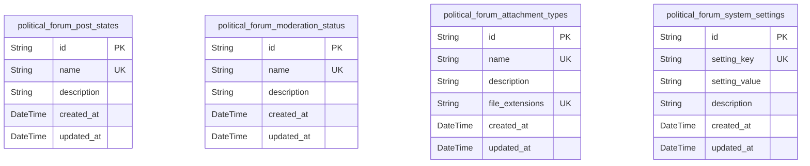
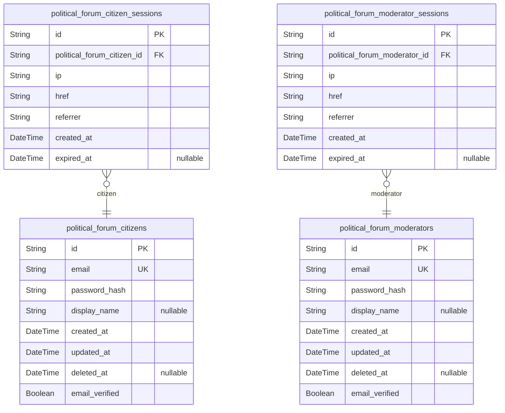
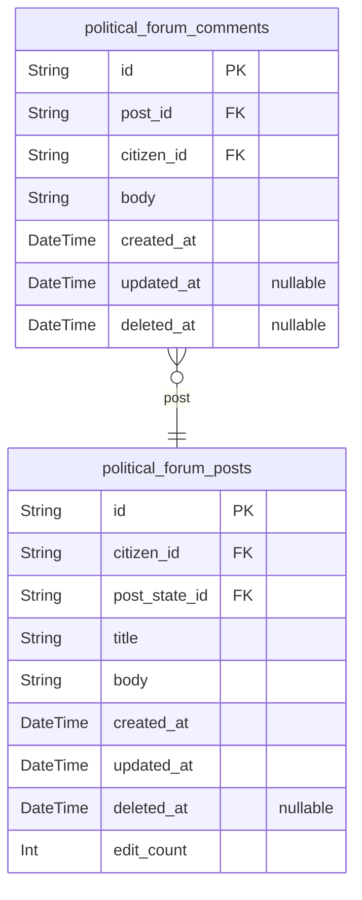
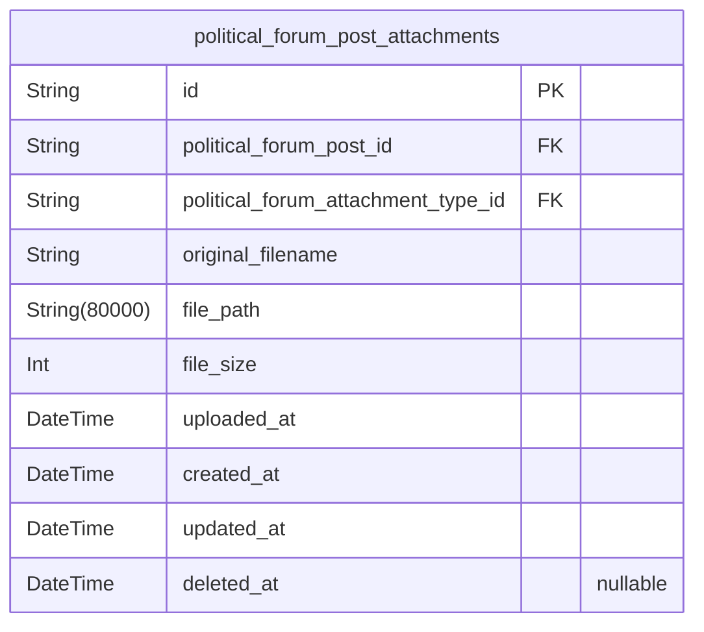
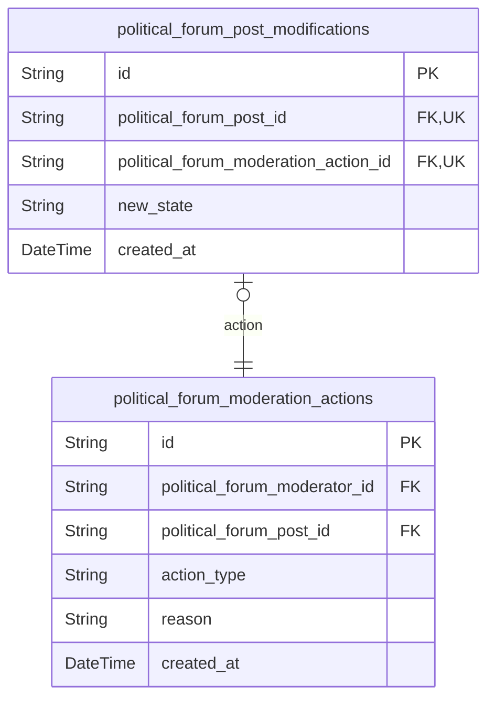
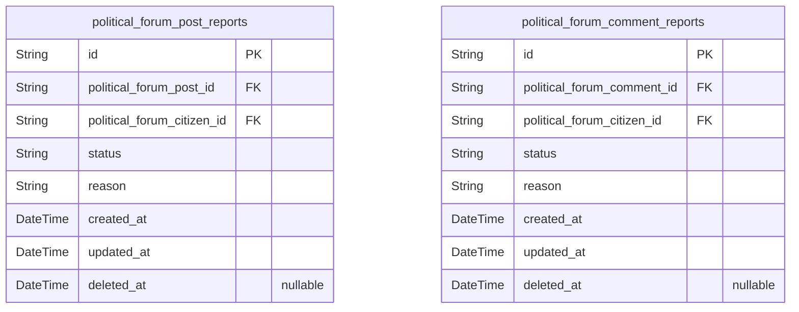
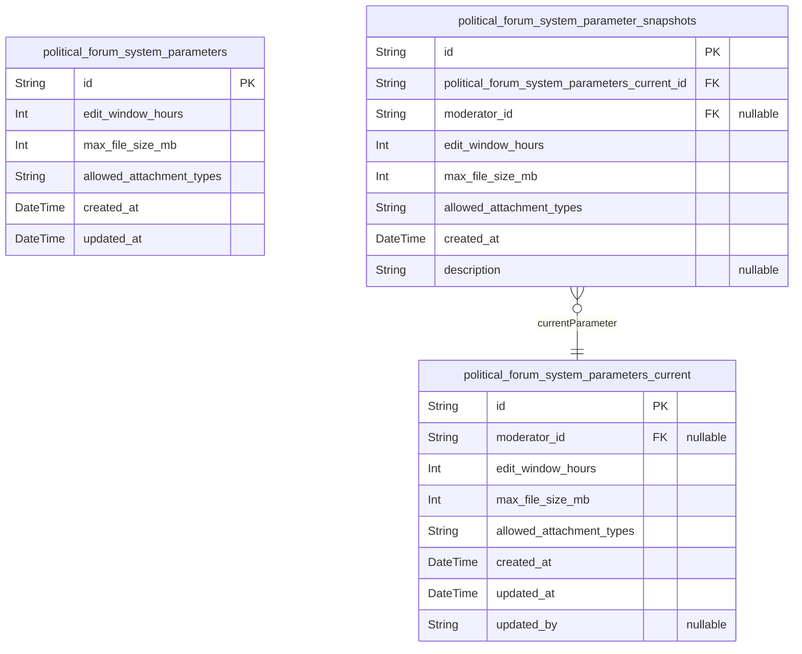
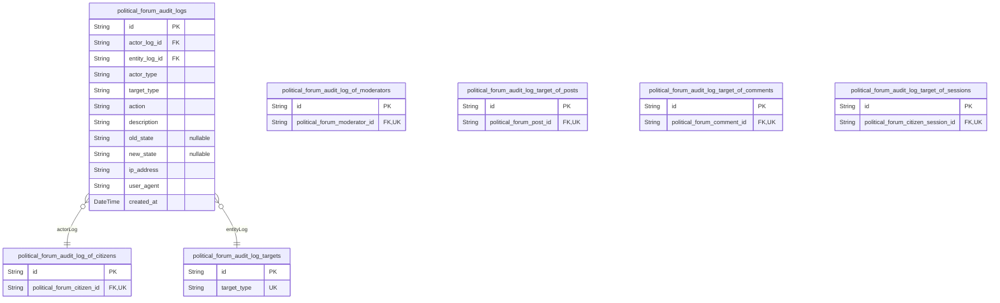
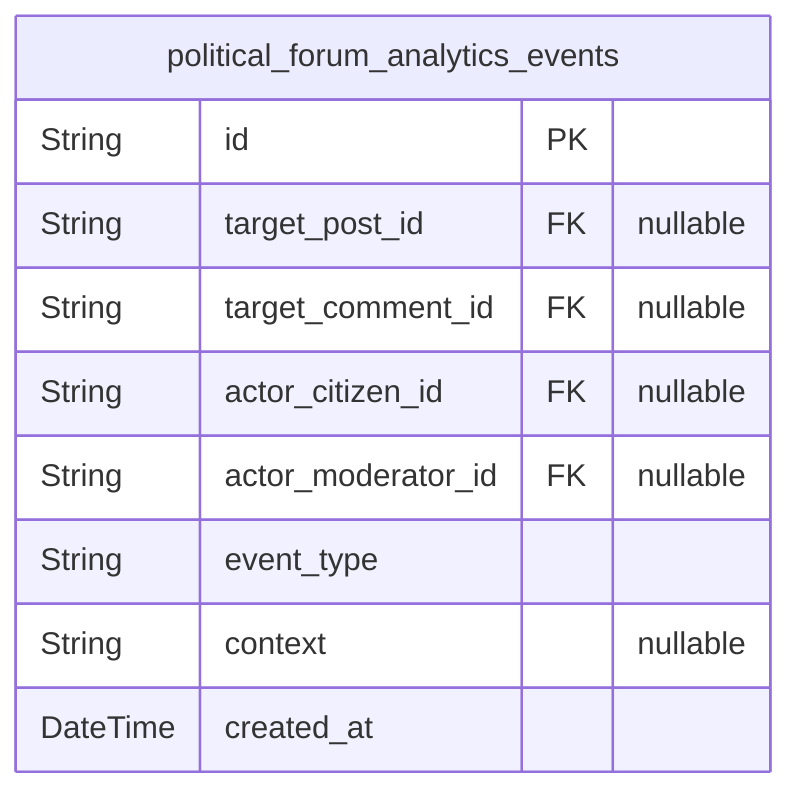
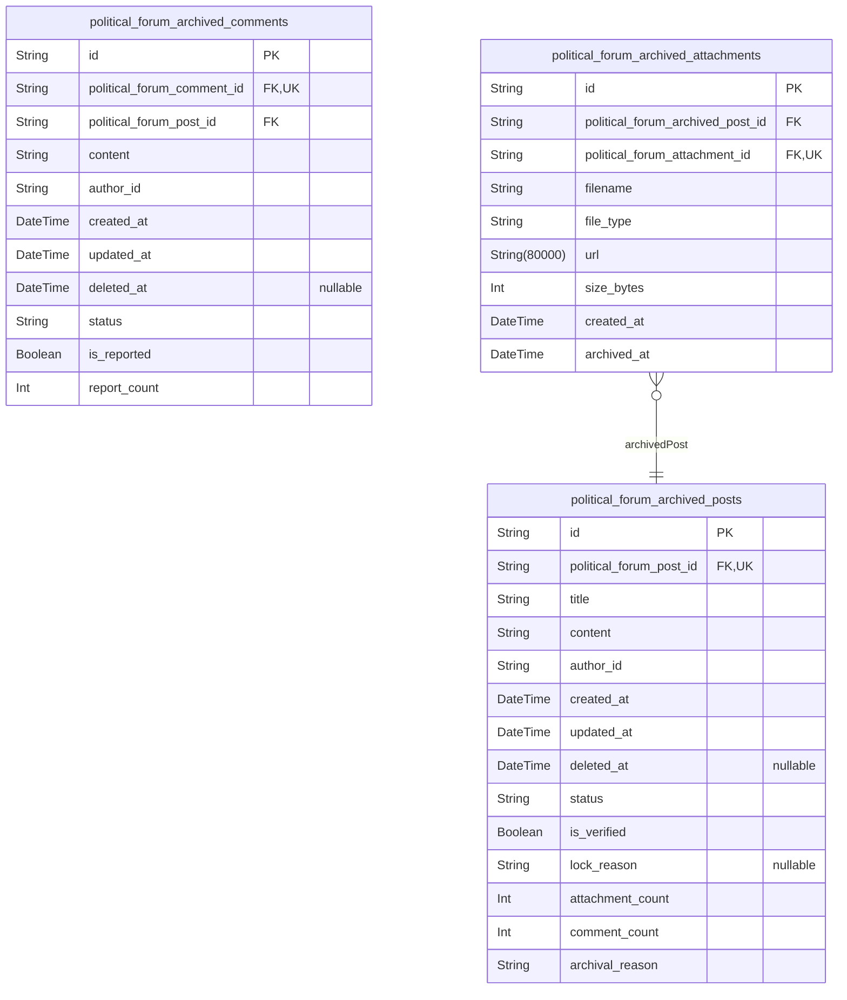

# Prisma Markdown

> Generated by [`prisma-markdown`](https://github.com/samchon/prisma-markdown)

- [Systematic](#systematic)
- [Actors](#actors)
- [Content](#content)
- [Attachments](#attachments)
- [Moderation](#moderation)
- [Reports](#reports)
- [Settings](#settings)
- [Audit](#audit)
- [Analytics](#analytics)
- [Archival](#archival)

## Systematic

```mermaid
erDiagram
"political_forum_post_states" {
  String id PK
  String name UK
  String description
  DateTime created_at
  DateTime updated_at
}
"political_forum_moderation_status" {
  String id PK
  String name UK
  String description
  DateTime created_at
  DateTime updated_at
}
"political_forum_attachment_types" {
  String id PK
  String name UK
  String description
  String file_extensions UK
  DateTime created_at
  DateTime updated_at
}
"political_forum_system_settings" {
  String id PK
  String setting_key UK
  String setting_value
  String description
  DateTime created_at
  DateTime updated_at
}
```

### `political_forum_post_states`

Defines all possible states a post can have in its lifecycle. Used as
reference by political_forum_posts to indicate current status. States
include: draft, published, moderation_queue, deleted, archived, restored.
This table ensures consistency across the system by providing
authoritative state definitions for post lifecycle management.

Properties as follows:

- `id`: Primary Key.
- `name`
  > The machine-readable name of the post state (e.g., 'draft', 'published').
  > Must be unique.
- `description`
  > Human-readable description of what this state means in business context.
  > Explains when this state is applied and what actions are allowed.
- `created_at`: Timestamp when this state definition was created in the system.
- `updated_at`
  > Timestamp when this state definition was last modified. Should be rarely
  > updated as these are reference data.

### `political_forum_moderation_status`

Defines the possible moderation states for content. Used as reference by
political_forum_posts and political_forum_comments to indicate
verification status. States include: unverified, verified, flagged,
under_review, rejected. This table defines the authoritative set of
moderation statuses that can be applied to content, ensuring consistent
behavior across the system.

Properties as follows:

- `id`: Primary Key.
- `name`
  > The machine-readable name of the moderation status (e.g., 'verified',
  > 'flagged'). Must be unique.
- `description`
  > Human-readable description of what this moderation status means in
  > business context. Explains when this status is applied and its
  > implications for content visibility.
- `created_at`
  > Timestamp when this moderation status definition was created in the
  > system.
- `updated_at`
  > Timestamp when this moderation status definition was last modified.
  > Should be rarely updated as these are reference data.

### `political_forum_attachment_types`

Defines the allowed file types for attachments to posts. Used as
reference by political_forum_post_attachments to validate uploaded files.
Types include: image (jpg, jpeg, png, gif), document (pdf, doc, docx,
txt). This table ensures system-wide consistency in allowed attachment
formats and provides metadata for UI display (e.g., icons for different
file types).

Properties as follows:

- `id`: Primary Key.
- `name`
  > The machine-readable name of the attachment type category (e.g., 'image',
  > 'document'). Must be unique.
- `description`
  > Human-readable description of this attachment type category and what file
  > extensions it includes.
- `file_extensions`
  > Comma-separated list of allowed file extensions for this attachment type
  > (e.g., 'jpg,jpeg,png,gif'). Used for upload validation.
- `created_at`: Timestamp when this attachment type definition was created in the system.
- `updated_at`
  > Timestamp when this attachment type definition was last modified. Should
  > be rarely updated as these are reference data.

### `political_forum_system_settings`

Stores system-wide configuration parameters for the political discussion
board. Used as reference by the backend to enforce business rules such as
character limits, timeouts, and feature toggles. This table contains
vital parameters that control system behavior without requiring code
deployment to change.

Properties as follows:

- `id`: Primary Key.
- `setting_key`
  > Unique identifier for this system setting (e.g., 'MAX_POST_LENGTH',
  > 'EDIT_WINDOW_HOURS'). Must be unique.
- `setting_value`
  > The value of this system setting. Stored as string to accommodate various
  > data types (integers, booleans, strings) that can be parsed by the
  > application layer.
- `description`
  > Human-readable description of what this setting controls, how it affects
  > the system, and its business purpose.
- `created_at`: Timestamp when this system setting was created or first registered.
- `updated_at`: Timestamp when this system setting was last modified.

## Actors

```mermaid
erDiagram
"political_forum_citizens" {
  String id PK
  String email UK
  String password_hash
  String display_name "nullable"
  DateTime created_at
  DateTime updated_at
  DateTime deleted_at "nullable"
  Boolean email_verified
}
"political_forum_citizen_sessions" {
  String id PK
  String political_forum_citizen_id FK
  String ip
  String href
  String referrer
  DateTime created_at
  DateTime expired_at "nullable"
}
"political_forum_moderators" {
  String id PK
  String email UK
  String password_hash
  String display_name "nullable"
  DateTime created_at
  DateTime updated_at
  DateTime deleted_at "nullable"
  Boolean email_verified
}
"political_forum_moderator_sessions" {
  String id PK
  String political_forum_moderator_id FK
  String ip
  String href
  String referrer
  DateTime created_at
  DateTime expired_at "nullable"
}
"political_forum_citizen_sessions" }o--|| "political_forum_citizens" : citizen
"political_forum_moderator_sessions" }o--|| "political_forum_moderators" : moderator
```

### `political_forum_citizens`

Primary actor table storing citizen user identity and authentication
data. Citizens create posts, comment, and attach files. Their data is
linked to all actions performed by them, including posts and reports.
Managed through registration and login workflows. {@link
political_forum_citizen_sessions.id}

Properties as follows:

- `id`: Primary Key.
- `email`
  > Unique email address for citizen communication and login. Must be
  > verified.
- `password_hash`
  > Hashed password for authentication. Never stored in plaintext. Required
  > for login.
- `display_name`
  > User-chosen display name for public visibility in posts/comments. Can be
  > changed.
- `created_at`: Timestamp when the citizen account was created.
- `updated_at`
  > Timestamp when the citizen account was last updated (e.g. display name
  > change).
- `deleted_at`
  > Soft-delete timestamp. If null, account is active. If set, account is
  > marked for deletion.
- `email_verified`
  > Flag indicating whether the citizen's email has been verified via email
  > link.

### `political_forum_citizen_sessions`

Session records for authenticated citizens. Each session is tied to a
unique citizen and tracks the login context. Used for access control and
revocation. Follows strict session pattern: no token storage, no
updated_at, no deleted_at. [political_forum_citizens.id](#political_forum_citizens)

Properties as follows:

- `id`: Primary Key.
- `political_forum_citizen_id`
  > Reference to the citizen this session belongs to. {@link
  > political_forum_citizens.id}
- `ip`: IP address used during this session login.
- `href`: URL of the page where the session was initiated.
- `referrer`: Referrer URL that led the user to the login page.
- `created_at`: Timestamp when the session was created on login.
- `expired_at`
  > Timestamp when this session expires or was manually invalidated. If null,
  > session is still active.

### `political_forum_moderators`

Primary actor table storing moderator identity and authentication data.
Moderators have elevated permissions to delete, lock, and verify content.
Their actions are logged for audit. Managed by system administrators
only. [political_forum_moderator_sessions.id](#political_forum_moderator_sessions)

Properties as follows:

- `id`: Primary Key.
- `email`
  > Unique email address for moderator communication and login. Must be
  > verified.
- `password_hash`
  > Hashed password for authentication. Never stored in plaintext. Required
  > for login.
- `display_name`: User-chosen display name for public visibility in moderation logs.
- `created_at`: Timestamp when the moderator account was created by system administrator.
- `updated_at`
  > Timestamp when the moderator account was last updated (e.g. display name
  > change).
- `deleted_at`
  > Soft-delete timestamp. If null, account is active. If set, account is
  > marked for deletion.
- `email_verified`
  > Flag indicating whether the moderator's email has been verified via email
  > link.

### `political_forum_moderator_sessions`

Session records for authenticated moderators. Each session is tied to a
unique moderator and tracks login context. Used for access control and
audit trails. Follows strict session pattern: no token storage, no
updated_at, no deleted_at. [political_forum_moderators.id](#political_forum_moderators)

Properties as follows:

- `id`: Primary Key.
- `political_forum_moderator_id`
  > Reference to the moderator this session belongs to. {@link
  > political_forum_moderators.id}
- `ip`: IP address used during this session login.
- `href`: URL of the page where the session was initiated.
- `referrer`: Referrer URL that led the user to the login page.
- `created_at`: Timestamp when the session was created on login.
- `expired_at`
  > Timestamp when this session expires or was manually invalidated. If null,
  > session is still active.

## Content

```mermaid
erDiagram
"political_forum_posts" {
  String id PK
  String citizen_id FK
  String post_state_id FK
  String title
  String body
  DateTime created_at
  DateTime updated_at
  DateTime deleted_at "nullable"
  Int edit_count
}
"political_forum_comments" {
  String id PK
  String post_id FK
  String citizen_id FK
  String body
  DateTime created_at
  DateTime updated_at "nullable"
  DateTime deleted_at "nullable"
}
"political_forum_comments" }o--|| "political_forum_posts" : post
```

### `political_forum_posts`

Main entity representing citizen-submitted political discussion posts.
Posts are primary content objects with a lifecycle: created, published,
edited (within 24h), locked, or deleted. This table stores raw content
and metadata. Relationships: references political_forum_citizens
(author), political_forum_post_states (status), and
political_forum_post_attachments (via join).

Properties as follows:

- `id`: Primary Key.
- `citizen_id`: Author's citizen account. [political_forum_citizens.id](#political_forum_citizens).
- `post_state_id`
  > Current state of the post (e.g., published, pending, deleted, locked).
  > [political_forum_post_states.id](#political_forum_post_states).
- `title`
  > Title of the post. Required field with 3-150 characters as per
  > requirements.
- `body`
  > Main content body of the post. Must be 10-5000 characters as per business
  > rules.
- `created_at`: Timestamp when the post was created. Always non-null.
- `updated_at`
  > Timestamp when the post was last edited. Updated only if edited within
  > 24-hour window.
- `deleted_at`
  > Timestamp when the post was deleted by a moderator. Null if not deleted.
  > Required for soft delete audit.
- `edit_count`
  > Number of times this post has been edited within the 24-hour window. Used
  > for audit and transparency.

### `political_forum_comments`

Public comments made by citizens on posts. Comments are independent
entities with their own lifecycle and moderation status. They are not
subsidiary to posts because they require independent search (e.g., all
comments by user X), moderation, and tracking. Associated with a post via
foreign key but managed as primary entity.

Properties as follows:

- `id`: Primary Key.
- `post_id`: Parent post this comment replies to. [political_forum_posts.id](#political_forum_posts).
- `citizen_id`: Author's citizen account. [political_forum_citizens.id](#political_forum_citizens).
- `body`: Content of the comment. Must be 5-1500 characters as per requirements.
- `created_at`: Timestamp when the comment was posted. Always non-null.
- `updated_at`: Timestamp when the comment was last edited (within 24h of posting).
- `deleted_at`
  > Timestamp when the comment was deleted by a moderator. Null if not
  > deleted. Required for soft delete audit.

## Attachments

```mermaid
erDiagram
"political_forum_post_attachments" {
  String id PK
  String political_forum_post_id FK
  String political_forum_attachment_type_id FK
  String original_filename
  String(80000) file_path
  Int file_size
  DateTime uploaded_at
  DateTime created_at
  DateTime updated_at
  DateTime deleted_at "nullable"
}
```

### `political_forum_post_attachments`

Stores metadata for files uploaded with political forum posts. Each
record represents one attachment linked to a specific post. Attachments
are managed solely through the post they belong to — no independent user
actions on attachments. No comment attachments allowed. File types are
restricted to images (JPG, PNG, GIF) and documents (PDF, TXT) as per
business rules. File size capped at 10MB per file. Fields include
original filename, cloud storage path, size in bytes, upload timestamp,
and deletion state. When a post is deleted, attachments are preserved for
13 months for audit, then purged. This table follows the subsidiary
stance — attachments are never independently created or managed. Their
visibility and lifecycle are entirely dependent on the parent post's
state. [political_forum_posts](#political_forum_posts) is the parent. {@link
political_forum_attachment_types} defines the allowed MIME type
categories.

Properties as follows:

- `id`: Primary Key.
- `political_forum_post_id`
  > Reference to the post this attachment belongs to. {@link
  > political_forum_posts.id}
- `political_forum_attachment_type_id`
  > Reference to the allowed file type category (e.g., image/jpeg,
  > application/pdf). [political_forum_attachment_types.id](#political_forum_attachment_types)
- `original_filename`
  > The original filename provided by the user during upload. Preserved
  > exactly as submitted for display and audit purposes. Used for user-facing
  > display and full-text search.
- `file_path`
  > The external URL pointing to the file stored in cloud storage. Generated
  > and returned by cloud service upon upload. Used to render file previews
  > or download links. Never stored locally.
- `file_size`
  > Size of the uploaded file in bytes. Must be <= 10,485,760 (10MB).
  > Enforced during upload. Used for budgeting storage and compliance with
  > attachment rules.
- `uploaded_at`
  > The precise timestamp when the file was successfully uploaded to cloud
  > storage. Different from created_at to reflect actual cloud ingestion
  > time, not system record creation.
- `created_at`: Timestamp when this attachment record was created in the database.
- `updated_at`
  > Timestamp when this attachment record was last updated (e.g., renamed
  > metadata, status change).
- `deleted_at`
  > Soft delete flag. When null, attachment is active. When set, the
  > attachment is marked for deletion but retained for audit (13 months).
  > After 13 months, the file is purged from cloud storage. Indicates
  > permanent deletion via user or moderator action on the parent post.

## Moderation

```mermaid
erDiagram
"political_forum_moderation_actions" {
  String id PK
  String political_forum_moderator_id FK
  String political_forum_post_id FK
  String action_type
  String reason
  DateTime created_at
}
"political_forum_post_modifications" {
  String id PK
  String political_forum_post_id FK,UK
  String political_forum_moderation_action_id FK,UK
  String new_state
  DateTime created_at
}
"political_forum_post_modifications" |o--|| "political_forum_moderation_actions" : action
```

### `political_forum_moderation_actions`

Audit log of moderator actions: deletion, locking, or verification of
posts. Each record represents a single action taken by a moderator on a
post. Records are immutable and used exclusively for audit,
accountability, and transparency. Tracks who did what, when, and why.
Links to political_forum_moderators.id and political_forum_posts.id.

Properties as follows:

- `id`: Primary Key.
- `political_forum_moderator_id`
  > The moderator who performed this action. {@link
  > political_forum_moderators.id}.
- `political_forum_post_id`
  > The post that was affected by this action. {@link
  > political_forum_posts.id}.
- `action_type`
  > Type of moderator action: 'delete', 'lock', or 'verify'. Case-sensitive
  > string that defines the nature of the moderation event.
- `reason`
  > Brief description provided by the moderator explaining why this action
  > was taken. Required for accountability and to inform the post author in
  > notifications.
- `created_at`
  > Timestamp when the moderation action was executed. Immutable audit
  > record. This field establishes chronological order of events.

### `political_forum_post_modifications`

Track the historical state changes of posts due to moderation actions.
Records each instance when a post's public status changed to 'deleted',
'locked', or 'verified'. This table captures the result state of a post
at time of action, while political_forum_moderation_actions captures the
action itself. Immutable audit record. Links to political_forum_posts.id
and political_forum_moderation_actions.id.

Properties as follows:

- `id`: Primary Key.
- `political_forum_post_id`: The post whose state was modified. [political_forum_posts.id](#political_forum_posts).
- `political_forum_moderation_action_id`
  > The moderation action that caused this state change. {@link
  > political_forum_moderation_actions.id}.
- `new_state`
  > The target state applied to the post: 'deleted', 'locked', or 'verified'.
  > Used by frontend to display banners, badges, or removed notices.
- `created_at`
  > Timestamp when the post's state was changed. This field correlates with
  > political_forum_moderation_actions.created_at for full audit trail
  > alignment.

## Reports

```mermaid
erDiagram
"political_forum_post_reports" {
  String id PK
  String political_forum_post_id FK
  String political_forum_citizen_id FK
  String status
  String reason
  DateTime created_at
  DateTime updated_at
  DateTime deleted_at "nullable"
}
"political_forum_comment_reports" {
  String id PK
  String political_forum_comment_id FK
  String political_forum_citizen_id FK
  String status
  String reason
  DateTime created_at
  DateTime updated_at
  DateTime deleted_at "nullable"
}
```

### `political_forum_post_reports`

Records reports submitted by citizens against specific political forum
posts. Each report captures the reporting citizen, the post being
reported, the reason for the report, and its current moderation status.
This table is independent and allows moderators to efficiently review and
filter all reported posts across the system without needing to load the
parent post content. Each report can be independently queried, sorted,
and archived. Linked to political_forum_posts.id and
political_forum_citizens.id.

Properties as follows:

- `id`: Primary Key.
- `political_forum_post_id`: The post being reported. [political_forum_posts.id](#political_forum_posts)
- `political_forum_citizen_id`: The citizen who submitted the report. [political_forum_citizens.id](#political_forum_citizens)
- `status`: Status of the report. Values: pending, reviewed, dismissed, escalated.
- `reason`
  > The reason or explanation provided by the citizen for why they are
  > reporting this post. Should contain at least 10 characters.
- `created_at`: Timestamp of when the report was submitted.
- `updated_at`: Timestamp of the last update to the report status or reason.
- `deleted_at`: Soft delete timestamp. If null, the report is active.

### `political_forum_comment_reports`

Records reports submitted by citizens against specific political forum
comments. Each report captures the reporting citizen, the comment being
reported, the reason for the report, and its current moderation status.
This table is independent and allows moderators to efficiently review and
filter all reported comments across the system regardless of the parent
post. Each report can be independently queried, sorted, and archived.
Linked to political_forum_comments.id and political_forum_citizens.id.

Properties as follows:

- `id`: Primary Key.
- `political_forum_comment_id`: The comment being reported. [political_forum_comments.id](#political_forum_comments)
- `political_forum_citizen_id`: The citizen who submitted the report. [political_forum_citizens.id](#political_forum_citizens)
- `status`: Status of the report. Values: pending, reviewed, dismissed, escalated.
- `reason`
  > The reason or explanation provided by the citizen for why they are
  > reporting this comment. Should contain at least 10 characters.
- `created_at`: Timestamp of when the report was submitted.
- `updated_at`: Timestamp of the last update to the report status or reason.
- `deleted_at`: Soft delete timestamp. If null, the report is active.

## Settings

```mermaid
erDiagram
"political_forum_system_parameters" {
  String id PK
  Int edit_window_hours
  Int max_file_size_mb
  String allowed_attachment_types
  DateTime created_at
  DateTime updated_at
}
"political_forum_system_parameters_current" {
  String id PK
  String moderator_id FK "nullable"
  Int edit_window_hours
  Int max_file_size_mb
  String allowed_attachment_types
  DateTime created_at
  DateTime updated_at
  String updated_by "nullable"
}
"political_forum_system_parameter_snapshots" {
  String id PK
  String political_forum_system_parameters_current_id FK
  String moderator_id FK "nullable"
  Int edit_window_hours
  Int max_file_size_mb
  String allowed_attachment_types
  DateTime created_at
  String description "nullable"
}
"political_forum_system_parameter_snapshots" }o--|| "political_forum_system_parameters_current" : currentParameter
```

### `political_forum_system_parameters`

Global system configuration parameters that control the behavior of the
political forum. This table defines system-wide limits and policies that
apply uniformly to all citizens and moderators. Values in this table are
managed through administrative interfaces, not directly by end users.
These settings provide the foundation for business rules such as edit
windows, file size restrictions, and permitted attachment types.

This table is referenced by all components of the system to enforce
consistent behavior. It is updated rarely through secure administrative
channels and does not require user-facing CRUD operations.

All values are authoritative and override any default hard-coded values
in the application layer.

For example:
- edit_window_hours determines how long citizens can edit their own posts
(24 hours)
- max_file_size_mb sets the maximum upload size per file (10 MB)
- allowed_attachment_types defines which MIME types are acceptable for
uploads

This entity has no relationships to other tables - it is a singleton
configuration store.

See also: [political_forum_audit_logs](#political_forum_audit_logs) for change history of these
settings.

Properties as follows:

- `id`: Primary Key.
- `edit_window_hours`
  > The number of hours during which a citizen may edit their own post after
  > initial submission. Standard value is 24 hours.
- `max_file_size_mb`
  > Maximum size allowed for any single attachment file uploaded with a post,
  > in megabytes. Standard value is 10 MB.
- `allowed_attachment_types`
  > Comma-separated list of allowed file extensions for attachments. Includes
  > image types (.jpg, .jpeg, .png, .gif) and document types (.pdf, .txt,
  > .doc, .docx). Must be stored as a single string for simplicity in
  > application logic.
- `created_at`
  > Timestamp when this system configuration record was created. Immutable
  > after creation.
- `updated_at`
  > Timestamp when this system configuration record was last updated. Updated
  > automatically on every change.

### `political_forum_system_parameters_current`

Current system-wide configuration parameters that control the behavior of
the political forum. This table defines a single authoritative set of
system-wide limits and policies that apply uniformly to all citizens and
moderators. Values in this table are managed through administrative
interfaces, not directly by end users. These settings provide the
foundation for business rules such as edit windows, file size
restrictions, and permitted attachment types.

This table is referenced by all components of the system to enforce
consistent behavior. It is updated rarely through secure administrative
channels and does not require user-facing CRUD operations.

This current value reference is always the latest commit of configuration
in the system.

See also: [political_forum_system_parameter_snapshots](#political_forum_system_parameter_snapshots) for
historical versions.

See also: [political_forum_audit_logs](#political_forum_audit_logs) for change history of these
settings.

Properties as follows:

- `id`: Primary Key.
- `moderator_id`
  > The moderator who last modified this configuration. References {@link
  > political_forum_moderators.id}.
- `edit_window_hours`
  > The number of hours during which a citizen may edit their own post after
  > initial submission. Standard value is 24 hours.
- `max_file_size_mb`
  > Maximum size allowed for any single attachment file uploaded with a post,
  > in megabytes. Standard value is 10 MB.
- `allowed_attachment_types`
  > Comma-separated list of allowed file extensions for attachments. Includes
  > image types (.jpg, .jpeg, .png, .gif) and document types (.pdf, .txt,
  > .doc, .docx). Must be stored as a single string for simplicity in
  > application logic.
- `created_at`
  > Timestamp when this system configuration record was created. Immutable
  > after creation.
- `updated_at`
  > Timestamp when this system configuration record was last updated. Updated
  > automatically on every change.
- `updated_by`
  > The moderator ID who last modified this configuration. References {@link
  > political_forum_moderators.id}.

### `political_forum_system_parameter_snapshots`

Historical snapshots of system-wide configuration parameters. This table
captures point-in-time versions of the
political_forum_system_parameters_current table for audit trail,
compliance, and forensic analysis.

Each record represents a configuration state and is immutable. Whenever
the current configuration is updated, a new snapshot is created instead
of modifying existing records.

This enables:
- Full audit trail of system policy changes
- Compliance with regulatory requirements (GDPR, HIPAA if applicable)
- Forensic investigations into configuration-related incidents
- Rollback capability to previous configuration states if needed

This table is write-once and read-only from any external interface.

See also: [political_forum_system_parameters_current](#political_forum_system_parameters_current) for the
current configuration value.

See also: [political_forum_audit_logs](#political_forum_audit_logs) for system-level audit trail
of what changed.

Properties as follows:

- `id`: Primary Key.
- `political_forum_system_parameters_current_id`
  > Reference to the current configuration state that was snapshotted.
  > References [political_forum_system_parameters_current.id](#political_forum_system_parameters_current).
- `moderator_id`
  > The moderator who performed the configuration change being snapped.
  > References [political_forum_moderators.id](#political_forum_moderators).
- `edit_window_hours`
  > The number of hours during which a citizen may edit their own post after
  > initial submission. Standard value is 24 hours. This value is captured at
  > time of snapshot.
- `max_file_size_mb`
  > Maximum size allowed for any single attachment file uploaded with a post,
  > in megabytes. Standard value is 10 MB. This value is captured at time of
  > snapshot.
- `allowed_attachment_types`
  > Comma-separated list of allowed file extensions for attachments. Includes
  > image types (.jpg, .jpeg, .png, .gif) and document types (.pdf, .txt,
  > .doc, .docx). Must be stored as a single string for simplicity in
  > application logic. This value is captured at time of snapshot.
- `created_at`
  > Timestamp when this exact configuration snapshot was generated. This is
  > NOT the same as when the current configuration was last updated - this is
  > when the snapshot was created.
- `description`
  > Human-readable description of what changed in this configuration update.
  > e.g., 'Increased file size limit from 5MB to 10MB due to user
  > feedback','Reduced edit window from 48 to 24 hours','Added .mp4 extension
  > to allowed types'

## Audit

```mermaid
erDiagram
"political_forum_audit_logs" {
  String id PK
  String actor_log_id FK
  String entity_log_id FK
  String actor_type
  String target_type
  String action
  String description
  String old_state "nullable"
  String new_state "nullable"
  String ip_address
  String user_agent
  DateTime created_at
}
"political_forum_audit_log_of_citizens" {
  String id PK
  String political_forum_citizen_id FK,UK
}
"political_forum_audit_log_of_moderators" {
  String id PK
  String political_forum_moderator_id FK,UK
}
"political_forum_audit_log_target_of_posts" {
  String id PK
  String political_forum_post_id FK,UK
}
"political_forum_audit_log_target_of_comments" {
  String id PK
  String political_forum_comment_id FK,UK
}
"political_forum_audit_log_target_of_sessions" {
  String id PK
  String political_forum_citizen_session_id FK,UK
}
"political_forum_audit_log_targets" {
  String id PK
  String target_type UK
}
"political_forum_audit_logs" }o--|| "political_forum_audit_log_of_citizens" : actorLog
"political_forum_audit_logs" }o--|| "political_forum_audit_log_targets" : entityLog
```

### `political_forum_audit_logs`

Immutable audit log entries that record all significant system events for
compliance and forensic purposes. This is the main entity that
coordinates the polymorphic actor and target systems using IDs and
discriminators. Uses actor_log_id and entity_log_id to reference specific
subtype tables based on actor_type and target_type.

All direct foreign keys have been removed and replaced with discriminator
+ subtype pattern to preserve referential integrity and normalization.
Every audit entry is validated against the subtype relationships rather
than direct database FKs.

Links to political_forum_audit_log_of_citizens,
political_forum_audit_log_of_moderators,
political_forum_audit_log_targets through their respective ID fields.
Dependent entirely on subtype tables to resolve actor and target identity
with type safety.

Properties as follows:

- `id`: Primary Key.
- `actor_log_id`
  > Foreign key to either political_forum_audit_log_of_citizens.id or
  > political_forum_audit_log_of_moderators.id, determined by actor_type.
  > This ensures referential integrity while enabling polymorphic actor
  > tracking. Never references directly to citizens or moderators.
- `entity_log_id`
  > Foreign key to political_forum_audit_log_targets.id. This point of
  > reference resolves the target_type and enables JOIN to one of the
  > specific target subtypes (post, comment, session).
- `actor_type`
  > Specifies the type of actor performing the action. Must be exactly
  > "citizen" or "moderator" as defined in the authentication system. Used
  > with actor_log_id to determine which subtype table to join.
- `target_type`
  > Specifies the type of entity being audited. Must be one of: "post",
  > "comment", "session". Used with entity_log_id to determine which target
  > subtype to join during query resolution.
- `action`
  > Type of action taken. Valid values: "created", "modified", "deleted",
  > "locked", "verified", "login", "logout", "report", "flagged". Derived
  > from business rules governing system events.
- `description`
  > A human-readable description of the action performed, including optional
  > reason provided by moderator (e.g., "Removed for hate speech") or system
  > context (e.g., "Post flagged by 5 users"). Required for forensic
  > accountability.
- `old_state`
  > JSON string representing the state of the target entity before the
  > action. For example: {"title": "Original Title", "text": "Original
  > content"}. Use for change comparison and audit recovery.
- `new_state`
  > JSON string representing the state of the target entity after the action.
  > For example: {"title": "Updated Title", "text": "Updated content"}.
  > Contains the final state after modification, deletion, or verification.
- `ip_address`
  > The public IP address used by the actor when performing the action.
  > Captured from HTTP request header for accountability.
- `user_agent`
  > The HTTP User-Agent header sent by the client when performing the action.
  > Used for identifying device or browser type for forensic analysis.
- `created_at`
  > The precise UTC timestamp when the audit event was recorded by the
  > system. Always uses server clock to ensure immutability. Follows ISO 8601
  > format.

### `political_forum_audit_log_of_citizens`

Subtype entity for audit logs executed specifically by citizens. This
table enforces referential integrity by linking only to
political_forum_citizens.id. The main political_forum_audit_logs table
references this via actor_log_id, ensuring that all audit logs by
citizens have a valid actor identity.

Does not require additional fields beyond the relationship to citizen.
Cornerstone of polymorphic actor pattern.

Properties as follows:

- `id`: Primary Key.
- `political_forum_citizen_id`
  > Reference to the citizen who performed the audited action. Must be
  > non-null and link directly to political_forum_citizens.id. Ensures valid
  > actor authentication context.

### `political_forum_audit_log_of_moderators`

Subtype entity for audit logs executed specifically by moderators. This
table enforces referential integrity by linking only to
political_forum_moderators.id. The main political_forum_audit_logs table
references this via actor_log_id, ensuring that all audit logs by
moderators have a valid actor identity.

Does not require additional fields beyond the relationship to moderator.
Cornerstone of polymorphic actor pattern.

Properties as follows:

- `id`: Primary Key.
- `political_forum_moderator_id`
  > Reference to the moderator who performed the audited action. Must be
  > non-null and link directly to political_forum_moderators.id. Ensures
  > valid actor authentication context.

### `political_forum_audit_log_target_of_posts`

Subtype entity for audit logs targeting political_forum_posts. Links the
audit entry to the post being modified, deleted, locked, or verified.
This ensures referential integrity for post-targeted events.

Does not require additional fields beyond the relationship to post.
Cornerstone of polymorphic target pattern.

Properties as follows:

- `id`: Primary Key.
- `political_forum_post_id`
  > Reference to the post being audited. Must be non-null and link directly
  > to political_forum_posts.id. Applies to actions: created, modified,
  > deleted, locked, verified.

### `political_forum_audit_log_target_of_comments`

Subtype entity for audit logs targeting political_forum_comments. Links
the audit entry to the comment being modified or deleted. This ensures
referential integrity for comment-targeted events.

Does not require additional fields beyond the relationship to comment.
Cornerstone of polymorphic target pattern.

Properties as follows:

- `id`: Primary Key.
- `political_forum_comment_id`
  > Reference to the comment being audited. Must be non-null and link
  > directly to political_forum_comments.id. Applies to actions: created,
  > modified, deleted, flagged, reported.

### `political_forum_audit_log_target_of_sessions`

Subtype entity for audit logs targeting user sessions. Links the audit
entry to the citizen_session being logged in or out. This ensures
referential integrity for session-based audit events.

Does not require additional fields beyond the relationship to session.
Cornerstone of polymorphic target pattern.

Properties as follows:

- `id`: Primary Key.
- `political_forum_citizen_session_id`
  > Reference to the citizen session being audited. Must be non-null and link
  > directly to political_forum_citizen_sessions.id. Applies to actions:
  > login, logout.

### `political_forum_audit_log_targets`

Main entity for audit log target types. Serves as the discriminator for
different entities being audited.

Stores the target_type (post, comment, session) and links to respective
subtype tables (political_forum_audit_log_target_of_posts, etc.). This
allows the main audit_log table to reference exactly one target entity
with full type safety and referential integrity.

Must be used with target_type field in political_forum_audit_logs to
select the correct subtype for target resolution.

Properties as follows:

- `id`: Primary Key.
- `target_type`
  > The exact type of entity being audited. Must be one of: "post",
  > "comment", "session". Matches the name of the corresponding subtype
  > table. Used to determine which subtype table to JOIN during query
  > resolution.

## Analytics

```mermaid
erDiagram
"political_forum_analytics_events" {
  String id PK
  String target_post_id FK "nullable"
  String target_comment_id FK "nullable"
  String actor_citizen_id FK "nullable"
  String actor_moderator_id FK "nullable"
  String event_type
  String context "nullable"
  DateTime created_at
}
```

### `political_forum_analytics_events`

Event log for analytics tracking system-wide user and moderator actions.
This table captures summaries of operational events (post creation,
comment addition, moderation actions) to enable reporting without
impacting transactional tables. Each entry represents a single event
triggered by system activity. The actor is either a citizen or moderator,
and the target is either a post or comment. This data is append-only and
used exclusively for business intelligence. References to
political_forum_posts, political_forum_comments,
political_forum_citizens, and political_forum_moderators are maintained
for audit and correlation.

Properties as follows:

- `id`: Primary Key.
- `target_post_id`
  > Reference to the target post if the event is related to a post. {@link
  > political_forum_posts.id}
- `target_comment_id`
  > Reference to the target comment if the event is related to a comment.
  > [political_forum_comments.id](#political_forum_comments)
- `actor_citizen_id`
  > Reference to the citizen who initiated the event, if applicable (e.g.,
  > post_created or comment_added). [political_forum_citizens.id](#political_forum_citizens)
- `actor_moderator_id`
  > Reference to the moderator who performed the action, if applicable (e.g.,
  > post_deleted or thread_locked). [political_forum_moderators.id](#political_forum_moderators)
- `event_type`
  > Type of analytics event. Examples: "post_created", "comment_added",
  > "post_deleted", "thread_locked", "post_verified", "file_uploaded".
- `context`
  > Optional contextual JSON string with additional event details (e.g., file
  > count, reason for deletion, IP address).
- `created_at`: Timestamp when the event was logged in the analytics system.

## Archival

```mermaid
erDiagram
"political_forum_archived_posts" {
  String id PK
  String political_forum_post_id FK,UK
  String title
  String content
  String author_id
  DateTime created_at
  DateTime updated_at
  DateTime deleted_at "nullable"
  String status
  Boolean is_verified
  String lock_reason "nullable"
  Int attachment_count
  Int comment_count
  String archival_reason
}
"political_forum_archived_comments" {
  String id PK
  String political_forum_comment_id FK,UK
  String political_forum_post_id FK
  String content
  String author_id
  DateTime created_at
  DateTime updated_at
  DateTime deleted_at "nullable"
  String status
  Boolean is_reported
  Int report_count
}
"political_forum_archived_attachments" {
  String id PK
  String political_forum_archived_post_id FK
  String political_forum_attachment_id FK,UK
  String filename
  String file_type
  String(80000) url
  Int size_bytes
  DateTime created_at
  DateTime archived_at
}
"political_forum_archived_attachments" }o--|| "political_forum_archived_posts" : archivedPost
```

### `political_forum_archived_posts`

Snapshot of political_forum_posts at time of archival. Preserves the
complete state of the post as it existed when moved to archival storage.
This table is read-only and used solely for historical access and audit.
References the original post in political_forum_posts. This is a snapshot
table, so it is not editable and only populated through system-triggered
archival process. [political_forum_posts.id](#political_forum_posts)

Properties as follows:

- `id`: Primary Key.
- `political_forum_post_id`
  > Reference to the original active post in political_forum_posts. {@link
  > political_forum_posts.id}
- `title`: The title of the post as it was at time of archival.
- `content`: The full text content of the post as it was at time of archival.
- `author_id`: The citizen ID of the original author. [political_forum_citizens.id](#political_forum_citizens)
- `created_at`: The timestamp when the post was originally created in the active system.
- `updated_at`
  > The timestamp when the post was last modified in the active system before
  > archival.
- `deleted_at`
  > The timestamp when this post was archived (moved from active system).
  > This represents the archival transition time.
- `status`
  > The moderation status at time of archival: 'published',
  > 'moderation_queue', 'deleted'.
- `is_verified`
  > True if the post was marked as verified by a moderator at the time of
  > archival.
- `lock_reason`
  > The reason for lock if the post was locked at time of archival. Null if
  > not locked.
- `attachment_count`: Number of attachments this post had at time of archival.
- `comment_count`: Number of comments this post had at time of archival.
- `archival_reason`: The reason this post was archived: '2_years_inactivity'

### `political_forum_archived_comments`

Snapshot of political_forum_comments at time of archival. Preserves the
complete state of the comment as it existed when moved to archival
storage. This table is read-only and used solely for historical access
and audit. References the original comment in political_forum_comments
and the parent post in political_forum_posts. This is a snapshot table,
so it is not editable and only populated through system-triggered
archival process. [political_forum_comments.id](#political_forum_comments) {@link
political_forum_posts.id}

Properties as follows:

- `id`: Primary Key.
- `political_forum_comment_id`
  > Reference to the original active comment in political_forum_comments.
  > [political_forum_comments.id](#political_forum_comments)
- `political_forum_post_id`
  > Reference to the parent post in political_forum_posts. {@link
  > political_forum_posts.id}
- `content`: The full text content of the comment as it was at time of archival.
- `author_id`: The citizen ID of the original author. [political_forum_citizens.id](#political_forum_citizens)
- `created_at`
  > The timestamp when the comment was originally created in the active
  > system.
- `updated_at`
  > The timestamp when the comment was last modified in the active system
  > before archival.
- `deleted_at`
  > The timestamp when this comment was archived (moved from active system).
  > This represents the archival transition time.
- `status`
  > The moderation status at time of archival: 'approved', 'under_review',
  > 'deleted'.
- `is_reported`: True if the comment was reported by users at time of archival.
- `report_count`: Number of reports accumulated on this comment at time of archival.

### `political_forum_archived_attachments`

Snapshot of political_forum_post_attachments at time of archival.
Preserves the URL, filename, type, and metadata of attachments linked to
archival posts. This is a subsidiary table, managed through the
archival_post context. Each attachment is stored via URL from cloud
storage and retained for audit. This table is not directly editable and
is populated through system archival triggers. {@link
political_forum_post_attachments.id} {@link
political_forum_archived_posts.id}

Properties as follows:

- `id`: Primary Key.
- `political_forum_archived_post_id`
  > Reference to the parent archival post. {@link
  > political_forum_archived_posts.id}
- `political_forum_attachment_id`
  > Reference to the original attachment record in
  > political_forum_post_attachments. {@link
  > political_forum_post_attachments.id}
- `filename`: The original filename of the attachment as it was uploaded.
- `file_type`
  > The MIME file type at time of upload (e.g., 'image/png',
  > 'application/pdf').
- `url`
  > The persistent URL to the file in cloud storage (e.g., from AWS S3 or
  > Cloudinary).
- `size_bytes`: The file size in bytes at time of upload.
- `created_at`
  > The timestamp when the attachment was originally created in the active
  > system.
- `archived_at`: The timestamp when this attachment was moved to archival storage.
