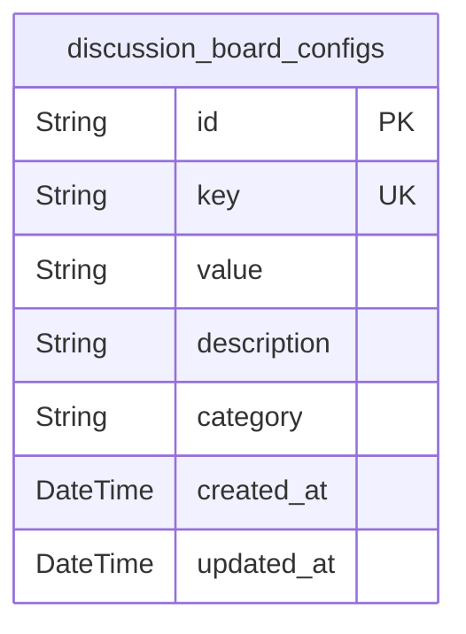
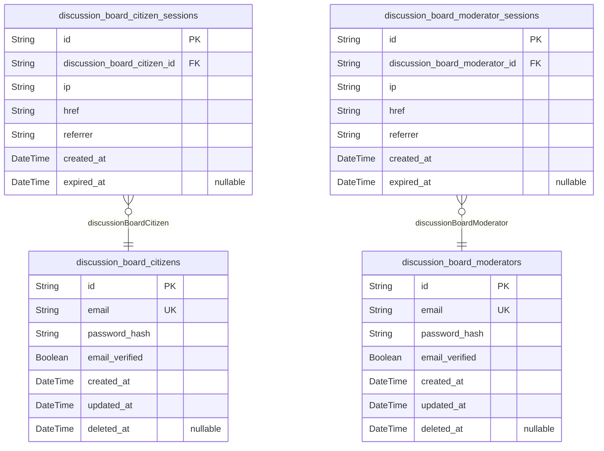
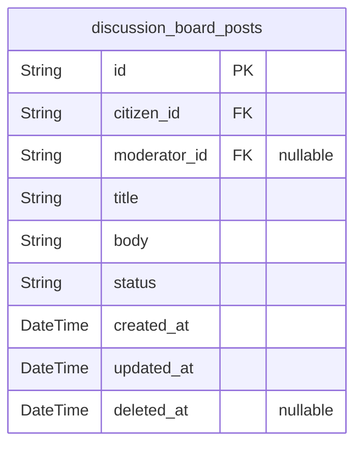
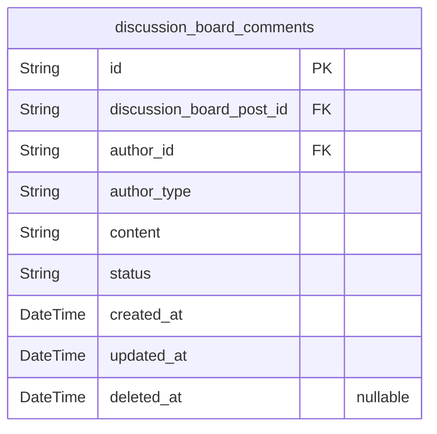
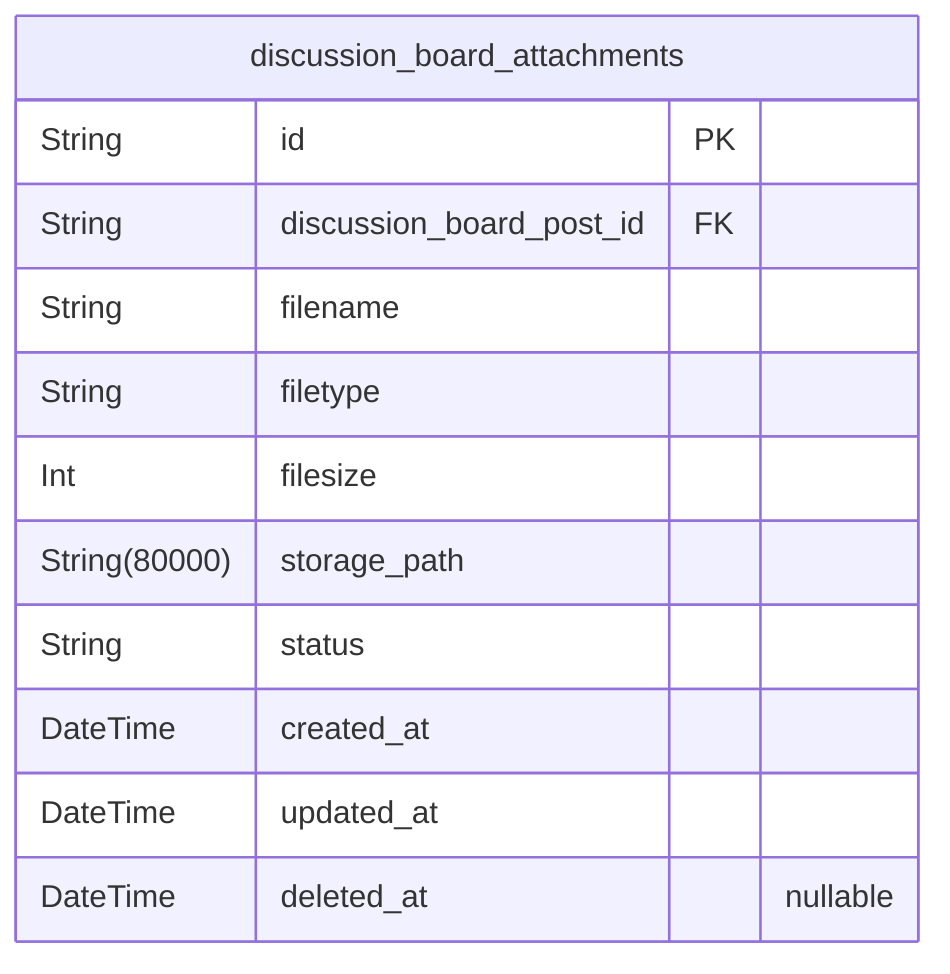
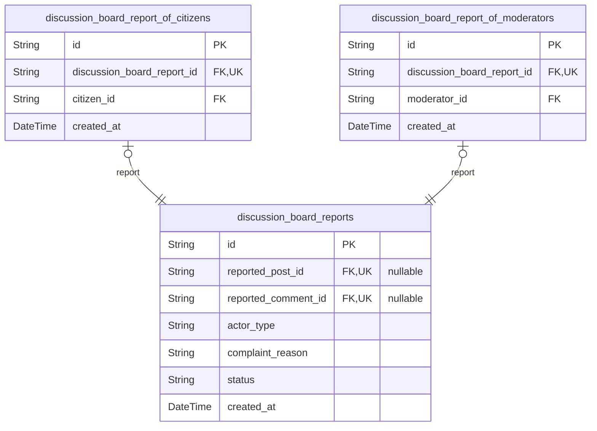
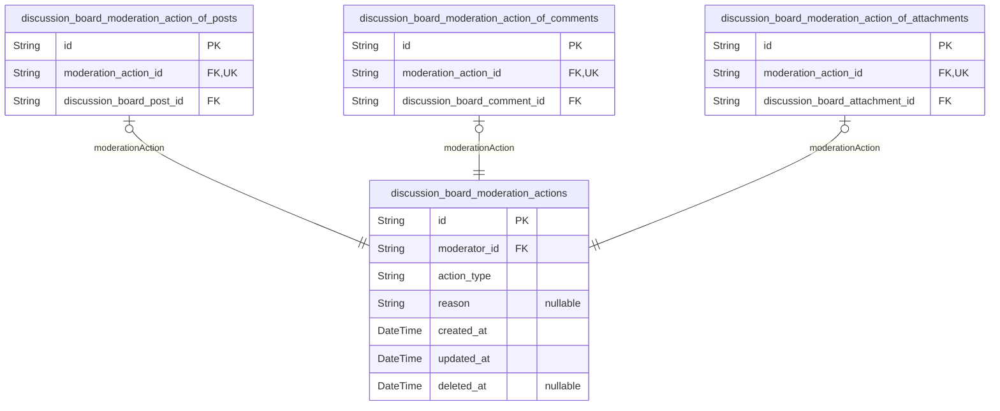

# Prisma Markdown

> Generated by [`prisma-markdown`](https://github.com/samchon/prisma-markdown)

- [Systematic](#systematic)
- [Actors](#actors)
- [Posts](#posts)
- [Comments](#comments)
- [Attachments](#attachments)
- [Reports](#reports)
- [ModerationActions](#moderationactions)

## Systematic

```mermaid
erDiagram
"discussion_board_configs" {
  String id PK
  String key UK
  String value
  String description
  String category
  DateTime created_at
  DateTime updated_at
}
```

### `discussion_board_configs`

System-wide configuration settings for the discussion board. Contains
key-value pairs defining behavioral limits and policies that govern
posting, commenting, file uploads, moderation actions, and report
handling. Managed by administrators through external tools, not by end
users.

Properties as follows:

- `id`: Primary Key.
- `key`
  > Unique identifier for the configuration parameter. Examples:
  > "max_file_size_per_post_mb", "allowed_image_types",
  > "min_post_title_length".
- `value`
  > String representation of the configuration value. Can be JSON-encoded for
  > complex values (e.g., array of string types).
- `description`
  > Human-readable explanation of what this configuration controls and its
  > intended purpose.
- `category`
  > Grouping for related configuration settings. Examples: "media",
  > "content", "moderation", "session".
- `created_at`: Timestamp when this configuration was created.
- `updated_at`: Timestamp when this configuration was last modified.

## Actors

```mermaid
erDiagram
"discussion_board_citizens" {
  String id PK
  String email UK
  String password_hash
  Boolean email_verified
  DateTime created_at
  DateTime updated_at
  DateTime deleted_at "nullable"
}
"discussion_board_citizen_sessions" {
  String id PK
  String discussion_board_citizen_id FK
  String ip
  String href
  String referrer
  DateTime created_at
  DateTime expired_at "nullable"
}
"discussion_board_moderators" {
  String id PK
  String email UK
  String password_hash
  Boolean email_verified
  DateTime created_at
  DateTime updated_at
  DateTime deleted_at "nullable"
}
"discussion_board_moderator_sessions" {
  String id PK
  String discussion_board_moderator_id FK
  String ip
  String href
  String referrer
  DateTime created_at
  DateTime expired_at "nullable"
}
"discussion_board_citizen_sessions" }o--|| "discussion_board_citizens" : discussionBoardCitizen
"discussion_board_moderator_sessions" }o--|| "discussion_board_moderators" : discussionBoardModerator
```

### `discussion_board_citizens`

Main entity representing a citizen user in the discussion board system.
Each citizen can create posts, comments, and attach files. Requires email
verification to post or commenting. This table stores authentication
credentials and basic profile information for citizen users.

Properties as follows:

- `id`: Primary Key.
- `email`
  > Unique email address used for authentication and notifications. Must be
  > verified before posting or commenting.
- `password_hash`
  > Hashed password for authentication. Never stored in plain text. Required
  > for login functionality.
- `email_verified`
  > Indicates whether the user has verified their email address. When false,
  > the user cannot create posts or comments.
- `created_at`: Timestamp when the citizen account was created.
- `updated_at`: Timestamp when the citizen account was last updated.
- `deleted_at`
  > Timestamp when the citizen account was soft-deleted (if applicable).
  > Nullable since account deletion is not a required feature.

### `discussion_board_citizen_sessions`

Session tracking table for citizen users. Each record represents one
active or expired authentication session for a citizen. Follows exact
mandatory schema for actor session tables with no additional fields.
Managed exclusively through the authentication system, not directly by
users.

Properties as follows:

- `id`: Primary Key.
- `discussion_board_citizen_id`
  > References the citizen user who owns this session. {@link
  > discussion_board_citizens.id}.
- `ip`: IP address from which the session was initiated.
- `href`: URL where the user accessed the system during this session.
- `referrer`
  > Referrer URL indicating the source of this session (e.g., which page
  > linked to the login).
- `created_at`: Timestamp when this session was created.
- `expired_at`
  > Timestamp when this session expired or was invalidated. Nullable since
  > active sessions have no expiration.

### `discussion_board_moderators`

Main entity representing a moderator user in the discussion board system.
Each moderator has elevated permissions to edit, delete, and moderate
content. Requires email verification. This table stores authentication
credentials and basic profile information for moderator users.

Properties as follows:

- `id`: Primary Key.
- `email`
  > Unique email address used for authentication and notifications. Must be
  > verified before moderating content.
- `password_hash`
  > Hashed password for authentication. Never stored in plain text. Required
  > for login functionality.
- `email_verified`
  > Indicates whether the moderator has verified their email address. When
  > false, the moderator cannot perform moderation actions.
- `created_at`: Timestamp when the moderator account was created.
- `updated_at`: Timestamp when the moderator account was last updated.
- `deleted_at`
  > Timestamp when the moderator account was soft-deleted (if applicable).
  > Nullable since account deletion is not a required feature.

### `discussion_board_moderator_sessions`

Session tracking table for moderator users. Each record represents one
active or expired authentication session for a moderator. Follows exact
mandatory schema for actor session tables with no additional fields.
Managed exclusively through the authentication system, not directly by
users.

Properties as follows:

- `id`: Primary Key.
- `discussion_board_moderator_id`
  > References the moderator user who owns this session. {@link
  > discussion_board_moderators.id}.
- `ip`: IP address from which the session was initiated.
- `href`: URL where the user accessed the system during this session.
- `referrer`
  > Referrer URL indicating the source of this session (e.g., which page
  > linked to the login).
- `created_at`: Timestamp when this session was created.
- `expired_at`
  > Timestamp when this session expired or was invalidated. Nullable since
  > active sessions have no expiration.

## Posts

```mermaid
erDiagram
"discussion_board_posts" {
  String id PK
  String citizen_id FK
  String moderator_id FK "nullable"
  String title
  String body
  String status
  DateTime created_at
  DateTime updated_at
  DateTime deleted_at "nullable"
}
```

### `discussion_board_posts`

Core discussion board posts created by citizens or moderated by
administrators. Posts have independent lifecycles with versioning through
status changes. This is a primary entity that must be independently
searchable, browsable, and manageable. Foreign keys reference existing
citizen and moderator tables for ownership and moderation actions. No
denormalized fields are included; derived counts must be computed via
joins or materialized views when necessary.

Properties as follows:

- `id`: Primary Key.
- `citizen_id`: Creator of the post. [discussion_board_citizens.id](#discussion_board_citizens).
- `moderator_id`
  > Moderator who last modified this post through deletion or editing. {@link
  > discussion_board_moderators.id}. Null if no moderator action taken.
- `title`
  > Title of the discussion post. Minimum 5 characters required by business
  > rules.
- `body`
  > Content body of the discussion post. Minimum 10 characters required by
  > business rules.
- `status`
  > Current state of the post. Values: "active" (visible),
  > "deleted_by_author" (soft-deleted by creator), "removed_by_moderator"
  > (removed by moderator for policy violation), "pending_moderation" (under
  > review after report).
- `created_at`
  > Timestamp when the post was initially created. Always set at creation and
  > never modified.
- `updated_at`
  > Timestamp when the post was last edited or modified. Updated when citizen
  > edits within 24 hours or moderator edits at any time.
- `deleted_at`
  > Timestamp when the post was deleted or removed. NULL if active. Used for
  > soft delete and audit trail purposes.

## Comments

```mermaid
erDiagram
"discussion_board_comments" {
  String id PK
  String discussion_board_post_id FK
  String author_id FK
  String author_type
  String content
  String status
  DateTime created_at
  DateTime updated_at
  DateTime deleted_at "nullable"
}
```

### `discussion_board_comments`

User comments on discussion board posts. Comments are primary entities
requiring independent management, search, and filtering. Each comment is
associated with a specific post and authored by either a citizen or
moderator. Comments have a character limit of 1,000 and display in
chronological order. When deleted by a moderator or author, the content
is replaced with a system message while preserving authorship and
timestamp for audit purposes. Uses polymorphic ownership pattern with
author_type field to distinguish between citizen and moderator authors.

Properties as follows:

- `id`: Primary Key.
- `discussion_board_post_id`: The post this comment belongs to. [discussion_board_posts.id](#discussion_board_posts).
- `author_id`
  > The ID of the user who created this comment. Can be either a citizen or
  > moderator. Use author_type to determine which table to reference. {@link
  > discussion_board_citizens.id} if author_type is "citizen", {@link
  > discussion_board_moderators.id} if author_type is "moderator".
- `author_type`
  > The type of user who authored this comment. Must be either "citizen" or
  > "moderator". This discriminates which subtype table contains the
  > actor-specific details.
- `content`
  > The content of the comment. Must be between 1 and 1,000 characters as per
  > requirements. Never null due to minimum character constraint.
- `status`
  > The current status of the comment. Values: "active" (normal state),
  > "deleted_by_moderator" (removed by moderator with [Deleted by moderator]
  > message), "deleted_by_author" (removed by original author with [Deleted
  > by author] message). Used to control visibility and moderation actions.
- `created_at`
  > Timestamp when the comment was originally created. Required for
  > chronological display and audit trail. Always present.
- `updated_at`
  > Timestamp when the comment was last updated (e.g., edited). Required for
  > tracking modifications and display of [Edited] marker.
- `deleted_at`
  > Timestamp when the comment was soft-deleted by a moderator or author.
  > Nullable because comments are not always deleted. Used for audit purposes
  > to track deletion history.

## Attachments

```mermaid
erDiagram
"discussion_board_attachments" {
  String id PK
  String discussion_board_post_id FK
  String filename
  String filetype
  Int filesize
  String(80000) storage_path
  String status
  DateTime created_at
  DateTime updated_at
  DateTime deleted_at "nullable"
}
```

### `discussion_board_attachments`

File attachments associated with posts on the discussion board. Each
attachment represents a single file uploaded by a citizen, with metadata
for file type, size, and moderation status. Attachments are managed
independently by moderators who can view, download, and remove them,
replacing links with [Attachment removed by moderator]. This table stores
the physical file reference and metadata while supporting audit trails
through soft deletion. Associated with discussion_board_posts via foreign
key.

Properties as follows:

- `id`: Primary Key.
- `discussion_board_post_id`: Post that this attachment belongs to. [discussion_board_posts.id](#discussion_board_posts).
- `filename`
  > Original name of the uploaded file. Examples: "photo.jpg",
  > "document.pdf". This is the filename as provided by the user during
  > upload.
- `filetype`
  > File extension indicating the type of uploaded file. Must be one of:
  > jpeg, png, gif, pdf, txt, docx. This field is used for content-type
  > validation during upload and to determine display behavior.
- `filesize`
  > Size of the file in bytes. Maximum allowed size is 5,000,000 bytes (5 MB)
  > per file. Used to enforce upload limits and storage calculations.
- `storage_path`
  > Server-specific path where the file is stored. Typically a URL or
  > filesystem path that the application can use to serve the file when
  > requested. This is generated by the system upon successful upload.
- `status`
  > Current status of the attachment. Values: 'active', 'removed'. Initial
  > state is 'active'. When a moderator removes an attachment, status changes
  > to 'removed' and the file link is replaced with [Attachment removed by
  > moderator]. This enables soft deletion while preserving audit trail.
- `created_at`
  > Timestamp when the attachment was first uploaded. Automatically generated
  > by the system when the file completes upload. Follows ISO 8601 format.
- `updated_at`
  > Timestamp when the attachment was last modified. For attachments, this
  > usually corresponds to when the status was changed from 'active' to
  > 'removed'.
- `deleted_at`
  > Timestamp when the attachment was marked as removed by a moderator.
  > Nullable because active attachments have not been deleted. Used for audit
  > trail and historical tracking of removal actions.

## Reports

```mermaid
erDiagram
"discussion_board_reports" {
  String id PK
  String reported_post_id FK,UK "nullable"
  String reported_comment_id FK,UK "nullable"
  String actor_type
  String complaint_reason
  String status
  DateTime created_at
}
"discussion_board_report_of_citizens" {
  String id PK
  String discussion_board_report_id FK,UK
  String citizen_id FK
  DateTime created_at
}
"discussion_board_report_of_moderators" {
  String id PK
  String discussion_board_report_id FK,UK
  String moderator_id FK
  DateTime created_at
}
"discussion_board_report_of_citizens" |o--|| "discussion_board_reports" : report
"discussion_board_report_of_moderators" |o--|| "discussion_board_reports" : report
```

### `discussion_board_reports`

Main entity for all reported content. This table contains shared
attributes for reports initiated by either citizens or moderators. The
actor_type field identifies which subtype table contains the specific
actor information. This structure follows the Polymorphic Ownership
Pattern to ensure database-level referential integrity and eliminate
nullable foreign key anti-patterns. Each report is associated with
exactly one post or comment being reported. This table may be referenced
by discussion_board_report_of_citizens and
discussion_board_report_of_moderators via 1:1 relationships.

Properties as follows:

- `id`: Primary Key.
- `reported_post_id`: The post being reported. [discussion_board_posts.id](#discussion_board_posts).
- `reported_comment_id`: The comment being reported. [discussion_board_comments.id](#discussion_board_comments).
- `actor_type`
  > The type of actor who initiated the report. Must be either "citizen" or
  > "moderator". This discriminates which subtype table contains the
  > actor-specific details.
- `complaint_reason`
  > The reason provided by the reporter for this report. This field is
  > mandatory when reported by a citizen. When a moderator initiates a
  > report, this field may contain an internal note.
- `status`
  > The current status of this report. Values: "pending" (awaiting review),
  > "dismissed" (investigation concluded with no violation), "edited"
  > (content was edited after report), "deleted" (content was deleted after
  > report). This status guides moderator workflows and audit trails.
- `created_at`: The timestamp when the report was created and submitted.

### `discussion_board_report_of_citizens`

Subtype entity for reports initiated by citizens. This table contains
citizen-specific information about the report as part of the Polymorphic
Ownership Pattern. There is a 1:1 relationship with the main
discussion_board_reports entity. Each citizen-initiated report is
uniquely associated with one citizen who reported it and one main report
entity. This schema ensures referential integrity by eliminating the
nullable actor foreign key anti-pattern in the main table.

Properties as follows:

- `id`: Primary Key.
- `discussion_board_report_id`
  > The main report entity this citizen report belongs to. {@link
  > discussion_board_reports.id}.
- `citizen_id`
  > The citizen who submitted this report. {@link
  > discussion_board_citizens.id}.
- `created_at`
  > The timestamp when the citizen submitted this report, recorded separately
  > for audit and timestamp accuracy.

### `discussion_board_report_of_moderators`

Subtype entity for reports initiated by moderators. This table contains
moderator-specific information about the report as part of the
Polymorphic Ownership Pattern. There is a 1:1 relationship with the main
discussion_board_reports entity. Each moderator-initiated report is
uniquely associated with one moderator who reported it and one main
report entity. This schema ensures referential integrity by eliminating
the nullable actor foreign key anti-pattern in the main table. Note:
Moderators can initiate reports for internal audit purposes without
awaiting a citizen report.

Properties as follows:

- `id`: Primary Key.
- `discussion_board_report_id`
  > The main report entity this moderator report belongs to. {@link
  > discussion_board_reports.id}.
- `moderator_id`
  > The moderator who initiated this report. {@link
  > discussion_board_moderators.id}.
- `created_at`
  > The timestamp when the moderator initiated this report, recorded
  > separately for audit and timestamp accuracy.

## ModerationActions

```mermaid
erDiagram
"discussion_board_moderation_actions" {
  String id PK
  String moderator_id FK
  String action_type
  String reason "nullable"
  DateTime created_at
  DateTime updated_at
  DateTime deleted_at "nullable"
}
"discussion_board_moderation_action_of_posts" {
  String id PK
  String moderation_action_id FK,UK
  String discussion_board_post_id FK
}
"discussion_board_moderation_action_of_comments" {
  String id PK
  String moderation_action_id FK,UK
  String discussion_board_comment_id FK
}
"discussion_board_moderation_action_of_attachments" {
  String id PK
  String moderation_action_id FK,UK
  String discussion_board_attachment_id FK
}
"discussion_board_moderation_action_of_posts" |o--|| "discussion_board_moderation_actions" : moderationAction
"discussion_board_moderation_action_of_comments" |o--|| "discussion_board_moderation_actions" : moderationAction
"discussion_board_moderation_action_of_attachments" |o--|| "discussion_board_moderation_actions" : moderationAction
```

### `discussion_board_moderation_actions`

Main entity capturing the audit event of a moderation action performed by
a moderator. This is the central record that stores the action type,
reason, timestamp, and discriminator for the moderated entity. Each
moderation event (edit or delete) is a discrete business transaction.
References to specific moderated entities (posts, comments, attachments)
are handled through subsidiary tables to ensure referential integrity and
compliance with 3NF normalization. This is NOT a standalone table; it
must be joined with one of the three *_of_* subsidiary tables to
determine what exactly was moderated. Use this table to count total
moderation actions or filter by action_type. @link
discussion_board_moderation_action_of_posts, @link
discussion_board_moderation_action_of_comments, @link
discussion_board_moderation_action_of_attachments

Properties as follows:

- `id`: Primary Key.
- `moderator_id`
  > The moderator who performed this moderation action. {@link
  > discussion_board_moderators.id}
- `action_type`
  > Type of moderation action performed. Must be exactly 'edit' or 'delete'.
  > This field is required to distinguish between modifications and removals
  > in the audit trail.
- `reason`
  > Optional textual reason provided by the moderator for the moderation
  > action. When a moderator actions follows a report, this field may capture
  > the report reason. This complements the audit trail.
- `created_at`
  > Timestamp when the moderation action was performed. This is the moment
  > the action was recorded. Always required.
- `updated_at`
  > Timestamp when this moderation record was last updated. Will be equal to
  > created_at unless the moderation action is later updated (rare). Used for
  > consistency tracking.
- `deleted_at`
  > Soft delete marker. Only set if the moderation action itself is flagged
  > as invalid (e.g., if a moderator overruled their own action). This
  > preserves the audit trail but hides it from normal queries.

### `discussion_board_moderation_action_of_posts`

Subsidiary table that links a specific moderation action to the post that
was moderated. This table ensures referential integrity between
moderation events and posts. Each row represents one moderation action
applied to one post. Cannot exist without a parent in
discussion_board_moderation_actions. This table only contains the FK to
the moderated post and the parent moderation action. Used for querying
all moderation actions on posts. @link
discussion_board_moderation_actions

Properties as follows:

- `id`: Primary Key.
- `moderation_action_id`
  > The moderation action record this subsidiary entry belongs to. {@link
  > discussion_board_moderation_actions.id}
- `discussion_board_post_id`
  > The specific post that was moderated. This FK is non-nullable and enforce
  > referential integrity with the discussion_board_posts table. {@link
  > discussion_board_posts.id}

### `discussion_board_moderation_action_of_comments`

Subsidiary table that links a specific moderation action to the comment
that was moderated. This table ensures referential integrity between
moderation events and comments. Each row represents one moderation action
applied to one comment. Cannot exist without a parent in
discussion_board_moderation_actions. This table only contains the FK to
the moderated comment and the parent moderation action. Used for querying
all moderation actions on comments. @link
discussion_board_moderation_actions

Properties as follows:

- `id`: Primary Key.
- `moderation_action_id`
  > The moderation action record this subsidiary entry belongs to. {@link
  > discussion_board_moderation_actions.id}
- `discussion_board_comment_id`
  > The specific comment that was moderated. This FK is non-nullable and
  > enforce referential integrity with the discussion_board_comments table.
  > [discussion_board_comments.id](#discussion_board_comments)

### `discussion_board_moderation_action_of_attachments`

Subsidiary table that links a specific moderation action to the
attachment that was moderated. This table ensures referential integrity
between moderation events and attachments. Each row represents one
moderation action applied to one attachment. Cannot exist without a
parent in discussion_board_moderation_actions. This table only contains
the FK to the moderated attachment and the parent moderation action. Used
for querying all moderation actions on attachments. @link
discussion_board_moderation_actions

Properties as follows:

- `id`: Primary Key.
- `moderation_action_id`
  > The moderation action record this subsidiary entry belongs to. {@link
  > discussion_board_moderation_actions.id}
- `discussion_board_attachment_id`
  > The specific attachment that was moderated. This FK is non-nullable and
  > enforce referential integrity with the discussion_board_attachments
  > table. [discussion_board_attachments.id](#discussion_board_attachments)
