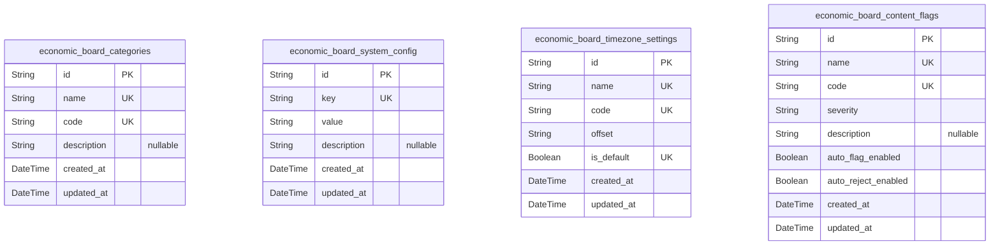
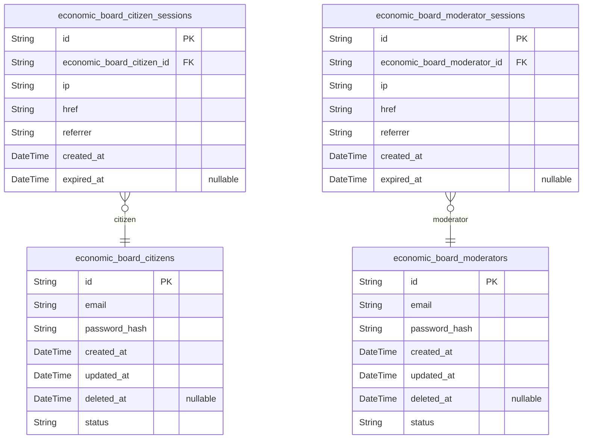
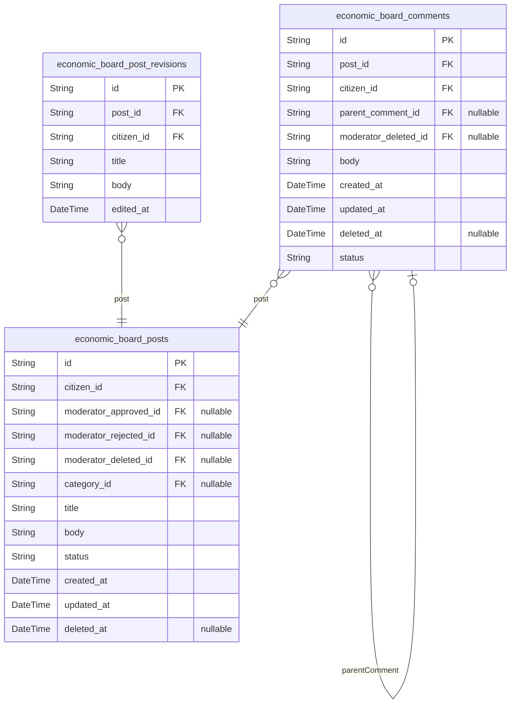
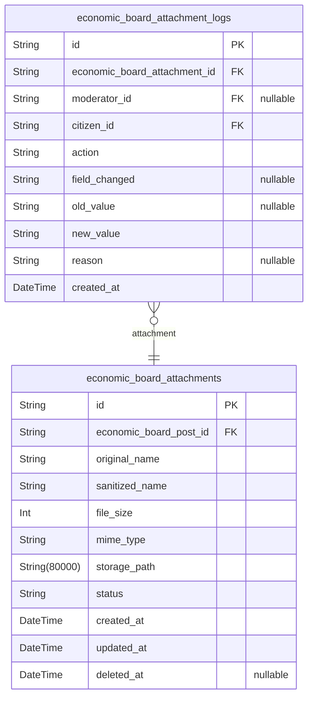
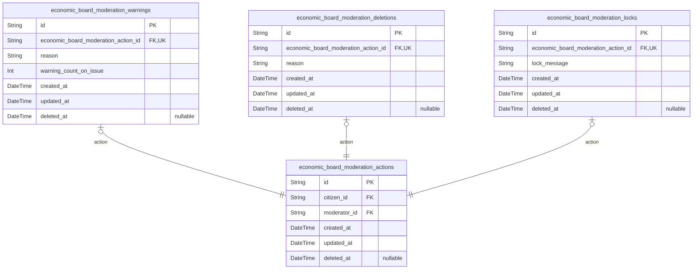
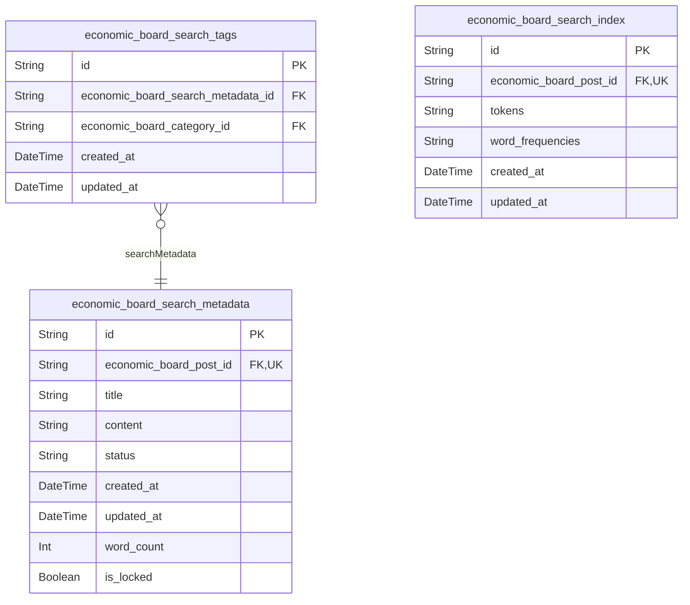

# Prisma Markdown

> Generated by [`prisma-markdown`](https://github.com/samchon/prisma-markdown)

- [Systematic](#systematic)
- [Actors](#actors)
- [Content](#content)
- [Attachments](#attachments)
- [Moderation](#moderation)
- [Search](#search)

## Systematic

```mermaid
erDiagram
"economic_board_categories" {
  String id PK
  String name UK
  String code UK
  String description "nullable"
  DateTime created_at
  DateTime updated_at
}
"economic_board_system_config" {
  String id PK
  String key UK
  String value
  String description "nullable"
  DateTime created_at
  DateTime updated_at
}
"economic_board_timezone_settings" {
  String id PK
  String name UK
  String code UK
  String offset
  Boolean is_default UK
  DateTime created_at
  DateTime updated_at
}
"economic_board_content_flags" {
  String id PK
  String name UK
  String code UK
  String severity
  String description "nullable"
  Boolean auto_flag_enabled
  Boolean auto_reject_enabled
  DateTime created_at
  DateTime updated_at
}
```

### `economic_board_categories`

System-defined categories for tagging and filtering discussion posts.

Contains the predefined set of topics used to classify and search content
on the economic and political discussion board. These categories are
immutable core system values that enable consistent tagging and filtering
across the platform. Citizens can filter posts by these categories, and
moderators use them to organize content.

Each category has a human-readable name and a unique code used in API
calls and search queries. Change to this list requires
administrator-level deployment and is not editable by users or moderators
through the UI.

Properties as follows:

- `id`: Primary Key.
- `name`
  > Human-readable name of the category (e.g., "economy", "politics"). Must
  > be unique within the system.
- `code`
  > Machine-readable code identifier for the category (e.g., "economy",
  > "politics"). Must be unique and used in search and filtering APIs.
- `description`
  > Detailed description of the category's scope and usage guidelines. Used
  > for internal documentation and moderator reference.
- `created_at`: Timestamp when this category was created in the system.
- `updated_at`
  > Timestamp when this category was last updated. System field maintained
  > automatically.

### `economic_board_system_config`

Global configuration settings for the economic board platform.

Stores critical system-wide parameters that control the behavior, limits,
and features of the discussion board. These are configuration values that
determine how the system operates, such as character limits, time
windows, and feature toggles.

This table serves as the single source of truth for all system
configuration parameters. Modifications require administrative access and
should be made with extreme caution as they affect all users. Values are
read by the application during runtime to enforce business rules and
behavioral constraints.

Properties as follows:

- `id`: Primary Key.
- `key`
  > Configuration key name (e.g., "comment_max_length", "edit_window_hours").
  > Must be unique.
- `value`
  > JSON-serialized value of the configuration setting (e.g., "500", "24",
  > "true"). Can be string, number, boolean, or complex JSON object.
- `description`
  > Human-readable description of what this configuration controls and its
  > business purpose.
- `created_at`: Timestamp when this configuration entry was added to the system.
- `updated_at`
  > Timestamp when this configuration entry was last modified. System field
  > maintained automatically.

### `economic_board_timezone_settings`

Timezone configuration for user-facing timestamp display.

Contains supported timezone identifiers that the system uses to convert
UTC timestamps to local time for display to users. The system stores all
timestamps internally in UTC, but presents them in the user's local
timezone.

This table ensures consistency in time representation across the
platform. The system endpoint for user timezone registration uses values
from this table to validate user selections. Only timezones listed here
can be selected by users.

The primary timezone ("Asia/Seoul") is pre-configured and required for
the system to function correctly in the target market.

Properties as follows:

- `id`: Primary Key.
- `name`
  > Full timezone name from the IANA timezone database (e.g., "Asia/Seoul",
  > "America/New_York"). Must be a valid timezone identifier.
- `code`
  > Short identifier for the timezone (e.g., "KST", "EST"). Used for display
  > in the UI where space is limited.
- `offset`
  > UTC offset in format +09:00 or -05:00 representing the timezone
  > difference from UTC.
- `is_default`
  > Indicates whether this timezone is the system default (true) or an
  > optional selection (false). Exactly one record should have
  > is_default=true.
- `created_at`: Timestamp when this timezone setting was added to the system.
- `updated_at`
  > Timestamp when this timezone setting was last modified. System field
  > maintained automatically.

### `economic_board_content_flags`

System-defined content flag categories for automated and manual moderation.

Contains categories of content violations that trigger automated
detection or manual moderation actions. These flags are used to identify
potentially problematic posts such as hate speech, threats, doxxing, or
false information.

When a post is flagged by automated systems or user reports, a matching
flag from this table is applied to trigger moderation workflows. Each
flag defines the violation type, severity level, and automated handling
rules.

This table serves as the authoritative reference for moderation systems
and must be maintained with care by administrators.

Properties as follows:

- `id`: Primary Key.
- `name`
  > Human-readable name of the content flag category (e.g., "hate_speech",
  > "doxxing"). Must be unique.
- `code`
  > Machine-readable code identifier for the flag (e.g., "hate_speech",
  > "doxxing"). Used by detection systems and moderation APIs.
- `severity`
  > Severity level of the violation: "low", "medium", or "high". Determines
  > automated response and moderator priority.
- `description`
  > Detailed explanation of what types of content this flag identifies and
  > examples of violations.
- `auto_flag_enabled`
  > Whether this flag type is actively monitored by automated detection
  > systems.
- `auto_reject_enabled`
  > Whether posts flagged with this type should be automatically rejected
  > (instead of just flagged for review).
- `created_at`: Timestamp when this flag type was added to the system.
- `updated_at`
  > Timestamp when this flag type was last modified. System field maintained
  > automatically.

## Actors

```mermaid
erDiagram
"economic_board_citizens" {
  String id PK
  String email
  String password_hash
  DateTime created_at
  DateTime updated_at
  DateTime deleted_at "nullable"
  String status
}
"economic_board_citizen_sessions" {
  String id PK
  String economic_board_citizen_id FK
  String ip
  String href
  String referrer
  DateTime created_at
  DateTime expired_at "nullable"
}
"economic_board_moderators" {
  String id PK
  String email
  String password_hash
  DateTime created_at
  DateTime updated_at
  DateTime deleted_at "nullable"
  String status
}
"economic_board_moderator_sessions" {
  String id PK
  String economic_board_moderator_id FK
  String ip
  String href
  String referrer
  DateTime created_at
  DateTime expired_at "nullable"
}
"economic_board_citizen_sessions" }o--|| "economic_board_citizens" : citizen
"economic_board_moderator_sessions" }o--|| "economic_board_moderators" : moderator
```

### `economic_board_citizens`

Core identity record for citizens who participate in economic and
political discussions.

Each citizen has a unique, persistent account that links all their posts,
comments, attachments, warnings, and moderation history. This table
stores authentication credentials and account status metadata.

Citizens initiate content creation and interaction, requiring
authentication and authorization. This table serves as the authoritative
source for citizen identity and ban/suspension status within the system.

The relationship to citizen_sessions is one-to-many. Each citizen can
have multiple active sessions concurrently via different devices or
browsing contexts.

Account deletion triggers anonymization of content ({@link
economic_board_posts}, [economic_board_comments](#economic_board_comments)) while preserving
audit trail integrity.

Properties as follows:

- `id`: Primary Key.
- `email`
  > Citizen's contact email address used for authentication and
  > notifications. Must be unique and verified before posting content.
- `password_hash`
  > Hashed password for authentication using bcrypt algorithm. Never stores
  > plain text passwords.
- `created_at`
  > Timestamp when this citizen account was created. Always reflects the
  > system's UTC clock.
- `updated_at`
  > Timestamp of the last modification to this citizen account record.
  > Updated on password changes, profile edits, or status changes.
- `deleted_at`
  > Timestamp when this citizen account was deleted. When not null, the
  > account is considered deleted and inaccessible. Null indicates active
  > account.
- `status`
  > Current account status. Valid values: 'active', 'suspended', 'banned'.
  > Suspended (3 warnings) temporarily blocks posting. Banned (3 suspensions)
  > permanently blocks all activity.

### `economic_board_citizen_sessions`

Session records for authenticated citizen sessions.

Tracks active connections from citizens to the platform using JWT
authentication. Each record represents a single login session from a
specific device, browser, or IP address.

Sessions are managed purely by the authentication service and are not
directly manipulated by citizens. They are automatically expired based on
timeout policies and invalidated during logout or password changes.

All required fields match the session table specification exactly. No
additional fields are permitted. This table does not store tokens, user
agent, or device information.

Relationship to economic_board_citizens is many-to-one: one citizen can
have many active sessions concurrently.

Properties as follows:

- `id`: Primary Key.
- `economic_board_citizen_id`: The citizen this session belongs to. [economic_board_citizens.id](#economic_board_citizens).
- `ip`
  > IP address from which this session was initiated. Used for security
  > monitoring and abuse detection.
- `href`
  > URL of the page from which the user initiated the login session. Used for
  > traffic origin analysis.
- `referrer`
  > Referrer URL that led the user to the login page. Used for marketing and
  > user acquisition analysis.
- `created_at`
  > Timestamp when this session was created and the JWT token was issued.
  > This is the authoritative start time of the session.
- `expired_at`
  > Timestamp when this session will expire. If null, the session has not yet
  > been explicitly expired through logout or password change. When null, the
  > session may be manually invalidated.

### `economic_board_moderators`

Core identity record for moderators who administrate and oversee economic
and political discussion content.

Each moderator has a unique, persistent account that links all their
moderation actions, warnings issued, posts approved or rejected, and
audit logs. This table stores authentication credentials and account
status metadata.

Moderators are granted elevated privileges to manage content integrity
and enforce community guidelines. This table serves as the authoritative
source for moderator identity and activity within the system.

The relationship to moderator_sessions is one-to-many. Each moderator can
have multiple active sessions concurrently via different devices or
browsing contexts.

Moderator accounts are created only by administrators and cannot be
self-signed up. Account deletion is not permitted - only deactivation via
status change.

Properties as follows:

- `id`: Primary Key.
- `email`
  > Moderator's contact email address used for authentication and
  > notifications. Must be unique and verified during account creation.
- `password_hash`
  > Hashed password for authentication using bcrypt algorithm. Never stores
  > plain text passwords.
- `created_at`
  > Timestamp when this moderator account was created. Always reflects the
  > system's UTC clock.
- `updated_at`
  > Timestamp of the last modification to this moderator account record.
  > Updated on password changes or status changes.
- `deleted_at`
  > Timestamp when this moderator account was deactivated. Cannot be truly
  > deleted per business rules - only deactivated via status field. When not
  > null, the account is effectively disabled.
- `status`
  > Current account status. Valid values: 'active', 'deactivated'. When
  > 'deactivated', the moderator can no longer authenticate and perform any
  > moderator actions. No permanent deletion of moderator accounts permitted.

### `economic_board_moderator_sessions`

Session records for authenticated moderator sessions.

Tracks active connections from moderators to the platform using JWT
authentication. Each record represents a single login session from a
specific device, browser, or IP address.

Sessions are managed purely by the authentication service and are not
directly manipulated by moderators. They are automatically expired based
on timeout policies and invalidated during logout or password changes.

All required fields match the session table specification exactly. No
additional fields are permitted. This table does not store tokens, user
agent, or device information.

Relationship to economic_board_moderators is many-to-one: one moderator
can have many active sessions concurrently.

Properties as follows:

- `id`: Primary Key.
- `economic_board_moderator_id`
  > The moderator this session belongs to. {@link
  > economic_board_moderators.id}.
- `ip`
  > IP address from which this session was initiated. Used for security
  > monitoring and abuse detection.
- `href`
  > URL of the page from which the user initiated the login session. Used for
  > traffic origin analysis.
- `referrer`
  > Referrer URL that led the user to the login page. Used for marketing and
  > user acquisition analysis.
- `created_at`
  > Timestamp when this session was created and the JWT token was issued.
  > This is the authoritative start time of the session.
- `expired_at`
  > Timestamp when this session will expire. If null, the session has not yet
  > been explicitly expired through logout or password change. When null, the
  > session may be manually invalidated.

## Content

```mermaid
erDiagram
"economic_board_posts" {
  String id PK
  String citizen_id FK
  String moderator_approved_id FK "nullable"
  String moderator_rejected_id FK "nullable"
  String moderator_deleted_id FK "nullable"
  String category_id FK "nullable"
  String title
  String body
  String status
  DateTime created_at
  DateTime updated_at
  DateTime deleted_at "nullable"
}
"economic_board_post_revisions" {
  String id PK
  String post_id FK
  String citizen_id FK
  String title
  String body
  DateTime edited_at
}
"economic_board_comments" {
  String id PK
  String post_id FK
  String citizen_id FK
  String parent_comment_id FK "nullable"
  String moderator_deleted_id FK "nullable"
  String body
  DateTime created_at
  DateTime updated_at
  DateTime deleted_at "nullable"
  String status
}
"economic_board_post_revisions" }o--|| "economic_board_posts" : post
"economic_board_comments" }o--|| "economic_board_posts" : post
"economic_board_comments" }o--o| "economic_board_comments" : parentComment
```

### `economic_board_posts`

Main discussion posts submitted by citizens, subject to moderation.

Represents the primary content entities on the economic/political board.
Posts are created by authenticated citizens and must pass moderation
review before becoming publicly visible.

Each post has a lifecycle: initially "pending" (invisible to citizens),
then either "published" (publicly visible) or "rejected" (archived).
Moderators can delete published posts, which sets the deleted_at
timestamp.

The 24-hour editing window is enforced via the post_revisions table. A
post can only be edited within 24 hours of creation and edits are tracked
separately to preserve original content.

Post status directly controls visibility: only published posts appear in
feeds, search results, and category filters. Rejected posts are never
shown.

Related to citizens via the citizen_id foreign key and to post_revisions
via one-to-many relationship. Attachments are managed via
economic_board_attachment_logs referencing this post's ID.

Properties as follows:

- `id`: Primary Key.
- `citizen_id`: The citizen who created this post. [economic_board_citizens.id](#economic_board_citizens).
- `moderator_approved_id`
  > The moderator who approved this post. Nullable if not yet approved or if
  > rejected. [economic_board_moderators.id](#economic_board_moderators).
- `moderator_rejected_id`
  > The moderator who rejected this post. Nullable if not rejected. {@link
  > economic_board_moderators.id}.
- `moderator_deleted_id`
  > The moderator who permanently deleted this post. Nullable unless deleted.
  > [economic_board_moderators.id](#economic_board_moderators).
- `category_id`
  > The category tag assigned to this post for search and filtering. {@link
  > economic_board_categories.id}.
- `title`
  > The title of the discussion post, up to 10,000 characters. Mandatory
  > field.
- `body`
  > The main content of the discussion post, up to 10,000 characters.
  > Mandatory field.
- `status`
  > Current visibility state of the post. Valid values: 'pending',
  > 'published', 'rejected'. Initially defaulting to 'pending' upon creation.
- `created_at`
  > Timestamp when the post was originally created and submitted by the
  > citizen. Always set by system in UTC.
- `updated_at`
  > Timestamp of the last update to the post's metadata (status, moderation
  > decisions). Does not include edits tracked in post_revisions table.
- `deleted_at`
  > Timestamp when the post was permanently deleted by a moderator. If null,
  > the post is not deleted. For audit purposes.

### `economic_board_post_revisions`

Historical record of post edits made within the 24-hour editing window.

Records each edit a citizen makes to their post within 24 hours of its
initial submission. Used to preserve original content and enable "edited"
labels.

Each revision is immutable and stored as a complete snapshot. Only
citizens can create revisions, and only within the 24-hour window. After
this window, no revisions are created.

Completes the 24-hour editing capability for posts. The system uses this
table to display "Edited" indicators without modifying the main
economic_board_posts.record.

This table is subsidiary - it cannot exist without a corresponding post,
and is never accessed directly by UI clients.

Linked to economic_board_posts by post_id.

Properties as follows:

- `id`: Primary Key.
- `post_id`
  > The parent post being revised. Must exist. {@link
  > economic_board_posts.id}.
- `citizen_id`: The citizen who made this revision. [economic_board_citizens.id](#economic_board_citizens).
- `title`: Title version at the time of this edit. Same as post.title if unchanged.
- `body`: Content version at the time of this edit. Same as post.body if unchanged.
- `edited_at`
  > Timestamp when this revision was saved. Must be within 24 hours of the
  > post's created_at timestamp.

### `economic_board_comments`

User comments attached to published discussion posts.

Allows citizens to respond directly to published posts. Comments appear
immediately upon submission and are visible to all users.

Comments are primary entities: citizens need to manage them independently
(edit within 24 hours, delete their own, view all comments they've made).
Posts can have many comments, and comments can be moderated independently
of their parent post.

Comments have their own 24-hour editing window, separate from the post's
window. After 24 hours, comments cannot be edited.

Comments cannot be posted on pending or rejected posts. Only published
posts are commentable.

Comments respect thread integrity: if a post is deleted, comments remain
visible with "[Original post removed]" indicator.

Subject to character limits: each comment is limited to 500 characters
(enforced at application layer).

Properties as follows:

- `id`: Primary Key.
- `post_id`
  > The published post this comment replies to. Must reference a post with
  > status 'published'. [economic_board_posts.id](#economic_board_posts).
- `citizen_id`: The citizen who wrote this comment. [economic_board_citizens.id](#economic_board_citizens).
- `parent_comment_id`
  > If this is a reply to another comment, references the parent comment. For
  > thread nesting. [economic_board_comments.id](#economic_board_comments).
- `moderator_deleted_id`
  > The moderator who deleted this comment. Nullable unless deleted. {@link
  > economic_board_moderators.id}.
- `body`
  > The content of the comment, up to 500 characters. Required and
  > non-nullable.
- `created_at`: Timestamp when the comment was submitted. Always set by system in UTC.
- `updated_at`
  > Timestamp of the last edit to the comment (within 24-hour window), or
  > field update. Does not include deletion time.
- `deleted_at`
  > Timestamp when the comment was permanently deleted by a moderator. If
  > null, the comment is not deleted. For audit and thread integrity.
- `status`
  > Current visibility state of the comment. Valid values: 'published',
  > 'deleted'. Initially 'published'. Moderators set to 'deleted'.

## Attachments

```mermaid
erDiagram
"economic_board_attachments" {
  String id PK
  String economic_board_post_id FK
  String original_name
  String sanitized_name
  Int file_size
  String mime_type
  String(80000) storage_path
  String status
  DateTime created_at
  DateTime updated_at
  DateTime deleted_at "nullable"
}
"economic_board_attachment_logs" {
  String id PK
  String economic_board_attachment_id FK
  String moderator_id FK "nullable"
  String citizen_id FK
  String action
  String field_changed "nullable"
  String old_value "nullable"
  String new_value
  String reason "nullable"
  DateTime created_at
}
"economic_board_attachment_logs" }o--|| "economic_board_attachments" : attachment
```

### `economic_board_attachments`

Stores metadata for all file attachments uploaded to discussion posts.

Represents the authoritative record of each file attached to a post. This
is a primary entity that is created when a user uploads a file and
accessed when serving attachments to users or moderators. The system
enforces file size (≤10MB) and format restrictions (JPG, PNG, GIF, WEBP,
PDF, TXT, DOCX, XLSX) at upload time. Attachments are never deleted
permanently—only soft-deleted to preserve audit trails. Attachment data
is persistent even if the parent post is deleted, as required for
compliance.

Each attachment is linked to exactly one post. Attachment metadata
includes original filename, sanitized name, storage location, file size,
MIME type, and current status (uploaded, processed, quarantined). This
table is referenced directly by the posts table and is accessed via API
to serve file downloads or display file previews.

Properties as follows:

- `id`: Primary Key.
- `economic_board_post_id`: The post this attachment is linked to. [economic_board_posts.id](#economic_board_posts).
- `original_name`: The original filename as uploaded by the user.
- `sanitized_name`
  > The sanitized filename after removing special characters (only
  > alphanumeric, hyphen, underscore, period allowed).
- `file_size`
  > Size of the file in bytes. Enforced to be ≤ 10MB (10485760 bytes) during
  > upload.
- `mime_type`
  > The MIME type of the file (e.g., 'image/jpeg', 'application/pdf').
  > Verified against allowed formats on upload: image/jpeg, image/png,
  > image/gif, image/webp, application/pdf, text/plain,
  > application/vnd.openxmlformats-officedocument.wordprocessingml.document,
  > application/vnd.openxmlformats-officedocument.spreadsheetml.sheet.
- `storage_path`
  > The unique, securely signed URI where the file is stored in object
  > storage. Cannot be a direct path; must use signed, time-limited endpoints
  > for access.
- `status`
  > Current state of the attachment. Values: 'uploaded' (after initial
  > upload), 'processed' (after validation), 'quarantined' (if flagged for
  > malware or blocked format). Never delete, only transition between these
  > states.
- `created_at`: Timestamp when the attachment record was first created in the system.
- `updated_at`: Timestamp when the attachment was last modified (e.g., status change).
- `deleted_at`
  > Timestamp when this attachment was soft-deleted. NULL means active. Used
  > solely for audit and retrieval—not for access control. System retains
  > attachments for 180 days after deletion.

### `economic_board_attachment_logs`

Tracks all changes made to attachment records for audit compliance.

This subsidiary table records every action performed on an
attachment—specifically status changes, metadata updates, and deletion
events. It is automatically populated by system processes and admin
actions, never by direct user input. Required to meet audit trail
requirements for 180-day retention and mandatory transparency in
moderation actions.

Each log entry records the attachment ID (foreign key), the actor
responsible (moderator or system), the action performed, and the
before/after values of affected fields. Real-time updates to attachment
status (e.g., from 'uploaded' to 'processed') are logged here. This table
is referenced only by the attachment table and never accessed directly by
frontend UI, only by moderation or compliance systems.

Properties as follows:

- `id`: Primary Key.
- `economic_board_attachment_id`
  > The attachment this log entry refers to. {@link
  > economic_board_attachments.id}.
- `moderator_id`
  > The moderator who performed the action (if applicable). NULL if action
  > triggered by system (e.g., automated scan). {@link
  > economic_board_moderators.id}.
- `citizen_id`
  > The citizen who originally uploaded the file, for context. May be needed
  > for notifications. [economic_board_citizens.id](#economic_board_citizens).
- `action`
  > The operation performed. Values: 'uploaded', 'processed', 'quarantined',
  > 'deleted', 'status_changed'.
- `field_changed`
  > The specific field that was changed, if any (e.g., 'status', 'file_size',
  > 'mime_type'). NULL if no field changed but action occurred (e.g.,
  > 'deleted').
- `old_value`
  > The previous value of the field_changed, stored as stringified JSON for
  > generality. E.g., '{"status": "uploaded"}'. NULL if no prior value (e.g.,
  > on creation).
- `new_value`
  > The new value of the field_changed, stored as stringified JSON for
  > generality. E.g., '{"status": "processed"}'.
- `reason`
  > Free-form description of why the action was taken (e.g., 'File exceeded
  > size limit', 'Malware detected', 'Moderator approval'). Required for
  > moderator-initiated changes; optional for system actions.
- `created_at`
  > Timestamp when this log entry was created. Always matches when the change
  > occurred.

## Moderation

```mermaid
erDiagram
"economic_board_moderation_actions" {
  String id PK
  String citizen_id FK
  String moderator_id FK
  DateTime created_at
  DateTime updated_at
  DateTime deleted_at "nullable"
}
"economic_board_moderation_warnings" {
  String id PK
  String economic_board_moderation_action_id FK,UK
  String reason
  Int warning_count_on_issue
  DateTime created_at
  DateTime updated_at
  DateTime deleted_at "nullable"
}
"economic_board_moderation_deletions" {
  String id PK
  String economic_board_moderation_action_id FK,UK
  String reason
  DateTime created_at
  DateTime updated_at
  DateTime deleted_at "nullable"
}
"economic_board_moderation_locks" {
  String id PK
  String economic_board_moderation_action_id FK,UK
  String lock_message
  DateTime created_at
  DateTime updated_at
  DateTime deleted_at "nullable"
}
"economic_board_moderation_warnings" |o--|| "economic_board_moderation_actions" : action
"economic_board_moderation_deletions" |o--|| "economic_board_moderation_actions" : action
"economic_board_moderation_locks" |o--|| "economic_board_moderation_actions" : action
```

### `economic_board_moderation_actions`

Central record of all moderation actions performed on the economic board.

This is the primary audit entity that captures the metadata of all
moderation actions including warnings, deletions, and locks. Each action
record is linked to exactly one specific type of action through the
subtype tables, ensuring database-level integrity and avoiding nullable
fields.

All moderation activities originate from this table, which is accessed by
moderators on their dashboard to review and manage community content. The
table tracks who performed the action, when it occurred, and provides the
context for the specific moderation event.

Subtype tables (warnings, deletions, locks) extend this base record with
domain-specific data.

Each action can be associated with a citizen (target) and a moderator
(actor), creating a complete audit trail. The deleted_at field allows for
reversible actions and audit retention in compliance with platform
policy.

Properties as follows:

- `id`: Primary Key.
- `citizen_id`
  > The citizen targeted by this moderation action. {@link
  > economic_board_citizens.id}.
- `moderator_id`
  > The moderator who performed this action. {@link
  > economic_board_moderators.id}.
- `created_at`: UTC timestamp when this moderation action was initiated. Always non-null.
- `updated_at`
  > UTC timestamp when this moderation action was last modified. Always
  > non-null.
- `deleted_at`
  > UTC timestamp when this moderation action was logically deleted. Null if
  > still active. Required for audit trail retention of all actions per
  > policy.

### `economic_board_moderation_warnings`

Specific record for warning actions issued to citizens for policy
violations.

This subsidiary table captures detailed information about each warning
issued to a citizen. Each warning record is linked via a 1:1 relationship
to a main moderation action, ensuring that every warning has exactly one
associated audit record in economic_board_moderation_actions.

Warnings are tracked per citizen to enforce the policy of suspending
users after three active warnings. Each warning entry includes the reason
given by the moderator, providing transparency to the citizen.

The attached moderation action record (in
economic_board_moderation_actions) contains the timestamps and moderator
information. This table is exclusively accessed through its parent action
record and never independently managed by users.

No other fields are needed as all required context is already captured in
the parent table and through the foreign key relationship to citizens.

Properties as follows:

- `id`: Primary Key.
- `economic_board_moderation_action_id`
  > The main moderation action record that this warning extends. 1:1
  > relationship with economic_board_moderation_actions. {@link
  > economic_board_moderation_actions.id}.
- `reason`
  > The specific reason given by the moderator for issuing this warning. Must
  > be at least 10 characters as required by policy. Required for
  > transparency and audit.
- `warning_count_on_issue`
  > The number of active warnings the citizen had at the time this warning
  > was issued. Used to trigger suspension when reaching three warnings.
- `created_at`
  > UTC timestamp when this warning was issued. Mirrors the parent action's
  > created_at and maintained for consistency.
- `updated_at`
  > UTC timestamp when this warning was last updated. Mirrors the parent
  > action's updated_at and maintained for consistency.
- `deleted_at`
  > UTC timestamp when this warning was logically deleted. Null if still
  > active. Required for audit trail retention of all actions per policy.

### `economic_board_moderation_deletions`

Specific record for post or comment deletions performed by moderators.

This subsidiary table captures detailed information about each deletion
action taken by a moderator. Each deletion record is linked via a 1:1
relationship to a main moderation action, ensuring that every deletion
has exactly one associated audit record in
economic_board_moderation_actions.

Deletions are tracked to ensure transparency to citizens who had their
content removed and to provide an audit trail for compliance. This table
stores the reason for deletion and the specific content affected (via
foreign key in the parent table).

The attached moderation action record (in
economic_board_moderation_actions) contains the timestamps and moderator
information. This table is exclusively accessed through its parent action
record and never independently managed by users.

No other fields are needed as all required context is already captured in
the parent table and through the foreign key relationship to content
entities.

Properties as follows:

- `id`: Primary Key.
- `economic_board_moderation_action_id`
  > The main moderation action record that this deletion extends. 1:1
  > relationship with economic_board_moderation_actions. {@link
  > economic_board_moderation_actions.id}.
- `reason`
  > The specific reason given by the moderator for this deletion. Must be at
  > least 10 characters as required by policy. Required for transparency and
  > audit.
- `created_at`
  > UTC timestamp when this deletion was performed. Mirrors the parent
  > action's created_at and maintained for consistency.
- `updated_at`
  > UTC timestamp when this deletion was last updated. Mirrors the parent
  > action's updated_at and maintained for consistency.
- `deleted_at`
  > UTC timestamp when this deletion was logically deleted. Null if still
  > active. Required for audit trail retention of all actions per policy.

### `economic_board_moderation_locks`

Specific record for discussion threads locked by moderators to prevent
further comments.

This subsidiary table captures detailed information about each thread
lock action performed by a moderator. Each lock record is linked via a
1:1 relationship to a main moderation action, ensuring that every lock
has exactly one associated audit record in
economic_board_moderation_actions.

Thread locks are used to prevent further comments on contentious
discussions while preserving the existing conversation history. This
table stores a custom message explaining the lock reason, which is
displayed on the locked thread.

The attached moderation action record (in
economic_board_moderation_actions) contains the timestamps and moderator
information. This table is exclusively accessed through its parent action
record and never independently managed by users.

No other fields are needed as all required context is already captured in
the parent table and through the foreign key relationship to the target
post.

Properties as follows:

- `id`: Primary Key.
- `economic_board_moderation_action_id`
  > The main moderation action record that this lock extends. 1:1
  > relationship with economic_board_moderation_actions. {@link
  > economic_board_moderation_actions.id}.
- `lock_message`
  > The message displayed to users when a thread is locked. This can be
  > customized by the moderator to explain the reason (e.g., 'Discussion
  > closed due to personal attacks'). Must be clear and comply with
  > transparency policy.
- `created_at`
  > UTC timestamp when this lock was applied. Mirrors the parent action's
  > created_at and maintained for consistency.
- `updated_at`
  > UTC timestamp when this lock was last updated. Mirrors the parent
  > action's updated_at and maintained for consistency.
- `deleted_at`
  > UTC timestamp when this lock was logically removed. Null if still active.
  > Required for audit trail retention of all actions per policy.

## Search

```mermaid
erDiagram
"economic_board_search_metadata" {
  String id PK
  String economic_board_post_id FK,UK
  String title
  String content
  String status
  DateTime created_at
  DateTime updated_at
  Int word_count
  Boolean is_locked
}
"economic_board_search_tags" {
  String id PK
  String economic_board_search_metadata_id FK
  String economic_board_category_id FK
  DateTime created_at
  DateTime updated_at
}
"economic_board_search_index" {
  String id PK
  String economic_board_post_id FK,UK
  String tokens
  String word_frequencies
  DateTime created_at
  DateTime updated_at
}
"economic_board_search_tags" }o--|| "economic_board_search_metadata" : searchMetadata
```

### `economic_board_search_metadata`

Denormalized search metadata for economic board posts.

Stores searchable fields from primary posts for optimized query
performance. This table is updated asynchronously from the
economic_board_posts table to avoid impacting transaction performance
during content creation. Contains pre-computed fields used by full-text
search engines to return results under 2 seconds.

Data fields include the post title, content, and derived metadata like
word count and sentiment score. This table enables fast keyword searches
across thousands of posts without burdening the main transactional table
with indexing overhead.

Search metadata is not intended for direct user interaction but serves as
the backbone of the post discovery system. Updates are triggered by
changes to the main economic_board_posts table.

Properties as follows:

- `id`: Primary Key.
- `economic_board_post_id`
  > Reference to the primary post this search metadata describes. {@link
  > economic_board_posts.id}.
- `title`
  > The title of the post being indexed for search. Copied from
  > economic_board_posts.title.
- `content`
  > The full text content of the post being indexed for search. Copied from
  > economic_board_posts.content.
- `status`
  > The current status of the related post: 'pending', 'published', or
  > 'rejected'. Used to filter search results.
- `created_at`
  > When this search metadata record was generated. Matches
  > economic_board_posts.created_at, but stored here for search efficiency.
- `updated_at`
  > When this search metadata record was last updated. Updates when the main
  > post is edited or status changes.
- `word_count`
  > Total number of words in the post content. Pre-calculated to avoid
  > runtime computation during search.
- `is_locked`
  > Whether the related post has been locked by a moderator. Used to exclude
  > locked discussions from search result relevance scoring.

### `economic_board_search_tags`

Tags associated with search metadata for efficient filtering and
tagging-based discovery.

This table links search metadata records with predefined categories,
allowing for fast filtering of search results by topic. Each entry
represents a single tag association for a specific post.

Tags are derived from economic_board_categories and associated via
economic_board_search_metadata. This denormalized structure avoids
expensive JOIN operations during search queries.

The primary use is for category-based filters such as "economy",
"politics", and "markets". This table enables instant display of what
categories a post belongs to during search and discovery.

Each record represents one tag per post, so multiple records may exist
for articles with multiple tags.

Properties as follows:

- `id`: Primary Key.
- `economic_board_search_metadata_id`
  > References the search metadata record this tag is associated with. {@link
  > economic_board_search_metadata.id}.
- `economic_board_category_id`
  > References the category this tag belongs to. {@link
  > economic_board_categories.id}.
- `created_at`
  > When this tag association was created. Matches the timestamp of the
  > original post's publication or update.
- `updated_at`
  > When this tag association was last updated, usually when the main post
  > was edited or category changed.

### `economic_board_search_index`

Full-text search index for economic board posts.

This table provides an optimized, denormalized structure for
high-performance full-text keyword searching across the entire economic
board. It contains precomputed word vectors from post titles and content
to enable complex text searches with results under 2 seconds.

The index is generated by processing the text from economic_board_posts
content and title fields, eliminating stop words and applying stemming.
Contains text chunks split into searchable units with positional
weighting.

This table is the most important performance component of the search
system — it must be updated immediately whenever a post's content
changes, and queried directly without joining to other tables during
search operations.

The structure supports advanced queries: multilingual text matching,
fuzzy matching, and relevance ranking. This is the intrinsic engine
behind the search functionality.

Properties as follows:

- `id`: Primary Key.
- `economic_board_post_id`
  > Reference to the primary post this index entry is built from. {@link
  > economic_board_posts.id}.
- `tokens`
  > A concatenated string of normalized, normalized, and stemmed word tokens
  > from the post title and content. Used for full-text search matching.
- `word_frequencies`
  > A normalized JSON string containing frequency counts for each searchable
  > word in the post content, including positioning weights.
- `created_at`
  > When this search index entry was generated or last updated. Matches the
  > publication or last edit time of the post.
- `updated_at`: When this index was last updated due to a change in the source post.
