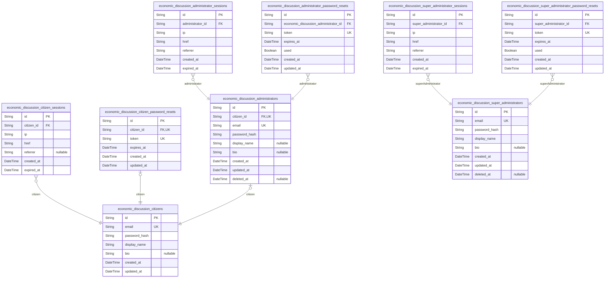
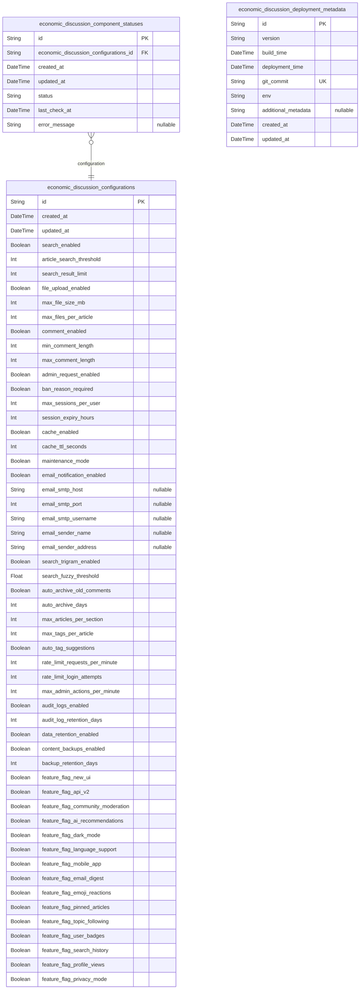
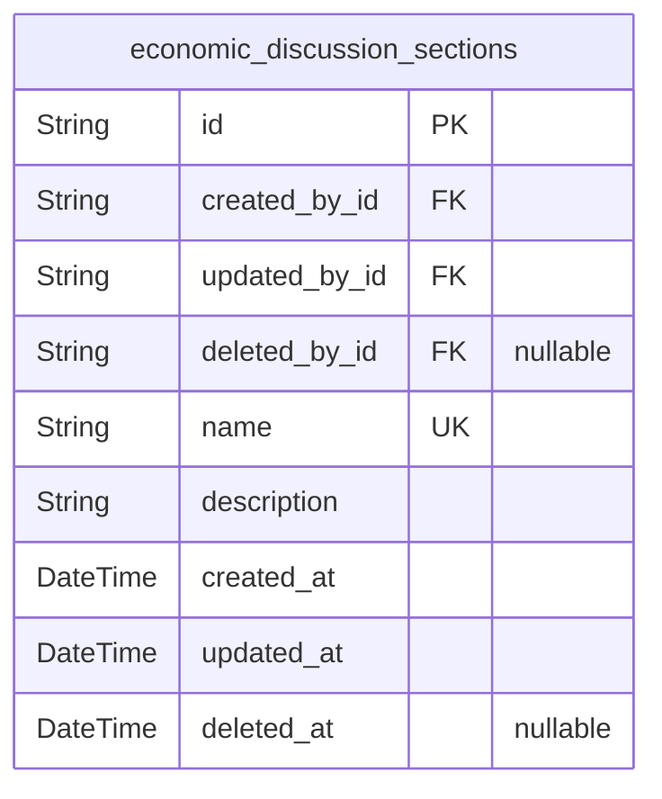
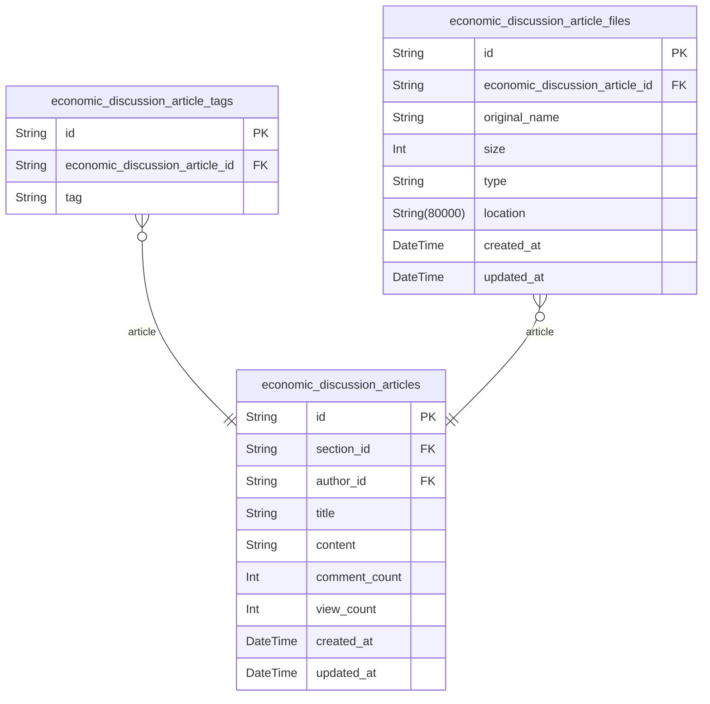
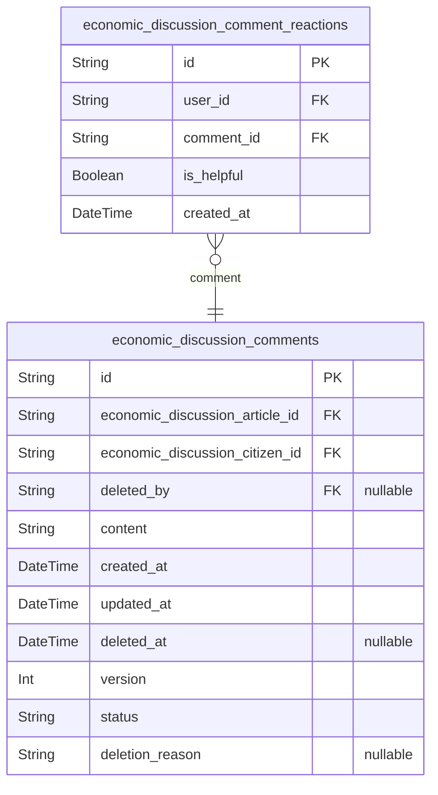
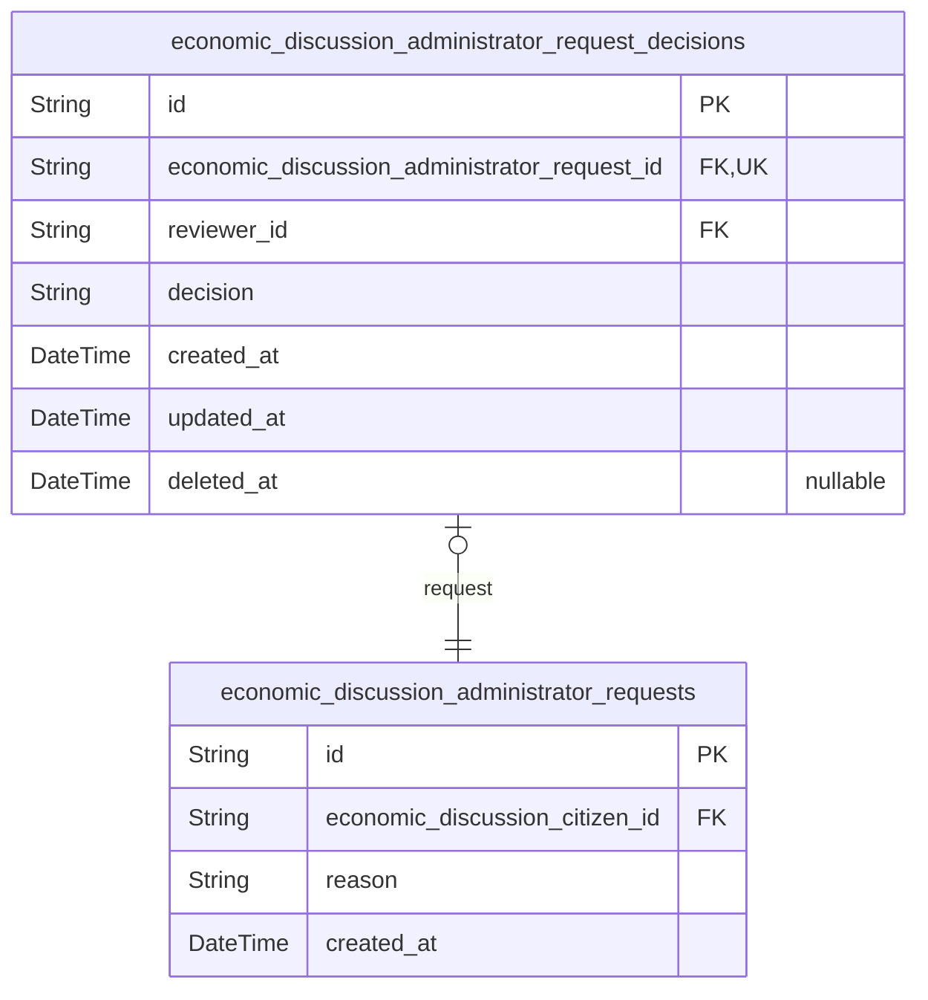
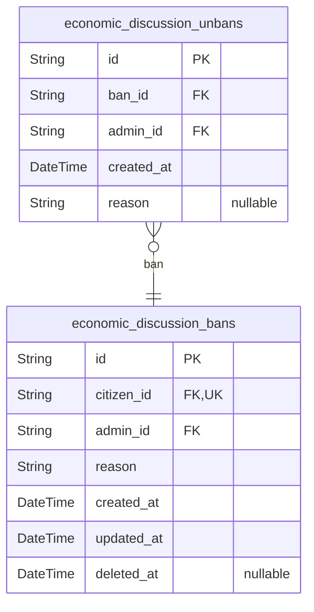

# Prisma Markdown

> Generated by [`prisma-markdown`](https://github.com/samchon/prisma-markdown)

- [Actors](#actors)
- [Systematic](#systematic)
- [Sections](#sections)
- [Articles](#articles)
- [Comments](#comments)
- [Administration](#administration)
- [Banning](#banning)

## Actors

```mermaid
erDiagram
"economic_discussion_citizens" {
  String id PK
  String email UK
  String password_hash
  String display_name
  String bio "nullable"
  DateTime created_at
  DateTime updated_at
}
"economic_discussion_citizen_sessions" {
  String id PK
  String citizen_id FK
  String ip
  String href
  String referrer "nullable"
  DateTime created_at
  DateTime expired_at
}
"economic_discussion_citizen_password_resets" {
  String id PK
  String citizen_id FK,UK
  String token UK
  DateTime expires_at
  DateTime created_at
  DateTime updated_at
}
"economic_discussion_administrators" {
  String id PK
  String citizen_id FK,UK
  String email UK
  String password_hash
  String display_name "nullable"
  String bio "nullable"
  DateTime created_at
  DateTime updated_at
  DateTime deleted_at "nullable"
}
"economic_discussion_administrator_sessions" {
  String id PK
  String administrator_id FK
  String ip
  String href
  String referrer
  DateTime created_at
  DateTime expired_at
}
"economic_discussion_administrator_password_resets" {
  String id PK
  String economic_discussion_administrator_id FK
  String token UK
  DateTime expires_at
  Boolean used
  DateTime created_at
  DateTime updated_at
}
"economic_discussion_super_administrators" {
  String id PK
  String email UK
  String password_hash
  String display_name
  String bio "nullable"
  DateTime created_at
  DateTime updated_at
  DateTime deleted_at "nullable"
}
"economic_discussion_super_administrator_sessions" {
  String id PK
  String super_administrator_id FK
  String ip
  String href
  String referrer
  DateTime created_at
  DateTime expired_at
}
"economic_discussion_super_administrator_password_resets" {
  String id PK
  String super_administrator_id FK
  String token UK
  DateTime expires_at
  Boolean used
  DateTime created_at
  DateTime updated_at
}
"economic_discussion_citizen_sessions" }o--|| "economic_discussion_citizens" : citizen
"economic_discussion_citizen_password_resets" |o--|| "economic_discussion_citizens" : citizen
"economic_discussion_administrators" |o--|| "economic_discussion_citizens" : citizen
"economic_discussion_administrator_sessions" }o--|| "economic_discussion_administrators" : administrator
"economic_discussion_administrator_password_resets" }o--|| "economic_discussion_administrators" : administrator
"economic_discussion_super_administrator_sessions" }o--|| "economic_discussion_super_administrators" : superAdministrator
"economic_discussion_super_administrator_password_resets" }o--|| "economic_discussion_super_administrators" : superAdministrator
```

### `economic_discussion_citizens`

Registered citizen accounts with email/password authentication
credentials and profile information including display name and bio.

Each citizen can register with a unique email and password, manage their
profile by editing their display name and bio, and interact with the
system by creating articles and writing comments. Citizns are the
foundational user type who can request administrator status.

This table stores authentication credentials securely using bcrypt
password hashing. Profile data is kept separate from session persistence
and password reset mechanisms that are handled in companion tables.

All citizen accounts are subject to hard deletion (not soft deletion)
when users explicitly request account removal, which triggers the
permanent removal of all associated articles and comments.

Citizens have no administrative privileges and are restricted to viewing
content, creating articles/comments, and managing their own profile.

Properties as follows:

- `id`: Primary Key.
- `email`
  > Unique email address used for authentication and communication. Must be
  > valid according to RFC 5322 standards and unique across all citizens.
- `password_hash`
  > Cryptographically hashed password using bcrypt algorithm. Never stores
  > plain text passwords. Used for authentication during login.
- `display_name`
  > Public display name shown to other users. Used in article and comment
  > attribution. Must be between 1 and 100 characters.
- `bio`
  > Optional biography or personal description provided by the citizen. Can
  > be edited at any time. Limited to 500 characters.
- `created_at`
  > Timestamp when the citizen account was created. Set once at registration
  > and never modified.
- `updated_at`
  > Timestamp of the last update to the citizen's profile information
  > (display name or bio). Updated automatically on each profile
  > modification.

### `economic_discussion_citizen_sessions`

Tracks login sessions for citizen users. Each session represents one
authentication event with associated connection context and expiration
timing.

Properties as follows:

- `id`: Primary Key.
- `citizen_id`: Citizen's [economic_discussion_citizens.id](#economic_discussion_citizens).
- `ip`: IP address from which the session was initialized.
- `href`: URL of the initial page requested during session creation.
- `referrer`: Referrer URL captured at session creation.
- `created_at`: Timestamp when the session was created.
- `expired_at`
  > Timestamp when the session expires. Sessions must expire for security;
  > unlimited sessions are prohibited unless explicitly requested.

### `economic_discussion_citizen_password_resets`

Password reset tokens for citizen account recovery workflows.

Each token is generated when a citizen requests a password reset and is
used exactly once to verify identity and reset credentials. The system
enforces secure password recovery by requiring tokens to expire within a
defined period.

Tokens are single-use - after successful password reset, the token
becomes invalid and is not reused. The token value is cryptographically
generated and sufficiently random to prevent brute force attacks.

This table supports secure password recovery without exposing user
credentials and prevents token replay attacks by enforcing expiration.
All tokens are linked to a specific citizen account for auditability.

No soft delete is used as reset tokens have finite lifespans and are
purged automatically upon expiration or after use. The system retains
token records for audit trail purposes until expiration.

Properties as follows:

- `id`: Primary Key.
- `citizen_id`
  > The citizen who requested the password reset. {@link
  > economic_discussion_citizens.id}.
- `token`
  > Unique cryptographically secure token for password reset. Must be
  > globally unique and unguessable. Used to verify the identity of the
  > requesting citizen.
- `expires_at`
  > Expiration timestamp for the password reset token. Session must expire to
  > prevent abuse. All tokens have a fixed expiration time for security.
- `created_at`: Timestamp when the reset token was generated and issued to the user.
- `updated_at`
  > Timestamp when the reset token was last modified (typically updated when
  > token is used or invalidated).

### `economic_discussion_administrators`

Administrator accounts with elevated privileges for content and user
moderation, authenticated via email/password.

Represents users who have been granted administrative rights to moderate
content, manage sections, and enforce community guidelines.
Administrators retain the capabilities of regular citizens (creating
articles, commenting) with additional permissions for deletion, banning,
and section management. Each administrator is formally promoted from a
citizen account through a request and approval workflow.

This table contains core authentication credentials (email and password
hash), profile data (display name and bio), and temporal fields for
auditing. It serves as the authoritative identity record for the
administrator actor type. The relationship with
economic_discussion_citizens establishes identity inheritance, ensuring
seamless transition from regular user to administrator status, while
economic_discussion_administrator_sessions manages active login sessions.

All administrative actions performed via the system are logged with this
administrator’s identity as the source.

Properties as follows:

- `id`: Primary Key.
- `citizen_id`
  > Base citizen identity record this administrator was promoted from. {@link
  > economic_discussion_citizens.id}.
- `email`
  > Administrator email address used for authentication and communication.
  > Must be unique system-wide.
- `password_hash`
  > bcrypt-hashed password for secure authentication. Never stored in plain
  > text.
- `display_name`
  > Public-facing name displayed to other users. Override for the base
  > citizen display name if changed.
- `bio`: Optional biography or profile description provided by the administrator.
- `created_at`: Timestamp when this administrator account was created (promotion date).
- `updated_at`: Timestamp last updated (profile edit, password change, etc.).
- `deleted_at`
  > Timestamp when administrator account was soft-deleted. If null, account
  > is active.

### `economic_discussion_administrator_sessions`

Tracks login sessions for administrator actors. Records connection
context and authentication state for auditing and security.

Each session represents a single successful administrator login event.
The session is active from created_at until expired_at, at which point it
becomes invalid. Administrators may have multiple concurrent sessions.

This table is essential for maintaining secure authentication state.
Connection metadata (IP, referrer) helps detect suspicious activity.
Sessions are automatically expired by the system and can be revoked by
administrators.

This table is replenished with new sessions on successful login and does
not support CRUD operations from users. Its data is managed entirely by
the authentication system.

Properties as follows:

- `id`: Primary Key.
- `administrator_id`: Administrator's [economic_discussion_administrators.id](#economic_discussion_administrators).
- `ip`: The IP address from which the session was initiated.
- `href`: The URL of the page from which the login request originated.
- `referrer`: The referrer URL in the HTTP request header at time of login.
- `created_at`: The exact time when this session was created (UTC).
- `expired_at`
  > The time when this session expires and becomes invalid. Sessions MUST
  > expire for security; this field cannot be null.

### `economic_discussion_administrator_password_resets`

Password reset tokens for administrators, used to securely recover access
to their accounts.

This table stores cryptographic tokens issued when an administrator
initiates a password reset request. Each token is single-use and expires
after a limited duration. The system generates and validates tokens
programmatically during the password recovery workflow, never exposing
them to users directly in the UI.

Tokens are created when an administrator requests password reset,
invalidated when used to reset the password, and automatically purged
after expiration. The table ensures that only legitimate, in-flight
password reset requests can alter account credentials.

This is a supporting entity for the administrator actor system and should
not be directly accessed or modified by application logic outside the
authentication service.

Properties as follows:

- `id`: Primary Key.
- `economic_discussion_administrator_id`
  > The administrator account this reset token belongs to. {@link
  > economic_discussion_administrators.id}.
- `token`
  > Unique cryptographic token used to authenticate the password reset
  > request. Must be stored in encoded format and verified during reset.
- `expires_at`
  > Expiration timestamp for the reset token. After this time, the token
  > becomes invalid and cannot be used. Must be non-null to ensure security.
- `used`
  > Indicates whether this reset token has already been consumed to reset the
  > password. Once true, no further operations can use this token.
- `created_at`
  > Timestamp when the reset token was generated and issued to the
  > administrator.
- `updated_at`
  > Timestamp of the last update to this record, typically updated when the
  > 'used' field is set to true.

### `economic_discussion_super_administrators`

Super administrator accounts with highest system privileges including
promotion/demotion rights, authenticated via email/password.

Represents the highest authority level in the system, capable of managing
all administrator promotions and demotions. Unlike regular
administrators, super administrators can elevate other administrators to
super administrator status and demote super administrators (but not
themselves). This entity serves as the root of the privilege hierarchy
and requires strict authentication with secure password hashing.

Each super administrator account is associated with a unique email
address for login and a password hash for authentication security. The
account retains standard profile fields including display name and bio
for personalization. All super administrator accounts are subject to the
same soft delete capability as other actors, preserving audit trails
while allowing for account removal when necessary.

This actor type must have its own dedicated session table
(economic_discussion_super_administrator_sessions) and password reset
table (economic_discussion_super_administrator_password_resets) to
maintain separation of concerns and security domains.

Properties as follows:

- `id`: Primary Key.
- `email`
  > Unique email address used for authentication and system communications.
  > Must be valid per RFC 5322 standard and unique across all actor types.
- `password_hash`
  > bcrypt hash of the user's password. Never store plain text passwords.
  > Required for login authentication functionality.
- `display_name`
  > Public-facing name for the super administrator. Used in UI displays,
  > notifications, and audit trails. Must be non-empty and suitable for
  > public display.
- `bio`
  > Optional personal bio or description provided by the super administrator.
  > Limited to 500 characters for brevity and readability. May contain basic
  > formatting for profile presentation.
- `created_at`
  > Timestamp when the super administrator account was created. Automatically
  > set by the system upon registration.
- `updated_at`
  > Timestamp of the last update to the super administrator account (profile
  > changes, password reset, etc.). Automatically updated by the system.
- `deleted_at`
  > Soft delete timestamp. If null, account is active. If set, account is
  > marked as deleted and cannot be used for authentication. This preserves
  > audit trails while logically removing access.

### `economic_discussion_super_administrator_sessions`

JWT session tokens for super administrator authentication with access and
refresh token support.

Tracks login sessions for super administrators with complete connection
context including IP address, connection URL, and referrer information.
Each session represents a distinct authentication event and is associated
with exactly one super administrator account.

Sessions are append-only audit trails that record when and from where a
super administrator logged in. All sessions have an expiration time to
enforce security policies - sessions cannot remain active indefinitely.

The session data is used for security monitoring, detecting unauthorized
access patterns, and maintaining compliance with authentication
standards. Super administrators can have multiple concurrent sessions.

This table strictly follows the session pattern: no additional fields
beyond the required specification, no updates to existing records, and no
soft deletion of session records.

Properties as follows:

- `id`: Primary Key.
- `super_administrator_id`
  > Associated super administrator account. {@link
  > economic_discussion_super_administrators.id}.
- `ip`: IP address of the device used to initiate the session.
- `href`: URL of the connection endpoint that initiated this session.
- `referrer`: Referrer URL that led the user to this application.
- `created_at`: Timestamp when the session was created.
- `expired_at`
  > Timestamp when the session will expire. Sessions must expire for security
  > - this field is NOT NULL.

### `economic_discussion_super_administrator_password_resets`

Password reset tokens for super administrators with expiration and usage
tracking.

This table stores temporary tokens used for secure password recovery of
super administrator accounts. Each token is single-use, has a limited
expiration period, and is automatically invalidated after use. The system
generates these tokens when super administrators request password resets,
and the tokens are consumed during the password reset process.

Tokens are bound to a specific super administrator via the
super_administrator_id foreign key, ensuring that reset requests are tied
to the correct account. The used flag prevents token reuse, which is a
critical security feature. The expires_at field enforces time-bound
security, ensuring tokens cannot be used indefinitely. This table is
managed entirely by the authentication system and is never directly
accessed or modified by end users.

All records in this table are temporary and expected to be cleaned up
after expiration or use. No permanent user data is stored here, only
ephemeral authentication artifacts that support secure password recovery
workflows.

Properties as follows:

- `id`: Primary Key.
- `super_administrator_id`
  > The super administrator associated with this password reset token. {@link
  > economic_discussion_super_administrators.id}.
- `token`
  > Unique, cryptographically secure token string used for password reset.
  > This value is sent to the super administrator through secure channels
  > (email) and must be presented to complete password reset.
- `expires_at`
  > Expiration timestamp for the password reset token. Tokens are valid only
  > until this time, after which they become invalid and cannot be used for
  > password reset.
- `used`
  > Flag indicating whether this reset token has been used to change a
  > password. Once true, the token is invalidated and cannot be used again.
- `created_at`
  > Timestamp when this password reset token was generated and issued to the
  > super administrator.
- `updated_at`
  > Timestamp of the last update to this record, typically when the token is
  > marked as used.

## Systematic

```mermaid
erDiagram
"economic_discussion_configurations" {
  String id PK
  DateTime created_at
  DateTime updated_at
  Boolean search_enabled
  Int article_search_threshold
  Int search_result_limit
  Boolean file_upload_enabled
  Int max_file_size_mb
  Int max_files_per_article
  Boolean comment_enabled
  Int min_comment_length
  Int max_comment_length
  Boolean admin_request_enabled
  Boolean ban_reason_required
  Int max_sessions_per_user
  Int session_expiry_hours
  Boolean cache_enabled
  Int cache_ttl_seconds
  Boolean maintenance_mode
  Boolean email_notification_enabled
  String email_smtp_host "nullable"
  Int email_smtp_port "nullable"
  String email_smtp_username "nullable"
  String email_sender_name "nullable"
  String email_sender_address "nullable"
  Boolean search_trigram_enabled
  Float search_fuzzy_threshold
  Boolean auto_archive_old_comments
  Int auto_archive_days
  Int max_articles_per_section
  Int max_tags_per_article
  Boolean auto_tag_suggestions
  Int rate_limit_requests_per_minute
  Int rate_limit_login_attempts
  Int max_admin_actions_per_minute
  Boolean audit_logs_enabled
  Int audit_log_retention_days
  Boolean data_retention_enabled
  Boolean content_backups_enabled
  Int backup_retention_days
  Boolean feature_flag_new_ui
  Boolean feature_flag_api_v2
  Boolean feature_flag_community_moderation
  Boolean feature_flag_ai_recommendations
  Boolean feature_flag_dark_mode
  Boolean feature_flag_language_support
  Boolean feature_flag_mobile_app
  Boolean feature_flag_email_digest
  Boolean feature_flag_emoji_reactions
  Boolean feature_flag_pinned_articles
  Boolean feature_flag_topic_following
  Boolean feature_flag_user_badges
  Boolean feature_flag_search_history
  Boolean feature_flag_profile_views
  Boolean feature_flag_privacy_mode
}
"economic_discussion_component_statuses" {
  String id PK
  String economic_discussion_configurations_id FK
  DateTime created_at
  DateTime updated_at
  String status
  DateTime last_check_at
  String error_message "nullable"
}
"economic_discussion_deployment_metadata" {
  String id PK
  String version
  DateTime build_time
  DateTime deployment_time
  String git_commit UK
  String env
  String additional_metadata "nullable"
  DateTime created_at
  DateTime updated_at
}
"economic_discussion_component_statuses" }o--|| "economic_discussion_configurations" : configuration
```

### `economic_discussion_configurations`

System-wide configuration settings including feature flags, performance
thresholds, and operational parameters.

This singleton table stores essential operational parameters that control
the behavior of the entire Economic/Political Discussion Board system.
All values in this table are system configuration settings that determine
functionality, performance limits, and operational constraints.

This table serves as the authoritative source for feature enablement,
rate limits, search thresholds, and system behavior control.
Changes to these settings require administrative access and are typically
managed by the DevOps team through deployment pipelines rather than
runtime interfaces.

The table contains boolean flags for feature enablement, numeric
thresholds for performance optimization, and string parameters for
operational configuration.
All values are persisted and persist across application restarts.

This table is the configuration backbone of the entire system,
determining what features are available, how the system performs under
load, and how various components behave.

Note: This table is classified as primary since it's the authoritative
configuration source, even though not directly managed by end-users.

The table includes:
- Feature flags for enabling/disabling system capabilities
- Performance thresholds for search, upload, and response times
- Operational parameters for file size limits, connection rates, and caching
- Tracking fields for audit purposes (created_at, updated_at)

Properties as follows:

- `id`: Primary Key.
- `created_at`: Timestamp when this configuration was created (immutable).
- `updated_at`: Timestamp when this configuration was last modified.
- `search_enabled`
  > Flag indicating whether full-text search functionality is enabled
  > system-wide.
- `article_search_threshold`
  > Minimum number of characters required in search query to trigger
  > full-text search (prevents overly broad queries).
- `search_result_limit`: Maximum number of search results to return per page.
- `file_upload_enabled`
  > Flag indicating whether file uploads (for articles) are enabled
  > system-wide.
- `max_file_size_mb`
  > Maximum file size allowed for uploads in megabytes (enforces 50MB limit
  > per file).
- `max_files_per_article`
  > Maximum number of files/images allowed per article (enforces 5-file
  > limit).
- `comment_enabled`: Flag indicating whether comments on articles are enabled system-wide.
- `min_comment_length`
  > Minimum character length required for a comment (enforces 5-character
  > minimum).
- `max_comment_length`
  > Maximum character length allowed for a comment (enforces 1,000-character
  > limit).
- `admin_request_enabled`
  > Flag indicating whether citizens can submit requests to become
  > administrators.
- `ban_reason_required`
  > Flag indicating whether a ban reason is mandatory when banning users
  > (enforces 10-character minimum).
- `max_sessions_per_user`
  > Maximum number of concurrent sessions allowed per user (enforces
  > reasonable session limits).
- `session_expiry_hours`: Number of hours before a session expires (sets cookie/JWT expiry time).
- `cache_enabled`
  > Flag indicating whether client-side caching is enabled for improved
  > performance.
- `cache_ttl_seconds`
  > Time to live for cached content in seconds. Sets duration for static
  > content caching.
- `maintenance_mode`
  > Flag indicating whether the system is in maintenance mode (disables most
  > user features).
- `email_notification_enabled`
  > Flag indicating whether system emails (password resets, notifications)
  > are enabled.
- `email_smtp_host`
  > SMTP host address for outgoing email notifications. Configured by system
  > administrator.
- `email_smtp_port`: SMTP port address for outgoing email notifications. Typically 587 or 465.
- `email_smtp_username`: Username for SMTP authentication when sending system emails.
- `email_sender_name`
  > Display name used in system-generated emails (e.g., "Economic Discussion
  > Board").
- `email_sender_address`
  > Email address used as sender for system-generated emails (e.g.,
  > "noreply@economicsite.com").
- `search_trigram_enabled`
  > Flag indicating whether PostgreSQL GIN trigram indexes are enabled for
  > fuzzy search support.
- `search_fuzzy_threshold`
  > Minimum similarity threshold (0.0-1.0) for fuzzy matching in search
  > queries. Higher = more exact matches.
- `auto_archive_old_comments`
  > Flag indicating whether system automatically archives old comments after
  > 1 year (for performance).
- `auto_archive_days`
  > Number of days after which comments are considered "old" and eligible for
  > archiving.
- `max_articles_per_section`
  > Maximum number of articles allowed in a single section before warning the
  > administrator of potential overload.
- `max_tags_per_article`: Maximum number of tags allowed per article (enforces 10-tag limit).
- `auto_tag_suggestions`: Flag indicating whether system should suggest tags to users as they type.
- `rate_limit_requests_per_minute`
  > Maximum number of requests allowed per minute per IP address (enforces
  > 100 requests per minute limit).
- `rate_limit_login_attempts`
  > Maximum number of login attempts allowed per email address within 15
  > minutes.
- `max_admin_actions_per_minute`
  > Maximum number of administrator actions (ban/delete) allowed per minute
  > per admin to prevent abuse.
- `audit_logs_enabled`
  > Flag indicating whether all critical system actions are logged for
  > security auditing.
- `audit_log_retention_days`: Number of days to retain audit logs before auto-deletion of old records.
- `data_retention_enabled`
  > Flag indicating whether the data retention policy is enforced to keep
  > banned users' content.
- `content_backups_enabled`: Flag indicating whether automated backups of content are performed daily.
- `backup_retention_days`: Number of days to retain automated content backups before deletion.
- `feature_flag_new_ui`
  > Experimental feature flag for enabling new UI components (not used in
  > production yet).
- `feature_flag_api_v2`
  > Experimental feature flag for enabling v2 API endpoints (not used in
  > production yet).
- `feature_flag_community_moderation`
  > Experimental feature flag enabling community moderation features (not
  > used in production yet).
- `feature_flag_ai_recommendations`
  > Experimental feature flag enabling AI-powered article recommendations
  > (not used in production yet).
- `feature_flag_dark_mode`: Feature flag enabling dark mode interface for all users.
- `feature_flag_language_support`
  > Feature flag enabling multi-language support for content (English only
  > currently).
- `feature_flag_mobile_app`: Feature flag enabling mobile app integration and features.
- `feature_flag_email_digest`: Feature flag enabling daily email digests of article activity.
- `feature_flag_emoji_reactions`: Feature flag enabling emoji reactions on comments.
- `feature_flag_pinned_articles`
  > Feature flag enabling administrators to pin important articles to top of
  > section.
- `feature_flag_topic_following`: Feature flag enabling users to follow specific discussion topics.
- `feature_flag_user_badges`: Feature flag enabling user achievement badges for participation.
- `feature_flag_search_history`: Feature flag enabling users to view their past search queries.
- `feature_flag_profile_views`: Feature flag enabling users to see who viewed their profile.
- `feature_flag_privacy_mode`: Feature flag enabling users to hide their online status.

### `economic_discussion_component_statuses`

Status tracking for application components (search engine, file storage,
email service) with health indicators and last check timestamps.

This table monitors the operational health of critical system components.
Each record represents the current status of a specific system component,
with the most recent check timestamp and any error details from the last
health check.

The system automatically updates these records periodically through
health monitoring services. Administrators use this data to identify
failing components and troubleshoot infrastructure issues.

Relationship: Each component status is linked to a specific configuration
in economic_discussion_configurations.

Status values are typically: 'healthy', 'degraded', 'critical', 'unknown'.

No soft delete required as component status records are updated rather
than deleted.

This table is classified as subsidiary because it supports the
economic_discussion_configurations table and is managed by system
infrastructure, not direct user interaction.

Properties as follows:

- `id`: Primary Key.
- `economic_discussion_configurations_id`
  > Configuration record for this component. {@link
  > economic_discussion_configurations.id}.
- `created_at`: Record creation timestamp in UTC.
- `updated_at`: Last update timestamp in UTC.
- `status`
  > Current health status of the component. Valid values: 'healthy',
  > 'degraded', 'critical', 'unknown'.
- `last_check_at`: Timestamp of the last health check performed for this component.
- `error_message`
  > Error message from the most recent health check, if any. Empty string if
  > no error occurred.

### `economic_discussion_deployment_metadata`

Metadata about system versions, build times, and deployment information
for audit and diagnostics.

Stores immutable deployment records for version control, debugging, and
operational audit. Each record represents a single deployment event and
captures the exact software version, build timestamp, deployment
timestamp, git commit hash, environment, and additional metadata for
diagnostic purposes. Records are append-only and permanently retained as
part of system audit history.

This table is managed by the deployment pipeline, not by users. It has no
direct user interaction, no editing capability, and no role-based
permissions since it's purely operational metadata for internal
diagnostics and changelog generation.

Properties as follows:

- `id`: Primary Key.
- `version`: Application version number in semver format (e.g., "1.2.3").
- `build_time`: UTC timestamp when the application was built.
- `deployment_time`: UTC timestamp when this version was deployed to the target environment.
- `git_commit`: Full git commit hash that was built and deployed.
- `env`
  > Target deployment environment (e.g., "production", "staging",
  > "development").
- `additional_metadata`
  > JSON-formatted string containing optional additional deployment metadata
  > (e.g., CI pipeline URL, build server info, custom tags).
- `created_at`: Timestamp when this deployment record was created in the database.
- `updated_at`
  > Timestamp when this deployment record was last updated (always equals
  > created_at as records are immutable).

## Sections

```mermaid
erDiagram
"economic_discussion_sections" {
  String id PK
  String created_by_id FK
  String updated_by_id FK
  String deleted_by_id FK "nullable"
  String name UK
  String description
  DateTime created_at
  DateTime updated_at
  DateTime deleted_at "nullable"
}
```

### `economic_discussion_sections`

Stores section metadata including name, description,
creation/modification timestamps, and deletion status. Each section
serves as a top-level category for organizing articles.

Sections are managed exclusively by administrators and provide the
organizational structure for article content. Users can browse and filter
articles by section, but only administrators can create, edit, or delete
sections. Section names must be unique and follow naming conventions
(alphanumeric, spaces, hyphens, underscores). The description provides
additional context about the section's scope and purpose.

When a section is deleted, it is marked with deleted_at timestamp rather
than being physically removed, preserving historical article-to-section
relationships while hiding the section from active listings. All section
modifications are tracked through created_at and updated_at fields which
record the exact moment of creation and last edit.

Section name and description fields are validated during creation and
edit operations to ensure they meet minimum and maximum character length
requirements (name: 3-50 characters, description: 50-500 characters).

Properties as follows:

- `id`: Primary Key.
- `created_by_id`
  > The administrator who created this section. {@link
  > economic_discussion_administrators.id}.
- `updated_by_id`
  > The administrator who last updated this section. {@link
  > economic_discussion_administrators.id}.
- `deleted_by_id`
  > The administrator who deleted this section, if applicable. {@link
  > economic_discussion_administrators.id}.
- `name`
  > Section display name, between 3 and 50 characters. Must be unique across
  > all sections and contain only alphanumeric characters, spaces, hyphens,
  > and underscores.
- `description`
  > Detailed description of the section's purpose and content scope, between
  > 50 and 500 characters. Provides context for users browsing sections and
  > helps administrators understand the section's intended use.
- `created_at`
  > Timestamp when the section was created. Recorded in UTC and immutable
  > once set.
- `updated_at`
  > Timestamp when the section was last updated. Automatically updated with
  > each edit operation.
- `deleted_at`
  > Timestamp when this section was deleted. If null, the section is active
  > and visible. If set, the section is hidden from active listings but
  > remains in database for historical integrity.

## Articles

```mermaid
erDiagram
"economic_discussion_articles" {
  String id PK
  String section_id FK
  String author_id FK
  String title
  String content
  Int comment_count
  Int view_count
  DateTime created_at
  DateTime updated_at
}
"economic_discussion_article_tags" {
  String id PK
  String economic_discussion_article_id FK
  String tag
}
"economic_discussion_article_files" {
  String id PK
  String economic_discussion_article_id FK
  String original_name
  Int size
  String type
  String(80000) location
  DateTime created_at
  DateTime updated_at
}
"economic_discussion_article_tags" }o--|| "economic_discussion_articles" : article
"economic_discussion_article_files" }o--|| "economic_discussion_articles" : article
```

### `economic_discussion_articles`

Core article entity storing title, content, section reference, author
reference, timestamps, status, comment count, and view count.

Represents user-generated content in the economic/political discussion
board. Each article is authored by a citizen, assigned to exactly one
section, and may have multiple tags and file attachments through separate
tables. Users can create, edit, and delete their own articles, and the
system tracks creation and modification timestamps for audit and content
freshness.

Articles are the primary business entity that users interact with
directly: they create, search, filter, and browse articles across
sections. Article views and comment counts are tracked as integer
counters for performance optimization.

Article content is stored as plain text with no versioning; edits
overwrite previous content. Article deletion permanently removes the
record from the database (hard delete).

Properties as follows:

- `id`: Primary Key.
- `section_id`
  > The section to which this article belongs. {@link
  > economic_discussion_sections.id}.
- `author_id`
  > The citizen who created this article. {@link
  > economic_discussion_citizens.id}.
- `title`
  > Article title with length between 6 and 200 characters. Required field
  > for article creation.
- `content`
  > Full article body text, between 100 and 10,000 characters. Required field
  > for article creation.
- `comment_count`
  > Number of comments associated with this article. Updated incrementally as
  > comments are added or deleted.
- `view_count`
  > Number of times this article has been viewed. Updated on each page load
  > or access.
- `created_at`: Timestamp when the article was created. Always recorded in UTC timezone.
- `updated_at`
  > Timestamp when the article was last edited. Updated on every modification
  > of title, content, tags, or attachments.

### `economic_discussion_article_tags`

Junction table managing the many-to-many relationship between articles
and tags, with each row representing one tag applied to one article.

Allows articles to have multiple free-text tags and tags to be shared
across multiple articles. This table enables tag-based filtering and
searching while maintaining normalized data.

Tags are case-sensitive free-text strings up to 50 characters, stored
directly in this junction table. The relationship is enforced by
composite unique constraint on article_id and tag.

This table has no lifecycle or ownership beyond its association with
articles and is only modified when articles are edited.

Properties as follows:

- `id`: Primary Key.
- `economic_discussion_article_id`
  > Reference to the article this tag belongs to. {@link
  > economic_discussion_articles.id}.
- `tag`
  > The tag string applied to this article. Case-sensitive, 2-50 characters
  > long. Each combination of article_id and tag is unique.

### `economic_discussion_article_files`

Stores metadata for all file attachments associated with articles,
including original name, size, type, and storage location.

This table captures comprehensive metadata for every file uploaded to
support articles. Files are stored permanently as long as their parent
article exists. Files are managed exclusively through article operations
(create/edit/delete) and do not have independent management by users.

File type is stored as MIME type (e.g., application/pdf, image/png)
allowing the system to serve appropriate content types and handle
different file formats appropriately. Storage location points to the
physical file path or cloud storage URI.

If an article is deleted, all associated files are cascaded and removed
from the system.

Properties as follows:

- `id`: Primary Key.
- `economic_discussion_article_id`: Reference to the parent article. [economic_discussion_articles.id](#economic_discussion_articles).
- `original_name`
  > The original filename as uploaded by the user. Required to preserve
  > user's file naming convention.
- `size`: File size in bytes. Used for storage monitoring and display to users.
- `type`
  > MIME type of the file (e.g., application/pdf, image/jpeg). Used to
  > determine file handling and display.
- `location`
  > Storage location URI where the file is physically stored, e.g.,
  > https://storage.example.com/files/... May include protocol, domain, and
  > path.
- `created_at`: Timestamp when the file was uploaded and recorded in the system.
- `updated_at`
  > Timestamp when the file metadata was last updated. May be updated during
  > storage migration or metadata correction.

## Comments

```mermaid
erDiagram
"economic_discussion_comments" {
  String id PK
  String economic_discussion_article_id FK
  String economic_discussion_citizen_id FK
  String deleted_by FK "nullable"
  String content
  DateTime created_at
  DateTime updated_at
  DateTime deleted_at "nullable"
  Int version
  String status
  String deletion_reason "nullable"
}
"economic_discussion_comment_reactions" {
  String id PK
  String user_id FK
  String comment_id FK
  Boolean is_helpful
  DateTime created_at
}
"economic_discussion_comment_reactions" }o--|| "economic_discussion_comments" : comment
```

### `economic_discussion_comments`

User comments on articles with content, author reference, and timestamps.
Stores all comment metadata including version, status, and deletion
information.

Each comment represents a user's contribution to an article's discussion
thread. Comments are owned by a citizen user and associated with one
article. The system supports soft deletion so that comments can be
removed from display while preserving audit trail. Every edit increments
the version number for change tracking. Administrator deletions are
recorded separately to identify who deleted the comment and why.

Comments are not nested or threaded — each comment is a direct response
to an article. They support full text search via GIN index on content.
The status field replaces traditional boolean flags to allow explicit
lifecycle management with 'active' and 'deleted' states.

Properties as follows:

- `id`: Primary Key.
- `economic_discussion_article_id`
  > Reference to the article this comment belongs to. {@link
  > economic_discussion_articles.id}.
- `economic_discussion_citizen_id`
  > Reference to the citizen who wrote this comment. {@link
  > economic_discussion_citizens.id}.
- `deleted_by`
  > Reference to the administrator who deleted this comment, if any. {@link
  > economic_discussion_administrators.id}.
- `content`: The text content of the comment. Must be between 5 and 1000 characters.
- `created_at`
  > The timestamp when the comment was created. Always set to current UTC
  > time upon creation.
- `updated_at`
  > The timestamp when the comment was last edited. Updates on every edit
  > operation.
- `deleted_at`
  > The timestamp when the comment was deleted. Null if not deleted. Supports
  > soft delete.
- `version`
  > Incremented by 1 for each successful edit. Starts at 1 for the initial
  > comment creation.
- `status`
  > Current status of the comment. Valid values: 'active', 'deleted'. This
  > field replaces deleted flag with explicit status tracking.
- `deletion_reason`
  > The reason provided by the administrator for deleting this comment. Null
  > if not deleted or not provided.

### `economic_discussion_comment_reactions`

Tracks user reactions (e.g., 'helpful' votes) on comments. Each reaction
represents a single user's feedback on a specific comment.

Properties as follows:

- `id`: Primary Key.
- `user_id`
  > The citizen who created this reaction. {@link
  > economic_discussion_citizens.id}.
- `comment_id`
  > The comment this reaction is associated with. {@link
  > economic_discussion_comments.id}.
- `is_helpful`
  > Whether the reaction is marked as 'helpful'. True if user voted the
  > comment as helpful, false otherwise.
- `created_at`: The timestamp when this reaction was created. Immutable after creation.

## Administration

```mermaid
erDiagram
"economic_discussion_administrator_requests" {
  String id PK
  String economic_discussion_citizen_id FK
  String reason
  DateTime created_at
}
"economic_discussion_administrator_request_decisions" {
  String id PK
  String economic_discussion_administrator_request_id FK,UK
  String reviewer_id FK
  String decision
  DateTime created_at
  DateTime updated_at
  DateTime deleted_at "nullable"
}
"economic_discussion_administrator_request_decisions" |o--|| "economic_discussion_administrator_requests" : request
```

### `economic_discussion_administrator_requests`

Tracks requests from citizens to become administrators, including the
reason and submission timestamp.

Each request represents a citizen's formal application for elevated
permissions within the system. Records remain permanently for audit
purposes and are never deleted regardless of approval status.

Requests are submitted by citizens through a dedicated interface and
appear in a review queue for super administrators. Each request contains
a detailed justification text that explains why the citizen believes they
should be granted administrator privileges.

The request is considered "pending" until a super administrator processes
it through the companion
economic_discussion_administrator_request_decisions table. The request
model itself does not track approval status; that state is maintained in
the decision table.

This table supports independent operations: citizens can create requests,
and super administrators can list, review, and act upon them. Therefore,
it has primary stance and requires full CRUD API endpoints for request
management.

Properties as follows:

- `id`: Primary Key.
- `economic_discussion_citizen_id`
  > The citizen who submitted this administrator request. {@link
  > economic_discussion_citizens.id}.
- `reason`
  > The reason provided by the citizen for requesting administrator
  > privileges. Must be at least 10 characters long.
- `created_at`
  > Timestamp when the administrator request was submitted by the citizen.
  > Uses UTC time.

### `economic_discussion_administrator_request_decisions`

Records decisions by super administrators on administrator requests,
including approval/rejection status, reviewer, and decision timestamp.

This subsidiary table captures the outcome of reviews performed by super
administrators on pending administrator requests.
Each decision record is created when a super administrator takes action
(approve or reject) on a specific administrator request.
The decision cannot exist without its associated request, and each
request has at most one decision.

The table tracks not only the outcome (approved/rejected) but also who
made the decision and when, creating a full audit trail.
It maintains a direct relationship with the
economic_discussion_administrator_requests table and references the super
administrator who performed the action.
All decisions are permanently recorded and never modified after creation.

Properties as follows:

- `id`: Primary Key.
- `economic_discussion_administrator_request_id`
  > The administrator request being decided. {@link
  > economic_discussion_administrator_requests.id}.
- `reviewer_id`
  > The super administrator who made the decision. {@link
  > economic_discussion_super_administrators.id}.
- `decision`: The outcome of the decision: 'approved' or 'rejected'.
- `created_at`: Timestamp when the decision record was created.
- `updated_at`: Timestamp when the decision record was last updated.
- `deleted_at`: Timestamp when this decision was logically deleted (soft delete).

## Banning

```mermaid
erDiagram
"economic_discussion_bans" {
  String id PK
  String citizen_id FK,UK
  String admin_id FK
  String reason
  DateTime created_at
  DateTime updated_at
  DateTime deleted_at "nullable"
}
"economic_discussion_unbans" {
  String id PK
  String ban_id FK
  String admin_id FK
  DateTime created_at
  String reason "nullable"
}
"economic_discussion_unbans" }o--|| "economic_discussion_bans" : ban
```

### `economic_discussion_bans`

Stores active user bans with reason, administering administrator ID, and
timestamp. References user ID from Authorization Agent's citizens table.

Each record represents an active ban on a citizen user imposed by an
administrator. The ban reason must be provided and is stored as a text
field with minimum 10 characters as required by the system. This table
enables administrators to track and manage banned users through the
moderation interface, allowing them to view, search, and unban users. The
ban status is managed through the deleted_at field, allowing for
reversible bans while maintaining an audit trail.

The reason field is indexed with GIN for full-text search capabilities,
allowing administrators to efficiently search for bans by reason
keywords. The combination of user_id and deleted_at ensures only one
active ban per user can exist at a time.

Banned users' own articles and comments are preserved and remain visible
to other users, as required by the business model. This table only
controls access to the platform through login denial, not content
deletion.

Foreign key relationships link this table to citizens (banned user) and
administrators (admin who imposed the ban). Session termination and
notification to the user are handled by the authentication service and do
not require additional database fields.

Properties as follows:

- `id`: Primary Key.
- `citizen_id`: The citizen account being banned. [economic_discussion_citizens.id](#economic_discussion_citizens)
- `admin_id`
  > The administrator who imposed this ban. {@link
  > economic_discussion_administrators.id}
- `reason`
  > The reason for banning this user. Must be between 10 and 500 characters
  > as required. This field is searchable by administrators using full-text
  > search features.
- `created_at`: Timestamp when the ban was created. Always set to current UTC time.
- `updated_at`: Timestamp when the ban was last updated. Automatically updated on changes.
- `deleted_at`
  > Timestamp when the ban was lifted (unbanned). If NULL, the ban is active.
  > Used for recoverable bans that can be restored.

### `economic_discussion_unbans`

Records when a previously banned user has been unbanned by an
administrator for audit trail purposes.

Each unban event is linked to a specific ban record and documents which
administrator performed the unban action with the reason provided. This
table serves as an immutable audit trail of permission restoration,
allowing system administrators to track when and why access was
reinstated after a ban.

No user-facing functionality requires direct interaction with unbans -
they are purely operational records for compliance and accountability.

All records are appended only and never updated or deleted to maintain
complete audit integrity.

Properties as follows:

- `id`: Primary Key.
- `ban_id`
  > References the original ban record being undone. {@link
  > economic_discussion_bans.id}.
- `admin_id`
  > The administrator who performed the unban action. {@link
  > economic_discussion_administrators.id}.
- `created_at`: The exact moment when the unban action was performed.
- `reason`
  > The reason provided by the administrator for unban. This context helps
  > determine if the unban was appropriate or if policy violations occurred
  > during the ban period.
