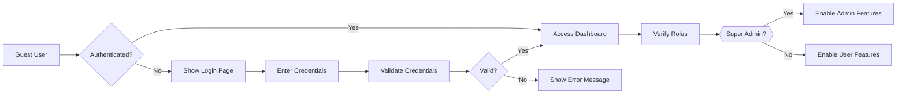
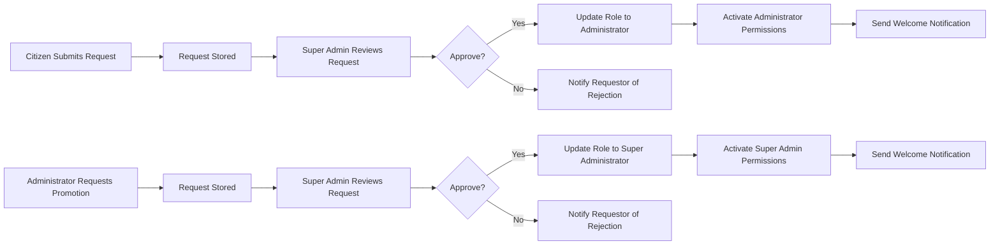
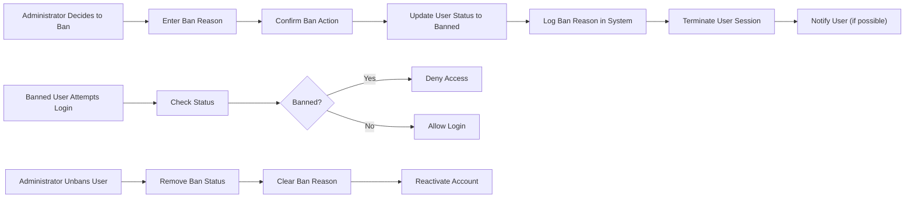
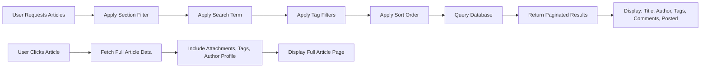

# Economic/Political Discussion Board Requirements

## Service Overview

The Economic/Political Discussion Board is a web-based platform designed to facilitate civil discourse on economic and political topics. The system enables registered users to create and participate in discussions through articles and comments, organized within categorized sections. Content moderation is managed through a tiered administrator system with defined privileges and workflows.

The platform prioritizes user autonomy and accountability: users retain control over their content, are responsible for their contributions, and are subject to community moderation through administrative oversight. The architecture is designed to support high-volume concurrent usage with scalable infrastructure.

## User Actors and Authentication

The system implements a three-tiered user actor model with escalating privileges:

### Citizen (Regular User)

- **Capabilities**: Register, log in, view profiles, create articles and comments, edit/delete own content, search, and browse sections
- **Authentication**: Email/password registration with secure password hashing
- **Session Management**: JWT-based authentication with refresh token mechanism
- **Permissions**: Only permitted to act on their own content and metadata
- **Account Deletion**: Triggers cascading deletion of all associated articles and comments

### Administrator

- **Privilege Basis**: Promoted from Citizen status through official request approval
- **Capabilities**: All Citizen capabilities plus:
  - Create, edit, and delete sections
  - Delete any article or comment
  - Ban and unban users
  - View list of banned users
- **Authentication**: Same JWT mechanism as Citizen, with additional role claims
- **Permission Validation**: Each moderation action requires role verification
- **Limitation**: Cannot promote or demote other users

### Super Administrator

- **Privilege Basis**: Highest system authority level
- **Capabilities**: All Administrator capabilities plus:
  - Approve/reject administrator promotion requests
  - Promote Administrators to Super Administrators
  - Demote Super Administrators to Administrators
- **Authentication**: JWT with elevated privilege claims and enhanced security monitoring
- **Self-Demotion Restriction**: System prohibits self-demotion actions
- **Audit Trail**: All privilege modifications are logged permanently

### Authentication Flow

### Authentication Requirements

- WHEN a user registers, THE system SHALL validate email format using RFC 5322 standards and create account with bcrypt password hash
- WHEN a user logs in, THE system SHALL validate credentials against stored hash and issue JWT token with expiration
- WHEN a user changes password, THE system SHALL validate old password and enforce minimum complexity (12 characters, numeric, special symbol)
- WHEN a user requests account deletion, THE system SHALL delete all associated articles and comments within 5 minutes of confirmation
- WHILE a user is logged in, THE system SHALL maintain active session and refresh JWT every 1 hour without requiring re-authentication
- IF a user provides invalid credentials, THEN THE system SHALL return HTTP 401 with AUTH_INVALID_CREDENTIALS error code
- WHERE user role is administrator, THE system SHALL grant access to moderation controls in UI and API endpoints
- WHERE user role is super administrator, THE system SHALL grant access to privilege management interfaces
- IF JWT token is expired or invalid, THEN THE system SHALL return HTTP 403 with AUTH_TOKEN_INVALID error code
- IF a user attempts authentication while banned, THEN THE system SHALL deny access immediately and log the attempt

## Article Management

### Article Creation

Users create articles within designated sections with the following requirements:

- **Required Fields**: Title (6-200 characters), Content (100-10,000 characters)
- **Section Assignment**: Must select one available section during creation
- **File Attachments**: Up to 5 files allowed per article
  - Accepted formats: PDF, DOCX, XLSX, PNG, JPG, JPEG, GIF
  - Maximum file size: 50MB each
- **Image Attachments**: Automatically handled by the same file attachment system
- **Tagging**: Up to 10 tags permitted per article
  - Tags: Free-text, case-insensitive, space-delimited
  - Tag length: 2-50 characters minimum (no empty tags)
  - Tag uniqueness: Not enforced (multiple articles may share identical tags)

### Article Editing

Users may edit their own articles any number of times with constraints:

- **Editable Fields**: Title, content, attachments, tags
- **Non-Editable**: Section assignment (once set, immutable)
- **Attachment Management**: Files can be added or removed
- **Timestamp Update**: "Last edited" field updates with each edit
- **Edit Limitation**: No restrictions on number of edits except system performance thresholds

### Article Deletion

- **Permission**: User may delete own articles
- **Cascading Effect**: Deleting an article automatically deletes all associated comments
- **Visibility**: Deleted articles are immediately removed from search results and section listings
- **Archiving**: Articles are permanently deleted from database (no soft delete)
- **Confirmation**: User must confirm deletion action

### Article Listing

The article listing presents a paginated view of available content:

- **Display Fields**: Title, Author, Tags, Comment Count, Posted Time
- **Content Limitation**: Full article body is NOT displayed (only truncated to title)
- **Sorting Options**: Newest first (default), Oldest first
- **Pagination**: 20 articles per page
- **Filtering**: Articles filtered by selected section
- **Performance**: Article list must load within 1 second under normal load

### Article Viewing

When selecting a specific article, users are presented with a detailed view:

- **Display Fields**: Title, Author (with profile link), Content, Attachments, Tags, Posted Time, Last Edited (if applicable)
- **Attachments**: Files and images displayed as clickable links
  - File icons indicate type
  - Image previews shown inline
- **Download Functionality**: Users can download attached files
- **Author Profile**: Clicking author name navigates to their public profile
- **Comment Count**: Displays total number of comments on the article
- **Performance**: Article page must render within 1.5 seconds including all attachments

## Comment System

### Comment Creation

Users can post comments on any visible article:

- **Required Field**: Content (minimum 5 characters, maximum 1,000 characters)
- **Author Attribution**: Automatically linked to the authenticated user
- **Time Stamping**: Comment created timestamp recorded in UTC
- **Sorting**: Comments appear in oldest to newest chronological order
- **Limitation**: No nested replies (single-level comments only)
- **Validation**: Empty comments are rejected with immediate error message

### Comment Editing

Users may modify their own comments:

- **Permitted**: Content text only
- **Prohibited**: Author, timestamp changes
- **Revision History**: No version tracking (only current state displayed)
- **Timestamp Update**: Last edited indicator appears after modification
- **Character Limit**: Same as creation (1,000 characters)
- **Validation**: Empty content is rejected

### Comment Deletion

Users may delete their own comments:

- **Permission**: Only the comment author may delete
- **Cascading Effect**: None - deletion affects only the comment record
- **Visibility**: Comment disappears immediately from the article thread
- **Confirmation**: Must confirm deletion action
- **Audit**: Deleted comments are permanently removed from database

### Comment Display

Comments are presented on the article page with:

- **Author**: Display name linked to profile
- **Content**: Plain text with line breaks preserved
- **Time Posted**: "X hours ago" or absolute timestamp
- **Sorting**: Oldest first (chronological)
- **Pagination**: All comments load at once (no pagination due to expected low volume)
- **Count**: Displayed at top of comment section, updated in real-time
- **Performance**: Comments must load with article (sub-second)

### Comment Requirements

- WHEN a user comments on an article, THE system SHALL require comment content with minimum 5 characters
- WHEN a user edits own comment, THE system SHALL allow modification of comment content only
- WHEN a user deletes own comment, THE system SHALL remove comment from database
- WHILE article is being viewed, THE system SHALL display comments sorted by oldest first
- WHERE a user views article, THE system SHALL display comment count
- IF a comment exceeds 1,000 characters, THEN THE system SHALL truncate the content and display "[truncated]" indicator
- IF comment content is empty or less than 5 characters, THEN THE system SHALL reject submission with message "Comment must be at least 5 characters"

## Section Management

### Section Creation

Sections are the top-level categories organizing article content:

- **Permission**: Only Administrators may create new sections
- **Required Fields**: Name (3-50 characters), Description (50-500 characters)
- **Validation**: Name must be unique system-wide
- **Format**: No special characters (alphanumeric, spaces, hyphens, underscores only)
- **Default Sections**: System pre-populates with "Politics", "Economy", "Current Affairs" upon first launch
- **Section Visibility**: All sections are publicly viewable

### Section Editing

Administrators may modify existing sections:

- **Editable Fields**: Name, Description
- **Validation**: New name must be unique (non-conflicting)
- **Impact**: Editing section name updates all associated articles automatically
- **History**: No versioning - changes are immediate and irreversible

### Section Deletion

Administrators may remove sections:

- **Permission**: Only Administrators
- **Cascading Effect**: All articles within section are NOT automatically deleted (moved to "Uncategorized" if defined, otherwise remain accessible via direct links)
- **Archive Mechanism**: Articles retain full integrity and visibility
- **Confirmation**: Must confirm deletion action
- **Effectiveness**: Section disappears from section listing immediately
- **No Reuse**: Section name cannot be reused for new section creation

### Section Listing & Browsing

- **Visibility**: All sections displayed in sidebar and section selector
- **Order**: Alphabetical by section name
- **Access**: Citizens may browse articles in any visible section
- **Navigation**: Section selection filters article listing
- **Performance**: Section list loads instantly upon user profile access

### Section Requirements

- WHEN a user attempts to create section, THE system SHALL validate name (3-50 characters) and description (50-500 characters)
- WHERE user role is administrator, THE system SHALL enable section creation capability
- WHERE user role is administrator, THE system SHALL enable section editing capability
- WHERE user role is administrator, THE system SHALL enable section deletion capability
- WHILE user browses section list, THE system SHALL display all existing sections
- IF section name already exists, THEN THE system SHALL return ERROR_SECTION_NAME_TAKEN

## Administrator Request Workflow

### Request Submission

Citizens may apply to become Administrators:

- **Access Point**: "Become Administrator" button on profile
- **Required Input**: Reason text (10-1,000 characters)
- **Validation**: Reason must contain at least 10 non-whitespace characters
- **Status**: Request enters "Pending Approval" state
- **Notification**: User receives confirmation message upon submission

### Request Review

Super Administrators review pending requests:

- **Access Point**: "Administrator Requests" list in management dashboard
- **Information Displayed**: Requester username, request reason, timestamp
- **Actions Available**: Approve, Reject
- **Response**: No automatic email - system notification only

### Approval Process

- **Action**: Super Administrator selects "Approve"
- **System Response**: User role updates from "Citizen" to "Administrator"
- **Permissions**: Admin rights activated immediately
- **Notification**: User receives system message: "Your administrator request has been approved."
- **Audit Log**: Entry recorded with approver ID and timestamp

### Rejection Process

- **Action**: Super Administrator selects "Reject"
- **System Response**: User role remains "Citizen"
- **Notification**: User receives system message: "Your administrator request has been rejected."
- **Reason Display**: The user does not see the rejection reason (administrative discretion preserved)
- **Audit Log**: Entry recorded with rejector ID and timestamp

### Request Status

While a request is pending:

- **Profile Display**: Shows "Administrator Request Pending" banner
- **Button State**: "Become Administrator" button disabled
- **Request Visibility**: Only visible to Super Administrators
- **Duration**: No expiration - requests remain open indefinitely

### Administrator Request Workflow Diagram

### Administrator Request Requirements

- WHEN a citizen submits administrator request, THE system SHALL capture reason text with minimum 10 characters
- WHEN a super administrator reviews request, THE system SHALL display request reason
- WHEN a super administrator approves request, THE system SHALL upgrade user to administrator
- WHEN a super administrator rejects request, THE system SHALL notify user of rejection
- WHILE request is pending, THE system SHALL display user status as "request pending"

## Administrator Privilege Hierarchy

### Privilege Structure

The administrator hierarchy defines two roles with escalating authority:

- **Administrator**: Moderation rights over content and users
- **Super Administrator**: Full system management including promotion/demotion

### Promotion Process

- **Eligibility**: Administrator user must submit promotion request
- **Process**: Same workflow as citizen-to-administrator request
- **Validation**: Super administrator reviews request and may approve
- **Outcome**: Role updated to "Super Administrator"
- **Notification**: Confirmation message sent to promoted user
- **Audit**: All promotions logged permanently

### Demotion Process

- **Authority**: Only Super Administrators may demote users
- **Target**: Only Administrators (including other Super Administrators)
- **Self-Demotion Restriction**: System prohibits Super Administrators from demoting themselves
- **Process**: Demotion request requires explicit confirmation
- **Outcome**: Role downgraded to "Administrator"

### Privilege Matrix

| Capability | Citizen | Administrator | Super Administrator |
|---|---|---|---|
| Register/Login | ✓ | ✓ | ✓ |
| Edit own profile | ✓ | ✓ | ✓ |
| Create articles | ✓ | ✓ | ✓ |
| Edit own articles | ✓ | ✓ | ✓ |
| Delete own articles | ✓ | ✓ | ✓ |
| Comment on articles | ✓ | ✓ | ✓ |
| Edit own comments | ✓ | ✓ | ✓ |
| Delete own comments | ✓ | ✓ | ✓ |
| View public profiles | ✓ | ✓ | ✓ |
| Search articles | ✓ | ✓ | ✓ |
| Create sections | ✗ | ✓ | ✓ |
| Edit sections | ✗ | ✓ | ✓ |
| Delete sections | ✗ | ✓ | ✓ |
| Delete any article | ✗ | ✓ | ✓ |
| Delete any comment | ✗ | ✓ | ✓ |
| Ban users | ✗ | ✓ | ✓ |
| Unban users | ✗ | ✓ | ✓ |
| View banned users | ✗ | ✓ | ✓ |
| Approve admin requests | ✗ | ✗ | ✓ |
| Promote admin to super | ✗ | ✗ | ✓ |
| Demote super to admin | ✗ | ✗ | ✓ |
| Demote self | ✗ | ✗ | ✗ |

### Administrator Privilege Hierarchy Requirements

- WHEN a super administrator promotes administrator, THE system SHALL update role to super administrator
- WHEN a super administrator demotes administrator, THE system SHALL downgrade role to administrator
- WHERE user attempts to demote self, THE system SHALL reject action and return error
- WHERE user role is administrator, THE system SHALL grant all citizen permissions plus moderation
- WHERE user role is super administrator, THE system SHALL grant all administrator permissions plus privilege management
- IF a super administrator attempts to demote self, THEN THE system SHALL return ERROR_SELF_DEMOTION_PROHIBITED

## Banning System

### Banning Process

Administrators can restrict user access to the platform:

- **Trigger**: Administrator selects "Ban User" on profile
- **Requirement**: Ban reason (mandatory, 10-500 characters)
- **Action**: User status changed to "Banned"
- **Effect**: Immediate session termination
- **Notification**: Optional system message to banned user
- **Content Preservation**: User's articles and comments remain publicly visible
- **Audit Log**: Ban reason, admin ID, timestamp recorded permanently
- **Access Denial**: Future login attempts rejected immediately

### Unbanning Process

- **Trigger**: Administrator selects "Unban User" on banned profile
- **Action**: Ban status removed
- **Effect**: User can log in normally
- **Audit Log**: Unban event recorded with admin ID and timestamp

### Ban Visibility

- **Admin View**: All banned users visible in "Banned Users" list
- **Information Displayed**: Username, ban reason, ban date, banning admin
- **Search Functionality**: Ban list is searchable by username or reason
- **Non-Admin View**: Banned users appear as normal users (no indication of ban status)
- **Reason Privacy**: Only administrators can view ban reasons

### Ban Status Effects

- **Login**: Denied with message "Your account has been banned. Contact administrators for appeal."
- **Content Visibility**: Articles/comments remain visible to all users
- **Profile Access**: Profile remains accessible but shows "(Banned)" tag
- **Interaction**: Cannot comment, like, or interact with other users
- **Notification**: No automatic email sent upon ban

### Banning Process Diagram

### Banning System Requirements

- WHEN an administrator bans user, THE system SHALL require ban reason with minimum 10 characters
- WHEN user is banned, THE system SHALL prevent login attempts
- WHILE user is banned, THE system SHALL maintain visibility of user content
- WHERE administrator views banned users, THE system SHALL display ban reason
- WHEN an administrator unbans user, THE system SHALL remove ban status and restore access
- IF a banned user attempts to log in, THEN THE system SHALL deny access immediately
- IF ban reason is empty or under 10 characters, THEN THE system SHALL reject ban request

## Search and Filtering

### Search Functionality

Users can discover articles using full-text search:

- **Search Fields**: Title and article content
- **Match Type**: Fuzzy matching (case-insensitive partial matching)
- **Result Scope**: Only articles the user has permission to view
- **Pagination**: 20 results per page
- **Performance**: Search results must return within 2 seconds
- **Highlighting**: Search terms highlighted in results

### Tag Filtering

Users can narrow search results by tags:

- **Filter Criteria**: Exact tag matches (case-sensitive matching)
- **Multiple Tags**: AND logic (all selected tags must be present)
- **Tag Sources**: Extracted from article metadata
- **Display**: Tags appear as selectable chips in UI
- **Combination**: Can be used alone or with text search
- **Performance**: Filtering must not impact search response time

### User Interface Flow

### Search and Filtering Requirements

- WHEN a user searches articles, THE system SHALL search title and content fields
- WHEN a user filters by tags, THE system SHALL match exact tag values
- WHILE user browses search results, THE system SHALL display 20 items per page
- WHEN user navigates search pages, THE system SHALL maintain filter criteria
- WHERE search returns no results, THE system SHALL display "No articles match your search"
- IF search term contains 1 character or less, THEN THE system SHALL return all articles without filtering
- IF tag filter is applied, THEN THE system SHALL return articles that contain ALL selected tags
- IF filter criteria are cleared, THEN THE system SHALL return unfiltered results

## Performance and Operational Requirements

### Response Time Expectations

- **Article Lists**: Must respond within 1 second (P95)
- **Search Operations**: Must respond within 2 seconds (P95)
- **Single Article Load**: Must render within 1.5 seconds (including attachments)
- **Comment Loading**: Must be instantaneous (sub-second)
- **User Actions**: Create/edit/delete must confirm within 1 second
- **File Uploads**: Progress bar must update every 500ms; total upload time under 30 seconds for 50MB

### System Throughput

- **Concurrent Users**: Support 10,000 concurrent authenticated users
- **Requests/Second**: Minimum 200 requests per second
- **Database Load**: Maximum 50 concurrent database connections
- **Cache Utilization**: 80% of article list requests served from cache
- **Session Handling**: Support 50,000 active sessions simultaneously

### Concurrency Requirements

- **Database Transactions**: Use row-level locking for article/comment deletion
- **File Uploads**: Uploads queued under heavy load
- **API Throttling**: Rate limit 100 requests per minute per IP address
- **Priority Queueing**: Moderator actions (ban/delete) get priority over user content views

### Data Retention Policy

- **Deleted Articles**: Permanently removed from database (hard delete)
- **Deleted Comments**: Permanently removed from database (hard delete)
- **Banned User Content**: Maintained indefinitely (never deleted)
- **Session Logs**: Kept 90 days for security auditing
- **Audit Logs**: Kept permanently (non-erasable)
- **Files**: Retained indefinitely as long as associated article exists

### Error Handling

- **HTTP 400**: Bad Request (invalid parameters, missing fields)
- **HTTP 401**: Unauthorized (invalid/no authentication)
- **HTTP 403**: Forbidden (insufficient permissions)
- **HTTP 404**: Not Found (resource not exist or deleted)
- **HTTP 429**: Too Many Requests (rate limiting)
- **HTTP 500**: Internal Server Error (unexpected system failure)
- **HTTP 503**: Service Unavailable (database unresponsive)

### Error Code Definitions

- AUTH_INVALID_CREDENTIALS: Invalid email/password combination
- AUTH_TOKEN_INVALID: Expired or malformed JWT token
- AUTH_ACCESS_DENIED: User lacks required permissions
- SECTION_NAME_TAKEN: Section name already exists
- ERROR_SELF_DEMOTION_PROHIBITED: Super administrator attempted self-demotion
- ERROR_FILE_TOO_LARGE: File exceeds 50MB size limit
- ERROR_COMMENT_TOO_SHORT: Comment less than 5 characters
- ERROR_COMMENT_TOO_LONG: Comment exceeds 1,000 characters
- ERROR_REASON_TOO_SHORT: Ban/admin request reason too short
- ERROR_DATABASE_UNAVAILABLE: Database connection failed
- ERROR_SYSTEM: Unspecified server-side error

### System Uptime

- **Target**: 99.9% uptime for authenticated operations
- **Maintenance**: Scheduled maintenance windows between 2:00-4:00 AM (Asia/Seoul)
- **Monitoring**: Health checks every 30 seconds
- **Failover**: Automatic to standby server upon failure
- **Alerting**: PagerDuty alerts for downtime exceeding 2 minutes

> *Developer Note: This document defines **business requirements only**. All technical implementations (architecture, APIs, database design, etc.) are at the discretion of the development team.*