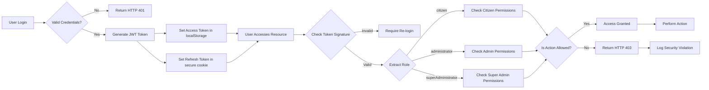
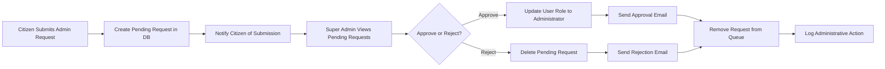
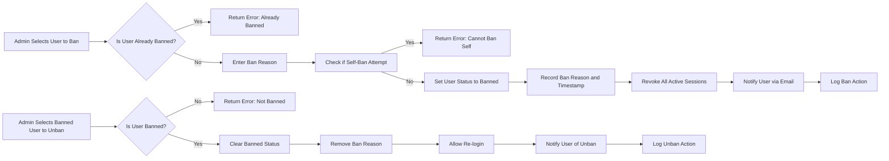
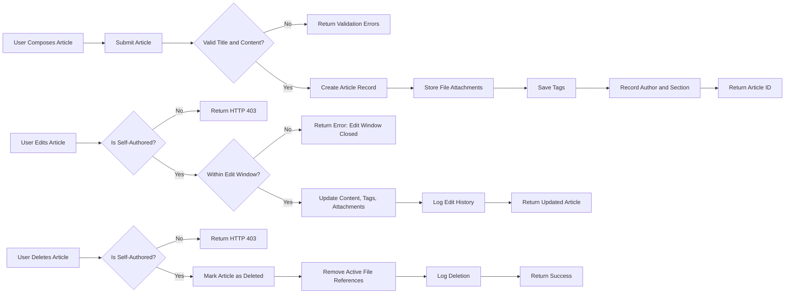
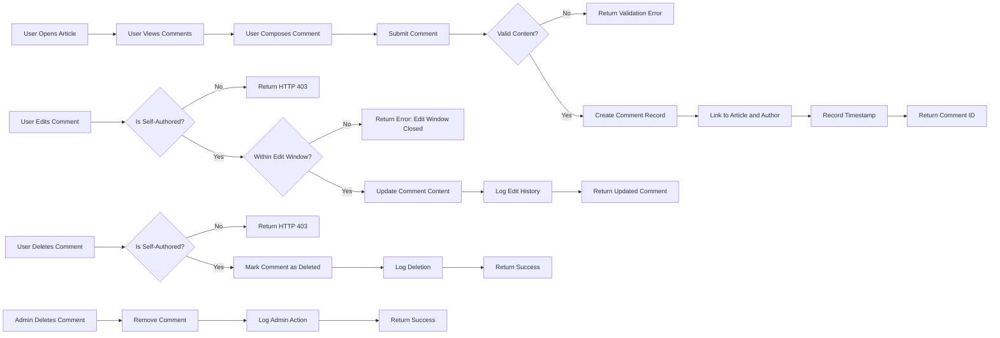

# Economic/Political Discussion Board Requirements Specification

## Service Overview

The Economic/Political Discussion Board is a democratic digital forum designed to foster informed, civil discourse on economic systems and political ideologies. This service exists to counter the fragmentation and polarization of modern public discourse by providing a structured, moderated environment where users can engage with complex societal issues through evidence-based discussion, rather than emotional reaction. The platform aims to elevate public understanding of economic principles and political systems by enabling users to share insights, challenge assumptions, and learn from diverse perspectives.

### Service Vision

The Economic/Political Discussion Board is a democratic digital forum designed to foster informed, civil discourse on economic systems and political ideologies. This service exists to counter the fragmentation and polarization of modern public discourse by providing a structured, moderated environment where users can engage with complex societal issues through evidence-based discussion, rather than emotional reaction. The platform aims to elevate public understanding of economic principles and political systems by enabling users to share insights, challenge assumptions, and learn from diverse perspectives.

### Problem Definition

Modern digital discourse has deteriorated into echo chambers, algorithm-driven outrage, and superficial engagement. Social media platforms prioritize viral content over substantive dialogue, leading to:

- Fragmentation of public opinion
- Decline in civic discourse quality
- Misinformation spreading unchecked
- Polarization reinforced by engagement algorithms
- Limited access to nuanced economic and political analysis

Existing discussion forums often lack organization, moderation, or structured workflows for meaningful dialogue. Users struggle to find reliable sources of economic and political analysis, and discussions frequently devolve into personal attacks or ideological shouting matches.

### Core Value Proposition

This service delivers five core value propositions that differentiate it from other platforms:

1. **Structured Discourse**: By organizing discussions into clearly defined sections (Politics, Economy, Current Affairs), the platform encourages focused, topic-specific conversations rather than chaotic threads.
2. **Accountable Dialogue**: Requiring email registration with verifiable identity promotes responsibility in discourse, reducing anonymous trolling and incivility.
3. **Quality Over Virality**: Article and comment visibility is determined by community engagement and moderation, not algorithmic manipulation or sensationalism.
4. **Expert Access**: The administrator promotion system incentivizes knowledgeable users to take on responsibility, creating pathways for subject-matter experts to curate quality content.
5. **Safe Exploration**: By allowing users to explore opposing viewpoints without fear of permanent ban (unless violations occur), the platform fosters intellectual growth and critical thinking.

### Target Audience

The platform serves four primary user segments:

- **Citizens (General Users)**: Curious individuals seeking to understand economic systems and political ideologies. They may have limited prior knowledge but value evidence-based discussion. This group includes students, professionals seeking intellectual engagement, and politically engaged citizens.
- **Knowledgeable Participants**: Users with domain expertise in economics, political science, history, or related fields. They contribute high-quality articles and comments to elevate the discourse.
- **Administrators**: Moderators who have demonstrated commitment to civil discourse and have been promoted to maintain platform integrity. They possess enhanced privileges to remove harmful content, ban toxic actors, and manage sections.
- **Super Administrators**: The most experienced and trusted administrators who oversee the entire system, grant promotion rights, and ensure the platform's long-term alignment with its mission.

### Business Justification

The service addresses a critical gap in the digital public square: the absence of substantive, moderated discourse on complex socioeconomic issues. While financial news services report economic data and political news outlets cover events, very few platforms facilitate structured citizen engagement with the underlying principles of economic systems and political philosophy.

The rise in political polarization, economic anxiety, and misinformation has created a societal need for platforms that help citizens make informed decisions. This service provides a neutral ground for discussion, free from commercial advertising pressures that bias content on mainstream media platforms. By focusing exclusively on economic and political discourse, the platform becomes a trusted resource for users seeking depth rather than headlines.

## User Actors & Authentication

### Citizen Actor Specification

- WHEN a new user visits the registration page, THE system SHALL allow them to register by providing a valid email address and password.
- WHEN a user submits a registration request, THE system SHALL validate the email address format and check for uniqueness.
- WHEN a user attempts to register with an already-used email, THE system SHALL return an error message.
- WHEN a user submits registration credentials, THE system SHALL create a new citizen account with default permissions.
- WHEN a user attempts to log in, THE system SHALL verify the email and password combination.
- WHEN login credentials are invalid, THE system SHALL return HTTP 401 Unauthorized with error code AUTH_INVALID_CREDENTIALS.
- WHEN login credentials are valid, THE system SHALL generate a JWT access token with expiration of 20 minutes and a refresh token with expiration of 14 days.
- THE JWT SHALL include the following claims: userId, role (citizen/administrator/superAdministrator), and permissions array.
- THE access token SHALL be stored in the client's localStorage.
- THE refresh token SHALL be stored in an httpOnly, secure cookie.
- WHEN an access token expires, THE system SHALL validate the refresh token and issue a new access token.
- WHEN a refresh token is invalid or expired, THE system SHALL require the user to log in again.
- WHEN a user logs out, THE system SHALL invalidate the current refresh token.
- WHEN a user changes their password, THE system SHALL invalidate all active sessions.
- WHEN a user deletes their account, THE system SHALL immediately revoke all associated tokens.
- WHEN a user is banned, THE system SHALL immediately invalidate all active sessions for that user.
- THE citizen SHALL be able to change their password at any time.
- THE citizen SHALL be able to delete their account, which SHALL permanently remove all associated articles and comments.
- THE citizen SHALL be able to set and edit their profile display name.
- THE citizen SHALL be able to set and edit their profile bio text.
- THE citizen SHALL be able to view the public profile of any other citizen, including their display name, bio, list of articles, and list of comments.
- THE citizen SHALL be able to create articles in any existing section.
- THE citizen SHALL be able to attach multiple files and images to their articles.
- THE citizen SHALL be able to add multiple free-text tags to their articles.
- THE citizen SHALL be able to edit their own articles, including title, content, attachments, and tags.
- THE citizen SHALL be able to delete their own articles.
- THE citizen SHALL be able to write comments on any article.
- THE citizen SHALL be able to edit their own comments.
- THE citizen SHALL be able to delete their own comments.
- THE citizen SHALL be able to search articles by title or content.
- THE citizen SHALL be able to filter search results by tags.
- THE citizen SHALL be able to view paginated lists of articles within a section.
- THE citizen SHALL be able to sort article lists by newest first or oldest first.
- THE citizen SHALL be able to view the full content of any article, including attachments.
- THE citizen SHALL be able to download files and images attached to articles.
- THE citizen SHALL be able to submit a request to become an administrator, providing a reason text.
- THE citizen SHALL NOT be able to create, edit, or delete sections.
- THE citizen SHALL NOT be able to delete articles or comments written by other citizens.
- THE citizen SHALL NOT be able to ban or unban users.
- THE citizen SHALL NOT be able to promote or demote administrators.
- THE citizen SHALL NOT be able to view pending administrator requests.

### Administrator Actor Specification

- THE administrator SHALL have all capabilities of a citizen.
- THE administrator SHALL be able to create new sections with a name and description.
- THE administrator SHALL be able to edit existing sections, including name and description.
- THE administrator SHALL be able to delete existing sections.
- THE administrator SHALL be able to delete any article on the platform.
- THE administrator SHALL be able to delete any comment on the platform.
- THE administrator SHALL be able to ban any user, including other administrators, by providing a reason.
- THE administrator SHALL be able to unban any banned user.
- THE administrator SHALL be able to view the complete list of banned users.
- THE administrator SHALL be able to view the reason for each ban.
- THE administrator SHALL NOT be able to promote another user to super administrator.
- THE administrator SHALL NOT be able to demote a super administrator.
- THE administrator SHALL NOT be able to demote themselves.
- THE administrator SHALL NOT be able to approve or reject administrator requests.

### Super Administrator Actor Specification

- THE superAdministrator SHALL have all capabilities of an administrator.
- THE superAdministrator SHALL be able to promote a regular administrator to super administrator.
- THE superAdministrator SHALL be able to demote a super administrator to a regular administrator.
- THE superAdministrator SHALL be able to approve or reject administrator registration requests.
- THE superAdministrator SHALL be able to view all pending administrator requests.
- THE superAdministrator SHALL NOT be able to demote themselves.
- THE superAdministrator SHALL NOT be able to be demoted by any other user.
- THE superAdministrator SHALL be able to perform all administrative actions without restriction.

### Authentication Flow

- WHEN a user attempts to sign up, THE system SHALL validate the email address format and check for uniqueness.
- WHEN a user attempts to sign up with an already-used email, THE system SHALL return an error message.
- WHEN a user submits registration credentials, THE system SHALL create a new citizen account with default permissions.
- WHEN a user attempts to log in, THE system SHALL verify the email and password combination.
- WHEN login credentials are invalid, THE system SHALL return HTTP 401 Unauthorized with error code AUTH_INVALID_CREDENTIALS.
- WHEN login credentials are valid, THE system SHALL generate a JWT access token with expiration of 20 minutes and a refresh token with expiration of 14 days.
- THE JWT SHALL include the following claims: userId, role (citizen/administrator/superAdministrator), and permissions array.
- THE access token SHALL be stored in the client's localStorage.
- THE refresh token SHALL be stored in an httpOnly, secure, SameSite=Strict cookie.
- WHEN an access token expires, THE system SHALL validate the refresh token and issue a new access token.
- WHEN a refresh token is invalid or expired, THE system SHALL require the user to log in again.
- WHEN a user logs out, THE system SHALL invalidate the current refresh token.
- WHEN a user changes their password, THE system SHALL invalidate all active sessions.
- WHEN a user deletes their account, THE system SHALL immediately revoke all associated tokens.
- WHEN a user is banned, THE system SHALL immediately invalidate all active sessions for that user.

### Session Management

- THE system SHALL maintain user sessions via JWT token authentication.
- THE system SHALL enforce a 20-minute expiration for access tokens.
- THE system SHALL enforce a 14-day expiration for refresh tokens.
- THE system SHALL store refresh tokens in an httpOnly, secure, SameSite=Strict cookie.
- THE system SHALL store access tokens as a string in client-side localStorage.
- THE system SHALL verify token signatures on every authenticated request.
- THE system SHALL validate user role and permissions from the JWT payload on every request.
- THE system SHALL invalidate all tokens for a user when their password is changed.
- THE system SHALL invalidate all tokens for a user when their account is deleted.
- THE system SHALL invalidate all tokens for a user when they are banned.
- THE system SHALL require re-authentication after 14 days of inactivity.

### Permission Matrix

| Action | Citizen | Administrator | Super Administrator |
|--------|---------|---------------|---------------------|
| Register account | ✅ | ✅ | ✅ |
| Login | ✅ | ✅ | ✅ |
| Logout | ✅ | ✅ | ✅ |
| Change password | ✅ | ✅ | ✅ |
| Delete account | ✅ | ✅ | ✅ |
| Edit profile | ✅ | ✅ | ✅ |
| View public profile | ✅ | ✅ | ✅ |
| Create article | ✅ | ✅ | ✅ |
| Edit own article | ✅ | ✅ | ✅ |
| Delete own article | ✅ | ✅ | ✅ |
| Attach files/images | ✅ | ✅ | ✅ |
| Add tags to article | ✅ | ✅ | ✅ |
| Write comment | ✅ | ✅ | ✅ |
| Edit own comment | ✅ | ✅ | ✅ |
| Delete own comment | ✅ | ✅ | ✅ |
| Search articles | ✅ | ✅ | ✅ |
| Filter articles by tags | ✅ | ✅ | ✅ |
| Sort article list | ✅ | ✅ | ✅ |
| View article content | ✅ | ✅ | ✅ |
| Download attachments | ✅ | ✅ | ✅ |
| Create section | ❌ | ✅ | ✅ |
| Edit section | ❌ | ✅ | ✅ |
| Delete section | ❌ | ✅ | ✅ |
| Delete any article | ❌ | ✅ | ✅ |
| Delete any comment | ❌ | ✅ | ✅ |
| Ban user | ❌ | ✅ | ✅ |
| Unban user | ❌ | ✅ | ✅ |
| View banned users list | ❌ | ✅ | ✅ |
| View ban reason | ❌ | ✅ | ✅ |
| Submit admin request | ✅ | ✅ | ✅ |
| Approve admin request | ❌ | ❌ | ✅ |
| Reject admin request | ❌ | ❌ | ✅ |
| Promote to super admin | ❌ | ❌ | ✅ |
| Demote super admin | ❌ | ❌ | ✅ |
| Demote self | ❌ | ❌ | ❌ |

### Access Control Enforcement

- THE system SHALL reject all requests from unauthenticated users.
- THE system SHALL validate the user's role in the JWT payload before processing any privileged operation.
- THE system SHALL reject any request that attempts to access resources owned by another user without sufficient permissions.
- THE system SHALL enforce permission boundaries consistently across all API endpoints.
- THE system SHALL log all permission-denied attempts for security auditing.
- THE system SHALL return HTTP 403 Forbidden when access is denied due to insufficient permissions.
- THE system SHALL return HTTP 401 Unauthorized when authentication is missing or invalid.
- THE system SHALL ensure a citizen cannot perform any administrator action, even if they attempt to tamper with their JWT.
- THE system SHALL ensure a regular administrator cannot perform super administrator actions, even if they attempt to tamper with their JWT.
- THE system SHALL validate the role hierarchy on every backend request.

### Administrator Request Flow

- WHEN a citizen submits a request to become an administrator, THE system SHALL create a pending request with the user ID and reason text.
- WHEN a super administrator views pending requests, THE system SHALL display a list of all unprocessed requests with user ID, request date, reason text, and status.
- WHEN a super administrator approves a request, THE system SHALL update the user's role from citizen to administrator and remove the pending request.
- WHEN a super administrator rejects a request, THE system SHALL remove the pending request and notify the citizen.
- THE system SHALL not change any user permissions until a request is explicitly approved.
- THE system SHALL retain approval/rejection records for audit purposes.

### Banning System

- WHEN a user is banned, THE system SHALL set the user's account status to "banned" and record the ban reason.
- THE system SHALL maintain the visibility of all articles and comments written by banned users.
- WHEN a banned user attempts to log in, THE system SHALL immediately reject authentication.
- WHEN a banned user attempts to access any resource, THE system SHALL return HTTP 403 Forbidden with error code USER_BANNED.
- THE system SHALL display the ban reason in the administrator interface.
- WHEN a user is unbanned, THE system SHALL set the user's account status to "active" and remove the ban reason.
- THE system SHALL notify the user when they are banned or unbanned via email if possible.
- THE system SHALL log all ban/unban actions including actor, target, reason, and timestamp.

### Administrative Escalation Hierarchy

- THE superAdministrator SHALL be the only actor that can promote an administrator to super administrator.
- THE superAdministrator SHALL be the only actor that can demote a super administrator to administrator.
- THE system SHALL prevent any administrator (including superAdministrator) from demoting themselves.
- THE system SHALL prevent any user from promoting themselves to administrator or super administrator.
- THE system SHALL enforce a strict hierarchy: citizen → administrator → superAdministrator.
- THE system SHALL prevent lateral promotion or demotion between roles.
- THE system SHALL allow only one super administrator role per system at a time if enforced by business rules.
- THE system SHALL maintain immutable historical records of role changes.

### User Profile Display Logic

- WHEN a citizen views another citizen's profile, THE system SHALL display only publicly available information: display name, bio, article count, and comment count.
- WHEN viewing another user's profile, THE system SHALL NOT show private information such as email, registration date, or IP address.
- WHEN viewing their own profile, THE system SHALL display all profile details including private information.
- THE system SHALL display a paginated list of articles authored by the profile user.
- THE system SHALL display a paginated list of comments authored by the profile user.
- WHEN displaying article lists on profile pages, THE system SHALL show only article title, section, and posted time.
- When displaying comment lists on profile pages, THE system SHALL show only comment content and posted time.
- THE system SHALL limit the number of articles and comments shown per page to 20 items.

### Data Integrity Constraints

- THE system SHALL ensure no user can delete an article they do not own.
- THE system SHALL ensure only administrators can delete articles they do not own.
- THE system SHALL ensure only super administrators can promote or demote other super administrators.
- THE system SHALL ensure a user account cannot exist without a unique email.
- THE system SHALL ensure a section cannot be deleted if it contains articles.
- THE system SHALL ensure a comment cannot be edited after 30 minutes from its creation.
- THE system SHALL ensure a user's own articles and comments are permanently removed when their account is deleted.
- THE system SHALL ensure banned users' content remains accessible to all users.
- THE system SHALL ensure no administrator can delete a super administrator account.

### Error Handling and Recovery

- IF a user tries to log in with an invalid email format, THEN THE system SHALL return HTTP 400 BAD REQUEST with error code AUTH_INVALID_EMAIL.
- IF a user tries to change their password with a password less than 8 characters, THEN THE system SHALL return HTTP 400 BAD REQUEST with error code PASS_TOO_SHORT.
- IF a user tries to create an article without a title or content, THEN THE system SHALL return HTTP 400 BAD REQUEST with error code ARTICLE_MISSING_REQ_FIELDS.
- IF a user tries to delete a comment they do not own, THEN THE system SHALL return HTTP 403 FORBIDDEN with error code COMMENT_NOT_OWNED.
- IF a user tries to delete a section that contains articles, THEN THE system SHALL return HTTP 400 BAD REQUEST with error code SECTION_NOT_EMPTY.
- IF a user tries to ban themselves, THEN THE system SHALL return HTTP 400 BAD REQUEST with error code CANNOT_BAN_SELF.
- IF a user tries to promote themselves to administrator, THEN THE system SHALL return HTTP 403 FORBIDDEN with error code CANNOT_PROMOTE_SELF.
- IF a user tries to access an article that does not exist, THEN THE system SHALL return HTTP 404 NOT FOUND with error code ARTICLE_NOT_FOUND.
- IF a user tries to download a file that does not exist or was deleted, THEN THE system SHALL return HTTP 404 NOT FOUND with error code FILE_NOT_FOUND.
- IF a user tries to submit an admin request with a reason less than 10 characters, THEN THE system SHALL return HTTP 400 BAD REQUEST with error code ADMIN_REQ_REASON_TOO_SHORT.

### Performance Requirements

- WHEN a user requests the article list in a section, THE system SHALL return results in under 1 second for up to 5,000 articles.
- WHEN a user searches articles, THE system SHALL return results in under 1.5 seconds for up to 10,000 articles.
- WHEN a user loads a single article with attachments, THE system SHALL load within 2 seconds.
- WHEN a user submits a comment, THE system SHALL confirm submission within 1 second.
- WHEN a user uploads a file or image, THE system SHALL provide upload progress updates every 250ms.
- WHEN a user submits a password change, THE system SHALL process it within 500ms.
- WHEN a user logs in, THE system SHALL authenticate and return a token within 800ms.
- WHEN a user views a profile with 50 articles and 100 comments, THE system SHALL render the page within 1.2 seconds.
- When a super administrator loads the list of pending requests, THE system SHALL return results in under 1 second regardless of volume.

### Security Requirements

- THE system SHALL never store plain-text passwords.
- THE system SHALL use bcrypt with cost factor of 12 for password hashing.
- THE system SHALL use JWT for stateless authentication.
- THE system SHALL sign JWTs with a 256-bit strong secret key.
- THE system SHALL not include sensitive user data in JWT payload.
- THE system SHALL encrypt all user authentication cookies with AES-256.
- THE system SHALL enforce HTTPS on all connections.
- THE system SHALL use Content-Security-Policy headers to prevent XSS.
- THE system SHALL sanitize all user inputs to prevent injection attacks.
- THE system SHALL validate file types for uploads to prevent executable content.
- THE system SHALL enforce strict file size limits per upload (max 100MB per file).
- THE system SHALL use secure-random tokens for all sensitive operations.
- THE system SHALL log all administrative actions for audit trails.
- THE system SHALL implement rate limiting of 100 requests per minute per IP address for unauthenticated users.
- THE system SHALL implement rate limiting of 500 requests per minute per user for authenticated users.

### Legal and Data Protection Requirements

- THE system SHALL comply with GDPR and other applicable data protection regulations.
- THE system SHALL provide users with the ability to export their personal data.
- THE system SHALL allow users to request deletion of their personal data.
- THE system SHALL anonymize user data after account deletion.
- THE system SHALL retain logs of administrative actions for at least 90 days.
- THE system SHALL not store credit card or payment information.
- THE system SHALL clearly state privacy policy terms on signup.
- THE system SHALL obtain explicit consent before processing any personal data.
- THE system SHALL notify users via email if their account data is compromised.
- THE system SHALL not use user-generated content for AI training without explicit consent.

### Future Scalability Considerations

- THE system SHALL be designed to handle up to 1 million active users.
- THE system SHALL be architected to support multi-region deployment.
- THE system SHALL support role-based access controls that can be extended.
- THE system SHALL be designed to accommodate new user roles in the future.
- THE system SHALL support integration with external identity providers in future versions.
- THE system SHALL be architected for eventual support of comment threading (not in initial version).
- THE system SHALL be implemented in a way that enables future notification systems.
- THE system SHALL maintain backward compatibility for token structures for at least 12 months.

### Operational Constraints

- THE system SHALL not allow email addresses from disposable email providers.
- THE system SHALL require all article titles to be under 200 characters.
- THE system SHALL require all article content to be under 100,000 characters.
- THE system SHALL require all comment content to be under 1,000 characters.
- THE system SHALL require all profile bio text to be under 500 characters.
- THE system SHALL require all admin request reasons to be under 1,000 characters.
- THE system SHALL not allow duplicate tags on a single article.
- THE system SHALL limit the number of tags per article to 10 maximum.
- THE system SHALL enforce file type whitelist: .pdf, .doc, .docx, .txt, .md, .jpg, .jpeg, .png, .gif, .mp4, .mov.
- THE system SHALL enforce file size limit: 100MB per file.

### Mermaid Diagram: User Role Authorization Flow

### Mermaid Diagram: Administrator Request Process

### Mermaid Diagram: Banning and Unbanning Workflow

### Mermaid Diagram: Article Lifecycle

### Mermaid Diagram: Comment Lifecycle

## Functional Requirements

### Account Management

#### Registration
WHEN a new user visits the platform, THE system SHALL allow them to register by providing:
- A valid email address
- A password with minimum 8 characters
- A display name (minimum 2 characters)

WHEN a user submits a registration request, THE system SHALL:
- Validate the email format (RFC 5322)
- Check for existing email address in database
- Check for existing display name
- Create a new user account with status "active"
- Send a confirmation email with verification link
- Store password as bcrypt hash

IF the email is already registered, THEN THE system SHALL respond with error code "EMAIL_ALREADY_EXISTS" and display message: "An account with this email already exists."

IF the display name is already taken, THEN THE system SHALL respond with error code "DISPLAY_NAME_TAKEN" and display message: "This display name is already in use. Please choose another."

IF password is less than 8 characters, THEN THE system SHALL respond with error code "PASSWORD_TOO_SHORT" and display message: "Password must be at least 8 characters long."

WHILE the account is unverified, THE system SHALL NOT allow login.

#### Login
WHEN a user attempts to log in, THE system SHALL:
- Accept email and password credentials
- Find user by email address
- Verify password against stored hash
- Set active session with JWT access token (15-minute expiration)
- Return refresh token (7-day expiration)

IF email is not found, THEN THE system SHALL respond with error code "INVALID_CREDENTIALS" and display message: "Email or password is incorrect."

IF password does not match, THEN THE system SHALL respond with error code "INVALID_CREDENTIALS" and display message: "Email or password is incorrect."

IF account is unverified, THEN THE system SHALL respond with error code "ACCOUNT_NOT_VERIFIED" and display message: "Please verify your email address before logging in."

WHEN login is successful, THE system SHALL store session in Redis with TTL of 15 minutes and return JWT token with payload:
{
  "userId": "uuid",
  "role": "citizen|administrator|superAdministrator",
  "permissions": ["read", "write", "edit", "delete", "ban", "admin"],
  "exp": "timestamp"
}

#### Password Change
WHEN an authenticated user requests to change password, THE system SHALL:
- Require current password for verification
- Require new password with minimum 8 characters
- Validate that new password is different from current password
- Update password hash in database

IF current password is incorrect, THEN THE system SHALL respond with error code "INCORRECT_CURRENT_PASSWORD" and display message: "Current password is incorrect."

IF new password is less than 8 characters, THEN THE system SHALL respond with error code "PASSWORD_TOO_SHORT" and display message: "New password must be at least 8 characters long."

IF new password is identical to current password, THEN THE system SHALL respond with error code "PASSWORD_SAME_AS_CURRENT" and display message: "New password must be different from your current password."

WHEN password is successfully changed, THE system SHALL:
- Invalidate all existing sessions
- Require re-login with new password
- Log password change event with timestamp

#### Account Deletion
WHEN an authenticated user requests account deletion, THE system SHALL:
- Require confirmation with user password
- Mark account as "deleted" with deletion timestamp
- Remove all articles, comments, and profile information
- Purge personal data from search indexes
- Keep historical record of username and deletion date for audit purposes

WHEN an account is deleted, THE system SHALL:
- Immediately invalidate all sessions
- Prevent any future login with credentials
- Replace all content links with "[Deleted User]"
- Keep encrypted audit log of deletion event

#### Email Verification
WHEN a user clicks the verification link in email, THE system SHALL:
- Validate verification token
- Update account status to "verified"
- Clear verification token from database
- Redirect to login page with confirmation message

IF verification token is invalid or expired, THEN THE system SHALL respond with error code "INVALID_VERIFICATION_TOKEN" and display message: "This verification link is invalid or has expired."

IF token is expired (7-day window), THEN THE system SHALL allow user to request new verification email.

### User Profile Management

#### Profile Editing
WHEN an authenticated user edits their profile, THE system SHALL allow updates to:
- Display name (minimum 2 characters, maximum 50)
- Bio text (maximum 500 characters)

WHEN a user changes display name, THE system SHALL:
- Check for name conflicts with existing users
- Validate name format (alphanumeric, underscore, hyphen)

IF display name conflict detected, THEN THE system SHALL respond with error code "DISPLAY_NAME_TAKEN" and display message: "This display name is already in use. Please choose another."

IF display name contains invalid characters, THEN THE system SHALL respond with error code "INVALID_DISPLAY_NAME" and display message: "Display name can only contain letters, numbers, underscores, and hyphens."

IF bio exceeds 500 characters, THEN THE system SHALL respond with error code "BIO_TOO_LONG" and display message: "Bio cannot exceed 500 characters."

#### Profile Viewing
WHEN a user views another user's profile, THE system SHALL display:
- Display name
- Bio text
- Number of articles written
- Number of comments written
- Date joined

IF the viewed user's account is deleted, THE system SHALL display "[Deleted User]" instead of display name and bio

IF the viewed user's account is banned, THE system SHALL display "[Banned User]" instead of display name and bio, and hide all content links

THE system SHALL NOT display any private information such as email, password status, or verification status

### Section Management

#### Section Listing
WHEN a user requests the list of sections, THE system SHALL return:
- Section ID
- Section name
- Section description
- Number of articles in section
- Creation timestamp

WHEN requesting section list, THE system SHALL NOT return sections with "hidden" status

#### Section Creation
WHEN an administrator requests to create a section, THE system SHALL:
- Require section name (minimum 2 characters, maximum 50)
- Require section description (maximum 500 characters)
- Validate section name uniqueness
- Set creation timestamp
- Set status to "active"

IF section name is missing, THEN THE system SHALL respond with error code "SECTION_NAME_REQUIRED" and display message: "Section name is required."

IF section name is less than 2 characters, THEN THE system SHALL respond with error code "SECTION_NAME_TOO_SHORT" and display message: "Section name must be at least 2 characters long."

IF section name exceeds 50 characters, THEN THE system SHALL respond with error code "SECTION_NAME_TOO_LONG" and display message: "Section name cannot exceed 50 characters."

IF section name already exists, THEN THE system SHALL respond with error code "SECTION_EXISTS" and display message: "A section with this name already exists."

IF section description exceeds 500 characters, THEN THE system SHALL respond with error code "SECTION_DESCRIPTION_TOO_LONG" and display message: "Section description cannot exceed 500 characters."

#### Section Editing
WHEN an administrator updates a section, THE system SHALL allow edits to:
- Section name (minimum 2, maximum 50)
- Section description (maximum 500)

WHEN section name is changed, THE system SHALL:
- Check for name conflicts with existing sections
- Update all articles with the new section reference

IF section name conflict detected, THEN THE system SHALL respond with error code "SECTION_EXISTS" and display message: "A section with this name already exists."

WHEN section is edited, THE system SHALL log the administrator who made the change and timestamp

#### Section Deletion
WHEN an administrator deletes a section, THE system SHALL:
- Associate all articles in the section with "General" section (default)
- Mark section as "deleted" with deletion timestamp
- Prevent new articles from being created in the section
- Keep section name in deleted list for audit purposes

WHEN a section is deleted, THE system SHALL NOT delete any articles or comments

WHEN a deleted section is requested, THE system SHALL return error code "SECTION_NOT_FOUND" with message: "This section has been deleted."

### Article Creation & Management

#### Article Creation
WHEN a user creates an article, THE system SHALL require:
- Title (minimum 5 characters, maximum 200)
- Content (minimum 10 characters)
- Section ID (must be active section)

WHEN article is created, THE system SHALL:
- Generate unique article ID
- Set creation timestamp
- Set last edited timestamp
- Associate with user's profile
- Set view count to 0
- Set comment count to 0

IF title is missing, THEN THE system SHALL respond with error code "ARTICLE_TITLE_REQUIRED" and display message: "Article title is required."

IF title is less than 5 characters, THEN THE system SHALL respond with error code "ARTICLE_TITLE_TOO_SHORT" and display message: "Title must be at least 5 characters long."

IF title exceeds 200 characters, THEN THE system SHALL respond with error code "ARTICLE_TITLE_TOO_LONG" and display message: "Title cannot exceed 200 characters."

IF content is missing, THEN THE system SHALL respond with error code "ARTICLE_CONTENT_REQUIRED" and display message: "Article content is required."

IF content is less than 10 characters, THEN THE system SHALL respond with error code "ARTICLE_CONTENT_TOO_SHORT" and display message: "Content must be at least 10 characters long."

IF section is invalid or inactive, THEN THE system SHALL respond with error code "INVALID_SECTION" and display message: "Invalid or inactive section selected."

#### Article Editing
WHEN an author edits their own article, THE system SHALL allow edits to:
- Title (maximum 200 characters)
- Content (minimum 10 characters)
- Attached files
- Attached images
- Tags (free text, comma-separated)

WHEN article is edited, THE system SHALL:
- Update last edited timestamp
- Keep original creation timestamp
- Log editor identity

IF article title exceeds 200 characters, THEN THE system SHALL respond with error code "ARTICLE_TITLE_TOO_LONG" and display message: "Title cannot exceed 200 characters."

IF article content exceeds 50,000 characters, THEN THE system SHALL respond with error code "ARTICLE_CONTENT_TOO_LONG" and display message: "Content cannot exceed 50,000 characters."

WHEN adding tags, THE system SHALL accept up to 10 tags per article

WHEN other users attempt to edit an article, THE system SHALL respond with error code "PERMISSION_DENIED" and display message: "You can only edit your own articles."

#### Article Deletion
WHEN an author deletes their own article, THE system SHALL:
- Mark article as "deleted" with deletion timestamp
- Remove from section article lists
- Hide article from search results
- Keep article record for audit purposes

WHEN an administrator deletes an article, THE system SHALL:
- Mark article as "deleted by admin" with deletion timestamp and admin ID
- Remove from section article lists
- Hide article from search results
- Keep article record for audit purposes

WHEN an article is deleted, THE system SHALL NOT delete any associated comments

WHEN a deleted article is requested, THE system SHALL return error code "ARTICLE_NOT_FOUND" with message: "This article has been deleted."

### Article Listing & Sorting

#### Section Article Listing
WHEN a user views articles in a section, THE system SHALL return:
- Article ID
- Title
- Author display name
- List of tags (maximum 5)
- Comment count
- Creation timestamp
- Status (active/deleted)

THE list SHALL be paginated with 20 articles per page

WHEN page is requested, THE system SHALL validate page number (1-100)

IF page number exceeds 100, THEN THE system SHALL return last page (100)

IF page number is less than 1, THEN THE system SHALL return page 1

#### Sorting
WHEN a user requests article listing with sort criteria, THE system SHALL support:
- Newest first (creation timestamp: descending)
- Oldest first (creation timestamp: ascending)

WHEN sort parameter is provided as "newest", THE system SHALL order by creation timestamp DESC

WHEN sort parameter is provided as "oldest", THE system SHALL order by creation timestamp ASC

WHEN sort parameter is not specified, THE system SHALL default to "newest"

### Article Viewing

#### Article Display
WHEN a user views an article, THE system SHALL show:
- Title (maximum 200 characters)
- Author display name
- Content (up to 50,000 characters)
- List of attached files with download URLs
- List of attached images with view URLs
- List of tags
- Creation timestamp
- Last edited timestamp
- View count
- Comment count

WHEN an article is deleted, THE system SHALL return error code "ARTICLE_NOT_FOUND" with message: "This article has been deleted."

WHEN a user has been banned, THE system SHALL show content but replace author name with "[Banned User]"

WHEN an author's account is deleted, THE system SHALL replace author name with "[Deleted User]"

#### File and Image Downloads
WHEN a user requests to download a file, THE system SHALL:
- Verify article exists and is active
- Verify file attachment exists
- Check user permissions
- Generate temporary signed URL for download
- Increment download counter

WHEN a user requests to view an image, THE system SHALL:
- Verify article exists and is active
- Verify image attachment exists
- Check user permissions
- Return image with optimized display size
- Increment view counter

WHEN file or image request is made with invalid ID, THE system SHALL respond with error code "FILE_NOT_FOUND" and display message: "File or image not found."

### Comment Management

#### Comment Posting
WHEN a user posts a comment on an article, THE system SHALL require:
- Content (minimum 2 characters)
- Article ID (must exist and be active)

WHEN comment is posted, THE system SHALL:
- Generate unique comment ID
- Set creation timestamp
- Associate with user profile
- Associate with article ID
- Increment article comment count by 1

IF content is missing, THEN THE system SHALL respond with error code "COMMENT_CONTENT_REQUIRED" and display message: "Comment content is required."

IF content is less than 2 characters, THEN THE system SHALL respond with error code "COMMENT_CONTENT_TOO_SHORT" and display message: "Comment must be at least 2 characters long."

IF content exceeds 1,000 characters, THEN THE system SHALL respond with error code "COMMENT_CONTENT_TOO_LONG" and display message: "Comment cannot exceed 1,000 characters."

IF article does not exist or is deleted, THEN THE system SHALL respond with error code "ARTICLE_NOT_FOUND" and display message: "Cannot comment on deleted article."

#### Comment Viewing
WHEN a user views comments on an article, THE system SHALL return:
- Comment ID
- Author display name
- Content
- Creation timestamp
- Status (active/deleted)

Comments SHALL be sorted by creation timestamp ASC (oldest first)

Comments SHALL be paginated with 30 per page

WHEN a comment is deleted, THE system SHALL show:
- "[Deleted Comment]"
- Comment ID
- Deletion timestamp
- Author display name

WHEN an author's account is deleted or banned, THE system SHALL show:
- "[Deleted User]" or "[Banned User]"
- Comment content
- Creation timestamp

#### Comment Editing
WHEN an author edits their own comment, THE system SHALL allow edits to:
- Comment content (minimum 2 characters, maximum 1,000)

WHEN a comment is edited, THE system SHALL:
- Update last edited timestamp
- Keep original creation timestamp
- Log editor identity
- Show "edited" indicator on display

WHEN other users attempt to edit a comment, THE system SHALL respond with error code "PERMISSION_DENIED" and display message: "You can only edit your own comments."

IF comment content exceeds 1,000 characters, THEN THE system SHALL respond with error code "COMMENT_CONTENT_TOO_LONG" and display message: "Comment cannot exceed 1,000 characters."

IF comment content is less than 2 characters, THEN THE system SHALL respond with error code "COMMENT_CONTENT_TOO_SHORT" and display message: "Comment must be at least 2 characters long."

#### Comment Deletion
WHEN a user deletes their own comment, THE system SHALL:
- Mark comment as "deleted"
- Decrement article comment count by 1
- Keep comment record for audit

WHEN an administrator deletes a comment, THE system SHALL:
- Mark comment as "deleted by admin"
- Decrement article comment count by 1
- Keep comment record with admin ID and deletion reason

WHEN a comment is deleted, THE system SHALL display [Deleted Comment] with creation and deletion timestamp

### Search & Filtering

#### Article Search
WHEN a user submits a search query, THE system SHALL:
- Search article titles and content for matching text
- Search article tags for exact matches
- Return results sorted by relevance
- Apply pagination with 20 results per page

THE search SHALL be case-insensitive

THE search SHALL handle special characters appropriately

WHEN search query is empty or only whitespace, THE system SHALL return empty results

WHEN search query is less than 2 characters, THE system SHALL return empty results

#### Tag Filtering
WHEN a user applies tag filters, THE system SHALL:
- Filter articles by exact tag matches
- Allow multiple tag filters (AND logic)
- Return results sorted by creation timestamp DESC
- Apply pagination with 20 results per page

IF a tag contains only whitespace, THE system SHALL ignore it

IF a tag contains more than 50 characters, THE system SHALL ignore it

#### Search Result Display
WHEN displaying search results, THE system SHALL show:
- Article title
- Snippet of matching content (up to 100 characters)
- Author display name
- Tags
- Creation timestamp
- Section name

THE snippet SHALL highlight matching keywords

WHEN no results are found, THE system SHALL display message: "No articles found matching your search."

### File & Media Attachment

#### File Attachment
WHEN a user attaches a file to an article, THE system SHALL:
- Accept any file type
- Allow up to 10 files per article
- Limit total size to 100 MB per article
- Validate file name (alphanumeric, underscore, hyphen, period)
- Generate unique storage path
- Store metadata: filename, size, MIME type, upload timestamp, uploader ID

WHEN file upload fails due to size limit, THE system SHALL respond with error code "FILE_SIZE_EXCEEDED" and display message: "Total file attachments cannot exceed 100 MB for one article."

WHEN file upload fails due to too many files, THE system SHALL respond with error code "TOO_MANY_FILES" and display message: "Maximum 10 files allowed per article."

WHEN file name contains invalid characters, THE system SHALL respond with error code "INVALID_FILENAME" and display message: "File name can only contain letters, numbers, underscores, hyphens, and periods."

#### Image Attachment
WHEN a user attaches an image to an article, THE system SHALL:
- Accept JPG, JPEG, PNG, GIF, WEBP formats
- Allow up to 20 images per article
- Limit total size to 50 MB per article
- Generate optimized thumbnails (800x600px)
- Store original and thumbnail versions
- Store metadata: filename, size, MIME type, dimensions, upload timestamp, uploader ID

WHEN image file format is not accepted, THE system SHALL respond with error code "INVALID_IMAGE_FORMAT" and display message: "Only JPG, JPEG, PNG, GIF, and WEBP formats are allowed."

WHEN image file exceeds 50 MB total for article, THE system SHALL respond with error code "IMAGE_SIZE_EXCEEDED" and display message: "Total image attachments cannot exceed 50 MB for one article."

WHEN too many images are uploaded, THE system SHALL respond with error code "TOO_MANY_IMAGES" and display message: "Maximum 20 images allowed per article."

#### Download Permissions
WHEN a file or image is downloaded, THE system SHALL:
- Verify the article is active and not deleted
- Verify the user has permission to view the article
- Generate time-limited signed download URL (5-minute expiration)
- Log download event

THE system SHALL NOT provide direct file system paths

### Administration Actions

#### Administrator Request
WHEN a citizen submits an administrator request, THE system SHALL:
- Require reason text (minimum 10 characters)
- Store request with timestamp
- Set status to "pending"
- Add to list of pending requests

WHEN reason is less than 10 characters, THEN THE system SHALL respond with error code "REQUEST_REASON_TOO_SHORT" and display message: "Reason for administrator request must be at least 10 characters long."

WHEN user is already an administrator, THEN THE system SHALL respond with error code "ALREADY_ADMIN" and display message: "You are already an administrator."

#### Admin Approval
WHEN a super administrator approves an admin request, THE system SHALL:
- Update request status to "approved"
- Promote user to "administrator" role
- Add administrator permission rights
- Notify user via email

WHEN a super administrator rejects an admin request, THE system SHALL:
- Update request status to "rejected"
- Notify user with rejection reason
- Keep request record for audit

#### Admin Promotion
WHEN a super administrator promotes a regular administrator, THE system SHALL:
- Change user role from "administrator" to "superAdministrator"
- Grant all super administrator permissions
- Log promotion event with timestamps and actor IDs

WHEN a super administrator attempts to promote a non-administrator, THE system SHALL respond with error code "NOT_AN_ADMIN" and display message: "Cannot promote user who is not a regular administrator."

#### Admin Demotion
WHEN a super administrator demotes another super administrator, THE system SHALL:
- Change user role from "superAdministrator" to "administrator"
- Remove super administrator privileges
- Log demotion event with timestamps and actor IDs

WHEN a super administrator attempts to demote themselves, THE system SHALL respond with error code "CANNOT_DEMOTE_SELF" and display message: "Super administrators cannot demote themselves."

WHEN a super administrator demotes a regular administrator, THE system SHALL respond with error code "NOT_SUPER_ADMIN" and display message: "Only super administrators can be demoted by other super administrators."

#### Content Deletion
WHEN an administrator deletes any article or comment, THE system SHALL:
- Mark the content as "deleted by admin"
- Store administrator ID and timestamp
- Preserve original content for audit
- Notify the original author via email (if account is active)

WHEN an administrator deletes an article, THE system SHALL NOT delete any associated comments

WHEN an administrator deletes a comment, THE system SHALL decrement the article's comment count

#### User Banning
WHEN an administrator bans a user, THE system SHALL:
- Mark the account as "banned"
- Record ban reason (minimum 10 characters)
- Record ban timestamp and administrator who issued ban
- Delete all active sessions
- Prevent login attempts
- Keep all existing articles and comments visible

WHEN ban reason is less than 10 characters, THE system SHALL respond with error code "BAN_REASON_TOO_SHORT" and display message: "Ban reason must be at least 10 characters long."

WHEN an administrator bans their own account, THE system SHALL respond with error code "CANNOT_BAN_SELF" and display message: "Administrators cannot ban themselves."

WHEN a banned user attempts to log in, THE system SHALL respond with error code "ACCOUNT_BANNED" and display message: "Your account has been banned. Contact an administrator for more information."

#### User Unbanning
WHEN an administrator unbans a user, THE system SHALL:
- Mark account as "active"
- Record unban timestamp and administrator ID
- Allow login attempts
- Notify user via email

WHEN an administrator unbans a non-banned user, THE system SHALL respond with error code "USER_NOT_BANNED" and display message: "This user is not currently banned."

#### Admin Banned User Listing
WHEN an administrator requests list of banned users, THE system SHALL return:
- User ID
- Display name (or "[Deleted User]" if deleted)
- Ban reason
- Ban timestamp
- Administrator who banned
- Status (banned/unbanned)

THE list SHALL be paginated with 25 users per page

THE list SHALL be filterable by ban status (banned/unbanned)

THE list SHALL be sortable by ban timestamp (newest or oldest first)

## Business Rules and Constraints

### Content Validation Rules

#### Article Title Validation
WHEN a user submits an article, THE system SHALL require the title to be non-empty and trimmed of leading/trailing whitespace.

WHEN a user submits an article with an empty or whitespace-only title, THE system SHALL reject the submission with error code "ARTICLE_TITLE_EMPTY".

WHEN a user submits an article with a title exceeding 200 characters, THE system SHALL reject the submission with error code "ARTICLE_TITLE_TOO_LONG".

WHEN a user submits an article with a title containing only special characters (no alphanumeric characters), THE system SHALL reject the submission with error code "ARTICLE_TITLE_INVALID_CONTENT".

#### Article Content Validation
WHEN a user submits an article, THE system SHALL require the content to be non-empty and trimmed of leading/trailing whitespace.

WHEN a user submits an article with empty or whitespace-only content, THE system SHALL reject the submission with error code "ARTICLE_CONTENT_EMPTY".

WHEN a user submits an article with content exceeding 50,000 characters, THE system SHALL reject the submission with error code "ARTICLE_CONTENT_TOO_LONG".

#### Comment Content Validation
WHEN a user submits a comment, THE system SHALL require the content to be non-empty and trimmed of leading/trailing whitespace.

WHEN a user submits a comment with empty or whitespace-only content, THE system SHALL reject the submission with error code "COMMENT_CONTENT_EMPTY".

WHEN a user submits a comment with content exceeding 1,500 characters, THE system SHALL reject the submission with error code "COMMENT_CONTENT_TOO_LONG".

#### Tag Validation
WHEN a user submits article tags, THE system SHALL allow a maximum of 10 tags per article.

WHEN a user submits more than 10 tags for an article, THE system SHALL reject the submission with error code "TAGS_EXCESS_LIMIT".

WHEN a user submits a tag with empty content, THE system SHALL ignore it and not store it.

WHEN a user submits a tag containing more than 50 characters, THE system SHALL reject it with error code "TAG_TOO_LONG".

WHEN a user submits a tag with only special characters and no alphanumeric characters, THE system SHALL reject it with error code "TAG_INVALID_CONTENT".

WHEN a user submits a tag that does not match the pattern [a-zA-Z0-9_\-\u4e00-\u9fff]+, THE system SHALL reject it with error code "TAG_INVALID_FORMAT".

WHEN a user submits a tag that contains leading or trailing whitespace, THE system SHALL automatically trim it before storage.

### Edit/Delete Time Windows

#### Article Edit Window
WHEN a user attempts to edit an article they authored, THE system SHALL allow editing for 2 hours after the article's creation time.

WHEN a user attempts to edit an article more than 2 hours after its creation, THE system SHALL reject the edit with error code "ARTICLE_EDIT_WINDOW_EXPIRED".

WHEN a user attempts to edit an article that has already been deleted, THE system SHALL reject the edit with error code "ARTICLE_ALREADY_DELETED".

WHEN a user attempts to edit an article they do not own, THE system SHALL reject the edit with error code "ARTICLE_EDIT_PERMISSION_DENIED".

#### Article Delete Window
WHEN a user attempts to delete an article they authored, THE system SHALL allow deletion at any time.

WHEN a user attempts to delete an article they do not own, THE system SHALL reject the deletion with error code "ARTICLE_DELETE_PERMISSION_DENIED".

#### Comment Edit Window
WHEN a user attempts to edit a comment they authored, THE system SHALL allow editing for 1 hour after the comment's creation time.

WHEN a user attempts to edit a comment more than 1 hour after its creation, THE system SHALL reject the edit with error code "COMMENT_EDIT_WINDOW_EXPIRED".

WHEN a user attempts to edit a comment that has already been deleted, THE system SHALL reject the edit with error code "COMMENT_ALREADY_DELETED".

WHEN a user attempts to edit a comment they do not own, THE system SHALL reject the edit with error code "COMMENT_EDIT_PERMISSION_DENIED".

#### Comment Delete Window
WHEN a user attempts to delete a comment they authored, THE system SHALL allow deletion at any time.

WHEN a user attempts to delete a comment they do not own, THE system SHALL reject the deletion with error code "COMMENT_DELETE_PERMISSION_DENIED".

### Section Management Rules

#### Section Creation
WHEN a user submits a request to create a section, THE system SHALL validate that the proposer is a super administrator.

IF the proposer is not a super administrator, THEN THE system SHALL reject the request with error code "SECTION_CREATION_PERMISSION_DENIED".

WHEN a super administrator submits a section creation request, THE system SHALL require the section name to be unique across all existing sections.

WHEN a super administrator submits a section name that already exists, THE system SHALL reject the request with error code "SECTION_NAME_DUPLICATE".

WHEN a super administrator submits a section name containing more than 100 characters, THE system SHALL reject the request with error code "SECTION_NAME_TOO_LONG".

WHEN a super administrator submits a section description containing more than 500 characters, THE system SHALL reject the request with error code "SECTION_DESCRIPTION_TOO_LONG".

#### Section Editing
WHEN a user attempts to edit an existing section, THE system SHALL validate that the user is a super administrator.

IF the user is not a super administrator, THEN THE system SHALL reject the edit with error code "SECTION_EDIT_PERMISSION_DENIED".

WHEN a super administrator edits a section's name, THE system SHALL validate that the new name is unique across all existing sections.

WHEN a super administrator attempts to rename a section to an existing section name, THE system SHALL reject the edit with error code "SECTION_NAME_DUPLICATE".

WHEN a super administrator edits a section's description, THE system SHALL ensure the new description does not exceed 500 characters.

WHEN a super administrator's edit would make the section description exceed 500 characters, THE system SHALL reject the edit with error code "SECTION_DESCRIPTION_TOO_LONG".

#### Section Deletion
WHEN a user attempts to delete a section, THE system SHALL validate that the user is a super administrator.

IF the user is not a super administrator, THEN THE system SHALL reject the deletion with error code "SECTION_DELETE_PERMISSION_DENIED".

WHEN a super administrator deletes a section, THE system SHALL NOT delete articles and comments within that section.

WHEN a section is deleted, THE system SHALL log the deletion event and preserve all associated content with "Section Deleted" as the section name.

### Comment Constraints

#### Comment Posting
WHEN a user posts a comment on an article, THE system SHALL validate that the user has an active, non-banned account.

IF the user is banned, THEN THE system SHALL reject the comment with error code "COMMENT_ON_BANNED_USER".

WHEN a user posts a comment, THE system SHALL validate that the article being commented on still exists.

IF the target article has been deleted, THEN THE system SHALL reject the comment with error code "COMMENT_ON_DELETED_ARTICLE".

WHEN a user posts a comment, THE system SHALL automatically timestamp the comment with the server's timezone (Asia/Seoul).

#### Comment Display
WHEN displaying comments on an article, THE system SHALL sort them by creation time, oldest first.

WHEN displaying comments on an article, THE system SHALL display only non-deleted comments.

WHEN displaying comments on an article, THE system SHALL display the comment author's display name, not their username.

### Ban Reason Requirements

#### Ban Submission
WHEN an administrator bans a user, THE system SHALL require a non-empty ban reason to be provided.

WHEN an administrator attempts to ban a user without providing a ban reason, THE system SHALL reject the ban with error code "BAN_REASON_REQUIRED".

WHEN an administrator provides a ban reason exceeding 500 characters, THE system SHALL truncate it to 500 characters before storage.

WHEN an administrator provides a ban reason containing only whitespace, THE system SHALL reject the ban with error code "BAN_REASON_EMPTY".

WHEN an administrator provides a ban reason containing only special characters (no alphanumeric characters), THE system SHALL reject the ban with error code "BAN_REASON_INVALID_CONTENT".

#### Ban Display
WHEN displaying the list of banned users, THE system SHALL show the ban reason for each banned user.

WHEN displaying the ban reason for a banned user, THE system SHALL show the complete stored reason (up to 500 characters).

WHEN an administrator views the ban reason of a banned user, THE system SHALL not reveal the identity of the banning administrator.

WHEN a banned user attempts to access the platform, THE system SHALL display a generic message: "Your access has been restricted. Contact an administrator for details."

WHEN a banned user views their own profile, THE system SHALL show: "Account status: Banned, Reason: [stored reason]."

### Admin Privilege Escalation Rules

#### Admin Request Submission
WHEN a citizen submits a request to become an administrator, THE system SHALL validate that the user's account is active and not banned.

IF the user is banned, THEN THE system SHALL reject the request with error code "ADMIN_REQUEST_FROM_BANNED_USER".

WHEN a citizen submits an admin request, THE system SHALL require a reason text between 30 and 500 characters.

WHEN a citizen submits an admin request without a reason, THE system SHALL reject the request with error code "ADMIN_REQUEST_REASON_REQUIRED".

WHEN a citizen submits an admin request with a reason exceeding 500 characters, THE system SHALL truncate it to 500 characters before storage.

WHEN a citizen submits an admin request with a reason less than 30 characters, THE system SHALL reject the request with error code "ADMIN_REQUEST_REASON_TOO_SHORT".

WHEN a citizen submits an admin request with a reason containing only whitespace, THE system SHALL reject the request with error code "ADMIN_REQUEST_REASON_EMPTY".

#### Admin Request Processing
WHEN a super administrator views pending admin requests, THE system SHALL display all requests with anonymized user information (except for the request reason).

WHEN a super administrator approves an admin request, THE system SHALL change the user's role from "citizen" to "administrator".

WHEN a super administrator approves an admin request, THE system SHALL send a notification to the approved user.

WHEN a super administrator rejects an admin request, THE system SHALL send a notification to the user with the rejection reason.

WHEN a super administrator rejects an admin request, THE system SHALL store the rejection reason (up to 500 characters).

#### Administrator Promotion to Super Administrator
WHEN a super administrator promotes an administrator to super administrator, THE system SHALL validate that the target user is currently an administrator (not already a super administrator).

IF the target user is already a super administrator, THEN THE system SHALL reject the promotion with error code "USER_ALREADY_SUPER_ADMIN".

IF the target user is not an administrator, THEN THE system SHALL reject the promotion with error code "USER_NOT_ADMIN".

WHEN a super administrator promotes a user to super administrator, THE system SHALL change the user's role from "administrator" to "superAdministrator".

WHEN a super administrator promotes a user to super administrator, THE system SHALL log the promotion event with the promoting administrator's ID and timestamp.

#### Administrative Demotion
WHEN a super administrator attempts to demote another super administrator to administrator, THE system SHALL validate that the target is not the demoter themselves.

IF the target user is the same as the demoter, THEN THE system SHALL reject the demotion with error code "SUPER_ADMIN_CANNOT_DEMOTE_SELF".

WHEN a super administrator demotes another super administrator to administrator, THE system SHALL change the target user's role from "superAdministrator" to "administrator".

WHEN a super administrator demotes another super administrator, THE system SHALL send a notification to the demoted user.

WHEN a super administrator demotes another super administrator, THE system SHALL log the demotion event with timestamps and moderator ID.

WHEN a super administrator attempts to demote a regular administrator, THE system SHALL reject the action with error code "CANNOT_DEMOTE_TO_LOWER_LEVEL".

### Super Administrator Protection

WHEN a super administrator attempts to demote themselves, THE system SHALL reject the demotion with error code "SUPER_ADMIN_CANNOT_DEMOTE_SELF".

WHEN a regular administrator attempts to promote themselves to super administrator, THE system SHALL reject the request with error code "CANNOT_SELF_PROMOTE_SUPER_ADMIN".

WHEN a citizen attempts to promote themselves to administrator, THE system SHALL reject the direct action but allow submission of request using the normal request process.

WHEN an administrator attempts to promote another administrator to super administrator, THE system SHALL reject the action with error code "ONLY_SUPER_ADMIN_CAN_PROMOTE".

WHEN a super administrator attempts to demote a super administrator who has no other super administrators, THE system SHALL reject the action with error code "AT_LEAST_ONE_SUPER_ADMIN_MUST_EXIST".

WHEN a super administrator attempts to delete their own account, THE system SHALL reject the deletion with error code "SUPER_ADMIN_CANNOT_DELETE_ACCOUNT".

WHEN a super administrator attempts to delete an article or comment authored by another super administrator, THE system SHALL log a special "TAKEOVER_ACTION" flag associated with the deletion event.

## System Behavior & Workflows

### User Registration & Login Flow

#### Registration Process
WHEN a new user visits the registration page, THE system SHALL present a form with email and password fields.

WHEN the user submits their email and password, THE system SHALL:
- Validate that email follows RFC 5322 format
- Validate password is at least 12 characters long
- Check that email is not already registered
- Generate a confirmation token
- Send a confirmation email with verification link
- Store user record with status 'pending_confirmation'

IF the email is already registered, THEN THE system SHALL return error code EMAIL_EXISTS.

IF the password is less than 12 characters, THEN THE system SHALL return error code PASSWORD_TOO_SHORT.

IF email format is invalid, THEN THE system SHALL return error code INVALID_EMAIL.

WHERE user account status is 'pending_confirmation', THE system SHALL prevent login until email verification is completed.

#### Login Process
WHEN a registered user attempts to log in, THE system SHALL:
- Accept email and password credentials
- Verify account status is 'confirmed'
- Verify password matches stored hash
- Generate JWT access token (15-minute expiration)
- Generate JWT refresh token (7-day expiration)
- Set refresh token in httpOnly, Secure cookie
- Return access token in response body
- Log login event with timestamp and IP address

IF account status is 'pending_confirmation', THEN THE system SHALL return error code EMAIL_NOT_VERIFIED.

IF credentials are invalid, THEN THE system SHALL return error code INVALID_CREDENTIALS.

IF account is banned, THEN THE system SHALL return error code ACCOUNT_BANNED.

WHILE a user session is active, THE system SHALL refresh access token every 5 minutes using refresh token.

WHEN refresh token is used successfully, THE system SHALL:
- Generate new access token
- Generate new refresh token (extend expiration to 7 days from current time)
- Invalidate previous refresh token
- Return new tokens

#### Logout Process
WHEN a user initiates logout, THE system SHALL:
- Delete refresh token from cookie
- Add revoked access token to blacklist (15-minute TTL)
- End user session
- Return successful logout response

### Article Creation Workflow

#### Create Article Process
WHEN a citizen user creates a new article, THE system SHALL:
- Validate that title is between 5 and 200 characters
- Validate that content is at least 100 characters
- Validate that section ID exists and is active
- Associate article with user ID
- Generate unique slug from title
- Set status to 'published'
- Set timestamps for created_at and updated_at
- Generate article ID

IF the user attempts to select a non-existent section, THEN THE system SHALL return error code SECTION_NOT_FOUND.

IF the article title is less than 5 characters, THEN THE system SHALL return error code TITLE_TOO_SHORT.

IF the article content is less than 100 characters, THEN THE system SHALL return error code CONTENT_TOO_SHORT.

WHEN files are attached to an article, THE system SHALL:
- Validate each file is under 50MB size limit
- Validate file type is allowed (PDF, DOC, DOCX, XLS, XLSX, PPT, PPTX, JPG, JPEG, PNG, GIF)
- Generate unique file path for each file
- Store file metadata (original_name, size, type, path) in database
- Attach file IDs to article
- Return file metadata in response

WHEN tags are added to an article, THE system SHALL:
- Split comma-separated tags into array
- Trim whitespace from each tag
- Limit total tags to 10 per article
- Store each tag as normalized lowercase string
- Index tags for search optimization

### Article Editing Workflow

#### Edit Article Process
WHEN a user edits their own article, THE system SHALL:
- Verify that user_id equals article author
- Verify article was created within the last 72 hours
- Validate edited title and content meet length requirements
- Update updated_at timestamp
- Preserve existing file attachments
- Preserve existing tag assignments
- Create version history if modified

IF the edit request is made after 72 hours of article creation, THEN THE system SHALL return error code EDIT_WINDOW_EXPIRED.

IF the user attempts to edit an article they don't own, THEN THE system SHALL return error code PERMISSION_DENIED.

WHEN the editor changes section assignment, THE system SHALL:
- Validate new section_id exists and is active
- Update section reference in article
- Log section change event
- Re-index article for section-based searches

### Comment Posting Workflow

#### Post Comment Process
WHEN a user posts a comment on an article, THE system SHALL:
- Verify that user is authenticated
- Validate comment content is between 5 and 1000 characters
- Associate comment with article ID and user ID
- Set created_at timestamp
- Set status as 'active'
- Increment comment_count on target article
- Return comment with author display name

IF the comment content is less than 5 characters, THEN THE system SHALL return error code COMMENT_TOO_SHORT.

IF the comment content exceeds 1000 characters, THEN THE system SHALL return error code COMMENT_TOO_LONG.

IF the target article does not exist, THEN THE system SHALL return error code ARTICLE_NOT_FOUND.

IF the user is banned, THEN THE system SHALL return error code ACCOUNT_BANNED.

WHEN a comment is deleted, THE system SHALL:
- Mark comment status as 'deleted'
- Decrement article's comment_count
- Preserve comment content for moderation audit
- Maintain original timestamp

### Admin Content Deletion Workflow

#### Delete Article (Admin) Process
WHEN a regular administrator deletes any article, THE system SHALL:
- Verify user role is administrator or super administrator
- Remove article from articles collection
- Mark article status as 'deleted'
- Preserve article content in archive collection
- Decrement comment_count on each associated comment
- Log deletion event with admin_id and reason
- Return success confirmation

WHEN a super administrator deletes any article, THE system SHALL:
- Perform all regular admin deletion steps
- Log deletion event with escalated privilege flag
- Notify super administrator of sensitive content removal

IF an article has associated file attachments, THE system SHALL:
- Mark files as 'archived' in storage metadata
- Maintain file metadata for audit purposes
- Do not delete file data from storage

#### Delete Comment (Admin) Process
WHEN an administrator deletes any comment, THE system SHALL:
- Verify user role is administrator or super administrator
- Mark comment status as 'deleted'
- Decrement article's comment_count
- Preserve comment content in archive collection
- Log deletion event with admin_id and reason

WHEN a super administrator deletes a comment, THE system SHALL:
- Perform all regular admin deletion steps
- Log deletion event with escalated privilege flag

### Ban/Unban User Process

#### Ban User Process
WHEN an administrator bans a user, THE system SHALL:
- Verify user role is administrator or super administrator
- Set user account status to 'banned'
- Record ban reason (required, min 10 characters)
- Record ban timestamp and admin_id
- Record IP address of banning admin
- Invalidate all active sessions for banned user
- Clear all refresh tokens for banned user
- Log ban event with comprehensive audit trail

IF ban reason is less than 10 characters, THEN THE system SHALL return error code BAN_REASON_TOO_SHORT.

IF the administrator attempts to ban a super administrator, THEN THE system SHALL return error code CANNOT_BAN_SUPER_ADMIN.

WHEN a user is banned, THE system SHALL:
- Prevent authentication attempts with credentials
- Return error code ACCOUNT_BANNED on any login attempt
- Preserve all articles and comments created by banned user
- Hide banned user's profile from public view
- Show 'User Banned' message instead of profile details

#### Unban User Process
WHEN an administrator unbans a user, THE system SHALL:
- Verify user role is administrator or super administrator
- Set user account status to 'confirmed'
- Record unban timestamp and admin_id
- Remove user from banned_users collection
- Log unban event with reason

IF the user account status is not 'banned', THEN THE system SHALL return error code USER_NOT_BANNED.

WHERE user was previously banned, THE system SHALL:
- Re-enable login capability
- Allow access to original articles and comments
- Restore profile visibility

### Admin Promotion Flow

#### Admin Request Submission
WHEN a citizen submits an administrator request, THE system SHALL:
- Verify user account status is 'confirmed'
- Validate request reason is between 50 and 1000 characters
- Store request with status 'pending'
- Assign unique request ID
- Record submission timestamp and user_id
- Send confirmation email

IF request reason is less than 50 characters, THEN THE system SHALL return error_code REQUEST_REASON_TOO_SHORT.

IF request reason exceeds 1000 characters, THEN THE system SHALL return error_code REQUEST_REASON_TOO_LONG.

#### Admin Approval Process
WHEN a super administrator approves an admin request, THE system SHALL:
- Verify requester is super administrator
- Validate that request status is 'pending'
- Change user role from 'citizen' to 'administrator'
- Update last_updated timestamp
- Mark request status as 'approved'
- Send approval notification to user
- Log approval event with super_admin_id and date

WHEN a super administrator rejects an admin request, THE system SHALL:
- Verify requester is super administrator
- Validate that request status is 'pending'
- Mark request status as 'rejected'
- Send rejection notification to user
- Log rejection event with super_admin_id and reason

#### Administrator Grade Hierarchy
WHEN a super administrator promotes a regular administrator to super administrator, THE system SHALL:
- Verify current user role is super administrator
- Verify target user role is administrator
- Change target user role to 'super_administrator'
- Record promotion timestamp and promoting admin_id
- Log promotion event
- Send notification to promoted user

IF a regular administrator attempts to promote another user, THEN THE system SHALL return error_code PERMISSION_DENIED.

WHEN a super administrator demotes another super administrator to regular administrator, THE system SHALL:
- Verify current user role is super administrator
- Verify target user role is super administrator
- Verify target user_id is not the same as current user_id
- Change target user role to 'administrator'
- Record demotion timestamp and demoting admin_id
- Log demotion event
- Send notification to demoted user

WHERE a super administrator attempts to demote themselves, THEN THE system SHALL return error_code CANNOT_DEMOTE_SELF.

### User Profile Management

#### Profile Viewing Workflow
WHEN a user views another user's profile, THE system SHALL:
- Retrieve target user's display_name and bio
- Fetch all articles authored by target user (status: published)
- Fetch all comments authored by target user (status: active)
- Count total articles and comments
- Return profile information without email address
- Exclude banned users' profiles from visibility

WHEN viewing a banned user's profile, THE system SHALL:
- Return 'This user has been banned' message
- Hide display_name, bio, article and comment lists
- Log profile view attempt

#### Profile Editing Workflow
WHEN a user edits their own profile, THE system SHALL:
- Verify user_id matches authenticated user
- Validate display_name is 2-50 characters
- Validate bio is 0-500 characters
- Update display_name and bio fields
- Set last_updated timestamp
- Return updated profile

IF display_name is less than 2 characters, THEN THE system SHALL return error_code DISPLAY_NAME_TOO_SHORT.

IF display_name exceeds 50 characters, THEN THE system SHALL return error_code DISPLAY_NAME_TOO_LONG.

IF bio exceeds 500 characters, THEN THE system SHALL return error_code BIO_TOO_LONG.

### Section Management

#### Section Creation Process
WHEN a super administrator creates a new section, THE system SHALL:
- Verify user role is super administrator
- Validate section name is 3-50 characters
- Validate section description is 0-1000 characters
- Check that section name is unique
- Generate unique slug from name
- Set created_at timestamp
- Set status to 'active'
- Assign section_id

IF section name is less than 3 characters, THEN THE system SHALL return error_code SECTION_NAME_TOO_SHORT.

IF section name exceeds 50 characters, THEN THE system SHALL return error_code SECTION_NAME_TOO_LONG.

IF section description exceeds 1000 characters, THEN THE system SHALL return error_code SECTION_DESCRIPTION_TOO_LONG.

IF section name already exists, THEN THE system SHALL return error_code SECTION_NAME_EXISTS.

#### Section Deletion Process
WHEN a super administrator deletes a section, THE system SHALL:
- Verify user role is super administrator
- Set section status to 'deleted'
- Change section name to 'DELETED_SECTION-[id]'
- Change section description to 'This section has been deleted'
- Log deletion event with admin_id and timestamp
- Prevent creation of new articles in deleted section
- Allow existing articles to remain visible

IF an administrator attempts to delete a section, THEN THE system SHALL return error_code PERMISSION_DENIED.

#### Section Editing Process
WHEN a super administrator edits a section, THE system SHALL:
- Verify user role is super administrator
- Validate new section name is unique
- Update name and description if provided
- Set last_updated timestamp
- Re-index all articles in this section for search

IF an administrator attempts to edit a section, THEN THE system SHALL return error_code PERMISSION_DENIED.

### Search & Filtering System

#### Article Search Workflow
WHEN a user searches for articles, THE system SHALL:
- Accept search query (min 3 characters, max 100 characters)
- Search article title and content using全文索引
- Return results with pagination (20 items per page)
- Apply tag filters if specified
- Sort results by newest first by default
- Include article title, author, tags, comment_count, created_at

IF search query is less than 3 characters, THEN THE system SHALL return error_code SEARCH_QUERY_TOO_SHORT.

IF search query exceeds 100 characters, THEN THE system SHALL return error_code SEARCH_QUERY_TOO_LONG.

WHEN user filters by tag, THE system SHALL:
- Match tag exactly (case-insensitive)
- Return articles that have the specified tag among all assigned tags
- Allow multiple tag filters to be combined with AND logic

WHEN sorting articles, THE system SHALL:
- Support 'newest' sort (created_at DESC)
- Support 'oldest' sort (created_at ASC)
- Default to 'newest' sort
- Return error code INVALID_SORT if unexpected sort parameter passed

### File & Media Management

#### File Attachment Process
WHEN a user uploads a file to an article, THE system SHALL:
- Validate file size ≤ 50MB
- Validate file type: PDF, DOC, DOCX, XLS, XLSX, PPT, PPTX, JPG, JPEG, PNG, GIF, MP3, MP4, MOV
- Generate unique filename (UUID + original extension)
- Store file in S3-compatible storage under /articles/[article_id]/[filename]
- Create database record with: original_name, stored_name, size, mime_type, hash, path
- Associate file record with article
- Return file metadata upon successful upload

WHEN a user attempts to upload a file with invalid type, THEN THE system SHALL return error_code INVALID_FILE_TYPE.

WHEN a user attempts to upload a file larger than 50MB, THEN THE system SHALL return error_code FILE_TOO_LARGE.

#### Image Attachment Process
WHEN a user uploads an image to an article, THE system SHALL:
- Perform all file attachment validations
- Generate thumbnail (300px wide) using libvips
- Store thumbnail at /articles/[article_id]/[filename]-thumb.jpg
- Return original image dimensions and thumbnail URL
- Set max_resolution to 4000x4000 pixels

WHEN a user uploads a file that is not an image but attempts to use image-specific functionality, THEN THE system SHALL return error_code NOT_AN_IMAGE.

### Authentication & Authorization Security

#### Token Management
THE system SHALL use JSON Web Tokens (JWT) for all session management.

THE access token SHALL:
- Include: user_id, role, permissions array, exp (15-minute expiration)
- Be signed with HS256 algorithm
- Be stored in response body

THE refresh token SHALL:
- Include: user_id, exp (7-day expiration)
- Be stored in httpOnly, Secure, SameSite=Strict cookie
- Be single-use
- Be verifiable against database blacklist

THE refresh token SHALL be invalidated when:
- User logs out
- User changes password
- User account is banned
- User is promoted/demoted
- Admin removes user's refresh token

#### Permission Matrix
| Action | Citizen | Administrator | Super Administrator |
|--------|---------|---------------|---------------------|
| Register | ✅ | ✅ | ✅ |
| Login | ✅ | ✅ | ✅ |
| Logout | ✅ | ✅ | ✅ |
| Change password | ✅ | ✅ | ✅ |
| Delete account | ✅ | ✅ | ✅ |
| Edit profile | ✅ | ✅ | ✅ |
| View profile | ✅ | ✅ | ✅ |
| View article | ✅ | ✅ | ✅ |
| Create article | ✅ | ✅ | ✅ |
| Edit own article | ✅ | ✅ | ✅ |
| Delete own article | ✅ | ✅ | ✅ |
| Attach files | ✅ | ✅ | ✅ |
| Add tags | ✅ | ✅ | ✅ |
| Comment on articles | ✅ | ✅ | ✅ |
| Edit own comment | ✅ | ✅ | ✅ |
| Delete own comment | ✅ | ✅ | ✅ |
| Create section | ❌ | ❌ | ✅ |
| Edit section | ❌ | ❌ | ✅ |
| Delete section | ❌ | ❌ | ✅ |
| Delete any article | ❌ | ✅ | ✅ |
| Delete any comment | ❌ | ✅ | ✅ |
| Ban user | ❌ | ✅ | ✅ |
| Unban user | ❌ | ✅ | ✅ |
| View banned users | ❌ | ✅ | ✅ |
| Submit admin request | ✅ | ✅ | ✅ |
| Approve admin request | ❌ | ❌ | ✅ |
| Reject admin request | ❌ | ❌ | ✅ |
| Promote admin | ❌ | ❌ | ✅ |
| Demote admin | ❌ | ❌ | ✅ |
| Demote self | ❌ | ❌ | ❌ |

### Performance Expectations

THE system SHALL:
- Load article lists within 1.2 seconds for <500 articles
- Load individual article pages within 1.5 seconds
- Respond to search queries within 0.8 seconds for common terms
- Process file uploads with progressive feedback and under 30 seconds for 50MB files
- Handle concurrent users up to 5,000 with <2% error rate

### Error Handling System

#### User-Facing Errors
WHEN an error occurs, THE system SHALL:
- Return HTTP status code 4xx or 5xx as appropriate
- Include machine-readable error code
- Include human-readable message in English
- Avoid exposing internal system details
- Log errors for server-side monitoring

EXAMPLES:
- 400: EMAIL_EXISTS
- 401: INVALID_CREDENTIALS
- 403: PERMISSION_DENIED
- 404: ARTICLE_NOT_FOUND
- 429: TOO_MANY_REQUESTS
- 500: INTERNAL_SERVER_ERROR

#### System-Level Error Handling
WHEN authentication fails, THE system SHALL:
- Return 401 Unauthorized
- Do not distinguish between invalid email and invalid password
- Rate-limit authentication attempts (5 attempts/minute)

WHEN file upload fails, THE system SHALL:
- Return 400 Bad Request with specific error code
- Clean up partial uploads
- Log upload failure with file hash

WHEN database connection fails, THE system SHALL:
- Return 503 Service Unavailable
- Log connection failure
- Reattempt connection with exponential backoff
- Gracefully degrade functionality if possible

## Performance and Security Requirements

### Response Time Expectations

WHEN a user submits a login request, THE system SHALL respond with authentication result within 1,500 milliseconds under peak load (1,000 concurrent users).

WHEN a user views an article, THE system SHALL render the full article page (including attached files and comments) within 2,000 milliseconds, even with 100+ comments and 5 attachments.

WHEN a user performs a search query with filter criteria, THE system SHALL return paginated results (first page) within 1,800 milliseconds for queries using title, content, or tags.

WHEN a user loads the article list for a section with pagination, THE system SHALL serve the first page of articles (20 items) within 1,200 milliseconds, even when the section contains 50,000+ articles.

WHILE the system is processing a file upload (up to 100MB), THE system SHALL display real-time progress feedback to the user and maintain connection stability with no timeouts under 30 seconds.

WHEN a user loads another user's profile, THE system SHALL display the profile information and their full list of articles and comments within 2,500 milliseconds, even if the user has written over 200 articles and 1,000 comments.

WHEN an administrator performs a bulk delete operation (e.g., delete 100+ articles), THE system SHALL provide immediate acknowledgment and complete the operation within 10 seconds per 100 items.

### Scalability Requirements

THE system SHALL support a minimum of 10,000 concurrent active users without performance degradation.

THE system SHALL handle up to 1,000 article submissions per minute during peak traffic events.

THE system SHALL support up to 5,000 simultaneous comment postings without increased latency.

THE system SHALL maintain search functionality with response times within target even when indexed with 1 million articles and 10 million comments.

THE system SHALL scale horizontally to accommodate 5x current expected load through load-balanced application instances and database read replicas.

THE system SHALL support up to 100 administrator actions per minute without queueing or throttling.

THE system SHALL maintain database query efficiency with indexes on all critical fields (user_id, section_id, article_id, created_at, tag_id) even with 500GB of textual content.

### Data Privacy

WHEN a user deletes their account, THE system SHALL permanently erase all associated articles, comments, profile data, and file metadata within 24 hours.

WHEN a user changes their email address, THE system SHALL validate the new email before updating and retain the old email in encrypted form for 30 days for account recovery backup.

WHEN a user is banned, THE system SHALL retain their articles and comments for public visibility but SHALL anonymize their display name to "[Banned User]" and remove all personal bio information.

THE system SHALL NOT store passwords in plaintext under any circumstances.

THE system SHALL store all user data (including profile, articles, comments) in jurisdictions compliant with the user's country of origin.

WHEN a user requests their personal data export, THE system SHALL provide a downloadable archive in JSON format within 48 hours, containing all their articles, comments, and profile data.

THE system SHALL implement automated data retention policies: comments older than 5 years may be archived to cold storage without user notification.

### Access Control Enforcement

WHEN a user attempts to edit an article they did not create, THE system SHALL return HTTP 403 Forbidden with error code ACCESS_DENIED_EDIT.

WHEN a user attempts to delete a comment they did not write, THE system SHALL return HTTP 403 Forbidden with error code ACCESS_DENIED_DELETE.

WHEN a non-administrator attempts to create, edit, or delete a section, THE system SHALL return HTTP 403 Forbidden with error code ACCESS_DENIED_SECTION_MANAGEMENT.

WHEN a regular administrator attempts to promote a super administrator, THE system SHALL return HTTP 403 Forbidden with error code ACCESS_DENIED_SUPER_ADMIN_PROMOTION.

WHEN a super administrator attempts to demote themselves, THE system SHALL return HTTP 400 Bad Request with error code CANNOT_DEMOTE_SELF.

WHEN a user attempts to view another user's private profile information without being authenticated, THE system SHALL return HTTP 401 Unauthorized.

WHEN an administrator attempts to ban another administrator who has equal or higher privilege, THE system SHALL return HTTP 403 Forbidden with error code ACCESS_DENIED_BAN_ADMIN.

WHEN a user attempts to access a resource (article, comment, file) that has been deleted, THE system SHALL return HTTP 404 Not Found with error code RESOURCE_DELETED.

### Session Security

WHEN a user logs in, THE system SHALL issue a JWT access token with expiration of 15 minutes and a refresh token with expiration of 14 days.

WHEN a user logs out, THE system SHALL mark the refresh token as revoked in the database and invalidate the access token immediately.

WHILE a user session is active, THE system SHALL require re-authentication for all privilege escalation actions (change password, delete account, ban user).

THE system SHALL detect and reject replay attacks by validating JWT signature, timestamp, and client IP consistency (within tolerance).

THE system SHALL rotate JWT signing keys every 30 days with a 7-day overlap period for graceful migration.

WHEN an admin marks a user as banned, THE system SHALL immediately invalidate all active sessions for that user.

THE system SHALL require secure cookies (HttpOnly, Secure, SameSite=Strict) for all authentication tokens.

THE system SHALL limit login attempts to 5 failed attempts per IP address per hour, with exponential backoff and temporary lockout.

### Input Validation

WHEN a user submits an article title, THE system SHALL validate that the title is between 1 and 255 characters and contains no HTML tags or executable scripts.

WHEN a user submits article content, THE system SHALL validate that the content contains at least 10 non-whitespace characters and rejects content with >100,000 characters.

WHEN a user submits a comment, THE system SHALL validate that the comment is between 1 and 1,000 characters and contains no JavaScript, iframes, or embedded scripts.

WHEN a user submits a tag, THE system SHALL validate that each tag is between 1 and 50 characters, contains only alphanumeric characters and hyphens, and is URL-encoded if containing special characters.

WHEN a user uploads a file, THE system SHALL validate that filename contains only ASCII characters, has a maximum of 255 characters, and extension matches one of: .pdf, .doc, .docx, .txt, .png, .jpg, .jpeg, .gif, .svg.

WHEN a user uploads an image, THE system SHALL validate that the content type is one of: image/png, image/jpeg, image/gif, image/svg+xml, and file header matches expected signature.

WHEN a user submits a password change, THE system SHALL enforce minimum length of 12 characters and require at least one uppercase letter, one lowercase letter, one digit, and one special character.

WHEN a user submits an email address, THE system SHALL validate against RFC 5322 format and reject domains in disallowed list (e.g., disposable email providers).

WHEN a user submits a bio, THE system SHALL validate that the content is less than 1,000 characters and filters out excessive whitespace sequences (no more than 2 consecutive spaces).

WHEN an administrator enters a ban reason, THE system SHALL validate that it is between 1 and 500 characters and contains no executable code or HTML markup.

WHEN a user submits a search query, THE system SHALL sanitize the query string to prevent SQL injection and NoSQL query injection by escaping all special characters (e.g., $, ., *, ?, |, \\, etc.).

WHEN a user submits a bulk action (delete multiple items), THE system SHALL validate that the item IDs are numeric and belong to the user's permissions scope before processing.

## Administrator System Requirements

### Admin Request Submission

WHEN a citizen submits a request to become an administrator, THE system SHALL store the request with the following information:
- The requesting user's unique identifier (userId)
- The requesting user's display name
- The submitted reason text (minimum 50 characters, maximum 1000 characters)
- The timestamp of submission
- The status: "pending"

WHEN a request is submitted, THE system SHALL prevent the same citizen from submitting another request until the current request is either approved or rejected.

WHEN a request is submitted, THE system SHALL notify super administrators via an internal notification system.

IF a request reason is shorter than 50 characters, THEN THE system SHALL reject the request with an error message: "Reason must be at least 50 characters long."

IF a request reason is longer than 1000 characters, THEN THE system SHALL reject the request with an error message: "Reason cannot exceed 1000 characters."

### Admin Approval Process

WHEN a super administrator reviews a pending admin request, THE system SHALL display:
- The requesting citizen's display name
- The requesting citizen's unique identifier
- The submitted reason text
- The submission timestamp
- The current status

WHEN a super administrator approves a request, THE system SHALL:
- Change the request status to "approved"
- Upgrade the citizen's account role to "administrator"
- Remove any future requests from this user
- Log the action with the super administrator's ID and timestamp

WHEN a super administrator rejects a request, THE system SHALL:
- Change the request status to "rejected"
- Keep the user's role as "citizen"
- Log the action with the super administrator's ID, timestamp, and optional rejection note
- Allow the citizen to submit a new request after 30 days

WHILE a request status is "pending", THE system SHALL prevent the requested user from gaining any administrator privileges.

WHEN a request is approved or rejected, THE system SHALL notify the citizen via email.

### Administrator Grade Hierarchy

THE system SHALL have two administrator grades: "administrator" and "superAdministrator".

THE system SHALL define "superAdministrator" as the highest privilege level.

WHEN a user is promoted to "superAdministrator", THE system SHALL prevent any other user, including existing super administrators, from demoting them.

THE system SHALL allow a super administrator to promote a regular administrator to super administrator.

### Super Admin Privileges

WHEN a user has the role "superAdministrator", THE system SHALL grant them all capabilities of an administrator, plus:
- The ability to promote any administrator to super administrator
- The ability to demote any super administrator to administrator (except themselves)
- The ability to view ALL admin requests, past and present
- The ability to view ALL administrator actions in the audit log
- The ability to reset any user's password
- The ability to override any content deletion or ban decision

IF a user account has the role "superAdministrator", THEN THE system SHALL NOT allow that user to initiate a request to become an administrator.

WHILE a user is a super administrator, THE system SHALL prevent them from being demoted to administrator by any other user except super administrators.

### Demotion Restrictions

IF a user has the role "superAdministrator", THEN THE system SHALL:
- Allow them to demote other super administrators to administrator
- Prevent them from demoting themselves to administrator
- Prevent any other user from demoting them

WHEN a super administrator attempts to demote themselves, THE system SHALL reject the action and return the error: "Super administrators cannot demote themselves."

IF a user has the role "superAdministrator", THEN THE system SHALL display the warning: "You are a super administrator. Demoting yourself is not permitted." when attempting to downgrade their own role.

### Administrator Capabilities Matrix

| Action | Citizen | Administrator | Super Administrator |
|--------|---------|---------------|---------------------|
| Register account | ✅ | ✅ | ✅ |
| Login | ✅ | ✅ | ✅ |
| Change password | ✅ | ✅ | ✅ |
| Delete own account | ✅ | ✅ | ✅ |
| Edit own profile | ✅ | ✅ | ✅ |
| View other profiles | ✅ | ✅ | ✅ |
| Create section | ❌ | ✅ | ✅ |
| Edit section | ❌ | ✅ | ✅ |
| Delete section | ❌ | ✅ | ✅ |
| Create article | ✅ | ✅ | ✅ |
| Edit own article | ✅ | ✅ | ✅ |
| Delete any article | ❌ | ✅ | ✅ |
| Write comment | ✅ | ✅ | ✅ |
| Edit own comment | ✅ | ✅ | ✅ |
| Delete any comment | ❌ | ✅ | ✅ |
| Ban user | ❌ | ✅ | ✅ |
| Unban user | ❌ | ✅ | ✅ |
| View banned users list | ❌ | ✅ | ✅ |
| Submit admin request | ✅ | ✅ | ❌ |
| Approve admin request | ❌ | ❌ | ✅ |
| Reject admin request | ❌ | ❌ | ✅ |
| Promote to admin | ❌ | ❌ | ✅ |
| Demote admin | ❌ | ❌ | ✅ |
| Demote self | ❌ | ❌ | ❌ |
| Reset any user password | ❌ | ❌ | ✅ |
| Override content decisions | ❌ | ❌ | ✅ |
| View audit log | ❌ | ❌ | ✅ |
| Download attachments | ✅ | ✅ | ✅ |
| Search articles | ✅ | ✅ | ✅ |
| Filter by tags | ✅ | ✅ | ✅ |

## Search & Filtering Requirements

### Core Search Behavior
- WHEN a user submits a search query in the search bar, THE system SHALL search across article titles and article content.
- WHEN a user submits a search query with 3 or fewer characters, THE system SHALL return no results and display a message: "Search terms must be at least 4 characters long."
- WHEN a user submits a search query with special characters (e.g., @, #, $, %), THE system SHALL treat them as literal text and include them in the search.
- WHEN a user submits an empty search query, THE system SHALL return no results and display a message: "Please enter a search term."
- WHEN a user submits a search query containing only whitespace, THE system SHALL treat it as an empty query and display: "Please enter a search term."
- WHILE a search is being processed, THE system SHALL display a loading indicator in the search results area.
- WHEN a search returns no results, THE system SHALL display a message: "No articles found matching your search. Try using different keywords."
- WHEN a user performs a search, THE system SHALL perform a case-insensitive match on article titles and content.
- WHEN a search query matches part of a word, THE system SHALL include the article in results (e.g., searching "dem" returns "democracy", "delegation")
- WHEN a user performs a search, THE system SHALL only return articles that are not deleted and from sections that are not deleted.

### Search Term Processing
- WHEN a search query contains multiple words, THE system SHALL match articles containing any of the words (OR logic), unless the user wraps phrases in double quotes.
- WHEN a user wraps a phrase in double quotes (e.g., "climate change"), THE system SHALL match that exact phrase in article titles or content.
- WHEN a search query includes a hyphenated term (e.g., "post-industrial"), THE system SHALL treat it as a single search term.
- WHEN a search query includes a number (e.g., "inflation 5%"), THE system SHALL match numbers as literal text within content.
- WHILE searching, THE system SHALL ignore common stopwords (e.g., "the", "and", "or", "but", "in", "on", "at") unless they are enclosed in double quotes.
- WHEN a user performs a search, THE system SHALL NOT apply stemming or lemmatization (e.g., "running" does not match "run")

### Tag Selection & Display
- WHEN a user views an article list, THE system SHALL display a tag filter sidebar with up to 20 most common tags from all visible articles.
- WHEN a filter is applied to a specific tag, THE system SHALL show only articles that have been tagged with that exact tag.
- WHEN a user clicks on a tag in the filter sidebar, THE system SHALL add the tag to the active filters and refresh the article list.
- WHEN a user clicks on an already active tag in the filter sidebar, THE system SHALL remove that tag from the filters and refresh the article list.
- WHILE a tag filter is active, THE system SHALL display the active tag(s) in a visible chip above the article list with a removal button.
- WHEN a user removes a tag filter, THE system SHALL preserve other active filters (e.g., search term, sort order) and update the article list.
- WHEN no tag filters are active, THE system SHALL display all articles that match the search term (if any) and sort order.
- WHEN a tag has no articles associated with it, THE system SHALL NOT display that tag in the filter sidebar.
- WHEN a user searches for a tag and no articles match, THE system SHALL display: "No articles found with these tags."

### Tag Management
- TAGS are free-form text with a maximum length of 50 characters.
- WHEN a user enters a tag during article creation or editing, THE system SHALL trim whitespace and convert multiple consecutive spaces into a single space.
- WHEN a user submits a tag with leading/trailing whitespace, THE system SHALL store it trimmed (e.g., " economics " becomes "economics").
- WHEN a user creates an article with a tag that already exists in the system, THE system SHALL use the existing tag (case-insensitive exact match).
- WHEN a tag name differs only by case (e.g., "Economy" and "economy"), THE system SHALL treat them as the same tag and normalize to lowercase.
- WHEN a tag is removed from all articles, THE system SHALL automatically remove it from the tag index (no orphaned tags).

### General Pagination
- WHEN a user performs a search or applies filters, THE system SHALL return results in pages of 15 articles.
- WHEN the search results contain more than 15 articles, THE system SHALL display pagination controls at the bottom of the article list.
- WHEN the search results contain 15 or fewer articles, THE system SHALL NOT display pagination controls.
- WHEN the user navigates to the next page, THE system SHALL load the next 15 articles from the same search/filter result set.
- WHEN the user navigates to the previous page, THE system SHALL load the previous 15 articles from the same search/filter result set.
- WHEN the user navigates to the first page, THE system SHALL reload the first 15 articles from the result set.
- WHEN the user navigates to the last page, THE system SHALL load the final page of results, even if it contains fewer than 15 articles.
- WHEN a user changes the sort order, THE system SHALL reset the pagination to page 1.
- WHEN a user changes the search query or applied filters, THE system SHALL reset the pagination to page 1.
- WHEN a user loads a new page, THE system SHALL scroll to the top of the article list.
- WHEN a user navigates between pages, THE system SHALL preserve the search term, tag filters, and sort criteria.

### Pagination Controls
- THE pagination control SHALL display: << < 1 2 3 4 5 > >>
- WHEN a user is on page 1, THE system SHALL disable the << and < buttons.
- WHEN a user is on the last page, THE system SHALL disable the > and >> buttons.
- WHEN there are more than 5 pages of results, THE system SHALL display ellipses (...) to compress the middle page numbers (e.g., << < 1 2 ... 6 7 >>)
- WHEN a user clicks a page number, THE system SHALL load that page of results immediately without confirmation.
- THE pagination controls SHALL be visible at all times when more than 15 results exist.

### Sorting Options
- WHEN a user views an article list, THE system SHALL provide two sort options:
  - "Newest first"
  - "Oldest first"
- WHEN a user selects "Newest first", THE system SHALL sort articles by posted date, descending (most recent first).
- WHEN a user selects "Oldest first", THE system SHALL sort articles by posted date, ascending (oldest first).
- WHEN no sort option is explicitly selected, THE system SHALL default to "Newest first".
- WHEN a user changes the sort order, THE system SHALL refresh the article list immediately.
- WHEN a user applies a search or tag filter and the sort order is set, THE system SHALL maintain the sort order across page changes.
- WHEN an article is edited, THE system SHALL NOT update its "posted date" — sorting SHALL be based on original creation time only.
- WHEN a search or filter returns articles from multiple sections, THE system SHALL sort solely by post date, not by section.

### Sort Behavior
- The "posted date" used for sorting is the time the article was originally created, not modified.
- WHEN two articles have the same posted date, THE system SHALL sort by article ID ascending (lowest ID first).
- WHEN a user sorts articles and then navigates to a new page, THE system SHALL maintain the same sort order.
- WHEN a user performs a new search, the sort order remains unchanged from the previous search unless modified.

### Article Summary Format
- EACH article shown in search results SHALL display:
  - Title (truncated at 100 characters with ellipsis if longer)
  - Author display name (linked to profile)
  - Section name (linked to section page)
  - List of up to 5 tags (separated by commas, additional tags shown as "+N more")
  - Number of comments on the article
  - Posted date (formatted as "MMM DD, YYYY at HH:mm" in the user's timezone)
  - If the article has attachments, show a paperclip icon next to the title
  - If the article has images, show a photo icon next to the title

### Highlighting Matching Terms
- WHEN a search query matches text in the article title or content, THE system SHALL highlight those exact terms in the displayed results.
- Highlighted text SHALL be rendered in bold and with a yellow background (#FFFFCC).
- Highlighting SHALL apply only to matches in the title and the first 150 characters of the article content.
- Highlighting SHALL be case-insensitive.
- Highlighting SHALL preserve formatting (e.g., if the term is capitalized in the original, the highlight SHALL use the same case).
- WHEN a matching term appears in multiple places, THE system SHALL highlight each occurrence once.
- Highlighting SHALL NOT apply to tags or metadata — only to title and article content.

### User Experience
- WHEN results are being loaded, THE system SHALL display a visual placeholder (skeleton loading) for each article.
- WHEN results load, THE system SHALL animate them into place with a subtle fade-in effect.
- WHEN the user modifies search, filters, or sort, THE system SHALL immediately transition to the new set of results without a page reload.
- THE search results area SHALL be a single-scrolling list — no tabbed interfaces or secondary panels.
- THE search bar SHALL remain visible and accessible at all times while viewing results.
- WHEN a user clicks on a search result, THE system SHALL navigate to the full article page.
- THE article title in search results SHALL be a clickable link to the full article.
- THE author name in search results SHALL be a clickable link to the user's profile.
- THE section name in search results SHALL be a clickable link to the section's article list.
- THE tag names in search results SHALL be clickable links that apply that tag as a filter.

## File and Media Attachment Management Requirements

### Core File Attachment Requirements

WHEN a user uploads a file to an article, THE system SHALL accept file uploads in any format.

WHEN a user attaches a file to an article, THE system SHALL store the file with a unique identifier and original filename.

WHEN a user attaches a file to an article, THE system SHALL preserve the original file extension and metadata.

WHEN a user attaches multiple files to a single article, THE system SHALL allow unlimited file attachments per article.

WHEN a user uploads a file to an article, THE system SHALL display the filename and file size in the article view.

WHEN a user uploads a file to an article, THE system SHALL show a download button next to each attached file.

IF a file attachment fails to upload, THEN THE system SHALL display a user-friendly error message specifying the failure reason.

WHILE a file is being uploaded, THE system SHALL show a progress indicator to the user.

WHERE a user has permission to edit an article, THE system SHALL allow file attachments to be added during edits.

WHERE a user has permission to edit an article, THE system SHALL allow existing file attachments to be removed during edits.

WHEN a file is removed from an article, THE system SHALL retain the file on storage only if it is still referenced by other articles.

WHEN a file is no longer referenced by any article, THE system SHALL mark it for eventual deletion during cleanup operations.

### File Attachment Validation Rules

WHEN a file is uploaded, THE system SHALL validate that the file data is not corrupted.

IF a file exceeds the storage limit per user, THEN THE system SHALL reject the upload with an error message.

IF a file upload request contains no file data, THEN THE system SHALL reject the request with validation error.

### Core Image Attachment Requirements

WHEN a user uploads an image to an article, THE system SHALL accept common image formats including JPG, PNG, GIF, WEBP, and SVG.

WHEN a user attaches an image to an article, THE system SHALL store the image with a unique identifier and original filename.

WHEN a user attaches an image to an article, THE system SHALL preserve the original image metadata including EXIF data for JPG files.

WHEN a user attaches multiple images to a single article, THE system SHALL allow unlimited image attachments per article.

WHEN a user uploads an image to an article, THE system SHALL display the image inline within the article content in a responsive format.

WHEN a user uploads an image to an article, THE system SHALL provide a download option for the original image file.

WHEN a user uploads an image to an article, THE system SHALL generate a thumbnail version (300x300 pixels) for efficient display in article lists.

WHEN a user uploads an image to an article, THE system SHALL generate a medium-sized version (1200x1200 pixels) for viewing in article detail.

WHEN a user clicks on a displayed image in an article, THE system SHALL open the medium-sized version in a lightbox viewer.

IF an image upload fails due to format incompatibility, THEN THE system SHALL display a message listing supported image formats.

IF an image file is corrupted or cannot be processed, THEN THE system SHALL reject the upload with an error message.

WHILE an image is being uploaded, THE system SHALL show a progress indicator to the user with preview thumbnail generation.

WHERE a user has permission to edit an article, THE system SHALL allow image attachments to be added during edits.

WHERE a user has permission to edit an article, THE system SHALL allow existing image attachments to be removed during edits.

WHEN an image is removed from an article, THE system SHALL retain the image on storage only if it is still referenced by other articles.

WHEN an image is no longer referenced by any article, THE system SHALL mark it for eventual deletion during cleanup operations.

### Image Attachment Validation Rules

WHEN an image is uploaded, THE system SHALL validate that the file is a valid image by checking both extension and content signature (magic numbers).

WHEN an image is uploaded, THE system SHALL validate that the file size does not exceed 10MB.

WHEN an image is uploaded, THE system SHALL validate that the image resolution does not exceed 8K (7680x4320 pixels) in either dimension.

IF an image has dimensions smaller than 50x50 pixels, THEN THE system SHALL accept it but display a warning in the admin interface.

IF an image file contains malicious content (such as executable code embedded in metadata), THEN THE system SHALL reject the upload and log a security alert.

IF an image upload request contains no file data, THEN THE system SHALL reject the request with validation error.

### Core File and Image Download Requirements

WHEN a user accesses an article, THE system SHALL allow any authenticated user to download all attached files and images.

WHEN a user accesses an article, THE system SHALL allow anonymous visitors to download all attached files and images.

WHEN a file or image is downloaded, THE system SHALL serve the original, unmodified file.

WHEN a file or image is downloaded, THE system SHALL use the original filename in the HTTP response.

WHEN a user downloads a file or image, THE system SHALL record the download event with timestamp and user ID (if authenticated).

IF a user attempts to download a file from an article they cannot access (e.g., due to article deletion or permission restrictions), THEN THE system SHALL return HTTP 404 to avoid revealing file existence.

IF a user attempts to access a directly linked file URL that has been deleted or removed from articles, THEN THE system SHALL return HTTP 404.

WHERE a file or image has been marked for cleanup and deletion, THE system SHALL serve the file for 24 hours after deletion from articles to allow for any remaining downloads.

### Storage Usage Requirements

THE system SHALL track individual user storage usage in gigabytes.

THE system SHALL enforce a monthly storage limit of 5GB per user account.

WHEN a user's storage usage exceeds 5GB, THE system SHALL prevent additional file uploads with a clear message.

WHEN a user's storage usage exceeds 80% of their 5GB limit, THE system SHALL display a warning message during file upload attempts.

WHEN a user's storage usage exceeds 95% of their 5GB limit, THE system SHALL display a prominent warning on the profile page.

WHEN a user's storage usage exceeds the 5GB limit, THE system SHALL allow users to delete existing files to free up space.

WHEN a user's storage usage exceeds the 5GB limit, THE system SHALL allow users to request storage expansion by submitting a form to administrators.

THE system SHALL provide administrators with a dashboard showing total storage used by all users.

THE system SHALL provide administrators with the ability to manually increase individual user storage limits.

THE system SHALL automatically clean up orphaned files after 30 days of being unassociated with any article.

WHEN orphaned files are cleaned up, THE system SHALL log the deletion event in an audit trail.

WHERE a user is banned, THE system SHALL retain all their files and images, even when storage limits are exceeded.

WHERE a user account is permanently deleted, THE system SHALL immediately delete all of their files and images after a 48-hour grace period.

### File Type Allowlist Requirements

WHEN a user uploads a file, THE system SHALL accept the following file types: PDF, DOC, DOCX, XLS, XLSX, PPT, PPTX, TXT, ZIP, RAR, 7Z, PNG, JPG, JPEG, GIF, WEBP, SVG, MP4, MP3, WAV, FLAC.

WHEN a user attempts to upload a file with an unsupported extension, THE system SHALL reject the upload with a message listing acceptable file types.

WHEN a user uploads a file that contains unsupported content despite having an allowed extension, THE system SHALL validate the file content signature and reject if invalid.

THE system SHALL NOT accept executable files such as: EXE, MSI, BAT, CMD, SH, APP, DMG, APK, PY, JS, JAVA.

THE system SHALL NOT accept compressed executable files including: JAR (Java archives), WAR (Web archives), EAR (Enterprise archives).

THE system SHALL NOT accept scripts or source code files including: PY, JS, TS, CS, C, CPP, H, JAVA, SQL.

THE system SHALL NOT accept system or configuration files including: CONFIG, INI, CFG, REG, INF, PL, PHP.

THE system SHALL NOT accept archive files containing executable content: ZIP files with EXE files inside.

WHEN a restricted file type attempt is made, THE system SHALL log the attempt with user ID, IP address, file name, and attempted upload time.

WHEN a restricted file type attempt is made, THE system SHALL trigger a security alert if the same user makes 3 or more attempts within 5 minutes.

IF a file extension is not recognized, THEN THE system SHALL treat it as blocked and reject the upload.

WHEN an unrecognized file extension is uploaded, THE system SHALL return HTTP 400 with error code "INVALID_FILE_TYPE".

THE system SHALL maintain an updated list of approved file types that can be modified by super administrators through the admin interface.

IF a super administrator updates the approved file type list, THEN THE system SHALL apply changes immediately without requiring system restart.

THE system SHALL ensure that file type restrictions are enforced at both client and server levels.

### Administrator Control for File Management

WHERE a user is an administrator, THE system SHALL allow administrators to view a list of all uploaded files and their associated articles.

WHERE a user is an administrator, THE system SHALL allow administrators to delete any file or image regardless of ownership.

WHERE a user is an administrator, THE system SHALL allow administrators to view upload statistics by user, file type, and date.

WHERE a user is a super administrator, THE system SHALL allow super administrators to modify the global list of approved file types.

WHERE a user is a super administrator, THE system SHALL allow super administrators to increase storage limits for any user.

WHERE a user is a super administrator, THE system SHALL allow super administrators to manually trigger cleanup of orphaned files.

WHERE a user is a super administrator, THE system SHALL allow super administrators to view audit logs of all file uploads and deletions.

THE system SHALL store all file metadata including: user ID, upload timestamp, original filename, stored filename, file size, content type, IP address of upload, and article association.

THE system SHALL maintain an audit trail of all file operations including upload, deletion, and access.

## Error Handling & Recovery

### Authentication Errors

WHEN a user submits invalid credentials during login, THE system SHALL display the message "Invalid email or password." and SHALL NOT reveal whether the email exists in the system.

WHEN a user attempts to register with an email already in use, THE system SHALL display the message "This email is already registered." and SHALL prevent account creation.

WHEN a user attempts to reset their password without a valid token or with an expired token, THE system SHALL display the message "Password reset link is invalid or has expired. Please request a new reset link." and SHALL redirect to the password reset request page.

WHILE a user is logged in, THE system SHALL automatically redirect to the login page if the access token expires and SHALL display "Your session has expired. Please log in again.".

WHEN a user attempts to log in from a banned device or IP, THE system SHALL display "Access denied. Your account has been restricted." and SHALL log the event for administrative review.

### Content Validation Errors

IF a user submits an article with an empty title, THEN THE system SHALL display "Article title cannot be empty." and SHALL highlight the title field.

IF a user submits an article with content shorter than 10 characters, THEN THE system SHALL display "Article content must be at least 10 characters long." and SHALL retain the entered content for editing.

IF a user attempts to submit an article without selecting a section, THEN THE system SHALL display "Please select a section for your article." and SHALL prevent submission.

IF a user attempts to submit a comment with content longer than 1000 characters, THEN THE system SHALL display "Comments are limited to 1000 characters." and SHALL truncate the input field visual preview but retain the full text for editing.

IF a user attempts to submit an article with more than 5 tags, THEN THE system SHALL display "You may add up to 5 tags." and SHALL prevent tagging beyond the limit.

WHEN a user tries to edit a comment more than once after 15 minutes from posting, THEN THE system SHALL display "You can only edit your comment within 15 minutes of posting." and SHALL disable the edit button.

### Permission Denied Errors

IF a user attempts to delete an article they did not create, THEN THE system SHALL display "You cannot delete this article." and SHALL log the attempt for security review.

IF a user attempts to edit a comment they did not write, THEN THE system SHALL display "You cannot edit this comment." and SHALL hide the edit button.

IF a user attempts to create a section, THEN THE system SHALL display "Only administrators can create sections." and SHALL disable the section creation button for non-administrators.

IF a user attempts to ban another user, THEN THE system SHALL display "Only administrators can ban users." and SHALL prevent access to the ban interface unless the user is an administrator.

IF a user attempts to access another user’s profile page while banned, THEN THE system SHALL display "You are currently banned from the platform." and SHALL block access to all profile and content pages.

WHEN a super administrator attempts to demote themselves, THEN THE system SHALL display "Super administrators cannot demote themselves. Please assign another super administrator first." and SHALL disable the demotion button.

### Search Failures

WHEN a user performs a search with only special characters or digits, THE system SHALL display "No results found. Try using keywords in your search." and SHALL show an example search term.

IF a user searches for a tag that does not exist, THE system SHALL display "No articles found with this tag." and SHALL list popular tags for reference.

WHILE a search is processing for longer than 3 seconds, THE system SHALL display "Searching... Please wait." and SHALL show a loading spinner.

WHEN a search request fails due to server error, THE system SHALL display "Unable to perform search at this time. Please try again later." and SHALL provide a "Retry" button.

### File Upload Failures

IF a user attempts to upload a file larger than 100 MB, THEN THE system SHALL display "File exceeds maximum size limit of 100 MB." and SHALL prevent the upload.

IF a user attempts to upload a file with an unsupported extension (e.g., .exe, .bat, .js), THEN THE system SHALL display "This file type is not allowed for security reasons." and SHALL list permitted file types: .pdf, .doc, .docx, .jpg, .jpeg, .png, .gif, .txt, .zip.

WHEN a file upload is interrupted due to network failure, THE system SHALL display "Upload failed due to connection issue. Please check your internet and try again." and SHALL retain partially uploaded files for resumption where possible.

IF a user attempts to upload more than 10 files in a single article, THEN THE system SHALL display "You may attach up to 10 files per article." and SHALL disable the upload button until files are reduced.

WHEN a file attachment is removed, but still referenced in a published article, THE system SHALL display "A linked file could not be loaded. It may have been moved or deleted." and SHALL gray out the download button with a tooltip explaining the issue.

### Ban/Unban Error Handling

IF a user attempts to unban a user who is not banned, THEN THE system SHALL display "This user is not currently banned." and SHALL disable the unban button.

IF a user attempts to ban themselves, THEN THE system SHALL display "You cannot ban your own account." and SHALL prevent the action.

WHEN an administrator attempts to ban a super administrator, THEN THE system SHALL display "Super administrators cannot be banned by regular administrators." and SHALL disable the ban option for super administrators.

IF a user attempts to submit an admin request with an empty reason field, THEN THE system SHALL display "Please provide a reason for your administrator request." and SHALL prevent submission.

WHEN an administrator approves a request without providing a reply message, THE system SHALL automatically send "Your admin request has been approved." as the system reply.

WHEN an administrator rejects a request without providing a reply message, THE system SHALL automatically send "Your admin request has been denied. If you believe this is an error, please contact a super administrator." as the system reply.

WHEN a ban is lifted but the user was previously banned for violating core policies, THE system SHALL display "Your account has been unbanned. Please note: future violations may result in permanent bans." and SHALL log the ban history for audit.

WHEN a super administrator attempts to delete a ban record, THE system SHALL display "Ban records cannot be deleted. They are retained for audit purposes." and SHALL hide the delete option.

WHEN a user attempts to log in after being banned, THE system SHALL display "Your account has been banned. Contact an administrator to appeal this decision." and SHALL display the ban reason if it was provided.

WHERE a ban reason is not provided by the administrator, THE system SHALL show "Reason: No reason provided" in the ban record, and SHALL suggest the administrator add a reason during the ban process.

## Future Considerations

### Mobile Platform Expansion
WHEN the user base grows beyond 10,000 active users, THE system SHALL launch native iOS and Android applications to improve user engagement and accessibility.

WHEN users access the platform from mobile devices, THE system SHALL provide a responsive web experience as a fallback until native apps are released.

WHEN a user installs the mobile application, THE system SHALL synchronize their account data, article preferences, and comment history seamlessly between web and mobile platforms.

WHEN a user posts an article or comment on mobile, THE system SHALL send a push notification to the user's device to confirm successful submission.

WHEN a new article is posted in a section a user follows, THE system SHALL deliver a push notification within 60 seconds if the user has enabled mobile notifications.

WHERE the user has push notifications enabled, THE system SHALL send an alert on topics with more than 50% engagement increase compared to the last 24 hours.

### Mobile-Specific Features
WHERE a user accesses the application via mobile device, THE system SHALL support camera integration for uploading images directly from the device.

WHEN a user captures an image for article attachment on mobile, THE system SHALL automatically resize the image to 1200px on the longest side and compress to under 3MB.

WHILE a user is composing a comment on mobile, THE system SHALL auto-save draft content every 15 seconds to local storage.

WHEN a user resumes editing a comment after app closure on mobile, THE system SHALL restore the last auto-saved draft.

WHEN a user swipes left on any article in the mobile feed, THE system SHALL mark the article as "read" and highlight unread articles with a visual badge.

### Notification Types
WHEN a user receives a reply to their comment, THE system SHALL generate a notification and display it in the user's notification center.

WHEN a user they follow posts a new article, THE system SHALL send a personalized notification to followers.

WHEN an article a user has commented on receives 10 new comments, THE system SHALL notify the user of the activity.

WHEN an article a user has bookmarked is edited by its author, THE system SHALL notify the user of the update.

WHERE a user has enabled email notifications, THE system SHALL send a daily digest summarizing activity in followed sections and on their articles.

WHEN a user is mentioned in a comment using "@username" syntax, THE system SHALL send an instant notification.

### Notification Preferences
WHEN a user accesses their notification settings, THE system SHALL display checkboxes for each notification type.

WHERE a user disables email notifications, THE system SHALL stop sending daily digests but retain push notifications and in-app alerts.

WHEN a user selects "mute section" on a specific topic section, THE system SHALL suppress all notifications related to new articles in that section for 30 days.

WHILE a user is actively viewing an article on screen, THE system SHALL temporarily suppress notifications for that article to avoid interruption.

WHERE a user has enabled "desktop notifications", THE system SHALL show browser pop-ups for new activity while the user is on the site.

### User Activity Metrics
THE system SHALL collect and store daily metrics for all registered users.

WHEN a super administrator accesses the analytics dashboard, THE system SHALL display total active users (DAU, WAU, MAU) over the past 30 days.

WHEN a super administrator views the activity graph, THE system SHALL show article posts, comments, and logins per day with trend lines.

WHEN a user has posted more than 10 articles, THE system SHALL record their publication frequency and categorize them as "super contributor".

WHEN a user has commented on articles from 5+ different sections, THE system SHALL identify them as "cross-topic participant".

WHEN a user has received replies to their comments on 15+ articles, THE system SHALL count them as "engaged participant".

### Content Performance Metrics
THE system SHALL track engagement analytics for each article.

WHEN an article receives more than 20 comments within 24 hours of posting, THE system SHALL flag it as "popular" and highlight it in section feeds.

WHERE an article has more than 50 visits without any comments, THE system SHALL mark it as "unengaged" and recommend promotion to moderators.

WHEN an article has more than 100 views but only 1 comment, THE system SHALL suggest content review to the author.

WHEN an article has been edited after posting, THE system SHALL track the edit history and calculate impact score based on comment engagement before and after edit.

### Section Statistics
WHEN a section receives more than 100 articles per month, THE system SHALL classify it as "active section".

WHEN a section accumulates more than 500 comments in a month, THE system SHALL highlight it as "high-engagement section".

WHERE a section has decreased engagement by more than 30% over 3 months, THE system SHALL notify super administrators to evaluate relevance.

WHEN an article is created in a section with fewer than 5 total articles, THE system SHALL display a warning to the author about low traffic.

### Content Moderation
WHEN a new article is posted with keywords from dialectic extremism list, THE system SHALL flag it for human review and temporarily hide it from public view.

WHEN a comment contains profanity or hate speech patterns, THE system SHALL automatically mask offensive words with asterisks and notify administrators.

WHEN a comment is posted within 1 minute of a previous comment from the same user, THE system SHALL trigger a potential spam detection protocol.

WHEN a user has been flagged for violations and subsequently comments on two separate articles within 15 minutes, THE system SHALL escalate their status to "probation".

WHILE a user is flagged for moderation, THE system SHALL display a "review pending" indicator on their articles and comments.

### Image Moderation
WHEN a user uploads an image to an article, THE system SHALL analyze headers to verify file integrity and prevent fake judgments.

WHEN an uploaded image triggers Visual Recognition AI for copyright violations (e.g., protected logos), THE system SHALL alert administrators and offer to replace the image.

WHEN an uploaded image contains nudity or graphic material, THE system SHALL blur preview thumbnails until administrators approve its visibility.

WHERE an image has been flagged as offensive, THE system SHALL retain a backup copy for appeal review and record the user's upload history.

### User Behavior Analysis
WHEN a user's account shows a pattern of posting low-quality articles (under 100 words with minimal tags), THE system SHALL recommend review of their content quality.

WHEN a user frequently tags articles with unrelated or misleading keywords, THE system SHALL lower their content credibility score.

WHEN a user's comments receive 80% "downvote" response from other users, THE system SHALL suggest disabling their commenting access for 7 days.

WHEN a user replies to multiple articles with near-identical text, THE system SHALL detect bot-like behavior and initiate rate-limiting.

WHEN a user consistently drives traffic to external sites in comments, THE system SHALL flag their behavior as potential spam affiliate marketing.

### Translation Core
WHEN a user creates an article in English, THE system SHALL offer automatic translation to 3 default languages: Spanish, French, and German.

WHEN a user clicks "Translate" on any article, THE system SHALL generate a side-by-side view with user's preferred language.

WHEN a user selects "See Original" on a translated article, THE system SHALL revert to the post's original language.

WHEN an article receives comment replies in multiple languages, THE system SHALL auto-group translations under original content.

WHILE a user is viewing a translated article, THE system SHALL filter translation quality to 80%+ confidence before displaying.

### User Language Preferences
WHEN a user sets their display language to Japanese, THE system SHALL display all interface elements in Japanese.

WHEN a user posts a comment in their selected display language, THE system SHALL preserve the language of the comment and not auto-translate.

WHEN a user switches their preferred language, THE system SHALL update all interface elements and saved preferences within 5 seconds.

WHERE a user's preferred language is not supported, THE system SHALL default to English and display a banner notifying them of available translations.

### Community Translation Initiative
WHERE a user explicitly claims proficiency in two languages, THE system SHALL offer an opt-in "community translator" role.

WHEN a community translator approves a translation, THE system SHALL display their username next to the translated version as "Verified by".

WHEN at least 3 community translators agree on a translation accuracy score of 95%, THE system SHALL promote it to "recommended translation".

WHEN a translation is reported as inaccurate, THE system SHALL notify the translator and hide the version pending correction.

### Reputation Metrics
THE system SHALL calculate a reputation score for each user based on contributions and community feedback.

WHEN a user's article receives a comment from another user, THE system SHALL award +5 reputation points.

WHEN a user's comment receives 3 upvotes from different users, THE system SHALL grant +10 reputation points.

WHEN a user is reported for violating rules and the report is confirmed, THE system SHALL deduct -25 reputation points.

WHEN a user has consistently posted high-quality articles over 30 days, THE system SHALL increase their reputation by +100.

WHEN a user is banned, THE system SHALL permanently freeze their reputation score.

### Reputation Benefits
WHERE a user has a reputation score above 1000, THE system SHALL unlock the ability to create new sections.

WHERE a user has a reputation score above 500 and has never been banned, THE system SHALL allow them to submit administrator requests.

WHEN a user's reputation score exceeds 1500, THE system SHALL display a "trusted contributor" badge next to their name on all articles and comments.

WHEN a user's reputation score falls below 0, THE system SHALL temporarily disable their commenting privileges for 7 days.

WHILE a user's reputation is below 200, THE system SHALL limit their tagging to pre-approved official tags only.

### Reputation Transparency
WHEN a user views their profile, THE system SHALL display their total reputation score and a breakdown by category: articles, comments, moderation, and bonuses.

WHEN a user's reputation changes, THE system SHALL show a notification with the reason (e.g., "+5: New comment on your article").

WHEN a moderator modifies a user's reputation manually, THE system SHALL record the reason and notify the user within 24 hours.

WHEN a user disputes a reputation deduction, THE system SHALL initiate a review process that requires 3 super administrators to vote