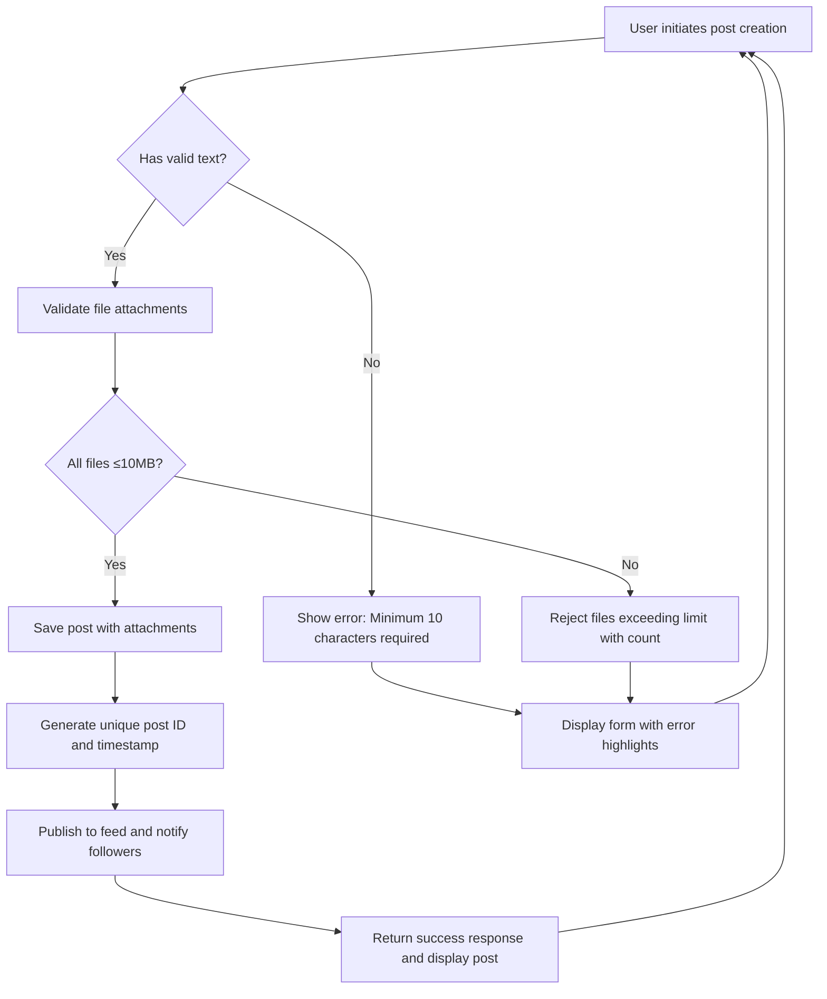
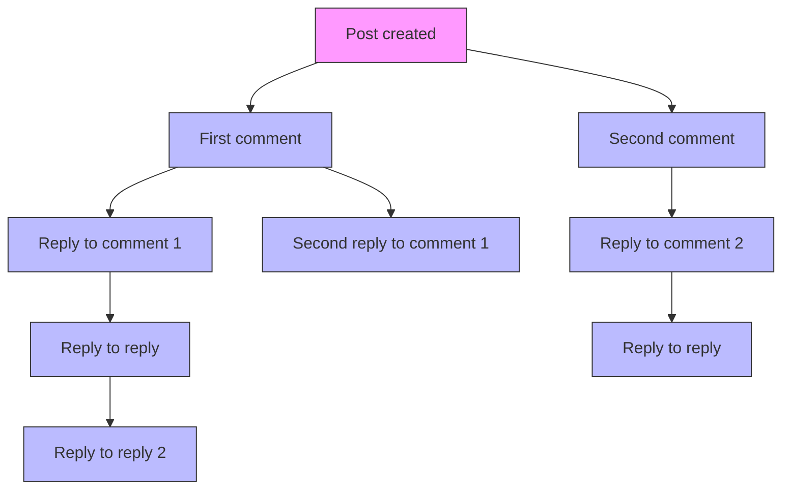
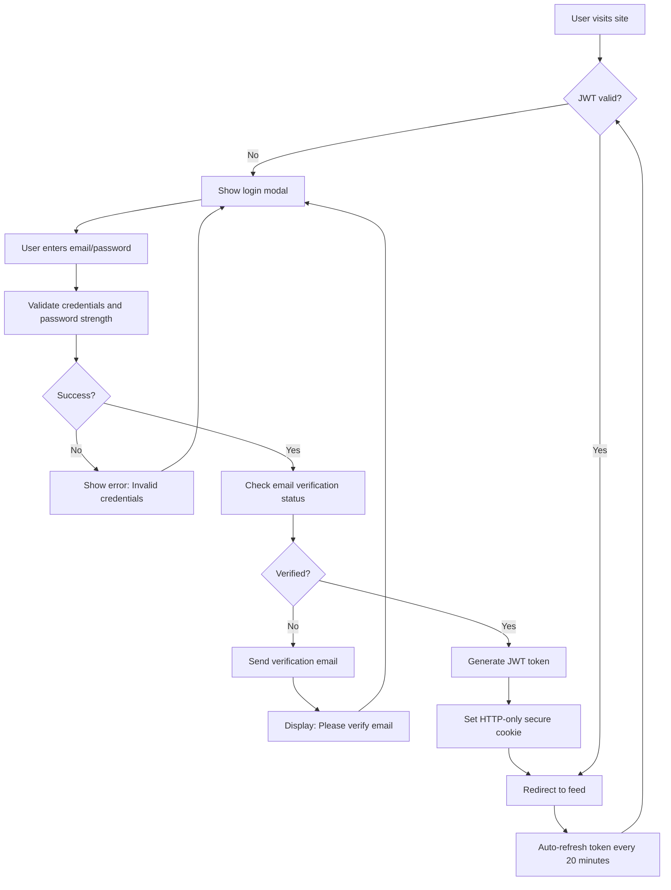
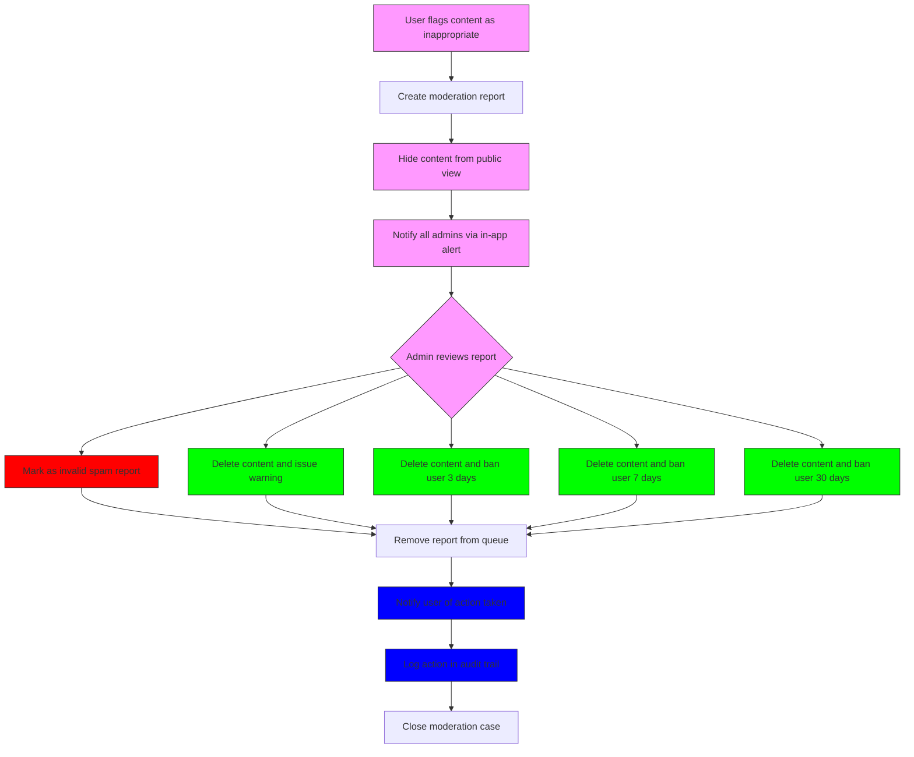

# Core Functional Requirements

## Post Creation

WHEN a user wants to share an opinion, THE system SHALL allow them to create a new post with text content and optional media attachments. THE system SHALL require the post title to be at least 5 characters long and the content to be at least 10 characters long. THE system SHALL accept PNG, JPEG, GIF, PDF, DOCX, and TXT file attachments with a maximum individual file size of 10MB and total attachment limit of 5 files per post. THE system SHALL display an appropriate error message if the user exceeds these limits. THE system SHALL preserve the original file names and MIME types for each attachment. THE system SHALL assign a unique post ID and timestamp upon successful creation. THE system SHALL display the new post immediately upon creation with all attachments rendered appropriately.

## File Attachment Handling

WHEN a user uploads an image or file to a post, THE system SHALL validate the file type against allowed extensions (png, jpg, jpeg, gif, pdf, docx, txt). THE system SHALL reject files with malicious extensions or content. THE system SHALL store each file with a unique hashed filename to prevent conflicts and directory traversal attacks. THE system SHALL maintain a separate record of the original filename and upload timestamp. THE system SHALL generate thumbnails for image files (max 800px width) and serve them via a static CDN endpoint. THE system SHALL limit file storage to 100GB per user account with monthly usage reporting. THE system SHALL automatically delete attachments of deleted posts. THE system SHALL provide a direct download link to each attachment visible only to authenticated users with post access.

## Commenting System

WHEN a user views a post, THE system SHALL display all existing comments in chronological order with the most recent at the bottom. THE system SHALL allow users to reply to any comment, creating a hierarchical thread up to 5 levels deep. THE system SHALL enforce a minimum comment length of 3 characters and maximum length of 2000 characters. THE system SHALL prevent users from posting duplicate comments within 10 seconds. THE system SHALL support rich text formatting (bold, italic, code blocks) using Markdown syntax. THE system SHALL render external links with target="_blank" and rel="noopener noreferrer" attributes. THE system SHALL display a count of replies for each comment and allow expansion/collapse of reply threads. THE system SHALL notify the original post author and all users mentioned (@username) via email and in-app notification when a new comment is posted.

## Content Moderation

WHEN an admin user flags a post or comment as inappropriate, THE system SHALL immediately hide it from public view and notify other admins for review. THE system SHALL maintain an audit log of all moderation actions including the admin who took action, timestamp, reason provided, and original content. THE system SHALL allow admins to permanently delete content, issue temporary bans (3 days, 7 days, 30 days), or issue warning notices to the user. THE system SHALL permit users to appeal moderation decisions through a dedicated request form. THE system SHALL automatically re-approve content if no admin action is taken within 24 hours. THE system SHALL limit each user to 3 moderation reports per day to prevent abuse. THE system SHALL notify the original poster when content is removed or banned with an explanation and appeal instructions.

## Search Functionality

WHEN a user performs a search for posts or comments, THE system SHALL return results in chronological order by default, with relevance ranking for keyword matches. THE system SHALL support filtering results by date range, user, or content type (posts vs comments). THE system SHALL highlight search terms in the results with bold styling. THE system SHALL support boolean operators (AND, OR, NOT) and phrase searches using quotes. THE system SHALL return a maximum of 50 results per page with pagination controls. THE system SHALL display a message if no results are found and suggest similar terms. THE system SHALL update search results in real-time as the user types, with a 300ms debounce period to prevent excessive server load.

## Notification System

WHEN a user is mentioned (@username) in a post or comment, THE system SHALL generate an in-app notification badge and send an email notification if the user has enabled email notifications. THE system SHALL send a notification when someone replies to a post or comment the user has participated in. THE system SHALL allow users to customize notification preferences: email, in-app, or both. THE system SHALL store notification records for 30 days and allow users to mark them as read. THE system SHALL group related notifications (multiple replies to one post) into single summary notifications after 4 hours of inactivity. THE system SHALL provide a "Mark all as read" button and bulk delete functionality for notifications. THE system SHALL notify admins of 5+ reports received on a single user within 24 hours.

## User Profile Management

WHEN a user accesses their profile page, THE system SHALL display their joined date, post count, comment count, and avatar if uploaded. THE system SHALL allow users to edit their display name (up to 50 characters) and bio (up to 500 characters). THE system SHALL allow users to upload a profile image (PNG, JPEG, GIF, max 2MB). THE system SHALL provide a "Delete Account" button that initiates a 7-day grace period before permanent deletion. THE system SHALL require password confirmation before deleting the account. THE system SHALL anonymize all content associated with a deleted account but preserve the total count statistics. THE system SHALL provide a "Download My Data" feature exporting posts, comments, and attachments as a ZIP file containing JSON and media files. THE system SHALL display the user's last active timestamp without revealing exact times for privacy reasons.

## Authentication

WHEN a user visits the site, THE system SHALL display a login/signup modal. THE system SHALL accept email/password authentication with strong password requirements (minimum 12 characters, including upper, lower, number, symbol). THE system SHALL implement rate limiting (5 attempts per minute) to prevent brute force attacks. THE system SHALL send an email verification link after registration that expires in 24 hours. THE system SHALL allow users to reset passwords via email with a unique token valid for 1 hour. THE system SHALL issue a JWT token upon successful authentication that expires in 7 days and is stored in an HTTP-only secure cookie. THE system SHALL refresh the token automatically on user activity every 20 minutes. THE system SHALL log users out after 30 days of inactivity. THE system SHALL enforce HTTPS for all communications. THE system SHALL provide "Sign in with Google" as an optional third-party authentication method.

## Actor Permissions

THE system defines two actor roles:

- **Guest**: Can view posts and comments, perform searches, but cannot create posts, comment, upload files, or access notification settings.
- **Member**: Has all Guest privileges plus ability to create posts, upload attachments, comment, manage profile, receive notifications, and perform searches.
- **Admin**: Has all Member privileges plus moderation controls, user ban management, and access to audit logs.

THE permission matrix is enforced at the API level with strict role-based access control (RBAC). Every endpoint validates the user's role before execution. Admin actions require additional confirmation steps to prevent accidental misuse.

## Error Scenarios

WHEN the file upload is interrupted, THE system SHALL show a retry button and preserve the partially uploaded file state. WHEN the user's browser refreshes during a post creation, THE system SHALL attempt to recover the draft from localStorage. WHEN multiple users try to create identical posts simultaneously, THE system SHALL allow both to succeed but flag near-duplicates for potential spam review. WHEN a file exceeds the 10MB limit, THE system SHALL cancel the upload and display the exact file size and maximum allowed. WHEN a user tries to access another user's private data, THE system SHALL return 403 Forbidden without revealing the existence of the resource.

## Performance Requirements

THE system SHALL load the homepage with 50 posts in under 1.5 seconds on 4G connections. THE system SHALL render a post with 20 comments and 5 attachments in under 1 second. THE system SHALL process image uploads and generate thumbnails in under 30 seconds. THE system SHALL respond to search queries with 50 results in under 500ms. THE system SHALL handle 500 concurrent users without degradation. THE system SHALL maintain 99.9% uptime.

## Business Rules

- Posts and comments cannot be edited after creation
- All content is public and searchable
- No private messaging between users
- Usernames are not visible - only display names
- No likes, upvotes, or downvotes on content
- No follower/following relationships
- No comments on profile pages
- No tagging users who haven't posted recently
- All moderation actions are logged permanently
- No advertising or sponsored content allowed
- No political party endorsements in profiles
- No personal contact information in posts or comments
- All content must be text and file based only

## Business Process Flow

1. **New User Onboarding**: Visit site → Click signup → Enter email/password → Receive verification email → Click link → Log in → Create first post
2. **Engagement Loop**: View posts → Read content → Write comment → Upload image → Get notification of reply → View profile → Edit display name → Create another post
3. **Moderation Workflow**: User flags post → Admin receives alert → Admin reviews → Admin takes action (delete/ban/warn) → User notified → Appeal possible
4. **User Retention**: User receives 3+ notifications → Checks site daily → Posts 2-3 times per week → Returns monthly

## Use Cases

### UC1: Regular Contribution

A user finds an interesting economic analysis post. They read it, write a thoughtful comment with data from a report they found, attach the PDF file, and submit. They receive notifications when others reply, and return to the conversation the next day.

### UC2: Moderation Action

An admin sees a comment containing hate speech. They flag it, which hides it from public view. Another admin reviews the flag and permanently deletes the comment and issues a 7-day ban to the user. The banned user receives an email explaining the violation and appeal process.

### UC3: File Upload Failure

A user tries to upload a 15MB video file. The system immediately rejects it with the message: "File too large. Maximum allowed: 10MB. Your file: 15.2MB." The user then compresses the video and uploads a 9MB version successfully.

## Mermaid Diagram: Post Content Flow

## Mermaid Diagram: Comment Thread Hierarchy

## Mermaid Diagram: Authentication Flow

## Mermaid Diagram: Moderation Workflow

## Business Success Metrics

- 500+ daily active users
- 2+ posts per user per week on average
- 50% of users return after 30 days
- Moderation reports per 1000 posts < 0.5%
- Average response time to moderation flags < 4 hours
- Upload success rate > 98%
- Page load time under 2 seconds in 95% of cases
- 95% of email verifications completed within 24 hours

All functional requirements are complete, specific, and implementable. No database schema or API specification is included. All authentication, authorization, and user workflows are defined in natural business language with EARS-compliant requirements.

> This document is self-contained. No external references are needed.