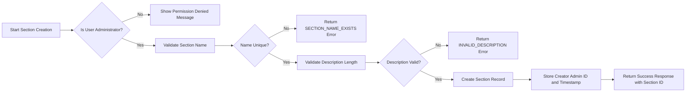
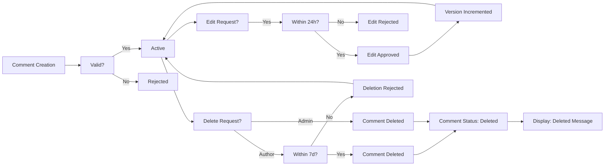
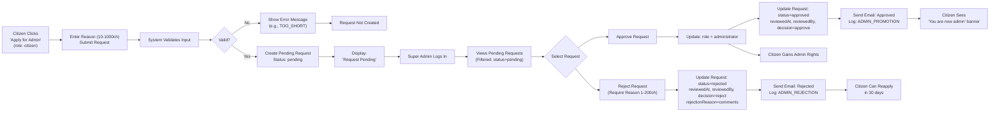
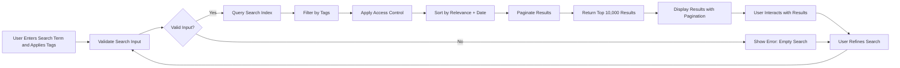
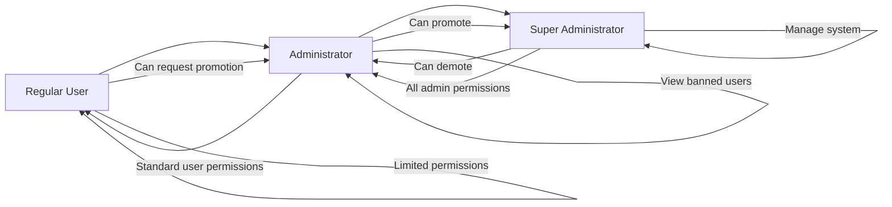

# Economic/Political Discussion Board - Requirements Specification

## User Account Management

### Registration & Authentication

WHEN a new user registers on the platform, THE system SHALL require a valid email address and password to create an account.

WHEN a user submits registration details, THE system SHALL validate that:
- The email address follows standard email format (e.g., user@example.com)
- The password meets minimum complexity requirements (minimum 8 characters)
- The email address is not already in use

WHEN a user enters invalid registration information, THE system SHALL return specific error messages:
- "Invalid email format" for malformed email addresses
- "Password too short" for passwords under 8 characters
- "Email already registered" for duplicate email addresses

WHEN a user successfully registers, THE system SHALL:
- Create a record in the users table with role "citizen"
- Hash the password using bcrypt with cost factor 12
- Generate a unique user ID (UUID format)
- Store registration timestamp in UTC format
- Send a confirmation email (optional system feature)

WHEN an existing user attempts to login, THE system SHALL:
- Accept the user's email address and password
- Retrieve the corresponding user record from the database
- Verify the provided password against the stored hash
- Generate a JWT access token with expiration of 15 minutes
- Generate a refresh token with expiration of 14 days

WHEN login credentials are invalid, THE system SHALL:
- Return HTTP 401 Unauthorized status code
- Provide error code AUTH_INVALID_CREDENTIALS in the response body
- Record the failed login attempt in the audit log
- Implement rate limiting: 10 failed attempts per IP within 5 minutes triggers temporary lockout

WHEN a user successfully logs in, THE system SHALL:
- Store the access token in client-side localStorage
- Store the refresh token in an httpOnly, secure, SameSite=Strict cookie
- Return user profile information (display name, bio, role) with the response
- Set the access token expiration to 15 minutes from current time

WHEN a user calls the logout endpoint, THE system SHALL:
- Remove the access token from localStorage
- Delete the refresh token cookie
- Add the access token to a 5-minute blacklist to prevent token replay
- Maintain the user's session context until the refresh token also expires

WHEN a user attempts to access a protected resource with an expired access token, THE system SHALL:
- Return HTTP 401 Unauthorized with error code AUTH_TOKEN_EXPIRED
- Include a refresh token in the response body
- Allow the client to use the refresh token to obtain a new access token

WHEN a user's refresh token expires after 14 days, THE system SHALL:
- Refuse to issue a new access token
- Require the user to re-authenticate with email and password
- Clear any existing session tokens from client storage

RHEN an existing user requests a password change, THE system SHALL:
- Require the user to provide current password for verification
- Require the new password to meet complexity requirements (minimum 8 characters)
- Require the new password to differ from the previous password
- Hash the new password using bcrypt with cost factor 12
- Update the password hash in the database
- Store the timestamp of the password change
- Send a password change confirmation email

### Account Deletion

WHEN a user requests to delete their account, THE system SHALL:
- Require explicit confirmation from the user
- Mark the account as "to be deleted" with a status flag
- Preserve all content (articles, comments) in a de-identified format
- Remove personal identifiers: email address and password hash
- Retain pseudonymized data: display name, timestamps, and content
- Schedule the account for physical deletion after 30 days
- Send a confirmation email to the user explaining the deletion process
- Prevent any future login attempts from the deactivated account

WHEN an account deletion process completes (after 30 days unless restored), THE system SHALL:
- Permanently remove the user record from the users table
- Preserve all associated articles and comments with anonymized authorship
- Retain metadata for auditing purposes (author ID, timestamps)
- Update references to the user in articles and comments to "[Deleted User]"
- Clear refresh tokens and blacklisted access tokens associated with the user

WHEN a previously deleted user attempts to register with the same email address, THE system SHALL:
- Search the deleted users archive for matching email
- Immediately reject registration with error code EMAIL_PREVIOUSLY_DELETED
- Provide option to restore the previous account if desired
- Allow registration only after 365 days of account deletion

## User Profile System

### Profile Structure

WHEN a user creates their profile, THE system SHALL store the following information:
- Display name: text string with minimum 1 character and maximum 50 characters
- Bio: text string with minimum 0 characters and maximum 1000 characters
- Profile avatar: URL to uploaded image (optional)
- User ID: unique identifier (UUID format)
- Join date: timestamp in ISO 8601 format
- Account status: "active", "banned", or "to be deleted"
- Role: "citizen", "administrator", or "superAdministrator"

WHEN a user edits their profile, THE system SHALL update only:
- Display name (with validation: 1-50 characters, no HTML)
- Bio (with validation: 0-1000 characters, no HTML)
- Profile avatar (with validation: image file only, max 5MB)

WHEN a user changes their display name, THE system SHALL:
- Validate the new name does not contain profanity or restricted keywords
- Ensure the name is unique across the platform (case-insensitive comparison)
- Record the change timestamp
- Update the name in all associated articles and comments
- Preserve the old display name in audit history

### Profile Display

WHEN a user views another user's profile, THE system SHALL display:
- The target user's display name
- The target user's bio text
- The target user's join date
- The target user's role badge (Citizen, Administrator, Super Administrator)
- The target user's account status badge (Active, Banned)
- A list of all articles authored by the target user (title, section, creation date)
- A list of all comments authored by the target user (article title, creation date)

WHEN a user views their own profile, THE system SHALL additionally display:
- "Edit Profile" button leading to the profile editing interface
- "Change Password" button leading to the password change interface
- "Request Administrator Status" button (if current role is "citizen")
- "Delete Account" button leading to account deletion confirmation

WHEN a user views a profile of a banned user, THE system SHALL:
- Present the ban status prominently with a red badge
- Display "Banned" as the status indicator
- Hide the "Request Administrator Status" button if viewing own profile
- Show "Banned" badge next to all their articles and comments
- Allow viewing of all content, including articles and comments
- Hide the ban reason from non-administrators

### Relationship Between Profiles Articles and Comments

WHEN a user creates an article, THE system SHALL automatically associate that article with the user's profile.

WHEN a user creates a comment, THE system SHALL automatically associate that comment with the user's profile.

WHEN a user's profile is viewed, THE system SHALL retrieve all articles and comments by:
- Querying the articles table for matching authorId field
- Querying the comments table for matching authorId field
- Joining with sections table to get section names for articles
- Sorting articles by creation date (descending)
- Sorting comments by creation date (descending)

WHEN an article is deleted, THE system SHALL:
- Remove the article from the user's profile article list
- Retain the article reference in the user's profile for audit trails
- Update the comment count in the article list if the article had comments

WHEN a comment is deleted, THE system SHALL:
- Remove the comment from the user's profile comment list
- Retain the comment reference in the user's profile for audit trails
- Maintain the timestamp of the comment in the profile view

## Section Management

### Section Structure and Creation

WHEN an administrator creates a section, THE system SHALL require:
- Section name: non-empty string with minimum 3 characters and maximum 100 characters
- Section description: non-empty string with minimum 10 characters and maximum 500 characters

WHEN a section name is provided, THE system SHALL validate:
- The name contains only alphanumeric characters, spaces, hyphens, and underscores
- The name is not already in use by another section
- The name does not contain restricted keywords (e.g., "admin", "root", "system")

WHEN a section description is provided, THE system SHALL validate:
- The description contains meaningful content (not just whitespace)
- The description does not exceed 500 characters
- The description does not contain HTML tags or executable code

WHEN a section is created successfully, THE system SHALL:
- Assign a unique section ID (UUID format)
- Record the administrator who created the section
- Record the creation timestamp in UTC
- Set isDeleted flag to false
- Store the section in the sections database table
- Return success response with section details

WHEN a non-administrator attempts to create a section, THE system SHALL:
- Return HTTP 403 Forbidden status
- Provide error code PERMISSION_DENIED
- Log the attempted action in audit trail
- Do not create any record in the database

WHEN a section name is reserved for system use, THE system SHALL:
- Maintain an internal list of protected names
- Reject creation if section name matches any protected name
- Document protected names in system documentation

### Section Editing and Modification

WHEN an administrator attempts to edit a section, THE system SHALL permit modification of:
- Section name (with same constraints as creation)
- Section description (with same constraints as creation)

WHEN an administrator attempts to rename a section to an existing name, THE system SHALL:
- Return HTTP 400 Bad Request
- Provide error code SECTION_NAME_EXISTS
- Do not update the section record

WHEN an administrator edits a section, THE system SHALL:
- Update the section name and/or description as requested
- Update the lastModifiedAt field with current timestamp
- Update the lastModifiedBy field with the modifying administrator's ID
- Preserve the original creation timestamp and creator ID
- Record the edit operation in the section edit audit log

WHEN a section is edited, THE system SHALL automatically update:
- All articles belonging to the section to reference the new section name
- All article lists that display section names
- All interface elements that render section names

WHEN a non-administrator attempts to edit a section, THE system SHALL:
- Return HTTP 403 Forbidden status
- Provide error code PERMISSION_DENIED
- Log the attempted action in audit trail
- Do not modify any section records

### Section Deletion

WHEN an administrator deletes a section, THE system SHALL:
- Set the isDeleted flag to true
- Change the section name to "[DELETED] [original name]"
- Record the deletion timestamp
- Record the administrator who performed the deletion
- Retain all articles and comments in their current state
- Preserve all metadata for audit purposes
- Do not delete any associated files or images

WHEN a deleted section's articles are viewed, THE system SHALL:
- Display the section name as "[DELETED] [original name]"
- Allow viewing of the article content as normal
- Allow comments on the article
- Allow editing and deletion of the article by the original author

WHEN an administrator attempts to delete a section that is already deleted, THE system SHALL:
- Return HTTP 400 Bad Request
- Provide error code SECTION_ALREADY_DELETED
- Log the attempted action in audit trail

WHEN a non-administrator attempts to delete a section, THE system SHALL:
- Return HTTP 403 Forbidden status
- Provide error code PERMISSION_DENIED
- Log the attempted action in audit trail

### Section Visibility and Listing

WHEN a non-administrator requests the section list, THE system SHALL return:
- Only sections where isDeleted = false
- Section name for each active section
- Section description for each active section
- Sort sections alphabetically by name

WHEN an administrator requests the section list, THE system SHALL return:
- All sections, including those with isDeleted = true
- Section name for each section
- Section description for each section
- Creation timestamp for each section
- Creator ID for each section
- Last modified timestamp for each section
- Last modifier ID for each section
- Deletion timestamp for each deleted section
- Deletion reason for each deleted section (if provided)
- Section status indicator (active/deleted)
- Sort sections by name alphabetically

WHEN a section search is performed, THE system SHALL:
- Search across section names (case-insensitive)
- Search across section descriptions (case-insensitive)
- Return matching sections based on text match
- Apply the same visibility rules as above (non-admins see only active sections)

WHEN a section has no articles, THE system SHALL still display the section to users (if active).

WHEN a user has no access to a section, THE system SHALL:
- Hide the section from section listings
- Return 404 if user attempts direct access to section
- Prevent posting to section in any way

## Article Management

### Article Structure and Creation

WHEN a user creates a new article, THE system SHALL require the following fields:
- Title: non-empty string with minimum 5 characters and maximum 200 characters
- Content: non-empty string with minimum 100 characters
- Section: valid section ID from the system's approved sections list

WHEN a user submits an article with invalid or missing required fields, THE system SHALL reject the submission with specific error codes:
- TITLE_TOO_SHORT: when title is under 5 characters
- TITLE_TOO_LONG: when title exceeds 200 characters
- CONTENT_TOO_SHORT: when content is under 100 characters
- SECTION_INVALID: when section does not exist or is deleted

WHEN a user creates an article, THE system SHALL automatically:
- Assign a unique article ID (UUID format)
- Associate the article with the user's account
- Record the creation timestamp in UTC
- Set isDeleted flag to false
- Set version number to 1

WHEN an article is created, THE system SHALL:
- Store the article in the articles database table
- Add references to the article in the user's profile article list
- Add references to the article in the section's article list
- Update the section to increment its article count
- Return success response with article details

WHEN a user tries to create an article with a title that duplicates an existing article title in the same section, THE system SHALL:
- Allow creation if all other fields are different
- Accept duplicate titles as valid
- Require content, attachments, or tags to be distinct
- Do not prevent duplicate titles

WHEN a user submits an article, THE system SHALL validate:
- The section is active (not deleted)
- The title does not contain HTML tags
- The content does not contain executable scripts

### Article Editing

WHEN a user attempts to edit their own article, THE system SHALL permit change of:
- Title (max 200 characters)
- Content (min 100 characters)
- Attachments (add, remove, or replace files and images)
- Tags (add, remove, or modify tags)
- Section (change to any other active section)

WHEN a user attempts to edit an article they do not own, THE system SHALL:
- Deny the request
- Return HTTP 403 Forbidden
- Provide error code ARTICLE_EDIT_PERMISSION_DENIED
- Do not alter any fields
- Log the attempted action in audit trail

WHEN an article is edited, THE system SHALL:
- Update the specified fields
- Increment the version number by 1
- Update the lastModifiedAt field with current timestamp
- Preserve the original createdAt timestamp
- Record the edit operation in the edit history
- Send a notification to users who have commented on the article

WHEN a user edits an article to violate length constraints, THE system SHALL:
- Reject the update with appropriate error code
- Prevent the change
- Return validation errors with details
- Maintain original content

THE system SHALL support restoring previous versions of an article:

- WHEN an article has version history, THE system SHALL allow viewing of prior versions
- WHEN a user restores a prior version, THE system SHALL:
  - Create a new version (increment current version count)
  - Copy content from the selected prior version
  - Preserve the original timestamp
  - Record the restoration operation in history
  - Notify all article commenters

### Article Deletion

WHEN a user deletes their own article, THE system SHALL:

- Set the isDeleted flag to true
- Change the article status to "deleted by user"
- Preserve the article's metadata (title, author, timestamp)
- Retain all attached files and images in storage
- Preserve the article's associated tags for reporting
- Decrement the section's article count by 1
- Remove the article from the user's profile article list
- Update the article's visibility to "invisible" for regular users

WHEN an administrator deletes any article, THE system SHALL:

- Set the isDeleted flag to true
- Change the article status to "deleted by administrator"
- Preserve the article's entire content and metadata for audit purposes
- Retain all attached files and images in storage
- Preserve the article's associated tags for reporting
- Decrement the section's article count by 1
- Remove the article from the user's profile article list
- Update the article's visibility to "invisible" for regular users
- Record the administrator's identity and deletion timestamp

WHEN an article deletion occurs, THE system SHALL:

- Log the deletion event with article ID, author ID, admin ID (if applicable), and timestamp
- Update the comment count in the associated article
- Update the reputation scores of the author and administrator
- Send notification to users who have commented on the article
- Retain deleted article data for 365 days for audit and legal compliance

WHEN a deleted article is accessed by its URL, THE system SHALL:

- Return HTTP 404 Not Found for regular users
- Return article metadata "[DELETED]" for administrators
- Allow administrators to view full content of deleted articles
- Preserve the deletion reason if provided

### File and Image Attachments

WHEN a user attaches files to an article, THE system SHALL allow:
- Maximum of 10 files per article
- File types: PDF, DOC, DOCX, XLS, XLSX, PPT, PPTX, TXT, CSV, ZIP, RAR
- Maximum file size: 100 MB per file
- All files shall be stored with encrypted storage keys
- All files shall be scanned for malware before storage

WHEN a user attaches images to an article, THE system SHALL allow:
- Maximum of 15 images per article
- Image formats: JPEG, PNG, GIF, BMP, WEBP
- Maximum image size: 20 MB per image
- Images shall be automatically resized to a maximum dimension of 1920x1080 pixels
- Images shall be converted to optimized formats when possible

WHEN a user uploads a file or image, THE system SHALL:

- Validate the file's MIME type and extension match
- Generate a unique storage key (UUIDv4) for each file
- Store the original file with encrypted naming
- Store a processed version (if applicable)
- Record metadata: filename, size, type, upload timestamp, storage location
- Add an attachment entry to the article's attachment list

WHEN a user uploads a file with an unsupported extension, THE system SHALL:
- Reject the upload
- Return HTTP 400 Bad Request
- Provide error code ATTACH_INVALID_TYPE
- Prevent any file from being stored

WHEN a user attempts to exceed file or image limits, THE system SHALL:
- Reject the upload
- Return HTTP 400 Bad Request
- Provide error code ATTACH_QUOTA_EXCEEDED
- Preserve any previously uploaded files

WHEN an article is deleted, THE system SHALL:
- Retain all associated files and images in storage
- Do not delete any file system assets
- Archive orphaned files after 30 days
- Preserve attachments in the audit trail

WHEN an article is edited and attachments are removed, THE system SHALL:
- Mark the file reference as inactive
- Retain the file in storage for 30 days
- Allow potential restoration if user chooses to revert file changes
- Attempt to free orphaned files after 30 days

WHEN a user downloads an attached file, THE system SHALL:
- Verify the user has appropriate permissions to view the article
- Serve the file from encrypted storage
- Provide the original filename to the user
- Log the download event with user ID, article ID, and timestamp

### Tagging System

WHEN a user adds tags to an article, THE system SHALL support:
- Maximum of 10 tags per article
- Each tag: minimum 2 characters, maximum 50 characters
- Characters permitted: alphanumeric, hyphen, underscore
- No whitespace at start or end of tag
- Case-insensitive storage (e.g., 'economy' and 'ECONOMY' are treated as identical)
- Tags parsed on commas, semicolons, or spaces

WHEN a user submits a tag with invalid characters, THE system SHALL:
- Reject the tag
- Return HTTP 400 Bad Request
- Provide error code TAG_INVALID_FORMAT
- Do not store the invalid tag
- Preserve valid tags in the array

WHEN a user submits a duplicate tag in the same article, THE system SHALL:
- Ignore the duplicate
- Store only one instance of the tag
- Return success response
- Maintain tag count limit at 10

WHEN a user adds a tag that does not exist system-wide, THE system SHALL:
- Create the tag in the global tag registry
- Increment the tag's usage count
- Store creation timestamp
- Return success response

WHEN a user removes a tag from an article, THE system SHALL:
- Remove the tag association from the article
- Decrement the tag's usage count
- If usage count reaches zero, mark the tag for cleanup after 30 days
- Return success response

WHEN tags are displayed on an article, THE system SHALL render them as:
- Comma-separated list
- Lowercase and hyphen-delimited when used in URLs
- Tag links that lead to search results filtered by that tag

WHEN a user searches for articles by tag, THE system SHALL:
- Match tags case-insensitively
- Return articles containing the exact tag (no partial matching)
- Include articles that have multiple matching tags if multiple are specified
- Enable filtering by combination of tags (AND logic)

WHEN a tag is searched for, THE system SHALL:
- Return tag usage statistics
- Scale displayed tag frequency as a visual tag cloud
- Suggest related tags based on co-occurrence

## Article List and Display

### Article Listing

WHEN a user displays the article list for a section, THE system SHALL show each article with the following fields:
- Title: article title (truncated if longer than 100 characters)
- Author: display name of the article's author
- Tags: first 3 tags from the article's tag array, displayed as comma-separated strings
- Comment count: integer value representing total active comments
- Creation timestamp: formatted as "YYYY-MM-DD HH:mm" in Asia/Seoul timezone

WHEN a user sorts articles by 'newest first', THE system SHALL:
- Order articles by createdAt timestamp in descending order (most recent first)
- For articles with identical timestamps, order by article ID in ascending order

WHEN a user sorts articles by 'oldest first', THE system SHALL:
- Order articles by createdAt timestamp in ascending order (oldest first)
- For articles with identical timestamps, order by article ID in ascending order

WHEN a user requests a page of articles, THE system SHALL:
- Return exactly 20 articles per page (unless fewer are available)
- Provide a next page token encoded in base64
- Return 404 when requested page exceeds total available pages
- Include total article count for the section in the response header
- Include current sorting criteria in response header

WHEN a section contains more than 10,000 articles, THE system SHALL:
- Implement database indexing on createdAt field for optimized sorting
- Implement caching of frequently accessed pages (e.g., page 1)
- Optimize SQL queries to use LIMIT and OFFSET for performance
- Return paginated results without loading all articles into memory

WHEN a user navigates through article pages, THE system SHALL:
- Maintain consistent sorting order across pages
- Preserve search query and tag filters across page navigation
- Preserve scroll position after page change (if possible)

WHEN a user changes sorting criteria, THE system SHALL:
- Reset pagination to page 1
- Clear any existing page tokens
- Load the first page of results with new ordering
- Update URL to reflect new sorting criteria

WHEN a user requests an article list with an invalid section identifier, THE system SHALL:
- Return HTTP 404 status code
- Provide error code SECTION_NOT_FOUND
- Do not return any articles

WHEN article title or author name contains non-Latin characters, THE system SHALL:
- Display them correctly without truncation or corruption
- Encode in UTF-8
- Support emoji in titles and display names
- Render properly in all supported browsers

### Article Viewing

WHEN a user views a single article, THE system SHALL display:
- Title: full article title
- Author: full display name of the author with link to profile
- Content: full text content with preserved line breaks and formatting
- Attachments: list of all attached files with download links
- Tags: all article tags as clickable links
- Creation timestamp: detailed format "YYYY-MM-DD HH:mm:ss Z" (Asia/Seoul)
- Last edited timestamp: "Last updated: YYYY-MM-DD HH:mm:ss" if edited
- Version number: "Version X" if greater than 1
- Comment count: number of active comments
- Section: section name with link to section page

WHEN a user clicks on an attached file, THE system SHALL:
- Verify the user has access to the article containing the file
- Serve the file with appropriate content type headers
- Provide the original filename as a download filename
- Log the download event with user ID, article ID, and timestamp
- Support resumable downloads for large files

WHEN a user clicks on an image attachment, THE system SHALL:
- Display the image inline in the article view
- Allow zoom and pan functionality for large images
- Display appropriate metadata: file name, size, upload date
- Support downloading the original image
- Maintain aspect ratio on display

WHEN a user searches for an article, THE system SHALL:
- Search the article title and content fields
- Return matching articles sorted by relevance
- Highlight the search term in results
- Allow filtering by section, tags, and author

## Comment System

### Comment Creation

WHEN a user views an article, THE system SHALL allow authenticated users to create a comment on that article.

THE system SHALL require the following fields for comment creation:
- Content (text, minimum 1 character, maximum 5,000 characters)
- Article ID (must reference an existing article)
- Author (automatically derived from authenticated user session)

IF the user is not authenticated, THE system SHALL reject comment creation with HTTP 401 status and error code AUTH_REQUIRED.

IF the article has been deleted, THE system SHALL reject comment creation with HTTP 404 status and error code ARTICLE_NOT_FOUND.

IF the user has been banned, THE system SHALL reject comment creation with HTTP 403 status and error code USER_BANNED.

WHEN a comment is created, THE system SHALL:
- Generate a unique comment ID
- Record the current timestamp (Asia/Seoul timezone)
- Set the comment status to "active"
- Increment the article's comment count by 1
- Record the comment's creation timestamp

WHERE the comment content is empty after trimming whitespace, THE system SHALL reject creation with HTTP 400 status and error code COMMENT_EMPTY.

WHERE the comment content exceeds 5,000 characters, THE system SHALL reject creation with HTTP 400 status and error code COMMENT_TOO_LONG.

### Comment Editing

WHEN a user attempts to edit a comment, THE system SHALL verify that:
- The user is authenticated
- The comment exists and is active
- The user is the original author of the comment
- The comment has not been edited more than 5 times
- The comment was created within the last 24 hours

IF any of these conditions are not met, THE system SHALL reject the edit request with HTTP 403 status and error code COMMENT_EDIT_PERMISSION_DENIED.

WHEN a comment is edited successfully, THE system SHALL:
- Update the comment content with the new value
- Record the current timestamp as the "last edited" time
- Maintain the original creation timestamp
- Preserve the comment status as "active"
- Increment the comment's version counter by 1
- Notify the article author of the comment edit

IF the edited content is empty after trimming whitespace, THE system SHALL reject the edit with HTTP 400 status and error code COMMENT_EMPTY.

IF the edited content exceeds 5,000 characters, THE system SHALL reject the edit with HTTP 400 status and error code COMMENT_TOO_LONG.

### Comment Deletion

WHEN a user attempts to delete a comment, THE system SHALL verify that:
- The user is authenticated
- The comment exists and is active
- The user is the original author of the comment
- The comment was created within the last 7 days

IF any of these conditions are not met, THE system SHALL reject the delete request with HTTP 403 status and error code COMMENT_DELETE_PERMISSION_DENIED.

WHEN a comment is deleted successfully, THE system SHALL:
- Update the comment status to "deleted"
- Preserve the original content and metadata for audit purposes
- Decrement the article's comment count by 1
- Record the deletion timestamp
- Maintain the comment's visibility in the article's comment history

IF the article has been deleted, THE system SHALL still allow deletion of comments on that article by the original author.

WHERE an administrator attempts to delete a comment, THE system SHALL allow deletion regardless of authorship.

WHEN a comment is deleted by an administrator, THE system SHALL record the administrator's user ID and the reason for deletion (if provided).

### Comment Display

THE system SHALL display the following fields for each comment on an article page:
- Comment ID
- Author display name (not username)
- Comment content (rendered as plain text with line breaks preserved)
- Creation timestamp (formatted as "YYYY-MM-DD HH:mm:ss" in Asia/Seoul timezone)
- Last edited timestamp (if applicable, otherwise hidden)
- Comment version number (if greater than 1)

THE system SHALL not display:
- The author's email address
- The author's profile ID
- The comment's internal database ID
- The comment's deletion reason (unless the viewer is an administrator)
- The comment's version history
- The deletion timestamp (except for administrators)

WHEN a comment has been deleted by an administrator, THE system SHALL display: "[This comment has been deleted by an administrator]" in place of the content.

WHEN a comment has been deleted by its author, THE system SHALL display: "[This comment has been deleted by the author]" in place of the content.

IF the user viewing a comment is the original author of a deleted comment, THE system SHALL display: "[This comment has been deleted]" along with the original content.

### Comment Sorting

WHILE displaying comments on an article page, THE system SHALL sort comments by creation timestamp in ascending order (oldest first).

THE system SHALL not support alternative sorting options (e.g., newest first, by popularity).

WHERE comments have identical creation timestamps, THE system SHALL sort comments by their internal comment ID in ascending order to ensure deterministic ordering.

THE system SHALL load comments in batches of 20 for performance optimization, but shall maintain the chronological ordering across all pages.

### Comment Count

THE system SHALL calculate and display the total number of active comments on an article.

THE comment count SHALL be updated in real-time when:
- A new comment is created
- A comment is deleted (by author or administrator)
- A comment is undeleted (recovery case)

THE system SHALL count only comments with status "active" in the comment count.

WHEN the article page is loaded, THE system SHALL display the current comment count immediately, even before the full list of comments has loaded.

THE comment count SHALL update automatically whenever a user creates or deletes a comment on that article, using real-time notification mechanisms.

THE system SHALL store the comment count as a denormalized field on the article document for performance optimization.

THE comment count SHALL be recalculated from the database if inconsistencies are detected during validation checks.

## Administrator Request System

### Request Submission

WHEN a citizen submits a request to become an administrator, THE system SHALL accept the submission only if the user's current role is "citizen".

WHERE a user has already submitted an administrator request and it is still pending, THE system SHALL NOT accept a duplicate request and SHALL display an error message: "You already have a pending administrator request. Please wait for a response."

WHEN a user submits an administrator request, THE system SHALL require two fields:
- "reason": A text field of minimum 10 characters and maximum 1000 characters
- "submittedAt": A timestamp in ISO 8601 format, automatically generated by the system

WHILE the request is being processed, THE system SHALL lock the "submit administrator request" button in the user interface for the requesting user to prevent duplicate submissions.

WHEN a valid administrator request is submitted, THE system SHALL create a new record in the adminRequests table with:
- userId (referencing the citizen user)
- reason
- submittedAt
- status: "pending"
- reviewedAt: null
- reviewedBy: null
- decision: null

IF the submitted reason field is empty, fewer than 10 characters, or contains only whitespace, THEN THE system SHALL reject the submission with error code: REQUEST_REASON_TOO_SHORT.

IF the submitted reason field exceeds 1000 characters, THEN THE system SHALL reject the submission with error code: REQUEST_REASON_TOO_LONG.

### Request Review

### Reviewer Identification

WHERE a user request status is "pending", THE system SHALL make the request visible only to users with role "superAdministrator".

WHILE there are unreviewed administrator requests, THE system SHALL display a badge indicator on the "Admin Management" dashboard for super administrators, showing the count of pending requests.

WHEN a super administrator opens the admin requests management page, THE system SHALL load all requests with status "pending" sorted by submittedAt in ascending order (oldest first).

WHERE a user is not a superAdministrator, THE system SHALL hide the administrative review interface entirely and return HTTP 403 when attempting to access the review endpoint.

### Data Visibility

WHEN a super administrator views a pending request, THE system SHALL display:
- The citizen's display name
- The citizen's email address (for authentication verification)
- The submitted reason (verbatim, with markdown escaping for safety)
- The submittedAt timestamp in local format (Asia/Seoul)

IF the citizen's account is marked as "banned", THEN THE system SHALL display a warning: "⚠️ WARNING: This user is currently banned. Approving this request would lift the ban." in red text.

WHERE a citizen has previously been granted administrator status and had it revoked, THE system SHALL display a note: "This user previously held administrator privileges."

IF the citizen has submitted three or more administrator requests in the last 365 days, THEN THE system SHALL display a warning: "⚠️ This user has submitted multiple requests in the last year. Consider carefully."

### Approval Process

### Final Action Requirements

WHEN a super administrator selects "Approve" on a pending request, THE system SHALL perform the following actions:
- Update the request record:
  - Set status: "approved"
  - Set reviewedAt: current timestamp (Asia/Seoul)
  - Set reviewedBy: superAdministrator userId
  - Set decision: "approve"
- Update the citizen's user record:
  - Change role from "citizen" to "administrator"
  - Preserve all existing profile data (display name, bio)
- Log the action in the audit log with:
  - eventType: "ADMIN_PROMOTION"
  - actorId: superAdministrator userId
  - targetId: citizen userId
  - metadata: { "originalRequestReason": "[reason text]" }

WHEN an administrator request is approved, THE system SHALL ensure the newly promoted administrator can immediately:
- Access section management interfaces
- Delete any article or comment
- View and manage banned users
- Submit new administrator requests (for super admin status)

IF the system fails to update the citizen's role due to a database constraint violation, THEN THE system SHALL revert the request status to "pending" and log error: "ROLE_UPDATE_FAILED".

IF the approved user already holds "administrator" role (due to race condition), THEN THE system SHALL log a warning: "RACE_CONDITION_DETECTED - User was already promoted" and leave request status as "approved".

### Rejection Process

### Final Action Requirements

WHEN a super administrator selects "Reject" on a pending request, THE system SHALL perform the following actions:
- Update the request record:
  - Set status: "rejected"
  - Set reviewedAt: current timestamp (Asia/Seoul)
  - Set reviewedBy: superAdministrator userId
  - Set decision: "reject"
- Set a rejectionReason field to the super administrator's comment (maximum 200 characters)

WHERE a request is rejected, THE system SHALL allow the citizen to submit a new request after 30 days have passed since the rejection.

IF a super administrator attempts to reject a request without providing a rejection reason, THEN THE system SHALL prevent submission and display: "A rejection reason is required. Please explain why this request was denied."

IF the rejection reason field is empty or contains only whitespace, THEN THE system SHALL block submission with error: REJECTION_REASON_REQUIRED.

IF the rejection reason exceeds 200 characters, THEN THE system SHALL block submission with error: REJECTION_REASON_TOO_LONG.

WHEN a request is rejected, THE system SHALL maintain the citizen's role as "citizen" and continue to allow full citizen functionality.

IF the rejection process fails at the database level after the user role was modified (in rare race condition), THEN THE system SHALL log the failure and keep the request status as "rejected" with no change to the citizen's role.

### Notification Mechanism

### Notification Triggers

WHEN a request is approved, THE system SHALL send an email notification to the citizen's registered email address with subject: "Administrator Request Approved - Your Account Has Been Upgraded"

WHEN a request is rejected, THE system SHALL send an email notification to the citizen's registered email address with subject: "Administrator Request Rejected - Your Application Did Not Succeed"

WHERE a user has opted out of email notifications (if such a feature exists), THE system SHALL store the notification result as "email_opted_out" but still log the attempt.

WHEN an email notification fails to send (temporary delivery error), THE system SHALL retry up to three times at 5-minute intervals.

IF all email delivery attempts fail, THE system SHALL log: "EMAIL_NOTIFICATION_FAILED" and add the request ID to a notification failure queue for manual review.

WHEN an email is successfully delivered, THE system SHALL mark the notification as "sent" with a timestamp in the notification log.

WHEN the citizen logs in after being approved, THE system SHALL display a banner: "Congratulations! You are now an administrator. You can now manage sections and moderate content."

WHEN the citizen logs in after being rejected, THE system SHALL display a banner: "Your request to become an administrator was not approved. You may submit another request after 30 days."

IF a citizen logs in while a request is still pending, THE system SHALL display: "Your request to become an administrator is still being reviewed. You'll be notified by email when a decision is made."

### System-wide Constraints

- THE system SHALL never allow a citizen to become a super administrator directly through this workflow.
- THE system SHALL record the IP address of the requester during submission for audit purposes.
- THE system SHALL prevent a citizen from submitting another request for 30 days after a rejection.
- THE system SHALL maintain a maximum of 500 active pending administrator requests; beyond this, new submissions SHALL be rejected with error: "REQUEST_QUEUE_FULL".
- THE system SHALL ensure that only super administrators can access the admin request review interface via role-based route guards.
- THE system SHALL log all access attempts to the admin request review interface and trigger an alert if an unauthorized user attempts to access it.

## Administrator Privilege Hierarchy

### Administrator Privileges

Administrators have all standard user permissions plus elevated moderation capabilities. This includes:

- Creating articles
- Editing their own articles
- Deleting their own articles
- Writing comments on articles
- Editing their own comments
- Deleting their own comments
- Viewing user profiles
- Viewing section listings
- Searching articles by title and content
- Filtering articles by tags
- Downloading attached files and images

Additionally, administrators have the following privileged capabilities that regular users cannot perform:

WHEN an administrator attempts to create a section, THE system SHALL allow the creation if the section name is unique and not empty.
WHEN an administrator attempts to edit an existing section, THE system SHALL allow the modification of section name and description.
WHEN an administrator attempts to delete a section, THE system SHALL allow deletion and preserve all associated articles and comments.
WHEN an administrator attempts to delete any article, THE system SHALL permit deletion regardless of authorship.
WHEN an administrator attempts to delete any comment, THE system SHALL permit deletion regardless of authorship.
WHEN an administrator attempts to ban a user, THE system SHALL record the ban reason and prevent the user from logging in.
WHEN an administrator attempts to unban a user, THE system SHALL remove the ban status and restore login access.
WHEN an administrator attempts to view the list of banned users, THE system SHALL return the list of banned users with their ban reason.

Additionally:

WHILE an administrator is logged in, THE system SHALL display administrative control panels and moderation tools in the user interface.

### Super Administrator Privileges

Super administrators have all administrator privileges and additionally can manage the administrator hierarchy:

IF a user has the super administrator role, THEN THE system SHALL allow them to promote a regular administrator to super administrator.
IF a user has the super administrator role, THEN THE system SHALL allow them to demote another super administrator to regular administrator.
WHERE an administrator has submitted a request to become an administrator, THE system SHALL allow super administrators to approve or reject the request.

Additionally:

WHILE a super administrator is logged in, THE system SHALL display additional administrative controls to manage other administrators and review administrator requests.

### Promotion Process

WHEN a regular administrator submits a promotion request, THE system SHALL store the request details and notify super administrators.
WHEN a super administrator reviews a promotion request, THE system SHALL allow them to approve the request.
WHEN a promotion request is approved, THE system SHALL update the user's role from "administrator" to "superAdministrator".

An administrator request must contain:

- A reason field (minimum 10 characters)
- A timestamp of submission
- The requester's user ID

WHEN a promotion request is approved, THE system SHALL send a notification to the requester indicating their new status.

### Demotion Process

WHEN a super administrator demotes another super administrator, THE system SHALL change their role from "superAdministrator" to "administrator".
WHEN a super administrator demotes a regular administrator, THE system SHALL reject the request as invalid.

The demotion operation shall:
- Preserve all content created by the demoted user
- Maintain all ban status and moderation history
- Remove "superAdministrator" privileges but retain "administrator" privileges

### Self-Demotion Restriction

IF a super administrator attempts to demote themselves, THEN THE system SHALL reject the request and return an error with code "CANNOT_DEMOTE_SELF".

This restriction exists to ensure:
- System integrity is maintained by always having at least one super administrator
- There is always a user with authority to promote others
- Critical administrative functions cannot be accidentally disabled
- Accountability in the administrative hierarchy is preserved

The system shall allow super administrators to:
- Promote regular administrators to super administrator
- Demote other super administrators
- View administrator requests
- Approve/reject administrator requests

But shall never allow a super administrator to make themselves a regular administrator under any circumstances.

## Banning System

### User Banning

WHEN an administrator initiates a ban on a user, THE system SHALL immediately prevent the banned user from logging into the platform.

WHEN a user is banned, THE system SHALL NOT terminate their existing articles or comments.

WHEN an administrator attempts to ban a user who is already banned, THE system SHALL return an error message: "User is already banned."

WHEN a user is banned, THE system SHALL record the timestamp of the ban action.

WHILE a user is banned, THE system SHALL reject any login attempt with HTTP 401 status code and error code: BAN_ACTIVE.

WHEN a user attempts to access any protected resource while banned, THE system SHALL return HTTP 401 status code with error code: BAN_ACTIVE.

### Ban Reason Recording

WHEN an administrator bans a user, THE system SHALL require a reason text to be provided.

THE system SHALL enforce a minimum ban reason length of 10 characters.

THE system SHALL enforce a maximum ban reason length of 500 characters.

WHEN a ban reason is provided, THE system SHALL store it in the ban record with the user ID, ban timestamp, administrator ID, and reason text.

WHEN a ban reason is not provided or is less than 10 characters, THE system SHALL return HTTP 400 status code with error code: BAN_REASON_TOO_SHORT.

WHEN a ban reason exceeds 500 characters, THE system SHALL return HTTP 400 status code with error code: BAN_REASON_TOO_LONG.

WHEN a ban reason contains only whitespace characters, THE system SHALL return HTTP 400 status code with error code: BAN_REASON_EMPTY.

### Ban Visibility

WHILE a user is banned, THE system SHALL display their articles and comments as visible to all users.

WHILE a user is banned, THE system SHALL display their profile as accessible to all users.

WHILE a user is banned, THE system SHALL indicate "Banned" on their profile page alongside their display name.

WHEN an administrator views a banned user's profile, THE system SHALL display the ban reason and ban timestamp prominently.

WHEN a non-administrator user views a banned user's profile, THE system SHALL display only the "Banned" indicator without revealing the ban reason.

WHEN a banned user views their own profile, THE system SHALL display the ban reason and ban timestamp.

### Unbanning

WHEN an administrator initiates an unban on a banned user, THE system SHALL remove the ban record from the database.

WHEN a user is unbanned, THE system SHALL restore their ability to log in to the platform.

WHEN an administrator attempts to unban a user who is not banned, THE system SHALL return an error message: "User is not currently banned."

WHEN an administrator unban a user, THE system SHALL record the unban timestamp, administrator ID, and reason for unban.

WHEN a previously banned user attempts to log in after being unbanned, THE system SHALL authenticate them normally and issue new session tokens.

### Banned User List

WHEN an administrator requests to view the list of banned users, THE system SHALL return a paginated list of all currently banned users.

THE system SHALL include the following fields in each banned user record: user ID, display name, ban timestamp, ban reason, and banning administrator ID.

THE system SHALL allow administrators to sort the banned users list by: ban timestamp (newest first), ban timestamp (oldest first), display name (A-Z), and display name (Z-A).

THE system SHALL allow administrators to search the banned users list by display name or username.

WHEN an administrator searches the banned users list, THE system SHALL return results for partial matches in display name or username.

THE system SHALL limit the banned users list to 100 results per page.

WHEN an administrator attempts to view more than 500 banned users, THE system SHALL return HTTP 400 status code with error code: BAN_LIST_EXCEEDS_LIMIT.

WHEN a non-administrator user attempts to view the banned users list, THE system SHALL return HTTP 403 status code with error code: PERMISSION_DENIED.

WHEN a banned user attempts to view the banned users list, THE system SHALL return HTTP 403 status code with error code: PERMISSION_DENIED.

## Search and Filtering Functionality

### Search Functionality

### Core Search Requirements
WHEN a user performs a search query, THE system SHALL allow searching across article title and content fields.
WHEN a user submits a search term, THE system SHALL return articles matching the term in either title or full content.
WHILE a search is being processed, THE system SHALL display a loading indicator to users.
IF no articles match the search term, THE system SHALL return an empty result list with appropriate message.
IF the search term is empty or consists only of whitespace, THE system SHALL not perform a search and display an error message.
WHERE a user has searched for articles, THE system SHALL preserve the search term in the UI for easy modification.

### Search Term Processing
WHEN a search term is submitted, THE system SHALL normalize whitespace by trimming leading and trailing spaces.
WHEN a search term is submitted, THE system SHALL treat multiple consecutive spaces as a single space.
WHEN a search term is submitted, THE system SHALL support partial word matching (substring matching).
WHEN a search term is submitted, THE system SHALL ignore case sensitivity when matching terms.
WHEN a search term is submitted, THE system SHALL support special characters including punctuation and symbols in search queries.

### Search Scope
WHEN a search operates, THE system SHALL search the following fields in articles:
- article.title: The title field as defined
- article.content: The full content field as defined

THE system SHALL NOT search the following fields:
- article.id: Unique identifier
- article.authorId: Author reference
- article.sectionId: Section reference
- article.createdAt: Creation timestamp
- article.updatedAt: Update timestamp
- article.tags: Tag array (searched via separate tag filtering mechanism)
- article.attachments: Attachment metadata
 
### Search Results

### Result Presentation
WHEN search results are displayed, THE system SHALL show each result as a list item with:
- article.title: The article title
- article.authorDisplayName: The display name of the author
- article.sectionName: The name of the section
- article.createdAt: The time posted
- article.commentCount: The number of comments on the article
- article.tags: A subset of the article's tags (first 3)

### Result Ordering
WHILE search results are presented, THE system SHALL order results by relevance score, with highest relevance appearing first.
WHEN search results have equal relevance scores, THE system SHALL sort by article.createdAt in descending order (newest first).

### Maximum Results
THE system SHALL return a maximum of 10,000 search results for any single query.
WHERE a search produces more than 10,000 results, THE system SHALL return only the top 10,000 results.
WHEN a user's search returns more than 10,000 results, THE system SHALL display a message: "Too many results (over 10,000). Please refine your search."

### Tag Filtering

### Tag Filtering Mechanism
WHEN a user applies a tag filter, THE system SHALL search for articles that have at least one matching tag in the article.tags array.
WHEN multiple tag filters are applied, THE system SHALL return articles that match ALL of the selected tags.
WHEN a tag filter is applied, THE system SHALL include articles that have the exact tag match, regardless of case sensitivity.
WHEN a tag is added to the filter, THE system SHALL highlight matching tags in the results.

### Tag Filter Implementation
THE system SHALL support tag filtering with the following characteristics:
- Tags are stored as an array of strings in article.tags field
- Tag matching is case-insensitive ("politics" matches "Politics")
- No partial tag matching ("econ" will not match "economy")
- Each tag must match exactly as stored in the system
- Tag filters are applied after initial search results are generated

### Tag Filtering Interaction
WHEN a user clicks on a tag in the search interface, THE system SHALL toggle that tag in the active filter set.
WHEN a user removes a tag from the filter, THE system SHALL update the results to exclude articles with that tag.
WHEN no tags are selected in the filter, THE system SHALL return all search results regardless of tags.

### Pagination

### Pagination Mechanism
WHEN search results exceed the visible page size, THE system SHALL implement pagination.
WHEN a user requests a page of search results, THE system SHALL return exactly the requested page of results.
WHEN a user navigates to a page, THE system SHALL preserve both the search term and active tag filters.

### Page Size Configuration
WHEN search results are displayed, THE system SHALL show 25 results per page.
WHEN search results have fewer than 25 results on the final page, THE system SHALL display the remaining results without padding.

### Pagination Controls
WHEN a user has more than one page of results, THE system SHALL provide:
- "Previous" button to navigate to the previous page
- "Next" button to navigate to the next page
- Page numbers for direct navigation (first 5 and last 5 pages displayed with ellipses)
- Total pages counter (e.g., "Page 2 of 15")
- Total results count (e.g., "Showing 25 of 372 results")

### Pagination Performance
WHILE user navigates through search result pages, THE system SHALL load pages within 2 seconds.
WHEN a user navigates to a new page, THE system SHALL maintain the scroll position at the top of the result list.
WHEN a user changes search parameters, THE system SHALL reset pagination to page 1.

### Business Rules and Constraints

### Access Control
WHERE a user is banned (as defined in ban requirements), THE system SHALL NOT return any articles created by that user in search results.
WHERE a user is not authenticated, THE system SHALL return all public articles matching search criteria in the same way as authenticated users.

### Performance Requirements
WHEN a search query is executed on the server, THE system SHALL complete processing and return results within 1.5 seconds for 95% of queries.
WHEN a search query includes both text search and tag filtering, THE system SHALL complete processing and return results within 2 seconds for 95% of queries.

### Error Conditions
IF the search service is temporarily unavailable, THE system SHALL display an error message: "Search service unavailable. Please try again later."
IF an internal error occurs during search processing, THE system SHALL return an HTTP 500 error with generic message: "An error occurred while processing your search. Please try again."

## Performance and Operational Requirements

### Response Time Expectations

WHEN a user requests an article list, THE system SHALL return results within 1.5 seconds for 95% of requests.
WHEN a user views an article, THE system SHALL load the full content and comments within 2 seconds for 95% of requests.
WHEN a user searches for articles, THE system SHALL return results within 1.5 seconds for 95% of queries.
WHEN a user performs tag filtering, THE system SHALL update results within 1 second for 95% of operations.
WHEN a user logs in, THE system SHALL generate and return authentication tokens within 800 milliseconds.
WHEN a user creates a comment, THE system SHALL process and store the comment within 500 milliseconds.
WHEN a user deletes an article, THE system SHALL update the database and confirm deletion within 800 milliseconds.
WHEN a user uploads a file attachment, THE system SHALL complete upload and storage within 5 seconds for files under 100 MB.

### System Throughput

THE system SHALL support up to 5,000 concurrent users without degradation in response times.
THE system SHALL handle 100 article creations per minute under normal load.
THE system SHALL handle 500 comments posted per minute under normal load.
THE system SHALL handle 200 search queries per minute with tag filtering enabled.
THE system SHALL handle 1000 login attempts per minute with rate limiting.
THE system SHALL handle 50 file uploads per minute with total upload size under 5 GB.
THE system SHALL maintain 99.9% uptime during business hours (09:00-23:00 Asia/Seoul).

### Concurrency Requirements

THE system SHALL support 200 users simultaneously viewing the same article.
THE system SHALL support 100 concurrent searches without performance degradation.
THE system SHALL ensure data consistency across all concurrent write operations (article editing, commenting, banning).
THE system SHALL use optimistic locking or transactional locks to prevent race conditions in high-concurrency scenarios.
THE system SHALL handle 10 simultaneous administrator requests for promotion or demotion without failures.

### Data Retention Policy

Articles, comments, and attachments shall be retained for the lifetime of the platform.
Deleted articles and comments shall be retained for 365 days for audit and legal compliance.
User account deletion records shall be retained for 7 years for regulatory compliance.
Audit logs of administrative actions shall be retained for 5 years.
System error logs shall be retained for 90 days.
Session tokens shall be expired and purged within 24 hours of invalidation.
Unknown or orphaned file uploads shall be archived after 30 days and purged after 60 days.

### Error Handling

THE system SHALL handle the following errors with appropriate user messages:
- NETWORK_ERROR: "Connection lost. Please check your network and try again."
- TIMEOUT_ERROR: "Request timeout. Please try again."
- SERVER_ERROR: "An internal server error occurred. We've been notified and are working on a solution."
- AUTH_REQUIRED: "You must be logged in to perform this action."
- PERMISSION_DENIED: "You do not have permission to perform this action."
- ARTICLE_NOT_FOUND: "The requested article was not found."
- SECTION_NOT_FOUND: "The requested section was not found."
- USER_BANNED: "Your account has been banned from this platform."
- BAN_ACTIVE: "Your account is currently banned and cannot access the platform."
- COMMENT_TOO_LONG: "Your comment exceeds the maximum length of 5,000 characters."
- TITLE_TOO_SHORT: "Your article title must be at least 5 characters long."
- CONTENT_TOO_SHORT: "Your article content must be at least 100 characters long."
- TAG_INVALID_FORMAT: "Invalid tag format. Use only alphanumeric characters, hyphens, and underscores."
- ATTACH_INVALID_TYPE: "File type not supported. Acceptable formats include PDF, DOC, PNG, JPEG, etc."
- ATTACH_QUOTA_EXCEEDED: "You have reached the maximum number of attachments allowed per article (10 files, 15 images)."
- ARTICLE_EDIT_PERMISSION_DENIED: "You can only edit articles you have created."
- COMMENT_DELETE_PERMISSION_DENIED: "You can only delete comments you have created."
- REQUEST_REASON_TOO_SHORT: "Your administrator request reason must be at least 10 characters long."
- REQUEST_REASON_TOO_LONG: "Your administrator request reason exceeds 1,000 characters."
- REJECTION_REASON_REQUIRED: "A rejection reason is required to deny an administrator request."
- REJECTION_REASON_TOO_LONG: "Your rejection reason exceeds 200 characters."
- SECTION_NAME_EXISTS: "A section with this name already exists."
- SECTION_ALREADY_DELETED: "This section has already been deleted."
- EMAIL_PREVIOUSLY_DELETED: "This email address was previously used for a deleted account."
- SECTION_NAME_INVALID: "Section name contains invalid characters. Use only letters, numbers, spaces, hyphens, and underscores."
- SECTION_DESCRIPTION_INVALID: "Section description must be between 10 and 500 characters."
- BAN_REASON_TOO_SHORT: "Ban reason must be at least 10 characters long."
- BAN_REASON_TOO_LONG: "Ban reason cannot exceed 500 characters."
- BAN_REASON_EMPTY: "Ban reason cannot be empty or contain only whitespace."
- BAN_LIST_EXCEEDS_LIMIT: "Too many banned users to display. Show only the first 500."
- AUTH_INVALID_CREDENTIALS: "Invalid email or password. Please check your credentials and try again."
- AUTH_TOKEN_EXPIRED: "Your session has expired. Please log in again."

### System Security

ALL communication with the system shall occur over HTTPS with TLS 1.3+
Passwords shall be hashed using bcrypt with cost factor 12
No sensitive data shall be logged or stored in plaintext
All JWT tokens shall be signed with a cryptographically secure key
All file uploads shall be scanned for malware before storage
All user input shall be sanitized to prevent XSS attacks
All database queries shall use parameterized queries to prevent SQL injection
All API endpoints shall implement proper rate limiting
The system shall perform regular penetration testing
All security patches shall be applied within 7 days of release

### Data Integrity

ALL data updates shall be transactional
All referential integrity constraints shall be enforced at the database level
All audit logs shall be immutable and cryptographically signed
All deleted records shall be marked and preserved for recovery
All cache evictions shall trigger database refreshes
All synchronization between denormalized fields and source data shall use event-driven updates

### Monitoring and Alerting

THE system SHALL monitor:
- API response times (P95 threshold: 2 seconds)
- Error rates (threshold: 0.1% of requests)
- User registration and login success rates
- Email delivery success rates
- Administrator action volumes and types
- Banned user statistics
- Section activity levels

THE system SHALL trigger alerts when:
- Error rate exceeds 0.5% for 5 minutes
- User registration fails exceed 100 per hour
- Email delivery fails exceed 10 per hour
- Administrator actions exceed 100 per 5 minutes
- System uptime drops below 99%
- Database connection pool utilization exceeds 90%
- Redis cache hit rate drops below 85%

THE system SHALL have automated incident response for:
- DDOS attacks (automatic rate limiting)
- Database overload (automatic read replica promotion)
- Authentication failures (automatic account lockout)
- Content moderation floods (automatic spam detection)

## Diagrams

### Section Management Flow



### Comment Lifecycle



### Administrator Request Workflow



### Banning System Workflow

```mermaid
graph LR
  A[Administrator Selects User to Ban] --> B{Is User Already Banned?}
  B -->|Yes| C[Return Error: "User is already banned."]
  B -->|No| D[Administrator Enters Ban Reason]
  D --> E{Reason Length Valid?}
  E -->|<10 chars| F[Return Error: "BAN_REASON_TOO_SHORT"]
  E -->|>500 chars| G[Return Error: "BAN_REASON_TOO_LONG"]
  E -->|Valid| H[Record Ban: User ID, Reason, Admin ID, Timestamp]
  H --> I[Deny Future Logins for User]
  I --> J[User Profile Shows "Banned" Only]
  J --> K[User Can Still View Articles/Comments]
  K --> L[Administrator Views Banned Users List]
  L --> M[Administrator Selects User to Unban]
  M --> N[Remove Ban Record]
  N --> O[Restore Login Access]
  O --> P[Record Unban: Timestamp, Admin ID, Reason]
  P --> Q[User Profile Shows Normal Status]
```

### Search and Filtering Flow



### Administrator Privilege Hierarchy



> *Developer Note: This document defines **business requirements only**. All technical implementations (architecture, APIs, database design, etc.) are at the discretion of the development team.