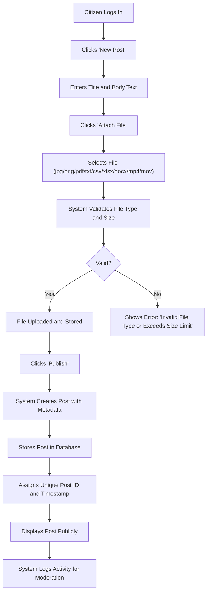
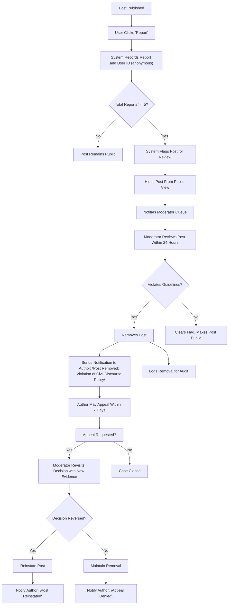
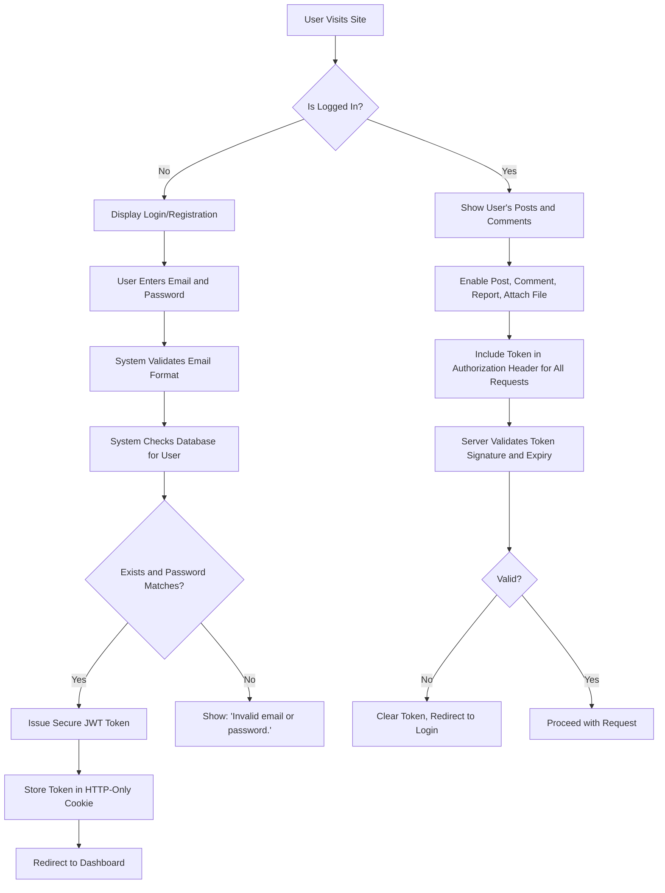

# Economic and Political Discussion Board

## Service Vision

Economic and political discourse has become increasingly fragmented, polarized, and dominated by algorithmic engagement hooks rather than thoughtful dialogue. Modern discussion platforms prioritize virality over validity, incentivizing outrage over understanding. This service exists to provide a simple, ad-free, and moderator-guided space where citizens can engage with economic and political ideas in good faith — without distraction, without manipulation, and without corporate surveillance.

Unlike mainstream forums that monetize attention through targeted advertising, content farms, or algorithmically amplified extremes, this platform is designed as a digital town square for intellectually serious discourse. It rejects clickbait, suppresses outrage-driven content, and empowers users to build knowledge through reasoned exchange. The service is not driven by growth-at-all-costs metrics but by meaningful participation and civil exchange.

This is not another social media echo chamber. This is a curated environment for people who want to understand complex systems, challenge their own assumptions, and engage with opposing viewpoints without fear of harassment, doxxing, or algorithmic silencing.

## Core Value Proposition

WHEN a citizen posts an article, THE system SHALL allow the attachment of images and files to support arguments with data, charts, or source documents.

WHEN a citizen submits content, THE system SHALL not automatically promote, boost, or algorithmically rank posts based on engagement metrics (likes, shares, replies).

THE system SHALL display all posts in chronological order, newest first, with no personalized feed.

THE system SHALL permit users to comment on posts, but SHALL not enable nested reply chains that encourage tribal escalation.

WHEN a post receives five or more user reports, THE system SHALL automatically flag it for review by a moderator.

THE system SHALL not monetize user data, display advertisements, or sell any user information.

WHERE a post includes a file attachment, THE system SHALL validate that the file is one of these types: .jpg, .png, .pdf, .txt, .csv, .xlsx, .docx, .mp4, .mov.

WHILE a moderator is reviewing a flagged post, THE system SHALL hide the post from public view unless it is cleared.

WHEN a moderator removes a post, THE system SHALL notify the author with a clear explanation and provide an appeals process.

THE system SHALL not support anonymous posting — every post must be tied to a verified citizen account.

## Target Audience

### Primary Users: Citizens

Citizens are regular individuals interested in economics, public policy, political theory, and societal trends. They may be students, professionals, retirees, or autodidacts. They are not influencers, activists, or trolls. They seek to understand complex systems, reference primary sources, and participate in thoughtful critique.

Citizens use the platform to:
- Share articles, op-eds, or original analysis on inflation, taxation, regulation, governance, or historical economic patterns
- Attach charts from government publications, academic papers, or statistical datasets
- Comment on posts with citations and logical reasoning
- Flag content that is misleading, unfounded, or abusive

Citizens are not expected to generate viral content. They are expected to engage deliberately.

### Secondary Users: Moderators

Moderators are trusted citizens selected for their demonstrated capacity for impartial judgment and respect for evidence. They do not have special privileges to promote their own views. Their role is solely to uphold the norms of civil discourse.

Moderators:
- Review flagged posts within 24 hours
- Remove content that contains personal attacks, falsehoods presented as fact, or spam
- Issue warnings to users who repeatedly breach behavior guidelines
- Maintain the integrity of the platform without censoring legitimate dissent

Moderators are not administrators. They have no access to user data beyond what is necessary to review reported content. Their authority is derived from community trust, not system permissions.

### What This Platform Is NOT

- It is NOT a place for political mobilization or campaigning.
- It is NOT a platform for meme warfare or ironic outrage.
- It is NOT designed for mass audiences or viral growth.
- It is NOT a forum for anonymous commenters.
- It is NOT monetized. No ads. No affiliate links. No data harvesting.

This platform exists to make serious discourse possible again. It does not need to be big. It needs to be reliable.

## Business Model

### Why This Service Exists

There is a growing demand among educated citizens for platforms free from commercialized attention economies. Existing forums are either cluttered with ads and algorithmic manipulation, or they are hostile environments dominated by polarization and harassment. This service addresses the unmet need for a clean, trustworthy, and intentionally slow-moving space for intellectual exchange.

The absence of advertising and monetization is not a limitation — it is the core innovation.

### Revenue Strategy

The service will operate as a non-profit community project funded entirely by voluntary user contributions, with no paywalls or tiers. The only financial requirement is infrastructure costs (hosting, bandwidth, storage for attachments). Contributions will be collected via open-source donation platforms like GitHub Sponsors or OpenCollective.

There will be no paid memberships, no premium features, no sponsored content, and no affiliate programs. The platform’s integrity is non-negotiable.

### Growth Plan

Growth will be organic and invitation-based. The service will not run paid advertising campaigns. Instead, it will rely on:
- Word-of-mouth referrals among academic circles, professional communities, and civil society organizations
- Links from reputable blogs and newsletters focused on political economy
- Appearances in independent media covering digital democracy and information integrity

The goal is not to reach millions, but to cultivate an active community of 500–2,000 engaged users who use the platform daily for deep discussion.

### Success Metrics

Success is measured by qualitative and behavioral indicators:
- **Daily Active Contributors**: At least 50 unique citizen posts per day
- **Post-to-Comment Ratio**: Minimum 1 comment for every 2 posts
- **Report-to-Removal Ratio**: Less than 15% of reported posts are removed (indicating healthy self-policing)
- **Average Post Length**: Minimum 200 words
- **File Attachment Rate**: At least 30% of posts include images or data files
- **Moderation Response Time**: All reported posts reviewed within 24 hours

The platform considers itself a failure if it attracts more than 10,000 registered accounts, as this indicates dilution of intent and community cohesion.

> *Developer Note: This document defines **business requirements only**. All technical implementations (architecture, APIs, database design, etc.) are at the discretion of the development team.*

## Workflow: Posting an Article with Attachments

## Workflow: Reporting and Moderation

## File Attachment Requirements

WHEN a citizen attaches a file to a post, THE system SHALL accept only these file extensions:

- .jpg
- .png
- .pdf
- .txt
- .csv
- .xlsx
- .docx
- .mp4
- .mov

WHEN a file is uploaded, THE system SHALL reject files exceeding 25 MB in size.

WHEN a file is uploaded, THE system SHALL validate the MIME type against extension to prevent spoofing.

WHEN a file is rejected, THE system SHALL display a clear message: \"Invalid file type or too large. Supported formats: jpg, png, pdf, txt, csv, xlsx, docx, mp4, mov. Max size: 25 MB.\"

THE system SHALL store all attachments in a dedicated, non-public folder with unique filenames generated by the system (e.g., post_12345_attachment_9876.pdf).

THE system SHALL NOT expose file paths, URLs, or internal storage structure to users.

THE system SHALL maintain a record of all attached files linked to their post ID for moderation and audit purposes.

## Commenting System

THE system SHALL allow comments on posts, but SHALL NOT support nested replies.

WHEN a user comments, THE system SHALL display the comment directly under the post.

WHEN a comment is posted, THE system SHALL display the username of the commenter and timestamp.

WHEN a comment contains hate speech, threats, or personal attacks, THE system SHALL flag it if reported.

WHEN a comment receives five or more user reports, THE system SHALL hide it from view and trigger moderator review.

WHEN a moderator deletes a comment, THE system SHALL notify the commenter: \"Your comment was removed for violating civil discourse guidelines.\"

WHEN a moderator approves a flagged comment, THE system SHALL immediately make it visible again.

THE system SHALL NOT enable @mentions, emoji reactions, or voting on comments.

THE system SHALL NOT display comment scores, likes, or popularity rankings.

## Authentication and Access Control

### Actor: Citizen

THE citizen SHALL be able to:
- Register with a unique email address and password
- Log in using email and password
- Edit their own profile (display name only)
- Create new posts
- Attach permitted file types to posts
- Comment on existing posts
- Report posts or comments
- View all public posts in chronological order
- Receive email notifications for moderation actions affecting their content

THE citizen SHALL NOT be able to:
- View other users’ email addresses or personal data
- Delete their own posts after publication
- Edit their post content after publication
- Hide or block other users
- Search posts by keyword (search functionality is intentionally disabled)
- Access administrative features

### Actor: Moderator

THE moderator SHALL be able to:
- Perform all actions of a Citizen
- Review flagged posts and comments
- Remove posts or comments that violate behavior guidelines
- Issue warnings to users
- Clear flags on posts or comments
- Appeal decisions made by other moderators
- View audit logs of flagged content and moderation actions

THE moderator SHALL NOT be able to:
- Access user passwords or encryption keys
- View private messages (there are none)
- Edit or alter any user-generated content (only remove)
- Disable user accounts permanently
- Change system settings or configurations
- View content that has not been flagged
- Bypass the 5-report threshold for flagging

## Content Visibility and Ranking

THE system SHALL display all posts in strict chronological order (newest first).

THE system SHALL NOT use any algorithm to rank, boost, or prioritize posts based on:
- Number of comments
- Number of reports
- Number of views
- Engagement metrics (likes, shares, replies)

THE system SHALL NOT offer personalized feeds.

THE system SHALL NOT allow users to filter posts by topic, author, or sentiment.

THE system SHALL NOT allow users to subscribe to specific authors or topics.

Content visibility is determined only by time and moderation status.

## Moderation Process

WHEN a user reports a post or comment, THE system SHALL record:
- The reporting user’s ID (anonymized)
- The reported content’s ID
- The timestamp
- The reason (predefined options: "Off-topic", "Misinformation", "Personal Attack", "Spam", "Other")

THE system SHALL aggregate reports on the same item until there are five or more.

WHEN a content item reaches five reports, THE system SHALL:
- Automatically hide the item from public view
- Flag it in the moderator dashboard
- Send a notification to the moderation queue
- Log the event for audit

WHEN a moderator reviews a flagged item, THE system SHALL display:
- The original content
- The full list of reports (with anonymized reporter IDs)
- Timestamps of reports
- Number of total reports
- Associated file attachments (if any)

THE moderator SHALL select one of these actions:
- Remove
- Clear
- Issue Warning
- Escalate to Admin (not implemented)

WHEN a moderator removes content, THE system SHALL:
- Immediately hide the content
- Notify the author by email
- Log the removal (moderator ID, timestamp, reason)
- Add the item to a permanent audit log
- Prevent any further edits or deletion attempts

WHEN a moderator clears a flag, THE system SHALL:
- Immediately restore visibility
- Log the action
- Notify the author (if no other flags remain)

THE system SHALL require moderator identification before taking action.

## Error Handling

WHEN a user attempts to upload a file with an unsupported extension, THE system SHALL:
- Prevent form submission
- Display an inline error: \"Invalid file type. Only .jpg, .png, .pdf, .txt, .csv, .xlsx, .docx, .mp4, and .mov are allowed.\"

WHEN a file exceeds 25 MB, THE system SHALL:
- Cancel the upload
- Display an error: \"File too large. Maximum size is 25 MB.\"

WHEN a file is corrupted during upload, THE system SHALL:
- Discard the partial file
- Log the error
- Notify the user: \"File upload failed. Please try again.\"

WHEN a user tries to comment on a removed post, THE system SHALL:
- Display a message: \"This post has been removed by a moderator.\"
- Disable the comment field

WHEN a moderator is unable to access their dashboard due to server error, THE system SHALL:
- Display a generic error: \"Temporary service interruption. Please try again later.\"
- Log the error for engineering review
- Maintain moderation queue in a durable storage state

WHEN a user tries to log in with invalid credentials, THE system SHALL:
- Display: \"Invalid email or password.\"
- Not reveal whether email exists or not
- Implement exponential backoff after 3 failed attempts

## Authentication Flow

## Business Rules Summary

- No advertising
- No analytics tracking
- No user data collection beyond email and password
- No personalization
- No search
- No likes, shares, or upvotes
- No nested comments
- No hashtags or topics
- No direct messaging
- No profiles with bio, avatar, follower count
- No public user listing
- No API for third-party access
- No public API keys

## Performance and Availability Requirements

THE system SHALL serve pages in less than 500ms under normal load.

THE system SHALL allow files up to 25 MB to upload within 60 seconds on 10 Mbps connection.

THE system SHALL handle 50 concurrent users without degradation.

THE system SHALL be available 99.9% of the time.

THE system SHALL automatically retry failed uploads with exponential backoff.

THE system SHALL maintain a backup of all content and attachments daily.

## Compliance and Data Retention

THE system SHALL retain all posts and comments indefinitely, unless removed by a moderator.

THE system SHALL retain uploaded files as long as their associated post is not removed.

THE system SHALL allow users to delete their account:
- All posts and comments are preserved (to maintain discussion continuity)
- Author names are anonymized to "[Deleted User]"
- Email address and password are permanently deleted
- File attachments remain accessible via their post ID

THE system SHALL comply with GDPR, CCPA, and other applicable data protection laws.

THE system SHALL not use cookies for tracking — only one HTTP-Only session cookie for authentication.

THE system SHALL display a privacy notice on first visit, requiring opt-in before account creation.

THE system SHALL never sell, license, or use user data for advertising.

## Security Requirements

THE system SHALL encrypt all files at rest using AES-256.

THE system SHALL validate file extensions against actual MIME type.

THE system SHALL sanitize all user input to prevent XSS and injection attacks.

THE system SHALL store passwords using bcrypt with salt.

THE system SHALL use HTTPS for all communications.

THE system SHALL use a random, non-sequential token system for moderation links and appeals.

THE system SHALL log all moderator actions with timestamp and user ID.

THE system SHALL never expose storage paths, filenames, or internal system structure.

THE system SHALL implement rate limiting (10 requests/minute per IP for public endpoints).

## Design Constraints

THE interface SHALL be minimalistic:
- Monochrome color scheme
- Sans-serif only typography
- No decorative graphics
- No animations
- No popups or banners
- No social media buttons
- No external links

THE content SHALL occupy the full viewport width on desktop.

THE interface SHALL be responsive on mobile with touch-friendly controls.

THE system SHALL not support legacy browsers (IE, Safari <15).

THE system SHALL be accessible via screen readers.

## Developer Notes

This document defines **business requirements only**. All technical implementations (architecture, APIs, database design, etc.) are at the discretion of the development team.

All specifications are implementation-agnostic. This document is intended to be read by backend engineers to understand what the system must do — not how to build it.

Database tables, API endpoints, DTO models, and file storage schemes are not described here. Those will be generated separately in the Database and Interface phases.

All requirements must be implemented as specified. No deviations, no "convenient" shortcuts, no feature creep. This system is designed for minimalism, integrity, and trust — not efficiency or scalability.

If a requirement conflicts with a technical constraint, the business requirement takes precedence.

This document is the single source of truth for the system’s purpose and behavior.