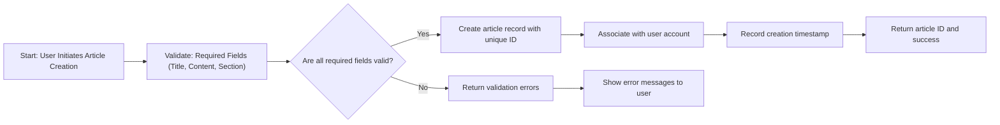
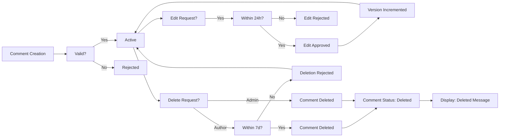
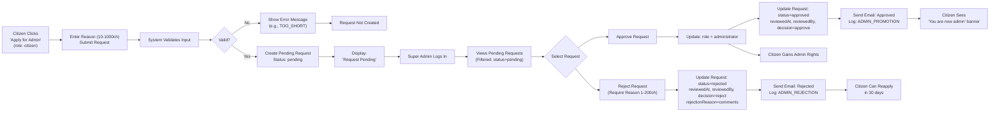
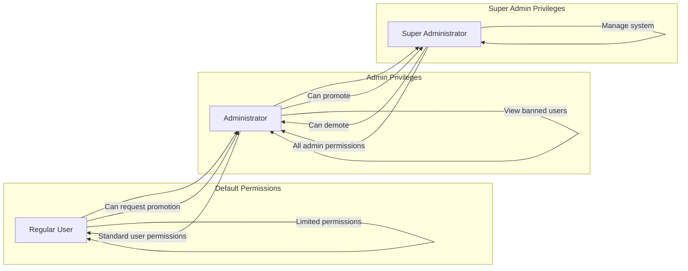
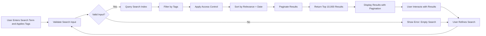

# Economic/Political Discussion Board

## User Account

WHEN a new user registers with an email and password, THE system SHALL create a citizen account with standard permissions.

WHEN a registered user submits valid login credentials, THE system SHALL authenticate the user and generate a JWT access token.

WHEN a user submits invalid login credentials, THE system SHALL return HTTP 401 with error code AUTH_INVALID_CREDENTIALS.

WHEN a user logs out, THE system SHALL invalidate the current session token.

WHEN a citizen requests a password change, THE system SHALL verify the current password and update the hashed password in the database.

WHILE a user is logged in, THE system SHALL maintain their session via the JWT token.

WHILE a user's access token has not expired, THE system SHALL allow access to protected resources.

WHEN a user attempts to access a protected resource with an expired access token, THE system SHALL return HTTP 401 with error code AUTH_TOKEN_EXPIRED and include a refresh token in the response.

IF a user attempts to delete their account, THEN THE system SHALL mark their account for deletion, retain their content for audit purposes, and prevent future logins.

## User Profile

WHEN a user accesses their profile, THE system SHALL display:
- Their display name
- Their bio text
- A list of all articles they have written
- A list of all comments they have written

WHERE a user has not set a display name, THE system SHALL default to their email prefix before the @ symbol.

WHERE a user has not set a bio, THE system SHALL display "No bio provided."

WHEN a user edits their display name, THE system SHALL validate that it is between 2 and 50 characters and contains no special characters except hyphens, underscores, and spaces.

WHEN a user edits their bio, THE system SHALL validate that it is between 0 and 500 characters.

WHEN a user views another user's profile, THE system SHALL display the same information (display name, bio, articles, comments) with no access to sensitive personal data.

## Sections

WHEN a section is created, THE system SHALL require:
- Name: non-empty string with minimum length of 3 characters and maximum length of 100 characters
- Description: non-empty string with minimum length of 10 characters and maximum length of 500 characters

WHEN a section name is already in use, THE system SHALL reject creation with error code SECTION_NAME_EXISTS.

WHEN a section is created, THE system SHALL assign it a unique identifier and record the creation timestamp and administrator who created it.

WHEN a section is edited, THE system SHALL allow modification of the name and description, but SHALL NOT permit changes that violate length constraints.

WHEN a section is deleted, THE system SHALL NOT delete any articles or comments within that section, but SHALL preserve all existing content with references to the deleted section ID.

THE system SHALL mark the section as "deleted" in the database but retain its record for auditing purposes.

WHERE a section has been deleted, THE system SHALL display the section name as "[DELETED] {original name}" in all user-facing interfaces.

## Articles

WHEN a user creates an article, THE system SHALL require:
- Title: non-empty string with minimum length of 5 characters and maximum length of 200 characters
- Content: non-empty string with minimum length of 100 characters
- Section: must be a valid section identifier from the system's approved sections list

WHEN a user submits an article with invalid or missing required fields, THE system SHALL reject the submission and return specific error details for each missing or invalid field.

WHEN a user creates an article, THE system SHALL automatically associate the article with the user's account and record the creation timestamp in ISO 8601 format.

WHEN a user submits an article, THE system SHALL assign a unique identifier to the article that persists for the article's lifetime.

IF an article title already exists in the same section with identical content, THE system SHALL permit creation but SHALL ensure all artifacts (attachments, tags) are distinct.

WHILE a user is creating an article, THE system SHALL validate that the selected section has not been deleted or disabled.

WHEN a user edits their own article, THE system SHALL permit modification of:
- Title (max 200 characters)
- Content (min 100 characters)
- Attachments (add, remove, or replace files and images)
- Tags (add, remove, or modify tags)
- Section (change to any other valid section)

WHEN a user attempts to edit an article they do not own, THE system SHALL deny the request and return HTTP 403 Forbidden.

WHEN an article is edited, THE system SHALL preserve the original creation timestamp and record the modification timestamp in ISO 8601 format.

WHEN an article is edited, THE system SHALL update the article's version counter by incrementing it by 1.

IF a user attempts to edit an article by changing the title to empty string or content to less than 100 characters, THE system SHALL reject the edit and return appropriate error message.

WHEN a user deletes their own article, THE system SHALL:
- Remove the article from public visibility
- Set the article's status to 'deleted'
- Retain the article's metadata (title, author, timestamp) for audit purposes but make content accessible only to administrators
- Preserve any attached files and images (no deletion of file system assets)
- Maintain the article's associated tags and comment count for reporting

WHEN a user attempts to delete an article they do not own, THE system SHALL deny the request and return HTTP 403 Forbidden.

WHEN an administrator deletes any article, THE system SHALL:
- Remove the article from public visibility
- Set the article's status to 'deleted by administrator'
- Retain the article's metadata and content for audit purposes
- Preserve attached files and images for forensic purposes
- Record the administrator's identity and timestamp of deletion

WHEN an administrator deletes any article, THE system SHALL send an audit event to the system event log with the following details:
- Article ID
- Original author ID
- Administrator ID
- Deletion timestamp
- Deletion reason (if provided)

## File and Image Attachments

WHEN a user attaches files to an article, THE system SHALL allow:
- Maximum of 10 files per article
- File types: PDF, DOC, DOCX, XLS, XLSX, PPT, PPTX, TXT, CSV, ZIP, RAR
- Maximum file size: 100 MB per file
- All files shall be stored in encrypted form with unique object keys

WHEN a user attaches images to an article, THE system SHALL allow:
- Maximum of 15 images per article
- Image formats: JPEG, PNG, GIF, BMP, WEBP
- Maximum image size: 20 MB per image
- Images shall be automatically resized to a maximum dimension of 1920x1080 pixels

WHEN a user uploads a file or image, THE system SHALL:
- Validate the file's MIME type matches the expected format
- Generate a unique storage key (UUIDv4) for each file
- Store the original file and a processed version (if applicable)
- Record metadata: file name, size, type, original upload timestamp, processed timestamp, and storage location

IF a user uploads a file with an unsupported extension (e.g. .exe, .bat), THE system SHALL reject the upload and return error code ATTACH_INVALID_TYPE.

IF a user attempts to exceed file or image limits, THE system SHALL reject the upload and return error code ATTACH_QUOTA_EXCEEDED.

WHEN an article is deleted, THE system SHALL NOT delete the associated files or images from the storage system.

WHEN an article is edited and attachments are removed, THE system SHALL retain the removed files in storage for 30 days before archiving for cleanup.

## Tagging System

WHEN a user adds tags to an article, THE system SHALL support:
- Maximum of 10 tags per article
- Each tag: minimum 2 characters, maximum 50 characters
- Characters permitted: alphanumeric, hyphen, underscore
- No whitespace at start or end of tag
- Case-insensitive storage (e.g., 'economy' and 'ECONOMY' are treated as identical)

WHEN a user submits a tag with invalid characters, THE system SHALL reject the tag and return error code TAG_INVALID_FORMAT.

WHEN a user submits a duplicate tag in the same article, THE system SHALL ignore duplicate and store only one instance.

WHEN a user adds a tag that does not exist system-wide, THE system SHALL create the tag in the global tag registry.

WHEN tags are displayed on an article, THE system SHALL render them as space-separated, lowercase, hyphen-delimited strings for URL compatibility.

WHEN a user searches for articles by tag, THE system SHALL match tags case-insensitively.

## Article Listing

WHEN a user displays the article list for a section, THE system SHALL show each article with the following fields:
- Title
- Author display name
- List of tags (display as comma-separated, no links)
- Comment count (integer)
- Creation timestamp (in localized format: YYYY-MM-DD HH:mm)

WHEN a user sorts articles by 'newest first', THE system SHALL order by creation timestamp DESC (most recent first).

WHEN a user sorts articles by 'oldest first', THE system SHALL order by creation timestamp ASC (oldest first).

WHEN a user requests a page of articles, THE system SHALL:
- Return exactly 20 articles per page (unless fewer are available)
- Provide a next page token for pagination
- Return 404 if requested page exceeds total available pages
- Include total article count for the section in the response header

WHEN a section contains more than 10,000 articles, THE system SHALL optimize list loading by caching frequently accessed pages.

WHEN a user navigates through article pages, THE system SHALL maintain consistent sorting order across pages.

WHEN a user changes sorting criteria, THE system SHALL reset pagination to page 1.

WHEN a user requests an article list with invalid section identifier, THE system SHALL return 404 error with message 'Section not found'.

WHEN article title or author name contains non-Latin characters, THE system SHALL display them correctly without truncation or corruption.

## Viewing an Article

WHEN a user views a single article, THE system SHALL display:
- Title
- Author display name
- Content (rendered with preserved formatting)
- All attached files with download links
- All attached images with preview thumbnails
- All tags as clickable links
- Creation timestamp (in localized format: YYYY-MM-DD HH:mm:ss)

WHEN a user downloads an attached file, THE system SHALL serve the file with appropriate Content-Type headers and Content-Disposition attachment headers.

WHEN a user views an attached image, THE system SHALL display a responsive thumbnail that expands to full size on click.

## Searching Articles

WHEN a user performs a search query, THE system SHALL allow searching across article title and content fields.

WHEN a user submits a search term, THE system SHALL return articles matching the term in either title or full content.

WHILE a search is being processed, THE system SHALL display a loading indicator to users.

IF no articles match the search term, THE system SHALL return an empty result list with appropriate message.

IF the search term is empty or consists only of whitespace, THE system SHALL not perform a search and display an error message.

WHERE a user has searched for articles, THE system SHALL preserve the search term in the UI for easy modification.

WHEN a search term is submitted, THE system SHALL normalize whitespace by trimming leading and trailing spaces.

WHEN a search term is submitted, THE system SHALL treat multiple consecutive spaces as a single space.

WHEN a search term is submitted, THE system SHALL support partial word matching (substring matching).

WHEN a search term is submitted, THE system SHALL ignore case sensitivity when matching terms.

WHEN a search term is submitted, THE system SHALL support special characters including punctuation and symbols in search queries.

WHEN search results are displayed, THE system SHALL show each result as a list item with:
- article.title: The article title
- article.authorDisplayName: The display name of the author
- article.sectionName: The name of the section
- article.createdAt: The time posted
- article.commentCount: The number of comments on the article
- article.tags: A subset of the article's tags (first 3)

WHILE search results are presented, THE system SHALL order results by relevance score, with highest relevance appearing first.

WHEN search results have equal relevance scores, THE system SHALL sort by article.createdAt in descending order (newest first).

THE system SHALL return a maximum of 10,000 search results for any single query.

WHERE a search produces more than 10,000 results, THE system SHALL return only the top 10,000 results.

WHEN a user's search returns more than 10,000 results, THE system SHALL display a message: "Too many results (over 10,000). Please refine your search."

## Tag Filtering

WHEN a user applies a tag filter, THE system SHALL search for articles that have at least one matching tag in the article.tags array.

WHEN multiple tag filters are applied, THE system SHALL return articles that match ALL of the selected tags.

WHEN a tag filter is applied, THE system SHALL include articles that have the exact tag match, regardless of case sensitivity.

WHEN a tag is added to the filter, THE system SHALL highlight matching tags in the results.

THE system SHALL support tag filtering with the following characteristics:
- Tags are stored as an array of strings in article.tags field
- Tag matching is case-insensitive ("politics" matches "Politics")
- No partial tag matching ("econ" will not match "economy")
- Each tag must match exactly as stored in the system
- Tag filters are applied after initial search results are generated

WHEN a user clicks on a tag in the search interface, THE system SHALL toggle that tag in the active filter set.

WHEN a user removes a tag from the filter, THE system SHALL update the results to exclude articles with that tag.

WHEN no tags are selected in the filter, THE system SHALL return all search results regardless of tags.

## Pagination

WHEN search results exceed the visible page size, THE system SHALL implement pagination.

WHEN a user requests a page of search results, THE system SHALL return exactly the requested page of results.

WHEN a user navigates to a page, THE system SHALL preserve both the search term and active tag filters.

WHEN search results are displayed, THE system SHALL show 25 results per page.

WHEN search results have fewer than 25 results on the final page, THE system SHALL display the remaining results without padding.

WHEN a user has more than one page of results, THE system SHALL provide:
- "Previous" button to navigate to the previous page
- "Next" button to navigate to the next page
- Page numbers for direct navigation (first 5 and last 5 pages displayed with ellipses)
- Total pages counter (e.g., "Page 2 of 15")
- Total results count (e.g., "Showing 25 of 372 results")

WHILE user navigates through search result pages, THE system SHALL load pages within 2 seconds.

WHEN a user navigates to a new page, THE system SHALL maintain the scroll position at the top of the result list.

WHEN a user changes search parameters, THE system SHALL reset pagination to page 1.

## Comments

WHEN a user attempts to create a comment on an article, THE system SHALL require:
- Content (text, minimum 1 character, maximum 5,000 characters)
- Article ID (must reference an existing article)
- Author (automatically derived from authenticated user session)

IF the user is not authenticated, THE system SHALL reject comment creation with HTTP 401 status and error code AUTH_REQUIRED.

IF the article has been deleted, THE system SHALL reject comment creation with HTTP 404 status and error code ARTICLE_NOT_FOUND.

IF the user has been banned, THE system SHALL reject comment creation with HTTP 403 status and error code USER_BANNED.

WHEN a comment is created, THE system SHALL:
- Generate a unique comment ID
- Record the current timestamp (Asia/Seoul timezone)
- Set the comment status to "active"
- Increment the article's comment count by 1

WHERE the comment content is empty after trimming whitespace, THE system SHALL reject creation with HTTP 400 status and error code COMMENT_EMPTY.

WHERE the comment content exceeds 5,000 characters, THE system SHALL reject creation with HTTP 400 status and error code COMMENT_TOO_LONG.

WHEN a user attempts to edit a comment, THE system SHALL verify that:
- The user is authenticated
- The comment exists and is active
- The user is the original author of the comment

IF any of these conditions are not met, THE system SHALL reject the edit request with HTTP 403 status and error code COMMENT_EDIT_PERMISSION_DENIED.

WHEN a comment is edited successfully, THE system SHALL:
- Update the comment content with the new value
- Record the current timestamp as the "last edited" time
- Maintain the original creation timestamp
- Preserve the comment status as "active"
- Increment the comment's version counter by 1

IF the edited content is empty after trimming whitespace, THE system SHALL reject the edit with HTTP 400 status and error code COMMENT_EMPTY.

IF the edited content exceeds 5,000 characters, THE system SHALL reject the edit with HTTP 400 status and error code COMMENT_TOO_LONG.

WHEN a user attempts to delete a comment, THE system SHALL verify that:
- The user is authenticated
- The comment exists and is active
- The user is the original author of the comment

IF any of these conditions are not met, THE system SHALL reject the delete request with HTTP 403 status and error code COMMENT_DELETE_PERMISSION_DENIED.

WHEN a comment is deleted successfully, THE system SHALL:
- Update the comment status to "deleted"
- Preserve the original content and metadata for audit purposes
- Decrement the article's comment count by 1
- Record the deletion timestamp
- Maintain the comment's visibility in the article's comment history

IF the article has been deleted, THE system SHALL still allow deletion of comments on that article by the original author.

WHERE an administrator attempts to delete a comment, THE system SHALL allow deletion regardless of authorship.

WHEN a comment is deleted by an administrator, THE system SHALL record the administrator's user ID and the reason for deletion (if provided).

THE system SHALL display the following fields for each comment on an article page:
- Comment ID
- Author display name (not username)
- Comment content (rendered as plain text with line breaks preserved)
- Creation timestamp (formatted as "YYYY-MM-DD HH:mm:ss" in Asia/Seoul timezone)
- Last edited timestamp (if applicable, otherwise hidden)
- Comment version number (if greater than 1)

THE system SHALL not display:
- The author's email address
- The author's profile ID
- The comment's internal database ID
- The comment's deletion reason (unless the viewer is an administrator)
- The comment's version history
- The deletion timestamp (except for administrators)

WHEN a comment has been deleted by an administrator, THE system SHALL display: "[This comment has been deleted by an administrator]" in place of the content.

WHEN a comment has been deleted by its author, THE system SHALL display: "[This comment has been deleted by the author]" in place of the content.

IF the user viewing a comment is the original author of a deleted comment, THE system SHALL display: "[This comment has been deleted]" along with the original content.

WHILES displaying comments on an article page, THE system SHALL sort comments by creation timestamp in ascending order (oldest first).

THE system SHALL not support alternative sorting options (e.g., newest first, by popularity).

WHERE comments have identical creation timestamps, THE system SHALL sort comments by their internal comment ID in ascending order to ensure deterministic ordering.

THE system SHALL load comments in batches of 20 for performance optimization, but shall maintain the chronological ordering across all pages.

THE system SHALL calculate and display the total number of active comments on an article.

THE comment count SHALL be updated in real-time when:
- A new comment is created
- A comment is deleted (by author or administrator)
- A comment is undeleted (recovery case)

THE system SHALL count only comments with status "active" in the comment count.

WHEN the article page is loaded, THE system SHALL display the current comment count immediately, even before the full list of comments has loaded.

THE comment count SHALL update automatically whenever a user creates or deletes a comment on that article, using real-time notification mechanisms.

THE system SHALL store the comment count as a denormalized field on the article document for performance optimization.

THE comment count SHALL be recalculated from the database if inconsistencies are detected during validation checks.

## Administrator System

### Becoming an Administrator

WHEN a citizen submits a request to become an administrator, THE system SHALL accept the submission only if the user's current role is "citizen".

WHERE a user has already submitted an administrator request and it is still pending, THE system SHALL NOT accept a duplicate request and SHALL display an error message: "You already have a pending administrator request. Please wait for a response."

WHEN a user submits an administrator request, THE system SHALL require two fields:
- "reason": A text field of minimum 10 characters and maximum 1000 characters
- "submittedAt": A timestamp in ISO 8601 format, automatically generated by the system

WHILE the request is being processed, THE system SHALL lock the "submit administrator request" button in the user interface for the requesting user to prevent duplicate submissions.

WHEN a valid administrator request is submitted, THE system SHALL create a new record in the adminRequests table with:
- userId (referencing the citizen user)
- reason
- submittedAt
- status: "pending"
- reviewedAt: null
- reviewedBy: null
- decision: null

IF the submitted reason field is empty, fewer than 10 characters, or contains only whitespace, THEN THE system SHALL reject the submission with error code: REQUEST_REASON_TOO_SHORT.

IF the submitted reason field exceeds 1000 characters, THEN THE system SHALL reject the submission with error code: REQUEST_REASON_TOO_LONG.

### Reviewer Identification

WHERE a user request status is "pending", THE system SHALL make the request visible only to users with role "superAdministrator".

WHILE there are unreviewed administrator requests, THE system SHALL display a badge indicator on the "Admin Management" dashboard for super administrators, showing the count of pending requests.

WHEN a super administrator opens the admin requests management page, THE system SHALL load all requests with status "pending" sorted by submittedAt in ascending order (oldest first).

WHERE a user is not a superAdministrator, THE system SHALL hide the administrative review interface entirely and return HTTP 403 when attempting to access the review endpoint.

### Data Visibility

WHEN a super administrator views a pending request, THE system SHALL display:
- The citizen's display name
- The citizen's email address (for authentication verification)
- The submitted reason (verbatim, with markdown escaping for safety)
- The submittedAt timestamp in local format (Asia/Seoul)

IF the citizen's account is marked as "banned", THEN THE system SHALL display a warning: "⚠️ WARNING: This user is currently banned. Approving this request would lift the ban." in red text.

WHERE a citizen has previously been granted administrator status and had it revoked, THE system SHALL display a note: "This user previously held administrator privileges."

IF the citizen has submitted three or more administrator requests in the last 365 days, THEN THE system SHALL display a warning: "⚠️ This user has submitted multiple requests in the last year. Consider carefully."

### Approval Process

WHEN a super administrator selects "Approve" on a pending request, THE system SHALL perform the following actions:
- Update the request record:
  - Set status: "approved"
  - Set reviewedAt: current timestamp (Asia/Seoul)
  - Set reviewedBy: superAdministrator userId
  - Set decision: "approve"
- Update the citizen's user record:
  - Change role from "citizen" to "administrator"
  - Preserve all existing profile data (display name, bio)
- Log the action in the audit log with:
  - eventType: "ADMIN_PROMOTION"
  - actorId: superAdministrator userId
  - targetId: citizen userId
  - metadata: { "originalRequestReason": "[reason text]" }

WHEN an administrator request is approved, THE system SHALL ensure the newly promoted administrator can immediately:
- Access section management interfaces
- Delete any article or comment
- View and manage banned users
- Submit new administrator requests (for super admin status)

IF the system fails to update the citizen's role due to a database constraint violation, THEN THE system SHALL revert the request status to "pending" and log error: "ROLE_UPDATE_FAILED".

IF the approved user already holds "administrator" role (due to race condition), THEN THE system SHALL log a warning: "RACE_CONDITION_DETECTED - User was already promoted" and leave request status as "approved".

### Rejection Process

WHEN a super administrator selects "Reject" on a pending request, THE system SHALL perform the following actions:
- Update the request record:
  - Set status: "rejected"
  - Set reviewedAt: current timestamp (Asia/Seoul)
  - Set reviewedBy: superAdministrator userId
  - Set decision: "reject"
- Set a rejectionReason field to the super administrator's comment (maximum 200 characters)

WHERE a request is rejected, THE system SHALL allow the citizen to submit a new request after 30 days have passed since the rejection.

IF a super administrator attempts to reject a request without providing a rejection reason, THEN THE system SHALL prevent submission and display: "A rejection reason is required. Please explain why this request was denied."

IF the rejection reason field is empty or contains only whitespace, THEN THE system SHALL block submission with error: REJECTION_REASON_REQUIRED.

IF the rejection reason exceeds 200 characters, THEN THE system SHALL block submission with error: REJECTION_REASON_TOO_LONG.

WHEN a request is rejected, THE system SHALL maintain the citizen's role as "citizen" and continue to allow full citizen functionality.

IF the rejection process fails at the database level after the user role was modified (in rare race condition), THEN THE system SHALL log the failure and keep the request status as "rejected" with no change to the citizen's role.

### Notification Mechanism

WHEN a request is approved, THE system SHALL send an email notification to the citizen's registered email address with subject: "Administrator Request Approved - Your Account Has Been Upgraded"

WHEN a request is rejected, THE system SHALL send an email notification to the citizen's registered email address with subject: "Administrator Request Rejected - Your Application Did Not Succeed"

WHERE a user has opted out of email notifications (if such a feature exists), THE system SHALL store the notification result as "email_opted_out" but still log the attempt.

WHEN an email notification fails to send (temporary delivery error), THE system SHALL retry up to three times at 5-minute intervals.

IF all email delivery attempts fail, THE system SHALL log: "EMAIL_NOTIFICATION_FAILED" and add the request ID to a notification failure queue for manual review.

WHEN an email is successfully delivered, THE system SHALL mark the notification as "sent" with a timestamp in the notification log.

WHEN the citizen logs in after being approved, THE system SHALL display a banner: "Congratulations! You are now an administrator. You can now manage sections and moderate content."

WHEN the citizen logs in after being rejected, THE system SHALL display a banner: "Your request to become an administrator was not approved. You may submit another request after 30 days."

IF a citizen logs in while a request is still pending, THE system SHALL display: "Your request to become an administrator is still being reviewed. You'll be notified by email when a decision is made."

## Administrator Privilege Hierarchy

### Administrator Privileges

Administrators have all standard user permissions plus elevated moderation capabilities. This includes:

- Creating articles
- Editing their own articles
- Deleting their own articles
- Writing comments on articles
- Editing their own comments
- Deleting their own comments
- Viewing user profiles
- Viewing section listings
- Searching articles by title and content
- Filtering articles by tags
- Downloading attached files and images

Additionally, administrators have the following privileged capabilities that regular users cannot perform:

WHEN an administrator attempts to create a section, THE system SHALL allow the creation if the section name is unique and not empty.
WHEN an administrator attempts to edit an existing section, THE system SHALL allow the modification of section name and description.
WHEN an administrator attempts to delete a section, THE system SHALL allow deletion and preserve all associated articles and comments.
WHEN an administrator attempts to delete any article, THE system SHALL permit deletion regardless of authorship.
WHEN an administrator attempts to delete any comment, THE system SHALL permit deletion regardless of authorship.
WHEN an administrator attempts to ban a user, THE system SHALL record the ban reason and prevent the user from logging in.
WHEN an administrator attempts to unban a user, THE system SHALL remove the ban status and restore login access.
WHEN an administrator attempts to view the list of banned users, THE system SHALL return the list of banned users with their ban reason.

Additionally:

WHILE an administrator is logged in, THE system SHALL display administrative control panels and moderation tools in the user interface.

### Super Administrator Privileges

Super administrators have all administrator privileges and additionally can manage the administrator hierarchy:

IF a user has the super administrator role, THEN THE system SHALL allow them to promote a regular administrator to super administrator.
IF a user has the super administrator role, THEN THE system SHALL allow them to demote another super administrator to regular administrator.
WHERE an administrator has submitted a request to become an administrator, THE system SHALL allow super administrators to approve or reject the request.

Additionally:

WHILE a super administrator is logged in, THE system SHALL display additional administrative controls to manage other administrators and review administrator requests.

### Promotion Process

WHEN a regular administrator submits a promotion request, THE system SHALL store the request details and notify super administrators.
WHEN a super administrator reviews a promotion request, THE system SHALL allow them to approve the request.
WHEN a promotion request is approved, THE system SHALL update the user's role from "administrator" to "superAdministrator".

An administrator request must contain:

- A reason field (minimum 10 characters)
- A timestamp of submission
- The requester's user ID

WHEN a promotion request is approved, THE system SHALL send a notification to the requester indicating their new status.

### Demotion Process

WHEN a super administrator demotes another super administrator, THE system SHALL change their role from "superAdministrator" to "administrator".
WHEN a super administrator demotes a regular administrator, THE system SHALL reject the request as invalid.

The demotion operation shall:
- Preserve all content created by the demoted user
- Maintain all ban status and moderation history
- Remove "superAdministrator" privileges but retain "administrator" privileges

### Self-Demotion Restriction

IF a super administrator attempts to demote themselves, THEN THE system SHALL reject the request and return an error with code "CANNOT_DEMOTE_SELF".

This restriction exists to ensure:
- System integrity is maintained by always having at least one super administrator
- There is always a user with authority to promote others
- Critical administrative functions cannot be accidentally disabled
- Accountability in the administrative hierarchy is preserved

The system shall allow super administrators to:
- Promote regular administrators to super administrator
- Demote other super administrators
- View administrator requests
- Approve/reject administrator requests

But shall never allow a super administrator to make themselves a regular administrator under any circumstances.

## Banning System

### User Banning

WHEN an administrator initiates a ban on a user, THE system SHALL immediately prevent the banned user from logging into the platform.

WHEN a user is banned, THE system SHALL NOT terminate their existing articles or comments.

WHEN an administrator attempts to ban a user who is already banned, THE system SHALL return an error message: "User is already banned."

WHEN a user is banned, THE system SHALL record the timestamp of the ban action.

WHILE a user is banned, THE system SHALL reject any login attempt with HTTP 401 status code and error code: BAN_ACTIVE.

WHEN a user attempts to access any protected resource while banned, THE system SHALL return HTTP 401 status code with error code: BAN_ACTIVE.

### Ban Reason Recording

WHEN an administrator bans a user, THE system SHALL require a reason text to be provided.

THE system SHALL enforce a minimum ban reason length of 10 characters.

THE system SHALL enforce a maximum ban reason length of 500 characters.

WHEN a ban reason is provided, THE system SHALL store it in the ban record with the user ID, ban timestamp, administrator ID, and reason text.

WHEN a ban reason is not provided or is less than 10 characters, THE system SHALL return HTTP 400 status code with error code: BAN_REASON_TOO_SHORT.

WHEN a ban reason exceeds 500 characters, THE system SHALL return HTTP 400 status code with error code: BAN_REASON_TOO_LONG.

WHEN a ban reason contains only whitespace characters, THE system SHALL return HTTP 400 status code with error code: BAN_REASON_EMPTY.

### Ban Visibility

WHILE a user is banned, THE system SHALL display their articles and comments as visible to all users.

WHILE a user is banned, THE system SHALL display their profile as accessible to all users.

WHILE a user is banned, THE system SHALL indicate "Banned" on their profile page alongside their display name.

WHEN an administrator views a banned user's profile, THE system SHALL display the ban reason and ban timestamp prominently.

WHEN a non-administrator user views a banned user's profile, THE system SHALL display only the "Banned" indicator without revealing the ban reason.

WHEN a banned user views their own profile, THE system SHALL display the ban reason and ban timestamp.

### Unbanning

WHEN an administrator initiates an unban on a banned user, THE system SHALL remove the ban record from the database.

WHEN a user is unbanned, THE system SHALL restore their ability to log in to the platform.

WHEN an administrator attempts to unban a user who is not banned, THE system SHALL return an error message: "User is not currently banned."

WHEN an administrator unban a user, THE system SHALL record the unban timestamp, administrator ID, and reason for unban.

WHEN a previously banned user attempts to log in after being unbanned, THE system SHALL authenticate them normally and issue new session tokens.

### Banned User List

WHEN an administrator requests to view the list of banned users, THE system SHALL return a paginated list of all currently banned users.

THE system SHALL include the following fields in each banned user record: user ID, display name, ban timestamp, ban reason, and banning administrator ID.

THE system SHALL allow administrators to sort the banned users list by: ban timestamp (newest first), ban timestamp (oldest first), display name (A-Z), and display name (Z-A).

THE system SHALL allow administrators to search the banned users list by display name or username.

WHEN an administrator searches the banned users list, THE system SHALL return results for partial matches in display name or username.

THE system SHALL limit the banned users list to 100 results per page.

WHEN an administrator attempts to view more than 500 banned users, THE system SHALL return HTTP 400 status code with error code: BAN_LIST_EXCEEDS_LIMIT.

WHEN a non-administrator user attempts to view the banned users list, THE system SHALL return HTTP 403 status code with error code: PERMISSION_DENIED.

WHEN a banned user attempts to view the banned users list, THE system SHALL return HTTP 403 status code with error code: PERMISSION_DENIED.

## Business Model

### Business Justification

Economic and political discourse is fundamental to democratic societies, yet existing platforms suffer from polarized discourse, low-quality contributions, and lack of structured analysis. The Economic/Political Discussion Board addresses this gap by creating a moderated, high-signal environment where users can engage in meaningful, evidence-based dialogue about macroeconomic trends and political systems.

This service exists because:

1. Traditional media outlets are increasingly driven by sensationalism rather than substantive economic analysis
2. Social media platforms encourage tribalism and outrage over thoughtful debate
3. Academic discussions are often inaccessible to non-specialists
4. Citizens feel disconnected from policy-making despite being directly impacted by economic and political decisions

The platform differentiates itself by enforcing high-quality discourse standards through user moderation, expert-verified tags, and algorithmic prioritization of well-reasoned arguments. Unlike existing forums that reward emotional responses, this system rewards analytical depth, evidence quality, and rhetorical clarity.

### Revenue Model

The Economic/Political Discussion Board will generate revenue through a tiered subscription model combined with ethically-sourced institutional sponsorship:

### Primary Revenue Streams:

1. **Premium Membership (80% of revenue) **
   - $5/month or $50/year for users seeking enhanced features
   - Premium benefits:
     - Ad-free experience
     - Advanced search filters (by author reputation, evidence quality)
     - Priority article visibility on section home pages
     - Access to expert analysis summaries
     - Ability to lock comment threads for expert Q&A
     - Monthly curated reading lists from contributing economists and political scientists
     
2. **Institutional Research Access (15% of revenue) **
   - Universities, think tanks, and academic institutions can purchase institutional licenses
   - Allows institutional researchers to:
     - Anonymously access public conversation data for academic analysis
     - Identify emerging economic trends through sentiment mapping
     - Track policy debates across regions
     - Access API endpoints for research purposes (limited to 1,000 calls/day)
   - Pricing: $5,000/year for small institutions, $15,000/year for large universities

3. **Corporate Sponsored Analysis (5% of revenue) **
   - Companies may sponsor in-depth analytical reports on specific economic topics
   - Examples:
     - "The Impact of Interest Rate Changes on Emerging Markets" (sponsored by World Bank)
     - "Comparative Analysis of Healthcare Systems in G7 Nations" (sponsored by McKinsey)
   - Key constraints:
     - Sponsored reports must be clearly labeled as "Sponsored Analysis"
     - Editorial independence guaranteed
     - Sponsors have no influence on content or methodology
     - All sources and data must be publicly verifiable

### Revenue Projections (Year 1):

| Revenue Stream | Target Subscribers | Monthly Revenue | Annual Revenue |
|----------------|--------------------|-----------------|----------------|
| Premium Members | 5,000 | $25,000 | $300,000 |
| Institutional Access | 20 institutions | $8,333 | $100,000 |
| Sponsored Analysis | 12 reports/year | $2,083 | $25,000 |
| **Total** | | **$35,416** | **$425,000** |

### User Acquisition Strategy

### Target User Segments:

1. **Economists and Policy Professionals** (Primary)
   - Academic researchers
   - Government policy analysts
   - Financial analysts and economists
   - Corporate strategy departments
   - Central bank and Treasury officials

2. **Politically Engaged Citizens** (Secondary)
   - Students in economics/political science
   - Journalists covering economic policy
   - Activists and community organizers
   - Retired professionals with policy interest

### Acquisition Mechanisms:

1. **Content Marketing and Thought Leadership **
   - Publish monthly economic analysis reports featuring platform contributors
   - Guest contributions to major economics blogs and policy journals
   - Weekly newsletter "Economic Insights Digest" with curated top discussions
   
2. **Academic Outreach **
   - Partner with 50 top economics departments worldwide to recommend platform to students
   - Offer free institutional access to university libraries
   - Sponsor campus debate clubs and political economy societies
   - Create "Economic Essay Contest" with prizes for best arguments

3. **Strategic Partnerships **
   - Integrate with academic citation platforms (Zotero, Mendeley)
   - Cross-promote with reputable political commentary channels (e.g., EconTalk)
   - Collaborate with journalism organizations to feature platform contributors

4. **Community Building **
   - Launch "Economic Literacy 101" series with beginner-friendly explanations
   - Create "Debate Champions" program to recognize high-quality contributors
   - Implement user referrals with bonus features
   - Host monthly live virtual forums with expert panelists

### Retention Strategy:

The platform reduces churn through:

- **Reputation System**: Users earn "Economic Credit" for well-reasoned arguments, which increases visibility
- **Quality Filtering**: Articles and comments are algorithmically scored for evidence, logic, and clarity
- **Expert Verification**: Top contributors can verify claims as "Evidence-Based" or "Speculative"
- **Personalized Content Feed**: Users see discussions aligned with their expressed interests and expertise level
- **Community Recognition**: "Top Contributor" badges, monthly newsletter features
- **Progressive Engagement**: New users are guided through "Discussion Foundations" tutorials

### Growth Plan

### Short-Term (Year 1-2):

1. Achieve 10,000 active users across 120 countries
2. Build 500 verified expert contributors from academia and policy sectors
3. Establish partnerships with 10 major universities
4. Achieve $500,000 in annual revenue
5. Develop API for academic research use

### Medium-Term (Year 3-4):

1. Expand to 50,000 active users with 5% monthly growth rate
2. Launch multilingual versions (Spanish, French, Mandarin, Arabic)
3. Develop AI-assisted argument analysis tools for contributors
4. Create "Policy Impact Dashboard" showing how platform discussions influence real-world policy
5. Achieve $2 million in annual revenue

### Long-Term (Year 5+):

1. Establish as the preferred platform for policy-relevant economic discourse globally
2. Become a trusted source for media and government institutions tracking public opinion
3. Develop proprietary "Deliberative Democracy Index" measuring quality of public discourse
4. Expand into educational applications for high schools and universities
5. Achieve $10 million annual revenue with 250,000 monthly active users
6. Become independent non-profit organization funded by user subscriptions and institutional grants

### Success Metrics

The success of the Economic/Political Discussion Board will be measured through a combination of qualitative and quantitative metrics:

### Core Engagement Metrics:

1. **Monthly Active Users (MAU)**
   - Target: 10,000 in Year 1, 50,000 in Year 3, 250,000 by Year 5
   - Metric: Users who create at least one article or comment in a given month

2. **Daily Active Users (DAU)**
   - Target: MAU/DAU ratio of 4.5:1 (indicating high retention)

3. **Engagement Depth Index**
   - Composite metric measuring:
     - Average article length
     - Number of tags per article
     - Average comment length
     - Percentage of comments with attached sources
     - Ratio of evidence-based to speculative claims
   - Target: 25% increase in EDI year-over-year

### Quality Metrics:

1. **Expert Verification Rate**
   - Percentage of articles and comments verified by qualified experts (economists, political scientists, policy analysts)
   - Target: 30% of all user content verified by experts by Year 3

2. **Argument Quality Score (AQS)**
   - AI-analyzed score evaluating:
     - Logical structure
     - Use of evidence
     - Avoidance of logical fallacies
     - Clarity of expression
   - Target: 75% of articles achieve AQS rating of "High" or "Very High"

3. **Content Retention Rate**
   - Percentage of user-generated content that remains active and engaged with after 12 months
   - Target: 40% of articles remain active after 1 year (vs. <10% on social media)

### Financial Metrics:

1. **Customer Acquisition Cost (CAC)**
   - Target: <$10 per premium subscriber

2. **Lifetime Value (LTV)**
   - Target: >$150 for premium subscribers (15x CAC)

3. **Gross Margin**
   - Target: 85%+ (low infrastructure costs relative to revenue)

4. **Burn Rate Target**
   - $50,000/month during Year 1, decreasing to $20,000 by Year 4 as revenue grows

### Social Impact Metrics:

1. **Policy Influence Indicator**
   - Number of times platform discussions are cited in:
     - Government policy papers
     - Official hearings
     - Central bank reports
     - Major media analyses
   - Target: 10 citations in policy documents by Year 3

2. **Diversity of Voices**
   - Percentage of contributors from:
     - Outside the top 20 countries
     - Non-Western educational backgrounds
     - Female-identifying authors
     - Underrepresented socioeconomic backgrounds
   - Target: 40%+ of contributors from non-OECD countries by Year 5

3. **User Satisfaction Score**
   - Net Promoter Score (NPS)
   - Target: NPS of 60+ by Year 2

4. **Reduction in Polarization**
   - Measured by:
     - Reduction in usage of inflammatory language terms
     - Increase in cross-ideological engagement (users from opposing views commenting on each other's articles)
     - Decrease in "echo chamber" clustering
   - Target: 40% reduction in polarized language usage by Year 3

## User Actors and Authentication

### Actor Definitions

The system has three distinct user actor types with increasing privilege levels:

1. **citizen** - Regular user with basic interaction privileges
2. **administrator** - Moderating user with content management privileges
3. **superAdministrator** - System administrator with full system control

### Permission Breakdown

### Citizen Actor (Regular User)
- CAN create articles in any section
- CAN attach files and images to articles
- CAN add tags to articles (free text format)
- CAN edit their own articles (title, content, attachments, tags) within 24 hours of creation
- CAN delete their own articles
- CAN view other users' profiles
- CAN write comments on any article
- CAN edit their own comments within 1 hour of posting
- CAN delete their own comments
- CAN search articles by title and content
- CAN filter search results by tags
- CAN change their password
- CAN request to become an administrator (submit reason)
- CAN view their own profile (display name, bio, articles, comments)
- CAN edit their display name and bio
- CAN delete their own account (triggers soft-delete)
- CANNOT create, edit, or delete sections
- CANNOT delete other users' articles or comments
- CANNOT ban or unban users
- CANNOT view banned users list
- CANNOT promote or demote other users

### Administrator Actor (Moderator)
- HAS ALL citizen permissions
- CAN create new sections (require name and description)
- CAN edit existing sections (name, description)
- CAN delete sections
- CAN delete any article regardless of author
- CAN delete any comment regardless of author
- CAN ban users with recorded reason
- CAN unban users
- CAN view the list of banned users
- CAN view pending administrator requests
- CAN approve or reject administrator requests
- CANNOT promote or demote other administrators
- CANNOT promote themselves to super administrator

### Super Administrator Actor (System Admin)
- HAS ALL administrator permissions
- CAN promote any administrator to super administrator
- CAN demote any super administrator to regular administrator (except themselves)
- CAN view all pending administrator requests
- CAN approve or reject administrator requests
- CAN delete any article or comment
- CAN ban or unban any user with recorded reason
- CAN view entire banned users list
- CAN create, edit, and delete any section
- CANNOT demote themselves to regular administrator - self-demotion is prohibited
- CANNOT delete their own account (administrative account cannot be auto-deleted)

### JWT Token Format

### Token Type

THE system SHALL use JSON Web Tokens (JWT) for all authentication sessions.

### Token Payload Structure

When generating a JWT access token, THE system SHALL include the following claims:

- "userId": string (UUID format) - unique identifier for the user
- "role": string - "citizen", "administrator", or "superAdministrator"
- "permissions": array of strings - specific permission codes
- "iat": number - timestamp of token issuance (UNIX epoch)
- "exp": number - timestamp of token expiration (UNIX epoch)

### Permission Codes

THE system SHALL use the following permission codes in the JWT payload:

- "USER_CREATE_ARTICLE" - allowed for citizen, administrator, superAdministrator
- "USER_EDIT_OWN_ARTICLE" - allowed for citizen, administrator, superAdministrator
- "USER_DELETE_OWN_ARTICLE" - allowed for citizen, administrator, superAdministrator
- "USER_ATTACH_MEDIA" - allowed for citizen, administrator, superAdministrator
- "USER_ADD_TAGS" - allowed for citizen, administrator, superAdministrator
- "USER_CREATE_COMMENT" - allowed for citizen, administrator, superAdministrator
- "USER_EDIT_OWN_COMMENT" - allowed for citizen, administrator, superAdministrator
- "USER_DELETE_OWN_COMMENT" - allowed for citizen, administrator, superAdministrator
- "USER_SEARCH_ARTICLES" - allowed for citizen, administrator, superAdministrator
- "USER_FILTER_BY_TAGS" - allowed for citizen, administrator, superAdministrator
- "USER_CHANGE_PASSWORD" - allowed for citizen, administrator, superAdministrator
- "USER_REQUEST_ADMIN" - allowed for citizen only
- "USER_EDIT_PROFILE" - allowed for citizen, administrator, superAdministrator
- "USER_DELETE_ACCOUNT" - allowed for citizen only
- "ADMIN_CREATE_SECTION" - allowed for administrator, superAdministrator
- "ADMIN_EDIT_SECTION" - allowed for administrator, superAdministrator
- "ADMIN_DELETE_SECTION" - allowed for administrator, superAdministrator
- "ADMIN_DELETE_ANY_ARTICLE" - allowed for administrator, superAdministrator
- "ADMIN_DELETE_ANY_COMMENT" - allowed for administrator, superAdministrator
- "ADMIN_BAN_USER" - allowed for administrator, superAdministrator
- "ADMIN_UNBAN_USER" - allowed for administrator, superAdministrator
- "ADMIN_VIEW_BANNED_USERS" - allowed for administrator, superAdministrator
- "ADMIN_APPROVE_ADMIN_REQUEST" - allowed for administrator, superAdministrator
- "ADMIN_DEMOTE_ADMIN" - allowed for superAdministrator only
- "ADMIN_PROMOTE_ADMIN" - allowed for superAdministrator only
- "ADMIN_CANNOT_DEMOTE_SELF" - system constraint (not a permission code)

### Token Expiration

WHEN a user logs in, THE system SHALL issue an access token with expiration of 15 minutes.

WHEN a user logs in, THE system SHALL issue a refresh token with expiration of 14 days.

WHEN an access token expires, THE system SHALL require the user to use the refresh token to obtain a new access token.

WHEN a refresh token expires, THE system SHALL require the user to log in again with credentials.

WHEN a user logs out, THE system SHALL add the access token to a short-term (5 minute) blacklist.

## Business Rules

### Authentication Security

THE system SHALL use a cryptographically secure key (minimum 256-bit) for JWT signing.

THE system SHALL rotate the secret key quarterly with a key history mechanism to allow token validation during transition.

THE system SHALL implement rate limiting on login attempts (10 failed attempts per IP within 5 minutes triggers lockout).

WHEN a user has 10 consecutive failed login attempts, THE system SHALL notify the user via email that their account has been temporarily locked.

### Session Management

THE system SHALL store access tokens on the client side using secure localStorage (not cookies) to facilitate cross-domain API requests.

THE system SHALL store refresh tokens in httpOnly, secure, SameSite=Strict cookies to prevent XSS attacks.

### Account Deletion

THE system SHALL implement soft-delete for all user accounts.

When a user deletes their account, THE system SHALL:
- Mark the user as deleted in the database
- Preserve all articles and comments in a "deleted user" state
- Retain all metadata for audit and compliance purposes
- Purge personally identifiable information (email, password hash) after 30 days

### Data Retention

- Articles and comments shall be retained indefinitely unless manually deleted
- Banned user data shall be retained indefinitely with all associated content
- Password hashes shall be retained for 30 days after account deletion before purging
- Session records shall be purged after 7 days of inactivity
- Audit logs shall be retained for 7 years

### Performance Requirements

- Article list loading: < 500ms for 1000 concurrent users
- Search operations: < 1.5s for 95% of queries
- Comment display: < 500ms for 100 concurrent users
- File uploads: < 5s maximum for 100MB file
- Notification delivery: > 99% success rate within 30 minutes of event

### Error Handling

- All errors shall return standardized HTTP status codes
- All errors shall include a machine-readable error code
- All errors shall include a human-readable message suitable for display to users
- No system internals, stack traces, or database errors shall be exposed to clients
- All error responses shall be in consistent JSON format

### Internationalization

- All text displayed to users shall be translatable
- Timestamps shall be displayed in user's timezone (default Asia/Seoul)
- All date formats shall follow ISO 8601 standards in backend APIs
- All user-facing text shall use appropriate pluralization for different languages

### Localization

- Content shall be served in UTF-8 encoding
- All text input fields shall accept Unicode characters
- Search and filtering shall support non-Latin scripts

## Mermaid Diagram: Article Lifecycle



## Mermaid Diagram: Comment Lifecycle



## Mermaid Diagram: Administrator Request Workflow



## Mermaid Diagram: Banning System Workflow

```mermaid
graph LR
  A[Administrator Selects User to Ban] --> B{Is User Already Banned?}
  B -->|Yes| C[Return Error: "User is already banned."]
  B -->|No| D[Administrator Enters Ban Reason]
  D --> E{Reason Length Valid?}
  E -->|<10 chars| F[Return Error: "BAN_REASON_TOO_SHORT"]
  E -->|>500 chars| G[Return Error: "BAN_REASON_TOO_LONG"]
  E -->|Valid| H[Record Ban: User ID, Reason, Admin ID, Timestamp]
  H --> I[Deny Future Logins for User]
  I --> J[User Profile Shows "Banned" Only]
  J --> K[User Can Still View Articles/Comments]
  K --> L[Administrator Views Banned Users List]
  L --> M[Administrator Selects User to Unban]
  M --> N[Remove Ban Record]
  N --> O[Restore Login Access]
  O --> P[Record Unban: Timestamp, Admin ID, Reason]
  P --> Q[User Profile Shows Normal Status]
```

## Mermaid Diagram: Administrator Privilege Hierarchy



## Mermaid Diagram: Search and Filtering Flow



> *Developer Note: This document defines **business requirements only**. All technical implementations (architecture, APIs, database design, etc.) are at the discretion of the development team.