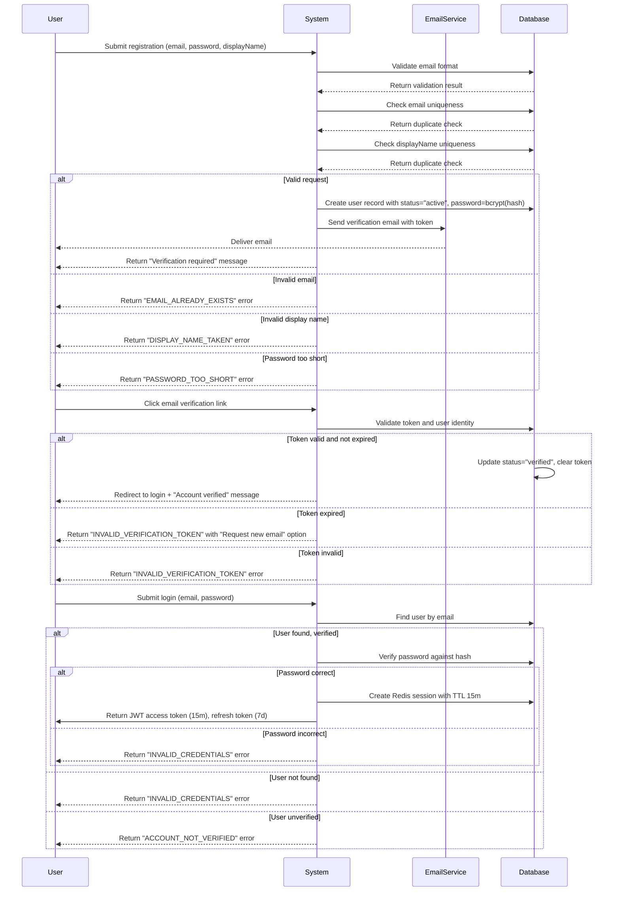
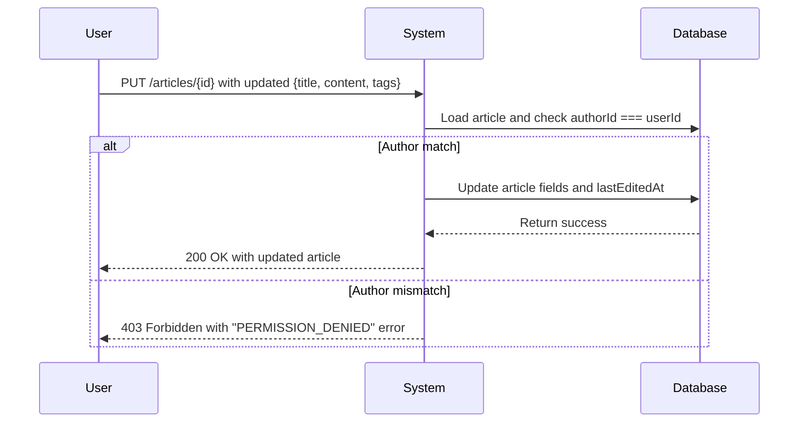
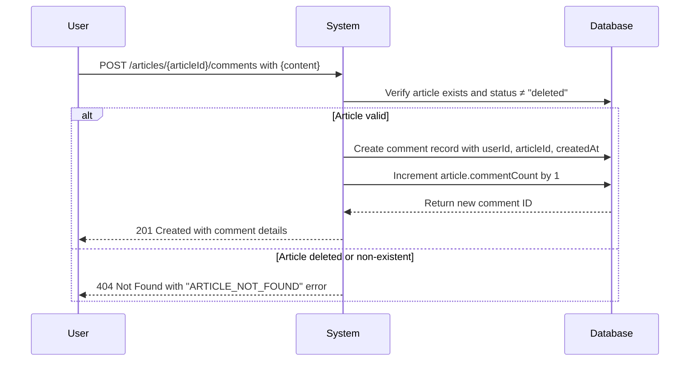
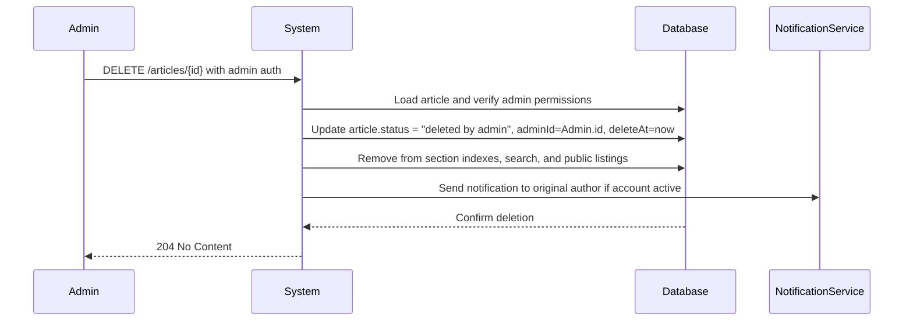
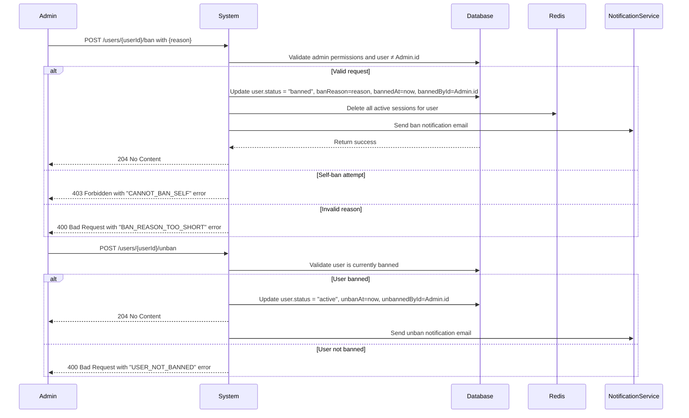
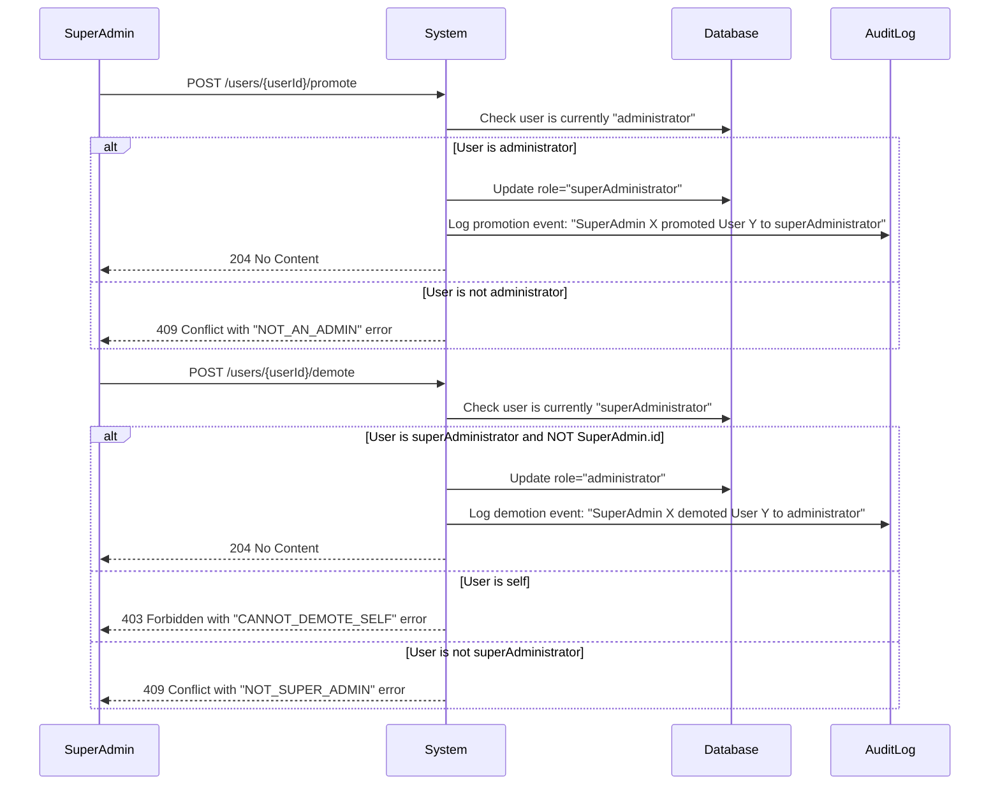

# Economic/Political Discussion Board

## Service Overview

The Economic/Political Discussion Board is a web-based platform designed to facilitate structured discourse on economic theories, political systems, and current affairs. The system enables users to engage in topic-specific conversations, share insights through articles and comments, and participate in community moderation under a hierarchical administrative framework. The platform prioritizes user autonomy, content integrity, and transparent governance.

### Core Value Proposition

- Democratize access to informed debate on economic and political topics
- Provide structured, context-aware discussion channels through categorized sections
- Empower users with self-management tools (article/comment editing and deletion)
- Enable community governance via tiered administrative privileges
- Maintain content permanence and auditability even after user actions
- Support rich media enrichment through file and image attachments

### Target Audience

- **Citizen Users**: General participants engaging in discussions as writers, commenters, and readers
- **Administrator**: Users with elevated privileges to moderate content and manage sections
- **Super Administrator**: Trusted users with full system governance, including administrative privilege escalation

### Business Justification

Traditional social platforms lack structured forums for nuanced economic and political discourse. This system fills the gap by offering:
- Focused topic isolation through sections
- Transparent moderation hierarchy
- Immutable audit trails for content moderation
- Controlled user privileges matching real-world governance structures
- Media-rich article context without clutter

This platform serves educators, researchers, policy analysts, and informed citizens seeking depth over virality.

## User Actors & Authentication

### Actor Specification

#### Citizen Actor

Citizen actors are standard users who interact with the platform by:
- Creating and editing their own articles and comments
- Viewing public content
- Attaching files and images to their articles
- Searching and filtering content
- Requesting administrative privileges
- Deleting their own account and associated content

**Permissions**: Read, Write, Edit (own), Delete (own), Search, Attach, RequestAdmin

#### Administrator Actor

Administrators are citizens who have been approved for moderation privileges. They:
- Perform all citizen actions
- Create, edit, and delete sections
- Delete any article or comment
- Ban and unban users
- View the list of banned users
- Approve/reject administrator requests

**Permissions**: All citizen permissions + AdminSection, AdminDelete, AdminBan, AdminManageRequests

#### Super Administrator Actor

Super administrators hold ultimate governance authority. They:
- Perform all administrator actions
- Promote regular administrators to super administrator
- Demote other super administrators to regular administrators
- Cannot demote themselves

**Permissions**: All administrator permissions + AdminPromote, AdminDemote

### Authentication Flow

#### Registration

WHEN a new user visits the platform, THE system SHALL allow them to register by providing:
- A valid email address
- A password with minimum 8 characters
- A display name (minimum 2 characters)

WHEN a user submits a registration request, THE system SHALL:
- Validate the email format (RFC 5322)
- Check for existing email address in database
- Check for existing display name
- Create a new user account with status "active"
- Send a confirmation email with verification link
- Store password as bcrypt hash

IF the email is already registered, THEN THE system SHALL respond with error code "EMAIL_ALREADY_EXISTS" and display message: "An account with this email already exists."

IF the display name is already taken, THEN THE system SHALL respond with error code "DISPLAY_NAME_TAKEN" and display message: "This display name is already in use. Please choose another."

IF password is less than 8 characters, THEN THE system SHALL respond with error code "PASSWORD_TOO_SHORT" and display message: "Password must be at least 8 characters long."

WHILE the account is unverified, THE system SHALL NOT allow login.

#### Login

WHEN a user attempts to log in, THE system SHALL:
- Accept email and password credentials
- Find user by email address
- Verify password against stored hash
- Set active session with JWT access token (15-minute expiration)
- Return refresh token (7-day expiration)

IF email is not found, THEN THE system SHALL respond with error code "INVALID_CREDENTIALS" and display message: "Email or password is incorrect."

IF password does not match, THEN THE system SHALL respond with error code "INVALID_CREDENTIALS" and display message: "Email or password is incorrect."

IF account is unverified, THEN THE system SHALL respond with error code "ACCOUNT_NOT_VERIFIED" and display message: "Please verify your email address before logging in."

WHEN login is successful, THE system SHALL store session in Redis with TTL of 15 minutes and return JWT token with payload:
{
  "userId": "uuid",
  "role": "citizen|administrator|superAdministrator",
  "permissions": ["read", "write", "edit", "delete", "ban", "admin"],
  "exp": "timestamp"
}

#### Password Change

WHEN an authenticated user requests to change password, THE system SHALL:
- Require current password for verification
- Require new password with minimum 8 characters
- Validate that new password is different from current password
- Update password hash in database

IF current password is incorrect, THEN THE system SHALL respond with error code "INCORRECT_CURRENT_PASSWORD" and display message: "Current password is incorrect."

IF new password is less than 8 characters, THEN THE system SHALL respond with error code "PASSWORD_TOO_SHORT" and display message: "New password must be at least 8 characters long."

IF new password is identical to current password, THEN THE system SHALL respond with error code "PASSWORD_SAME_AS_CURRENT" and display message: "New password must be different from your current password."

WHEN password is successfully changed, THE system SHALL:
- Invalidate all existing sessions
- Require re-login with new password
- Log password change event with timestamp

#### Account Deletion

WHEN an authenticated user requests account deletion, THE system SHALL:
- Require confirmation with user password
- Mark account as "deleted" with deletion timestamp
- Remove all articles, comments, and profile information
- Purge personal data from search indexes
- Keep historical record of username and deletion date for audit purposes

WHEN an account is deleted, THE system SHALL:
- Immediately invalidate all sessions
- Prevent any future login with credentials
- Replace all content links with "[Deleted User]"
- Keep encrypted audit log of deletion event

#### Email Verification

WHEN a user clicks the verification link in email, THE system SHALL:
- Validate verification token
- Update account status to "verified"
- Clear verification token from database
- Redirect to login page with confirmation message

IF verification token is invalid or expired, THEN THE system SHALL respond with error code "INVALID_VERIFICATION_TOKEN" and display message: "This verification link is invalid or has expired."

IF token is expired (7-day window), THEN THE system SHALL allow user to request new verification email.

### Session Management

- Access tokens: JWT with 15-minute expiration
- Refresh tokens: JWT with 7-day expiration, stored in Redis with TTL
- Session invalidation triggers:
  - Password change
  - Account deletion
  - Manual logout
  - Ban/unban
- All tokens signed with HS256 algorithm
- Refresh tokens rotated on use (short-lived single-use)

### Permission Matrix

| Actor | Read | Write | Edit Own | Delete Own | Ban | Admin | Promote | Demote |
|-------|------|-------|----------|------------|-----|-------|---------|--------|
| Citizen | ✅ | ✅ | ✅ | ✅ | ❌ | ❌ | ❌ | ❌ |
| Administrator | ✅ | ✅ | ✅ | ✅ | ✅ | ✅ | ❌ | ❌ |
| Super Administrator | ✅ | ✅ | ✅ | ✅ | ✅ | ✅ | ✅ | ✅ |

> Note: "Admin" includes management of sections, articles, comments, bans, and requests

## Functional Requirements

### Account Management

#### Registration

WHEN a new user visits the platform, THE system SHALL allow them to register by providing:
- A valid email address
- A password with minimum 8 characters
- A display name (minimum 2 characters)

WHEN a user submits a registration request, THE system SHALL:
- Validate the email format (RFC 5322)
- Check for existing email address in database
- Check for existing display name
- Create a new user account with status "active"
- Send a confirmation email with verification link
- Store password as bcrypt hash

IF the email is already registered, THEN THE system SHALL respond with error code "EMAIL_ALREADY_EXISTS" and display message: "An account with this email already exists."

IF the display name is already taken, THEN THE system SHALL respond with error code "DISPLAY_NAME_TAKEN" and display message: "This display name is already in use. Please choose another."

IF password is less than 8 characters, THEN THE system SHALL respond with error code "PASSWORD_TOO_SHORT" and display message: "Password must be at least 8 characters long."

WHILE the account is unverified, THE system SHALL NOT allow login.

#### Login

WHEN a user attempts to log in, THE system SHALL:
- Accept email and password credentials
- Find user by email address
- Verify password against stored hash
- Set active session with JWT access token (15-minute expiration)
- Return refresh token (7-day expiration)

IF email is not found, THEN THE system SHALL respond with error code "INVALID_CREDENTIALS" and display message: "Email or password is incorrect."

IF password does not match, THEN THE system SHALL respond with error code "INVALID_CREDENTIALS" and display message: "Email or password is incorrect."

IF account is unverified, THEN THE system SHALL respond with error code "ACCOUNT_NOT_VERIFIED" and display message: "Please verify your email address before logging in."

WHEN login is successful, THE system SHALL store session in Redis with TTL of 15 minutes and return JWT token with payload:
{
  "userId": "uuid",
  "role": "citizen|administrator|superAdministrator",
  "permissions": ["read", "write", "edit", "delete", "ban", "admin"],
  "exp": "timestamp"
}

#### Password Change

WHEN an authenticated user requests to change password, THE system SHALL:
- Require current password for verification
- Require new password with minimum 8 characters
- Validate that new password is different from current password
- Update password hash in database

IF current password is incorrect, THEN THE system SHALL respond with error code "INCORRECT_CURRENT_PASSWORD" and display message: "Current password is incorrect."

IF new password is less than 8 characters, THEN THE system SHALL respond with error code "PASSWORD_TOO_SHORT" and display message: "New password must be at least 8 characters long."

IF new password is identical to current password, THEN THE system SHALL respond with error code "PASSWORD_SAME_AS_CURRENT" and display message: "New password must be different from your current password."

WHEN password is successfully changed, THE system SHALL:
- Invalidate all existing sessions
- Require re-login with new password
- Log password change event with timestamp

#### Account Deletion

WHEN an authenticated user requests account deletion, THE system SHALL:
- Require confirmation with user password
- Mark account as "deleted" with deletion timestamp
- Remove all articles, comments, and profile information
- Purge personal data from search indexes
- Keep historical record of username and deletion date for audit purposes

WHEN an account is deleted, THE system SHALL:
- Immediately invalidate all sessions
- Prevent any future login with credentials
- Replace all content links with "[Deleted User]"
- Keep encrypted audit log of deletion event

#### Email Verification

WHEN a user clicks the verification link in email, THE system SHALL:
- Validate verification token
- Update account status to "verified"
- Clear verification token from database
- Redirect to login page with confirmation message

IF verification token is invalid or expired, THEN THE system SHALL respond with error code "INVALID_VERIFICATION_TOKEN" and display message: "This verification link is invalid or has expired."

IF token is expired (7-day window), THEN THE system SHALL allow user to request new verification email.

### User Profile Management

#### Profile Editing

WHEN an authenticated user edits their profile, THE system SHALL allow updates to:
- Display name (minimum 2 characters, maximum 50)
- Bio text (maximum 500 characters)

WHEN a user changes display name, THE system SHALL:
- Check for name conflicts with existing users
- Validate name format (alphanumeric, underscore, hyphen)

IF display name conflict detected, THEN THE system SHALL respond with error code "DISPLAY_NAME_TAKEN" and display message: "This display name is already in use. Please choose another."

IF display name contains invalid characters, THEN THE system SHALL respond with error code "INVALID_DISPLAY_NAME" and display message: "Display name can only contain letters, numbers, underscores, and hyphens."

IF bio exceeds 500 characters, THEN THE system SHALL respond with error code "BIO_TOO_LONG" and display message: "Bio cannot exceed 500 characters."

#### Profile Viewing

WHEN a user views another user's profile, THE system SHALL display:
- Display name
- Bio text
- Number of articles written
- Number of comments written
- Date joined

IF the viewed user's account is deleted, THE system SHALL display "[Deleted User]" instead of display name and bio

IF the viewed user's account is banned, THE system SHALL display "[Banned User]" instead of display name and bio, and hide all content links

THE system SHALL NOT display any private information such as email, password status, or verification status

### Section Management

#### Section Listing

WHEN a user requests the list of sections, THE system SHALL return:
- Section ID
- Section name
- Section description
- Number of articles in section
- Creation timestamp

WHEN requesting section list, THE system SHALL NOT return sections with "hidden" status

#### Section Creation

WHEN an administrator requests to create a section, THE system SHALL:
- Require section name (minimum 2 characters, maximum 50)
- Require section description (maximum 500 characters)
- Validate section name uniqueness
- Set creation timestamp
- Set status to "active"

IF section name is missing, THEN THE system SHALL respond with error code "SECTION_NAME_REQUIRED" and display message: "Section name is required."

IF section name is less than 2 characters, THEN THE system SHALL respond with error code "SECTION_NAME_TOO_SHORT" and display message: "Section name must be at least 2 characters long."

IF section name exceeds 50 characters, THEN THE system SHALL respond with error code "SECTION_NAME_TOO_LONG" and display message: "Section name cannot exceed 50 characters."

IF section name already exists, THEN THE system SHALL respond with error code "SECTION_EXISTS" and display message: "A section with this name already exists."

IF section description exceeds 500 characters, THEN THE system SHALL respond with error code "SECTION_DESCRIPTION_TOO_LONG" and display message: "Section description cannot exceed 500 characters."

#### Section Editing

WHEN an administrator updates a section, THE system SHALL allow edits to:
- Section name (minimum 2, maximum 50)
- Section description (maximum 500)

WHEN section name is changed, THE system SHALL:
- Check for name conflicts with existing sections
- Update all articles with the new section reference

IF section name conflict detected, THEN THE system SHALL respond with error code "SECTION_EXISTS" and display message: "A section with this name already exists."

WHEN section is edited, THE system SHALL log the administrator who made the change and timestamp

#### Section Deletion

WHEN an administrator deletes a section, THE system SHALL:
- Associate all articles in the section with "General" section (default)
- Mark section as "deleted" with deletion timestamp
- Prevent new articles from being created in the section
- Keep section name in deleted list for audit purposes

WHEN a section is deleted, THE system SHALL NOT delete any articles or comments

WHEN a deleted section is requested, THE system SHALL return error code "SECTION_NOT_FOUND" with message: "This section has been deleted."

### Article Creation & Management

#### Article Creation

WHEN a user creates an article, THE system SHALL require:
- Title (minimum 5 characters, maximum 200)
- Content (minimum 10 characters)
- Section ID (must be active section)

WHEN article is created, THE system SHALL:
- Generate unique article ID
- Set creation timestamp
- Set last edited timestamp
- Associate with user's profile
- Set view count to 0
- Set comment count to 0

IF title is missing, THEN THE system SHALL respond with error code "ARTICLE_TITLE_REQUIRED" and display message: "Article title is required."

IF title is less than 5 characters, THEN THE system SHALL respond with error code "ARTICLE_TITLE_TOO_SHORT" and display message: "Title must be at least 5 characters long."

IF title exceeds 200 characters, THEN THE system SHALL respond with error code "ARTICLE_TITLE_TOO_LONG" and display message: "Title cannot exceed 200 characters."

IF content is missing, THEN THE system SHALL respond with error code "ARTICLE_CONTENT_REQUIRED" and display message: "Article content is required."

IF content is less than 10 characters, THEN THE system SHALL respond with error code "ARTICLE_CONTENT_TOO_SHORT" and display message: "Content must be at least 10 characters long."

IF section is invalid or inactive, THEN THE system SHALL respond with error code "INVALID_SECTION" and display message: "Invalid or inactive section selected."

#### Article Editing

WHEN an author edits their own article, THE system SHALL allow edits to:
- Title (maximum 200 characters)
- Content (minimum 10 characters)
- Attached files
- Attached images
- Tags (free text, comma-separated)

WHEN article is edited, THE system SHALL:
- Update last edited timestamp
- Keep original creation timestamp
- Log editor identity

IF article title exceeds 200 characters, THEN THE system SHALL respond with error code "ARTICLE_TITLE_TOO_LONG" and display message: "Title cannot exceed 200 characters."

IF article content exceeds 50,000 characters, THEN THE system SHALL respond with error code "ARTICLE_CONTENT_TOO_LONG" and display message: "Content cannot exceed 50,000 characters."

WHEN adding tags, THE system SHALL accept up to 10 tags per article

WHEN other users attempt to edit an article, THE system SHALL respond with error code "PERMISSION_DENIED" and display message: "You can only edit your own articles."

#### Article Deletion

WHEN an author deletes their own article, THE system SHALL:
- Mark article as "deleted" with deletion timestamp
- Remove from section article lists
- Hide article from search results
- Keep article record for audit purposes

WHEN an administrator deletes an article, THE system SHALL:
- Mark article as "deleted by admin" with deletion timestamp and admin ID
- Remove from section article lists
- Hide article from search results
- Keep article record for audit purposes

WHEN an article is deleted, THE system SHALL NOT delete any associated comments

WHEN a deleted article is requested, THE system SHALL return error code "ARTICLE_NOT_FOUND" with message: "This article has been deleted."

### Article Listing & Sorting

#### Section Article Listing

WHEN a user views articles in a section, THE system SHALL return:
- Article ID
- Title
- Author display name
- List of tags (maximum 5)
- Comment count
- Creation timestamp
- Status (active/deleted)

THE list SHALL be paginated with 20 articles per page

WHEN page is requested, THE system SHALL validate page number (1-100)

IF page number exceeds 100, THEN THE system SHALL return last page (100)

IF page number is less than 1, THEN THE system SHALL return page 1

#### Sorting

WHEN a user requests article listing with sort criteria, THE system SHALL support:
- Newest first (creation timestamp: descending)
- Oldest first (creation timestamp: ascending)

WHEN sort parameter is provided as "newest", THE system SHALL order by creation timestamp DESC

WHEN sort parameter is provided as "oldest", THE system SHALL order by creation timestamp ASC

WHEN sort parameter is not specified, THE system SHALL default to "newest"

### Article Viewing

#### Article Display

WHEN a user views an article, THE system SHALL show:
- Title (maximum 200 characters)
- Author display name
- Content (up to 50,000 characters)
- List of attached files with download URLs
- List of attached images with view URLs
- List of tags
- Creation timestamp
- Last edited timestamp
- View count
- Comment count

WHEN an article is deleted, THE system SHALL return error code "ARTICLE_NOT_FOUND" with message: "This article has been deleted."

WHEN a user has been banned, THE system SHALL show content but replace author name with "[Banned User]"

WHEN an author's account is deleted, THE system SHALL replace author name with "[Deleted User]"

#### File and Image Downloads

WHEN a user requests to download a file, THE system SHALL:
- Verify article exists and is active
- Verify file attachment exists
- Check user permissions
- Generate temporary signed URL for download
- Increment download counter

WHEN a user requests to view an image, THE system SHALL:
- Verify article exists and is active
- Verify image attachment exists
- Check user permissions
- Return image with optimized display size
- Increment view counter

WHEN file or image request is made with invalid ID, THE system SHALL respond with error code "FILE_NOT_FOUND" and display message: "File or image not found."

### Comment Management

#### Comment Posting

WHEN a user posts a comment on an article, THE system SHALL require:
- Content (minimum 2 characters)
- Article ID (must exist and be active)

WHEN comment is posted, THE system SHALL:
- Generate unique comment ID
- Set creation timestamp
- Associate with user profile
- Associate with article ID
- Increment article comment count by 1

IF content is missing, THEN THE system SHALL respond with error code "COMMENT_CONTENT_REQUIRED" and display message: "Comment content is required."

IF content is less than 2 characters, THEN THE system SHALL respond with error code "COMMENT_CONTENT_TOO_SHORT" and display message: "Comment must be at least 2 characters long."

IF content exceeds 1,000 characters, THEN THE system SHALL respond with error code "COMMENT_CONTENT_TOO_LONG" and display message: "Comment cannot exceed 1,000 characters."

IF article does not exist or is deleted, THEN THE system SHALL respond with error code "ARTICLE_NOT_FOUND" and display message: "Cannot comment on deleted article."

#### Comment Viewing

WHEN a user views comments on an article, THE system SHALL return:
- Comment ID
- Author display name
- Content
- Creation timestamp
- Status (active/deleted)

Comments SHALL be sorted by creation timestamp ASC (oldest first)

Comments SHALL be paginated with 30 per page

WHEN a comment is deleted, THE system SHALL show:
- "[Deleted Comment]"
- Comment ID
- Deletion timestamp
- Author display name

WHEN an author's account is deleted or banned, THE system SHALL show:
- "[Deleted User]" or "[Banned User]"
- Comment content
- Creation timestamp

#### Comment Editing

WHEN an author edits their own comment, THE system SHALL allow edits to:
- Comment content (minimum 2 characters, maximum 1,000)

WHEN a comment is edited, THE system SHALL:
- Update last edited timestamp
- Keep original creation timestamp
- Log editor identity
- Show "edited" indicator on display

WHEN other users attempt to edit a comment, THE system SHALL respond with error code "PERMISSION_DENIED" and display message: "You can only edit your own comments."

IF comment content exceeds 1,000 characters, THEN THE system SHALL respond with error code "COMMENT_CONTENT_TOO_LONG" and display message: "Comment cannot exceed 1,000 characters."

IF comment content is less than 2 characters, THEN THE system SHALL respond with error code "COMMENT_CONTENT_TOO_SHORT" and display message: "Comment must be at least 2 characters long."

#### Comment Deletion

WHEN a user deletes their own comment, THE system SHALL:
- Mark comment as "deleted"
- Decrement article comment count by 1
- Keep comment record for audit

WHEN an administrator deletes a comment, THE system SHALL:
- Mark comment as "deleted by admin"
- Decrement article comment count by 1
- Keep comment record with admin ID and deletion reason

WHEN a comment is deleted, THE system SHALL display [Deleted Comment] with creation and deletion timestamp

### Search & Filtering

#### Article Search

WHEN a user submits a search query, THE system SHALL:
- Search article titles and content for matching text
- Search article tags for exact matches
- Return results sorted by relevance
- Apply pagination with 20 results per page

THE search SHALL be case-insensitive

THE search SHALL handle special characters appropriately

WHEN search query is empty or only whitespace, THE system SHALL return empty results

WHEN search query is less than 2 characters, THE system SHALL return empty results

#### Tag Filtering

WHEN a user applies tag filters, THE system SHALL:
- Filter articles by exact tag matches
- Allow multiple tag filters (AND logic)
- Return results sorted by creation timestamp DESC
- Apply pagination with 20 results per page

IF a tag contains only whitespace, THE system SHALL ignore it

IF a tag contains more than 50 characters, THE system SHALL ignore it

#### Search Result Display

WHEN displaying search results, THE system SHALL show:
- Article title
- Snippet of matching content (up to 100 characters)
- Author display name
- Tags
- Creation timestamp
- Section name

THE snippet SHALL highlight matching keywords

WHEN no results are found, THE system SHALL display message: "No articles found matching your search."

### File & Media Attachment

#### File Attachment

WHEN a user attaches a file to an article, THE system SHALL:
- Accept any file type
- Allow up to 10 files per article
- Limit total size to 100 MB per article
- Validate file name (alphanumeric, underscore, hyphen, period)
- Generate unique storage path
- Store metadata: filename, size, MIME type, upload timestamp, uploader ID

WHEN file upload fails due to size limit, THE system SHALL respond with error code "FILE_SIZE_EXCEEDED" and display message: "Total file attachments cannot exceed 100 MB for one article."

WHEN file upload fails due to too many files, THE system SHALL respond with error code "TOO_MANY_FILES" and display message: "Maximum 10 files allowed per article."

WHEN file name contains invalid characters, THE system SHALL respond with error code "INVALID_FILENAME" and display message: "File name can only contain letters, numbers, underscores, hyphens, and periods."

#### Image Attachment

WHEN a user attaches an image to an article, THE system SHALL:
- Accept JPG, JPEG, PNG, GIF, WEBP formats
- Allow up to 20 images per article
- Limit total size to 50 MB per article
- Generate optimized thumbnails (800x600px)
- Store original and thumbnail versions
- Store metadata: filename, size, MIME type, dimensions, upload timestamp, uploader ID

WHEN image file format is not accepted, THE system SHALL respond with error code "INVALID_IMAGE_FORMAT" and display message: "Only JPG, JPEG, PNG, GIF, and WEBP formats are allowed."

WHEN image file exceeds 50 MB total for article, THE system SHALL respond with error code "IMAGE_SIZE_EXCEEDED" and display message: "Total image attachments cannot exceed 50 MB for one article."

WHEN too many images are uploaded, THE system SHALL respond with error code "TOO_MANY_IMAGES" and display message: "Maximum 20 images allowed per article."

#### Download Permissions

WHEN a file or image is downloaded, THE system SHALL:
- Verify the article is active and not deleted
- Verify the user has permission to view the article
- Generate time-limited signed download URL (5-minute expiration)
- Log download event

THE system SHALL NOT provide direct file system paths

### Administration Actions

#### Administrator Request

WHEN a citizen submits an administrator request, THE system SHALL:
- Require reason text (minimum 10 characters)
- Store request with timestamp
- Set status to "pending"
- Add to list of pending requests

WHEN reason is less than 10 characters, THEN THE system SHALL respond with error code "REQUEST_REASON_TOO_SHORT" and display message: "Reason for administrator request must be at least 10 characters long."

WHEN user is already an administrator, THEN THE system SHALL respond with error code "ALREADY_ADMIN" and display message: "You are already an administrator."

#### Admin Approval

WHEN a super administrator approves an admin request, THE system SHALL:
- Update request status to "approved"
- Promote user to "administrator" role
- Add administrator permission rights
- Notify user via email

WHEN a super administrator rejects an admin request, THE system SHALL:
- Update request status to "rejected"
- Notify user with rejection reason
- Keep request record for audit

#### Admin Promotion

WHEN a super administrator promotes a regular administrator, THE system SHALL:
- Change user role from "administrator" to "superAdministrator"
- Grant all super administrator permissions
- Log promotion event with timestamps and actor IDs

WHEN a super administrator attempts to promote a non-administrator, THE system SHALL respond with error code "NOT_AN_ADMIN" and display message: "Cannot promote user who is not a regular administrator."

#### Admin Demotion

WHEN a super administrator demotes another super administrator, THE system SHALL:
- Change user role from "superAdministrator" to "administrator"
- Remove super administrator privileges
- Log demotion event with timestamps and actor IDs

WHEN a super administrator attempts to demote themselves, THE system SHALL respond with error code "CANNOT_DEMOTE_SELF" and display message: "Super administrators cannot demote themselves."

WHEN a super administrator demotes a regular administrator, THE system SHALL respond with error code "NOT_SUPER_ADMIN" and display message: "Only super administrators can be demoted by other super administrators."

#### Content Deletion

WHEN an administrator deletes any article or comment, THE system SHALL:
- Mark the content as "deleted by admin"
- Store administrator ID and timestamp
- Preserve original content for audit
- Notify the original author via email (if account is active)

WHEN an administrator deletes an article, THE system SHALL NOT delete any associated comments

WHEN an administrator deletes a comment, THE system SHALL decrement the article's comment count

#### User Banning

WHEN an administrator bans a user, THE system SHALL:
- Mark the account as "banned"
- Record ban reason (minimum 10 characters)
- Record ban timestamp and administrator who issued ban
- Delete all active sessions
- Prevent login attempts
- Keep all existing articles and comments visible

WHEN ban reason is less than 10 characters, THE system SHALL respond with error code "BAN_REASON_TOO_SHORT" and display message: "Ban reason must be at least 10 characters long."

WHEN an administrator bans their own account, THE system SHALL respond with error code "CANNOT_BAN_SELF" and display message: "Administrators cannot ban themselves."

WHEN a banned user attempts to log in, THE system SHALL respond with error code "ACCOUNT_BANNED" and display message: "Your account has been banned. Contact an administrator for more information."

#### User Unbanning

WHEN an administrator unbans a user, THE system SHALL:
- Mark account as "active"
- Record unban timestamp and administrator ID
- Allow login attempts
- Notify user via email

WHEN an administrator unbans a non-banned user, THE system SHALL respond with error code "USER_NOT_BANNED" and display message: "This user is not currently banned."

#### Admin Banned User Listing

WHEN an administrator requests list of banned users, THE system SHALL return:
- User ID
- Display name (or "[Deleted User]" if deleted)
- Ban reason
- Ban timestamp
- Administrator who banned
- Status (banned/unbanned)

THE list SHALL be paginated with 25 users per page

THE list SHALL be filterable by ban status (banned/unbanned)

THE list SHALL be sortable by ban timestamp (newest or oldest first)

## Business Rules & Constraints

### Content Validation Rules

| Field | Min Length | Max Length | Format Constraints |
|-------|------------|------------|---------------------|
| Email | — | — | RFC 5322 compliant |
| Password | 8 | — | Must not be common weak password |
| Display Name | 2 | 50 | Alphanumeric, underscore, hyphen only |
| Bio | — | 500 | No HTML tags |
| Article Title | 5 | 200 | — |
| Article Content | 10 | 50000 | Max 50,000 characters |
| Comment Content | 2 | 1000 | No HTML tags |
| Section Name | 2 | 50 | Unique, alphanumeric, underscore, hyphen |
| Section Description | — | 500 | No HTML tags |
| Ban Reason | 10 | — | No HTML tags |
| Admin Request Reason | 10 | — | No HTML tags |
| Tag | — | 50 | Comma-separated, trimmed, case-sensitive exact match |

### Edit/Delete Time Windows

- Article editing: Allowed indefinitely, no time window restriction
- Comment editing: Allowed indefinitely
- Article deletion: Allowed by author at any time
- Comment deletion: Allowed by author at any time
- Admin deletion: Immediate, no time window restriction

### Section Management Rules

- Default section for orphaned articles: "General"
- Section name uniqueness enforced at database and application layer
- Cannot delete section with active articles — must reassign
- Section deletion preserves all associated articles and comments

### Comment Constraints

- No nested replies — all comments are single-level
- Comments are sorted by oldest first (ASC) by default
- Each comment is associated with exactly one article
- Comment deletion decouples from article

### Ban Reason Requirements

- Minimum 10 characters
- Cannot be empty or whitespace-only
- Admins can update reason after initial ban
- Reason is visible to all admins (not to user unless unban)
- Reasons are logged and immutable after initial record

### Admin Privilege Escalation Rules

- Regular administrators cannot promote themselves
- Regular administrators cannot demote others
- Super administrators cannot promote themselves
- Super administrators cannot demote themselves
- Demotion requires explicit confirmation by target
- All promotion/demotion events are logged with full audit trail
- No privilege escalation without human approval

## System Behavior & Workflows

### User Registration & Login Flow



### Article Creation Workflow

```mermaid
sequenceDiagram
    participant User
    participant System
    participant Database
    participant StorageService

    User->>System: POST /articles with {title, content, sectionId, tags}
    System->>Database: Validate sectionId exists and is active
    alt Section valid
        System->>Database: Create new article record
        Database-->>System: Return new articleId
        System->>User: Return 201 Created with article details
    else Section invalid or inactive
        System-->>User: Return "INVALID_SECTION" error
    end
    
    User->>System: Attach file(s) to article (POST /articles/{id}/files)
    repeat n times (0-10 files)
        System->>StorageService: Upload file
        StorageService-->>System: Return storagePath, mimeType, size
        System->>Database: Store file metadata with articleId
    end
    
    User->>System: Attach image(s) to article (POST /articles/{id}/images)
    repeat m times (0-20 images)
        System->>StorageService: Upload and generate thumbnail
        StorageService-->>System: Return originalPath, thumbnailPath, width, height
        System->>Database: Store image metadata with articleId
    end
```

### Article Editing Workflow



### Comment Posting Workflow



### Admin Content Deletion Workflow



### Ban/Unban User Process



### Admin Promotion Flow



## Performance & Security

### Response Time Expectations

| Operation | Target Max Latency | Threshold | Action |
|----------|--------------------|-----------|--------|
| Registration | 800 ms | 1200 ms | Log warning |
| Login | 500 ms | 800 ms | Log warning |
| Article listing (per page) | 700 ms | 1000 ms | Enable caching |
| Article creation | 1000 ms | 1500 ms | Log warning |
| Comment posting | 600 ms | 900 ms | Log warning |
| File upload | 3000 ms | 6000 ms | Queue for async processing |
| Search | 1200 ms | 2000 ms | Index optimization priority |
| Admin actions | 800 ms | 1200 ms | Log warning |

All times are for 95th percentile under normal load.

### Scalability Requirements

- Support 10,000 concurrent active sessions
- Handle 100 article creations per minute
- Support 1,000 article views per minute
- Handle 500 comments per minute
- Support 100 file uploads per minute
- Use Redis for session storage and rate limiting
- Use Elasticsearch for search indexing with auto-scaling
- Use load-balanced microservices for API tier
- Queue system for file uploads and notifications

### Data Privacy

- All passwords stored as bcrypt hashes (salted)
- Email addresses encrypted at rest (AES-256)
- Personal data purged on account deletion
- Audit logs of access and changes stored encrypted
- No third-party analytics without explicit consent
- GDPR-compliant data access and deletion workflows

### Access Control Enforcement

- All API endpoints enforce role-based access control (RBAC)
- Every request validates:
  - Authentication token validity
  - User session existence
  - Permission scope (e.g., "delete" for article deletion)
  - Ownership or administrative privilege where applicable
- Admin actions require elevated permission flags beyond standard user permissions
- JWT tokens are signed with HMAC-SHA256 and include role/permissions

### Session Security

- Access tokens: 15-minute JWT, signed with HS256
- Refresh tokens: 7-day JWT, single-use, rotated on use
- Refresh tokens stored in Redis with TTL
- All token claims include: userId, role, permissions, exp
- Token reuse detection enabled
- Token invalidation triggers:
  - Password change
  - Account deletion
  - Ban
  - Admin-initiated logout

### Input Validation

- All user inputs validated before database write
- Regex patterns enforced for:
  - Email format (RFC 5322)
  - Display name (^[a-zA-Z0-9_-]{2,50}$)
  - File names (^[a-zA-Z0-9_.-]+$)
  - Tags (trim whitespace, max 50 chars)
- HTML sanitization applied to:
  - Bio
  - Article content
  - Comment content
  - Section description
- All file uploads scanned for malware (ClamAV integration)

## Admin System & Banning

### Admin Request Submission

WHEN a citizen submits an administrator request, THE system SHALL:
- Require reason text (minimum 10 characters)
- Store request with timestamp
- Set status to "pending"
- Add to list of pending requests

WHEN reason is less than 10 characters, THEN THE system SHALL respond with error code "REQUEST_REASON_TOO_SHORT" and display message: "Reason for administrator request must be at least 10 characters long."

WHEN user is already an administrator, THEN THE system SHALL respond with error code "ALREADY_ADMIN" and display message: "You are already an administrator."

### Admin Approval Process

WHEN a super administrator approves an admin request, THE system SHALL:
- Update request status to "approved"
- Promote user to "administrator" role
- Add administrator permission rights
- Notify user via email

WHEN a super administrator rejects an admin request, THE system SHALL:
- Update request status to "rejected"
- Notify user with rejection reason
- Keep request record for audit

### Administrator Grade Hierarchy

| Role | Can Create Sections | Can Delete Articles | Can Delete Comments | Can Ban Users | Can Promote | Can Demote | Can Demote Self |
|------|---------------------|---------------------|---------------------|---------------|-------------|------------|-----------------|
| Citizen | ❌ | ❌ | ❌ | ❌ | ❌ | ❌ | ❌ |
| Administrator | ✅ | ✅ | ✅ | ✅ | ❌ | ❌ | ❌ |
| Super Administrator | ✅ | ✅ | ✅ | ✅ | ✅ | ✅ | ❌ |

### Super Admin Privileges

Super administrators possess ALL administrative privileges including:
- Promotion and demotion of any administrator
- Viewing all pending administrator requests
- Approving or rejecting any administrator request
- Managing all banned users
- Accessing all audit logs

### Demotion Restrictions

WHEN a super administrator attempts to demote themselves, THE system SHALL respond with error code "CANNOT_DEMOTE_SELF" and display message: "Super administrators cannot demote themselves."

WHEN a super administrator attempts to demote a regular administrator, THE system SHALL respond with error code "NOT_SUPER_ADMIN" and display message: "Only super administrators can be demoted by other super administrators."

### Administrator Capabilities Matrix

| Capability | Citizen | Administrator | Super Administrator |
|------------|---------|---------------|---------------------|
| Register | ✅ | ✅ | ✅ |
| Login | ✅ | ✅ | ✅ |
| Change password | ✅ | ✅ | ✅ |
| Delete own account | ✅ | ✅ | ✅ |
| Edit profile | ✅ | ✅ | ✅ |
| View profile | ✅ | ✅ | ✅ |
| Create article | ✅ | ✅ | ✅ |
| Edit own article | ✅ | ✅ | ✅ |
| Delete own article | ✅ | ✅ | ✅ |
| View article | ✅ | ✅ | ✅ |
| Post comment | ✅ | ✅ | ✅ |
| Edit own comment | ✅ | ✅ | ✅ |
| Delete own comment | ✅ | ✅ | ✅ |
| Search articles | ✅ | ✅ | ✅ |
| Filter articles by tags | ✅ | ✅ | ✅ |
| Attach files to article | ✅ | ✅ | ✅ |
| Attach images to article | ✅ | ✅ | ✅ |
| Download files/images | ✅ | ✅ | ✅ |
| Request admin role | ✅ | ✅ | ✅ |
| View pending admin requests | ❌ | ❌ | ✅ |
| Approve admin request | ❌ | ❌ | ✅ |
| Reject admin request | ❌ | ❌ | ✅ |
| Create section | ❌ | ✅ | ✅ |
| Edit section | ❌ | ✅ | ✅ |
| Delete section | ❌ | ✅ | ✅ |
| Delete any article | ❌ | ✅ | ✅ |
| Delete any comment | ❌ | ✅ | ✅ |
| Ban user | ❌ | ✅ | ✅ |
| Unban user | ❌ | ✅ | ✅ |
| View banned users list | ❌ | ✅ | ✅ |
| Promote admin to super admin | ❌ | ❌ | ✅ |
| Demote super admin | ❌ | ❌ | ✅ |

## Search & Filtering

### Search Functionality

WHEN a user submits a search query, THE system SHALL:
- Search article titles and content for matching text
- Search article tags for exact matches
- Return results sorted by relevance
- Apply pagination with 20 results per page

THE search SHALL be case-insensitive

THE search SHALL handle special characters appropriately

WHEN search query is empty or only whitespace, THE system SHALL return empty results

WHEN search query is less than 2 characters, THE system SHALL return empty results

### Tag Filtering

WHEN a user applies tag filters, THE system SHALL:
- Filter articles by exact tag matches
- Allow multiple tag filters (AND logic)
- Return results sorted by creation timestamp DESC
- Apply pagination with 20 results per page

IF a tag contains only whitespace, THE system SHALL ignore it

IF a tag contains more than 50 characters, THE system SHALL ignore it

### Pagination Requirements

| Endpoint | Items Per Page | Max Page | Query Param |
|----------|----------------|----------|-------------|
| Section Articles | 20 | 100 | page=1 |
| Search Results | 20 | 100 | page=1 |
| Banned Users | 25 | 100 | page=1 |
| Comments | 30 | 100 | page=1 |

### Sort Criteria

| Endpoint | Supported Sort Options | Default Order | Query Param |
|----------|------------------------|----------------|-------------|
| Section Articles | newest, oldest | newest | sortBy=newest |
| Search Results | newest, oldest | newest | sortBy=newest |
| Banned Users | newest, oldest | newest | sortBy=newest |
| Comments | oldest | oldest | sortBy=oldest |

### Search Result Display

WHEN displaying search results, THE system SHALL show:
- Article title
- Snippet of matching content (up to 100 characters)
- Author display name
- Tags
- Creation timestamp
- Section name

THE snippet SHALL highlight matching keywords

WHEN no results are found, THE system SHALL display message: "No articles found matching your search."

## File & Media Management

### File Attachment Rules

WHEN a user attaches a file to an article, THE system SHALL:
- Accept any file type
- Allow up to 10 files per article
- Limit total size to 100 MB per article
- Validate file name (alphanumeric, underscore, hyphen, period)
- Generate unique storage path
- Store metadata: filename, size, MIME type, upload timestamp, uploader ID

WHEN file upload fails due to size limit, THE system SHALL respond with error code "FILE_SIZE_EXCEEDED" and display message: "Total file attachments cannot exceed 100 MB for one article."

WHEN file upload fails due to too many files, THE system SHALL respond with error code "TOO_MANY_FILES" and display message: "Maximum 10 files allowed per article."

WHEN file name contains invalid characters, THE system SHALL respond with error code "INVALID_FILENAME" and display message: "File name can only contain letters, numbers, underscores, hyphens, and periods."

### Image Attachment Rules

WHEN a user attaches an image to an article, THE system SHALL:
- Accept JPG, JPEG, PNG, GIF, WEBP formats
- Allow up to 20 images per article
- Limit total size to 50 MB per article
- Generate optimized thumbnails (800x600px)
- Store original and thumbnail versions
- Store metadata: filename, size, MIME type, dimensions, upload timestamp, uploader ID

WHEN image file format is not accepted, THE system SHALL respond with error code "INVALID_IMAGE_FORMAT" and display message: "Only JPG, JPEG, PNG, GIF, and WEBP formats are allowed."

WHEN image file exceeds 50 MB total for article, THE system SHALL respond with error code "IMAGE_SIZE_EXCEEDED" and display message: "Total image attachments cannot exceed 50 MB for one article."

WHEN too many images are uploaded, THE system SHALL respond with error code "TOO_MANY_IMAGES" and display message: "Maximum 20 images allowed per article."

### Download Permissions

WHEN a file or image is downloaded, THE system SHALL:
- Verify the article is active and not deleted
- Verify the user has permission to view the article
- Generate time-limited signed download URL (5-minute expiration)
- Log download event

THE system SHALL NOT provide direct file system paths

## Error Handling & Recovery

### Authentication Errors

| Error Code | HTTP Status | Message | Action |
|------------|-------------|--------|--------|
| EMAIL_ALREADY_EXISTS | 400 | "An account with this email already exists." | Show error to user |
| DISPLAY_NAME_TAKEN | 400 | "This display name is already in use. Please choose another." | Show error to user |
| PASSWORD_TOO_SHORT | 400 | "Password must be at least 8 characters long." | Show error to user |
| ACCOUNT_NOT_VERIFIED | 401 | "Please verify your email address before logging in." | Show link to resend verification |
| INVALID_CREDENTIALS | 401 | "Email or password is incorrect." | Show error to user |
| INCORRECT_CURRENT_PASSWORD | 400 | "Current password is incorrect." | Show error to user |
| PASSWORD_SAME_AS_CURRENT | 400 | "New password must be different from your current password." | Show error to user |
| INVALID_VERIFICATION_TOKEN | 400 | "This verification link is invalid or has expired." | Show option to resend email |
| TOKEN_EXPIRED | 401 | "Refresh token has expired. Please log in again." | Redirect to login |

### Content Validation Errors

| Error Code | HTTP Status | Message | Action |
|------------|-------------|--------|--------|
| SECTION_NAME_REQUIRED | 400 | "Section name is required." | Show to user |
| SECTION_NAME_TOO_SHORT | 400 | "Section name must be at least 2 characters long." | Show to user |
| SECTION_NAME_TOO_LONG | 400 | "Section name cannot exceed 50 characters." | Show to user |
| SECTION_EXISTS | 400 | "A section with this name already exists." | Show to user |
| SECTION_DESCRIPTION_TOO_LONG | 400 | "Section description cannot exceed 500 characters." | Show to user |
| ARTICLE_TITLE_REQUIRED | 400 | "Article title is required." | Show to user |
| ARTICLE_TITLE_TOO_SHORT | 400 | "Title must be at least 5 characters long." | Show to user |
| ARTICLE_TITLE_TOO_LONG | 400 | "Title cannot exceed 200 characters." | Show to user |
| ARTICLE_CONTENT_REQUIRED | 400 | "Article content is required." | Show to user |
| ARTICLE_CONTENT_TOO_SHORT | 400 | "Content must be at least 10 characters long." | Show to user |
| ARTICLE_CONTENT_TOO_LONG | 400 | "Content cannot exceed 50,000 characters." | Show to user |
| INVALID_SECTION | 400 | "Invalid or inactive section selected." | Show to user |
| COMMENT_CONTENT_REQUIRED | 400 | "Comment content is required." | Show to user |
| COMMENT_CONTENT_TOO_SHORT | 400 | "Comment must be at least 2 characters long." | Show to user |
| COMMENT_CONTENT_TOO_LONG | 400 | "Comment cannot exceed 1,000 characters." | Show to user |
| ARTICLE_NOT_FOUND | 404 | "This article has been deleted." | Show message |
| COMMENT_NOT_FOUND | 404 | "This comment has been deleted." | Show message |
| FILE_NOT_FOUND | 404 | "File or image not found." | Show message |
| BIO_TOO_LONG | 400 | "Bio cannot exceed 500 characters." | Show to user |
| INVALID_DISPLAY_NAME | 400 | "Display name can only contain letters, numbers, underscores, and hyphens." | Show to user |
| REQUEST_REASON_TOO_SHORT | 400 | "Reason for administrator request must be at least 10 characters long." | Show to user |
| BAN_REASON_TOO_SHORT | 400 | "Ban reason must be at least 10 characters long." | Show to user |
| TOO_MANY_FILES | 400 | "Maximum 10 files allowed per article." | Show to user |
| FILE_SIZE_EXCEEDED | 400 | "Total file attachments cannot exceed 100 MB for one article." | Show to user |
| TOO_MANY_IMAGES | 400 | "Maximum 20 images allowed per article." | Show to user |
| IMAGE_SIZE_EXCEEDED | 400 | "Total image attachments cannot exceed 50 MB for one article." | Show to user |
| INVALID_IMAGE_FORMAT | 400 | "Only JPG, JPEG, PNG, GIF, and WEBP formats are allowed." | Show to user |
| INVALID_FILENAME | 400 | "File name can only contain letters, numbers, underscores, hyphens, and periods." | Show to user |

### Permission Denied Errors

| Error Code | HTTP Status | Message | Action |
|------------|-------------|--------|--------|
| PERMISSION_DENIED | 403 | "You can only edit your own articles." | Show to user |
| CANNOT_BAN_SELF | 403 | "Administrators cannot ban themselves." | Show to user |
| CANNOT_DEMOTE_SELF | 403 | "Super administrators cannot demote themselves." | Show to user |
| NOT_AN_ADMIN | 409 | "Cannot promote user who is not a regular administrator." | Show to user |
| NOT_SUPER_ADMIN | 409 | "Only super administrators can be demoted by other super administrators." | Show to user |
| ALREADY_ADMIN | 409 | "You are already an administrator." | Show to user |
| USER_NOT_BANNED | 400 | "This user is not currently banned." | Show to user |

### Search Failures

| Error Code | HTTP Status | Message | Action |
|------------|-------------|--------|--------|
| SEARCH_INVALID_QUERY | 400 | "Search query must be at least 2 characters long." | Show to user |
| SEARCH_EMPTY_RESULTS | 200 | "No articles found matching your search." | Show message |

### File Upload Failures

| Error Code | HTTP Status | Message | Action |
|------------|-------------|--------|--------|
| FILE_TOO_LARGE | 413 | "File exceeds maximum size limit of 100MB for articles."
| IMAGE_FORMAT_INVALID | 400 | "Only JPG, JPEG, PNG, GIF, and WEBP formats are allowed." | Show to user |
| FILE_UPLOAD_TIMEOUT | 504 | "File upload timed out. Please try again." | Show retry option |
| STORAGE_LIMIT_REACHED | 507 | "Storage limit reached. Contact administrator." | Show message |

### Ban/Unban Error Handling

| Error Code | HTTP Status | Message | Action |
|------------|-------------|--------|--------|
| ACCOUNT_BANNED | 401 | "Your account has been banned. Contact an administrator for more information." | Show message on login |
| CANNOT_BAN_SELF | 403 | "Administrators cannot ban themselves." | Show to admin |
| BAN_REASON_TOO_SHORT | 400 | "Ban reason must be at least 10 characters long." | Show to admin |
| USER_NOT_BANNED | 400 | "This user is not currently banned." | Show to admin |

## Future Considerations

### Mobile App Integration

- Native iOS and Android applications
- Push notifications for replies and mentions
- Offline article caching
- Camera-based image uploads
- Biometric login (Touch ID, Face ID, Fingerprint)

### Notification System

- Email notifications for:
  - New comments on own articles
  - Administrator request response
  - Account status changes
- In-app notification center
- Notification preferences per user
- Mute keywords and users

### Analytics Dashboard

- Administrator dashboard showing:
  - Activity trends by section
  - Most active users
  - Top tags
  - Reported content volume
  - Ban/unban history
- Exportable reports
- Custom time range filtering

### Moderation AI Tools

- AI-assisted flagging of potentially harmful content
- Automated toxicity detection
- Pattern recognition for spam or coordinated abuse
- Suggestion engine for moderation actions
- Human-in-the-loop validation

### Multi-language Support

- Content translation via community crowdsourcing
- UI localization (EN, ES, FR, DE, JP, ZH)
- Language detection for tagging
- Search by native language terms
- Display author's native language if available

### Community Reputation System

- User reputation score based on:
  - Article quality (upvotes, comments)
  - Peer recommendations
  - Consistent moderation reports cleared
  - No bans or warnings
- Reputation-based privileges:
  - Higher file upload limits
  - Priority in article sorting
  - Access to exclusive sections
  - Invitation-only moderator roles

> *Developer Note: This document defines **business requirements only**. All technical implementations (architecture, APIs, database design, etc.) are at the discretion of the development team.*
