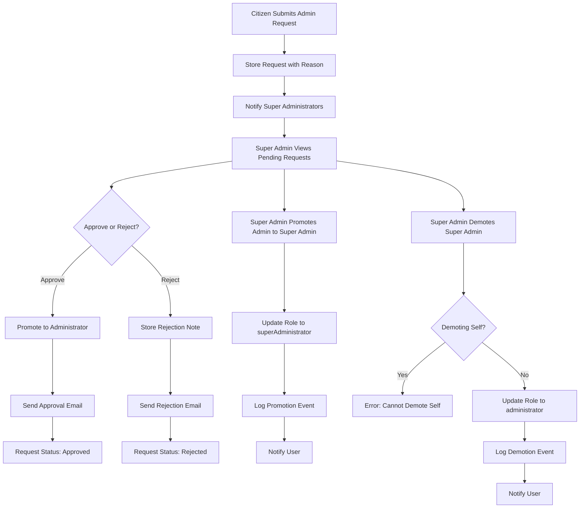

# Economic/Political Discussion Board Requirements Specification

## User Account Management

### Registration

WHEN a new user visits the platform, THE system SHALL allow them to register by providing:
- A valid email address (RFC 5322 format)
- A password with minimum 8 characters
- A display name (minimum 2 alphanumeric characters)

WHEN a user submits a registration request, THE system SHALL:
- Validate the email format and domain
- Check for existing email address in database
- Check for existing display name
- Create a new user account with status "active"
- Generate a unique email verification token
- Send a confirmation email with verification link
- Store password as bcrypt hash with salt

IF the email is already registered, THEN THE system SHALL respond with error code "EMAIL_ALREADY_EXISTS" and display message: "An account with this email already exists."

IF the display name is already taken, THEN THE system SHALL respond with error code "DISPLAY_NAME_TAKEN" and display message: "This display name is already in use. Please choose another."

IF password is less than 8 characters, THEN THE system SHALL respond with error code "PASSWORD_TOO_SHORT" and display message: "Password must be at least 8 characters long."

WHILE the account is unverified, THE system SHALL NOT allow login.

When a user clicks the verification link in email, THE system SHALL:
- Validate verification token against database
- Update account status to "verified"
- Clear verification token from database
- Redirect to login page with confirmation message

IF verification token is invalid or expired (7-day window), THEN THE system SHALL respond with error code "INVALID_VERIFICATION_TOKEN" and display message: "This verification link is invalid or has expired."

IF token is expired, THEN THE system SHALL allow user to request new verification email.

### Login

WHEN a user attempts to log in, THE system SHALL:
- Accept email and password credentials
- Find user by email address
- Verify password against stored hash
- Set active session with JWT access token (15-minute expiration)
- Return refresh token (7-day expiration)

IF email is not found or password does not match, THEN THE system SHALL respond with error code "INVALID_CREDENTIALS" and display message: "Email or password is incorrect."

IF account is unverified, THEN THE system SHALL respond with error code "ACCOUNT_NOT_VERIFIED" and display message: "Please verify your email address before logging in."

WHEN login is successful, THE system SHALL:
- Store session in Redis with TTL of 15 minutes
- Return JWT token with payload:
  {
    "userId": "uuid",
    "role": "citizen|administrator|superAdministrator",
    "permissions": ["read", "write", "edit", "delete", "ban", "admin"],
    "exp": "timestamp"
  }

WHEN a user changes their password, THE system SHALL invalidate all existing sessions.

### Password Change

WHEN an authenticated user requests to change password, THE system SHALL:
- Require current password for verification
- Require new password with minimum 8 characters
- Validate that new password is different from current password
- Update password hash in database

IF current password is incorrect, THEN THE system SHALL respond with error code "INCORRECT_CURRENT_PASSWORD" and display message: "Current password is incorrect."

IF new password is less than 8 characters, THEN THE system SHALL respond with error code "PASSWORD_TOO_SHORT" and display message: "New password must be at least 8 characters long."

IF new password is identical to current password, THEN THE system SHALL respond with error code "PASSWORD_SAME_AS_CURRENT" and display message: "New password must be different from your current password."

WHEN password is successfully changed, THE system SHALL:
- Invalidate all existing sessions
- Require re-login with new password
- Log password change event with timestamp

### Account Deletion

WHEN an authenticated user requests account deletion, THE system SHALL:
- Require confirmation with user password
- Mark account as "deleted" with deletion timestamp
- Remove all articles, comments, and profile information
- Purge personal data from search indexes
- Keep encrypted audit log of deletion event

WHEN an account is deleted, THE system SHALL:
- Immediately invalidate all sessions
- Prevent any future login with credentials
- Replace all content links with "[Deleted User]"
- Store encrypted deletion record with timestamp and user ID

## User Profile Management

### Profile Editing

WHEN an authenticated user edits their profile, THE system SHALL allow updates to:
- Display name (minimum 2 characters, maximum 50)
- Bio text (maximum 500 characters)

WHEN a user changes display name, THE system SHALL:
- Check for name conflicts with existing users
- Validate name format (alphanumeric, underscore, hyphen)

IF display name conflict detected, THEN THE system SHALL respond with error code "DISPLAY_NAME_TAKEN" and display message: "This display name is already in use. Please choose another."

IF display name contains invalid characters, THEN THE system SHALL respond with error code "INVALID_DISPLAY_NAME" and display message: "Display name can only contain letters, numbers, underscores, and hyphens."

IF bio exceeds 500 characters, THEN THE system SHALL respond with error code "BIO_TOO_LONG" and display message: "Bio cannot exceed 500 characters."

### Profile Viewing

WHEN a user views another user's profile, THE system SHALL display:
- Display name
- Bio text
- Number of articles written
- Number of comments written
- Date joined

IF the viewed user's account is deleted, THE system SHALL display "[Deleted User]" instead of display name and bio

IF the viewed user's account is banned, THE system SHALL display "[Banned User]" instead of display name and bio, and hide all content links

THE system SHALL NOT display any private information such as email, password status, or verification status

## Section Management

### Section Listing

WHEN a user requests the list of sections, THE system SHALL return:
- Section ID
- Section name
- Section description
- Number of articles in section
- Creation timestamp

WHEN requesting section list, THE system SHALL NOT return sections with "hidden" status

### Section Creation

WHEN an administrator requests to create a section, THE system SHALL:
- Require section name (minimum 2 characters, maximum 50)
- Require section description (maximum 500 characters)
- Validate section name uniqueness
- Set creation timestamp
- Set status to "active"

IF section name is missing, THEN THE system SHALL respond with error code "SECTION_NAME_REQUIRED" and display message: "Section name is required."

IF section name is less than 2 characters, THEN THE system SHALL respond with error code "SECTION_NAME_TOO_SHORT" and display message: "Section name must be at least 2 characters long."

IF section name exceeds 50 characters, THEN THE system SHALL respond with error code "SECTION_NAME_TOO_LONG" and display message: "Section name cannot exceed 50 characters."

IF section name already exists, THEN THE system SHALL respond with error code "SECTION_EXISTS" and display message: "A section with this name already exists."

IF section description exceeds 500 characters, THEN THE system SHALL respond with error code "SECTION_DESCRIPTION_TOO_LONG" and display message: "Section description cannot exceed 500 characters."

### Section Editing

WHEN an administrator updates a section, THE system SHALL allow edits to:
- Section name (minimum 2, maximum 50)
- Section description (maximum 500)

WHEN section name is changed, THE system SHALL:
- Check for name conflicts with existing sections
- Update all articles with the new section reference

IF section name conflict detected, THEN THE system SHALL respond with error code "SECTION_EXISTS" and display message: "A section with this name already exists."

WHEN section is edited, THE system SHALL log the administrator who made the change and timestamp

### Section Deletion

WHEN an administrator deletes a section, THE system SHALL:
- Associate all articles in the section with "General" section (default)
- Mark section as "deleted" with deletion timestamp
- Prevent new articles from being created in the section
- Keep section name in deleted list for audit purposes

WHEN a section is deleted, THE system SHALL NOT delete any articles or comments

WHEN a deleted section is requested, THE system SHALL return error code "SECTION_NOT_FOUND" with message: "This section has been deleted."

## Article Creation & Management

### Article Creation

WHEN a user creates an article, THE system SHALL require:
- Title (minimum 5 characters, maximum 200)
- Content (minimum 10 characters)
- Section ID (must be active section)

WHEN article is created, THE system SHALL:
- Generate unique article ID
- Set creation timestamp
- Set last edited timestamp
- Associate with user's profile
- Set view count to 0
- Set comment count to 0

IF title is missing, THEN THE system SHALL respond with error code "ARTICLE_TITLE_REQUIRED" and display message: "Article title is required."

IF title is less than 5 characters, THEN THE system SHALL respond with error code "ARTICLE_TITLE_TOO_SHORT" and display message: "Title must be at least 5 characters long."

IF title exceeds 200 characters, THEN THE system SHALL respond with error code "ARTICLE_TITLE_TOO_LONG" and display message: "Title cannot exceed 200 characters."

IF content is missing, THEN THE system SHALL respond with error code "ARTICLE_CONTENT_REQUIRED" and display message: "Article content is required."

IF content is less than 10 characters, THEN THE system SHALL respond with error code "ARTICLE_CONTENT_TOO_SHORT" and display message: "Content must be at least 10 characters long."

IF section is invalid or inactive, THEN THE system SHALL respond with error code "INVALID_SECTION" and display message: "Invalid or inactive section selected."

### Article Editing

WHEN an author edits their own article, THE system SHALL allow edits to:
- Title (maximum 200 characters)
- Content (minimum 10 characters)
- Attached files
- Attached images
- Tags (free text, comma-separated)

WHEN article is edited, THE system SHALL:
- Update last edited timestamp
- Keep original creation timestamp
- Log editor identity

IF article title exceeds 200 characters, THEN THE system SHALL respond with error code "ARTICLE_TITLE_TOO_LONG" and display message: "Title cannot exceed 200 characters."

IF article content exceeds 50,000 characters, THEN THE system SHALL respond with error code "ARTICLE_CONTENT_TOO_LONG" and display message: "Content cannot exceed 50,000 characters."

WHEN adding tags, THE system SHALL accept up to 10 tags per article

WHEN other users attempt to edit an article, THE system SHALL respond with error code "PERMISSION_DENIED" and display message: "You can only edit your own articles."

### Article Deletion

WHEN an author deletes their own article, THE system SHALL:
- Mark article as "deleted" with deletion timestamp
- Remove from section article lists
- Hide article from search results
- Keep article record for audit purposes

WHEN an administrator deletes an article, THE system SHALL:
- Mark article as "deleted by admin" with deletion timestamp and admin ID
- Remove from section article lists
- Hide article from search results
- Keep article record for audit purposes

WHEN an article is deleted, THE system SHALL NOT delete any associated comments

WHEN a deleted article is requested, THE system SHALL return error code "ARTICLE_NOT_FOUND" with message: "This article has been deleted."

## Article Listing & Sorting

### Section Article Listing

WHEN a user views articles in a section, THE system SHALL return:
- Article ID
- Title
- Author display name
- List of tags (maximum 5)
- Comment count
- Creation timestamp
- Status (active/deleted)

THE list SHALL be paginated with 20 articles per page

WHEN page is requested, THE system SHALL validate page number (1-100)

IF page number exceeds 100, THEN THE system SHALL return last page (100)

IF page number is less than 1, THEN THE system SHALL return page 1

### Sorting

WHEN a user requests article listing with sort criteria, THE system SHALL support:
- Newest first (creation timestamp: descending)
- Oldest first (creation timestamp: ascending)

WHEN sort parameter is provided as "newest", THE system SHALL order by creation timestamp DESC

WHEN sort parameter is provided as "oldest", THE system SHALL order by creation timestamp ASC

WHEN sort parameter is not specified, THE system SHALL default to "newest"

## Article Viewing

### Article Display

WHEN a user views an article, THE system SHALL show:
- Title (maximum 200 characters)
- Author display name
- Content (up to 50,000 characters)
- List of attached files with download URLs
- List of attached images with view URLs
- List of tags
- Creation timestamp
- Last edited timestamp
- View count
- Comment count

WHEN an article is deleted, THE system SHALL return error code "ARTICLE_NOT_FOUND" with message: "This article has been deleted."

WHEN a user has been banned, THE system SHALL show content but replace author name with "[Banned User]"

WHEN an author's account is deleted, THE system SHALL replace author name with "[Deleted User]"

### File and Image Downloads

WHEN a user requests to download a file, THE system SHALL:
- Verify article exists and is active
- Verify file attachment exists
- Check user permissions
- Generate temporary signed URL for download
- Increment download counter

WHEN a user requests to view an image, THE system SHALL:
- Verify article exists and is active
- Verify image attachment exists
- Check user permissions
- Return image with optimized display size
- Increment view counter

WHEN file or image request is made with invalid ID, THE system SHALL respond with error code "FILE_NOT_FOUND" and display message: "File or image not found."

## Comment Management

### Comment Posting

WHEN a user posts a comment on an article, THE system SHALL require:
- Content (minimum 2 characters)
- Article ID (must exist and be active)

WHEN comment is posted, THE system SHALL:
- Generate unique comment ID
- Set creation timestamp
- Associate with user profile
- Associate with article ID
- Increment article comment count by 1

IF content is missing, THEN THE system SHALL respond with error code "COMMENT_CONTENT_REQUIRED" and display message: "Comment content is required."

IF content is less than 2 characters, THEN THE system SHALL respond with error code "COMMENT_CONTENT_TOO_SHORT" and display message: "Comment must be at least 2 characters long."

IF content exceeds 1,000 characters, THEN THE system SHALL respond with error code "COMMENT_CONTENT_TOO_LONG" and display message: "Comment cannot exceed 1,000 characters."

IF article does not exist or is deleted, THEN THE system SHALL respond with error code "ARTICLE_NOT_FOUND" and display message: "Cannot comment on deleted article."

### Comment Viewing

WHEN a user views comments on an article, THE system SHALL return:
- Comment ID
- Author display name
- Content
- Creation timestamp
- Status (active/deleted)

Comments SHALL be sorted by creation timestamp ASC (oldest first)

Comments SHALL be paginated with 30 per page

WHEN a comment is deleted, THE system SHALL show:
- "[Deleted Comment]"
- Comment ID
- Deletion timestamp
- Author display name

WHEN an author's account is deleted or banned, THE system SHALL show:
- "[Deleted User]" or "[Banned User]"
- Comment content
- Creation timestamp

### Comment Editing

WHEN an author edits their own comment, THE system SHALL allow edits to:
- Comment content (minimum 2 characters, maximum 1,000)

WHEN a comment is edited, THE system SHALL:
- Update last edited timestamp
- Keep original creation timestamp
- Log editor identity
- Show "edited" indicator on display

WHEN other users attempt to edit a comment, THE system SHALL respond with error code "PERMISSION_DENIED" and display message: "You can only edit your own comments."

IF comment content exceeds 1,000 characters, THEN THE system SHALL respond with error code "COMMENT_CONTENT_TOO_LONG" and display message: "Comment cannot exceed 1,000 characters."

IF comment content is less than 2 characters, THEN THE system SHALL respond with error code "COMMENT_CONTENT_TOO_SHORT" and display message: "Comment must be at least 2 characters long."

### Comment Deletion

WHEN a user deletes their own comment, THE system SHALL:
- Mark comment as "deleted"
- Decrement article comment count by 1
- Keep comment record for audit

WHEN an administrator deletes a comment, THE system SHALL:
- Mark comment as "deleted by admin"
- Decrement article comment count by 1
- Keep comment record with admin ID and deletion reason

WHEN a comment is deleted, THE system SHALL display [Deleted Comment] with creation and deletion timestamp

## Search & Filtering

### Article Search

WHEN a user submits a search query, THE system SHALL:
- Search article titles and content for matching text
- Search article tags for exact matches
- Return results sorted by relevance
- Apply pagination with 20 results per page

THE search SHALL be case-insensitive

THE search SHALL handle special characters appropriately

WHEN search query is empty or only whitespace, THE system SHALL return empty results

WHEN search query is less than 2 characters, THE system SHALL return empty results

### Tag Filtering

WHEN a user applies tag filters, THE system SHALL:
- Filter articles by exact tag matches
- Allow multiple tag filters (AND logic)
- Return results sorted by creation timestamp DESC
- Apply pagination with 20 results per page

IF a tag contains only whitespace, THE system SHALL ignore it

IF a tag contains more than 50 characters, THE system SHALL ignore it

### Search Result Display

WHEN displaying search results, THE system SHALL show:
- Article title
- Snippet of matching content (up to 100 characters)
- Author display name
- Tags
- Creation timestamp
- Section name

THE snippet SHALL highlight matching keywords

WHEN no results are found, THE system SHALL display message: "No articles found matching your search."

## File & Media Attachment

### File Attachment

WHEN a user attaches a file to an article, THE system SHALL:
- Accept any file type
- Allow up to 10 files per article
- Limit total size to 100 MB per article
- Validate file name (alphanumeric, underscore, hyphen, period)
- Generate unique storage path
- Store metadata: filename, size, MIME type, upload timestamp, uploader ID

WHEN file upload fails due to size limit, THE system SHALL respond with error code "FILE_SIZE_EXCEEDED" and display message: "Total file attachments cannot exceed 100 MB for one article."

WHEN file upload fails due to too many files, THE system SHALL respond with error code "TOO_MANY_FILES" and display message: "Maximum 10 files allowed per article."

WHEN file name contains invalid characters, THE system SHALL respond with error code "INVALID_FILENAME" and display message: "File name can only contain letters, numbers, underscores, hyphens, and periods."

### Image Attachment

WHEN a user attaches an image to an article, THE system SHALL:
- Accept JPG, JPEG, PNG, GIF, WEBP formats
- Allow up to 20 images per article
- Limit total size to 50 MB per article
- Generate optimized thumbnails (800x600px)
- Store original and thumbnail versions
- Store metadata: filename, size, MIME type, dimensions, upload timestamp, uploader ID

WHEN image file format is not accepted, THE system SHALL respond with error code "INVALID_IMAGE_FORMAT" and display message: "Only JPG, JPEG, PNG, GIF, and WEBP formats are allowed."

WHEN image file exceeds 50 MB total for article, THE system SHALL respond with error code "IMAGE_SIZE_EXCEEDED" and display message: "Total image attachments cannot exceed 50 MB for one article."

WHEN too many images are uploaded, THE system SHALL respond with error code "TOO_MANY_IMAGES" and display message: "Maximum 20 images allowed per article."

### Download Permissions

WHEN a file or image is downloaded, THE system SHALL:
- Verify the article is active and not deleted
- Verify the user has permission to view the article
- Generate time-limited signed download URL (5-minute expiration)
- Log download event

THE system SHALL NOT provide direct file system paths

## Administrator System

### Administrator Request

WHEN a citizen submits an administrator request, THE system SHALL:
- Require reason text (minimum 10 characters)
- Store request with timestamp
- Set status to "pending"
- Add to list of pending requests

WHEN reason is less than 10 characters, THEN THE system SHALL respond with error code "REQUEST_REASON_TOO_SHORT" and display message: "Reason for administrator request must be at least 10 characters long."

WHEN user is already an administrator, THEN THE system SHALL respond with error code "ALREADY_ADMIN" and display message: "You are already an administrator."

### Admin Approval

WHEN a super administrator approves an admin request, THE system SHALL:
- Update request status to "approved"
- Promote user to "administrator" role
- Add administrator permission rights
- Notify user via email

WHEN a super administrator rejects an admin request, THE system SHALL:
- Update request status to "rejected"
- Notify user with rejection reason
- Keep request record for audit

### Admin Promotion

WHEN a super administrator promotes a regular administrator, THE system SHALL:
- Change user role from "administrator" to "superAdministrator"
- Grant all super administrator permissions
- Log promotion event with timestamps and actor IDs

WHEN a super administrator attempts to promote a non-administrator, THE system SHALL respond with error code "NOT_AN_ADMIN" and display message: "Cannot promote user who is not a regular administrator."

### Admin Demotion

WHEN a super administrator demotes another super administrator, THE system SHALL:
- Change user role from "superAdministrator" to "administrator"
- Remove super administrator privileges
- Log demotion event with timestamps and actor IDs

WHEN a super administrator attempts to demote themselves, THE system SHALL respond with error code "CANNOT_DEMOTE_SELF" and display message: "Super administrators cannot demote themselves."

WHEN a super administrator demotes a regular administrator, THE system SHALL respond with error code "NOT_SUPER_ADMIN" and display message: "Only super administrators can be demoted by other super administrators."

### Content Deletion

WHEN an administrator deletes any article or comment, THE system SHALL:
- Mark the content as "deleted by admin"
- Store administrator ID and timestamp
- Preserve original content for audit
- Notify the original author via email (if account is active)

WHEN an administrator deletes an article, THE system SHALL NOT delete any associated comments

WHEN an administrator deletes a comment, THE system SHALL decrement the article's comment count

### User Banning

WHEN an administrator bans a user, THE system SHALL:
- Mark the account as "banned"
- Record ban reason (minimum 10 characters)
- Record ban timestamp and administrator who issued ban
- Delete all active sessions
- Prevent login attempts
- Keep all existing articles and comments visible

WHEN ban reason is less than 10 characters, THE system SHALL respond with error code "BAN_REASON_TOO_SHORT" and display message: "Ban reason must be at least 10 characters long."

WHEN an administrator bans their own account, THE system SHALL respond with error code "CANNOT_BAN_SELF" and display message: "Administrators cannot ban themselves."

WHEN a banned user attempts to log in, THE system SHALL respond with error code "ACCOUNT_BANNED" and display message: "Your account has been banned. Contact an administrator for more information."

### User Unbanning

WHEN an administrator unbans a user, THE system SHALL:
- Mark account as "active"
- Record unban timestamp and administrator ID
- Allow login attempts
- Notify user via email

WHEN an administrator unbans a non-banned user, THE system SHALL respond with error code "USER_NOT_BANNED" and display message: "This user is not currently banned."

### Admin Banned User Listing

WHEN an administrator requests list of banned users, THE system SHALL return:
- User ID
- Display name (or "[Deleted User]" if deleted)
- Ban reason
- Ban timestamp
- Administrator who banned
- Status (banned/unbanned)

THE list SHALL be paginated with 25 users per page

THE list SHALL be filterable by ban status (banned/unbanned)

THE list SHALL be sortable by ban timestamp (newest or oldest first)

## Authentication and Authorization

### User Roles

THE system SHALL define the following roles with corresponding permissions:

- **citizen**: Regular user with standard privileges
- **administrator**: Has all citizen privileges plus administrative controls
- **superAdministrator**: Has all administrator privileges with additional elevated permissions

### Permission Matrix

| Action | Citizen | Administrator | Super Administrator |
|--------|---------|---------------|---------------------|
| Register account | ✅ | ✅ | ✅ |
| Login | ✅ | ✅ | ✅ |
| Logout | ✅ | ✅ | ✅ |
| Change password | ✅ | ✅ | ✅ |
| Delete own account | ✅ | ✅ | ✅ |
| Edit own profile | ✅ | ✅ | ✅ |
| View other profiles | ✅ | ✅ | ✅ |
| Create article | ✅ | ✅ | ✅ |
| Edit own article | ✅ | ✅ | ✅ |
| Delete own article | ✅ | ✅ | ✅ |
| Attach files | ✅ | ✅ | ✅ |
| Add tags | ✅ | ✅ | ✅ |
| Comment on articles | ✅ | ✅ | ✅ |
| Edit own comment | ✅ | ✅ | ✅ |
| Delete own comment | ✅ | ✅ | ✅ |
| Create section | ❌ | ✅ | ✅ |
| Edit section | ❌ | ✅ | ✅ |
| Delete section | ❌ | ✅ | ✅ |
| Delete any article | ❌ | ✅ | ✅ |
| Delete any comment | ❌ | ✅ | ✅ |
| Ban user | ❌ | ✅ | ✅ |
| Unban user | ❌ | ✅ | ✅ |
| View banned users list | ❌ | ✅ | ✅ |
| Submit admin request | ✅ | ✅ | ❌ |
| Approve admin request | ❌ | ❌ | ✅ |
| Reject admin request | ❌ | ❌ | ✅ |
| Promote to admin | ❌ | ❌ | ✅ |
| Demote admin | ❌ | ❌ | ✅ |
| Demote self | ❌ | ❌ | ❌ |

### Session Management

WHEN a user logs in, THE system SHALL generate:
- Access token (JWT, 15-minute expiration)
- Refresh token (JWT, 7-day expiration, stored in httpOnly, Secure cookie)

WHEN a user changes password, THE system SHALL:
- Immediately invalidate all active sessions
- Invalidate all refresh tokens
- Require re-authentication

WHEN a user's account is banned, THE system SHALL:
- Immediately invalidate all active sessions
- Invalidate all refresh tokens
- Prevent login attempts

WHEN a user is promoted to administrator, THE system SHALL:
- Update permissions in JWT payload
- Invalidate all existing sessions
- Require re-authentication

WHEN a user is demoted from super administrator, THE system SHALL:
- Update permissions in JWT payload
- Invalidate all existing sessions
- Require re-authentication

## Error Handling

### User-Facing Error Responses

WHEN an error occurs, THE system SHALL:
- Return HTTP status code 4xx or 5xx as appropriate
- Include machine-readable error code
- Include human-readable message in English
- Avoid exposing internal system details
- Log errors for server-side monitoring

EXAMPLES:
- 400: EMAIL_EXISTS
- 401: INVALID_CREDENTIALS
- 403: PERMISSION_DENIED
- 404: ARTICLE_NOT_FOUND
- 429: TOO_MANY_REQUESTS
- 500: INTERNAL_SERVER_ERROR

### System-Level Error Handling

WHEN authentication fails, THE system SHALL:
- Return 401 Unauthorized
- Do not distinguish between invalid email and invalid password
- Rate-limit authentication attempts (5 attempts/minute)

WHEN file upload fails, THE system SHALL:
- Return 400 Bad Request with specific error code
- Clean up partial uploads
- Log upload failure with file hash

WHEN database connection fails, THE system SHALL:
- Return 503 Service Unavailable
- Log connection failure
- Reattempt connection with exponential backoff
- Gracefully degrade functionality if possible

## System Performance & Scalability

THE system SHALL:
- Load article lists within 1.2 seconds for <500 articles
- Load individual article pages within 1.5 seconds
- Respond to search queries within 0.8 seconds for common terms
- Process file uploads with progressive feedback and under 30 seconds for 50MB files
- Handle concurrent users up to 5,000 with <2% error rate

## Authentication Workflow Diagram

```mermaid
graph TD
    A[User Visits Platform] --> B[Registration or Login]
    B --> C{Is registered?}
    C -->|No| D[Registration Flow]
    C -->|Yes| E[Login Flow]
    D --> F[Submit Email, Password, Display Name]
    F --> G[Validate Input]
    G --> H[Send Verification Email]
    H --> I[Wait for Email Verification]
    I --> J[Verification Link Clicked]
    J --> K[Update Account Status to "Verified"]
    K --> L[Redirect to Login]
    E --> M[Submit Email and Password]
    M --> N[Validate Credentials]
    N --> O{Valid?}
    O -->|No| P[Return INVALID_CREDENTIALS]
    O -->|Yes| Q[Check Account Status]
    Q --> R{Verified?}
    R -->|No| S[Return ACCOUNT_NOT_VERIFIED]
    R -->|Yes| T{Banned?}
    T -->|Yes| U[Return ACCOUNT_BANNED]
    T -->|No| V[Generate JWT Access Token]
    V --> W[Generate JWT Refresh Token]
    W --> X[Set Secure Cookie]
    X --> Y[Return Access Token]
    Y --> Z[User Session Active]
```

## Article Creation Workflow

```mermaid
graph TD
    A[User Clicks "New Article"] --> B[Select Section]
    B --> C[Enter Title]
    C --> D[Enter Content]
    D --> E[Add Tags]
    E --> F[Attach Files/Images]
    F --> G[Click "Publish"]
    G --> H[Validate Required Fields]
    H --> I{Valid?}
    I -->|No| J[Show Validation Errors]
    I -->|Yes| K[Save Article to Database]
    K --> L[Generate Article ID]
    L --> M[Create File Records in Storage]
    M --> N[Index Article in Search]
    N --> O[Redirect to Article]
```

## Comment Workflow

```mermaid
graph TD
    A[User Views Article] --> B[Scroll to Comments]
    B --> C[Click "Add Comment"]
    C --> D[Enter Comment Content]
    D --> E[Click "Submit"]
    E --> F[Validate Comment Length]
    F --> G{Valid?}
    G -->|No| H[Show Error: "Must be at least 2 characters"]
    G -->|Yes| I[Save Comment to Database]
    I --> J[Increment Article Comment Count]
    J --> K[Return Comment with Timestamp]
    K --> L[Display New Comment]
```

## Administrator Management Workflow



## Banning System Workflow

```mermaid
graph TD
    A[Admin Selects User to Ban] --> B[Enter Ban Reason (Min 10 chars)]
    B --> C[Click "Ban"]
    C --> D[Validate Reason Length]
    D --> E{Valid?}
    E -->|No| F[Error: "Reason must be at least 10 characters"]
    E -->|Yes| G[Mark Account as "Banned"]
    G --> H[Record Ban Reason and Admin ID]
    H --> I[Delete Active Sessions]
    I --> J[Prevent Further Logins]
    J --> K[Show "Banned User" Profile]
    K --> L[Preserve Articles and Comments]
    L --> M[Add to Banned Users List]
    
    N[Admin Selects Banned User] --> O[Click "Unban"]
    O --> P[Mark Account as "Active"]
    P --> Q[Record Unban Timestamp and Admin ID]
    Q --> R[Remove from Banned List]
    R --> S[Send Unban Notification]
    S --> T[Allow Login Again]
```

## Search & Tag Filtering Workflow

```mermaid
graph TD
    A[User Enters Search Query] --> B[Validate Query Length (Min 2 chars)]
    B --> C{Valid?}
    C -->|No| D[Show "Search too short" message]
    C -->|Yes| E[Search Titles and Content]
    E --> F[Apply Tag Filters (AND logic)]
    F --> G[Sort by Relevance]
    G --> H[Paginate Results (20 per page)]
    H --> I[Display Results with Snippets]
    I --> J[Highlight Keywords]
    J --> K[Show "No results" if empty]
```

## File Upload Workflow

```mermaid
graph TD
    A[User Clicks Attachment Button] --> B[Select File]
    B --> C[Validate File Size]
    C --> D{Within limits?}
    D -->|No| E[Show "File too large" error]
    D -->|Yes| F[Validate File Type]
    F --> G{Allowed type?}
    G -->|No| H[Show "Invalid file type" error]
    G -->|Yes| I[Generate Unique Filename]
    I --> J[Upload to Storage]
    J --> K[Record Metadata in Database]
    K --> L[Associate with Article]
    L --> M[Show Preview]
    M --> N[User Clicks Save]
    N --> O[Finalize Article with Attachments]
```

## System Architecture Overview

THE system shall be implemented as a single NestJS application with modular architecture:

- **Modules**: auth, user, section, article, comment, admin, file, search, system
- **Services**: UserService, SectionService, ArticleService, CommentService, AdminService, FileService, SearchService
- **Controllers**: AuthController, UserController, SectionController, ArticleController, CommentController, AdminController, FileController, SearchController
- **DTOs**: CreateUserDto, LoginDto, ArticleDto, CommentDto, AdminRequestDto, BanDto, SearchQueryDto
- **Entities**: User, Section, Article, Comment, FileAttachment, AdminRequest, BanRecord
- **Prisma Schema**: Single database with properly normalized tables
- **File Storage**: S3-compatible object storage with CDN
- **Authentication**: JWT with access and refresh tokens
- **Session Management**: Redis cache for active sessions
- **Search**: Elasticsearch or PostgreSQL full-text search
- **Caching**: Redis for frequent queries (sections, article lists)
- **Monitoring**: Sentry for error tracking, Prometheus for metrics

## Operational Constraints

THE system SHALL ensure all operations are logged with sufficient audit trail:

- All user actions (login, logout, password change)
- All admin actions (section management, article deletion, user banning)
- All system events (database connection, file upload, search queries)

ALL audit logs SHALL preserve:
- Timestamp (Asia/Seoul timezone)
- User ID
- Actor role
- Action performed
- Affected resource ID
- Reason/notes (where applicable)

## Maintenance & Upgrades

- All database migrations SHALL be managed via Prisma migrations
- All configuration SHALL be environment-variable driven
- All secrets SHALL be stored in AWS Secrets Manager or equivalent
- All dependencies SHALL be pinned to specific versions
- All deployments SHALL be through CI/CD pipeline with automated testing

## Legal & Compliance

- All personal data shall be processed in compliance with GDPR
- Data retention policies SHALL be defined for different data types
- Users SHALL have right to access, export, and delete their data
- Banned user data SHALL be retained for audit purposes only
- All data transfers SHALL be encrypted (TLS 1.3)

---

> *Developer Note: This document defines **business requirements only**. All technical implementations (architecture, APIs, database design, etc.) are at the discretion of the development team.*