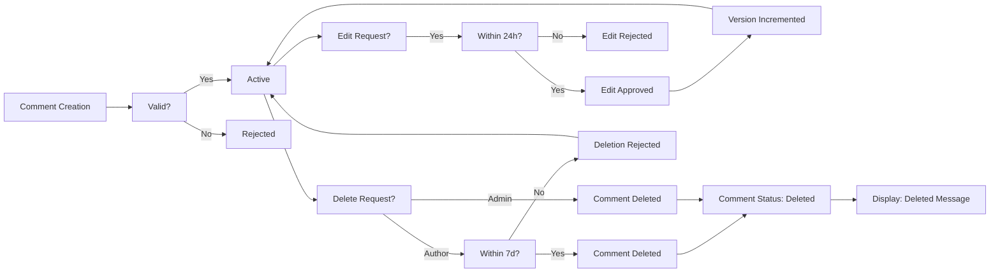

# Economic/Political Discussion Board Requirements Specification

## User Account Management

### User Registration

WHEN a new user accesses the platform, THE system SHALL provide a registration form requiring:
- Email address (must be unique, valid email format)
- Password (minimum 8 characters, must contain at least one uppercase letter, one lowercase letter, one number, and one special character)

THE system SHALL validate the email address format using standard RFC 5322 validation rules.

THE system SHALL verify that no existing account uses the provided email address.

IF the email is already registered, THE system SHALL return HTTP 409 conflict with error code EMAIL_IN_USE.

IF the password does not meet complexity requirements, THE system SHALL return HTTP 400 bad request with error code PASSWORD_COMPLEXITY_FAILED.

WHEN registration is successful, THE system SHALL:
- Create a unique user ID
- Store the email address hashed with BCrypt (cost factor 12)
- Store the password hashed with BCrypt (cost factor 12)
- Set account status to "active"
- Set registration timestamp (Asia/Seoul timezone)
- Create default profile with display name as email address prefix and empty bio
- Send a verification email (optional for initial version)

WHEN a user completes registration, THE system SHALL automatically log the user in by creating a secure authentication session.

### User Login

WHEN a user attempts to log in, THE system SHALL require:
- Email address
- Password

THE system SHALL verify the email exists and has active status.

THE system SHALL compare the provided password against the stored hash using BCrypt comparison.

IF the email is not found, THE system SHALL return HTTP 401 unauthorized with error code INVALID_CREDENTIALS.

IF the password does not match, THE system SHALL return HTTP 401 unauthorized with error code INVALID_CREDENTIALS.

IF the account is banned, THE system SHALL return HTTP 403 forbidden with error code ACCOUNT_BANNED.

WHEN login is successful, THE system SHALL:
- Generate a JWT token with user ID, role, expiration (24 hours), and refresh capability
- Store refresh token hashed (SHA256) in database with creation timestamp
- Set login timestamp to current time (Asia/Seoul timezone)
- Return JWT token and refresh token to client
- Increment login count by 1

THE system SHALL enforce a maximum of 5 failed login attempts within 15 minutes per IP address, after which temporary account lockout occurs for 30 minutes.

### Password Change

WHEN an authenticated user requests a password change, THE system SHALL require:
- Current password
- New password (minimum 8 characters, must contain at least one uppercase letter, one lowercase letter, one number, and one special character)
- Confirm new password

THE system SHALL verify that:
- The current password matches the stored hash
- The new password meets complexity requirements
- The new password confirmation matches the new password
- The new password is different from the current password

IF any validation fails, THE system SHALL return appropriate HTTP 400 error with specific error code:
- CURRENT_PASSWORD_INCORRECT
- NEW_PASSWORD_COMPLEXITY_FAILED
- NEW_PASSWORD_MISMATCH
- NEW_PASSWORD_SAME_AS_CURRENT

WHEN password change is successful, THE system SHALL:
- Update the password hash to new value (BCrypt cost factor 12)
- Clear all existing refresh tokens
- Invalidate all existing sessions
- Record password change timestamp
- Send notification email to user

THE system SHALL allow password change only for authenticated users with active account status.

### Account Deletion

WHEN an authenticated user requests account deletion, THE system SHALL:
- Verify the user is authenticated
- Confirm deletion with user (show confirmation message about data destruction)
- Require password re-authentication

THE system SHALL NOT allow deletion if:
- The user is currently banned
- The account has been deleted previously
- The account is linked to active administrative roles with pending requests

WHEN deletion is confirmed, THE system SHALL:
- Mark account status as "deleted"
- Set deletion timestamp (Asia/Seoul timezone)
- Clear all sensitive data (email, password, phone numbers)
- Preserve only the user ID for referential integrity
- Delete all associated articles, comments, and personal data
- Set display name to "[Deleted User]" in all references
- Set bio to "[This user's account has been deleted]"
- Remove all uploaded files and image references
- Purge all session data except for audit records
- Set privacy policy opt-in state to "revoked"

A deleted account CANNOT be restored.

## User Profile System

### Profile Structure

THE system SHALL maintain the following profile fields for each user:
- Display name (string, maximum 50 characters, visible to all users)
- Bio (text field, maximum 500 characters, visible to all users)
- Join date (timestamp in Asia/Seoul timezone, visible to all users)
- Login count (integer, visible only to admin users)
- Last login timestamp (timestamp in Asia/Seoul timezone, visible only to admin users)
- Account status (active, deleted, banned - visible to all users)
- Profile picture URL (optional, file reference, visible to all users)
- Total articles written (integer, calculated, visible to all users)
- Total comments written (integer, calculated, visible to all users)

WHEN a profile is viewed, THE system SHALL only expose:
- Display name
- Bio
- Join date
- Profile picture (if exists)
- Total articles written
- Total comments written
- Account status

THE system SHALL NOT expose:
- Email address
- Phone number
- Login count
- Last login timestamp

### Profile Editing

WHEN an authenticated user updates their profile, THE system SHALL allow editing of:
- Display name (max 50 characters)
- Bio (max 500 characters)
- Profile picture (upload new or remove existing)

FOR display name editing:
- Must be between 1 and 50 characters
- Cannot contain only whitespace
- Cannot be a reserved name (e.g., "System", "Admin", "Moderator")
- Cannot duplicate an existing display name

IF the display name is invalid, THE system SHALL return HTTP 400 error with error code INVALID_DISPLAY_NAME.

IF the display name is already taken, THE system SHALL return HTTP 409 error with error code DISPLAY_NAME_IN_USE.

FOR bio editing:
- Must be between 0 and 500 characters
- Must be plain text (no HTML markup)
- Any HTML tags will be stripped
- Leading/trailing whitespace will be trimmed

FOR profile picture:
- Supported formats: PNG, JPG, JPEG, GIF (max 5MB)
- Dimensions: minimum 100x100 pixels, maximum 1024x1024 pixels
- File name will be hashed to prevent directory traversal attacks
- Image will be resized to 300x300 pixels for standard display
- Original file will be stored with versioning for potential restoration

WHEN profile is updated successfully, THE system SHALL:
- Update the respective profile fields
- Record update timestamp
- Return updated profile object

### Profile Views

WHEN a user views another user's profile, THE system SHALL display:
- Display name
- Bio
- Profile picture
- Join date (formatted as "YYYY-MM-DD")
- Total articles written
- Total comments written
- Current account status

WHEN viewing one's own profile, THE system SHALL also display:
- Last login timestamp
- Account creation date
- Total time on platform (calculated)

WHEN viewing an account that has been deleted, THE system SHALL display:
- "[Deleted User]" for display name
- "[This user's account has been deleted]" for bio
- Profile picture placeholder
- Deletion date
- No article or comment counts

WHEN viewing a banned user profile, THE system SHALL display:
- Display name and bio as originally set
- "Banned" status indicator
- "Banned on [date]" message
- Reason for ban (visible only to administrators)
- Total articles and comments visible

WHEN viewing profile of a user who has never written articles or comments, THE system SHALL display "0" for both counts.

## Section Management System

### Section Attributes

THE system SHALL define sections with the following attributes for each section:
- Section ID (UUID, unique, system-generated)
- Name (string, unique, max 30 characters)
- Description (text, max 500 characters)
- Created by (user ID of admin who created)
- Created at (timestamp in Asia/Seoul timezone)
- Updated at (timestamp in Asia/Seoul timezone)
- Status (active, archived)
- Article count (integer, calculated)

FOR section name:
- Must be between 2 and 30 characters
- Must contain at least one letter
- Must be unique
- Cannot be reserved names: "admin", "system", "root", "guest", "anonymous"
- Cannot contain special characters except spaces, hyphens, underscores
- Must be alphanumeric with allowed special characters
- Will be normalized to title case when displayed

FOR section description:
- Maximum 500 characters
- No HTML markup allowed
- Any HTML will be stripped
- Leading/trailing whitespace will be trimmed
- Must be meaningful text

WHEN a section is created in an active state, THE system SHALL automatically set article count to 0.

WHEN a section is archived, THE system SHALL:
- Set status to "archived"
- Prevent new articles from being created in it
- Allow existing articles to remain visible
- Allow comments on existing articles
- Not appear in public section list

WHEN a section is activated from archived state, THE system SHALL:
- Set status to "active"
- Show in public section list
- Allow new articles to be created

### Section Creation

WHEN an administrator requests to create a new section, THE system SHALL validate:
- The user has administrator privileges (regular or super)
- The section name is unique
- The section name meets formatting requirements
- The section description is not empty

IF validation fails, THE system SHALL return appropriate HTTP error code:
- 403 FORBIDDEN if user lacks privileges
- 409 CONFLICT if section name exists
- 400 BAD REQUEST for name/description formatting errors

WHEN section creation is successful, THE system SHALL:
- Generate a new UUID section ID
- Set created by to the authenticating administrator's ID
- Set created at to current time (Asia/Seoul timezone)
- Set updated at to same value as created at
- Set status to "active"
- Set article count to 0
- Log the action in administrator audit log
- Return the new section object

THE system SHALL NOT allow section creation by regular users.

### Section Editing

WHEN an administrator requests to edit a section, THE system SHALL validate:
- The user has administrator privileges
- The section exists and is not archived (unless editing to archive/unarchive)

FOR editable fields:
- Section name (max 30 characters, unique constraint)
- Section description (max 500 characters)
- Status (active/archived)

THE system SHALL NOT allow editing of:
- Created by
- Created at
- Updated at
- Article count

IF section name is changed and conflicts with existing section, THE system SHALL return HTTP 409 CONFLICT with error code SECTION_NAME_IN_USE.

IF section description is empty after trimming, THE system SHALL reject with HTTP 400 BAD REQUEST with error code SECTION_DESCRIPTION_EMPTY.

WHEN section editing is successful, THE system SHALL:
- Update the changed fields
- Set updated at to current timestamp
- Log the change in audit history
- Return updated section object

### Section Deletion

WHEN an administrator requests to delete a section, THE system SHALL validate:
- The user has administrator privileges
- The section exists
- The section has no articles attached (article count = 0)

IF section has articles, THE system SHALL reject with HTTP 403 FORBIDDEN with error code SECTION_HAS_ARTICLES.

IF deletion is approved, THE system SHALL:
- Set status to "deleted" (soft delete)
- Record deletion timestamp
- Remove section from public section list
- Preserve section data for audit purposes
- Log the deletion action

THE system SHALL NOT remove the section record entirely.

THE system SHALL maintain all archived sections in the system until explicitly purged by super administrator.

### Section Listing

WHEN a user requests the list of sections, THE system SHALL return:
- All sections with status "active"
- For each section: ID, name, description, article count
- Sorted alphabetically by name
- Paginated in batches of 20 sections

WHEN an administrator requests the section list, THE system SHALL include:
- All sections (active and archived)
- For each section: ID, name, description, status, article count, created by, created at, updated at
- Sorted by status (active first), then alphabetically by name
- Paginated in batches of 20 sections

WHEN a section is removed (status changed to deleted), THE system SHALL NOT appear in any section listing.

## Article Management System

### Article Attributes

THE system SHALL define articles with the following attributes:
- Article ID (UUID, auto-generated)
- Title (string, required, 1-200 characters)
- Content (text, required, 1-10,000 characters)
- Section ID (UUID, required, references active section)
- Author ID (UUID, references user ID)
- Created at (timestamp in Asia/Seoul timezone)
- Updated at (timestamp in Asia/Seoul timezone)
- Status (active, deleted)
- Tag list (array of strings, max 10 tags, each max 50 characters)
- File attachments (array of file references, max 5)
- Image attachments (array of image references, max 5)
- Comment count (integer, calculated)
- View count (integer, incremented on each view)
- Last viewed at (timestamp)

FOR title:
- Minimum 1 character, maximum 200 characters
- Must contain at least one non-whitespace character
- Leading/trailing whitespace will be trimmed
- HTML tags will be stripped

FOR content:
- Minimum 1 character, maximum 10,000 characters
- Must contain at least one non-whitespace character
- Leading/trailing whitespace will be trimmed
- Any HTML tags will be stripped and rendered as plain text
- Allow line breaks (\n) for formatting

FOR section ID:
- Must reference an existing and active section
- If section no longer exists or is archived, article will remain but display "[Unknown Section]" as section name

FOR author ID:
- Automatically set to authenticated user ID during creation
- Cannot be changed after creation

FOR tags:
- Maximum 10 tags per article
- Each tag must be 1-50 characters long
- Tags will be normalized: trimmed, lowercased, converted to single spaces for multiple spaces
- Special characters allowed: alphanumeric, hyphen, underscore, space
- Duplicate tags will be automatically removed

FOR file and image attachments:
- Files: max 5, each up to 10MB
- Images: max 5, each up to 5MB
- Supported file formats: PDF, DOC, DOCX, TXT, ZIP, RAR, MP3, MP4 (files); PNG, JPG, JPEG, GIF, WEBP (images)
- File names will be hashed using UUID to prevent directory traversal
- Files will be stored in segmented directory structure based on article ID
- Original file name will be preserved in metadata
- File URLs will be time-limited signed URLs (valid for 24 hours)

FOR comment count:
- Must always reflect accurate count of active comments on the article
- Must update in real-time when comments are created or deleted
- Stored as denormalized field on article for performance

FOR view count:
- Incremented on each article view (after 10 seconds of inactivity)
- Not incremented for the same user within 5 minutes
- Not incremented for administrators
- Reset to 0 when article status changes from deleted to active

### Article Creation

WHEN an authenticated user creates an article, THE system SHALL require:
- Title (1-200 characters)
- Content (1-10,000 characters)
- Section ID (must reference an active section)
- Optional: 0-10 tags
- Optional: 0-5 file attachments
- Optional: 0-5 image attachments

THE system SHALL validate:
- User is authenticated
- Section exists and is active
- Title meets length requirements
- Content meets length requirements
- Number of tags does not exceed 10
- Number of files does not exceed 5
- Number of images does not exceed 5
- All attached files have valid formats
- All attached images have valid formats

IF any validation fails, THE system SHALL return appropriate HTTP error code and description:
- 401 UNAUTHORIZED if not authenticated
- 403 FORBIDDEN if section is archived
- 400 BAD REQUEST for validation failures

WHEN article creation is successful, THE system SHALL:
- Generate unique article ID
- Set author ID to authenticated user ID
- Set created at to current time (Asia/Seoul timezone)
- Set updated at to same value
- Set status to "active"
- Set comment count to 0
- Set view count to 0
- Store normalized tags
- Store file and image references
- Increment section article count
- Log creation in audit trail
- Return created article object

### Article Editing

WHEN an authenticated user attempts to edit an article, THE system SHALL require:
- Article ID
- Optional: New title
- Optional: New content
- Optional: New list of tags (replacement, not incremental)
- Optional: New list of file attachments (replacement)
- Optional: New list of image attachments (replacement)

THE system SHALL validate:
- User is authenticated
- User is the author of the article
- Article exists and is active
- If title is provided, it meets length requirements
- If content is provided, it meets length requirements
- If tags are provided, count ≤ 10 and each ≤ 50 characters
- If files are provided, count ≤ 5 and formats valid
- If images are provided, count ≤ 5 and formats valid

IF validation fails, THE system SHALL return appropriate HTTP error code and description:
- 401 UNAUTHORIZED if not authenticated
- 403 FORBIDDEN if user is not author
- 404 NOT FOUND if article doesn't exist
- 400 BAD REQUEST for validation failures

WHEN article editing is successful, THE system SHALL:
- Update changed fields
- Set updated at to current timestamp
- Preserve original timestamps (created at, author ID)
- Update tag list completely (replacement)
- Update file and image attachment lists completely (replacement)
- Clear any removed file/image references
- Log edit action in audit trail
- Return updated article object

THE system SHALL NOT allow editing of:
- Article ID
- Author ID
- Created at
- Comment count
- View count

### Article Deletion

WHEN an authenticated user attempts to delete an article, THE system SHALL validate:
- User is authenticated
- User is the article author
- Article exists and is active

IF validation fails, THE system SHALL return:
- 401 UNAUTHORIZED if not authenticated
- 403 FORBIDDEN if user is not author
- 404 NOT FOUND if article doesn't exist

IF deletion is approved, THE system SHALL:
- Set article status to "deleted"
- Set deletion timestamp
- Preserve all content for audit
- Decrement section's article count
- Remove all associated file and image references but preserve storage
- Set comment count to 0
- Clear view count
- Log deletion in audit trail

WHEN an administrator attempts to delete an article, THE system SHALL NOT require authorship validation.

WHEN an article is deleted by an administrator, THE system SHALL record:
- Administrator ID who deleted it
- Timestamp of deletion
- Reason provided for deletion (optional, max 500 characters)

### Article File and Image Management

WHEN a file or image is uploaded for an article, THE system SHALL:
- Generate a unique filename using UUID (to prevent conflicts)
- Store the original filename in metadata
- Apply format and size validation
- Resize images to 1024x1024 maximum dimensions
- Compress images to 80% quality (for JPEG/WebP)
- Store in protected storage directory
- Generate signed URL for 24-hour access
- Return storage path, original name, and signed URL

WHEN a file or image attachment is removed from an article, THE system SHALL:
- Remove the reference from the article's attachment array
- Mark the file for cleanup
- Keep file for 30 days then permanently delete

WHEN an article is deleted, THE system SHALL:
- Flag all attached files/images for purge in 30 days
- Remove all references
- Keep files available for audit purposes

WHEN a file or image is accessed via signed URL, THE system SHALL:
- Validate the signature
- Check expiration (24 hours)
- Restrict access to users who have permission to view the article
- Log access attempts

### Article Listing

WHEN a user requests the list of articles in a section, THE system SHALL return:
- Only articles with status "active" and in the specified section
- Each item containing:
  - Article ID
  - Title (truncated to 70 characters if longer)
  - Author display name
  - Created at timestamp (formatted as "YYYY-MM-DD HH:mm")
  - Comment count
  - Tag list (first 3 tags only)
- Paginated results with 20 articles per page
- Sorted by creation timestamp (newest first) by default
- Optionally sorted by oldest first when requested

WHEN sorting by "newest first", THE system SHALL order by created at DESC.

WHEN sorting by "oldest first", THE system SHALL order by created at ASC.

WHEN pagination is requested, THE system SHALL support parameters:
- page (integer, 1-indexed)
- limit (integer, fixed at 20)
- sort (string: "newest" or "oldest")

IF page requested exceeds total pages, THE system SHALL return empty array with next page = null.

WHEN a section is specified but does not exist or is archived, THE system SHALL return 404 error with error code SECTION_NOT_FOUND.

### Article Viewing

WHEN a user views a single article, THE system SHALL return:
- Article ID
- Title
- Content (full, formatted with line breaks preserved)
- Author display name
- Section name
- Created at timestamp (formatted as "YYYY-MM-DD HH:mm:ss")
- Updated at timestamp (if different from created at)
- Comment count
- View count
- Tag list (all tags)
- File attachments: original name, size, download URL, timestamp
- Image attachments: original name, size, preview URL, timestamp

WHEN viewing an article, THE system SHALL:
- Increment view count and last viewed at timestamp (unless viewed by same user within 5 minutes)
- Check if user is the author for edit/delete permissions
- Check if user is administrator for deletion permissions
- Check if article has been deleted (return 404 if so)
- Check if section has been archived (still show article content)
- Return file and image URLs as time-limited signed URLs (24-hour expiration)

WHO can view article content:
- Authenticated users
- Unauthenticated (guest) users
- Banned users
- Administrators

WHEN the article has been authored by a deleted user:
- Display author as "[Deleted User]"
- Hide any profile links
- Display "[This author's account has been deleted]" in author bio placeholder

When the article has been authored by a banned user:
- Display author name as original
- Display "[Banned User]" status indicator
- Show ban date if visible to user

## Search and Filtering System

### Search Functionality

WHEN a user performs a search, THE system SHALL allow searching by:
- Article title (case-insensitive partial match)
- Article content (case-insensitive partial match)

THE system SHALL NOT allow searching by:
- Author name
- Section name
- Tags (handled separately via filtering)
- Comments

THE search shall be performed using full-text search with PostgreSQL tsvector indexing.

When search query is submitted, THE system SHALL:
- Trim whitespace and normalize
- Split into terms using whitespace
- Apply boolean OR search across title and content
- Return articles where any term matches title or content

THE search results shall be:
- Paginated (20 results per page)
- Sorted by relevance score (based on term frequency)
- Sorted by creation date descending when relevance is equal

THE system SHALL support pagination parameters:
- page (integer, 1-indexed)
- limit (integer, fixed at 20)
- sort (string: "relevance" or "newest" or "oldest")

WHEN search returns no results, THE system SHALL return empty array without error.

WHEN search query is empty or contains only whitespace, THE system SHALL return results for all articles in the system (default view).

### Tag Filtering

WHEN a user applies tag filtering, THE system SHALL:
- Allow selection of one or more tags (comma-separated)
- Filter articles that contain ALL specified tags (intersection)
- Match tags case-insensitively after standardization
- Normalize tags by lowercasing and trimming

IF a tag in the filter does not exist in any article, THE system SHALL return no results.

THE system SHALL support searching with tag filter and search term simultaneously:
- Search term must match title or content
- Tags must be present in article's tag list

WHEN a tag is clicked, THE system SHALL combine it with current search term and page position.

WHEN a tag filter is cleared, THE system SHALL remove that tag from filtering criteria.

WHEN a user visits a tag directly (via URL), THE system SHALL:
- Pre-populate tag filter
- Return articles containing that tag
- If tag has no associated articles, return empty set

### Search and Filter Results

WHEN combining search and tag filtering, THE system SHALL:
- Return articles matching BOTH search term AND tag criteria
- Sort by relevance by default
- Allow sorting by newest/oldest
- Paginate in 20-item batches

The total count of matching results shall be displayed.

## Comment System

### Comment Attributes

THE system SHALL define comments with the following attributes:
- Comment ID (UUID)
- Article ID (UUID, references existing article)
- Author ID (UUID, references user)
- Content (text, 1-5,000 characters)
- Created at (timestamp in Asia/Seoul timezone)
- Updated at (timestamp in Asia/Seoul timezone)
- Version (integer, starts at 1)
- Status (active, deleted)
- Deletion reason (text, max 500 characters, if deleted by admin)
- Deletion timestamp (timestamp, if status = deleted)
- Deleted by (user ID, if deleted by administrator)

FOR content:
- Minimum 1 character, maximum 5,000 characters
- Must contain at least one non-whitespace character
- HTML tags will be stripped and rendered as plain text
- Line breaks preserved
- Any XSS attack vectors sanitized

FOR comment status:
- "active": normal visible comment
- "deleted": marked as deleted, hidden from non-authors

FOR version:
- Starts at 1 for new comments
- Incremented by 1 for each successful edit
- Locked after 5 edits (immutable)

### Comment Creation

WHEN a user attempts to create a comment, THE system SHALL require:
- Article ID
- Content (1-5,000 characters)

THE system SHALL validate:
- User is authenticated
- The article exists and is active
- User is not banned
- Content meets length requirements
- User has not exceeded comment creation rate limit (1 comment per 5 seconds per article)
- The article is not locked for comments (admin can lock)

IF validation fails, THE system SHALL return appropriate HTTP status and error code:
- 401 UNAUTHORIZED: user not authenticated
- 404 NOT FOUND: article doesn't exist
- 403 FORBIDDEN: user banned, article locked, or comment creation rate exceeded
- 400 BAD REQUEST: content invalid (empty, too long)

WHEN comment is successfully created, THE system SHALL:
- Generate unique comment ID
- Set author ID to authenticated user
- Set created at to current time (Asia/Seoul timezone)
- Set status to "active"
- Set version to 1
- Set updated at to same value as created at
- Set deletion reason and deleted by to null
- Increment article's comment count by 1
- Log comment creation in audit trail
- Return created comment object

### Comment Editing

WHEN a user attempts to edit a comment, THE system SHALL require:
- Comment ID
- New content (1-5,000 characters)

THE system SHALL validate:
- User is authenticated
- Comment exists and is active
- User is the original author of the comment
- Comment has not exceeded 5 edits (version < 5)
- Comment was created less than 24 hours ago
- New content meets length requirements

IF validation fails, THE system SHALL return appropriate HTTP code and error:
- 401 UNAUTHORIZED: user not authenticated
- 403 FORBIDDEN: not author, too many edits, timeout expired, or comment already deleted
- 404 NOT FOUND: comment doesn't exist
- 400 BAD REQUEST: new content empty or too long
- 410 GONE: comment has been deleted by someone else

WHEN comment edit is successful, THE system SHALL:
- Update content with new value
- Set updated at to current timestamp
- Increment version by 1
- Preserve created at
- Preserve status as "active"
- Log edit in audit trail
- Return updated comment object (with new version)

### Comment Deletion

WHEN a user attempts to delete a comment, THE system SHALL validate:
- User is authenticated
- Comment exists and is active
- User is either:
  - Original author of the comment, AND
  - Comment was created less than 7 days ago
- Or user is an administrator

IF validation fails, THE system SHALL return:
- 401 UNAUTHORIZED: not authenticated
- 403 FORBIDDEN: not author or not admin, or 7-day limit exceeded
- 404 NOT FOUND: comment doesn't exist

WHEN comment is deleted by the author:
- Set status to "deleted"
- Set deletion timestamp to current time
- Set deleted by to null
- Set deletion reason to "Author deleted"
- Decrement article's comment count by 1

WHEN comment is deleted by administrator:
- Set status to "deleted"
- Set deletion timestamp to current time
- Set deleted by to administrator's user ID
- Set deletion reason to provided reason (if any)
- Decrement article's comment count by 1

WHEN comment is deleted, THE system SHALL preserve:
- All original content and metadata
- Created at timestamp
- Author ID
- For non-admin deletions: delete reason remains null

### Comment Display

WHEN displaying comments on an article page, THE system SHALL display:
- Comment ID (not shown to users)
- Author display name (not user ID)
- Content (rendered as plain text with preserved line breaks)
- Created at (formatted as "YYYY-MM-DD HH:mm:ss" in Asia/Seoul timezone)
- Last edited timestamp (if version > 1)
- Version indicator (if version > 1)

WHEN comment has been deleted by author:
- Display: "[This comment has been deleted by the author]"
- Hide all metadata
- Show no edit timestamp or version
- Do not show edit link

WHEN comment has been deleted by administrator:
- Display: "[This comment has been deleted by an administrator]"
- Hide all metadata
- Show no edit timestamp or version
- Do not show edit link

WHEN comment has been deleted by author and the viewer is the author:
- Show original content
- Display: "[This comment has been deleted]"

### Comment Count

THE system SHALL calculate and display the total number of active comments on an article.

THE comment count SHALL be updated in real-time when:
- A new comment is created
- A comment is deleted (by author or administrator)
- A comment is undeleted (recovery case)

THE system SHALL count only comments with status "active" in the comment count.

WHEN the article page is loaded, THE system SHALL display the current comment count immediately, even before the full list of comments has loaded.

THE comment count SHALL update automatically whenever a user creates or deletes a comment on that article, using real-time notification mechanisms.

THE system SHALL store the comment count as a denormalized field on the article document for performance optimization.

THE comment count SHALL be recalculated from the database if inconsistencies are detected during validation checks.

### Error Handling

IF a comment creation request includes invalid JSON or malformed fields, THE system SHALL return HTTP 400 with error code INVALID_REQUEST_FORMAT.

IF the article ID references a non-existent article, THE system SHALL return HTTP 404 with error code ARTICLE_NOT_FOUND.

IF the comment content contains restricted characters that could cause XSS attacks, THE system SHALL sanitize the input and strip dangerous elements while preserving text formatting.

WHILE a user is editing a comment, IF the comment has been deleted by another process, THE system SHALL return HTTP 410 with error code COMMENT_ALREADY_DELETED.

WHEN displaying comments, IF any comment content cannot be rendered due to encoding errors, THE system SHALL display a placeholder message: "[Comment content could not be displayed due to encoding issues]".

IF the database is temporarily unavailable during comment operations, THE system SHALL return HTTP 503 with error code SERVICE_UNAVAILABLE, along with a user-friendly message suggesting retry later.

### Performance Requirements

WHEN displaying comments on an article page, THE system SHALL deliver the comment list within 500ms under normal conditions with 100 concurrent users.

WHEN creating a new comment, THE system SHALL complete the operation within 500ms under normal conditions.

WHEN deleting a comment, THE system SHALL complete the operation within 500ms under normal conditions.

WHEN updating the comment count, THE system SHALL update the denormalized field within 200ms of the change event.

THE system SHALL support at least 10,000 concurrent users viewing article comments at any given time.

THE comment system SHALL maintain 99.95% uptime during business hours (09:00-23:00 Asia/Seoul).

### Business Logic

THE system SHALL NOT allow nested or threaded comments. All comments are single-level only.

THE system SHALL NOT allow users to edit comments more than 5 times. Beyond this limit, comments become immutable.

THE system SHALL NOT allow comment edits after 24 hours from the original creation time.

THE system SHALL NOT allow comment deletion after 7 days from the original creation time.

WHEN a user is banned, THE system SHALL preserve all comments written by that user in their current state (visible to all users).

WHEN an article is deleted, THE system SHALL preserve all associated comments with a status of "orphaned" (but not visible externally).

WHEN an article is restored after deletion, THE system SHALL restore all associated comments in their original state.

### Mermaid Diagram: Comment Lifecycle

### Related Documents

- [Article Management Requirements](./04-article-management.md)
- [User Actors and Authentication](./03-user-actors-authentication.md)
- [Article List and Search Functionality](./10-search-filtering.md)

> *Developer Note: This document defines **business requirements only**. All technical implementations (architecture, APIs, database design, etc.) are at the discretion of the development team.*