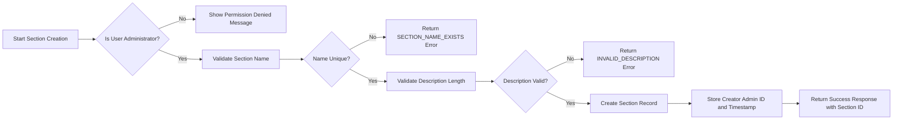
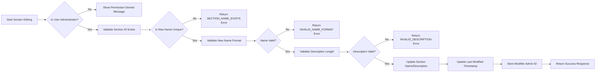
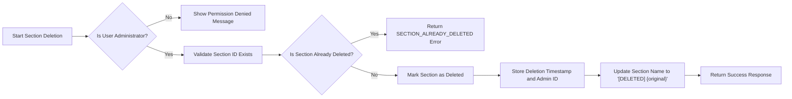
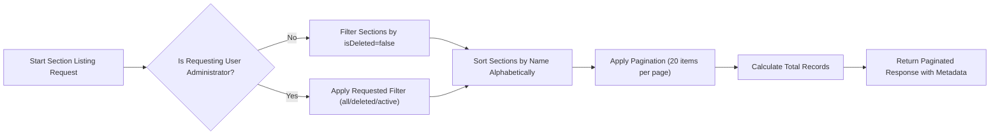

# Economic/Political Discussion Board Requirements Specification

## User Account Management

### Account Creation Requirements

- WHEN a new user submits a registration request with a valid email address and password, THE system SHALL create a user account with a unique identifier.
- WHEN the email address is already registered, THE system SHALL return an error with the code EMAIL_ALREADY_EXISTS.
- WHEN the email address format is invalid, THE system SHALL return an error with the code INVALID_EMAIL_FORMAT.
- WHEN the password is less than 8 characters, THE system SHALL return an error with the code PASSWORD_TOO_SHORT.
- WHEN the password contains no alphanumeric characters, THE system SHALL return an error with the code PASSWORD_INVALID_COMPLEXITY.
- WHEN the password contains the user's email address as a substring, THE system SHALL return an error with the code PASSWORD_CONTAINS_EMAIL.
- THE system SHALL store the hashed password using bcrypt with a cost factor of 12.
- THE system SHALL generate and store a user ID in UUIDv4 format.
- THE system SHALL record the account creation timestamp in ISO 8601 format.
- THE system SHALL send a welcome email to the new user upon successful account creation.
- WHERE registration is requested by an unauthenticated user, THE system SHALL process the request.

### Login Requirements

- WHEN a user submits login credentials with a valid email and matching password, THE system SHALL generate and return a JWT authentication token.
- WHEN the email address does not correspond to any registered account, THE system SHALL return an error with the code USER_NOT_FOUND.
- WHEN the password does not match the stored hash, THE system SHALL return an error with the code INVALID_PASSWORD.
- WHEN the user account has been banned, THE system SHALL return an error with the code ACCOUNT_BANNED.
- THE JWT token SHALL contain the user ID, email, and user role in its payload.
- THE JWT token SHALL expire after 24 hours from issuance.
- THE JWT token SHALL be signed using HMAC-SHA256 with a server-side secret key.
- THE system SHALL log all login attempts (successful and failed) with timestamps and IP addresses.
- WHERE login is requested by a previously authenticated user, THE system SHALL return HTTP 409 Conflict.

### Password Change Requirements

- WHEN a logged-in user requests to change their password, THE system SHALL validate the current password.
- WHEN the current password is incorrect, THE system SHALL return an error with the code INCORRECT_CURRENT_PASSWORD.
- WHEN the new password is less than 8 characters, THE system SHALL return an error with the code PASSWORD_TOO_SHORT.
- WHEN the new password contains the user's email address as a substring, THE system SHALL return an error with the code PASSWORD_CONTAINS_EMAIL.
- WHEN the new password matches the current password, THE system SHALL return an error with the code PASSWORD_NOT_CHANGED.
- THE system SHALL update the password hash using bcrypt with a cost factor of 12.
- THE system SHALL invalidate all existing JWT tokens for this user immediately upon password change.
- THE system SHALL send a confirmation email to the user's email address after password change.
- WHERE password change is requested by an unauthenticated user, THE system SHALL return an error with the code PERMISSION_DENIED.

### Account Deletion Requirements

- WHEN a user requests to delete their account, THE system SHALL require explicit confirmation of this action.
- WHEN the user confirms account deletion, THE system SHALL deactivate the account immediately.
- WHEN an account is deleted, THE system SHALL:
  - Mark all user articles as "deleted by author" with preservation of content
  - Mark all user comments as "deleted by author" with preservation of content
  - Remove all personal profile data (display name, bio)
  - Deactivate all active sessions and invalidate all JWT tokens
  - Set account reputation scores to zero
  - Retain the user ID and email address for compliance purposes
- THE system SHALL permanently delete user data only after 30 days of account deletion.
- The email address shall remain reserved and unavailable for reuse by any other user.
- THE system SHALL send a final confirmation email after account deletion is processed.
- WHERE account deletion is requested by an unauthenticated user, THE system SHALL return an error with the code PERMISSION_DENIED.

## User Profile System

### Profile Definition Requirements

- EACH user SHALL have a profile containing:
  - A display name (required, max 50 characters)
  - A bio (optional, max 1000 characters)
  - A registration timestamp
  - A last login timestamp
  - An account status (active, deleted, banned)
  - A reputation score (cumulative based on community engagement)
- THE system SHALL assign a default display name "User" + {last 6 digits of UUID} if the user does not set one during registration.
- THE display name SHALL be unique across all users.
- THE display name SHALL allow alphanumeric characters, spaces, hyphens, underscores, and emoji.
- THE bio SHALL not contain executable code or HTML tags.
- THE system SHALL sanitize bio text to remove any JavaScript, iframes, or script tags.
- ANY attempt to set a display name or bio containing prohibited characters SHALL be rejected with error code INVALID_PROFILE_FORMAT.

### Profile Editing Requirements

- WHEN a user requests to update their display name, THE system SHALL validate it for uniqueness and length constraints.
- WHEN the requested display name already exists, THE system SHALL return an error with the code DISPLAY_NAME_TAKEN.
- WHEN a user requests to update their bio, THE system SHALL validate the content length and sanitization.
- WHEN the bio exceeds 1000 characters, THE system SHALL return an error with the code BIO_TOO_LONG.
- THE system SHALL record the timestamp of the last profile update.
- WHERE profile editing is requested by another user, THE system SHALL return an error with the code PERMISSION_DENIED.

### Profile Viewing Requirements

- WHEN any user requests to view another user's public profile, THE system SHALL return:
  - Display name
  - Bio text
  - Total number of articles written
  - Total number of comments written
  - Registration date
  - Last login date
  - Reputation score
  - List of section memberships (articles written in each section)
- THE system SHALL NOT expose the user's email address, IP addresses, password hashes, or admin status.
- WHEN viewing the profile of a deleted user, THE system SHALL display:
  - "[DELETED]" prefix before display name
  - "Personal account has been deleted" as bio
  - Zero counts for articles and comments
  - No reputation score
  - "Account deleted on {date}" as registration date
- WHEN viewing the profile of a banned user, THE system SHALL display:
  - "[BANNED]" prefix before display name
  - The original bio
  - All article and comment counts
  - Reputation score
  - "Account status: BANNED" in the description
- WHERE profile viewing is requested for a non-existent user ID, THE system SHALL return an error with the code USER_NOT_FOUND.

### Profile Data Structure

```json
{
  "userId": "usr_1a2b3c4d5e6f",
  "displayName": "PolicyEnthusiast",
  "bio": "Political science major focused on global economic policy. Interested in comparative systems.",
  "registrationDate": "2026-01-15T08:30:00Z",
  "lastLogin": "2026-01-30T16:25:00Z",
  "accountStatus": "active",
  "reputationScore": 845,
  "articleCount": 12,
  "commentCount": 37,
  "sectionMemberships": [
    "Politics",
    "Economy"
  ]
}
```

## Section Management System

### Section Definition Requirements

- EACH section SHALL have the following mandatory properties:
  - A unique name (required, 3-100 characters)
  - A description (required, 10-500 characters)
  - A creation timestamp
  - A creator administrator ID
  - Most recent modifier ID
  - Modification timestamp
  - Deletion status flag
- THE section name SHALL be unique across all created sections.
- THE section name SHALL contain only alphanumeric characters, spaces, hyphens, underscores, and Unicode letters.
- THE section description SHALL be plain text with no HTML or Markdown formatting.
- THE system SHALL prohibit section names that are reserved words or system identifiers.
- THE system SHALL generate a unique section ID for each section in UUIDv4 format.
- THE system SHALL store the creation and modification timestamps in ISO 8601 format.
- THE system SHALL store administrator IDs as referenced user IDs from the user accounts table.
- THE system SHALL preserve deleted sections in the database with isDeleted = true.

### Section Creation Requirements

- WHEN a super administrator submits a request to create a new section, THE system SHALL validate the section name and description.
- WHEN a regular administrator submits a request to create a new section, THE system SHALL validate the section name and description.
- WHEN the section name and description are valid, THE system SHALL create the section and assign it a unique identifier.
- WHEN the section name is already in use, THE system SHALL return an error with the code SECTION_NAME_EXISTS.
- WHERE section creation is requested by a non-administrator user, THE system SHALL deny the request and return an error with the code PERMISSION_DENIED.
- THE section name SHALL be unique across all sections.
- THE section name SHALL contain only alphanumeric characters, spaces, hyphens, and underscores.
- THE section name SHALL be between 3 and 100 characters long.
- THE section description SHALL be between 10 and 500 characters long.
- THE system SHALL store the creation timestamp for each section.
- THE system SHALL store the ID of the administrator who created the section.

### Section Creation Workflow



### Section Editing Requirements

- WHEN a super administrator requests to edit a section, THE system SHALL allow modification of section name and description.
- WHEN a regular administrator requests to edit a section, THE system SHALL allow modification of section name and description.
- WHEN a non-administrator requests to edit a section, THE system SHALL deny the request and return an error with the code PERMISSION_DENIED.
- WHEN a section name is changed to an existing name, THE system SHALL return an error with the code SECTION_NAME_EXISTS.
- WHERE section name editing is attempted, THE system SHALL validate the new name against character and length constraints.
- THE section description can be updated to any length between 10 and 500 characters.
- THE system SHALL preserve the original creation timestamp.
- THE system SHALL update the last modified timestamp when a section is edited.
- THE system SHALL store the ID of the administrator who last modified the section.

### Section Editing Workflow



### Section Deletion Requirements

- WHEN a super administrator requests to delete a section, THE system SHALL allow deletion.
- WHEN a regular administrator requests to delete a section, THE system SHALL allow deletion.
- WHEN a non-administrator requests to delete a section, THE system SHALL deny the request and return an error with the code PERMISSION_DENIED.
- WHEN a section is deleted, THE system SHALL NOT delete any articles or comments within that section.
- WHEN a section is deleted, THE system SHALL preserve all existing articles and comments with references to the deleted section ID.
- THE system SHALL mark the section as "deleted" in the database but retain its record for auditing purposes.
- THE system SHALL store the deletion timestamp and administrator ID who performed the deletion.
- THE section name SHALL remain listed as "[DELETED] [original name]" on administrative views.

### Section Deletion Workflow



### Section Visibility Requirements

- THE system SHALL display all sections (including deleted sections) to administrators on administrative dashboards.
- THE system SHALL display only non-deleted sections to regular users.
- WHEN a user browses sections, THE system SHALL only include sections with isDeleted = false.
- WHEN a user views an article from a deleted section, THE system SHALL display the section name as "[DELETED] {original name}".
- WHEN a user views a comment from an article in a deleted section, THE system SHALL display the section name as "[DELETED] {original name}".
- THE section description SHALL be visible to all users for non-deleted sections.
- THE section creation date and modifier information SHALL be visible only to administrators.
- The section ID SHALL be hidden from all users and used only internally.

### Section Visibility Rules

| Visibility Aspect | Regular Users | Administrators |
|-------------------|---------------|----------------|
| Section names (active) | ✅ Visible | ✅ Visible |
| Section names (deleted) | ❌ Hidden | ✅ Visible (prefixed with "[DELETED]") |
| Section descriptions | ✅ Visible (active only) | ✅ Visible (all) |
| Section creation timestamp | ❌ Hidden | ✅ Visible |
| Section modifier ID | ❌ Hidden | ✅ Visible |
| Section deletion timestamp | ❌ Hidden | ✅ Visible |
| Section ID | ❌ Hidden | ❌ Hidden |

### Section Listing Requirements

- WHEN a user requests a list of sections, THE system SHALL return a paginated list of non-deleted sections only.
- WHEN an administrator requests a list of sections, THE system SHALL return a paginated list of all sections (deleted and non-deleted).
- THE section list SHALL include: section name, section description, creation date, creator admin ID, last modified date, modification admin ID, and deletion status.
- THE section list SHALL be sorted by section name alphabetically.
- THE pagination limit SHALL be 20 sections per page.
- THE system SHALL return a total count of sections in the response header.
- WHEN an administrator requests a filtered list (deleted/active), THE system SHALL allow filtering by isDeleted flag.

### Section Listing Response Structure

```json
{
  "sections": [
    {
      "id": "sec_1a2b3c4d",
      "name": "Politics",
      "description": "Discussion on political systems, elections, and government policies.",
      "isDeleted": false,
      "createdAt": "2026-01-15T10:30:00Z",
      "createdBy": "usr_admin1",
      "lastModifiedAt": "2026-01-20T08:15:00Z",
      "lastModifiedBy": "usr_admin2"
    }
  ],
  "pagination": {
    "page": 1,
    "limit": 20,
    "total": 5,
    "totalPages": 1
  }
}
```

### Section Listing Workflow



> *Developer Note: This document defines **business requirements only**. All technical implementations (architecture, APIs, database design, etc.) are at the discretion of the development team.*