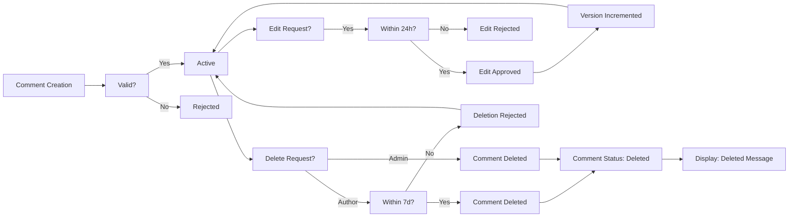
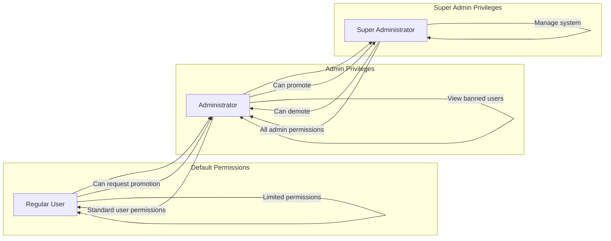
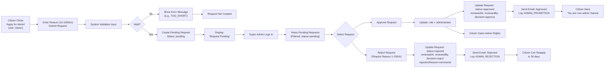

# Economic/Political Discussion Board - Requirements Specification

## System Overview

The Economic/Political Discussion Board is a moderated platform designed for civil, evidence-based discourse on economic and political topics. Unlike unmoderated social media platforms where discussions are often polarized and dominated by sensationalism, this system fosters thoughtful, informed dialogue through organized section categorization, professional moderator oversight, and clear community guidelines.

The platform enables users to form communities around specific economic theories, political ideologies, or current policy debates while maintaining quality through a tiered moderation system. By allowing users to create articles with supporting evidence and attaching relevant documents, the system promotes substance over sentiment, encouraging informed civic participation in democratic processes.

The system is built around three distinct user roles: citizen (regular user), administrator (content moderator), and super administrator (system manager). This hierarchical structure ensures that moderation responsibilities are distributed appropriately and that critical system functions are protected from abuse.

## User Account Management

### Registration

WHEN a new user visits the Economic/Political Discussion Board, THE system SHALL display a registration form requiring a valid email address and password.

WHEN a user submits registration details, THE system SHALL validate:
- The email address format conforms to standard email patterns
- The password meets minimum complexity requirements (minimum 12 characters, including uppercase, lowercase, number, and special character)
- The email address is not already registered in the system

WHEN registration details are valid, THE system SHALL:
- Create a new citizen account with the provided email address and a bcrypt-hashed password
- Assign the user the "citizen" role with standard permissions
- Send a welcome email to the registered email address
- Generate and store a unique user ID (GUID format)
- Redirect the user to the login page with a success message

WHEN registration details are invalid, THE system SHALL:
- Return detailed validation errors for each invalid field
- Preserve user-entered values (except password) for easy correction
- Display a message explaining the specific validation failures

### Login

WHEN a registered user attempts to log in, THE system SHALL require the user's email address and password.

WHEN a user submits login credentials, THE system SHALL:
- Retrieve the user record by email address
- Compare the provided password with the stored bcrypt hash
- If credentials are valid, generate a JSON Web Token (JWT) with the following claims:
  - "userId": string (UUID format)
  - "role": string ("citizen", "administrator", or "superAdministrator")
  - "permissions": array of strings representing specific permission codes
  - "iat": number (timestamp of token issuance)
  - "exp": number (timestamp of token expiration)
- Set an httpOnly, secure, SameSite=Strict cookie with the refresh token (14-day expiration)
- Return the JWT access token (15-minute expiration) to the client for API authentication
- Redirect the user to the dashboard with a welcome message

WHEN username/password combination does not match any user record, THE system SHALL return HTTP 401 status with error code "AUTH_INVALID_CREDENTIALS".

WHEN a user is banned, THE system SHALL return HTTP 401 status with error code "BAN_ACTIVE" regardless of login credentials provided.

### Password Change

WHEN a logged-in user requests to change their password, THE system SHALL require:
- Current password (to verify identity)
- New password (meeting minimum complexity requirements)
- Confirmation of new password (must match new password)

WHEN a user submits password change details, THE system SHALL:
- Validate that the provided current password matches the stored bcrypt hash
- Validate that the new password meets complexity requirements
- Validate that the new password and confirmation password match
- If all validations pass, update the user's password hash in the database
- Clear all active sessions for the user (invalidate all JWT tokens and refresh tokens)
- Send a confirmation email to the user's registered email address
- Log the password change in the audit trail
- Redirect the user to the profile page with a success message

WHEN any validation fails, THE system SHALL return specific error messages for each failure (e.g., "Current password is incorrect", "New password does not meet complexity requirements") and preserve entered values for correction.

### Account Deletion

WHEN a user requests to delete their account, THE system SHALL:
- Display a confirmation dialog requiring the user to enter "DELETE" in uppercase as confirmation
- If action is confirmed, initiate a soft-delete process
- Set the account status to "deleted"
- Disassociate the user from all articles and comments (while preserving both)
- Clear the user's email address, password hash, display name, and bio
- Restrict the user from logging in or using any functionality
- Preserve all user-generated content (articles, comments, attachments) for audit purposes
- Maintain the user's record in the system with minimal identifying information

WHEN a user deletes their account, THE system SHALL generate an audit event with:
- Action: "USER_ACCOUNT_DELETED"
- Actor: user ID (deleted user)
- Target: user ID (deleted user)
- Timestamp: current UTC time
- Metadata: "Reason: User initiated deletion"

WHEN a user attempts to delete their account but is not signed in, THE system SHALL redirect to the login page with a message: "Please sign in to delete your account."

WHEN a user attempts to delete their account after being banned, THE system SHALL process the deletion as normal, but retain the ban record for audit purposes.

## User Profile Management

### Profile Structure

Each user profile SHALL contain the following fields:
- Display name: String (maximum 50 characters), required, default: "User" + 6-digit unique identifier (e.g., "User123456")
- Bio: String (maximum 500 characters), optional
- User ID: Unique string identifier (GUID format), required
- Registration timestamp: ISO 8601 timestamp, required
- Role: "citizen", "administrator", or "superAdministrator", required
- Account status: "active" or "deleted", required
- Last login timestamp: ISO 8601 timestamp, optional

### Profile Access

WHEN a user views their own profile, THE system SHALL display:
- Display name with edit control visible
- Bio text with edit control visible
- List of all articles authored by the user
- List of all comments authored by the user
- Account deletion button visible
- Change password button visible
- User role badge (e.g., "Administrator")
- Registration date
- Last login date
- Account status

WHEN a user views another user's profile, THE system SHALL display:
- Display name
- Bio text
- List of all articles authored by the user
- List of all comments authored by the user
- User role badge
- Registration date
- Account status

IF the viewed user is banned, THE system SHALL display a "Banned" badge next to the display name and the username.

IF the viewed user's account is deleted, THE system SHALL display: "Account has been deleted" for both display name and bio, and limit visible content to "[Deleted]" for articles and comments.

WHEN an administrator views a banned user's profile, THE system SHALL display the ban reason in a dedicated ban information section.

WHEN an administrator views a user who has submitted a pending administrator request, THE system SHALL display a "Pending Administrator Request" badge.

WHEN a user views their own profile after being unbanned, THE system SHALL remove the "Banned" badge and display normal profile information.

### Profile Editing

WHEN a user edits their display name, THE system SHALL:
- Allow modification of the display name field
- Enforce a minimum length of 2 characters and maximum length of 50 characters
- Allow alphanumeric characters, spaces, hyphens, underscores, and basic punctuation
- Prevent display names from matching reserved terms (such as "Admin", "Administrator", "Super Admin")
- When valid, update the database record
- Update the display name in all associated articles and comments
- Return a success message

WHEN a user edits their bio, THE system SHALL:
- Allow modification of the bio text field
- Enforce a maximum length of 500 characters
- Allow all standard text characters including line breaks
- When valid, update the database record
- Return a success message

WHEN a user attempts to update their profile with empty values for required fields, THE system SHALL reject the update and return appropriate error messages.

WHEN a user attempts to update their profile to a display name that belongs to another active user, THE system SHALL return an error with code "DISPLAY_NAME_IS_TAKEN".

WHEN a user updates their profile, THE system SHALL:
- Preserve the original creation timestamp
- Update the "last modified" timestamp
- Record the change in the audit log
- Notify the user of successful update

## Section Management

### Section Creation

WHEN a user with "administrator" or "superAdministrator" role attempts to create a new section, THE system SHALL:
- Display a form with "Section Name" and "Description" fields
- Enforce Section Name requirements:
  - Minimum 3 characters
  - Maximum 100 characters
  - Allow alphanumeric characters, spaces, hyphens, and underscores only
  - Must be unique across all existing sections
- Enforce Description requirements:
  - Minimum 10 characters
  - Maximum 500 characters
  - Allow standard text characters
- Validate that the user has appropriate permissions to create sections

WHEN a user submits section creation details, THE system SHALL:
- Check that the section name is not already in use
- Validate formatting requirements for both name and description
- If valid, create a new section record with:
  - Unique section ID
  - Name
  - Description
  - Creation timestamp (UTC)
  - Creator ID (admin ID)
  - Status: "active"
- Add the new section to the system's section list
- Send an audit event with details: section name, creator, timestamp
- Return a success message to user

WHEN a user attempts to create a section with:
- Name less than 3 characters: THE system SHALL return error code "SECTION_NAME_TOO_SHORT"
- Name exceeding 100 characters: THE system SHALL return error code "SECTION_NAME_TOO_LONG"
- Name with invalid characters: THE system SHALL return error code "SECTION_NAME_INVALID_FORMAT"
- Name already in use: THE system SHALL return error code "SECTION_NAME_EXISTS"
- Description less than 10 characters: THE system SHALL return error code "SECTION_DESCRIPTION_TOO_SHORT"
- Description exceeding 500 characters: THE system SHALL return error code "SECTION_DESCRIPTION_TOO_LONG"
- User lacks administrator permissions: THE system SHALL return HTTP 403 with error code "PERMISSION_DENIED"

### Section Editing

WHEN a user with "administrator" or "superAdministrator" role attempts to edit a section, THE system SHALL:
- Allow modification of section name and description
- Preserve the original creation timestamp and creator ID
- Update the last modified timestamp to current UTC time
- Record the modifier's user ID

WHEN a section name is changed, THE system SHALL:
- Validate new name against all existing sections (case-insensitive comparison)
- Ensure new name meets length and character requirements

WHEN a user attempts to edit section name to one that already exists in the system, THE system SHALL return error code "SECTION_NAME_EXISTS".

WHEN a section is successfully edited, THE system SHALL:
- Update the database record
- Log the edit in the audit trail
- Return a success message
- Trigger cache invalidation for section lists and articles in that section

WHEN a user attempts to edit a section without appropriate permissions, THE system SHALL return HTTP 403 with error code "PERMISSION_DENIED".

WHEN a user attempts to edit a non-existent section, THE system SHALL return HTTP 404 with error code "SECTION_NOT_FOUND".

### Section Deletion

WHEN a user with "administrator" or "superAdministrator" role attempts to delete a section, THE system SHALL:
- Display a confirmation dialog warning that articles in this section will not be deleted
- If confirmed, set the section status to "deleted"
- Change the section name to "[DELETED] " + original section name
- Record the deletion timestamp and the deleting administrator's ID
- Preserve all articles associated with this section in the database
- Generate an audit event with: action="SECTION_DELETED", target_section_id, actor_admin_id, timestamp
- Return a success message

WHEN a section is marked as deleted:
- The section is removed from the publicly visible section list
- Articles previously in this section remain accessible with reference to the deleted section
- The public section listing no longer displays the deleted section

WHEN a user attempts to delete a section without appropriate permissions, THE system SHALL return HTTP 403 with error code "PERMISSION_DENIED".

WHEN a user attempts to delete an already deleted section, THE system SHALL return HTTP 400 with error code "SECTION_ALREADY_DELETED".

### Section Visibility

WHILE a regular citizen is browsing sections, THE system SHALL:
- Only display sections with status = "active"
- Hide all sections marked as "deleted"

WHEN an administrator views the section list, THE system SHALL:
- Display all sections (including deleted)
- Identify deleted sections with prefix "[DELETED] "
- Show additional information: creation timestamp, creator ID, modification timestamp, modifier ID, deletion timestamp, deletion reason

WHEN an article is viewed that was created in a deleted section, THE system SHALL display:
- "Section: [DELETED] {original section name}" 
- The original section name in the display
- No opportunity to edit the section for that article

WHEN articles are searched or filtered, THEY SHALL include articles from deleted sections

WHEN a user attempts to create an article in a deleted section, THE system SHALL:
- Hide the deleted section from the section selector
- If a deleted section ID is provided in API request, return HTTP 400 with error code "SECTION_INACTIVE"

## Article Management

### Article Creation

WHEN a user creates a new article, THE system SHALL:
- Require the following fields:
  - Title: minimum 5 characters, maximum 200 characters
  - Content: minimum 100 characters
  - Section: must be a valid, active section identifier
- Reject if title is empty, exceeds 200 characters, or contains only whitespace
- Reject if content is empty, exceeds 10,000 characters, or contains only whitespace
- Reject if section is not valid or is marked as "deleted"

WHEN a user submits a valid article, THE system SHALL:
- Generate a unique article ID (GUID)
- Store the article in database with:
  - Article ID
  - Title
  - Content
  - Author ID (from authenticated user)
  - Section ID
  - Creation timestamp (UTC)
  - Update timestamp (UTC)
  - Version: 1
  - Status: "published"
  - Comment count: 0
- Create article tags from user-provided tags list
- Process any attached files or images
- Generate full text content index for search purposes
- Increment article count for the specified section
- Return the new article ID and URL for redirection
- Send a notification to the author about successful article creation

WHEN a user submits a duplicate title in the same section with identical content, THE system SHALL permit creation but SHALL ensure all artifacts (attachments, tags) are distinct.

WHEN a user attempts to create a title with more than 200 characters, THE system SHALL return error code "ARTICLE_TITLE_TOO_LONG".

WHEN a user attempts to create content with less than 100 characters, THE system SHALL return error code "ARTICLE_CONTENT_TOO_SHORT".

WHEN a user attempts to create an article without a section assignment, THE system SHALL return error code "ARTICLE_SECTION_REQUIRED".

WHEN a user attempts to create an article in a deleted section, THE system SHALL return error code "SECTION_INACTIVE".

### Article Editing

WHEN a user attempts to edit their own article, THE system SHALL:
- Allow modification of:
  - Title (maximum 200 characters)
  - Content (minimum 100 characters)
  - Attachments (add, remove, or replace files and images)
  - Tags (add, remove, or modify tags)
  - Section (change to any other active section)
- Preserve the original creation timestamp
- Update the modification timestamp to current UTC time
- Increment the version counter by 1
- Log the edit in the audit trail with editor ID and timestamp
- Update search index with changed title and content

WHEN a user attempts to edit an article they do not own, THE system SHALL deny the request and return HTTP 403 Forbidden with error code "ARTICLE_EDIT_PERMISSION_DENIED".

WHEN a user edits an article and changes the title to empty string or content to less than 100 characters, THE system SHALL reject the edit and return appropriate error message with code "ARTICLE_TITLE_REQUIRED" or "ARTICLE_CONTENT_REQUIRED".

WHEN a user edits an article and changes to a section they do not have permission to access, THE system SHALL return error code "SECTION_ACCESS_DENIED".

WHEN an article's section is changed, THE system SHALL:
- Decrement the article count of the original section
- Increment the article count of the new section
- Update section references in all associated records
- Invalidate cache for both sections

### Article Deletion

WHEN a user deletes their own article, THE system SHALL:
- Set the article status to "deleted"
- Preserve the article's metadata (title, author, timestamp) for audit purposes
- Hide the article from public viewing
- Retain all attached files and images in storage for 30 days
- Maintain the article's associated tags for reporting
- Set the article's comment count to 0 (not delete comments)
- Decrement the article count for the section it was in
- Generate an audit event with: action="ARTICLE_DELETED_BY_USER", article_id, user_id, timestamp
- Send confirmation to the user

WHEN an administrator deletes any article, THE system SHALL:
- Set the article status to "deleted_by_administrator"
- Preserve the article's content and metadata for audit purposes
- Retain all attached files and images in storage for 14 days
- Record the administrator's identity responsible for the deletion
- Record the deletion timestamp
- Generate an audit event with: action="ARTICLE_DELETED_BY_ADMIN", article_id, admin_id, timestamp, reason (optional)
- Send notification to the original author (if contacted)

WHEN a user attempts to delete an article they do not own, THE system SHALL deny the request and return HTTP 403 Forbidden.

WHEN the server receives a delete request for a non-existent article, THE system SHALL return HTTP 404.

WHEN an article is permanently deleted after 30 days (for user deletion) or 14 days (for admin deletion), THE system SHALL:
- Completely remove the article from the database
- Redirect any remaining links to the article to a 404 page
- Remove all associated tags and references
- Delete all associated files and images

### File and Image Attachments

WHEN a user attaches files to an article, THE system SHALL allow:
- Maximum of 10 files per article
- File types: PDF, DOC, DOCX, XLS, XLSX, PPT, PPTX, TXT, CSV, ZIP, RAR
- Maximum file size: 100 MB per file
- All files shall be stored in encrypted form with unique object keys

WHEN a user attaches images to an article, THE system SHALL allow:
- Maximum of 15 images per article
- Image formats: JPEG, PNG, GIF, BMP, WEBP
- Maximum image size: 20 MB per image
- Images shall be automatically resized to a maximum dimension of 1920x1080 pixels

WHEN a user uploads a file or image, THE system SHALL:
- Validate the file's MIME type matches the expected format
- Generate a unique storage key (UUIDv4) for each file
- Store the original file and a processed version (if applicable)
- Record metadata: file name, size, type, original upload timestamp, processed timestamp, and storage location

IF a user uploads a file with an unsupported extension (e.g. .exe, .bat), THE system SHALL reject the upload and return error code "ATTACH_INVALID_TYPE".

IF a user attempts to exceed file or image limits, THE system SHALL reject the upload and return error code "ATTACH_QUOTA_EXCEEDED".

WHEN an article is deleted, THE system SHALL NOT delete the associated files or images from the storage system.

WHEN an article is edited and attachments are removed, THE system SHALL retain the removed files in storage for 30 days before archiving for cleanup.

WHEN a file or image is referenced in an article that has been deleted, THE system SHALL return HTTP 404 and log the attempted access.

WHEN a user attempts to download an attachment from a banned user's article, THE system SHALL permit the download since banned users' content remains visible.

### Tagging System

WHEN a user adds tags to an article, THE system SHALL support:
- Maximum of 10 tags per article
- Each tag: minimum 2 characters, maximum 50 characters
- Characters permitted: alphanumeric, hyphen, underscore
- No whitespace at start or end of tag
- Case-insensitive storage (e.g., 'economy' and 'ECONOMY' are treated as identical)
- Tags must be separated by commas, semicolons, or spaces

WHEN a user submits a tag with invalid characters, THE system SHALL reject the tag and return error code "TAG_INVALID_FORMAT".

WHEN a user submits a duplicate tag in the same article, THE system SHALL ignore duplicate and store only one instance.

WHEN a user adds a tag that does not exist system-wide, THE system SHALL create the tag in the global tag registry.

WHEN tags are displayed on an article, THE system SHALL render them as space-separated, lowercase, hyphen-delimited strings for URL compatibility.

WHEN a user searches for articles by tag, THE system SHALL match tags case-insensitively.

WHEN displaying tag count on item in section list, THE system SHALL include total tag count per article.

WHEN an article with tags is deleted, THE system SHALL mark the association as deleted and preserve tags for 30 days.

WHEN a tag has no articles associated with it for more than 180 days, THE system SHALL archive it for cleanup.

## Article Listing

### Article List Display

WHEN a user displays the article list for a section, THE system SHALL show each article with the following fields:
- Title: truncated to 120 characters if longer, with ellipsis
- Author display name
- List of tags: first 3 tags displayed as comma-separated values (truncated to 50 characters if needed)
- Comment count: integer representing active comments on this article
- Creation timestamp: in localized format (Asia/Seoul timezone) as YYYY-MM-DD HH:mm

WHEN article list is displayed with a search query, THE system SHALL:
- Apply the search term to both title and content fields
- Apply tag filters if specified
- Sort according to selected criteria
- Limit results to 20 articles per page
- Return pagination tokens for navigation

### Sorting Options

WHEN a user sorts articles by 'newest first', THE system SHALL order by creation timestamp DESC (most recent first).

WHEN a user sorts articles by 'oldest first', THE system SHALL order by creation timestamp ASC (oldest first).

WHEN a user selects a sorting option, THE system SHALL reset pagination to page 1.

WHEN a user performs search or applies filter, THE system SHALL reset sorting to default (newest first).

### Pagination

WHEN a user requests a page of articles, THE system SHALL:
- Return exactly 20 articles per page (unless fewer are available)
- Provide a next page token for pagination
- Return 404 if requested page exceeds total available pages
- Include total article count for the section in the response header

WHEN a section contains more than 10,000 articles, THE system SHALL optimize list loading by caching frequently accessed pages and implementing server-side index optimization.

WHEN a user navigates through article pages, THE system SHALL maintain consistent sorting order across pages.

WHEN a user changes sorting criteria, THE system SHALL reset pagination to page 1.

WHEN a user requests an article list with invalid section identifier, THE system SHALL return 404 error with message 'Section not found'.

WHEN article title or author name contains non-Latin characters, THE system SHALL display them correctly without truncation or corruption.

WHEN users have requested search with results exceeding 10,000 articles, THE system SHALL display message: "Too many results (over 10,000). Please refine your search."

## Viewing an Article

### Article Page Display

WHEN a user views a single article with its full content, THE system SHALL show:
- Title: with HTML escaping for security
- Author display name with link to author profile
- Content: rendered as Markdown with HTML escaping for safety
- Section name with link to section listing
- List of all attached files with download links
- List of all attached images with preview and download links
- List of all tags linked to tag search results
- Creation timestamp (Asia/Seoul timezone) in format: YYYY-MM-DD HH:mm:ss
- Version number: "Version {n}"
- Last updated timestamp: "Last updated: YYYY-MM-DD HH:mm:ss" (if edited)

WHEN an article has been edited by its author, THE system SHALL:
- Display the "Last updated" timestamp
- Show the version number
- Preserve the original creation timestamp

WHEN an article has been edited by an administrator, THE system SHALL:
- Display "Last updated" timestamp
- Show version number
- Display visible badge: "[Edited by Administrator]"

WHEN an article has been deleted by administrator, THE system SHALL display: "This article has been deleted by an administrator." in place of content and title, with original metadata, and include the reason (if provided).

WHEN an article includes attachments and the user has no permission to access the article (banned, etc.), THE system SHALL still allow file/image access if the article is public.

WHEN a user tries to access an article that does not exist, THE system SHALL return HTTP 404.

WHEN a file attachment is downloaded, THE system SHALL:
- Verify user has permission to view the article
- Serve the file with appropriate Content-Type header
- Log the download event
- Use a secure, temporary URL that expires after 1 hour

WHEN an image is displayed, THE system SHALL:
- Serve the processed and resized version
- Include alt text based on filename
- Implement lazy loading for performance
- Comply with accessibility standards (WCAG 2.1)

### Access Control for Article Viewing

WHEN a user attempts to view an article from a banned user, THE system SHALL allow viewing of the article content, attachments, and comments, since banned users' content remains public.

WHEN an administrator attempts to view an article they have deleted, THE system SHALL show the article's full content and metadata, including deletion reason.

WHEN any user attempts to view an article marked as "deleted", THE system SHALL:
- Return 404 if article deleted by user
- Show article with "[DELETED BY ADMINISTRATOR]" banner and reason if deleted by admin

## Search and Filtering Functionality

### Search Functionality

WHEN a user performs a text search on the article list, THE system SHALL search across:
- Article title
- Article content
- Organization: SEARCH (title + content) AND (tags) [tag filtering separate]

WHEN a user submits a search term, THE system SHALL:
- Normalize whitespace by trimming leading and trailing spaces
- Treat multiple consecutive spaces as a single space
- Perform case-insensitive matching
- Support partial word matching (substring matching)
- Support special characters including punctuation and symbols
- Be capable of searching across Chinese, Arabic, Cyrillic, and other non-Latin scripts
- Return results ordered by relevance score, then by creation timestamp descending (newest first)

WHEN the search term is empty or contains only whitespace, THE system SHALL:
- Not perform a search
- Display an error message: "Please enter a search term"
- Return the original list of articles

WHEN no articles match the search term, THE system SHALL:
- Return an empty result list
- Display a message: "No articles match your search"

### Tag Filtering

WHEN a user applies a tag filter, THE system SHALL:
- Match articles that contain the exact tag value
- Perform case-insensitive matching ("politics" matches "Politics")
- Support multiple simultaneous filters
- Implement AND logic: articles must match ALL selected tags
- Display current active tags for easy removal

WHEN a user selects a tag from the tag cloud or tag list, THE system SHALL:
- Add the tag to the active filter set
- Reload articles matching all active tags
- Preserve other filters (search term, sort order, section)

WHEN a user removes a tag from active filters, THE system SHALL:
- Update the article list to exclude articles without the removed tag
- Maintain other active filters

WHEN no tags are selected, THE system SHALL not apply any tag filtering and return all search results.

### Pagination and Display

WHEN a user performs search or applies filters, THE system SHALL:
- Return results in pages of 25 articles per page
- Include total results count in response headers
- Provide "Previous" and "Next" navigation buttons
- Show page number navigation (first 5 and last 5 pages with ellipses)
- Display: "Showing {current} - {last} of {total} results"
- Maintain search term and tag filters when navigating pages

WHEN a user navigates to a new page, THE system SHALL:
- Load results within 1.5 seconds
- Preserve scroll position at top of result list

WHEN a user changes search parameters or filters, THE system SHALL:
- Reset pagination to page 1
- Return new results immediately

### Performance Requirements

WHEN a search query is executed, THE system SHALL:
- Return results within 800 milliseconds for 95% of queries
- Support 500 concurrent search requests with no degradation
- Maintain search index updated within 500 milliseconds of any article creation, edit, or deletion
- Include all articles in search index regardless of author's status
- Battle-test with 10,000+ articles and 10+ simultaneous users performing complex search+filter operations

WHEN a search query returns 10,000+ results, THE system SHALL:
- Limit results to 10,000
- Display message: "Too many results (over 10,000). Please refine your search."

## Comment Management

### Comment Creation

WHEN a user views an article, THE system SHALL allow authenticated users to create a comment on that article.

THE system SHALL require the following fields for comment creation:
- Content (text, minimum 1 character, maximum 5,000 characters)
- Article ID (must reference an existing article)
- Author (automatically derived from authenticated user session)

IF the user is not authenticated, THE system SHALL reject comment creation with HTTP 401 status and error code AUTH_REQUIRED.

IF the article has been deleted, THE system SHALL reject comment creation with HTTP 404 status and error code ARTICLE_NOT_FOUND.

IF the user has been banned, THE system SHALL reject comment creation with HTTP 403 status and error code USER_BANNED.

WHEN a comment is created, THE system SHALL:
- Generate a unique comment ID
- Record the current timestamp (Asia/Seoul timezone)
- Set the comment status to "active"
- Increment the article's comment count by 1
- Record the author's display name at time of comment
- Store the original content with markdown escape sequences for HTML safety

WHERE the comment content is empty after trimming whitespace, THE system SHALL reject creation with HTTP 400 status and error code COMMENT_EMPTY.

WHERE the comment content exceeds 5,000 characters, THE system SHALL reject creation with HTTP 400 status and error code COMMENT_TOO_LONG.

WHEN a comment is created, THE system SHALL:
- Update the article's comment count in real-time
- Store the comment with version number 1
- Send notification to article author (optional functionality)
- Return the created comment ID to client

### Comment Editing

WHEN a user attempts to edit a comment, THE system SHALL verify that:
- The user is authenticated
- The comment exists and is active
- The user is the original author of the comment

IF any of these conditions are not met, THE system SHALL reject the edit request with HTTP 403 status and error code COMMENT_EDIT_PERMISSION_DENIED.

WHEN a comment is edited successfully, THE system SHALL:
- Update the comment content with the new value
- Record the current timestamp as the "last edited" time
- Maintain the original creation timestamp
- Preserve the comment status as "active"
- Increment the comment's version counter by 1
- Update the comment count display in real-time (no change)

IF the edited content is empty after trimming whitespace, THE system SHALL reject the edit with HTTP 400 status and error code COMMENT_EMPTY.

IF the edited content exceeds 5,000 characters, THE system SHALL reject the edit with HTTP 400 status and error code COMMENT_TOO_LONG.

WHEN a comment is edited, THE system SHALL:
- Store modified content with updated timestamps
- Log edit events
- Update index for search purposes

WHEN a user attempts to edit a comment more than 5 times or more than 24 hours after initial posting, THE system SHALL reject the edit with error code "COMMENT_EDIT_LOCKED".

### Comment Deletion

WHEN a user attempts to delete a comment, THE system SHALL verify that:
- The user is authenticated
- The comment exists and is active
- The user is the original author of the comment

IF any of these conditions are not met, THE system SHALL reject the delete request with HTTP 403 status and error code COMMENT_DELETE_PERMISSION_DENIED.

WHEN a comment is deleted successfully, THE system SHALL:
- Update the comment status to "deleted"
- Preserve the original content and metadata for audit purposes
- Decrement the article's comment count by 1
- Record the deletion timestamp
- Maintain the comment's visibility in the article's comment history

IF the article has been deleted, THE system SHALL still allow deletion of comments on that article by the original author.

WHERE an administrator attempts to delete a comment, THE system SHALL allow deletion regardless of authorship.

WHEN a comment is deleted by an administrator, THE system SHALL record the administrator's user ID and the reason for deletion (if provided).

WHEN a comment deletion of own comment is attempted after 7 days of creation, THE system SHALL return error CODE "COMMENT_DELETE_PERIOD_EXPIRED".

### Comment Display

THE system SHALL display the following fields for each comment on an article page:
- Comment ID
- Author display name (not username)
- Comment content (rendered as plain text with line breaks preserved)
- Creation timestamp (formatted as "YYYY-MM-DD HH:mm:ss" in Asia/Seoul timezone)
- Last edited timestamp (if applicable, otherwise hidden)
- Comment version number (if greater than 1)

THE system SHALL not display:
- The author's email address
- The author's profile ID
- The comment's internal database ID
- The comment's deletion reason (unless the viewer is an administrator)
- The comment's version history
- The deletion timestamp (except for administrators)

WHEN a comment has been deleted by an administrator, THE system SHALL display: "[This comment has been deleted by an administrator]" in place of the content.

WHEN a comment has been deleted by its author, THE system SHALL display: "[This comment has been deleted by the author]" in place of the content.

IF the user viewing a comment is the original author of a deleted comment, THE system SHALL display: "[This comment has been deleted]" along with the original content.

### Comment Sorting

WHILE displaying comments on an article page, THE system SHALL sort comments by creation timestamp in ascending order (oldest first).

THE system SHALL not support alternative sorting options (e.g., newest first, by popularity).

WHERE comments have identical creation timestamps, THE system SHALL sort comments by their internal comment ID in ascending order to ensure deterministic ordering.

THE system SHALL load comments in batches of 20 for performance optimization, but shall maintain the chronological ordering across all pages.

### Comment Count

THE system SHALL calculate and display the total number of active comments on an article.

THE comment count SHALL be updated in real-time when:
- A new comment is created
- A comment is deleted (by author or administrator)
- A comment is undeleted (recovery case)

THE system SHALL count only comments with status "active" in the comment count.

WHEN the article page is loaded, THE system SHALL display the current comment count immediately, even before the full list of comments has loaded.

THE comment count SHALL update automatically whenever a user creates or deletes a comment on that article, using real-time notification mechanisms.

THE system SHALL store the comment count as a denormalized field on the article document for performance optimization.

THE comment count SHALL be recalculated from the database if inconsistencies are detected during validation checks.

Mermaid diagram: Comment Lifecycle



## Administrator Privilege Hierarchy

### Administrator Privileges

Administrators have all standard user permissions plus elevated moderation capabilities:
- Creating articles
- Editing their own articles
- Deleting their own articles
- Writing comments on articles
- Editing their own comments
- Deleting their own comments
- Viewing user profiles
- Viewing section listings
- Searching articles by title and content
- Filtering articles by tags
- Downloading attached files and images

Additionally, administrators have the following privileged capabilities:

WHEN an administrator attempts to create a section, THE system SHALL allow the creation if the section name is unique and not empty.
WHEN an administrator attempts to edit an existing section, THE system SHALL allow the modification of section name and description.
WHEN an administrator attempts to delete a section, THE system SHALL allow deletion and preserve all associated articles and comments.
WHEN an administrator attempts to delete any article, THE system SHALL permit deletion regardless of authorship.
WHEN an administrator attempts to delete any comment, THE system SHALL permit deletion regardless of authorship.
WHEN an administrator attempts to ban a user, THE system SHALL record the ban reason and prevent the user from logging in.
WHEN an administrator attempts to unban a user, THE system SHALL remove the ban status and restore login access.
WHEN an administrator attempts to view the list of banned users, THE system SHALL return the list of banned users with their ban reason.

Additionally:

WHILE an administrator is logged in, THE system SHALL display administrative control panels and moderation tools in the user interface.

### Super Administrator Privileges

Super administrators have all administrator privileges and additionally can manage the administrator hierarchy:

IF a user has the super administrator role, THEN THE system SHALL allow them to promote a regular administrator to super administrator.
IF a user has the super administrator role, THEN THE system SHALL allow them to demote another super administrator to regular administrator.
WHERE an administrator has submitted a request to become an administrator, THE system SHALL allow super administrators to approve or reject the request.

Additionally:

WHILE a super administrator is logged in, THE system SHALL display additional administrative controls to manage other administrators and review administrator requests.

### Promotion Process

WHEN a regular administrator submits a promotion request, THE system SHALL store the request details and notify super administrators.
WHEN a super administrator reviews a promotion request, THE system SHALL allow them to approve the request.
WHEN a promotion request is approved, THE system SHALL update the user's role from "administrator" to "superAdministrator".

An administrator request must contain:
- A reason field (minimum 10 characters)
- A timestamp of submission
- The requester's user ID

WHEN a promotion request is approved, THE system SHALL send a notification to the requester indicating their new status.

### Demotion Process

WHEN a super administrator demotes another super administrator, THE system SHALL change their role from "superAdministrator" to "administrator".
WHEN a super administrator demotes a regular administrator, THE system SHALL reject the request as invalid.

The demotion operation shall:
- Preserve all content created by the demoted user
- Maintain all ban status and moderation history
- Remove "superAdministrator" privileges but retain "administrator" privileges

### Self-Demotion Restriction

IF a super administrator attempts to demote themselves, THEN THE system SHALL reject the request and return an error with code "CANNOT_DEMOTE_SELF".

This restriction exists to ensure:
- System integrity is maintained by always having at least one super administrator
- There is always a user with authority to promote others
- Critical administrative functions cannot be accidentally disabled
- Accountability in the administrative hierarchy is preserved

The system shall allow super administrators to:
- Promote regular administrators to super administrator
- Demote other super administrators
- View administrator requests
- Approve/reject administrator requests

But shall never allow a super administrator to make themselves a regular administrator under any circumstances.

Mermaid diagram of administrator privilege hierarchy:



Note: All system permissions are managed through role-based access control (RBAC) with explicit permission checks applied to every API endpoint. No permission escalation is possible except through the formal promotion workflow.

## Administrator Request Workflow

### Request Submission

WHEN a citizen submits a request to become an administrator, THE system SHALL accept the submission only if the user's current role is "citizen".

WHERE a user has already submitted an administrator request and it is still pending, THE system SHALL NOT accept a duplicate request and SHALL display an error message: "You already have a pending administrator request. Please wait for a response."

WHEN a user submits an administrator request, THE system SHALL require two fields:
- "reason": A text field of minimum 10 characters and maximum 1000 characters
- "submittedAt": A timestamp in ISO 8601 format, automatically generated by the system

WHILE the request is being processed, THE system SHALL lock the "submit administrator request" button in the user interface for the requesting user to prevent duplicate submissions.

WHEN a valid administrator request is submitted, THE system SHALL create a new record in the adminRequests table with:
- userId (referencing the citizen user)
- reason
- submittedAt
- status: "pending"
- reviewedAt: null
- reviewedBy: null
- decision: null

IF the submitted reason field is empty, fewer than 10 characters, or contains only whitespace, THEN THE system SHALL reject the submission with error code: REQUEST_REASON_TOO_SHORT.

IF the submitted reason field exceeds 1000 characters, THEN THE system SHALL reject the submission with error code: REQUEST_REASON_TOO_LONG.

### Request Review

### Reviewer Identification

WHERE a user request status is "pending", THE system SHALL make the request visible only to users with role "superAdministrator".

WHILE there are unreviewed administrator requests, THE system SHALL display a badge indicator on the "Admin Management" dashboard for super administrators, showing the count of pending requests.

WHEN a super administrator opens the admin requests management page, THE system SHALL load all requests with status "pending" sorted by submittedAt in ascending order (oldest first).

WHERE a user is not a superAdministrator, THE system SHALL hide the administrative review interface entirely and return HTTP 403 when attempting to access the review endpoint.

### Data Visibility

WHEN a super administrator views a pending request, THE system SHALL display:
- The citizen's display name
- The citizen's email address (for authentication verification)
- The submitted reason (verbatim, with markdown escaping for safety)
- The submittedAt timestamp in local format (Asia/Seoul)

IF the citizen's account is marked as "banned", THEN THE system SHALL display a warning: "⚠️ WARNING: This user is currently banned. Approving this request would lift the ban." in red text.

WHERE a citizen has previously been granted administrator status and had it revoked, THE system SHALL display a note: "This user previously held administrator privileges."

IF the citizen has submitted three or more administrator requests in the last 365 days, THEN THE system SHALL display a warning: "⚠️ This user has submitted multiple requests in the last year. Consider carefully."

### Approval Process

### Final Action Requirements

WHEN a super administrator selects "Approve" on a pending request, THE system SHALL perform the following actions:
- Update the request record:
  - Set status: "approved"
  - Set reviewedAt: current timestamp (Asia/Seoul)
  - Set reviewedBy: superAdministrator userId
  - Set decision: "approve"
- Update the citizen's user record:
  - Change role from "citizen" to "administrator"
  - Preserve all existing profile data (display name, bio)
- Log the action in the audit log with:
  - eventType: "ADMIN_PROMOTION"
  - actorId: superAdministrator userId
  - targetId: citizen userId
  - metadata: { "originalRequestReason": "[reason text]" }

WHEN an administrator request is approved, THE system SHALL ensure the newly promoted administrator can immediately:
- Access section management interfaces
- Delete any article or comment
- View and manage banned users
- Submit new administrator requests (for super admin status)

IF the system fails to update the citizen's role due to a database constraint violation, THEN THE system SHALL revert the request status to "pending" and log error: "ROLE_UPDATE_FAILED".

IF the approved user already holds "administrator" role (due to race condition), THEN THE system SHALL log a warning: "RACE_CONDITION_DETECTED - User was already promoted" and leave request status as "approved".

### Rejection Process

### Final Action Requirements

WHEN a super administrator selects "Reject" on a pending request, THE system SHALL perform the following actions:
- Update the request record:
  - Set status: "rejected"
  - Set reviewedAt: current timestamp (Asia/Seoul)
  - Set reviewedBy: superAdministrator userId
  - Set decision: "reject"
  - Set a rejectionReason field to the super administrator's comment (maximum 200 characters)

WHERE a request is rejected, THE system SHALL allow the citizen to submit a new request after 30 days have passed since the rejection.

IF a super administrator attempts to reject a request without providing a rejection reason, THEN THE system SHALL prevent submission and display: "A rejection reason is required. Please explain why this request was denied."

IF the rejection reason field is empty or contains only whitespace, THEN THE system SHALL block submission with error: REJECTION_REASON_REQUIRED.

IF the rejection reason exceeds 200 characters, THEN THE system SHALL block submission with error: REJECTION_REASON_TOO_LONG.

WHEN a request is rejected, THE system SHALL maintain the citizen's role as "citizen" and continue to allow full citizen functionality.

IF the rejection process fails at the database level after the user role was modified (in rare race condition), THEN THE system SHALL log the failure and keep the request status as "rejected" with no change to the citizen's role.

### Notification Mechanism

### Notification Triggers

WHEN a request is approved, THE system SHALL send an email notification to the citizen's registered email address with subject: "Administrator Request Approved - Your Account Has Been Upgraded"

WHEN a request is rejected, THE system SHALL send an email notification to the citizen's registered email address with subject: "Administrator Request Rejected - Your Application Did Not Succeed"

WHERE a user has opted out of email notifications (if such a feature exists), THE system SHALL store the notification result as "email_opted_out" but still log the attempt.

WHEN an email notification fails to send (temporary delivery error), THE system SHALL retry up to three times at 5-minute intervals.

IF all email delivery attempts fail, THE system SHALL log: "EMAIL_NOTIFICATION_FAILED" and add the request ID to a notification failure queue for manual review.

WHEN an email is successfully delivered, THE system SHALL mark the notification as "sent" with a timestamp in the notification log.

WHEN the citizen logs in after being approved, THE system SHALL display a banner: "Congratulations! You are now an administrator. You can now manage sections and moderate content."

WHEN the citizen logs in after being rejected, THE system SHALL display a banner: "Your request to become an administrator was not approved. You may submit another request after 30 days."

IF a citizen logs in while a request is still pending, THE system SHALL display: "Your request to become an administrator is still being reviewed. You'll be notified by email when a decision is made."

### System-wide Constraints

- THE system SHALL never allow a citizen to become a super administrator directly through this workflow.
- THE system SHALL record the IP address of the requester during submission for audit purposes.
- THE system SHALL prevent a citizen from submitting another request for 30 days after a rejection.
- THE system SHALL maintain a maximum of 500 active pending administrator requests; beyond this, new submissions SHALL be rejected with error: "REQUEST_QUEUE_FULL".
- THE system SHALL ensure that only super administrators can access the admin request review interface via role-based route guards.
- THE system SHALL log all access attempts to the admin request review interface and trigger an alert if an unauthorized user attempts to access it.

Mermaid diagram: Administrator Request Workflow



## Banning System

### User Banning

WHEN an administrator initiates a ban on a user, THE system SHALL immediately prevent the banned user from logging into the platform.

WHEN a user is banned, THE system SHALL NOT terminate their existing articles or comments.

WHEN an administrator attempts to ban a user who is already banned, THE system SHALL return an error message: "User is already banned."

WHEN a user is banned, THE system SHALL record the timestamp of the ban action.

WHILE a user is banned, THE system SHALL reject any login attempt with HTTP 401 status code and error code: BAN_ACTIVE.

WHEN a user attempts to access any protected resource while banned, THE system SHALL return HTTP 401 status code with error code: BAN_ACTIVE.

### Ban Reason Recording

WHEN an administrator bans a user, THE system SHALL require a reason text to be provided.

THE system SHALL enforce a minimum ban reason length of 10 characters.

THE system SHALL enforce a maximum ban reason length of 500 characters.

WHEN a ban reason is provided, THE system SHALL store it in the ban record with the user ID, ban timestamp, administrator ID, and reason text.

WHEN a ban reason is not provided or is less than 10 characters, THE system SHALL return HTTP 400 status code with error code: BAN_REASON_TOO_SHORT.

WHEN a ban reason exceeds 500 characters, THE system SHALL return HTTP 400 status code with error code: BAN_REASON_TOO_LONG.

WHEN a ban reason contains only whitespace characters, THE system SHALL return HTTP 400 status code with error code: BAN_REASON_EMPTY.

### Ban Visibility

WHILE a user is banned, THE system SHALL display their articles and comments as visible to all users.

WHILE a user is banned, THE system SHALL display their profile as accessible to all users.

WHILE a user is banned, THE system SHALL indicate "Banned" on their profile page alongside their display name.

WHEN an administrator views a banned user's profile, THE system SHALL display the ban reason and ban timestamp prominently.

WHEN a non-administrator user views a banned user's profile, THE system SHALL display only the "Banned" indicator without revealing the ban reason.

WHEN a banned user views their own profile, THE system SHALL display the ban reason and ban timestamp.

### Unbanning

WHEN an administrator initiates an unban on a banned user, THE system SHALL remove the ban record from the database.

WHEN a user is unbanned, THE system SHALL restore their ability to log in to the platform.

WHEN an administrator attempts to unban a user who is not banned, THE system SHALL return an error message: "User is not currently banned."

WHEN an administrator unban a user, THE system SHALL record the unban timestamp, administrator ID, and reason for unban.

WHEN a previously banned user attempts to log in after being unbanned, THE system SHALL authenticate them normally and issue new session tokens.

### Banned User List

WHEN an administrator requests to view the list of banned users, THE system SHALL return a paginated list of all currently banned users.

THE system SHALL include the following fields in each banned user record: user ID, display name, ban timestamp, ban reason, and banning administrator ID.

THE system SHALL allow administrators to sort the banned users list by: ban timestamp (newest first), ban timestamp (oldest first), display name (A-Z), and display name (Z-A).

THE system SHALL allow administrators to search the banned users list by display name or username.

WHEN an administrator searches the banned users list, THE system SHALL return results for partial matches in display name or username.

THE system SHALL limit the banned users list to 100 results per page.

WHEN an administrator attempts to view more than 500 banned users, THE system SHALL return HTTP 400 status code with error code: BAN_LIST_EXCEEDS_LIMIT.

WHEN a non-administrator user attempts to view the banned users list, THE system SHALL return HTTP 403 status code with error code: PERMISSION_DENIED.

WHEN a banned user attempts to view the banned users list, THE system SHALL return HTTP 403 status code with error code: PERMISSION_DENIED.

Mermaid diagram: Banning System Workflow

```mermaid
graph LR
  A[Administrator Selects User to Ban] --> B{Is User Already Banned?}
  B -->|Yes| C[Return Error: "User is already banned."]
  B -->|No| D[Administrator Enters Ban Reason]
  D --> E{Reason Length Valid?}
  E -->|<10 chars| F[Return Error: "BAN_REASON_TOO_SHORT"]
  E -->|>500 chars| G[Return Error: "BAN_REASON_TOO_LONG"]
  E -->|Valid| H[Record Ban: User ID, Reason, Admin ID, Timestamp]
  H --> I[Deny Future Logins for User]
  I --> J[User Profile Shows "Banned" Only]
  J --> K[User Can Still View Articles/Comments]
  K --> L[Administrator Views Banned Users List]
  L --> M[Administrator Selects User to Unban]
  M --> N[Remove Ban Record]
  N --> O[Restore Login Access]
  O --> P[Record Unban: Timestamp, Admin ID, Reason]
  P --> Q[User Profile Shows Normal Status]
```

## Performance and Operational Requirements

### Response Time Expectations

#### Article Listing Retrieval

WHEN a user requests to view the list of articles in a section, THE system SHALL return the paginated results within 800 milliseconds for 95% of requests under normal load.

#### Single Article Retrieval

WHEN a user views a single article, THE system SHALL render the complete article with all attachments and tags within 600 milliseconds for 95% of requests.

#### Search Operations

WHEN a user performs an article search by title or content, THE system SHALL return paginated search results within 1,200 milliseconds for 95% of queries, even when searching across 10,000+ articles.

#### Comment Retrieval

WHEN a user views all comments on an article, THE system SHALL load and display all comments sorted by oldest first within 700 milliseconds for 95% of requests.

#### User Profile Access

WHEN a user views another user's profile, THE system SHALL load the profile information including all articles and comments authored by that user within 900 milliseconds for 95% of requests.

#### Authentication Operations

WHEN a user submits login credentials, THE system SHALL validate and respond with authentication result within 500 milliseconds for 95% of requests.
WHEN a user changes their password, THE system SHALL complete the password update and return success confirmation within 700 milliseconds.

#### Administrator Request Processing

WHEN a regular user submits a request to become an administrator, THE system SHALL store the request and notify super administrators within 300 milliseconds.
WHEN a super administrator approves or rejects an administrator request, THE system SHALL update the user's role and notify the requester within 400 milliseconds.

### System Throughput

#### Concurrent User Capacity

THE system SHALL support 5,000 concurrent authenticated users with normal activity patterns without degradation of response times.

#### Peak Request Rate

THE system SHALL handle 200 requests per second during peak usage periods without service failure.

#### File Upload Throughput

WHEN a user uploads a file or image to an article, THE system SHALL process and store the file within 1 second for files up to 50 MB in size.

#### Database Write Throughput

WHEN multiple users create articles or comments simultaneously, THE system SHALL handle 100 write operations per second with zero data loss.

#### Search Indexing Throughput

WHEN an article is created, edited, or deleted, THE system SHALL update search indexes to reflect the change within 500 milliseconds of the operation completion.

### Concurrency Requirements

#### Concurrent Writing Operations

WHILE the system is processing article creation from multiple users, THE system SHALL prevent data corruption and maintain data integrity for concurrent write operations.

#### Concurrent Search Queries

WHILE users are performing search queries, THE system SHALL continue to process article creation, editing, and comment submission without blocking or significant slowdown.

#### Concurrent Profile Access

WHILE users are accessing each other's profiles simultaneously, THE system SHALL serve profile data without causing delays or timeouts in other operations.

#### Session Management Concurrency

WHILE users are authenticating and managing their sessions, THE system SHALL handle concurrent session creation and invalidation requests without conflicts.

#### Administrator Actions Concurrency

WHILE multiple administrators are performing moderation actions (deleting articles, banning users), THE system SHALL ensure each action is processed correctly without interference between administrators.

### Data Retention Policy

#### Article and Comment Retention After Deletion

WHEN a user deletes their own article or comment, THE system SHALL retain the data in a soft-deleted state for 30 days for potential recovery.

#### Administrator-Initiated Deletion Retention

WHEN an administrator deletes an article or comment, THE system SHALL retain the data in a soft-deleted state for 14 days for audit purposes.

#### Ban Record Retention

WHEN a user is banned, THE system SHALL retain the ban record and reason indefinitely for compliance and historical tracking purposes.

#### User Account Deletion Retention

WHEN a user deletes their account, THE system SHALL permanently remove all personal data (email, password hash, profile information) within 7 days of deletion request.

#### Attachment File Retention

WHEN an article is deleted, THE system SHALL retain attached files for the same period as the article's soft-deletion period (30 days for user deletion, 14 days for administrator deletion).

#### Audit Log Retention

THE system SHALL retain audit logs for all administrative actions (bans, demotions, approvals, deletions) for 2 years.

#### Session History Retention

THE system SHALL retain records of recent user sessions (last 30 days) for security monitoring purposes.

### Error Handling

#### High Load Error Handling

IF system load exceeds 90% of maximum capacity for more than 5 minutes, THEN THE system SHALL return HTTP 503 (Service Unavailable) with clear error message to prevent cascading failures.

#### Search Query Failure

IF the search index is temporarily unavailable, THEN THE system SHALL return HTTP 503 (Service Unavailable) with a message instructing the user to try again later.

#### Database Connection Failure

IF the database connection fails during any operation, THEN THE system SHALL attempt to reconnect for a maximum of 30 seconds, and if unsuccessful, return HTTP 503 (Service Unavailable).

#### File Storage Failure

IF file upload or retrieval fails due to storage system unavailability, THEN THE system SHALL return HTTP 507 (Insufficient Storage) and preserve the article or comment without the failed attachment.

#### Rate Limiting

WHEN a client exceeds 100 requests per minute from the same IP address, THE system SHALL temporarily block further requests for 60 seconds with HTTP 429 (Too Many Requests).

#### Concurrent Modification Conflict

IF two users attempt to edit the same article simultaneously, THEN THE system SHALL detect the conflict and return HTTP 409 (Conflict) with instructions to refresh the article and reapply changes.

#### Authentication Failure

IF authentication fails due to invalid credentials, THEN THE system SHALL return HTTP 401 (Unauthorized) with error code AUTH_INVALID_CREDENTIALS.

#### Permission Violation

IF a user attempts an action they don't have permission for, THEN THE system SHALL return HTTP 403 (Forbidden) with error code PERMISSION_DENIED.

#### Validation Error

IF a user submits invalid data (empty title, invalid email format), THEN THE system SHALL return HTTP 400 (Bad Request) with machine-readable validation error details in the response body.

#### Cache Failure

IF the caching layer fails, THEN THE system SHALL continue to operate in degraded mode by serving data directly from the database, with a warning logged for system administrators.

#### Distributed System Failure

IF any component of the distributed system (database, search engine, file storage) fails, THEN THE system SHALL attempt graceful degradation while maintaining core functionality (article viewing, commenting) and logging the failure for operational response.

### System Availability

THE system SHALL be available 99.9% of the time during normal business hours (08:00-20:00 Asia/Seoul timezone).

THE system SHALL have scheduled maintenance windows no more than twice per month, each lasting no more than 2 hours, and shall be announced at least 7 days in advance.

THE system SHALL have automated failover capabilities for all critical components with failover time under 30 seconds.

### Monitoring and Alerting

THE system SHALL log all operations, errors, and performance metrics with a retention period of 1 year for operational analysis.

WHEN the system detects a response time degradation exceeding 200% of baseline for more than 5 minutes, THEN THE system SHALL trigger an alert to the operations team.

WHEN system availability drops below 99% for more than 15 minutes, THEN THE system SHALL trigger an emergency alert to the operations team and system administrators.

WHEN any database error occurs that could lead to data loss, THEN THE system SHALL immediately notify the system administrator and initiate backup recovery protocol.

### Backup and Recovery

THE system SHALL perform database backups every 4 hours, with full daily backups and incremental hourly backups.

THE system SHALL store backups in geographically separate locations with at least one backup kept offline.

THE system SHALL be capable of restoring data from any backup within 1 hour in case of complete data loss.

THE system SHALL be able to restore individual user accounts or articles from backup within 30 minutes.

### Scalability Requirements

THE system SHALL be designed to easily scale horizontally by adding additional application servers to handle increased load.

THE system SHALL be able to scale the database layer to handle 5x current user base without architectural changes.

THE system SHALL be able to scale file storage capacity dynamically without service interruption.

WHEN the system detects sustained increase in user activity, THE system SHALL initiate automated scaling procedures to add additional computing resources.

### Special Cases and Edge Scenarios

#### Mass Article Deletion by Administrator

WHEN an administrator deletes more than 100 articles in a single action, THE system SHALL process the deletion as a background job and return immediate confirmation, with the actual deletion completing within 30 seconds.

#### Bulk User Banning

WHEN an administrator bans more than 50 users in a single action, THE system SHALL process the ban operations as a background job and return immediate confirmation, with the actual bans completing within 1 minute.

#### Simultaneous User Account Deletion

WHEN multiple users request account deletion within a 1-minute period, THE system SHALL process each deletion request independently without queuing or delaying any request.

#### High-Volume Search with Multiple Tags

WHEN a user searches for articles with 5+ tags simultaneously, THE system SHALL return results within 2,000 milliseconds for 95% of such queries.

#### Profile Retrieval with Large Article/Comment History

WHEN a user profile has more than 1,000 articles or comments, THE system SHALL load the first 50 items quickly (under 500ms) and load additional items progressively as the user scrolls.

#### Concurrent File Uploads

WHEN multiple users upload files simultaneously to different articles, THE system SHALL process each upload independently without interference or resource contention.

### Performance Monitoring and Metrics

THE system SHALL track and report the following metrics for continuous performance monitoring:
- Average response time for each key operation
- 95th percentile response time for each key operation
- System availability percentage
- Request throughput per second
- Error rate by type
- Database query performance
- File storage latency
- Cache hit rate
- Memory usage
- CPU usage

THE system SHALL send daily performance summary reports to system administrators.

WHEN any performance metric exceeds warning thresholds (defined in operations documentation), THEN THE system SHALL trigger an alert to the operations team.

THE system SHALL provide performance dashboards for administrators with real-time monitoring of all key metrics.

> *Developer Note: This document defines **business requirements only**. All technical implementations (architecture, APIs, database design, etc.) are at the discretion of the development team.*
