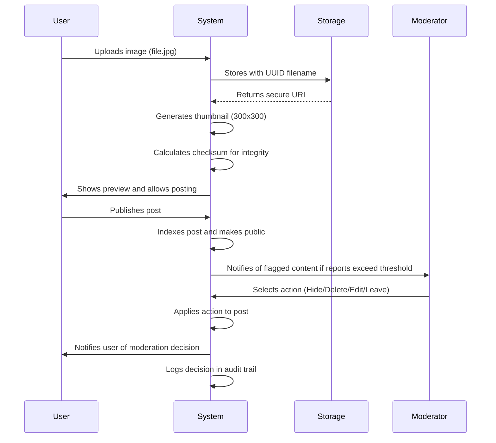
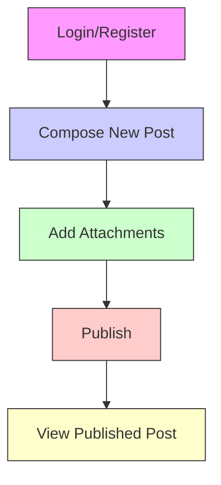

# CivicForum: Economic and Political Discussion Platform

## Service Vision

CivicForum is a simple, open platform designed to facilitate meaningful discourse on economic and political topics. The platform is built to encourage thoughtful dialogue while actively preventing abuse, misinformation, and harassment through automated and human moderation. Unlike traditional forums that rely on reactive moderation, CivicForum implements proactive, transparent systems that empower citizens to maintain community standards.

The core value proposition is simplicity without compromise: users can easily post, comment, and share relevant files without technical barriers, while the system ensures content quality and community safety through clear, consistent rules and transparent moderation.

## Core Value Proposition

CivicForum distinguishes itself from other discussion platforms by balancing three critical needs:

1. **Accessibility**: Minimal barriers to entry for participation
2. **Trust**: Transparent moderation that users understand and believe in
3. **Quality Control**: Effective prevention of harmful content without over-censorship

The service is designed for citizens who seek substantive discussion on public affairs—students, professionals, retired individuals, and civic-minded community members—who value evidence-based dialogue over inflammatory rhetoric.

This platform does not aim to be the largest forum with the most users; rather, it seeks to be the most trusted space for economic and political conversation.

## Target Audience

The primary user base consists of adults aged 18-70 who regularly consume news and policy information and want to engage in thoughtful discussion. Secondary audiences include educators who use the platform for classroom dialogue, journalists seeking public sentiment analysis, and civil society organizations monitoring community discourse.

The platform is intentionally designed to avoid catering to power users or content creators. It is not a social media platform, a blogging service, or a professional network—it is a discussion forum.

## User Actors

### Citizen Actor

A Citizen is any registered user who participates in the forum through posting, commenting, reporting, or viewing content. All new users start as Citizens. Citizens have the following permissions and responsibilities:

- Can create new posts with text content
- Can attach up to five files or images per post
- Can comment on any public post
- Can reply to other comments in threaded format
- Can report content that violates community guidelines
- Can view public discussion threads
- Can appeal moderation decisions
- Must adhere to all community rules

Citizens are not permitted to edit their own posts after publication. This preserves the integrity of discussion threads and prevents post-altering manipulations.

### Moderator Actor

Moderators are verified users with special permissions to maintain content quality and community standards. Moderators are selected by the system administration based on demonstrated judgment, consistency, and community trust. Not all users can become moderators.

Moderators have the following permissions:

- Can view all flagged content in review queue
- Can access complete post histories with comment chains
- Can take one of four actions on flagged content:
  - Leave Unchanged
  - Edit (with public modifier note)
  - Hide from Public
  - Delete Permanently
- Can suspend user accounts
- Can permanently ban users
- Can review appeals from citizens
- Can view redacted moderation logs

Moderators are prohibited from posting on the forum while active, to avoid conflicts of interest. All moderator actions are permanently logged and subject to administrative audit.

### System Actor

The System consists of automated components that handle technical operations, detection, and operational workflows. These include:

- File upload processor
- Content scanning engine
- Report aggregation system
- Automated flagging mechanism
- Notification system
- Audit log writer
- Archival system

The System enforces rules based on programmed logic, without human intervention. It does not make subjective judgments—only binary decisions based on predefined criteria.

## Authentication Requirements

Authentication is required for all actions beyond reading public content. The system uses email-based registration with JWT token authentication.

- Users must register with a valid email address
- Registration requires email verification
- Passwords must meet complexity requirements (minimum 12 characters, including uppercase, lowercase, number, and symbol)
- Sessions expire after 30 days of inactivity
- Users can view active sessions and revoke them individually
- Two-factor authentication is available but optional
- All authentication events are logged for security auditing
- IP addresses are recorded at login for fraud detection

Access control is enforced at the API level, ensuring that only authorized actions can be performed by each user type.

## Access Control Summary

| Action | Citizen | Moderator | Guest |
|--------|---------|-----------|-------|
| View public posts | ✅ | ✅ | ✅ |
| Create new post | ✅ | ✅ | ❌ |
| Comment on post | ✅ | ✅ | ❌ |
| Reply to comment | ✅ | ✅ | ❌ |
| Upload file | ✅ | ✅ | ❌ |
| Report content | ✅ | ✅ | ❌ |
| View own moderation history | ✅ | ✅ | ❌ |
| View moderator queue | ❌ | ✅ | ❌ |
| Edit content | ❌ | ✅ | ❌ |
| Hide content | ❌ | ✅ | ❌ |
| Delete content | ❌ | ✅ | ❌ |
| Suspend account | ❌ | ✅ | ❌ |
| Permanently ban | ❌ | ✅ | ❌ |
| Appeal moderation | ✅ | ✅ | ❌ |

## Functional Requirements

### Post Creation

WHEN a Citizen wishes to create a new post, THE system SHALL present a form with:

- Text input field with Markdown formatting (bold, italic, lists)
- Attachment upload area allowing up to five files
- Category selector (Economics, Politics, Policy, Other)
- Checkbox for "Public" visibility (always enabled)

WHEN the user submits the form, THE system SHALL:

- Validate that at least one character exists in the text body and all attachments are under 10MB
- Generate a unique post ID in format `POST-YYYYMMDD-NNNN` where NNNN is a 4-digit sequence
- Store the post content in the database with user ID and timestamp
- Process each attachment: validate type, scan for malware, generate thumbnails if applicable, store in secure bucket
- Publish the post to the public feed immediately

IF the user attempts to upload more than five files, THE system SHALL reject the submission with error: "Maximum five files allowed per post."

IF any uploaded file type is not permitted, THE system SHALL reject the specific file with message: "File [filename] is not allowed. Accepted types: JPG, PNG, PDF, DOCX, TXT."

### Image and File Attachments

WHEN a citizen uploads an image or file to a post, THE system SHALL:

- Accept only the following file extensions: .jpg, .jpeg, .png, .pdf, .docx, .txt
- Reject all executable file types including .exe, .dll, .bat, .sh, .cmd, .js, .py
- Enforce a maximum file size of 10 megabytes per file
- Generate a thumbnail preview for image files (JPG, PNG) with dimensions 300x300 pixels
- Create a checksum for each file to detect corruption
- Assign a unique CDN URL for each file with access tokens

WHEN a post with attachments is displayed to other users, THE system SHALL:

- Show attached images as thumbnails with click-to-enlarge capability
- Display file icons for non-image files
- Show file name and size (e.g., "budget_projections.pdf (4.2 MB)")
- Allow download of attachments without requiring login
- Preserve original file names but store with UUID-based filenames internally

IF an uploaded file is found to be corrupted during processing, THE system SHALL:

- Flag the file for deletion
- Notify the user: "One of your uploaded files was corrupted and could not be saved. Please re-upload."
- Remove the corrupted file from the post
- Maintain the rest of the post and other attachments

IF a user attempts to upload a file exceeding 10MB, THE system SHALL:

- Interrupt the upload before completion
- Display an error: "File exceeds 10MB limit. Please compress the file or split it into smaller parts."

### Commenting System

WHEN a Citizen wants to comment on a post, THE system SHALL:

- Display a comment box below the post
- Show existing comments in chronological order (oldest first)
- Allow threading with up to five levels of replies
- Show commenter name and time since comment
- Display "Report" button on every comment

WHEN a user submits a comment, THE system SHALL:

- Validate that the comment text is at least 5 characters
- Store comment in database with parent ID (if reply)
- Timestamp the comment with UTC time
- Notify the post author of new comments
- Trigger moderation flag if comment contains 5+ flagged keywords

WHEN a user replies to a comment, THE system SHALL:

- Show the reply indented under the parent comment
- Display parent comment header: "Replying to [name]"
- Limit replies to five levels deep
- If a parent comment is hidden or deleted, its children shall also be hidden

WHEN a comment is reported, THE system SHALL:

- Increment the comment's report counter
- Apply visual indicator: "Reported" badge
- If comment receives 3 reports within 24 hours, flag for moderator review
- Notify the comment author: "Your comment has been flagged for review."

WHEN a comment is removed by moderator, THE system SHALL:

- Replace the comment text with: "This comment has been removed by a moderator for violating community guidelines."
- Preserve the original comment in the audit log for appeal purposes
- Notify the original comment author: "Your comment was removed for violating our community standards."

### Content Visibility

WHEN a post is created, THE system SHALL make it visible to:

- All registered users
- Anonymous guests (non-logged-in users)

WHEN a post is hidden by moderator, THE system SHALL:

- Remove it from public search results, feed lists, and category pages
- Replace post content with: "This post has been hidden by moderators for review."
- Keep all comments visible but labeled as "[Post hidden]"
- Maintain complete record in database for appeal

WHEN a post is deleted permanently, THE system SHALL:

- Remove the post and all associated comments from public view
- Retain data in encrypted archive for 3 years
- Replace post placeholder with: "This post has been removed for serious violations of community standards."

WHEN a comment is linked from an external website, THE system SHALL return a 404 error if the post/comment was hidden or deleted.

## Visual Content Workflow

## Moderation System

### User Reporting

WHEN a citizen identifies content that violates community guidelines, THE system SHALL provide a "Report" button on every post and comment.

WHEN a citizen clicks the "Report" button, THE system SHALL prompt the user to select a reason from predefined categories: "Hate Speech", "Threats", "Harassment", "False Information", "Spam", "Other".

WHEN a report is submitted, THE system SHALL anonymously record the reporter's citizen ID, the target content ID, the selected reason, and the timestamp.

WHILE a post or comment has active reports, THE system SHALL display a visual indicator (e.g., "Reported") on the content to all users.

WHERE content receives 3 or more reports within 24 hours, THE system SHALL automatically flag it for moderator review.

IF a report is submitted for content that has already been moderated, THE system SHALL notify the reporter "This content is under review" and not create a duplicate report.

### Moderator Review

WHILE a flagged item is pending review, THE system SHALL display it in the moderator's review queue with: the content text, attached media, reporter reasons, and timestamps.

WHEN a moderator views a flagged item, THE system SHALL show the complete post history, including all comments and attachments.

WHEN a moderator takes action on a flagged item, THE system SHALL require the moderator to select one of: "Leave Unchanged", "Edit (with reason)", "Hide from Public", "Delete Permanently".

WHEN a moderator selects "Edit (with reason)", THE system SHALL allow the moderator to modify the post content with a redacted note visible to all users: "[Modified by moderator: {reason}]".

WHEN a moderator selects "Hide from Public", THE system SHALL: remove the content from public feeds and search results, but retain it in the database for appeal processing.

WHEN a moderator selects "Delete Permanently", THE system SHALL remove the content and all associated data from active systems and archive it for compliance.

WHILE a moderator is reviewing content, THE system SHALL prevent the original author from editing or deleting the reported item.

### Content Removal

IF content is deleted for "Hate Speech", "Threats", or "Harassment", THE system SHALL automatically notify the original poster: "Your post was removed for violating our community standards on {reason}."

IF content is hidden for "False Information" or "Spam", THE system SHALL replace it with: "This content has been hidden by moderators for review."

WHERE content contains illegal material (e.g., child exploitation, terrorism), THE system SHALL immediately delete permanently and notify authorities as required by law.

WHEN content is removed, THE system SHALL retain a redacted version in the audit log with: original ID, moderation decision, moderator ID, and timestamp.

WHILE removed content is archived, THE system SHALL make it accessible to law enforcement upon valid legal request.

### Appeals Process

IF a citizen’s content is removed, THE system SHALL allow the citizen to submit an appeal within 14 days.

WHEN a citizen submits an appeal, THE system SHALL present a form asking: "Why do you believe this removal was incorrect?" with a maximum of 500 characters.

WHEN an appeal is submitted, THE system SHALL notify the original moderator and assign a secondary moderator for review.

WHILE an appeal is under review, THE system SHALL keep the content in its current state (hidden or deleted).

IF the appeal is upheld, THE system SHALL restore the content to public view with a label: "Appeal upheld. Content restored."

IF the appeal is denied, THE system SHALL notify the citizen: "The moderation decision has been upheld. This content remains removed."

WHERE a citizen appeals multiple times for the same content, THE system SHALL flag them as a "repeated appeals user" for potential review.

### Account Suspension

IF a citizen receives 5 content removals within a 30-day period, THE system SHALL automatically suspend their account for 7 days.

WHEN an account is suspended, THE system SHALL notify the citizen: "Your account has been suspended for violating our community standards. You will be unable to post or comment for 7 days."

WHILE an account is suspended, THE system SHALL prevent all posting, commenting, and file uploads.

IF a suspended account receives another content removal during suspension, THE system SHALL extend the suspension by an additional 7 days.

IF a citizen accumulates 10 content removals within a 90-day period, THE system SHALL permanently ban their account.

WHEN an account is permanently banned, THE system SHALL permanently delete all created content, disable all associated attachments, and notify: "Your account has been permanently banned for systematic violations of community standards. You cannot create a new account."

IF a citizen believes a suspension or ban is incorrect, THE system SHALL provide an appeal pathway to an escalated moderation team.

WHEN an escalated appeal is submitted, THE system SHALL provide a detailed log of all moderation actions against the account.

WHERE an account reinstatement is approved, THE system SHALL restore the citizen’s ability to post and comment, but keep a permanent record of their moderation history.

## Transparency and Fairness

THE system SHALL maintain a public moderation transparency report updated weekly, showing: total reports received, actions taken, average review time, and appeal success rate.

THE system SHALL make moderator decisions visible to users: "This post was removed by moderator {username} on {date} for {reason}."

WHERE moderators make inconsistent decisions, THE system SHALL flag their actions for internal review.

THE system SHALL require all moderator actions to include a reason code that is publicly documented in the moderation guidelines.

THE system SHALL allow citizens to view their own moderation history: number of reports received, removals, suspensions, and appeals.

## Business Rules

### Attachment Limits

WHEN a user attempts to attach more than five files to a single post, THE system SHALL reject the submission with error: "Maximum of five files allowed per post."

WHEN a user uploads an attachment, THE system SHALL count it toward their post's attachment limit immediately upon upload.

WHEN a moderator edits a post and removes an attachment, THE system SHALL decrement the attachment count in the post metadata.

### Posting Frequency

WHEN a citizen submits a new post, THE system SHALL check:

- No more than 1 post per minute
- No more than 10 posts per hour
- No more than 50 posts per day

IF limit exceeded, THE system SHALL display: "You have reached your posting limit. Please wait before posting again."

WHEN a user's account is suspended, THE system SHALL temporarily override post frequency limits to prevent circumvention.

### File Types Allowed

WHEN a user uploads a file, THE system SHALL validate the file extension against allowed types:

- Images: .jpg, .jpeg, .png
- Documents: .pdf, .docx
- Text: .txt

ALL OTHER FILE TYPES SHALL BE REJECTED.

### Content Restrictions

WHEN a user submits a post or comment, THE system SHALL monitor for:

- IP addresses (must be blocked)
- Email addresses (must be blocked)
- Direct HTTP/HTTPS links to external websites (must be blocked)
- Crypto wallet addresses (must be blocked)
- Tokens or hashtags promoting illegal activity

IF any restricted element is detected, THE system SHALL:

- Replace it with "[redacted]"
- Log the attempt
- Flag the post for moderator review
- Notify user: "Some content was removed for violating our policy on external links and personal data."

## Performance Requirements

WHEN a user loads the homepage, THE system SHALL:

- Display all posts within 1500 milliseconds (1.5 seconds)
- Render all attachments and images within 2000 milliseconds (2 seconds)
- Load all comment threads with up to 100 replies within 2500 milliseconds (2.5 seconds)

WHEN a user uploads a file, THE system SHALL:

- Complete upload of 10MB file within 15000 milliseconds (15 seconds)
- Allow resumable uploads for large files
- Provide progress bar with percentage indication

WHEN a user performs a search, THE system SHALL:

- Return results for text queries within 1000 milliseconds (1 second)
- Support full-text search with autocomplete
- Return results for tag searches (e.g., #economy) within 800 milliseconds
- Include filters for date range, category, and author

THE system SHALL maintain 99.9% uptime over a 30-day period, allowing for scheduled maintenance windows during low-traffic hours (2:00-4:00 UTC).

## Compliance

### Data Retention

THE system SHALL retain all user-generated content (posts, comments, attachments) for three years from the date of creation.

AFTER three years, THE system SHALL:

- Archive content in encrypted, compressed format to cold storage
- Delete all links to active databases
- Disallow search or display of archived content
- Preserve archive backups with version control

THE system SHALL retain moderation logs permanently for audit purposes.

### Privacy Policy

THE system SHALL comply with all relevant data protection regulations including GDPR, CCPA, and other applicable standards.

THE system SHALL:

- Collect only minimum user data necessary for operation (email, password hash, session tokens)
- Never sell or share user data with third parties
- Permit users to download their data in JSON format
- Permit users to request account deletion (permanently removing all personal data)
- Encrypt all personal data at rest and in transit

### Content Archiving

WHEN content is deleted for legal or policy violations, THE system SHALL:

- Store redacted metadata (ID, type, action, timestamp, moderator ID)
- Store full content in encrypted archive with audit trail
- Make archive accessible to law enforcement via court order
- Never delete archive data before mandatory retention period

### Legal Compliance

THE system SHALL:

- Implement mechanisms to detect and report illegal content (e.g., CSAM, terrorist material)
- Cooperate with law enforcement agencies under valid warrants
- Maintain a legal compliance officer with contact information available publicly
- Document all interactions with authorities in a secure audit log
- Train staff and moderators on legal obligations

### User Consent

WHEN a user registers, THE system SHALL:

- Present the Privacy Policy and Community Guidelines for acceptance
- Require explicit checkbox confirmation
- Keep record of consent timestamp and IP address
- Allow users to withdraw consent (account deletion)
- Notify users of changes to policies (with 30-day notice period)

## Error Handling

### Upload Failure

WHEN a file upload fails, THE system SHALL:

- Return specific error reason (network, size, type, corrupted)
- Display user-friendly message: "File failed to upload. Reason: [reason]"
- Do not disclose technical details (e.g., server errors, filename paths)
- Allow user to retry the upload
- Maintain selected file in browser cache

### Authentication Failure

WHEN authentication fails, THE system SHALL:

- Return "Invalid email or password" (never specify which is wrong)
- Log authentication attempts with IP and time
- Implement 5-attempt lockout with 15-minute cooldown
- Never display "Account does not exist" to prevent account enumeration

### Server Errors

WHEN a server error occurs (5xx), THE system SHALL:

- Return generic message: "An unexpected error occurred. Please try again later."
- Log full error details in internal system for debugging
- Include unique error ID for customer support reference
- Deploy automatic failure monitoring and alerting
- Do not expose stack traces or database errors to users

### Media Corruption

WHEN a media file is found to be corrupted during processing, THE system SHALL:

- Immediately abandon the file
- Delete stored partial data
- Notify user: "One of your uploaded files appears to be corrupted. Please re-upload."
- Record error in system monitoring
- Allow user to re-upload without affecting other files

### File Format Rejection

WHEN an unsupported file type is submitted, THE system SHALL:

- Clearly list accepted formats in the error message
- Example: "Only JPG, PNG, PDF, DOCX, and TXT files are permitted."
- Show preview of accepted icons next to upload button
- Not accept attempts to rename file extensions to bypass filter
- Log attempts to upload forbidden types

## User Journey - Post Creation

## Search Functionality

WHEN a user enters a search term, THE system SHALL:

- Search in post title, body, and comment text
- Return results ordered by relevance and recency
- Highlight matching terms in results
- Allow filtering by:
  - Date range (past week, month, year)
  - Category (Economics, Politics, Policy, Other)
  - Author (username)
  - File attachment (Has file / No file)

WHEN a user selects a search result, THE system SHALL:

- Navigate directly to the matching post
- Highlight the specific comment if the search matched a comment
- Show context of surrounding comments

THE system SHALL NOT index attachments or non-text content for search.

## Indexing and Performance Considerations

- All text content shall be indexed using full-text search engine (e.g., Elasticsearch)
- Attachment metadata (filename, size, type) shall be indexed for filtering
- User activity shall be logged for analytics but not indexed for search
- Search shall be cached for popular queries for up to 30 minutes
- Daily background optimization shall maintain search performance

## Document Purpose

This document provides the complete business requirements specification for the CivicForum service. It defines what the system must do from a user and administrative perspective, without specifying implementation details. This document serves as the authoritative source for all subsequent phases of development: Database Design, API Specification, Testing, and Implementation