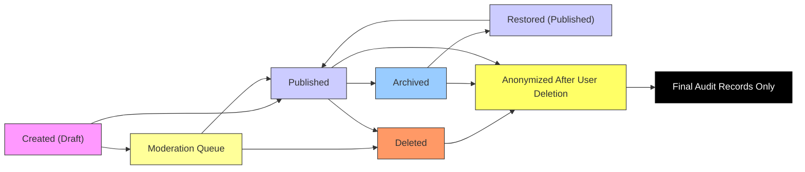

# Data Lifecycle for Political Discussion Board

This document defines the complete lifecycle of content and user data within the political discussion board system. It specifies state transitions, retention policies, and deletion behaviors from a business perspective. All requirements are written in natural language using EARS format to ensure unambiguous implementation by backend developers.

## Content Creation

Content is created when a citizen submits a new post or comment. Creation is bound by validation rules, authentication status, and attachment limits.

WHEN a citizen submits a new post, THE system SHALL require the post to contain at least 5 characters of text.
WHEN a citizen submits a new comment, THE system SHALL require the comment to contain at least 3 characters of text.
WHEN a citizen submits a post or comment with attachments, THE system SHALL allow up to 3 files per submission.
WHERE a file is uploaded, THE system SHALL validate that each file is under 10 MB in size.
WHERE a file is uploaded, THE system SHALL permit only .jpg, .jpeg, .png, .gif, .pdf, .doc, and .docx file types.
IF a citizen attempts to submit a post with empty text and no attachments, THEN THE system SHALL reject the submission with message: \"Your post must include text or at least one file.\"
IF a citizen attempts to upload more than 3 files, THEN THE system SHALL reject the submission with message: \"You may attach up to 3 files per post or comment.\"
IF a citizen attempts to upload a file larger than 10 MB, THEN THE system SHALL reject the submission with message: \"Each file must be under 10 MB.\"
IF a citizen attempts to upload a file with unsupported type, THEN THE system SHALL reject the submission with message: \"Unsupported file type. Only JPG, PNG, GIF, PDF, DOC, and DOCX are allowed.\"

## Content Publishing

Content becomes visible to other users only after it is successfully created and passes initial validation.

WHEN a citizen submits a valid post, THE system SHALL immediately store it in draft state.
WHEN a citizen submits a valid comment, THE system SHALL immediately link it to the parent post and store it in published state.
WHILE a post is in draft state, THE system SHALL hide it from all public feeds and search results.
WHEN a post has been reviewed by a moderator for compliance, THE system SHALL transition it to published state if no violations are found.
WHEN a post is flagged by the system or a user for potential violations, THE system SHALL hold it in moderation queue and notify an available moderator.
WHILE a post is in moderation queue, THE system SHALL hide it from public view.
WHEN a moderator approves a post in moderation queue, THE system SHALL transition it to published state and notify the author.
WHEN a moderator rejects a post in moderation queue, THE system SHALL transition it to deleted state and notify the author with reason.

## Content Update

Users may update their own content only under specific conditions.

WHEN a citizen edits their own post, THE system SHALL allow editing only within 24 hours of the original submission time.
WHEN a citizen edits their own comment, THE system SHALL allow editing only within 24 hours of the original submission time.
WHEN a citizen attempts to edit a post or comment older than 24 hours, THEN THE system SHALL display message: \"This post or comment can no longer be edited.\"
WHEN a citizen edits a post or comment, THE system SHALL preserve the original version in revision history.
WHEN a post or comment is edited, THE system SHALL update the \"Last Edited\" timestamp and mark it with \"Edited\" badge.
WHEN a moderator edits a post or comment, THE system SHALL allow editing regardless of age and SHALL not trigger a \"Edited\" badge.
WHEN a moderator edits a post or comment, THE system SHALL log the moderator’s ID and edit reason for audit.

## Content Moderation

Moderators have authority to review, manage, and remove content based on community guidelines.

WHEN a moderator deletes a post, THE system SHALL transition the post to deleted state and flag it as \"Moderator-Removed\".
WHEN a moderator deletes a comment, THE system SHALL transition the comment to deleted state and display \"[Deleted by moderator]\" in its place.
WHEN a moderator locks a thread, THE system SHALL prevent further comments on that post and display message: \"This thread is locked. No further comments allowed.\"
WHILE a thread is locked, THE system SHALL reject any new comment submissions with message: \"This thread is locked. No further comments allowed.\"
WHEN a moderator marks a post as verified, THE system SHALL display a verification badge on the post and only allow verified badges to be added by moderators.
WHEN a post is marked as verified, THE system SHALL log the moderator’s ID and verification reason in audit log.
WHEN a moderator attempts to delete another moderator’s content, THEN THE system SHALL deny the request and log attempt as violation.

## Content Archival

Content may be archived after prolonged inactivity to optimize performance and manage storage.

WHILE a post has received no comments or interactions for 2 years, THE system SHALL automatically transition it to archival state.
WHEN a post is moved to archival state, THE system SHALL remove it from public feeds, search results, and trending displays.
WHILE a post is in archival state, THE system SHALL retain all text, attachments, and metadata.
WHEN a citizen clicks on an archived post link, THE system SHALL display the content but show message: \"This post is archived. No new comments allowed.\"
WHILE a post is archived, THE system SHALL prevent any new comments, edits, or votes.
WHEN an archived post receives a new comment from a moderator, THE system SHALL automatically restore it to published state.

## User Account Deletion

When a user requests deletion, their data must be managed in compliance with privacy and audit requirements.

WHEN a citizen requests account deletion, THE system SHALL initiate a 7-day grace period before final deletion.
WHILE the grace period is active, THE system SHALL prevent login and disable all posting functionality.
WHEN the 7-day grace period expires, THE system SHALL permanently delete the user’s account.
WHEN a user account is permanently deleted, THE system SHALL anonymize all posts and comments made by the user by replacing the username with \"[Deleted User]\".
WHEN a user account is permanently deleted, THE system SHALL retain attached files and content for audit purposes.
WHEN a user account is permanently deleted, THE system SHALL purge personal identifiers such as email and IP history.
WHEN a moderator deletes a user account for policy violation, THE system SHALL bypass the 7-day grace period and initiate immediate anonymization.
WHEN any content is anonymized due to user deletion, THE system SHALL preserve the integrity of comment threads by maintaining parent-child relationships.

### State Transition Diagram

### Attachment Retention Policy

All file attachments uploaded with posts or comments SHALL be retained for the lifetime of the associated content.
If a post is deleted, its attachments SHALL remain stored for a minimum of 13 months for audit and legal compliance.
After 13 months, attachments from deleted posts SHALL be permanently purged.
Attachments from active posts SHALL be retained indefinitely.
Attachments from archived posts SHALL be retained indefinitely unless the post is subsequently deleted.

It is the responsibility of the backend system to ensure that file deletion is contingent only on parent content state—not user action, moderation, or direct database access.

> *Developer Note: This document defines **business requirements only**. All technical implementations (architecture, APIs, database design, etc.) are at the discretion of the development team.*