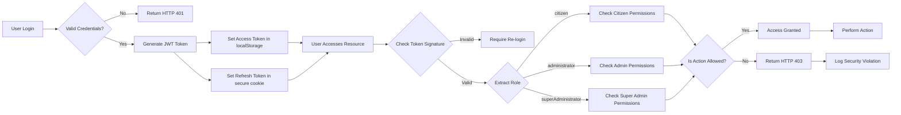
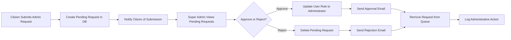
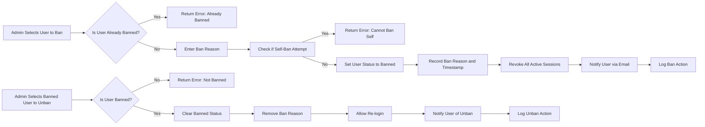
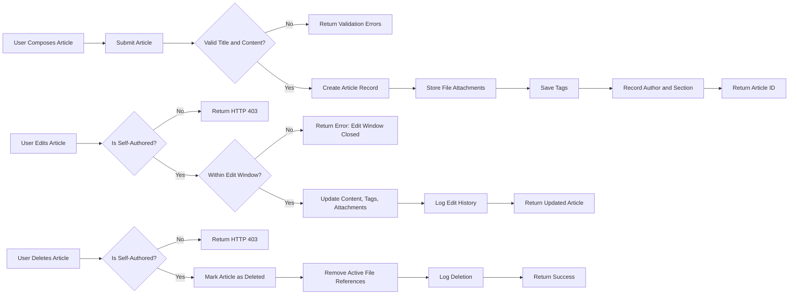
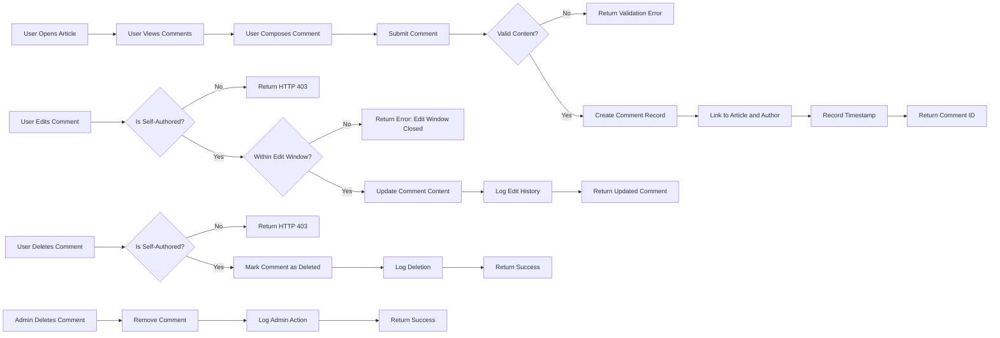
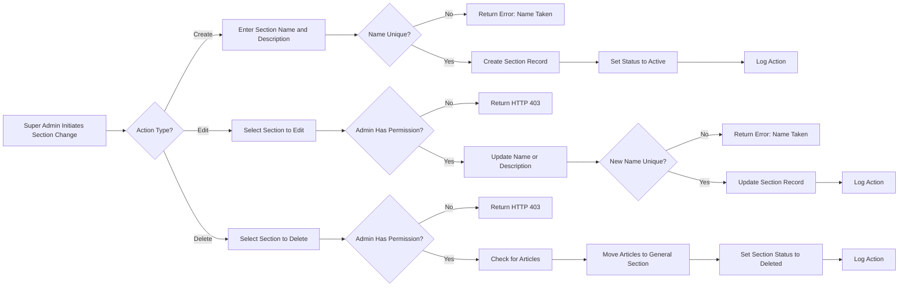

# Economic/Political Discussion Board Requirements Specification

## Overview

This document provides the complete requirements specification for the Economic/Political Discussion Board system. All requirements are written in natural language business terms to serve as an authoritative source for implementing the backend application. This specification follows the EARS format (Event, Action, Result, Scenario) where applicable, contains complete business context, and includes all necessary details for developers to implement the system without additional clarification.

The system is designed to foster informed, civil discourse on economic systems and political ideologies, countering the fragmentation and polarization characteristic of modern digital discourse.

## Service Prefix

The service prefix for all generated artifacts is: `economicBoard`

This prefix will be consistently used across:
- Database table names: `economicBoard_users`, `economicBoard_articles`, etc.
- API endpoint paths: `/economicBoard/api/v1/...`
- DTO class names: `IEconomicBoardUser`, `IEconomicBoardArticle`, etc.
- File and directory naming conventions: `economicBoard-auth-service`, `economicBoard-content-service`

## User Actors

The system defines three distinct user actor types, each with a specific set of permissions and responsibilities:

### Citizen

Citizens are regular users who interact with the platform to express opinions, share insights, and participate in economic and political discussions.

#### Permissions
- Can register an account using a valid email address and password
- Can log in to their account using their email address and password
- Can change their password at any time
- Can delete their account, which permanently removes all associated articles and comments
- Can set and edit their profile display name (2-50 characters)
- Can set and edit their profile bio text (0-500 characters)
- Can view the public profile of any other citizen, including their display name, bio, list of articles, and list of comments
- Can create articles in any existing section
- Can attach multiple files and images to their articles
- Can add multiple free-text tags to their articles (maximum 10 tags)
- Can edit their own articles, including title, content, attachments, and tags
- Can delete their own articles
- Can write comments on any article
- Can edit their own comments
- Can delete their own comments
- Can search articles by title or content
- Can filter search results by tags
- Can view paginated lists of articles within a section
- Can sort article lists by newest first or oldest first
- Can view the full content of any article, including attachments
- Can download files and images attached to articles
- Can submit a request to become an administrator, providing a reason text (minimum 50 characters)

#### Restrictions
- Cannot create, edit, or delete sections
- Cannot delete articles or comments written by other citizens
- Cannot ban or unban users
- Cannot promote or demote administrators
- Cannot view pending administrator requests

### Administrator

Administrators are citizens with elevated privileges to maintain platform integrity and moderation.

#### Permissions
- Has all capabilities of a Citizen
- Can create new sections with a name (2-50 characters) and description (0-500 characters)
- Can edit existing sections, including name and description
- Can delete existing sections (moves associated articles to "General" section)
- Can delete any article on the platform
- Can delete any comment on the platform
- Can ban any user, including other administrators, by providing a reason (minimum 10 characters)
- Can unban any banned user
- Can view the complete list of banned users
- Can view the reason for each ban

#### Restrictions
- Cannot promote another user to super administrator
- Cannot demote a super administrator
- Cannot demote themselves
- Cannot approve or reject administrator requests

### Super Administrator

Super administrators have ultimate authority over the platform governance and administrator hierarchy.

#### Permissions
- Has all capabilities of an Administrator
- Can promote a regular administrator to super administrator
- Can demote a super administrator to a regular administrator (except themselves)
- Can approve or reject administrator registration requests
- Can view all pending administrator requests
- Can reset any user's password
- Can override any content deletion or ban decision
- Can view all administrator actions in the audit log

#### Restrictions
- Cannot demote themselves
- Cannot be demoted by any other user

## Authentication and Session Management

### Registration
WHEN a new user visits the platform, THE system SHALL allow them to register by providing:
- A valid email address (RFC 5322 format)
- A password with minimum 12 characters, containing at least one uppercase letter, one lowercase letter, one digit, and one special character
- A display name (minimum 2 characters, maximum 50)

WHEN a user submits a registration request, THE system SHALL:
- Validate the email format (RFC 5322)
- Check for existing email address in database
- Validate display name contains only alphanumeric characters, underscores, and hyphens
- Check for existing display name
- Create a new user account with status "confirmed"
- Generate a confirmation token
- Send a confirmation email with verification link
- Store password as bcrypt hash with cost factor 12
- Log registration event with timestamp and IP address

IF the email is already registered, THEN THE system SHALL respond with error code "ECONOMICBOARD_EMAIL_ALREADY_EXISTS" and display message: "An account with this email already exists."

IF the display name is already taken, THEN THE system SHALL respond with error code "ECONOMICBOARD_DISPLAY_NAME_TAKEN" and display message: "This display name is already in use. Please choose another."

IF password is less than 12 characters, THEN THE system SHALL respond with error code "ECONOMICBOARD_PASSWORD_TOO_SHORT" and display message: "Password must be at least 12 characters long and contain uppercase, lowercase, digit, and special character."

IF email format is invalid, THEN THE system SHALL respond with error code "ECONOMICBOARD_INVALID_EMAIL" and display message: "Invalid email format."

WHILE the account is unverified, THE system SHALL NOT allow login.

### Login
WHEN a user attempts to log in, THE system SHALL:
- Accept email and password credentials
- Find user by email address
- Verify password against stored hash
- Set active session with JWT access token (15-minute expiration)
- Return refresh token (7-day expiration)
- Log login event with timestamp and IP address

IF email is not found, THEN THE system SHALL respond with error code "ECONOMICBOARD_INVALID_CREDENTIALS" and display message: "Email or password is incorrect."

IF password does not match, THEN THE system SHALL respond with error code "ECONOMICBOARD_INVALID_CREDENTIALS" and display message: "Email or password is incorrect."

IF account is unverified, THEN THE system SHALL respond with error code "ECONOMICBOARD_ACCOUNT_NOT_VERIFIED" and display message: "Please verify your email address before logging in."

IF account is banned, THEN THE system SHALL respond with error code "ECONOMICBOARD_ACCOUNT_BANNED" and display message: "Your account has been banned. Contact an administrator for more information."

WHEN login is successful, THE system SHALL store session in Redis with TTL of 15 minutes and return JWT token with payload:
{
  "userId": "uuid",
  "role": "citizen|administrator|superAdministrator",
  "permissions": ["read", "write", "edit", "delete", "ban", "admin"],
  "exp": "timestamp"
}

### Password Change
WHEN an authenticated user requests to change password, THE system SHALL:
- Require current password for verification
- Require new password with minimum 12 characters, containing at least one uppercase letter, one lowercase letter, one digit, and one special character
- Validate that new password is different from current password
- Update password hash in database
- Log password change event with timestamp

IF current password is incorrect, THEN THE system SHALL respond with error code "ECONOMICBOARD_INCORRECT_CURRENT_PASSWORD" and display message: "Current password is incorrect."

IF new password is less than 12 characters, THEN THE system SHALL respond with error code "ECONOMICBOARD_PASSWORD_TOO_SHORT" and display message: "New password must be at least 12 characters long and contain uppercase, lowercase, digit, and special character."

IF new password is identical to current password, THEN THE system SHALL respond with error code "ECONOMICBOARD_PASSWORD_SAME_AS_CURRENT" and display message: "New password must be different from your current password."

WHEN password is successfully changed, THE system SHALL:
- Invalidate all existing sessions
- Require re-login with new password

### Account Deletion
WHEN an authenticated user requests account deletion, THE system SHALL:
- Require confirmation with user password
- Mark account as "deleted" with deletion timestamp
- Remove all articles, comments, and profile information
- Purge personal data from search indexes
- Keep encrypted audit log of deletion event including timestamp and IP address

WHEN an account is deleted, THE system SHALL:
- Immediately invalidate all sessions
- Prevent any future login with credentials
- Replace all content links with "[Deleted User]"

### Email Verification
WHEN a user clicks the verification link in email, THE system SHALL:
- Validate verification token
- Update account status to "confirmed"
- Clear verification token from database
- Redirect to login page with confirmation message

IF verification token is invalid or expired, THEN THE system SHALL respond with error code "ECONOMICBOARD_INVALID_VERIFICATION_TOKEN" and display message: "This verification link is invalid or has expired."

IF token is expired (7-day window), THEN THE system SHALL allow user to request new verification email.

## User Profile Management

### Profile Editing
WHEN an authenticated user edits their profile, THE system SHALL allow updates to:
- Display name (minimum 2 characters, maximum 50)
- Bio text (maximum 500 characters)

WHEN a user changes display name, THE system SHALL:
- Check for name conflicts with existing users
- Validate name format (alphanumeric, underscore, hyphen)

IF display name conflict detected, THEN THE system SHALL respond with error code "ECONOMICBOARD_DISPLAY_NAME_TAKEN" and display message: "This display name is already in use. Please choose another."

IF display name contains invalid characters, THEN THE system SHALL respond with error code "ECONOMICBOARD_INVALID_DISPLAY_NAME" and display message: "Display name can only contain letters, numbers, underscores, and hyphens."

IF bio exceeds 500 characters, THEN THE system SHALL respond with error code "ECONOMICBOARD_BIO_TOO_LONG" and display message: "Bio cannot exceed 500 characters."

### Profile Viewing
WHEN a user views another user's profile, THE system SHALL display:
- Display name
- Bio text
- Number of articles written
- Number of comments written
- Date joined
- List of articles (with title, section, posted date - max 20 per page)
- List of comments (with content, posted date - max 20 per page)

IF the viewed user's account is deleted, THE system SHALL display "[Deleted User]" instead of display name and bio

IF the viewed user's account is banned, THE system SHALL display "[Banned User]" instead of display name and bio, and hide all content links

THE system SHALL NOT display any private information such as email, password status, or verification status

## Section Management

### Section Creation
WHEN a super administrator requests to create a section, THE system SHALL:
- Require section name (minimum 2 characters, maximum 50, unique)
- Require section description (maximum 500 characters)
- Validate section name uniqueness
- Set creation timestamp
- Set status to "active"

IF section name is missing, THEN THE system SHALL respond with error code "ECONOMICBOARD_SECTION_NAME_REQUIRED" and display message: "Section name is required."

IF section name is less than 2 characters, THEN THE system SHALL respond with error code "ECONOMICBOARD_SECTION_NAME_TOO_SHORT" and display message: "Section name must be at least 2 characters long."

IF section name exceeds 50 characters, THEN THE system SHALL respond with error code "ECONOMICBOARD_SECTION_NAME_TOO_LONG" and display message: "Section name cannot exceed 50 characters."

IF section name already exists, THEN THE system SHALL respond with error code "ECONOMICBOARD_SECTION_EXISTS" and display message: "A section with this name already exists."

IF section description exceeds 500 characters, THEN THE system SHALL respond with error code "ECONOMICBOARD_SECTION_DESCRIPTION_TOO_LONG" and display message: "Section description cannot exceed 500 characters."

### Section Editing
WHEN a super administrator updates a section, THE system SHALL allow edits to:
- Section name (minimum 2, maximum 50)
- Section description (maximum 500)

WHEN section name is changed, THE system SHALL:
- Check for name conflicts with existing sections
- Update all articles with the new section reference

IF section name conflict detected, THEN THE system SHALL respond with error code "ECONOMICBOARD_SECTION_EXISTS" and display message: "A section with this name already exists."

WHEN section is edited, THE system SHALL log the super administrator who made the change and timestamp

### Section Deletion
WHEN a super administrator deletes a section, THE system SHALL:
- Associate all articles in the section with "General" section (default)
- Mark section as "deleted" with deletion timestamp
- Prevent new articles from being created in the section
- Keep section name in deleted list for audit purposes

WHEN a section is deleted, THE system SHALL NOT delete any articles or comments

WHEN a deleted section is requested, THE system SHALL return error code "ECONOMICBOARD_SECTION_NOT_FOUND" with message: "This section has been deleted."

## Article Creation & Management

### Article Creation
WHEN a user creates an article, THE system SHALL require:
- Title (minimum 5 characters, maximum 200)
- Content (minimum 100 characters)
- Section ID (must be active section)

WHEN article is created, THE system SHALL:
- Generate unique article ID
- Set creation timestamp
- Set last edited timestamp
- Associate with user's profile
- Set view count to 0
- Set comment count to 0

IF title is missing, THEN THE system SHALL respond with error code "ECONOMICBOARD_ARTICLE_TITLE_REQUIRED" and display message: "Article title is required."

IF title is less than 5 characters, THEN THE system SHALL respond with error code "ECONOMICBOARD_ARTICLE_TITLE_TOO_SHORT" and display message: "Title must be at least 5 characters long."

IF title exceeds 200 characters, THEN THE system SHALL respond with error code "ECONOMICBOARD_ARTICLE_TITLE_TOO_LONG" and display message: "Title cannot exceed 200 characters."

IF content is missing, THEN THE system SHALL respond with error code "ECONOMICBOARD_ARTICLE_CONTENT_REQUIRED" and display message: "Article content is required."

IF content is less than 100 characters, THEN THE system SHALL respond with error code "ECONOMICBOARD_ARTICLE_CONTENT_TOO_SHORT" and display message: "Content must be at least 100 characters long."

IF section is invalid or inactive, THEN THE system SHALL respond with error code "ECONOMICBOARD_INVALID_SECTION" and display message: "Invalid or inactive section selected."

### Article Editing
WHEN an author edits their own article, THE system SHALL allow edits to:
- Title (maximum 200 characters)
- Content (minimum 100 characters)
- Attached files
- Attached images
- Tags (free text, comma-separated)

WHEN article is edited, THE system SHALL:
- Update last edited timestamp
- Keep original creation timestamp
- Log editor identity

IF article title exceeds 200 characters, THEN THE system SHALL respond with error code "ECONOMICBOARD_ARTICLE_TITLE_TOO_LONG" and display message: "Title cannot exceed 200 characters."

IF article content exceeds 50,000 characters, THEN THE system SHALL respond with error code "ECONOMICBOARD_ARTICLE_CONTENT_TOO_LONG" and display message: "Content cannot exceed 50,000 characters."

WHEN adding tags, THE system SHALL accept up to 10 tags per article

WHEN other users attempt to edit an article, THE system SHALL respond with error code "ECONOMICBOARD_PERMISSION_DENIED" and display message: "You can only edit your own articles."

WHEN a user attempts to edit an article more than 72 hours after its creation, THE system SHALL respond with error code "ECONOMICBOARD_ARTICLE_EDIT_WINDOW_EXPIRED" and display message: "You can only edit your articles within the first 72 hours after posting."

### Article Deletion
WHEN an author deletes their own article, THE system SHALL:
- Mark article as "deleted" with deletion timestamp
- Remove from section article lists
- Hide article from search results
- Keep article record for audit purposes

WHEN an administrator deletes an article, THE system SHALL:
- Mark article as "deleted by admin" with deletion timestamp and admin ID
- Remove from section article lists
- Hide article from search results
- Keep article record for audit purposes
- Log deletion event with admin ID and timestamp

WHEN an article is deleted, THE system SHALL NOT delete any associated comments

WHEN a deleted article is requested, THE system SHALL return error code "ECONOMICBOARD_ARTICLE_NOT_FOUND" with message: "This article has been deleted."

## Article Listing & Sorting

### Section Article Listing
WHEN a user views articles in a section, THE system SHALL return:
- Article ID
- Title (maximum 200 characters)
- Author display name
- List of tags (maximum 5)
- Comment count
- Creation timestamp
- Status (active/deleted)

THE list SHALL be paginated with 20 articles per page

WHEN page is requested, THE system SHALL validate page number (1-100)

IF page number exceeds 100, THEN THE system SHALL return last page (100)

IF page number is less than 1, THEN THE system SHALL return page 1

### Sorting
WHEN a user requests article listing with sort criteria, THE system SHALL support:
- Newest first (creation timestamp: descending)
- Oldest first (creation timestamp: ascending)

WHEN sort parameter is provided as "newest", THE system SHALL order by creation timestamp DESC

WHEN sort parameter is provided as "oldest", THE system SHALL order by creation timestamp ASC

WHEN sort parameter is not specified, THE system SHALL default to "newest"

## Article Viewing

### Article Display
WHEN a user views an article, THE system SHALL show:
- Title (maximum 200 characters)
- Author display name
- Content (up to 50,000 characters)
- List of attached files with download URLs
- List of attached images with view URLs
- List of tags
- Creation timestamp
- Last edited timestamp
- View count
- Comment count

WHEN an article is deleted, THE system SHALL return error code "ECONOMICBOARD_ARTICLE_NOT_FOUND" with message: "This article has been deleted."

WHEN a user has been banned, THE system SHALL show content but replace author name with "[Banned User]"

WHEN an author's account is deleted, THE system SHALL replace author name with "[Deleted User]"

### File and Image Downloads
WHEN a user requests to download a file, THE system SHALL:
- Verify article exists and is active
- Verify file attachment exists
- Check user permissions
- Generate temporary signed URL for download (5-minute expiration)
- Increment download counter

WHEN a user requests to view an image, THE system SHALL:
- Verify article exists and is active
- Verify image attachment exists
- Check user permissions
- Return image with optimized display size
- Increment view counter

WHEN file or image request is made with invalid ID, THE system SHALL respond with error code "ECONOMICBOARD_FILE_NOT_FOUND" and display message: "File or image not found."

## Comment Management

### Comment Posting
WHEN a user posts a comment on an article, THE system SHALL require:
- Content (minimum 5 characters)
- Article ID (must exist and be active)

WHEN comment is posted, THE system SHALL:
- Generate unique comment ID
- Set creation timestamp
- Associate with user profile
- Associate with article ID
- Increment article comment count by 1

IF content is missing, THEN THE system SHALL respond with error code "ECONOMICBOARD_COMMENT_CONTENT_REQUIRED" and display message: "Comment content is required."

IF content is less than 5 characters, THEN THE system SHALL respond with error code "ECONOMICBOARD_COMMENT_CONTENT_TOO_SHORT" and display message: "Comment must be at least 5 characters long."

IF content exceeds 1,000 characters, THEN THE system SHALL respond with error code "ECONOMICBOARD_COMMENT_CONTENT_TOO_LONG" and display message: "Comment cannot exceed 1,000 characters."

IF article does not exist or is deleted, THEN THE system SHALL respond with error code "ECONOMICBOARD_ARTICLE_NOT_FOUND" and display message: "Cannot comment on deleted article."

IF user is banned, THEN THE system SHALL respond with error code "ECONOMICBOARD_ACCOUNT_BANNED" and display message: "Your account has been banned. You cannot post comments."

### Comment Viewing
WHEN a user views comments on an article, THE system SHALL return:
- Comment ID
- Author display name
- Content
- Creation timestamp
- Status (active/deleted)

Comments SHALL be sorted by creation timestamp ASC (oldest first)

Comments SHALL be paginated with 30 per page

WHEN a comment is deleted, THE system SHALL show:
- "[Deleted Comment]"
- Comment ID
- Deletion timestamp
- Author display name

WHEN an author's account is deleted or banned, THE system SHALL show:
- "[Deleted User]" or "[Banned User]"
- Comment content
- Creation timestamp

### Comment Editing
WHEN an author edits their own comment, THE system SHALL allow edits to:
- Comment content (minimum 5 characters, maximum 1,000)

WHEN a comment is edited, THE system SHALL:
- Update last edited timestamp
- Keep original creation timestamp
- Log editor identity
- Show "edited" indicator on display

WHEN other users attempt to edit a comment, THE system SHALL respond with error code "ECONOMICBOARD_PERMISSION_DENIED" and display message: "You can only edit your own comments."

IF comment content exceeds 1,000 characters, THEN THE system SHALL respond with error code "ECONOMICBOARD_COMMENT_CONTENT_TOO_LONG" and display message: "Comment cannot exceed 1,000 characters."

IF comment content is less than 5 characters, THEN THE system SHALL respond with error code "ECONOMICBOARD_COMMENT_CONTENT_TOO_SHORT" and display message: "Comment must be at least 5 characters long."

WHEN a user attempts to edit a comment more than 1 hour after its creation, THE system SHALL respond with error code "ECONOMICBOARD_COMMENT_EDIT_WINDOW_EXPIRED" and display message: "You can only edit your comments within the first hour after posting."

### Comment Deletion
WHEN a user deletes their own comment, THE system SHALL:
- Mark comment as "deleted"
- Decrement article comment count by 1
- Keep comment record for audit

WHEN an administrator deletes a comment, THE system SHALL:
- Mark comment as "deleted by admin"
- Decrement article comment count by 1
- Keep comment record with admin ID and deletion reason
- Log deletion event with admin ID and timestamp

WHEN a comment is deleted, THE system SHALL display [Deleted Comment] with creation and deletion timestamp

## Search & Filtering

### Article Search
WHEN a user submits a search query, THE system SHALL:
- Search article titles and content for matching text
- Search article tags for exact matches
- Return results sorted by relevance
- Apply pagination with 20 results per page

THE search SHALL be case-insensitive

THE search SHALL handle special characters appropriately

WHEN search query is empty or only whitespace, THE system SHALL return empty results

WHEN search query is less than 3 characters, THE system SHALL return empty results

WHEN a search query contains multiple words, THE system SHALL match articles containing any of the words (OR logic), unless the user wraps phrases in double quotes.

WHEN a user wraps a phrase in double quotes (e.g., "climate change"), THE system SHALL match that exact phrase in article titles or content.

WHEN a search query includes a hyphenated term (e.g., "post-industrial"), THE system SHALL treat it as a single search term.

WHEN a search query includes a number (e.g., "inflation 5%"), THE system SHALL match numbers as literal text within content.

WHILE searching, THE system SHALL ignore common stopwords (e.g., "the", "and", "or", "but", "in", "on", "at") unless they are enclosed in double quotes.

WHEN a user performs a search, THE system SHALL only return articles that are not deleted and from sections that are not deleted.

### Tag Filtering
WHEN a user applies tag filters, THE system SHALL:
- Filter articles by exact tag matches
- Allow multiple tag filters (AND logic)
- Return results sorted by creation timestamp DESC
- Apply pagination with 20 results per page

IF a tag contains only whitespace, THE system SHALL ignore it

IF a tag contains more than 50 characters, THE system SHALL ignore it

### Search Result Display
WHEN displaying search results, THE system SHALL show:
- Article title (truncated at 100 characters with ellipsis if longer)
- Snippet of matching content (up to 100 characters)
- Author display name
- Tags
- Creation timestamp
- Section name

THE snippet SHALL highlight matching keywords

WHEN no results are found, THE system SHALL display message: "No articles found matching your search."

## File & Media Attachment

### File Attachment
WHEN a user attaches a file to an article, THE system SHALL:
- Accept any file type
- Allow up to 10 files per article
- Limit total size to 100 MB per article
- Validate file name (alphanumeric, underscore, hyphen, period)
- Generate unique storage path
- Store metadata: filename, size, MIME type, upload timestamp, uploader ID

WHEN file upload fails due to size limit, THE system SHALL respond with error code "ECONOMICBOARD_FILE_SIZE_EXCEEDED" and display message: "Total file attachments cannot exceed 100 MB for one article."

WHEN file upload fails due to too many files, THE system SHALL respond with error code "ECONOMICBOARD_TOO_MANY_FILES" and display message: "Maximum 10 files allowed per article."

WHEN file name contains invalid characters, THE system SHALL respond with error code "ECONOMICBOARD_INVALID_FILENAME" and display message: "File name can only contain letters, numbers, underscores, hyphens, and periods."

### Image Attachment
WHEN a user attaches an image to an article, THE system SHALL:
- Accept JPG, JPEG, PNG, GIF, WEBP formats
- Allow up to 20 images per article
- Limit total size to 50 MB per article
- Generate optimized thumbnails (max 800x600px)
- Store original and thumbnail versions
- Store metadata: filename, size, MIME type, dimensions, upload timestamp, uploader ID

WHEN image file format is not accepted, THE system SHALL respond with error code "ECONOMICBOARD_INVALID_IMAGE_FORMAT" and display message: "Only JPG, JPEG, PNG, GIF, and WEBP formats are allowed."

WHEN image file exceeds 50 MB total for article, THE system SHALL respond with error code "ECONOMICBOARD_IMAGE_SIZE_EXCEEDED" and display message: "Total image attachments cannot exceed 50 MB for one article."

WHEN too many images are uploaded, THE system SHALL respond with error code "ECONOMICBOARD_TOO_MANY_IMAGES" and display message: "Maximum 20 images allowed per article."

### Download Permissions
WHEN a file or image is downloaded, THE system SHALL:
- Verify the article is active and not deleted
- Verify the user has permission to view the article
- Generate time-limited signed download URL (5-minute expiration)
- Log download event

THE system SHALL NOT provide direct file system paths

## Administration System

### Administrator Request
WHEN a citizen submits an administrator request, THE system SHALL:
- Require reason text (minimum 50 characters, maximum 1000)
- Store request with timestamp
- Set status to "pending"
- Add to list of pending requests
- Send confirmation email to user

WHEN reason is less than 50 characters, THEN THE system SHALL respond with error code "ECONOMICBOARD_REQUEST_REASON_TOO_SHORT" and display message: "Reason for administrator request must be at least 50 characters long."

WHEN reason exceeds 1000 characters, THEN THE system SHALL respond with error code "ECONOMICBOARD_REQUEST_REASON_TOO_LONG" and display message: "Reason for administrator request cannot exceed 1000 characters."

WHEN a user is already an administrator, THEN THE system SHALL respond with error code "ECONOMICBOARD_ALREADY_ADMIN" and display message: "You are already an administrator."

WHEN a user is banned, THEN THE system SHALL respond with error code "ECONOMICBOARD_ADMIN_REQUEST_FROM_BANNED_USER" and display message: "You cannot submit an administrator request while your account is banned."

### Admin Request Processing
WHEN a super administrator views pending admin requests, THE system SHALL display all requests with anonymized user information (except for the request reason).

WHEN a super administrator approves an admin request, THE system SHALL:
- Update request status to "approved"
- Promote user to "administrator" role
- Add administrator permission rights
- Send notification to user
- Log approval event with super administrator ID and timestamp

WHEN a super administrator rejects an admin request, THE system SHALL:
- Update request status to "rejected"
- Send notification to user with rejection reason (if provided)
- Keep request record for audit
- Log rejection event with super administrator ID and timestamp

### Administrator Promotion
WHEN a super administrator promotes a regular administrator, THE system SHALL:
- Verify that the target user is currently an administrator
- Change user role from "administrator" to "superAdministrator"
- Grant all super administrator permissions
- Log promotion event with timestamps and actor IDs
- Send notification to promoted user

IF the target user is already a super administrator, THEN THE system SHALL respond with error code "ECONOMICBOARD_USER_ALREADY_SUPER_ADMIN" and display message: "This user is already a super administrator."

IF the target user is not an administrator, THEN THE system SHALL respond with error code "ECONOMICBOARD_USER_NOT_ADMIN" and display message: "Cannot promote user who is not a regular administrator."

### Administrative Demotion
WHEN a super administrator demotes another super administrator, THE system SHALL:
- Verify that the target user is a super administrator
- Verify that the target user is not the same as the demoting user
- Change target user's role from "superAdministrator" to "administrator"
- Remove super administrator privileges
- Log demotion event with timestamps and moderator ID
- Send notification to demoted user

IF the demoting user attempts to demote themselves, THE system SHALL respond with error code "ECONOMICBOARD_SUPER_ADMIN_CANNOT_DEMOTE_SELF" and display message: "Super administrators cannot demote themselves."

IF a super administrator attempts to demote a regular administrator, THE system SHALL respond with error code "ECONOMICBOARD_CANNOT_DEMOTE_TO_LOWER_LEVEL" and display message: "Only super administrators can be demoted by other super administrators."

### Content Deletion
WHEN an administrator deletes any article or comment, THE system SHALL:
- Mark the content as "deleted by admin"
- Store administrator ID and timestamp
- Preserve original content for audit
- Notify the original author via email (if account is active)
- Log deletion event with admin ID and timestamp

WHEN an administrator deletes an article, THE system SHALL NOT delete any associated comments

WHEN an administrator deletes a comment, THE system SHALL decrement the article's comment count

### User Banning
WHEN an administrator bans a user, THE system SHALL:
- Mark the account as "banned"
- Record ban reason (minimum 10 characters, maximum 500)
- Record ban timestamp and administrator who issued ban
- Invalidate all active sessions for banned user
- Prevent login attempts
- Keep all existing articles and comments visible

WHEN ban reason is less than 10 characters, THE system SHALL respond with error code "ECONOMICBOARD_BAN_REASON_TOO_SHORT" and display message: "Ban reason must be at least 10 characters long."

WHEN ban reason exceeds 500 characters, THE system SHALL truncate it to 500 characters before storage.

WHEN an administrator attempts to ban a super administrator, THE system SHALL respond with error code "ECONOMICBOARD_CANNOT_BAN_SUPER_ADMIN" and display message: "Super administrators cannot be banned by regular administrators."

WHEN an administrator bans their own account, THE system SHALL respond with error code "ECONOMICBOARD_CANNOT_BAN_SELF" and display message: "Administrators cannot ban themselves."

### User Unbanning
WHEN an administrator unbans a user, THE system SHALL:
- Mark account as "active"
- Record unban timestamp and administrator ID
- Allow login attempts
- Send notification to user via email
- Log unban event with admin ID and timestamp

WHEN an administrator unbans a non-banned user, THE system SHALL respond with error code "ECONOMICBOARD_USER_NOT_BANNED" and display message: "This user is not currently banned."

### Admin Banned User Listing
WHEN an administrator requests a list of banned users, THE system SHALL return:
- User ID
- Display name (or "[Deleted User]" if deleted)
- Ban reason
- Ban timestamp
- Administrator who banned
- Status (banned/unbanned)

THE list SHALL be paginated with 25 users per page

THE list SHALL be filterable by ban status (banned/unbanned)

THE list SHALL be sortable by ban timestamp (newest or oldest first)

## Error Handling & Recovery

### Authentication Errors
WHEN a user submits invalid credentials during login, THE system SHALL display: "Invalid email or password."

WHEN a user attempts to register with an email already in use, THE system SHALL display: "This email is already registered."

WHEN a user attempts to reset their password without a valid token or with an expired token, THE system SHALL display: "Password reset link is invalid or has expired. Please request a new reset link."

WHILE a user is logged in, THE system SHALL automatically redirect to the login page if the access token expires and SHALL display: "Your session has expired. Please log in again."

WHEN a user attempts to log in from a banned device or IP, THE system SHALL display: "Access denied. Your account has been restricted."

### Content Validation Errors
IF a user submits an article with an empty title, THEN THE system SHALL display: "Article title cannot be empty."

IF a user submits an article with content shorter than 100 characters, THEN THE system SHALL display: "Article content must be at least 100 characters long."

IF a user attempts to submit an article without selecting a section, THEN THE system SHALL display: "Please select a section for your article."

IF a user attempts to submit a comment with content longer than 1,000 characters, THEN THE system SHALL display: "Comments are limited to 1,000 characters."

IF a user attempts to submit an article with more than 10 tags, THEN THE system SHALL display: "You may add up to 10 tags."

WHEN a user tries to edit a comment more than once after 60 minutes from posting, THEN THE system SHALL display: "You can only edit your comment within the first hour after posting."

### Permission Denied Errors
IF a user attempts to delete an article they did not create, THEN THE system SHALL display: "You cannot delete this article."

IF a user attempts to edit a comment they did not write, THEN THE system SHALL display: "You cannot edit this comment."

IF a user attempts to create a section, THEN THE system SHALL display: "Only super administrators can create sections."

IF a user attempts to ban another user, THEN THE system SHALL display: "Only administrators can ban users."

WHEN a super administrator attempts to demote themselves, THEN THE system SHALL display: "Super administrators cannot demote themselves. Please assign another super administrator first."

### Search Failures
WHEN a user performs a search with only special characters or digits, THE system SHALL display: "No results found. Try using keywords in your search."

IF a user searches for a tag that does not exist, THE system SHALL display: "No articles found with this tag."

WHILE a search is processing for longer than 3 seconds, THE system SHALL display: "Searching... Please wait."

WHEN a search request fails due to server error, THE system SHALL display: "Unable to perform search at this time. Please try again later."

### File Upload Failures
IF a user attempts to upload a file larger than 100 MB, THEN THE system SHALL display: "File exceeds maximum size limit of 100 MB."

IF a user attempts to upload a file with an unsupported extension, THE system SHALL display: "This file type is not allowed for security reasons. Supported file types: .pdf, .doc, .docx, .jpg, .jpeg, .png, .gif, .txt, .zip."

WHEN a file upload is interrupted due to network failure, THE system SHALL display: "Upload failed due to connection issue. Please check your internet and try again."

IF a user attempts to upload more than 10 files in a single article, THE system SHALL display: "You may attach up to 10 files per article."

WHEN a file attachment is removed, but still referenced in a published article, THE system SHALL display: "A linked file could not be loaded. It may have been moved or deleted."

### Ban/Unban Error Handling
IF a user attempts to unban a user who is not banned, THEN THE system SHALL display: "This user is not currently banned."

IF a user attempts to ban themselves, THEN THE system SHALL display: "You cannot ban your own account."

WHEN an administrator attempts to ban a super administrator, THEN THE system SHALL display: "Super administrators cannot be banned by regular administrators."

WHEN a user attempts to submit an admin request with an empty reason field, THEN THE system SHALL display: "Please provide a reason for your administrator request."

WHEN an administrator approves a request without providing a reply message, THE system SHALL automatically send: "Your admin request has been approved."

WHEN an administrator rejects a request without providing a reply message, THE system SHALL automatically send: "Your admin request has been denied. If you believe this is an error, please contact a super administrator."

WHEN a ban is lifted but the user was previously banned for violating core policies, THE system SHALL display: "Your account has been unbanned. Please note: future violations may result in permanent bans."

WHEN a super administrator attempts to delete a ban record, THE system SHALL display: "Ban records cannot be deleted. They are retained for audit purposes."

WHEN a user attempts to log in after being banned, THE system SHALL display: "Your account has been banned. Contact an administrator to appeal this decision." and SHALL display the ban reason if it was provided.

## Performance and Security

### Performance Requirements
WHEN a user requests the article list in a section, THE system SHALL return results in under 1.2 seconds for up to 50,000 articles.

WHEN a user searches articles, THE system SHALL return results in under 1.5 seconds for up to 100,000 articles.

WHEN a user loads a single article with attachments, THE system SHALL load within 2 seconds.

WHEN a user submits a comment, THE system SHALL confirm submission within 1 second.

WHEN a user uploads a file or image, THE system SHALL provide upload progress updates every 250ms.

WHEN a user submits a password change, THE system SHALL process it within 500ms.

WHEN a user logs in, THE system SHALL authenticate and return a token within 800ms.

WHEN a user views a profile with 50 articles and 100 comments, THE system SHALL render the page within 1.5 seconds.

WHEN a super administrator loads the list of pending requests, THE system SHALL return results in under 1 second regardless of volume.

### Security Requirements
THE system SHALL never store plain-text passwords.

THE system SHALL use bcrypt with cost factor of 12 for password hashing.

THE system SHALL use JWT for stateless authentication.

THE system SHALL sign JWTs with a 256-bit strong secret key.

THE system SHALL not include sensitive user data in JWT payload.

THE system SHALL encrypt all user authentication cookies with AES-256.

THE system SHALL enforce HTTPS on all connections.

THE system SHALL use Content-Security-Policy headers to prevent XSS.

THE system SHALL sanitize all user inputs to prevent injection attacks.

THE system SHALL validate file types for uploads to prevent executable content.

THE system SHALL enforce strict file size limits per upload (max 100MB per file).

THE system SHALL use secure-random tokens for all sensitive operations.

THE system SHALL log all administrative actions for audit trails. 

THE system SHALL implement rate limiting of 100 requests per minute per IP address for unauthenticated users.

THE system SHALL implement rate limiting of 500 requests per minute per user for authenticated users.

### Legal and Data Protection Requirements
THE system SHALL comply with GDPR and other applicable data protection regulations.

THE system SHALL provide users with the ability to export their personal data.

THE system SHALL allow users to request deletion of their personal data.

THE system SHALL anonymize user data after account deletion.

THE system SHALL retain logs of administrative actions for at least 90 days.

THE system SHALL not store credit card or payment information.

THE system SHALL clearly state privacy policy terms on signup.

THE system SHALL obtain explicit consent before processing any personal data.

THE system SHALL notify users via email if their account data is compromised.

THE system SHALL not use user-generated content for AI training without explicit consent.

## Future Scalability Considerations

THE system SHALL be designed to handle up to 5 million active users.

THE system SHALL be architected to support multi-region deployment.

THE system SHALL support role-based access controls that can be extended.

THE system SHALL be designed to accommodate new user roles in the future.

THE system SHALL support integration with external identity providers in future versions.

THE system SHALL be architected for eventual support of comment threading (not in initial version).

THE system SHALL be implemented in a way that enables future notification systems.

THE system SHALL maintain backward compatibility for token structures for at least 12 months.

## Operational Constraints

THE system SHALL not allow email addresses from disposable email providers.

THE system SHALL require all article titles to be under 200 characters.

THE system SHALL require all article content to be under 100,000 characters.

THE system SHALL require all comment content to be under 1,000 characters.

THE system SHALL require all profile bio text to be under 500 characters.

THE system SHALL require all admin request reasons to be under 1,000 characters.

THE system SHALL not allow duplicate tags on a single article.

THE system SHALL limit the number of tags per article to 10 maximum.

THE system SHALL enforce file type whitelist: .pdf, .doc, .docx, .txt, .md, .jpg, .jpeg, .png, .gif, .mp4, .mov.

THE system SHALL enforce file size limit: 100MB per file.

## Mermaid Diagrams

### Mermaid Diagram: User Role Authorization Flow

### Mermaid Diagram: Administrator Request Process

### Mermaid Diagram: Banning and Unbanning Workflow

### Mermaid Diagram: Article Lifecycle

### Mermaid Diagram: Comment Lifecycle

### Mermaid Diagram: Section Management Flow

> *Developer Note: This document defines **business requirements only**. All technical implementations (architecture, APIs, database design, etc.) are at the discretion of the development team.*