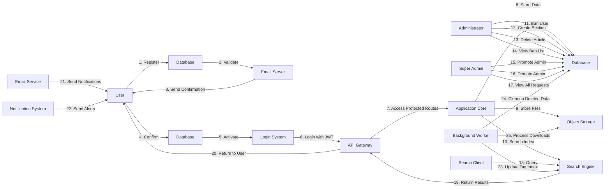
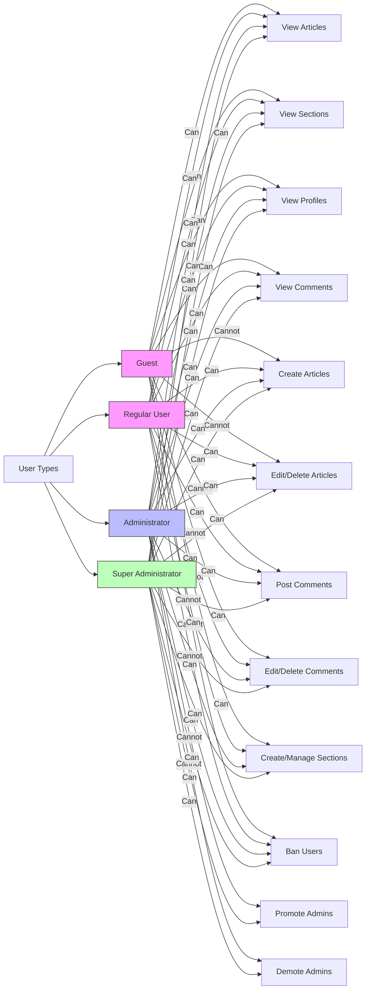
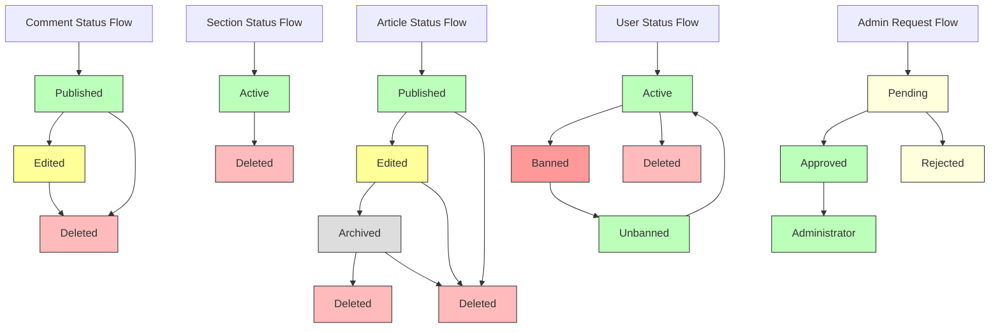

# Economic/Political Discussion Board

## 1. User Account Management

### User Registration
WHEN a new user visits the platform, THE system SHALL provide a registration form.
WHEN a user submits registration details, THE system SHALL require a valid email address and a password with minimum length of 8 characters.
WHEN a user submits registration details, THE system SHALL validate email format using standard email regular expression.
WHEN a user submits registration details, THE system SHALL check if the email is already registered.
WHEN an email is already registered, THE system SHALL return an error: "Email address already in use."
WHEN registration details are valid, THE system SHALL create a new user account with status: "active".
WHEN a new account is created, THE system SHALL send a confirmation email to the registered email address.
WHEN the user confirms their email address, THE system SHALL activate the account for full platform access.

### User Login
WHEN a user attempts to log in, THE system SHALL require a valid email address and password.
WHEN login credentials are submitted, THE system SHALL verify email existence and password match.
WHEN login credentials are invalid, THE system SHALL return error: "Invalid email or password."
WHEN login credentials are valid, THE system SHALL generate a JWT access token and refresh token.
WHEN a valid token is generated, THE system SHALL return it in HTTP response with secure flag and HTTP-only cookie.
WHEN login is successful, THE system SHALL set user session state and redirect to dashboard.

### Password Change
WHEN a logged-in user requests to change password, THE system SHALL require current password and new password.
WHEN a new password is submitted, THE system SHALL require minimum length of 8 characters.
WHEN a new password is submitted, THE system SHALL verify current password matches stored hash.
WHEN current password verification fails, THE system SHALL return error: "Current password is incorrect."
WHEN current password is valid and new password meets requirements, THE system SHALL update the password hash in database.
WHEN password is successfully updated, THE system SHALL revoke all active sessions for the user.
WHEN password is successfully updated, THE system SHALL send a confirmation email to user's registered email address.

### Account Deletion
WHEN a user requests to delete their account, THE system SHALL require password confirmation.
WHEN password confirmation is provided, THE system SHALL verify password against stored hash.
WHEN password verification fails, THE system SHALL return error: "Incorrect password."
WHEN password verification succeeds, THE system SHALL set user account status to "deleted".
WHEN account is marked as deleted, THE system SHALL:
  - Remove all personal data from user profile (display name, bio)
  - Anonymize all articles by setting author to "Deleted User"
  - Anonymize all comments by setting author to "Deleted User"
  - Delete all user attachments
  - Preserve article and comment content for historical integrity
WHEN deletion is complete, THE system SHALL log out the user and redirect to homepage.
WHEN deletion is complete, THE system SHALL send confirmation email: "Your account has been successfully deleted."

## 2. User Profile System

### Profile Structure
EACH user profile SHALL contain:
- display_name: string (max 50 characters)
- bio: text (max 1000 characters)
- created_at: timestamp
- last_active: timestamp

### Profile Editing
WHEN a user edits their profile, THE system SHALL allow updates to display_name and bio.
WHEN display_name is updated, THE system SHALL validate length (1-50 characters).
WHEN display_name contains only whitespace, THE system SHALL reject update with error: "Display name cannot be empty."
WHEN bio is updated, THE system SHALL validate length (0-1000 characters).
WHEN profile update is submitted, THE system SHALL update both fields atomically.
WHEN profile update is successful, THE system SHALL reflect changes immediately in UI and API responses.

### Profile Viewing
WHEN a user views another user's profile, THE system SHALL return:
- display_name
- bio
- article_list: list of article summaries (see Section 3)
- comment_list: list of comment summaries (see Section 5)
- profile_created_at: timestamp
- profile_last_active: timestamp
WHEN profile is viewed by anonymous users, THE system SHALL return same data as authenticated users.
WHEN profile is viewed by banned user, THE system SHALL return: "Profile unavailable."
WHEN profile is viewed for a deleted user, THE system SHALL return: "This user's profile has been deleted."

### User Activity Display
WHEN a user profile is displayed, THE system SHALL show:
- Number of articles written by user
- Number of comments written by user
- Last activity timestamp
- Total engagement score (articles + comments)
WHEN a user has no articles or comments, THE system SHALL display: "No content yet."
WHEN a user's content is deleted, THE system SHALL exclude it from count and activity display.

## 3. Section Management

### Section Creation
WHEN an administrator creates a section, THE system SHALL require:
- name: string (unique, 3-50 characters)
- description: text (max 500 characters)
WHEN section name conflicts with existing section, THE system SHALL return error: "Section name already exists."
WHEN section name contains only whitespace, THE system SHALL return error: "Section name cannot be empty."
WHEN section name contains invalid characters (e.g., special symbols), THE system SHALL return error: "Section name contains invalid characters."
WHEN section creation is successful, THE system SHALL create section with status: "active".
WHEN section is created, THE system SHALL assign it a unique section_id and timestamp.
WHEN section is created, THE system SHALL make it immediately visible to all users.
WHEN section is created, THE system SHALL log the administrative action.

### Section Editing
WHEN an administrator edits a section, THE system SHALL allow updates to:
- name: string
- description: text
WHEN section name is changed, THE system SHALL verify the new name is unique across all sections.
WHEN section description is updated, THE system SHALL allow up to 500 characters.
WHEN section update is successful, THE system SHALL apply changes immediately to all article references.
WHEN section is disabled from editing, THE system SHALL return error: "Section cannot be edited."

### Section Deletion
WHEN an administrator deletes a section, THE system SHALL confirm the action.
WHEN section deletion is confirmed, THE system SHALL:
  - Set section status to "deleted"
  - Move all articles in this section to "Uncategorized" section (see Section 3.4)
  - Preserve all article content and metadata
  - Preserve all comments on articles
  - Update section listing to exclude deleted sections
WHEN section is successfully deleted, THE system SHALL return success message.

### Uncategorized Section
WHEN a section is deleted, THE system SHALL automatically migrate all articles to "Uncategorized" section.
WHEN no articles remain in a section, THE system SHALL NOT delete the section - it remains as "inactive".
WHEN a user navigates to an "Uncategorized" section, THE system SHALL display all orphaned articles.
WHEN "Uncategorized" section is displayed, THE system SHALL show the name: "Uncategorized".

### Section Visibility
WHEN a user browses sections, THE system SHALL display only sections with status: "active".
WHEN a section is deleted, THE system SHALL remove it from section list.
WHEN a section is created, THE system SHALL add it to the section list immediately.
WHEN a section is edited, THE system SHALL refresh section list for all users.
WHEN a section has 0 articles and is inactive, THE system SHALL still be visible in admin section management.

### Section Listing
WHEN a user requests section list, THE system SHALL return:
- section_id: unique identifier
- name: section name
- description: section description
- article_count: number of active articles in section
- created_at: timestamp
- status: "active" or "deleted"
WHEN section list is requested by non-admin user, THE system SHALL exclude sections with status: "deleted".
WHEN section list is requested by administrator, THE system SHALL include all sections including deleted.

## 4. Article Management

### Article Creation
WHEN a user creates an article, THE system SHALL require:
- title: string (required, 5-200 characters)
- content: text (required, min 10 characters)
- section_id: reference to existing active section
WHEN title is empty or only whitespace, THE system SHALL return error: "Article title cannot be empty."
WHEN title exceeds 200 characters, THE system SHALL return error: "Article title exceeds maximum length of 200 characters."
WHEN content is empty or only whitespace, THE system SHALL return error: "Article content cannot be empty."
WHEN content is under 10 characters, THE system SHALL return error: "Article content must be at least 10 characters."
WHEN section_id references non-existent or deleted section, THE system SHALL return error: "Invalid section selection."
WHEN an article is created, THE system SHALL automatically assign:
  - unique article_id
  - author_id (current user)
  - created_at timestamp
  - updated_at timestamp
  - status: "published"
WHEN an article is created, THE system SHALL create a search index entry for title and content.
WHEN an article is created, THE system SHALL send real-time notification to section subscribers (if any).

### Article Editing
WHEN a user edits their own article, THE system SHALL allow editing of:
- title
- content
- section_id
- attachment_list
- tag_list
WHEN user attempts to edit article not owned by them, THE system SHALL return error: "You cannot edit this article."
WHEN article status is "archived" or "deleted", THE system SHALL return error: "This article cannot be edited."
WHEN article editing is successful, THE system SHALL update updated_at timestamp.
WHEN article editing is successful, THE system SHALL update the search index with new title and content.
WHEN article editing is successful, THE system SHALL return updated article with new metadata.

### Article Deletion
WHEN a user deletes their own article, THE system SHALL:
  - Set article status to "deleted"
  - Remove article from section lists
  - Remove article from search index
  - Preserve article content in archival database
  - Preserve attachments and tags for audit trail
  - Keep article_id for reference
WHEN an administrator deletes any article, THE system SHALL perform same actions as above.
WHEN article is deleted, THE system SHALL notify all users who commented on it.
WHEN article is deleted, THE system SHALL update comment count on related comments to "0".

### File and Image Attachments
WHEN a user uploads a file to an article, THE system SHALL accept:
- File types: PDF, DOC, DOCX, TXT, XLS, XLSX, PPT, PPTX, JPG, JPEG, PNG, GIF, SVG
- File size: max 10MB per file
- Total files per article: max 10 attachments
WHEN a file is uploaded, THE system SHALL:
  - Generate unique filename with UUID
  - Store file securely in object storage
  - Record metadata: original_name, file_size, content_type, uploaded_at
  - Associate with article_id and author_id
WHEN file is uploaded successfully, THE system SHALL return file details with secure access URL.
WHEN file is accessed by user, THE system SHALL:
  - Authenticate user ownership or public access
  - Serve file with appropriate content-type header
  - Track download count

### Tagging System
WHEN a user adds tags to an article, THE system SHALL:
- Allow up to 10 tags per article
- Allow tag length of up to 50 characters
- Allow letters, numbers, hyphens, underscores, and spaces
- Normalize whitespace in tags (trim, reduce multiple spaces to single)
- Convert to lowercase for storage
WHEN tag already exists for user, THE system SHALL not create duplicate tag.
WHEN tag is added to article, THE system SHALL update tag index for fast filtering.
WHEN tag is removed from article, THE system SHALL update tag index accordingly.
WHEN tag index is updated, THE system SHALL process changes in background within 500ms.
WHEN search/filter by tag, THE system SHALL match exact tag text (case-insensitive).

### Article Listing
WHEN a user requests article list for a section, THE system SHALL return:
- article_id
- title
- author.display_name
- section.name
- created_at
- comment_count
- tags[0:3] (first three tags)
- status
WHEN listing is requested, THE system SHALL sort by created_at DESC (newest first) by default.
WHEN user requests sort by oldest, THE system SHALL sort by created_at ASC.
WHEN listing is requested, THE system SHALL apply pagination with 25 articles per page.
WHEN no articles exist in section, THE system SHALL return empty array.
WHEN section_id is invalid, THE system SHALL return HTTP 404.

### Article View Page
WHEN user views a single article, THE system SHALL display:
- title
- author.display_name and author_id
- section.name
- content (full text)
- attachment_list with download links
- tag_list
- created_at
- updated_at
- comment_count
- comment_list (see Section 5)
WHEN user requests article not found, THE system SHALL return HTTP 404.
WHEN user requests article with status: "deleted", THE system SHALL show: "This article has been deleted."
WHEN user requests article with status: "archived", THE system SHALL show: "This article has been archived."
WHEN download link is clicked, THE system SHALL authenticate user and serve file with proper headers.

## 5. Comment System

### Comment Creation
WHEN a user writes a comment on an article, THE system SHALL require:
- article_id: reference to existing article
- content: text (required, 5-1000 characters)
WHEN article_id references deleted article, THE system SHALL return error: "Cannot comment on deleted article."
WHEN content is empty or whitespace only, THE system SHALL return error: "Comment content cannot be empty."
WHEN content exceeds 1000 characters, THE system SHALL return error: "Comment exceeds maximum length of 1000 characters."
WHEN comment is created, THE system SHALL:
  - Assign unique comment_id
  - Set author_id to current user
  - Set created_at timestamp
  - Set updated_at timestamp
  - Set status: "published"
WHEN comment is created, THE system SHALL increment article.comment_count by 1.
WHEN comment is created, THE system SHALL notify article author (if not same user).

### Comment Editing
WHEN a user edits their own comment, THE system SHALL allow changes to content.
WHEN user attempts to edit another user's comment, THE system SHALL return error: "You cannot edit this comment."
WHEN comment status is "deleted" or "archived", THE system SHALL return error: "Cannot edit deleted comment."
WHEN comment edit is successful, THE system SHALL update updated_at timestamp.
WHEN comment edit is successful, THE system SHALL append: "[Edited]" to comment UI display.

### Comment Deletion
WHEN a user deletes their own comment, THE system SHALL:
  - Set comment status to "deleted"
  - Decrement article.comment_count by 1
  - Preserve comment content for audit trail
WHEN an administrator deletes any comment, THE system SHALL perform same actions as above.
WHEN comment is deleted, THE system SHALL notify article author (if not same user).

### Comment Display
WHEN a comment is displayed, THE system SHALL show:
- comment_id
- author.display_name
- content
- created_at
- updated_at
- status
- is_edited: boolean (true if updated_at > created_at)
WHEN a user is banned, THE system SHALL display comment author as "Banned User".
WHEN a user is deleted, THE system SHALL display comment author as "Deleted User".
WHEN a comment is deleted, THE system SHALL display: "This comment has been deleted."

### Comment Sorting
WHEN comment list is requested, THE system SHALL sort by created_at ASC (oldest first).
WHEN new comment is added, THE system SHALL append to bottom of list.
WHEN comment list is requested via API, THE system SHALL return comments in order of creation.

### Comment Count
WHEN article page is loaded, THE system SHALL display total comment count.
WHEN comment count changes, THE system SHALL update immediately in article listing and view.
WHEN comment is deleted, THE system SHALL decrement count by 1.
WHEN comment is created, THE system SHALL increment count by 1.
WHEN comment count is 0, THE system SHALL display: "No comments."

## 6. Administrator System

### Administrator Request Submission
WHEN a user requests administrator privileges, THE system SHALL require:
- reason: text (min 20 characters)
WHEN reason is empty or below 20 characters, THE system SHALL return error: "Please provide a detailed reason for your request (minimum 20 characters)."
WHEN request is submitted, THE system SHALL create pending_request with:
  - user_id
  - reason
  - submitted_at
  - status: "pending"
WHEN request is submitted, THE system SHALL send notification to super administrators.

### Administrator Request Review
WHEN super administrators view pending requests, THE system SHALL display:
- request_id
- user.display_name
- user.email
- reason
- submitted_at
- status
WHEN super administrator accesses request list, THE system SHALL authenticate as super admin.
WHEN super administrator opens request details, THE system SHALL show user profile information.

### Administrator Request Approval
WHEN super administrator approves a request, THE system SHALL:
  - Change request status to "approved"
  - Add user role: "administrator"
  - Send notification to user: "Your request to become administrator has been approved."
  - Log administrative action
WHEN request is approved, THE user shall gain all administrator privileges (see Section 6.5).

### Administrator Request Rejection
WHEN super administrator rejects a request, THE system SHALL:
  - Change request status to "rejected"
  - Send notification to user: "Your request to become administrator has been rejected."
  - Log administrative action with rejection reason
WHEN request is rejected, THE system SHALL NOT grant administrator privileges.

### Administrator Privileges
WHEN a user is promoted to administrator, THE system SHALL grant all the following capabilities:
- Can do everything regular users can do (write articles, comments, edit/delete own content)
- Can create, edit, delete sections
- Can delete any article
- Can delete any comment
- Can ban users (see Section 7)
- Can unban users (see Section 7)
- Can view list of banned users

### Super Administrator Privileges
WHEN a user is promoted to super administrator, THE system SHALL grant all administrator privileges PLUS:
- Can promote regular administrators to super administrator
- Can demote super administrators to regular administrators
- Can view all administrator requests regardless of status
- Can edit any user profile
- Can view system audit logs

### Administrator Promotion
WHEN super administrator promotes a regular administrator, THE system SHALL:
  - Change user role from "administrator" to "super_administrator"
  - Log promotion event with promotor_id and target_id
  - Send notification to user: "You have been promoted to super administrator."
WHEN promotion is successful, THE user gains super administrator privileges immediately.

### Administrator Demotion
WHEN super administrator demotes another super administrator, THE system SHALL:
  - Change user role from "super_administrator" to "administrator"
  - Log demotion event with demoter_id and target_id
  - Send notification to user: "You have been demoted to regular administrator."
WHEN demotion is successful, THE user loses super administrator privileges immediately.

### Self-Demotion Restriction
WHEN a super administrator attempts to demote themselves, THE system SHALL:
  - Reject the request
  - Return error: "Super administrators cannot demote themselves."
  - Log attempted self-demotion
WHEN system detects self-demotion attempt, THE system SHALL alert security monitor.

## 7. Banning System

### User Banning
WHEN an administrator bans a user, THE system SHALL require:
- reason: text (min 10 characters)
WHEN reason is empty or below 10 characters, THE system SHALL return error: "Ban reason must be at least 10 characters."
WHEN user is banned, THE system SHALL:
  - Set user status to "banned"
  - Record ban reason
  - Record ban timestamp
  - Record administrator who banned user
  - Preserve all user content (articles and comments)
WHEN user is banned, THE system SHALL immediately invalidate all active sessions.
WHEN user is banned, THE system SHALL send notification: "Your account has been banned. Reason: [reason]."

### Ban Reason Recording
WHEN a user is banned, THE system SHALL store ban reason in audit database with:
- user_id
- admin_id
- reason
- banned_at
- status: "active"
WHEN ban record is created, THE system SHALL be immutable (never modify or delete).
WHEN ban reason is viewed, THE system SHALL show full exact text as submitted by administrator.

### Ban Visibility
WHEN a banned user attempts to log in, THE system SHALL:
  - Reject login attempt
  - Show message: "Your account has been banned. Please contact an administrator for more information."
WHEN a banned user tries to create an article or comment, THE system SHALL return error: "Your account is banned."
WHEN a banned user accesses their profile, THE system SHALL show: "Your account has been banned."
WHEN a banned user's article or comment is viewed, THE system SHALL display author as "Banned User".
WHEN an administrator views banned users list, THE system SHALL show:
  - user.display_name
  - ban_reason
  - banned_by (admin display_name)
  - banned_at
  - duration: "permanent" (all bans are permanent)

### Unbanning
WHEN an administrator unbans a user, THE system SHALL:
  - Set user status to "active"
  - Record unban timestamp
  - Record administrator who unbanned user
  - Send notification: "Your account has been unbanned. You may now log in and use the platform."
WHEN user is unbanned, THE system SHALL restore full functionality.
WHEN user is unbanned, THE system SHALL NOT restore deleted content (if any).

### Banned User List
WHEN an administrator views banned users list, THE system SHALL display:
- user_id
- display_name
- email
- ban_reason
- banned_by (admin display_name)
- banned_at
- ban_status: "active"
WHEN user is unbanned, THE system SHALL remove from banned list.
WHEN ban list is requested, THE system SHALL sort by banned_at DESC (most recent first).
WHEN ban list is requested, THE system SHALL support pagination of 25 users per page.

## 8. Authentication and Authorization

### Session Management
WHEN a user logs in, THE system SHALL issue a JWT access token (15-minute expiration) and refresh token (7-day expiration).
WHEN access token expires, THE system SHALL allow refresh token to obtain new access token.
WHEN refresh token expires or is revoked, THE system SHALL require user to log in again.
WHEN user logs out, THE system SHALL invalidate the refresh token.
WHEN user changes password, THE system SHALL invalidate ALL refresh tokens.
WHEN user account is banned or deleted, THE system SHALL invalidate ALL tokens.

### JWT Tokens
THE system SHALL use JWT tokens with standard structure:
{
  "sub": "user_id",
  "email": "user_email",
  "roles": ["regular", "administrator", "super_administrator"],
  "iat": timestamp,
  "exp": timestamp
}
THE system SHALL sign tokens using HS512 algorithm with secure key.
THE system SHALL verify token signature before processing any protected request.
THE system SHALL reject tokens with invalid signature or expired expiration.

### Permission Matrix
| Actor | View Articles | Create Articles | Edit Own Articles | Delete Own Articles | View Comment | Create Comment | Edit Own Comment | Delete Own Comment | View Profiles | View Sections | Create Sections | Delete Sections | Ban Users | View Banned Users | Promote Admins | Demote Admins |
|-------|---------------|-----------------|-------------------|---------------------|--------------|----------------|------------------|--------------------|---------------|---------------|-----------------|-----------------|-----------|-------------------|----------------|---------------|
| Guest | ✓ | ✗ | ✗ | ✗ | ✓ | ✗ | ✗ | ✗ | ✓ | ✓ | ✗ | ✗ | ✗ | ✗ | ✗ | ✗ |
| Regular User | ✓ | ✓ | ✓ | ✓ | ✓ | ✓ | ✓ | ✓ | ✓ | ✓ | ✗ | ✗ | ✗ | ✗ | ✗ | ✗ |
| Administrator | ✓ | ✓ | ✓ | ✓ | ✓ | ✓ | ✓ | ✓ | ✓ | ✓ | ✓ | ✓ | ✓ | ✓ | ✗ | ✗ |
| Super Administrator | ✓ | ✓ | ✓ | ✓ | ✓ | ✓ | ✓ | ✓ | ✓ | ✓ | ✓ | ✓ | ✓ | ✓ | ✓ | ✓ |

Note: "✓" means permitted, "✗" means prohibited

## 9. Performance Requirements

### Response Time Expectations
WHEN a user loads article list for section, THE system SHALL return results within 1.5 seconds for 95% of requests.
WHEN a user loads an article page, THE system SHALL return content within 1.2 seconds for 95% of requests.
WHEN a user performs a search with filtering, THE system SHALL return results within 2 seconds for 95% of requests.
WHEN a user changes pages in pagination, THE system SHALL load within 800ms.
WHEN an administrator performs administrative actions (ban, delete, promote), THE system SHALL update system state within 500ms.
WHEN a comment is posted, THE system SHALL update comment count within 1 second.

### Throughput and Concurrency
THE system SHALL support 5,000 concurrent active users.
THE system SHALL handle 100 new article creations per minute.
THE system SHALL process 500 search queries per minute.
THE system SHALL process 200 comment submissions per minute.
THE system SHALL maintain 99.9% uptime.

### Resource Usage
WHEN serving content, THE system SHALL use efficient memory and CPU utilization.
WHEN processing search queries, THE system SHALL use indexed database fields.
WHEN handling file uploads, THE system SHALL offload storage to external object storage.
WHEN managing large datasets, THE system SHALL implement read-replica databases.

## 10. Error Handling

### General Error Policy
WHEN any system error occurs, THE system SHALL return HTTP 500 status code.
WHEN user input causes error, THE system SHALL return HTTP 400 status code with human-readable message.
WHEN authentication fails, THE system SHALL return HTTP 401 status code.
WHEN authorization fails, THE system SHALL return HTTP 403 status code.
WHEN requested resource is not found, THE system SHALL return HTTP 404 status code.
WHEN operation is rate-limited, THE system SHALL return HTTP 429 status code.
WHEN request is malformed, THE system SHALL return HTTP 422 status code.
WHEN request exceeds size limit, THE system SHALL return HTTP 413 status code.

### User-Facing Messages
THE system SHALL NEVER display system stack traces, database errors, or technical details.
THE system SHALL display only user-friendly, non-technical messages.
THE system SHALL provide guidance for correcting errors when possible.
THE system SHALL log technical details for internal monitoring.

## 11. Business Justification

This Economic/Political Discussion Board fulfills the critical need for a moderated, high-integrity platform for substantive economic and political discourse. Unlike existing forums dominated by noise and hostility, this system is designed to:

- Empower thoughtful engagement through user profile transparency
- Reduce content pollution through article and comment moderation
- Prevent spam and abuse through sophisticated banning and administrative controls
- Enable discovery through powerful search and filtering functionality
- Maintain historical integrity through careful handling of deleted content
- Provide accountability through full audit trails and administrative oversight

By implementing these comprehensive requirements, the platform ensures that discussions remain civil, substantive, and focused on ideas rather than personalities. The granular administrator controls and clear permission hierarchy allow for community self-governance with expert oversight when necessary.

The system's architecture intentionally separates content preservation from user deletion, ensuring that valuable discussions remain accessible even when problematic users leave or are removed. This design supports the platform's core mission of facilitating enduring knowledge exchange about economic systems and political ideas.

## 12. Developer Notes

The following implementation options are left to the development team:

1. **Search Engine**: Use PostgreSQL full-text search, Elasticsearch, or another search technology
2. **File Storage**: Use Amazon S3, Google Cloud Storage, or other object storage service
3. **Email Service**: Use SendGrid, SMTP, or other email delivery provider
4. **Token Storage**: Use Redis or database for refresh token tracking
5. **Caching Strategy**: Use Redis or similar for high-frequency data access
6. **Database Indexes**: Optimize indexes for section_id, author_id, created_at, tags as needed
7. **Background Jobs**: Use Celery, Bull, or other queue for tag index updates and notifications
8. **Notification System**: Use WebSockets, email, or other delivery mechanism
9. **Rate Limiting**: Implement based on IP, user, or endpoint

All technical decisions must comply with the business requirements above. This document contains only business logic specifications - implementation details are left to the engineering team.

> *Developer Note: This document defines **business requirements only**. All technical implementations (architecture, APIs, database design, etc.) are at the discretion of the development team.*

### Mermaid Diagrams

```mermaid
graph TD
  A[User Registration] --> B[Validate Email and Password]
  B --> C{Valid?}
  C -->|No| D[Return Error]
  C -->|Yes| E[Create User Account]
  E --> F[Send Confirmation Email]
  F --> G[Activate Account After Confirmation]
  D --> H[User Retry]
  H --> B
  G --> I[Login]
  
  J[User Login] --> K[Verify Credentials]
  K --> L{Valid?}
  L -->|No| M[Return Invalid Error]
  L -->|Yes| N[Generate JWT Tokens]
  N --> O[Set Secure Cookies]
  O --> P[Redirect to Dashboard]
  M --> Q[Retry Login]
  Q --> K
  
  R[User Deletion] --> S[Confirm Password]
  S --> T{Password Correct?}
  T -->|No| U[Return Error]
  T -->|Yes| V[Set Status to Deleted]
  V --> W[Anonymize Articles and Comments]
  W --> X[Delete Attachments]
  X --> Y[Revoke All Sessions]
  Y --> Z[Send Confirmation Email]
  U --> AA[Retry Password]
  AA --> S
  
  AB[Section Creation] --> AC[Check Unique Name]
  AC --> AD{Unique?}
  AD -->|No| AE[Return Error]
  AD -->|Yes| AF[Create Section with Active Status]
  AF --> AG[Add to Public List]
  AE --> AH[Change Name]
  AH --> AC
  
  AI[Article Creation] --> AJ[Validate Title and Content]
  AJ --> AK{Valid?}
  AK -->|No| AL[Return Error]
  AK -->|Yes| AM[Assign Author and Section]
  AM --> AN[Create Search Index Entry]
  AN --> AO[Return Article with Metadata]
  AL --> AP[Edit Content]
  AP --> AJ
  
  AQ[User Banning] --> AR[Provide Reason]
  AR --> AS{Reason ≥10 chars?}
  AS -->|No| AT[Return Error]
  AS -->|Yes| AU[Set User Status to Banned]
  AU --> AV[Persist Ban Reason]
  AV --> AW[Invalidate All Sessions]
  AW --> AX[Send Ban Notification]
  AT --> AY[Provide Better Reason]
  AY --> AR
  
  AZ[Administrator Promotion] --> BA[Verify Super Admin Role]
  BA --> BB{Is target regular admin?}
  BB -->|No| BC[Return Error]
  BB -->|Yes| BD[Update Role to Super Administrator]
  BD --> BE[Log Action]
  BE --> BF[Send Notification]
  BC --> BG[Choose Valid Target]
  BG --> BA
  
  BH[Comment Sorting] --> BI[Sort by created_at ASC]
  BI --> BJ[Return Oldest First]
  BJ --> BK[Append New Comments to Bottom]
  
  BL[Search Flow] --> BM[User Enters Query]
  BM --> BN[Validate Query]
  BN --> BO{Valid?}
  BO -->|No| BP[Show Error]
  BO -->|Yes| BQ[Query Title and Content]
  BQ --> BR[Filter by Tags]
  BR --> BS[Apply Access Control]
  BS --> BT[Sort by Relevance]
  BT --> BU[Paginate Results]
  BU --> BV[Return Results]
  BP --> BW[Revise Query]
  BW --> BM
  
  BX[Profile View] --> BY[Fetch Profile Data]
  BY --> BZ[Fetch Article List]
  BZ --> CA[Fetch Comment List]
  CA --> CB[Return Complete Profile]
  
  CC[Admin Banned Users List] --> CD[Fetch Ban Records]
  CD --> CE[Join User and Admin Information]
  CE --> CF[Sort by banned_at DESC]
  CF --> CG[Return Paginated List]
  
  CH[File Upload] --> CI[Validate File Type]
  CI --> CJ{Valid Type?}
  CJ -->|No| CK[Return Error]
  CJ -->|Yes| CL[Validate Size]
  CL --> CM{Under 10MB?}
  CM -->|No| CN[Return Error]
  CM -->|Yes| CO[Generate UUID Filename]
  CO --> CP[Store in Object Storage]
  CP --> CQ[Record Metadata]
  CQ --> CR[Associate with Article]
  CK --> CS[Choose Different File]
  CS --> CI
  CN --> CT[Choose Smaller File]
  CT --> CI
```

