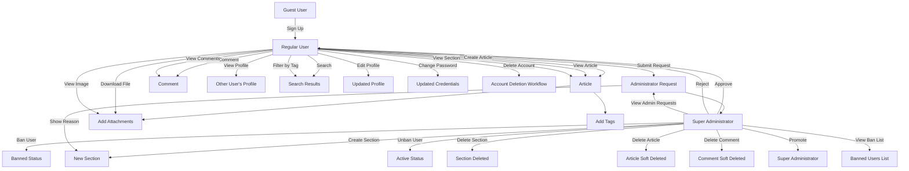

# Economic/Political Discussion Board Requirements Specification

## User Account Management

### Authentication System
WHEN a user attempts to sign up, THE system SHALL require a valid email address and password with minimum 8 characters.
WHEN a user attempts to sign up, THE system SHALL check that the email is not already registered.
WHEN a user attempts to sign up, THE system SHALL create a new user account with default profile settings and return success confirmation.

WHEN a user attempts to log in, THE system SHALL verify the provided email and password against stored credentials.
WHEN a user attempts to log in with correct credentials, THE system SHALL generate a JWT token and return it in the response.
WHEN a user attempts to log in with incorrect credentials, THE system SHALL return HTTP 401 (Unauthorized) with error code AUTH_INVALID_CREDENTIALS.

WHEN a user requests password change, THE system SHALL require the current password and a new password with minimum 8 characters.
WHEN a user requests password change with valid current password, THE system SHALL update the password hash and return success confirmation.
WHEN a user requests password change with invalid current password, THE system SHALL return HTTP 400 (Bad Request) with error code PASS_CURRENT_INVALID.

WHEN a user deletes their account, THE system SHALL immediately initiate the account deletion workflow.
WHEN a user deletes their account, THE system SHALL soft-delete all articles and comments authored by that user and mark them as "deleted" in the database.
WHEN a user deletes their account, THE system SHALL remove all personally identifiable information (email, password hash) from the database within 7 days.

## User Profile Management

### Profile Display
WHEN a user views another user's profile, THE system SHALL display the target user's display name and bio.
WHEN a user views another user's profile, THE system SHALL display a list of all articles authored by that user, showing only title, section, and time posted.
WHEN a user views another user's profile, THE system SHALL display a list of all comments authored by that user, showing content, associated article title, and time posted.

### Profile Editing
WHEN a user edits their profile, THE system SHALL allow modification of display name (max 50 characters) and bio text (max 500 characters).
WHEN a user edits their profile, THE system SHALL validate that display name is not empty and bio text does not exceed character limits.
WHEN a user edits their profile, THE system SHALL update the profile information immediately and reflect changes in profile view.

## Section Management

### Section Creation
WHEN an administrator requests to create a new section, THE system SHALL require section name (unique, max 100 characters) and description (max 1000 characters).
WHEN an administrator requests to create a section with duplicate name, THE system SHALL return HTTP 409 (Conflict) with error code SECTION_NAME_DUPLICATE.
WHEN an administrator successfully creates a section, THE system SHALL make it immediately visible to all users.

### Section Editing
WHEN an administrator requests to edit a section, THE system SHALL allow modification of section name and description.
WHEN an administrator attempts to change a section's name to an existing name, THE system SHALL return HTTP 409 (Conflict) with error code SECTION_NAME_DUPLICATE.

### Section Deletion
WHEN an administrator requests to delete a section, THE system SHALL move all articles from that section to a "General" fallback section.
WHEN an administrator deletes a section, THE system SHALL preserve all associated articles and comments with their content intact.
WHEN an administrator deletes a section, THE system SHALL update all references to the section to point to the fallback section.

## Article Management

### Article Creation
WHEN a user creates an article, THE system SHALL require a title (max 200 characters) and content (min 10 characters).
WHEN a user creates an article, THE system SHALL require selection of exactly one existing section.
WHEN a user creates an article, THE system SHALL accept multiple file uploads (up to 10 files, each ≤50MB) and image uploads (up to 20 images, each ≤10MB).
WHEN a user creates an article with invalid title (empty or too long), THE system SHALL return HTTP 400 (Bad Request) with error code ARTICLE_TITLE_INVALID.
WHEN a user creates an article without selecting a section, THE system SHALL return HTTP 400 (Bad Request) with error code ARTICLE_SECTION_REQUIRED.
WHEN a user creates an article, THE system SHALL assign a unique identifier and timestamp to the article.

### Article Editing
WHEN a user edits their own article, THE system SHALL allow modification of title, content, attached files, attached images, and tags.
WHEN a user edits their own article, THE system SHALL prevent modification of the section assignment.
WHEN a user edits their own article, THE system SHALL allow adding up to 10 additional files (max 50MB each) and 20 additional images (max 10MB each).
WHEN a user edits their own article, THE system SHALL allow modifying tags (adding, removing, or replacing)
WHEN a user edits their own article, THE system SHALL update the "last modified" timestamp.

### Article Deletion
WHEN a user deletes their own article, THE system SHALL soft-delete the article with a 30-day retention period.
WHEN an administrator deletes an article, THE system SHALL soft-delete the article with a 14-day retention period.
WHEN an article is soft-deleted, THE system SHALL preserve all content, attachments, and comments.
WHEN a user attempts to delete an article they do not own, THE system SHALL return HTTP 403 (Forbidden) with error code PERMISSION_DENIED.
WHEN an administrator attempts to delete an article, THE system SHALL log the admin's username and deletion reason.

### File and Image Attachments
WHEN a user attaches files or images to an article, THE system SHALL validate file type and size constraints.
WHEN a user attaches a file larger than 50MB, THE system SHALL return HTTP 413 (Payload Too Large) with error code FILE_SIZE_EXCEEDS_LIMIT.
WHEN a user attaches a non-image file, THE system SHALL validate that it's one of allowed types: PDF, DOC, DOCX, TXT, CSV, XLS, XLSX.
WHEN a user attaches an image, THE system SHALL validate that it's one of allowed types: JPG, JPEG, PNG, GIF, WEBP.
WHEN a user attempts to attach more than 10 files or 20 images to an article, THE system SHALL return HTTP 400 (Bad Request) with error code ATTACHMENT_LIMIT_EXCEEDED.
WHEN a user downloads a file attachment, THE system SHALL serve the file with appropriate Content-Type header.
WHEN a user views an image attachment, THE system SHALL render the image inline with responsive sizing.

### Article Tagging System
WHEN a user creates an article, THE system SHALL allow up to 20 free-form text tags.
WHEN a user creates an article, THE system SHALL allow tags of maximum 50 characters each.
WHEN a user creates an article, THE system SHALL strip leading/trailing whitespace from all tags.
WHEN a user creates an article, THE system SHALL convert all tags to lowercase for consistency.
WHEN a user creates an article, THE system SHALL prevent duplicate tags within the same article.
WHEN a user searches articles by tag, THE system SHALL match case-insensitive tag names.
WHEN a user edits an article, THE system SHALL allow adding, removing, or replacing tags.

## Article Listing

### Article List Display
WHEN a user requests the article list for a section, THE system SHALL return paginated results with 20 articles per page.
WHEN a user requests the article list for a section, THE system SHALL display the following fields for each article: title, author display name, tags, comment count, and time posted.
WHEN a user requests the article list for a section, THE system SHALL HIDE the article content from the list view.

### Article Sorting
WHEN a user sorts articles by "Newest first", THE system SHALL order results by time posted in descending order.
WHEN a user sorts articles by "Oldest first", THE system SHALL order results by time posted in ascending order.
WHEN a user does not specify a sort order, THE system SHALL default to "Newest first".

## Article Viewing

### Article Detail Page
WHEN a user views a single article, THE system SHALL display the full title, content, author display name, and section name.
WHEN a user views a single article, THE system SHALL display the list of tags as clickable links.
WHEN a user views a single article, THE system SHALL display all attached files with download buttons.
WHEN a user views a single article, THE system SHALL display all attached images inline with appropriate captions.
WHEN a user views a single article, THE system SHALL display the time posted in ISO 8601 format with local timezone conversion.

### Attachment Access
WHEN a user clicks on a file attachment, THE system SHALL initiate a download with the original filename.
WHEN a user clicks on an image attachment, THE system SHALL display the image in a modal viewer with zoom capabilities.
WHEN a user attempts to access a deleted attachment, THE system SHALL return HTTP 404 (Not Found).

## Search and Filtering

### Search Functionality
WHEN a user performs a search by keyword, THE system SHALL search across article titles and article content.
WHEN a user performs a search by keyword, THE system SHALL return results sorted by relevance score (title match > content match).
WHEN a user performs a search, THE system SHALL return paginated results with 15 articles per page.
WHEN a user performs a search with empty query, THE system SHALL return no results (not all articles).
WHEN a user performs a search with 5+ tags, THE system SHALL return results matching ALL specified tags.
WHEN a search query returns no results, THE system SHALL display "No articles found" message.

### Tag Filtering
WHEN a user applies a tag filter, THE system SHALL only return articles with that specific tag.
WHEN a user applies multiple tag filters, THE system SHALL only return articles with ALL specified tags.
WHEN a user removes a tag filter, THE system SHALL update results to exclude the removed tag.
WHEN a tag filter has no matching articles, THE system SHALL show "No articles with this tag" message.

## Comment System

### Comment Creation
WHEN a user writes a comment on an article, THE system SHALL require comment content (min 1 character, max 1000 characters).
WHEN a user writes a comment on an article, THE system SHALL associate it with the current user and the target article.
WHEN a user writes a comment with empty content, THE system SHALL return HTTP 400 (Bad Request) with error code COMMENT_CONTENT_EMPTY.
WHEN a user writes a comment with content exceeding 1000 characters, THE system SHALL return HTTP 400 (Bad Request) with error code COMMENT_CONTENT_TOO_LONG.
WHEN a user writes a comment, THE system SHALL assign a unique identifier and timestamp.

### Comment Editing
WHEN a user edits their own comment, THE system SHALL allow modification of comment content.
WHEN a user edits their own comment, THE system SHALL update the "last modified" timestamp.
WHEN a user attempts to edit a comment they do not own, THE system SHALL return HTTP 403 (Forbidden) with error code PERMISSION_DENIED.

### Comment Deletion
WHEN a user deletes their own comment, THE system SHALL soft-delete the comment with a 30-day retention period.
WHEN an administrator deletes a comment, THE system SHALL soft-delete the comment with a 14-day retention period.
WHEN a comment is soft-deleted, THE system SHALL hide it from all views while preserving data for potential recovery.
WHEN a user attempts to delete a comment they do not own, THE system SHALL return HTTP 403 (Forbidden) with error code PERMISSION_DENIED.

### Comment Display and Sorting
WHEN a user views comments on an article, THE system SHALL display: author display name, content, and time posted.
WHEN a user views comments on an article, THE system SHALL sort comments in ascending order by time posted (oldest first).
WHEN a user views comments on an article, THE system SHALL display the total count of comments above the comment list.
WHEN an article has no comments, THE system SHALL display "No comments yet" message.

## Administrator System

### Administrator Request Workflow
WHEN a regular user submits a request to become an administrator, THE system SHALL create a request object with the user's ID, reason (up to 2000 characters), and timestamp.
WHEN a regular user submits a request with empty reason, THE system SHALL return HTTP 400 (Bad Request) with error code ADMIN_REQUEST_REASON_EMPTY.
WHEN a user submits an administrator request, THE system SHALL notify all super administrators via internal notification system.
WHEN a super administrator views pending requests, THE system SHALL list all active requests with user ID, reason, and submission time.
WHEN a super administrator approves a request, THE system SHALL update the target user's role to "administrator" and send confirmation to the user.
WHEN a super administrator rejects a request, THE system SHALL mark the request as rejected and notify the user with rejection reason.
WHEN a user has an approved or rejected request, THE system SHALL prevent them from submitting additional requests.

### Administrator Privilege Hierarchy

#### Regular Administrator
- Can do everything regular users can do
- Can create, edit, and delete sections
- Can delete any article
- Can delete any comment
- Can ban users
- Can unban users
- Can view the list of banned users
- Cannot promote or demote other administrators
- Cannot view administrator request queue (unless super administrator)

#### Super Administrator
- Can do everything regular administrators can do
- Can promote regular administrators to super administrator
- Can demote super administrators to regular administrator
- Can view and act on all administrator requests
- Cannot demote themselves
- Can access advanced administrative dashboards

### Promotion Process
WHEN a super administrator promotes a regular administrator, THE system SHALL verify the target user has "administrator" role.
WHEN a super administrator promotes a regular administrator, THE system SHALL update their role to "super administrator".
WHEN a super administrator promotes a user, THE system SHALL send notification to the promoted user.
WHEN a super administrator attempts to promote a non-administrator user, THE system SHALL return HTTP 400 (Bad Request) with error code PROMOTION_INVALID_TARGET.

### Demotion Process
WHEN a super administrator demotes another super administrator, THE system SHALL verify the target user has "super administrator" role.
WHEN a super administrator demotes another super administrator, THE system SHALL update their role to "administrator".
WHEN a super administrator demotes another super administrator, THE system SHALL send notification to the demoted user.
WHEN a super administrator attempts to demote themselves, THE system SHALL return HTTP 403 (Forbidden) with error code SELF_DEMOTING_PROHIBITED.
WHEN a super administrator attempts to demote a regular administrator, THE system SHALL return HTTP 400 (Bad Request) with error code DEMOTION_INVALID_TARGET.

## Banning System

### User Banning
WHEN an administrator bans a user, THE system SHALL require a reason (up to 2000 characters).
WHEN an administrator bans a user, THE system SHALL prevent the target user from authenticating with any future login attempts.
WHEN an administrator bans a user, THE system SHALL preserve all articles and comments created by the banned user.
WHEN an administrator bans a user, THE system SHALL add a ban record with: target user ID, admin ID, reason, and timestamp.

### Ban Reason Recording
WHEN a user is banned, THE system SHALL store the ban reason in the database.
WHEN a user is banned, THE system SHALL require the reason to be submitted during the ban process.
WHEN an administrator views a banned user's profile, THE system SHALL display the ban reason (but not the identity of the banning admin).
WHEN a super administrator reviews ban logs, THE system SHALL display the banning admin's identity and reason.

### Ban Visibility
WHEN a banned user attempts to log in, THE system SHALL return HTTP 403 (Forbidden) with error code USER_BANNED.
WHEN other users view a banned user's profile, THE system SHALL display "[BANNED]" before the display name and hide the bio.
WHEN a banned user attempts to create articles or comments, THE system SHALL silently reject the request without notification.
WHEN any user requests the list of banned users, THE system SHALL return a list containing: user ID, display name, ban reason, and timestamp of ban.

### Unbanning
WHEN an administrator unbans a user, THE system SHALL remove the ban record from the database.
WHEN an administrator unbans a user, THE system SHALL restore the user's ability to authenticate and participate.
WHEN an administrator unbans a user, THE system SHALL send a notification to the unbanned user.
WHEN an administrator unbans a user, THE system SHALL preserve the ban history in the audit log for reporting purposes.

## Performance and Operational Requirements

### Response Time Expectations
WHEN a user requests to view the list of articles in a section, THE system SHALL return the paginated results within 800 milliseconds for 95% of requests under normal load.
WHEN a user views a single article, THE system SHALL render the complete article with all attachments and tags within 600 milliseconds for 95% of requests.
WHEN a user performs an article search by title or content, THE system SHALL return paginated search results within 1,200 milliseconds for 95% of queries, even when searching across 10,000+ articles.
WHEN a user views all comments on an article, THE system SHALL load and display all comments sorted by oldest first within 700 milliseconds for 95% of requests.
WHEN a user views another user's profile, THE system SHALL load the profile information including all articles and comments authored by that user within 900 milliseconds for 95% of requests.
WHEN a user submits login credentials, THE system SHALL validate and respond with authentication result within 500 milliseconds for 95% of requests.
WHEN a user changes their password, THE system SHALL complete the password update and return success confirmation within 700 milliseconds.
WHEN a regular user submits a request to become an administrator, THE system SHALL store the request and notify super administrators within 300 milliseconds.
WHEN a super administrator approves or rejects an administrator request, THE system SHALL update the user's role and notify the requester within 400 milliseconds.

### System Throughput
THE system SHALL support 5,000 concurrent authenticated users with normal activity patterns without degradation of response times.
THE system SHALL handle 200 requests per second during peak usage periods without service failure.
WHEN a user uploads a file or image to an article, THE system SHALL process and store the file within 1 second for files up to 50 MB in size.
WHEN multiple users create articles or comments simultaneously, THE system SHALL handle 100 write operations per second with zero data loss.
WHEN an article is created, edited, or deleted, THE system SHALL update search indexes to reflect the change within 500 milliseconds of the operation completion.

### Concurrency Requirements
WHILE the system is processing article creation from multiple users, THE system SHALL prevent data corruption and maintain data integrity for concurrent write operations.
WHILE users are performing search queries, THE system SHALL continue to process article creation, editing, and comment submission without blocking or significant slowdown.
WHILE users are accessing each other's profiles simultaneously, THE system SHALL serve profile data without causing delays or timeouts in other operations.
WHILE users are authenticating and managing their sessions, THE system SHALL handle concurrent session creation and invalidation requests without conflicts.
WHILE multiple administrators are performing moderation actions (deleting articles, banning users), THE system SHALL ensure each action is processed correctly without interference between administrators.

### Data Retention Policy
WHEN a user deletes their own article or comment, THE system SHALL retain the data in a soft-deleted state for 30 days for potential recovery.
WHEN an administrator deletes an article or comment, THE system SHALL retain the data in a soft-deleted state for 14 days for audit purposes.
WHEN a user is banned, THE system SHALL retain the ban record and reason indefinitely for compliance and historical tracking purposes.
WHEN a user deletes their account, THE system SHALL permanently remove all personal data (email, password hash, profile information) within 7 days of deletion request.
WHEN an article is deleted, THE system SHALL retain attached files for the same period as the article's soft-deletion period (30 days for user deletion, 14 days for administrator deletion).
THE system SHALL retain audit logs for all administrative actions (bans, demotions, approvals, deletions) for 2 years.
THE system SHALL retain records of recent user sessions (last 30 days) for security monitoring purposes.

### Error Handling
IF system load exceeds 90% of maximum capacity for more than 5 minutes, THEN THE system SHALL return HTTP 503 (Service Unavailable) with clear error message to prevent cascading failures.
IF the search index is temporarily unavailable, THEN THE system SHALL return HTTP 503 (Service Unavailable) with a message instructing the user to try again later.
IF the database connection fails during any operation, THEN THE system SHALL attempt to reconnect for a maximum of 30 seconds, and if unsuccessful, return HTTP 503 (Service Unavailable).
IF file upload or retrieval fails due to storage system unavailability, THEN THE system SHALL return HTTP 507 (Insufficient Storage) and preserve the article or comment without the failed attachment.
WHEN a client exceeds 100 requests per minute from the same IP address, THE system SHALL temporarily block further requests for 60 seconds with HTTP 429 (Too Many Requests).
IF two users attempt to edit the same article simultaneously, THEN THE system SHALL detect the conflict and return HTTP 409 (Conflict) with instructions to refresh the article and reapply changes.
IF authentication fails due to invalid credentials, THEN THE system SHALL return HTTP 401 (Unauthorized) with error code AUTH_INVALID_CREDENTIALS.
IF a user attempts an action they don't have permission for, THEN THE system SHALL return HTTP 403 (Forbidden) with error code PERMISSION_DENIED.
IF a user submits invalid data (empty title, invalid email format), THEN THE system SHALL return HTTP 400 (Bad Request) with machine-readable validation error details in the response body.
IF the caching layer fails, THEN THE system SHALL continue to operate in degraded mode by serving data directly from the database, with a warning logged for system administrators.
IF any component of the distributed system (database, search engine, file storage) fails, THEN THE system SHALL attempt graceful degradation while maintaining core functionality (article viewing, commenting) and logging the failure for operational response.

### System Availability
THE system SHALL be available 99.9% of the time during normal business hours (08:00-20:00 Asia/Seoul timezone).
THE system SHALL have scheduled maintenance windows no more than twice per month, each lasting no more than 2 hours, and shall be announced at least 7 days in advance.
THE system SHALL have automated failover capabilities for all critical components with failover time under 30 seconds.

### Monitoring and Alerting
THE system SHALL log all operations, errors, and performance metrics with a retention period of 1 year for operational analysis.
WHEN the system detects a response time degradation exceeding 200% of baseline for more than 5 minutes, THEN THE system SHALL trigger an alert to the operations team.
WHEN system availability drops below 99% for more than 15 minutes, THEN THE system SHALL trigger an emergency alert to the operations team and system administrators.
WHEN any database error occurs that could lead to data loss, THEN THE system SHALL immediately notify the system administrator and initiate backup recovery protocol.

### Backup and Recovery
THE system SHALL perform database backups every 4 hours, with full daily backups and incremental hourly backups.
THE system SHALL store backups in geographically separate locations with at least one backup kept offline.
THE system SHALL be capable of restoring data from any backup within 1 hour in case of complete data loss.
THE system SHALL be able to restore individual user accounts or articles from backup within 30 minutes.

### Scalability Requirements
THE system SHALL be designed to easily scale horizontally by adding additional application servers to handle increased load.
THE system SHALL be able to scale the database layer to handle 5x current user base without architectural changes.
THE system SHALL be able to scale file storage capacity dynamically without service interruption.
WHEN the system detects sustained increase in user activity, THE system SHALL initiate automated scaling procedures to add additional computing resources.

## Special Cases and Edge Scenarios

### Mass Article Deletion by Administrator
WHEN an administrator deletes more than 100 articles in a single action, THE system SHALL process the deletion as a background job and return immediate confirmation, with the actual deletion completing within 30 seconds.

### Bulk User Banning
WHEN an administrator bans more than 50 users in a single action, THE system SHALL process the ban operations as a background job and return immediate confirmation, with the actual bans completing within 1 minute.

### Simultaneous User Account Deletion
WHEN multiple users request account deletion within a 1-minute period, THE system SHALL process each deletion request independently without queuing or delaying any request.

### High-Volume Search with Multiple Tags
WHEN a user searches for articles with 5+ tags simultaneously, THE system SHALL return results within 2,000 milliseconds for 95% of such queries.

### Profile Retrieval with Large Article/Comment History
WHEN a user profile has more than 1,000 articles or comments, THE system SHALL load the first 50 items quickly (under 500ms) and load additional items progressively as the user scrolls.

### Concurrent File Uploads
WHEN multiple users upload files simultaneously to different articles, THE system SHALL process each upload independently without interference or resource contention.

## Performance Monitoring and Metrics

THE system SHALL track and report the following metrics for continuous performance monitoring:
- Average response time for each key operation
- 95th percentile response time for each key operation
- System availability percentage
- Request throughput per second
- Error rate by type
- Database query performance
- File storage latency
- Cache hit rate
- Memory usage
- CPU usage

THE system SHALL send daily performance summary reports to system administrators.
WHEN any performance metric exceeds warning thresholds (defined in operations documentation), THEN THE system SHALL trigger an alert to the operations team.
THE system SHALL provide performance dashboards for administrators with real-time monitoring of all key metrics.

## Authentication and Authorization

### User Roles
THE system SHALL define three primary user roles: "guest", "user", "administrator", "super administrator".

### JWT Token Structure
WHEN a user logs in successfully, THE system SHALL generate a JWT token with the following claims:
- sub: user ID (unique identifier)
- email: user email address
- role: one of "user", "administrator", "super administrator"
- iat: issued at time (timestamp)
- exp: expiration time (24 hours from issue)

### Permission Matrix

| Action                       | Guest | User | Administrator | Super Administrator |
|-------------------------------|-------|------|---------------|---------------------|
| View public articles          | ✅    | ✅   | ✅            | ✅                  |
| View article content          | ✅    | ✅   | ✅            | ✅                  |
| View user profiles            | ✅    | ✅   | ✅            | ✅                  |
| View section lists            | ✅    | ✅   | ✅            | ✅                  |
| Create article                | ❌    | ✅   | ✅            | ✅                  |
| Edit own article              | ❌    | ✅   | ✅            | ✅                  |
| Delete own article            | ❌    | ✅   | ✅            | ✅                  |
| Attach files/images           | ❌    | ✅   | ✅            | ✅                  |
| Add tags to articles          | ❌    | ✅   | ✅            | ✅                  |
| Create comment                | ❌    | ✅   | ✅            | ✅                  |
| Edit own comment              | ❌    | ✅   | ✅            | ✅                  |
| Delete own comment            | ❌    | ✅   | ✅            | ✅                  |
| Search articles               | ✅    | ✅   | ✅            | ✅                  |
| Filter by tags                | ✅    | ✅   | ✅            | ✅                  |
| View banned user list         | ❌    | ❌   | ✅            | ✅                  |
| Ban user                      | ❌    | ❌   | ✅            | ✅                  |
| Unban user                    | ❌    | ❌   | ✅            | ✅                  |
| Delete any article            | ❌    | ❌   | ✅            | ✅                  |
| Delete any comment            | ❌    | ❌   | ✅            | ✅                  |
| Create section                | ❌    | ❌   | ✅            | ✅                  |
| Edit section                  | ❌    | ❌   | ✅            | ✅                  |
| Delete section                | ❌    | ❌   | ✅            | ✅                  |
| Submit admin request          | ❌    | ✅   | ✅            | ✅                  |
| Approve admin request         | ❌    | ❌   | ❌            | ✅                  |
| Reject admin request          | ❌    | ❌   | ❌            | ✅                  |
| Promote to administrator      | ❌    | ❌   | ❌            | ✅                  |
| Demote administrator          | ❌    | ❌   | ❌            | ✅                  |
| Demote self                   | ❌    | ❌   | ❌            | ❌                  |
| Manage account                | ❌    | ✅   | ✅            | ✅                  |
| Change password               | ❌    | ✅   | ✅            | ✅                  |
| Delete account                | ❌    | ✅   | ✅            | ✅                  |

### Session Management
WHEN a user logs in, THE system SHALL create a session record and set token expiration to 24 hours.
WHEN a user logs out, THE system SHALL immediately invalidate the JWT token and remove corresponding session record.
WHEN a JWT token expires, THE system SHALL require user to re-authenticate.
WHEN a user changes their password, THE system SHALL immediately revoke all active sessions for that user.
WHEN a user account is banned, THE system SHALL immediately invalidate all active sessions for that user.
WHEN a session expires, THE system SHALL redirect user to login page with message "Session expired. Please login again.".

## User Experience Requirements

### Consistency
ALL user interfaces and interactions SHALL follow consistent patterns across the platform.
ALL button labels SHALL use title case (e.g., "Create Article", "Edit Profile").
ALL form fields SHALL include clear labels and error messages.
ALL notifications SHALL be displayed with appropriate icons and color coding (green for success, red for errors).

### Accessibility
THE system SHALL comply with WCAG 2.1 Level AA accessibility standards.
ALL forms SHALL be navigable by keyboard.
ALL images SHALL include alt text describing their content.
ALL color combinations SHALL provide sufficient contrast ratio (minimum 4.5:1).

### Language
ALL user-facing text SHALL be presented in English (US localization). (en-US)
ALL error messages SHALL use clear, non-technical language understandable by non-experts.
ALL system-generated text (e.g., "10 comments") SHALL be properly pluralized.

## Implementation Constraints

- NO database schema specifications will be included in this document (handled in Database phase)
- NO API endpoint definitions will be included in this document (handled in Interface phase)
- NO entity relationship diagrams will be included in this document (handled in Database phase)
- NO class diagrams will be included in this document (handled in Interface phase)
- NO code examples will be included in this document
- NO implementation details will be specified beyond business requirements
- ALL requirements SHALL be expressed in natural language as business scenarios
- ALL requirements SHALL be specific, measurable, and testable
- ALL requirements SHALL follow EARS format (When, The, Shall, etc.)
- ALL Mermaid diagrams SHALL use double quotes around all labels
- ALL user actions SHALL be described from the user's perspective
- ALL system responses SHALL be described in terms of user experience

## Diagram: User Interaction Workflow

## Document Metadata

- **Service Prefix**: economic-political-board
- **Target Audience**: Backend developers implementing the application
- **Revision Date**: 2026-01-30
- **Version**: 1.0
- **Language**: English (en-US)
- **Timezone**: Asia/Seoul

This document is complete and implementation-ready for the Database phase.