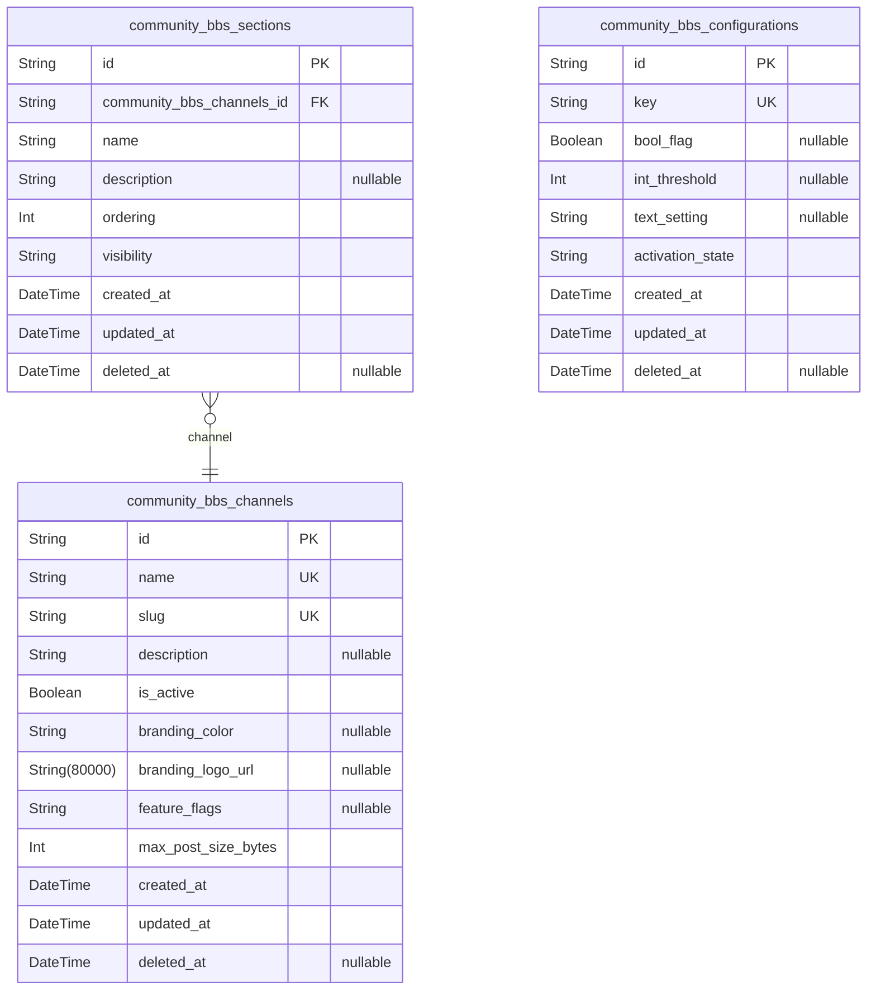
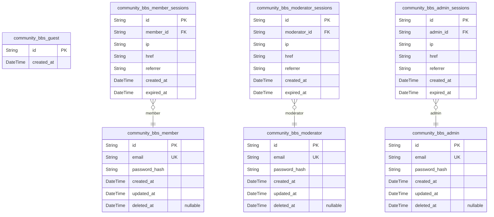
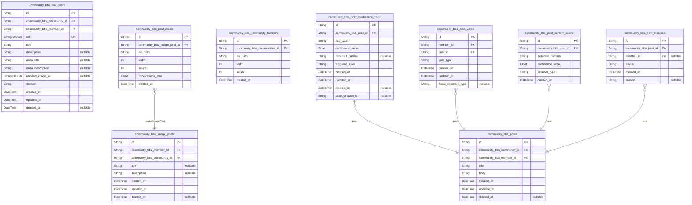
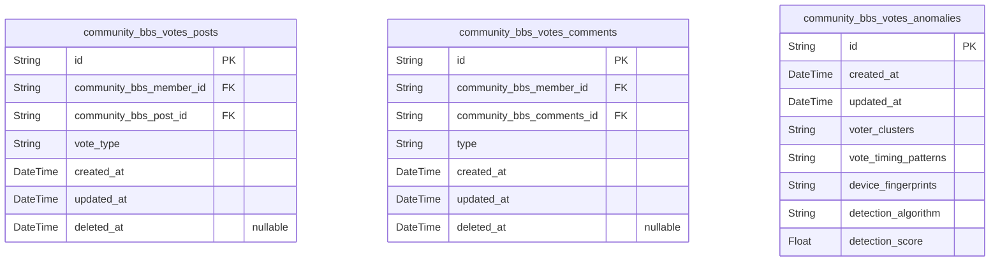
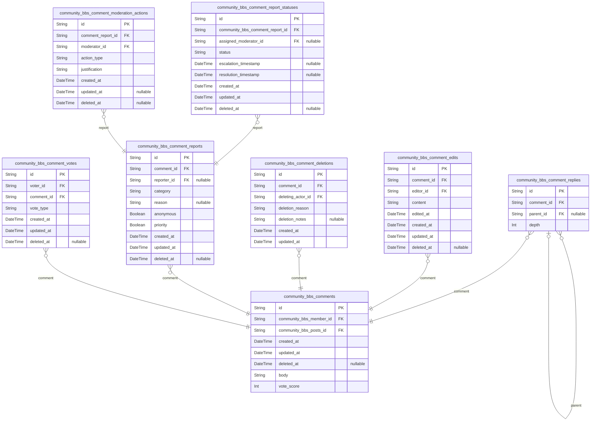
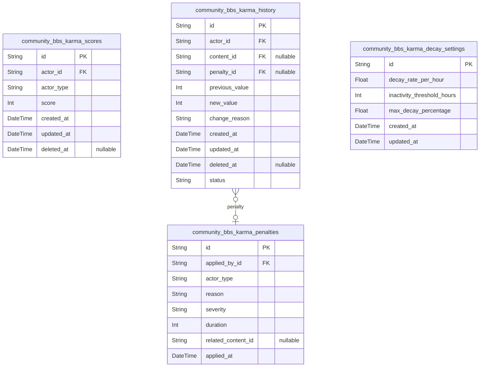
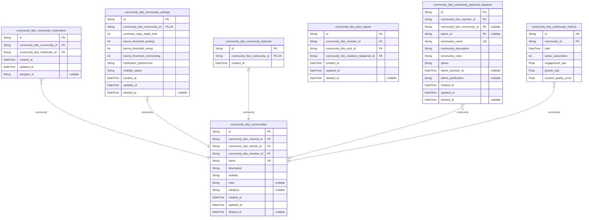
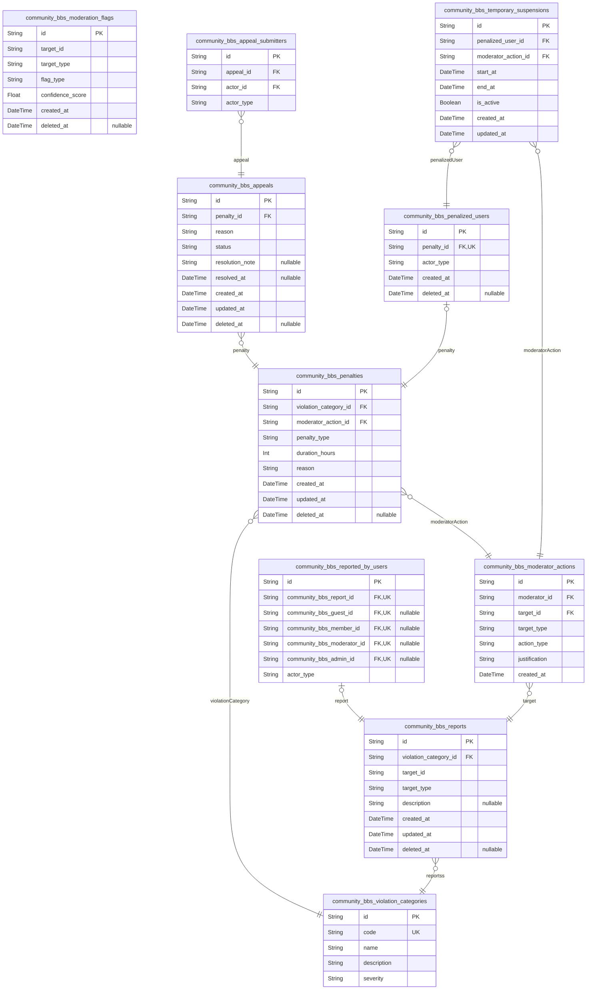
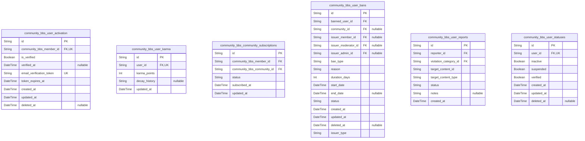
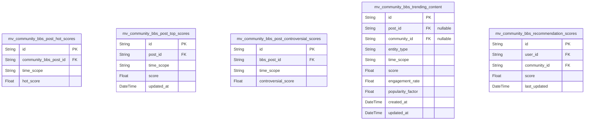

# Prisma Markdown

> Generated by [`prisma-markdown`](https://github.com/samchon/prisma-markdown)

- [Systematic](#systematic)
- [Actors](#actors)
- [Posting](#posting)
- [Voting](#voting)
- [Commenting](#commenting)
- [Karma](#karma)
- [Community](#community)
- [Moderation](#moderation)
- [UserJourney](#userjourney)
- [default](#default)

## Systematic

```mermaid
erDiagram
"community_bbs_channels" {
  String id PK
  String name UK
  String slug UK
  String description "nullable"
  Boolean is_active
  String branding_color "nullable"
  String(80000) branding_logo_url "nullable"
  String feature_flags "nullable"
  Int max_post_size_bytes
  DateTime created_at
  DateTime updated_at
  DateTime deleted_at "nullable"
}
"community_bbs_sections" {
  String id PK
  String community_bbs_channels_id FK
  String name
  String description "nullable"
  Int ordering
  String visibility
  DateTime created_at
  DateTime updated_at
  DateTime deleted_at "nullable"
}
"community_bbs_configurations" {
  String id PK
  String key UK
  Boolean bool_flag "nullable"
  Int int_threshold "nullable"
  String text_setting "nullable"
  String activation_state
  DateTime created_at
  DateTime updated_at
  DateTime deleted_at "nullable"
}
"community_bbs_sections" }o--|| "community_bbs_channels" : channel
```

### `community_bbs_channels`

Defines communication channels through which content is delivered (e.g.,
web app, mobile app, API). Stores branding, configuration, and access
settings for each channel.

This table represents the different ways users can access the platform,
each potentially having unique branding, feature availability, and
configuration settings. Channels serve as the primary delivery mechanism
for content and determine display characteristics, API endpoints, and
user experience variations.

Each channel is uniquely identified and can be independently activated,
deactivated, or modified through system administration interfaces. The
channel configuration affects how posts, comments, and user interfaces
are rendered across different platforms (web, mobile, API).

Properties as follows:

- `id`: Primary Key.
- `name`
  > Human-readable name of the channel (e.g., "Web App", "Mobile App",
  > "API"). Must be unique across channels for administrative clarity.
- `slug`
  > URL-friendly identifier for the channel used in routing and API
  > endpoints. Must be unique and follow kebab-case format (e.g., "web-app",
  > "mobile-app", "api").
- `description`
  > Detailed description explaining the purpose, target audience, and unique
  > features of this channel.
- `is_active`
  > Flag indicating whether the channel is currently enabled for user access.
  > When false, users cannot create or view content through this channel.
- `branding_color`
  > Primary brand color in hex format (#RRGGBB) used for UI elements specific
  > to this channel.
- `branding_logo_url`
  > Full URL to the logo image used in this channel's interface. Must be a
  > publicly accessible web address.
- `feature_flags`
  > JSON string containing boolean flags for channel-specific features (e.g.,
  > "{\"enable_comments\":true,\"enable_votes\":true,\"enable_media_upload\":false}").
  > Allows granular control per channel.
- `max_post_size_bytes`
  > Maximum allowed size for posts in this channel (in bytes). Applies to
  > both content and metadata.
- `created_at`: Timestamp when this channel was created in the system.
- `updated_at`: Timestamp when this channel was last modified.
- `deleted_at`
  > Timestamp when this channel was soft-deleted. NULL indicates the channel
  > is active. Used for audit trails and potential recovery.

### `community_bbs_sections`

Hierarchical content organization units within channels.

Defines structured content groupings that organize posts and communities
within communication channels. Each section represents a logical category
that groups related communities for user navigation and content
filtering. Sections form a hierarchy that enables users to understand
content architecture and navigate efficiently between content types.

Sections are managed by platform administrators and moderators, not by
regular users. They do not represent user-generated content but rather
the structural framework through which content is organized. Each section
belongs to exactly one channel and can contain multiple communities.

The ordering property determines the display sequence in navigation
menus. The visibility property controls whether sections are visible to
guests or members only. Soft deletion is supported to maintain audit
trails while allowing configuration changes.

Properties as follows:

- `id`: Primary Key.
- `community_bbs_channels_id`
  > Parent channel to which this section belongs. {@link
  > community_bbs_channels.id}.
- `name`
  > Human-readable name of the section for display in UI. Must be unique
  > within a channel.
- `description`
  > Detailed description explaining the purpose and content scope of this
  > section for users and administrators.
- `ordering`
  > Integer value determining the display order of sections within a channel.
  > Lower values appear first in UI. Must be positive.
- `visibility`
  > Visibility scope of the section. Valid values: 'public', 'members_only'.
  > Public sections visible to guests and members; members_only require
  > authentication.
- `created_at`: Timestamp when this section was created in the system.
- `updated_at`: Timestamp when this section was last modified.
- `deleted_at`
  > Timestamp when this section was soft-deleted. NULL means active. Used to
  > preserve configuration history while hiding deleted sections.

### `community_bbs_configurations`

System-wide configuration settings and feature flags that control
platform behavior. Stores boolean flags, numeric thresholds, text
settings, and activation states for platform-wide features.

This table serves as the single source of truth for global operational
parameters. Values are managed exclusively by administrators and are
applied across all components. Changes to configuration affect the entire
platform's behavior, including content moderation thresholds, karma decay
rates, comment depth limits, and feature toggles.

Each configuration key is unique and serves a specific operational
purpose. The activation_state determines whether a setting is currently
applied (active) or bypassed (inactive). The created_at, updated_at, and
deleted_at fields provide an audit trail of configuration changes for
compliance and debugging.

Properties as follows:

- `id`: Primary Key.
- `key`
  > Unique identifier for the configuration setting (e.g.,
  > "max_comment_depth", "karma_decay_rate").
- `bool_flag`
  > Boolean flag for enabling or disabling a feature (e.g.,
  > "enable_anonymous_comments").
- `int_threshold`
  > Integer threshold value for system limits (e.g.,
  > "min_karma_for_moderation", "max_votes_per_hour").
- `text_setting`
  > Text setting for configuration values (e.g.,
  > "default_community_description", "moderation_policy_link").
- `activation_state`
  > Current activation status: 'active' or 'inactive'. Determines whether
  > this configuration is currently applied to the platform.
- `created_at`: Timestamp when this configuration was created.
- `updated_at`: Timestamp when this configuration was last updated.
- `deleted_at`
  > Timestamp when this configuration was soft-deleted. If null,
  > configuration is active.

## Actors

```mermaid
erDiagram
"community_bbs_guest" {
  String id PK
  DateTime created_at
}
"community_bbs_member" {
  String id PK
  String email UK
  String password_hash
  DateTime created_at
  DateTime updated_at
  DateTime deleted_at "nullable"
}
"community_bbs_moderator" {
  String id PK
  String email UK
  String password_hash
  DateTime created_at
  DateTime updated_at
  DateTime deleted_at "nullable"
}
"community_bbs_admin" {
  String id PK
  String email UK
  String password_hash
  DateTime created_at
  DateTime updated_at
  DateTime deleted_at "nullable"
}
"community_bbs_member_sessions" {
  String id PK
  String member_id FK
  String ip
  String href
  String referrer
  DateTime created_at
  DateTime expired_at
}
"community_bbs_moderator_sessions" {
  String id PK
  String moderator_id FK
  String ip
  String href
  String referrer
  DateTime created_at
  DateTime expired_at
}
"community_bbs_admin_sessions" {
  String id PK
  String admin_id FK
  String ip
  String href
  String referrer
  DateTime created_at
  DateTime expired_at
}
"community_bbs_member_sessions" }o--|| "community_bbs_member" : member
"community_bbs_moderator_sessions" }o--|| "community_bbs_moderator" : moderator
"community_bbs_admin_sessions" }o--|| "community_bbs_admin" : admin
```

### `community_bbs_guest`

Represents unauthenticated users of the platform with no login
capabilities, storing only basic visitor identifiers for analytics
purposes.

This actor type enables the system to track anonymous visitors, record
their interactions with public content, and measure engagement metrics
without requiring authentication. While guests cannot post, comment,
vote, or subscribe to communities, their activity (page views, content
views, search queries) is captured to analyze platform usage patterns and
improve content discovery algorithms.

Each guest is assigned a unique, randomly generated UUID identifier upon
their first visit. This identifier persists across sessions for the same
visitor until the browser cache is cleared or a new device is used. The
system uses guest identities to maintain visit history for personalized
recommendations while preserving privacy.

Properties as follows:

- `id`: Primary Key.
- `created_at`
  > Timestamp when this guest identifier was first generated upon their
  > initial visit to the platform.

### `community_bbs_member`

Stores core authentication data for registered users who can post,
comment, vote, and subscribe to communities.

This table represents a true actor in the system with its own
authentication credentials and profile information. Each record
corresponds to a unique registered user who can interact with the
platform independently.

Member accounts have full privileges including creating content,
commenting, voting, and joining communities. The table stores essential
authentication data required for login sessions, but does not include
derived metrics like karma or status, which are managed in separate
components.

This actor entity must have a dedicated session table
(community_bbs_member_sessions) to track login events. Membership status
and privileges are managed through this account, which serves as the
primary ownership reference for all user-generated content.

Properties as follows:

- `id`: Primary Key.
- `email`
  > Unique email address used for authentication and communication. Must be
  > unique across all members and validated during registration.
- `password_hash`
  > Securely hashed password for authentication. Never store plain text
  > passwords. Generated using a strong hashing algorithm (e.g., bcrypt).
- `created_at`
  > Timestamp when this member account was created. Immutable record of
  > account creation.
- `updated_at`
  > Timestamp when this member account was last updated. Automatically
  > updated on any profile change.
- `deleted_at`
  > Soft delete timestamp indicating when the member account was deactivated
  > or deleted. NULL means active account.

### `community_bbs_moderator`

Moderator actor entity with authenticated credentials for moderating
community content.

Represents users granted moderation privileges within specific
communities. Each moderator has a unique authenticated account with email
and password credentials, distinct from regular member accounts.
Moderators can be assigned to individual communities through the
community_bbs_community_moderators table, but this table manages their
core identity and authentication data.

This entity has a separate session table
(community_bbs_moderator_sessions) for tracking authentication sessions.
Moderators are not created by users but are appointed by admins through
system workflows.

Soft deletion is supported to maintain audit trails while allowing
privilege revocation.

Properties as follows:

- `id`: Primary Key.
- `email`
  > Moderator's email address used for authentication. Must be unique across
  > all moderators and follow business email format.
- `password_hash`
  > Hashed password for authentication. Never stored in plain text. Generated
  > using BCrypt algorithm with salt.
- `created_at`
  > Timestamp when this moderator account was created. Records the exact
  > moment of account establishment.
- `updated_at`
  > Timestamp of the last update to this moderator account. Updated on any
  > credential change or profile update.
- `deleted_at`
  > Timestamp when this moderator account was soft-deleted (privacy
  > revocation). NULL if account is active. Used for audit trail and
  > potential reactivation.

### `community_bbs_admin`

System administrator entity with elevated privileges to manage
platform-wide settings, users, and content.

Represents the highest-level actors in the system who have full control
over all communities, content moderation, user permissions, and system
configurations. Admins can appoint or remove moderators, handle user
appeals, enforce platform-wide policies, and manage infrastructure
settings.

Each admin has unique credentials and authentication flow separate from
members and moderators. Admins do not create content or engage in
community interactions - their role is strictly governance and system
management.

The admin table stores only essential authentication data and metadata,
with all session tracking handled by the separate
community_bbs_admin_sessions table. Soft deletion is supported to
maintain audit trails while allowing account deactivation.

Properties as follows:

- `id`: Primary Key.
- `email`
  > Unique administrator email address used for authentication and system
  > notifications. Must be a valid, verified business email associated with
  > the platform.
- `password_hash`
  > Cryptographically hashed password for secure authentication. Never stores
  > plain text passwords. Required for login access to administrative
  > interfaces.
- `created_at`
  > Timestamp when the admin account was created in the system. Records the
  > initial activation of administrative privileges.
- `updated_at`
  > Timestamp of the last update to the admin account. Records any changes to
  > credentials, email, or profile metadata.
- `deleted_at`
  > Timestamp when the admin account was soft-deleted. Indicates deactivation
  > for security or compliance purposes. If null, the account is active.

### `community_bbs_member_sessions`

Tracks authentication sessions for community_bbs_member users with
connection context and expiration timestamps.

Contains all metadata related to active and historical login sessions for
registered members. Every session record represents a single
authentication event with connection details including client IP address,
requested URL, and referrer information. Sessions are ephemeral and
automatically expire for security purposes.

Properties as follows:

- `id`: Primary Key.
- `member_id`
  > The member account this session belongs to. {@link
  > community_bbs_member.id}.
- `ip`: Client IP address from which the session was initiated.
- `href`: The URL that was accessed when this session was created.
- `referrer`: The referring URL that led the user to initiate this session.
- `created_at`: Timestamp when this authentication session was initiated.
- `expired_at`
  > Timestamp when this session will expire and become invalid. Sessions must
  > have expiration for security; this field is non-null by default.

### `community_bbs_moderator_sessions`

Tracks authentication sessions for community_bbs_moderator users with
separate tokens from regular members.

Manages login sessions exclusively for platform moderators who have
elevated privileges. Each session records the moderator's device
connection context and establishes a secure, time-bound authentication
state that expires after a defined period.

This table is append-only and used solely for audit trails and security
monitoring. Each moderator can have multiple concurrent sessions, but
each session is uniquely tied to one moderator account and has a
mandatory expiration timestamp to enforce security best practices.

Properties as follows:

- `id`: Primary Key.
- `moderator_id`
  > The moderator account this session belongs to. {@link
  > community_bbs_moderator.id}.
- `ip`: IP address of the device establishing this session.
- `href`: The URL path and query string accessed during session initiation.
- `referrer`
  > The external website or application that referred the user to this
  > session.
- `created_at`: The timestamp when this session was created and authenticated.
- `expired_at`
  > The timestamp when this session expires and becomes invalid. Sessions
  > must expire for security; null is not allowed as it would represent an
  > unlimited session, which is a security vulnerability.

### `community_bbs_admin_sessions`

Records privileged authentication sessions for community_bbs_admin users
with enhanced security controls and audit logging.

Tracks login events for system administrators with connection context and
session lifecycle management. Each session represents a single
authenticated login by an admin user with elevated privileges.

This table provides an append-only audit trail for security monitoring,
forensic analysis, and compliance verification. Sessions are
automatically terminated by expiration or manual logout, with detailed
connection metadata captured for security reviews.

Properties as follows:

- `id`: Primary Key.
- `admin_id`: Administrative user's [community_bbs_admin.id](#community_bbs_admin).
- `ip`: IP address from which the session was initiated.
- `href`: Connection URL that initiated this session.
- `referrer`: Referrer URL that led to this login.
- `created_at`: Timestamp when the session was established.
- `expired_at`
  > Timestamp when the session will expire. Sessions must have expiration for
  > security.

## Posting

```mermaid
erDiagram
"community_bbs_posts" {
  String id PK
  String community_bbs_community_id FK
  String community_bbs_member_id FK
  String title
  String body
  DateTime created_at
  DateTime updated_at
  DateTime deleted_at "nullable"
}
"community_bbs_link_posts" {
  String id PK
  String community_bbs_community_id FK
  String community_bbs_member_id FK
  String(80000) url UK
  String title
  String description "nullable"
  String meta_title "nullable"
  String meta_description "nullable"
  String(80000) preview_image_url "nullable"
  String domain
  DateTime created_at
  DateTime updated_at
  DateTime deleted_at "nullable"
}
"community_bbs_image_posts" {
  String id PK
  String community_bbs_member_id FK
  String community_bbs_community_id FK
  String title "nullable"
  String description "nullable"
  DateTime created_at
  DateTime updated_at
  DateTime deleted_at "nullable"
}
"community_bbs_post_media" {
  String id PK
  String community_bbs_image_post_id FK
  String file_path
  Int width
  Int height
  Float compression_ratio
  DateTime created_at
}
"community_bbs_community_banners" {
  String id PK
  String community_bbs_communities_id FK
  String file_path
  Int width
  Int height
  DateTime created_at
}
"community_bbs_post_moderation_flags" {
  String id PK
  String community_bbs_post_id FK
  String flag_type
  Float confidence_score
  String detected_pattern "nullable"
  String triggered_rules
  DateTime created_at
  DateTime updated_at
  DateTime deleted_at "nullable"
  String scan_session_id "nullable"
}
"community_bbs_post_votes" {
  String id PK
  String member_id FK
  String post_id FK
  String vote_type
  DateTime created_at
  DateTime updated_at
  String fraud_detection_type "nullable"
}
"community_bbs_post_content_scans" {
  String id PK
  String community_bbs_post_id FK
  String detected_patterns
  Float confidence_score
  String scanner_type
  DateTime created_at
}
"community_bbs_post_statuses" {
  String id PK
  String community_bbs_post_id FK
  String modifier_id FK "nullable"
  String status
  DateTime created_at
  String reason "nullable"
}
"community_bbs_post_media" }o--|| "community_bbs_image_posts" : relatedImagePost
"community_bbs_post_moderation_flags" }o--|| "community_bbs_posts" : post
"community_bbs_post_votes" }o--|| "community_bbs_posts" : post
"community_bbs_post_content_scans" }o--|| "community_bbs_posts" : post
"community_bbs_post_statuses" }o--|| "community_bbs_posts" : post
```

### `community_bbs_posts`

Main entity for text posts with title and body content, associated with
user and community.

Stores user-generated textual content submitted to specific communities
on the platform. Each post contains a title and body with formatted text,
allowing users to share ideas, ask questions, and join discussions.

Posts are linked to one specific community and authored by one
authenticated member. The content is not stored as HTML or rich text but
as plain text with minimal formatting. Posts remain accessible even if
the community they belong to later changes settings or becomes inactive,
ensuring historical continuity.

Users can create multiple posts across different communities. Posts can
be voted on, reported, flagged for moderation, and undergo status
transitions managed by the separate community_bbs_post_statuses table.

Soft deletion is supported by the deleted_at field, allowing for
moderation workflows while preserving audit trails.

Properties as follows:

- `id`: Primary Key.
- `community_bbs_community_id`
  > The community to which this post belongs. {@link
  > community_bbs_communities.id}.
- `community_bbs_member_id`
  > The authenticated member who created this post. {@link
  > community_bbs_member.id}.
- `title`
  > The brief, descriptive title of the post. Typically limited to 200
  > characters for readability and display purposes.
- `body`
  > The main textual content of the post. Contains the full message,
  > discussion, or information being shared by the poster.
- `created_at`
  > Timestamp when the post was originally created. Immutable record of the
  > post's creation time.
- `updated_at`
  > Timestamp when the post was last modified. Updates only occur when the
  > post is edited by the author.
- `deleted_at`
  > Timestamp when the post was soft-deleted. Null indicates the post is
  > active. Used for moderation workflows and audit trails.

### `community_bbs_link_posts`

Link-type posts containing a URL with metadata, associated with a
community and member.

Stores user-submitted link posts that point to external content with
associated title, description, and metadata. Each link post is owned by a
member and belongs to a specific community, forming the basis for
discussion threads and engagement.

Link posts are primary business entities requiring independent
management: users can search across all link posts, filter by domain,
edit titles and descriptions, and delete them. They are not managed
solely through parent communities and require direct API endpoints.

Link metadata such as preview images and Open Graph data are stored
separately in community_bbs_post_media to maintain normalization. Content
scanning results (AI/output patterns, spam detection) are tracked in
community_bbs_post_content_scans. Voting activity is tracked in
community_bbs_votes_posts. The lifecycle status (active, flagged, hidden)
is managed through community_bbs_post_statuses.

Properties as follows:

- `id`: Primary Key.
- `community_bbs_community_id`
  > The community this link post belongs to. {@link
  > community_bbs_communities.id}.
- `community_bbs_member_id`: The member who created this link post. [community_bbs_member.id](#community_bbs_member).
- `url`
  > The full URL of the linked external resource. Must be a valid HTTP/HTTPS
  > URI.
- `title`
  > The title of the linked content, often extracted from Open Graph metadata
  > or user-provided. Used for display in feeds.
- `description`
  > A summary or description of the linked content. User-provided or
  > generated from content analysis. Supports Markdown for formatting.
- `meta_title`
  > The title extracted from the linked page's <title> tag. Serves as
  > fallback if user does not provide a title.
- `meta_description`
  > The description extracted from the linked page's <meta
  > name="description"> tag. Used when no user-provided description exists.
- `preview_image_url`
  > URL of a preview image associated with the link, typically pulled from
  > Open Graph or Twitter Card metadata. Stored as URL string, not as file
  > reference to accommodate external images.
- `domain`
  > The normalized domain name of the link (e.g., 'youtube.com'). Used for
  > filtering, tabbing, and content categorization.
- `created_at`: Timestamp when the link post was created.
- `updated_at`
  > Timestamp when the link post was last edited. Updates when title or
  > description is modified.
- `deleted_at`: Timestamp when the link post was soft-deleted. Null if active.

### `community_bbs_image_posts`

Image posts created by members, containing image media references and
associated metadata.

Stores user-submitted image content with links to the actual image files
stored in the community_bbs_post_media table. Each image post is
associated with a specific community and authored by a registered member.

Image posts support rich content sharing, allowing users to upload images
as standalone content or as part of community discussion. The associated
media files are stored separately in community_bbs_post_media to optimize
storage and access.

Posts are linked to their respective communities for content organization
and moderation. Users can browse, like, comment on, and report image
posts individually regardless of their community context.

Soft deletion is supported to maintain audit trails while allowing
content moderation and user-initiated removals.

Properties as follows:

- `id`: Primary Key.
- `community_bbs_member_id`: Author's member account. [community_bbs_member.id](#community_bbs_member).
- `community_bbs_community_id`
  > Target community where this post is published. {@link
  > community_bbs_communities.id}.
- `title`: Title of the image post as entered by the member. Maximum 200 characters.
- `description`
  > Optional description accompanying the image post explaining context,
  > intent, or additional details. Supports markdown.
- `created_at`: Timestamp when this image post was created. Always non-null.
- `updated_at`: Timestamp when this image post was last modified. Always non-null.
- `deleted_at`: Timestamp when this image post was soft-deleted. Null if still active.

### `community_bbs_post_media`

Media files (images) uploaded as part of image posts, storing file paths,
dimensions, and compression metadata.

Stores binary content references for images associated with
community_bbs_image_posts entities. Each media file is uniquely
associated with a single image post and contains essential file
information needed for rendering and performance optimization. This table
follows a subsidiary stance because media files are never managed
independently by users—they are always accessed and controlled through
their parent image posts.

The table stores only immutable file attributes: the physical location on
storage, dimensions for responsive rendering, and compression efficiency
metrics. File content itself is stored on external object storage systems
referenced by the file_path.

Properties as follows:

- `id`: Primary Key.
- `community_bbs_image_post_id`
  > The image post this media file belongs to. {@link
  > community_bbs_image_posts.id}.
- `file_path`
  > Absolute file path or URL to the media file on storage system. This is
  > the canonical reference to the actual file content, which is stored
  > externally (e.g., S3, CDN).
- `width`
  > Width of the image in pixels. Used for responsive rendering and layout
  > optimization.
- `height`
  > Height of the image in pixels. Used for responsive rendering and layout
  > optimization.
- `compression_ratio`
  > Compression efficiency ratio comparing original to optimized file size.
  > Higher values indicate better compression without significant quality
  > loss.
- `created_at`
  > Timestamp when the media file was uploaded and stored. Used for audit
  > trail and chronological organization.

### `community_bbs_community_banners`

Stores custom banner images uploaded to communities, including file paths
and dimensional metadata.

This subsidiary entity holds the actual banner assets that communities
can select for visual branding. Each banner is uniquely associated with a
single community and represents an immutable file asset.

Banners are managed exclusively through community administration
interfaces and are not independently accessible or managed by users. They
serve as supportive assets to enhance community identity through visual
presentation.

The table contains only raw file metadata and does not track display
status (which is handled by community_bbs_community_featured). File
formats are restricted to image types by the system's upload validation
layer.

Properties as follows:

- `id`: Primary Key.
- `community_bbs_communities_id`
  > The community that this banner belongs to. {@link
  > community_bbs_communities.id}.
- `file_path`
  > File system path to the banner image stored in object storage. Must be a
  > valid image file path.
- `width`
  > Width of the banner image in pixels. Must be a positive integer
  > representing the actual image dimension.
- `height`
  > Height of the banner image in pixels. Must be a positive integer
  > representing the actual image dimension.
- `created_at`
  > Timestamp when this banner was uploaded and registered in the system.
  > Always set to the creation time of the banner asset.

### `community_bbs_post_moderation_flags`

System-generated moderation flags triggered on posts by automated
scanning systems.

Stores detection results from AI content analysis and spam pattern
recognition systems. Each flag represents a specific violation trigger
detected during content scanning, such as AI-generated text patterns,
spam URL patterns, or policy violation keywords. Flags are created
automatically when posts are submitted and may be updated if the content
is rescanned.

Flags are not user-facing entities but provide critical metadata for
moderation workflows. They are accessed through post entities to
determine if a post requires human moderation review. Multiple flags can
be associated with a single post to indicate different types of detected
violations.

Properties as follows:

- `id`: Primary Key.
- `community_bbs_post_id`
  > The post that triggered this moderation flag. {@link
  > community_bbs_posts.id}.
- `flag_type`
  > Category of moderation trigger detected. Values: 'ai_detection',
  > 'spam_url', 'banned_keyword', 'repetitive_syntax', 'unnatural_structure',
  > 'affiliate_link', 'clickbait_pattern'.
- `confidence_score`
  > System confidence level (0.0 to 1.0) in the detection accuracy. Higher
  > scores indicate greater certainty of violation.
- `detected_pattern`
  > Exact pattern, regex, or text substring that triggered the flag. For AI
  > detection: common syntax patterns. For spam: tracked URL parameters. For
  > keywords: specific banned terms detected.
- `triggered_rules`
  > Comma-separated list of rule IDs from moderation policy that were
  > triggered by this detection (e.g., 'AI-001,SPAM-005').
- `created_at`: Timestamp when this moderation flag was first generated by the system.
- `updated_at`
  > Timestamp when this moderation flag was last updated (e.g., when
  > re-scanned with improved detection model).
- `deleted_at`
  > Timestamp when this flag was logically deleted (soft delete), if flagged
  > as false positive and removed from consideration.
- `scan_session_id`
  > Reference to the scanning session ID that generated this flag, for audit
  > trail and diagnostic purposes.

### `community_bbs_post_votes`

Tracks individual vote actions on posts including voter ID, vote
direction, timestamp, and fraud detection flags.

Each vote is uniquely assigned to one member account and cannot be
duplicated. The system automatically detects and cancels duplicate votes
from the same account, adding a count to the account's "suspicious
behavior" counter. This table serves as the immutable audit trail for the
voting system, enabling fraud detection and post-specific vote analysis.

Votes are immutable records - once created, they cannot be modified or
deleted to preserve the integrity of the voting system. This ensures that
voting behavior can be accurately analyzed for patterns of manipulation
or abuse.

Properties as follows:

- `id`: Primary Key.
- `member_id`: The member who cast this vote. [community_bbs_member.id](#community_bbs_member).
- `post_id`: The post that received this vote. [community_bbs_posts.id](#community_bbs_posts).
- `vote_type`
  > Direction of the vote. Must be either 'upvote' or 'downvote'. Indicates
  > whether the member liked or disliked the post.
- `created_at`
  > Timestamp when the vote was cast. Records the exact moment the member
  > submitted their vote.
- `updated_at`
  > Timestamp when this vote record was last updated. Used internally for
  > system tracking of duplicate vote detection and fraud processing.
- `fraud_detection_type`
  > Type of fraud detection triggered for this vote, if any. Values may
  > include 'duplicate_vote' when system detects an account voting multiple
  > times on the same post. Null indicates no fraud detection triggered.

### `community_bbs_post_content_scans`

Records automated content scanning results for posts including detected
AI-generated patterns, spam URLs, and banned keywords.

This subsidiary table is generated by automated systems that scan post
content when it is created or updated. It logs the specific text patterns
and URL signatures that triggered moderation flags, along with confidence
scores and scanner identifiers.

Each record is immutable and serves as an audit trail for automated
moderation decisions. The data here informs moderation actions, flags in
community_bbs_post_moderation_flags, and helps improve machine learning
models over time.

This table supports compliance, transparency, and continuous learning in
the content moderation system by preserving the exact signals that caused
content to be flagged.

Properties as follows:

- `id`: Primary Key.
- `community_bbs_post_id`: The post that was scanned. [community_bbs_posts.id](#community_bbs_posts).
- `detected_patterns`
  > JSON array of string patterns detected during scanning, including
  > AI-generated text markers, spam URL signatures, and banned keywords.
- `confidence_score`
  > System-generated confidence level (0.0 to 1.0) indicating how certain the
  > scanner is that the detected patterns are valid triggers. Higher scores
  > indicate stronger matches.
- `scanner_type`
  > Identifier for the scanning module that generated this record. Examples:
  > "ai_text_detector", "spam_url_filter", "keyword_blacklist".
- `created_at`
  > Date and time when this content scan was executed. Immutable audit trail
  > of when the system detected violations.

### `community_bbs_post_statuses`

Tracks the lifecycle status of each post with audit trail of status changes.

This table records every transition a post undergoes during its lifecycle
including active, flagged, pending-review, hidden, and deleted states.
Every status change is represented as a separate record to maintain an
immutable audit trail of content moderation actions.

The system automatically updates the status based on moderation triggers,
community policies, and administrative decisions. Each record contains
the new status, timestamp of change, and the actor or system component
that initiated the change. This table supports moderation workflows by
providing a complete history of content state changes for review and
appeal purposes.

Properties as follows:

- `id`: Primary Key.
- `community_bbs_post_id`
  > Reference to the post that this status change applies to. {@link
  > community_bbs_posts.id}.
- `modifier_id`
  > Reference to the member (or admin/moderator) who changed the post status.
  > The system may be the modifier in automated transitions. {@link
  > community_bbs_member.id}.
- `status`
  > Current status of the post. Valid values: 'active', 'flagged',
  > 'pending-review', 'hidden', 'deleted'. Status transitions follow the
  > moderation workflow rules.
- `created_at`: Timestamp when this specific status was applied to the post.
- `reason`
  > Optional explanation for the status change, such as the moderation
  > trigger that activated this change (e.g., 'AI content detected', 'spam
  > link found', 'community closed').

## Voting

```mermaid
erDiagram
"community_bbs_votes_posts" {
  String id PK
  String community_bbs_member_id FK
  String community_bbs_post_id FK
  String vote_type
  DateTime created_at
  DateTime updated_at
  DateTime deleted_at "nullable"
}
"community_bbs_votes_comments" {
  String id PK
  String community_bbs_member_id FK
  String community_bbs_comments_id FK
  String type
  DateTime created_at
  DateTime updated_at
  DateTime deleted_at "nullable"
}
"community_bbs_votes_anomalies" {
  String id PK
  DateTime created_at
  DateTime updated_at
  String voter_clusters
  String vote_timing_patterns
  String device_fingerprints
  String detection_algorithm
  Float detection_score
}
```

### `community_bbs_votes_posts`

Records all upvotes and downvotes on posts, including voter ID, post ID,
vote type, and timestamp.

This table captures individual voting actions on posts, tracking whether
a member upvoted or downvoted a specific post. Each vote is uniquely tied
to one member account and one post, forming a many-to-many relationship
between members and posts through voting actions.

Votes are immutable - once recorded, they cannot be changed. If a user
changes their vote, a new vote record is created and the previous one is
soft-deleted and tracked in this same table. This provides a complete
audit trail of voting behavior for fraud detection and analytics
purposes.

Properties as follows:

- `id`: Primary Key.
- `community_bbs_member_id`: Voter's [community_bbs_member.id](#community_bbs_member).
- `community_bbs_post_id`: Target post's [community_bbs_posts.id](#community_bbs_posts).
- `vote_type`
  > Type of vote: "upvote" or "downvote". Must be one of these two values as
  > specified in requirements.
- `created_at`: Timestamp when the vote was recorded.
- `updated_at`
  > Timestamp when the vote was last modified (e.g., soft-deleted or
  > reversed).
- `deleted_at`
  > Soft delete timestamp indicating when the vote was invalidated. Null
  > means vote is active.

### `community_bbs_votes_comments`

Records all upvotes and downvotes on comments, including voter ID,
comment ID, vote type, and timestamp. Enforces karma ≥100 threshold for
voting on comments.

Each vote is an immutable record tied to a specific user and comment. The
system checks the voter's karma score against the threshold (100) before
allowing a vote submission. Votes are preserved even if the associated
comment is deleted to maintain audit integrity. This table is critical
for anti-manipulation systems and reputation calculations.

The primary key is a UUID, and a composite unique index prevents
duplicate votes from the same user on the same comment. Karma evaluation
is performed at the application level by querying the
community_bbs_member table.

Properties as follows:

- `id`: Primary Key.
- `community_bbs_member_id`: Voter's profile. [community_bbs_member.id](#community_bbs_member).
- `community_bbs_comments_id`: Target comment being voted on. [community_bbs_comments.id](#community_bbs_comments).
- `type`: Type of vote: 'upvote' or 'downvote'. Must be one of these two values.
- `created_at`: Timestamp when the vote was cast. Standard for all business entities.
- `updated_at`
  > Timestamp of last update. This is maintained for consistency with
  > engineering standards, though votes are immutable.
- `deleted_at`
  > Soft delete marker. Preserved even when comment is deleted for audit
  > trail purposes.

### `community_bbs_votes_anomalies`

Tracks coordinated voting patterns that trigger fraud detection,
including suspect voter clusters, vote timing patterns, and device
fingerprints associated with suspicious behavior.

This subsidiary table automatically generates detection records when the
system's anomaly detection algorithms identify suspicious voting
patterns. It serves as an audit trail for potential vote manipulation and
supports the moderation system by identifying fraudulent activity.

Each record represents a detected anomaly event generated by automated
analysis, not user interaction. The system uses this data to flag
suspicious accounts and provide evidence for human moderation review. All
detection data is immutable and permanently preserved for compliance and
audit purposes.

Properties as follows:

- `id`: Primary Key.
- `created_at`: Timestamp when the anomaly was detected and recorded by the system.
- `updated_at`
  > Timestamp when this anomaly record was last updated (typically when
  > detection score is refined).
- `voter_clusters`
  > JSON-encoded array of user IDs that formed the suspicious cluster (e.g.,
  > "[\"u123\", \"u456\", \"u789\"]").
- `vote_timing_patterns`
  > JSON-encoded representation of voting timing patterns, including
  > intervals, frequencies, and temporal sequences observed.
- `device_fingerprints`
  > JSON-encoded array of device signatures associated with the suspicious
  > voting activity, including IP addresses, user agents, and hardware
  > identifiers.
- `detection_algorithm`
  > Name of the algorithm that detected this anomaly (e.g.,
  > "cluster_detection_v3", "timing_anomaly_detector").
- `detection_score`
  > Confidence score (0.0-1.0) indicating the likelihood that this detection
  > represents actual fraudulent activity.

## Commenting

```mermaid
erDiagram
"community_bbs_comments" {
  String id PK
  String community_bbs_member_id FK
  String community_bbs_posts_id FK
  DateTime created_at
  DateTime updated_at
  DateTime deleted_at "nullable"
  String body
  Int vote_score
}
"community_bbs_comment_replies" {
  String id PK
  String comment_id FK
  String parent_id FK "nullable"
  Int depth
}
"community_bbs_comment_edits" {
  String id PK
  String comment_id FK
  String editor_id FK
  String content
  DateTime edited_at
  DateTime created_at
  DateTime updated_at
  DateTime deleted_at "nullable"
}
"community_bbs_comment_deletions" {
  String id PK
  String comment_id FK
  String deleting_actor_id FK
  String deletion_reason
  String deletion_notes "nullable"
  DateTime created_at
  DateTime updated_at
}
"community_bbs_comment_reports" {
  String id PK
  String comment_id FK
  String reporter_id FK "nullable"
  String category
  String reason "nullable"
  Boolean anonymous
  Boolean priority
  DateTime created_at
  DateTime updated_at
  DateTime deleted_at "nullable"
}
"community_bbs_comment_votes" {
  String id PK
  String voter_id FK
  String comment_id FK
  String vote_type
  DateTime created_at
  DateTime updated_at
  DateTime deleted_at "nullable"
}
"community_bbs_comment_report_statuses" {
  String id PK
  String community_bbs_comment_report_id FK
  String assigned_moderator_id FK "nullable"
  String status
  DateTime escalation_timestamp "nullable"
  DateTime resolution_timestamp "nullable"
  DateTime created_at
  DateTime updated_at
  DateTime deleted_at "nullable"
}
"community_bbs_comment_moderation_actions" {
  String id PK
  String comment_report_id FK
  String moderator_id FK
  String action_type
  String justification
  DateTime created_at
  DateTime updated_at "nullable"
  DateTime deleted_at "nullable"
}
"community_bbs_comment_replies" }o--|| "community_bbs_comments" : comment
"community_bbs_comment_replies" }o--o| "community_bbs_comment_replies" : parent
"community_bbs_comment_edits" }o--|| "community_bbs_comments" : comment
"community_bbs_comment_deletions" }o--|| "community_bbs_comments" : comment
"community_bbs_comment_reports" }o--|| "community_bbs_comments" : comment
"community_bbs_comment_votes" }o--|| "community_bbs_comments" : comment
"community_bbs_comment_report_statuses" }o--|| "community_bbs_comment_reports" : report
"community_bbs_comment_moderation_actions" }o--|| "community_bbs_comment_reports" : report
```

### `community_bbs_comments`

Base comment records with text content, timestamps, author ID, parent
post ID, and vote score.

Represents user-generated comments attached to forum posts. Each comment
has an author, a parent post, a text body, and a vote score that
contributes to user karma. Comments support a hierarchical structure via
the comment_replies table but are core entities managed independently by
users.

Comments can be edited within 15 minutes of creation and deleted within
one hour by the author, with full audit trail maintained in associated
edit and deletion tables. The comment score is recalculated on every vote
and affects visibility and recommendation algorithms.

Comments are discoverable across posts via search and moderation
interfaces. This table serves as the foundation for the entire commenting
system.

Properties as follows:

- `id`: Primary Key.
- `community_bbs_member_id`: Author's identity. [community_bbs_member.id](#community_bbs_member).
- `community_bbs_posts_id`: Parent post this comment belongs to. [community_bbs_posts.id](#community_bbs_posts).
- `created_at`: Timestamp when the comment was originally created.
- `updated_at`
  > Timestamp of the most recent edit. Must be updated on every edit within
  > 15-minute window.
- `deleted_at`
  > Timestamp when the comment was soft-deleted by author (within 1 hour of
  > creation). Nullable means still active.
- `body`
  > The full text content of the comment, limited to 5000 characters.
  > Supports Markdown formatting.
- `vote_score`
  > Net vote score (upvotes - downvotes) of the comment, used for sorting and
  > karma calculation.

### `community_bbs_comment_replies`

Manages hierarchical relationships between parent comments and their
replies, enabling nested comment threads up to 5 levels deep.

This subsidiary table establishes parent-child relationships for comments
stored in the community_bbs_comments table. It does not store comment
content itself but only the structural relationship and depth level of
replies.

Each reply records its direct parent comment via comment_id and its
immediate parent reply via parent_id, enabling tree traversal. The depth
field enforces a maximum of 5 levels of nesting as required by system
specifications.

All comment content, metadata, timestamps, and deletion flags reside in
the parent community_bbs_comments table. This table is purely structural
and referenced exclusively through its parent comment.

Properties as follows:

- `id`: Primary Key.
- `comment_id`
  > Reference to the parent comment in community_bbs_comments. {@link
  > community_bbs_comments.id}.
- `parent_id`
  > Reference to the immediate parent reply in this table. {@link
  > community_bbs_comment_replies.id}. Allows recursive hierarchy up to 5
  > levels.
- `depth`
  > The depth level of this reply in the hierarchy, with 1 representing a
  > direct reply to a comment and 5 being the maximum allowed depth.

### `community_bbs_comment_edits`

Historical record of all edits to comments, preserving original content
and edit timestamp.

Captures every modification made to a comment after its initial creation,
maintaining an immutable audit trail of content changes. Each edit record
contains the full text of the comment at the time of modification, the
actor who made the edit, and the exact timestamp of the change.

Used for content integrity verification, moderation review, and
compliance with transparency requirements. Edit records are never
deleted, even if the parent comment is soft-deleted, ensuring permanent
audit history.

Edit history is accessible only through the parent comment's API and
cannot be managed independently by users.

Properties as follows:

- `id`: Primary Key.
- `comment_id`
  > References the comment record that was edited. {@link
  > community_bbs_comments.id}.
- `editor_id`: The member who performed the edit. [community_bbs_member.id](#community_bbs_member).
- `content`
  > The full text content of the comment exactly as it appeared after the
  > edit was applied.
- `edited_at`
  > Timestamp when the edit was made. Must capture the exact moment the edit
  > was saved by the member.
- `created_at`
  > Record creation timestamp. Automatically set when the edit record is
  > first saved.
- `updated_at`
  > Timestamp of last update to this edit record. Updated during maintenance
  > operations or metadata changes.
- `deleted_at`
  > Soft delete timestamp. Indicates when this edit record was logically
  > removed. When null, the edit is considered active.

### `community_bbs_comment_deletions`

Audit log of comment deletion events, capturing when, by whom, and why a
comment was removed.

Records all deletion actions performed on comments, whether initiated by
the original author within the 1-hour grace period or enforced by
moderators/admins. This table serves as an immutable audit trail for
content moderation activities, ensuring transparency and accountability.

Each record is linked to a specific comment via the comment_id foreign
key. The deleting_actor_id references the actor table that performed the
deletion (member, moderator, or admin). The deletion_reason field
indicates whether the deletion was author-initiated or
moderator-initiated, with additional context provided in the notes field.
All entries are timestamped and immutable, with no updates allowed after
creation.

Properties as follows:

- `id`: Primary Key.
- `comment_id`
  > The comment whose deletion is being recorded. {@link
  > community_bbs_comments.id}.
- `deleting_actor_id`
  > The actor who initiated the deletion. References the relevant actor table
  > (member, moderator, or admin) based on context. {@link
  > community_bbs_member.id} for member deletions, {@link
  > community_bbs_moderator.id} for moderator deletions, or {@link
  > community_bbs_admin.id} for admin deletions.
- `deletion_reason`
  > Classification of deletion type. Valid values: "author" (initiated by
  > comment author within 1-hour window), "moderator" (initiated by moderator
  > due to policy violation), or "admin" (initiated by system admin). This
  > field indicates the source of the deletion action.
- `deletion_notes`
  > Optional explanation for the deletion. Used to capture moderator
  > justification when applicable. For author-initiated deletions, this may
  > contain voluntary reason provided by user (e.g., "Content outdated" or
  > "Inaccurate information"). For moderator-initiated deletions, may contain
  > specific policy violation reason (e.g., "Violation of spam policy" or
  > "Harassment"), referencing the community's specific moderation
  > guidelines.
- `created_at`
  > Timestamp when the deletion was performed and recorded. This is a
  > critical audit trail field for determining when the comment was removed
  > from public view and is immutable.
- `updated_at`
  > Timestamp of the last record update. For audit logs like this, this field
  > is redundant for content but maintained for consistency and platform-wide
  > architectural standard. Always matches created_at as this record type is
  > immutable.

### `community_bbs_comment_reports`

User-submitted reports on comments with violation category and status
tracking.

Captures user reports on problematic comments as part of the platform's
moderation workflow. Each report is associated with a specific comment,
submitted by a registered user (or anonymously), and categorized
according to violation type.

The report entity serves as the primary entry point for moderation
actions. Reports are tracked through their lifecycle via the
community_bbs_comment_report_statuses table. Reports that accumulate (3+
within 5 minutes) trigger automatic priority escalation to
administrators.

All reports are preserved even after comment deletion for audit purposes.
Reports can be submitted anonymously to encourage reporting without fear
of retaliation. Reports can be resolved by moderators through the
moderation action system.

Properties as follows:

- `id`: Primary Key.
- `comment_id`: The target comment being reported. [community_bbs_comments.id](#community_bbs_comments).
- `reporter_id`: The user who submitted this report. [community_bbs_member.id](#community_bbs_member).
- `category`
  > The violation category from violation_categories table. Examples: "spam",
  > "harassment", "impersonation", "copyright".
- `reason`
  > Optional detailed explanation provided by the reporter about why the
  > comment was reported.
- `anonymous`
  > True if the reporter chose to submit this report anonymously. When true,
  > reporter_id is null.
- `priority`
  > True when this report has been flagged for priority review due to
  > accumulating reports (3+ within 5 minutes) on the same comment.
- `created_at`: Timestamp when this report was submitted.
- `updated_at`
  > Timestamp when this report was last updated (typically when status
  > changes).
- `deleted_at`
  > Soft delete timestamp for audit trail purposes. NULL indicates active
  > record.

### `community_bbs_comment_votes`

Tracks user votes on comments, recording upvotes and downvotes on a
per-user basis.

Each record represents a single vote action by a specific user on a
specific comment. This table is critical for implementing the karma
system and preventing vote manipulation by tracking individual voter
behavior.

Voter authentication is enforced through foreign key relationships to the
actors component. Each user can cast exactly one vote per comment, and
duplicate votes are prevented through database-level uniqueness
constraints. Votes are immutable to preserve the audit trail of user
interactions and are subject to soft deletion for moderation purposes.

The system ensures each vote is uniquely assigned to one member account
and cannot be duplicated, with mechanisms to detect and cancel suspicious
voting patterns.

Properties as follows:

- `id`: Primary Key.
- `voter_id`: Voter's authenticated account. [community_bbs_member.id](#community_bbs_member).
- `comment_id`: Target comment being voted on. [community_bbs_comments.id](#community_bbs_comments).
- `vote_type`
  > Type of vote cast - 'up' for upvote or 'down' for downvote. Value is
  > immutable once cast.
- `created_at`
  > Timestamp when this vote was cast. Required for vote history and
  > analytics.
- `updated_at`
  > Timestamp when this vote was last modified. Always equals created_at for
  > immutable votes.
- `deleted_at`
  > Timestamp when this vote was soft-deleted due to modulation or system
  > cleanup. Null if vote is still active.

### `community_bbs_comment_report_statuses`

Tracks the lifecycle status of comment reports with workflow transitions
and moderator assignment.

Manages the state progression of user-submitted comment reports through
the moderation workflow: from initial submission (open) to resolution
(resolved, escalated, or dismissed). This table enables administrators to
monitor report processing times, assign workload to moderators, and
escalate unresolved reports to system admins when SLAs are exceeded.
Status changes are audited and linked directly to the
community_bbs_comment_reports table for complete traceability.

The status field uses standardized values from 10-moderation-policy.md:
open (new report), resolved (issue addressed), escalated (no moderator
response within SLA), or dismissed (report deemed invalid). The
assigned_moderator_id links to the specific moderator assigned this
report, while escalation_timestamp and resolution_timestamp provide
precise timing for performance metrics and SLA monitoring.

Properties as follows:

- `id`: Primary Key.
- `community_bbs_comment_report_id`
  > Reference to the comment report this status belongs to. {@link
  > community_bbs_comment_reports.id}.
- `assigned_moderator_id`
  > The moderator assigned to handle this report. Null if unassigned. {@link
  > community_bbs_moderator.id}.
- `status`
  > Current status of the comment report. Must be one of: 'open', 'resolved',
  > 'escalated', or 'dismissed'. Follows moderation workflow defined in
  > 10-moderation-policy.md.
- `escalation_timestamp`
  > Timestamp when this report was escalated to an admin due to SLA breach
  > (no moderator response within 24 hours). Null if not escalated.
- `resolution_timestamp`
  > Timestamp when this report was resolved. Null while report is still open
  > or escalated.
- `created_at`
  > Timestamp when this status record was created. Tracks when the report
  > entered its current status phase.
- `updated_at`: Timestamp when this status record was last updated.
- `deleted_at`
  > Soft delete timestamp for audit trail purposes. NULL indicates active
  > record.

### `community_bbs_comment_moderation_actions`

Audit trail of moderator actions taken on reported comments.

Records every decision made by moderators regarding reported comments,
including the type of action taken, justification provided, and temporal
metadata. This table supports full transparency and accountability in the
moderation workflow, enabling audit trails for appeals and regulatory
compliance.

Each moderation action is linked to a specific comment report and
performed by a moderator. Actions are append-only and immutable - once
recorded, they cannot be altered. The action type determines next steps
in the moderation workflow (removal, dismissal, warning, or appeal
notification).

Properties as follows:

- `id`: Primary Key.
- `comment_report_id`
  > Reference to the comment report being acted upon. {@link
  > community_bbs_comment_reports.id}.
- `moderator_id`
  > Reference to the moderator who performed this action. {@link
  > community_bbs_moderator.id}.
- `action_type`
  > Type of moderation action taken. Must be one of: "remove" (delete
  > comment), "dismiss" (close report without action), "warn" (notify user of
  > violation), or "notify" (inform user of appeal rights).
- `justification`
  > Detailed explanation of why this moderation action was taken, including
  > specific community rule violations or contextual reasons.
- `created_at`: Timestamp when this moderation action was recorded.
- `updated_at`
  > Should be null as this is an audit trail - updates are not permitted.
  > Only set if system requires a null value for schema compliance.
- `deleted_at`
  > Soft delete timestamp to preserve audit integrity while allowing logical
  > removal from active views.

## Karma

```mermaid
erDiagram
"community_bbs_karma_scores" {
  String id PK
  String actor_id FK
  String actor_type
  Int score
  DateTime created_at
  DateTime updated_at
  DateTime deleted_at "nullable"
}
"community_bbs_karma_history" {
  String id PK
  String actor_id FK
  String content_id FK "nullable"
  String penalty_id FK "nullable"
  Int previous_value
  Int new_value
  String change_reason
  DateTime created_at
  DateTime updated_at
  DateTime deleted_at "nullable"
  String status
}
"community_bbs_karma_penalties" {
  String id PK
  String applied_by_id FK
  String actor_type
  String reason
  String severity
  Int duration
  String related_content_id "nullable"
  DateTime applied_at
}
"community_bbs_karma_decay_settings" {
  String id PK
  Float decay_rate_per_hour
  Int inactivity_threshold_hours
  Float max_decay_percentage
  DateTime created_at
  DateTime updated_at
}
"community_bbs_karma_history" }o--o| "community_bbs_karma_penalties" : penalty
```

### `community_bbs_karma_scores`

Stores the current karma score for each authenticated user actor (member,
moderator, admin) with timestamps for last update.

This subsidiary table maintains the running reputation score for all
authenticated users across the platform. The score is calculated and
updated by system processes based on user activities in other components
(posting, commenting, voting, moderation actions) rather than being
directly managed by users.

The model references user actor tables (community_bbs_member,
community_bbs_moderator, community_bbs_admin) through actor_type and
actor_id to identify the user. It does not store the actual user details
but only the score and metadata.

This table supports reputation-based privilege systems and community
recommendations by providing up-to-date score values for user ranking and
filtering.

Properties as follows:

- `id`: Primary Key.
- `actor_id`
  > Reference to the user actor's ID in the corresponding actor table. {@link
  > community_bbs_member.id} for members, [community_bbs_moderator.id](#community_bbs_moderator)
  > for moderators, [community_bbs_admin.id](#community_bbs_admin) for admins.
- `actor_type`
  > Type of user actor (member, moderator, admin) that this karma score
  > belongs to. Used to determine which actor table to reference with
  > actor_id.
- `score`
  > The current karma score value for this user. This is a calculated value
  > aggregated from all user activities (upvotes, downvotes, moderation
  > penalties, etc.) and subject to decay rules.
- `created_at`
  > Timestamp when this karma score record was first created. Records when
  > the user first earned karma within the system.
- `updated_at`
  > Timestamp of the last update to this karma score. Updated with every
  > change to the user's score due to activities, penalties, or decay.
- `deleted_at`
  > Soft deletion timestamp for audit purposes. Nullable because users are
  > typically not permanently deleted, but their karma score may be archived
  > for compliance reasons.

### `community_bbs_karma_history`

Audit trail of all karma changes for users, recording every modification
with source, previous and new values, and associated content or penalty.

This table logs every event that affects a user's karma score, including
upvotes, downvotes, moderation penalties, and system decay. Each record
represents an immutable event in the karma history, providing a complete
audit trail for compliance and debugging.

Used primarily for generating karma reports, investigating user disputes,
and reviewing moderation decisions. The table is append-only - records
are never updated or deleted (soft delete only for compliance).

Foreign keys reference existing actor tables (community_bbs_member,
community_bbs_moderator, community_bbs_admin) and content tables
(community_bbs_posts, community_bbs_link_posts,
community_bbs_image_posts, community_bbs_comments) to link karma changes
to their source.

Properties as follows:

- `id`: Primary Key.
- `actor_id`
  > The actor whose karma changed. Links to @\link community_bbs_member.id,
  > @\link community_bbs_moderator.id, or @\link community_bbs_admin.id
  > depending on actor type.
- `content_id`
  > The content item that caused the karma change. Links to @\link
  > community_bbs_posts.id, @\link community_bbs_link_posts.id, @\link
  > community_bbs_image_posts.id, or @\link community_bbs_comments.id. Null
  > if change was due to penalty or decay.
- `penalty_id`
  > The karma penalty that caused this change, if any. Links to @\link
  > community_bbs_karma_penalties.id. Nullable for non-penalty changes like
  > votes or decay.
- `previous_value`
  > The karma score before this change. Always stores the preceding value to
  > calculate delta.
- `new_value`
  > The karma score after this change. Always stores the resulting value
  > after applying the change.
- `change_reason`
  > The reason for the karma change. Examples: 'upvote', 'downvote',
  > 'post_published', 'comment_published', 'admin_penalty',
  > 'moderator_penalty', 'inactivity_decay'. Max 100 characters.
- `created_at`: Timestamp when this karma change event was recorded. Always set by system.
- `updated_at`
  > Timestamp of last update to this record. Always set by system. Immutable
  > in practice since this is an audit trail.
- `deleted_at`
  > Soft delete timestamp to maintain audit compliance. Null when record is
  > active, should be set only in special compliance cases.
- `status`
  > Current audit trail state: 'active', 'reviewed', 'disputed', 'resolved'.
  > Used in moderation workflow and compliance auditing.

### `community_bbs_karma_penalties`

Tracks karma penalties applied by moderators or admins with reasons,
severity levels, duration, and associated content or user account.

Records all disciplinary actions that deduct karma from a user's
reputation score. Specific reasons include spamming, harassment, abuse of
privileges, or violation of community guidelines. Each penalty is applied
by a moderator or admin and results in a fixed deduction based on
severity level and duration.

The system implements strict auditability - this table is append-only and
never modified. Long-term historical penalties inform community trust
levels and moderation patterns. Penalties are weight-based: minor,
moderate, and severe determine the magnitude of karma deduction. Duration
indicates how long the penalty remains active before karma recovery
begins.

Properties as follows:

- `id`: Primary Key.
- `applied_by_id`
  > The moderator or admin who applied the penalty. {@link
  > community_bbs_moderator.id} or [community_bbs_admin.id](#community_bbs_admin).
- `actor_type`
  > Type of user who received the penalty ('member', 'moderator', or
  > 'admin'). Corresponds to actor type in system.
- `reason`
  > Specific reason code for the penalty (e.g., 'spam', 'harassment',
  > 'abuse', 'vote_fraud') as defined in violation categories.
- `severity`
  > Severity level of the penalty ('minor', 'moderate', 'severe') affecting
  > karma deduction amount and duration.
- `duration`
  > Duration of the penalty effect in hours. Zero means permanent until
  > manually overturned. Positive integers indicate temporary penalty
  > duration.
- `related_content_id`
  > Optional reference to the content (post/comment) that triggered the
  > penalty. [community_bbs_posts.id](#community_bbs_posts) or {@link
  > community_bbs_comments.id}.
- `applied_at`
  > Timestamp when the penalty was applied. Immutable record of intervention
  > time.

### `community_bbs_karma_decay_settings`

Defines system-wide decay rules for karma, including decay rate per time
period, inactivity thresholds, and maximum decay percentage.

This table stores immutable configuration parameters that control how
karma scores automatically decrease over time due to user inactivity.
These rules apply uniformly across all users and are enforced by the
karma calculation engine.

The system uses these settings to calculate decay as: total_decay =
decay_rate_per_hour * hours_inactive, capped at max_decay_percentage of
the original karma score.

Admins modify this configuration to balance platform engagement and
reputation integrity, typically after platform-wide analysis of user
activity patterns.

Properties as follows:

- `id`: Primary Key.
- `decay_rate_per_hour`
  > The percentage of karma score that decays per hour of user inactivity.
  > Must be between 0.0 and 1.0. For example, 0.01 represents 1% decay per
  > hour.
- `inactivity_threshold_hours`
  > Minimum hours of inactivity before karma decay begins. Set to 24 for
  > 1-day grace period before decay applies.
- `max_decay_percentage`
  > Maximum percentage of karma that can decay, regardless of inactivity
  > duration. Prevents complete elimination of karma scores. Must be between
  > 0.0 and 1.0. For example, 0.8 represents maximum 80% decay.
- `created_at`
  > Timestamp when this decay configuration was created. Used for audit
  > trails.
- `updated_at`
  > Timestamp when this decay configuration was last modified. Used for audit
  > trails.

## Community

```mermaid
erDiagram
"community_bbs_communities" {
  String id PK
  String community_bbs_channel_id FK
  String community_bbs_section_id FK
  String community_bbs_member_id FK
  String name UK
  String description
  String visibility
  String rules "nullable"
  String category "nullable"
  DateTime created_at
  DateTime updated_at
  DateTime deleted_at "nullable"
}
"community_bbs_community_moderators" {
  String id PK
  String community_bbs_community_id FK
  String community_bbs_moderator_id FK
  DateTime created_at
  DateTime updated_at
  String assigner_id "nullable"
}
"community_bbs_community_settings" {
  String id PK
  String community_bbs_community_id FK,UK
  Int comment_reply_depth_limit
  Int karma_threshold_posting
  Int karma_threshold_voting
  Int karma_threshold_commenting
  String notification_preferences
  String visibility_status
  DateTime created_at
  DateTime updated_at
  DateTime deleted_at "nullable"
}
"community_bbs_community_featured" {
  String id PK
  String community_bbs_community_id FK,UK
  DateTime created_at
}
"community_bbs_post_reports" {
  String id PK
  String community_bbs_member_id FK
  String community_bbs_post_id FK
  String community_bbs_violation_categories_id FK
  DateTime created_at
  DateTime updated_at
  DateTime deleted_at "nullable"
}
"community_bbs_community_approval_requests" {
  String id PK
  String community_bbs_member_id FK
  String community_bbs_community_id FK "nullable"
  String admin_id FK "nullable"
  String community_name UK
  String community_description
  String community_rules
  String status
  DateTime admin_decision_at "nullable"
  String admin_justification "nullable"
  DateTime created_at
  DateTime updated_at
  DateTime deleted_at "nullable"
}
"community_bbs_community_metrics" {
  String id PK
  String community_id FK
  DateTime date
  Int active_subscribers
  Float engagement_rate
  Float growth_rate
  Float content_quality_score
}
"community_bbs_community_moderators" }o--|| "community_bbs_communities" : community
"community_bbs_community_settings" |o--|| "community_bbs_communities" : community
"community_bbs_community_featured" |o--|| "community_bbs_communities" : community
"community_bbs_community_approval_requests" }o--o| "community_bbs_communities" : community
"community_bbs_community_metrics" }o--|| "community_bbs_communities" : community
```

### `community_bbs_communities`

Core community entity storing name, description, visibility, rules, and
metadata for each community.

Represents user-created communities where content is organized and
moderated. Each community has a unique name, customizable rules, and
visibility settings that determine who can join and view content.
Communities are organized within channels and sections for hierarchical
content management.

Communities serve as the primary organizational unit for user
interaction, with members able to post, comment, and vote within
subscribed communities. The system tracks community creation and
moderation history through timestamps and soft deletion.

All communities are created by authenticated members who retain owner
privileges until transferred. Communities can be deactivated (soft
deleted) by administrators for policy violations while preserving
historical audit data.

Properties as follows:

- `id`: Primary Key.
- `community_bbs_channel_id`
  > Channel to which this community belongs. {@link
  > community_bbs_channels.id}.
- `community_bbs_section_id`
  > Section within a channel where this community is organized. {@link
  > community_bbs_sections.id}.
- `community_bbs_member_id`: Member who created this community. [community_bbs_member.id](#community_bbs_member).
- `name`
  > Unique display name for the community. Required for user identification
  > and search.
- `description`
  > Detailed description of the community's purpose, rules, and expectations
  > for members.
- `visibility`
  > Visibility level determining who can join and view content. Valid values:
  > 'public', 'private', 'hidden'.
- `rules`
  > Custom rules specific to this community for member conduct and content
  > guidelines.
- `category`
  > Classification category for search and filtering purposes (e.g.,
  > 'technology', 'gaming', 'art').
- `created_at`: Timestamp when the community was created.
- `updated_at`: Timestamp when the community's information was last modified.
- `deleted_at`
  > Timestamp when the community was soft-deleted, enabling audit trail and
  > recovery options. Null indicates active status.

### `community_bbs_community_moderators`

Manages explicit moderator assignments to communities, separate from user
account roles.

This table establishes which users (from the community_bbs_moderator
actor table) are designated as moderators for specific communities (from
the community_bbs_communities table). It functions as a linking table
that allows a single user to moderate multiple communities and a single
community to have multiple moderators.

Assignment is managed through the community settings interface, where
administrators or existing moderators can add or remove moderators. The
table does not store moderator or community details directly but links to
their respective primary entities, maintaining strict normalization.

Each moderator assignment is permanent until explicitly revoked and does
not expire, though moderator status may be inactive when not assigned to
any community.

Properties as follows:

- `id`: Primary Key.
- `community_bbs_community_id`
  > The community to which the moderator is assigned. {@link
  > community_bbs_communities.id}.
- `community_bbs_moderator_id`
  > The moderator user assigned to this community. {@link
  > community_bbs_moderator.id}.
- `created_at`: Timestamp when the moderator assignment was created.
- `updated_at`
  > Timestamp when the moderator assignment was last updated (e.g., role
  > privileges changed).
- `assigner_id`
  > The ID of the user who assigned this moderator (if known). Usually an
  > admin or existing moderator. Nullable for initial system assignments.

### `community_bbs_community_settings`

Configurable settings per community including post type restrictions,
comment depth limits, and karma thresholds.

Defines the operational parameters that govern content creation,
interaction, and visibility within a specific community. These settings
are enforced by the system to maintain community-specific governance
policies while allowing flexibility across different community types and
cultures.

Managed exclusively by moderators and administrators through the
community management interface. The settings are not directly editable by
regular members but are applied automatically to all interactions within
the community.

Soft deletion is supported to maintain audit trails of configuration
changes over time, with created_at and updated_at timestamps tracking
when changes were made.

Properties as follows:

- `id`: Primary Key.
- `community_bbs_community_id`
  > Parent community this configuration belongs to. {@link
  > community_bbs_communities.id}.
- `comment_reply_depth_limit`
  > Maximum depth of nested comment replies allowed in this community. Values
  > range from 1 to 5. 1 means top-level comments only, while 5 allows full
  > nesting. Influences discussion thread complexity.
- `karma_threshold_posting`
  > Minimum karma score required for a member to create posts in this
  > community. Values range from 0 to 10000. Prevents low-reputation users
  > from overwhelming the community with content.
- `karma_threshold_voting`
  > Minimum karma score required for a member to vote on posts in this
  > community. Values range from 0 to 10000. Reduces vote manipulation by
  > requiring established reputation.
- `karma_threshold_commenting`
  > Minimum karma score required for a member to comment on posts in this
  > community. Values range from 0 to 10000. Prevents spam and low-quality
  > comments from users with minimal reputation.
- `notification_preferences`
  > Default notification preferences for community members. Stored as a JSON
  > string with keys: "new_posts", "new_comments", "moderator_actions",
  > "community_updates". Each value is boolean indicating whether to notify
  > on that event.
- `visibility_status`
  > Visibility state of the community. Valid values: "public", "private",
  > "hidden". Public: visible and joinable by all. Private: visible but
  > requires approval to join. Hidden: doesn't appear in directory but
  > accessible via direct link.
- `created_at`
  > Timestamp when these community settings were first established. Tracks
  > the initial configuration state of the community.
- `updated_at`
  > Timestamp when these community settings were last modified. Records when
  > any configuration change was applied. Updated on every change.
- `deleted_at`
  > Timestamp when these community settings were soft-deleted. Indicates when
  > the community settings were deactivated or archived.

### `community_bbs_community_featured`

Tracks communities currently featured on the platform's homepage for
enhanced visibility and discovery.

This subservient table serves as a curated list of communities selected
by administrators for prominent placement on the homepage and in
recommendation systems. It does not represent a business entity that
users directly manage, but rather a configuration mechanism for content
discovery.

Each record links to a community in community_bbs_communities via foreign
key. The presence of a community in this table determines its eligibility
for inclusion in featured content feeds and personalized recommendation
algorithms. Administrators can add or remove communities from this list,
but users cannot directly interact with it.

This table directly supports the performance of
mv_community_bbs_recommendation_scores and
mv_community_bbs_trending_content by providing a deterministic list of
featured communities to prioritize in algorithms.

Properties as follows:

- `id`: Primary Key.
- `community_bbs_community_id`: The community being featured. [community_bbs_communities.id](#community_bbs_communities).
- `created_at`
  > Timestamp when this community was added to the featured list. Used for
  > recency-based ranking in recommendation algorithms.

### `community_bbs_post_reports`

Stores user reports on posts with violation categories, timestamps, and
reporter IDs to support the content moderation system.

Each report is submitted by an authenticated member user when they
encounter content that violates platform guidelines. Reports include a
specific reason category and are linked to the target post for moderator
review.

Reports are not deleted but soft-deleted to maintain audit trails.
Moderators can process reports by taking actions recorded in separate
moderator_actions tables. This table enables filtering, aggregation, and
reporting on post/report trends across the platform.

Properties as follows:

- `id`: Primary Key.
- `community_bbs_member_id`: Reporter's member account. [community_bbs_member.id](#community_bbs_member).
- `community_bbs_post_id`: Target post being reported. [community_bbs_posts.id](#community_bbs_posts).
- `community_bbs_violation_categories_id`
  > Standardized violation category from master list. {@link
  > community_bbs_violation_categories.id}.
- `created_at`: Timestamp when the report was submitted. Always non-null.
- `updated_at`: Timestamp when the report was last updated (e.g., by a moderator).
- `deleted_at`
  > Soft delete timestamp if the report is marked for archival. Null if
  > active.

### `community_bbs_community_approval_requests`

Tracks pending community creation requests requiring administrator review
before activation, with request timestamps and status tracking.

Submitted by member users who intend to create a new community, this
table captures the request metadata before final approval. Each request
is associated with the member who submitted it and the intended community
parameters (name, description, rules, etc.) that will be copied into
community_bbs_communities upon approval.

Requests must be reviewed by administrators who can approve, reject, or
request additional information. The system maintains an audit trail of
all decisions, including who approved/rejected and why.

After approval, the record is retained for audit purposes but becomes
read-only. After rejection, the record remains in the system with status
"rejected" to prevent duplicate submissions on the same community name.

Properties as follows:

- `id`: Primary Key.
- `community_bbs_member_id`
  > Member who submitted this community creation request. {@link
  > community_bbs_member.id}.
- `community_bbs_community_id`
  > The target community that will be created upon approval. Available after
  > creation process begins. [community_bbs_communities.id](#community_bbs_communities).
- `admin_id`
  > Administrator who made the final decision on this request. Null until
  > decision is made. [community_bbs_admin.id](#community_bbs_admin).
- `community_name`: The proposed name for the new community, as submitted by the member.
- `community_description`
  > The proposed description for the new community, as submitted by the
  > member.
- `community_rules`: The proposed rules for the new community, as submitted by the member.
- `status`
  > Current status of the approval request. Valid values: 'pending',
  > 'approved', 'rejected'. Determines workflow state.
- `admin_decision_at`
  > Timestamp when the administrator made the approval/rejection decision.
  > Null until a decision is made.
- `admin_justification`
  > Reason provided by the administrator for approving or rejecting the
  > request. Optional but recommended for transparency.
- `created_at`: Timestamp when the request was created by the member.
- `updated_at`: Timestamp when the request was last updated (e.g., status change).
- `deleted_at`
  > Soft delete timestamp for audit compliance. Records when this request
  > record was logically deleted.

### `community_bbs_community_metrics`

Daily aggregated community performance metrics used for content
discovery, recommendations, and featured community selection.

Stores precomputed daily analytics for each community including active
subscriber counts, engagement rate, growth trends, and content quality
scores. This table is not user-editable and is updated by background
processes. All values are calculated from underlying data in
community_bbs_communities, community_bbs_community_subscriptions,
community_bbs_posts, and community_bbs_votes tables.

This table serves as a materialized view for high-performance read
operations in the ContentDiscovery component, enabling real-time sorting
and recommendation algorithms without impacting primary data tables. Each
record represents one day of aggregated community data and is never
updated after creation.

Properties as follows:

- `id`: Primary Key.
- `community_id`: The community this metric refers to. [community_bbs_communities.id](#community_bbs_communities).
- `date`
  > The date (UTC) for which these metrics are calculated. Daily granularity.
  > Each community must have exactly one record per day.
- `active_subscribers`
  > Number of unique users subscribed to this community who have been active
  > (viewed, posted, or voted) within the last 7 days.
- `engagement_rate`
  > Percentage of subscribers who engaged (posted or voted) with community
  > content during the day. Calculated as (engagements / active_subscribers)
  > * 100.
- `growth_rate`
  > Percentage change in active subscribers compared to the previous day.
  > Positive values indicate growth, negative values indicate decline.
- `content_quality_score`
  > Algorithmically calculated metric combining upvote ratio, report rate,
  > moderator approval rate, and comment depth to estimate overall content
  > quality within the community.

## Moderation

```mermaid
erDiagram
"community_bbs_reports" {
  String id PK
  String violation_category_id FK
  String target_id
  String target_type
  String description "nullable"
  DateTime created_at
  DateTime updated_at
  DateTime deleted_at "nullable"
}
"community_bbs_penalties" {
  String id PK
  String violation_category_id FK
  String moderator_action_id FK
  String penalty_type
  Int duration_hours
  String reason
  DateTime created_at
  DateTime updated_at
  DateTime deleted_at "nullable"
}
"community_bbs_appeals" {
  String id PK
  String penalty_id FK
  String reason
  String status
  String resolution_note "nullable"
  DateTime resolved_at "nullable"
  DateTime created_at
  DateTime updated_at
  DateTime deleted_at "nullable"
}
"community_bbs_violation_categories" {
  String id PK
  String code UK
  String name
  String description
  String severity
}
"community_bbs_moderation_flags" {
  String id PK
  String target_id
  String target_type
  String flag_type
  Float confidence_score
  DateTime created_at
  DateTime deleted_at "nullable"
}
"community_bbs_moderator_actions" {
  String id PK
  String moderator_id FK
  String target_id FK
  String target_type
  String action_type
  String justification
  DateTime created_at
}
"community_bbs_temporary_suspensions" {
  String id PK
  String penalized_user_id FK
  String moderator_action_id FK
  DateTime start_at
  DateTime end_at
  Boolean is_active
  DateTime created_at
  DateTime updated_at
}
"community_bbs_reported_by_users" {
  String id PK
  String community_bbs_report_id FK,UK
  String community_bbs_guest_id FK,UK "nullable"
  String community_bbs_member_id FK,UK "nullable"
  String community_bbs_moderator_id FK,UK "nullable"
  String community_bbs_admin_id FK,UK "nullable"
  String actor_type
}
"community_bbs_penalized_users" {
  String id PK
  String penalty_id FK,UK
  String actor_type
  DateTime created_at
  DateTime deleted_at "nullable"
}
"community_bbs_appeal_submitters" {
  String id PK
  String appeal_id FK
  String actor_id FK
  String actor_type
}
"community_bbs_reports" }o--|| "community_bbs_violation_categories" : reportss
"community_bbs_penalties" }o--|| "community_bbs_violation_categories" : violationCategory
"community_bbs_penalties" }o--|| "community_bbs_moderator_actions" : moderatorAction
"community_bbs_appeals" }o--|| "community_bbs_penalties" : penalty
"community_bbs_moderator_actions" }o--|| "community_bbs_reports" : target
"community_bbs_temporary_suspensions" }o--|| "community_bbs_penalized_users" : penalizedUser
"community_bbs_temporary_suspensions" }o--|| "community_bbs_moderator_actions" : moderatorAction
"community_bbs_reported_by_users" |o--|| "community_bbs_reports" : report
"community_bbs_penalized_users" |o--|| "community_bbs_penalties" : penalty
"community_bbs_appeal_submitters" }o--|| "community_bbs_appeals" : appeal
```

### `community_bbs_reports`

Submitted reports of content violations by users, containing reporter ID,
target ID, violation category, and timestamp.

Records user-submitted reports of inappropriate content across posts,
comments, communities, and other platform entities. Each report is
associated with a specific user actor (via
community_bbs_reported_by_users), a target content entity (identified by
target_id and target_type), and a violation category from the master
list.

This table forms the foundation of the moderation workflow, enabling
users to flag content for review by moderators. The system preserves all
reports for audit and transparency purposes, even when the reported
content is later deleted or modified. Reports can be linked to multiple
violation categories and are tracked through their entire lifecycle via
the community_bbs_report_statuses table.

Properties as follows:

- `id`: Primary Key.
- `violation_category_id`
  > Reference to the violation category defining the nature of the reported
  > content. [community_bbs_violation_categories.id](#community_bbs_violation_categories).
- `target_id`
  > The unique identifier of the content being reported. Can reference a
  > post, comment, community, or other entity.
- `target_type`
  > The type of content being reported, indicating the source table (e.g.,
  > 'post', 'comment', 'community'). Used with target_id to implement
  > polymorphic relationship.
- `description`
  > Optional user-provided description explaining why the content was
  > reported, including additional context or evidence.
- `created_at`: Timestamp when the report was originally submitted by the user.
- `updated_at`
  > Timestamp when the report was last modified (e.g., status changed,
  > additional information added).
- `deleted_at`
  > Soft-deletion timestamp. Null indicates active report. Non-null indicates
  > report has been soft-deleted for moderation or policy reasons.

### `community_bbs_penalties`

Permanent records of moderation penalties applied to users, including
penalty type, duration, reason, and applying moderator.

This table serves as the immutable audit trail of all enforcement actions
taken against users for violations of community guidelines. Each record
represents a definitive, non-reversible decision made by a moderator or
the platform's automated system.

Penalties are captured as historical snapshots and never modified after
issuance. This ensures legal compliance and fairness by preserving the
exact state of the penalty at the time it was applied.

Linkage to actors is handled through the community_bbs_penalized_users
junction table which correctly manages polymorphic ownership across
member, moderator, and admin actor types. The penalty's reason and type
are referenced from standardized categories in
community_bbs_violation_categories for consistency.

The applying moderator is tracked via community_bbs_moderator_actions,
ensuring full auditability. This table's snapshot stance ensures perfect
integrity for appeals, investigations, and public transparency reports.

Properties as follows:

- `id`: Primary Key.
- `violation_category_id`
  > The violation category that triggered this penalty. {@link
  > community_bbs_violation_categories.id}.
- `moderator_action_id`
  > The moderator action that issued this penalty. {@link
  > community_bbs_moderator_actions.id}.
- `penalty_type`
  > The type of penalty applied. Valid values: 'warning',
  > 'temporary_suspension', 'permanent_ban'.
- `duration_hours`
  > Duration of temporary suspension in hours. 0 for warning, -1 for
  > permanent ban.
- `reason`
  > Detailed explanation of why this penalty was issued, including specific
  > violations observed.
- `created_at`: Timestamp when this penalty was issued and recorded in the system.
- `updated_at`
  > Timestamp when this record was last updated (typically never, since this
  > is a snapshot).
- `deleted_at`
  > Optional timestamp for soft deletion. Null means record is active and
  > valid.

### `community_bbs_appeals`

Appeal requests submitted by users against moderation penalties, with
reason, status, and resolution timestamp.

Users can submit formal appeals when they disagree with moderation
decisions such as bans, content removal, or karma penalties. Each appeal
represents a request for review and potential reversal of a penalty.

The appeal system ensures due process for users by providing a structured
mechanism to challenge moderation actions. Appeals remain active until
resolved by a moderator or administrator, and may be escalated if not
addressed within a reasonable timeframe.

Appeal status tracks the lifecycle: open (pending review), resolved
(decision made), escalated (moderator escalation), or dismissed (appeal
rejected). All appeals are immutable once resolved and preserved in audit
history.

Properties as follows:

- `id`: Primary Key.
- `penalty_id`
  > The penalty this appeal is challenging. {@link
  > community_bbs_penalties.id}.
- `reason`
  > The user's written justification for appealing the penalty. Must describe
  > why the user believes the penalty was unjustified or excessive.
- `status`
  > Current status of the appeal. Valid values: 'open', 'resolved',
  > 'escalated', 'dismissed'. Determines visibility and processing workflow.
- `resolution_note`
  > Optional note from the moderator or administrator who resolved the
  > appeal, explaining the final decision and rationale.
- `resolved_at`
  > Timestamp when the appeal was resolved (status changed to resolved or
  > dismissed). Null until resolved.
- `created_at`: When the appeal was originally submitted by the user.
- `updated_at`
  > When the appeal status was last modified, including when resolved or
  > escalated.
- `deleted_at`
  > Soft delete timestamp. Used to preserve audit trails while logically
  > removing appeals from active queries.

### `community_bbs_violation_categories`

Master reference table of violation category codes and definitions used
in reports

Properties as follows:

- `id`: Primary Key.
- `code`: Unique code identifier for this violation category.
- `name`: Human-readable name of the violation category.
- `description`: Detailed explanation of what constitutes a violation in this category.
- `severity`: Severity level of violation: 'low', 'medium', 'high', 'critical'.

### `community_bbs_moderation_flags`

Automated moderation flags triggered by ML or rule-based systems on
content prior to manual review.

System-generated records that detect potential policy violations in posts
or comments before human moderation. These flags are created
automatically by content scanning engines based on AI detection, spam
patterns, or keyword matching.

Each flag includes a confidence score indicating the system's certainty
about the violation. Flags are processed asynchronously by moderators who
then make final decisions via moderator_actions.

This table is strictly append-only and supports soft deletion for audit
compliance. It does not represent content state but rather
system-generated detection events.

Properties as follows:

- `id`: Primary Key.
- `target_id`
  > ID of the target content being flagged (posts, comments). This is
  > polymorphic and references either community_bbs_posts.id or
  > community_bbs_comments.id.
- `target_type`
  > Type of target content being flagged. Must be either 'post' or 'comment'.
  > Used with target_id to determine which component table holds the content.
- `flag_type`
  > Type of automation flag triggered. Examples: 'ai_generated_text',
  > 'spam_url', 'suspicious_keyword', 'repetitive_syntax', 'affilate_link',
  > 'inappropriate_image'.
- `confidence_score`
  > System confidence level (0.0 to 1.0) that the flag accurately represents
  > a violation. Higher scores indicate more certain violations.
- `created_at`: Timestamp when the automated flag was generated by the system.
- `deleted_at`
  > Soft delete timestamp. If null, flag is active. If set, flag has been
  > logically deleted, typically during system cleanup or reprocessing.

### `community_bbs_moderator_actions`

Audit trail of all moderator actions, including reported content review,
penalty application, and appeal resolution with justification.

This table records every decision made by moderators pertaining to
user-reported content, penalty enforcement, or appeal resolutions. It
serves as an immutable audit log for platform transparency and
accountability.

Each action entry is linked to the specific moderation target (report,
penalty, appeal, violation category, or moderation flag) through
target_id and target_type fields. The action_type defines the nature of
the moderator's decision, while justification provides the reasoning
behind the action. This table ensures compliance with platform
transparency requirements and enables detailed forensic analysis of
moderation workflows.

Properties as follows:

- `id`: Primary Key.
- `moderator_id`: Moderator who performed the action. [community_bbs_moderator.id](#community_bbs_moderator).
- `target_id`
  > The ID of the target entity being acted upon, which could be a report,
  > penalty, appeal, violation category, or moderation flag. {@link
  > community_bbs_reports.id}.
- `target_type`
  > The type of target entity (e.g., 'report', 'penalty', 'appeal',
  > 'violation_category', 'moderation_flag') being acted upon. This enables
  > polymorphic association with different moderation entities.
- `action_type`
  > Type of moderator action taken. Valid values: 'confirm_report' (accepted
  > report and removed content), 'dismiss_report' (rejected report without
  > action), 'warn_user' (issued warning to author), 'notify_appeal_rights'
  > (informed user of appeal rights), 'escalate' (escalated case to admin),
  > 'apply_penalty' (applied penalty), 'resolve_appeal' (resolved appeal).
- `justification`
  > Detailed reasoning provided by the moderator for their decision. Must
  > include specific policy reference and evidence basis.
- `created_at`
  > Timestamp when the moderator action was performed. Records the exact
  > moment of decision.

### `community_bbs_temporary_suspensions`

Records temporary suspensions imposed on users as part of the penalty
enforcement system.

Tracks users who have been temporarily restricted from posting or
commenting as a result of moderation penalties. Suspensions are
automatically enforced based on penalty records created by moderators and
expire automatically when the designated period ends.

This table links to the penalty system via community_bbs_penalized_users,
which connects the underlying penalties with the specific user actor
types. The suspension state is active until the end_at timestamp is
reached, at which point it is automatically cleared by the system.

Suspensions are managed by the moderation workflow and not directly
interacted with by users, making this a supporting entity in the
moderation system.

Properties as follows:

- `id`: Primary Key.
- `penalized_user_id`
  > Refers to the user who received the penalty, linked through the
  > penalized_users junction table. [community_bbs_penalized_users.id](#community_bbs_penalized_users).
- `moderator_action_id`
  > References the moderator action that imposed this suspension. {@link
  > community_bbs_moderator_actions.id}.
- `start_at`: The date and time when the temporary suspension took effect.
- `end_at`
  > The date and time when the temporary suspension automatically expires and
  > is lifted.
- `is_active`
  > Indicates whether the suspension is currently active (true) or has
  > expired (false).
- `created_at`: Timestamp when this suspension record was created in the system.
- `updated_at`: Timestamp when this suspension record was last updated.

### `community_bbs_reported_by_users`

Link table between reports and the specific user actors who reported
content violations.

This junction table establishes the relationship between a reported
content item and the actor who submitted the report. It supports the
system's requirement that reports can be submitted by any actor type
(guest, member, moderator, or admin), maintaining referential integrity
without nullable foreign keys.

The table does not store any data about the report content itself - it
solely exists to link the community_bbs_reports table to the appropriate
actor entity. This design ensures that reporting behavior can be tracked
across all actor types while maintaining proper database normalization
and avoiding polymorphic null fields.

Properties as follows:

- `id`: Primary Key.
- `community_bbs_report_id`: The specific report being submitted. [community_bbs_reports.id](#community_bbs_reports).
- `community_bbs_guest_id`
  > The guest user who submitted the report (if actor type is 'guest').
  > [community_bbs_guest.id](#community_bbs_guest).
- `community_bbs_member_id`
  > The member user who submitted the report (if actor type is 'member').
  > [community_bbs_member.id](#community_bbs_member).
- `community_bbs_moderator_id`
  > The moderator user who submitted the report (if actor type is
  > 'moderator'). [community_bbs_moderator.id](#community_bbs_moderator).
- `community_bbs_admin_id`
  > The administrator who submitted the report (if actor type is 'admin').
  > [community_bbs_admin.id](#community_bbs_admin).
- `actor_type`
  > The type of actor who submitted the report. Must be one of: 'guest',
  > 'member', 'moderator', or 'admin'. This field implements polymorphic
  > ownership by specifying which actor subtype table contains the actual
  > actor reference. The corresponding actor subtype table has a 1:1
  > relationship with this record.

### `community_bbs_penalized_users`

Link table that serves as the main entity in a polymorphic relationship
between penalties and actor types (member, admin, or guest).

This table establishes the reference point for which actor type received
each penalty, enabling the creation of subtype entities for each actor
type. It does not store actual actor identifiers but rather identifies
the type of actor and serves as the parent for three separate 1:1
relationships with the actor-specific subtype tables. This pattern
maintains referential integrity and follows 3NF normalization principles.
Each subtype table will contain the actual actor identifier and session
data, linked by a unique 1:1 relationship.

The table enables audit trails for moderation actions while maintaining
data integrity, as each actor type's specific relationship is enforced at
the database level through its dedicated subtype entity. This structure
allows for future extension to new actor types without schema migration
of this main entity.

Properties as follows:

- `id`: Primary Key.
- `penalty_id`
  > References the penalty that was applied to the actor. {@link
  > community_bbs_penalties.id}.
- `actor_type`
  > Identifies the type of actor who received the penalty (member, admin, or
  > guest). This field determines which subtype entity contains the actual
  > actor identifier.
- `created_at`: Timestamp when this penalty-to-actor relationship was established.
- `deleted_at`
  > Soft delete timestamp for reversing penalties. If null, the penalty
  > association is active.

### `community_bbs_appeal_submitters`

Junction table linking appeals to the specific actor types who submitted
them (member, admin, or guest).

This table enables polymorphic ownership of appeals, allowing users of
any authenticated type (member, admin, or guest) to submit an appeal
against a moderation penalty. The table stores the reference to the
appeal and the identifying information of the submitting actor, with
actor_type determining which actor table contains the actual actor
record.

This pattern ensures referential integrity while accommodating multiple
actor types without requiring nullable fields or complex joins. The table
is immutable once created and is not directly managed by users — it is
populated only through the appeals system.

Use this table to query all appeals submitted by a specific actor type
and ID.

Properties as follows:

- `id`: Primary Key.
- `appeal_id`: The appeal being submitted. [community_bbs_appeals.id](#community_bbs_appeals).
- `actor_id`
  > The ID of the actor (member, admin, or guest) who submitted the appeal.
  > [community_bbs_member.id](#community_bbs_member) or [community_bbs_admin.id](#community_bbs_admin) or
  > [community_bbs_guest.id](#community_bbs_guest).
- `actor_type`
  > The type of actor who submitted the appeal. Must be one of: "member",
  > "admin", or "guest".

## UserJourney

```mermaid
erDiagram
"community_bbs_user_activation" {
  String id PK
  String community_bbs_member_id FK,UK
  Boolean is_verified
  DateTime verified_at "nullable"
  String email_verification_token UK
  DateTime token_expires_at
  DateTime created_at
  DateTime updated_at
  DateTime deleted_at "nullable"
}
"community_bbs_user_karma" {
  String id PK
  String user_id FK,UK
  Int karma_points
  String decay_history "nullable"
  DateTime updated_at
}
"community_bbs_community_subscriptions" {
  String id PK
  String community_bbs_member_id FK
  String community_bbs_community_id FK
  String status
  DateTime subscribed_at
  DateTime updated_at
}
"community_bbs_user_bans" {
  String id PK
  String banned_user_id FK
  String community_id FK "nullable"
  String issuer_member_id FK "nullable"
  String issuer_moderator_id FK "nullable"
  String issuer_admin_id FK "nullable"
  String ban_type
  String reason
  Int duration_days
  DateTime start_date
  DateTime end_date "nullable"
  String status
  DateTime created_at
  DateTime updated_at
  DateTime deleted_at "nullable"
  String issuer_type
}
"community_bbs_user_reports" {
  String id PK
  String reporter_id FK
  String violation_category_id FK
  String target_content_id
  String target_content_type
  String status
  String notes "nullable"
  DateTime created_at
}
"community_bbs_user_statuses" {
  String id PK
  String user_id FK,UK
  Boolean inactive
  Boolean suspended
  Boolean verified
  DateTime created_at
  DateTime updated_at
  DateTime deleted_at "nullable"
}
```

### `community_bbs_user_activation`

Tracks email verification status and activation timestamps for user
accounts during onboarding.

This subsidiary table manages the email verification workflow as users
register on the platform. It links directly to the community_bbs_member
actor entity and stores critical verification state information including
the verification token, expiration time, and timestamps for when
verification occurred.

The table is maintained automatically by the system during authentication
flow and does not require direct user interaction. Once verified, this
record persists for auditability but does not change state unless the
user requests re-verification.

All records are soft-deleted when the corresponding member account is
removed to maintain referential integrity.

Properties as follows:

- `id`: Primary Key.
- `community_bbs_member_id`
  > Reference to the member account being activated. {@link
  > community_bbs_member.id}.
- `is_verified`
  > Indicates whether the user's email address has been successfully
  > verified. True if verification completed, false if pending.
- `verified_at`
  > Timestamp when the email verification was successfully completed. Null if
  > not yet verified.
- `email_verification_token`
  > Unique token sent to the user's email for verification purposes. This
  > token is valid only for a limited time.
- `token_expires_at`
  > Expiration timestamp for the verification token. After this time, the
  > token becomes invalid and a new one must be requested.
- `created_at`: Timestamp when the activation record was created during user registration.
- `updated_at`
  > Timestamp when the activation record was last updated (e.g., when
  > verified or token refreshed).
- `deleted_at`
  > Timestamp when the activation record was soft-deleted. Will be null for
  > active records.

### `community_bbs_user_karma`

Stores cumulative karma points and decay history for each user,
determining privilege levels.

This subsidiary table tracks the reputation score for all authenticated
user actors (members, moderators, and admins). Karma points are
calculated from user contributions and interactions across the platform,
including post upvotes, comment upvotes, and community participation.

The system applies decay rules based on account inactivity, reducing
karma points over time to maintain relevance. This table serves as the
centralized authority for privilege escalation thresholds: 500 karma
unlocks community creation, 1000 unlocks comment voting, 5000 unlocks
moderator eligibility, and 10000 unlocks special platform privileges.

Karma is a derived metric - it's not directly modifiable by users but
calculated from operations in other components. The history of decay
events and point changes is preserved for audit and transparency.

Properties as follows:

- `id`: Primary Key.
- `user_id`
  > Reference to the user actor who owns this karma score. {@link
  > community_bbs_member.id}, [community_bbs_moderator.id](#community_bbs_moderator), or {@link
  > community_bbs_admin.id}.
- `karma_points`
  > Current total karma points for the user. Always non-negative. Used for
  > privilege escalation thresholds: 500 (create community), 1000 (vote on
  > comments), 5000 (moderator eligibility), 10000 (platform privileges).
- `decay_history`
  > JSON string encoding the history of decay events, including timestamps
  > and point reductions. Used for audit and transparency purposes. Format:
  > [{"timestamp": "2026-01-01T00:00:00Z", "points_reduced": 50, "reason":
  > "inactivity_30_days"}, ...]
- `updated_at`
  > Timestamp when this karma score was last updated due to point changes or
  > decay calculation. Used for identifying active users and triggering decay
  > calculations.

### `community_bbs_community_subscriptions`

Tracks which users are subscribed to which communities, with join dates
and subscription status.

This table manages the many-to-many relationship between users and
communities, recording when users join communities and their current
subscription status. Subscriptions are managed through community
membership workflows and are not independently operated on by users.

Each user can subscribe to multiple communities, and each community can
have multiple subscribers. The subscription status determines whether the
user can access community content and participate in discussions.

This is a subsidiary table because subscriptions are always accessed and
managed through their parent entities (either the user or the community),
and users do not directly create, update, or delete subscriptions as
standalone entities.

Properties as follows:

- `id`: Primary Key.
- `community_bbs_member_id`
  > Reference to the community member who subscribed. {@link
  > community_bbs_member.id}.
- `community_bbs_community_id`
  > Reference to the community that was subscribed to. {@link
  > community_bbs_communities.id}.
- `status`
  > Current subscription status. Valid values: 'active', 'pending',
  > 'suspended', 'expired', 'revoked'.
- `subscribed_at`
  > Timestamp when the subscription was created. This field represents the
  > join date to the community.
- `updated_at`: Timestamp when the subscription status was last updated.

### `community_bbs_user_bans`

Records platform-wide and community-specific bans imposed on users for
policy violations.

Tracks temporary and permanent restrictions on user access to the
platform or individual communities. Each ban record is linked to a
specific user account, the type of ban (platform-wide or
community-specific), the issuing entity (member, moderator, or admin),
and the reason for the ban. Soft deletion is supported to maintain audit
trails while allowing bans to be formally lifted.

Platform-wide bans restrict all access across the system.
Community-specific bans restrict access only within the designated
community. Bans have a defined duration or are permanent, with automated
expiration handling.

Ban records support filtering for moderation dashboards, audit reports,
and user self-service status checks.

Properties as follows:

- `id`: Primary Key.
- `banned_user_id`: The user account that has been banned. [community_bbs_member.id](#community_bbs_member).
- `community_id`
  > The community to which the ban applies, if community-specific. Leave null
  > for platform-wide bans. [community_bbs_communities.id](#community_bbs_communities).
- `issuer_member_id`
  > Reference to the community_bbs_member who issued the ban, if issuer_type
  > is 'member'. [community_bbs_member.id](#community_bbs_member).
- `issuer_moderator_id`
  > Reference to the community_bbs_moderator who issued the ban, if
  > issuer_type is 'moderator'. [community_bbs_moderator.id](#community_bbs_moderator).
- `issuer_admin_id`
  > Reference to the community_bbs_admin who issued the ban, if issuer_type
  > is 'admin'. [community_bbs_admin.id](#community_bbs_admin).
- `ban_type`
  > Type of ban: 'community' for community-specific restrictions, 'platform'
  > for system-wide restrictions. This defines scope of the ban.
- `reason`
  > Reason for the ban, providing context for moderation decisions. Typically
  > references violation category from community_bbs_violation_categories.
- `duration_days`
  > Number of days the ban is active, or 0 for permanent bans. Negative
  > values indicate revoked bans.
- `start_date`: Timestamp when the ban was applied. Always non-null and set at creation.
- `end_date`: Timestamp when the ban expires (if temporary). Null for permanent bans.
- `status`
  > Current status of the ban: 'active', 'expired', 'revoked'. Transitioned
  > automatically or by moderator action.
- `created_at`: Timestamp when this ban record was created in the database.
- `updated_at`: Timestamp when this ban record was last modified.
- `deleted_at`
  > Timestamp when the ban was soft-deleted (revoked/removed). Null if active
  > or expired.
- `issuer_type`
  > The type of entity that issued the ban ('member', 'moderator', 'admin').
  > Used as discriminator for polymorphic ownership pattern. Values must be
  > one of: 'member', 'moderator', 'admin'.

### `community_bbs_user_reports`

Logs content reports submitted by users, with status (pending, reviewed,
resolved).

Tracks user-submitted reports of content violations across the platform,
enabling moderation workflows and audit trails. Each report identifies
the reporter (member), the target content (via polymorphic reference),
the nature of the violation, and the current status in the moderation
process.

Reports can be submitted by any member (authenticated user) against any
content (post, comment, etc.) when content violates platform guidelines.
Reports remain immutable for audit purposes with status changes tracked
by moderators.

This table supports all reporting requirements from
10-moderation-policy.md including the 9 predefined violation categories,
public transparency reporting, and escalation to admin teams when
thresholds are met.

Properties as follows:

- `id`: Primary Key.
- `reporter_id`
  > The authenticated member who submitted this report. {@link
  > community_bbs_member.id}.
- `violation_category_id`
  > The specific violation category from the 9 predefined categories.
  > References master category definition. {@link
  > community_bbs_violation_categories.id}.
- `target_content_id`
  > The ID of the content being reported (post, comment, etc.). Cannot be
  > null as every report must target specific content.
- `target_content_type`
  > The type of content being reported. Valid values: 'post', 'comment'. Used
  > for polymorphic relationship to other component tables.
- `status`
  > Current status of the report in moderation workflow. Valid values:
  > 'pending' (new report), 'reviewed' (moderator has acted), 'resolved'
  > (decision implemented).
- `notes`
  > Optional additional notes provided by the reporter detailing the
  > violation. May contain specifics about context, timestamps, or additional
  > evidence.
- `created_at`
  > Timestamp when the report was submitted by the member. Always non-null as
  > reports are created with a timestamp.

### `community_bbs_user_statuses`

Tracks current user status flags including inactive, suspended, and
verified states.

Represents the current platform-wide state of each authenticated user,
determining access to features and privileges. This table does not store
historical states or change history - it only reflects the current active
status.

Each user has exactly one status record that is updated as they meet or
fail platform requirements (e.g., email verification, penalties,
administrative decisions). Statuses are independent flags - a user can be
both inactive and suspended simultaneously.

The statuses managed here directly affect user experience: inactive users
cannot interact with content, suspended users are restricted from posting
and commenting, and verified users gain enhanced privileges.

Linking to membership: This record is linked to the user's identity in
the community_bbs_member table via user_id.

Properties as follows:

- `id`: Primary Key.
- `user_id`
  > Reference to the user's membership record. {@link
  > community_bbs_member.id}.
- `inactive`
  > True if the user is inactive due to prolonged inactivity. Prevents access
  > to most features.
- `suspended`
  > True if the user is currently suspended due to policy violations.
  > Prevents posting, commenting, and voting.
- `verified`
  > True if the user has completed identity verification. Grants enhanced
  > privileges such as community creation.
- `created_at`
  > Timestamp when this status record was created. Always non-null as status
  > is established upon account creation.
- `updated_at`
  > Timestamp of the last update to any status flag. Updated whenever any
  > flag changes.
- `deleted_at`
  > Soft delete timestamp for audit trail. Null if record is active. Only set
  > if system commits to permanent deletion (rare).

## default

```mermaid
erDiagram
"mv_community_bbs_post_hot_scores" {
  String id PK
  String community_bbs_post_id FK
  String time_scope
  Float hot_score
}
"mv_community_bbs_post_top_scores" {
  String id PK
  String post_id FK
  String time_scope
  Float score
  DateTime updated_at
}
"mv_community_bbs_post_controversial_scores" {
  String id PK
  String bbs_post_id FK
  String time_scope
  Float controversial_score
}
"mv_community_bbs_trending_content" {
  String id PK
  String post_id FK "nullable"
  String community_id FK "nullable"
  String entity_type
  String time_scope
  Float score
  Float engagement_rate
  Float popularity_factor
  DateTime created_at
  DateTime updated_at
}
"mv_community_bbs_recommendation_scores" {
  String id PK
  String user_id FK
  String community_id FK
  Float score
  DateTime last_updated
}
```

### `mv_community_bbs_post_hot_scores`

Materialized view storing precomputed hot scores for posts, indexed by
post_id and time_scope for efficient real-time sorting by the hot
algorithm.

This materialized view caches the calculated hot score for each post
across different time scopes (hour, day, week, month) to enable real-time
ranking of content. The hot score formula is computed from a combination
of vote engagement, recency, and decay factors to prioritize trending
content. This table is updated periodically by backend jobs and is never
modified directly by users or frontend applications.

The view supports efficient queries for retrieving top posts in a given
time scope and enables the platform's discoverability features. All data
is denormalized from the primary community_bbs_posts and
community_bbs_votes_posts tables to optimize read performance.

Properties as follows:

- `id`: Primary Key.
- `community_bbs_post_id`
  > Reference to the post this hot score applies to. {@link
  > community_bbs_posts.id}.
- `time_scope`
  > Time scope for which the hot score is calculated. Valid values: "hour",
  > "day", "week", "month". Determines the period over which engagement is
  > aggregated.
- `hot_score`
  > The calculated hot score for the post in the specified time scope.
  > Represents a weighted combination of upvotes, downvotes, recency, and
  > decay factors. Higher values indicate more trending content.

### `mv_community_bbs_post_top_scores`

Materialized view storing precomputed net vote scores (upvotes -
downvotes) for posts, indexed by post_id and time_scope for top sort
optimization.

This table contains aggregated vote scores for posts computed by the
system's content discovery algorithm. It enables fast retrieval of
top-rated posts by time scope (hour, day, week, month, all_time) without
requiring real-time aggregation across the voting database.

The scores are updated by scheduled background jobs that recalculate
based on community_bbs_votes_posts entries. The materialized view serves
as a performance optimization layer for the platform's top posts ranking
system, providing efficient query response times for user feed
generation.

Properties as follows:

- `id`: Primary Key.
- `post_id`
  > Reference to the source post in community_bbs_posts table. Used for
  > joining with post metadata to display content.
- `time_scope`
  > Time scope period for which the score is calculated. Valid values:
  > 'hour', 'day', 'week', 'month', 'all_time'.
- `score`
  > Net vote score calculated as (upvotes - downvotes) for the post within
  > the specified time scope. Higher scores indicate higher ranking in top
  > view.
- `updated_at`
  > Timestamp of the last calculation/update of this materialized view entry.
  > Indicates freshness of the computed score.

### `mv_community_bbs_post_controversial_scores`

Materialized view computing controversial scores for posts using the
formula (upvotes * downvotes) / (upvotes + downvotes + 1).

This view enables efficient real-time sorting of posts by controversial
content across different time scopes. Controversial scores represent
content that generates equal levels of upvotes and downvotes, indicating
high engagement with polarized opinions. The calculation prevents
division by zero by adding 1 to the denominator.

The view is automatically refreshed based on voting activity and is used
by the content discovery system to surface controversial posts in feeds
sorted by controversy score. This materialized view is read-only and
computed from the community_bbs_votes_posts table.

Properties as follows:

- `id`: Primary Key.
- `bbs_post_id`: Reference to the post being scored. [community_bbs_posts.id](#community_bbs_posts).
- `time_scope`
  > Time period for which the controversial score is calculated (e.g.,
  > 'hour', 'day', 'week', 'month'). Specifies the time window for engagement
  > aggregation.
- `controversial_score`
  > Computed controversial score using formula: (upvotes * downvotes) /
  > (upvotes + downvotes + 1). Higher values indicate more controversial
  > content with balanced upvotes and downvotes.

### `mv_community_bbs_trending_content`

Materialized view storing trending scores for posts and communities,
computed from recent engagement rate and popularity factors.

This table serves as a precomputed performance optimization for content
discovery algorithms that surface trending topics. It aggregates
engagement signals from posts and communities across recently active time
scopes to determine relevance and velocity.

The trending score combines several factors: recent vote volume, comment
activity, share frequency, and subscription growth rate. This view is
refreshed periodically by background jobs, not through user interaction.
Users see content from this view when browsing the 'Trending' feed, but
never directly create, update, or delete records here.

This is a read-only materialized view that does not support direct writes.

Properties as follows:

- `id`: Primary Key.
- `post_id`
  > Reference to the post entity this trending score applies to. {@link
  > community_bbs_posts.id}.
- `community_id`
  > Reference to the community entity this trending score applies to. {@link
  > community_bbs_communities.id}.
- `entity_type`
  > Type of the trending entity (either 'post' or 'community'). Determines
  > which foreign key is populated.
- `time_scope`
  > Time period used for trending calculation (e.g., 'hour', 'day', 'week').
  > Used to filter trending results by recency.
- `score`
  > The computed trending score based on engagement rate and popularity
  > factors. Higher values indicate more trending content.
- `engagement_rate`
  > Rate of new interactions (votes, comments, shares) relative to content
  > age and base popularity.
- `popularity_factor`
  > Composite measure of the entity's existing popularity including total
  > votes, subscribers, and views.
- `created_at`
  > Timestamp when this trending record was computed and inserted. Used for
  > freshness verification.
- `updated_at`
  > Timestamp when this trending record was last recomputed. Used for
  > freshness verification.

### `mv_community_bbs_recommendation_scores`

Materialized view storing personalized recommendation scores for users
based on content similarity, user similarity, and trending factors.

This view is updated by background jobs to precompute recommendation
scores for each user-community pair, enabling fast retrieval of
personalized content feeds. The score is calculated as a weighted
combination of:
- Content similarity between user's past interactions and community posts
- User similarity to other users in the community
- Trending scores of content within the community

This table is read-only from user perspective. Updates are triggered by
system jobs based on new content, activity, and interest signals. It
supports the recommendation engine for the 'Recommended Communities' and
'Personalized Feed' features.

Properties as follows:

- `id`: Primary Key.
- `user_id`: User's [community_bbs_member.id](#community_bbs_member) who receives the recommendation.
- `community_id`: Community's [community_bbs_communities.id](#community_bbs_communities) being recommended.
- `score`
  > Precomputed recommendation score, higher values indicate stronger
  > recommendation. Range typically 0.0 to 1.0.
- `last_updated`
  > Timestamp when this recommendation score was last computed and updated by
  > automated system job.
