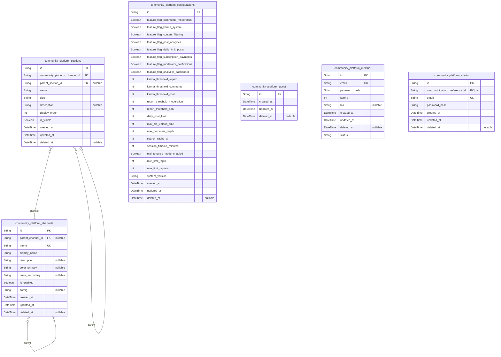
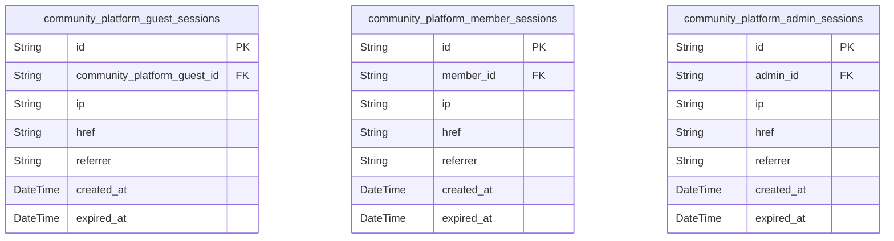
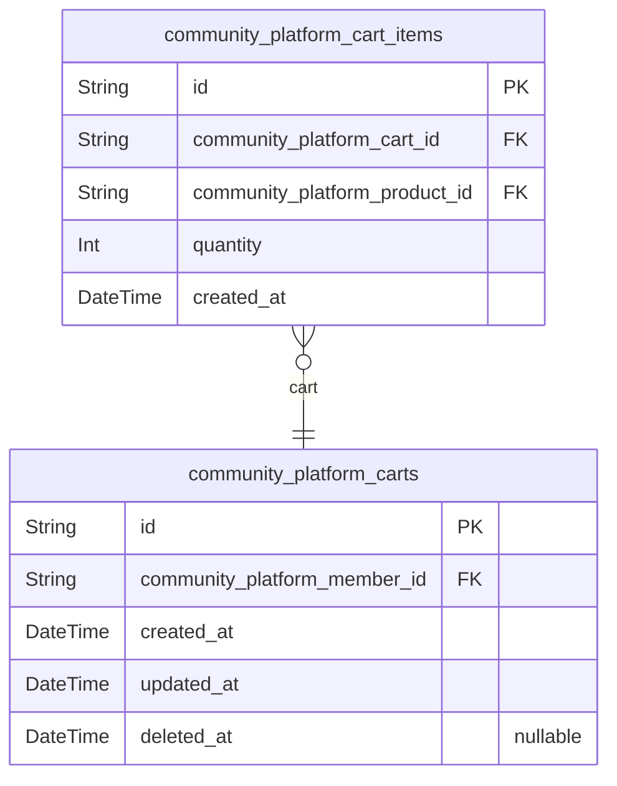
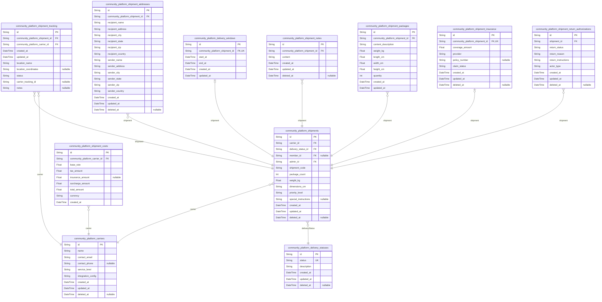
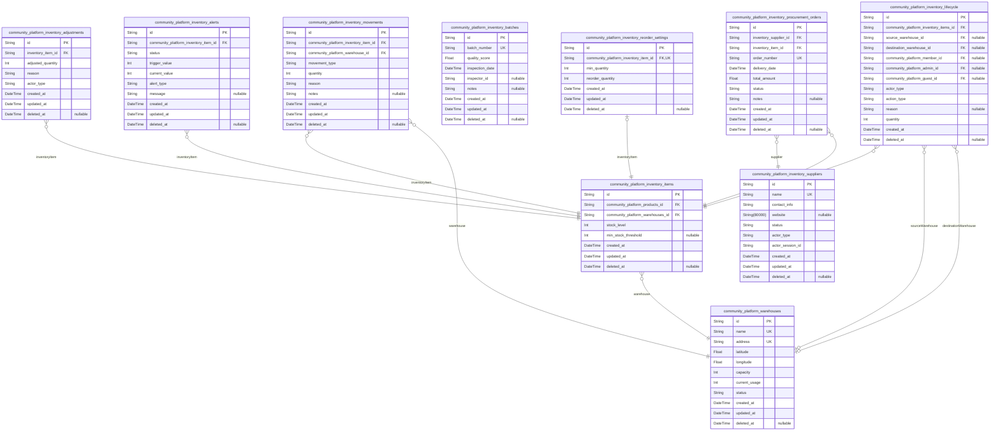
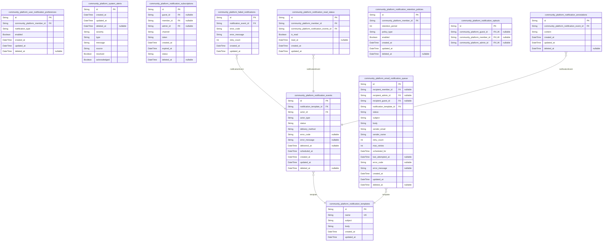
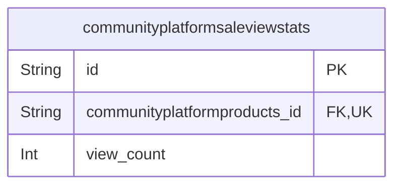

# Prisma Markdown

> Generated by [`prisma-markdown`](https://github.com/samchon/prisma-markdown)

- [Systematic](#systematic)
- [Actors](#actors)
- [Sales](#sales)
- [Carts](#carts)
- [Orders](#orders)
- [Shipping](#shipping)
- [Inventory](#inventory)
- [Notifications](#notifications)
- [Reporting](#reporting)
- [default](#default)

## Systematic

```mermaid
erDiagram
"community_platform_channels" {
  String id PK
  String parent_channel_id FK "nullable"
  String name UK
  String display_name
  String description "nullable"
  String color_primary "nullable"
  String color_secondary "nullable"
  Boolean is_enabled
  String config "nullable"
  DateTime created_at
  DateTime updated_at
  DateTime deleted_at "nullable"
}
"community_platform_sections" {
  String id PK
  String community_platform_channel_id FK
  String parent_section_id FK "nullable"
  String name
  String slug
  String description "nullable"
  Int display_order
  Boolean is_visible
  DateTime created_at
  DateTime updated_at
  DateTime deleted_at "nullable"
}
"community_platform_configurations" {
  String id PK
  Boolean feature_flag_comments_moderation
  Boolean feature_flag_karma_system
  Boolean feature_flag_content_filtering
  Boolean feature_flag_post_analytics
  Boolean feature_flag_daily_limit_posts
  Boolean feature_flag_subscription_payments
  Boolean feature_flag_moderator_notifications
  Boolean feature_flag_analytics_dashboard
  Int karma_threshold_report
  Int karma_threshold_comments
  Int karma_threshold_post
  Int report_threshold_moderation
  Int report_threshold_ban
  Int daily_post_limit
  Int max_file_upload_size
  Int max_comment_depth
  Int search_cache_ttl
  Int session_timeout_minutes
  Boolean maintenance_mode_enabled
  Int rate_limit_login
  Int rate_limit_reports
  String system_version
  DateTime created_at
  DateTime updated_at
  DateTime deleted_at "nullable"
}
"community_platform_guest" {
  String id PK
  DateTime created_at
  DateTime updated_at
  DateTime deleted_at "nullable"
}
"community_platform_member" {
  String id PK
  String email UK
  String password_hash
  Int karma
  String bio "nullable"
  DateTime created_at
  DateTime updated_at
  DateTime deleted_at "nullable"
  String status
}
"community_platform_admin" {
  String id PK
  String user_notification_preference_id FK,UK
  String email UK
  String password_hash
  DateTime created_at
  DateTime updated_at
  DateTime deleted_at "nullable"
}
"community_platform_channels" }o--o| "community_platform_channels" : parent
"community_platform_sections" }o--|| "community_platform_channels" : channel
"community_platform_sections" }o--o| "community_platform_sections" : parent
```

### `community_platform_channels`

Channels for content delivery (e.g., web, mobile, API) with branding and
configuration settings.

Represents the primary access points for users to interact with the
system content, such as web interface, mobile applications, or API
endpoints. Each channel can have distinct branding, functionality, and
configuration settings to serve different user segments or device types.

Channels are managed independently by administrators who can enable,
disable, or modify channel-specific settings. Users select a channel when
accessing the platform, and the system routes content and features
accordingly. Channels can be hierarchical, with sections organizing
content within each channel.

The channel configuration includes branding elements like logos, colors,
and custom UI settings that adapt the platform experience per channel.

Properties as follows:

- `id`: Primary Key.
- `parent_channel_id`
  > Parent channel for hierarchical organization. {@link
  > community_platform_channels.id}.
- `name`: Unique internal name for the channel (e.g., 'web', 'mobile', 'api').
- `display_name`: Human-readable name shown to users (e.g., 'Web Portal', 'Mobile App').
- `description`: Detailed description of the channel's purpose and target users.
- `color_primary`: Primary brand color code in hex format (e.g., '#3B82F6').
- `color_secondary`: Secondary brand color code in hex format (e.g., '#10B981').
- `is_enabled`: Whether the channel is currently active and available to users.
- `config`: JSON configuration object for channel-specific settings and feature flags.
- `created_at`: Timestamp when this channel was created.
- `updated_at`: Timestamp when this channel was last updated.
- `deleted_at`: Timestamp when this channel was soft-deleted (null if active).

### `community_platform_sections`

Hierarchical sections within channels for organizing content, products,
and community groupings.

Each section belongs to a specific channel and can have nested child
sections to create multi-level organizational structures. Sections define
the navigation hierarchy for users and determine content categorization
within a channel.

Sections are managed by administrators through channel configuration
interfaces, but users directly navigate, search, and access sections via
URL routing. Each section has a unique slug for clean URLs and is ordered
visually by display_order.

This table is a primary entity because users independently interact with
sections: accessing content by selecting sections, bookmarking, and
navigating through the site structure.

Temporal fields:
- created_at: Records when the section was created in the system
- updated_at: Tracks the last modification of section metadata
- deleted_at: NULL until soft-deleted for moderation purposes

Properties as follows:

- `id`: Primary Key.
- `community_platform_channel_id`
  > Channel that this section belongs to. {@link
  > community_platform_channels.id}.
- `parent_section_id`
  > Parent section for nesting. [community_platform_sections.id](#community_platform_sections).
  > Enables hierarchical structure.
- `name`: Display name for the section shown to users.
- `slug`: URL-friendly identifier for routing, must be unique within channel.
- `description`: Detailed description of the section's purpose and content scope.
- `display_order`
  > Order position of this section relative to its siblings under the same
  > parent.
- `is_visible`
  > Whether this section is visible to users. Hidden sections can be
  > reactivated.
- `created_at`: Timestamp of when this section was created.
- `updated_at`: Timestamp of when this section was last updated.
- `deleted_at`
  > Soft delete timestamp for moderation. When set, section is hidden from
  > users.

### `community_platform_configurations`

Global system configuration flags and feature toggles that control
application behavior across all domains.

Stores system-wide settings such as feature toggles, operational
parameters, and administrative controls that govern how the platform
functions across all components. These configurations are managed
exclusively by administrators through administrative interfaces and are
not directly manipulated by end users.

Configuration values include activation flags for features like comment
moderation, karma calculation rules, content filtering sensitivity, and
system-wide rate limits. All settings are applied globally and affect the
behavior of every subsystem, including Notifications, Reporting, Sales,
and Actors. Changes to configurations trigger immediate effects across
the entire platform.

The table follows a snapshot-like pattern but is classified as subsidiary
because it represents the current active configuration state rather than
historical versions. Configuration changes are tracked through audit logs
in other components rather than versioned in this table.

Properties as follows:

- `id`: Primary Key.
- `feature_flag_comments_moderation`
  > Enables or disables automated comment moderation system. When enabled,
  > AI-powered content analysis flags inappropriate comments for review.
- `feature_flag_karma_system`
  > Activates the karma reputation system that rewards user contributions.
  > When disabled, user reputation scores are not calculated or displayed.
- `feature_flag_content_filtering`
  > Enables keyword-based content filtering to block prohibited terms across
  > all content types. When disabled, no automated filtering occurs.
- `feature_flag_post_analytics`
  > Controls whether post view statistics and engagement metrics are
  > collected and stored for analytics purposes.
- `feature_flag_daily_limit_posts`
  > Activates daily posting limits for member users to prevent spam and
  > maintain platform quality.
- `feature_flag_subscription_payments`
  > Enables or disables paid subscription features for premium content access
  > and monetization.
- `feature_flag_moderator_notifications`
  > Controls whether administrators receive automated alerts for
  > high-priority moderation events such as content reports exceeding
  > thresholds.
- `feature_flag_analytics_dashboard`
  > Enables access to system-wide analytics dashboards for administrators to
  > monitor platform health, user growth, and engagement trends.
- `karma_threshold_report`
  > Minimum karma score required before a user can report content. Prevents
  > abuse of reporting system by low-reputation users.
- `karma_threshold_comments`
  > Minimum karma score required before a user can post comments. Reduces
  > spam by requiring community trust before allowing interaction.
- `karma_threshold_post`
  > Minimum karma score required before a user can create new posts. Prevents
  > spam content from new or low-reputation users.
- `report_threshold_moderation`
  > Number of reports required on content before automated moderation action
  > is triggered (e.g., hiding the content or suspending user).
- `report_threshold_ban`
  > Number of reports required on a user before automatic suspension or
  > banning occurs based on cumulative offenses.
- `daily_post_limit`
  > Maximum number of posts a member user can create per day when daily limit
  > feature is enabled.
- `max_file_upload_size`
  > Maximum file upload size in bytes allowed for content attachments such as
  > images, videos, or documents.
- `max_comment_depth`
  > Maximum nesting depth allowed for comment threads. Controls comment
  > hierarchy complexity to prevent excessive nesting.
- `search_cache_ttl`
  > Time-to-live duration in seconds for search query results cache. Controls
  > how frequently search indexes are refreshed.
- `session_timeout_minutes`
  > Duration in minutes after which a user session expires if there is no
  > activity. Defines session inactivity timeout.
- `maintenance_mode_enabled`
  > Global maintenance flag that temporarily disables user-facing operations
  > during system updates or repairs. When true, users see maintenance page.
- `rate_limit_login`
  > Maximum number of login attempts allowed from a single IP address within
  > a time window before temporary lockout.
- `rate_limit_reports`
  > Maximum number of reports a single user can submit within a time window
  > to prevent report spamming.
- `system_version`
  > Current system version identifier, used for tracking schema compatibility
  > and deployment status across distributed systems.
- `created_at`
  > Timestamp indicating when this configuration set was created. Tracks when
  > these system settings were first applied.
- `updated_at`
  > Timestamp indicating the last time this configuration set was modified.
  > Used for auditing configuration changes and cache invalidation.
- `deleted_at`
  > Soft delete timestamp for configuration records. When set, indicates the
  > configuration has been archived and is no longer active. Used for audit
  > trail and rollback capability.

### `community_platform_guest`

Tracks anonymous visitors who view public content but have no
authenticated identity.

Records temporary access events from users who have not created an
account or logged in. These records enable analytics on public content
engagement and provide data for conversion funnel analysis.

Each guest record is uniquely identified and timestamped to track visit
frequency and duration. Guest records are cleared after 30 days of
inactivity as part of data retention policy, but always maintained in
soft-deleted state for audit purposes.

This table is referenced by the community_platform_guest_sessions table
to correlate anonymous sessions with guest visit history.

Properties as follows:

- `id`: Primary Key.
- `created_at`: Timestamp when this guest record was first created upon initial visit.
- `updated_at`: Timestamp of the most recent activity associated with this guest record.
- `deleted_at`
  > Soft delete timestamp indicating when this guest record was marked for
  > removal as part of data retention policy. NULL means record is active.

### `community_platform_member`

Authenticated member accounts with profiles, karma scores, and
subscription relationships.

Represents users who have registered and authenticated with the system,
enabling full participation in the community including posting content,
voting, commenting, and managing subscriptions.

Each member records persistent identity and engagement metrics that
persist across sessions. Members can create communities, submit posts and
comments, earn karma through community interactions, and subscribe to
content channels.

The model tracks cryptographic password hashes for secure authentication,
email for communication and recovery, and karma as a cumulative
reputation score derived from community feedback.

Connections to authentication state are maintained through a 1:1
relationship with community_platform_member_sessions, which handles
active login sessions, while this table maintains the persistent identity
profile.

Properties as follows:

- `id`: Primary Key.
- `email`
  > Registered email address used for authentication, notifications, and
  > account recovery. Must be unique across all members.
- `password_hash`
  > BCrypt hash of the user's password. Never stored in plain text. Required
  > for secure login functionality.
- `karma`
  > Cumulative reputation score earned through community interactions such as
  > helpful posts, upvotes from other members, and successful content
  > contributions. Positive values only.
- `bio`
  > Optional user-provided description about themselves. Can contain short
  > narratives, interests, or professional summaries.
- `created_at`
  > Timestamp when the member account was created. Always set during initial
  > registration and never modified.
- `updated_at`
  > Timestamp when the member profile was last updated (e.g., bio change,
  > email update). Automatically maintained by the system.
- `deleted_at`
  > Soft delete timestamp indicating when the member account was deactivated.
  > NULL means active account; non-NULL means account is archived and no
  > longer accessible.
- `status`
  > Current account status. Valid values: active, suspended, disabled,
  > verified. Controls access permissions and moderation actions.

### `community_platform_admin`

System administrators with elevated privileges for moderation,
configuration, and user management.

Accounts with full access to system-wide configuration, content
moderation, user management, and operational controls. These entities are
granted permissions beyond regular members to ensure platform integrity
and operational continuity.

Admins can perform actions across all domains: removing inappropriate
content, banning users, adjusting karma scores, managing community rules,
reviewing reports, and accessing system analytics. Each admin has a
unique email and password for authentication, and all actions are
auditable through session logging.

Properties as follows:

- `id`: Primary Key.
- `user_notification_preference_id`
  > User-specific notification preferences controlling which alerts this
  > admin receives. {@link
  > community_platform_user_notification_preferences.id}.
- `email`
  > Unique email address used for login and communication. Must be a valid
  > business email address associated with the administrator.
- `password_hash`
  > Securely hashed password for authentication. Never stored as plain text.
  > Created using bcrypt with salt.
- `created_at`
  > Timestamp when this admin account was created. Used for audit trails and
  > onboarding tracking.
- `updated_at`
  > Timestamp of the last update to this admin account. Updated whenever
  > profile or permissions change.
- `deleted_at`
  > Soft delete timestamp. If null, account is active. If set, account is
  > logically deleted for audit purposes.

## Actors

```mermaid
erDiagram
"community_platform_guest_sessions" {
  String id PK
  String community_platform_guest_id FK
  String ip
  String href
  String referrer
  DateTime created_at
  DateTime expired_at
}
"community_platform_member_sessions" {
  String id PK
  String member_id FK
  String ip
  String href
  String referrer
  DateTime created_at
  DateTime expired_at
}
"community_platform_admin_sessions" {
  String id PK
  String admin_id FK
  String ip
  String href
  String referrer
  DateTime created_at
  DateTime expired_at
}
```

### `community_platform_guest_sessions`

Authentication sessions for guest users, tracking temporary access state.

Tracks temporary access for anonymous visitors who have not yet
authenticated as members. Each session is created when a guest accesses
the platform and expires after a defined period. Sessions enable
personalized experiences and analytics while maintaining guest anonymity.

Sessions are managed automatically by the authentication system - users
cannot create, delete, or extend them directly. They exist solely for
tracking temporary user activity with IP addresses and access paths.

Properties as follows:

- `id`: Primary Key.
- `community_platform_guest_id`
  > The guest user this session belongs to. {@link
  > community_platform_guest.id}.
- `ip`
  > The IP address from which the guest accessed the system. Used for
  > security analysis and geographic location approximation.
- `href`
  > The URL path that the guest visited when this session was created.
  > Captures entry point into the system.
- `referrer`
  > The referrer URL indicating where the guest came from before accessing
  > the system. Useful for traffic source analysis.
- `created_at`
  > The timestamp when this guest session was created. Records the exact
  > moment the guest first accessed the system during this session.
- `expired_at`
  > The timestamp when this guest session will expire. Sessions expire after
  > a fixed duration for security. Always has a value - never NULL.

### `community_platform_member_sessions`

Authentication sessions for member users, storing JWT tokens and session
state.

Tracks active and historical authentication sessions for authenticated
members. Each session is associated with a specific member account and
tracks the connection context including IP address, origin URL, and
referrer. Sessions are automatically expired after a set duration for
security compliance.

Used for security auditing, concurrent session detection, and identifying
suspicious login patterns. Sessions are managed entirely by the
authentication system and are not directly manipulated by end users.

Properties as follows:

- `id`: Primary Key.
- `member_id`
  > Authentication member account this session belongs to. {@link
  > community_platform_member.id}.
- `ip`: IP address from which the session was initiated.
- `href`: URL of the page where the user initiated login or session creation.
- `referrer`: Referrer URL that led the user to the login page or application.
- `created_at`: Timestamp when the session was created.
- `expired_at`
  > Timestamp when the session will expire. Sessions must expire for security
  > compliance, so this field is required and never null.

### `community_platform_admin_sessions`

Authentication sessions for admin users, storing privileged access tokens
and session metadata.

Tracks active authentication sessions for system administrators with
elevated privileges. Each session is tied to a specific admin user and
contains connection context for security auditing.

Sessions are automatically expired after a fixed duration (typically 2-8
hours) for security. The system generates new sessions upon
re-authentication.

These sessions are managed entirely by the system and are not directly
modified or deleted by users. They are created during login and
terminated upon expiration or logout.

Properties as follows:

- `id`: Primary Key.
- `admin_id`: Admin user who owns this session. [community_platform_admin.id](#community_platform_admin).
- `ip`: IP address from which the session was established.
- `href`: URL of the connection request (login endpoint).
- `referrer`: Referrer URL indicating the source page leading to login.
- `created_at`: Timestamp when the session was created.
- `expired_at`
  > Timestamp when the session expires. Sessions must have expiration for
  > security; unlimited sessions are prohibited by default.

## Sales

```mermaid
erDiagram
"communityplatformproducts" {
  String id PK
  String communityplatformproductcategories_id FK
  String title
  String description
  DateTime created_at
  DateTime updated_at
  DateTime deleted_at "nullable"
}
"communityplatformproductvariants" {
  String id PK
  String product_id FK
  String inventory_item_id FK,UK
  String name
  String attributes
  Float price
  Float discount_price "nullable"
  Boolean available
  DateTime created_at
  DateTime updated_at
  DateTime deleted_at "nullable"
}
"communityplatformproductimages" {
  String id PK
  String communityplatformproducts_id FK
  String file_path
  Int file_size
  String mime_type
  Int order_index
  DateTime created_at
}
"communityplatformproductspecifications" {
  String id PK
  String communityplatformproduct_id FK
  String key
  String value
  DateTime created_at
  DateTime updated_at
  DateTime deleted_at "nullable"
}
"communityplatformproductcategories" {
  String id PK
  String parent_id FK "nullable"
  String name
  String description "nullable"
  Int order_index
  DateTime created_at
  DateTime updated_at
  DateTime deleted_at "nullable"
}
"communityplatformproductreviews" {
  String id PK
  String communityplatformproduct_id FK
  String communityplatformmember_id FK,UK
  Int rating
  String title
  String body
  DateTime created_at
  DateTime updated_at
  DateTime deleted_at "nullable"
}
"communityplatformproductreviewvotes" {
  String id PK
  String product_review_id FK
  String member_id FK
  Int vote_value
  DateTime created_at
  DateTime updated_at
  DateTime deleted_at "nullable"
}
"communityplatformproductquestions" {
  String id PK
  String product_id FK
  String title
  String body
  DateTime created_at
  DateTime updated_at
  DateTime deleted_at "nullable"
  String actor_type
}
"communityplatformproductquestionanswers" {
  String id PK
  String productquestion_id FK,UK
  String seller_type
  String title
  String body
  DateTime created_at
  DateTime updated_at
  DateTime deleted_at "nullable"
}
"communityplatformproductprices" {
  String id PK
  String communityplatformproduct_id FK
  Float price
  String currency
  DateTime start_date
  DateTime end_date "nullable"
  String source "nullable"
  DateTime created_at
  DateTime updated_at
  DateTime deleted_at "nullable"
}
"communityplatformproductpricerules" {
  String id PK
  String communityplatformproduct_id FK
  String name UK
  String description "nullable"
  Int priority
  String trigger_condition
  Float discount_percentage
  DateTime start_date
  DateTime end_date "nullable"
  Boolean is_active
  DateTime created_at
  DateTime updated_at
  DateTime deleted_at "nullable"
}
"communityplatformpromotions" {
  String id PK
  String communityplatformproducts_id FK "nullable"
  String communityplatformproductcategories_id FK "nullable"
  String name
  String description "nullable"
  DateTime start_date
  DateTime end_date
  String discount_type
  Float discount_value
  Float min_purchase_amount "nullable"
  Float max_discount_amount "nullable"
  String eligibility_rules "nullable"
  String status
  DateTime created_at
  DateTime updated_at
  DateTime deleted_at "nullable"
}
"communityplatformsales" {
  String id PK
  String community_platform_member_id FK
  String status
  DateTime created_at
  DateTime updated_at
  DateTime deleted_at "nullable"
}
"communityplatformsaleitems" {
  String id PK
  String communityplatformsales_id FK
  String communityplatformproducts_id FK
  Int quantity
  Float unit_price
  Float total_amount
  DateTime created_at
  DateTime updated_at
  DateTime deleted_at "nullable"
}
"communityplatformsalesnapshots" {
  String id PK
  String communityplatformsales_id FK,UK
  DateTime snapshot_at
  Float total_amount
  String currency
  Float tax_amount
  Float discount_amount
  Float shipping_amount
  String payment_status
  String order_status
  String customer_id
  String shipping_address
  String billing_address
  String notes "nullable"
  DateTime created_at
  DateTime updated_at
  DateTime deleted_at "nullable"
}
"communityplatformsaleshipments" {
  String id PK
  String communityplatformsales_id FK,UK
  String carrier
  String tracking_number
  String status
  String ship_to_address
  String ship_from_address
  DateTime estimated_delivery_date "nullable"
  DateTime actual_delivery_date "nullable"
  DateTime created_at
  DateTime updated_at
  DateTime deleted_at "nullable"
}
"communityplatformsaleshipmenttrackings" {
  String id PK
  String communityplatformsaleshipments_id FK
  String community_platform_carriers_id FK
  String status
  String details "nullable"
  DateTime created_at
  DateTime updated_at
  DateTime deleted_at "nullable"
}
"communityplatformsalefavorites" {
  String id PK
  String member_id FK
  String product_id FK
  DateTime created_at
  DateTime updated_at
}
"communityplatformsalestaxrates" {
  String id PK
  String jurisdiction
  String tax_type
  Float rate_percentage
  String description "nullable"
  DateTime effective_from
  DateTime effective_to "nullable"
  DateTime created_at
  DateTime updated_at
}
"communityplatformsalescurrencyrates" {
  String id PK
  String currency_code
  Float rate
  DateTime effective_date
  String source_provider "nullable"
  DateTime created_at
  DateTime updated_at
  DateTime deleted_at "nullable"
}
"communityplatformsalesdiscountcodes" {
  String id PK
  String code
  String discount_type
  Float discount_value
  Int usage_limit
  DateTime expires_at
  Boolean is_active
  DateTime created_at
  DateTime updated_at
  DateTime deleted_at "nullable"
}
"communityplatformsalesdiscountuses" {
  String id PK
  String sales_discount_code_id FK
  String sale_id FK
  Float discount_amount
  DateTime used_at
  DateTime created_at
  DateTime updated_at
  DateTime deleted_at "nullable"
}
"communityplatformsalesrefunds" {
  String id PK
  String sales_id FK
  Float amount
  String reason
  String status
  DateTime created_at
  DateTime updated_at
  DateTime deleted_at "nullable"
}
"communityplatformproductstocklevels" {
  String id PK
  String product_variant_id FK,UK
  Int stock_level
  Int reorder_threshold
  DateTime created_at
  DateTime updated_at
  DateTime deleted_at "nullable"
}
"communityplatformproductwishlist" {
  String id PK
  String member_id FK
  String product_id FK
  DateTime created_at
  DateTime updated_at
  DateTime deleted_at "nullable"
}
"communityplatformsalesordernotes" {
  String id PK
  String communityplatformsales_id FK
  String content
  DateTime created_at
  DateTime updated_at
  DateTime deleted_at "nullable"
}
"communityplatformproducts" }o--|| "communityplatformproductcategories" : category
"communityplatformproductvariants" }o--|| "communityplatformproducts" : product
"communityplatformproductimages" }o--|| "communityplatformproducts" : product
"communityplatformproductspecifications" }o--|| "communityplatformproducts" : product
"communityplatformproductcategories" }o--o| "communityplatformproductcategories" : parent
"communityplatformproductreviews" }o--|| "communityplatformproducts" : product
"communityplatformproductreviewvotes" }o--|| "communityplatformproductreviews" : review
"communityplatformproductquestions" }o--|| "communityplatformproducts" : product
"communityplatformproductquestionanswers" |o--|| "communityplatformproductquestions" : productQuestion
"communityplatformproductprices" }o--|| "communityplatformproducts" : product
"communityplatformproductpricerules" }o--|| "communityplatformproducts" : product
"communityplatformpromotions" }o--o| "communityplatformproducts" : product
"communityplatformpromotions" }o--o| "communityplatformproductcategories" : category
"communityplatformsaleitems" }o--|| "communityplatformsales" : sale
"communityplatformsaleitems" }o--|| "communityplatformproducts" : product
"communityplatformsalesnapshots" |o--|| "communityplatformsales" : sale
"communityplatformsaleshipments" |o--|| "communityplatformsales" : sale
"communityplatformsaleshipmenttrackings" }o--|| "communityplatformsaleshipments" : shipment
"communityplatformsalefavorites" }o--|| "communityplatformproducts" : product
"communityplatformsalesdiscountuses" }o--|| "communityplatformsalesdiscountcodes" : discountCode
"communityplatformsalesdiscountuses" }o--|| "communityplatformsales" : sale
"communityplatformsalesrefunds" }o--|| "communityplatformsales" : sales
"communityplatformproductstocklevels" |o--|| "communityplatformproductvariants" : productVariant
"communityplatformproductwishlist" }o--|| "communityplatformproducts" : product
"communityplatformsalesordernotes" }o--|| "communityplatformsales" : sale
```

### `communityplatformproducts`

Core product catalog entities with title, description, and category
relationships.

Represents products available for sale on the platform. Each product has
a unique identifier, descriptive title and body content, and belongs to a
specific category for organized browsing and filtering.

Products are the central entities in the sales domain, forming the
foundation for pricing, inventory, reviews, and sales transactions.
Customers search, filter, and browse products independently, requiring
full CRUD API support. Product information may change over time, but
historical context is preserved through related entities like prices and
variants rather than snapshotting this table.

The product record serves as a canonical reference point for all
downstream sales activities including cart additions, orders, reviews,
and question/answer interactions.

Properties as follows:

- `id`: Primary Key.
- `communityplatformproductcategories_id`
  > Category this product belongs to. {@link
  > communityplatformproductcategories.id}.
- `title`
  > The product's official title as displayed to customers. Must be concise
  > and descriptive.
- `description`
  > Detailed product description including features, specifications, and
  > usage information. May contain Markdown or HTML for formatting.
- `created_at`: When the product record was first created in the system.
- `updated_at`
  > Last time any attribute of this product was modified. Used to track
  > freshness and trigger cache invalidation.
- `deleted_at`
  > Timestamp when this product was logically deleted. Used for soft delete
  > capability and audit trail. NULL means product is active.

### `communityplatformproductvariants`

Product variants for different sizes, colors, or configurations with
separate pricing and inventory.

Each product can have multiple variants representing different
specifications such as size, color, material, or configuration. Variants
have independent pricing, inventory levels, and availability status
separate from the parent product. This allows for fine-grained product
management where different configurations can have different costs, stock
levels, and availability.

Variants are managed by product administrators who create, edit, and
disable specific variants independently. The system tracks historical
pricing and inventory changes for each variant through temporal fields.
Variants can be archived (soft-deleted) when discontinued without
removing the parent product.

Properties as follows:

- `id`: Primary Key.
- `product_id`
  > Reference to the parent product this variant belongs to. {@link
  > communityplatformproducts.id}.
- `inventory_item_id`
  > Reference to the inventory item tracking stock levels for this variant.
  > [community_platform_inventory_items.id](#community_platform_inventory_items). Ensures exactly one
  > inventory record per variant.
- `name`
  > Display name for the variant (e.g., 'Large Blue', 'Wireless Edition').
  > Used in product selection UI.
- `attributes`
  > JSON representation of variant-specific attributes (e.g., {"size": "L",
  > "color": "blue", "material": "cotton"}). Used for product filtering and
  > display.
- `price`
  > Regular price of this specific variant in the base currency. Used for
  > checkout calculation and comparison with discount price.
- `discount_price`
  > Sale/discounted price of this variant when active. If null, regular price
  > applies. Used for promotional pricing.
- `available`
  > Availability status of this variant. When false, variant cannot be
  > purchased but remains in catalog for historical data.
- `created_at`
  > Timestamp when this variant was created in the system. Used for audit
  > trail and data analysis.
- `updated_at`
  > Timestamp when this variant was last modified. Used for tracking changes
  > and synchronization.
- `deleted_at`
  > Timestamp when this variant was soft-deleted. When null, variant is
  > active. Used for inventory management and data recovery.

### `communityplatformproductimages`

Product images for display in the sales catalog.

Stores and manages visual assets associated with products. Each image is
linked to exactly one product and has an ordered position for display
sequencing. Images are not independently managed by users but are
created, updated, and deleted as part of product management workflows.

Image metadata includes file path, format, size, and display ordering.
The system does not maintain historical versions of product images - when
an image is replaced, the old one is removed and the new one takes its
place.

This table is purely subsidiary to the product catalog, serving only to
provide visual representation of products.

Properties as follows:

- `id`: Primary Key.
- `communityplatformproducts_id`
  > Reference to the product this image belongs to. {@link
  > communityplatformproducts.id}.
- `file_path`
  > Absolute file path or URL to the product image in storage. Format:
  > /images/products/{product_id}/filename.ext
- `file_size`
  > Size of the image file in bytes. Used for storage planning and
  > performance optimization.
- `mime_type`
  > MIME type of the image file (e.g., image/jpeg, image/png). Used to
  > determine rendering behavior and format support.
- `order_index`
  > Position index for display ordering of images within a product. First
  > image has order_index=0, second has 1, etc.
- `created_at`
  > Timestamp of when the image was uploaded and associated with the product.
  > Records creation time for audit purposes.

### `communityplatformproductspecifications`

Technical specifications for products stored as key-value pairs.

Represents detailed technical attributes of products such as dimensions,
materials, power consumption, weight, and other measurable
characteristics. This table enables flexible product categorization and
filtering based on technical criteria without requiring schema changes
for new specifications.

Each specification is associated with exactly one product and has a
unique key-value pair. The specification keys are standardized within the
admin system to ensure consistency (e.g., "weight", "dimensions",
"battery_capacity").

Soft deletion is supported to maintain audit trails while allowing
specification cleanup or revision.

Detailed specification history is tracked through product snapshots in
communityplatformproductsnapshots, so this table stores only current
specifications.

This entity is managed independently by backend administrators and
integration systems.

Properties as follows:

- `id`: Primary Key.
- `communityplatformproduct_id`
  > Product this specification belongs to. {@link
  > communityplatformproducts.id}.
- `key`
  > The attribute name of the specification (e.g., "weight", "dimensions",
  > "battery_capacity"). Standardized keys ensure consistency across products
  > and enable efficient searching and filtering.
- `value`
  > The value of the specification in string format. This allows storing both
  > numeric and textual values (e.g., "1.5kg", "20cm x 15cm x 10cm",
  > "4000mAh").
- `created_at`: Timestamp when this specification record was created.
- `updated_at`: Timestamp when this specification record was last updated.
- `deleted_at`
  > Timestamp when this specification was logically deleted. NULL indicates
  > the specification is active.

### `communityplatformproductcategories`

Product categorization hierarchy with parent-child relationships for
navigation.

Stores the hierarchical structure of product categories that enables
browsing and filtering in the product catalog. Each category can have
multiple child categories, forming a tree structure that organizes
products into logical groupings for users.

Categories are directly managed by administrators and serve as navigation
roots for product discovery. New categories are created to accommodate
new product lines, and existing ones are reorganized as the catalog
evolves.

Categories can be soft-deleted to archive them while preserving
historical association with products. The hierarchy supports unlimited
nesting depth for complex classification needs.

Properties as follows:

- `id`: Primary Key.
- `parent_id`
  > Parent category that contains this category. {@link
  > communityplatformproductcategories.id}.
- `name`
  > Display name of the category shown to users in navigation menus and
  > product filtering.
- `description`
  > Detailed description of the category that may be displayed on category
  > landing pages or used for SEO metadata.
- `order_index`
  > Determines display order among sibling categories. Lower values appear
  > first in navigation.
- `created_at`: Timestamp when this category was created in the system.
- `updated_at`: Timestamp when this category was last modified.
- `deleted_at`
  > Timestamp when this category was soft-deleted. Nullable means the
  > category is active; non-null means archived.

### `communityplatformproductreviews`

Customer reviews and ratings for products with user attribution and
timestamps.

Stores feedback from authenticated members about specific products they
have purchased or experienced. Each review represents a single user's
opinion with a numeric rating (1-5) and optional title/body text.

Reviews are independent entities that users can create, edit, and delete
at any time. They remain attached to the product even if product details
change, providing historical context for future buyers.

The review content reflects the member's authentic experience, subject to
reporting and moderation. Reviews are not created by guests or
administrators - only authenticated members can submit them, enforced via
the member_subtype relationship.

All reviews are tracked with full audit trails via timestamps and soft
delete capability for content moderation.

Properties as follows:

- `id`: Primary Key.
- `communityplatformproduct_id`: The product being reviewed. [communityplatformproducts.id](#communityplatformproducts).
- `communityplatformmember_id`: The member who created this review. [community_platform_member.id](#community_platform_member).
- `rating`
  > Numeric rating from 1 to 5. Must be an integer between 1 (poor) and 5
  > (excellent). Required for all reviews.
- `title`
  > Brief headline or summary of the review. Must contain at least 3
  > characters and cannot be empty.
- `body`
  > Detailed review content written by the member. Can be up to 2000
  > characters with rich text formatting.
- `created_at`
  > Timestamp when the review was first created. Cannot be modified after
  > creation.
- `updated_at`
  > Timestamp when the review was last modified. Updated whenever title or
  > body is changed.
- `deleted_at`
  > Timestamp when the review was soft-deleted (hidden from public view).
  > Null if active. Used for content moderation.

### `communityplatformproductreviewvotes`

Helpful votes on product reviews to surface quality feedback.

Tracks member feedback on product reviews to identify the most useful
content for other users. Each vote represents either a positive (helpful)
or negative (abuse) assessment of a review's quality, enabling
algorithmic surfacing of high-quality content.

Membership authentication required to cast votes - guests cannot provide
feedback. Each member can vote only once per review to prevent
manipulation. Votes are timestamped and support soft delete for
moderation purposes, allowing abusive votes to be removed while
maintaining audit trails.

This table enables reputation systems by determining which product
reviews gain prominence through community assessment.

Properties as follows:

- `id`: Primary Key.
- `product_review_id`
  > The product review being voted on. {@link
  > communityplatformproductreviews.id}.
- `member_id`: The member who cast this vote. [community_platform_member.id](#community_platform_member).
- `vote_value`
  > Vote value indicating helpfulness: +1 for helpful vote, -1 for abuse
  > report (flag as helpful/no).
- `created_at`: Timestamp when this vote was cast by the member.
- `updated_at`: Timestamp when this vote was last modified or retracted.
- `deleted_at`
  > Timestamp when this vote was soft-deleted (e.g., by moderator for abusive
  > behavior). If null, vote is active.

### `communityplatformproductquestions`

Customer questions about products before purchase.

Stores inquiries from customers seeking additional product information
before making a purchase decision. Each question is associated with a
specific product and created by an authenticated actor (member, guest, or
admin) through their active session.

Questions remain attached to the product even if the product details
change, providing historical context. Customers can ask multiple
questions per product, and each question can receive one answer from the
seller or other actor.

The question content includes title and body fields for structured
inquiry formatting. Soft deletion is supported to maintain audit trails
while allowing content moderation.

Properties as follows:

- `id`: Primary Key.
- `product_id`: Product that the question is about. [communityplatformproducts.id](#communityplatformproducts).
- `title`
  > Brief title summarizing the customer's question. Typically 1-5 words
  > describing the inquiry.
- `body`
  > Detailed description of the customer's question. Contains the full
  > context of what the user wants to know about the product.
- `created_at`
  > Timestamp when the question was originally created. Used for
  > chronological ordering and activity tracking.
- `updated_at`
  > Timestamp when the question was last updated (e.g., edited by user or
  > moderated).
- `deleted_at`
  > Timestamp when the question was soft-deleted (hidden). NULL indicates
  > active question. Used for content moderation and audit trails.
- `actor_type`
  > Type of actor who created this question (member, guest, or admin). Used
  > to route to appropriate subtype entity.

### `communityplatformproductquestionanswers`

Seller answers to customer product questions.

Stores responses from sellers to customer inquiries about products. Each
answer is linked to exactly one product question and is associated with
either a member seller or admin seller. Answers are visible to all users
and can be edited by the original seller until the question is marked as
resolved. Soft deletion allows for content moderation while preserving
audit trails.

The seller_type field identifies whether the answer came from a member
(merchant) or admin (support), and the corresponding subtype table
(communityplatformproductquestionanswer_of_members or
communityplatformproductquestionanswer_of_admins) contains the
actor-specific context.

The system supports two types of sellers: registered merchant members and
platform administrators. This pattern ensures referential integrity and
prevents invalid combinations of actor types.

Properties as follows:

- `id`: Primary Key.
- `productquestion_id`
  > The product question this answer responds to. {@link
  > communityplatformproductquestions.id}.
- `seller_type`
  > The type of actor who created this answer: 'member' for seller members or
  > 'admin' for system administrators.
- `title`: Short title summarizing the answer content.
- `body`
  > Full text response to the customer's question with detailed product
  > information.
- `created_at`: Timestamp when this answer was originally created.
- `updated_at`: Timestamp when this answer was last modified by the seller.
- `deleted_at`
  > Timestamp when this answer was soft-deleted by moderation or by the
  > seller. Null if still active.

### `communityplatformproductprices`

Historical pricing records for products, capturing price changes over
time for audit and reporting.

Each record represents a specific price point for a product at a given
time period, maintained to ensure accurate order fulfillment, financial
reporting, and price comparison analytics. Prices are updated by system
rules, promotions, or manual adjustments, creating a versioned history
that survives product modifications.

Product prices are not stored in the main products table to preserve the
integrity of historical transaction data. When a product's price changes,
a new price record is created with a start date, and the previous
record's end date is set to the change timestamp.

These records are crucial for accurately calculating past sales,
generating price trend reports, and ensuring refunds/credits are based on
the correct historical price rather than the current one.

Properties as follows:

- `id`: Primary Key.
- `communityplatformproduct_id`
  > Reference to the product this price applies to. {@link
  > communityplatformproducts.id}.
- `price`
  > The price value in the specified currency. Always stored as a positive
  > decimal number representing the unit cost.
- `currency`
  > Currency code (ISO 4217) for the price. Examples: USD, EUR, JPY. Must be
  > a valid three-letter currency code.
- `start_date`
  > The date and time when this price became effective. Used to determine
  > which price applies during a given time period.
- `end_date`
  > The date and time when this price expired. Null indicates the price is
  > currently active. Set when a new price record is created for the same
  > product.
- `source`
  > Origin of the price change. Values: 'system_rule', 'promotion',
  > 'manual_adjustment'. Indicates whether this price change was triggered
  > automatically by pricing rules, a promotional campaign, or an admin
  > manual override.
- `created_at`
  > Timestamp when this price record was created in the system. Used for
  > audit trail and sequence determination.
- `updated_at`
  > Timestamp of the last update to this price record. Changed whenever the
  > end_date is set (expiration) or source is updated.
- `deleted_at`
  > Soft delete timestamp for audit trail compliance. When set, the price
  > record is marked as deleted but preserved in the database. Never used to
  > remove historical pricing for reporting purposes.

### `communityplatformproductpricerules`

Dynamic pricing rules that automatically adjust product prices based on
defined conditions.

Defines business logic for applying discounts or price adjustments to
products based on criteria such as volume, season, user segment, or
promotional events. These rules are evaluated at runtime and can affect
multiple products simultaneously. Admins manage these rules independently
to control pricing strategy across the catalog without modifying
individual product prices.

Rules are prioritized by numeric priority field, with higher values
taking precedence. Only active rules are applied to products. Each rule
has a defined duration and can be archived without deletion via soft
delete mechanism.

Properties as follows:

- `id`: Primary Key.
- `communityplatformproduct_id`
  > Product to which this pricing rule applies. References an existing
  > product in the catalog. [communityplatformproducts.id](#communityplatformproducts).
- `name`
  > Human-readable name for the pricing rule, used in admin interfaces for
  > identification and management.
- `description`
  > Detailed explanation of the pricing rule's conditions and business
  > intent. Optional field used for documentation and audit purposes.
- `priority`
  > Numerical priority determining rule evaluation order. Higher values are
  > applied first. Essential for resolving conflicts when multiple rules
  > affect the same product.
- `trigger_condition`
  > JSON-formatted string describing the criteria that triggers this price
  > adjustment (e.g., {"min_quantity": 5, "user_segment": "premium"}).
- `discount_percentage`
  > Percentage discount to apply to the base product price. Negative values
  > indicate price increases. Must be between -100 and 100, inclusive.
- `start_date`
  > Date and time when the pricing rule becomes active and begins affecting
  > product prices.
- `end_date`
  > Date and time when the pricing rule expires and stops affecting product
  > prices. If null, rule remains active indefinitely.
- `is_active`
  > Flag indicating whether the pricing rule is currently active and being
  > applied. Toggle functionality allows temporary disabling of rules without
  > deletion.
- `created_at`: Timestamp of when this pricing rule was created in the system.
- `updated_at`: Timestamp of the last modification to this pricing rule's configuration.
- `deleted_at`
  > Soft delete timestamp marking when the rule was archived. Null means rule
  > is active; non-null means rule is logically deleted.

### `communityplatformpromotions`

Active promotional campaigns with start/end dates, discount rules, and
eligibility criteria.

Tracks marketing promotions that offer discounts to customers based on
specific conditions. Promotions can be applied to specific products,
categories, or all sales. Each promotion has defined start and end dates,
discount parameters, and eligibility rules that determine which customers
and products qualify for the discount.

Promotions are managed independently by administrators through the admin
panel. They remain active within their date ranges and can be updated or
deactivated as needed. Soft deletion is supported to maintain an audit
trail of promotional history while allowing promotions to be logically
removed from active status without data loss.

Properties as follows:

- `id`: Primary Key.
- `communityplatformproducts_id`
  > Product to which this promotion applies, if specific to a product. {@link
  > communityplatformproducts.id}.
- `communityplatformproductcategories_id`
  > Product category to which this promotion applies, if specific to a
  > category. [communityplatformproductcategories.id](#communityplatformproductcategories).
- `name`: Name of the promotional campaign for internal reference and display.
- `description`: Detailed description of the promotion including terms and conditions.
- `start_date`: Timestamp when the promotion becomes active.
- `end_date`: Timestamp when the promotion expires and becomes inactive.
- `discount_type`
  > Type of discount offered. Valid values: 'percentage', 'fixed_amount',
  > 'buy_x_get_y'.
- `discount_value`
  > The numerical value of the discount (e.g., 20 for 20% or 10 for $10
  > discount).
- `min_purchase_amount`
  > Minimum purchase amount required to qualify for the discount. Null means
  > no minimum.
- `max_discount_amount`
  > Maximum total discount amount allowed per transaction. Null means no
  > maximum limit.
- `eligibility_rules`
  > JSON string containing complex eligibility rules for advanced promotion
  > logic (e.g., customer segments, time-based restrictions).
- `status`
  > Current state of the promotion. Valid values: 'draft', 'active',
  > 'inactive', 'expired', 'cancelled'.
- `created_at`: Timestamp when the promotion was created.
- `updated_at`: Timestamp when the promotion was last modified.
- `deleted_at`: Timestamp when the promotion was logically deleted (soft delete).

### `communityplatformsales`

Completed sales transactions with total amount, payment status, and order
reference.

Represents final, committed purchases made by customers. Each sale
aggregates multiple line items from the shopping cart and captures the
transaction state at the time of purchase.

Sales records serve as the primary audit trail for financial transactions
and customer order history. They contain essential operational data
including payment status, customer reference, and timestamps for
reporting and reconciliation purposes.

Sales remain accessible even after related product information changes,
ensuring historical accuracy for financial and customer service purposes.

The sale status tracks payment lifecycle: pending, completed, refunded,
or cancelled. This table links to the customer via member_id and contains
the associated products through the separate sale_items table.

Properties as follows:

- `id`: Primary Key.
- `community_platform_member_id`: Customer who made this purchase. [community_platform_member.id](#community_platform_member).
- `status`
  > Payment status of the sale. Valid values: pending, completed, refunded,
  > cancelled. Tracks the financial state of the transaction lifecycle.
- `created_at`
  > Timestamp when the sale was created and finalized. Records the exact
  > moment the transaction completed.
- `updated_at`
  > Timestamp when the sale record was last updated, typically when status
  > changes (e.g., from pending to completed).
- `deleted_at`
  > Optional soft delete timestamp. Used to mark sales as cancelled or purged
  > without removing data completely, preserving audit trails.

### `communityplatformsaleitems`

Line items within completed sales transactions, capturing product
details, quantities, and pricing at time of sale.

Each item represents a single product or variant purchased within a sale,
recording the quantity and price at the time of purchase to maintain
historical accuracy. These items are always managed through their parent
sale transaction and are not independently accessed by users.

The price is captured as a snapshot to ensure accurate financial
reporting even if product prices change after the sale. Inventory levels
are not updated here as that occurs at the product level in
communityplatformproductstocklevels.

Soft deletion is supported to preserve audit trails when sales are
modified or canceled.

Properties as follows:

- `id`: Primary Key.
- `communityplatformsales_id`
  > Reference to the parent sale transaction. {@link
  > communityplatformsales.id}.
- `communityplatformproducts_id`
  > Reference to the product being purchased. {@link
  > communityplatformproducts.id}.
- `quantity`
  > Number of units of the product purchased in this line item. Must be a
  > positive integer.
- `unit_price`
  > Price per unit at time of sale, capturing the exact price paid. Stored as
  > decimal with currency precision.
- `total_amount`
  > Total amount for this line item (quantity × unit_price). Used for
  > financial reporting and tax calculations.
- `created_at`: Timestamp when this line item was created as part of the sale transaction.
- `updated_at`
  > Timestamp when this line item was last updated. Usually mirrors the
  > parent sale's update time.
- `deleted_at`
  > Timestamp when this line item was soft-deleted. Used for audit trails
  > when sales are modified or canceled. NULL means item is active.

### `communityplatformsalesnapshots`

Point-in-time snapshots of sales transactions for audit, reporting, and
historical accuracy.

Captures the complete state of a sale at the moment the snapshot is
taken, preserving pricing, quantities, and metadata for compliance and
reconciliation purposes. Each snapshot corresponds to exactly one sales
transaction and cannot be modified after creation, ensuring immutable
audit trails.

Used for financial reporting, dispute resolution, historical analysis,
and verification of transaction integrity. The snapshot data remains
unchanged even if the original sale is updated, refunded, or canceled,
maintaining a true record of what occurred at the time of the
transaction.

Properties as follows:

- `id`: Primary Key.
- `communityplatformsales_id`
  > Reference to the original sale that this snapshot represents. {@link
  > communityPlatformSales.id}.
- `snapshot_at`
  > Timestamp when this snapshot was created, capturing the exact state of
  > the sale at that moment.
- `total_amount`
  > Total monetary amount of the sale at time of snapshot, including all
  > adjustments, taxes, and discounts.
- `currency`
  > Three-letter ISO 4217 currency code that was in effect at the time of
  > snapshot.
- `tax_amount`: Total tax amount applied to the sale as calculated at time of snapshot.
- `discount_amount`
  > Total discount applied to the sale at time of snapshot, including
  > promotional codes and special offers.
- `shipping_amount`
  > Shipping cost calculated at time of snapshot, including carrier and
  > service level selected.
- `payment_status`
  > Status of payment processing at time of snapshot (e.g., pending, paid,
  > failed, refunded).
- `order_status`
  > Status of the order at time of snapshot (e.g., new, confirmed, shipped,
  > delivered, canceled).
- `customer_id`
  > Customer ID who initiated the sale at time of snapshot. References
  > community_platform_member.id.
- `shipping_address`
  > Shipping address used at time of snapshot, preserving the exact
  > customer-provided address.
- `billing_address`
  > Billing address used at time of snapshot, preserving the exact
  > payment-provided address.
- `notes`
  > Optional internal notes added at time of snapshot regarding special
  > conditions, exceptions, or instructions.
- `created_at`: Timestamp when this snapshot record was created in the database.
- `updated_at`
  > Timestamp when this snapshot record was last updated (only for metadata
  > corrections).
- `deleted_at`
  > Timestamp when this snapshot record was logically deleted for compliance
  > with data retention policies.

### `communityplatformsaleshipments`

Shipping details and carrier information for each completed sale.

Tracks the logistics execution of sales transactions with carrier
assignments, tracking numbers, delivery status, and shipping addresses.
Each shipment is uniquely associated with one sale and represents the
physical delivery phase of the business transaction. Users can
independently track shipment status, view estimated delivery times, and
contact carriers directly through this system.

Shipment data is managed separately from the sales record to allow for
multiple carriers per sale (in split shipments), independent status
updates, and real-time tracking integration with external logistics
providers. This table supports critical user-facing functionality for
tracking and customer service.

Properties as follows:

- `id`: Primary Key.
- `communityplatformsales_id`: The sale this shipment belongs to. [communityplatformsales.id](#communityplatformsales).
- `carrier`
  > Name of the logistics carrier (e.g., 'FedEx', 'UPS', 'DHL'). Must be a
  > supported carrier in the system.
- `tracking_number`
  > Unique tracking number assigned by the carrier for this shipment. Used
  > for external tracking and customer inquiries.
- `status`
  > Current status of the shipment. Valid values: pending, shipped,
  > out_for_delivery, delivered, failed, cancelled.
- `ship_to_address`
  > Full text address where the shipment is to be delivered. Includes
  > recipient name, street, city, state, postal code, and country.
- `ship_from_address`
  > Full text address where the shipment originates (warehouse or fulfillment
  > center). Includes sender name, street, city, state, postal code, and
  > country.
- `estimated_delivery_date`
  > Estimated delivery date provided by the carrier. May be updated as
  > tracking progresses.
- `actual_delivery_date`
  > Actual date and time when the shipment was delivered, as confirmed by the
  > carrier. NULL until delivery is confirmed.
- `created_at`: Timestamp when the shipment record was created in the system.
- `updated_at`
  > Timestamp when the shipment record was last modified (e.g., status
  > update, address correction).
- `deleted_at`
  > Timestamp when the shipment record was soft-deleted (for audit and
  > recovery purposes). NULL if not deleted.

### `communityplatformsaleshipmenttrackings`

Real-time tracking events and status updates for shipped items.

Records the chronological sequence of logistics events for each shipment
as it progresses through the delivery network. Each tracking event
captures the timestamp, physical location, carrier handling status, and
any notable occurrences during transit.

This table is automatically populated by logistics API integrations as
packages are scanned at warehouses, sorting centers, and delivery
vehicles. It provides transparency to customers and operational
visibility to logistics managers without requiring direct user
interaction.

Event statuses include: pending, processed, in_transit, out_for_delivery,
delivered, attempted_delivery, returned_to_sender, cancelled, and
delayed. Carrier and location information is captured at each stage to
enable accurate delivery estimates and exception handling.

Properties as follows:

- `id`: Primary Key.
- `communityplatformsaleshipments_id`
  > The parent shipment that this tracking event belongs to. {@link
  > communityplatformsaleshipments.id}.
- `community_platform_carriers_id`
  > The logistics carrier handling the package at this event stage. {@link
  > community_platform_carriers.id}.
- `status`
  > Current status of the shipment at this tracking event. Valid values:
  > pending, processed, in_transit, out_for_delivery, delivered,
  > attempted_delivery, returned_to_sender, cancelled, delayed.
- `details`
  > Additional details about this tracking event, such as delivery
  > confirmation code, reason for delay, or exception messages. Optional
  > free-text field for carrier-provided commentary.
- `created_at`
  > Timestamp when this tracking event was recorded in the system. Always
  > corresponds to when the logistics provider scanned or reported the event.
- `updated_at`
  > Timestamp when this tracking record was last updated. Used for detecting
  > stale or duplicated event records.
- `deleted_at`
  > Soft-delete timestamp for audit compliance. Null indicates the record is
  > active; non-null indicates the event has been logically removed from
  > view.

### `communityplatformsalefavorites`

User preferences for products they've favorited or wishlisted.

Tracks products that members have marked as favorites for easy access and
future consideration. Each favorite is a personal selection made by
authenticated members, linking their account to specific products in the
catalog.

Favoriting behavior is persistent across sessions and can be managed at
any time - users can add products to favorites or remove them. This data
powers the user's "Favorites" section in their profile and helps surface
recommended products based on user preferences.

The table enforces uniqueness per user-product pair to prevent duplicate
entries while allowing users to favorite any number of products across
the platform.

Properties as follows:

- `id`: Primary Key.
- `member_id`
  > The member who created this favorite. {@link
  > community_platform_member.id}.
- `product_id`: The product that has been favorited. [communityplatformproducts.id](#communityplatformproducts).
- `created_at`: Timestamp when the product was favorited.
- `updated_at`: Timestamp of the last update to this favorite record.

### `communityplatformsalestaxrates`

Tax rate configurations for sales transactions by geographic region and
tax type.

Stores official sales tax rates applicable in different jurisdictions
such as states, provinces, or regions. Used by the sales processing
system to calculate accurate tax amounts on transactions based on
customer location and product categories. Each tax rate has a unique
identifier, jurisdictional scope, rate percentage, and effective period.

Tax rates are configuration data maintained by system administrators and
rarely changed. Historical rates are preserved to ensure accurate
financial reporting for past transactions. Tax rates do not have soft
deletion - instead, rates with expiration dates become inactive and new
rates are created for updated jurisdiction values.

Properties as follows:

- `id`: Primary Key.
- `jurisdiction`
  > Geographic jurisdiction identifier (e.g., 'CA', 'US-CA', 'ON') that
  > defines the region this tax rate applies to.
- `tax_type`
  > Classification of tax type (e.g., 'sales_tax', 'gst', 'hst', 'vat',
  > 'local_tax'). Distinguishes different tax categories that may apply
  > simultaneously.
- `rate_percentage`
  > Tax rate expressed as percentage (e.g., 0.085 for 8.5%). Represents the
  > value by which the taxable amount is multiplied to calculate tax due.
- `description`
  > Human-readable explanation of the tax rate's purpose, scope, or
  > applicable rules. For internal documentation and administrative
  > reference.
- `effective_from`
  > Date and time when this tax rate became active. Used to determine which
  > rate applies to a transaction based on its timestamp.
- `effective_to`
  > Date and time when this tax rate expires and becomes inactive. NULL
  > indicates the rate has no expiration and remains in effect indefinitely.
- `created_at`
  > Timestamp when this tax rate configuration was created in the system.
  > Immutable for audit trail purposes.
- `updated_at`
  > Timestamp when this tax rate configuration was last modified. Updated
  > whenever a new version replaces an existing rate.

### `communityplatformsalescurrencyrates`

Foreign exchange rates used in sales transactions across different
currencies.

Stores current and historical exchange rates for converting between base
currency and other currencies used in sales. These rates are used to
calculate accurate pricing and amounts in multi-currency transactions,
ensuring financial accuracy when customers pay in different currencies.

Rates are managed by system administrators and updated periodically based
on market data. Each rate record represents the exchange rate valid for a
specific currency on a specific date. The system uses the most recent
effective rate for any given date in sales calculations.

Soft delete is supported to maintain an audit trail of rate changes over
time, allowing historical sales to be recalculated with the rates that
were effective at the time of transaction.

Properties as follows:

- `id`: Primary Key.
- `currency_code`
  > ISO 4217 three-letter currency code (e.g., USD, EUR, JPY) representing
  > the target currency for this exchange rate.
- `rate`
  > Exchange rate value representing how many units of the target currency
  > equal one unit of the base currency. This is the conversion factor used
  > in sales calculations.
- `effective_date`
  > Date and time when this exchange rate becomes effective. Used to
  > determine which rate applies to sales transactions on a specific date.
- `source_provider`
  > Name or identifier of the external financial service provider that
  > supplied this exchange rate data (e.g., 'fixer.io', 'exchangerate-api').
- `created_at`: Timestamp when this exchange rate record was created in the system.
- `updated_at`: Timestamp when this exchange rate record was last updated or modified.
- `deleted_at`
  > Timestamp when this exchange rate record was logically deleted. Allows
  > audit trail of rate changes while maintaining historical data integrity.

### `communityplatformsalesdiscountcodes`

Valid discount codes for sales transactions with usage limits and
expiration dates.

System-generated discount codes that can be applied to sales transactions
to provide promotions. Each code is uniquely identifiable and can be
configured with fixed or percentage-based discounts with defined usage
limits and expiration periods.

These codes are independent of specific sales and can be applied to
multiple transactions until their usage limit is reached or they expire.
The system tracks actual usage through the discount uses table, ensuring
accurate limits and preventing abuse.

Discount codes are used for marketing campaigns, loyalty programs, and
promotional events. Created by administrators and activated based on
business rules.

Properties as follows:

- `id`: Primary Key.
- `code`
  > Unique discount code string (e.g., 'SUMMER2024', 'SAVE10'). Must be
  > globally unique across all discount codes.
- `discount_type`
  > Type of discount applied. Valid values: 'percentage', 'fixed'. Determines
  > whether discount is applied as a percentage of total or fixed monetary
  > amount.
- `discount_value`
  > Numeric value of discount. For percentage type: 0-100 (e.g., 20 = 20%).
  > For fixed type: monetary value (e.g., 10.00 = $10.00 off). Must be
  > non-negative.
- `usage_limit`
  > Maximum number of times this discount code can be used across all sales.
  > Use 0 for unlimited usage.
- `expires_at`
  > Date and time when this discount code expires and becomes invalid.
  > Expired codes cannot be applied to new transactions.
- `is_active`
  > Whether the discount code is currently active and available for use.
  > Allows administrators to disable codes without deletion.
- `created_at`: Timestamp when this discount code was created in the system.
- `updated_at`: Timestamp of last modification to this discount code configuration.
- `deleted_at`
  > Soft delete timestamp for archive purposes. Indicates when the code was
  > revoked or disabled permanently.

### `communityplatformsalesdiscountuses`

Tracks individual usages of discount codes in sales transactions.

Records each instance where a discount code was applied to a specific
sale, capturing the discount amount and usage timestamp. This table is
used for audit trails, reporting on discount effectiveness, and verifying
coupon redemption history.

Each record links a discount code to a specific sale, with references to
the original discount code definition and the transaction where it was
applied. Soft deletion is supported to maintain historical accuracy while
allowing for data clean-up in moderation workflows.

This table is a supporting entity that exists purely to record historical
discount application events and is managed through the sales and discount
code processing workflows.

Properties as follows:

- `id`: Primary Key.
- `sales_discount_code_id`
  > Reference to the discount code that was used. {@link
  > communityplatformsalesdiscountcodes.id}.
- `sale_id`
  > Reference to the sale where this discount was applied. {@link
  > communityplatformsales.id}.
- `discount_amount`
  > The currency amount of discount applied to this sale as a decimal value.
  > Represents the actual monetary benefit received from the discount code.
- `used_at`: The exact date and time when this discount code was applied to the sale.
- `created_at`: Record creation timestamp in the database.
- `updated_at`: Last update timestamp for this usage record.
- `deleted_at`
  > Soft-delete timestamp indicating when this record was marked for
  > deletion. Null means the record is active; non-null means the entry is
  > logically removed.

### `communityplatformsalesrefunds`

Records all refund transactions processed against completed sales.

Tracks financial reversals for sales that have been returned, canceled,
or otherwise invalidated. Each refund is tied to a specific sales
transaction and references the original payment amount, reason for
refund, and processing status.

Refunds are managed exclusively through their parent sales context and
never operate as independent entities. This table preserves audit trails
for accounting compliance and financial reconciliation.

Soft deletion is enabled to maintain historical integrity while allowing
moderation of erroneous refund entries.

Properties as follows:

- `id`: Primary Key.
- `sales_id`: The sales transaction being refunded. [communityplatformsales.id](#communityplatformsales).
- `amount`
  > The exact monetary amount being refunded. Should match the refunded
  > portion of the original sale.
- `reason`
  > Reason code for the refund (e.g., 'customer_request', 'product_defect',
  > 'overcharge', 'order_cancellation'). Follows standardized refund reason
  > taxonomy.
- `status`
  > Current refund status: 'requested', 'approved', 'processed', 'failed',
  > 'cancelled'. Tracks lifecycle of refund request.
- `created_at`: Timestamp when the refund record was created.
- `updated_at`: Timestamp when the refund record was last updated.
- `deleted_at`
  > Soft delete timestamp. If set, the refund record has been marked for
  > deletion but remains in the database for audit purposes.

### `communityplatformproductstocklevels`

Real-time inventory levels and restock alerts for each product variant.

Tracks the available quantity for each product variant in real time,
enabling accurate stock management.

Inventory levels are updated through automated warehouse systems and
manual adjustments by inventory staff.

The system generates restock alerts based on configured thresholds, but
these are handled by application logic rather than database fields.

This table is managed entirely through product variant operations and is
not directly accessible to end users.

The inventory level must always be a non-negative integer representing
available units.

Properties as follows:

- `id`: Primary Key.
- `product_variant_id`
  > Reference to the product variant this inventory level applies to. {@link
  > communityplatformproductvariants.id}.
- `stock_level`
  > Current available quantity of the product variant. Must be a non-negative
  > integer representing units in stock.
- `reorder_threshold`
  > Minimum inventory level that triggers a restock alert. When stock_level
  > falls at or below this value, the system initiates reordering processes.
- `created_at`: Timestamp when this inventory record was first created.
- `updated_at`
  > Timestamp when this inventory record was last updated. This happens when
  > stock_level changes due to sales, returns, or manual adjustments.
- `deleted_at`
  > Soft delete timestamp. When set, indicates this inventory record has been
  > logically removed (e.g., when a product variant is archived).

### `communityplatformproductwishlist`

User wishlists capturing products saved for potential future purchase.

Tracks products that users have explicitly saved to their personal
wishlist for later consideration. Each user can maintain multiple
wishlist items across different products. This table enables user-facing
features like "Saved for Later" functionality, personalized
recommendations based on saved items, and wishlist sharing.

Wishlist items are created when a user adds a product to their wishlist
and can be removed at any time. Soft deletion is supported to maintain
audit trails while allowing users to remove items.

The relationship is many-to-one with the member entity and many-to-one
with the product entity. Each unique combination of user and product can
appear only once in the wishlist.

Properties as follows:

- `id`: Primary Key.
- `member_id`
  > The member who saved this product to their wishlist. {@link
  > community_platform_member.id}.
- `product_id`
  > The product that has been added to the wishlist. {@link
  > communityplatformproducts.id}.
- `created_at`: Timestamp when the product was added to the wishlist.
- `updated_at`: Timestamp when the wishlist item was last modified.
- `deleted_at`
  > Timestamp when the wishlist item was deleted (soft delete). If null, the
  > item is still active.

### `communityplatformsalesordernotes`

Internal staff notes attached to sales transactions for context and
follow-up.

Stores administrative and customer service notes related to specific
sales transactions. These notes are used by support staff, fulfillment
teams, and managers to document special instructions, customer
communication summaries, operational issues, or follow-up items related
to individual sales.

Notes are created and managed exclusively through the parent sales
context and do not have standalone API endpoints. They serve as internal
reference documentation that travels with the sale throughout its
lifecycle, helping ensure continuity of customer service and operational
awareness.

Properties as follows:

- `id`: Primary Key.
- `communityplatformsales_id`
  > The sales transaction this note is associated with. {@link
  > communityplatformsales.id}.
- `content`
  > The content of the internal staff note. Contains free-form text
  > describing operational details, customer communication, or follow-up
  > requirements.
- `created_at`
  > Timestamp when this note was created. Indicates when the staff member
  > documented this information.
- `updated_at`
  > Timestamp when this note was last modified. Tracks updates made to the
  > note content.
- `deleted_at`
  > Timestamp when this note was soft-deleted. NULL indicates the note is
  > active. Used for audit trails and potential recovery of deleted notes.

## Carts

```mermaid
erDiagram
"community_platform_carts" {
  String id PK
  String community_platform_member_id FK
  DateTime created_at
  DateTime updated_at
  DateTime deleted_at "nullable"
}
"community_platform_cart_items" {
  String id PK
  String community_platform_cart_id FK
  String community_platform_product_id FK
  Int quantity
  DateTime created_at
}
"community_platform_cart_items" }o--|| "community_platform_carts" : cart
```

### `community_platform_carts`

Temporary shopping cart entries containing selected products for each
member before order commitment.

Each cart is owned by a single authenticated member and represents their
active selection of products before proceeding to checkout. Carts persist
between sessions and can be abandoned or cleared. Members may have
multiple carts in transition, though typically one is active at a time.

Carts are not linked to orders until checkout, preserving selection state
with full member context. The cart entity itself does not store product
quantities - those are managed in the separate
community_platform_cart_items table.

Soft delete capability ensures complete audit trails - deleted carts
remain in database with deleted_at timestamp but are logically hidden
from user interfaces.

Properties as follows:

- `id`: Primary Key.
- `community_platform_member_id`
  > The member who owns this shopping cart. {@link
  > community_platform_member.id}.
- `created_at`: Timestamp when the cart was first created by the member.
- `updated_at`
  > Timestamp when the cart was last modified (added/removed items or updated
  > metadata).
- `deleted_at`
  > Timestamp when the cart was logically deleted by the user. When null,
  > cart is active. Used for audit trail and potential recovery.

### `community_platform_cart_items`

Individual product items within a shopping cart, linking cart to products
with quantity and selection metadata.

Represents the products a member has selected for potential purchase,
stored temporarily in their cart.
Each cart item establishes a relationship between a specific cart and
product, with the quantity the user has selected.
This is a junction table implementing the many-to-many relationship
between carts and products.

Cart items are created when a user adds a product to their cart and
removed when the cart is cleared or the product is removed.
They exist only as part of a cart and are never managed independently by
users - all operations occur through the cart interface.

Properties as follows:

- `id`: Primary Key.
- `community_platform_cart_id`: The cart this item belongs to. [community_platform_carts.id](#community_platform_carts).
- `community_platform_product_id`: The product being added to the cart. [communityplatformproducts.id](#communityplatformproducts).
- `quantity`
  > The number of units of this product the user has selected for purchase.
  > Must be positive.
- `created_at`
  > Timestamp when this item was added to the cart. Used for audit trail and
  > determining order of additions.

## Orders

```mermaid
erDiagram
"community_platform_orders" {
  String id PK
  String community_platform_member_id FK
  String order_code UK
  String status
  Float total_amount
  DateTime created_at
  DateTime updated_at
  DateTime deleted_at "nullable"
}
"community_platform_order_items" {
  String id PK
  String community_platform_order_id FK
  Int quantity
  Float unit_price
  Float total_price
  String product_id
  DateTime created_at
  DateTime updated_at
  DateTime deleted_at "nullable"
}
"community_platform_order_payments" {
  String id PK
  String community_platform_order_id FK
  String payment_method
  String status
  Float amount
  String transaction_reference
  String reference_number "nullable"
  DateTime created_at
  DateTime updated_at
  DateTime deleted_at "nullable"
}
"community_platform_order_shipments" {
  String id PK
  String community_platform_order_id FK
  String tracking_number UK
  String carrier
  String status
  DateTime estimated_delivery_date
  DateTime actual_delivery_date "nullable"
  String ship_from_address
  String ship_to_address
  DateTime created_at
  DateTime updated_at
  DateTime deleted_at "nullable"
}
"community_platform_order_status_logs" {
  String id PK
  String order_id FK
  String status
  String reason "nullable"
  String actor_type
  DateTime created_at
}
"community_platform_order_returns" {
  String id PK
  String community_platform_order_id FK
  String status
  String return_reason
  String notes "nullable"
  DateTime created_at
  DateTime updated_at
  DateTime deleted_at "nullable"
}
"community_platform_order_promotions" {
  String id PK
  String community_platform_order_id FK
  String promotion_code
  String discount_type
  Float discount_amount
  String application_status
  DateTime created_at
  DateTime updated_at
  DateTime deleted_at "nullable"
}
"community_platform_order_tax_calculations" {
  String id PK
  String order_id FK
  String jurisdiction
  Float tax_rate
  Float tax_amount
  String tax_category
  String calculation_method
  DateTime created_at
  DateTime updated_at
}
"community_platform_order_notes" {
  String id PK
  String community_platform_order_id FK
  String content
  DateTime created_at
  DateTime updated_at
  DateTime deleted_at "nullable"
}
"community_platform_order_refunds" {
  String id PK
  String community_platform_order_id FK
  String community_platform_order_payment_id FK
  Float amount
  String status
  String reason "nullable"
  String currency
  DateTime processed_at "nullable"
  DateTime created_at
  DateTime updated_at
  DateTime deleted_at "nullable"
}
"community_platform_order_cancellations" {
  String id PK
  String community_platform_order_id FK
  String actor_type
  String reason
  String status
  DateTime created_at
  DateTime updated_at
  DateTime deleted_at "nullable"
}
"community_platform_order_items" }o--|| "community_platform_orders" : order
"community_platform_order_payments" }o--|| "community_platform_orders" : order
"community_platform_order_shipments" }o--|| "community_platform_orders" : order
"community_platform_order_status_logs" }o--|| "community_platform_orders" : order
"community_platform_order_returns" }o--|| "community_platform_orders" : order
"community_platform_order_promotions" }o--|| "community_platform_orders" : order
"community_platform_order_tax_calculations" }o--|| "community_platform_orders" : order
"community_platform_order_notes" }o--|| "community_platform_orders" : order
"community_platform_order_refunds" }o--|| "community_platform_orders" : order
"community_platform_order_refunds" }o--|| "community_platform_order_payments" : payment
"community_platform_order_cancellations" }o--|| "community_platform_orders" : order
```

### `community_platform_orders`

Main order records containing order status, totals, and customer references.

Represents committed purchases that require fulfillment. Once a cart is
finalized and payment is initiated, an order is created to manage the
entire lifecycle from payment to delivery.

Each order is tied to exactly one authenticated member (customer) and may
include multiple order items, a single payment record, and one or more
shipments. Orders transition through a defined status workflow and are
subject to refund, return, or cancellation after creation.

This table maintains accurate, atomic records of the order state at any
point in time, enabling accurate financial reconciliation, delivery
tracking, and customer service.

This entity does not store product details directly - those are
referenced through order_items which link to product catalog entities.
Product prices at time of order are captured in order_items, not here, to
preserve historical pricing accuracy.

Properties as follows:

- `id`: Primary Key.
- `community_platform_member_id`: The customer who placed this order. [community_platform_member.id](#community_platform_member).
- `order_code`
  > Unique business identifier for the order in format ORD-YYYYMMDD-XXXX
  > where XXXX is a sequence number. Used for customer communication and
  > support.
- `status`
  > Current state of the order. Valid values: pending_payment, confirmed,
  > processing, shipped, delivered, completed, cancelled, returned. Follows
  > business workflow rules.
- `total_amount`
  > Total monetary value of the order in base currency. Sum of all
  > order_items prices at time of order creation. Does not include tax or
  > shipping (handled separately).
- `created_at`
  > Timestamp when this order was created. Always record the exact time the
  > order was confirmed.
- `updated_at`
  > Timestamp when this order was last updated. Any change to status,
  > payment, or shipment triggers an update.
- `deleted_at`
  > Soft delete flag. When set, the order is considered logically deleted but
  > preserved for audit purposes. Nullable means the order is active unless
  > marked deleted.

### `community_platform_order_items`

Individual products or services within an order with quantities and pricing.

Represents line items in an order, capturing the product, quantity
purchased, and unit price at the time of order. Each item is tied to a
specific order and contributes to the order's total cost. This entity
preserves price history, so even if product prices change later, the
order item retains the price that was valid when the order was created.

Items are not managed independently of their parent order in user
workflows, but they are queried and filtered directly in reports,
fulfillment systems, and analytics. This necessitates independent API
access for querying, filtering, and auditing individual order items.

Each order may contain multiple items, and each item references a
specific product variant. Soft deletion is supported to maintain audit
trail integrity.

Properties as follows:

- `id`: Primary Key.
- `community_platform_order_id`
  > Parent order that this item belongs to. {@link
  > community_platform_orders.id}.
- `quantity`: Number of units of the product ordered. Must be a positive integer.
- `unit_price`
  > Unit price of the product at the time of order creation. Preserves
  > historical pricing even if product price changes later.
- `total_price`
  > Total price for this item (quantity × unit_price). Stored for audit and
  > reporting instead of being calculated on-the-fly.
- `product_id`
  > Reference to the product variant being purchased. Links to
  > communityPlatformProductVariants in Sales component.
- `created_at`: Timestamp when this order item was created.
- `updated_at`: Timestamp when this order item was last updated.
- `deleted_at`
  > Timestamp when this order item was soft-deleted. Null indicates active
  > record.

### `community_platform_order_payments`

Payment transactions associated with orders, tracking payment method,
status, and amount.

Each payment record captures the financial transaction details for a
specific order, including payment method used (credit card, digital
wallet, etc.), payment status, and the amount processed. Payments are
strictly tied to their parent order and cannot exist independently.

The system tracks payments for fulfillment verification, refund
processing, and financial reconciliation. Payment status indicates
whether the transaction succeeded, failed, is pending, or was refunded.
All payment operations are managed exclusively through the order context
- users never directly access or manage payments independently.

This table follows the subsidiary stance because payments are completely
dependent on the parent order entity and have no independent API
endpoints for creation, search, or management.

Properties as follows:

- `id`: Primary Key.
- `community_platform_order_id`: The order this payment belongs to. [community_platform_orders.id](#community_platform_orders).
- `payment_method`
  > The payment method used for this transaction. Valid values: credit_card,
  > debit_card, digital_wallet, bank_transfer, cash_on_delivery, gift_card.
- `status`
  > The current status of this payment transaction. Valid values: pending,
  > succeeded, failed, refunded, cancelled, processing.
- `amount`
  > The exact amount processed in this payment transaction, in the order's
  > currency. Positive value representing the payment amount.
- `transaction_reference`
  > Unique transaction identifier provided by the payment gateway (e.g.,
  > Stripe, PayPal, Adyen). Used for reconciliation and support reference.
- `reference_number`
  > Optional reference number from the payment processor (e.g., authorization
  > code, batch ID). May be null for payment methods without such
  > identifiers.
- `created_at`: Timestamp when this payment record was created in the system.
- `updated_at`
  > Timestamp when this payment record was last updated (e.g., status
  > changed).
- `deleted_at`
  > Soft delete timestamp to preserve audit trail while logically removing
  > the payment record. Null if not deleted.

### `community_platform_order_shipments`

Shipping details and tracking information for order fulfillment.

Records the logistics details for each order, including carrier
information, tracking identifiers, delivery status, and estimated
delivery dates. This subsidiary table is managed exclusively through the
parent order context; users never interact with shipments directly.

All modifications to shipment status or tracking information occur
through the parent order's fulfillment workflow. The table maintains a
complete audit trail of delivery events with timestamped updates.

Properties as follows:

- `id`: Primary Key.
- `community_platform_order_id`
  > Reference to the parent order record. {@link
  > community_platform_orders.id}.
- `tracking_number`
  > Unique tracking identifier assigned by the carrier for this shipment.
  > Required for customer lookup and logistics integration.
- `carrier`
  > Name of the logistics carrier handling this shipment (e.g., FedEx, UPS,
  > DHL).
- `status`
  > Current delivery status of the shipment. Valid values: pending, shipped,
  > in_transit, out_for_delivery, delivered, failed, cancelled.
- `estimated_delivery_date`
  > Estimated date and time of delivery as provided by the carrier. Used for
  > customer notifications and expectations management.
- `actual_delivery_date`
  > Actual date and time when the shipment was delivered. Nullable until
  > delivery confirmation is received.
- `ship_from_address`: Full shipping address (JSON formatted) from which the order was shipped.
- `ship_to_address`
  > Full shipping address (JSON formatted) where the order should be
  > delivered.
- `created_at`: Timestamp when this shipment record was created in the system.
- `updated_at`
  > Timestamp for the last time this shipment record was updated (e.g.,
  > status change, tracking update).
- `deleted_at`
  > Soft delete timestamp for audit trail purposes. If null, shipment is
  > active; if populated, shipment has been logically removed.

### `community_platform_order_status_logs`

Main entity tracking status changes for orders with polymorphic actor
ownership.

This is the primary entity for order status audit logs, containing shared
fields that apply to all actor types (member, admin, guest). It provides
the foundation for polymorphic ownership by storing the actor_type
identifier and linking to specific actor subtype entities through 1:1
relationships.

Each status change log represents a single transition event in an order's
lifecycle, identifying what new status was assigned and the general type
of actor (member, admin, or guest) who made the change, while delegating
actor-specific details to subtype entities.

The actor_type field is required to determine which subtype entity
contains the actual actor reference, ensuring referential integrity while
supporting multiple actor types.

This table has no direct user interface and is managed entirely through
backend system operations. It is append-only and immutable, preserving
audit trails for compliance and debugging.

This table must be used together with its three subtype entities to
complete the polymorphic ownership pattern.

Note: This main entity does not contain any actor foreign keys directly.
Actor-specific foreign keys are contained exclusively in the subtype
entities: community_platform_order_status_log_of_members,
community_platform_order_status_log_of_admins,
community_platform_order_status_log_of_guests.

Properties as follows:

- `id`: Primary Key.
- `order_id`: Reference to the order being logged. [community_platform_orders.id](#community_platform_orders).
- `status`
  > The new status assigned to the order. Valid values: pending, confirmed,
  > shipped, delivered, completed, cancelled, returned, refunded. Required to
  > track order lifecycle.
- `reason`
  > Free-text reason for the status change, such as 'customer requested
  > cancellation' or 'payment failed'. Provides context for the status
  > update.
- `actor_type`
  > The type of actor (member, admin, guest) who performed the action. Used
  > to determine which subtype entity contains the actor reference. Valid
  > values: 'member', 'admin', 'guest'. Must be set to indicate the correct
  > subtype.
- `created_at`
  > Timestamp when the status change occurred. Always set at creation time
  > and immutable. Represents the moment the order transitioned to this
  > status.

### `community_platform_order_returns`

Return requests and processing records for orders that were returned by
customers.

Tracks customer-initiated returns of purchased products or services. Each
return request is linked to an original order and progresses through a
defined workflow: pending approval, approved for return, completed with
refund, or rejected.

Returns are managed independently from orders to support moderation
workflows, customer service inquiries, and refund processing. Customers
can submit multiple return requests per order, and each return can have
different outcomes.

The system supports full audit history and tracking of return statuses,
with timestamps for all key events. Soft deletion is available for
moderation purposes while preserving historical data.

Properties as follows:

- `id`: Primary Key.
- `community_platform_order_id`
  > Reference to the original order being returned. {@link
  > community_platform_orders.id}.
- `status`
  > Current status of the return request. Valid values: pending, approved,
  > completed, rejected. Controls workflow and visibility.
- `return_reason`
  > Categorized reason for the return as provided by the customer. Examples:
  > wrong_item, defective, changed_mind, duplicate_order.
- `notes`
  > Optional detailed explanation or comments from the customer regarding the
  > return request.
- `created_at`: Timestamp when the return request was submitted by the customer.
- `updated_at`
  > Timestamp when the return status was last modified (e.g., approved,
  > completed).
- `deleted_at`
  > Soft delete timestamp for moderation purposes. When not null, the return
  > is considered archived but still accessible for audit trails.

### `community_platform_order_promotions`

Promotional discount codes and offers applied to specific orders.

Tracks the application of marketing promotions, discount codes, and
special offers to customer orders. Each promotion is linked to a specific
order and includes details about the discount type and amount applied.

The system records whether a promotion was successfully applied, declined
(due to invalid code or eligibility issues), or still pending
verification. This table enables analysis of promotional effectiveness,
customer acquisition through discounts, and compliance with promotional
rules.

Promoter information is linked through the parent order's authenticated
user context, eliminating the need for redundant actor references.

Soft deletion is supported to maintain audit trails while allowing
promotional code deactivation.

Properties as follows:

- `id`: Primary Key.
- `community_platform_order_id`: The order being promoted. [community_platform_orders.id](#community_platform_orders).
- `promotion_code`
  > The unique code or identifier for the promotional offer (e.g.,
  > 'SUMMER20', 'WELCOME10').
- `discount_type`: The type of discount applied. Valid values: 'percentage', 'fixed_amount'.
- `discount_amount`
  > The value of the discount applied. For percentage: 0.20 for 20%, for
  > fixed_amount: 10.00 for $10 discount.
- `application_status`
  > Current status of promotion application. Valid values: 'applied',
  > 'declined', 'pending'.
- `created_at`: Timestamp when this promotion was applied to the order.
- `updated_at`: Timestamp of the last modification to this promotion application record.
- `deleted_at`
  > Timestamp when this promotion record was logically deleted. Null if
  > active.

### `community_platform_order_tax_calculations`

Tax amounts calculated and applied to each order based on jurisdiction
and product type.

System-generated tax calculations that determine the correct tax amount
to apply to an order based on the customer's shipping address, product
categories, and applicable tax laws. These calculations are performed
automatically during order processing and stored for audit compliance and
financial reporting.

Each tax calculation record is tied to a specific order and reflects the
tax rates in effect at the time of order creation. Tax amounts are
recalculated if the order's shipping address changes or if tax rules are
updated, with previous records preserved for historical accuracy.

Properties as follows:

- `id`: Primary Key.
- `order_id`
  > The parent order this tax calculation belongs to. {@link
  > community_platform_orders.id}.
- `jurisdiction`
  > Tax jurisdiction identifier (e.g., state, province, country) where the
  > tax applies.
- `tax_rate`: The applicable tax rate as a decimal percentage (e.g., 0.0825 for 8.25%).
- `tax_amount`: The calculated tax amount in the order's currency. Always positive.
- `tax_category`
  > Category of goods/services taxed (e.g., physical_goods, digital_products,
  > services, food).
- `calculation_method`
  > The system method used to calculate this tax (e.g., 'flat_rate',
  > 'tiered', 'jurisdiction_based').
- `created_at`: Timestamp when this tax calculation was generated. Immutable.
- `updated_at`
  > Timestamp when this tax calculation was last updated. May change if order
  > address or tax rules are revised.

### `community_platform_order_notes`

Internal notes and comments added by support staff regarding specific
orders.

This table stores actionable internal communications from customer
support teams, operational staff, and administrators about order
processing, resolution status, customer interactions, and special
handling instructions. These notes are not visible to customers but are
critical for internal coordination and audit trails.

Support staff can create, update, and delete these notes independently
based on order status changes, customer complaints, or operational needs.
Notes may reference external systems, internal tickets, or provide
guidance for fulfillment teams. Soft deletion is supported to maintain
audit logs while allowing content moderation.

Each note is linked to one specific order, but notes can be searched,
filtered, and managed without requiring access to the parent order
record, enabling efficient support workflows.

Properties as follows:

- `id`: Primary Key.
- `community_platform_order_id`: The order this note pertains to. [community_platform_orders.id](#community_platform_orders).
- `content`
  > The full text content of the internal note or comment. Can include
  > multiple paragraphs with detailed context, instructions, or status
  > updates.
- `created_at`
  > Timestamp when this note was first created. Mandatory for audit trails
  > and chronological ordering.
- `updated_at`
  > Timestamp when this note was last modified. Automatically managed by
  > system to track revision history.
- `deleted_at`
  > Timestamp when this note was soft-deleted for moderation purposes. Null
  > indicates active note, non-null indicates deleted content retained for
  > audit.

### `community_platform_order_refunds`

Records of refunds processed for payments made against orders.

Tracks the reversal of payment amounts to customers when orders are
returned, canceled, or otherwise require financial reimbursement. Each
refund is directly linked to a specific order and the original payment
transaction that was processed.

Refunds are never created directly by end users but are generated through
order management workflows. This table serves as an audit trail for
financial reconciliation and provides visibility into refund amounts,
statuses, and reasons for accounting and compliance purposes.

The refund status indicates the current state of the refund process
(requested, approved, processed, failed). Reversal of payment amounts is
handled through integration with payment gateways, and this table
maintains the record of these financial transactions.

Properties as follows:

- `id`: Primary Key.
- `community_platform_order_id`
  > The order for which this refund is being processed. {@link
  > community_platform_orders.id}.
- `community_platform_order_payment_id`
  > The original payment transaction that is being refunded. {@link
  > community_platform_order_payments.id}.
- `amount`
  > The amount of money being refunded to the customer, in the original
  > currency of the payment transaction.
- `status`
  > Current state of the refund process. Valid values: requested, approved,
  > processed, failed. Indicates whether the refund has been initiated,
  > authorized, completed, or encountered an error.
- `reason`
  > Explanation for why the refund is being processed. Common values include:
  > return, cancellation, overcharge, duplicate payment, customer request.
  > Optional field for internal documentation.
- `currency`
  > The currency code (ISO 4217) of the refund amount, e.g., 'USD', 'EUR',
  > 'JPY'. Matches the currency of the original payment.
- `processed_at`
  > Timestamp when the refund was successfully processed by the payment
  > gateway. Null until the refund completes successfully.
- `created_at`: When the refund record was created in the system.
- `updated_at`
  > When the refund record was last modified, typically when the status
  > changes.
- `deleted_at`
  > Soft delete timestamp for audit trail purposes. When null, the refund
  > record is active. When set, the refund has been logically deleted.

### `community_platform_order_cancellations`

Main entity tracking order cancellation requests with reason, status, and
initiator information.

Stores records of order cancellations initiated by customers or system
administrators, tracking the reason for cancellation, current status
(requested, approved, completed), and the actor who initiated the
request. This table serves as the central record for cancellation
management workflows.

Cancellations can be initiated by three actor types: guests, members, or
admins. To maintain referential integrity and avoid nullable foreign
keys, this main entity uses the polymorphic ownership pattern with three
subtype entities (one for each actor type) that contain actor-specific
context.

The cancellation status follows a workflow: requested → approved →
completed. Cancellations remain accessible in audit logs even after
completion. Soft delete capability is provided to support moderation and
data retention policies.

Properties as follows:

- `id`: Primary Key.
- `community_platform_order_id`: The order that is being cancelled. [community_platform_orders.id](#community_platform_orders).
- `actor_type`
  > Type of actor who initiated the cancellation (guest, member, or admin).
  > Serves as discriminator for polymorphic ownership pattern.
- `reason`
  > The reason provided for the order cancellation by the initiating actor.
  > May include details about dissatisfaction, duplicate order, or other
  > factors.
- `status`
  > Current state of the cancellation request. Valid values: requested,
  > approved, completed. Follows workflow: requested → approved → completed.
- `created_at`: Timestamp when the cancellation request was initiated by the actor.
- `updated_at`: Timestamp when the cancellation status was last updated.
- `deleted_at`
  > Timestamp when the cancellation record was soft-deleted (e.g., for
  > moderation). Null indicates record is active.

## Shipping

```mermaid
erDiagram
"community_platform_shipments" {
  String id PK
  String carrier_id FK
  String delivery_status_id FK
  String member_id FK "nullable"
  String admin_id FK
  String shipment_code
  Int package_count
  Float weight_kg
  String dimensions_cm
  String priority_level
  String special_instructions "nullable"
  DateTime created_at
  DateTime updated_at
  DateTime deleted_at "nullable"
}
"community_platform_shipment_tracking" {
  String id PK
  String community_platform_shipment_id FK
  String community_platform_carrier_id FK
  DateTime created_at
  DateTime updated_at
  String location_name
  String location_coordinates "nullable"
  String status
  String carrier_tracking_id "nullable"
  String notes "nullable"
}
"community_platform_shipment_addresses" {
  String id PK
  String community_platform_shipment_id FK
  String recipient_name
  String recipient_address
  String recipient_city
  String recipient_state
  String recipient_zip
  String recipient_country
  String sender_name
  String sender_address
  String sender_city
  String sender_state
  String sender_zip
  String sender_country
  DateTime created_at
  DateTime updated_at
  DateTime deleted_at "nullable"
}
"community_platform_delivery_statuses" {
  String id PK
  String status UK
  String description
  DateTime created_at
  DateTime updated_at
  DateTime deleted_at "nullable"
}
"community_platform_carriers" {
  String id PK
  String name
  String contact_email
  String contact_phone "nullable"
  String service_level
  String integration_config
  DateTime created_at
  DateTime updated_at
  DateTime deleted_at "nullable"
}
"community_platform_shipment_costs" {
  String id PK
  String community_platform_carrier_id FK
  Float base_rate
  Float tax_amount
  Float insurance_amount "nullable"
  Float surcharge_amount
  Float total_amount
  String currency
  DateTime created_at
}
"community_platform_delivery_windows" {
  String id PK
  String community_platform_shipment_id FK,UK
  DateTime start_at
  DateTime end_at
  DateTime created_at
  DateTime updated_at
}
"community_platform_shipment_notes" {
  String id PK
  String community_platform_shipment_id FK
  String content
  DateTime created_at
  DateTime updated_at
  DateTime deleted_at "nullable"
}
"community_platform_shipment_packages" {
  String id PK
  String community_platform_shipment_id FK
  String content_description
  Float weight_kg
  Float length_cm
  Float width_cm
  Float height_cm
  Int quantity
  DateTime created_at
  DateTime updated_at
}
"community_platform_shipment_insurance" {
  String id PK
  String community_platform_shipment_id FK,UK
  Float coverage_amount
  String provider
  String policy_number "nullable"
  String claim_status
  DateTime created_at
  DateTime updated_at
  DateTime deleted_at "nullable"
}
"community_platform_shipment_return_authorizations" {
  String id PK
  String shipment_id FK
  String return_status
  String return_reason
  String return_instructions
  String actor_type
  DateTime created_at
  DateTime updated_at
  DateTime deleted_at "nullable"
}
"community_platform_shipments" }o--|| "community_platform_carriers" : carrier
"community_platform_shipments" }o--|| "community_platform_delivery_statuses" : deliveryStatus
"community_platform_shipment_tracking" }o--|| "community_platform_shipments" : shipment
"community_platform_shipment_tracking" }o--|| "community_platform_carriers" : carrier
"community_platform_shipment_addresses" }o--|| "community_platform_shipments" : shipment
"community_platform_shipment_costs" }o--|| "community_platform_carriers" : carrier
"community_platform_delivery_windows" |o--|| "community_platform_shipments" : shipment
"community_platform_shipment_notes" }o--|| "community_platform_shipments" : shipment
"community_platform_shipment_packages" }o--|| "community_platform_shipments" : shipment
"community_platform_shipment_insurance" |o--|| "community_platform_shipments" : shipment
"community_platform_shipment_return_authorizations" }o--|| "community_platform_shipments" : shipment
```

### `community_platform_shipments`

Core shipment records with tracking status, carrier information, and
delivery metadata.

Represents individual logistics shipments moving from sender to
recipient. Each shipment is associated with a specific carrier, delivery
status, cost structure, insurance coverage, and delivery time window.
Shipment records can be created by members (customers) or admins (for
business shipments) and are managed independently through API endpoints
for tracking, rescheduling, and status updates.

Shipment lifecycle includes creation, carrier assignment, transit,
delivery or failure, and potential return authorization. The tracking
details are maintained in a separate community_platform_shipment_tracking
table, while addresses, costs, and insurance are stored in their
respective tables to maintain normalization.

This entity supports independent CRUD operations - users can query for
shipments by status (e.g., 'out_for_delivery'), update delivery times, or
cancel shipments through the API.

Properties as follows:

- `id`: Primary Key.
- `carrier_id`
  > Logistics carrier responsible for transporting this shipment. {@link
  > community_platform_carriers.id}.
- `delivery_status_id`
  > Current operational status of the shipment. {@link
  > community_platform_delivery_statuses.id}.
- `member_id`
  > Member (customer) who initiated this shipment. {@link
  > community_platform_member.id}.
- `admin_id`
  > Admin who initiated this shipment (business logistics). {@link
  > community_platform_admin.id}.
- `shipment_code`
  > Unique, system-generated tracking code assigned to this shipment for
  > customer and carrier reference.
- `package_count`: Total number of packages included in this shipment.
- `weight_kg`
  > Total weight of the shipment in kilograms, calculated from package
  > weights.
- `dimensions_cm`
  > Dimensions of the shipment (length x width x height) in centimeters,
  > formatted as 'LxWxH'.
- `priority_level`
  > Operational priority level: 'standard', 'express', or 'urgent'.
  > Determines carrier routing and delivery SLA.
- `special_instructions`
  > Additional delivery instructions visible to carriers (e.g., 'Leave at
  > back door', 'Call before delivery').
- `created_at`: Timestamp when this shipment record was created in the system.
- `updated_at`
  > Timestamp when this shipment record was last updated. Must be
  > automatically updated on any change to the shipment record.
- `deleted_at`
  > Soft delete timestamp. NULL indicates active record. Used for audit
  > trails and data recovery.

### `community_platform_shipment_tracking`

Immutable tracking events for shipments with timestamps and location data.

Records all historical events in a shipment's journey from origin to
destination. Each event represents a specific time and location where the
shipment's status changed, typically generated automatically by logistics
partners or scanning systems.

Events are append-only and never modified after creation to maintain
audit integrity. The table captures carrier-specific tracking details
including precise timestamps, geographic coordinates, and contextual
notes that describe the status update.

This table serves as the primary audit trail for all delivery operations,
allowing customers and internal teams to reconstruct the complete history
of any shipment with full temporal precision.

Properties as follows:

- `id`: Primary Key.
- `community_platform_shipment_id`
  > Associated shipment this tracking event belongs to. {@link
  > community_platform_shipments.id}.
- `community_platform_carrier_id`
  > Logistics carrier that generated this tracking event. {@link
  > community_platform_carriers.id}.
- `created_at`: Timestamp when this tracking event was recorded in the system.
- `updated_at`
  > Timestamp when this tracking event was last updated (typically only for
  > corrections or enhancements, rare).
- `location_name`: Human-readable name of the location where this tracking event occurred.
- `location_coordinates`
  > GPS coordinates (latitude, longitude) of the tracking event location in
  > format 'lat,lng'.
- `status`
  > The delivery status at the time of this tracking event (e.g., 'shipped',
  > 'out_for_delivery', 'delivered', 'failed').
- `carrier_tracking_id`: The carrier's internal tracking identifier for this event.
- `notes`
  > Additional notes or details about this tracking event provided by the
  > carrier.

### `community_platform_shipment_addresses`

Shipping and billing addresses associated with shipments, including
recipient and sender information.

Stores complete physical addresses for both the recipient of the shipment
and the sender (origin) of the package. Essential for logistics
coordination, carrier routing, and delivery confirmation. Each shipment
has at least one address record linking to its delivery and return
endpoints.

Addresses are managed as standalone entities that can be referenced by
multiple shipments (e.g., repeat customers, corporate shipping
addresses). The system supports both recipient addresses (delivery
destination) and sender addresses (origin/return destination). Soft
delete is implemented to maintain audit trails of address changes over
time.

Properties as follows:

- `id`: Primary Key.
- `community_platform_shipment_id`: Shipment this address belongs to. [community_platform_shipments.id](#community_platform_shipments).
- `recipient_name`: Full legal name of the recipient of the shipment.
- `recipient_address`: Street address line for the recipient's delivery location.
- `recipient_city`: City where the recipient's address is located.
- `recipient_state`: State or region code (ISO 3166-2) for the recipient's address.
- `recipient_zip`: Postal or ZIP code for the recipient's address.
- `recipient_country`: Country code (ISO 3166-1 alpha-2) for the recipient's address.
- `sender_name`: Full legal name of the sender or originator of the shipment.
- `sender_address`: Street address line for the sender's origin location.
- `sender_city`: City where the sender's address is located.
- `sender_state`: State or region code (ISO 3166-2) for the sender's address.
- `sender_zip`: Postal or ZIP code for the sender's address.
- `sender_country`: Country code (ISO 3166-1 alpha-2) for the sender's address.
- `created_at`: Timestamp when this address record was created.
- `updated_at`: Timestamp when this address record was last updated.
- `deleted_at`
  > Timestamp when this address record was logically deleted (soft delete) to
  > maintain audit trail.

### `community_platform_delivery_statuses`

Enumeration of possible delivery statuses for shipments.

Defines the standardized lifecycle states that shipments can progress
through, such as pending, shipped, out_for_delivery, delivered, failed,
and cancelled. This table serves as the authoritative source for valid
shipment statuses across the entire shipping system.

Used by the community_platform_shipments and
community_platform_shipment_tracking tables to reference standardized
status values rather than storing free-text status strings. Ensures data
consistency and enables reporting across all shipments.

The table includes created_at, updated_at, and deleted_at fields to
support audit trails and status configuration changes over time.

Properties as follows:

- `id`: Primary Key.
- `status`
  > The standardized status code for shipments. Valid values include:
  > pending, shipped, out_for_delivery, delivered, failed, cancelled. Must be
  > unique across the system.
- `description`
  > Detailed description explaining the meaning, implications, and expected
  > actions for this status. Used by support staff and carriers to understand
  > how to handle each status state.
- `created_at`: Timestamp when this delivery status was created and added to the system.
- `updated_at`
  > Timestamp when this delivery status was last modified. Tracks
  > configuration changes over time.
- `deleted_at`
  > Soft delete timestamp. When non-null, indicates this status is inactive
  > and should no longer be used for new shipments, but historical references
  > remain valid for audit.

### `community_platform_carriers`

Logistics carriers supported by the platform with service level details
and integration configurations.

Tracks external shipping partners that handle delivery operations. Each
carrier represents a distinct logistics company with its own service
offerings, pricing structures, and integration endpoints.

Carriers are independently managed by system administrators who can
enable/disable carriers, update service levels, and configure integration
settings. A carrier can be associated with multiple shipments, but each
shipment references exactly one carrier.

Soft deletion is supported to preserve historical shipment-carrier
relationships while deactivating carriers that are no longer in use.

Properties as follows:

- `id`: Primary Key.
- `name`: Legal name of the carrier company (e.g., FedEx, UPS, DHL).
- `contact_email`
  > Primary contact email address for carrier support and communications.
  > Validated format.
- `contact_phone`: Primary contact phone number for carrier support and communications.
- `service_level`
  > Service tier offered by this carrier (e.g., 'standard', 'express',
  > 'overnight').
- `integration_config`
  > JSON configuration string for API integration with this carrier's system
  > (endpoint URLs, authentication keys, etc.).
- `created_at`: Timestamp when this carrier record was created in the system.
- `updated_at`: Timestamp when this carrier record was last updated.
- `deleted_at`
  > Timestamp when this carrier was logically deleted (soft delete). Null
  > indicates active carrier.

### `community_platform_shipment_costs`

Cost breakdown for shipments including base rate, taxes, insurance, and
surcharges.

Contains the total cost components for each shipment, including base
shipping rate, taxes, insurance fees, and any applicable surcharges. All
values are calculated at shipment creation time and stored as immutable
records for billing and accounting purposes.

Each cost record is linked to a specific shipment and carrier, allowing
for detailed cost analysis by carrier performance and route efficiency.
Costs are calculated automatically during shipment processing and cannot
be modified after creation.

Properties as follows:

- `id`: Primary Key.
- `community_platform_carrier_id`
  > The logistics carrier providing the shipping service. {@link
  > community_platform_carriers.id}.
- `base_rate`: Base shipping rate charged by the carrier for the shipment.
- `tax_amount`
  > Tax amount calculated on the shipment, based on jurisdiction and
  > applicable tax rules.
- `insurance_amount`
  > Insurance premium amount for high-value shipment coverage (null if no
  > insurance).
- `surcharge_amount`
  > Additional fees for special services such as express delivery, weekend
  > delivery, or remote area delivery.
- `total_amount`
  > Total cost of the shipment including base rate, all taxes, insurance, and
  > surcharges.
- `currency`: Currency code for the cost amount (e.g., USD, EUR, JPY).
- `created_at`
  > Timestamp when this cost record was created and finalized at shipment
  > processing.

### `community_platform_delivery_windows`

Preferred customer delivery time windows requested during checkout and
used by carriers for scheduling deliveries.

Captures the mutually agreed delivery time range (start and end) that
customers select when placing an order. These windows help carriers
optimize routing and ensure deliveries occur within customer
availability. Each delivery window is associated with exactly one
shipment and is immutable once set — if the customer needs to change it,
a new delivery window replaces the old one.

Used in conjunction with community_platform_shipments to align delivery
expectations with logistics operations. Carriers use this data to assign
delivery drivers and plan routes.

Properties as follows:

- `id`: Primary Key.
- `community_platform_shipment_id`
  > The shipment this delivery window applies to. {@link
  > community_platform_shipments.id}.
- `start_at`: The start of the requested delivery time window.
- `end_at`: The end of the requested delivery time window.
- `created_at`: Timestamp when this delivery window was created.
- `updated_at`: Timestamp when this delivery window was last updated.

### `community_platform_shipment_notes`

Private notes and special instructions attached to shipments for carrier
visibility.

Stores operational instructions that carriers need during delivery, such
as access codes, delivery preferences, or special handling requirements.
These notes are entered by system administrators, customer support, or
automated logistics systems and are visible only to carriers and internal
operations teams.

Notes are immutable once created and linked to a specific shipment. They
represent transient operational guidance rather than permanent data, and
are managed exclusively through the parent shipment entity.

Soft delete is supported to maintain audit trails while allowing content
moderation or cleanup.

Properties as follows:

- `id`: Primary Key.
- `community_platform_shipment_id`
  > The shipment this note applies to. {@link
  > community_platform_shipments.id}.
- `content`
  > The text content of the shipping instruction or note. Contains
  > carrier-specific guidance such as access codes, delivery time
  > preferences, or special handling requirements. No formatting constraints
  > - plain text only.
- `created_at`: Timestamp when this note was created. Automatically set by the system.
- `updated_at`
  > Timestamp when this note was last modified. Set automatically by the
  > system on update.
- `deleted_at`
  > Soft delete timestamp. If null, the note is active. If set, the note is
  > marked as deleted but preserved in the database for audit trail purposes.

### `community_platform_shipment_packages`

Individual packages within a shipment, tracking weight, dimensions, and
contents.

Represents the physical packages that make up a single shipment. Each
shipment can contain multiple packages with different characteristics.
Packages are managed as part of their parent shipment and have no
independent user interface or API endpoints.

Each package has its own weight, dimensions, and content description for
accurate shipping calculation and handling instructions.

Package details are not duplicated from the parent shipment but are
specific to the individual package content.

The lifecycle of a package is entirely tied to its parent shipment - when
a shipment is delivered, all its packages are delivered.

Properties as follows:

- `id`: Primary Key.
- `community_platform_shipment_id`
  > Parent shipment that this package belongs to. {@link
  > community_platform_shipments.id}.
- `content_description`
  > Brief description of the contents within this package. Should indicate
  > general nature of contents (e.g., 'Clothing', 'Electronics', 'Books').
- `weight_kg`
  > Weight of this package in kilograms. Used for shipping cost calculation
  > and carrier handling requirements.
- `length_cm`
  > Length of this package in centimeters. Used for dimension-based shipping
  > categorization and handling.
- `width_cm`
  > Width of this package in centimeters. Used for dimension-based shipping
  > categorization and handling.
- `height_cm`
  > Height of this package in centimeters. Used for dimension-based shipping
  > categorization and handling.
- `quantity`
  > Number of identical items in this package. Use when multiple quantities
  > of same item are packed together.
- `created_at`: Timestamp when this package record was created in the system.
- `updated_at`: Timestamp when this package record was last updated.

### `community_platform_shipment_insurance`

Insurance coverage details for high-value shipments, including policy
provider and claim status.

Tracks insurance policies associated with individual shipments. This
enables the system to identify high-value shipments requiring special
handling, facilitates claims processing, and provides auditability for
financial recovery.

Each shipment may have one associated insurance policy. Insurance records
are created when a shipment is marked as high-risk or when the customer
purchases additional coverage. The claim status field allows logistics
teams and claims departments to track the state of insurance claims
independently of the shipment's delivery status.

This table supports direct queries by claims agents, financial auditors,
and customer service representatives who need to retrieve insurance
information without traversing shipment records.

Properties as follows:

- `id`: Primary Key.
- `community_platform_shipment_id`
  > The shipment this insurance policy covers. {@link
  > community_platform_shipments.id}.
- `coverage_amount`
  > The monetary value covered by this insurance policy, in USD. Must reflect
  > the declared value of the shipment contents.
- `provider`
  > The name or identifier of the insurance provider (e.g., 'Lloyds', 'FedEx
  > Insurance', 'ThirdPartyRisk').
- `policy_number`
  > The unique policy identifier issued by the insurance provider. May be
  > blank if policy is generated internally.
- `claim_status`
  > Current status of the insurance claim. Valid values: 'pending',
  > 'approved', 'denied', 'in_progress', 'paid', 'closed'. This status is
  > managed independently of shipment delivery status.
- `created_at`: Timestamp when this insurance record was created in the system.
- `updated_at`: Timestamp when this insurance record was last modified.
- `deleted_at`
  > Timestamp when this insurance record was soft-deleted. Null indicates
  > active record.

### `community_platform_shipment_return_authorizations`

Return authorization records for failed or unwanted deliveries with
return instructions and status.

Tracks formal requests to return shipped products initiated by customers
or administrators.
Each authorization represents a formal request to reverse a shipment,
with associated approval workflow and return instructions.

Return authorizations are independent business entities - customers can
initiate returns directly through their profile, and administrators can
create return authorizations on behalf of customers or in response to
complaints.

The authorization status follows a lifecycle: pending → approved/denied →
fulfilled/cancelled.
Return instructions specify how and where the product should be returned,
including carrier preferences and packaging requirements.

The system maintains a complete audit trail by associating each return
authorization with the initiating actor (customer or admin) through
subtype entities, ensuring actor-specific metadata is properly normalized
and referentially intact.

Soft delete capability is included to support moderation workflows while
preserving historical data.

Properties as follows:

- `id`: Primary Key.
- `shipment_id`
  > The parent shipment for which this return is requested. {@link
  > community_platform_shipments.id}.
- `return_status`
  > Current status of the return authorization. Valid values: pending,
  > approved, denied, fulfilled, cancelled. Follows business workflow:
  > initiated → approved/denied → fulfilled/cancelled.
- `return_reason`
  > The reason provided for initiating the return (e.g., damaged goods, wrong
  > item, change of mind, delivery failure).
- `return_instructions`
  > Detailed instructions for returning the product, including carrier
  > preferences, packaging requirements, label generation, and drop-off
  > locations.
- `actor_type`
  > Type of actor who initiated the return authorization. Must be 'customer'
  > or 'admin'. Ensures polymorphic ownership without nullable foreign keys.
- `created_at`
  > Timestamp when the return authorization was created. Always populated and
  > non-nullable.
- `updated_at`
  > Timestamp when the return authorization was last updated (e.g., status
  > change). Always populated and non-nullable.
- `deleted_at`
  > Soft delete timestamp. When null, the authorization is active. When set,
  > the authorization is logically deleted but preserved for audit.

## Inventory

```mermaid
erDiagram
"community_platform_inventory_items" {
  String id PK
  String community_platform_products_id FK
  String community_platform_warehouses_id FK
  Int stock_level
  Int min_stock_threshold "nullable"
  DateTime created_at
  DateTime updated_at
  DateTime deleted_at "nullable"
}
"community_platform_inventory_movements" {
  String id PK
  String community_platform_inventory_item_id FK
  String community_platform_warehouse_id FK
  String movement_type
  Int quantity
  String reason
  String notes "nullable"
  DateTime created_at
  DateTime updated_at
  DateTime deleted_at "nullable"
}
"community_platform_warehouses" {
  String id PK
  String name UK
  String address UK
  Float latitude
  Float longitude
  Int capacity
  Int current_usage
  String status
  DateTime created_at
  DateTime updated_at
  DateTime deleted_at "nullable"
}
"community_platform_inventory_adjustments" {
  String id PK
  String inventory_item_id FK
  Int adjusted_quantity
  String reason
  String actor_type
  DateTime created_at
  DateTime updated_at
  DateTime deleted_at "nullable"
}
"community_platform_inventory_alerts" {
  String id PK
  String community_platform_inventory_item_id FK
  String status
  Int trigger_value
  Int current_value
  String alert_type
  String message "nullable"
  DateTime created_at
  DateTime updated_at
  DateTime deleted_at "nullable"
}
"community_platform_inventory_batches" {
  String id PK
  String batch_number UK
  Float quality_score
  DateTime inspection_date
  String inspector_id "nullable"
  String notes "nullable"
  DateTime created_at
  DateTime updated_at
  DateTime deleted_at "nullable"
}
"community_platform_inventory_suppliers" {
  String id PK
  String name UK
  String contact_info
  String(80000) website "nullable"
  String status
  String actor_type
  String actor_session_id
  DateTime created_at
  DateTime updated_at
  DateTime deleted_at "nullable"
}
"community_platform_inventory_procurement_orders" {
  String id PK
  String inventory_supplier_id FK
  String inventory_item_id FK
  String order_number UK
  DateTime delivery_date
  Float total_amount
  String status
  String notes "nullable"
  DateTime created_at
  DateTime updated_at
  DateTime deleted_at "nullable"
}
"community_platform_inventory_reorder_settings" {
  String id PK
  String community_platform_inventory_item_id FK,UK
  Int min_quantity
  Int reorder_quantity
  DateTime created_at
  DateTime updated_at
  DateTime deleted_at "nullable"
}
"community_platform_inventory_lifecycle" {
  String id PK
  String community_platform_inventory_items_id FK
  String source_warehouse_id FK "nullable"
  String destination_warehouse_id FK "nullable"
  String community_platform_member_id FK "nullable"
  String community_platform_admin_id FK "nullable"
  String community_platform_guest_id FK "nullable"
  String actor_type
  String action_type
  String reason "nullable"
  Int quantity
  DateTime created_at
  DateTime deleted_at "nullable"
}
"community_platform_inventory_items" }o--|| "community_platform_warehouses" : warehouse
"community_platform_inventory_movements" }o--|| "community_platform_inventory_items" : inventoryItem
"community_platform_inventory_movements" }o--|| "community_platform_warehouses" : warehouse
"community_platform_inventory_adjustments" }o--|| "community_platform_inventory_items" : inventoryItem
"community_platform_inventory_alerts" }o--|| "community_platform_inventory_items" : inventoryItem
"community_platform_inventory_procurement_orders" }o--|| "community_platform_inventory_suppliers" : supplier
"community_platform_inventory_procurement_orders" }o--|| "community_platform_inventory_items" : item
"community_platform_inventory_reorder_settings" |o--|| "community_platform_inventory_items" : inventoryItem
"community_platform_inventory_lifecycle" }o--|| "community_platform_inventory_items" : inventoryItem
"community_platform_inventory_lifecycle" }o--o| "community_platform_warehouses" : sourceWarehouse
"community_platform_inventory_lifecycle" }o--o| "community_platform_warehouses" : destinationWarehouse
```

### `community_platform_inventory_items`

Tracks current inventory levels for products across different warehouse
locations.

Represents the actual stock quantity of each product available in
specific warehouse facilities. This table maintains real-time inventory
counts, enabling order fulfillment, restocking decisions, and inventory
auditing. Each entry corresponds to a unique combination of product
variant and warehouse location.

The inventory level is updated through stock movements (incoming
shipments, outgoing sales, adjustments) and represents the current
available quantity for sale. Soft deletion is supported to maintain
historical records of deleted inventory items while preserving audit
trails.

This table references product definitions from the Sales component and
warehouse locations from the Inventory component, ensuring proper
separation of concerns and data integrity.

Properties as follows:

- `id`: Primary Key.
- `community_platform_products_id`
  > Reference to the product variant this inventory item represents. {@link
  > communityplatformproducts.id}.
- `community_platform_warehouses_id`
  > Reference to the warehouse location where this inventory is stored.
  > [community_platform_warehouses.id](#community_platform_warehouses).
- `stock_level`
  > Current quantity of the product available in this warehouse. Must be
  > non-negative. Positive values indicate available stock, zero indicates
  > out of stock.
- `min_stock_threshold`
  > Minimum stock threshold for generating low-stock alerts. When current
  > stock falls below this level, automated alerts are triggered. Optional -
  > if null, default system threshold applies.
- `created_at`: Timestamp when this inventory record was created in the system.
- `updated_at`
  > Timestamp when this inventory record was last updated with new stock
  > levels or metadata.
- `deleted_at`
  > Timestamp when this inventory record was logically deleted. Null
  > indicates active record; non-null indicates record has been archived for
  > audit purposes.

### `community_platform_inventory_movements`

Tracks stock movements including inbound, outbound, and adjustments with
timestamps and reasons.

Records all changes to inventory levels caused by warehouse transfers,
supplier deliveries, customer returns, or administrative adjustments.
Each movement event represents a quantitative change to an inventory
item's location or status.

System-generated records that are never directly created or modified by
users, but instead triggered by inventory operations. Used for audit
trails, stock reconciliation, and understanding inventory flow patterns.

Links inventory items to warehouses through foreign key relationships.
Movement type indicates the nature of change: inbound (receiving stock),
outbound (fulfillment/delivery), or adjustment (manual correction).

Properties as follows:

- `id`: Primary Key.
- `community_platform_inventory_item_id`
  > The inventory item being moved. {@link
  > community_platform_inventory_items.id}.
- `community_platform_warehouse_id`
  > The warehouse where this movement occurred. {@link
  > community_platform_warehouses.id}.
- `movement_type`
  > Type of movement: 'inbound', 'outbound', or 'adjustment'. Indicates the
  > nature of inventory change.
- `quantity`
  > Number of units moved. Positive for inbound, negative for outbound, any
  > value for adjustments.
- `reason`
  > Business reason for this movement (e.g., 'supplier delivery', 'customer
  > order fulfillment', 'damage adjustment').
- `notes`
  > Additional context or metadata about this movement, such as user who
  > initiated it or special handling instructions.
- `created_at`: Timestamp when this movement record was created in the system.
- `updated_at`: Timestamp when this movement record was last updated.
- `deleted_at`
  > Soft deletion flag for audit trail purposes. Null if active, timestamp if
  > logically deleted.

### `community_platform_warehouses`

Physical warehouse locations for inventory storage and management.

Represents the physical facilities where inventory items are stored and
managed. Each warehouse has defined capacity limits, geographical
coordinates, and operational status.

Warehouses are independent entities that users can create, modify, and
deactivate. They serve as the primary reference point for inventory
items, movements, and stock transfers. The warehouse location data
enables optimized inventory placement and logistics planning.

Supports soft deletion to maintain audit trails while allowing warehouses
to be deactivated without removing historical data.

Properties as follows:

- `id`: Primary Key.
- `name`
  > Name of the warehouse facility (e.g., "Main Distribution Center",
  > "Regional Warehouse A").
- `address`
  > Full physical address of the warehouse including street, city, state,
  > postal code, and country.
- `latitude`: Geographical latitude coordinate of the warehouse location.
- `longitude`: Geographical longitude coordinate of the warehouse location.
- `capacity`
  > Maximum storage capacity of the warehouse in units (e.g., pallets, boxes,
  > or cubic meters).
- `current_usage`
  > Current number of units being stored in the warehouse. Updated
  > dynamically based on inventory movements.
- `status`
  > Operational status of the warehouse. Valid values: 'active', 'inactive',
  > 'under_maintenance'.
- `created_at`: Timestamp when this warehouse record was created.
- `updated_at`: Timestamp when this warehouse record was last updated.
- `deleted_at`
  > Timestamp when this warehouse was soft-deleted. Null indicates the
  > warehouse is still active.

### `community_platform_inventory_adjustments`

Records administrative inventory adjustments for reasons such as damage,
theft, or counting errors.

Tracks changes to inventory quantities made by system administrators or
authorized personnel, serving as an audit trail for inventory integrity.
Each adjustment records the quantity change, reason for adjustment, and
associated inventory item.

Adjustments are immutable records that preserve historical inventory
states. They are linked to specific inventory items and created through
the inventory management system, not as independent user actions.

The system uses a polymorphic ownership pattern to track whether the
adjustment was made by a guest, member, or admin actor, with
actor-specific context stored in subtype tables to maintain referential
integrity and normalization.

Properties as follows:

- `id`: Primary Key.
- `inventory_item_id`
  > Reference to the inventory item being adjusted. {@link
  > community_platform_inventory_items.id}.
- `adjusted_quantity`
  > The net quantity change made by this adjustment. Positive values increase
  > stock, negative values decrease stock.
- `reason`
  > The business reason for this inventory adjustment. Examples: damage,
  > theft, counting error, sample usage, quality control rejection.
- `actor_type`
  > Identifies the type of actor who made this adjustment (guest, member, or
  > admin). Used for polymorphic ownership pattern.
- `created_at`: Timestamp when this adjustment was recorded in the system.
- `updated_at`
  > Timestamp when this adjustment was last modified (for audit trail
  > maintenance).
- `deleted_at`
  > Soft delete flag. Indicates when this adjustment record was logically
  > deleted (if applicable). Null means not deleted.

### `community_platform_inventory_alerts`

Tracks inventory alerts and low-stock notifications for automated
replenishment.

Records automated alerts generated when inventory levels fall below
predefined thresholds. These alerts trigger replenishment workflows and
are visible to inventory managers for response and acknowledgment.

Each alert is associated with a specific inventory item and contains both
the threshold trigger value and the current inventory level that
triggered the alert. Alerts can be acknowledged and resolved manually,
with audit trails maintained for compliance and workflow tracking.

The system uses this table to power automated order generation, warehouse
replenishment dashboards, and inventory optimization analytics.

Properties as follows:

- `id`: Primary Key.
- `community_platform_inventory_item_id`
  > The inventory item that triggered this alert. {@link
  > community_platform_inventory_items.id}.
- `status`
  > Current state of the alert. Valid values: 'active', 'acknowledged',
  > 'resolved', 'suppressed'. Indicates alert lifecycle state for workflow
  > processing.
- `trigger_value`
  > The inventory threshold level that triggered this alert. This is the
  > configured reorder point from inventory_reorder_settings.
- `current_value`
  > The actual inventory quantity when the alert was triggered. Used to
  > verify the alert condition and for audit purposes.
- `alert_type`
  > Type of alert condition. Common values: 'low_stock', 'out_of_stock',
  > 'excess_stock', 'reorder_point_violation'. Categorizes alert for
  > filtering and reporting.
- `message`
  > Optional human-readable message describing the alert condition. Useful
  > for user-facing notifications and clarification.
- `created_at`
  > Timestamp when the alert was generated by the system. Used for sequencing
  > and urgency calculation.
- `updated_at`
  > Timestamp when the alert status was last modified. Used for tracking
  > response times and workflow latency.
- `deleted_at`
  > Soft delete timestamp. Used for audit trails and temporary suppression of
  > alerts without permanent deletion.

### `community_platform_inventory_batches`

Tracks inventory quality scores and inspection results for product batches.

Captures inspection outcomes including quality ratings, inspector
details, inspection dates, and associated notes. Each batch record
represents a quality assessment performed during inventory receipt or
periodic audits.

Quality scores are stored as raw data points for reporting and analysis.
Soft deletion is enabled to preserve audit trails while allowing for
correction of erroneous entries.

This table serves as an audit-trail for quality assurance and regulatory
compliance purposes in inventory management.

Properties as follows:

- `id`: Primary Key.
- `batch_number`
  > Unique batch identifier assigned to the inventory batch. Used for
  > traceability and reference in quality reports.
- `quality_score`
  > Numerical quality rating from 0.0 to 100.0 representing the inspection
  > outcome against quality standards. Higher scores indicate better quality.
- `inspection_date`
  > Timestamp when the quality inspection was performed. Used to track age of
  > batch and ensure freshness compliance.
- `inspector_id`
  > Identifier of the inspector who performed the quality assessment. May
  > reference a member or admin system account if integrated.
- `notes`
  > Free-text field for additional inspection observations, anomalies
  > detected, or special conditions noted during quality assessment.
- `created_at`
  > Timestamp when this batch record was created in the system. Used for
  > audit trail and chronological ordering.
- `updated_at`
  > Timestamp when this batch record was last modified. Updated whenever
  > quality data or notes are changed.
- `deleted_at`
  > Timestamp when this batch record was soft-deleted. NULL indicates active
  > record; non-NULL means record is archived for audit.

### `community_platform_inventory_suppliers`

Core inventory supplier entity with polymorphic ownership.

Represents organizational suppliers that provide inventory items to the
platform. These suppliers can be created by either authenticated members
or administrators, establishing a polymorphic ownership pattern.

All suppliers are independently managed entities - users can search,
filter, update, and suspend suppliers through direct API operations
regardless of whether they were created by a member or admin. This makes
suppliers primary business entities.

Supplier information includes name, contact details, website, and status
field to track active/inactive status. Each supplier has exactly one
originating actor (member or admin), but this is tracked through
actor_type and corresponding actor_id fields to maintain data integrity
without nullable foreign keys.

The system uses the main entity + subtype approach: this main entity
tracks shared supplier information with actor_type, while actor-specific
data (like session) is captured during creation and stored in this entity
to maintain normalization.

This design ensures referential integrity, allows independent supplier
management, and supports comprehensive reporting across all supplier
types.

Properties as follows:

- `id`: Primary Key.
- `name`
  > Legal or operational name of the supplier organization. Must be unique
  > for business identification.
- `contact_info`
  > Primary contact information including name, phone, and email address.
  > Used for supplier communication.
- `website`
  > Supplier's official website URL. Used for verification and supplier
  > profile display.
- `status`
  > Current supplier status. Valid values: active, inactive, suspended,
  > pending_approval. Used to control supplier access and inventory
  > integration.
- `actor_type`
  > Type of actor that created this supplier. Valid values: 'member' or
  > 'admin'. Used to determine origin and manage polymorphic ownership
  > without nullable foreign keys.
- `actor_session_id`
  > The session ID of the actor (member or admin) that created this supplier.
  > [community_platform_member_sessions.id](#community_platform_member_sessions) or {@link
  > community_platform_admin_sessions.id}. Used for audit trails and linking
  > creation events to active sessions.
- `created_at`: Timestamp when this supplier record was created. Used for audit trail.
- `updated_at`
  > Timestamp when this supplier record was last updated. Used for audit
  > trail.
- `deleted_at`
  > Timestamp when this supplier record was soft-deleted. When null, supplier
  > is active. Used for audit and potential recovery.

### `community_platform_inventory_procurement_orders`

Tracks procurement orders for inventory items from suppliers.

Manages the entire procurement lifecycle including order creation,
supplier coordination, delivery scheduling, and fulfillment tracking.
Each procurement order represents a purchase request for specific
inventory items to replenish stock levels.

Orders are created by inventory managers and processed by procurement
teams. The system tracks order status from "pending" through to
"delivered" or "cancelled".

Soft deletion is supported to maintain audit trails while allowing users
to remove irrelevant orders from active views.

This table references suppliers and inventory items stored in separate
tables to enforce data integrity and normalization principles.

Properties as follows:

- `id`: Primary Key.
- `inventory_supplier_id`
  > Supplier providing the inventory items. {@link
  > community_platform_inventory_suppliers.id}.
- `inventory_item_id`
  > Inventory item being procured. {@link
  > community_platform_inventory_items.id}.
- `order_number`
  > Unique procurement order number assigned by the system. Format:
  > PR-YYYYMMDD-NNNN where NNNN is a sequence number.
- `delivery_date`
  > Expected delivery date for this procurement order. Must be in the future
  > when created.
- `total_amount`
  > Total monetary value of this procurement order in USD. Includes item cost
  > and any shipping charges.
- `status`
  > Current status of the procurement order. Valid values: pending,
  > confirmed, shipped, delivered, cancelled, failed.
- `notes`
  > Additional notes from procurement team regarding special instructions,
  > supplier communications, or delivery specifics.
- `created_at`: When the procurement order was created in the system.
- `updated_at`: Last time the procurement order was updated (e.g., status change).
- `deleted_at`
  > Soft delete timestamp. If null, order is active. If set, order is
  > cancelled or archived.

### `community_platform_inventory_reorder_settings`

Automated reorder threshold settings for inventory items.

Configures the system to automatically trigger procurement when stock
levels fall below defined minimum thresholds. Each setting is uniquely
tied to a specific inventory item and defines both the minimum stock
level and the quantity to reorder.

These settings enable automated inventory replenishment without manual
intervention, ensuring stock levels remain adequate to meet demand while
minimizing overstock situations. The system continuously monitors
inventory levels against these thresholds and generates procurement
requests when conditions are met.

Settings are updated when inventory management rules change or product
demand patterns shift. Soft delete capability preserves audit trails of
configuration changes over time.

Properties as follows:

- `id`: Primary Key.
- `community_platform_inventory_item_id`
  > The inventory item this reorder setting applies to. {@link
  > community_platform_inventory_items.id}.
- `min_quantity`
  > Minimum stock level threshold. When inventory quantity falls below this
  > value, an automatic reorder request is triggered.
- `reorder_quantity`
  > Quantity to reorder when stock falls below min_quantity. Specifies the
  > standard replenishment amount.
- `created_at`
  > Timestamp when this reorder setting was created. Used for audit trail and
  > configuration versioning.
- `updated_at`
  > Timestamp when this reorder setting was last modified. Tracks changes to
  > reorder thresholds or quantities.
- `deleted_at`
  > Timestamp when this reorder setting was soft-deleted. Indicates the
  > setting is no longer active but preserved for audit purposes.

### `community_platform_inventory_lifecycle`

Records inventory lifecycle events like restocking, disposal, or transfer
between warehouses.

Tracks immutable historical changes to inventory state for audit trail
and compliance purposes. This table captures every significant change to
inventory items including restocking from suppliers, disposal of damaged
goods, and inter-warehouse transfers.

Each lifecycle event records the type of action, the inventory item
affected, the source and destination warehouses (if applicable), the
reason for the change, and the actor who initiated it.

This is an append-only audit table and is never directly modified by
users after creation. It is populated automatically by system processes
in response to inventory movements, adjustments, and procurement
activities.

Properties as follows:

- `id`: Primary Key.
- `community_platform_inventory_items_id`
  > The inventory item affected by this lifecycle event. {@link
  > community_platform_inventory_items.id}.
- `source_warehouse_id`
  > The warehouse where the inventory asset originated from (if applicable).
  > [community_platform_warehouses.id](#community_platform_warehouses).
- `destination_warehouse_id`
  > The warehouse where the inventory asset was transferred to (if
  > applicable). [community_platform_warehouses.id](#community_platform_warehouses).
- `community_platform_member_id`
  > The member who initiated this lifecycle event (if applicable). {@link
  > community_platform_member.id}.
- `community_platform_admin_id`
  > The admin who initiated this lifecycle event (if applicable). {@link
  > community_platform_admin.id}.
- `community_platform_guest_id`
  > The guest who initiated this lifecycle event (if applicable). {@link
  > community_platform_guest.id}.
- `actor_type`
  > The type of actor who initiated this lifecycle event. Must be one of:
  > 'member', 'admin', or 'guest'. Indicates which foreign key field
  > (community_platform_member_id | community_platform_admin_id |
  > community_platform_guest_id) contains the valid initiator.
- `action_type`
  > The type of lifecycle action performed. Must be one of: 'restock',
  > 'disposal', or 'transfer'. Defines the business operation that caused
  > this inventory change.
- `reason`
  > Detailed explanation for why this lifecycle event occurred. Standard for
  > audit trail.
- `quantity`
  > The quantity of inventory items affected by this event. Positive for
  > restock/increase, negative for disposal/decrease.
- `created_at`
  > Timestamp when this lifecycle event was recorded. Always equal to the
  > event occurrence time.
- `deleted_at`
  > Soft delete timestamp for audit trail management. NULL means active
  > record. Used for compliance and data retention policies.

## Notifications

```mermaid
erDiagram
"community_platform_notification_templates" {
  String id PK
  String name UK
  String subject
  String body
  DateTime created_at
  DateTime updated_at
}
"community_platform_user_notification_preferences" {
  String id PK
  String community_platform_member_id FK
  String notification_type
  Boolean enabled
  DateTime created_at
  DateTime updated_at
  DateTime deleted_at "nullable"
}
"community_platform_notification_events" {
  String id PK
  String notification_template_id FK
  String actor_id FK
  String actor_type
  String status
  String delivery_method
  String error_code "nullable"
  String error_message "nullable"
  DateTime delivered_at "nullable"
  DateTime scheduled_at
  DateTime created_at
  DateTime updated_at
  DateTime deleted_at "nullable"
}
"community_platform_system_alerts" {
  String id PK
  DateTime created_at
  DateTime updated_at
  DateTime deleted_at "nullable"
  String severity
  String type
  String message
  String source
  Boolean resolved
  Boolean acknowledged
}
"community_platform_notification_subscriptions" {
  String id PK
  String guest_id FK "nullable"
  String member_id FK "nullable"
  String admin_id FK "nullable"
  String channel
  String token
  DateTime created_at
  DateTime expired_at
  String status
  DateTime deleted_at "nullable"
}
"community_platform_email_notification_queue" {
  String id PK
  String recipient_member_id FK "nullable"
  String recipient_admin_id FK "nullable"
  String recipient_guest_id FK "nullable"
  String notification_template_id FK
  String status
  String subject
  String body
  String sender_email
  String sender_name
  Int retry_count
  Int max_retries
  DateTime scheduled_for
  DateTime last_attempted_at "nullable"
  String error_code "nullable"
  String error_message "nullable"
  DateTime created_at
  DateTime updated_at
  DateTime deleted_at "nullable"
}
"community_platform_failed_notifications" {
  String id PK
  String notification_event_id FK
  String error_code
  String error_message
  Int retry_count
  DateTime created_at
  DateTime updated_at
}
"community_platform_notification_read_status" {
  String id PK
  String community_platform_member_id FK
  String community_platform_notification_events_id FK
  Boolean is_read
  DateTime read_at "nullable"
  DateTime created_at
  DateTime updated_at
}
"community_platform_notification_retention_policies" {
  String id PK
  String community_platform_member_id FK
  Int retention_period
  String policy_type
  Boolean enabled
  DateTime created_at
  DateTime updated_at
  DateTime deleted_at "nullable"
}
"community_platform_notification_optouts" {
  String id PK
  String community_platform_guest_id FK,UK "nullable"
  String community_platform_member_id FK,UK "nullable"
  String community_platform_admin_id FK,UK "nullable"
}
"community_platform_notification_annotations" {
  String id PK
  String community_platform_notification_event_id FK
  String content
  DateTime created_at
  DateTime updated_at
  DateTime deleted_at "nullable"
}
"community_platform_notification_events" }o--|| "community_platform_notification_templates" : template
"community_platform_email_notification_queue" }o--|| "community_platform_notification_templates" : template
"community_platform_failed_notifications" }o--|| "community_platform_notification_events" : notificationEvent
"community_platform_notification_read_status" }o--|| "community_platform_notification_events" : notificationEvent
"community_platform_notification_annotations" }o--|| "community_platform_notification_events" : notificationEvent
```

### `community_platform_notification_templates`

Predefined notification templates for system messages with variable
placeholders.

Stores reusable message templates used to generate notifications across
the platform. These templates contain static text with variable
placeholders (e.g., {{username}}, {{product_name}}) that are dynamically
replaced at notification time with user-specific data.

Templates are system-managed configuration entities that are referenced
by notification events and email queues. They support both email and
in-app notifications and are maintained by platform administrators
through management tools.

All template content is localized and supports internationalization
through replacement values. The system can have hundreds of templates for
different notification types, including welcome messages, promotional
updates, transaction confirmations, and system alerts.

Properties as follows:

- `id`: Primary Key.
- `name`
  > Unique identifier for the template within the system. Used for
  > referencing and management in administrative interfaces. Example:
  > "welcome_email", "order_confirmation".
- `subject`
  > The subject line or header of the notification template. Contains static
  > text with variable placeholders like {{username}} that will be replaced
  > at runtime with actual user data.
- `body`
  > The main content body of the notification template. Supports rich
  > formatting and includes variable placeholders for dynamic content
  > insertion at send time. Used for both email and in-app message
  > generation.
- `created_at`
  > Timestamp when the template was initially created in the system. Useful
  > for understanding template lifecycle and version history.
- `updated_at`
  > Timestamp when the template was last modified. Used to track changes to
  > template content and determine if cached versions need refreshing.

### `community_platform_user_notification_preferences`

User-specific notification preferences determining which notifications
are enabled or disabled.

Stores individual preference settings for each user regarding different
types of notifications they wish to receive.
Each preference record links a member user to a specific notification
category and indicates whether notifications for that category are
active.

Users can independently enable or disable notifications for categories
like posts in followed communities, replies to their comments, direct
messages, system alerts, and marketing communications.

Preferences are maintained as a user profile setting, allowing users to
tailor their notification experience to avoid overload while staying
informed about important interactions.

Soft deletion is supported to allow users to completely remove their
preferences and reset them to defaults.

Properties as follows:

- `id`: Primary Key.
- `community_platform_member_id`
  > Reference to the authenticated member user who owns these preferences.
  > [community_platform_member.id](#community_platform_member).
- `notification_type`
  > Category or type of notification this preference applies to (e.g.,
  > 'post_comment', 'direct_message', 'system_alert', 'marketing'). Must be
  > one of predefined system notification types.
- `enabled`
  > Whether notifications of this type are enabled (true) or disabled
  > (false). Default value is true for new preferences.
- `created_at`: Timestamp when this preference was first created.
- `updated_at`: Timestamp when this preference was last modified.
- `deleted_at`
  > Timestamp when this preference was soft-deleted (if applicable). Null
  > indicates active preference.

### `community_platform_notification_events`

Stores all notification events sent to users with timestamps and delivery
status.

This table tracks every notification delivery attempt across all channels
(email, push, in-app). Each record represents one notification event
triggered by the system, linking to a specific template, recipient actor,
and delivery status.

Events are immutable in content but mutable in status, allowing tracking
from pending → sent → delivered or failed. The polymorphic actor design
supports notifications to guests, members, and admins without nullable
foreign keys, ensuring referential integrity. This table powers user
notification history, administrative auditing, and operational analytics
for delivery reliability.

Soft deletion is implemented for compliance with data retention policies
while maintaining audit trails.

Properties as follows:

- `id`: Primary Key.
- `notification_template_id`
  > Reference to the notification template used for this event. {@link
  > community_platform_notification_templates.id}.
- `actor_id`
  > The primary key ID of the recipient actor (guest, member, or admin).
  > [community_platform_guest.id](#community_platform_guest), {@link
  > community_platform_member.id}, or [community_platform_admin.id](#community_platform_admin).
- `actor_type`
  > The type of actor receiving the notification (guest, member, or admin).
  > Used for polymorphic relationships to determine which actor table to
  > reference.
- `status`
  > Current delivery status of the notification. Valid values: pending, sent,
  > delivered, failed. Indicates lifecycle stage of the notification.
- `delivery_method`
  > Channel through which the notification was delivered (email, push,
  > in_app).
- `error_code`
  > System-defined error code when delivery fails (e.g., 'EMAIL_INVALID',
  > 'PUSH_TOKEN_EXPIRED').
- `error_message`
  > Human-readable description of the error if delivery failed. Used for
  > debugging and user support.
- `delivered_at`
  > Timestamp when the notification was successfully delivered. Null until
  > delivery confirmed.
- `scheduled_at`: Original scheduled delivery time, if delayed. Defaults to created_at.
- `created_at`: When this notification event record was created in the system.
- `updated_at`
  > When this notification event record was last updated (e.g., status
  > transition).
- `deleted_at`
  > Soft delete timestamp for compliance with data retention policy. Null if
  > not deleted.

### `community_platform_system_alerts`

Critical system alerts triggered for security incidents or operational
failures.

Captures point-in-time events that indicate critical system issues such
as security breaches, service outages, or critical errors. These alerts
provide an audit trail of system health and are used for incident
response, compliance reporting, and system monitoring.

Each alert is immutable after creation and represents a single event that
requires attention. Alerts are automatically generated by the system
based on thresholds, error conditions, or security rules. They are not
directly editable by users but can be acknowledged by administrators.

These records are append-only and serve as an immutable log of system
health events for compliance purposes.

Properties as follows:

- `id`: Primary Key.
- `created_at`: Timestamp when the system alert was generated and recorded.
- `updated_at`
  > Timestamp when the alert was last updated (e.g., acknowledged or
  > resolved).
- `deleted_at`: Timestamp when the alert was soft-deleted (for record management).
- `severity`
  > Severity level of the alert (critical, high, medium, low). Determines
  > response priority and notification channels.
- `type`
  > Category of the alert (e.g., security, infrastructure, database,
  > network). Used for classification and filtering.
- `message`
  > Detailed description of the alert event, including error codes, system
  > states, and relevant context.
- `source`
  > System component or service that generated the alert (e.g.,
  > payment_service, auth_gateway).
- `resolved`
  > Indicates whether the alert has been resolved by an administrator.
  > Default: false.
- `acknowledged`
  > Indicates whether the alert has been acknowledged by an administrator.
  > Default: false.

### `community_platform_notification_subscriptions`

Subscription queues for push notifications, tracking device tokens and
channel preferences.

Manages active push notification subscriptions for actors (guests,
members, admins) across different communication channels. Each
subscription record links a specific actor to a device token and
notification channel (e.g., iOS, Android, web push). Subscriptions are
created when users enable notifications through platform preferences and
expire based on platform rules or user opt-outs.

This table stores the current subscription status
(active/inactive/expired) which can be changed by users through
notification preferences or by the system when tokens become invalid. The
system handles subscription lifecycle (creation, renewal, expiration,
deletion) based on token validity, user opt-outs, and actor status, but
users have direct control over enabling/disabling notifications through
API operations.

Direct user management of subscriptions requires this table to have
primary stance with full CRUD API capability.

Properties as follows:

- `id`: Primary Key.
- `guest_id`
  > Reference to guest actor who owns this subscription. {@link
  > community_platform_guest.id}.
- `member_id`
  > Reference to member actor who owns this subscription. {@link
  > community_platform_member.id}.
- `admin_id`
  > Reference to admin actor who owns this subscription. {@link
  > community_platform_admin.id}.
- `channel`
  > Notification channel type (e.g., 'ios', 'android', 'web_push'). Defines
  > the delivery platform for the token.
- `token`
  > Device registration token for push notifications. Unique identifier for
  > the device-channel combination.
- `created_at`
  > Timestamp when this subscription was created. Used for lifespan tracking
  > and cleanup operations.
- `expired_at`
  > Timestamp when this subscription expires. Sessions must have expiration
  > for security. Non-null by default, representing mandatory expiration.
- `status`
  > Current subscription status (active/inactive/expired). Indicates whether
  > this subscription is valid for sending notifications. Managed by user
  > preferences and system token validity checks.
- `deleted_at`
  > Soft delete timestamp for compliance with data retention policies.
  > Records when subscription was marked for deletion, maintaining audit
  > trail.

### `community_platform_email_notification_queue`

Email delivery queue for sending notifications via email with retry logic
tracking.

Manages the asynchronous delivery of notification emails to users. Each
queue item represents one email attempt that the system will process with
retry mechanisms when delivery fails.

The queue stores all metadata needed for email generation and delivery
attempts including recipient, template reference, subject, body, and
delivery status.

System background workers process this queue to send emails with
automatic retry logic on failed attempts. Entries are deleted upon
successful delivery or after max retries are exhausted.

All email content (subject, body) is published to this queue from
template-based generation. The queue does not store sent emails - only
delivery attempts with context for retries.

This table supports high-volume email delivery while reducing system load
through asynchronous processing.

Properties as follows:

- `id`: Primary Key.
- `recipient_member_id`
  > The member user who will receive this email notification. {@link
  > community_platform_member.id}.
- `recipient_admin_id`
  > The admin user who will receive this email notification. {@link
  > community_platform_admin.id}.
- `recipient_guest_id`
  > The guest user who will receive this email notification. For guests, this
  > tracks the session ID associated with the anonymous recipient. {@link
  > community_platform_guest.id}.
- `notification_template_id`
  > The notification template that this email is generated from. {@link
  > community_platform_notification_templates.id}.
- `status`
  > Current delivery status of this email queue item. Valid values: pending,
  > processing, sent, failed, expired. Status transitions follow notification
  > delivery workflow rules.
- `subject`
  > Email subject line after template variable substitution. Contains the
  > finalized text that will appear as the email subject.
- `body`
  > Email body content after template variable substitution. Contains the
  > full HTML/text content of the email message to be delivered.
- `sender_email`
  > Email address of the sender (system or organization). This represents the
  > 'From' field in the email header.
- `sender_name`
  > Display name of the sender. This appears as the sender's name in email
  > clients, e.g., 'Community Platform Notifications'.
- `retry_count`
  > Number of times this email attempt has been retried. Starts at 0 for new
  > queue entries. Increments on each delivery failure.
- `max_retries`
  > Maximum number of retry attempts allowed before giving up. Typically 3-5
  > attempts with exponential backoff.
- `scheduled_for`
  > Timestamp when this email should first be processed. Typically set to
  > current time for immediate delivery, or future time for scheduled
  > delivery.
- `last_attempted_at`
  > Timestamp of the last delivery attempt. Null if no attempts have been
  > made yet.
- `error_code`
  > Code representing the specific error from email service (e.g.,
  > 'email_invalid', 'rate_limited', 'server_error'). Null if no error
  > occurred or not yet attempted.
- `error_message`
  > Detailed human-readable error message from email service. Null if no
  > error occurred or not yet attempted.
- `created_at`: Timestamp when this email queue entry was created. Fixed at creation time.
- `updated_at`
  > Timestamp of the most recent update to this queue entry (e.g., status
  > changes, retry count increments). Updated on each modification.
- `deleted_at`
  > Timestamp when this queue entry was logically deleted. Used for cleanup
  > operations. Null means the entry is still active.

### `community_platform_failed_notifications`

Tracks failed notification attempts with error details and retry
information.

This table captures all notification delivery failures that occurred
during transmission. Each record documents the specific error
encountered, the number of retry attempts made, and the timestamp of each
failure. This audit trail enables operational debugging, identifies
chronic failure patterns, and supports automated retry logic.

Failed notifications are system-generated records that reference the
original notification_event_id to correlate failures with specific
notification attempts. These records are append-only, never updated after
creation, and serve as critical diagnostic data for maintaining
notification system reliability.

Properties as follows:

- `id`: Primary Key.
- `notification_event_id`
  > Reference to the notification event that failed. {@link
  > community_platform_notification_events.id}.
- `error_code`
  > Standardized error code indicating the type of failure (e.g., 'timeout',
  > 'invalid_token', 'account_suspended', 'recipient_unreachable').
- `error_message`
  > Detailed human-readable description of the error that caused the
  > notification failure.
- `retry_count`
  > Number of automated retry attempts made for this failed notification
  > (starting from 0).
- `created_at`: Timestamp when this failure record was created in the system.
- `updated_at`
  > Timestamp when this failure record was last updated (typically when
  > retry_count was incremented).

### `community_platform_notification_read_status`

Tracks whether a user has read a specific notification event.

Records the read status for individual notification events per user.
Allows the system to determine which notifications have been viewed by
users and which remain unread. Enables features such as unread count
indicators and notification read/unread toggling in user interfaces.

This table links users with individual notification events and records
the timestamp when a notification was first marked as read. The
relationship is one-to-one per user-notification pair.

Notification read status is essential for user experience, enabling
personalized notification centers and efficient information management.

Properties as follows:

- `id`: Primary Key.
- `community_platform_member_id`: User who received the notification. [community_platform_member.id](#community_platform_member).
- `community_platform_notification_events_id`
  > Notification event that was read. {@link
  > community_platform_notification_events.id}.
- `is_read`: Whether the notification has been marked as read by the user.
- `read_at`
  > Timestamp when the notification was marked as read. Null indicates
  > notification has not been read yet.
- `created_at`: Timestamp when this read status record was created.
- `updated_at`
  > Timestamp when this read status record was last updated (e.g., when
  > is_read or read_at was changed).

### `community_platform_notification_retention_policies`

User-specific notification retention policies that determine how long
notification history is preserved before automated cleanup.

These policies are set by users through their notification preferences
and dictate the retention period for notification events and read status
records. Once a notification exceeds its retention period as defined by
this policy, it is automatically purged from the system.

The policy applies to all notification-related data for a specific user
and is updated when the user modifies their preferences. It does not
store actual notification data but defines the rules for automatic
deletion of historical notification records.

Properties as follows:

- `id`: Primary Key.
- `community_platform_member_id`
  > The member user who owns this retention policy. {@link
  > community_platform_member.id}.
- `retention_period`
  > Number of days to retain notification records before automatic deletion.
  > Must be positive integer.
- `policy_type`
  > Type of retention policy. Valid values: 'all', 'read_only', 'none'.
  > Defines which notification types are subject to retention rules.
- `enabled`
  > Whether this retention policy is currently active. When false,
  > notifications are retained indefinitely regardless of retention_period.
- `created_at`: Timestamp when this retention policy was created.
- `updated_at`: Timestamp when this retention policy was last modified.
- `deleted_at`
  > Timestamp when this retention policy was soft-deleted. Null indicates
  > active policy.

### `community_platform_notification_optouts`

Blacklist of user IDs who have opted out of all notifications via system
preference.

Stores permanent opt-out decisions made by users who no longer wish to
receive any system notifications. This table is used by the notification
delivery system as a hard filter - any recipient ID found here will have
all notifications suppressed regardless of individual preference
settings.

The blacklist is maintained by system logic when users explicitly opt-out
through their profile settings. It is never updated directly by users nor
modified by administrators except in rare recovery scenarios.

Uses direct references to the three actor tables (guest, member, admin)
to ensure referential integrity and capture the exact actor type that
opted out.

Properties as follows:

- `id`: Primary Key.
- `community_platform_guest_id`: Guest user who opted out. [community_platform_guest.id](#community_platform_guest).
- `community_platform_member_id`: Member user who opted out. [community_platform_member.id](#community_platform_member).
- `community_platform_admin_id`: Admin user who opted out. [community_platform_admin.id](#community_platform_admin).

### `community_platform_notification_annotations`

Administrative annotations for notification events providing context,
audit trail notes, and moderation comments.

Stores supplemental information added by system administrators or
moderators to notification events for transparency and accountability.

Each annotation is linked to a specific notification_event and provides
human-readable context about why a notification was sent, modified,
suppressed, or flagged.

Annotations are never visible to end users and serve solely as internal
audit metadata.

Timestamped with created_at and updated_at for full audit trail
integrity, with soft delete support to maintain historical records while
allowing administrative cleanup. The deleted_at field enables logical
removal of annotations without permanent data loss, preserving the
complete audit trail required for compliance purposes.

Properties as follows:

- `id`: Primary Key.
- `community_platform_notification_event_id`
  > Reference to the notification event this annotation applies to. {@link
  > community_platform_notification_events.id}.
- `content`
  > The annotation text content added by an administrator or moderator.
  > Contains human-readable context about the notification event.
- `created_at`
  > Timestamp when this annotation was created. Records when the
  > administrative note was added.
- `updated_at`
  > Timestamp when this annotation was last modified. Tracks updates to the
  > annotation content.
- `deleted_at`
  > Soft delete timestamp for audit trail persistence. When set, indicates
  > this annotation has been logically removed but preserved for compliance.

## Reporting

```mermaid
erDiagram
"community_platform_reports" {
  String id PK
  String reported_content_id FK
  String reporting_actor_id FK
  String actor_type
  String reason
  String description "nullable"
  String status
  DateTime created_at
  DateTime updated_at
  DateTime deleted_at "nullable"
}
"community_platform_report_of_guests" {
  String id PK
  String community_platform_report_id FK,UK
  DateTime created_at
  DateTime updated_at
  DateTime deleted_at "nullable"
}
"community_platform_report_of_members" {
  String id PK
  String community_platform_report_id FK,UK
  String community_platform_member_id FK
  String community_platform_member_session_id
  DateTime created_at
  DateTime updated_at
}
"community_platform_report_of_admins" {
  String id PK
  String community_platform_report_id FK,UK
  String community_platform_admin_id
  String community_platform_admin_session_id
  DateTime created_at
  DateTime updated_at
  DateTime deleted_at "nullable"
}
"community_platform_moderation_actions" {
  String id PK
  String community_platform_report_id FK
  String action
  String reason
  DateTime created_at
  DateTime updated_at
  DateTime deleted_at "nullable"
}
"community_platform_report_disputes" {
  String id PK
  String community_platform_report_id FK
  String reason
  String status
  String resolution_outcome "nullable"
  String moderator_response "nullable"
  DateTime created_at
  DateTime updated_at
  DateTime deleted_at "nullable"
}
"community_platform_report_tracking" {
  String id PK
  String reported_item_id FK,UK
  Int report_count
  DateTime created_at
  DateTime updated_at
}
"community_platform_moderation_logs" {
  String id PK
  String admin_id FK
  String report_id FK
  String action_type
  String target_type
  String target_id
  String description "nullable"
  Boolean resolved
  DateTime created_at
  DateTime updated_at
}
"community_platform_flags" {
  String id PK
  String content_id FK
  String flag_type
  Float confidence_score
  DateTime created_at
}
"community_platform_report_of_guests" |o--|| "community_platform_reports" : report
"community_platform_report_of_members" |o--|| "community_platform_reports" : report
"community_platform_report_of_admins" |o--|| "community_platform_reports" : report
"community_platform_moderation_actions" }o--|| "community_platform_reports" : report
"community_platform_report_disputes" }o--|| "community_platform_reports" : report
"community_platform_report_tracking" |o--|| "community_platform_reports" : reportedItem
"community_platform_moderation_logs" }o--|| "community_platform_reports" : report
"community_platform_flags" }o--|| "community_platform_reports" : content
```

### `community_platform_reports`

Main entity tracking all content reports with reason, status, and audit
metadata.

Stores all user-initiated reports of inappropriate or problematic content
across the platform. Each report associates with a specific piece of
content (post, comment, product, etc.) and contains a reason for the
report, current status, and timestamp information.

The reporting mechanism is polymorphic - reports can be submitted by
guests, members, or admins, but report-specific metadata is stored in the
corresponding subtype entities. This table only stores shared attributes,
ensuring proper database normalization.

Reports have lifecycle statuses: pending, reviewed, actioned, and
dismissed. The system tracks when reports are created, when they are
reviewed by moderators, and when actions are taken. Soft deletion is
enabled to maintain audit trails while allowing moderation workflows to
remove reports from active queues.

This primary entity enables cross-entity reporting capabilities and
provides the foundation for moderation automation and reporting
analytics.

Properties as follows:

- `id`: Primary Key.
- `reported_content_id`: Reference to the reported content. [communityplatformproducts.id](#communityplatformproducts).
- `reporting_actor_id`
  > Reference to the reporting actor who submitted the report. {@link
  > community_platform_member.id}.
- `actor_type`
  > Type of actor who submitted the report (guest, member, admin). Used for
  > polymorphic ownership pattern with subtype tables.
- `reason`
  > Category of report reason selected by reporter. Valid values: spam,
  > harassment, inappropriate_content, false_information,
  > copyright_violation, other.
- `description`
  > Additional context or details provided by the reporter about why this
  > content was reported.
- `status`
  > Current status of the report. Valid values: pending, reviewed, actioned,
  > dismissed. Follows moderation workflow.
- `created_at`: Timestamp when the report was created.
- `updated_at`: Timestamp when the report status was last updated.
- `deleted_at`
  > Timestamp when the report was soft-deleted by moderators. Used for audit
  > trails.

### `community_platform_report_of_guests`

Subtype entity for reports submitted by guest users, ensuring
guest-specific context in report tracking.

This table stores the contextual information specific to guest users who
report content on the platform. Since guests are unauthenticated, this
entity captures their reporting context independently while maintaining
referential integrity through the main community_platform_reports entity.
Each record here corresponds exactly to one report from a guest user and
cannot exist without its parent report.

Guest reports are managed exclusively through the main report entity and
do not have independent CRUD operations. This structure prevents the use
of nullable fields in the main report table and ensures clean separation
of concerns between authenticated and unauthenticated reporting contexts.

Properties as follows:

- `id`: Primary Key.
- `community_platform_report_id`
  > References the parent report record. {@link
  > community_platform_reports.id}.
- `created_at`: Timestamp when this guest report was created.
- `updated_at`: Timestamp when this guest report was last modified.
- `deleted_at`
  > Timestamp when this guest report was marked for deletion (soft delete).
  > Null means active.

### `community_platform_report_of_members`

Subtype entity for reports submitted by member users, ensuring
member-specific context in report tracking.

Stores the authoritative relationship between member users and reports
they submit, capturing their authenticated identity and session context.
This table is part of the polymorphic ownership pattern that replaces
nullable actor foreign keys with separate subtype entities for each actor
type (guest, member, admin).

Each record represents a single report made by a member user, linked via
a strict 1:1 relationship to the main community_platform_reports entity.
Member-specific fields are non-nullable to enforce data integrity, and
this table ensures that reports from members can be correctly attributed
to their authenticated accounts without ambiguity.

This design allows the system to maintain accurate audit trails of
member-initiated reports, supports moderation workflows by identifying
the member account behind each report, and prevents orphaned or ambiguous
attribution that would arise from nullable foreign keys.

Properties as follows:

- `id`: Primary Key.
- `community_platform_report_id`: The report this member submitted. [community_platform_reports.id](#community_platform_reports).
- `community_platform_member_id`
  > The authenticated member who submitted this report. {@link
  > community_platform_member.id}.
- `community_platform_member_session_id`
  > The session ID associated with the member account at the time the report
  > was submitted. Links to the member's active session. {@link
  > community_platform_member_sessions.id}.
- `created_at`
  > Timestamp when this report was created by the member. Represents the
  > exact moment the member submitted the report.
- `updated_at`
  > Timestamp when this report record was last updated by the system. Tracks
  > any administrative changes to the report's subtype metadata.

### `community_platform_report_of_admins`

Subtype entity for reports submitted by admin users, ensuring
admin-specific context in report tracking.

This table captures the administrative actors who submit reports within
the reporting system, distinguishing them from member and guest
reporters. It exists as a strictly 1:1 companion to the main
community_platform_reports entity, containing only the admin-specific
context required for audit and accountability.

Admins may report content for moderation, and this entity ensures that
each report can be traced back to the specific admin account and session
that initiated it. The table avoids nullable actor fields by using this
polymorphic subtype pattern, maintaining strict referential integrity.

This entity does not provide independent management capabilities - all
operations occur through the parent report entity.

Properties as follows:

- `id`: Primary Key.
- `community_platform_report_id`
  > Reference to the primary report entity. This establishes the 1:1
  > relationship and ensures only one admin-specific report record per
  > report. [community_platform_reports.id](#community_platform_reports).
- `community_platform_admin_id`
  > The admin user who submitted this report. References the admin actor's
  > unique identifier. [community_platform_admin.id](#community_platform_admin).
- `community_platform_admin_session_id`
  > The authentication session used by the admin when submitting this report.
  > Tracks session context for audit trails and security analysis. {@link
  > community_platform_admin_sessions.id}.
- `created_at`
  > Timestamp when this report subtype record was created. Always populated
  > on creation for audit purposes.
- `updated_at`
  > Timestamp of the last update to this record. Tracks maintenance of report
  > data through the report lifecycle.
- `deleted_at`
  > Optional soft delete timestamp for audit trail. Used when reports are
  > removed from view but must be retained for compliance and investigation
  > purposes.

### `community_platform_moderation_actions`

Audit trail of moderation actions taken on reported content.

This table records every action taken by administrators or moderators in
response to content reports, providing a secure, immutable log of
decisions made during content moderation workflows. Each entry captures
the specific action taken, the moderation reason, and the actor who
performed it, ensuring transparency and accountability in content
governance.

All moderation actions reference the original report that triggered the
action, and every action is performed by a qualified moderator (admin or
member with moderation privileges). The system ensures traceability from
report to action, supporting compliance, audit requests, and dispute
resolution.

Soft delete capability is implemented to maintain audit integrity while
allowing for removal of erroneous or duplicate entries when necessary.

Properties as follows:

- `id`: Primary Key.
- `community_platform_report_id`
  > Referenced report this moderation action responds to. {@link
  > community_platform_reports.id}.
- `action`
  > The moderation action taken (e.g., 'remove_content', 'ban_user',
  > 'warn_user', 'accept_report', 'ignore_report').
- `reason`
  > Detailed explanation of why this moderation action was taken, referencing
  > community platform content rules.
- `created_at`: Timestamp when this moderation action was recorded.
- `updated_at`: Timestamp of the last update to this moderation record.
- `deleted_at`: Optional timestamp for soft deletion. NULL means active record.

### `community_platform_report_disputes`

Tracks user disputes of content removal actions, including responses and
resolution outcomes.

When users disagree with a content removal decision, they can initiate a
formal dispute process. This table captures the dispute request, any
moderator response, and the final resolution outcome.

Each dispute links to a specific reported content item through the
associated report. Disputes can be resolved as upheld, overturned, or
pending. Resolution outcomes are final and documented for audit purposes.

Users can view all their disputes across different content items, and
moderators can manage dispute workflows independently of the original
reports. Soft deletion is supported to maintain complete audit trails
while allowing moderation of invalid disputes.

Properties as follows:

- `id`: Primary Key.
- `community_platform_report_id`
  > The reported content being disputed. {@link
  > community_platform_reports.id}.
- `reason`
  > Explanation provided by the user for why they are disputing the content
  > removal.
- `status`
  > Current status of the dispute: 'pending', 'in_review', 'resolved',
  > 'expired'.
- `resolution_outcome`
  > Final decision after review: 'upheld', 'overturned', or null if
  > unresolved.
- `moderator_response`: Reason provided by moderator for the resolution outcome.
- `created_at`: Timestamp when the dispute was initiated by the user.
- `updated_at`: Timestamp when the dispute status was last modified.
- `deleted_at`: Soft delete timestamp for audit trail purposes.

### `community_platform_report_tracking`

System-generated tracking table that records report counts for items to
trigger automated moderation actions based on predefined thresholds.

This subsidiary entity monitors the volume of reports received for
individual content items across the platform. When the number of reports
exceeds defined thresholds, the system automatically initiates moderation
actions such as content removal, user suspension, or item hiding.

The tracking table does not store the reports themselves but rather the
aggregated count of reports per item. It serves as an operational
component for the automated moderation workflow, enabling scalable,
thresholds-based content moderation without requiring manual intervention
for each report.

All reporting data originates from the community_platform_reports table,
with this table serving as a counter mechanism to determine when
automated actions should trigger.

This table is updated by the system asynchronously as new reports are
processed, and is never directly modified by users.

Properties as follows:

- `id`: Primary Key.
- `reported_item_id`
  > Reference to the reported item in community_platform_reports table. This
  > represents the unique identifier of the content item that received
  > reports. [community_platform_reports.id](#community_platform_reports).
- `report_count`
  > Current count of reports received for this item. Starts at 0 and
  > increments with each report. When this count reaches the system's
  > configured threshold, it triggers automated moderation actions such as
  > content removal or user suspension.
- `created_at`: Timestamp when this tracking record was first created in the system.
- `updated_at`
  > Timestamp when the report_count was last updated. This field is
  > automatically maintained by the system whenever a new report is processed
  > for this item.

### `community_platform_moderation_logs`

Immutable audit log storing all moderation decisions, timestamps, and
responsible users.

Records every moderation action taken by system administrators or
moderators on reported content. This table serves as an unalterable audit
trail for compliance, reporting, and dispute resolution purposes. Each
entry captures the action performed, the responsible moderator, the
targeted content, the reason for the action, and the exact timestamp.

The log is append-only - entries are never modified or deleted once
created, ensuring data integrity and audit reliability. Each entry
references the original report that triggered the moderation action and
the administrator who executed the decision. This enables retrospective
analysis of moderation patterns and accountability tracking.

Properties as follows:

- `id`: Primary Key.
- `admin_id`
  > Administrator who performed the moderation action. {@link
  > community_platform_admin.id}.
- `report_id`
  > The report that triggered this moderation action. {@link
  > community_platform_reports.id}.
- `action_type`
  > Type of moderation action performed. Valid values: 'remove_content',
  > 'suspend_user', 'approve_content', 'warn_user', 'change_status'.
- `target_type`
  > Type of content targeted by the moderation action. Valid values: 'post',
  > 'comment', 'user_profile', 'community'.
- `target_id`
  > Identifier of the targeted content or user. This links to the appropriate
  > table based on target_type.
- `description`
  > Detailed reason and context for the moderation action. Includes specific
  > guidelines violated, evidence referenced, and any additional comments.
- `resolved`
  > Flag indicating whether this moderation action has been reviewed and
  > resolved in the system. Set to true when action is confirmed and
  > completed.
- `created_at`: Timestamp when the moderation action was performed and logged.
- `updated_at`
  > Timestamp when this moderation log entry was last updated (e.g., when
  > resolved flag was changed).

### `community_platform_flags`

System-generated content flags based on automated detection algorithms
(nudity, spam, etc.).

These flags are created automatically by backend detection services
scanning content for policy violations. They serve as evidence for
moderation decisions and are used to trigger automated actions such as
content hiding or user warnings. Flags are permanent audit records that
cannot be deleted and are linked to specific content items.

Each flag represents one detection event from a specific algorithm. A
single piece of content can have multiple flags from different detection
systems. The confidence score indicates the algorithm's certainty of
violation.

Flags are not user-generated and are not directly editable. They are
associated with any content entity in the system (posts, comments,
products, etc.) through the content_id field, which references the
respective content table.

Properties as follows:

- `id`: Primary Key.
- `content_id`
  > Content item that received the flag, referencing the appropriate content
  > entity. {\link community_platform_reports.content_identifier}.
- `flag_type`
  > Type of detection algorithm that generated the flag. Valid values:
  > "spam", "nudity", "hate_speech", "impersonation", "copyright_violation",
  > "misinformation", "inappropriate_content".
- `confidence_score`
  > Algorithm's confidence level in the detection result, ranging from 0.0
  > (no confidence) to 1.0 (absolute certainty).
- `created_at`
  > Timestamp when the flag was automatically generated by the system. Always
  > set by server, never user-provided.

## default

```mermaid
erDiagram
"communityplatformsaleviewstats" {
  String id PK
  String communityplatformproducts_id FK,UK
  Int view_count
}
```

### `communityplatformsaleviewstats`

Materialized view for aggregated product view counts to optimize
reporting performance.

Stores pre-computed summary statistics of how many times products have
been viewed across the platform. This table is updated asynchronously
from the main product data to avoid impacting transactional performance
during user browsing.

Used by analytics dashboards and recommendation engines to surface
popular products without querying real-time view logs. The view counts
are updated in batch intervals and represent cumulative totals since
product creation.

This table is read-only from the application perspective and maintained
automatically by background processes that aggregate view events from the
system-wide activity logs.

It is referenced by other analytics models to generate insights on user
engagement patterns without direct access to high-volume view event
tables.

Properties as follows:

- `id`: Primary Key.
- `communityplatformproducts_id`
  > Refers to the product this view statistic belongs to. {@link
  > communityplatformproducts.id}.
- `view_count`
  > Total number of times this product has been viewed across all user
  > sessions. Should be updated in batch modes only, not in real time.
