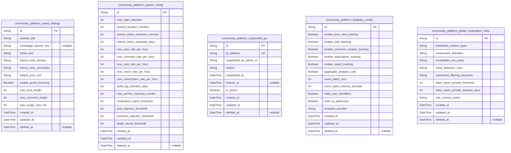
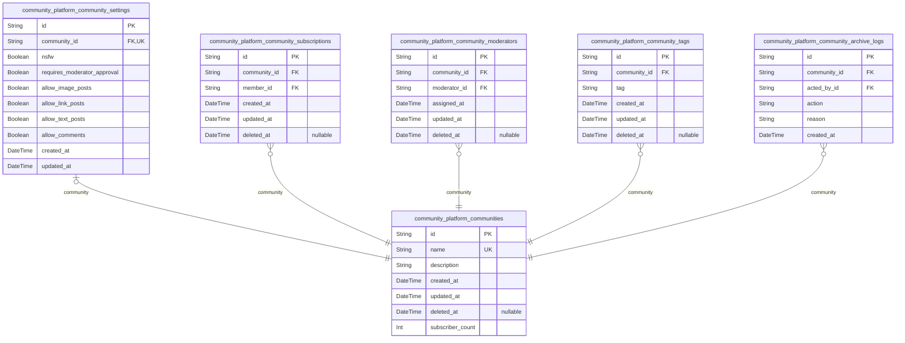
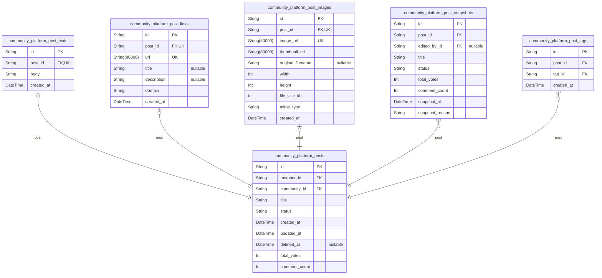
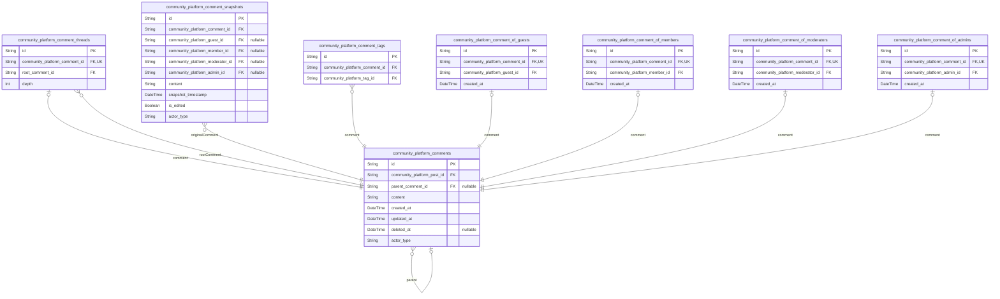
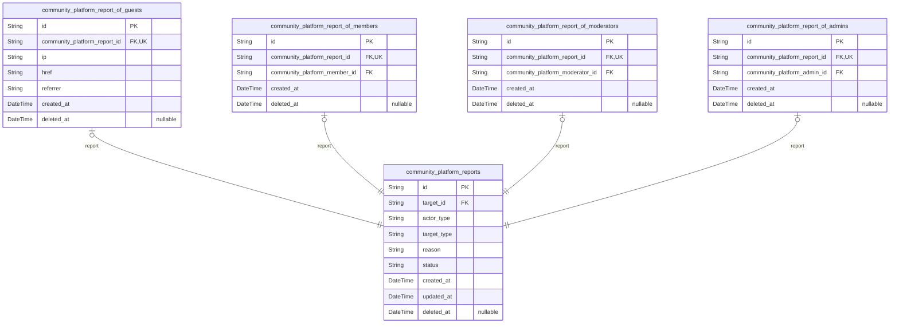
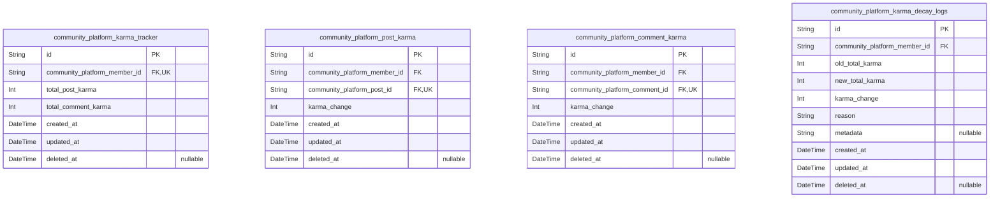
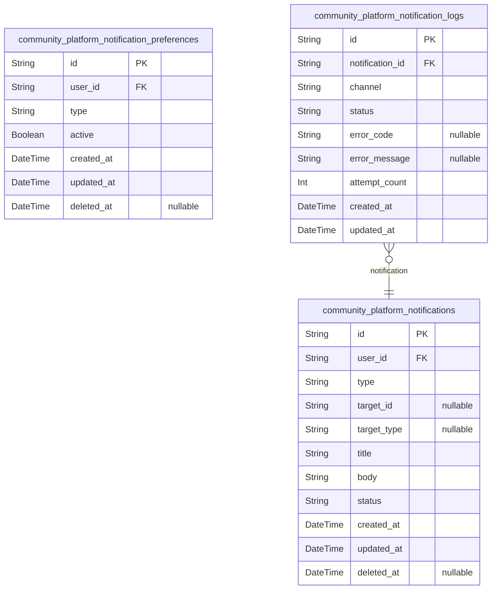
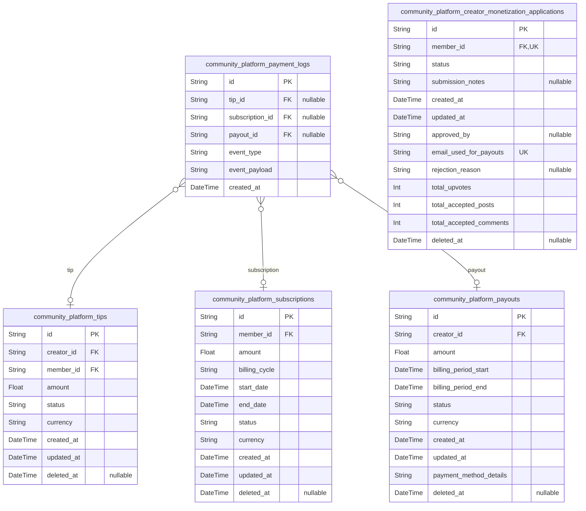

# Prisma Markdown

> Generated by [`prisma-markdown`](https://github.com/samchon/prisma-markdown)

- [Systematic](#systematic)
- [Actors](#actors)
- [Communities](#communities)
- [Posts](#posts)
- [Comments](#comments)
- [Votes](#votes)
- [Reports](#reports)
- [Karma](#karma)
- [Notifications](#notifications)
- [Payouts](#payouts)

## Systematic

```mermaid
erDiagram
"community_platform_portal_settings" {
  String id PK
  String website_title
  String homepage_banner_text "nullable"
  String footer_text
  String theme_color_primary
  String theme_color_secondary
  String default_post_sort
  Boolean enable_guest_browsing
  Int max_post_length
  Int max_comment_length
  Int max_image_size_mb
  DateTime created_at
  DateTime updated_at
  DateTime deleted_at "nullable"
}
"community_platform_system_config" {
  String id PK
  Int max_login_attempts
  Int lockout_duration_minutes
  Int access_token_expiration_minutes
  Int refresh_token_expiration_days
  Int max_post_rate_per_hour
  Int max_comment_rate_per_hour
  Int max_vote_rate_per_hour
  Int max_report_rate_per_hour
  Int max_subscription_rate_per_hour
  Int audit_log_retention_days
  Int max_archive_inactivity_months
  Int moderation_report_threshold
  Int post_rejection_threshold
  Int comment_rejection_threshold
  Int death_karma_threshold
  DateTime created_at
  DateTime updated_at
  DateTime deleted_at "nullable"
}
"community_platform_suspended_ips" {
  String id PK
  String ip_address UK
  String suspended_by_admin_id
  String reason
  DateTime suspended_at
  DateTime expires_at "nullable"
  Boolean is_active
  DateTime created_at
  DateTime updated_at
  DateTime deleted_at "nullable"
}
"community_platform_analytics_config" {
  String id PK
  Boolean enable_post_view_tracking
  Boolean enable_vote_tracking
  Boolean enable_comment_creation_tracking
  Boolean enable_subscription_tracking
  Boolean enable_report_tracking
  Boolean aggregate_analytics_only
  Int event_batch_size
  Int event_batch_interval_seconds
  Boolean hash_user_identifiers
  Boolean hash_ip_addresses
  String analytics_provider
  DateTime created_at
  DateTime updated_at
  DateTime deleted_at "nullable"
}
"community_platform_global_moderation_rules" {
  String id PK
  String prohibited_content_types
  String harassment_definition
  String acceptable_use_policy
  String fraud_detection_rules
  String automated_filtering_keywords
  Int false_report_penalty_threshold
  Int false_report_penalty_duration_days
  String rule_revision_notes
  DateTime created_at
  DateTime updated_at
  DateTime deleted_at "nullable"
}
```

### `community_platform_portal_settings`

Global portal settings that define the behavior and appearance of the
CommunityPlatform user interface.

Contains configuration constants and display options that affect the
entire platform. These settings control UI elements like theme colors,
footer text, website title, and other global presentation parameters.
Changes to these settings affect all users across all communities.

This table is managed exclusively by administrators through secure
administrative interfaces and is referenced by the frontend application
to render consistent branding and behavior throughout the platform.

Properties as follows:

- `id`: Primary Key.
- `website_title`
  > The title displayed in the browser tab and website header. Must not
  > exceed 100 characters.
- `homepage_banner_text`
  > Text displayed in the banner on the homepage. Supports HTML formatting
  > for styling.
- `footer_text`
  > Text displayed in the site footer. Typically includes copyright
  > information and links to terms of service.
- `theme_color_primary`
  > Primary color hex code used for buttons, links, and highlights (e.g.,
  > #2563EB). Must be a valid CSS hex color.
- `theme_color_secondary`
  > Secondary color hex code used for accents and secondary buttons (e.g.,
  > #1d4ed8). Must be a valid CSS hex color.
- `default_post_sort`
  > Default sorting method for feed view: 'new', 'hot', 'top', or
  > 'controversial'. Defines the initial sort order when users visit the
  > homepage.
- `enable_guest_browsing`
  > Whether unauthenticated guests can view posts and communities without
  > logging in. If false, users must log in to access any content.
- `max_post_length`
  > Maximum allowed character count for text posts. Must be between 1 and
  > 10000. Provides an upper limit to post content length.
- `max_comment_length`
  > Maximum allowed character count for comments. Must be between 1 and 500.
  > Prevents excessively long comments.
- `max_image_size_mb`
  > Maximum allowed file size for image uploads in megabytes. Must be between
  > 1 and 20. Controls storage costs and bandwidth usage.
- `created_at`: Timestamp when this configuration record was created in the system.
- `updated_at`: Timestamp when this configuration record was last modified.
- `deleted_at`
  > Timestamp when this configuration record was logically deleted. Null
  > indicates active configuration. Used for audit trails.

### `community_platform_system_config`

Core system configuration parameters that define platform-wide
operational behavior and technical settings.

Contains critical runtime configuration that governs how the platform
functions, including moderation rules, rate limits, storage
configurations, and performance tuning. Unlike portal_settings which are
UI-focused, this table holds infrastructure-level configuration that
affects system behavior.

All changes to this table require administrative access and should be
carefully documented due to their global impact on platform functionality
and user experience.

Properties as follows:

- `id`: Primary Key.
- `max_login_attempts`
  > Maximum number of consecutive failed login attempts before account
  > lockout. Default value is 5. Prevents brute force attacks.
- `lockout_duration_minutes`
  > Duration (in minutes) that an account remains locked after exceeding
  > max_login_attempts. Default value is 30. Controls security response time.
- `access_token_expiration_minutes`
  > Duration (in minutes) that a JWT access token remains valid before
  > requiring refresh. Default value is 15. Balances security and user
  > experience.
- `refresh_token_expiration_days`
  > Duration (in days) that a JWT refresh token remains valid before
  > requiring re-authentication. Default value is 30. Manages long-term
  > session persistence.
- `max_post_rate_per_hour`
  > Maximum number of posts a member can create per hour. Default value is
  > 50. Prevents spam flooding.
- `max_comment_rate_per_hour`
  > Maximum number of comments a member can create per hour. Default value is
  > 100. Prevents spam flooding.
- `max_vote_rate_per_hour`
  > Maximum number of votes a member can cast per hour. Default value is 300.
  > Prevents vote manipulation.
- `max_report_rate_per_hour`
  > Maximum number of reports a member can submit per hour. Default value is
  > 50. Prevents abuse of reporting system.
- `max_subscription_rate_per_hour`
  > Maximum number of community subscriptions a member can make per hour.
  > Default value is 20. Prevents spam subscriptions.
- `audit_log_retention_days`
  > Number of days to retain audit logs before purging. Default value is 2555
  > (7 years). Complies with data retention laws.
- `max_archive_inactivity_months`
  > Number of months of inactivity before a community is automatically
  > archived. Default value is 12. Manages system storage and performance.
- `moderation_report_threshold`
  > Number of reports a post or comment needs to trigger automatic moderation
  > review. Default value is 3. Balances workload between users and
  > moderators.
- `post_rejection_threshold`
  > Number of reports that triggers automatic removal of a post. Default
  > value is 10. Prevents toxic content proliferation.
- `comment_rejection_threshold`
  > Number of reports that triggers automatic removal of a comment. Default
  > value is 15. Balances freedom of expression with content safety.
- `death_karma_threshold`
  > Karma threshold below which users are suspended from posting. Default
  > value is -500. Prevents necromancy and trolling behaviour.
- `created_at`: Timestamp when this configuration record was created in the system.
- `updated_at`: Timestamp when this configuration record was last modified.
- `deleted_at`
  > Timestamp when this configuration record was logically deleted. Null
  > indicates active configuration. Used for audit trails.

### `community_platform_suspended_ips`

Record of IP addresses that have been suspended from accessing the
CommunityPlatform due to violations of terms of service.

This table maintains a list of IP addresses that have been flagged for
abusive behavior, such as spamming, distributed denial-of-service
attacks, or coordinated vote manipulation. Suspended IPs are blocked from
performing any action on the platform.

The system uses this table to enforce IP-based bans at the network layer,
preventing bypass of user account suspensions through account farming or
proxy usage. Suspensions are temporary and automatically expire after a
configurable duration.

This table plays a critical role in platform security and is referenced
by the authentication and rate-limiting systems to enforce global bans.

Properties as follows:

- `id`: Primary Key.
- `ip_address`
  > The IP address that has been suspended, stored in standard IPv4 or IPv6
  > format (e.g., '192.168.1.1' or
  > '2001:0db8:85a3:0000:0000:8a2e:0370:7334'). Must be unique.
- `suspended_by_admin_id`
  > The ID of the administrator who initiated this suspension. References
  > community_platform_admin.id. Provides accountability for bans.
- `reason`
  > The reason for this suspension (e.g., 'spamming', 'DDoS attack', 'virtual
  > account farming'). Must be less than 255 characters.
- `suspended_at`
  > Timestamp when this IP address was suspended. Indicates when the ban
  > became active.
- `expires_at`
  > Timestamp when this suspension will automatically expire and be lifted.
  > Null indicates permanent suspension.
- `is_active`
  > Indicates whether this suspension is currently active. May be false if
  > suspension has expired or been manually lifted.
- `created_at`: Timestamp when this record was created in the system.
- `updated_at`: Timestamp when this record was last modified.
- `deleted_at`
  > Timestamp when this suspension was lifted and the record logically
  > deleted. Null indicates active suspension. Used for audit trails.

### `community_platform_analytics_config`

Configuration for analytics collection and tracking behavior in the
CommunityPlatform system.

Defines which user behaviors are tracked, what level of anonymity is
maintained, and how analytics data is processed. This configuration
controls the data collection pipeline for business intelligence and
system monitoring.

The platform prioritizes user privacy, so this table ensures that
analytics instrumentation follows strict privacy principles, anonymizing
user data before transmission and never collecting personally
identifiable information.

Administrators adjust these settings to balance business insight needs
with user privacy expectations.

Properties as follows:

- `id`: Primary Key.
- `enable_post_view_tracking`
  > Whether to track when users view individual posts. Enables analytics on
  > content popularity and engagement patterns.
- `enable_vote_tracking`
  > Whether to track when users upvote or downvote content. Essential for
  > understanding community sentiment and moderation effectiveness.
- `enable_comment_creation_tracking`
  > Whether to track when users create comments. Provides insight into
  > conversation depth and community interaction levels.
- `enable_subscription_tracking`
  > Whether to track when users subscribe to or unsubscribe from communities.
  > Essential for understanding community growth and audience segmentation.
- `enable_report_tracking`
  > Whether to track when users report content. Critical for identifying
  > emerging moderation issues and user community standards.
- `aggregate_analytics_only`
  > Whether to send only aggregated statistical data to analytics services
  > instead of individual event data. When true, ensures greater user privacy
  > and compliance.
- `event_batch_size`
  > Number of analytics events to batch before transmission to reduce server
  > load. Default value is 100. Balances real-time data needs with system
  > performance.
- `event_batch_interval_seconds`
  > Maximum time interval (in seconds) between analytics event batches,
  > regardless of size. Default value is 30. Ensures timely data
  > transmission.
- `hash_user_identifiers`
  > Whether to hash user IDs before sending to the analytics platform. When
  > true, users are tracked by pseudonymous identifiers, never their actual
  > IDs.
- `hash_ip_addresses`
  > Whether to hash IP addresses before sending to the analytics platform.
  > When true, geographic and network patterns are analyzed without exposing
  > user locations.
- `analytics_provider`
  > The identifier of the analytics service provider being used (e.g.,
  > 'amplitude', 'mixpanel', 'plausible'). Controls configuration parameters
  > for the connected service.
- `created_at`: Timestamp when this configuration record was created in the system.
- `updated_at`: Timestamp when this configuration record was last modified.
- `deleted_at`
  > Timestamp when this configuration record was logically deleted. Null
  > indicates active configuration. Used for audit trails.

### `community_platform_global_moderation_rules`

Platform-wide moderation rules and content policies that apply to all
communities and users across the CommunityPlatform.

Contains the foundational content moderation guidelines that every
community and user must follow. This includes prohibited content types,
definition of harassment, acceptable use policies, and automated flagging
criteria.

These rules serve as the baseline for automated moderation systems and
provide consistency in enforcement across all communities. Communities
can have additional specific rules, but they cannot be less restrictive
than these global standards.

The rules in this table are referenced by AI moderation tools, reporter
systems, and human moderators to ensure uniform enforcement of platform
policy.

Properties as follows:

- `id`: Primary Key.
- `prohibited_content_types`
  > List of prohibited content categories as comma-separated strings (e.g.,
  > 'child_exploitation, harassment, threats, hate_speech, misinformation').
  > Categories must be from a predefined system list.
- `harassment_definition`
  > Detailed definition of what constitutes harassment on the platform,
  > including examples of behavior that is considered abusive, threatening,
  > or intimidation-based.
- `acceptable_use_policy`
  > Complete acceptable use policy outlining expected user behavior,
  > prohibited activities, and consequences for violations. Includes
  > guidelines around impersonation, spam, and coordinated manipulation.
- `fraud_detection_rules`
  > Rules for detecting fraudulent behavior including vote manipulation, fake
  > accounts, shell communities, and coordinated inauthentic activity.
- `automated_filtering_keywords`
  > List of keywords and phrases that automatically trigger content filtering
  > for suspected policy violations. Each keyword should be separated by a
  > comma. Examples include slurs, threats, and code words for illegal
  > activity.
- `false_report_penalty_threshold`
  > Number of false reports (reports on approved content) that triggers a
  > penalty for a user. Default value is 5. Prevents abuse of reporting
  > system.
- `false_report_penalty_duration_days`
  > Number of days a user is penalized after accumulating
  > false_report_penalty_threshold false reports. Default value is 7. Deters
  > malicious reporting.
- `rule_revision_notes`
  > Detailed notes on recent changes to the global moderation rules,
  > including date, revision number, and summary of modifications. Used for
  > audit and legal compliance.
- `created_at`: Timestamp when this configuration record was created in the system.
- `updated_at`: Timestamp when this configuration record was last modified.
- `deleted_at`
  > Timestamp when this configuration record was logically deleted. Null
  > indicates active configuration. Used for audit trails.

## Actors

```mermaid
erDiagram
"community_platform_guest" {
  String id PK
  DateTime created_at
  DateTime updated_at
  DateTime deleted_at "nullable"
  String status
}
"community_platform_member" {
  String id PK
  String email UK
  String password_hash
  DateTime created_at
  DateTime updated_at
  DateTime deleted_at "nullable"
  String status
  Boolean email_verified
}
"community_platform_moderator" {
  String id PK
  String email UK
  String password_hash
  DateTime created_at
  DateTime updated_at
  DateTime deleted_at "nullable"
  String status
  Boolean email_verified
}
"community_platform_admin" {
  String id PK
  String email UK
  String password_hash
  DateTime created_at
  DateTime updated_at
  DateTime deleted_at "nullable"
  String status
  Boolean email_verified
}
"community_platform_guest_sessions" {
  String id PK
  String community_platform_guest_id FK
  String ip
  String href
  String referrer
  DateTime created_at
  DateTime expired_at "nullable"
}
"community_platform_member_sessions" {
  String id PK
  String community_platform_member_id FK
  String ip
  String href
  String referrer
  DateTime created_at
  DateTime expired_at "nullable"
}
"community_platform_moderator_sessions" {
  String id PK
  String community_platform_moderator_id FK
  String ip
  String href
  String referrer
  DateTime created_at
  DateTime expired_at "nullable"
}
"community_platform_admin_sessions" {
  String id PK
  String community_platform_admin_id FK
  String ip
  String href
  String referrer
  DateTime created_at
  DateTime expired_at "nullable"
}
"guest" {
  String id PK
  DateTime created_at
  DateTime updated_at
  DateTime deleted_at "nullable"
  String status
  String created_by
  String updated_by "nullable"
}
"member" {
  String id PK
  String email UK
  String password_hash
  DateTime created_at
  DateTime updated_at
  DateTime deleted_at "nullable"
  String status
  Boolean email_verified
  String created_by
  String updated_by "nullable"
}
"moderator" {
  String id PK
  String email UK
  String password_hash
  DateTime created_at
  DateTime updated_at
  DateTime deleted_at "nullable"
  String status
  Boolean email_verified
  String created_by
  String updated_by "nullable"
}
"admin" {
  String id PK
  String email UK
  String password_hash
  DateTime created_at
  DateTime updated_at
  DateTime deleted_at "nullable"
  String status
  Boolean email_verified
  String created_by
  String updated_by "nullable"
}
"guest_sessions" {
  String id PK
  String guest_id FK
  String ip
  String href
  String referrer
  DateTime created_at
  DateTime expired_at "nullable"
}
"member_sessions" {
  String id PK
  String member_id FK
  String ip
  String href
  String referrer
  DateTime created_at
  DateTime expired_at "nullable"
}
"moderator_sessions" {
  String id PK
  String moderator_id FK
  String ip
  String href
  String referrer
  DateTime created_at
  DateTime expired_at "nullable"
}
"admin_sessions" {
  String id PK
  String admin_id FK
  String ip
  String href
  String referrer
  DateTime created_at
  DateTime expired_at "nullable"
}
"community_platform_guest_sessions" }o--|| "community_platform_guest" : guest
"community_platform_member_sessions" }o--|| "community_platform_member" : member
"community_platform_moderator_sessions" }o--|| "community_platform_moderator" : moderator
"community_platform_admin_sessions" }o--|| "community_platform_admin" : admin
"guest_sessions" }o--|| "guest" : guest
"member_sessions" }o--|| "member" : member
"moderator_sessions" }o--|| "moderator" : moderator
"admin_sessions" }o--|| "admin" : admin
```

### `community_platform_guest`

Represents anonymous users who can browse content without authentication.

Guests are unauthenticated visitors who can view public communities and
posts but cannot interact with content (vote, comment, subscribe). They
are identified by anonymous session context and cannot have a persistent
identity. This table stores minimal information about guests, primarily
for logging system usage and analytics.

Although guests do not need authentication, their activities are tracked
for analytics and moderation purposes. Guest records are not linked to
any login credentials and do not have passwords. The status field
indicates whether this guest session is active or inactive, useful for
cleanup processes.

Properties as follows:

- `id`: Primary Key.
- `created_at`: Timestamp when the guest record was first created in the system.
- `updated_at`
  > Timestamp when the guest record was last updated (e.g., when session
  > expired).
- `deleted_at`
  > Timestamp when this guest record was soft-deleted. Null means active.
  > Used for audit trails and data cleanup.
- `status`
  > Current status of the guest session. Values: 'active', 'inactive',
  > 'banned'. Used to indicate if the guest can continue browsing.

### `community_platform_member`

Represents authenticated standard users who can create content, vote,
comment, and subscribe to communities.

Members are the primary content-producing actors in the system. They must
register with an email and password, and verify their email. Members can
create posts, upvote/downvote, comment on posts, reply to comments,
subscribe to communities, and have a persistent reputation (karma) that
travels across communities.

This table includes essential authentication fields (password_hash) and
status controls for suspended/banned accounts. Members can be promoted to
moderators through admin action. The status field determines if the
account is active, suspended, or banned.

Properties as follows:

- `id`: Primary Key.
- `email`: Email address used for registration and verification. Must be unique.
- `password_hash`
  > Hashed password for authentication. Never stored in plain text. Required
  > since members must authenticate to use the platform.
- `created_at`: Timestamp when the member account was created.
- `updated_at`
  > Timestamp when the member account was last updated (e.g., password
  > change, profile update).
- `deleted_at`
  > Timestamp when this member account was soft-deleted. Null means active.
  > Used for audit trails and data cleanup.
- `status`
  > Current status of the member account. Values: 'active', 'suspended',
  > 'banned'. Indicates if the account can perform actions.
- `email_verified`
  > Whether the member has verified their email address. Required to unlock
  > posting and commenting privileges.

### `community_platform_moderator`

Represents community-level administrators who have moderation privileges
in specific communities.

Moderators are members who have been granted moderation rights over one
or more communities by an administrator. They can delete posts and
comments, ban users from specific communities, approve pending content,
and manage community settings. Moderators log in using the same
authentication system as members but have additional permissions encoded
in their JWT token.

This table contains authentication fields and status controls. Unlike
members, moderators have explicit authority over specific communities
(managed in other tables like community_platform_community_moderators).
This table represents the core identity of a moderator user.

Properties as follows:

- `id`: Primary Key.
- `email`: Email address used for registration and verification. Must be unique.
- `password_hash`
  > Hashed password for authentication. Never stored in plain text. Required
  > since moderators must authenticate to use the platform.
- `created_at`: Timestamp when the moderator account was created.
- `updated_at`
  > Timestamp when the moderator account was last updated (e.g., password
  > change, profile update).
- `deleted_at`
  > Timestamp when this moderator account was soft-deleted. Null means
  > active. Used for audit trails and data cleanup.
- `status`
  > Current status of the moderator account. Values: 'active', 'suspended',
  > 'banned'. Indicates if the account can perform moderation actions.
- `email_verified`
  > Whether the moderator has verified their email address. Required for full
  > access to moderation features.

### `community_platform_admin`

Represents system-wide administrators with unrestricted control over the
entire platform.

Admins have full authority to manage all users, communities, content, and
system settings. They can ban users globally, promote/demote moderators,
view audit logs, modify system-wide policies, and perform emergency
moderation actions. Admins log in using the same authentication system as
members and moderators.

This table contains essential authentication fields and status controls.
Admins are granted privileges through system-wide configuration; there
are no community-specific permissions.

An admin can be a member or moderator, but this table represents their
elevated role in the system with broader permissions.

Properties as follows:

- `id`: Primary Key.
- `email`: Email address used for registration and verification. Must be unique.
- `password_hash`
  > Hashed password for authentication. Never stored in plain text. Required
  > since admins must authenticate to use the platform.
- `created_at`: Timestamp when the admin account was created.
- `updated_at`
  > Timestamp when the admin account was last updated (e.g., password change,
  > profile update).
- `deleted_at`
  > Timestamp when this admin account was soft-deleted. Null means active.
  > Used for audit trails and data cleanup.
- `status`
  > Current status of the admin account. Values: 'active', 'suspended',
  > 'banned'. Indicates if the account can perform administrative actions.
- `email_verified`
  > Whether the admin has verified their email address. Required for security
  > and compliance.

### `community_platform_guest_sessions`

Tracks anonymous browsing sessions for guest users who are not
authenticated.

Each guest session represents a single browsing session (e.g., from a
browser or device). This session table is used for analytics, abuse
detection, and rate limiting. It does not represent a persistent identity
and has no relation to a user account.

This table follows the strict session pattern: no token hashes, no device
info, no updated_at, no deleted_at. Only exposes required fields: ip,
href, referrer, created_at, expired_at. The composite index on guest_id
and created_at enables efficient tracking of session activity patterns.

Properties as follows:

- `id`: Primary Key.
- `community_platform_guest_id`
  > References the guest record that this session belongs to. {@link
  > community_platform_guest.id}.
- `ip`: Client IP address from which the session was initiated.
- `href`: URL of the page the user was viewing when the session was created.
- `referrer`
  > Referrer URL indicating where the user came from before visiting the
  > platform.
- `created_at`: Timestamp when this session was initiated.
- `expired_at`
  > Timestamp when this session expired (e.g., after 30 minutes of
  > inactivity). Null means the session is still active.

### `community_platform_member_sessions`

Tracks authenticated user sessions for member accounts.

Each session represents an active login session for a member (standard
user). When a member logs in, a session record is created with a JWT
token (stored externally). This table enables session management,
revocation, and security monitoring.

This table follows the strict session pattern: no token hashes, no device
info, no updated_at, no deleted_at. Only exposes required fields: ip,
href, referrer, created_at, expired_at. The composite index on member_id
and created_at enables efficient tracking of login patterns and for
revocation purposes.

Properties as follows:

- `id`: Primary Key.
- `community_platform_member_id`
  > References the member record that this session belongs to. {@link
  > community_platform_member.id}.
- `ip`: Client IP address from which the session was initiated.
- `href`: URL of the page the user was viewing when the session was created.
- `referrer`
  > Referrer URL indicating where the user came from before visiting the
  > platform.
- `created_at`: Timestamp when this session was initiated.
- `expired_at`
  > Timestamp when this session expired (e.g., after 30 minutes of
  > inactivity). Null means the session is still active.

### `community_platform_moderator_sessions`

Tracks authenticated user sessions for moderator accounts.

Each session represents an active login session for a moderator.
Moderator sessions are treated the same as member sessions for
authentication purposes, but are tracked separately for audit and
security purposes.

This table follows the strict session pattern: no token hashes, no device
info, no updated_at, no deleted_at. Only exposes required fields: ip,
href, referrer, created_at, expired_at. The composite index on
moderator_id and created_at enables efficient tracking of moderator
activity patterns.

Properties as follows:

- `id`: Primary Key.
- `community_platform_moderator_id`
  > References the moderator record that this session belongs to. {@link
  > community_platform_moderator.id}.
- `ip`: Client IP address from which the session was initiated.
- `href`: URL of the page the user was viewing when the session was created.
- `referrer`
  > Referrer URL indicating where the user came from before visiting the
  > platform.
- `created_at`: Timestamp when this session was initiated.
- `expired_at`
  > Timestamp when this session expired (e.g., after 30 minutes of
  > inactivity). Null means the session is still active.

### `community_platform_admin_sessions`

Tracks authenticated user sessions for administrative accounts with
system-wide privileges.

Each session represents an active login session for an admin. Admin
sessions have stricter security requirements, including shorter idle
timeouts and mandatory two-factor authentication in production. This
table enables audit trails for critical administrative actions.

This table follows the strict session pattern: no token hashes, no device
info, no updated_at, no deleted_at. Only exposes required fields: ip,
href, referrer, created_at, expired_at. The composite index on admin_id
and created_at enables efficient tracking of admin activity patterns and
security analysis.

Properties as follows:

- `id`: Primary Key.
- `community_platform_admin_id`
  > References the admin record that this session belongs to. {@link
  > community_platform_admin.id}.
- `ip`: Client IP address from which the session was initiated.
- `href`: URL of the page the user was viewing when the session was created.
- `referrer`
  > Referrer URL indicating where the user came from before visiting the
  > platform.
- `created_at`: Timestamp when this session was initiated.
- `expired_at`
  > Timestamp when this session expired (e.g., after 15 minutes of
  > inactivity). Null means the session is still active.

### `guest`

Represents anonymous users who can browse content without authentication.

Guests are unauthenticated visitors who can view public communities and
posts but cannot interact with content (vote, comment, subscribe). They
are identified by anonymous session context and cannot have a persistent
identity. This table stores minimal information about guests, primarily
for logging system usage and analytics.

Although guests do not need authentication, their activities are tracked
for analytics and moderation purposes. Guest records are not linked to
any login credentials and do not have passwords. The status field
indicates whether this guest session is active or inactive, useful for
cleanup processes.

Properties as follows:

- `id`: Primary Key.
- `created_at`: Timestamp when the guest record was first created in the system.
- `updated_at`
  > Timestamp when the guest record was last updated (e.g., when session
  > expired).
- `deleted_at`
  > Timestamp when this guest record was soft-deleted. Null means active.
  > Used for audit trails and data cleanup.
- `status`
  > Current status of the guest session. Values: 'active', 'inactive',
  > 'banned'. Used to indicate if the guest can continue browsing.
- `created_by`
  > System identifier of the entity that created this record. Standardized as
  > 'system' for auto-generated records.
- `updated_by`
  > System identifier of the entity that last updated this record. Null means
  > no update has occurred since creation.

### `member`

Represents authenticated standard users who can create content, vote,
comment, and subscribe to communities.

Members are the primary content-producing actors in the system. They must
register with an email and password, and verify their email. Members can
create posts, upvote/downvote, comment on posts, reply to comments,
subscribe to communities, and have a persistent reputation (karma) that
travels across communities.

This table includes essential authentication fields (password_hash) and
status controls for suspended/banned accounts. Members can be promoted to
moderators through admin action. The status field determines if the
account is active, suspended, or banned.

Properties as follows:

- `id`: Primary Key.
- `email`: Email address used for registration and verification. Must be unique.
- `password_hash`
  > Hashed password for authentication. Never stored in plain text. Required
  > since members must authenticate to use the platform.
- `created_at`: Timestamp when the member account was created.
- `updated_at`
  > Timestamp when the member account was last updated (e.g., password
  > change, profile update).
- `deleted_at`
  > Timestamp when this member account was soft-deleted. Null means active.
  > Used for audit trails and data cleanup.
- `status`
  > Current status of the member account. Values: 'active', 'suspended',
  > 'banned'. Indicates if the account can perform actions.
- `email_verified`
  > Whether the member has verified their email address. Required to unlock
  > posting and commenting privileges.
- `created_by`
  > System identifier of the entity that created this record. Standardized as
  > 'system' for auto-generated records.
- `updated_by`
  > System identifier of the entity that last updated this record. Null means
  > no update has occurred since creation.

### `moderator`

Represents community-level administrators who have moderation privileges
in specific communities.

Moderators are members who have been granted moderation rights over one
or more communities by an administrator. They can delete posts and
comments, ban users from specific communities, approve pending content,
and manage community settings. Moderators log in using the same
authentication system as members but have additional permissions encoded
in their JWT token.

This table contains authentication fields and status controls. Unlike
members, moderators have explicit authority over specific communities
(managed in other tables like community_platform_community_moderators).
This table represents the core identity of a moderator user.

Properties as follows:

- `id`: Primary Key.
- `email`: Email address used for registration and verification. Must be unique.
- `password_hash`
  > Hashed password for authentication. Never stored in plain text. Required
  > since moderators must authenticate to use the platform.
- `created_at`: Timestamp when the moderator account was created.
- `updated_at`
  > Timestamp when the moderator account was last updated (e.g., password
  > change, profile update).
- `deleted_at`
  > Timestamp when this moderator account was soft-deleted. Null means
  > active. Used for audit trails and data cleanup.
- `status`
  > Current status of the moderator account. Values: 'active', 'suspended',
  > 'banned'. Indicates if the account can perform moderation actions.
- `email_verified`
  > Whether the moderator has verified their email address. Required for full
  > access to moderation features.
- `created_by`
  > System identifier of the entity that created this record. Standardized as
  > 'system' for auto-generated records.
- `updated_by`
  > System identifier of the entity that last updated this record. Null means
  > no update has occurred since creation.

### `admin`

Represents system-wide administrators with unrestricted control over the
entire platform.

Admins have full authority to manage all users, communities, content, and
system settings. They can ban users globally, promote/demote moderators,
view audit logs, modify system-wide policies, and perform emergency
moderation actions. Admins log in using the same authentication system as
members and moderators.

This table contains essential authentication fields and status controls.
Admins are granted privileges through system-wide configuration; there
are no community-specific permissions.

An admin can be a member or moderator, but this table represents their
elevated role in the system with broader permissions.

Properties as follows:

- `id`: Primary Key.
- `email`: Email address used for registration and verification. Must be unique.
- `password_hash`
  > Hashed password for authentication. Never stored in plain text. Required
  > since admins must authenticate to use the platform.
- `created_at`: Timestamp when the admin account was created.
- `updated_at`
  > Timestamp when the admin account was last updated (e.g., password change,
  > profile update).
- `deleted_at`
  > Timestamp when this admin account was soft-deleted. Null means active.
  > Used for audit trails and data cleanup.
- `status`
  > Current status of the admin account. Values: 'active', 'suspended',
  > 'banned'. Indicates if the account can perform administrative actions.
- `email_verified`
  > Whether the admin has verified their email address. Required for security
  > and compliance.
- `created_by`
  > System identifier of the entity that created this record. Standardized as
  > 'system' for auto-generated records.
- `updated_by`
  > System identifier of the entity that last updated this record. Null means
  > no update has occurred since creation.

### `guest_sessions`

Tracks anonymous browsing sessions for guest users who are not
authenticated.

Each guest session represents a single browsing session (e.g., from a
browser or device). This session table is used for analytics, abuse
detection, and rate limiting. It does not represent a persistent identity
and has no relation to a user account.

This table follows the strict session pattern: no token hashes, no device
info, no updated_at, no deleted_at. Only exposes required fields: ip,
href, referrer, created_at, expired_at. The composite index on guest_id
and created_at enables efficient tracking of session activity patterns.

Properties as follows:

- `id`: Primary Key.
- `guest_id`
  > References the guest record that this session belongs to. {@link
  > guest.id}.
- `ip`: Client IP address from which the session was initiated.
- `href`: URL of the page the user was viewing when the session was created.
- `referrer`
  > Referrer URL indicating where the user came from before visiting the
  > platform.
- `created_at`: Timestamp when this session was initiated.
- `expired_at`
  > Timestamp when this session expired (e.g., after 30 minutes of
  > inactivity). Null means the session is still active.

### `member_sessions`

Tracks authenticated user sessions for member accounts.

Each session represents an active login session for a member (standard
user). When a member logs in, a session record is created with a JWT
token (stored externally). This table enables session management,
revocation, and security monitoring.

This table follows the strict session pattern: no token hashes, no device
info, no updated_at, no deleted_at. Only exposes required fields: ip,
href, referrer, created_at, expired_at. The composite index on member_id
and created_at enables efficient tracking of login patterns and for
revocation purposes.

Properties as follows:

- `id`: Primary Key.
- `member_id`
  > References the member record that this session belongs to. {@link
  > member.id}.
- `ip`: Client IP address from which the session was initiated.
- `href`: URL of the page the user was viewing when the session was created.
- `referrer`
  > Referrer URL indicating where the user came from before visiting the
  > platform.
- `created_at`: Timestamp when this session was initiated.
- `expired_at`
  > Timestamp when this session expired (e.g., after 30 minutes of
  > inactivity). Null means the session is still active.

### `moderator_sessions`

Tracks authenticated user sessions for moderator accounts.

Each session represents an active login session for a moderator.
Moderator sessions are treated the same as member sessions for
authentication purposes, but are tracked separately for audit and
security purposes.

This table follows the strict session pattern: no token hashes, no device
info, no updated_at, no deleted_at. Only exposes required fields: ip,
href, referrer, created_at, expired_at. The composite index on
moderator_id and created_at enables efficient tracking of moderator
activity patterns.

Properties as follows:

- `id`: Primary Key.
- `moderator_id`
  > References the moderator record that this session belongs to. {@link
  > moderator.id}.
- `ip`: Client IP address from which the session was initiated.
- `href`: URL of the page the user was viewing when the session was created.
- `referrer`
  > Referrer URL indicating where the user came from before visiting the
  > platform.
- `created_at`: Timestamp when this session was initiated.
- `expired_at`
  > Timestamp when this session expired (e.g., after 30 minutes of
  > inactivity). Null means the session is still active.

### `admin_sessions`

Tracks authenticated user sessions for administrative accounts with
system-wide privileges.

Each session represents an active login session for an admin. Admin
sessions have stricter security requirements, including shorter idle
timeouts and mandatory two-factor authentication in production. This
table enables audit trails for critical administrative actions.

This table follows the strict session pattern: no token hashes, no device
info, no updated_at, no deleted_at. Only exposes required fields: ip,
href, referrer, created_at, expired_at. The composite index on admin_id
and created_at enables efficient tracking of admin activity patterns and
security analysis.

Properties as follows:

- `id`: Primary Key.
- `admin_id`
  > References the admin record that this session belongs to. {@link
  > admin.id}.
- `ip`: Client IP address from which the session was initiated.
- `href`: URL of the page the user was viewing when the session was created.
- `referrer`
  > Referrer URL indicating where the user came from before visiting the
  > platform.
- `created_at`: Timestamp when this session was initiated.
- `expired_at`
  > Timestamp when this session expired (e.g., after 30 minutes of
  > inactivity). Null means the session is still active.

## Communities

```mermaid
erDiagram
"community_platform_communities" {
  String id PK
  String name UK
  String description
  DateTime created_at
  DateTime updated_at
  DateTime deleted_at "nullable"
  Int subscriber_count
}
"community_platform_community_settings" {
  String id PK
  String community_id FK,UK
  Boolean nsfw
  Boolean requires_moderator_approval
  Boolean allow_image_posts
  Boolean allow_link_posts
  Boolean allow_text_posts
  Boolean allow_comments
  DateTime created_at
  DateTime updated_at
}
"community_platform_community_subscriptions" {
  String id PK
  String community_id FK
  String member_id FK
  DateTime created_at
  DateTime updated_at
  DateTime deleted_at "nullable"
}
"community_platform_community_moderators" {
  String id PK
  String community_id FK
  String moderator_id FK
  DateTime assigned_at
  DateTime updated_at
  DateTime deleted_at "nullable"
}
"community_platform_community_tags" {
  String id PK
  String community_id FK
  String tag
  DateTime created_at
  DateTime updated_at
  DateTime deleted_at "nullable"
}
"community_platform_community_archive_logs" {
  String id PK
  String community_id FK
  String acted_by_id FK
  String action
  String reason
  DateTime created_at
}
"community_platform_community_settings" |o--|| "community_platform_communities" : community
"community_platform_community_subscriptions" }o--|| "community_platform_communities" : community
"community_platform_community_moderators" }o--|| "community_platform_communities" : community
"community_platform_community_tags" }o--|| "community_platform_communities" : community
"community_platform_community_archive_logs" }o--|| "community_platform_communities" : community
```

### `community_platform_communities`

Main community entity representing a user-created discussion group.

Each community is a self-governing space where users can post, comment,
and vote. Communities are created by members and have a unique name,
description, and settings.

Communities are the foundational organizational unit of the platform.
Users can subscribe to communities to see their content in their home
feed.

Communities can be archived by administrators, which changes their state
but preserves all historical content. Machines do not automatically
delete communities. However, communities can be renamed or have their
moderation rules updated through their settings.

This is the primary entity for community content and must support
independent CRUD operations for both users and admins.

Properties as follows:

- `id`: Primary Key.
- `name`
  > The unique display name of the community. Must be globally unique,
  > contain only alphanumeric characters, hyphens, and underscores, and be
  > between 3 and 50 characters long.
- `description`
  > A brief description of the community's purpose or topic. This text is
  > shown to users when browsing communities.
- `created_at`
  > Timestamp when the community was created. Set to the moment of creation
  > in Asia/Seoul timezone.
- `updated_at`
  > Timestamp of the last update to the community's metadata. Updated
  > whenever the name, description, or any setting changes.
- `deleted_at`
  > Null if the community is active. Non-null if the community has been
  > soft-deleted (archived permanently by admin). This supports soft
  > deletion, preserving data for audit trails while hiding content from
  > regular users.
- `subscriber_count`
  > The current number of members subscribed to this community. This is a
  > denormalized counter field for performance, updated whenever a
  > subscription is added or removed. It should be calculated from the
  > community_platform_community_subscriptions table.

### `community_platform_community_settings`

Configuration settings for a community, linked one-to-one to a community.

This table holds non-core configuration parameters for a community that
affect its behavior and appearance, such as whether new posts require
moderator approval, whether the community is marked as NSFW, or whether
embedded images are allowed.

All settings are managed entirely through the corresponding community
entity and are not independently accessible. This table prevents bloat in
the main community table while preserving data integrity.

This table is strictly owned by and has a 1:1 relationship with the
community_platform_communities table.

Properties as follows:

- `id`: Primary Key.
- `community_id`
  > Reference to the parent community which this setting belongs to. {@link
  > community_platform_communities.id}.
- `nsfw`
  > If true, this community is marked as Not Safe For Work. Users must opt-in
  > to see this community's content. Default is false.
- `requires_moderator_approval`
  > If true, new posts in this community must be approved by a moderator
  > before becoming visible. Default is false.
- `allow_image_posts`
  > If true, users may upload images when creating posts. If false, only text
  > and link posts are allowed. Default is true.
- `allow_link_posts`
  > If true, users may submit external links as posts. If false, only text
  > and image posts are allowed. Default is true.
- `allow_text_posts`
  > If true, users may submit text posts. If false, only image and link posts
  > are allowed. Default is true.
- `allow_comments`
  > If true, users may comment on posts in this community. If false, no
  > comments are permitted. Default is true.
- `created_at`
  > Timestamp when these settings were created or first initialized. This
  > matches the creation of the associated community.
- `updated_at`: Timestamp when any setting was last modified.

### `community_platform_community_subscriptions`

Junction table for the many-to-many relationship between members and
communities.

This table represents which members are subscribed to which communities.
A member must be subscribed to a community to see its posts in their
personalized feed.

This table is essential for implementing the personalized content feed
feature. It is managed indirectly through the community and member
interfaces; users subscribe and unsubscribe via their profile, not
through direct CRUD on this table.

This is a pure junction table without additional business data, enabling
a scalable and flexible subscription system.

Properties as follows:

- `id`: Primary Key.
- `community_id`
  > Reference to the community this subscription belongs to. {@link
  > community_platform_communities.id}.
- `member_id`
  > Reference to the member who subscribed to the community. {@link
  > community_platform_member.id}.
- `created_at`: Timestamp when this subscription was created.
- `updated_at`
  > Timestamp when this subscription was last modified (e.g., if unsubscribed
  > and re-subscribed).
- `deleted_at`
  > Null if subscribed. Non-null if the subscription was deactivated (user
  > unsubscribed). This supports soft-deletion so subscription history is
  > preserved for analytics and audit trails.

### `community_platform_community_moderators`

Junction table that defines which moderators are assigned to which
communities.

Each community can have multiple moderators, and a single member can be a
moderator of multiple communities. This table establishes the
relationship between moderators (from community_platform_moderator) and
communities (from community_platform_communities).

This table is essential for permission management. Moderators are granted
rights and responsibilities within a community through this assignment.
Modifying this table requires admin approval. Removing a moderator from
this table revokes their moderation rights without deleting the moderator
account.

This table ensures that moderation is decoupled from user roles and is
precisely scoped to individual communities.

Properties as follows:

- `id`: Primary Key.
- `community_id`
  > Reference to the community this moderator is assigned to. {@link
  > community_platform_communities.id}.
- `moderator_id`
  > Reference to the moderator user who manages this community. {@link
  > community_platform_moderator.id}.
- `assigned_at`
  > Timestamp when the moderator was assigned to this community. This helps
  > track the history of moderation assignments.
- `updated_at`
  > Timestamp of the last update to this relationship (e.g., if assigned
  > again after removal).
- `deleted_at`
  > Null if still an active moderator. Non-null if the moderator was removed
  > from this community. This supports soft-deletion so the history of
  > moderation assignments is preserved for audit trails.

### `community_platform_community_tags`

Tags associated with communities for categorization and filtering.

Each community can have multiple tags, and tags can be shared across
multiple communities. This table facilitates discovery of communities
related by similar topics.

This table enables users to filter communities by interest (e.g.,
"photography", "technology"), enhancing content discovery without
requiring a hierarchical category structure. Tags are simple strings
chosen by creators or administrators and are not managed in a
domain-specific vocabulary.

No independent CRUD operations exist for this table; tags are added or
removed through the community settings or admin panel.

Properties as follows:

- `id`: Primary Key.
- `community_id`
  > Reference to the community this tag belongs to. {@link
  > community_platform_communities.id}.
- `tag`
  > The actual tag text (e.g., 'gaming', 'science', 'books'). Must be
  > lowercase and use only alphanumeric characters and hyphens. Maximum 50
  > characters.
- `created_at`: Timestamp when this tag was added to the community.
- `updated_at`
  > Timestamp of the last modification (rare, typically when tag is made
  > unique).
- `deleted_at`
  > Null if the tag is still associated. Non-null if the tag was removed from
  > the community. This allows the tag to be reused and preserves history for
  > analytics.

### `community_platform_community_archive_logs`

Audit trail of community archive/unarchive events.

This table records all historical state changes to a community’s archive
status. Each record represents a single event: a community was either
archived (made inactive) or unarchived (re-activated) by either a
moderator or admin.

Since community archive status is a snapshot that needs to be preserved
for compliance and audit trails, this table is entirely append-only. No
updates or deletions are allowed once logged. The soft-delete flag in the
main community table mirrors the latest status in this log.

This structure ensures that all historical decisions about community
health are transparent and retrievable.

To determine if a community is currently archived: query this table for
the latest log for the community where action = 'archive' without a
corresponding 'unarchive' event.

Properties as follows:

- `id`: Primary Key.
- `community_id`
  > Reference to the community that was archived or unarchived. {@link
  > community_platform_communities.id}.
- `acted_by_id`
  > Reference to the admin or moderator who performed the archive/unarchive
  > action. [community_platform_admin.id](#community_platform_admin) or {@link
  > community_platform_moderator.id}.
- `action`
  > The type of action performed: 'archive' or 'unarchive'. This defines
  > whether the state change is enabling or disabling the community.
- `reason`
  > The human-readable reason for the archive/unarchive action provided by
  > the acting admin/moderator. Examples: 'Excessive reports', 'Violated
  > community guidelines', 'Community inactivity', 'Requested by owner'.
- `created_at`
  > Timestamp of when the archive/unarchive action was taken. This is
  > immutable and set at record creation.

## Posts

```mermaid
erDiagram
"community_platform_posts" {
  String id PK
  String member_id FK
  String community_id FK
  String title
  String status
  DateTime created_at
  DateTime updated_at
  DateTime deleted_at "nullable"
  Int total_votes
  Int comment_count
}
"community_platform_post_texts" {
  String id PK
  String post_id FK,UK
  String body
  DateTime created_at
}
"community_platform_post_links" {
  String id PK
  String post_id FK,UK
  String(80000) url UK
  String title "nullable"
  String description "nullable"
  String domain
  DateTime created_at
}
"community_platform_post_images" {
  String id PK
  String post_id FK,UK
  String(80000) image_url UK
  String(80000) thumbnail_url
  String original_filename "nullable"
  Int width
  Int height
  Int file_size_kb
  String mime_type
  DateTime created_at
}
"community_platform_post_snapshots" {
  String id PK
  String post_id FK
  String edited_by_id FK "nullable"
  String title
  String status
  Int total_votes
  Int comment_count
  DateTime snapshot_at
  String snapshot_reason
}
"community_platform_post_tags" {
  String id PK
  String post_id FK
  String tag_id FK
  DateTime created_at
}
"community_platform_post_texts" |o--|| "community_platform_posts" : post
"community_platform_post_links" |o--|| "community_platform_posts" : post
"community_platform_post_images" |o--|| "community_platform_posts" : post
"community_platform_post_snapshots" }o--|| "community_platform_posts" : post
"community_platform_post_tags" }o--|| "community_platform_posts" : post
```

### `community_platform_posts`

Main post entity containing shared fields for all post types.

Tracks the core metadata for every post on the platform, regardless of
content type (text, link, or image). This table serves as the
authoritative source for post lifetime events, authorship, community
association, and visibility state. All other post-specific tables
reference this entity.

The status field determines visibility: 'published' makes the post
publicly visible, 'pending_moderation' hides it from feeds until
approved, 'hidden' indicates removal by moderator or system, and
'deleted' denotes user-initiated deletion with retained metadata.

All posts have a created_at and updated_at timestamp for audit trails.
Soft delete is implemented via deleted_at to preserve historical data
integrity for karma calculations and reporting.

Properties as follows:

- `id`: Primary Key.
- `member_id`: The member who created this post. [community_platform_member.id](#community_platform_member).
- `community_id`
  > The community to which this post belongs. {@link
  > community_platform_communities.id}.
- `title`: The title of the post. Must be present and non-empty for visibility.
- `status`
  > The visibility state of this post. Valid values: 'published',
  > 'pending_moderation', 'hidden', 'deleted'.
- `created_at`
  > Timestamp when the post was created. Always set to server time in
  > Asia/Seoul timezone.
- `updated_at`
  > Timestamp when the post was last updated. Updated whenever content,
  > visibility, or metadata changes.
- `deleted_at`
  > Timestamp when the post was soft-deleted. NULL if the post is active.
  > Used to persist post history.
- `total_votes`
  > Cumulative sum of upvotes minus downvotes. Updated atomically on every
  > vote. Does NOT use triggers.
- `comment_count`: Total number of direct comments and replies to this post.

### `community_platform_post_texts`

Stores the text content of text-type posts.

This table contains the full full-length body text of posts that are
created as text content. Each record is linked exactly one-to-one with a
record in community_platform_posts via post_id. This separation ensures
that the primary entity does not contain nullable fields and maintains
strict 3NF.

The text content is stored as plain unstructured text with a
10,000-character limit as specified in business requirements. No
formatting or markdown is parsed at database level.

This table is managed only through its parent post entity and never
accessed directly by user-facing APIs.

Properties as follows:

- `id`: Primary Key.
- `post_id`
  > The main post this text content belongs to. {@link
  > community_platform_posts.id}.
- `body`
  > The full text content of the post, up to 10,000 characters. Must not be
  > empty.
- `created_at`
  > Timestamp when this text content was created. Always synchronized with
  > community_platform_posts.created_at.

### `community_platform_post_links`

Stores URL information for link-type posts.

This table contains the URL and metadata for posts that are created as
external links. Each record is linked exactly one-to-one with a record in
community_platform_posts via post_id. This ensures that links are stored
separately from text or image posts, maintaining 3NF and performance.

The URL is validated at application level to ensure it begins with
http:// or https://. The title and description are extracted by the
backend from the linked page (optional), but stored here if provided for
better user experience.

This table is managed only through its parent post entity and never
accessed directly by user-facing APIs.

Properties as follows:

- `id`: Primary Key.
- `post_id`: The main post this link belongs to. [community_platform_posts.id](#community_platform_posts).
- `url`: The external URL for the link post. Must be a valid HTTP or HTTPS address.
- `title`: Title of the linked resource, if extracted. May be null if not available.
- `description`
  > Description or summary of the linked resource, if extracted. May be null
  > if not available.
- `domain`
  > The extracted domain name from the URL (e.g., 'example.com'). Used for
  > spam filtering.
- `created_at`
  > Timestamp when this link was added. Always synchronized with
  > community_platform_posts.created_at.

### `community_platform_post_images`

Stores information for image-type posts.

This table contains metadata for image posts, including file paths,
dimensions, and size information. Each image is associated with exactly
one post in community_platform_posts. This separation prevents the main
entity from having nullable fields and allows for scalable image
management.

Image files are stored in external object storage (e.g., Cloudinary).
This table only stores the secure URL and metadata. File uploads are
validated at application layer for size (max 10MB) and format (JPG, PNG,
GIF, WebP).

This table is managed only through its parent post entity and never
accessed directly by user-facing APIs.

Properties as follows:

- `id`: Primary Key.
- `post_id`: The main post this image belongs to. [community_platform_posts.id](#community_platform_posts).
- `image_url`
  > Secure, time-limited URL to the image file in cloud storage. Generated by
  > backend after upload.
- `thumbnail_url`: URL to a 150x150px thumbnail of the image. Auto-generated on upload.
- `original_filename`
  > The original filename including extension (e.g., 'photo.png'). Retained
  > for reference and archival.
- `width`: Width of the original image in pixels.
- `height`: Height of the original image in pixels.
- `file_size_kb`: File size in kilobytes. Used for storage tracking.
- `mime_type`: MIME type of the image (e.g., 'image/png', 'image/jpeg').
- `created_at`
  > Timestamp when the image was uploaded. Always synchronized with
  > community_platform_posts.created_at.

### `community_platform_post_snapshots`

Historical snapshots of post states for audit trails and versioning.

This table captures the entire state of a post at the moment it was
edited, moderated, or otherwise altered. Each record represents a
point-in-time copy of the baseline data from community_platform_posts,
community_platform_post_texts, etc., replicated here for historical
integrity.

Each snapshot is immutable and append-only. The post_id links to the
current version. The snapshot_at timestamp corresponds to the moment of
snapshot. This design ensures no data loss when users edit posts or
moderators modify visibility.

This table enables full history review without incurring joins or complex
queries on the main tables.

This table is managed by the system automatically (via triggers or
service logic) and never exposed directly via user APIs.

Properties as follows:

- `id`: Primary Key.
- `post_id`
  > The original post this snapshot represents. {@link
  > community_platform_posts.id}.
- `edited_by_id`
  > The user ID who triggered this snapshot (author or moderator). {@link
  > community_platform_member.id}.
- `title`: Title of the post at the time of snapshot.
- `status`
  > Visibility state of the post at the time of snapshot. Valid values:
  > 'published', 'pending_moderation', 'hidden', 'deleted'.
- `total_votes`: Total upvotes minus downvotes at time of snapshot.
- `comment_count`: Total number of comments at time of snapshot.
- `snapshot_at`
  > Timestamp when this snapshot was taken. Always stored in Asia/Seoul
  > timezone.
- `snapshot_reason`: Reason for snapshot: 'edit', 'moderation', 'auto', 'delete'.

### `community_platform_post_tags`

Junction table linking posts to their assigned tags.

This table implements a many-to-many relationship between
community_platform_posts and community_platform_community_tags. Each row
represents the assignment of a specific tag to a specific post.

Enables efficient filtering, searching, and aggregation of posts by tag.
Also allows community tags to be reused across multiple posts.

Each post can have multiple tags. Each tag can be applied to many posts.
Built-in uniqueness constraint prevents identical tag-to-post pair
duplicates.

This table is managed by the system when tags are added/removed from
posts and is never directly altered by API consumers.

Properties as follows:

- `id`: Primary Key.
- `post_id`: The post that has this tag. [community_platform_posts.id](#community_platform_posts).
- `tag_id`
  > The community tag assigned to this post. {@link
  > community_platform_community_tags.id}.
- `created_at`: Timestamp when this tag was applied to the post.

## Comments

```mermaid
erDiagram
"community_platform_comments" {
  String id PK
  String community_platform_post_id FK
  String parent_comment_id FK "nullable"
  String content
  DateTime created_at
  DateTime updated_at
  DateTime deleted_at "nullable"
  String actor_type
}
"community_platform_comment_threads" {
  String id PK
  String community_platform_comment_id FK,UK
  String root_comment_id FK
  Int depth
}
"community_platform_comment_snapshots" {
  String id PK
  String community_platform_comment_id FK
  String community_platform_guest_id FK "nullable"
  String community_platform_member_id FK "nullable"
  String community_platform_moderator_id FK "nullable"
  String community_platform_admin_id FK "nullable"
  String content
  DateTime snapshot_timestamp
  Boolean is_edited
  String actor_type
}
"community_platform_comment_tags" {
  String id PK
  String community_platform_comment_id FK
  String community_platform_tag_id FK
}
"community_platform_comment_of_guests" {
  String id PK
  String community_platform_comment_id FK,UK
  String community_platform_guest_id FK
  DateTime created_at
}
"community_platform_comment_of_members" {
  String id PK
  String community_platform_comment_id FK,UK
  String community_platform_member_id FK
  DateTime created_at
}
"community_platform_comment_of_moderators" {
  String id PK
  String community_platform_comment_id FK,UK
  String community_platform_moderator_id FK
  DateTime created_at
}
"community_platform_comment_of_admins" {
  String id PK
  String community_platform_comment_id FK,UK
  String community_platform_admin_id FK
  DateTime created_at
}
"community_platform_comments" }o--o| "community_platform_comments" : parent
"community_platform_comment_threads" |o--|| "community_platform_comments" : comment
"community_platform_comment_threads" }o--|| "community_platform_comments" : rootComment
"community_platform_comment_snapshots" }o--|| "community_platform_comments" : originalComment
"community_platform_comment_tags" }o--|| "community_platform_comments" : comment
"community_platform_comment_of_guests" |o--|| "community_platform_comments" : comment
"community_platform_comment_of_members" |o--|| "community_platform_comments" : comment
"community_platform_comment_of_moderators" |o--|| "community_platform_comments" : comment
"community_platform_comment_of_admins" |o--|| "community_platform_comments" : comment
```

### `community_platform_comments`

User comments posted on community platform posts.

Primary entity for storing content comments on posts. Supports unlimited
nesting through self-referential parent-child relationships. Users can
create, edit (within 24 hours), and delete their own comments. Comments
are associated with a specific post and authored by a member, moderator,
or admin.

This table represents the core comment entity and serves as the base for
all comment-related interactions. It contains the raw text content and
metadata about the comment's creation and modification. Parent-child
relationships are stored directly within this table to enable efficient
querying of comment threads. This table remains primary since it contains
the shared comment structure, but storage of actor information is moved
to subtype tables to preserve 3NF normalization.

To determine the actor type that created a comment, query the
corresponding actor-specific subtype table (e.g.,
community_platform_comment_of_members). The actor_type field is used as a
discriminator to identify which subtype table contains the actor-specific
data for this comment.

Properties as follows:

- `id`: Primary Key.
- `community_platform_post_id`: The post this comment belongs to. [community_platform_posts.id](#community_platform_posts).
- `parent_comment_id`
  > The parent comment this comment is replying to. {@link
  > community_platform_comments.id}. If null, this is a top-level comment.
- `content`: The text content of the comment. Must be between 1 and 500 characters.
- `created_at`: The timestamp when this comment was created (Asia/Seoul timezone).
- `updated_at`: The timestamp when this comment was last updated (Asia/Seoul timezone).
- `deleted_at`
  > The timestamp when this comment was deleted (soft delete). If null, the
  > comment is active.
- `actor_type`
  > Actor type that created this comment. Valid values: 'guest', 'member',
  > 'moderator', 'admin'. This field serves as a discriminator to determine
  > which subtype table (community_platform_comment_of_*) contains the
  > actor-specific data for this comment.

### `community_platform_comment_threads`

Thread metadata for comment hierarchies, optimizing navigation performance.

Stores structural information for comment thread navigation to optimize
performance, especially for deep nesting. This table maintains metadata
on the root comment of a thread and the depth of each comment in the
hierarchy. While comment content resides in community_platform_comments,
this table supports efficient queries for thread structure and depth
limits.

This subsidiary entity exists to avoid costly recursive queries on large
comment threads. By pre-calculating and storing thread structure data
here, the system can quickly retrieve the entire thread hierarchy,
determine if a comment exceeds nesting limits, and identify root comments
without traversing the entire tree in the comments table.

Properties as follows:

- `id`: Primary Key.
- `community_platform_comment_id`
  > The comment this thread metadata belongs to. {@link
  > community_platform_comments.id}.
- `root_comment_id`
  > The ID of the root comment in this thread (the top-level comment). {@link
  > community_platform_comments.id}.
- `depth`
  > The depth level of this comment in the thread hierarchy. Root comments
  > have depth 0, direct replies have depth 1, and so on.

### `community_platform_comment_snapshots`

Historical snapshots of comments for audit trail and versioning.

Captures the state of comments at the time they were created and after
edits, preserving an audit trail for moderation and compliance. This
snapshot table is immutable (append-only) and records the content,
timestamp, and author of every comment state. This ensures that even if a
comment is edited or deleted, its historical versions remain available
for review.

Following snapshot architecture principles, this table is crucial for
maintaining trust in the platform's moderation system. It allows
moderators to compare current and past versions of a comment, understand
context for moderation decisions, and preserve content even after
deletion. Snapshots are populated on comment creation and any edit. This
table now follows the main entity + subtype pattern for actor ownership,
aligning with the corrected structure of community_platform_comments and
its subtype tables.

Properties as follows:

- `id`: Primary Key.
- `community_platform_comment_id`
  > The original comment that this snapshot captures. {@link
  > community_platform_comments.id}.
- `community_platform_guest_id`
  > The guest user who authored this snapshot version. {@link
  > community_platform_guest.id}. For comments originally created by guests.
- `community_platform_member_id`
  > The member user who authored this snapshot version. {@link
  > community_platform_member.id}. For comments originally created by
  > members.
- `community_platform_moderator_id`
  > The moderator user who authored this snapshot version. {@link
  > community_platform_moderator.id}. For comments originally created by
  > moderators.
- `community_platform_admin_id`
  > The admin user who authored this snapshot version. {@link
  > community_platform_admin.id}. For comments originally created by admins.
- `content`: The content of the comment at this point in time.
- `snapshot_timestamp`: The timestamp when this snapshot was taken (Asia/Seoul timezone).
- `is_edited`
  > Indicates whether this snapshot was created after an edit (true) or was
  > the initial creation (false).
- `actor_type`
  > Actor type that created the comment at the time of this snapshot. Valid
  > values: 'guest', 'member', 'moderator', 'admin'. References the
  > actor_type in the original comment to maintain audit consistency.

### `community_platform_comment_tags`

Many-to-many relationship table for tagging comments with custom tags.

Enables flexible categorization of comments with user-defined or
system-generated tags. This junction table links comments to tags,
allowing each comment to have multiple tags and each tag to be applied to
multiple comments. This supports structured navigation, filtering, and
content discovery systems.

This subsidiary table optimizes for search and filtering performance by
creating an explicit many-to-many relationship. It decouples tag names
from comment data, allowing tags to be changed without modifying the
comment content, and enabling efficient queries to find all comments with
a specific tag.

Properties as follows:

- `id`: Primary Key.
- `community_platform_comment_id`
  > The comment associated with this tag. {@link
  > community_platform_comments.id}.
- `community_platform_tag_id`
  > The tag associated with this comment. {@link
  > community_platform_community_tags.id}.

### `community_platform_comment_of_guests`

Subtype table that captures guest-created comments with guest-specific
context.

Enforces that a comment created by a guest must be associated with a
specific guest user through a required foreign key relationship. This
table exists to properly implement polymorphic ownership for guest
commenters, following the same pattern successfully used in
community_platform_report_of_guests.

By isolating guest comment ownership information in a separate table, we
achieve 3NF compliance, ensure referential integrity (guest_id cannot be
null), control the 1:1 relationship with the main comment, and prevent
invalid states where a comment has no actor or multiple actors assigned.
This table enables precise tracking of anonymous user activity while
maintaining database-level constraints.

This table should never be accessed directly by frontend interfaces but
must be referenced by backend authorization systems to validate guest
comment ownership for moderation and deletion requests.

Properties as follows:

- `id`: Primary Key.
- `community_platform_comment_id`
  > The comment this subtype belongs to. {@link
  > community_platform_comments.id}. Mandatory 1:1 relationship.
- `community_platform_guest_id`
  > The guest user who created this comment. {@link
  > community_platform_guest.id}. Non-nullable to enforce that every guest
  > comment has a valid guest record.
- `created_at`
  > The timestamp when this guest created the comment. Maintained separately
  > from the comment's created_at to minimize confusion between comment
  > creation time and guest interaction time.

### `community_platform_comment_of_members`

Subtype table that captures member-created comments with member-specific
context.

Enforces that a comment created by a member must be associated with a
specific member user through a required foreign key relationship. This
table exists to properly implement polymorphic ownership for member
commenters, following the same pattern successfully used in
community_platform_report_of_members.

By isolating member comment ownership information in a separate table, we
achieve 3NF compliance, ensure referential integrity (member_id cannot be
null), control the 1:1 relationship with the main comment, and prevent
invalid states where a comment has no actor or multiple actors assigned.
This table enables precise tracking of authenticated user activity while
maintaining database-level constraints.

This table should never be accessed directly by frontend interfaces but
must be referenced by backend authorization systems to validate member
comment ownership for moderation, karma calculations, and deletion
requests.

Properties as follows:

- `id`: Primary Key.
- `community_platform_comment_id`
  > The comment this subtype belongs to. {@link
  > community_platform_comments.id}. Mandatory 1:1 relationship.
- `community_platform_member_id`
  > The member user who created this comment. {@link
  > community_platform_member.id}. Non-nullable to enforce that every member
  > comment has a valid member record.
- `created_at`
  > The timestamp when this member created the comment. Maintained separately
  > from the comment's created_at to minimize confusion between comment
  > creation time and member interaction time.

### `community_platform_comment_of_moderators`

Subtype table that captures moderator-created comments with
moderator-specific context.

Enforces that a comment created by a moderator must be associated with a
specific moderator user through a required foreign key relationship. This
table exists to properly implement polymorphic ownership for moderator
commenters, following the same pattern successfully used in
community_platform_report_of_moderators.

By isolating moderator comment ownership information in a separate table,
we achieve 3NF compliance, ensure referential integrity (moderator_id
cannot be null), control the 1:1 relationship with the main comment, and
prevent invalid states where a comment has no actor or multiple actors
assigned. This table enables precise tracking of moderator activity while
maintaining database-level constraints.

This table should never be accessed directly by frontend interfaces but
must be referenced by backend authorization systems to validate moderator
comment ownership for audit trails and moderation oversight.

Properties as follows:

- `id`: Primary Key.
- `community_platform_comment_id`
  > The comment this subtype belongs to. {@link
  > community_platform_comments.id}. Mandatory 1:1 relationship.
- `community_platform_moderator_id`
  > The moderator user who created this comment. {@link
  > community_platform_moderator.id}. Non-nullable to enforce that every
  > moderator comment has a valid moderator record.
- `created_at`
  > The timestamp when this moderator created the comment. Maintained
  > separately from the comment's created_at to minimize confusion between
  > comment creation time and moderator interaction time.

### `community_platform_comment_of_admins`

Subtype table that captures admin-created comments with admin-specific
context.

Enforces that a comment created by an admin must be associated with a
specific admin user through a required foreign key relationship. This
table exists to properly implement polymorphic ownership for admin
commenters, following the same pattern successfully used in
community_platform_report_of_admins.

By isolating admin comment ownership information in a separate table, we
achieve 3NF compliance, ensure referential integrity (admin_id cannot be
null), control the 1:1 relationship with the main comment, and prevent
invalid states where a comment has no actor or multiple actors assigned.
This table enables precise tracking of system administrator activity
while maintaining database-level constraints.

This table should never be accessed directly by frontend interfaces but
must be referenced by backend authorization systems to validate admin
comment ownership for security audit trails and privileged action
logging.

Properties as follows:

- `id`: Primary Key.
- `community_platform_comment_id`
  > The comment this subtype belongs to. {@link
  > community_platform_comments.id}. Mandatory 1:1 relationship.
- `community_platform_admin_id`
  > The admin user who created this comment. {@link
  > community_platform_admin.id}. Non-nullable to enforce that every admin
  > comment has a valid admin record.
- `created_at`
  > The timestamp when this admin created the comment. Maintained separately
  > from the comment's created_at to minimize confusion between comment
  > creation time and admin interaction time.

## Votes

```mermaid
erDiagram
"community_platform_post_votes" {
  String id PK
  String community_platform_post_id FK,UK
  String actor_type
  String vote_type
  DateTime created_at
  DateTime updated_at
  DateTime deleted_at "nullable"
}
"community_platform_comment_votes" {
  String id PK
  String community_platform_comment_id FK,UK
  String actor_type
  String vote_type
  DateTime created_at
  DateTime updated_at
  DateTime deleted_at "nullable"
}
"community_platform_post_vote_of_members" {
  String id PK
  String community_platform_post_vote_id FK,UK
  String community_platform_member_id FK
  String community_platform_member_session_id FK
  DateTime created_at
}
"community_platform_post_vote_of_moderators" {
  String id PK
  String community_platform_post_vote_id FK,UK
  String community_platform_moderator_id FK
  String community_platform_moderator_session_id FK
  DateTime created_at
}
"community_platform_post_vote_of_admins" {
  String id PK
  String community_platform_post_vote_id FK,UK
  String community_platform_admin_id FK
  String community_platform_admin_session_id FK
  DateTime created_at
}
"community_platform_comment_vote_of_members" {
  String id PK
  String community_platform_comment_vote_id FK,UK
  String community_platform_member_id FK
  String community_platform_member_session_id FK
  DateTime created_at
}
"community_platform_comment_vote_of_moderators" {
  String id PK
  String community_platform_comment_vote_id FK,UK
  String community_platform_moderator_id FK
  String community_platform_moderator_session_id FK
  DateTime created_at
}
"community_platform_comment_vote_of_admins" {
  String id PK
  String community_platform_comment_vote_id FK,UK
  String community_platform_admin_id FK
  String community_platform_admin_session_id FK
  DateTime created_at
}
"community_platform_post_vote_of_members" |o--|| "community_platform_post_votes" : postVote
"community_platform_post_vote_of_moderators" |o--|| "community_platform_post_votes" : postVote
"community_platform_post_vote_of_admins" |o--|| "community_platform_post_votes" : postVote
"community_platform_comment_vote_of_members" |o--|| "community_platform_comment_votes" : commentVote
"community_platform_comment_vote_of_moderators" |o--|| "community_platform_comment_votes" : commentVote
"community_platform_comment_vote_of_admins" |o--|| "community_platform_comment_votes" : commentVote
```

### `community_platform_post_votes`

Main entity for post votes that captures shared attributes across all
actor types. Tracks user upvotes and downvotes for posts.

Contains only shared field data for post votes regardless of who cast
them. This is the main entity in a polymorphic ownership pattern where
each actor type (member, moderator, admin) is represented by a separate
subtype table. This design enforces referential integrity and prevents
invalid states where zero or multiple actors could have cast the same
vote.

The vote_type field indicates the current state (up/down/null) and can be
toggled. All temporal fields are maintained for audit and user operation
history. This table is primary because users directly interact with post
votes through upvote/downvote interface, requiring independent
management, cross-post search, and filtering regardless of the voting
actor type.

Actors are tracked through the actor_type field and their separate
subtype table relations, which contain actor-specific session information
and temporal data.

This design replaces the previous model that used multiple nullable
foreign keys, which violated normalization principles and allowed invalid
data states.

Properties as follows:

- `id`: Primary Key.
- `community_platform_post_id`
  > The post this vote is associated with. {@link
  > community_platform_posts.id}.
- `actor_type`
  > Type of actor who created this vote. Values: 'member', 'moderator',
  > 'admin'. This field determines which subtype table contains the
  > actor-specific session data.
- `vote_type`
  > The type of vote: 'up', 'down', or null if vote is removed. This field
  > tracks the current vote state (not history).
- `created_at`
  > When the vote was initially cast. UTC timestamp. Required field that
  > cannot be null.
- `updated_at`
  > When the vote was last updated (e.g., toggled from up to down). UTC
  > timestamp. Required field that cannot be null.
- `deleted_at`
  > When the vote was soft-deleted (user removed their vote). If null, the
  > vote is active. Required field that can be null.

### `community_platform_comment_votes`

Main entity for comment votes that captures shared attributes across all
actor types. Tracks user upvotes and downvotes for comments.

Contains only shared field data for comment votes regardless of who cast
them. This is the main entity in a polymorphic ownership pattern where
each actor type (member, moderator, admin) is represented by a separate
subtype table. This design enforces referential integrity and prevents
invalid states where zero or multiple actors could have cast the same
vote.

The vote_type field indicates the current state (up/down/null) and can be
toggled. All temporal fields are maintained for audit and user operation
history. This table is primary because users directly interact with
comment votes through upvote/downvote interface, requiring independent
management, cross-comment search, and filtering regardless of the voting
actor type.

Actors are tracked through the actor_type field and their separate
subtype table relations, which contain actor-specific session information
and temporal data.

This design replaces the previous model that used multiple nullable
foreign keys, which violated normalization principles and allowed invalid
data states.

Properties as follows:

- `id`: Primary Key.
- `community_platform_comment_id`
  > The comment this vote is associated with. {@link
  > community_platform_comments.id}.
- `actor_type`
  > Type of actor who created this vote. Values: 'member', 'moderator',
  > 'admin'. This field determines which subtype table contains the
  > actor-specific session data.
- `vote_type`
  > The type of vote: 'up', 'down', or null if vote is removed. This field
  > tracks the current vote state (not history).
- `created_at`
  > When the vote was initially cast. UTC timestamp. Required field that
  > cannot be null.
- `updated_at`
  > When the vote was last updated (e.g., toggled from up to down). UTC
  > timestamp. Required field that cannot be null.
- `deleted_at`
  > When the vote was soft-deleted (user removed their vote). If null, the
  > vote is active. Required field that can be null.

### `community_platform_post_vote_of_members`

Subtype table for post votes created by regular members. Stores the
member-specific session information for votes cast by authenticated
members.

This table implements the "subsidiary" pattern for polymorphic ownership.
When a member votes on a post, their vote is stored in the main
community_platform_post_votes table with actor_type = 'member', and the
specific member session details (member_id and member_session_id) are
stored in this subtype table.

The relationship with the main vote entity is 1:1, enforced by a unique
constraint on post_vote_id. This design ensures referential integrity -
votes can only be created through a specific actor's session, and the
system prevents invalid states where a vote has no actor or multiple
actors.

This table supports independent querying for member-only vote patterns
while maintaining the core vote data in the primary entity. Only members
can create records in this table.

The created_at field captures when this vote was initially cast by the
member, separate from the main vote's creation time.

Properties as follows:

- `id`: Primary Key.
- `community_platform_post_vote_id`
  > The main post vote entity this subvote belongs to. {@link
  > community_platform_post_votes.id}.
- `community_platform_member_id`: The member who created this vote. [community_platform_member.id](#community_platform_member).
- `community_platform_member_session_id`
  > The member session that cast this vote. {@link
  > community_platform_member_sessions.id}.
- `created_at`
  > When the vote was initially cast by this member. UTC timestamp. Required
  > field that cannot be null.

### `community_platform_post_vote_of_moderators`

Subtype table for post votes created by moderators. Stores the
moderator-specific session information for votes cast by community
moderators.

This table implements the "subsidiary" pattern for polymorphic ownership.
When a moderator votes on a post, their vote is stored in the main
community_platform_post_votes table with actor_type = 'moderator', and
the specific moderator session details (moderator_id and
moderator_session_id) are stored in this subtype table.

The relationship with the main vote entity is 1:1, enforced by a unique
constraint on post_vote_id. This design ensures referential integrity -
votes can only be created through a specific actor's session, and the
system prevents invalid states where a vote has no actor or multiple
actors.

This table supports independent querying for moderator-only vote patterns
while maintaining the core vote data in the primary entity. Only
moderators can create records in this table.

The created_at field captures when this vote was initially cast by the
moderator, separate from the main vote's creation time.

Properties as follows:

- `id`: Primary Key.
- `community_platform_post_vote_id`
  > The main post vote entity this subvote belongs to. {@link
  > community_platform_post_votes.id}.
- `community_platform_moderator_id`
  > The moderator who created this vote. {@link
  > community_platform_moderators.id}.
- `community_platform_moderator_session_id`
  > The moderator session that cast this vote. {@link
  > community_platform_moderator_sessions.id}.
- `created_at`
  > When the vote was initially cast by this moderator. UTC timestamp.
  > Required field that cannot be null.

### `community_platform_post_vote_of_admins`

Subtype table for post votes created by system administrators. Stores the
admin-specific session information for votes cast by system
administrators.

This table implements the "subsidiary" pattern for polymorphic ownership.
When an admin votes on a post, their vote is stored in the main
community_platform_post_votes table with actor_type = 'admin', and the
specific admin session details (admin_id and admin_session_id) are stored
in this subtype table.

The relationship with the main vote entity is 1:1, enforced by a unique
constraint on post_vote_id. This design ensures referential integrity -
votes can only be created through a specific actor's session, and the
system prevents invalid states where a vote has no actor or multiple
actors.

This table supports independent querying for admin-only vote patterns
while maintaining the core vote data in the primary entity. Only admins
can create records in this table.

The created_at field captures when this vote was initially cast by the
admin, separate from the main vote's creation time.

Properties as follows:

- `id`: Primary Key.
- `community_platform_post_vote_id`
  > The main post vote entity this subvote belongs to. {@link
  > community_platform_post_votes.id}.
- `community_platform_admin_id`: The admin who created this vote. [community_platform_admins.id](#community_platform_admins).
- `community_platform_admin_session_id`
  > The admin session that cast this vote. {@link
  > community_platform_admin_sessions.id}.
- `created_at`
  > When the vote was initially cast by this admin. UTC timestamp. Required
  > field that cannot be null.

### `community_platform_comment_vote_of_members`

Subtype table for comment votes created by regular members. Stores the
member-specific session information for votes cast by authenticated
members.

This table implements the "subsidiary" pattern for polymorphic ownership.
When a member votes on a comment, their vote is stored in the main
community_platform_comment_votes table with actor_type = 'member', and
the specific member session details (member_id and member_session_id) are
stored in this subtype table.

The relationship with the main vote entity is 1:1, enforced by a unique
constraint on comment_vote_id. This design ensures referential integrity
- votes can only be created through a specific actor's session, and the
system prevents invalid states where a vote has no actor or multiple
actors.

This table supports independent querying for member-only vote patterns
while maintaining the core vote data in the primary entity. Only members
can create records in this table.

The created_at field captures when this vote was initially cast by the
member, separate from the main vote's creation time.

Properties as follows:

- `id`: Primary Key.
- `community_platform_comment_vote_id`
  > The main comment vote entity this subvote belongs to. {@link
  > community_platform_comment_votes.id}.
- `community_platform_member_id`: The member who created this vote. [community_platform_members.id](#community_platform_members).
- `community_platform_member_session_id`
  > The member session that cast this vote. {@link
  > community_platform_member_sessions.id}.
- `created_at`
  > When the vote was initially cast by this member. UTC timestamp. Required
  > field that cannot be null.

### `community_platform_comment_vote_of_moderators`

Subtype table for comment votes created by moderators. Stores the
moderator-specific session information for votes cast by community
moderators.

This table implements the "subsidiary" pattern for polymorphic ownership.
When a moderator votes on a comment, their vote is stored in the main
community_platform_comment_votes table with actor_type = 'moderator', and
the specific moderator session details (moderator_id and
moderator_session_id) are stored in this subtype table.

The relationship with the main vote entity is 1:1, enforced by a unique
constraint on comment_vote_id. This design ensures referential integrity
- votes can only be created through a specific actor's session, and the
system prevents invalid states where a vote has no actor or multiple
actors.

This table supports independent querying for moderator-only vote patterns
while maintaining the core vote data in the primary entity. Only
moderators can create records in this table.

The created_at field captures when this vote was initially cast by the
moderator, separate from the main vote's creation time.

Properties as follows:

- `id`: Primary Key.
- `community_platform_comment_vote_id`
  > The main comment vote entity this subvote belongs to. {@link
  > community_platform_comment_votes.id}.
- `community_platform_moderator_id`
  > The moderator who created this vote. {@link
  > community_platform_moderators.id}.
- `community_platform_moderator_session_id`
  > The moderator session that cast this vote. {@link
  > community_platform_moderator_sessions.id}.
- `created_at`
  > When the vote was initially cast by this moderator. UTC timestamp.
  > Required field that cannot be null.

### `community_platform_comment_vote_of_admins`

Subtype table for comment votes created by system administrators. Stores
the admin-specific session information for votes cast by system
administrators.

This table implements the "subsidiary" pattern for polymorphic ownership.
When an admin votes on a comment, their vote is stored in the main
community_platform_comment_votes table with actor_type = 'admin', and the
specific admin session details (admin_id and admin_session_id) are stored
in this subtype table.

The relationship with the main vote entity is 1:1, enforced by a unique
constraint on comment_vote_id. This design ensures referential integrity
- votes can only be created through a specific actor's session, and the
system prevents invalid states where a vote has no actor or multiple
actors.

This table supports independent querying for admin-only vote patterns
while maintaining the core vote data in the primary entity. Only admins
can create records in this table.

The created_at field captures when this vote was initially cast by the
admin, separate from the main vote's creation time.

Properties as follows:

- `id`: Primary Key.
- `community_platform_comment_vote_id`
  > The main comment vote entity this subvote belongs to. {@link
  > community_platform_comment_votes.id}.
- `community_platform_admin_id`: The admin who created this vote. [community_platform_admins.id](#community_platform_admins).
- `community_platform_admin_session_id`
  > The admin session that cast this vote. {@link
  > community_platform_admin_sessions.id}.
- `created_at`
  > When the vote was initially cast by this admin. UTC timestamp. Required
  > field that cannot be null.

## Reports

```mermaid
erDiagram
"community_platform_reports" {
  String id PK
  String target_id FK
  String actor_type
  String target_type
  String reason
  String status
  DateTime created_at
  DateTime updated_at
  DateTime deleted_at "nullable"
}
"community_platform_report_of_guests" {
  String id PK
  String community_platform_report_id FK,UK
  String ip
  String href
  String referrer
  DateTime created_at
  DateTime deleted_at "nullable"
}
"community_platform_report_of_members" {
  String id PK
  String community_platform_report_id FK,UK
  String community_platform_member_id FK
  DateTime created_at
  DateTime deleted_at "nullable"
}
"community_platform_report_of_moderators" {
  String id PK
  String community_platform_report_id FK,UK
  String community_platform_moderator_id FK
  DateTime created_at
  DateTime deleted_at "nullable"
}
"community_platform_report_of_admins" {
  String id PK
  String community_platform_report_id FK,UK
  String community_platform_admin_id FK
  DateTime created_at
  DateTime deleted_at "nullable"
}
"community_platform_report_of_guests" |o--|| "community_platform_reports" : report
"community_platform_report_of_members" |o--|| "community_platform_reports" : report
"community_platform_report_of_moderators" |o--|| "community_platform_reports" : report
"community_platform_report_of_admins" |o--|| "community_platform_reports" : report
```

### `community_platform_reports`

Main entity for all user-generated reports on the platform.

This is the central hub for all moderation reports across the system,
regardless of reporter type. It holds the core metadata needed for
moderation workflows including the report reason, the targeted content,
and its current status. The actor_type field identifies which subtype
table contains the specific reporter's information.

Each report is linked to a target (post or comment) via target_id and
target_type fields, allowing the system to locate and handle the content
appropriately. The status field tracks the report lifecycle from pending
review to resolved or ignored.

This model enforces 3NF by separating reporter-specific data into subtype
tables, keeping this table clean with only essential reporting metadata.
Do not place reporter identities directly here.

Subtype tables (report_of_guests, report_of_members, etc.) have 1:1
relationships with this model and contain the actor-specific details
necessary to establish accountability.

Properties as follows:

- `id`: Primary Key.
- `target_id`
  > The unique ID of the content being reported. Target can be a post or
  > comment. [community_platform_posts.id](#community_platform_posts) or {@link
  > community_platform_comments.id}.
- `actor_type`
  > Type of actor who submitted the report. Must be one of: 'guest',
  > 'member', 'moderator', 'admin'. Defines which subtype table contains full
  > reporter details.
- `target_type`
  > Type of content being reported. Either 'post' or 'comment'. Used to
  > determine correct target table and perform appropriate moderation
  > actions.
- `reason`
  > The reason selected by the reporter for making the report. Must be one
  > of: 'Spam', 'Harassment', 'Nudity or sexual content', 'Violence or
  > dangerous content', 'Hate speech or symbols', 'Misinformation', 'Other'.
  > Provided as free text if 'Other'.
- `status`
  > Current status of this report in the moderation workflow. Valid values:
  > 'pending', 'resolved', 'ignored', 'escalated', 'rejected'.
- `created_at`
  > Timestamp when this report was submitted. Always populated with server
  > time in Asia/Seoul timezone.
- `updated_at`
  > Timestamp of the last update to this report's status or metadata. Always
  > updated on any change.
- `deleted_at`
  > Timestamp when this report was soft-deleted. This field is nullable. If
  > null, the report is active.

### `community_platform_report_of_guests`

Subtype entity tracking reports submitted by anonymous guests.

This table records information about reports made by unauthenticated
users (guests) on the platform. It is linked 1:1 to the main
community_platform_reports table and contains the actor-specific details
necessary to maintain data integrity without requiring a user account.

Since guests are not authenticated, this table provides a way to track
the origin of a report using metadata like IP address and href
(connection URL) without violating user privacy requirements to not store
personal data. The embedded guidance from 02-user-actors.md on guest
behavior is followed: reports can be made anonymously, and this table
preserves the context of that anonymous activity.

This table should never be accessed directly as a standalone entity. It
is always managed through the main report entity, which enforces the
connection to one specific guest report record via the unique
relationship.

Properties as follows:

- `id`: Primary Key.
- `community_platform_report_id`
  > The main report entity that this guest report belongs to. {@link
  > community_platform_reports.id}.
- `ip`
  > The IP address of the guest making the report at the time of submission.
  > This is stored for moderation auditing purposes only and is not used for
  > user identification or targeting.
- `href`
  > The URL where the guest was browsing when they submitted this report.
  > This provides context to where the report originated from on the
  > platform.
- `referrer`
  > The URL of the referring page from which the guest came to the reported
  > content. Helps determine if a pattern of bad actor behavior is present.
- `created_at`: Timestamp when this guest report was created in the system.
- `deleted_at`
  > Timestamp when this guest report record was soft-deleted. This field is
  > nullable. If null, the record is active.

### `community_platform_report_of_members`

Subtype entity tracking reports submitted by authenticated members.

This table records information about reports made by registered,
authenticated platform members. It is linked 1:1 to the main
community_platform_reports table and contains specific member context
needed for accountability and notification systems.

This table ensures that member-reported content is traceable to the
user's account without requiring non-nullable relationship fields in the
main report table (which would break normalization). This pattern follows
the communityPlatform specification that member reports should have
verifiable owner identity, but the main entity remains actor-agnostic for
simplicity.

The member_id field references the community_platform_member table to
ensure referential integrity. The relationship is unique because each
report can only be associated with one member.

This table is always accessed through the main report entity. Do not
create or modify this table directly.

Properties as follows:

- `id`: Primary Key.
- `community_platform_report_id`
  > The main report entity that this member's report belongs to. {@link
  > community_platform_reports.id}.
- `community_platform_member_id`
  > The member who submitted this report. {@link
  > community_platform_member.id}.
- `created_at`: Timestamp when this member report was created in the system.
- `deleted_at`
  > Timestamp when this member report record was soft-deleted. This field is
  > nullable. If null, the record is active.

### `community_platform_report_of_moderators`

Subtype entity tracking reports submitted by community moderators.

This table records information about reports made by users who have been
granted moderator privileges for specific communities. It is linked 1:1
to the main community_platform_reports table, capturing the additional
context and accountability required when a moderator submits a report.

When a moderator reports content, it signifies a formal internal
moderation action. This table captures the specific moderator who
initiated the report and ensures it can be tied to staff audit trails.
The reported content is still tracked in the main report entity, adhering
to the principle of separation of concerns.

This table follows the same 1:1 relationship pattern as other subtypes
and references community_platform_moderator for actor verification. Do
not create a separate report model for moderators without using this
pattern.

Properties as follows:

- `id`: Primary Key.
- `community_platform_report_id`
  > The main report entity that this moderator's report belongs to. {@link
  > community_platform_reports.id}.
- `community_platform_moderator_id`
  > The moderator who submitted this report. {@link
  > community_platform_moderator.id}.
- `created_at`: Timestamp when this moderator report was created in the system.
- `deleted_at`
  > Timestamp when this moderator report record was soft-deleted. This field
  > is nullable. If null, the record is active.

### `community_platform_report_of_admins`

Subtype entity tracking reports submitted by system administrators.

This table records information about reports made by system
administrators, often related to policy violations, system
investigations, or workarounds for edge cases. It is linked 1:1 to the
main community_platform_reports table to maintain a complete audit trail
for platform-level actions.

When an admin submits a report, it may not be tied to user-reported
content but could be a proactive decision based on internal reviews,
legal compliance obligations, or system vigilance. This table ensures
that admin actions are traceable, accountable, and auditable within the
system's governance architecture.

The admin_id field references the community_platform_admin table to
ensure verified identity. The 1:1 relationship with the main report
entity ensures normalization is maintained, and there is never direct
storage of admin ID in the main report table.

Properties as follows:

- `id`: Primary Key.
- `community_platform_report_id`
  > The main report entity that this admin's report belongs to. {@link
  > community_platform_reports.id}.
- `community_platform_admin_id`
  > The system administrator who submitted this report. {@link
  > community_platform_admin.id}.
- `created_at`: Timestamp when this admin report was created in the system.
- `deleted_at`
  > Timestamp when this admin report record was soft-deleted. This field is
  > nullable. If null, the record is active.

## Karma

```mermaid
erDiagram
"community_platform_karma_tracker" {
  String id PK
  String community_platform_member_id FK,UK
  Int total_post_karma
  Int total_comment_karma
  DateTime created_at
  DateTime updated_at
  DateTime deleted_at "nullable"
}
"community_platform_post_karma" {
  String id PK
  String community_platform_member_id FK
  String community_platform_post_id FK,UK
  Int karma_change
  DateTime created_at
  DateTime updated_at
  DateTime deleted_at "nullable"
}
"community_platform_comment_karma" {
  String id PK
  String community_platform_member_id FK
  String community_platform_comment_id FK,UK
  Int karma_change
  DateTime created_at
  DateTime updated_at
  DateTime deleted_at "nullable"
}
"community_platform_karma_decay_logs" {
  String id PK
  String community_platform_member_id FK
  Int old_total_karma
  Int new_total_karma
  Int karma_change
  String reason
  String metadata "nullable"
  DateTime created_at
  DateTime updated_at
  DateTime deleted_at "nullable"
}
```

### `community_platform_karma_tracker`

Aggregated karma balance for each member, tracking the sum of post and
comment karma.

This table serves as the primary source for a member's total karma
displayed on their profile. It is updated in real-time whenever a user's
post or comment karma changes. The tracker does not store individual
post/comment karma events; it maintains a calculated sum. This design
ensures fast profile loading while maintaining referential integrity with
the detailed post_karma and comment_karma tables. It is updated by a
background service that processes changes from the detail tables.

This is a primary entity because users directly view and rely on this
value for their reputation status, and the system requires it for core
features like ranking and moderation thresholds.

Properties as follows:

- `id`: Primary Key.
- `community_platform_member_id`
  > The member whose karma is being tracked. {@link
  > community_platform_member.id}.
- `total_post_karma`
  > The sum of all karma earned from posts. This value is updated
  > incrementally by the background service based on post_karma and
  > comment_karma records.
- `total_comment_karma`
  > The sum of all karma earned from comments. This value is updated
  > incrementally by the background service based on post_karma and
  > comment_karma records.
- `created_at`: Timestamp when this karma tracker record was created for the member.
- `updated_at`
  > Timestamp of the last time the total_post_karma or total_comment_karma
  > was updated.
- `deleted_at`
  > Timestamp when this tracker was logically deleted (soft delete). If null,
  > the tracker is active. Used to preserve history for suspended users.

### `community_platform_post_karma`

Tracks the individual karma changes attributable to a specific post
created by a member.

Each recording represents the net karma gained or lost from a single post
(sum of all upvotes and downvotes received). This table is immutable
after creation; updates are not allowed. It is referenced by the
karma_tracker to calculate the post_karma portion of a member's total.
When a user deletes a post, its associated post_karma record is logically
deleted (deleted_at is set) but preserved in the audit trail.

This is a primary entity because users need to be able to see which
specific posts contributed to their karma, and moderators need to debug
karma discrepancies by looking up individual post contributions. It
supports independent querying for reporting.

Properties as follows:

- `id`: Primary Key.
- `community_platform_member_id`: The member who created the post. [community_platform_member.id](#community_platform_member).
- `community_platform_post_id`
  > The post this karma entry is associated with. {@link
  > community_platform_posts.id}.
- `karma_change`
  > The net karma gained (positive) or lost (negative) from this post.
  > Calculated as (upvotes - downvotes). Positive if post was upvoted more,
  > negative if downvoted more.
- `created_at`
  > Timestamp when the post received its first karma. This is the timestamp
  > of the last vote that finalized the karma change.
- `updated_at`
  > Timestamp when the post_karma record was last updated. For posts like
  > images or links, this could be when the post was modified after creation.
- `deleted_at`
  > Timestamp when this post_karma entry was logically deleted (soft delete).
  > If null, the entry is active. Set when the associated post is deleted by
  > its author.

### `community_platform_comment_karma`

Tracks the individual karma changes attributable to a specific comment
created by a member.

Each recording represents the net karma gained or lost from a single
comment (sum of all upvotes and downvotes received). This table is
immutable after creation; updates are not allowed. It is referenced by
the karma_tracker to calculate the comment_karma portion of a member's
total. When a user deletes a comment, its associated comment_karma record
is logically deleted (deleted_at is set) but preserved in the audit
trail.

This is a primary entity because users need to be able to see which
specific comments contributed to their karma, and moderators need to
debug karma discrepancies by looking up individual comment contributions.
It supports independent querying for reporting.

Properties as follows:

- `id`: Primary Key.
- `community_platform_member_id`: The member who created the comment. [community_platform_member.id](#community_platform_member).
- `community_platform_comment_id`
  > The comment this karma entry is associated with. {@link
  > community_platform_comments.id}.
- `karma_change`
  > The net karma gained (positive) or lost (negative) from this comment.
  > Calculated as (upvotes - downvotes). Positive if comment was upvoted
  > more, negative if downvoted more.
- `created_at`
  > Timestamp when the comment received its first karma. This is the
  > timestamp of the last vote that finalized the karma change.
- `updated_at`
  > Timestamp when the comment_karma record was last updated. For comments,
  > this is rarely changed but retains the timestamp of the last vote.
- `deleted_at`
  > Timestamp when this comment_karma entry was logically deleted (soft
  > delete). If null, the entry is active. Set when the associated comment is
  > deleted by its author.

### `community_platform_karma_decay_logs`

Logs historical events where a member's karma was reduced due to decay,
system adjustments, or administrative actions.

This table tracks scheduled or manual reductions in a member's total
karma. Common reasons include: automatic decay of old karma points after
12 months of inactivity, manual karma reset by an admin, or correction of
erroneous karma calculations.

This is a subsidiary entity because the logs are not directly managed by
users. They are written by system processes and accessed by admins for
auditing purposes. Users do not interact with this table directly, but
they receive notifications of significant changes.

Properties as follows:

- `id`: Primary Key.
- `community_platform_member_id`: The member whose karma was adjusted. [community_platform_member.id](#community_platform_member).
- `old_total_karma`
  > The member's total karma (post_karma + comment_karma) before the decay
  > adjustment was applied.
- `new_total_karma`
  > The member's total karma (post_karma + comment_karma) after the decay
  > adjustment was applied.
- `karma_change`
  > The amount of karma subtracted (negative value) or added (positive value)
  > by this adjustment. For decay events, this is negative.
- `reason`
  > The reason for the decay or adjustment. Examples:
  > 'automatic_decay_12_months', 'admin_override',
  > 'post_deletion_correction', 'system_audit'. Descriptive explanation of
  > why the karma was modified.
- `metadata`
  > Optional JSON string containing additional details about the decay event,
  > such as the specific post or comment IDs involved, the decay algorithm
  > settings, or the admin who performed the action.
- `created_at`: Timestamp when the decay adjustment was applied and logged.
- `updated_at`
  > Timestamp when this log entry was last updated (e.g., if metadata was
  > added later).
- `deleted_at`
  > Timestamp when this log entry was logically deleted (soft delete). Unlike
  > content, decay logs are preserved indefinitely for audit purposes. This
  > field is only used in extreme cases (e.g., legal compliance request to
  > delete data).

## Notifications

```mermaid
erDiagram
"community_platform_notifications" {
  String id PK
  String user_id FK
  String type
  String target_id "nullable"
  String target_type "nullable"
  String title
  String body
  String status
  DateTime created_at
  DateTime updated_at
  DateTime deleted_at "nullable"
}
"community_platform_notification_preferences" {
  String id PK
  String user_id FK
  String type
  Boolean active
  DateTime created_at
  DateTime updated_at
  DateTime deleted_at "nullable"
}
"community_platform_notification_logs" {
  String id PK
  String notification_id FK
  String channel
  String status
  String error_code "nullable"
  String error_message "nullable"
  Int attempt_count
  DateTime created_at
  DateTime updated_at
}
"community_platform_notification_logs" }o--|| "community_platform_notifications" : notification
```

### `community_platform_notifications`

Core notification records sent to users for system events, moderation
actions, and social interactions.

Stores all user-facing notifications including new comments, reports,
moderation actions, system updates, and community events. Each
notification is associated with a specific user (via user_id) and can be
categorized by type for filtering and preference management.
Notifications have a lifecycle from creation to read, archived, or
dismissed status, managed by user interaction.

Notifications are targeted based on the notification target_id and
target_type, enabling a unified system for diverse events. Soft deletion
is implemented to allow recovery of accidentally dismissed notifications
while keeping database size manageable.

The status field controls visibility in the user interface. Newly created
notifications are marked as "unread" and transition to "read" when viewed
by the user. Users can manually archive or dismiss notifications, which
changes the status accordingly.

All notifications are connected to the actor tables (member, moderator,
admin, guest) via the user_id field to ensure accurate targeting and
persistent identity.

Properties as follows:

- `id`: Primary Key.
- `user_id`
  > The recipient of this notification. [community_platform_member.id](#community_platform_member)
  > or [community_platform_moderator.id](#community_platform_moderator) or {@link
  > community_platform_admin.id} or [community_platform_guest.id](#community_platform_guest).
- `type`
  > Category of the notification. Examples: 'comment_mention',
  > 'moderation_action', 'report_update', 'system_announcement',
  > 'community_invite'.
- `target_id`
  > ID of the related entity (e.g., post, comment, report, community). May be
  > null for system-wide notifications.
- `target_type`
  > Type of the related entity (e.g., 'post', 'comment', 'report',
  > 'community'). May be null for system-wide notifications.
- `title`
  > Brief title or subject of the notification. Example: 'You were mentioned
  > in a comment'.
- `body`
  > Detailed content of the notification. Supports markdown formatting for
  > rich text display in the UI. Example: 'User @john_doe replied to your
  > comment on post #54321: "Thanks for the feedback!"'
- `status`
  > Current state of the notification in the user's view. Possible values:
  > 'unread', 'read', 'archived', 'dismissed'.
- `created_at`: Timestamp when the notification was created and queued for delivery.
- `updated_at`
  > Timestamp when the notification was last modified (e.g., status changed
  > from unread to read).
- `deleted_at`
  > Timestamp when the notification was soft-deleted by the user. Null if
  > still active.

### `community_platform_notification_preferences`

User-specific preferences for which types of notifications they wish to
receive.

Allows users to customize their notification experience by enabling or
disabling categories. Users can opt-in to receive notifications for
specific activities while blocking others. This table is tied directly to
the user account and uses the active flag to toggle notification delivery
per type.

Preferences apply universally across all communities and are independent
of community-specific moderation rules. Users can change their
preferences at any time, and changes take effect immediately.

The type field mirrors the notification type values used in
community_platform_notifications (e.g., 'comment_mention',
'moderation_action') to ensure alignment between notification generation
and user preferences.

Properties as follows:

- `id`: Primary Key.
- `user_id`
  > The user whose preferences these are. {@link
  > community_platform_member.id} or [community_platform_moderator.id](#community_platform_moderator)
  > or [community_platform_admin.id](#community_platform_admin) or {@link
  > community_platform_guest.id}.
- `type`
  > Notification category to control. Must match types in
  > community_platform_notifications: 'comment_mention', 'moderation_action',
  > 'report_update', 'system_announcement', 'community_invite',
  > 'new_follower'.
- `active`
  > Whether this notification type is enabled for this user. True means
  > receive notifications, false means suppress them.
- `created_at`: Timestamp when this preference was created or first set.
- `updated_at`: Timestamp when this preference was last modified.
- `deleted_at`: Timestamp when this preference was soft-deleted. Null if active.

### `community_platform_notification_logs`

Tracking logs for attempted and actual delivery of notifications.

This subsidiary table records detailed events related to notification
processing: delivery attempts via email and in-app, delivery successes,
failures, and retry attempts. It is used for system monitoring, debugging
delivery issues, and compliance auditing.

Logs are not directly accessible or manageable by users. They are
maintained by the system and provide visibility into whether
notifications were successfully delivered to the intended endpoints
(email or browser). This table contains no user-configurable data and is
strictly for operational and support purposes.

It references the primary notification record to tie delivery events back
to the original notification.

Properties as follows:

- `id`: Primary Key.
- `notification_id`
  > The notification this log entry pertains to. {@link
  > community_platform_notifications.id}.
- `channel`
  > Delivery method used. Possible values: 'in_app', 'email',
  > 'push_notification'.
- `status`
  > Outcome of the delivery attempt. Possible values: 'pending', 'sent',
  > 'failed', 'delivered', 'opened', 'bounced'.
- `error_code`
  > Specific error code if delivery failed. Example:
  > 'EMAIL_DOMAIN_NOT_FOUND', 'USER_UNSUBSCRIBED'.
- `error_message`: Human-readable description of the failure reason if applicable.
- `attempt_count`: Number of times this delivery attempt has been retried. Starts at 1.
- `created_at`: Timestamp when this log entry was created.
- `updated_at`
  > Timestamp when this log entry was last updated (e.g., status changed from
  > 'pending' to 'sent').

## Payouts

```mermaid
erDiagram
"community_platform_tips" {
  String id PK
  String creator_id FK
  String member_id FK
  Float amount
  String status
  String currency
  DateTime created_at
  DateTime updated_at
  DateTime deleted_at "nullable"
}
"community_platform_subscriptions" {
  String id PK
  String member_id FK
  Float amount
  String billing_cycle
  DateTime start_date
  DateTime end_date
  String status
  String currency
  DateTime created_at
  DateTime updated_at
  DateTime deleted_at "nullable"
}
"community_platform_payouts" {
  String id PK
  String creator_id FK
  Float amount
  DateTime billing_period_start
  DateTime billing_period_end
  String status
  String currency
  DateTime created_at
  DateTime updated_at
  String payment_method_details
  DateTime deleted_at "nullable"
}
"community_platform_payment_logs" {
  String id PK
  String tip_id FK "nullable"
  String subscription_id FK "nullable"
  String payout_id FK "nullable"
  String event_type
  String event_payload
  DateTime created_at
}
"community_platform_creator_monetization_applications" {
  String id PK
  String member_id FK,UK
  String status
  String submission_notes "nullable"
  DateTime created_at
  DateTime updated_at
  String approved_by "nullable"
  String email_used_for_payouts UK
  String rejection_reason "nullable"
  Int total_upvotes
  Int total_accepted_posts
  Int total_accepted_comments
  DateTime deleted_at "nullable"
}
"community_platform_payment_logs" }o--o| "community_platform_tips" : tip
"community_platform_payment_logs" }o--o| "community_platform_subscriptions" : subscription
"community_platform_payment_logs" }o--o| "community_platform_payouts" : payout
```

### `community_platform_tips`

User-initiated monetary tips to content creators.

Tracks voluntary financial contributions from members to creators for
valuable content. Each tip represents a single transaction initiated by a
member in support of a creator's work. Tips are processed through
third-party payment providers, with the platform retaining a 10% service
fee and distributing 90% to the creator.

This table records the financial transfer itself, including the payment
status, amount, and associated user information. Tips are independent
transactions that can be associated with any creator who has been
approved for monetization.

NOTES FOR REVISION: The platform_fee and net_amount fields are calculated
fields that should not be stored at the business entity level as they
create data drift risk when calculation logic changes. These are now
computed at query time by the application layer. The calculation remains:
platform_fee = amount * 0.10, net_amount = amount - platform_fee.

Properties as follows:

- `id`: Primary Key.
- `creator_id`: The creator receiving the tip. [community_platform_member.id](#community_platform_member).
- `member_id`: The member who sent the tip. [community_platform_member.id](#community_platform_member).
- `amount`
  > The amount of the tip in USD. Always a positive value representing the
  > tip amount before platform fee.
- `status`
  > The payment status: 'pending', 'succeeded', or 'failed'. Indicates
  > whether the payment was processed successfully.
- `currency`
  > The currency used for the tip. Always 'USD' as specified in business
  > requirements.
- `created_at`: When the tip was initiated. Fixed at creation and never updated.
- `updated_at`
  > When the tip status was last updated. Updated whenever the payment status
  > changes.
- `deleted_at`
  > If the tip is soft-deleted, records when it was marked as deleted for
  > audit purposes. Will be null if not deleted.

### `community_platform_subscriptions`

User-initiated premium subscription payments to the platform.

Tracks monthly or annual payments from members who upgrade to the
CommunityPlus premium tier. Reinforces platform stability by establishing
recurring revenue that directly supports infrastructure and service
maintenance without ads or creator payouts.

Each subscription can have a trial period before becoming active.
Subscriptions are managed through third-party payment providers with
automated renewal. When a subscription is successfully paid, the member
receives the premium benefits described in the business requirements.

Properties as follows:

- `id`: Primary Key.
- `member_id`
  > The member who subscribed to CommunityPlus. {@link
  > community_platform_member.id}.
- `amount`: The subscription amount charged in USD ($4.99 monthly or $49.99 annually).
- `billing_cycle`
  > The subscription billing cycle: 'monthly' or 'annual'. Determined by user
  > selection at checkout.
- `start_date`
  > When the subscription became active. For trial periods, this is the day
  > the trial began.
- `end_date`
  > When the subscription ends. For active subscriptions, this is the next
  > renewal date. For canceled subscriptions, this is the date they expired.
- `status`
  > The subscription status: 'trial', 'active', 'canceled', or 'expired'.
  > Does not include failed payments.
- `currency`
  > The currency used for the subscription. Always 'USD' as specified in
  > business requirements.
- `created_at`: When the subscription was initiated. Fixed at creation and never updated.
- `updated_at`
  > When the subscription status was last updated. Updated when status
  > changes occur.
- `deleted_at`
  > If the subscription is soft-deleted, records when it was marked as
  > deleted for audit purposes. Will be null if not deleted.

### `community_platform_payouts`

Platform-initiated payouts to approved creators from accumulated earnings.

Tracks scheduled payments from the platform to creators who have
accumulated earnings from tips and/or premium collections. Payouts are
processed programmatically on a monthly basis from the platform's revenue
pool after applying business rules.

Payouts are not automatically triggered by tip payments; instead, they
occur in batch on a schedule based on accumulated totals. Each payout
represents the total amount due to a creator for a specific period, which
may include multiple tip batches and/or monthly revenue allocations.

Properties as follows:

- `id`: Primary Key.
- `creator_id`: The creator receiving this payout. [community_platform_member.id](#community_platform_member).
- `amount`
  > The total payout amount in USD. Sum of all eligible earnings for the
  > payout cycle.
- `billing_period_start`: The start date of the revenue period covered by this payout.
- `billing_period_end`: The end date of the revenue period covered by this payout.
- `status`
  > The payout status: 'pending', 'processing', 'succeeded', 'failed', or
  > 'canceled'.
- `currency`
  > The currency used for the payout. Always 'USD' as specified in business
  > requirements.
- `created_at`: When the payout was scheduled. Fixed at creation and never updated.
- `updated_at`
  > When the payout status was last updated. Updated whenever the payout
  > status changes.
- `payment_method_details`
  > Engines' encrypted payment method details representing the creator's
  > designated payout method (e.g., Stripe ID, PayPal email) as provided
  > during monetization application. This field contains encrypted data and
  > requires decryption to access the actual payment details.
- `deleted_at`
  > If the payout record is soft-deleted, records when it was marked as
  > deleted for audit purposes. Will be null if not deleted.

### `community_platform_payment_logs`

Audit trail of all payment-related events and system notifications.

Maintains a complete chronological log of all payment events, including
payment initiation attempts, gateway responses, system errors,
confirmation receipts, and fee calculations. Essential for financial
auditing and reconciliation with third-party payment providers.

This subsidiary table is automatically populated by system events
whenever a payment transaction occurs in the tips, subscriptions, or
payouts tables. Logs are created at every stage of each payment workflow
and are never modified after creation.

Properties as follows:

- `id`: Primary Key.
- `tip_id`: Tip payment this log relates to. [community_platform_tips.id](#community_platform_tips).
- `subscription_id`
  > Subscription payment this log relates to. {@link
  > community_platform_subscriptions.id}.
- `payout_id`: Payout payment this log relates to. [community_platform_payouts.id](#community_platform_payouts).
- `event_type`
  > The type of payment event: 'payment_initiated', 'payment_processing',
  > 'payment_succeeded', 'payment_failed', 'payment_refunded', 'fee_applied',
  > 'system_notification', or 'reconciliation'.
- `event_payload`
  > JSON string containing the full payment processor response and system
  > metadata. Contains all relevant error codes, transaction IDs, and
  > statuses returned by the external payment gateway.
- `created_at`: When the payment event occurred. Fixed at creation and never updated.

### `community_platform_creator_monetization_applications`

User-initiated applications to participate in Creator Monetization program.

Tracks applications from members who wish to receive tips and participate
in revenue sharing. Applications require manual review by a system admin
and must meet specific eligibility criteria: at least 50 accepted posts
or comments with 1,000 total upvotes combined.

This table captures the application metadata including status, submission
details, and admin review information. The application is a prerequisite
for receiving tips - a creator cannot receive payments until their
application has been approved.

Properties as follows:

- `id`: Primary Key.
- `member_id`
  > The member applying to become a creator. {@link
  > community_platform_member.id}.
- `status`
  > The application status: 'pending', 'approved', or 'rejected'. Must be
  > 'approved' before the member can receive tips.
- `submission_notes`
  > Optional notes provided by the applicant about their contributions or
  > goals for monetization.
- `created_at`: When the application was submitted. Fixed at creation and never updated.
- `updated_at`
  > When the application status was last updated. Updated when admin reviews
  > application.
- `approved_by`
  > The admin who approved this application. {@link
  > community_platform_admin.id}. Null if status is pending or rejected.
- `email_used_for_payouts`
  > Specific email address designated for receiving payout notifications and
  > earnings summary. Must be verified and unique per creator.
- `rejection_reason`
  > When status is 'rejected', this field contains the reason for rejection
  > (e.g., 'not enough upvotes', 'community rule violation').
- `total_upvotes`
  > The total count of upvotes accumulated by the applicant's posts and
  > comments when applying. This is a snapshot value captured at application
  > time and should be validated against actual content in the database
  > during approval review.
- `total_accepted_posts`
  > The total count of accepted posts created by the applicant when applying.
  > This is a snapshot value captured at application time and should be
  > validated against actual content in the database during approval review.
- `total_accepted_comments`
  > The total count of accepted comments created by the applicant when
  > applying. This is a snapshot value captured at application time and
  > should be validated against actual content in the database during
  > approval review.
- `deleted_at`
  > If the application record is soft-deleted, records when it was marked as
  > deleted for audit purposes. Will be null if not deleted.
