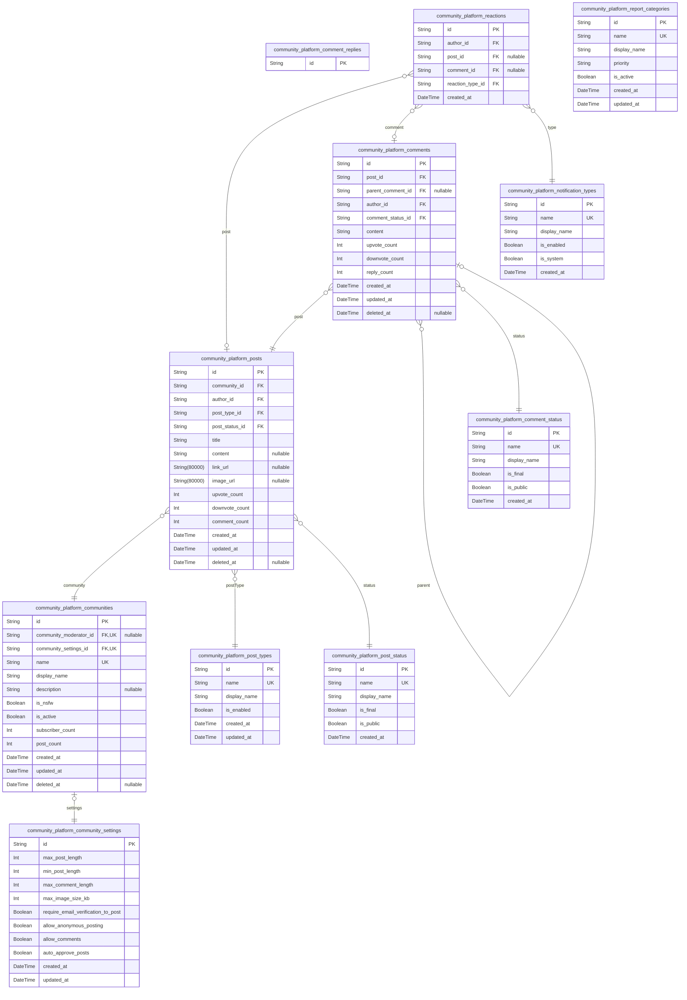
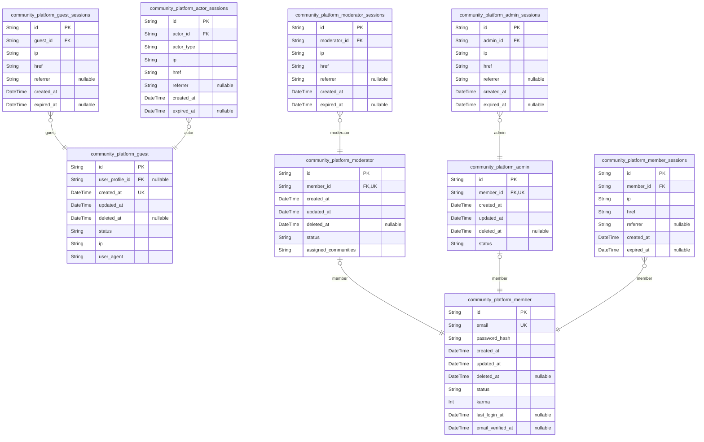
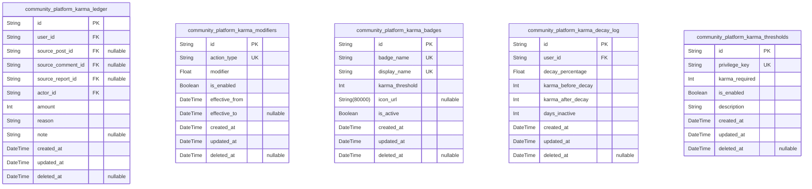
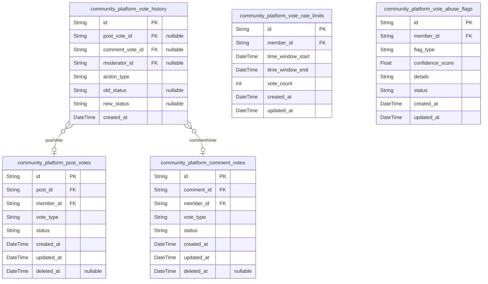
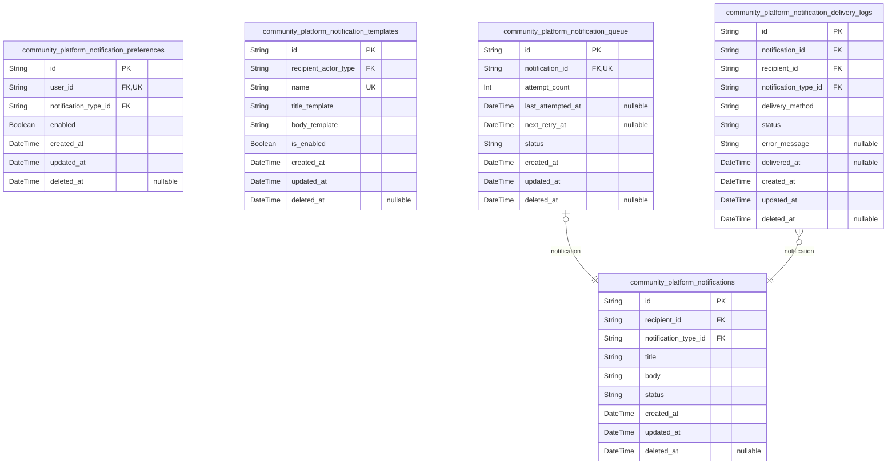
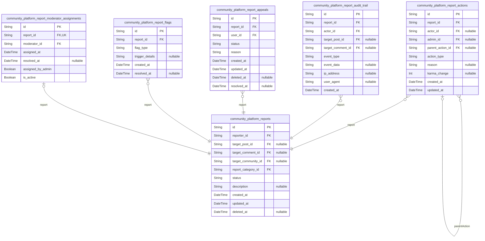
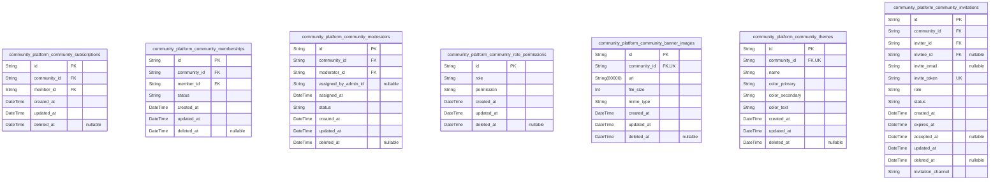
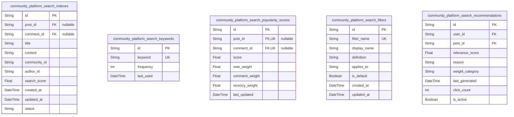

# Prisma Markdown

> Generated by [`prisma-markdown`](https://github.com/samchon/prisma-markdown)

- [Systematic](#systematic)
- [Actors](#actors)
- [Karma](#karma)
- [Voting](#voting)
- [Communication](#communication)
- [Reporting](#reporting)
- [Communities](#communities)
- [Personalization](#personalization)
- [Maintenance](#maintenance)
- [default](#default)

## Systematic

```mermaid
erDiagram
"community_platform_communities" {
  String id PK
  String community_moderator_id FK,UK "nullable"
  String community_settings_id FK,UK
  String name UK
  String display_name
  String description "nullable"
  Boolean is_nsfw
  Boolean is_active
  Int subscriber_count
  Int post_count
  DateTime created_at
  DateTime updated_at
  DateTime deleted_at "nullable"
}
"community_platform_posts" {
  String id PK
  String community_id FK
  String author_id FK
  String post_type_id FK
  String post_status_id FK
  String title
  String content "nullable"
  String(80000) link_url "nullable"
  String(80000) image_url "nullable"
  Int upvote_count
  Int downvote_count
  Int comment_count
  DateTime created_at
  DateTime updated_at
  DateTime deleted_at "nullable"
}
"community_platform_post_types" {
  String id PK
  String name UK
  String display_name
  Boolean is_enabled
  DateTime created_at
  DateTime updated_at
}
"community_platform_comments" {
  String id PK
  String post_id FK
  String parent_comment_id FK "nullable"
  String author_id FK
  String comment_status_id FK
  String content
  Int upvote_count
  Int downvote_count
  Int reply_count
  DateTime created_at
  DateTime updated_at
  DateTime deleted_at "nullable"
}
"community_platform_comment_replies" {
  String id PK
}
"community_platform_reactions" {
  String id PK
  String author_id FK
  String post_id FK "nullable"
  String comment_id FK "nullable"
  String reaction_type_id FK
  DateTime created_at
}
"community_platform_report_categories" {
  String id PK
  String name UK
  String display_name
  String priority
  Boolean is_active
  DateTime created_at
  DateTime updated_at
}
"community_platform_community_settings" {
  String id PK
  Int max_post_length
  Int min_post_length
  Int max_comment_length
  Int max_image_size_kb
  Boolean require_email_verification_to_post
  Boolean allow_anonymous_posting
  Boolean allow_comments
  Boolean auto_approve_posts
  DateTime created_at
  DateTime updated_at
}
"community_platform_post_status" {
  String id PK
  String name UK
  String display_name
  Boolean is_final
  Boolean is_public
  DateTime created_at
}
"community_platform_comment_status" {
  String id PK
  String name UK
  String display_name
  Boolean is_final
  Boolean is_public
  DateTime created_at
}
"community_platform_notification_types" {
  String id PK
  String name UK
  String display_name
  Boolean is_enabled
  Boolean is_system
  DateTime created_at
}
"community_platform_communities" |o--|| "community_platform_community_settings" : settings
"community_platform_posts" }o--|| "community_platform_communities" : community
"community_platform_posts" }o--|| "community_platform_post_types" : postType
"community_platform_posts" }o--|| "community_platform_post_status" : status
"community_platform_comments" }o--|| "community_platform_posts" : post
"community_platform_comments" }o--o| "community_platform_comments" : parent
"community_platform_comments" }o--|| "community_platform_comment_status" : status
"community_platform_reactions" }o--o| "community_platform_posts" : post
"community_platform_reactions" }o--o| "community_platform_comments" : comment
"community_platform_reactions" }o--|| "community_platform_notification_types" : type
```

### `community_platform_communities`

Core community entities that users can subscribe to and participate in.
Represents a topic-based discussion group. Each community has a moderator
and settings. Related to posts (one-to-many) and settings (one-to-one).

Properties as follows:

- `id`: Primary Key.
- `community_moderator_id`: Owner moderator's [community_platform_moderator.id](#community_platform_moderator).
- `community_settings_id`
  > Configuration settings of this community. {@link
  > community_platform_community_settings.id}.
- `name`
  > The unique URL-safe identifier for the community (slug). Example:
  > 'technology'.
- `display_name`
  > Human-readable display name of the community. Example: 'Technology &
  > Innovation'.
- `description`: Brief description of the community's purpose and rules.
- `is_nsfw`: Indicates whether the community contains Not Safe For Work content.
- `is_active`: Whether the community is currently active and visible to users.
- `subscriber_count`: Total number of users subscribed to this community.
- `post_count`: Total number of posts created in this community.
- `created_at`: Timestamp when the community was created.
- `updated_at`: Timestamp when the community was last updated.
- `deleted_at`: Timestamp when the community was soft-deleted (archived). null if active.

### `community_platform_posts`

User-generated content items posted in communities. Posts are the primary
content type and can be of different types (text, link, image). Each post
is associated with a community, author (member), and status.

Properties as follows:

- `id`: Primary Key.
- `community_id`
  > Community where this post was created. {@link
  > community_platform_communities.id}.
- `author_id`: Member who created this post. [community_platform_member.id](#community_platform_member).
- `post_type_id`
  > Type of the post (text/link/image). {@link
  > community_platform_post_types.id}.
- `post_status_id`
  > Current status of the post (published/rejected/removed/etc.). {@link
  > community_platform_post_status.id}.
- `title`: Title of the post. Required for all post types.
- `content`
  > Main text content of the post (e.g., body of a text post). Nullable for
  > link/image posts.
- `link_url`: URL for link-type posts. Nullable for text/image posts.
- `image_url`: The URL to the uploaded image file. Nullable for text/link posts.
- `upvote_count`: Total number of upvotes received.
- `downvote_count`: Total number of downvotes received.
- `comment_count`: Total number of comments on this post.
- `created_at`: Timestamp when the post was created.
- `updated_at`: Timestamp when the post was last updated.
- `deleted_at`: Timestamp when the post was soft-deleted. null if active.

### `community_platform_post_types`

Lookup table that defines the possible types of posts allowed on the
platform (e.g., 'text', 'link', 'image'). This ensures constraint and
consistency across all posts.

Properties as follows:

- `id`: Primary Key.
- `name`: The unique identifier for the post type (e.g., 'text', 'link', 'image').
- `display_name`
  > Human-readable name for display in UI (e.g., 'Text Post', 'Link Post',
  > 'Image Post').
- `is_enabled`: Whether this post type is currently enabled for use by members.
- `created_at`: Timestamp when the post type was created in the system.
- `updated_at`: Timestamp when the post type was last updated.

### `community_platform_comments`

User comments on posts or replies to other comments. Comments are
human-generated text responses that support threaded discussions.
Comments are associated with a post, author, and status.

Properties as follows:

- `id`: Primary Key.
- `post_id`
  > The post this comment is responding to. {@link
  > community_platform_posts.id}.
- `parent_comment_id`
  > The parent comment if this is a reply. {@link
  > community_platform_comments.id} (self-referencing).
- `author_id`: Member who wrote this comment. [community_platform_member.id](#community_platform_member).
- `comment_status_id`
  > Current status of the comment (published/rejected/removed/etc.). {@link
  > community_platform_comment_status.id}.
- `content`
  > The text content of the comment, limited to 500 characters as per
  > requirements.
- `upvote_count`: Total number of upvotes received.
- `downvote_count`: Total number of downvotes received.
- `reply_count`: Number of direct replies to this comment.
- `created_at`: Timestamp when the comment was created.
- `updated_at`: Timestamp when the comment was last updated.
- `deleted_at`: Timestamp when the comment was soft-deleted. null if active.

### `community_platform_comment_replies`

Represents replies to comments. This table is logically a subset of
comments but modeled separately due to its nested structure and to
prevent circular dependencies. However, since replies are a direct form
of comment, this table is deprecated in favor of recursive comments with
parent_id. According to requirements, replies are simply comments with
parent_comment_id referencing a parent comment. This table has been
omitted as it's redundant and violates normalization - the
'community_platform_comments' table handles all comment/reply nesting
with parent_comment_id.

Properties as follows:

- `id`: Primary Key.

### `community_platform_reactions`

User reactions (e.g., upvote/downvote, emoji) to posts or comments. While
upvotes/downvotes are tracked numerically in posts/comments, this table
captures individual voter actions as events for audit and integrity.
Upvote/downvote here represents the specific vote action, not cumulative
count.

Properties as follows:

- `id`: Primary Key.
- `author_id`: Member who cast the reaction. [community_platform_member.id](#community_platform_member).
- `post_id`
  > The post this reaction is on. Either post_id or comment_id must be
  > non-null. [community_platform_posts.id](#community_platform_posts).
- `comment_id`
  > The comment this reaction is on. Either post_id or comment_id must be
  > non-null. [community_platform_comments.id](#community_platform_comments).
- `reaction_type_id`
  > The type of reaction (e.g., upvote, downvote). {@link
  > community_platform_notification_types.id}.
- `created_at`: Timestamp when the reaction was recorded.

### `community_platform_report_categories`

System-defined categories of reports that users can select when reporting
content. This lookup table standardizes reporting reason codes.

Properties as follows:

- `id`: Primary Key.
- `name`: Unique identifier for the category (e.g., 'spam', 'hate_speech').
- `display_name`: Human-readable label shown to users (e.g., 'Spam or irrelevant').
- `priority`: Priority level: 'low', 'medium', or 'high'. Determines escalation path.
- `is_active`: Whether this category is currently available for selection.
- `created_at`: Timestamp when the category was created.
- `updated_at`: Timestamp when the category was last updated.

### `community_platform_community_settings`

Configuration settings for each community, defining moderation policies
and behavioral rules. Each community has exactly one settings record.

Properties as follows:

- `id`: Primary Key.
- `max_post_length`: Maximum character length allowed for a post's text content.
- `min_post_length`: Minimum character length required for a post's text content.
- `max_comment_length`: Maximum character length allowed for a comment.
- `max_image_size_kb`: Maximum file size (in KB) allowed for image uploads.
- `require_email_verification_to_post`: Whether users must verify their email before posting in this community.
- `allow_anonymous_posting`
  > Whether 'guest' users can post (should always be false, but kept for
  > extensibility).
- `allow_comments`: Whether comments are allowed on posts in this community.
- `auto_approve_posts`: If true, new posts are automatically published (no moderation queue).
- `created_at`: Timestamp when settings were created or last modified.
- `updated_at`: Timestamp when settings were last updated.

### `community_platform_post_status`

Lookup table for possible statuses of a post (e.g., 'draft', 'published',
'rejected', 'removed'). Defines lifecycle states.

Properties as follows:

- `id`: Primary Key.
- `name`: Status identifier (e.g., 'published', 'removed').
- `display_name`: UI label (e.g., 'Published', 'Post Removed').
- `is_final`: If true, this status cannot be changed (e.g., 'removed' or 'deleted').
- `is_public`: If true, posts with this status are visible to users.
- `created_at`: Timestamp when this status type was created in the system.

### `community_platform_comment_status`

Lookup table for possible statuses of a comment (e.g., 'published',
'moderation_pending', 'removed'). Defines lifecycle states.

Properties as follows:

- `id`: Primary Key.
- `name`: Status identifier (e.g., 'published', 'removed').
- `display_name`: UI label (e.g., 'Published', 'Comment Removed').
- `is_final`: If true, this status cannot be changed (e.g., 'removed').
- `is_public`: If true, comments with this status are visible to users.
- `created_at`: Timestamp when this status type was created in the system.

### `community_platform_notification_types`

Defines types of notifications that can be triggered in the system (e.g.,
'new_post', 'comment_reply', 'report_submitted'). Used to categorize and
template notifications.

Properties as follows:

- `id`: Primary Key.
- `name`
  > Identifier for notification type (e.g., 'new_post', 'reaction',
  > 'report_status').
- `display_name`
  > Human-readable label (e.g., 'New Post in Community', 'Your Comment Was
  > Replied To').
- `is_enabled`: Whether notifications of this type are enabled by default.
- `is_system`: Whether this is a core system notification (cannot be disabled by user).
- `created_at`: Timestamp when this notification type was defined in the system.

## Actors

```mermaid
erDiagram
"community_platform_guest" {
  String id PK
  String user_profile_id FK "nullable"
  DateTime created_at UK
  DateTime updated_at
  DateTime deleted_at "nullable"
  String status
  String ip
  String user_agent
}
"community_platform_member" {
  String id PK
  String email UK
  String password_hash
  DateTime created_at
  DateTime updated_at
  DateTime deleted_at "nullable"
  String status
  Int karma
  DateTime last_login_at "nullable"
  DateTime email_verified_at "nullable"
}
"community_platform_moderator" {
  String id PK
  String member_id FK,UK
  DateTime created_at
  DateTime updated_at
  DateTime deleted_at "nullable"
  String status
  String assigned_communities
}
"community_platform_admin" {
  String id PK
  String member_id FK,UK
  DateTime created_at
  DateTime updated_at
  DateTime deleted_at "nullable"
  String status
}
"community_platform_guest_sessions" {
  String id PK
  String guest_id FK
  String ip
  String href
  String referrer "nullable"
  DateTime created_at
  DateTime expired_at "nullable"
}
"community_platform_member_sessions" {
  String id PK
  String member_id FK
  String ip
  String href
  String referrer "nullable"
  DateTime created_at
  DateTime expired_at "nullable"
}
"community_platform_moderator_sessions" {
  String id PK
  String moderator_id FK
  String ip
  String href
  String referrer "nullable"
  DateTime created_at
  DateTime expired_at "nullable"
}
"community_platform_admin_sessions" {
  String id PK
  String admin_id FK
  String ip
  String href
  String referrer "nullable"
  DateTime created_at
  DateTime expired_at "nullable"
}
"community_platform_actor_sessions" {
  String id PK
  String actor_id FK
  String actor_type
  String ip
  String href
  String referrer "nullable"
  DateTime created_at
  DateTime expired_at "nullable"
}
"community_platform_moderator" |o--|| "community_platform_member" : member
"community_platform_admin" |o--|| "community_platform_member" : member
"community_platform_guest_sessions" }o--|| "community_platform_guest" : guest
"community_platform_member_sessions" }o--|| "community_platform_member" : member
"community_platform_moderator_sessions" }o--|| "community_platform_moderator" : moderator
"community_platform_admin_sessions" }o--|| "community_platform_admin" : admin
"community_platform_actor_sessions" }o--|| "community_platform_guest" : actor
```

### `community_platform_guest`

Guest users who have not logged in. Represents anonymous visitors to the
platform. This table tracks guest identity for session correlation and
abuse detection. Does not have stored credentials. Guest record is
created upon first visit and persistently linked to browser session.
Linked to community_platform_guest_sessions via {@link
community_platform_guest_sessions.actor_id}.

Properties as follows:

- `id`: Primary Key.
- `user_profile_id`
  > Reference to the user profile if this guest ever becomes a member,
  > otherwise null. [community_platform_user_profiles.id](#community_platform_user_profiles).
- `created_at`: Timestamp when the guest was first recorded.
- `updated_at`: Timestamp when the guest record was last updated.
- `deleted_at`
  > Timestamp when this guest record was logically deleted (e.g., if flagged
  > for abuse). Null if active.
- `status`: Current state of the guest. Values: 'active', 'flagged', 'banned'.
- `ip`: The last known IP address of the guest.
- `user_agent`: The user agent string from the browser request.

### `community_platform_member`

Registered users who have verified their email and are active members of
the community. These users can create posts, comment, vote, subscribe and
manage their profiles. The primary user entity for meaningful
interaction. Linked to community_platform_member_sessions via {@link
community_platform_member_sessions.actor_id}.

Properties as follows:

- `id`: Primary Key.
- `email`: Unique email address of the member. Used for login and notifications.
- `password_hash`: Securely hashed password using bcrypt. Never stored in plaintext.
- `created_at`: Timestamp when the member account was created.
- `updated_at`: Timestamp when the member record was last updated.
- `deleted_at`
  > Timestamp when this member account was logically deleted (e.g., if
  > banned). Null if active.
- `status`
  > Current state of the member account. Values: 'unverified', 'verified',
  > 'suspended', 'banned'.
- `karma`
  > Reputation score calculated from upvotes, downvotes, and community
  > contributions. Used to grant privileges.
- `last_login_at`: Timestamp of the member's last successful login.
- `email_verified_at`: Timestamp when the email was verified. Null if unverified.

### `community_platform_moderator`

Trusted members appointed to moderate specific communities. Possesses
elevated privileges within assigned communities to remove content, ban
users, and enforce guidelines. This is a role-based extension of a
member, not an independent actor type. Any moderator must first be
registered as a member. Linked to community_platform_moderator_sessions
via [community_platform_moderator_sessions.actor_id](#community_platform_moderator_sessions).

Properties as follows:

- `id`: Primary Key.
- `member_id`
  > Reference to the underlying member account that is granted moderator
  > privileges. [community_platform_member.id](#community_platform_member).
- `created_at`: Timestamp when moderator status was granted.
- `updated_at`: Timestamp when the moderator record was last updated.
- `deleted_at`: Timestamp when moderator privileges were revoked. Null if active.
- `status`
  > Current status of moderator privileges. Values: 'active', 'suspended',
  > 'revoked'.
- `assigned_communities`: JSON array of community IDs this moderator is assigned to manage.

### `community_platform_admin`

Platform administrators with full system-wide control. Can manage users,
communities, system settings, and moderation decisions. All admins must
be verified members first. This is the highest privilege level. Linked to
community_platform_admin_sessions via {@link
community_platform_admin_sessions.actor_id}.

Properties as follows:

- `id`: Primary Key.
- `member_id`
  > Reference to the underlying member account that is granted admin
  > privileges. [community_platform_member.id](#community_platform_member).
- `created_at`: Timestamp when admin privileges were granted.
- `updated_at`: Timestamp when the admin record was last updated.
- `deleted_at`: Timestamp when admin privileges were revoked. Null if active.
- `status`
  > Current status of admin privileges. Values: 'active', 'suspended',
  > 'revoked'.

### `community_platform_guest_sessions`

Session records for guest users. Tracks authentication state for
anonymous users during their visit. Automatically expires after
disconnection. Must reference community_platform_guest via guest_id, but
since guest is anonymous, guest_id is a direct link to the guest record.
This table uniquely identifies the guest session and prevents credential
spoofing. Stance is subsidiary because sessions are managed through
authentication flow and do not have independent CRUD operations.

Properties as follows:

- `id`: Primary Key.
- `guest_id`
  > Reference to the guest this session belongs to. {@link
  > community_platform_guest.id}.
- `ip`: IP address of the session origin.
- `href`: The URL path the user was accessing when this session started.
- `referrer`: The previous page URL that referred the user to the platform.
- `created_at`: Timestamp when this session was initiated.
- `expired_at`
  > Timestamp when this session expires. Automatic cleanup expires sessions
  > after 15 minutes of inactivity.

### `community_platform_member_sessions`

Session records for authenticated members. Tracks the active login state
of registered users. Validated against JWT tokens. Must reference their
member via member_id and uses secure cookie-based refresh tokens. Session
expires upon logout or after 30 days of inactivity. Stance is subsidiary
because sessions are managed through authentication flow and do not have
independent CRUD operations.

Properties as follows:

- `id`: Primary Key.
- `member_id`
  > Reference to the member this session belongs to. {@link
  > community_platform_member.id}.
- `ip`: IP address of the session origin.
- `href`: The URL path the user was accessing when this session started.
- `referrer`: The previous page URL that referred the user to the platform.
- `created_at`: Timestamp when this session was initiated.
- `expired_at`
  > Timestamp when this session expires. Populated by refresh token expiry
  > (30 days).

### `community_platform_moderator_sessions`

Session records for authenticated moderators. Inherited from the member
session but tracks moderator-specific authentication state. This ensures
that moderator actions are uniquely tied to their elevated role and
session context. Must reference their moderator via moderator_id. Stance
is subsidiary because sessions are managed through authentication flow
and do not have independent CRUD operations.

Properties as follows:

- `id`: Primary Key.
- `moderator_id`
  > Reference to the moderator this session belongs to. {@link
  > community_platform_moderator.id}.
- `ip`: IP address of the session origin.
- `href`: The URL path the user was accessing when this session started.
- `referrer`: The previous page URL that referred the user to the platform.
- `created_at`: Timestamp when this session was initiated.
- `expired_at`
  > Timestamp when this session expires. Populated by refresh token expiry
  > (30 days).

### `community_platform_admin_sessions`

Session records for authenticated administrators. Inherits from member
session and tracks elevated admin authentication state. Ensures all admin
actions are traceable to a unique, secure session. Must reference their
admin via admin_id. Stance is subsidiary because sessions are managed
through authentication flow and do not have independent CRUD operations.

Properties as follows:

- `id`: Primary Key.
- `admin_id`
  > Reference to the admin this session belongs to. {@link
  > community_platform_admin.id}.
- `ip`: IP address of the session origin.
- `href`: The URL path the user was accessing when this session started.
- `referrer`: The previous page URL that referred the user to the platform.
- `created_at`: Timestamp when this session was initiated.
- `expired_at`
  > Timestamp when this session expires. Populated by refresh token expiry
  > (30 days).

### `community_platform_actor_sessions`

Unified session records for all actor types. Tracks the active
authentication state of users regardless of their actor type. Functions
as a polymorphic relationship with four possible actor types: guest,
member, moderator, admin. Each session references exactly one actor
through the actor_id field and actor_type discriminator. Uses
single-table inheritance pattern to eliminate 4 redundant session tables.
Stance is subsidiary because sessions are managed through authentication
flow and do not have independent CRUD operations.

Properties as follows:

- `id`: Primary Key.
- `actor_id`
  > Reference to the actor this session belongs to. The target model is
  > determined by actor_type field. [community_platform_guest.id](#community_platform_guest) if
  > actor_type is "guest", [community_platform_member.id](#community_platform_member) if actor_type
  > is "member", [community_platform_moderator.id](#community_platform_moderator) if actor_type is
  > "moderator", [community_platform_admin.id](#community_platform_admin) if actor_type is
  > "admin".
- `actor_type`
  > Type of actor this session belongs to. Must be one of: 'guest', 'member',
  > 'moderator', 'admin'. This creates a polymorphic relationship allowing
  > session data to reference any actor type with a single table design.
  > Required for query performance and data normalization.
- `ip`: IP address of the session origin.
- `href`: The URL path the user was accessing when this session started.
- `referrer`: The previous page URL that referred the user to the platform.
- `created_at`: Timestamp when this session was initiated.
- `expired_at`
  > Timestamp when this session expires. Populated based on token expiry
  > policy: 15 minutes for guests, 30 days for authenticated actors.

## Karma

```mermaid
erDiagram
"community_platform_karma_ledger" {
  String id PK
  String user_id FK
  String source_post_id FK "nullable"
  String source_comment_id FK "nullable"
  String source_report_id FK "nullable"
  String actor_id FK
  Int amount
  String reason
  String note "nullable"
  DateTime created_at
  DateTime updated_at
  DateTime deleted_at "nullable"
}
"community_platform_karma_modifiers" {
  String id PK
  String action_type UK
  Float modifier
  Boolean is_enabled
  DateTime effective_from
  DateTime effective_to "nullable"
  DateTime created_at
  DateTime updated_at
  DateTime deleted_at "nullable"
}
"community_platform_karma_badges" {
  String id PK
  String badge_name UK
  String display_name UK
  Int karma_threshold
  String(80000) icon_url "nullable"
  Boolean is_active
  DateTime created_at
  DateTime updated_at
  DateTime deleted_at "nullable"
}
"community_platform_karma_decay_log" {
  String id PK
  String user_id FK
  Float decay_percentage
  Int karma_before_decay
  Int karma_after_decay
  Int days_inactive
  DateTime created_at
  DateTime updated_at
  DateTime deleted_at "nullable"
}
"community_platform_karma_thresholds" {
  String id PK
  String privilege_key UK
  Int karma_required
  Boolean is_enabled
  String description
  DateTime created_at
  DateTime updated_at
  DateTime deleted_at "nullable"
}
```

### `community_platform_karma_ledger`

Core ledger that records all karma changes resulting from user actions
(votes, reports, suspensions). Each row represents a single karma
adjustment event and is the authoritative source for calculating a user's
current karma balance. References user accounts via existing member table
and related entities such as posts, comments, or reports. This table is
the foundation of the reputation system and must be immutable once
created.

Properties as follows:

- `id`: Primary Key.
- `user_id`: User whose karma was affected. [community_platform_member.id](#community_platform_member).
- `source_post_id`
  > Post that caused the karma change (e.g., upvote/downvote), if applicable.
  > [community_platform_posts.id](#community_platform_posts).
- `source_comment_id`
  > Comment that caused the karma change (e.g., upvote/downvote), if
  > applicable. [community_platform_comments.id](#community_platform_comments).
- `source_report_id`
  > Report that triggered a karma penalty (e.g., moderation action), if
  > applicable. [community_platform_reports.id](#community_platform_reports).
- `actor_id`
  > User or system that caused the karma change (e.g., moderator who banned
  > user). [community_platform_member.id](#community_platform_member) or {@link
  > community_platform_admin.id}.
- `amount`
  > The delta karma change. Positive for gains, negative for losses. Always
  > non-zero.
- `reason`
  > Machine-readable reason code for the change. Examples: 'UPVOTE_POST',
  > 'DOWNVOTE_COMMENT', 'MODERATOR_BAN', 'REPORT_VIOLATION'.
- `note`
  > Human-readable optional note explaining the change (e.g., 'Removed for
  > hate speech').
- `created_at`: Timestamp when the karma change was recorded.
- `updated_at`
  > Timestamp when this record was last updated (should be same as created_at
  > for immutable ledgers).
- `deleted_at`
  > Soft delete timestamp. Set only if record is logically deleted for audit
  > compliance.

### `community_platform_karma_modifiers`

Definable multipliers that adjust karma gain/loss rates for specific
actions or user states. These allow dynamic configuration of the karma
economy without code changes. For example: multiplying comment upvotes by
0.5 to make them half as valuable as post upvotes.

Properties as follows:

- `id`: Primary Key.
- `action_type`
  > Unique identifier for the karma-affecting action this modifier applies
  > to. Examples: 'POST_UPVOTE', 'COMMENT_DOWNVOTE', 'FIRST_POST_APPROVED',
  > 'BADGE_UNLOCKED'.
- `modifier`
  > The multiplier applied to base karma value for this action. E.g., 1.0 =
  > normal, 0.5 = half, 2.0 = double. Value must be greater than 0.
- `is_enabled`: Whether this modifier is currently active in the system.
- `effective_from`
  > Timestamp when this modifier became effective. Used for historical
  > tracking and rollbacks.
- `effective_to`
  > Timestamp when this modifier expires. Can be null for indefinitely active
  > modifiers.
- `created_at`: Timestamp when this modifier configuration was added.
- `updated_at`: Timestamp when this modifier was last modified.
- `deleted_at`: Soft delete timestamp. Set when a modifier is deactivated for archival.

### `community_platform_karma_badges`

Defines the reputation badges that users earn based on their karma
thresholds. Each entry represents a badge that appears on user profiles
and is automatically granted when a user's karma reaches the defined
threshold. Future-proofed to allow additional badge types and display
rules.

Properties as follows:

- `id`: Primary Key.
- `badge_name`
  > Unique name of the badge for internal reference. Examples: 'High Karma',
  > 'Trusted Member', 'Community Veteran'.
- `display_name`
  > Human-readable name displayed on user profiles. Examples: 'High Karma',
  > 'Trusted Member', 'Community Veteran'.
- `karma_threshold`: Minimum karma score required to earn this badge. Must be >= 0.
- `icon_url`: URL to the badge icon image. Must be publicly accessible.
- `is_active`: Whether this badge is currently active and available for users to earn.
- `created_at`: Timestamp when this badge definition was added.
- `updated_at`: Timestamp when this badge was last updated.
- `deleted_at`: Soft delete timestamp. Set when a badge is retired for archival.

### `community_platform_karma_decay_log`

Tracks when and how much karma has been decayed due to user inactivity.
Each row records a single decay event triggered by 90-day inactivity
cycles. This log provides audit trail for karma adjustments that are not
resulting from direct user actions (votes, reports).

Properties as follows:

- `id`: Primary Key.
- `user_id`: User whose karma was decayed. [community_platform_member.id](#community_platform_member).
- `decay_percentage`
  > The percentage of karma lost in this decay event (e.g., 0.1 for 10%).
  > Must be > 0 and <= 1.
- `karma_before_decay`: User's karma total before this decay event.
- `karma_after_decay`: User's karma total after this decay event.
- `days_inactive`
  > Number of consecutive days the user was inactive before this decay
  > trigger. Must be >= 90.
- `created_at`: Timestamp when this decay event was processed and applied.
- `updated_at`: Timestamp when this record was last updated.
- `deleted_at`
  > Soft delete timestamp. For audit trail completeness; decay records are
  > never truly deleted.

### `community_platform_karma_thresholds`

Defines the karma thresholds that unlock special user privileges and
capabilities on the platform. These are the rules that govern when users
gain access to advanced features (e.g., creating communities, pinning
comments, bypassing cooldowns). This table acts as system configuration
rather than user data.

Properties as follows:

- `id`: Primary Key.
- `privilege_key`
  > Unique identifier for the privilege. Examples: 'create_community',
  > 'upload_images', 'remove_post_cooldown', 'view_report_reasons',
  > 'trusted_member_badge'.
- `karma_required`: Minimum karma score required to unlock this privilege. Must be >= 0.
- `is_enabled`: Whether this privilege is currently active and enforced in the platform.
- `description`
  > Human-readable description of the privilege for internal documentation
  > (e.g., 'Allows member to create new communities').
- `created_at`: Timestamp when this threshold was set.
- `updated_at`: Timestamp when this threshold was last modified.
- `deleted_at`: Soft delete timestamp. Set when a privilege is retired for archival.

## Voting

```mermaid
erDiagram
"community_platform_post_votes" {
  String id PK
  String post_id FK
  String member_id FK
  String vote_type
  String status
  DateTime created_at
  DateTime updated_at
  DateTime deleted_at "nullable"
}
"community_platform_comment_votes" {
  String id PK
  String comment_id FK
  String member_id FK
  String vote_type
  String status
  DateTime created_at
  DateTime updated_at
  DateTime deleted_at "nullable"
}
"community_platform_vote_history" {
  String id PK
  String post_vote_id FK "nullable"
  String comment_vote_id FK "nullable"
  String moderator_id FK "nullable"
  String action_type
  String old_status "nullable"
  String new_status "nullable"
  DateTime created_at
}
"community_platform_vote_rate_limits" {
  String id PK
  String member_id FK
  DateTime time_window_start
  DateTime time_window_end
  Int vote_count
  DateTime created_at
  DateTime updated_at
}
"community_platform_vote_abuse_flags" {
  String id PK
  String member_id FK
  String flag_type
  Float confidence_score
  String details
  String status
  DateTime created_at
  DateTime updated_at
}
"community_platform_vote_history" }o--o| "community_platform_post_votes" : postVote
"community_platform_vote_history" }o--o| "community_platform_comment_votes" : commentVote
```

### `community_platform_post_votes`

Tracks individual upvotes and downvotes on posts. Each record represents
one user's vote on a specific post. Used for calculating net scores,
detecting voting anomalies, and enabling vote reversal. This is a primary
entity that users directly interact with through the UI.

Properties as follows:

- `id`: Primary Key.
- `post_id`: Reference to the post being voted on. [community_platform_posts.id](#community_platform_posts).
- `member_id`
  > The user who cast the vote. References the member account that performed
  > the vote. [community_platform_member.id](#community_platform_member).
- `vote_type`
  > Type of vote: 'upvote' or 'downvote'. Used to determine score change.
  > Only these two values allowed.
- `status`
  > Current status of this vote: 'active', 'flagged', or 'disabled'. Active
  > means normal operation, flagged means detected as suspicious, disabled
  > means administratively revoked.
- `created_at`
  > Timestamp when the vote was cast. Always set to server time in Asia/Seoul
  > timezone.
- `updated_at`
  > Timestamp when the vote was last modified (e.g., reversed or status
  > changed).
- `deleted_at`
  > Soft delete timestamp. If null, vote is active. If set, vote is
  > considered deleted for display purposes but retained for audit.

### `community_platform_comment_votes`

Tracks individual upvotes and downvotes on comments. Each record
represents one user's vote on a specific comment. Used for calculating
net scores, detecting voting anomalies, and enabling vote reversal. This
is a primary entity that users directly interact with through the UI.

Properties as follows:

- `id`: Primary Key.
- `comment_id`
  > Reference to the comment being voted on. {@link
  > community_platform_comments.id}.
- `member_id`
  > The user who cast the vote. References the member account that performed
  > the vote. [community_platform_member.id](#community_platform_member).
- `vote_type`
  > Type of vote: 'upvote' or 'downvote'. Used to determine score change.
  > Only these two values allowed.
- `status`
  > Current status of this vote: 'active', 'flagged', or 'disabled'. Active
  > means normal operation, flagged means detected as suspicious, disabled
  > means administratively revoked.
- `created_at`
  > Timestamp when the vote was cast. Always set to server time in Asia/Seoul
  > timezone.
- `updated_at`
  > Timestamp when the vote was last modified (e.g., reversed or status
  > changed).
- `deleted_at`
  > Soft delete timestamp. If null, vote is active. If set, vote is
  > considered deleted for display purposes but retained for audit.

### `community_platform_vote_history`

A historical audit trail recording all changes made to votes. Each entry
captures a change event (creation, reversal, status change, deletion).
This table supports vote reversal tracking, user behavior analysis, and
forensic investigation. It is subsidiary because it is managed
automatically by system logic, not directly by users.

Properties as follows:

- `id`: Primary Key.
- `post_vote_id`
  > Reference to the post vote this history entry relates to (if applicable).
  > [community_platform_post_votes.id](#community_platform_post_votes).
- `comment_vote_id`
  > Reference to the comment vote this history entry relates to (if
  > applicable). [community_platform_comment_votes.id](#community_platform_comment_votes).
- `moderator_id`
  > The moderator or admin who made a manual change to the vote status (if
  > applicable). [community_platform_moderator.id](#community_platform_moderator) or {@link
  > community_platform_admin.id}.
- `action_type`
  > Type of action performed: 'created', 'reversed', 'status_changed',
  > 'deleted'. Describes the change that generated this history record.
- `old_status`
  > The status value before the change. Allows audit of what changed when
  > status was modified.
- `new_status`
  > The status value after the change. Allows audit of what changed when
  > status was modified.
- `created_at`
  > Timestamp when this history record was created. Always set to server time
  > in Asia/Seoul timezone.

### `community_platform_vote_rate_limits`

Tracks voting behavior to enforce rate limits. Each record represents a
user's vote activity within a time window, used to detect and prevent
vote spamming and abuse. This is subsidiary because it's managed
automatically by system logic in response to user actions, not directly
interacted with by users.

Properties as follows:

- `id`: Primary Key.
- `member_id`
  > The user whose voting behavior is being tracked. {@link
  > community_platform_member.id}.
- `time_window_start`
  > Start of the time window (e.g., last 60 seconds). Used for rate limiting
  > calculations.
- `time_window_end`
  > End of the time window (e.g., last 60 seconds). Used for rate limiting
  > calculations.
- `vote_count`
  > Number of votes cast by this user within the time window. Used to compare
  > against rate limits (e.g., 20 per minute).
- `created_at`
  > Timestamp when this rate limit record was created. Always set to server
  > time in Asia/Seoul timezone.
- `updated_at`
  > Timestamp when this rate limit record was last updated (e.g., when a new
  > vote was added).

### `community_platform_vote_abuse_flags`

Flags potential abusive voting patterns detected by automated systems
(e.g., sock puppet accounts, bot activity). Each record represents one
detected violation pattern. This table supports moderation of systemic
abuse and is subsidiary because it is generated by system logic from
analysis of other tables, not directly manipulated by users.

Properties as follows:

- `id`: Primary Key.
- `member_id`
  > The user account flagged for abusive voting behavior. {@link
  > community_platform_member.id}.
- `flag_type`
  > Type of violation detected: 'sock_puppet', 'vote_ring', 'bot_pattern',
  > 'rapid_vote_cycle'. Describes the specific abuse model detected.
- `confidence_score`
  > Confidence level of the automated detection system (0.0 to 1.0). Higher
  > values indicate more certain violations.
- `details`
  > JSON-formatted details about the detection triggering this flag,
  > including timestamps, vote counts, and pattern analysis.
- `status`
  > Current status of the flag: 'pending', 'reviewed', 'confirmed',
  > 'dismissed'. Used to track moderation efforts.
- `created_at`
  > Timestamp when the flag was generated by the automated system. Always set
  > to server time in Asia/Seoul timezone.
- `updated_at`
  > Timestamp when the flag status was last changed (e.g., from pending to
  > reviewed).

## Communication

```mermaid
erDiagram
"community_platform_notifications" {
  String id PK
  String recipient_id FK
  String notification_type_id FK
  String title
  String body
  String status
  DateTime created_at
  DateTime updated_at
  DateTime deleted_at "nullable"
}
"community_platform_notification_preferences" {
  String id PK
  String user_id FK,UK
  String notification_type_id FK
  Boolean enabled
  DateTime created_at
  DateTime updated_at
  DateTime deleted_at "nullable"
}
"community_platform_notification_templates" {
  String id PK
  String recipient_actor_type FK
  String name UK
  String title_template
  String body_template
  Boolean is_enabled
  DateTime created_at
  DateTime updated_at
  DateTime deleted_at "nullable"
}
"community_platform_notification_queue" {
  String id PK
  String notification_id FK,UK
  Int attempt_count
  DateTime last_attempted_at "nullable"
  DateTime next_retry_at "nullable"
  String status
  DateTime created_at
  DateTime updated_at
  DateTime deleted_at "nullable"
}
"community_platform_notification_delivery_logs" {
  String id PK
  String notification_id FK
  String recipient_id FK
  String notification_type_id FK
  String delivery_method
  String status
  String error_message "nullable"
  DateTime delivered_at "nullable"
  DateTime created_at
  DateTime updated_at
  DateTime deleted_at "nullable"
}
"community_platform_notification_queue" |o--|| "community_platform_notifications" : notification
"community_platform_notification_delivery_logs" }o--|| "community_platform_notifications" : notification
```

### `community_platform_notifications`

Stores active notifications sent to users. Each notification is
associated with an actor (member, moderator, admin) and includes the
type, content, and delivery status. Users directly interact with
notifications by viewing and marking them as read or dismissed. This is a
primary entity because users need to independently search, filter, and
manage their notifications across all context (e.g., unread notifications
from any content type).

Properties as follows:

- `id`: Primary Key.
- `recipient_id`
  > User receiving this notification. Points to the actor's session record.
  > Links to [community_platform_member_sessions](#community_platform_member_sessions) for members, {@link
  > community_platform_moderator_sessions} for moderators, and {@link
  > community_platform_admin_sessions} for admins.
- `notification_type_id`
  > Type of notification as defined in templates. Links to {@link
  > community_platform_notification_types.id}.
- `title`: Short title of the notification.
- `body`: Full body content of the notification.
- `status`: Current status of the notification: 'unread', 'read', or 'dismissed'.
- `created_at`: Timestamp when the notification was created.
- `updated_at`: Timestamp when the notification was last updated (e.g., marked as read).
- `deleted_at`
  > Timestamp when the notification was soft-deleted (e.g., user cleared all
  > notifications).

### `community_platform_notification_preferences`

Defines user-specific preferences for which types of notifications they
wish to receive. Each user can opt-in or out of types of notifications.
This entity is primary because users directly configure these settings
and expect to be able to query and update their preferences independently
across the platform.

Properties as follows:

- `id`: Primary Key.
- `user_id`
  > The user (member/moderator/admin) who owns these preferences. Links to
  > their session record (e.g., [community_platform_member_sessions](#community_platform_member_sessions) or
  > equivalent for moderator/admin).
- `notification_type_id`
  > The notification type this preference applies to. Links to {@link
  > community_platform_notification_types.id}.
- `enabled`
  > Whether the user wants to receive notifications of this type (true) or
  > not (false).
- `created_at`: Timestamp when this preference was created.
- `updated_at`: Timestamp when this preference was last updated.
- `deleted_at`: Timestamp when this preference was soft-deleted.

### `community_platform_notification_templates`

System-defined templates for notifications. These templates define the
structure and content of notifications that can be sent to users, such as
'(Author) posted a new comment in {community}' or 'You have {n} unread
notifications'. Templates are managed by the platform and not directly by
users. Therefore, this is a subsidiary entity used by the system to
populate notifications.

Properties as follows:

- `id`: Primary Key.
- `recipient_actor_type`
  > The actor type this template is targetable to (points to a record in the
  > actor type model). Links to the existing {@link
  > community_platform_member}, [community_platform_moderator](#community_platform_moderator), or
  > [community_platform_admin](#community_platform_admin) record types. This is used to determine
  > which actors can receive notifications of this template type.
- `name`
  > Internal name to identify this template (e.g., 'new_comment',
  > 'user_mention').
- `title_template`
  > Template string for the notification title. May contain placeholders like
  > {user_name} or {community_name}.
- `body_template`
  > Template string for the notification body content. May contain
  > placeholders like {user_name} or {post_title}.
- `is_enabled`
  > Whether this template is currently active and can be used to generate
  > notifications.
- `created_at`: Timestamp when this template was created.
- `updated_at`: Timestamp when this template was last updated.
- `deleted_at`: Timestamp when this template was soft-deleted.

### `community_platform_notification_queue`

A queue system for notifications awaiting delivery. This table holds
notifications that have been generated by the system but are awaiting
processing by background workers. This is a subsidiary entity managed
entirely by the system for scalability and reliability of notification
delivery, not intended for direct user interaction.

Properties as follows:

- `id`: Primary Key.
- `notification_id`
  > The notification this queue entry is for. Links to {@link
  > community_platform_notifications.id}.
- `attempt_count`: Number of times this notification has been attempted for delivery.
- `last_attempted_at`: When the last delivery attempt occurred.
- `next_retry_at`: When the next retry attempt should occur (for exponential backoff).
- `status`: Qualifies the state: 'pending', 'failed', or 'processed'.
- `created_at`: Timestamp when this queue entry was created.
- `updated_at`: Timestamp when this queue entry was updated (e.g., retry attempted).
- `deleted_at`: Timestamp when this entry was soft-deleted.

### `community_platform_notification_delivery_logs`

Immutable audit trail of notification delivery attempts. Each log entry
records the time, outcome, and method (email/in-app) of a notification
delivery. This table is strictly append-only and serves as an audit trail
for reliability and compliance. It is subsidiary because it is managed by
the system and does not require direct user interaction for CRUD
operations.

Properties as follows:

- `id`: Primary Key.
- `notification_id`
  > The notification that was delivered. Links to {@link
  > community_platform_notifications.id}.
- `recipient_id`
  > User recipient ID as it was at time of delivery (links to original
  > session record: [community_platform_member_sessions](#community_platform_member_sessions), etc.).
- `notification_type_id`
  > The notification type at time of delivery (links to {@link
  > community_platform_notification_types.id}).
- `delivery_method`: Method used for delivery: 'email' or 'in_app'.
- `status`: Outcome of delivery: 'success', 'failed', 'deferred', or 'suppressed'.
- `error_message`: Detailed error message if delivery failed.
- `delivered_at`: Timestamp when delivery was attempted and completion status is known.
- `created_at`: Timestamp when this log entry was created.
- `updated_at`
  > Timestamp when this log entry was updated (e.g., when status changed from
  > deferred to successful).
- `deleted_at`
  > This field is added for consistency but should never be set since
  > delivery logs are append-only, immutable audit trails.

## Reporting

```mermaid
erDiagram
"community_platform_reports" {
  String id PK
  String reporter_id FK
  String target_post_id FK "nullable"
  String target_comment_id FK "nullable"
  String target_community_id FK "nullable"
  String report_category_id FK
  String status
  String description "nullable"
  DateTime created_at
  DateTime updated_at
  DateTime deleted_at "nullable"
}
"community_platform_report_actions" {
  String id PK
  String report_id FK
  String actor_id FK "nullable"
  String admin_id FK "nullable"
  String parent_action_id FK "nullable"
  String action_type
  String reason "nullable"
  Int karma_change "nullable"
  DateTime created_at
  DateTime updated_at
}
"community_platform_report_audit_trail" {
  String id PK
  String report_id FK
  String actor_id FK
  String target_post_id FK "nullable"
  String target_comment_id FK "nullable"
  String event_type
  String event_data "nullable"
  String ip_address "nullable"
  String user_agent "nullable"
  DateTime created_at
}
"community_platform_report_appeals" {
  String id PK
  String report_id FK
  String user_id FK
  String status
  String reason
  DateTime created_at
  DateTime updated_at
  DateTime deleted_at "nullable"
  DateTime resolved_at "nullable"
}
"community_platform_report_flags" {
  String id PK
  String report_id FK
  String flag_type
  String trigger_details "nullable"
  DateTime created_at
  DateTime resolved_at "nullable"
}
"community_platform_report_moderator_assignments" {
  String id PK
  String report_id FK,UK
  String moderator_id FK
  DateTime assigned_at
  DateTime resolved_at "nullable"
  Boolean assigned_by_admin
  Boolean is_active
}
"community_platform_report_actions" }o--|| "community_platform_reports" : report
"community_platform_report_actions" }o--o| "community_platform_report_actions" : parentAction
"community_platform_report_audit_trail" }o--|| "community_platform_reports" : report
"community_platform_report_appeals" }o--|| "community_platform_reports" : report
"community_platform_report_flags" }o--|| "community_platform_reports" : report
"community_platform_report_moderator_assignments" |o--|| "community_platform_reports" : report
```

### `community_platform_reports`

Main report entity created by users when reporting content. Each report
captures the details of a single violation report targeting a post,
comment, or community. Reports have a lifecycle from creation through
review to resolution. [community_platform_report_actions](#community_platform_report_actions) records
all actions taken on this report. {@link
community_platform_report_appeals} may be created if the report leads to
content removal and the user appeals.

Properties as follows:

- `id`: Primary Key.
- `reporter_id`: The member who submitted the report. [community_platform_member.id](#community_platform_member).
- `target_post_id`
  > The post being reported. Nullable for reports against communities or
  > comments. [community_platform_posts.id](#community_platform_posts).
- `target_comment_id`
  > The comment being reported. Nullable for reports against posts or
  > communities. [community_platform_comments.id](#community_platform_comments).
- `target_community_id`
  > The community being reported. Nullable for reports against posts or
  > comments. [community_platform_communities.id](#community_platform_communities).
- `report_category_id`
  > The category under which this report was submitted. {@link
  > community_platform_report_categories.id}.
- `status`
  > Current status of the report in its lifecycle. Values: 'pending_review',
  > 'under_review', 'resolved', 'dismissed', 'escalated'.
- `description`
  > Optional additional details provided by the reporter about the violation.
  > Max 500 characters.
- `created_at`: Timestamp when the report was created (Asia/Seoul).
- `updated_at`: Timestamp when the report was last updated (Asia/Seoul).
- `deleted_at`
  > Soft delete timestamp. Makes record logically deleted but preserves audit
  > trail. Nullable because if null, report is active.

### `community_platform_report_actions`

Records every action taken by moderators or admins on a report. Each
action is an immutable log entry for audit purposes. Actions include
dismiss, remove content, warn user, ban, etc. This table logs who did
what and when. [community_platform_reports](#community_platform_reports) is the parent report
affected by this action.

Properties as follows:

- `id`: Primary Key.
- `report_id`
  > The report this action was taken on. {@link
  > community_platform_reports.id}.
- `actor_id`
  > The moderator or admin who took this action. Can be from moderator or
  > admin table. [community_platform_moderator.id](#community_platform_moderator) or {@link
  > community_platform_admin.id}.
- `admin_id`
  > Alternative foreign key for admin actions, if the actor was an admin
  > (allows single table for both moderator and admin actions). {@link
  > community_platform_admin.id}.
- `parent_action_id`
  > If this action is a follow-up to a previous one (e.g., escalation), this
  > links to the prior action. [community_platform_report_actions.id](#community_platform_report_actions).
- `action_type`
  > Type of action taken. Values: 'dismissed', 'remove_content', 'warn_user',
  > 'temp_ban', 'perm_ban', 'lock_post', 'clear_reports'.
- `reason`
  > Optional reason given by the moderator/admin for the action taken. Max
  > 500 characters.
- `karma_change`
  > Delta to karma score applied to the user whose content was affected.
  > Positive value means added, negative subtracted. 0 if no change.
- `created_at`: Timestamp when the action was taken (Asia/Seoul).
- `updated_at`: Timestamp when the action was last updated (Asia/Seoul).

### `community_platform_report_audit_trail`

Immutable audit trail of all reporting system events. This table is for
compliance and tamper-proof evidence. All entries are appended-only; no
updates or deletions allowed. This record cannot be removed and serves as
legal evidence. Is used by admins to reconstruct events at any time.
[community_platform_reports](#community_platform_reports), {@link
community_platform_report_actions}, and {@link
community_platform_report_appeals} are the source entities for most
events here.

Properties as follows:

- `id`: Primary Key.
- `report_id`
  > The report associated with this audit event. {@link
  > community_platform_reports.id}.
- `actor_id`
  > The user or admin who initiated the event (either reporter or
  > moderator/admin). [community_platform_member.id](#community_platform_member), {@link
  > community_platform_moderator.id}, or [community_platform_admin.id](#community_platform_admin).
- `target_post_id`: The post involved if any. [community_platform_posts.id](#community_platform_posts).
- `target_comment_id`: The comment involved if any. [community_platform_comments.id](#community_platform_comments).
- `event_type`
  > Type of audit event. Values: 'REPORT_CREATED', 'REPORT_CATEGORIZED',
  > 'ACTION_TAKEN', 'APPEAL_SUBMITTED', 'APPEAL_RESOLVED',
  > 'MODERATOR_ASSIGNED', 'SYSTEM_ALERT'.
- `event_data`
  > JSON string containing structured data about the event (e.g., category
  > selected, action details, appeal text, etc.).
- `ip_address`: IP address from which the event was initiated.
- `user_agent`: User agent string of the client device that generated the event.
- `created_at`: Timestamp of when the event occurred (Asia/Seoul). Immutable.

### `community_platform_report_appeals`

User-initiated appeals against moderation actions (e.g., removal of their
post or comment). Appeals create a separate workflow for review by an
administrator. [community_platform_reports](#community_platform_reports) is linked as the source
report that prompted the appeal. {@link
community_platform_report_actions} records the original action being
appealed.

Properties as follows:

- `id`: Primary Key.
- `report_id`
  > The original report that led to the action being appealed. {@link
  > community_platform_reports.id}.
- `user_id`: The member who submitted the appeal. [community_platform_member.id](#community_platform_member).
- `status`
  > Current status of the appeal. Values: 'pending_review', 'approved',
  > 'denied'.
- `reason`
  > The user's explanation for why they believe the action was incorrect. Max
  > 2000 characters.
- `created_at`: Timestamp when the appeal was created (Asia/Seoul).
- `updated_at`: Timestamp when the appeal was last updated (Asia/Seoul).
- `deleted_at`: Soft delete timestamp. Nullable because if null, appeal is active.
- `resolved_at`: Timestamp when the appeal was resolved (by admin).

### `community_platform_report_flags`

System-generated flags that automatically trigger escalation or
prioritization of reports based on automated patterns. These are not
user-created but system-derived signals to assist moderation. Examples:
high priority flag, repeated reporter flag, suspicious pattern flag.
[community_platform_reports](#community_platform_reports) is the target report being flagged.

Properties as follows:

- `id`: Primary Key.
- `report_id`: The report this flag is applied to. [community_platform_reports.id](#community_platform_reports).
- `flag_type`
  > Type of flag triggered automatically. Values: 'high_priority',
  > 'repeated_reporter', 'suspicious_pattern', 'brand_blacklist',
  > 'region_risk'.
- `trigger_details`
  > JSON string describing the triggering condition (e.g., number of reports,
  > user karma, speed of submission).
- `created_at`: Timestamp when the flag was auto-generated (Asia/Seoul).
- `resolved_at`: Timestamp when the flag was resolved (cleared) by system or moderator.

### `community_platform_report_moderator_assignments`

Tracks which moderator is assigned to review a specific report. Enables
load balancing and accountability. When a report is received, it is
assigned to an available moderator. Once resolved, the assignment is
closed. This table helps ensure no report goes unattended. {@link
community_platform_reports} is the report being managed. {@link
community_platform_moderator} is the assigned moderator.

Properties as follows:

- `id`: Primary Key.
- `report_id`: The report assigned to a moderator. [community_platform_reports.id](#community_platform_reports).
- `moderator_id`
  > The moderator assigned to handle this report. {@link
  > community_platform_moderator.id}.
- `assigned_at`: Timestamp when the moderator was assigned to the report (Asia/Seoul).
- `resolved_at`
  > Timestamp when the moderator completed their action on the report
  > (Asia/Seoul). Null if still open.
- `assigned_by_admin`
  > True if the assignment was made by an admin (forced assignment), false if
  > auto-assigned by system.
- `is_active`: True if this assignment is still open (unresolved), false if resolved.

## Communities

```mermaid
erDiagram
"community_platform_community_subscriptions" {
  String id PK
  String community_id FK
  String member_id FK
  DateTime created_at
  DateTime updated_at
  DateTime deleted_at "nullable"
}
"community_platform_community_memberships" {
  String id PK
  String community_id FK
  String member_id FK
  String status
  DateTime created_at
  DateTime updated_at
  DateTime deleted_at "nullable"
}
"community_platform_community_moderators" {
  String id PK
  String community_id FK
  String moderator_id FK
  String assigned_by_admin_id "nullable"
  DateTime assigned_at
  String status
  DateTime created_at
  DateTime updated_at
  DateTime deleted_at "nullable"
}
"community_platform_community_role_permissions" {
  String id PK
  String role
  String permission
  DateTime created_at
  DateTime updated_at
  DateTime deleted_at "nullable"
}
"community_platform_community_banner_images" {
  String id PK
  String community_id FK,UK
  String(80000) url
  Int file_size
  String mime_type
  DateTime created_at
  DateTime updated_at
  DateTime deleted_at "nullable"
}
"community_platform_community_themes" {
  String id PK
  String community_id FK,UK
  String name
  String color_primary
  String color_secondary
  String color_text
  DateTime created_at
  DateTime updated_at
  DateTime deleted_at "nullable"
}
"community_platform_community_invitations" {
  String id PK
  String community_id FK
  String inviter_id FK
  String invitee_id FK "nullable"
  String invite_email "nullable"
  String invite_token UK
  String role
  String status
  DateTime created_at
  DateTime expires_at
  DateTime accepted_at "nullable"
  DateTime updated_at
  DateTime deleted_at "nullable"
  String invitation_channel
}
```

### `community_platform_community_subscriptions`

Tracks which members are subscribed to which communities. This model
represents the many-to-many relationship between members and communities.
Each subscription grants the member access to community content and
updates. This is a supporting table managed through the community and
member contexts. [community_platform_communities](#community_platform_communities) and {@link
community_platform_member}.

Properties as follows:

- `id`: Primary Key.
- `community_id`
  > The community being subscribed to. {@link
  > community_platform_communities.id}.
- `member_id`: The member who is subscribed. [community_platform_member.id](#community_platform_member).
- `created_at`: The timestamp when the subscription was created.
- `updated_at`: The timestamp when the subscription was last updated.
- `deleted_at`
  > The timestamp when the subscription was deleted (soft delete). Null if
  > active.

### `community_platform_community_memberships`

Represents the relationship between a member and a community, capturing
membership status. Unlike subscriptions which are for content access,
memberships track active participation status (e.g., active, pending,
revoked). This model handles role assignment and communal belonging.
[community_platform_communities](#community_platform_communities) and {@link
community_platform_member}.

Properties as follows:

- `id`: Primary Key.
- `community_id`
  > The community the member is part of. {@link
  > community_platform_communities.id}.
- `member_id`
  > The member whose membership status is recorded. {@link
  > community_platform_member.id}.
- `status`
  > The status of the membership: 'active', 'pending', 'revoked', 'banned'.
  > Used to control community access.
- `created_at`: When this membership was created.
- `updated_at`: When this membership status was last updated.
- `deleted_at`: When this membership record was soft-deleted. Null if active.

### `community_platform_community_moderators`

Defines which users are moderators for specific communities. This table
is the authority for who can moderate a community. It links a community
to a user with moderator status from otherTables. This is a supporting
table managed by system admins or community owners. {@link
community_platform_communities} and [community_platform_member](#community_platform_member).

Properties as follows:

- `id`: Primary Key.
- `community_id`
  > The community that has this moderator. {@link
  > community_platform_communities.id}.
- `moderator_id`
  > The member who is acting as moderator for this community. {@link
  > community_platform_member.id}.
- `assigned_by_admin_id`
  > The admin who assigned this moderator. {@link
  > community_platform_admin.id}. Null if assigned by community owner.
- `assigned_at`: Timestamp when this moderator was assigned.
- `status`
  > The current status of the moderator role: 'active', 'suspended',
  > 'revoked'.
- `created_at`: When this moderator record was created.
- `updated_at`: When this moderator record was last updated.
- `deleted_at`: When this moderator record was soft-deleted. Null if active.

### `community_platform_community_role_permissions`

Defines exact permissions for different roles within communities. This
table serves as a configuration map, specifying which actions each role
(member, moderator) can perform. It is referenced by application logic to
enforce access control. This is a catalog table, not manipulated by end
users. [community_platform_community_moderators](#community_platform_community_moderators) and {@link
community_platform_community_memberships}.

Properties as follows:

- `id`: Primary Key.
- `role`: The role name: 'member', 'moderator'. Defines the permission set.
- `permission`
  > The specific permission granted, e.g., 'create_post', 'delete_comment',
  > 'ban_member'.
- `created_at`: When this permission rule was created.
- `updated_at`: When this permission rule was last updated.
- `deleted_at`: When this permission rule was soft-deleted. Null if active.

### `community_platform_community_banner_images`

Stores the image assets used as banners for communities. Each community
can have one banner image. This is a supporting table for community
branding and visual identity. [community_platform_communities](#community_platform_communities).

Properties as follows:

- `id`: Primary Key.
- `community_id`
  > The community this banner belongs to. {@link
  > community_platform_communities.id}.
- `url`: The URL/URI where the banner image is stored (e.g., CDN path).
- `file_size`: Size of the banner image file in bytes.
- `mime_type`: MIME type of the image file (e.g., 'image/jpeg').
- `created_at`: When this banner image was uploaded.
- `updated_at`: When this banner image was last updated.
- `deleted_at`: When this banner image record was soft-deleted. Null if active.

### `community_platform_community_themes`

Defines custom visual themes for communities. Members may apply these
themes for consistent appearance across community views. This table holds
theme configuration data, not user preferences. {@link
community_platform_communities}.

Properties as follows:

- `id`: Primary Key.
- `community_id`
  > The community this theme is applied to. {@link
  > community_platform_communities.id}.
- `name`: The name of the custom theme (e.g., 'Dark Mode', 'Rainbow Theme').
- `color_primary`: Primary color in hex format (e.g., '#3b82f6').
- `color_secondary`: Secondary color in hex format.
- `color_text`: Text color in hex format.
- `created_at`: When this theme was created.
- `updated_at`: When this theme was last updated.
- `deleted_at`: When this theme record was soft-deleted. Null if active.

### `community_platform_community_invitations`

Manages invitations sent to members to join communities. This table
tracks invitation lifecycle from sent to accepted or expired. It enables
controlled community growth through direct invites. {@link
community_platform_communities} and [community_platform_member](#community_platform_member).

Properties as follows:

- `id`: Primary Key.
- `community_id`: The community being invited to. [community_platform_communities.id](#community_platform_communities).
- `inviter_id`: The member who sent the invitation. [community_platform_member.id](#community_platform_member).
- `invitee_id`
  > The member who was invited (if known). {@link
  > community_platform_member.id}. Null if invitation sent to external email.
- `invite_email`: The email address that received the invitation (if invitee_id is null).
- `invite_token`
  > Unique token used to accept the invitation. Must be unique and
  > cryptographically secure.
- `role`: The role the invitee will receive upon acceptance: 'member', 'moderator'.
- `status`: The status of the invitation: 'sent', 'accepted', 'rejected', 'expired'.
- `created_at`: When the invitation was created.
- `expires_at`: When the invitation token expires.
- `accepted_at`: When the invitation was accepted. Null until accepted.
- `updated_at`: When the invitation was last updated.
- `deleted_at`: When this invitation record was soft-deleted. Null if active.
- `invitation_channel`
  > The channel through which the invitation was delivered: 'email' or
  > 'link'. Required to track invitation effectiveness and comply with
  > business requirements for multi-channel invitations.

## Personalization

```mermaid
erDiagram
"community_platform_user_profiles" {
  String id PK
  String member_id FK,UK
  String display_name "nullable"
  String bio "nullable"
  String location "nullable"
  DateTime created_at
  DateTime updated_at
}
"community_platform_profile_themes" {
  String id PK
  String member_id FK,UK
  String theme_name
  String color_primary "nullable"
  String color_secondary "nullable"
  Int font_size "nullable"
  DateTime created_at
  DateTime updated_at
}
"community_platform_profile_avatars" {
  String id PK
  String member_id FK,UK
  String(80000) file_uri
  String file_extension
  Int file_size
  Boolean is_default
  DateTime created_at
  DateTime updated_at
}
"community_platform_display_preferences" {
  String id PK
  String member_id FK,UK
  String default_sort_order
  Boolean show_comment_replies_by_default
  Boolean enable_notifications_on_post_votes
  Boolean enable_notifications_on_comment_replies
  Int max_comment_depth
  DateTime created_at
  DateTime updated_at
}
"community_platform_privacy_settings" {
  String id PK
  String member_id FK,UK
  Boolean hide_profile_from_guests
  Boolean hide_all_posts_from_public
  Boolean hide_all_comments_from_public
  Boolean hide_karma_score
  Boolean hide_subscription_list
  DateTime created_at
  DateTime updated_at
}
"community_platform_badge_achievements" {
  String id PK
  String member_id FK
  String badge_name
  String badge_description
  DateTime earned_at
  Boolean is_active
  DateTime created_at
  DateTime updated_at
  DateTime deleted_at "nullable"
}
```

### `community_platform_user_profiles`

User profile information including display name, bio, location, and other
public-facing details. Represents the primary user profile that users
directly manage and customize.

This table stores the core profile data visible to other users. Changes
to this profile are managed exclusively by the associated member.

[community_platform_member.id](#community_platform_member) references the member who owns this
profile.

Properties as follows:

- `id`: Primary Key.
- `member_id`: The member who owns this profile. [community_platform_member.id](#community_platform_member).
- `display_name`
  > The display name shown to other users. This may differ from the username
  > and can be customized by the user.
- `bio`
  > Optional short bio provided by the user to describe themselves or their
  > interests.
- `location`
  > Optional location information entered by the user, typically as text
  > (city, region, etc.) rather than geolocation.
- `created_at`: Timestamp when the profile was first created.
- `updated_at`: Timestamp when the profile was last updated by the user.

### `community_platform_profile_themes`

User-specific theme preferences for their profile and UI appearance.
Defines the color scheme, layout preferences, and visual styling options
applied to the user's interface.

These settings are application UI customizations that do not affect core
functionality. The user selects themes to personalize their experience.

Properties as follows:

- `id`: Primary Key.
- `member_id`
  > The member who owns these theme preferences. {@link
  > community_platform_member.id}.
- `theme_name`: Name of the selected theme (e.g., 'dark', 'light', 'auto', 'custom-1').
- `color_primary`: Hex code for the primary theme color (e.g., '#3b82f6').
- `color_secondary`: Hex code for the secondary theme color (e.g., '#10b981').
- `font_size`: Preferred font size in pixels (e.g., 14, 16, 18).
- `created_at`: Timestamp when these theme preferences were first set.
- `updated_at`: Timestamp when these theme preferences were last modified.

### `community_platform_profile_avatars`

User profile avatar images stored for display in the community platform.
Each user has one current avatar which may be updated over time.

Avatars are managed through profile settings but are not independently
queried. This table tracks the avatar file metadata and URI.

Properties as follows:

- `id`: Primary Key.
- `member_id`: The member who owns this avatar. [community_platform_member.id](#community_platform_member).
- `file_uri`
  > The public URI or path where the avatar image file is stored (e.g.,
  > 'https://cdn.example.com/avatars/user123.jpg').
- `file_extension`: The file format extension of the avatar (e.g., 'jpg', 'png', 'webp').
- `file_size`: The size of the avatar file in bytes.
- `is_default`
  > Indicates whether this avatar is the system-generated default (true) or a
  > user-uploaded custom avatar (false).
- `created_at`: Timestamp when this avatar was uploaded or set as primary.
- `updated_at`
  > Timestamp when this avatar was last updated (e.g., replaced with new
  > image).

### `community_platform_display_preferences`

User preferences that determine how content is displayed on the
interface, including layout, sorting, and rendering options.

These preferences affect UI presentation only and do not change behavior
of core systems. Multiple preferences can be set for different contexts.

Properties as follows:

- `id`: Primary Key.
- `member_id`
  > The member who owns these display preferences. {@link
  > community_platform_member.id}.
- `default_sort_order`
  > The default post sorting preference for view (e.g., 'new', 'hot', 'top',
  > 'controversial').
- `show_comment_replies_by_default`: Whether comment replies are expanded by default when viewing a post.
- `enable_notifications_on_post_votes`
  > Whether to receive notifications when someone upvotes or downvotes a
  > user's post.
- `enable_notifications_on_comment_replies`: Whether to receive notifications when someone replies to a user's comment.
- `max_comment_depth`
  > Maximum reply depth to display (1-5), controlling how many nested levels
  > are expanded.
- `created_at`: Timestamp when these preferences were first set.
- `updated_at`: Timestamp when these preferences were last modified.

### `community_platform_privacy_settings`

User privacy controls determining who can view or interact with their
content and profile information.

These settings act as visibility gates for different types of profile
data and activity, allowing users to control their online presence.

Properties as follows:

- `id`: Primary Key.
- `member_id`
  > The member who owns these privacy settings. {@link
  > community_platform_member.id}.
- `hide_profile_from_guests`
  > Prevents unauthenticated users (guests) from viewing any part of the
  > profile.
- `hide_all_posts_from_public`
  > Hides all posts from public discovery feeds and profiles, visible only to
  > subscribers and direct links.
- `hide_all_comments_from_public`
  > Hides all comments from public discovery feeds and profiles, visible only
  > to subscribers and direct links.
- `hide_karma_score`: Hides the karma score from public view, showing 'Karma: Hidden' instead.
- `hide_subscription_list`: Hides the list of subscribed communities from other users.
- `created_at`: Timestamp when these privacy settings were first configured.
- `updated_at`: Timestamp when these privacy settings were last modified.

### `community_platform_badge_achievements`

Badges earned by users based on their achievements and activity
milestones within the platform.

Badges are automatically awarded by the system based on predefined
criteria (e.g., karma thresholds, content contributions) and displayed on
user profiles to recognize achievements.

Properties as follows:

- `id`: Primary Key.
- `member_id`: The member who earned this badge. [community_platform_member.id](#community_platform_member).
- `badge_name`
  > Name of the badge earned (e.g., 'High Karma', 'Trusted Member',
  > 'Community Veteran').
- `badge_description`: Description explaining the achievement criteria for this badge.
- `earned_at`: Timestamp when the badge was automatically awarded by the system.
- `is_active`
  > Indicates whether this badge is still active and visible on the profile
  > (false if permanently revoked).
- `created_at`
  > Timestamp when this badge achievement record was first created in the
  > system.
- `updated_at`: Timestamp when this badge record was last updated (e.g., deactivated).
- `deleted_at`: Timestamp when this badge was soft-deleted (if revoked or made inactive).

## Maintenance

```mermaid
erDiagram
"community_platform_system_logs" {
  String id PK
  String event_type
  String category
  String severity
  String resource_type "nullable"
  String resource_id "nullable"
  String actor_type
  String actor_id "nullable"
  String details "nullable"
  String ip_address "nullable"
  String user_agent "nullable"
  DateTime created_at
  DateTime updated_at
  DateTime deleted_at "nullable"
}
"community_platform_health_checks" {
  String id PK
  String component
  String status
  Int response_time_ms "nullable"
  String details "nullable"
  DateTime checked_at
  DateTime created_at
  DateTime updated_at
  DateTime deleted_at "nullable"
}
"community_platform_background_tasks" {
  String id PK
  String task_name
  String status
  String priority
  String payload "nullable"
  Int attempts
  Int max_attempts
  DateTime started_at "nullable"
  DateTime completed_at "nullable"
  String error_message "nullable"
  String processed_by "nullable"
  DateTime created_at
  DateTime updated_at
  DateTime deleted_at "nullable"
}
"community_platform_cache_statistics" {
  String id PK
  String cache_type
  String cache_key
  Int hit_count
  Int miss_count
  Int total_operations
  Float hit_ratio
  Int memory_used_bytes
  Int max_memory_bytes
  Int ttl_seconds "nullable"
  DateTime recorded_at
  DateTime created_at
  DateTime updated_at
  DateTime deleted_at "nullable"
}
"community_platform_performance_metrics" {
  String id PK
  String metric_type
  String component
  Float value
  String unit
  Int period_seconds
  DateTime measure_time
  DateTime created_at
  DateTime updated_at
  DateTime deleted_at "nullable"
}
"community_platform_db_migrations" {
  String id PK
  String migration_name UK
  String version UK
  DateTime applied_at
  String applied_by
  String checksum
  String status
  String error_message "nullable"
  DateTime created_at
  DateTime updated_at
  DateTime deleted_at "nullable"
}
"community_platform_environment_configurations" {
  String id PK
  String environment
  String config_key
  String config_value
  String config_type
  String description "nullable"
  DateTime updated_at
  String updated_by
  DateTime created_at
  DateTime deleted_at "nullable"
}
```

### `community_platform_system_logs`

System-wide audit logs capturing important events across the platform.
These logs support debugging, security audits, and compliance tracking.
Each entry records the event type, affected resource, actor (system or
admin), and timestamp. This is a subsidiary table managed by the system
and should not be modified directly by users.

Properties as follows:

- `id`: Primary Key.
- `event_type`
  > Type of system event (e.g., API_REQUEST, DATABASE_ERROR,
  > CACHE_INVALIDATE).
- `category`: Category of the event (e.g., security, performance, infrastructure).
- `severity`: Severity level of the event (info, warning, error, critical).
- `resource_type`: Type of resource affected (e.g., user, post, community, system).
- `resource_id`: UUID of the affected resource, if any.
- `actor_type`: Type of actor triggering the event (system, admin).
- `actor_id`: ID of the actor (admin user ID if actor_type is admin, null if system).
- `details`: JSON-encoded details of the event with additional context.
- `ip_address`: IP address from which the event originated.
- `user_agent`: User agent string of the client that triggered the event.
- `created_at`: Timestamp when the log entry was created.
- `updated_at`: Timestamp when the log entry was last updated.
- `deleted_at`: Timestamp when the log entry was soft-deleted (null if active).

### `community_platform_health_checks`

Records the status and metrics of system health checks performed at
regular intervals. These checks monitor critical system components such
as database connectivity, API endpoints, and external services. This
subsidiary table is automatically updated by system jobs and provides a
historical record of system reliability.

Properties as follows:

- `id`: Primary Key.
- `component`
  > Name of the system component being checked (e.g., database, caching,
  > search).
- `status`: Current health status (ok, warning, critical).
- `response_time_ms`: Time taken (in milliseconds) to complete the check.
- `details`: Additional diagnostic data in JSON format.
- `checked_at`: Timestamp when the health check was performed.
- `created_at`: Timestamp when the record was created.
- `updated_at`: Timestamp when the record was last updated.
- `deleted_at`: Timestamp when the record was soft-deleted (null if active).

### `community_platform_background_tasks`

Tracks the lifecycle and status of asynchronous background jobs running
on the platform. These tasks include queue processing, data exports,
report generation, and automated maintenance. This subsidiary table
records task parameters, execution status, progress, and completion
timestamps.

Properties as follows:

- `id`: Primary Key.
- `task_name`
  > Canonical name of the background task (e.g., process_notifications,
  > generate_report, purge_old_logs).
- `status`: Current status (pending, running, completed, failed, canceled).
- `priority`: Priority level (low, normal, high).
- `payload`: JSON-encoded parameters passed to the task.
- `attempts`: Number of times the task has been retried.
- `max_attempts`: Maximum number of allowed attempts before marking as failed.
- `started_at`: Timestamp when the task was first started.
- `completed_at`: Timestamp when the task completed (or failed).
- `error_message`: Error message if the task has failed.
- `processed_by`: Worker identifier or process name that processed this task.
- `created_at`: Timestamp when the task record was created.
- `updated_at`: Timestamp when the task record was last updated.
- `deleted_at`: Timestamp when the task record was soft-deleted (null if active).

### `community_platform_cache_statistics`

Aggregates performance counters for all caching systems in the platform,
including Redis, in-memory caches, and CDN hit rates. This subsidiary
table records cache operations, hit/miss ratios, and memory usage for
system optimization and capacity planning.

Properties as follows:

- `id`: Primary Key.
- `cache_type`: Type of cache (redis, in_memory, cdn).
- `cache_key`: Key or namespace being monitored.
- `hit_count`: Number of successful cache hits.
- `miss_count`: Number of cache misses.
- `total_operations`: Total number of operations (hits + misses).
- `hit_ratio`: Computed hit ratio (hit_count / total_operations).
- `memory_used_bytes`: Memory currently used by the cache in bytes.
- `max_memory_bytes`: Maximum memory capacity of the cache in bytes.
- `ttl_seconds`: Default time-to-live for cached items in seconds.
- `recorded_at`: Timestamp when these statistics were captured.
- `created_at`: Timestamp when the record was created.
- `updated_at`: Timestamp when the record was last updated.
- `deleted_at`: Timestamp when the record was soft-deleted (null if active).

### `community_platform_performance_metrics`

Collects system-wide performance metrics including response times,
request rates, error rates, and resource utilization. This subsidiary
table is populated by monitoring agents and enables identifying
performance bottlenecks, capacity planning, and SLA enforcement.

Properties as follows:

- `id`: Primary Key.
- `metric_type`
  > Type of metric (request_rate, response_time, error_rate, cpu_utilization,
  > memory_usage).
- `component`
  > Platform component the metric relates to (api_gateway, worker_pool,
  > database, cache).
- `value`: The measured value (e.g., 0.21 seconds, 0.75 for 75% CPU).
- `unit`: Unit of measurement (ms, percent, requests/sec, bytes).
- `period_seconds`
  > Time period over which this metric was aggregated (e.g., 60 for 1-minute
  > stats).
- `measure_time`: Timestamp when this metric sample was taken.
- `created_at`: Timestamp when the record was created.
- `updated_at`: Timestamp when the record was last updated.
- `deleted_at`: Timestamp when the record was soft-deleted (null if active).

### `community_platform_db_migrations`

Tracks the history of all database schema migrations applied to the
system. Each record represents a single migration script that has been
successfully executed. This subsidiary table ensures all environments are
synchronized to the same schema version and prevents duplicate
migrations.

Properties as follows:

- `id`: Primary Key.
- `migration_name`
  > Unique filename identifier of the migration script (e.g.,
  > 2025_05_15_add_user_profile_table).
- `version`: Version number of the migration (e.g., 2025.05.15.01).
- `applied_at`: Timestamp when the migration was applied to the database.
- `applied_by`: User or system identifier that applied the migration.
- `checksum`: Cryptographic checksum of the migration file content.
- `status`: Migration status (applied, failed, pending).
- `error_message`: Error message if migration failed (nullable).
- `created_at`: Timestamp when the record was created.
- `updated_at`: Timestamp when the record was last updated.
- `deleted_at`: Timestamp when the record was soft-deleted (null if active).

### `community_platform_environment_configurations`

Stores environment-specific configuration settings for the platform. This
subsidiary table contains key-value pairs for configuration overrides
that vary between development, staging, and production environments. This
enables consistent deployment while allowing environment-specific tuning.

Properties as follows:

- `id`: Primary Key.
- `environment`: Target environment (development, staging, production).
- `config_key`
  > Configuration key, dot-separated if hierarchical (e.g., cache.ttl,
  > database.pool_size).
- `config_value`: String representation of the configuration value.
- `config_type`: Data type of the value (string, number, boolean, json).
- `description`: Human-readable description of the configuration option.
- `updated_at`: Timestamp when the configuration was last updated.
- `updated_by`: User or system that last modified this configuration.
- `created_at`: Timestamp when the configuration was created.
- `deleted_at`: Timestamp when the configuration was soft-deleted (null if active).

## default

```mermaid
erDiagram
"community_platform_search_indexes" {
  String id PK
  String post_id FK "nullable"
  String comment_id FK "nullable"
  String title
  String content
  String community_id
  String author_id
  Float search_score
  DateTime created_at
  DateTime updated_at
  String status
}
"community_platform_search_keywords" {
  String id PK
  String keyword UK
  Int frequency
  DateTime last_used
}
"community_platform_search_popularity_scores" {
  String id PK
  String post_id FK,UK "nullable"
  String comment_id FK,UK "nullable"
  Float score
  Float vote_weight
  Float comment_weight
  Float recency_weight
  DateTime last_updated
}
"community_platform_search_filters" {
  String id PK
  String filter_name UK
  String display_name
  String definition
  String applies_to
  Boolean is_default
  DateTime created_at
  DateTime updated_at
}
"community_platform_search_recommendations" {
  String id PK
  String user_id FK
  String post_id FK
  Float relevance_score
  String reason
  String weight_category
  DateTime last_generated
  Int click_count
  Boolean is_active
}
```

### `community_platform_search_indexes`

Materialized index of all searchable content (posts and comments) for
full-text search. Updated by background jobs. References
community_platform_posts and community_platform_comments. Used by search
API to return ranked results.

Properties as follows:

- `id`: Primary Key.
- `post_id`: Reference to the searchable post. [community_platform_posts.id](#community_platform_posts).
- `comment_id`
  > Reference to the searchable comment. {@link
  > community_platform_comments.id}.
- `title`: The searchable title or subject of the post or comment.
- `content`: The full text body of the post or comment content for full-text search.
- `community_id`
  > Reference to the community where the content was posted. {@link
  > community_platform_communities.id}.
- `author_id`
  > Reference to the author of the content. {@link
  > community_platform_member.id}.
- `search_score`: Precomputed search relevance score for ranking results.
- `created_at`: When the content was originally created (used for recency weighting).
- `updated_at`: When the index was last updated for this content.
- `status`: Status of the indexed item: 'active', 'removed', 'spam', 'pending'.

### `community_platform_search_keywords`

Normalized table of all unique keywords extracted from posts and comments
for efficient keyword-based search. Built from text processing of
community_platform_search_indexes. Used for tag cloud and keyword
filtering.

Properties as follows:

- `id`: Primary Key.
- `keyword`: The normalized search keyword (lowercase, stemmed).
- `frequency`: Total number of times this keyword appears across all indexed content.
- `last_used`: When this keyword was last referenced in any indexed content.

### `community_platform_search_popularity_scores`

Precomputed popularity scores for posts and comments to boost search
ranking. Calculated using a combination of votes, comments, shares, and
recency. Updated hourly by background jobs. Used as input weight for
community_platform_search_indexes.search_score.

Properties as follows:

- `id`: Primary Key.
- `post_id`
  > Reference to the post whose popularity is scored. {@link
  > community_platform_posts.id}.
- `comment_id`
  > Reference to the comment whose popularity is scored. {@link
  > community_platform_comments.id}.
- `score`
  > The calculated popularity weight. Higher score = higher search ranking
  > priority.
- `vote_weight`: Weight derived from total upvotes minus downvotes.
- `comment_weight`: Weight derived from total comment replies.
- `recency_weight`: Weight derived from how recently the content was created.
- `last_updated`: When the popularity score was last recalculated.

### `community_platform_search_filters`

Definable filters for narrowing search results (e.g., by community, post
type, time range, karma threshold). Stored here to allow dynamic
selection in search API. Pre-configured by admins and customized per user
or community.

Properties as follows:

- `id`: Primary Key.
- `filter_name`
  > Machine-readable unique name for the filter (e.g., 'last_week',
  > 'high_karma').
- `display_name`: Human-readable label to show in UI (e.g., 'Posted in Last Week').
- `definition`
  > JSON-encoded query filter criteria used in backend (e.g.,
  > {"created_after": "2025-11-06", "min_karma": 100}).
- `applies_to`: Scope where this filter can be applied: 'all', 'community', 'user'.
- `is_default`
  > If true, this filter is automatically applied for new users or default
  > views.
- `created_at`: When this filter was created.
- `updated_at`: When this filter was last modified.

### `community_platform_search_recommendations`

Personalized post recommendations for each user based on their
subscriptions, karma, reading history, and engagement patterns. Populated
by recommendation engine nightly. Allows "Recommended for You" feed
implementation.

Properties as follows:

- `id`: Primary Key.
- `user_id`
  > Reference to the member who receives this recommendation. {@link
  > community_platform_member.id}.
- `post_id`: Reference to the recommended post. [community_platform_posts.id](#community_platform_posts).
- `relevance_score`
  > Precomputed personal relevance score (0.0 - 1.0) based on user's
  > interests and behavioral data.
- `reason`
  > Human-readable reason for recommendation (e.g., "In your subscribed
  > community", "Similar to posts you liked").
- `weight_category`
  > Classification of recommendation source: 'subscriptions',
  > 'similar_users', 'popular_in_context', 'trending'.
- `last_generated`: When this recommendation was generated by the recommendation engine.
- `click_count`: How often this recommendation has been clicked by the user.
- `is_active`
  > Whether the recommendation is still considered valid (e.g., post still
  > exists and active).
