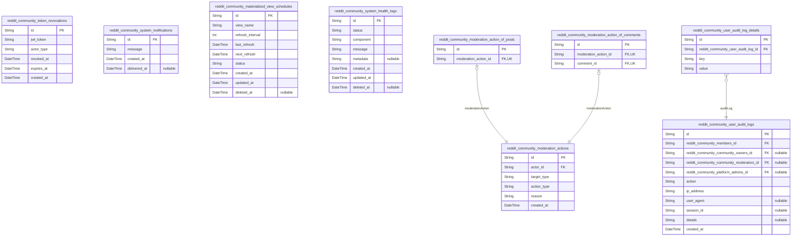
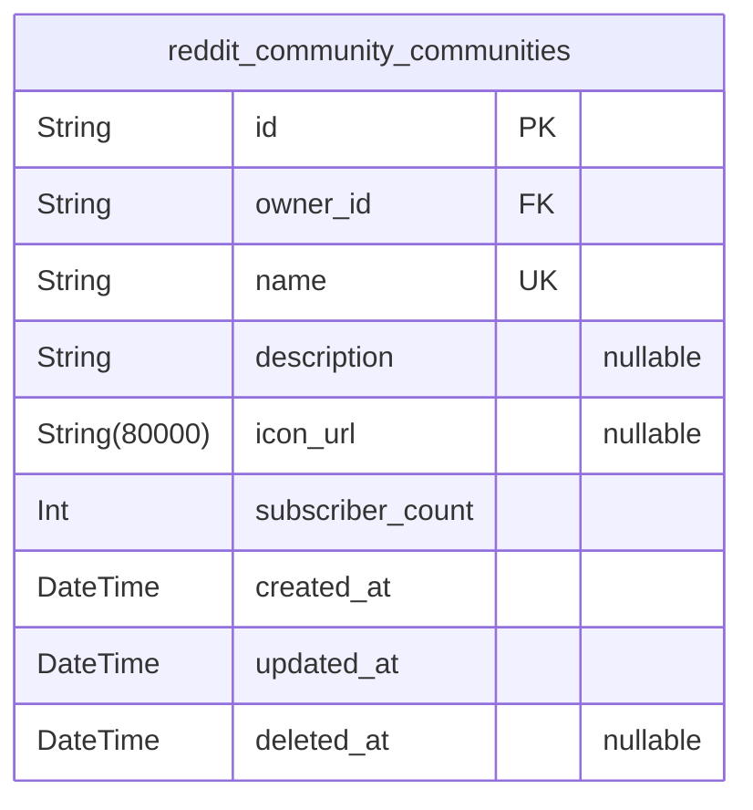
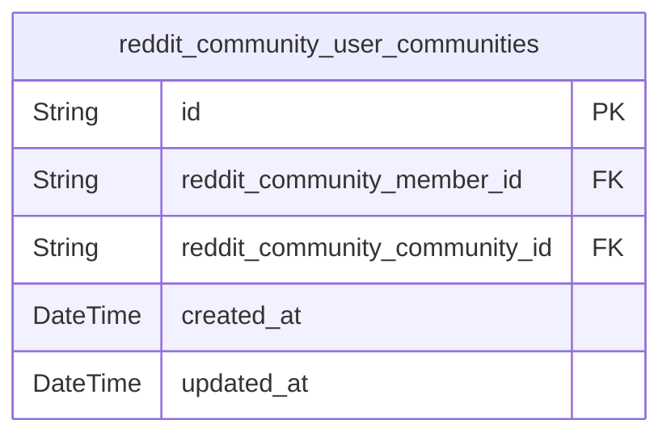
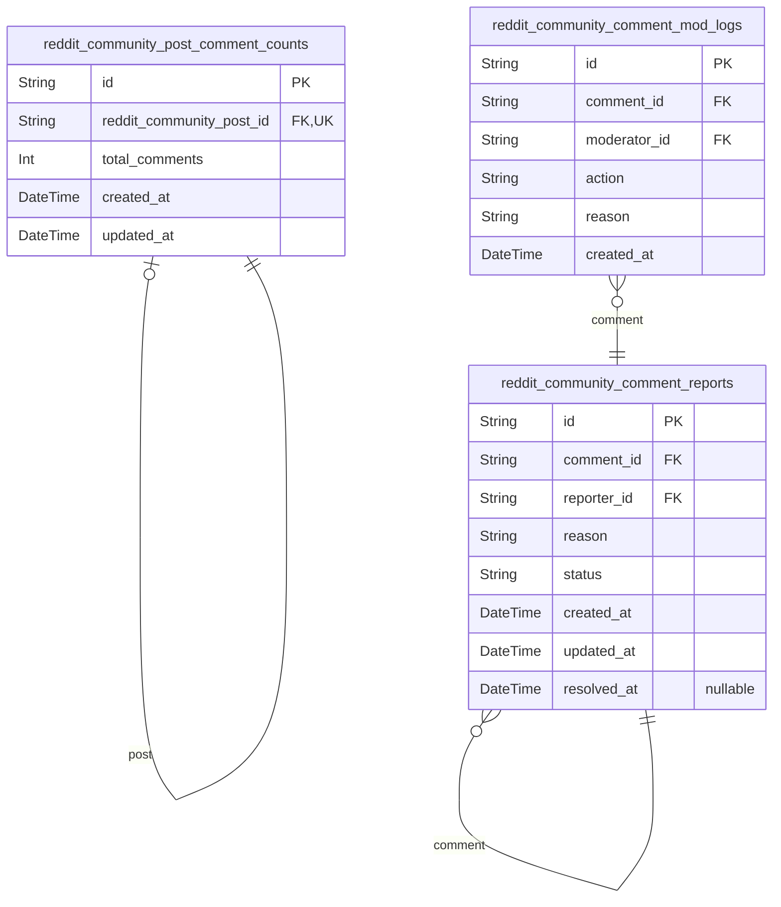
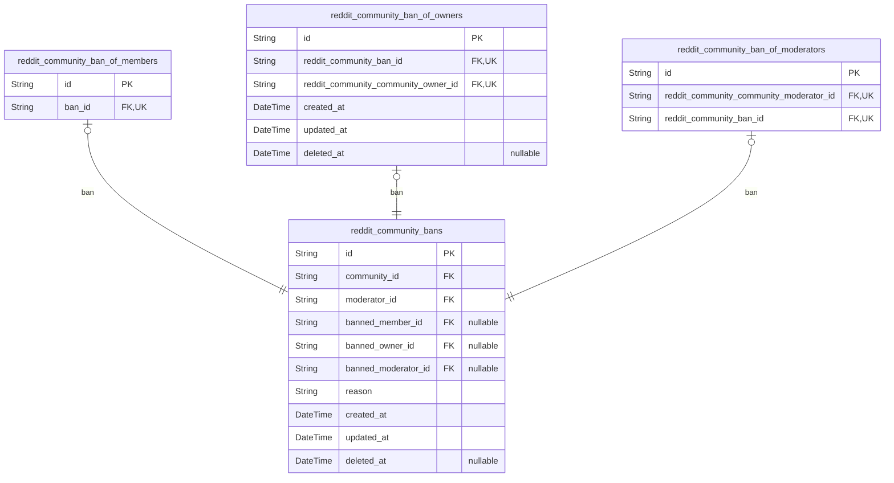
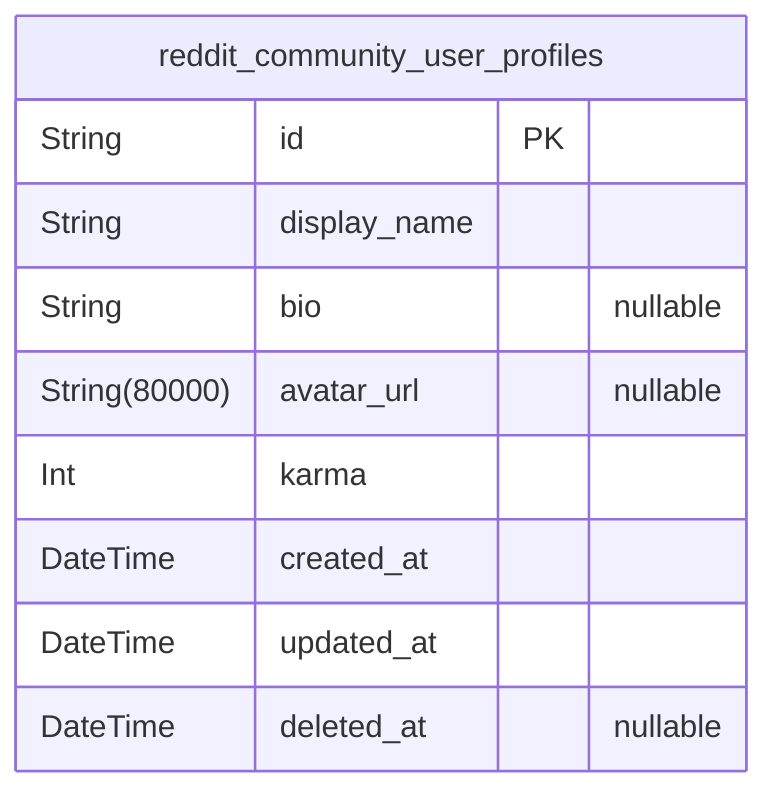

# Prisma Markdown

> Generated by [`prisma-markdown`](https://github.com/samchon/prisma-markdown)

- [Actors](#actors)
- [Systematic](#systematic)
- [Communities](#communities)
- [Subscriptions](#subscriptions)
- [Comments](#comments)
- [Moderation](#moderation)
- [Profile](#profile)

## Actors

```mermaid
erDiagram
"reddit_community_guests" {
  String id PK
  String device_fingerprint
  DateTime created_at
  DateTime updated_at
  DateTime deleted_at "nullable"
}
"reddit_community_guest_sessions" {
  String id PK
  String reddit_community_guest_id FK
  String ip
  String href
  String referrer "nullable"
  DateTime created_at
  DateTime expired_at
}
"reddit_community_members" {
  String id PK
  String email UK
  String password_hash
  String display_name UK
  String bio "nullable"
  String(80000) avatar_url "nullable"
  DateTime created_at
  DateTime updated_at
  DateTime deleted_at "nullable"
}
"reddit_community_member_sessions" {
  String id PK
  String reddit_community_member_id FK
  String access_token UK
  String refresh_token
  String ip
  String(80000) href
  String(80000) referrer "nullable"
  DateTime created_at
  DateTime expired_at
}
"reddit_community_member_password_resets" {
  String id PK
  String member_id FK
  String token UK
  DateTime expires_at
  DateTime created_at
  DateTime deleted_at "nullable"
}
"reddit_community_member_email_verifications" {
  String id PK
  String reddit_community_member_id FK
  String token UK
  String status
  DateTime expires_at
  DateTime created_at
  DateTime updated_at
  DateTime deleted_at "nullable"
}
"reddit_community_community_owners" {
  String id PK
  String email UK
  String password_hash
  String display_name
  String bio "nullable"
  String(80000) avatar_url "nullable"
  DateTime created_at
  DateTime updated_at
  DateTime deleted_at "nullable"
}
"reddit_community_community_owner_sessions" {
  String id PK
  String reddit_community_community_owner_id FK
  String ip
  String href
  String referrer "nullable"
  DateTime created_at
  DateTime expired_at
}
"reddit_community_community_owner_password_resets" {
  String id PK
  String reddit_community_community_owner_id FK
  String token UK
  DateTime expires_at
  DateTime created_at
}
"reddit_community_community_owner_email_verifications" {
  String id PK
  String reddit_community_community_owner_id FK
  String token UK
  DateTime expires_at
  DateTime created_at
  DateTime verified_at "nullable"
}
"reddit_community_community_moderators" {
  String id PK
  String email UK
  String password_hash
  String display_name
  String bio "nullable"
  String(80000) avatar_url "nullable"
  DateTime created_at
  DateTime updated_at
  DateTime deleted_at "nullable"
}
"reddit_community_community_moderator_sessions" {
  String id PK
  String community_moderator_id FK
  String ip
  String href
  String referrer
  DateTime created_at
  DateTime expired_at
}
"reddit_community_community_moderator_password_resets" {
  String id PK
  String reddit_community_community_moderator_id FK,UK
  String token
  DateTime created_at
  DateTime expired_at
}
"reddit_community_community_moderator_email_verifications" {
  String id PK
  String community_moderator_id FK
  String token UK
  DateTime expires_at
  DateTime created_at
  DateTime updated_at
  DateTime deleted_at "nullable"
}
"reddit_community_platform_admins" {
  String id PK
  String email UK
  String password_hash
  String display_name UK
  String bio "nullable"
  String(80000) avatar_url "nullable"
  Int karma
  DateTime created_at
  DateTime updated_at
  DateTime deleted_at "nullable"
}
"reddit_community_platform_admin_sessions" {
  String id PK
  String platform_admin_id FK
  String ip
  String href
  String referrer
  DateTime created_at
  DateTime expired_at
}
"reddit_community_platform_admin_password_resets" {
  String id PK
  String platform_admin_id FK
  String token UK
  DateTime expires_at
  DateTime created_at
}
"reddit_community_platform_admin_email_verifications" {
  String id PK
  String platform_admin_id FK
  String token UK
  DateTime expires_at
  DateTime created_at
  DateTime updated_at
  Boolean is_used
}
"reddit_community_guest_sessions" }o--|| "reddit_community_guests" : guest
"reddit_community_member_sessions" }o--|| "reddit_community_members" : member
"reddit_community_member_password_resets" }o--|| "reddit_community_members" : member
"reddit_community_member_email_verifications" }o--|| "reddit_community_members" : member
"reddit_community_community_owner_sessions" }o--|| "reddit_community_community_owners" : owner
"reddit_community_community_owner_password_resets" }o--|| "reddit_community_community_owners" : owner
"reddit_community_community_owner_email_verifications" }o--|| "reddit_community_community_owners" : owner
"reddit_community_community_moderator_sessions" }o--|| "reddit_community_community_moderators" : communityModerator
"reddit_community_community_moderator_password_resets" |o--|| "reddit_community_community_moderators" : moderator
"reddit_community_community_moderator_email_verifications" }o--|| "reddit_community_community_moderators" : communityModerator
"reddit_community_platform_admin_sessions" }o--|| "reddit_community_platform_admins" : platformAdmin
"reddit_community_platform_admin_password_resets" }o--|| "reddit_community_platform_admins" : platformAdmin
"reddit_community_platform_admin_email_verifications" }o--|| "reddit_community_platform_admins" : admin
```

### `reddit_community_guests`

Temporary guest accounts identified by device fingerprint and session
token. Guests are anonymous users who do not authenticate with email or
password. Each guest is uniquely identified by a device fingerprint to
maintain session continuity. This entity has no relationships with other
tables, as guests cannot create posts, comments, or subscribe to
communities. The table is purely for session tracking and is not subject
to user management or data modification beyond deletion.

Properties as follows:

- `id`: Primary Key.
- `device_fingerprint`
  > Unique identifier for the guest's device or browser session. Used to
  > maintain continuity across requests without authentication.
- `created_at`: Timestamp when the guest account was first created.
- `updated_at`: Timestamp of the last update to the guest session.
- `deleted_at`
  > Timestamp when this guest session was terminated. Null indicates an
  > active session.

### `reddit_community_guest_sessions`

Temporary JWT sessions for guest users for anonymous browsing. Tracks
connection context and lifecycle for unauthenticated visitors. Sessions
are created on first visit and expire automatically after inactivity.
References the guest actor via guest_id. This table is append-only and
managed by the authentication service, not direct user interaction.

Properties as follows:

- `id`: Primary Key.
- `reddit_community_guest_id`
  > The guest actor this session belongs to. {@link
  > reddit_community_guests.id}.
- `ip`: Client's IP address when the session was initiated.
- `href`: Full URL of the page visited when session started.
- `referrer`: Referrer URL that led user to the site, if available.
- `created_at`: Timestamp when the session was created.
- `expired_at`: Timestamp when the session is considered expired and will be cleaned up.

### `reddit_community_members`

Registered member accounts with email, password hash, and profile fields.
Represents a core actor type that can authenticate, create posts and
comments, subscribe to communities, and accumulate karma. All profile
display data (display_name, bio, avatar_url) is embedded here for
efficient viewing. Authenticated via email/password and session tokens
stored in separate reddit_community_member_sessions. Karma is calculated
dynamically from votes in reddit_community_post_votes and
reddit_community_comment_votes and is not stored here.

This table is the canonical identity record for registered members. It is
referenced by:
- reddit_community_member_sessions (1:N)
- reddit_community_member_password_resets (1:N)
- reddit_community_member_email_verifications (1:N)
- reddit_community_posts (N:1, via member_id)
- reddit_community_comments (N:1, via member_id)
- reddit_community_post_votes (N:1, via member_id)
- reddit_community_comment_votes (N:1, via member_id)
- reddit_community_bans (N:1, via banned_member_id)
- reddit_community_reporteds (N:1, via reporter_id)

Karma is NOT stored as a field—it is computed from aggregate votes via
view or query to maintain data integrity and avoid inconsistent state.

Properties as follows:

- `id`: Primary Key.
- `email`
  > Unique email address for login and communication. Must be verified before
  > account activation.
- `password_hash`: Hashed password using bcrypt or equivalent. Never stored in plaintext.
- `display_name`
  > Public-facing username displayed on profiles, posts, and comments. Must
  > be unique across the platform.
- `bio`
  > Optional biography or self-description shown on user profile. Can be up
  > to 500 characters.
- `avatar_url`
  > URL pointing to user's avatar image. Stored as a public URI (e.g., CDN
  > link).
- `created_at`: Timestamp when the member account was created.
- `updated_at`: Timestamp of the last profile update (display_name, bio, avatar_url).
- `deleted_at`
  > Soft delete timestamp. If null, account is active. Non-null indicates
  > account was deleted by user or admin.

### `reddit_community_member_sessions`

JWT session tokens for member authentication with access and refresh
tokens. Tracks active login sessions for reddit_community_members. Each
session is uniquely identified by access_token and bound to a single
member. Session records are purged on logout or expiration. Used for
stateless authentication and session-based access control.

Properties as follows:

- `id`: Primary Key.
- `reddit_community_member_id`
  > Reference to the member who owns this session. {@link
  > reddit_community_members.id}.
- `access_token`
  > JWT access token used for API authentication. Must be unique per session
  > for security.
- `refresh_token`
  > JWT refresh token used to obtain new access tokens. Stored securely and
  > rotated on use.
- `ip`
  > IP address from which the session was initiated. Used for security
  > monitoring.
- `href`: The full URL of the page from which the login request originated.
- `referrer`: Referrer URL from which the user navigated to the login page.
- `created_at`: Timestamp when the session was created and token issued.
- `expired_at`
  > Timestamp when the session expires. Session is considered invalid after
  > this point.

### `reddit_community_member_password_resets`

Password reset tokens for reddit_community_members. Each token is a
unique, single-use cryptographic string issued when a member requests a
password reset. The token is valid only until expires_at. After
successful password reset or expiration, the token is soft-deleted via
deleted_at. This table contains no calculated fields and strictly follows
3NF: all data is atomic and semantically tied to the member and token
lifespan.

This table is referenced by the authentication service during the
password reset flow. For security, tokens are never displayed to users
and are only used server-side to authenticate the reset request.

Related to: [reddit_community_members.id](#reddit_community_members)

Properties as follows:

- `id`: Primary Key.
- `member_id`
  > The member who requested the password reset. {@link
  > reddit_community_members.id}.
- `token`
  > Unique, random, cryptographically secure token string for password reset.
  > Must be single-use and immutable once issued.
- `expires_at`
  > Absolute timestamp after which the password reset token is no longer
  > valid. Must be at least 1 hour after created_at, typically 24 hours.
- `created_at`: Timestamp when the reset token was generated and sent to the user.
- `deleted_at`
  > Optional timestamp indicating when the token was revoked or successfully
  > used. Allows audit history and prevents reuse. If null, token is still
  > active.

### `reddit_community_member_email_verifications`

Email verification tokens issued to new reddit_community_members during
registration. Tokens expire after a fixed duration and are used to
validate email ownership. Each token is associated with exactly one
member account. Once verified, expired, or revoked, the token record is
eligible for cleanup.

Properties as follows:

- `id`: Primary Key.
- `reddit_community_member_id`
  > References the member account this verification token belongs to. {@link
  > reddit_community_members.id}.
- `token`: Unique, random, URL-safe verification token string.
- `status`
  > Current status of the verification token. Values: 'pending', 'verified',
  > 'expired', 'revoked'.
- `expires_at`: When this token will expire. Must be checked before verification.
- `created_at`: Timestamp when this verification request was created.
- `updated_at`: Timestamp when this token was last updated (ex: when status changed).
- `deleted_at`: Soft delete timestamp. When null, record is active.

### `reddit_community_community_owners`

Actor entity representing users who own a community. Has dedicated
authentication credentials (email, password_hash) and owns one or more
communities. Profile fields (display_name, bio, avatar_url) are stored
here for display purposes. This is not a profile aggregation point —
karma and content lists are maintained in the Profile component. {@link
reddit_community_communities} references this table via owner_id.

Properties as follows:

- `id`: Primary Key.
- `email`: Unique email address used for authentication and login.
- `password_hash`: Cryptographically hashed password for secure authentication.
- `display_name`: User-selected public display name shown on profiles and posts.
- `bio`: Optional short biography or description of the owner.
- `avatar_url`: URL to the owner's profile avatar image.
- `created_at`: Timestamp when this owner account was created.
- `updated_at`: Timestamp of the last update to this record.
- `deleted_at`
  > Soft delete timestamp. Null means active. When set, the profile and
  > access are revoked.

### `reddit_community_community_owner_sessions`

JWT session tokens for community owner authentication with access and
refresh tokens. This table tracks login events, IP, and session context
for security auditing. Sessions are append-only and automatically expire.
Parent relationship: Each session belongs to one and only one community
owner via reddit_community_community_owners. Access tokens and refresh
tokens are not stored here — they are handled by the API layer. This
table's only responsibility is to record session context and enforce
expiration.

Properties as follows:

- `id`: Primary Key.
- `reddit_community_community_owner_id`
  > The community owner this session belongs to. {@link
  > reddit_community_community_owners.id}.
- `ip`: Client IP address of the login session.
- `href`: URL of the initial request during login.
- `referrer`: Referrer URL from which the user arrived at login.
- `created_at`: Timestamp of when this session was created.
- `expired_at`
  > Timestamp when this session expires. Automatically enforced during
  > authentication validation.

### `reddit_community_community_owner_password_resets`

Password reset tokens for community owners. Temporary tokens used to
allow owners to reset their password via email. Tokens expire after a set
period for security. References the owner account in
reddit_community_community_owners. Purged automatically after expiration.

Properties as follows:

- `id`: Primary Key.
- `reddit_community_community_owner_id`
  > The community owner account this password reset is associated with.
  > [reddit_community_community_owners.id](#reddit_community_community_owners).
- `token`
  > Unique, randomly generated token used to reset password. Must be
  > cryptographically secure. Stored as plaintext for lookup - hashed in
  > application layer.
- `expires_at`
  > The moment after which this token is no longer valid. Ensures tokens are
  > not persistent security risks.
- `created_at`: When this password reset request was generated.

### `reddit_community_community_owner_email_verifications`

Email verification tokens for new community owner registration. This
subsidiary table holds temporary, one-time use tokens that must be
validated before an owner account is fully activated. Once verified, the
token is no longer valid. Linked to reddit_community_community_owners via
foreign key and expires after a set time period.

Used only during onboarding to verify ownership of the email address
during community owner registration. Not used for password reset or other
purposes.

Properties as follows:

- `id`: Primary Key.
- `reddit_community_community_owner_id`
  > References the community owner being verified. {@link
  > reddit_community_community_owners.id}.
- `token`
  > Unique hashed verification token sent to the user's email. Must be
  > URL-safe and unique.
- `expires_at`: Timestamp when this token expires and becomes invalid.
- `created_at`: Timestamp when this verification request was generated.
- `verified_at`: Timestamp when the token was successfully verified. NULL until verified.

### `reddit_community_community_moderators`

Community moderator accounts with email, password hash, and profile
fields. These users are assigned moderation privileges within specific
communities by owners. They can delete posts/comments, ban/unban users,
and handle reports, but cannot remove community owners or other
moderators.

This model is an actor-type entity that requires authentication.
Moderators are linked to communities through the
reddit_community_moderators junction table (handled in other component).

Properties as follows:

- `id`: Primary Key.
- `email`: Unique email address used for login and communication.
- `password_hash`: Hashed password for authentication.
- `display_name`: Public-facing name displayed on posts and comments.
- `bio`: Optional biography or profile description.
- `avatar_url`: URL to the user's profile avatar image.
- `created_at`: Timestamp when the moderator account was created.
- `updated_at`: Timestamp of the last profile update.
- `deleted_at`: Timestamp when the account was soft-deleted (null if active).

### `reddit_community_community_moderator_sessions`

JWT session tokens for community moderator authentication with access and
refresh tokens. Tracks login events for community moderators, storing
connection metadata for security auditing. Immutable audit trail of
session creation and expiration.

Properties as follows:

- `id`: Primary Key.
- `community_moderator_id`
  > References the community moderator who owns this session. {@link
  > reddit_community_community_moderators.id}.
- `ip`: Client IP address from which the session was initiated.
- `href`: Full URL path of the request that initiated this session.
- `referrer`: Referrer URL that led the user to initiate the session.
- `created_at`: Timestamp when this session was created. Immutable.
- `expired_at`: Timestamp when this session expires. Not null for security compliance.

### `reddit_community_community_moderator_password_resets`

Temporary password reset tokens for community moderators. Each token is
valid for a single reset request and expires after a time window. Records
are created when a moderator initiates password reset and are deleted
after use or expiration. Each reset is associated with exactly one
community moderator via foreign key. Only one active reset token per
moderator is allowed at any time (enforced by unique index on
moderator_id).

Properties as follows:

- `id`: Primary Key.
- `reddit_community_community_moderator_id`
  > The community moderator who requested this password reset. {@link
  > reddit_community_community_moderators.id}.
- `token`
  > Unique, cryptographically secure reset token generated for this request.
  > Used to validate the password reset link.
- `created_at`: Timestamp when the reset request was initiated.
- `expired_at`
  > Timestamp when this reset token expires and becomes invalid. After this
  > time, the token cannot be used for reset.

### `reddit_community_community_moderator_email_verifications`

Email verification tokens issued during community moderator registration.
Used to validate ownership of email address before account activation.
Tied to community_moderator actor entity.

Properties as follows:

- `id`: Primary Key.
- `community_moderator_id`
  > The community moderator who owns this verification token. {@link
  > reddit_community_community_moderators.id}.
- `token`: Unique token string issued for email verification.
- `expires_at`
  > Expiration timestamp for the verification token. Token is invalid after
  > this time.
- `created_at`: Timestamp when the verification token was generated.
- `updated_at`: Timestamp of the last update to this record.
- `deleted_at`: Soft delete timestamp. If null, record is active.

### `reddit_community_platform_admins`

Platform admin accounts with email, password hash, and profile fields.
These users have system-wide authority to manage all communities, users,
and content. They can override local moderation decisions, handle
platform-wide violations, and manage system settings. Not associated with
any specific community. Profile fields are stored here for immediate
auth-layer access (karma is aggregated from votes and mirrored here from
user_profiles table for performance).

Properties as follows:

- `id`: Primary Key.
- `email`: Unique email address used for login and communication.
- `password_hash`: BCrypt-hashed password for authentication. Never stored in plaintext.
- `display_name`: Publicly visible name of the platform admin for display in UIs and logs.
- `bio`
  > Optional short description or note about the admin, displayed on profile
  > pages.
- `avatar_url`
  > URL to the admin's avatar image. Must be a valid, externally accessible
  > URI.
- `karma`
  > Total karma score of the platform admin, aggregated from all votes on
  > their content. Can be negative. Mirrored from
  > reddit_community_user_profiles for efficient display in auth context.
- `created_at`: Timestamp when the admin account was created.
- `updated_at`: Last timestamp when the admin account was modified (e.g., profile update).
- `deleted_at`
  > Soft delete timestamp. If null, account is active. If set, account is
  > deactivated and inaccessible.

### `reddit_community_platform_admin_sessions`

JWT session tokens for platform admin authentication with access and
refresh tokens. Tracks login events for platform admins as an append-only
audit trail. Each session represents a single authentication from a
client device with connection context (IP, referrer, URL). Sessions
expire automatically and are removed via token revocation.

Properties as follows:

- `id`: Primary Key.
- `platform_admin_id`
  > Platform admin this session belongs to. {@link
  > reddit_community_platform_admins.id}.
- `ip`: IP address of the client device during login.
- `href`: Full URL of the page requested during authentication.
- `referrer`
  > Referrer URL that led to this authentication request (e.g., login page
  > from community feed).
- `created_at`: Timestamp when this session was issued.
- `expired_at`
  > Timestamp when this session expires and becomes invalid. Enforced by
  > system security policy.

### `reddit_community_platform_admin_password_resets`

Stores temporary password reset tokens for platform admins. Each token is
single-use, expires after a fixed window, and links to a specific admin
user. This table enables secure password recovery without storing
passwords in plaintext. When a platform admin requests a password reset,
a new record is created with a cryptographically random token. The token
is invalidated after use or expiration. This table is strictly a
session-state entity and is not a business entity.

Properties as follows:

- `id`: Primary Key.
- `platform_admin_id`
  > The platform admin who requested the password reset. References {@link
  > reddit_community_platform_admins.id}.
- `token`
  > The cryptographically random, single-use reset token. Must be hashed
  > before storage.
- `expires_at`
  > The absolute timestamp when the reset token expires and becomes invalid.
  > Must be set to 24 hours from creation.
- `created_at`
  > The timestamp when the reset token was generated. Used for audit and
  > expiration tracking.

### `reddit_community_platform_admin_email_verifications`

Email verification tokens for new platform admin registration. Used to
verify ownership of the email address during account creation. Each token
is single-use and expires after a set period. Linked to a specific
platform admin via foreign key.

Properties as follows:

- `id`: Primary Key.
- `platform_admin_id`
  > The platform admin who requested this email verification. {@link
  > reddit_community_platform_admins.id}.
- `token`
  > Unique, randomly generated verification token sent via email. Must be
  > unique across all platforms.
- `expires_at`: Timestamp when this verification token expires. Must be in the future.
- `created_at`: Timestamp when this verification record was created.
- `updated_at`: Timestamp when this verification record was last updated.
- `is_used`
  > Marked true when this token has been successfully used to verify the
  > email. Prevents reuse.

## Systematic

```mermaid
erDiagram
"reddit_community_moderation_actions" {
  String id PK
  String actor_id FK
  String target_type
  String action_type
  String reason
  DateTime created_at
}
"reddit_community_token_revocations" {
  String id PK
  String jwt_token
  String actor_type
  DateTime revoked_at
  DateTime expires_at
  DateTime created_at
}
"reddit_community_user_audit_logs" {
  String id PK
  String reddit_community_members_id FK
  String reddit_community_community_owners_id FK "nullable"
  String reddit_community_community_moderators_id FK "nullable"
  String reddit_community_platform_admins_id FK "nullable"
  String action
  String ip_address
  String user_agent "nullable"
  String session_id "nullable"
  String details "nullable"
  DateTime created_at
}
"reddit_community_system_notifications" {
  String id PK
  String message
  DateTime created_at
  DateTime delivered_at "nullable"
}
"reddit_community_materialized_view_schedules" {
  String id PK
  String view_name
  Int refresh_interval
  DateTime last_refresh
  DateTime next_refresh
  String status
  DateTime created_at
  DateTime updated_at
  DateTime deleted_at "nullable"
}
"reddit_community_system_health_logs" {
  String id PK
  String status
  String component
  String message
  String metadata "nullable"
  DateTime created_at
  DateTime updated_at
  DateTime deleted_at "nullable"
}
"reddit_community_moderation_action_of_posts" {
  String id PK
  String moderation_action_id FK,UK
}
"reddit_community_moderation_action_of_comments" {
  String id PK
  String moderation_action_id FK,UK
  String comment_id FK,UK
}
"reddit_community_user_audit_log_details" {
  String id PK
  String reddit_community_user_audit_log_id FK
  String key
  String value
}
"reddit_community_moderation_action_of_posts" |o--|| "reddit_community_moderation_actions" : moderationAction
"reddit_community_moderation_action_of_comments" |o--|| "reddit_community_moderation_actions" : moderationAction
"reddit_community_user_audit_log_details" }o--|| "reddit_community_user_audit_logs" : auditLog
```

### `reddit_community_moderation_actions`

Audit log for all moderation actions across the platform. Records every
delete, ban, approve, or dismiss action triggered by moderators or
admins, including the actor who performed it, the target content (post or
comment), the reason (as provided), and timestamps. This is an immutable
history for compliance and accountability. Never deleted. Acts as a
source of truth for moderator activity reports.

References:
- Actor: linked to actor session tables (e.g.,
reddit_community_member_sessions)
- Target: linked to either reddit_community_posts or
reddit_community_comments based on target_type

Properties as follows:

- `id`: Primary Key.
- `actor_id`
  > ID of the moderator/admin who performed this action. References the
  > actor's session table (e.g., reddit_community_member_sessions). {@link
  > reddit_community_member_sessions.id}
- `target_type`
  > Type of the target content: 'post' or 'comment'. Used to determine which
  > target subtype table target_id references.
- `action_type`
  > Type of moderation action performed: 'delete', 'ban', 'approve', or
  > 'dismiss'.
- `reason`
  > The reason provided by the moderator for taking this action. Free text,
  > up to 500 characters.
- `created_at`: Timestamp when the moderation action was performed. Always set by system.

### `reddit_community_token_revocations`

Records revoked JWT access tokens to prevent reuse after logout or
password change. Each revocation is an append-only audit record with
exact revocation time and token expiration time. Used during
authentication to validate that a presented token has not been revoked.
Does not store private key material - only opaque token hashes. Actor
type is recorded for correlation but not enforced as foreign key to avoid
tight coupling with actor tables.

Properties as follows:

- `id`: Primary Key.
- `jwt_token`
  > Opaque hashed representation of the JWT token string. Used for lookup
  > during authentication validation.
- `actor_type`
  > The actor type (e.g., 'member', 'community_owner', 'platform_admin') that
  > owned this token. Helps correlate revoke events with actor tables.
- `revoked_at`
  > Exact timestamp when this JWT was revoked via logout, password change, or
  > admin action. Non-null for security.
- `expires_at`
  > Original expiration timestamp of the JWT token when first issued. Used to
  > validate token lifespan even after revocation.
- `created_at`
  > Timestamp when this revocation record was created in the system. Always
  > equal to or before revoked_at.

### `reddit_community_user_audit_logs`

Maintains audit trail of user actions for compliance: login, logout,
password change, account deletion. Records the actor (user), action type,
timestamp, IP address, and contextual metadata for all security-relevant
user operations. The 'details' field is a legacy JSON field for backward
compatibility and should be phased out in favor of the normalized
reddit_community_user_audit_log_details table.

Properties as follows:

- `id`: Primary Key.
- `reddit_community_members_id`
  > Reference to the member who performed the action. {@link
  > reddit_community_members.id}.
- `reddit_community_community_owners_id`
  > Reference to the community owner who performed the action. {@link
  > reddit_community_community_owners.id}. Nullable because not all audit
  > events originate from owners.
- `reddit_community_community_moderators_id`
  > Reference to the community moderator who performed the action. {@link
  > reddit_community_community_moderators.id}. Nullable because not all audit
  > events originate from moderators.
- `reddit_community_platform_admins_id`
  > Reference to the platform admin who performed the action. {@link
  > reddit_community_platform_admins.id}. Nullable because not all audit
  > events originate from admins.
- `action`
  > Type of user action performed. Valid values: 'login', 'logout',
  > 'password_change', 'account_deletion'.
- `ip_address`: The IP address from which the action was initiated.
- `user_agent`
  > The browser or client user agent string of the device performing the
  > action.
- `session_id`
  > The session identifier associated with the action (e.g., JWT token hash
  > or session ID).
- `details`
  > LEGACY FIELD: JSON-formatted string containing additional context (e.g.,
  > old/new password hash, device type, geographic location). To be phased
  > out in favor of normalized detail records in
  > reddit_community_user_audit_log_details.
- `created_at`: Timestamp when the audit event was recorded.

### `reddit_community_system_notifications`

Tracks all platform-wide system notifications, such as password change
confirmations and account deletion warnings. This is an append-only audit
trail generated by system events, not user actions. Represents the
system's communication to users about critical account or platform
changes.

Properties as follows:

- `id`: Primary Key.
- `message`
  > The notification message content shown to users. Examples: "Your password
  > has been successfully changed." or "Your account has been deleted
  > permanently."
- `created_at`: Timestamp when this notification was generated by the system.
- `delivered_at`
  > Timestamp when this notification was successfully delivered to all users.
  > Null means delivery failed or is pending. Used for retry logic and
  > delivery monitoring.

### `reddit_community_materialized_view_schedules`

Stores metadata for refreshing materialized views in the reporting
system. Tracks which view needs refresh, how often, when it was last
refreshed, and when it is scheduled for the next refresh. Used internally
by the system to automate materialized view maintenance and ensure timely
aggregation updates for feeds and karma calculations. Not directly
accessed by users or APIs.

Properties as follows:

- `id`: Primary Key.
- `view_name`: Name of the materialized view to refresh (e.g., mv_post_karma_scores).
- `refresh_interval`: Interval in seconds between automatic refreshes (e.g., 300 for 5 minutes).
- `last_refresh`: Timestamp of the last successful materialized view refresh.
- `next_refresh`: Timestamp when the next refresh is scheduled to occur.
- `status`: Current status: 'scheduled', 'running', 'completed', or 'failed'.
- `created_at`: When this schedule record was created.
- `updated_at`: When this schedule record was last updated.
- `deleted_at`: Soft delete timestamp for archival (never used in practice).

### `reddit_community_system_health_logs`

Logs system health and status changes (e.g., database connection
failures, cache invalidation). This is a system-level audit table for
infrastructure monitoring, not user or content interaction. Records
technical events to support incident response and system reliability
analysis.

Properties as follows:

- `id`: Primary Key.
- `status`: Status level of the event (e.g., 'error', 'warning', 'info', 'critical').
- `component`
  > System component that triggered the log (e.g., 'database', 'redis',
  > 'api_gateway', 'cache').
- `message`
  > Detailed human-readable description of the event (e.g., 'Failed to
  > connect to PostgreSQL. Retry 3/5').
- `metadata`
  > Optional structured details in JSON string format (e.g., error stack,
  > connection timeout, server ID). Field is nullable to allow flexible
  > logging without requiring complex schema changes. Not intended for
  > querying; use for post-mortem analysis only.
- `created_at`: ISO timestamp when the log entry was created.
- `updated_at`
  > ISO timestamp when the log entry was last updated (e.g., by a retry or
  > status override).
- `deleted_at`: Soft delete timestamp for archival purposes. Null if not deleted.

### `reddit_community_moderation_action_of_posts`

Subtype table for moderation actions specifically targeting posts.
Ensures referential integrity by having a unique foreign key to
reddit_community_moderation_actions and a reference to the post being
moderated via the parent row. This prevents polymorphic foreign keys by
splitting subtype targets into separate tables. Each row represents
exactly one moderation action on a post.

Properties as follows:

- `id`: Primary Key.
- `moderation_action_id`
  > Unique reference to the parent moderation action. {@link
  > reddit_community_moderation_actions.id}.

### `reddit_community_moderation_action_of_comments`

Subtype table for moderation actions specifically targeting comments.
Ensures referential integrity by explicitly linking one moderation_action
to one comment. Prevents polymorphic foreign keys in the parent
reddit_community_moderation_actions table. Each record represents a
single comment being moderated by a specific action. Owned and managed
strictly through the parent moderation_action table; no direct user
interaction.

Properties as follows:

- `id`: Primary Key.
- `moderation_action_id`
  > Reference to the parent moderation action. {@link
  > reddit_community_moderation_actions.id}.
- `comment_id`: The comment being moderated. [reddit_community_comment_reports.id](#reddit_community_comment_reports).

### `reddit_community_user_audit_log_details`

Normalized key-value store for audit log metadata details. Each record
maps a key (e.g., 'device_type', 'location', 'old_password_hash') to a
value. Links to the parent audit log entry via foreign key. Enables
efficient querying and filtering on audit metadata without JSON parsing.
This table is always accessed through its parent
reddit_community_user_audit_logs.

Properties as follows:

- `id`: Primary Key.
- `reddit_community_user_audit_log_id`
  > References the parent audit log entry. {@link
  > reddit_community_user_audit_logs.id}
- `key`
  > The metadata key identifier. Examples: 'device_type', 'location',
  > 'old_password_hash'.
- `value`
  > The metadata value associated with the key. Can be any string
  > representation (e.g., 'iPhone', 'New York', 'abc123').

## Communities

```mermaid
erDiagram
"reddit_community_communities" {
  String id PK
  String owner_id FK
  String name UK
  String description "nullable"
  String(80000) icon_url "nullable"
  Int subscriber_count
  DateTime created_at
  DateTime updated_at
  DateTime deleted_at "nullable"
}
```

### `reddit_community_communities`

Represents user-created communities with unique names, descriptions,
icons, owners (user_id), and subscriber counts. Serves as the root
container for all posts and comments within a community. Owner is a
foreign key to the actor system. Communities are independently created by
actors and can be joined by subscription. Searchable by name and
description. Subscriber count is maintained for display efficiency.

Properties as follows:

- `id`: Primary Key.
- `owner_id`
  > The actor who created and owns this community. {@link
  > reddit_community_community_owners.id}.
- `name`
  > Unique, human-readable name of the community. Used for discovery and URL
  > routing. Must be unique across platform.
- `description`
  > Optional markdown-formatted description of the community's purpose and
  > rules.
- `icon_url`: URL to the community's icon image. Can be null if no icon is set.
- `subscriber_count`
  > Current count of users subscribed to this community. Maintained for
  > display efficiency; updated on subscribe/unsubscribe.
- `created_at`: Timestamp when the community was created.
- `updated_at`
  > Timestamp when the community was last updated (e.g., name, description,
  > icon changed).
- `deleted_at`
  > Soft delete timestamp. If not null, community is considered deleted and
  > hidden from all public views.

## Subscriptions

```mermaid
erDiagram
"reddit_community_user_communities" {
  String id PK
  String reddit_community_member_id FK
  String reddit_community_community_id FK
  DateTime created_at
  DateTime updated_at
}
```

### `reddit_community_user_communities`

Records of which users are subscribed to which communities. A record
exists if and only if the user is subscribed and has not unsubscribed.
Used to enforce access control: users can only create posts in
communities they are subscribed to. Subscribers are calculated by
counting records per community.

Properties as follows:

- `id`: Primary Key.
- `reddit_community_member_id`
  > References the member user who subscribed. {@link
  > reddit_community_members.id}.
- `reddit_community_community_id`
  > References the community the user subscribed to. {@link
  > reddit_community_communities.id}.
- `created_at`: Timestamp when the subscription was created.
- `updated_at`
  > Timestamp when the subscription was last updated (currently same as
  > created_at).

## Comments

```mermaid
erDiagram
"reddit_community_comment_reports" {
  String id PK
  String comment_id FK
  String reporter_id FK
  String reason
  String status
  DateTime created_at
  DateTime updated_at
  DateTime resolved_at "nullable"
}
"reddit_community_post_comment_counts" {
  String id PK
  String reddit_community_post_id FK,UK
  Int total_comments
  DateTime created_at
  DateTime updated_at
}
"reddit_community_comment_mod_logs" {
  String id PK
  String comment_id FK
  String moderator_id FK
  String action
  String reason
  DateTime created_at
}
"reddit_community_comment_reports" }o--|| "reddit_community_comment_reports" : comment
"reddit_community_post_comment_counts" |o--|| "reddit_community_post_comment_counts" : post
"reddit_community_comment_mod_logs" }o--|| "reddit_community_comment_reports" : comment
```

### `reddit_community_comment_reports`

Records user reports on comments with reason, status, and moderator
action. Used by moderators to review potentially violating content. Each
report is tied to a single comment and one reporter. The status field
tracks the state of the report (pending, approved, dismissed). This table
integrates with reddit_community_comment_mod_logs to provide full audit
trails of moderator actions.

Properties as follows:

- `id`: Primary Key.
- `comment_id`
  > The comment that was reported. {@link
  > reddit_community_comment_reports.id}.
- `reporter_id`
  > The user who submitted the report. [reddit_community_members.id](#reddit_community_members) or
  > [reddit_community_community_owners.id](#reddit_community_community_owners) or {@link
  > reddit_community_community_moderators.id} or {@link
  > reddit_community_guests.id}.
- `reason`
  > Text description provided by the reporter explaining why they reported
  > the comment. Limited to 500 characters.
- `status`
  > Current state of the report: 'pending' (awaiting review), 'approved'
  > (content removed), 'dismissed' (no action taken).
- `created_at`: Timestamp when the report was submitted by the user.
- `updated_at`: Timestamp when the report was last updated (e.g., status changed).
- `resolved_at`
  > Timestamp when this report was resolved (status changed to approved or
  > dismissed).

### `reddit_community_post_comment_counts`

Aggregate count of comments per post for efficient feed and post display.
This table exists solely as a performance optimization to avoid COUNT
queries on reddit_community_comment_reports during feed generation and
post detail views. The count is maintained in real-time as comments are
created or deleted.

Properties as follows:

- `id`: Primary Key.
- `reddit_community_post_id`
  > Reference to the post this count belongs to. {@link
  > reddit_community_post_comment_counts.id}.
- `total_comments`
  > Total number of comments associated with this post. Must be ≥ 0. Updated
  > every time a comment is created or deleted.
- `created_at`
  > Timestamp when this count was first calculated and stored. Always matches
  > the creation of the first comment on this post.
- `updated_at`
  > Timestamp when this count was last updated. Updated on every comment
  > create/delete. Always ≥ created_at.

### `reddit_community_comment_mod_logs`

Audit log of moderator actions (delete, hide) on comments with reason and
actor. Append-only record of all moderation events for compliance and
review. Never deleted or modified after creation. Tracks who performed an
action, what was done, why, and on which comment.

Properties as follows:

- `id`: Primary Key.
- `comment_id`
  > The comment that was moderated. {@link
  > reddit_community_comment_reports.id}.
- `moderator_id`
  > The moderator who performed the action. {@link
  > reddit_community_community_moderators.id}.
- `action`: Type of moderation action performed: 'delete' or 'hide'.
- `reason`
  > The reason provided by the moderator for the moderation action. Must be
  > non-empty.
- `created_at`
  > Timestamp when the moderation action was recorded. Always set to current
  > server time. Append-only; never updated.

## Moderation

```mermaid
erDiagram
"reddit_community_bans" {
  String id PK
  String community_id FK
  String moderator_id FK
  String banned_member_id FK "nullable"
  String banned_owner_id FK "nullable"
  String banned_moderator_id FK "nullable"
  String reason
  DateTime created_at
  DateTime updated_at
  DateTime deleted_at "nullable"
}
"reddit_community_ban_of_members" {
  String id PK
  String ban_id FK,UK
}
"reddit_community_ban_of_owners" {
  String id PK
  String reddit_community_ban_id FK,UK
  String reddit_community_community_owner_id FK,UK
  DateTime created_at
  DateTime updated_at
  DateTime deleted_at "nullable"
}
"reddit_community_ban_of_moderators" {
  String id PK
  String reddit_community_community_moderator_id FK,UK
  String reddit_community_ban_id FK,UK
}
"reddit_community_ban_of_members" |o--|| "reddit_community_bans" : ban
"reddit_community_ban_of_owners" |o--|| "reddit_community_bans" : ban
"reddit_community_ban_of_moderators" |o--|| "reddit_community_bans" : ban
```

### `reddit_community_bans`

Records when a user is banned from a community. Tracks the moderator who
imposed the ban, the reason (text), and effective dates. This table is
append-only — bans are not modified, only soft-deleted. Used for
moderation audit and access control. Never independently edited by users;
only via moderator actions via API. References actor tables (members,
owners, moderators) as the banned user and the banning moderator.

Properties as follows:

- `id`: Primary Key.
- `community_id`
  > The community from which the user was banned. {@link
  > reddit_community_communities.id}
- `moderator_id`
  > The actor (owner or moderator) who issued the ban. Must be an admin actor
  > (owner or moderator) of the community. {@link
  > reddit_community_community_owners.id} or {@link
  > reddit_community_community_moderators.id}
- `banned_member_id`: The member (actor) who was banned. [reddit_community_members.id](#reddit_community_members)
- `banned_owner_id`
  > The community owner (actor) who was banned. {@link
  > reddit_community_community_owners.id}
- `banned_moderator_id`
  > The community moderator (actor) who was banned. {@link
  > reddit_community_community_moderators.id}
- `reason`
  > The reason provided by the moderator for the ban. Free-form text.
  > Required for audit trail.
- `created_at`: Timestamp when the ban was issued. Immutable.
- `updated_at`: Timestamp when the record was last updated (e.g. reason edited).
- `deleted_at`
  > Timestamp when the ban was soft-deleted (if ever). Null means ban is
  > still active.

### `reddit_community_ban_of_members`

Subtype entity representing a ban applied specifically to a community
member. Links to reddit_community_bans as parent and
reddit_community_members as the target. This table enforces referential
integrity by limiting bans to only those users who are registered members
of a community. Ban actions are exclusively managed through the parent
reddit_community_bans table; this table exists solely to qualify the type
of user subject to the ban. Never modified directly by users. All
temporal and metadata fields are inherited from the parent.

Properties as follows:

- `id`
  > Primary key and foreign key to reddit_community_bans.id. Represents a 1:1
  > relationship — each ban on a member is uniquely identified by the parent
  > ban record.
- `ban_id`
  > Foreign key to the parent ban record in reddit_community_bans. This
  > establishes the 1:1 relationship. A single ban record in
  > reddit_community_bans may optionally have one corresponding memberban
  > record here, but never more than one. @\link reddit_community_bans.id

### `reddit_community_ban_of_owners`

Subtype table for bans applied to community owners. Links directly to
reddit_community_community_owners and shares common ban metadata
(created_at, updated_at, deleted_at) from parent reddit_community_bans
table. Enforces that only community owners can be banned via this
subtype, maintaining strict data integrity and polymorphic ownership
pattern. This table has no independent existence — it is always linked to
a parent reddit_community_bans record and never exists alone.

Properties as follows:

- `id`: Primary Key.
- `reddit_community_ban_id`
  > Belongs to the parent ban record in reddit_community_bans. Ensures
  > parent-child relationship (1:1). {\link reddit_community_bans.id}.
- `reddit_community_community_owner_id`
  > The community owner who is banned. Must be a valid owner in
  > reddit_community_community_owners. {\link
  > reddit_community_community_owners.id}.
- `created_at`: Timestamp when the ban was issued.
- `updated_at`: Timestamp when the ban record was last updated.
- `deleted_at`: Soft delete timestamp. If null, the ban is active.

### `reddit_community_ban_of_moderators`

Subtype table for bans applied to community moderators. Links directly to
reddit_community_community_moderators and shares common ban metadata from
parent reddit_community_bans. This table ensures type safety and
referential integrity for moderator-specific bans, preventing improper
assignment to non-moderator actors.

Properties as follows:

- `id`: Primary Key.
- `reddit_community_community_moderator_id`
  > The community moderator who is banned. Must be a valid actor from
  > reddit_community_community_moderators. {@link
  > reddit_community_community_moderators.id}
- `reddit_community_ban_id`
  > References the parent ban record in reddit_community_bans that contains
  > common metadata (reason, issuer, issued_at). This enables inheritance of
  > ban details while maintaining type-specific relationships. {@link
  > reddit_community_bans.id}

## Profile

```mermaid
erDiagram
"reddit_community_user_profiles" {
  String id PK
  String display_name
  String bio "nullable"
  String(80000) avatar_url "nullable"
  Int karma
  DateTime created_at
  DateTime updated_at
  DateTime deleted_at "nullable"
}
```

### `reddit_community_user_profiles`

Stores user identity and profile display data: display_name, bio,
avatar_url, and aggregated karma score. This table is the canonical
profile representation for all actor types (member, community_owner,
community_moderator, platform_admin). Each actor record in the Actors
component has a 1:1 relationship with this profile. The karma score is
calculated by summing all upvotes and downvotes from comments and posts,
stored here for efficient feed and profile rendering. Soft-deleted on
user account deletion.

Properties as follows:

- `id`: Primary Key.
- `display_name`: User-selected public display name. Must be unique per user and non-empty.
- `bio`: Optional user-provided self-description text. May be empty or null.
- `avatar_url`: URL to user's avatar image. May be null if not set.
- `karma`
  > Total karma score calculated as total upvotes minus downvotes across all
  > user's posts and comments. Can be negative.
- `created_at`: When the profile was created. Standard timestamps for audit.
- `updated_at`: Last time profile was modified (e.g., display_name or bio updated).
- `deleted_at`
  > Timestamp when the profile was soft-deleted (on user account deletion).
  > Null if active.
