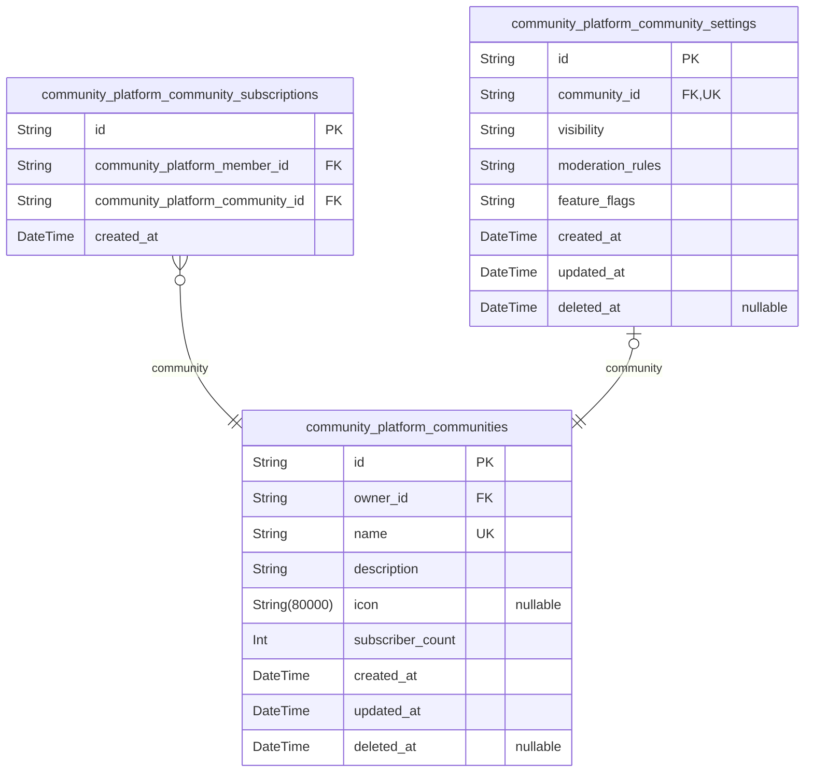
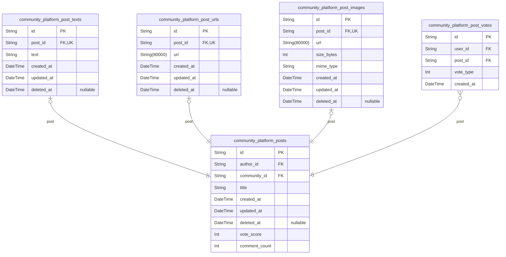
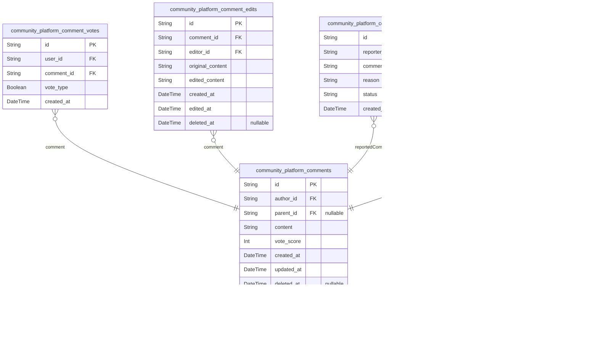
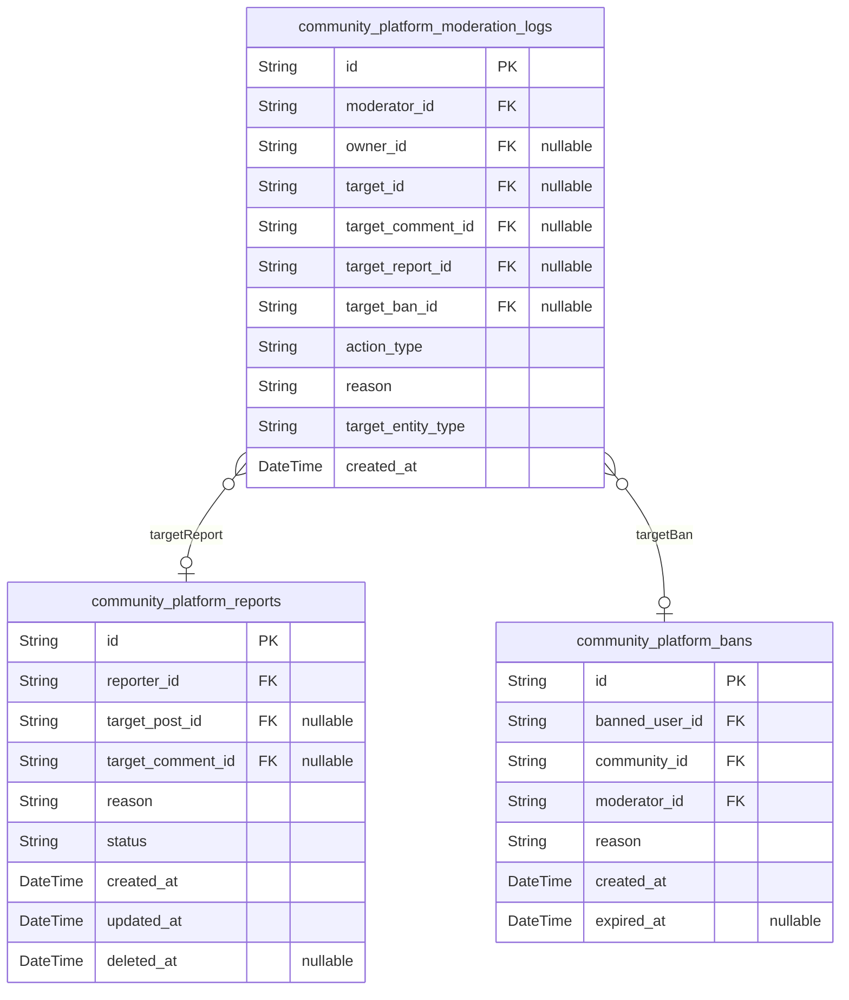

# Prisma Markdown

> Generated by [`prisma-markdown`](https://github.com/samchon/prisma-markdown)

- [Actors](#actors)
- [Communities](#communities)
- [Posts](#posts)
- [Comments](#comments)
- [Moderation](#moderation)

## Actors

```mermaid
erDiagram
"community_platform_guests" {
  String id PK
  String guest_session_id FK,UK
  DateTime created_at
  String device_id UK
  String ip_address
  String user_agent
}
"community_platform_guest_sessions" {
  String id PK
  String ip
  String href
  String referrer
  DateTime created_at
  DateTime expired_at
}
"community_platform_members" {
  String id PK
  String email UK
  String password_hash
  String username UK
  String display_name "nullable"
  String bio "nullable"
  String(80000) avatar "nullable"
  Int karma
  DateTime created_at
  DateTime updated_at
  DateTime deleted_at "nullable"
}
"community_platform_member_sessions" {
  String id PK
  String member_id FK
  String ip
  String href
  String referrer
  DateTime created_at
  DateTime expired_at
}
"community_platform_member_password_resets" {
  String id PK
  String member_id FK
  String token UK
  DateTime expired_at
  Boolean used
  DateTime created_at
}
"community_platform_member_email_verifications" {
  String id PK
  String community_platform_member_id FK
  String token UK
  DateTime created_at
  DateTime expires_at
  DateTime used_at "nullable"
}
"community_platform_moderators" {
  String id PK
  String email UK
  String password_hash
  DateTime created_at
  DateTime updated_at
  DateTime deleted_at "nullable"
}
"community_platform_moderator_sessions" {
  String id PK
  String moderator_id FK
  String ip
  String href
  String referrer
  DateTime created_at
  DateTime expired_at
}
"community_platform_moderator_password_resets" {
  String id PK
  String moderator_id FK
  String token UK
  DateTime expires_at
  DateTime created_at
}
"community_platform_moderator_email_verifications" {
  String id PK
  String moderator_id FK
  String token UK
  DateTime expires_at
  DateTime created_at
  String status
}
"community_platform_owners" {
  String id PK
  String email UK
  String password_hash
  String display_name
  String bio "nullable"
  String(80000) avatar_url "nullable"
  Int karma
  DateTime created_at
  DateTime updated_at
  DateTime deleted_at "nullable"
}
"community_platform_owner_sessions" {
  String id PK
  String owner_id FK
  String ip
  String href
  String referrer "nullable"
  DateTime created_at
  DateTime expired_at
}
"community_platform_owner_password_resets" {
  String id PK
  String owner_id FK
  String token UK
  DateTime expires_at
}
"community_platform_owner_email_verifications" {
  String id PK
  String community_platform_owner_id FK,UK
  String token UK
  DateTime created_at
  DateTime expires_at
  Boolean is_used
}
"community_platform_guests" |o--|| "community_platform_guest_sessions" : guestSession
"community_platform_member_sessions" }o--|| "community_platform_members" : member
"community_platform_member_password_resets" }o--|| "community_platform_members" : member
"community_platform_member_email_verifications" }o--|| "community_platform_members" : member
"community_platform_moderator_sessions" }o--|| "community_platform_moderators" : moderator
"community_platform_moderator_password_resets" }o--|| "community_platform_moderators" : moderator
"community_platform_moderator_email_verifications" }o--|| "community_platform_moderators" : moderator
"community_platform_owner_sessions" }o--|| "community_platform_owners" : owner
"community_platform_owner_password_resets" }o--|| "community_platform_owners" : owner
"community_platform_owner_email_verifications" |o--|| "community_platform_owners" : owner
```

### `community_platform_guests`

Temporary guest accounts for unauthenticated users identified by device
or session.

Serves as an actor entity for users who access the platform without
authentication. Guests have limited permissions - they can view public
feeds, browse communities, and read posts and comments, but cannot create
content, vote, comment, or subscribe. This table tracks the fundamental
identity of a guest session for analytics and moderation purposes, while
keeping the user anonymous.

Properties as follows:

- `id`: Primary Key.
- `guest_session_id`
  > Reference to the temporary session this guest is using. {@link
  > community_platform_guest_sessions.id}.
- `created_at`
  > Timestamp when the guest session was initiated. Tracks when this
  > anonymous identity first accessed the platform.
- `device_id`
  > Unique identifier for the device this guest is using. Used for analytics
  > and to distinguish between different users on shared devices.
- `ip_address`
  > The IP address of the guest when they first accessed the platform. Used
  > for security and basic geolocation.
- `user_agent`
  > User agent string identifying the browser and operating system used by
  > the guest.

### `community_platform_guest_sessions`

Temporary session tokens for guest access with limited lifetime and no
authentication credentials.

Tracks anonymous user sessions for unauthenticated visitors to the
platform. Each session represents a single visit or interaction period
with the platform, identified by a unique UUID and tracked through
connection metadata.

These sessions have no corresponding user account and are used solely for
temporary tracking of guest activity, such as browsing communities or
viewing posts without login. Sessions are automatically expired after a
short duration for privacy and security.

All session data is ephemeral and not linked to any persistent user
identity. No user credentials or profiles are associated with these
sessions, ensuring complete anonymity for unauthenticated users.

Properties as follows:

- `id`: Primary Key.
- `ip`: IP address of the guest device that created this session.
- `href`: The full URL (href) of the connection that initiated this guest session.
- `referrer`: The referral URL that led the guest user to this platform.
- `created_at`: Timestamp when this guest session was created.
- `expired_at`
  > Timestamp when this guest session expires. Sessions must have expiration
  > for security - never unlimited.

### `community_platform_members`

Registered member accounts with email/password authentication, profile
fields, and karma tracking.

Represents authenticated users who can create posts, comments, vote,
subscribe to communities, and manage their profile and karma. This is the
canonical identity record for members with a dedicated authentication
flow, session tracking, and permission system distinct from guests,
moderators, and owners.

Each member has a unique username and email address for login. Username
is used for public identification; email is used only for communication
and authentication.

Member karma is a cumulative score based on votes received on their posts
and comments. Karma can be negative and directly influences user
reputation and visibility.

All member records support soft deletion: when a user deletes their
account, the record is marked with deleted_at but retained for auditing
and moderation purposes.

Properties as follows:

- `id`: Primary Key.
- `email`
  > Unique email address used for login and account recovery. Must be
  > validated before account activation.
- `password_hash`
  > BCrypt-hashed password for authentication. Never store plaintext
  > passwords. Generated upon registration or password change.
- `username`
  > Public-facing identifier for the member. Must be unique across the system
  > and contain only alphanumeric characters, hyphens, or underscores. Used
  > in URLs and public displays.
- `display_name`
  > Customizable name displayed in feeds and profiles. May differ from
  > username. Limited to 100 characters for UI consistency.
- `bio`
  > Optional short biography or self-description. Limited to 500 characters
  > for readability.
- `avatar`
  > URL to user's avatar image. Must be a valid HTTPS URL pointing to a JPEG,
  > PNG, or GIF under 5MB. Retrieved from profile uploads or external
  > sources.
- `karma`
  > Cumulative reputation score based on upvotes received on posts and
  > comments. Can be negative. Incremented on upvote (+1), decremented on
  > downvote (-1), adjusted on vote removal.
- `created_at`
  > Timestamp when the member account was created. Immutable record of
  > registration time.
- `updated_at`
  > Timestamp of the last profile update (name, bio, avatar, etc.). Updating
  > password or verification status also updates this field.
- `deleted_at`
  > Soft delete timestamp indicating when account was marked for deletion.
  > NULL means account is active.

### `community_platform_member_sessions`

Authentication session records for community platform members. Every
login by a registered member is recorded as a unique session with
connection context and expiration details.

This table tracks active and expired sessions for member authentication,
storing the IP address, connection URL, and referrer information for
security auditing and session management. Each session is linked to
exactly one member and has a determined expiration time to enforce
security policies.

Sessions are created upon successful login and automatically terminated
at expiration. Multiple concurrent sessions per member are allowed to
support multi-device access. This table does not store authentication
tokens, device information, or any other fields outside the prescribed
session pattern to maintain strict security standards.

Properties as follows:

- `id`: Primary Key.
- `member_id`
  > The member who owns this session token. {@link
  > community_platform_members.id}.
- `ip`
  > The IP address from which the session was initiated. Used for security
  > monitoring and geolocation context.
- `href`
  > The URL of the page from which the user initiated login. Used to track
  > entry points and user journey.
- `referrer`
  > The referrer URL indicating the previous page visited before login. Helps
  > track traffic sources and potential phishing attempts.
- `created_at`
  > The timestamp when the authentication session was created upon successful
  > login.
- `expired_at`
  > The timestamp when the session expires. Defaults to 7 days after creation
  > for security - sessions must have expiration.

### `community_platform_member_password_resets`

Password reset tokens for member account recovery.

Temporary, single-use tokens issued when a member requests a password
reset. Each token is cryptographically unique and expires after a fixed
time (typically 1 hour). The system uses these tokens to authenticate
password change requests without requiring the user to know their old
password.

When a member submits a password reset request, the system generates a
new token, stores it here with an expiration timestamp, and sends it to
the member's email. When the member clicks the link in the email, the
system validates the token, checks expiration, and if valid, allows the
password to be changed.

Once a token is used, it is marked as used and cannot be reused. Expired
or used tokens are automatically purged by a maintenance job.

Tokens are handled exclusively by the authentication service and never
exposed to end-user UIs beyond the reset link.

Properties as follows:

- `id`: Primary Key.
- `member_id`
  > The member account this reset token belongs to. {@link
  > community_platform_members.id}.
- `token`
  > Randomly generated, cryptographically secure reset token. Must be unique
  > and unguessable. Used to authenticate password change requests.
- `expired_at`
  > The exact time when this reset token expires. Default is 1 hour after
  > creation. Sessions must expire for security; null is forbidden.
- `used`
  > Indicates whether this reset token has been successfully used to change a
  > password. Once used, the token becomes invalid and must not be reused.
- `created_at`
  > The timestamp when this reset token was generated and issued to the user.
  > Used for auditing and calculating expiration.

### `community_platform_member_email_verifications`

Email verification tokens for member registration confirmation.

Temporarily stores unique verification tokens sent to new members during
registration to confirm their email addresses. These tokens are
single-use and expire after a limited time to ensure security.

Each verification token is associated with a specific member account, and
can only be used once to activate an email for that member.

When a user registers with an email address, a random, cryptographically
secure token is generated and sent via email. The user clicks the
verification link to activate their account.

The token must be unique and unguessable. Once used, the token is marked
with the used_at timestamp and subsequent attempts to use it are
invalidated.

After expiration, the token is no longer valid and must be regenerated if
the user needs to retry verification.

This table is essential for preventing fake accounts and ensuring that
all registered members have access to a valid email address.
This table is managed automatically by the authentication system and not
directly by users.

Properties as follows:

- `id`: Primary Key.
- `community_platform_member_id`
  > The member this verification token belongs to. {@link
  > community_platform_members.id}.
- `token`
  > Cryptographically secure random string used as the verification token.
  > Must be unique and unguessable.
- `created_at`: When the verification token was generated and issued to the user.
- `expires_at`
  > When the verification token expires and becomes invalid. Must be in the
  > future.
- `used_at`
  > When the user successfully used this token to verify their email. Will be
  > null if the token has not been used yet.

### `community_platform_moderators`

Moderator accounts with elevated moderation permissions in specific
communities, authenticated via email/password.

Represents users granted moderator authority in one or more communities.
These actors have enhanced permissions to delete content, ban users, and
manage reports within their assigned communities. Each moderator has
unique credentials and is associated with their own session records for
authentication tracking.

Moderators are distinct from community owners and regular members. They
do not have profile attributes like display name or bio; those are
maintained in the member entity. Moderator assignments are defined in the
Communities component through the community_platform_community_moderators
junction table, while this table maintains the core authentication and
identity information.

This entity is critical for access control and security, enabling the
platform to authenticate and authorize moderator actions while
maintaining separation of concerns between identity management and
permission assignment.

Properties as follows:

- `id`: Primary Key.
- `email`
  > Unique email address used for moderator authentication and communication.
  > Must be unique across all moderator accounts.
- `password_hash`
  > Hashed password for authentication. Never stores plain text passwords.
  > Required for login functionality.
- `created_at`
  > Timestamp when the moderator account was created. Used for audit trails
  > and account lifecycle management.
- `updated_at`
  > Timestamp of the last update to the moderator account. Tracks
  > modifications to account details or settings.
- `deleted_at`
  > Timestamp when the moderator account was soft-deleted. If null, the
  > account is active. Used for audit trails and potential account recovery
  > during moderation review.

### `community_platform_moderator_sessions`

Login session records for moderators with JWT authentication tokens.

Tracks all active and historical login sessions for community platform
moderators. Each record represents a single authentication event with
detailed connection context. Sessions are automatically expired after 7
days for security compliance, with no unlimited sessions permitted.

This table exclusively supports the moderator actor type and is
referenced by the moderator authentication workflow. No other actor types
use this table.

Session records are appended-only and never modified — they serve as an
audit trail for moderator access and activity.

All session data is generated automatically upon successful login and
cannot be manipulated by users or moderators.

Properties as follows:

- `id`: Primary Key.
- `moderator_id`
  > Reference to the moderator's identity record. {@link
  > community_platform_moderators.id}.
- `ip`
  > IP address from which the login session originated. Used for security
  > monitoring and geolocation analysis.
- `href`: The full URL the moderator accessed when initiating the login session.
- `referrer`
  > The previous web page URL from which the moderator navigated to the login
  > screen.
- `created_at`
  > Timestamp of when the session was created and authentication was
  > successful.
- `expired_at`
  > Timestamp when this session automatically expires (7 days after
  > creation). Mandatorily expires for security compliance. Unlimited
  > sessions are prohibited.

### `community_platform_moderator_password_resets`

Password reset tokens for secure moderator password recovery workflow.

Stores unique, time-limited tokens that allow moderators to reset their
passwords when forgotten. Each token is single-use and expires after a
set period to ensure security.

When a moderator requests a password reset, a new token is generated and
emailed to their registered email address. Clicking the link in the email
validates the token and redirects the moderator to the password reset
interface.

Once a token is used to reset a password, it is immediately invalidated.
Unused tokens are automatically expired after 24 hours.

This table is managed exclusively by the authentication system during
password recovery workflows and is not directly accessed or modified by
moderators or users.

Properties as follows:

- `id`: Primary Key.
- `moderator_id`
  > The moderator account that requested this password reset. {@link
  > community_platform_moderators.id}.
- `token`
  > Unique, randomly generated token string used to validate password reset
  > requests. Must be URL-safe and cryptographically random.
- `expires_at`
  > The exact datetime when this reset token expires and becomes invalid.
  > Must be strictly enforced - tokens are unusable after this time.
- `created_at`
  > The datetime when this password reset token was generated and sent to the
  > moderator.

### `community_platform_moderator_email_verifications`

Temporary email verification tokens for moderator account registration
confirmation.

Stores one-time use verification tokens sent to moderators during
registration to confirm their email addresses.
Each token is valid for a limited time and can only be used once to
verify a moderator's email.
This is a support table in the authentication workflow, not a business
entity.

The system generates a unique token for each verification request and
sends it via email to the moderator.
When the moderator clicks the verification link, the system validates the
token and marks the account as verified.
After verification or expiration, the token record is not immediately
deleted but preserved for audit purposes.

This table is linked to the community_platform_moderators table through
the moderator_id field to ensure only registered moderators can have
verification records.

Properties as follows:

- `id`: Primary Key.
- `moderator_id`
  > The moderator this email verification belongs to. {@link
  > community_platform_moderators.id}.
- `token`
  > Unique, cryptographically secure verification token sent via email to the
  > moderator. This token is single-use.
- `expires_at`
  > The date and time when the verification token expires. After this time,
  > the token becomes invalid.
- `created_at`
  > The timestamp when this verification record was created. Used to
  > calculate time-to-expire.
- `status`
  > Current status of the verification token. Valid values: 'pending',
  > 'verified', 'expired', 'revoked'.

### `community_platform_owners`

Community owners with full administrative rights, authenticated via
email/password.

Represents the highest authority level in the platform with complete
control over their commissioned communities. Owners can add/remove
moderators, ban users, delete any content within their communities, and
manage community settings.

Each owner has an associated authentication flow with email verification,
password reset tokens, and persistent session tokens. Their karma is
calculated from votes on all content they create across the platform.

Soft deletion is supported for moderation and legal compliance purposes
while maintaining audit trails. Profile fields are inherited from the
unified user profile system.

Components this table relates to:
- {[community_platform_owner_sessions](#community_platform_owner_sessions)} for session management
- {[community_platform_owner_password_resets](#community_platform_owner_password_resets)} for password recovery
- {[community_platform_owner_email_verifications](#community_platform_owner_email_verifications)} for identity
verification
- {[community_platform_bans](#community_platform_bans)} for users banned from owner's
communities
- {[community_platform_moderation_logs](#community_platform_moderation_logs)} for moderation audit trail
- {[community_platform_reports](#community_platform_reports)} for user reports on content they
own or their communities contain

Properties as follows:

- `id`: Primary Key.
- `email`
  > Unique email address used for authentication and system communication.
  > Must be in standard email format.
- `password_hash`
  > BCrypt-hashed password for authentication. NEVER stored in plaintext.
  > Required for login and password change operations.
- `display_name`
  > Publicly visible name displayed in the UI. Limited to 100 characters for
  > readability and UI consistency.
- `bio`
  > Short personal bio about the owner. Maximum 500 characters. Supports
  > markdown for limited formatting.
- `avatar_url`
  > URL pointing to the owner's avatar image. Must be JPEG, PNG, or GIF
  > format. Stored as file reference, not binary.
- `karma`
  > Total reputation score contributed by upvotes and downvotes on the
  > owner's posts and comments across the platform. Can be negative.
- `created_at`
  > Timestamp when the owner account was first created. Not changeable after
  > creation.
- `updated_at`
  > Timestamp of the most recent update to the owner's profile or
  > authentication state. Updated on any profile edit or password change.
- `deleted_at`
  > Timestamp when the owner account was soft-deleted for moderation or
  > compliance reasons. Null if account is active.

### `community_platform_owner_sessions`

Authentication session records for community owners, tracking login
events and connection context for security and audit purposes.

Each session represents an authenticated login of a community owner using
JWT tokens. The session records IP address, requested URL, and referrer
to provide security context for authentication events. Session records
are append-only audit trail entries with fixed expiration times to
enforce security best practices.

Sessions are automatically invalidated when owners log out or when the
expiration timestamp is reached. The system does not allow unlimited
sessions unless explicitly configured, ensuring security by design. Each
session is linked to exactly one owner through a foreign key
relationship, and multiple concurrent sessions per owner are allowed.

This table does not store any credential data or tokens; it only captures
metadata about the login event. The owner table contains all
authentication credentials and user profile information.

Sessions are critical for identifying suspicious login activity, forensic
investigations, and compliance auditing for administrative users.

Properties as follows:

- `id`: Primary Key.
- `owner_id`
  > The owner account associated with this session. {@link
  > community_platform_owners.id}.
- `ip`: The IP address from which the session was initiated.
- `href`: The URL of the page or endpoint accessed during this login session.
- `referrer`
  > The previous page URL that referred the user to this session start point.
  > Optional if no referrer provided.
- `created_at`: The timestamp when the session was created and authentication succeeded.
- `expired_at`
  > The timestamp when the session expires and becomes invalid. Sessions must
  > have expiration for security - not nullable by default.

### `community_platform_owner_password_resets`

Password reset tokens for community platform owners. Used to securely
recover access to owner accounts when the password is forgotten.

Each token is a randomly generated, cryptographically secure string that
is valid for a limited time. Once a token is used to reset a password, it
becomes invalid. Tokens are automatically purged after expiration or use.

This table enables a secure, one-time-use password recovery workflow
without exposing the user's current password. It prevents brute-force
attacks by limiting token lifetime and ensuring each token is unique and
non-reusable.

Each token is associated with exactly one owner account and cannot be
used for any other account type.

Properties as follows:

- `id`: Primary Key.
- `owner_id`
  > The owner account this password reset request belongs to. {@link
  > community_platform_owners.id}
- `token`
  > A unique, cryptographically secure token used for the password reset
  > request. This token must be single-use and transmitted securely via email
  > to the owner.
- `expires_at`
  > The date and time when this reset token expires and becomes invalid. Must
  > be set to a time in the future (typically 1-4 hours from issuance).

### `community_platform_owner_email_verifications`

Email verification tokens for owner registration confirmation.

Temporarily holds unique verification tokens issued to owner actors
during the registration process. Each token is valid for a limited time
and must be confirmed before the owner account becomes fully active. This
table serves as a transient credential within the authentication
workflow.

Tokens are single-use and must be associated with a specific owner actor.
Upon successful verification, the token is invalidated and removed. The
system uses this table to prevent unverified email registrations and to
enforce account confirmation.

This table is managed entirely by the authentication system and is not
directly accessed by end users.

Properties as follows:

- `id`: Primary Key.
- `community_platform_owner_id`: Owner's identity record. [community_platform_owners.id](#community_platform_owners).
- `token`
  > Unique verification token generated for email confirmation. Must be
  > cryptographically random and url-safe.
- `created_at`: Timestamp when the verification token was generated.
- `expires_at`
  > Expiry timestamp after which this token becomes invalid and cannot be
  > used for verification.
- `is_used`
  > Flag indicating whether this verification token has been successfully
  > used. Initially false, set to true upon successful verification.

## Communities

```mermaid
erDiagram
"community_platform_communities" {
  String id PK
  String owner_id FK
  String name UK
  String description
  String(80000) icon "nullable"
  Int subscriber_count
  DateTime created_at
  DateTime updated_at
  DateTime deleted_at "nullable"
}
"community_platform_community_subscriptions" {
  String id PK
  String community_platform_member_id FK
  String community_platform_community_id FK
  DateTime created_at
}
"community_platform_community_settings" {
  String id PK
  String community_id FK,UK
  String visibility
  String moderation_rules
  String feature_flags
  DateTime created_at
  DateTime updated_at
  DateTime deleted_at "nullable"
}
"community_platform_community_subscriptions" }o--|| "community_platform_communities" : community
"community_platform_community_settings" |o--|| "community_platform_communities" : community
```

### `community_platform_communities`

A topic-specific online community where users gather to share and discuss
content.

Communities serve as the central organizing unit of the platform,
enabling users to form interest-based groups around specific topics. Each
community has a unique identifier, a descriptive name, and may be
configured with a custom icon to represent its theme. Communities are
created by owners who have full administrative rights, and users may
subscribe to communities they wish to follow and contribute to.

The community's subscriber count reflects the number of active members
who have chosen to follow the community, though visibility and
participation are open to all users regardless of subscription status.
Communities may be moderated, and owners have the authority to appoint
moderators who can manage content and users within the community.

This entity is distinct from user profiles and post content — it serves
as the architectural foundation for grouping and moderating
community-driven discourse on the platform.

Properties as follows:

- `id`: Primary Key.
- `owner_id`
  > The community owner who created this community. {@link
  > community_platform_owners.id}.
- `name`
  > Unique name representing the community's identity. Must be alphanumeric
  > with hyphens and underscores only, and globally unique across the
  > platform.
- `description`
  > Brief description of the community's purpose, focus, or guidelines.
  > Limited to 500 characters for clarity and discoverability.
- `icon`
  > URL pointing to the community's icon image. Supports JPEG, PNG, and GIF
  > formats. Up to 2MB in size. May be null if no custom icon is uploaded.
- `subscriber_count`
  > Count of users currently subscribed to this community. Automatically
  > increments when a user subscribes and decrements when unsubscribing.
- `created_at`: Timestamp when the community was created. Immutable after creation.
- `updated_at`
  > Timestamp of the last update to the community's metadata (e.g., name,
  > description, icon). Updated on each edit.
- `deleted_at`
  > Soft-delete timestamp indicating when the community was removed. If null,
  > the community is active. Used for audit trails and potential restoration.

### `community_platform_community_subscriptions`

Tracks which users are subscribed to which communities.

This junction table implements the many-to-many relationship between
members and communities. Each record represents a subscription
relationship, where a user (member) is subscribed to a specific
community. Subscriptions are managed directly by users through
subscribe/unsubscribe actions, and the system must efficiently support
queries for all communities a user subscribes to and all users subscribed
to a community.

The subscription relationship is tracked by the existence of a row —
unsubscribing is achieved by deleting the record. Both the user and
community must exist for a valid subscription. This table enables feed
personalization (home feed = posts from subscribed communities) and
community growth tracking (subscriber count).

No soft delete or update operations are needed — a subscription is active
if the row exists. The creation timestamp is preserved for analytics, but
no edit tracking is required since the subscription state is binary
(subscribed/unsubscribed).

Properties as follows:

- `id`: Primary Key.
- `community_platform_member_id`
  > The member who subscribed to this community. {@link
  > community_platform_members.id}
- `community_platform_community_id`
  > The community to which the member is subscribed. {@link
  > community_platform_communities.id}
- `created_at`
  > Timestamp when the subscription was created. This records when the user
  > joined the community.

### `community_platform_community_settings`

Configuration settings per community including visibility, moderation
rules, and feature flags.

This table stores the operational configuration for each community,
including whether it is public or private, which moderation rules are
enforced (e.g., auto-delete profanity, block links), and feature flags
(e.g., enable voting, enable comments, enable images). These settings are
managed by the community owner and moderators through the community
interface and are applied automatically by the system to all content
within the community.

This is a subsidiary entity — it is never directly accessed or modified
by users through API endpoints. Instead, it is internally referenced and
updated when a community owner or moderator changes settings via the UI.
The settings are also read-only for users viewing the community, ensuring
consistent behavior without exposing the underlying configuration
mechanics.

Properties as follows:

- `id`: Primary Key.
- `community_id`
  > Reference to the community this setting applies to. {@link
  > community_platform_communities.id}.
- `visibility`
  > Determines whether the community is publicly viewable and discoverable.
  > 'public' = visible in all feeds, 'private' = only accessible by
  > subscribers. Follows: public/private enum.
- `moderation_rules`
  > JSON string containing a set of auto-moderation flags for the community.
  > Includes properties like 'auto_delete_profanity', 'block_external_links',
  > 'require_approval_for_new_posts'.
- `feature_flags`
  > JSON string enabling or disabling community-specific features. Includes
  > properties like 'enable_commenting', 'enable_voting',
  > 'enable_image_posts', 'enable_link_posts', 'enable_text_posts'.
- `created_at`: Timestamp when these community settings were first created.
- `updated_at`: Timestamp when these community settings were last updated.
- `deleted_at`
  > Timestamp when these community settings were logically deleted (soft
  > delete). Null if still active.

## Posts

```mermaid
erDiagram
"community_platform_posts" {
  String id PK
  String author_id FK
  String community_id FK
  String title
  DateTime created_at
  DateTime updated_at
  DateTime deleted_at "nullable"
  Int vote_score
  Int comment_count
}
"community_platform_post_texts" {
  String id PK
  String post_id FK,UK
  String text
  DateTime created_at
  DateTime updated_at
  DateTime deleted_at "nullable"
}
"community_platform_post_urls" {
  String id PK
  String post_id FK,UK
  String(80000) url
  DateTime created_at
  DateTime updated_at
  DateTime deleted_at "nullable"
}
"community_platform_post_images" {
  String id PK
  String post_id FK,UK
  String(80000) url
  Int size_bytes
  String mime_type
  DateTime created_at
  DateTime updated_at
  DateTime deleted_at "nullable"
}
"community_platform_post_votes" {
  String id PK
  String user_id FK
  String post_id FK
  Int vote_type
  DateTime created_at
}
"community_platform_post_texts" |o--|| "community_platform_posts" : post
"community_platform_post_urls" |o--|| "community_platform_posts" : post
"community_platform_post_images" |o--|| "community_platform_posts" : post
"community_platform_post_votes" }o--|| "community_platform_posts" : post
```

### `community_platform_posts`

Main record for every user-created post with its metadata, type, and
community association.

Represents a content post created by a registered user within a
subscribed community. Each post has a title and exactly one content type:
text, link, or image. The actual content is stored in separate tables to
enforce 1NF compliance, only the metadata and type indicator are kept
here.

Posts are central to the platform’s functionality, appearing in feeds
based on subscription, popularity, or community context. The vote score
is computed dynamically from the post_votes table, while comment_count is
maintained as an optimization for feed display performance.

Soft delete is supported, allowing moderation and user-initiated removal
of posts while preserving audit trails. Posts can be edited within 24
hours of creation, after which edits are frozen. The updated_at timestamp
reflects the last edit within this window.

Relationships:
- Belongs to an author ([community_platform_members.id](#community_platform_members), {@link
community_platform_moderators.id}, or {@link
community_platform_owners.id})
- Belongs to a community ([community_platform_communities.id](#community_platform_communities))
- Links to content via one of: {@link
community_platform_post_texts.post_id}, {@link
community_platform_post_urls.post_id}, {@link
community_platform_post_images.post_id}
- Relates to votes via [community_platform_post_votes.post_id](#community_platform_post_votes)
- Tracks comment count from related comments in Comments component

Properties as follows:

- `id`: Primary Key.
- `author_id`
  > The user who created this post. Reference to member, moderator, or owner
  > actor table. [community_platform_members.id](#community_platform_members), {@link
  > community_platform_moderators.id}, or {@link
  > community_platform_owners.id}.
- `community_id`
  > The community where this post was created. {@link
  > community_platform_communities.id}.
- `title`: The title of the post. Must be 1–300 characters long. Required field.
- `created_at`: Timestamp when the post was created. Always recorded and non-nullable.
- `updated_at`
  > Timestamp when the post was last edited. Only updated within 24 hours of
  > creation. Non-nullable.
- `deleted_at`
  > Timestamp when the post was soft-deleted. Null if still active. Used for
  > moderation auditing and temporary removal.
- `vote_score`
  > Net vote score: total upvotes minus total downvotes. Maintained for
  > performance in feed display. Calculated from
  > community_platform_post_votes.
- `comment_count`
  > Total number of comments on this post. Stored for performance in feed
  > display. Updated when comments are created or deleted.

### `community_platform_post_texts`

Stores the text content for text-type posts, linked to the parent post by
post_id.

This table holds the actual textual content of posts created by users
when they choose the 'text' content type. Each record is uniquely
associated with one post and contains only the raw text input by the
user.

The table is designed as a subsidiary entity that supports the main post
record. Text content is separated from other post attributes to enforce
semantic isolation and normalize data model. While this table contains a
foreign key to posts, its lifecycle is entirely tied to the parent
post—no independent creation, editing or deletion occurs at this level.
When a user edits a text post, the content in this table is atomically
replaced.

This design allows the system to efficiently serve different post types
(text, link, image) without requiring nullable fields in a monolithic
table, and supports clients that need to render just the text content
independently of other metadata.

Properties as follows:

- `id`: Primary Key.
- `post_id`
  > Parent post's identifier that this text content belongs to. {@link
  > community_platform_posts.id}.
- `text`: The full text content of the post. Cannot be empty.
- `created_at`
  > Timestamp when this text content was first created. Matches the parent
  > post's creation time.
- `updated_at`
  > Timestamp when this text content was last modified. Updates when user
  > edits their text post within the 24-hour window.
- `deleted_at`
  > Timestamp when this text content was soft-deleted as part of post
  > deletion. Allows auditing and recovery if needed.

### `community_platform_post_urls`

Stores the URL links for link-type posts, linked to the parent post by
post_id.

This table exists to normalize link-type content in the community
platform, ensuring each post has exactly one URL when it is a link post.
It separates the URL from the common post metadata table to maintain
strict First Normal Form (1NF), preventing NULL values in a combined
content field.

Each record is a one-to-one companion to a community_platform_posts
record where the post type is 'link'. When a user creates a link post,
this table stores the full HTTP/HTTPS URL, while the parent post record
stores title, author, community, and timestamps. This structure allows
for clean separation of concerns, efficient querying of link content, and
proper data types.

The URL is not editable through this table directly — updates occur
through the parent post editing workflow. No independent management of
URLs occurs in the application UI — they are always accessed as part of
the parent post. Soft-deletion is handled by the parent post record.

Properties as follows:

- `id`: Primary Key.
- `post_id`
  > Reference to the parent post entity. This establishes a 1:1 relationship.
  > Post must be of type 'link'. [community_platform_posts.id](#community_platform_posts).
- `url`
  > The full HTTP or HTTPS URL of the linked resource. Must be a valid URL
  > starting with http:// or https://. This field stores the exact string
  > provided by the user during post creation.
- `created_at`
  > Timestamp when this link record was created. Matches the parent post's
  > creation time.
- `updated_at`
  > Timestamp when this link record was last updated. Follows parent post's
  > update cycle.
- `deleted_at`
  > Timestamp when this record was soft-deleted. Always NULL unless the
  > parent post was deleted. Soft delete handled by parent post.

### `community_platform_post_images`

Image metadata for image-type posts, linked directly to their parent post.

Stores the URL location, file size, and MIME type of images associated
with posts. Images are not stored as binary data in the database but as
references to externally hosted files (e.g., S3). This design ensures
scalability and separation of concerns between application and storage.

Each image record belongs to exactly one post and is managed exclusively
through the post's lifecycle. When a post is deleted, its images are also
deleted. Images have no independent existence or API endpoints — users
never interact with them directly. Only the post system references and
displays these images.

The table tracks the size of the image in bytes and its MIME type for
content validation and responsive display purposes. Soft deletion is
supported for audit trails and potential recovery during moderation
workflows.

Foreign key relationship: [community_platform_posts.id](#community_platform_posts)

Properties as follows:

- `id`: Primary Key.
- `post_id`: Parent post this image belongs to. [community_platform_posts.id](#community_platform_posts).
- `url`
  > External URL where the image file is hosted (e.g., S3 bucket). Must be a
  > valid, publicly accessible URI.
- `size_bytes`
  > Size of the image file in bytes for bandwidth estimation and storage cost
  > tracking.
- `mime_type`
  > MIME type of the image (e.g., 'image/jpeg', 'image/png'). Used for
  > validation and browser content-type handling.
- `created_at`: Timestamp when the image record was created. Always populated.
- `updated_at`: Timestamp when the image record was last updated. Always populated.
- `deleted_at`
  > Timestamp when the image was soft-deleted. NULL if still active. Used for
  > audit trail and recovery.

### `community_platform_post_votes`

Individual votes on posts with upvote (+1) or downvote (-1) ratings.
Records each user's vote action on a specific post, allowing vote changes
through new vote records rather than updates.

Each vote is tracked as a separate record to support the ability for
users to change their vote from upvote to downvote, or to remove their
vote entirely. The associated post's score is calculated as the sum of
all related vote_type values.

These records are immutable in the sense that a user cannot change a vote
- they must create a new vote record to change their vote. This design
allows complete auditability of voting behavior and accurate history
tracking.

Votes are always tied to specific users and posts, with no direct
user-facing management interface - votes are created, changed, or removed
through post interaction UIs only.

Properties as follows:

- `id`: Primary Key.
- `user_id`: The user who cast this vote. [community_platform_members.id](#community_platform_members)
- `post_id`: The post that was voted on. [community_platform_posts.id](#community_platform_posts)
- `vote_type`
  > The vote value: +1 for upvote, -1 for downvote. Represents the direction
  > of the vote. No other values are permitted.
- `created_at`
  > Timestamp when the vote was created. Recorded at the moment the vote
  > action occurred.

## Comments

```mermaid
erDiagram
"community_platform_comments" {
  String id PK
  String author_id FK
  String parent_id FK "nullable"
  String content
  Int vote_score
  DateTime created_at
  DateTime updated_at
  DateTime deleted_at "nullable"
}
"community_platform_comment_votes" {
  String id PK
  String user_id FK
  String comment_id FK
  Boolean vote_type
  DateTime created_at
}
"community_platform_comment_edits" {
  String id PK
  String comment_id FK
  String editor_id FK
  String original_content
  String edited_content
  DateTime created_at
  DateTime edited_at
  DateTime deleted_at "nullable"
}
"community_platform_comment_reports" {
  String id PK
  String reporter_id FK
  String comment_id FK
  String reason
  String status
  DateTime created_at
}
"community_platform_comment_visibilities" {
  String id PK
  String user_id FK
  String comment_id FK
  Boolean is_visible
  DateTime created_at
  DateTime updated_at
  DateTime deleted_at "nullable"
}
"community_platform_comments" }o--o| "community_platform_comments" : parent
"community_platform_comment_votes" }o--|| "community_platform_comments" : comment
"community_platform_comment_edits" }o--|| "community_platform_comments" : comment
"community_platform_comment_reports" }o--|| "community_platform_comments" : reportedComment
"community_platform_comment_visibilities" }o--|| "community_platform_comments" : comment
```

### `community_platform_comments`

Individual comments made on posts or other comments, with support for
nested replies.

Stores user-generated commentary on posts and other comments within the
community platform. Each comment has a single textual content authored by
a user and can be replied to, creating a threaded discussion hierarchy.
Comments are the primary unit of user interaction in discussions and
serve as the foundation for voting and moderation systems.

Every comment is associated with exactly one user author through the
author_id foreign key, establishing clear ownership. Comments can be
nested by referencing a parent comment via parent_id, enabling
multi-level reply threads without depth restrictions.

The vote score field stores the aggregate net score from upvotes and
downvotes for performance optimization, though individual votes are
tracked in a separate table. Comments can be soft-deleted for moderation
purposes while preserving audit trails.

This table supports independent management: users can search their own
comments across all posts, moderators can review comments irrespective of
their parent post, and notification systems trigger based on comment
activity. This independence makes the primary stance correct, not
subsidiary.

Properties as follows:

- `id`: Primary Key.
- `author_id`
  > The user who created this comment. [community_platform_members.id](#community_platform_members)
  > or [community_platform_guests.id](#community_platform_guests) depending on user type.
- `parent_id`
  > The parent comment (if this is a reply) or the parent post (if this
  > comment is directly on a post). [community_platform_comments.id](#community_platform_comments) or
  > [community_platform_posts.id](#community_platform_posts).
- `content`
  > The text content of the comment. Must be between 1 and 1000 characters as
  > specified in requirements.
- `vote_score`
  > The net vote score of this comment (upvotes minus downvotes). Derived
  > from the community_platform_comment_votes table.
- `created_at`: Timestamp when this comment was created.
- `updated_at`
  > Timestamp when this comment was last edited. Updated within 24 hours of
  > creation when edits are allowed.
- `deleted_at`
  > Timestamp when this comment was soft-deleted. Null means the comment is
  > still visible.

### `community_platform_comment_votes`

Tracks individual upvotes and downvotes on comments, allowing users to
change or remove their votes.

Each record represents a single vote from a user on a specific comment.
The system records whether a vote is an upvote (+1) or downvote (-1) and
maintains historical records for auditing purposes. Users can change
their vote (upvote to downvote, or remove vote entirely) by creating a
new vote record with updated type, which overwrites the previous vote
state in the aggregated score calculation. This table ensures vote
integrity and supports the real-time vote score computation for comments.

Votes are managed entirely by the system when users interact with
comments. Users cannot directly create or view votes individually; they
interact with the comment interface, and the system updates this table
accordingly. This is a supporting table that provides the data foundation
for comment karma calculations but is not independently accessed by end
users.

Relationships:
- Each vote belongs to one user (via user_id)
- Each vote belongs to one comment (via comment_id)
- A user can vote on many comments
- A comment can receive many votes
- Votes are immutable historical records that persist even when user
changes their vote (previous votes are kept for audit trail)

Note: This table does not have a primary key named "id" as it's a
junction table with composite key (user_id, comment_id). The primary key
is enforced by the unique index on (user_id, comment_id).

No soft delete capability is needed as votes are not deleted, only
overwritten by new vote records.

Properties as follows:

- `id`: Primary Key.
- `user_id`: Voting user's [community_platform_members.id](#community_platform_members).
- `comment_id`: Target comment's [community_platform_comments.id](#community_platform_comments).
- `vote_type`: True for upvote (+1), false for downvote (-1).
- `created_at`: Timestamp when the vote was recorded.

### `community_platform_comment_edits`

Edits to comments made within the 15-minute edit window, preserving
original content and tracking changes for audit and moderation purposes.

Records every modification made to a comment during its edit window,
storing both the original content before the edit and the new content
after the edit. Each edit record is linked to the specific comment and
the user who made the edit. These records are essential for moderation,
content integrity verification, and user accountability.

When a comment is edited, a new record is created with the original
content and the updated content. The comment's current content can be
determined by the most recent edit, or the original comment content if no
edits exist. This design ensures that even after modifications, the
complete edit history remains intact and accessible for auditing
purposes, while preventing alteration or deletion of past versions.

This table supports the requirement that users can edit their comments
within 15 minutes of creation, and moderators need complete historical
records of all edits for dispute resolution and moderation decisions.

Properties as follows:

- `id`: Primary Key.
- `comment_id`
  > Reference to the comment that was edited. {@link
  > community_platform_comments.id}.
- `editor_id`
  > The user ID who performed the edit. [community_platform_members.id](#community_platform_members)
  > or [community_platform_moderators.id](#community_platform_moderators) or {@link
  > community_platform_owners.id}.
- `original_content`
  > The full text content of the comment before the edit was made. Must be
  > preserved exactly as originally submitted to provide an immutable audit
  > trail.
- `edited_content`
  > The full text content of the comment after the edit was made. Contains
  > the new value that replaced the original content.
- `created_at`
  > Timestamp when this edit record was created. Records when the edit
  > occurred, which should be within 15 minutes of the comment's original
  > creation.
- `edited_at`
  > Timestamp that reflects when the edit occurred. Exactly matches
  > created_at; used for clarity in queries seeking edits sorted by edit
  > time.
- `deleted_at`
  > The soft-delete timestamp. If null, the edit record is active. If
  > populated, the edit record has been logically deleted (very rare),
  > perhaps due to moderation action or system cleanup.

### `community_platform_comment_reports`

Tracks user reports on comments with status (pending/approved/dismissed),
reason text, reporter ID, and timestamp.

Each report entry records a user's report on a specific comment,
providing context for moderator review. This table is central to the
platform's moderation system, allowing moderators to investigate reported
content and take appropriate action. Reports are automatically created
when a user submits a report on a comment and can be approved, dismissed,
or remain pending.

Reports are associated with the comment being reported (via comment_id)
and the user who submitted the report (via reporter_id). Reports have a
status field that indicates their current state in the moderation
workflow. This table is used exclusively by the moderation system and is
not directly accessed by regular users.

Note: The reporter_id references community_platform_members because only
authenticated members (not guests) can report content. The comment_id
references the community_platform_comments table that contains the
reported comment.

Properties as follows:

- `id`: Primary Key.
- `reporter_id`
  > The user who submitted the report. References the reporting member's
  > profile. [community_platform_members.id](#community_platform_members)
- `comment_id`
  > The comment that was reported. References the specific comment being
  > reported. [community_platform_comments.id](#community_platform_comments)
- `reason`
  > The reason provided by the user for reporting this comment. Must be
  > between 10 and 500 characters.
- `status`
  > The current status of the report in the moderation workflow. Valid
  > values: 'pending', 'approved', 'dismissed'.
- `created_at`: The timestamp when the report was submitted by the user.

### `community_platform_comment_visibilities`

Tracks whether each comment is visible to banned users, enabling display
of comments while preventing interaction from restricted accounts.

This table determines comment visibility for users who have been banned
from a community. When a user is banned, their visibility status for
individual comments is tracked here rather than applying a blanket
restriction, allowing moderation systems to selectively reveal or conceal
specific comment threads.

The visibility state is automatically updated when a user is banned or
unbanned from a community. When a user is banned, their visibility is set
to false for all new comments (if policy dictates) and preserved for
existing comments to maintain forum context. When unbanned, their
visibility is restored to true.

This table supports moderation workflows where certain banned users may
retain view access to specific comment threads for audit or contextual
purposes, while other banned users have full restriction.

Properties as follows:

- `id`: Primary Key.
- `user_id`
  > The user whose visibility status is being tracked. {@link
  > community_platform_members.id}.
- `comment_id`
  > The comment whose visibility is being controlled. {@link
  > community_platform_comments.id}.
- `is_visible`
  > Whether this banned user can see this specific comment. True means
  > visible, false means hidden. This overrides the general ban rules for
  > targeted content visibility.
- `created_at`: Timestamp when this visibility record was created.
- `updated_at`
  > Timestamp when this visibility record was last updated (e.g., when
  > visibility was toggled).
- `deleted_at`
  > Timestamp when this visibility record was soft-deleted. Null means active
  > record.

## Moderation

```mermaid
erDiagram
"community_platform_bans" {
  String id PK
  String banned_user_id FK
  String community_id FK
  String moderator_id FK
  String reason
  DateTime created_at
  DateTime expired_at "nullable"
}
"community_platform_moderation_logs" {
  String id PK
  String moderator_id FK
  String owner_id FK "nullable"
  String target_id FK "nullable"
  String target_comment_id FK "nullable"
  String target_report_id FK "nullable"
  String target_ban_id FK "nullable"
  String action_type
  String reason
  String target_entity_type
  DateTime created_at
}
"community_platform_reports" {
  String id PK
  String reporter_id FK
  String target_post_id FK "nullable"
  String target_comment_id FK "nullable"
  String reason
  String status
  DateTime created_at
  DateTime updated_at
  DateTime deleted_at "nullable"
}
"community_platform_moderation_logs" }o--o| "community_platform_reports" : targetReport
"community_platform_moderation_logs" }o--o| "community_platform_bans" : targetBan
```

### `community_platform_bans`

Tracks users banned from communities by moderators, including the reason
for the ban and optional expiration time.

Each record represents a permanent ban unless explicitly lifted by an
owner or moderator. Bans prevent banned users from posting or commenting
within the specified community, while still allowing them to view public
content. This table serves as the authoritative source for access control
checks.

Moderators use this table to view, filter, and unban users, making it
central to community moderation workflows. Banned users are queried by
user ID, community ID, or active ban status. Bans with an expired_at
timestamp are automatically lifted when expired; null expired_at means
permanent ban.

All ban records are referenced by moderation_logs for audit trail
purposes, but this table remains the source of truth for active
permissions.

Referenced by: @{\link community_platform_moderation_logs} for audit
logging.

Properties as follows:

- `id`: Primary Key.
- `banned_user_id`: The user who was banned. [community_platform_members.id](#community_platform_members).
- `community_id`
  > The community from which the user was banned. {@link
  > community_platform_communities.id}.
- `moderator_id`
  > The moderator who imposed the ban. {@link
  > community_platform_moderators.id}.
- `reason`
  > The reason provided by the moderator for the ban. Must be 10–500
  > characters.
- `created_at`: Timestamp when the ban was imposed. Always present.
- `expired_at`: Optional timestamp when the ban expires. If null, the ban is permanent.

### `community_platform_moderation_logs`

Audit log of all moderator actions including post/comment deletions,
report approvals/dismissals, and bans/unbans with actor references and
timestamps.

This is an immutable audit trail that records every action performed by
moderators in the system. Each entry represents a single moderation event
triggered by either a community moderator or owner.

The log captures what action was taken, who performed it, what entity was
targeted, and why. This enables comprehensive moderation review,
compliance verification, and accountability tracking.

Records are appended only - never modified or deleted. The system never
updates or overwrites existing log entries.

Action types include: delete_post, delete_comment, approve_report,
dismiss_report, ban_user, unban_user.

Target entities are tracked via target_id and target_entity_type to
support polymorphic relationships with posts, comments, reports, and
bans.

All entries must include a reason provided by the moderator at the time
of action.

Properties as follows:

- `id`: Primary Key.
- `moderator_id`
  > The moderator who performed this action. {@link
  > community_platform_moderators.id}.
- `owner_id`
  > The community owner who performed this action. This is used when an owner
  > performs a moderation action rather than a moderator. {@link
  > community_platform_owners.id}.
- `target_id`
  > The ID of the post being targeted by this moderation action. Use this
  > reference when action_type is delete_post. {@link
  > community_platform_posts.id}.
- `target_comment_id`
  > The ID of the comment being targeted by this moderation action. Use this
  > reference when action_type is delete_comment. {@link
  > community_platform_comments.id}.
- `target_report_id`
  > The ID of the report being targeted by this moderation action. Use this
  > reference when action_type is approve_report or dismiss_report. {@link
  > community_platform_reports.id}.
- `target_ban_id`
  > The ID of the ban being targeted by this moderation action. Use this
  > reference when action_type is unban_user. {@link
  > community_platform_bans.id}.
- `action_type`
  > The type of moderation action performed. Valid values: delete_post,
  > delete_comment, approve_report, dismiss_report, ban_user, unban_user.
- `reason`
  > The reason provided by the moderator for performing this action. Must be
  > between 10 and 500 characters as per reporting requirements.
- `target_entity_type`
  > The type of entity being moderated. Valid values: post, comment, report,
  > ban. Used to determine which foreign key field contains the target
  > reference, enabling polymorphic relationships.
- `created_at`
  > The timestamp when the moderation action was performed. This is the
  > immutable audit timestamp - never modified after creation.

### `community_platform_reports`

Tracks user reports on posts and comments, including reporter ID, target
entity ID, reason text, timestamp, and status
(pending/approved/dismissed) for moderation workflows.

Each report is created by a member user (not guest) when they observe
inappropriate content. Reports are processed by moderators who can
approve or dismiss them.

Reports link to exactly one target entity - either a post or a comment -
but not both. The reporting system supports filtering and searching by
status and reason text for moderation dashboards.

This table does not store content itself but references foreign entities
from the Posts and Comments components. Soft deletion preserves audit
trails while allowing for reversible decisions in moderation workflows.

Properties as follows:

- `id`: Primary Key.
- `reporter_id`
  > The member user who submitted this report. {@link
  > community_platform_members.id}.
- `target_post_id`
  > The post being reported, if applicable. {@link
  > community_platform_posts.id}.
- `target_comment_id`
  > The comment being reported, if applicable. {@link
  > community_platform_comments.id}.
- `reason`
  > The reason provided by the reporter for why the content was reported.
  > Must be 10-500 characters in length.
- `status`
  > Current status of the report. Must be one of: "pending", "approved", or
  > "dismissed" as per moderation workflow.
- `created_at`: Timestamp when the report was submitted by the user.
- `updated_at`: Timestamp when the report status was last updated by a moderator.
- `deleted_at`: Soft delete timestamp for audit trail. If null, the report is active.
