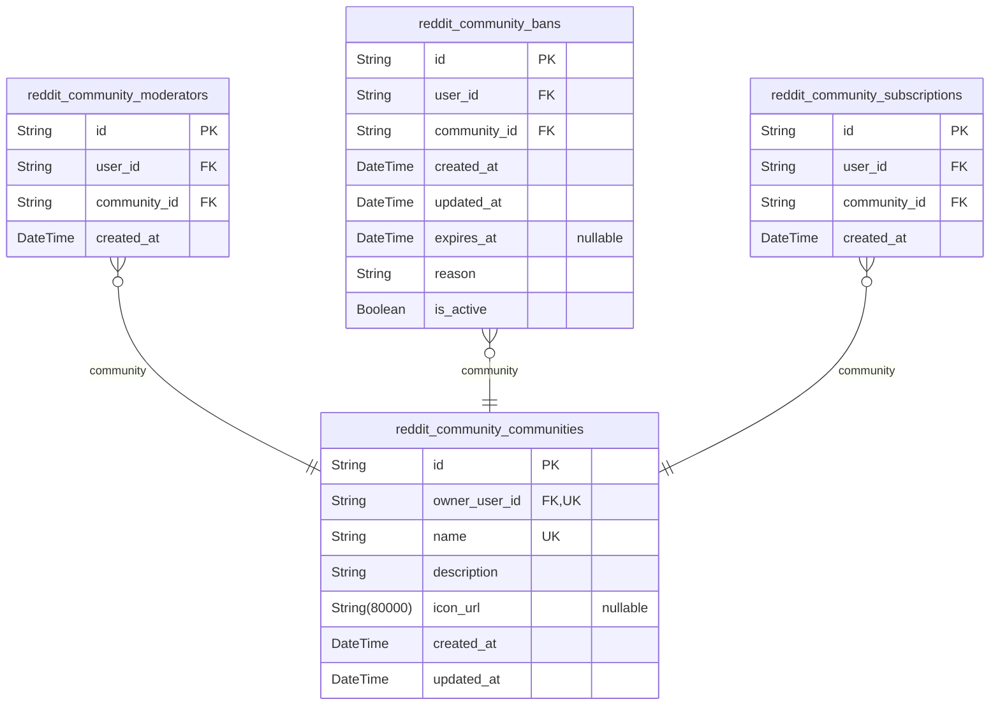
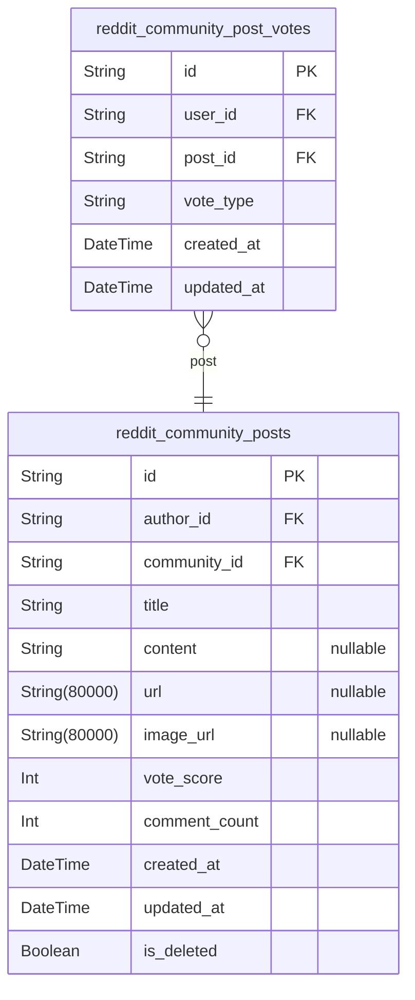
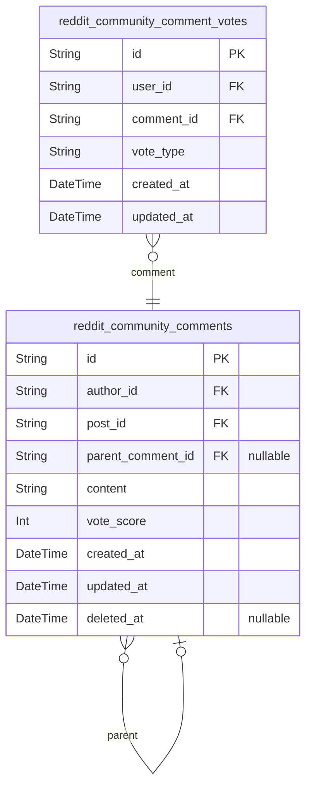
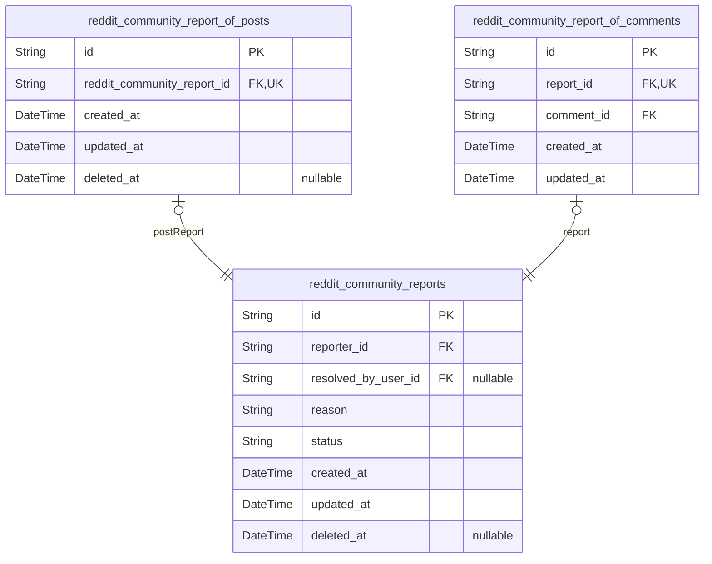

# Prisma Markdown

> Generated by [`prisma-markdown`](https://github.com/samchon/prisma-markdown)

- [Actors](#actors)
- [Communities](#communities)
- [Posts](#posts)
- [Comments](#comments)
- [Reports](#reports)

## Actors

```mermaid
erDiagram
"reddit_community_guests" {
  String id PK
  DateTime created_at
  DateTime updated_at
  DateTime deleted_at "nullable"
  String device_id UK
  String session_token UK
  String ip_address
  String user_agent
  DateTime last_activity_at
}
"reddit_community_guest_sessions" {
  String id PK
  String guest_id FK
  String ip
  String(80000) href
  String(80000) referrer "nullable"
  DateTime created_at
  DateTime expired_at
}
"reddit_community_members" {
  String id PK
  String email UK
  String password_hash
  String username UK
  String display_name
  String bio "nullable"
  String(80000) avatar_url "nullable"
  Int karma_score
  DateTime created_at
  DateTime updated_at
  Boolean is_deleted
}
"reddit_community_member_sessions" {
  String id PK
  String reddit_community_member_id FK
  String ip
  String(80000) href
  String(80000) referrer
  DateTime created_at
  DateTime expired_at
}
"reddit_community_member_password_resets" {
  String id PK
  String member_id FK
  String token UK
  DateTime expires_at
  DateTime created_at
  Boolean used
}
"reddit_community_member_email_verifications" {
  String id PK
  String member_id FK
  String token UK
  DateTime expires_at
  Boolean is_used
  DateTime created_at
  DateTime updated_at
}
"reddit_community_community_owners" {
  String id PK
  String email UK
  String password_hash
  String username UK
  String display_name
  String bio "nullable"
  String(80000) avatar_url "nullable"
  Int karma_score
  Boolean is_deleted
  DateTime created_at
  DateTime updated_at
}
"reddit_community_community_owner_sessions" {
  String id PK
  String reddit_community_community_owner_id FK
  String ip
  String href
  String referrer "nullable"
  DateTime created_at
  DateTime expired_at
}
"reddit_community_community_owner_password_resets" {
  String id PK
  String reddit_community_community_owner_id FK
  String token UK
  DateTime expires_at
  Boolean used
  DateTime created_at
  DateTime updated_at
}
"reddit_community_community_owner_email_verifications" {
  String id PK
  String reddit_community_community_owner_id FK,UK
  String token UK
  DateTime expires_at
  DateTime created_at
  DateTime updated_at
  Boolean is_used
}
"reddit_community_community_moderators" {
  String id PK
  String community_id FK,UK
  String email UK
  String password_hash
  String username UK
  String display_name
  String bio "nullable"
  String(80000) avatar_url "nullable"
  Int karma_score
  DateTime created_at
  DateTime updated_at
  Boolean is_deleted
}
"reddit_community_community_moderator_sessions" {
  String id PK
  String community_moderator_id FK
  String ip
  String(80000) href
  String(80000) referrer
  DateTime created_at
  DateTime expired_at
}
"reddit_community_community_moderator_password_resets" {
  String id PK
  String community_moderator_id FK,UK
  String token UK
  DateTime expires_at
  DateTime created_at
}
"reddit_community_community_moderator_email_verifications" {
  String id PK
  String reddit_community_community_moderator_id FK
  String token UK
  DateTime expires_at
  Boolean used
  DateTime created_at
  DateTime updated_at
}
"reddit_community_platform_admins" {
  String id PK
  String email UK
  String password_hash
  String username UK
  String display_name "nullable"
  String bio "nullable"
  String(80000) avatar_url "nullable"
  Int karma_score
  DateTime created_at
  DateTime updated_at
  Boolean is_deleted
}
"reddit_community_platform_admin_sessions" {
  String id PK
  String platform_admin_id FK
  String ip
  String(80000) href
  String(80000) referrer "nullable"
  DateTime created_at
  DateTime expired_at
}
"reddit_community_platform_admin_password_resets" {
  String id PK
  String reddit_community_platform_admin_id FK
  String token UK
  DateTime expires_at
  DateTime created_at
  DateTime updated_at
  DateTime deleted_at "nullable"
}
"reddit_community_platform_admin_email_verifications" {
  String id PK
  String reddit_community_platform_admin_id FK,UK
  String token UK
  DateTime expires_at
  DateTime created_at
  DateTime updated_at
  DateTime deleted_at "nullable"
}
"reddit_community_guest_sessions" }o--|| "reddit_community_guests" : guest
"reddit_community_member_sessions" }o--|| "reddit_community_members" : member
"reddit_community_member_password_resets" }o--|| "reddit_community_members" : member
"reddit_community_member_email_verifications" }o--|| "reddit_community_members" : member
"reddit_community_community_owner_sessions" }o--|| "reddit_community_community_owners" : communityOwner
"reddit_community_community_owner_password_resets" }o--|| "reddit_community_community_owners" : communityOwner
"reddit_community_community_owner_email_verifications" |o--|| "reddit_community_community_owners" : communityOwner
"reddit_community_community_moderator_sessions" }o--|| "reddit_community_community_moderators" : communityModerator
"reddit_community_community_moderator_password_resets" |o--|| "reddit_community_community_moderators" : communityModerator
"reddit_community_community_moderator_email_verifications" }o--|| "reddit_community_community_moderators" : moderator
"reddit_community_platform_admin_sessions" }o--|| "reddit_community_platform_admins" : platformAdmin
"reddit_community_platform_admin_password_resets" }o--|| "reddit_community_platform_admins" : platformAdmin
"reddit_community_platform_admin_email_verifications" |o--|| "reddit_community_platform_admins" : admin
```

### `reddit_community_guests`

Temporary guest accounts identified by device and session token. Guests
can browse content and initiate interactions but cannot create persistent
accounts or authenticate. Each guest is uniquely identified by session
token or device fingerprint, with data purged after inactivity.

Guests are an actor type because they represent a distinct user identity
category with their own session management, even though they lack
credentials. This separates them from authenticated members and allows
independent tracking of pre-registration engagement.

Does NOT reference any other actor, post, or comment table, as guests are
stateless and ephemeral. All guest sessions are managed via the separate
reddit_community_guest_sessions table.

Properties as follows:

- `id`: Primary Key.
- `created_at`: Timestamp when this guest account was created.
- `updated_at`: Timestamp when this guest account was last updated.
- `deleted_at`
  > Soft delete flag. Nullable; null means active guest. Set to timestamp
  > when guest is purged due to inactivity or system cleanup.
- `device_id`
  > Unique identifier for the device or browser session used by the guest.
  > Used to recognize returning guests.
- `session_token`
  > Session token issued to this guest for authentication during their
  > session. Must be unique and expire after inactivity.
- `ip_address`
  > IP address from which this guest accessed the service. Used for abuse
  > detection and geographical analytics.
- `user_agent`
  > HTTP User-Agent string from the guest's device/browser. Used for client
  > type detection and compatibility tracking.
- `last_activity_at`
  > Timestamp of the user's last interaction with the platform. Used to
  > determine when to purge inactive guest sessions.

### `reddit_community_guest_sessions`

Temporary session tokens for guest access without authentication. Tracks
connection metadata for unauthenticated users who interact with the
system without a registered account. Sessions are ephemeral and
automatically expire after a fixed duration. Append-only audit trail of
anonymous access events.

Properties as follows:

- `id`: Primary Key.
- `guest_id`
  > Reference to the associated guest account. {@link
  > reddit_community_guests.id}.
- `ip`: IP address used for this session.
- `href`: Current URL path accessed during this session.
- `referrer`
  > Referrer URL that brought the guest to the system. May be null if direct
  > access or unknown.
- `created_at`: Timestamp when this session was initiated.
- `expired_at`: Timestamp when this session will expire. Enforced by system cleanup.

### `reddit_community_members`

Registered member accounts with email/password credentials for
authentication. This table serves as the canonical identity record for
standard users who can create posts, comments, vote, and manage their
profile. Member accounts have distinct authentication flow from guests
and admins, and are referenced as authors of all user-generated content.
Their karma_score is computed as the sum of upvotes minus downvotes
across all their posts and comments.

Properties as follows:

- `id`: Primary Key.
- `email`: Unique email address for login and communication.
- `password_hash`: Encrypted password hash for authentication.
- `username`
  > User-chosen display identifier, unique across platform. Must be
  > alphanumeric plus underscore, 3-30 characters.
- `display_name`
  > Human-readable name displayed publicly. Can be any UTF-8 string up to 100
  > characters.
- `bio`: Optional self-description by user. Max 500 characters.
- `avatar_url`: URL to user's avatar image, stored externally.
- `karma_score`
  > Total karma score calculated as sum of upvotes minus downvotes across all
  > user's posts and comments. Default value is 0.
- `created_at`: Timestamp when user registered.
- `updated_at`: Timestamp of last profile update.
- `is_deleted`
  > Soft delete flag. When true, user account is deactivated but preserved
  > for audit purposes.

### `reddit_community_member_sessions`

JWT session tokens for member authentication with access and refresh
support. This table serves as an append-only audit trail of member login
events. Each record represents one session instance established during
login, tracked by IP address and HTTP context for security analysis.
Sessions expire automatically and cannot be modified once created.
Foreign key references the reddit_community_members.actor entity.

Key design principle: This is NOT a user profile or credential store. It
is a historical record of login activity owned by the member actor type.

Properties as follows:

- `id`: Primary Key.
- `reddit_community_member_id`
  > Reference to the authenticated member's identity record. {@link
  > reddit_community_members.id}.
- `ip`
  > IP address from which the session was established. Used for security
  > monitoring and anomaly detection.
- `href`
  > Full URL path accessed during login. Provides context for the session
  > initiation point.
- `referrer`
  > Original page that redirected the user to the login. Used for marketing
  > and security analysis.
- `created_at`: Timestamp when this session was created and the JWT was issued.
- `expired_at`
  > Timestamp when this session token expires and becomes invalid. Mandatory
  > for security enforcement.

### `reddit_community_member_password_resets`

Password reset tokens with expiration for member account recovery. Each
token is generated and emailed to the user upon request. The 'used' flag
indicates whether the token has been consumed to reset a password. When a
token is used, it should be considered invalid even if not expired. This
table is managed exclusively by the authentication system, not direct
user operations.

Relates to: [reddit_community_members.id](#reddit_community_members)

Properties as follows:

- `id`: Primary Key.
- `member_id`
  > Reference to the affected member account in reddit_community_members.
  > [reddit_community_members.id](#reddit_community_members)
- `token`
  > Randomly generated unique token string for secure password reset access.
  > Must be sufficiently long (e.g., 64 characters) to resist brute force.
- `expires_at`
  > ISO 8601 timestamp indicating when this reset token expires and becomes
  > invalid. Automatically generated upon creation with a 24-hour expiration
  > window.
- `created_at`
  > ISO 8601 timestamp when this reset request was generated and sent to the
  > user.
- `used`
  > Indicates whether this password reset token has already been consumed.
  > Once set to true, the token is permanently invalidated regardless of
  > expiration time. Default is false.

### `reddit_community_member_email_verifications`

Email verification tokens issued to members for registration confirmation
and email address changes. Each token is valid for a limited time and can
only be used once. Tied to a member account via foreign key. When used,
the member's email address is confirmed and the token is invalidated.
Supports both initial registration and email change workflows.

Properties as follows:

- `id`: Primary Key.
- `member_id`
  > References the member account that requested this email verification.
  > [reddit_community_members.id](#reddit_community_members)
- `token`
  > Unique cryptographic token used to verify the email address. Expires
  > after set duration.
- `expires_at`
  > Datetime when the verification token expires. After this time, the token
  > becomes invalid.
- `is_used`
  > Indicates whether the token has been used to verify the email address.
  > Defaults to false.
- `created_at`: Timestamp when the verification token was issued.
- `updated_at`: Timestamp when the token was last updated (e.g., when marked as used).

### `reddit_community_community_owners`

Community owner accounts with elevated privileges, using the same
email/password authentication as members. This table serves as the
authoritative identity record for users who create and manage
communities. Each owner has full control over their community's members,
moderators, and content. This table is referenced by
'reddit_community_communities' as the owner foreign key.

Properties as follows:

- `id`: Primary Key.
- `email`: Unique email address used for authentication and communication.
- `password_hash`: BCrypt-hashed password for secure authentication.
- `username`
  > Unique display username for profile and mentions; alphanumeric +
  > underscore only; 3-30 characters.
- `display_name`: User's display name; any UTF-8 string up to 100 characters.
- `bio`: Optional short biography (max 500 characters).
- `avatar_url`: URL to user's avatar image; externally hosted.
- `karma_score`
  > Total karma score calculated as sum of all upvotes minus downvotes across
  > all posts and comments.
- `is_deleted`
  > Soft delete flag to mark inactive accounts without deleting data.
  > Prevents reuse of email or username.
- `created_at`: Timestamp of account creation (ISO 8601 UTC).
- `updated_at`: Timestamp of last update (ISO 8601 UTC).

### `reddit_community_community_owner_sessions`

JWT session tokens for community owner authentication with access and
refresh support. Append-only audit trail of login events tracked with
connection metadata. Managed solely through authentication flows, not
direct user CRUD. Each session belongs to exactly one community owner.

Properties as follows:

- `id`: Primary Key.
- `reddit_community_community_owner_id`
  > Community owner this session belongs to. {@link
  > reddit_community_community_owners.id}.
- `ip`: Client IP address from which the session was initiated.
- `href`: Full URL path the user accessed to initiate this session.
- `referrer`: HTTP referrer URL that led the user to this session initiation.
- `created_at`: Timestamp when this session was created. Always set to current time.
- `expired_at`
  > Timestamp when this session expires. Must be set at creation and is never
  > updated.

### `reddit_community_community_owner_password_resets`

Password reset tokens with expiration for community owner account
recovery. Each token is valid for a limited time and becomes unusable
after use. Used exclusively by the reddit_community_community_owners
actor type for secure, revocable password reset flows.

Properties as follows:

- `id`: Primary Key.
- `reddit_community_community_owner_id`
  > References the community owner account requesting the password reset.
  > [reddit_community_community_owners.id](#reddit_community_community_owners).
- `token`
  > Unique, randomly generated reset token string. Must be stored securely
  > and never loggable.
- `expires_at`
  > Absolute UTC timestamp when the reset token expires. Resets become
  > invalid after this time.
- `used`
  > Boolean flag indicating if the token has been used to reset the password.
  > Once true, the token is invalid and should be archived or purged.
- `created_at`: ISO 8601 datetime when the password reset token was issued.
- `updated_at`
  > ISO 8601 datetime of the last update to this record (e.g., when used is
  > set to true).

### `reddit_community_community_owner_email_verifications`

Email verification tokens issued to community owners during registration
or email change requests. Each token is single-use and expires after 24
hours. Used to confirm email ownership before enabling full access. This
table is subsidiary to reddit_community_community_owners and has a 1:1
relationship with it.

Properties as follows:

- `id`: Primary Key.
- `reddit_community_community_owner_id`
  > The community owner this verification token belongs to. {@link
  > reddit_community_community_owners.id}.
- `token`
  > Unique cryptographic token sent to the user's email. Must be URL-safe and
  > unguessable.
- `expires_at`
  > When this token expires (24 hours after creation). The token becomes
  > invalid after this time.
- `created_at`: Timestamp when the verification token was issued.
- `updated_at`: Timestamp when the token was last updated (e.g., if regenerated).
- `is_used`
  > Whether this token has been used to verify the email address. Once set to
  > true, the token is invalidated.

### `reddit_community_community_moderators`

Community moderator accounts granted moderation rights, using
email/password authentication like members. Each moderator is associated
with exactly one community they moderate, and their permission is tied to
that community. They cannot moderate other communities without being
explicitly granted permission on those communities. This table holds
authentication credentials and moderation metadata for the actor type.

Properties as follows:

- `id`: Primary Key.
- `community_id`
  > The community this moderator is assigned to. {@link
  > reddit_community_communities.id}.
- `email`: Unique email address for authentication. Must be verified.
- `password_hash`: BCrypt-hashed password. Never stored in plaintext.
- `username`
  > Unique username for display. Must be alphanumeric + underscore, 3-30
  > characters.
- `display_name`
  > Human-readable name shown in UI. Can be any UTF-8 string up to 100
  > characters.
- `bio`: Optional short biography. Max 500 characters.
- `avatar_url`: URL to user avatar image. Must be a valid URI.
- `karma_score`
  > Total karma score accumulated across all posts and comments. Calculated
  > as sum of upvotes minus downvotes.
- `created_at`: Timestamp when the moderator account was created.
- `updated_at`: Timestamp when the moderator account was last updated.
- `is_deleted`
  > Soft delete flag. When true, moderator is deactivated and cannot
  > authenticate or moderate.

### `reddit_community_community_moderator_sessions`

JWT session tokens for community moderator authentication with access and
refresh support. This table tracks individual login sessions and
connection context for auditing. Each entry represents a single
authentication event associated with an active community moderator. The
table is append-only and managed through the authentication system, not
direct user interaction. Foreign key references
reddit_community_community_moderators.id. When a moderator logs out, the
session expires but remains in the table for audit history. The
expired_at field enforces automatic session termination for security.

Referenced by: User authentication system.
References: [reddit_community_community_moderators.id](#reddit_community_community_moderators)

Properties as follows:

- `id`: Primary Key.
- `community_moderator_id`
  > The community moderator account whose session this is. {@link
  > reddit_community_community_moderators.id}.
- `ip`
  > The IP address from which the session was initiated. Used for security
  > auditing and geolocation-based access control.
- `href`
  > The full URL of the page or endpoint where the user authenticated. Tracks
  > entry point for session initiation.
- `referrer`
  > The referrer URL that led the user to the authentication page. Used for
  > traffic source analysis and detecting phishing attempts.
- `created_at`
  > The exact ISO 8601 timestamp when this session was created. Always
  > recorded in UTC. Used for audit trails and session duration calculations.
- `expired_at`
  > The exact ISO 8601 timestamp when this session expires. For security,
  > sessions are automatically invalidated after this time. This field is
  > never null to enforce strict session lifetime policy. Used for automatic
  > cleanup and session renewal enforcement.

### `reddit_community_community_moderator_password_resets`

Password reset tokens for community moderators. Each token is single-use
and expires after a set duration. Tied to a community_moderator actor and
managed via authentication flows.

This table follows the session pattern: it tracks recovery attempts,
never directly modified, and is purged after expiration or use. Only one
active reset token per moderator is allowed via unique constraint on
community_moderator_id.

Related Entities: [reddit_community_community_moderators](#reddit_community_community_moderators)

Properties as follows:

- `id`: Primary Key.
- `community_moderator_id`
  > Reference to the community moderator's authentication record. {@link
  > reddit_community_community_moderators.id}
- `token`
  > Unique, cryptographically secure reset token. Must be single-use and
  > generated with high entropy.
- `expires_at`
  > Absolute timestamp when this password reset token expires. Tokens become
  > invalid after this time.
- `created_at`
  > Timestamp when this reset request was generated. Used for audit and
  > cleanup.

### `reddit_community_community_moderator_email_verifications`

Email verification tokens for community moderator registration
confirmation and email changes. Each token is issued once per email
change request and becomes invalid after use or expiration. Used to
securely verify email ownership without requiring password
authentication. Tied 1:many to community moderators.

Properties as follows:

- `id`: Primary Key.
- `reddit_community_community_moderator_id`
  > References the community moderator account this verification token
  > belongs to. [reddit_community_community_moderators.id](#reddit_community_community_moderators).
- `token`
  > Unique, random, cryptographically secure verification token. Used in
  > email links. Expires after use or timeout.
- `expires_at`
  > Timestamp when this verification token expires. After this time, token is
  > invalid and must be renewed.
- `used`
  > Indicates whether this token has been used to confirm an email change.
  > Once true, the token is no longer valid.
- `created_at`: Timestamp when the verification token was created. Always populated.
- `updated_at`
  > Timestamp when this record was last updated. Typically when used=true is
  > set.

### `reddit_community_platform_admins`

System-level administrator accounts with global authority to manage all
communities, users, and content. These actors have elevated permissions
to override local moderation decisions, handle platform-wide violations,
and manage system settings. Unlike community owners or moderators,
platform admins are not associated with any single community. Each
platform admin is a distinct identity with its own authentication flow,
credential storage, and session management. This table is the canonical
identity record for platform administrators and must be referenced as the
root actor for all global permission checks. Does not correspond to any
other actor type.

Properties as follows:

- `id`: Primary Key.
- `email`
  > Unique email address for authentication and communication. Must be
  > verified during registration.
- `password_hash`: Cryptographically hashed password for authentication.
- `username`
  > Unique public username for display in UI and notifications. Alphanumeric
  > and underscore only, 3-30 characters.
- `display_name`
  > Optional display name shown to users. Can be any UTF-8 string up to 100
  > characters.
- `bio`: Optional biography or description of the admin. Limited to 500 characters.
- `avatar_url`: URL to the admin's avatar image. Must be a valid HTTP/HTTPS URI.
- `karma_score`
  > Total karma score calculated as sum of all upvotes minus downvotes
  > received on all posts and comments made by this admin. Updated via
  > triggers on vote changes.
- `created_at`
  > Timestamp when the platform admin account was created. Always set to the
  > creation time.
- `updated_at`
  > Timestamp when the platform admin account was last updated (e.g., profile
  > change). Updated automatically on any field change.
- `is_deleted`
  > Flag indicating whether the platform admin account has been logically
  > deleted (soft delete). When true, account is hidden from most UIs and API
  > responses but retained for audit. Default is false.

### `reddit_community_platform_admin_sessions`

JWT session tokens for platform admin authentication with access and
refresh support. Stores connection context for audit and security
tracking. Each session is bound to exactly one platform_admin account and
expires after a fixed duration for security. Never stores sensitive
credentials or tokens - only metadata about the login event.

Properties as follows:

- `id`: Primary Key.
- `platform_admin_id`
  > Platform admin account this session belongs to. {@link
  > reddit_community_platform_admins.id}.
- `ip`: Client IP address from which the session was initiated.
- `href`
  > The URI of the resource that initiated the session, e.g.,
  > 'https://example.com/login'.
- `referrer`
  > The previous page URI from which the user navigated to initiate the
  > session.
- `created_at`
  > Timestamp when the session was created. Used for session lifecycle
  > tracking.
- `expired_at`
  > Timestamp when the session expires. Mandatory for session security;
  > sessions are invalid after this time.

### `reddit_community_platform_admin_password_resets`

Password reset tokens with expiration for platform admin account
recovery. Each reset token is tied to a single platform admin and expires
after a fixed duration. Used to securely authorize password changes
without requiring email delivery. Tokens are one-time use and invalidated
upon reset or expiration.

Properties as follows:

- `id`: Primary Key.
- `reddit_community_platform_admin_id`
  > The platform admin who requested this password reset. {@link
  > reddit_community_platform_admins.id}.
- `token`
  > Unique, cryptographically secure reset token. Must be invalidated after
  > use.
- `expires_at`: Timestamp when this reset token expires and becomes unusable.
- `created_at`: Timestamp when this reset request was generated.
- `updated_at`
  > Timestamp when this reset token was last modified (e.g., consumed or
  > renewed).
- `deleted_at`: Soft delete timestamp. Null if record is active.

### `reddit_community_platform_admin_email_verifications`

Email verification tokens for platform admin registration confirmation
and email changes. Each token is unique, single-use, and expires within
24 hours. Only one active verification per platform admin is allowed.
This table supports both initial registration and email change workflows.
Refers to platform_admins table for identity.

Properties as follows:

- `id`: Primary Key.
- `reddit_community_platform_admin_id`
  > Platform admin who owns this verification token. {@link
  > reddit_community_platform_admins.id}.
- `token`: Unique, cryptographically random verification token sent to user's email.
- `expires_at`
  > Timestamp when this verification token expires. All tokens expire 24
  > hours after creation.
- `created_at`: Timestamp when this verification record was created.
- `updated_at`: Timestamp when this record was last modified.
- `deleted_at`
  > Soft-delete timestamp. Indicates when this verification was revoked or
  > completed.

## Communities

```mermaid
erDiagram
"reddit_community_communities" {
  String id PK
  String owner_user_id FK,UK
  String name UK
  String description
  String(80000) icon_url "nullable"
  DateTime created_at
  DateTime updated_at
}
"reddit_community_moderators" {
  String id PK
  String user_id FK
  String community_id FK
  DateTime created_at
}
"reddit_community_bans" {
  String id PK
  String user_id FK
  String community_id FK
  DateTime created_at
  DateTime updated_at
  DateTime expires_at "nullable"
  String reason
  Boolean is_active
}
"reddit_community_subscriptions" {
  String id PK
  String user_id FK
  String community_id FK
  DateTime created_at
}
"reddit_community_moderators" }o--|| "reddit_community_communities" : community
"reddit_community_bans" }o--|| "reddit_community_communities" : community
"reddit_community_subscriptions" }o--|| "reddit_community_communities" : community
```

### `reddit_community_communities`

Core community entity with name, description, icon, and owner reference.
Communities are the central organizational units where users create posts
and participate. Each community has exactly one owner (a member) who can
appoint moderators and manage settings. Community name must be unique for
discoverability.

Relationships:

- Owned by: [reddit_community_members](#reddit_community_members)
- Contains: [reddit_community_posts](#reddit_community_posts) (via FK)
- Has subscribers: [reddit_community_subscriptions](#reddit_community_subscriptions)
- Has moderators: [reddit_community_moderators](#reddit_community_moderators)
- Has bans: [reddit_community_bans](#reddit_community_bans)

Business context: Communities are independent of user profiles and exist
even if the owner account is archived. Their name serves as their unique
identifier (e.g. /r/programming).

Properties as follows:

- `id`: Primary Key.
- `owner_user_id`
  > The community owner's ID. References the actor account. Community owner
  > is always a member. [reddit_community_members.id](#reddit_community_members).
- `name`
  > Unique community name in lowercase, used in URLs. Must be 3-50
  > alphanumeric, hyphen, or underscore characters.
- `description`: Community description of up to 500 characters.
- `icon_url`: URL to community icon (optional). Must be a valid HTTPS URI.
- `created_at`: Timestamp when community was created.
- `updated_at`: Timestamp when community was last updated.

### `reddit_community_moderators`

Junction table establishing which users are moderators of which
communities. Each entry grants moderation privileges within a specific
community. Created when assigned by community owner and removed when
revoked. Does not store any additional metadata beyond ownership
assignment and timestamp.

This table is an actor-ownership relationship: a reddit_community_member
(actor) holds moderation rights over a reddit_community_communities
(primary). This distinction enables:
- Independent moderator assignment removal
- Querying all moderators of a community
- Querying all communities moderated by a user
- Audit trail via created_at

Referenced by: reddit_community_communities, reddit_community_members

Properties as follows:

- `id`: Primary Key.
- `user_id`
  > Reference to the reddit_community_member who is granted moderation
  > rights. [reddit_community_members.id](#reddit_community_members)
- `community_id`
  > Reference to the community where moderation rights are granted. {@link
  > reddit_community_communities.id}
- `created_at`
  > Timestamp when the user was granted moderator status in this community.
  > Required for audit and ordering.

### `reddit_community_bans`

Tracks which users are banned from which communities, with optional
expiration. A user can be banned from only one community at a time. This
is a subsidiary table, managed implicitly through community moderation
actions and not independently accessible to users. Links to actor tables:
[reddit_community_members.id](#reddit_community_members), {@link
reddit_community_community_owners.id}, {@link
reddit_community_community_moderators.id}, {@link
reddit_community_platform_admins.id}.

Properties as follows:

- `id`: Primary Key.
- `user_id`
  > The banned user's account. [reddit_community_members.id](#reddit_community_members) or {@link
  > reddit_community_community_owners.id} or {@link
  > reddit_community_community_moderators.id} or {@link
  > reddit_community_platform_admins.id}.
- `community_id`
  > The community from which the user is banned. {@link
  > reddit_community_communities.id}.
- `created_at`: When the ban was issued.
- `updated_at`: Last time the ban record was updated.
- `expires_at`: When the ban will automatically lift. Null for permanent bans.
- `reason`: The reason the user was banned. Max 1000 characters.
- `is_active`
  > Indicates if the ban is currently enforced. Set to false to lift the ban
  > without deleting the record.

### `reddit_community_subscriptions`

Tracks which users are subscribed to which communities. This junction
table enables many-to-many relationships between users and communities,
ensuring users can join multiple communities and communities can have
multiple subscribers. Subscription records are immutable: users
unsubscribe by deleting the record rather than setting a status flag.

Properties as follows:

- `id`: Primary Key.
- `user_id`: Refers to the subscribing user. [reddit_community_members.id](#reddit_community_members).
- `community_id`
  > Refers to the community being subscribed to. {@link
  > reddit_community_communities.id}.
- `created_at`: Record creation timestamp in UTC.

## Posts

```mermaid
erDiagram
"reddit_community_posts" {
  String id PK
  String author_id FK
  String community_id FK
  String title
  String content "nullable"
  String(80000) url "nullable"
  String(80000) image_url "nullable"
  Int vote_score
  Int comment_count
  DateTime created_at
  DateTime updated_at
  Boolean is_deleted
}
"reddit_community_post_votes" {
  String id PK
  String user_id FK
  String post_id FK
  String vote_type
  DateTime created_at
  DateTime updated_at
}
"reddit_community_post_votes" }o--|| "reddit_community_posts" : post
```

### `reddit_community_posts`

Top-level content items with title, content, URL, or image reference;
associated with author and community. Posts are the primary entity for
content creation in the system. Authors are members, owners, or
moderators with authentication. Posts must be created within a subscribed
community. Vote scores and comment counts are denormalized for feed
performance but maintained via triggers on vote and comment operations.
Soft delete is supported via is_deleted flag. All text fields have length
constraints per requirements: title up to 300 chars, content up to 10,000
chars, URLs are validated format.

Properties as follows:

- `id`: Primary Key.
- `author_id`
  > Author of the post. References reddit_community_members.id. Author must
  > be an authenticated member, owner, or moderator. Non-nullable because
  > every post must have an author.
- `community_id`
  > Community in which the post was created. References
  > reddit_community_communities.id. Post creation requires active
  > subscription to this community. Non-nullable because every post must
  > belong to exactly one community.
- `title`: Title of the post. Max 300 characters. Required field.
- `content`
  > Main body text of the post. Max 10,000 characters. Nullable because post
  > can be URL or image-only.
- `url`
  > External URL link shared in the post. Valid URL format required. Nullable
  > because post can be text or image-only.
- `image_url`
  > URL to an image hosted externally. Valid URL format required. Nullable
  > because post can be text or URL-only.
- `vote_score`
  > Calculated score: number of upvotes minus downvotes on this post. Updated
  > via triggers on reddit_community_post_votes. Denormalized for feed
  > sorting. Always positive or zero in visible state, but may be negative
  > during edits. Never null.
- `comment_count`
  > Total number of approved, non-deleted comments on this post. Updated via
  > triggers when comments are created/deleted. Denormalized for performance.
  > Never null.
- `created_at`
  > Timestamp of post creation. UTC ISO 8601 format. Required for feed
  > sorting and audit.
- `updated_at`
  > Timestamp of last update to post. UTC ISO 8601 format. Required for
  > tracking changes.
- `is_deleted`
  > Soft delete flag. If true, post is hidden from public feeds and API
  > responses. Only visible to author, moderators, or system admins. Prevents
  > data loss while enforcing display rules.

### `reddit_community_post_votes`

Tracks individual upvote/downvote actions on posts by users. Ensures each
user can vote only once per post through unique constraint. Vote state is
managed through vote_type: upvote, downvote, or none (indicating vote has
been removed). This is a subsidiary entity — votes cannot exist or be
managed independently of their parent post. All vote changes are recorded
as state transitions in this table.

Properties as follows:

- `id`: Primary Key.
- `user_id`
  > Voting user. Must be an authenticated actor. {@link
  > reddit_community_members.id}.
- `post_id`: Post being voted on. [reddit_community_posts.id](#reddit_community_posts).
- `vote_type`
  > Current vote state. Can be 'upvote', 'downvote', or 'none' (indicating
  > vote has been removed).
- `created_at`: Timestamp when the vote was cast.
- `updated_at`
  > Timestamp when the vote was last updated (e.g., changed from upvote to
  > downvote).

## Comments

```mermaid
erDiagram
"reddit_community_comments" {
  String id PK
  String author_id FK
  String post_id FK
  String parent_comment_id FK "nullable"
  String content
  Int vote_score
  DateTime created_at
  DateTime updated_at
  DateTime deleted_at "nullable"
}
"reddit_community_comment_votes" {
  String id PK
  String user_id FK
  String comment_id FK
  String vote_type
  DateTime created_at
  DateTime updated_at
}
"reddit_community_comments" }o--o| "reddit_community_comments" : parent
"reddit_community_comment_votes" }o--|| "reddit_community_comments" : comment
```

### `reddit_community_comments`

Core comment entity storing text content, author, post reference,
parent-child hierarchy, vote score, and deletion status. Comments form
hierarchical trees allowing unlimited nested replies. Users can edit or
delete their own comments, and moderators can delete any. Vote score is
calculated as upvotes minus downvotes (computed via
reddit_community_comment_votes table).

Properties as follows:

- `id`: Primary Key.
- `author_id`: Author of the comment. [reddit_community_members.id](#reddit_community_members).
- `post_id`: Post this comment belongs to. [reddit_community_posts.id](#reddit_community_posts).
- `parent_comment_id`
  > Parent comment this comment replies to. {@link
  > reddit_community_comments.id}. Self-referential for hierarchy. Nullable
  > for top-level comments.
- `content`: Text content of the comment (up to 2,000 characters).
- `vote_score`
  > Total score calculated as (upvotes - downvotes). Updated via trigger when
  > votes change. Used for sorting.
- `created_at`: Timestamp when the comment was created.
- `updated_at`: Timestamp when the comment was last updated.
- `deleted_at`
  > Timestamp when the comment was soft-deleted (if applicable). Null if
  > active.

### `reddit_community_comment_votes`

Tracks individual user votes (upvote/downvote/none) on comments, enabling
vote changes, removal, and karma calculation with unique constraint per
user-comment pair. This table supports the karma system by recording each
vote action, allowing redeems and deletions. The relationship to actor
tables (members, owners, moderators, platform_admins) is managed through
a union type in the Prisma schema, where user_id references any of these
actor tables. A vote of 'upvote' increases the comment's vote_score by 1
and the author's karma_score by 1; 'downvote' decreases both by 1; 'none'
removes the vote entirely. This table is primary because users
independently create, update, and delete votes on comments without going
through a parent entity.

Properties as follows:

- `id`: Primary Key.
- `user_id`
  > The actor (member, community_owner, community_moderator, or
  > platform_admin) who cast the vote. [reddit_community_members.id](#reddit_community_members) or
  > [reddit_community_community_owners.id](#reddit_community_community_owners) or {@link
  > reddit_community_community_moderators.id} or {@link
  > reddit_community_platform_admins.id}.
- `comment_id`: The comment being voted on. [reddit_community_comments.id](#reddit_community_comments).
- `vote_type`
  > The type of vote: 'upvote', 'downvote', or 'none'. This determines change
  > to comment vote_score and author karma.
- `created_at`: When the vote was cast.
- `updated_at`: When the vote was last modified (e.g., changed from upvote to downvote).

## Reports

```mermaid
erDiagram
"reddit_community_reports" {
  String id PK
  String reporter_id FK
  String resolved_by_user_id FK "nullable"
  String reason
  String status
  DateTime created_at
  DateTime updated_at
  DateTime deleted_at "nullable"
}
"reddit_community_report_of_posts" {
  String id PK
  String reddit_community_report_id FK,UK
  DateTime created_at
  DateTime updated_at
  DateTime deleted_at "nullable"
}
"reddit_community_report_of_comments" {
  String id PK
  String report_id FK,UK
  String comment_id FK
  DateTime created_at
  DateTime updated_at
}
"reddit_community_report_of_posts" |o--|| "reddit_community_reports" : postReport
"reddit_community_report_of_comments" |o--|| "reddit_community_reports" : report
```

### `reddit_community_reports`

Main report entity tracking status, reporter, resolver, and metadata
independently of target content type. Reports are submitted by users
against either a post or a comment, but never both. Each report has a
single target referenced through one of two 1:1 subtype tables:
reddit_community_report_of_posts or reddit_community_report_of_comments.
This structure avoids nullable foreign keys and enforces data integrity
by separating distinct target types into distinct entities while
maintaining a common reporting workflow.

Reports enter with status 'pending' and transition to 'approved' or
'dismissed' by moderators or platform admins. resolved_by_user_id tracks
who handled the report. All reports are auditable and time-stamped for
compliance.

[reddit_community_report_of_posts.report_id](#reddit_community_report_of_posts)
[reddit_community_report_of_comments.report_id](#reddit_community_report_of_comments)

Properties as follows:

- `id`: Primary Key.
- `reporter_id`: User who submitted the report. [reddit_community_members.id](#reddit_community_members).
- `resolved_by_user_id`
  > User who reviewed and acted on the report (moderator or admin). Nullable
  > until resolved. [reddit_community_members.id](#reddit_community_members).
- `reason`
  > Description of why the content was reported. Must be under 1,000
  > characters.
- `status`
  > Current status of the report. Must be one of: 'pending', 'approved',
  > 'dismissed'.
- `created_at`: Timestamp when the report was submitted. Always in UTC.
- `updated_at`: Timestamp when the report status was last updated. Always in UTC.
- `deleted_at`
  > Soft delete timestamp. Marks when the report was archived or invalidated.
  > Nullable; if null, report is active.

### `reddit_community_report_of_posts`

Reports targeting specific posts (1:1 with reddit_community_reports).
This subtype table enforces that a report can only target one post and
not a comment, maintaining clear ownership and avoiding polymorphic
ambiguity. Each record corresponds exactly to one main report.

Properties as follows:

- `id`: Primary Key.
- `reddit_community_report_id`
  > Unique reference to the main report entity. {@link
  > reddit_community_reports.id}. This enforces a 1:1 relationship where one
  > report can target only one post.
- `created_at`: Timestamp when the report was created.
- `updated_at`: Timestamp when the report was last updated.
- `deleted_at`: Soft delete timestamp. If null, the report is active.

### `reddit_community_report_of_comments`

Reports targeting specific comments (1:1 with reddit_community_reports).
This subtype table captures all metadata for reports filed against
comments, ensuring clear ownership and separation from post reports.

- Each report created for a comment is uniquely linked via the foreign
key to the main reddit_community_reports table.
- This table never contains nulls for critical fields—it must always
reference a valid comment and a valid report.
- Designed as a 1:1 subtype in the Polymorphic Ownership Pattern,
avoiding nullable foreign keys to both posts and comments.
- Accessible through the main report's relationships.

Properties as follows:

- `id`: Primary Key.
- `report_id`
  > References the main report entry. This foreign key establishes a 1:1
  > relationship with reddit_community_reports. @link
  > reddit_community_reports.id
- `comment_id`
  > References the target comment being reported. @link
  > reddit_community_comments.id
- `created_at`
  > Timestamp when this report was created. Standard field for all business
  > entities.
- `updated_at`
  > Timestamp when this report was last updated. Standard field for all
  > business entities.
