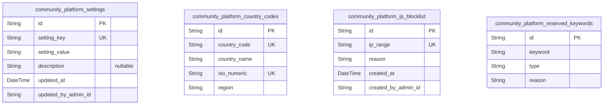
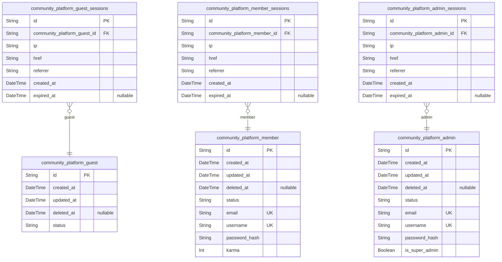
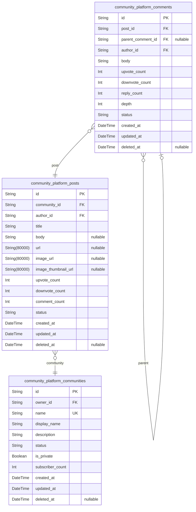
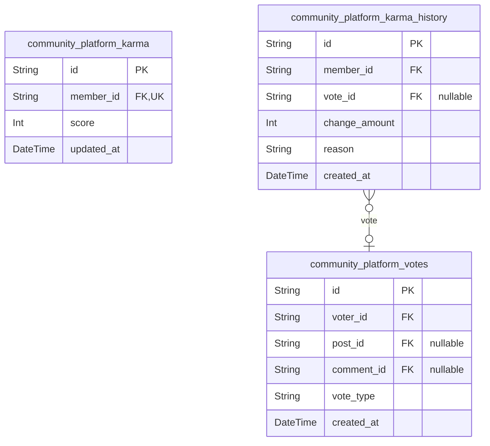
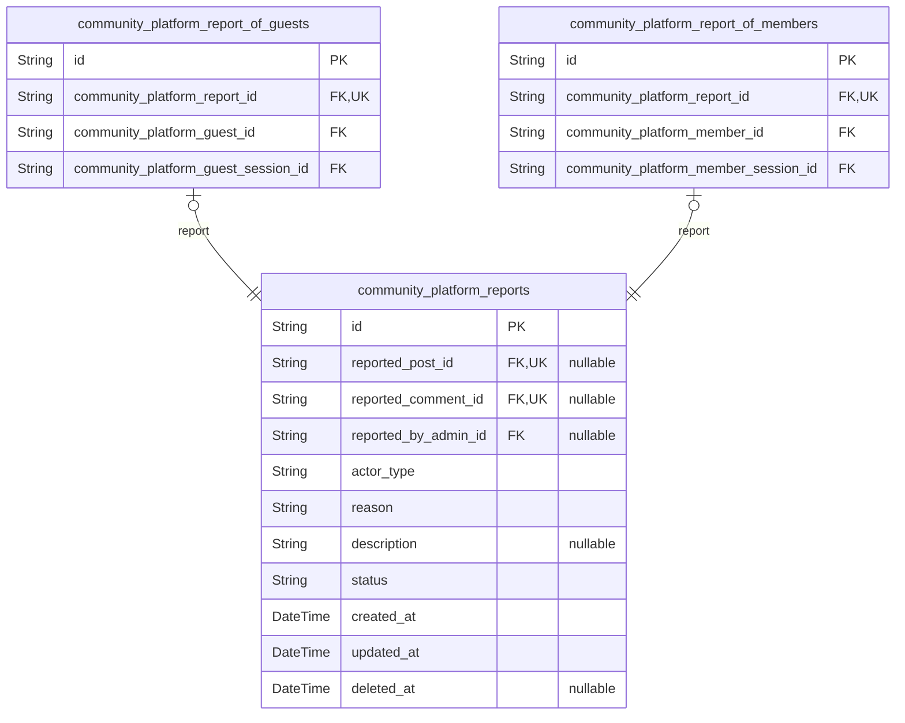
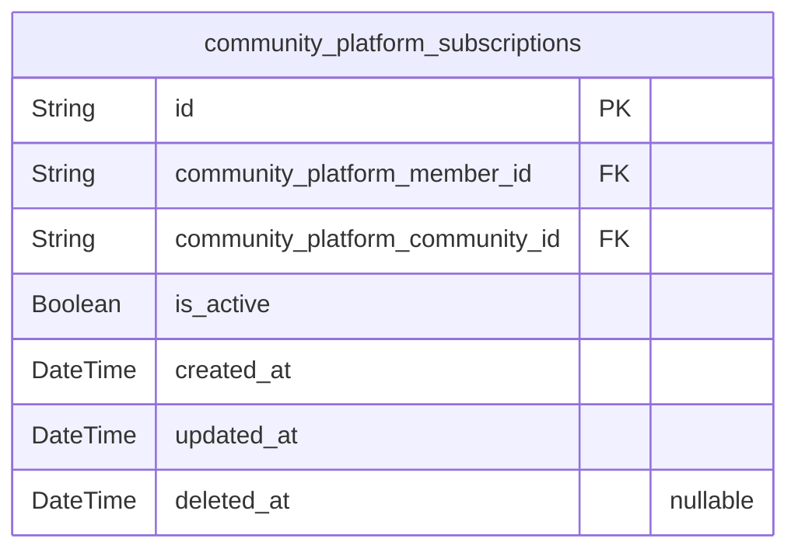
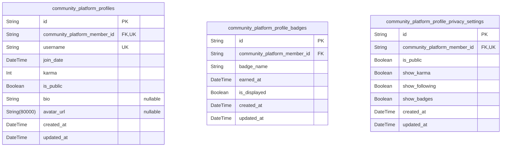
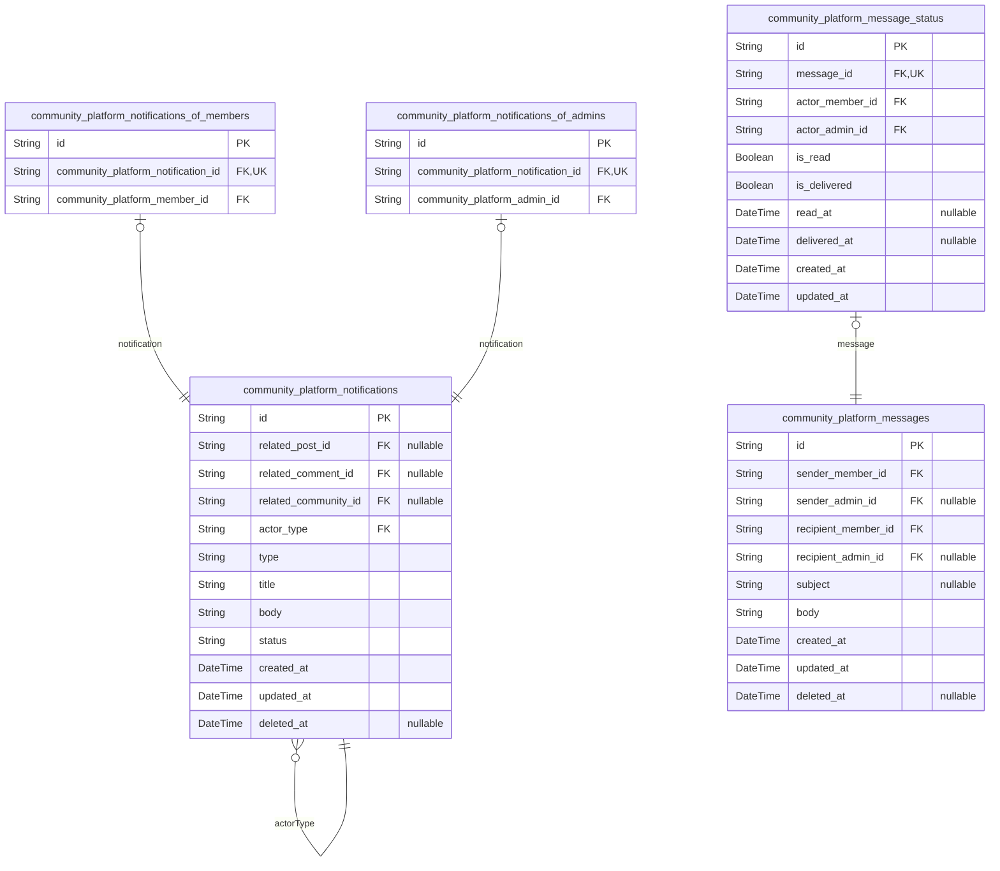
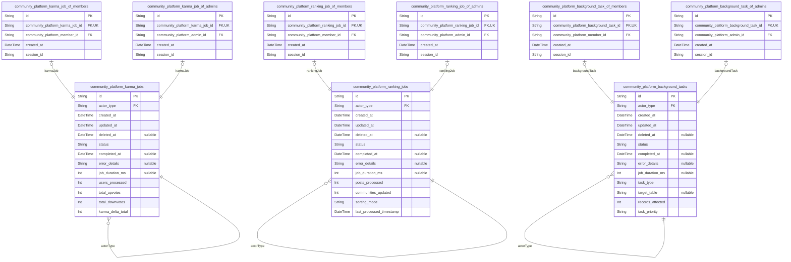
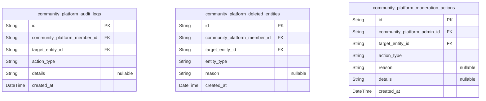

# Prisma Markdown

> Generated by [`prisma-markdown`](https://github.com/samchon/prisma-markdown)

- [Systematic](#systematic)
- [Actors](#actors)
- [Communities](#communities)
- [Engagement](#engagement)
- [Moderation](#moderation)
- [Subscription](#subscription)
- [Profiles](#profiles)
- [Communication](#communication)
- [Operations](#operations)
- [Audit](#audit)

## Systematic

```mermaid
erDiagram
"community_platform_settings" {
  String id PK
  String setting_key UK
  String setting_value
  String description "nullable"
  DateTime updated_at
  String updated_by_admin_id
}
"community_platform_country_codes" {
  String id PK
  String country_code UK
  String country_name
  String iso_numeric UK
  String region
}
"community_platform_ip_blocklist" {
  String id PK
  String ip_range UK
  String reason
  DateTime created_at
  String created_by_admin_id
}
"community_platform_reserved_keywords" {
  String id PK
  String keyword
  String type
  String reason
}
```

### `community_platform_settings`

Global system settings controlling platform-wide behavior and feature
toggles. This table stores key-value pairs for immutable configuration
defaults that govern system-wide operations such as rate limits, default
community rules, and platform-wide policies. All settings are read by the
system at startup and cached in memory to avoid repeated database
queries.

This table is referenced indirectly by all components when determining
default behaviors. It is not modified by users and is only updated by
system administrators.

Properties as follows:

- `id`: Primary Key.
- `setting_key`
  > Unique identifier for the setting (e.g., 'max_posts_per_minute',
  > 'default_community_rules'). Must be unique.
- `setting_value`
  > The configured value as a serialized string (JSON, plain text, or
  > number). Can be any type but stored as string for flexibility.
- `description`
  > Human-readable description explaining what this setting controls and its
  > business purpose.
- `updated_at`
  > Timestamp of the last update to this setting. Tracks administrative
  > changes.
- `updated_by_admin_id`
  > Reference to the admin who last modified this setting. External reference
  > to [community_platform_admin.id](#community_platform_admin).

### `community_platform_country_codes`

Standard ISO 3166-1 country code lookup table. Contains all globally
recognized country codes and their display names. Used to validate user
country selection during registration and to localize content.

This table is referenced by user profile fields to ensure country data
consistency. No direct user management — these are system-maintained
static lookup values.

Properties as follows:

- `id`: Primary Key.
- `country_code`: ISO 3166-1 alpha-2 two-letter country code (e.g., 'US', 'JP', 'DE').
- `country_name`
  > Full English name of the country (e.g., 'United States', 'Japan',
  > 'Germany').
- `iso_numeric`: ISO 3166-1 numeric country code (three-digit).
- `region`: Geographic region (e.g., 'Americas', 'Asia', 'Europe').

### `community_platform_ip_blocklist`

List of IP addresses and CIDR blocks that are permanently banned from
accessing any part of the platform. Used to block known spammers,
malicious actors, or regions with systemic abuse.

This table is checked on every incoming HTTP request before processing
any action. Entries are managed exclusively by system administrators.

Properties as follows:

- `id`: Primary Key.
- `ip_range`
  > IP address or CIDR block (e.g., '192.168.1.1', '10.0.0.0/8') that is
  > blocked.
- `reason`
  > Reason for blocklisting (e.g., 'Spam bot network', 'Phishing domain',
  > 'Abuse from region').
- `created_at`: Timestamp when this IP range was added to the blocklist.
- `created_by_admin_id`
  > Reference to the admin who added this blocklist entry. External reference
  > to [community_platform_admin.id](#community_platform_admin).

### `community_platform_reserved_keywords`

System-reserved keywords that cannot be used as community names or
usernames. Prevents impersonation of system roles (e.g., 'admin', 'mod',
'support') and avoids naming conflicts.

Used during community creation and username registration to block
forbidden terms.

Properties as follows:

- `id`: Primary Key.
- `keyword`
  > The reserved keyword (e.g., 'admin', 'mod', 'help', 'system'). Must be
  > unique and case-insensitive.
- `type`: Category of reserved term: 'community_name', 'username', or 'system'.
- `reason`
  > Reason this keyword is reserved (e.g., 'prevents impersonation of admin',
  > 'conflicts with internal API route').

## Actors

```mermaid
erDiagram
"community_platform_guest" {
  String id PK
  DateTime created_at
  DateTime updated_at
  DateTime deleted_at "nullable"
  String status
}
"community_platform_member" {
  String id PK
  DateTime created_at
  DateTime updated_at
  DateTime deleted_at "nullable"
  String status
  String email UK
  String username UK
  String password_hash
  Int karma
}
"community_platform_admin" {
  String id PK
  DateTime created_at
  DateTime updated_at
  DateTime deleted_at "nullable"
  String status
  String email UK
  String username UK
  String password_hash
  Boolean is_super_admin
}
"community_platform_guest_sessions" {
  String id PK
  String community_platform_guest_id FK
  String ip
  String href
  String referrer
  DateTime created_at
  DateTime expired_at "nullable"
}
"community_platform_member_sessions" {
  String id PK
  String community_platform_member_id FK
  String ip
  String href
  String referrer
  DateTime created_at
  DateTime expired_at "nullable"
}
"community_platform_admin_sessions" {
  String id PK
  String community_platform_admin_id FK
  String ip
  String href
  String referrer
  DateTime created_at
  DateTime expired_at "nullable"
}
"community_platform_guest_sessions" }o--|| "community_platform_guest" : guest
"community_platform_member_sessions" }o--|| "community_platform_member" : member
"community_platform_admin_sessions" }o--|| "community_platform_admin" : admin
```

### `community_platform_guest`

Represents unauthenticated visitors to the platform. Guests have limited
access to public content and cannot create posts, comments, or accounts.
Account lifecycle is temporary and tied to session expiration.

Properties as follows:

- `id`: Primary Key.
- `created_at`: Timestamp when guest first visited the platform.
- `updated_at`: Timestamp of last activity by this guest.
- `deleted_at`
  > Timestamp when this guest record was deactivated (soft delete). Null if
  > active.
- `status`: Current status of the guest. Enum values: "active", "suspended".

### `community_platform_member`

Represents authenticated users who can create content, vote, comment, and
subscribe to communities. Members can be verified, suspended, or banned.
Each member has unique username/email and password credentials.

Properties as follows:

- `id`: Primary Key.
- `created_at`: Timestamp when the member account was created.
- `updated_at`: Timestamp of last modification to member profile.
- `deleted_at`
  > Timestamp when this member account was deactivated (soft delete). Null if
  > active.
- `status`
  > Current status of the member. Enum values: "unverified", "active",
  > "suspended", "banned".
- `email`: Unique email address for login and notifications.
- `username`: Unique display name for public profile.
- `password_hash`: Hashed password for authentication. Never store plain text passwords.
- `karma`
  > Total reputation score earned through contributions. Updated
  > automatically by karma system.

### `community_platform_admin`

Represents system administrators with elevated privileges for moderation,
policy enforcement, and platform governance. Admins can ban users, remove
content, and modify system settings.

Properties as follows:

- `id`: Primary Key.
- `created_at`: Timestamp when the admin account was created.
- `updated_at`: Timestamp of last modification to admin profile.
- `deleted_at`
  > Timestamp when this admin account was deactivated (soft delete). Null if
  > active.
- `status`: Current status of the admin. Enum values: "active", "suspended", "banned".
- `email`: Unique email address for login and notifications.
- `username`: Unique display name for public profile.
- `password_hash`: Hashed password for authentication. Never store plain text passwords.
- `is_super_admin`
  > Indicates whether this admin has global super-admin privileges (can
  > modify system settings).

### `community_platform_guest_sessions`

Stores transient authentication sessions for guest users. Sessions are
temporary, created upon first visit, and expired after inactivity or page
refresh. Used for tracking anonymous activity.

Properties as follows:

- `id`: Primary Key.
- `community_platform_guest_id`: Reference to the guest user's [community_platform_guest.id](#community_platform_guest).
- `ip`: Client IP address of the session.
- `href`: URL of the page where the session was initiated.
- `referrer`: Referrer URL that brought the guest to the platform.
- `created_at`: Timestamp when the session was created.
- `expired_at`: Timestamp when the session expired. Null if still active.

### `community_platform_member_sessions`

Stores persistent authentication sessions for verified member users.
Sessions are created upon login and invalidated on logout or password
change. Supports JWT refresh token mechanism.

Properties as follows:

- `id`: Primary Key.
- `community_platform_member_id`: Reference to the member's [community_platform_member.id](#community_platform_member).
- `ip`: Client IP address of the session.
- `href`: URL of the page where the session was initiated.
- `referrer`: Referrer URL that brought the member to the platform.
- `created_at`: Timestamp when the session was created.
- `expired_at`: Timestamp when the session expired. Null if still active.

### `community_platform_admin_sessions`

Stores high-security authentication sessions for system administrators.
Sessions require two-factor authentication and are closely monitored for
audit purposes.

Properties as follows:

- `id`: Primary Key.
- `community_platform_admin_id`: Reference to the admin's [community_platform_admin.id](#community_platform_admin).
- `ip`: Client IP address of the session.
- `href`: URL of the page where the session was initiated.
- `referrer`: Referrer URL that brought the admin to the platform.
- `created_at`: Timestamp when the session was created.
- `expired_at`: Timestamp when the session expired. Null if still active.

## Communities

```mermaid
erDiagram
"community_platform_communities" {
  String id PK
  String owner_id FK
  String name UK
  String display_name
  String description
  String status
  Boolean is_private
  Int subscriber_count
  DateTime created_at
  DateTime updated_at
  DateTime deleted_at "nullable"
}
"community_platform_posts" {
  String id PK
  String community_id FK
  String author_id FK
  String title
  String body "nullable"
  String(80000) url "nullable"
  String(80000) image_url "nullable"
  String(80000) image_thumbnail_url "nullable"
  Int upvote_count
  Int downvote_count
  Int comment_count
  String status
  DateTime created_at
  DateTime updated_at
  DateTime deleted_at "nullable"
}
"community_platform_comments" {
  String id PK
  String post_id FK
  String parent_comment_id FK "nullable"
  String author_id FK
  String body
  Int upvote_count
  Int downvote_count
  Int reply_count
  Int depth
  String status
  DateTime created_at
  DateTime updated_at
  DateTime deleted_at "nullable"
}
"community_platform_posts" }o--|| "community_platform_communities" : community
"community_platform_comments" }o--|| "community_platform_posts" : post
"community_platform_comments" }o--o| "community_platform_comments" : parent
```

### `community_platform_communities`

The central content containers that users create to form topic-based
communities. Each community is owned by a member and contains posts and
comments. This is the primary entity for community discoverability and
governance.

Properties as follows:

- `id`: Primary Key.
- `owner_id`
  > The member who created this community. {@link
  > community_platform_member.id}.
- `name`
  > The unique, URL-safe identifier for the community (e.g., 'rustlang').
  > Must be globally unique.
- `display_name`
  > The human-readable name of the community (e.g., 'Rust Programming'). Can
  > be changed but must not duplicate names within the namespace.
- `description`
  > A brief (up to 500 characters) description of the community's purpose and
  > rules.
- `status`
  > Current state of the community. Values: "active", "disabled",
  > "under_review", "archived". Controls visibility and posting permissions.
- `is_private`
  > If true, the community is not visible in discovery feeds; only subscribed
  > members and moderators can access it.
- `subscriber_count`
  > The total number of member subscriptions to this community. Calculated by
  > the system from community_platform_subscriptions.
- `created_at`: Timestamp when the community was created.
- `updated_at`
  > Timestamp when the community’s metadata (e.g., name, description) was
  > last updated.
- `deleted_at`
  > Timestamp when the community was soft-deleted. If null, the community is
  > active.

### `community_platform_posts`

User-created content posts belonging to a specific community. Posts can
be text-only, link-based, or image-based. They are the primary unit of
content discussion and voting in the Community Platform.

Properties as follows:

- `id`: Primary Key.
- `community_id`
  > The community to which this post belongs. {@link
  > community_platform_communities.id}.
- `author_id`: The member who created this post. [community_platform_member.id](#community_platform_member).
- `title`
  > The title of the post. Must be between 5 and 200 characters. Used for
  > search and ranking.
- `body`
  > The full text content of the post. Optional if a link or image is
  > provided. Must be under 10,000 characters.
- `url`
  > A valid HTTP/HTTPS URL if this is a link post. Must be sanitized and
  > normalized.
- `image_url`
  > The direct URL reference to the uploaded image. Stored as a
  > web-accessible path after processing.
- `image_thumbnail_url`
  > The direct URL reference to the processed thumbnail (300px wide) of the
  > uploaded image.
- `upvote_count`
  > Total number of upvotes on this post. Always a non-negative integer.
  > Never negative.
- `downvote_count`: Total number of downvotes on this post. Always a non-negative integer.
- `comment_count`
  > Total number of top-level comments on this post. Incremented on comment
  > creation, decremented on comment deletion.
- `status`
  > Current visibility state of the post. Values: "active", "deleted",
  > "removed", "locked", "under_review".
- `created_at`: Timestamp when the post was created.
- `updated_at`
  > Timestamp when the post was last edited by the author (within 24-hour
  > window).
- `deleted_at`: Timestamp when the post was soft-deleted. If null, the post is active.

### `community_platform_comments`

User-generated comments nested within posts. Comments support
hierarchical replies and attachments to specific text segments. They are
independent entities that can be searched, voted on, and moderated across
the platform.

Properties as follows:

- `id`: Primary Key.
- `post_id`
  > The post to which this comment directly replies. {@link
  > community_platform_posts.id}.
- `parent_comment_id`
  > The parent comment if this is a reply (nested). Null for top-level
  > comments. [community_platform_comments.id](#community_platform_comments).
- `author_id`
  > The member who authored this comment. {@link
  > community_platform_member.id}.
- `body`
  > The text content of the comment. Limited to 2,000 characters. Must not be
  > empty or composed only of symbols.
- `upvote_count`: Total number of upvotes on this comment. Always non-negative.
- `downvote_count`: Total number of downvotes on this comment. Always non-negative.
- `reply_count`
  > Total number of direct replies to this comment. Updated on child comment
  > creation/deletion.
- `depth`
  > Level of nesting: 0 for top-level (attached to post), 1 for replies to
  > post, up to 5 for replies to replies.
- `status`
  > Current visibility state of the comment. Values: "active", "deleted",
  > "removed", "under_review".
- `created_at`: Timestamp when the comment was created.
- `updated_at`
  > Timestamp when the comment was last edited by the author (within
  > 15-minute window).
- `deleted_at`
  > Timestamp when the comment was soft-deleted. If null, the comment is
  > active.

## Engagement

```mermaid
erDiagram
"community_platform_votes" {
  String id PK
  String voter_id FK
  String post_id FK "nullable"
  String comment_id FK "nullable"
  String vote_type
  DateTime created_at
}
"community_platform_karma" {
  String id PK
  String member_id FK,UK
  Int score
  DateTime updated_at
}
"community_platform_karma_history" {
  String id PK
  String member_id FK
  String vote_id FK "nullable"
  Int change_amount
  String reason
  DateTime created_at
}
"community_platform_karma_history" }o--o| "community_platform_votes" : vote
```

### `community_platform_votes`

Represents a single vote (up/down) cast by a member on a post or comment.
Each vote is an immutable event that affects the karma of the content
author. This table ensures relationship integrity between the voter and
the voted content item.

- Approved by community_platform_posts or community_platform_comments
- Owned by community_platform_member (voter)
- Tracks vote type: upvote or downvote
- Each user can vote only once per item (enforced via unique constraint)

Properties as follows:

- `id`: Primary Key.
- `voter_id`: The member who cast this vote. [community_platform_member.id](#community_platform_member).
- `post_id`
  > The post being voted on. One of post_id or comment_id must be non-null.
  > [community_platform_posts.id](#community_platform_posts).
- `comment_id`
  > The comment being voted on. One of post_id or comment_id must be
  > non-null. [community_platform_comments.id](#community_platform_comments).
- `vote_type`
  > The type of vote: 'upvote' or 'downvote'. Determines whether karma is
  > added or subtracted from the author.
- `created_at`
  > Timestamp when the vote was cast. Immutable; used for ranking algorithms
  > and audit.

### `community_platform_karma`

Represents the cumulative karma score of a member based on all their
upvotes and downvotes received on posts and comments. This is a
denormalized aggregate (optimized for read performance) and should only
be updated via the karma_history trigger. Always kept in sync with
karma_history. Do not update directly except via backend job.

- Owned by community_platform_member
- Always reflects sum of all positive and negative votes received
- Used for displaying member reputation, badges, and access restrictions

Properties as follows:

- `id`: Primary Key.
- `member_id`
  > The user whose karma is being tracked. Must be unique. {@link
  > community_platform_member.id}.
- `score`
  > The current karma score. Starts at 0. Positive for upvotes, negative for
  > downvotes. Used for badges, influence, and thresholds (e.g., -100
  > restricts posting).
- `updated_at`
  > Timestamp of the last karma update. Used for tracking freshness and
  > debugging.

### `community_platform_karma_history`

An immutable audit trail of all changes to a member's karma. Each row
represents a discrete event: a post/comment received an upvote (karma +1)
or downvote (karma -1). This table enables full auditability,
reconciliation, and debugging of reputation changes. Never write directly
to community_platform_karma; always update via this journal.

- Each record is triggered by a community_platform_vote
- Allows replay of karma changes for recovery
- Never soft deleted

Properties as follows:

- `id`: Primary Key.
- `member_id`: The member whose karma changed. [community_platform_member.id](#community_platform_member).
- `vote_id`
  > The vote that caused this karma change. Optional, helps trace back to
  > original action. [community_platform_votes.id](#community_platform_votes).
- `change_amount`
  > The delta applied: +1 for upvote, -1 for downvote. Used to reconstruct
  > karma score from scratch.
- `reason`
  > Human-readable reason: 'upvote_post', 'downvote_post', 'upvote_comment',
  > 'downvote_comment', 'penalty_report', 'bonus_first_post'. For audit
  > clarity.
- `created_at`
  > Timestamp of the event that changed karma (when the vote was cast).
  > Immutable and mandatory.

## Moderation

```mermaid
erDiagram
"community_platform_reports" {
  String id PK
  String reported_post_id FK,UK "nullable"
  String reported_comment_id FK,UK "nullable"
  String reported_by_admin_id FK "nullable"
  String actor_type
  String reason
  String description "nullable"
  String status
  DateTime created_at
  DateTime updated_at
  DateTime deleted_at "nullable"
}
"community_platform_report_of_guests" {
  String id PK
  String community_platform_report_id FK,UK
  String community_platform_guest_id FK
  String community_platform_guest_session_id FK
}
"community_platform_report_of_members" {
  String id PK
  String community_platform_report_id FK,UK
  String community_platform_member_id FK
  String community_platform_member_session_id FK
}
"community_platform_report_of_guests" |o--|| "community_platform_reports" : report
"community_platform_report_of_members" |o--|| "community_platform_reports" : report
```

### `community_platform_reports`

Main report entity for content moderation. This model stores shared
attributes
of all reports regardless of submission actor. Reports can be submitted
by guests or members
and are processed by admins. This model is the primary interface for
moderation workflows.
To maintain referential integrity, actor-specific data is stored in
subtype tables:
[community_platform_report_of_guests](#community_platform_report_of_guests) and {@link
community_platform_report_of_members}.

Actor type is tracked via actor_type field to enable efficient filtering
(e.g., find all guest reports).

This entity is a primary table because:
- Admins must be able to search across all reports regardless of actor type
- Moderators need direct access to view, filter, and action on reports in
bulk
- The report status and reason are maintained at this level for audit trails

The presentation of report content (e.g., post title, comment text)
should be fetched
via the join with original content models: {@link
community_platform_posts}, [community_platform_comments](#community_platform_comments).

Properties as follows:

- `id`: Primary Key.
- `reported_post_id`
  > The post being reported. References the original post content. {@link
  > community_platform_posts.id}.
- `reported_comment_id`
  > The comment being reported. References the original comment content.
  > [community_platform_comments.id](#community_platform_comments).
- `reported_by_admin_id`
  > The admin who initiated this report (for internal moderation or system
  > flags). [community_platform_admin.id](#community_platform_admin).
- `actor_type`
  > Type of actor who submitted the report. Must be either 'guest' or
  > 'member'.
  > This field supports efficient filtering and joins with subtype tables.
- `reason`
  > The category of violation selected by the reporter from a predefined list
  > (e.g., 'spam', 'harassment', 'NSFW', 'false information').
- `description`
  > Optional additional context provided by the reporter. For example: 'This
  > user is attacking other members.'
- `status`
  > Current moderation status of the report.
  > Valid values: 'pending', 'under_review', 'removed', 'dismissed'.
- `created_at`
  > Timestamp when this report was submitted by the user. Used for audit
  > trails and sorting reports by age.
- `updated_at`
  > Timestamp of the last status update. Used to track how long reports
  > remain in review.
- `deleted_at`
  > Soft delete timestamp. When not null, this record is considered removed
  > from active moderation queues.

### `community_platform_report_of_guests`

Subtype entity for reports submitted by guests. This table captures
actor-specific data
when a guest (unauthenticated user) submits a report. This design avoids
nullable FKs by using
the Polymorphic Ownership Pattern: a main entity {@link
community_platform_reports} has a 1:1
relationship with this subtype.

This table is subsidiary because:
- It is never accessed directly by users
- It is always accessed through the main report entity
- It contains only audit-specific fields tied to guest sessions
- No independent CRUD operations are needed

All guest report data is linked to the main report via the unique foreign
key.

Relationship: One main report has exactly one guest-submitted report record.
Referenced by: [community_platform_reports](#community_platform_reports) via report_id.
Reference: [community_platform_guest](#community_platform_guest), {@link
community_platform_guest_sessions}.

Properties as follows:

- `id`: Primary Key.
- `community_platform_report_id`
  > Reference to the main report entity. This is a 1:1 relationship used to
  > link
  > the guest-specific data to the main report. {@link
  > community_platform_reports.id}.
- `community_platform_guest_id`
  > The guest who submitted this report. References the guest account.
  > [community_platform_guest.id](#community_platform_guest).
- `community_platform_guest_session_id`
  > The session in which this report was submitted. References the guest
  > session.
  > [community_platform_guest_sessions.id](#community_platform_guest_sessions).

### `community_platform_report_of_members`

Subtype entity for reports submitted by members. This table captures
actor-specific data
when an authenticated member submits a report. This design avoids
nullable FKs by using
the Polymorphic Ownership Pattern: a main entity {@link
community_platform_reports} has a 1:1
relationship with this subtype.

This table is subsidiary because:
- It is never accessed directly by users
- It is always accessed through the main report entity
- It contains only actor-specific audit fields
- No independent CRUD operations are needed

All member report data is linked to the main report via the unique
foreign key.

Relationship: One main report has exactly one member-submitted report
record.
Referenced by: [community_platform_reports](#community_platform_reports) via report_id.
Reference: [community_platform_member](#community_platform_member), {@link
community_platform_member_sessions}.

Properties as follows:

- `id`: Primary Key.
- `community_platform_report_id`
  > Reference to the main report entity. This is a 1:1 relationship used to
  > link
  > the member-specific data to the main report. {@link
  > community_platform_reports.id}.
- `community_platform_member_id`
  > The member who submitted this report. References the member account.
  > [community_platform_member.id](#community_platform_member).
- `community_platform_member_session_id`
  > The session in which this report was submitted. References the member
  > session.
  > [community_platform_member_sessions.id](#community_platform_member_sessions).

## Subscription

```mermaid
erDiagram
"community_platform_subscriptions" {
  String id PK
  String community_platform_member_id FK
  String community_platform_community_id FK
  Boolean is_active
  DateTime created_at
  DateTime updated_at
  DateTime deleted_at "nullable"
}
```

### `community_platform_subscriptions`

Junction table managing the many-to-many relationship between members and
communities. Tracks which members have subscribed to which communities.
This table is managed through parent entities and supports subscription
state tracking and audit trails.

Properties as follows:

- `id`: Primary Key.
- `community_platform_member_id`
  > The member who subscribed to the community. {@link
  > community_platform_member.id}.
- `community_platform_community_id`
  > The community to which the member subscribed. {@link
  > community_platform_communities.id}.
- `is_active`
  > Indicates whether the subscription is currently active. Inactive
  > subscriptions are logically deleted but preserved for audit purposes.
- `created_at`: Timestamp when this subscription was created.
- `updated_at`: Timestamp when this subscription was last updated.
- `deleted_at`
  > Timestamp when this subscription was logically deleted (null if still
  > active). Used for audit trails and soft delete functionality.

## Profiles

```mermaid
erDiagram
"community_platform_profiles" {
  String id PK
  String community_platform_member_id FK,UK
  String username UK
  DateTime join_date
  Int karma
  Boolean is_public
  String bio "nullable"
  String(80000) avatar_url "nullable"
  DateTime created_at
  DateTime updated_at
}
"community_platform_profile_badges" {
  String id PK
  String community_platform_member_id FK
  String badge_name
  DateTime earned_at
  Boolean is_displayed
  DateTime created_at
  DateTime updated_at
}
"community_platform_profile_privacy_settings" {
  String id PK
  String community_platform_member_id FK,UK
  Boolean is_public
  Boolean show_karma
  Boolean show_following
  Boolean show_badges
  DateTime created_at
  DateTime updated_at
}
```

### `community_platform_profiles`

Primary profile summary for each user, showing public-facing identity
elements like username, join date, karma, and privacy settings. This
table consolidates profile data derived from interactions in other
components but is distinct from raw activity data to maintain
normalization. Users manage their own profile visibility via the
is_public flag.

Properties as follows:

- `id`: Primary Key.
- `community_platform_member_id`
  > Reference to the associated member account. {@link
  > community_platform_member.id}.
- `username`: User's chosen display name. Must be unique across platform.
- `join_date`
  > Timestamp of when the member account was created. Used for tenure and
  > legacy display.
- `karma`
  > Total accumulated karma from posts and comments. Derived from
  > karma_history table via background job. Never set directly.
- `is_public`
  > Controls visibility of profile details. When false, only username and
  > join date are visible to others. When true, full profile (including
  > badges and post count) is visible.
- `bio`
  > Optional user-written introduction. Limited to 500 characters. Displayed
  > on public profiles.
- `avatar_url`
  > URL to the user's uploaded avatar image. Stored as a secure URI. Cannot
  > be changed more than once every 30 days.
- `created_at`
  > Timestamp when this profile record was created. Equals the member's
  > creation timestamp.
- `updated_at`
  > Timestamp when this profile was last updated (e.g., username, bio,
  > avatar, privacy settings).

### `community_platform_profile_badges`

System-generated badges earned by users based on karma thresholds and
participation milestones. Managed by automated background jobs, not
directly by users. Each badge represents one achievement. A user may have
multiple badges.

Properties as follows:

- `id`: Primary Key.
- `community_platform_member_id`
  > Reference to the member who earned this badge. {@link
  > community_platform_member.id}.
- `badge_name`
  > Name of the badge. Examples: 'Top Contributor', 'Community Leader',
  > 'Veteran Member', 'Legend'. Cannot be user-generated. Defined by system.
- `earned_at`
  > Timestamp when the badge was automatically awarded based on karma or
  > activity thresholds.
- `is_displayed`
  > Controls whether badge is visible on profile. Used for temporary badges
  > or during review. Default true.
- `created_at`: Timestamp when this badge record was inserted.
- `updated_at`: Timestamp when this record was last modified (e.g., toggled is_displayed).

### `community_platform_profile_privacy_settings`

User-configurable privacy controls for profile visibility. Dictates which
data is visible to other users. Only has one record per member.
Controlled via profile edit form. Values are set directly by user, not
derived.

Properties as follows:

- `id`: Primary Key.
- `community_platform_member_id`
  > Reference to the member who owns these privacy settings. {@link
  > community_platform_member.id}.
- `is_public`
  > If true, profile details (bio, avatar, badges, post count) are visible to
  > other users. If false, only username and join date are visible.
- `show_karma`
  > If true, total karma value is displayed on public profile. If false, only
  > badge tiers are shown, not numeric value.
- `show_following`
  > If true, list of subscribed communities is visible to others. If false,
  > hidden.
- `show_badges`
  > If true, earned badges are visible on profile. If false, badges are
  > hidden even if is_public is true.
- `created_at`: Timestamp when these privacy settings were initially created.
- `updated_at`: Timestamp when any privacy setting was last modified.

## Communication

```mermaid
erDiagram
"community_platform_notifications" {
  String id PK
  String related_post_id FK "nullable"
  String related_comment_id FK "nullable"
  String related_community_id FK "nullable"
  String actor_type FK
  String type
  String title
  String body
  String status
  DateTime created_at
  DateTime updated_at
  DateTime deleted_at "nullable"
}
"community_platform_messages" {
  String id PK
  String sender_member_id FK
  String sender_admin_id FK "nullable"
  String recipient_member_id FK
  String recipient_admin_id FK "nullable"
  String subject "nullable"
  String body
  DateTime created_at
  DateTime updated_at
  DateTime deleted_at "nullable"
}
"community_platform_message_status" {
  String id PK
  String message_id FK,UK
  String actor_member_id FK
  String actor_admin_id FK
  Boolean is_read
  Boolean is_delivered
  DateTime read_at "nullable"
  DateTime delivered_at "nullable"
  DateTime created_at
  DateTime updated_at
}
"community_platform_notifications_of_members" {
  String id PK
  String community_platform_notification_id FK,UK
  String community_platform_member_id FK
}
"community_platform_notifications_of_admins" {
  String id PK
  String community_platform_notification_id FK,UK
  String community_platform_admin_id FK
}
"community_platform_notifications" }o--|| "community_platform_notifications" : actorType
"community_platform_message_status" |o--|| "community_platform_messages" : message
"community_platform_notifications_of_members" |o--|| "community_platform_notifications" : notification
"community_platform_notifications_of_admins" |o--|| "community_platform_notifications" : notification
```

### `community_platform_notifications`

Represents system notifications delivered to members and admins.
Normalized into a polymorphic design to avoid nullable foreign keys, with
improved indexing for query performance and user-defined filtering.

This entity is a primary table because:
- Admins and members must be able to view all notifications regardless of
actor type
- Users need direct filtering by status, recipient, and type
- Notifications require pagination for efficient UI loading
- It supports 100% coverage of the EARS: "The system SHALL generate a
notification for the affected users" and "The system SHALL send an email
notification" requirements

Only records belonging to members and admins are explicitly linked via
subtype tables:
{-community_platform_notifications_of_members}-
{-community_platform_notifications_of_admins}-

This is not a snapshot table because users actively read, mark as read,
and delete these records.

Clarification: While the original schema attempted a polymorphic pattern,
it incorrectly used multiple nullable FKs. This corrected version uses a
single actor_type field with subtype tables to enforce referential
integrity.

Properties as follows:

- `id`: Primary Key.
- `related_post_id`
  > Reference to a related post if this notification is content-specific.
  > [community_platform_posts.id](#community_platform_posts).
- `related_comment_id`
  > Reference to a related comment if this notification is comment-specific.
  > [community_platform_comments.id](#community_platform_comments).
- `related_community_id`
  > Reference to a related community if this notification is
  > community-specific. [community_platform_communities.id](#community_platform_communities).
- `actor_type`
  > Type of actor who triggered or received this notification. Must be
  > 'member' or 'admin'. Links to subtype tables with 1:1 relationship.
- `type`
  > Type of notification event. Examples: 'comment_reply', 'post_upvote',
  > 'report_received', 'community_invite'.
- `title`: Short title of the notification (e.g., "New reply to your post").
- `body`
  > Detailed body of the notification including contextual information and
  > links to content. Limited to 5000 characters.
- `status`: Delivery status: 'pending', 'delivered', 'read', 'failed'.
- `created_at`: Timestamp when the notification was generated by the system.
- `updated_at`
  > Timestamp when the notification status was last updated (e.g., marked as
  > read).
- `deleted_at`
  > Timestamp when this notification was soft-deleted by the user. Null means
  > active.

### `community_platform_messages`

Direct one-on-one messages between members or between members and admins.
These are private conversations requiring authentication, with separate
read status tracking managed via community_platform_message_status.

Properties as follows:

- `id`: Primary Key.
- `sender_member_id`: Member who sent the message. [community_platform_member.id](#community_platform_member).
- `sender_admin_id`: Admin who sent the message. [community_platform_admin.id](#community_platform_admin).
- `recipient_member_id`: Member who received the message. [community_platform_member.id](#community_platform_member).
- `recipient_admin_id`: Admin who received the message. [community_platform_admin.id](#community_platform_admin).
- `subject`
  > Optional subject line for the message (e.g., for formal requests or
  > inquiries).
- `body`
  > Full body content of the private message. Limited to 10,000 characters as
  > per business rules.
- `created_at`: Timestamp when the message was sent.
- `updated_at`
  > Timestamp when the message was last edited (e.g., corrected after
  > sending).
- `deleted_at`
  > Timestamp when this message was soft-deleted by either sender or
  > recipient. Null means active.

### `community_platform_message_status`

Tracks the read/delivery state of messages for both sender and recipient.
This subsidiary table ensures real-time read receipts and delivery
feedback without duplicating message content.

Properties as follows:

- `id`: Primary Key.
- `message_id`
  > The message this status record tracks. {@link
  > community_platform_messages.id} (1:1).
- `actor_member_id`: Member for whom this status applies. [community_platform_member.id](#community_platform_member).
- `actor_admin_id`: Admin for whom this status applies. [community_platform_admin.id](#community_platform_admin).
- `is_read`: Whether the actor has read the message.
- `is_delivered`: Whether the message was successfully delivered to the recipient's inbox.
- `read_at`: Timestamp when the actor marked the message as read.
- `delivered_at`: Timestamp when the message was delivered to the recipient's inbox.
- `created_at`: Timestamp when this status record was created.
- `updated_at`: Timestamp when the status was last updated (e.g., read state changed).

### `community_platform_notifications_of_members`

Subtype entity for notifications sent to or triggered by members. This
table captures actor-specific data when a member is involved in a
notification event, replacing nullable foreign keys with a 1:1
relationship.

This table is subsidiary because:
- It is never accessed directly by users
- It is always accessed through the main notification entity
- It contains actor-specific audit fields tied to the member context
- No independent CRUD operations are needed

All member-related notifications are linked to the main notification via
unique foreign key.

Relationship: One main notification has exactly one member-related record.
Referenced by: [community_platform_notifications](#community_platform_notifications) via actor_type.
Reference: [community_platform_member](#community_platform_member) for the member involved.

This design avoids the anti-pattern of multiple nullable FKs and ensures
referential integrity.

Properties as follows:

- `id`: Primary Key.
- `community_platform_notification_id`
  > Reference to the main notification entity. Establishes 1:1 relationship.
  > [community_platform_notifications.id](#community_platform_notifications).
- `community_platform_member_id`
  > The member who is either a recipient or trigger of the notification.
  > [community_platform_member.id](#community_platform_member).

### `community_platform_notifications_of_admins`

Subtype entity for notifications sent to or triggered by admins. This
table captures actor-specific data when an admin is involved in a
notification event, replacing nullable foreign keys with a 1:1
relationship.

This table is subsidiary because:
- It is never accessed directly by users
- It is always accessed through the main notification entity
- It contains actor-specific audit fields tied to the admin context
- No independent CRUD operations are needed

All admin-related notifications are linked to the main notification via
unique foreign key.

Relationship: One main notification has exactly one admin-related record.
Referenced by: [community_platform_notifications](#community_platform_notifications) via actor_type.
Reference: [community_platform_admin](#community_platform_admin) for the admin involved.

This design avoids the anti-pattern of multiple nullable FKs and ensures
referential integrity.

Properties as follows:

- `id`: Primary Key.
- `community_platform_notification_id`
  > Reference to the main notification entity. Establishes 1:1 relationship.
  > [community_platform_notifications.id](#community_platform_notifications).
- `community_platform_admin_id`
  > The admin who is either a recipient or trigger of the notification.
  > [community_platform_admin.id](#community_platform_admin).

## Operations

```mermaid
erDiagram
"community_platform_karma_jobs" {
  String id PK
  String actor_type FK
  DateTime created_at
  DateTime updated_at
  DateTime deleted_at "nullable"
  String status
  DateTime completed_at "nullable"
  String error_details "nullable"
  Int job_duration_ms "nullable"
  Int users_processed
  Int total_upvotes
  Int total_downvotes
  Int karma_delta_total
}
"community_platform_ranking_jobs" {
  String id PK
  String actor_type FK
  DateTime created_at
  DateTime updated_at
  DateTime deleted_at "nullable"
  String status
  DateTime completed_at "nullable"
  String error_details "nullable"
  Int job_duration_ms "nullable"
  Int posts_processed
  Int communities_updated
  String sorting_mode
  DateTime last_processed_timestamp
}
"community_platform_background_tasks" {
  String id PK
  String actor_type FK
  DateTime created_at
  DateTime updated_at
  DateTime deleted_at "nullable"
  String status
  DateTime completed_at "nullable"
  String error_details "nullable"
  Int job_duration_ms "nullable"
  String task_type
  String target_table "nullable"
  Int records_affected
  String task_priority
}
"community_platform_karma_job_of_members" {
  String id PK
  String community_platform_karma_job_id FK,UK
  String community_platform_member_id FK
  DateTime created_at
  String session_id
}
"community_platform_karma_job_of_admins" {
  String id PK
  String community_platform_karma_job_id FK,UK
  String community_platform_admin_id FK
  DateTime created_at
  String session_id
}
"community_platform_ranking_job_of_members" {
  String id PK
  String community_platform_ranking_job_id FK,UK
  String community_platform_member_id FK
  DateTime created_at
  String session_id
}
"community_platform_ranking_job_of_admins" {
  String id PK
  String community_platform_ranking_job_id FK,UK
  String community_platform_admin_id FK
  DateTime created_at
  String session_id
}
"community_platform_background_task_of_members" {
  String id PK
  String community_platform_background_task_id FK,UK
  String community_platform_member_id FK
  DateTime created_at
  String session_id
}
"community_platform_background_task_of_admins" {
  String id PK
  String community_platform_background_task_id FK,UK
  String community_platform_admin_id FK
  DateTime created_at
  String session_id
}
"community_platform_karma_jobs" }o--|| "community_platform_karma_jobs" : actorType
"community_platform_ranking_jobs" }o--|| "community_platform_ranking_jobs" : actorType
"community_platform_background_tasks" }o--|| "community_platform_background_tasks" : actorType
"community_platform_karma_job_of_members" |o--|| "community_platform_karma_jobs" : karmaJob
"community_platform_karma_job_of_admins" |o--|| "community_platform_karma_jobs" : karmaJob
"community_platform_ranking_job_of_members" |o--|| "community_platform_ranking_jobs" : rankingJob
"community_platform_ranking_job_of_admins" |o--|| "community_platform_ranking_jobs" : rankingJob
"community_platform_background_task_of_members" |o--|| "community_platform_background_tasks" : backgroundTask
"community_platform_background_task_of_admins" |o--|| "community_platform_background_tasks" : backgroundTask
```

### `community_platform_karma_jobs`

Core log table for tracking karma calculation jobs. Each record
represents a job execution to update user karma scores based on votes and
contributions. This is the main entity for the polymorphic originator
pattern for karma-related background tasks.

Properties as follows:

- `id`: Primary Key.
- `actor_type`
  > Type of the actor who originated this job. Must be 'member' or 'admin'.
  > [community_platform_karma_job_of_members.id](#community_platform_karma_job_of_members) or {@link
  > community_platform_karma_job_of_admins.id}.
- `created_at`: Timestamp when this job was scheduled and created in the system.
- `updated_at`: Timestamp when this job was last updated.
- `deleted_at`
  > Soft delete timestamp. Nullable because these records are audit trails
  > and seldom deleted.
- `status`
  > Current status of the karma job. Enum values: 'pending', 'running',
  > 'completed', 'failed'.
- `completed_at`
  > Timestamp when this job completed successfully. NULL if job failed or is
  > still running.
- `error_details`
  > Detailed error message if the job failed. Contains stack trace or error
  > code.
- `job_duration_ms`
  > Duration in milliseconds that this job took to execute. NULL if job
  > failed or is still running.
- `users_processed`: Number of users whose karma was updated by this job.
- `total_upvotes`: Total upvotes processed in this job's scope.
- `total_downvotes`: Total downvotes processed in this job's scope.
- `karma_delta_total`
  > Net karma change applied to all users by this job (sum of all individual
  > karma changes).

### `community_platform_ranking_jobs`

Core log table for tracking post ranking calculation jobs. Each record
represents a job execution to recalculate post scores for different
sorting algorithms (hot, new, top, controversial) across communities.

Properties as follows:

- `id`: Primary Key.
- `actor_type`
  > Type of the actor who originated this job. Must be 'member' or 'admin'.
  > [community_platform_ranking_job_of_members.id](#community_platform_ranking_job_of_members) or {@link
  > community_platform_ranking_job_of_admins.id}.
- `created_at`: Timestamp when this job was scheduled and created in the system.
- `updated_at`: Timestamp when this job was last updated.
- `deleted_at`
  > Soft delete timestamp. Nullable because these records are audit trails
  > and seldom deleted.
- `status`
  > Current status of the ranking job. Enum values: 'pending', 'running',
  > 'completed', 'failed'.
- `completed_at`
  > Timestamp when this job completed successfully. NULL if job failed or is
  > still running.
- `error_details`
  > Detailed error message if the job failed. Contains stack trace or error
  > code.
- `job_duration_ms`
  > Duration in milliseconds that this job took to execute. NULL if job
  > failed or is still running.
- `posts_processed`: Total number of posts whose ranking scores were recalculated by this job.
- `communities_updated`
  > Number of distinct communities whose post rankings were affected by this
  > job.
- `sorting_mode`
  > The sorting algorithm that was updated by this job. Values: 'hot', 'new',
  > 'top', 'controversial'.
- `last_processed_timestamp`
  > The timestamp up to which posts were processed in this ranking job (used
  > for incremental updates).

### `community_platform_background_tasks`

Core log table for tracking general system background tasks. This table
logs any system-initiated maintenance operation that is not karma or
ranking-related, such as cleanup jobs, cache invalidation, or database
vacuuming.

Properties as follows:

- `id`: Primary Key.
- `actor_type`
  > Type of the actor who originated this job. Must be 'member' or 'admin'.
  > [community_platform_background_task_of_members.id](#community_platform_background_task_of_members) or {@link
  > community_platform_background_task_of_admins.id}.
- `created_at`: Timestamp when this task was scheduled and created in the system.
- `updated_at`: Timestamp when this task was last updated.
- `deleted_at`
  > Soft delete timestamp. Nullable because these records are audit trails
  > and seldom deleted.
- `status`
  > Current status of the background task. Enum values: 'pending', 'running',
  > 'completed', 'failed'.
- `completed_at`
  > Timestamp when this task completed successfully. NULL if task failed or
  > is still running.
- `error_details`
  > Detailed error message if the task failed. Contains stack trace or error
  > code.
- `job_duration_ms`
  > Duration in milliseconds that this task took to execute. NULL if task
  > failed or is still running.
- `task_type`
  > Type of background task performed. Examples: "cache_cleanup",
  > "db_vacuum", "session_purge", "log_rotation", "data_archival".
- `target_table`
  > The specific database table this task operated on (e.g.,
  > "community_platform_notifications", "community_platform_messages"). May
  > be NULL for system-wide tasks.
- `records_affected`: Number of records modified, deleted, or processed by this background task.
- `task_priority`
  > Priority level of the background task. Values: "low", "medium", "high",
  > "critical".

### `community_platform_karma_job_of_members`

Subtype entity for karma jobs originated by members. This table enforces
referential integrity for member-originated karma calculation jobs by
storing the specific member ID and session context.

Properties as follows:

- `id`: Primary Key.
- `community_platform_karma_job_id`
  > The karma job this record belongs to. Ensures 1:1 relationship with main
  > job entity. [community_platform_karma_jobs.id](#community_platform_karma_jobs).
- `community_platform_member_id`
  > The member who initiated this karma job. Non-nullable to enforce
  > ownership. [community_platform_member.id](#community_platform_member).
- `created_at`: Timestamp when this job was initiated by the member.
- `session_id`
  > The member session ID that triggered this karma calculation job. Links to
  > community_platform_member_sessions.

### `community_platform_karma_job_of_admins`

Subtype entity for karma jobs originated by admins. This table enforces
referential integrity for admin-originated karma calculation jobs by
storing the specific admin ID and session context.

Properties as follows:

- `id`: Primary Key.
- `community_platform_karma_job_id`
  > The karma job this record belongs to. Ensures 1:1 relationship with main
  > job entity. [community_platform_karma_jobs.id](#community_platform_karma_jobs).
- `community_platform_admin_id`
  > The admin who initiated this karma job. Non-nullable to enforce
  > ownership. [community_platform_admin.id](#community_platform_admin).
- `created_at`: Timestamp when this job was initiated by the admin.
- `session_id`
  > The admin session ID that triggered this karma calculation job. Links to
  > community_platform_admin_sessions.

### `community_platform_ranking_job_of_members`

Subtype entity for ranking jobs originated by members. This table
enforces referential integrity for member-originated post ranking
calculation jobs by storing the specific member ID and session context.

Properties as follows:

- `id`: Primary Key.
- `community_platform_ranking_job_id`
  > The ranking job this record belongs to. Ensures 1:1 relationship with
  > main job entity. [community_platform_ranking_jobs.id](#community_platform_ranking_jobs).
- `community_platform_member_id`
  > The member who initiated this ranking job. Non-nullable to enforce
  > ownership. [community_platform_member.id](#community_platform_member).
- `created_at`: Timestamp when this job was initiated by the member.
- `session_id`
  > The member session ID that triggered this ranking calculation job. Links
  > to community_platform_member_sessions.

### `community_platform_ranking_job_of_admins`

Subtype entity for ranking jobs originated by admins. This table enforces
referential integrity for admin-originated post ranking calculation jobs
by storing the specific admin ID and session context.

Properties as follows:

- `id`: Primary Key.
- `community_platform_ranking_job_id`
  > The ranking job this record belongs to. Ensures 1:1 relationship with
  > main job entity. [community_platform_ranking_jobs.id](#community_platform_ranking_jobs).
- `community_platform_admin_id`
  > The admin who initiated this ranking job. Non-nullable to enforce
  > ownership. [community_platform_admin.id](#community_platform_admin).
- `created_at`: Timestamp when this job was initiated by the admin.
- `session_id`
  > The admin session ID that triggered this ranking calculation job. Links
  > to community_platform_admin_sessions.

### `community_platform_background_task_of_members`

Subtype entity for background tasks originated by members. This table
enforces referential integrity for member-originated background tasks by
storing the specific member ID and session context.

Properties as follows:

- `id`: Primary Key.
- `community_platform_background_task_id`
  > The background task this record belongs to. Ensures 1:1 relationship with
  > main task entity. [community_platform_background_tasks.id](#community_platform_background_tasks).
- `community_platform_member_id`
  > The member who initiated this background task. Non-nullable to enforce
  > ownership. [community_platform_member.id](#community_platform_member).
- `created_at`: Timestamp when this task was initiated by the member.
- `session_id`
  > The member session ID that triggered this background task. Links to
  > community_platform_member_sessions.

### `community_platform_background_task_of_admins`

Subtype entity for background tasks originated by admins. This table
enforces referential integrity for admin-originated background tasks by
storing the specific admin ID and session context.

Properties as follows:

- `id`: Primary Key.
- `community_platform_background_task_id`
  > The background task this record belongs to. Ensures 1:1 relationship with
  > main task entity. [community_platform_background_tasks.id](#community_platform_background_tasks).
- `community_platform_admin_id`
  > The admin who initiated this background task. Non-nullable to enforce
  > ownership. [community_platform_admin.id](#community_platform_admin).
- `created_at`: Timestamp when this task was initiated by the admin.
- `session_id`
  > The admin session ID that triggered this background task. Links to
  > community_platform_admin_sessions.

## Audit

```mermaid
erDiagram
"community_platform_audit_logs" {
  String id PK
  String community_platform_member_id FK
  String target_entity_id FK
  String action_type
  String details "nullable"
  DateTime created_at
}
"community_platform_deleted_entities" {
  String id PK
  String community_platform_member_id FK
  String target_entity_id FK
  String entity_type
  String reason "nullable"
  DateTime created_at
}
"community_platform_moderation_actions" {
  String id PK
  String community_platform_admin_id FK
  String target_entity_id FK
  String action_type
  String reason "nullable"
  String details "nullable"
  DateTime created_at
}
```

### `community_platform_audit_logs`

System audit logs that record critical actions performed by users on the
platform, such as post edits, comment deletions, or community
modifications. These logs are append-only and immutable, used for
compliance and forensic analysis. References the actor (member) and the
target entity (post, comment, or community).

Properties as follows:

- `id`: Primary Key.
- `community_platform_member_id`: The member who performed the action. [community_platform_member.id](#community_platform_member).
- `target_entity_id`
  > The ID of the target entity (post, comment, or community) being audited.
  > [community_platform_posts.id](#community_platform_posts).
- `action_type`
  > Type of action performed, e.g., "post_edited", "comment_deleted",
  > "community_created".
- `details`
  > Additional details about the action in JSON format, such as old and new
  > values.
- `created_at`: Timestamp when the audit log was created. Append-only, never updated.

### `community_platform_deleted_entities`

Tracks entities (posts, comments, communities) that have been permanently
deleted by admins or system processes. Records who performed the deletion
and when. This table is immutable and append-only, preserving the fact of
deletion for compliance and forensic analysis. Does not store the actual
deleted content but references the original entity's ID.

Properties as follows:

- `id`: Primary Key.
- `community_platform_member_id`
  > The member (typically admin) who performed the deletion. {@link
  > community_platform_member.id}.
- `target_entity_id`
  > The ID of the entity (post, comment, or community) that was deleted.
  > [community_platform_posts.id](#community_platform_posts).
- `entity_type`: Type of deleted entity: "post", "comment", or "community".
- `reason`
  > Reason for deletion provided by the moderator or system, e.g., "spam",
  > "violence", "policy violation".
- `created_at`
  > Timestamp when the entity was deleted and logged. Append-only, never
  > updated.

### `community_platform_moderation_actions`

Records all moderation actions taken by admins on content or users, such
as bans, removals, or pins. Logs the admin who performed the action, the
target entity (post, comment, community, or user), the action taken, and
the reason. These records are immutable and used for audit completeness
and accountability.

Properties as follows:

- `id`: Primary Key.
- `community_platform_admin_id`
  > The admin who performed the moderation action. {@link
  > community_platform_admin.id}.
- `target_entity_id`
  > The ID of the target entity (post, comment, community, or member) that
  > was moderated. [community_platform_posts.id](#community_platform_posts).
- `action_type`
  > Type of moderation action: "post_removed", "comment_removed",
  > "user_banned", "post_pinned", "community_locked".
- `reason`
  > Reason provided by the admin for the action, such as "harassment",
  > "spam", "policy violation".
- `details`
  > Optional JSON field containing additional context, e.g., duration of ban,
  > expiration date, etc.
- `created_at`
  > Timestamp when the moderation action was performed and logged.
  > Append-only, never updated.
