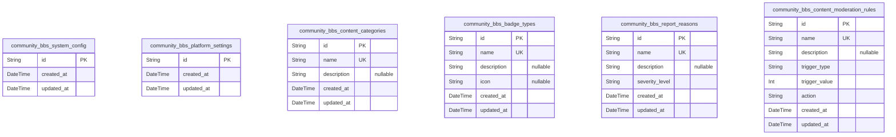
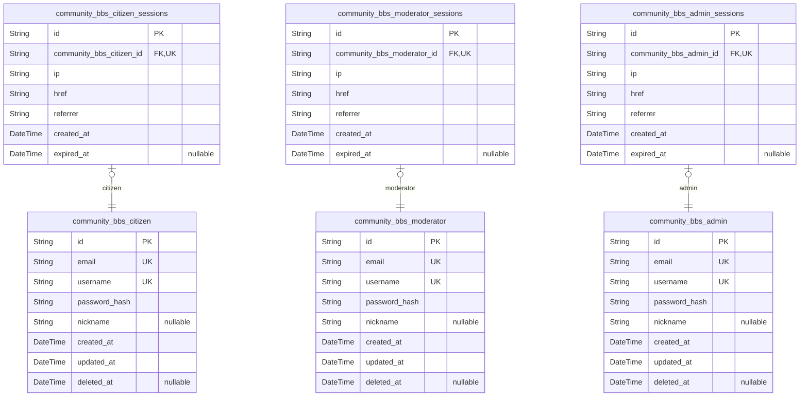
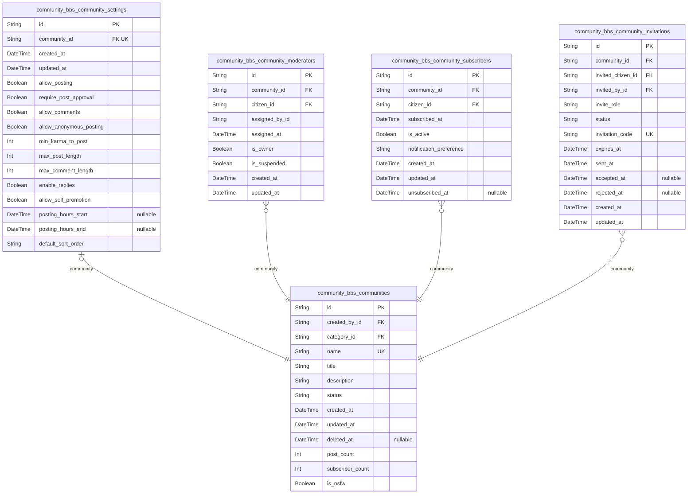
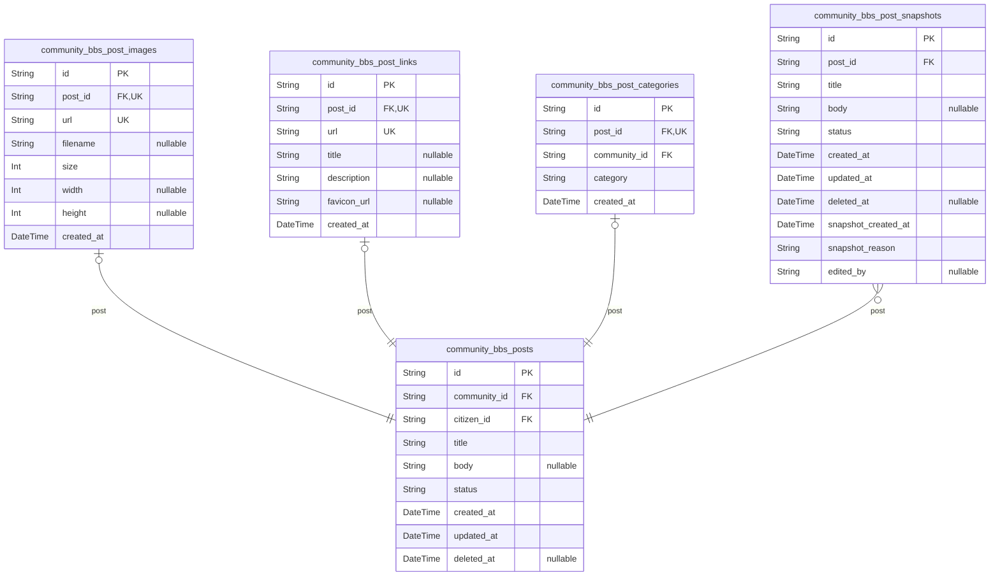
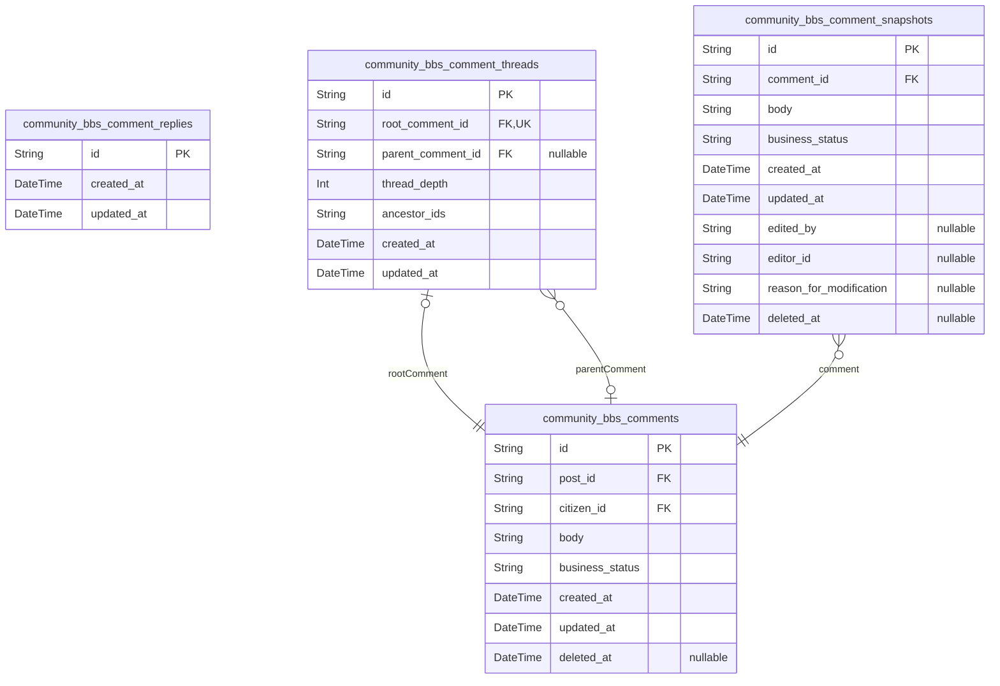
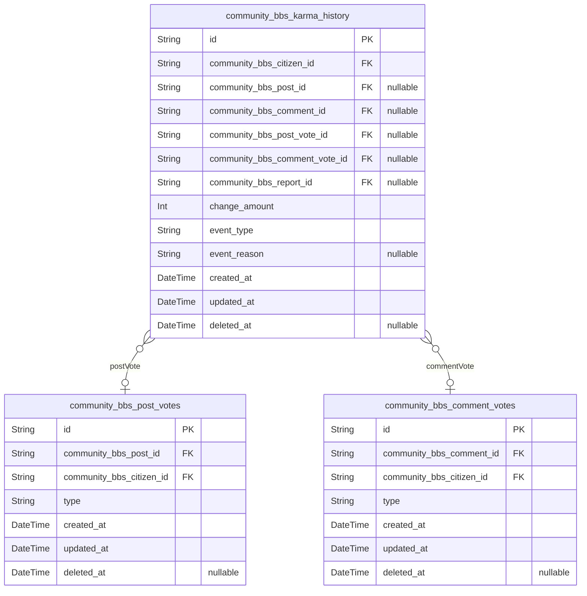
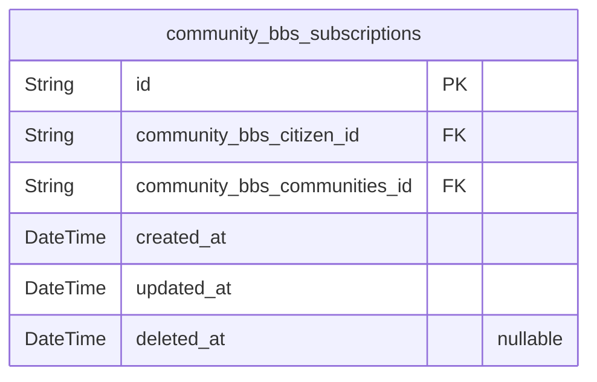
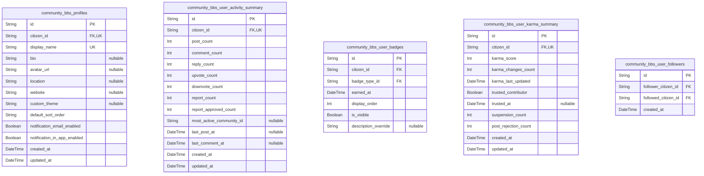
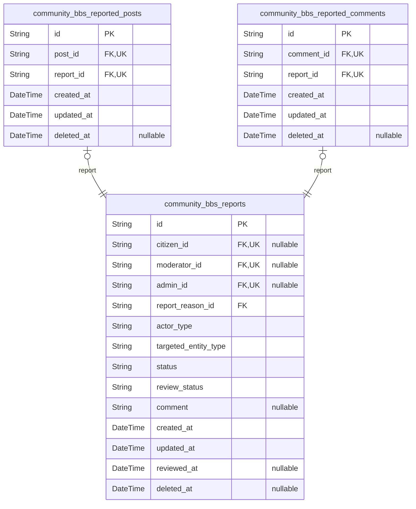
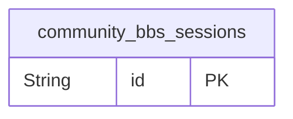

# Prisma Markdown

> Generated by [`prisma-markdown`](https://github.com/samchon/prisma-markdown)

- [Systematic](#systematic)
- [Actors](#actors)
- [Communities](#communities)
- [Posts](#posts)
- [Comments](#comments)
- [Votes](#votes)
- [Subscriptions](#subscriptions)
- [Profiles](#profiles)
- [Reports](#reports)
- [Sessions](#sessions)

## Systematic

```mermaid
erDiagram
"community_bbs_system_config" {
  String id PK
  DateTime created_at
  DateTime updated_at
}
"community_bbs_platform_settings" {
  String id PK
  DateTime created_at
  DateTime updated_at
}
"community_bbs_content_categories" {
  String id PK
  String name UK
  String description "nullable"
  DateTime created_at
  DateTime updated_at
}
"community_bbs_badge_types" {
  String id PK
  String name UK
  String description "nullable"
  String icon "nullable"
  DateTime created_at
  DateTime updated_at
}
"community_bbs_report_reasons" {
  String id PK
  String name UK
  String description "nullable"
  String severity_level
  DateTime created_at
  DateTime updated_at
}
"community_bbs_content_moderation_rules" {
  String id PK
  String name UK
  String description "nullable"
  String trigger_type
  Int trigger_value
  String action
  DateTime created_at
  DateTime updated_at
}
```

### `community_bbs_system_config`

Core system configuration settings that control platform-wide behavior
and operational parameters.

This table stores critical system-level configuration values that apply
across all communities and user interactions. Contains administrative
controls for default behavior, rate limiting thresholds, and
platform-wide settings managed by system administrators.

Properties as follows:

- `id`: Primary Key.
- `created_at`: Timestamp when this system configuration was created.
- `updated_at`: Timestamp when this system configuration was last updated.

### `community_bbs_platform_settings`

Platform-wide configuration settings that define operational parameters
for the entire communityBBS system.

Manages global configuration for platform features including posting
limits, user permissions, system notifications, and default behavior for
all communities. These settings override any community-specific
configurations and are managed by system administrators.

Properties as follows:

- `id`: Primary Key.
- `created_at`: Timestamp when this platform setting was created.
- `updated_at`: Timestamp when this platform setting was last updated.

### `community_bbs_content_categories`

System-defined categories for organizing and classifying user-generated
content.

Provides a standardized taxonomy for categorizing posts and other content
types across the platform. Used for content filtering, moderation, and
recommendation systems. Each category represents a broad theme for
community discussion (e.g., "Technology", "Community News", "Events").

Properties as follows:

- `id`: Primary Key.
- `name`: Human-readable name of the content category.
- `description`: Detailed description explaining the purpose and scope of this category.
- `created_at`: Timestamp when this content category was created.
- `updated_at`: Timestamp when this content category was last updated.

### `community_bbs_badge_types`

System-defined badge types that recognize user achievements and
contributions within the community.

Provides a standardized set of achievement badges that can be awarded to
citizens based on their activity and contributions. Each badge type
represents a specific milestone or behavior (e.g., "First Post", "Trusted
Contributor", "Moderator") and is displayed on user profiles.

Properties as follows:

- `id`: Primary Key.
- `name`: Human-readable name of the badge type.
- `description`: Detailed explanation of the criteria for earning this badge.
- `icon`: Optional reference to icon asset for this badge type.
- `created_at`: Timestamp when this badge type was created.
- `updated_at`: Timestamp when this badge type was last updated.

### `community_bbs_report_reasons`

System-defined reasons for reporting content, standardizing user feedback
on inappropriate material.

Provides a comprehensive but standardized set of reasons users can select
when reporting content violations. This ensures consistent categorization
of reported content by moderators and enables effective content
moderation patterns across the platform.

Properties as follows:

- `id`: Primary Key.
- `name`: Human-readable name of the report reason.
- `description`: Detailed explanation of what constitutes a violation of this category.
- `severity_level`: Severity level designation for this reason (e.g., low, medium, high).
- `created_at`: Timestamp when this report reason was created.
- `updated_at`: Timestamp when this report reason was last updated.

### `community_bbs_content_moderation_rules`

System-defined content moderation rules that define how the system
automatically handles reported content and user behavior.

Contains the policy rules that govern automated moderation actions
including when to hide content, issue warnings, suspend users, and
escalate to human moderators. These rules are based on thresholds for
reports, user reputation, time-based factors, and spam patterns across
the platform.

Properties as follows:

- `id`: Primary Key.
- `name`: Human-readable name of this moderation rule.
- `description`: Detailed explanation of this rule's purpose and trigger conditions.
- `trigger_type`
  > Type of trigger for this rule (e.g., report_count, reputation_threshold,
  > spam_pattern).
- `trigger_value`
  > Threshold value that triggers this rule (e.g., 5 reports, reputation
  > below 0).
- `action`
  > Action to perform when rule is triggered (e.g., hide, warn, suspend,
  > delete).
- `created_at`: Timestamp when this moderation rule was created.
- `updated_at`: Timestamp when this moderation rule was last updated.

## Actors

```mermaid
erDiagram
"community_bbs_citizen" {
  String id PK
  String email UK
  String username UK
  String password_hash
  String nickname "nullable"
  DateTime created_at
  DateTime updated_at
  DateTime deleted_at "nullable"
}
"community_bbs_citizen_sessions" {
  String id PK
  String community_bbs_citizen_id FK,UK
  String ip
  String href
  String referrer
  DateTime created_at
  DateTime expired_at "nullable"
}
"community_bbs_moderator" {
  String id PK
  String email UK
  String username UK
  String password_hash
  String nickname "nullable"
  DateTime created_at
  DateTime updated_at
  DateTime deleted_at "nullable"
}
"community_bbs_moderator_sessions" {
  String id PK
  String community_bbs_moderator_id FK,UK
  String ip
  String href
  String referrer
  DateTime created_at
  DateTime expired_at "nullable"
}
"community_bbs_admin" {
  String id PK
  String email UK
  String username UK
  String password_hash
  String nickname "nullable"
  DateTime created_at
  DateTime updated_at
  DateTime deleted_at "nullable"
}
"community_bbs_admin_sessions" {
  String id PK
  String community_bbs_admin_id FK,UK
  String ip
  String href
  String referrer
  DateTime created_at
  DateTime expired_at "nullable"
}
"community_bbs_citizen_sessions" |o--|| "community_bbs_citizen" : citizen
"community_bbs_moderator_sessions" |o--|| "community_bbs_moderator" : moderator
"community_bbs_admin_sessions" |o--|| "community_bbs_admin" : admin
```

### `community_bbs_citizen`

Primary citizen actor in the community system. Represents a registered
user who can participate in discussions, create posts, and comment on
content. Each citizen has a unique username, email, and password_hash
credential for authentication.

Properties as follows:

- `id`: Primary Key.
- `email`
  > Email address used for authentication and account recovery. Must be
  > unique and verified.
- `username`
  > Public-facing username displayed in posts and comments. Must be unique
  > and follow naming conventions.
- `password_hash`
  > BCrypt-hashed password for secure authentication. Never stored in plain
  > text.
- `nickname`
  > Optional display name that may differ from username. Used in
  > notifications and UI.
- `created_at`: Timestamp when the citizen account was registered.
- `updated_at`: Timestamp of the last update to citizen profile or authentication data.
- `deleted_at`: Soft delete timestamp; null indicates account is active.

### `community_bbs_citizen_sessions`

Session record for citizen authentication. Each session represents an
active login instance from a specific device or browser. Session data is
ephemeral and tied to the citizen's identity for tracking authenticated
interactions.

Properties as follows:

- `id`: Primary Key.
- `community_bbs_citizen_id`
  > Reference to the citizen account this session belongs to. {@link
  > community_bbs_citizen.id}
- `ip`
  > IP address from which the session was initiated. Used for security and
  > geographic analysis.
- `href`
  > Full URL of the page where the login occurred. Used for session context
  > tracking.
- `referrer`: HTTP referrer URL indicating where the user came from before login.
- `created_at`: Timestamp when the session was initiated.
- `expired_at`
  > Timestamp when this session expires or was manually revoked. Null if
  > still active.

### `community_bbs_moderator`

Moderator actor with elevated permissions to review, hide, or remove
content. Moderators are selected from trusted citizen users and given
limited authority over community content. Their identity remains distinct
from regular citizens.

Properties as follows:

- `id`: Primary Key.
- `email`
  > Email address used for authentication and account recovery. Must be
  > unique and verified.
- `username`
  > Public-facing username displayed in moderation logs and community
  > communications. Must be unique.
- `password_hash`
  > BCrypt-hashed password for secure authentication. Never stored in plain
  > text.
- `nickname`: Optional display name used in moderation notices and system notifications.
- `created_at`: Timestamp when the moderator account was activated.
- `updated_at`: Timestamp of the last update to moderator profile or authentication data.
- `deleted_at`: Soft delete timestamp; null indicates account is active.

### `community_bbs_moderator_sessions`

Session record for moderator authentication. Tracks each active login
session for moderators, enabling accountability and security isolation
from regular citizen sessions.

Properties as follows:

- `id`: Primary Key.
- `community_bbs_moderator_id`
  > Reference to the moderator account this session belongs to. {@link
  > community_bbs_moderator.id}
- `ip`
  > IP address from which the session was initiated. Used for security and
  > geographic analysis.
- `href`
  > Full URL of the page where the login occurred. Used for session context
  > tracking.
- `referrer`: HTTP referrer URL indicating where the user came from before login.
- `created_at`: Timestamp when the session was initiated.
- `expired_at`
  > Timestamp when this session expires or was manually revoked. Null if
  > still active.

### `community_bbs_admin`

Administrator actor with full system access. Admins manage platform
settings, handle legal compliance, oversee moderator actions, and resolve
citizen disputes. Admin accounts are highly restricted and require
multi-factor authentication.

Properties as follows:

- `id`: Primary Key.
- `email`
  > Email address used for authentication and system notifications. Must be
  > unique and verified.
- `username`
  > Public-facing administrator username, used in audit logs and system
  > communications.
- `password_hash`
  > BCrypt-hashed password for secure authentication. Never stored in plain
  > text.
- `nickname`: Optional display name for administrative interfaces and internal notes.
- `created_at`: Timestamp when the admin account was created.
- `updated_at`: Timestamp of the last update to admin profile or authentication data.
- `deleted_at`: Soft delete timestamp; null indicates account is active.

### `community_bbs_admin_sessions`

Session record for administrator authentication. Every admin login
creates a session that is strictly tracked for security and audit
purposes. Admin sessions are isolated from all other actor sessions to
prevent privilege escalation.

Properties as follows:

- `id`: Primary Key.
- `community_bbs_admin_id`
  > Reference to the admin account this session belongs to. {@link
  > community_bbs_admin.id}
- `ip`
  > IP address from which the session was initiated. Used for security and
  > geographic analysis.
- `href`
  > Full URL of the page where the login occurred. Used for session context
  > tracking.
- `referrer`: HTTP referrer URL indicating where the user came from before login.
- `created_at`: Timestamp when the session was initiated.
- `expired_at`
  > Timestamp when this session expires or was manually revoked. Null if
  > still active.

## Communities

```mermaid
erDiagram
"community_bbs_communities" {
  String id PK
  String created_by_id FK
  String category_id FK
  String name UK
  String title
  String description
  String status
  DateTime created_at
  DateTime updated_at
  DateTime deleted_at "nullable"
  Int post_count
  Int subscriber_count
  Boolean is_nsfw
}
"community_bbs_community_settings" {
  String id PK
  String community_id FK,UK
  DateTime created_at
  DateTime updated_at
  Boolean allow_posting
  Boolean require_post_approval
  Boolean allow_comments
  Boolean allow_anonymous_posting
  Int min_karma_to_post
  Int max_post_length
  Int max_comment_length
  Boolean enable_replies
  Boolean allow_self_promotion
  DateTime posting_hours_start "nullable"
  DateTime posting_hours_end "nullable"
  String default_sort_order
}
"community_bbs_community_moderators" {
  String id PK
  String community_id FK
  String citizen_id FK
  String assigned_by_id
  DateTime assigned_at
  Boolean is_owner
  Boolean is_suspended
  DateTime created_at
  DateTime updated_at
}
"community_bbs_community_subscribers" {
  String id PK
  String community_id FK
  String citizen_id FK
  DateTime subscribed_at
  Boolean is_active
  String notification_preference
  DateTime created_at
  DateTime updated_at
  DateTime unsubscribed_at "nullable"
}
"community_bbs_community_invitations" {
  String id PK
  String community_id FK
  String invited_citizen_id FK
  String invited_by_id FK
  String invite_role
  String status
  String invitation_code UK
  DateTime expires_at
  DateTime sent_at
  DateTime accepted_at "nullable"
  DateTime rejected_at "nullable"
  DateTime created_at
  DateTime updated_at
}
"community_bbs_community_settings" |o--|| "community_bbs_communities" : community
"community_bbs_community_moderators" }o--|| "community_bbs_communities" : community
"community_bbs_community_subscribers" }o--|| "community_bbs_communities" : community
"community_bbs_community_invitations" }o--|| "community_bbs_communities" : community
```

### `community_bbs_communities`

Main community entity representing independent discussion spaces
(subreddits). Each community has its own rules, moderators, and
subscribers. Communities are created by citizens and can be discovered by
others based on their category and status.

Properties as follows:

- `id`: Primary Key.
- `created_by_id`: The citizen who created this community. [community_bbs_citizen.id](#community_bbs_citizen).
- `category_id`
  > The content category this community belongs to. {@link
  > community_bbs_content_categories.id}.
- `name`
  > Unique identifier for the community in URL format (e.g., 'python',
  > 'technology'). Must be unique across all communities.
- `title`
  > Display name of the community shown to users. Can use spaces and special
  > characters.
- `description`
  > Brief description explaining the purpose and rules of the community,
  > visible to all members.
- `status`
  > Current status of the community. Valid values: 'active', 'archived',
  > 'pending_review', 'suspended'.
- `created_at`: Timestamp when the community was created.
- `updated_at`: Timestamp when the community was last updated.
- `deleted_at`: Timestamp when the community was soft-deleted (null if active).
- `post_count`
  > Cumulative count of posts in this community. Updated automatically when
  > posts are created/removed.
- `subscriber_count`
  > Current number of subscribers to this community. Updated automatically
  > when subscribers join/leave.
- `is_nsfw`
  > Whether this community contains content that may be inappropriate for
  > some audiences.

### `community_bbs_community_settings`

Configuration settings for each community that determine behavior,
moderation rules, and visibility. Different communities can have
different settings for posting permissions, voting rules, etc. This table
maintains 1:1 relationship with main community entity.

Properties as follows:

- `id`: Primary Key.
- `community_id`
  > The community this setting applies to. {@link
  > community_bbs_communities.id}.
- `created_at`: Timestamp when these settings were created.
- `updated_at`: Timestamp when these settings were last updated.
- `allow_posting`: Whether users are allowed to create new posts in this community.
- `require_post_approval`: Whether new posts must be approved by a moderator before becoming visible.
- `allow_comments`: Whether users can add comments to posts in this community.
- `allow_anonymous_posting`
  > Whether users can post without being logged in (not applicable in this
  > system).
- `min_karma_to_post`
  > Minimum karma threshold a citizen must have to post in this community. -1
  > means no threshold.
- `max_post_length`: Maximum character limit for post content in this community.
- `max_comment_length`: Maximum character limit for comments in this community.
- `enable_replies`: Whether threads can have nested replies to comments.
- `allow_self_promotion`: Whether users can promote their own content (links, products, services).
- `posting_hours_start`: Start time when posting is allowed (in UTC). May be null for 24/7 posting.
- `posting_hours_end`: End time when posting is allowed (in UTC). May be null for 24/7 posting.
- `default_sort_order`
  > Default sort order for posts in this community. Valid values: 'hot',
  > 'new', 'top', 'controversial'.

### `community_bbs_community_moderators`

Represents moderators assigned to communities, giving them authority to
manage content and users within a specific community. Each moderator is a
citizen assigned to a particular community with specific moderation
privileges.

Properties as follows:

- `id`: Primary Key.
- `community_id`
  > The community this moderator is assigned to. {@link
  > community_bbs_communities.id}.
- `citizen_id`
  > The citizen who is serving as a moderator. {@link
  > community_bbs_citizen.id}.
- `assigned_by_id`
  > The citizen or admin who assigned this moderator to the community. {@link
  > community_bbs_citizen.id}.
- `assigned_at`: Timestamp when this moderator was assigned to the community.
- `is_owner`
  > Whether this moderator is the original creator of the community. Owner
  > has ultimate authority.
- `is_suspended`
  > Whether this moderator's privileges have been temporarily suspended for
  > misconduct.
- `created_at`: Timestamp when this moderator assignment was created.
- `updated_at`: Timestamp when this moderator assignment was last updated.

### `community_bbs_community_subscribers`

Tracks which citizens are subscribed to which communities, enabling
notification delivery and content personalization. A subscription
indicates interest in receiving new content from the community.

Properties as follows:

- `id`: Primary Key.
- `community_id`: The community being subscribed to. [community_bbs_communities.id](#community_bbs_communities).
- `citizen_id`: The citizen who is subscribed. [community_bbs_citizen.id](#community_bbs_citizen).
- `subscribed_at`: Timestamp when the citizen subscribed to this community.
- `is_active`: Whether the subscription is currently active (not muted or unsubscribed).
- `notification_preference`
  > How often this citizen wants to be notified about new posts. Values:
  > 'every_post', 'daily_digest', 'weekly_digest', 'none'.
- `created_at`: Timestamp when this subscription record was created.
- `updated_at`: Timestamp when this subscription record was last updated.
- `unsubscribed_at`: Timestamp when this subscription was deactivated (null if still active).

### `community_bbs_community_invitations`

Manages invitations sent to citizens to join a community as a moderator
or subscriber. This allows community owners to invite trusted users and
extends community growth beyond public discovery.

Properties as follows:

- `id`: Primary Key.
- `community_id`: The community being invited to. [community_bbs_communities.id](#community_bbs_communities).
- `invited_citizen_id`: The citizen who was invited. [community_bbs_citizen.id](#community_bbs_citizen).
- `invited_by_id`: The citizen who sent the invitation. [community_bbs_citizen.id](#community_bbs_citizen).
- `invite_role`: The role being invited for. Values: 'moderator', 'subscriber'.
- `status`
  > Current status of the invitation. Values: 'pending', 'accepted',
  > 'rejected', 'expired'.
- `invitation_code`
  > Unique code used to accept the invitation securely. Must be randomly
  > generated.
- `expires_at`: Timestamp when the invitation will expire if not accepted.
- `sent_at`: Timestamp when the invitation was sent.
- `accepted_at`: Timestamp when the invitation was accepted (null if not accepted).
- `rejected_at`: Timestamp when the invitation was rejected (null if not rejected).
- `created_at`: Timestamp when this invitation record was created.
- `updated_at`: Timestamp when this invitation record was last updated.

## Posts

```mermaid
erDiagram
"community_bbs_posts" {
  String id PK
  String community_id FK
  String citizen_id FK
  String title
  String body "nullable"
  String status
  DateTime created_at
  DateTime updated_at
  DateTime deleted_at "nullable"
}
"community_bbs_post_images" {
  String id PK
  String post_id FK,UK
  String url UK
  String filename "nullable"
  Int size
  Int width "nullable"
  Int height "nullable"
  DateTime created_at
}
"community_bbs_post_links" {
  String id PK
  String post_id FK,UK
  String url UK
  String title "nullable"
  String description "nullable"
  String favicon_url "nullable"
  DateTime created_at
}
"community_bbs_post_categories" {
  String id PK
  String post_id FK,UK
  String community_id FK
  String category
  DateTime created_at
}
"community_bbs_post_snapshots" {
  String id PK
  String post_id FK
  String title
  String body "nullable"
  String status
  DateTime created_at
  DateTime updated_at
  DateTime deleted_at "nullable"
  DateTime snapshot_created_at
  String snapshot_reason
  String edited_by "nullable"
}
"community_bbs_post_images" |o--|| "community_bbs_posts" : post
"community_bbs_post_links" |o--|| "community_bbs_posts" : post
"community_bbs_post_categories" |o--|| "community_bbs_posts" : post
"community_bbs_post_snapshots" }o--|| "community_bbs_posts" : post
```

### `community_bbs_posts`

User-submitted content including text, links, or images posted to
communities.

Represents primary content that citizens create and interact with in
community forums. Posts serve as the foundation for discussion with
comments and votes. Each post belongs to a specific community and is
created by a citizen account.

Posts support rich content through separate linked entities (images or
links). The status field controls visibility - posts can be published,
pending review, or hidden for moderation. Soft deletion allows moderation
and user-initiated removal while maintaining audit trails. This table
must preserve all raw post data without any calculated fields.

Critical for community engagement - enables sorting by hot, new, top, and
controversial metrics through external computation. The snapshot
mechanism ensures historical preservation when posts are edited or
moderated.

Reference: [community_bbs_communities](#community_bbs_communities), {@link
community_bbs_citizen}, [community_bbs_post_images](#community_bbs_post_images), {@link
community_bbs_post_links}, [community_bbs_post_categories](#community_bbs_post_categories), {@link
community_bbs_post_snapshots}

Properties as follows:

- `id`: Primary Key.
- `community_id`: The community this post belongs to. [community_bbs_communities.id](#community_bbs_communities).
- `citizen_id`: The citizen who created this post. [community_bbs_citizen.id](#community_bbs_citizen).
- `title`
  > The title of the post, limited to 200 characters. Required for post
  > creation.
- `body`
  > The main content of the post, containing user-submitted text. Can be
  > empty if post contains only an image or link.
- `status`
  > Current status of the post: 'published', 'pending', or 'hidden'. Affects
  > visibility to users.
- `created_at`: When the post was originally created by the citizen. Immutable timestamp.
- `updated_at`
  > When the post was last updated (e.g., edited).
  >
  > Modified on any edit within the 24-hour editable window.
- `deleted_at`
  > Timestamp when the post was soft-deleted by the author or moderator.
  >
  > Null indicates the post is still active.

### `community_bbs_post_images`

Image attachments associated with posts in the community forum.

Each post can have zero or one image attachment. Images are stored as
references to external URLs for scalability. This separate table ensures
normalization - an image is not a nullable field in posts but a distinct
entity with its own lifecycle.

Managed entirely through the parent post - users cannot manage images
independently, only through their associated post. Follows 3NF by
isolating image data that depends on the post.

Reference: [community_bbs_posts](#community_bbs_posts)

Properties as follows:

- `id`: Primary Key.
- `post_id`: The post this image is attached to. [community_bbs_posts.id](#community_bbs_posts).
- `url`: The public URL to the image file. Must be a valid HTTP/HTTPS URI.
- `filename`: The original filename of the image when uploaded.
- `size`: Size of the image file in bytes for storage and bandwidth estimation.
- `width`: Pixel width of the image.
- `height`: Pixel height of the image.
- `created_at`: When the image was uploaded and attached to the post.

### `community_bbs_post_links`

External link attachments associated with posts in the community forum.

Each post can have zero or one external link. Links are stored as
distinct entities to maintain normalization and avoid nullable fields in
the main post table. This design allows proper indexing and searching of
link content while keeping the post data clean.

Managed entirely through the parent post - users cannot manage links
independently. Follows 3NF by isolating link data from post data.

Reference: [community_bbs_posts](#community_bbs_posts)

Properties as follows:

- `id`: Primary Key.
- `post_id`: The post this link is attached to. [community_bbs_posts.id](#community_bbs_posts).
- `url`
  > The full external URL being shared in the post. Must be a valid
  > HTTP/HTTPS URI.
- `title`
  > Title of the linked resource, extracted from the linked website's meta
  > title tag.
- `description`
  > Description of the linked resource, extracted from the linked website's
  > meta description tag.
- `favicon_url`: The favicon URL for the linked website, for display purposes.
- `created_at`: When the link was attached to the post.

### `community_bbs_post_categories`

Categorization of posts by topic or category in the community forum.

Supports organization of posts into different categories (e.g., 'Events',
'Announcements', 'Discussion', 'Help'). Each post can belong to one
category. A separate table is used to avoid embedded arrays or
comma-separated values in a single field, ensuring proper normalization.

Managed through the parent post and community - categories are selected
by users when posting and can be configured by community moderators.

Reference: [community_bbs_posts](#community_bbs_posts), [community_bbs_communities](#community_bbs_communities)

Properties as follows:

- `id`: Primary Key.
- `post_id`: The post this category applies to. [community_bbs_posts.id](#community_bbs_posts).
- `community_id`
  > The community where this category is defined. {@link
  > community_bbs_communities.id}.
- `category`
  > The name of the category, selected from community-predefined options
  > (e.g., 'Events', 'Announcements', 'Discussion').
- `created_at`: When the category was assigned to the post.

### `community_bbs_post_snapshots`

Historical snapshots of posts for audit trail and versioning purposes.

Captures the precise state of a post at the time it was saved, modified,
or moderated. All fields from the main community_bbs_posts table are
duplicated here to ensure historical data integrity. Read-only snapshots
enable auditing of changes over time.

This snapshot table is critical for compliance and moderation - allows
review of content at the time of reporting or violation. Uses append-only
pattern - snapshots are never modified or deleted, only created when the
original post changes.

Reference: [community_bbs_posts](#community_bbs_posts)

Properties as follows:

- `id`: Primary Key.
- `post_id`: The post this snapshot represents. [community_bbs_posts.id](#community_bbs_posts).
- `title`: The post's title at the time of this snapshot.
- `body`: The main content of the post at the time of this snapshot.
- `status`
  > The status of the post at the time of this snapshot: 'published',
  > 'pending', or 'hidden'.
- `created_at`: Original creation time of the post (copied from community_bbs_posts).
- `updated_at`
  > Time the post was last updated before this snapshot (copied from
  > community_bbs_posts).
- `deleted_at`
  > Timestamp when the original post was soft-deleted (copied from
  > community_bbs_posts). Null if not deleted.
- `snapshot_created_at`: When this snapshot was captured (e.g., on edit or moderation action).
- `snapshot_reason`: Why this snapshot was created: 'edit', 'moderation', 'report', 'initial'.
- `edited_by`
  > The citizen or moderator who triggered this snapshot (if applicable).
  > References either community_bbs_citizen or community_bbs_moderator via
  > application logic.

## Comments

```mermaid
erDiagram
"community_bbs_comments" {
  String id PK
  String post_id FK
  String citizen_id FK
  String body
  String business_status
  DateTime created_at
  DateTime updated_at
  DateTime deleted_at "nullable"
}
"community_bbs_comment_replies" {
  String id PK
  DateTime created_at
  DateTime updated_at
}
"community_bbs_comment_threads" {
  String id PK
  String root_comment_id FK,UK
  String parent_comment_id FK "nullable"
  Int thread_depth
  String ancestor_ids
  DateTime created_at
  DateTime updated_at
}
"community_bbs_comment_snapshots" {
  String id PK
  String comment_id FK
  String body
  String business_status
  DateTime created_at
  DateTime updated_at
  String edited_by "nullable"
  String editor_id "nullable"
  String reason_for_modification "nullable"
  DateTime deleted_at "nullable"
}
"community_bbs_comment_threads" |o--|| "community_bbs_comments" : rootComment
"community_bbs_comment_threads" }o--o| "community_bbs_comments" : parentComment
"community_bbs_comment_snapshots" }o--|| "community_bbs_comments" : comment
```

### `community_bbs_comments`

Primary user comments on posts, representing direct textual responses to
content.

Each comment is a discrete unit of user-generated content attached to a
specific post and authored by a registered citizen. Comments can receive
votes and be reported by other users. They form the core of threaded
discourse and are subject to moderation workflows. Each comment has its
own lifecycle and can be independently edited (within 24-hour window) or
deleted by the author, and moderated by community moderators.

Comments are not nested within other comments in the primary model —
reply relationships are managed via the community_bbs_comment_replies
subsidiary entity to ensure normalized data structure and clean query
patterns.

Properties as follows:

- `id`: Primary Key.
- `post_id`: Post this comment belongs to. [community_bbs_posts.id](#community_bbs_posts).
- `citizen_id`: User who authored this comment. [community_bbs_citizen.id](#community_bbs_citizen).
- `body`
  > The main text content of the comment. Must be at least 3 characters long.
  > Cannot contain prohibited language or spam patterns.
- `business_status`
  > Current moderation state of the comment. Valid values: 'pending_review',
  > 'approved', 'rejected', 'hidden'. Determined by automated filters or
  > moderator action.
- `created_at`: Timestamp when the comment was created. Immutable after creation.
- `updated_at`
  > Timestamp when the comment was last edited. Updated only within 24-hour
  > window of creation. Reflects edit history for transparency.
- `deleted_at`
  > Null if comment is active. Timestamp when comment was soft-deleted by
  > author or moderator. Enables recovery of content while maintaining audit
  > trail.

### `community_bbs_comment_replies`

Supporting entity that defines the direct reply relationship to a primary
comment.

This entity establishes a 1:1 relationship with the primary
community_bbs_comments record, enabling the representation of replies
without denormalizing the main comment data. When a user replies directly
to a comment, this table stores the metadata that links the reply to its
parent comment. This separation ensures optimal query performance and
prevents nullable field proliferation in the primary comment table.

The existence of a record in this table indicates that a comment has
received a direct reply. The parent comment's id is mapped to this
entity's id as the primary and foreign key via unique constraint,
enforcing exactly one reply relationship per comment.

Properties as follows:

- `id`
  > Primary Key. Same value as the parent comment's id to enforce 1:1
  > relationship.
- `created_at`
  > Timestamp when the reply relationship was established. This reflects the
  > creation time of the reply, separate from the parent comment's creation
  > time.
- `updated_at`
  > Timestamp when this reply relationship was last updated. Only updated if
  > metadata about the reply changes.

### `community_bbs_comment_threads`

Supporting entity that maintains the logical thread context of a comment
within a post's comment hierarchy.

This entity captures the full ancestry path of a comment by recording its
direct parent (if any) and all ancestor comment IDs, forming a closed
thread context. It is updated whenever a reply chain becomes active or
grows. This allows for efficient retrieval of entire comment threads
without complex recursive queries.

The thread_id represents the root-level comment of the thread. This table
is updated atomically when a new reply is created or when comments are
moved between contexts. It is managed internally by the system and never
directly modified by users.

Properties as follows:

- `id`: Primary Key. Same value as the root comment's id in this thread.
- `root_comment_id`
  > The root-level comment that starts this thread. {@link
  > community_bbs_comments.id}.
- `parent_comment_id`
  > Direct parent comment of this thread context. Null if this is a root
  > comment. [community_bbs_comments.id](#community_bbs_comments).
- `thread_depth`
  > Number of levels deep this comment thread is nested from the root. Root
  > level = 0, first reply = 1, etc.
- `ancestor_ids`
  > Comma-separated list of parent comment IDs leading to this root. Format:
  > 'id1,id2,id3'. Used for efficient thread traversal. No foreign keys to
  > preserve performance.
- `created_at`
  > Timestamp when this thread context was first established. Updated only
  > when thread structure changes.
- `updated_at`
  > Timestamp when this thread structure was last modified (e.g., new reply
  > added).

### `community_bbs_comment_snapshots`

Historical snapshot of comment states for audit trails and content
moderation.

Each time a comment is edited by its author (within 24-hour window) or
modified by a moderator, a snapshot is created capturing the state of the
comment before the change. This enables tracking of content evolution,
review of moderator actions, and restoration of content if needed.
Snapshots are immutable and append-only. They preserve the original text,
author, and context at the point of modification.

This table does not participate in real-time queries but serves
exclusively for compliance, historical review, and forensic analysis.
Queries against this table are read-only and used primarily by admin and
compliance workflows.

Properties as follows:

- `id`: Primary Key.
- `comment_id`
  > The comment this snapshot records the state of. {@link
  > community_bbs_comments.id}.
- `body`
  > The exact text content of the comment at the moment this snapshot was
  > taken.
- `business_status`
  > The moderation state of the comment at the moment this snapshot was
  > taken. Values: 'pending_review', 'approved', 'rejected', 'hidden'.
- `created_at`
  > The timestamp when this snapshot was captured, not the original comment
  > creation time.
- `updated_at`
  > The timestamp when the original comment was last edited before this
  > snapshot was taken.
- `edited_by`
  > Identifies who modified the comment: 'author' if edited by original user,
  > 'moderator' if edited by moderator. Null for creation snapshots.
- `editor_id`
  > The ID of the user who modified the comment. For author edits:
  > citizen_id. For moderator edits: moderator_id. Null for creation
  > snapshots. [community_bbs_citizen.id](#community_bbs_citizen) or {@link
  > community_bbs_moderator.id}.
- `reason_for_modification`
  > Optional reason provided by moderator when modifying content. For author
  > edits: contains edit summary if provided.
- `deleted_at`
  > The snapshot captures the soft-delete state of the comment at this point
  > in time. Null if comment was active, timestamp if deleted.

## Votes

```mermaid
erDiagram
"community_bbs_post_votes" {
  String id PK
  String community_bbs_post_id FK
  String community_bbs_citizen_id FK
  String type
  DateTime created_at
  DateTime updated_at
  DateTime deleted_at "nullable"
}
"community_bbs_comment_votes" {
  String id PK
  String community_bbs_comment_id FK
  String community_bbs_citizen_id FK
  String type
  DateTime created_at
  DateTime updated_at
  DateTime deleted_at "nullable"
}
"community_bbs_karma_history" {
  String id PK
  String community_bbs_citizen_id FK
  String community_bbs_post_id FK "nullable"
  String community_bbs_comment_id FK "nullable"
  String community_bbs_post_vote_id FK "nullable"
  String community_bbs_comment_vote_id FK "nullable"
  String community_bbs_report_id FK "nullable"
  Int change_amount
  String event_type
  String event_reason "nullable"
  DateTime created_at
  DateTime updated_at
  DateTime deleted_at "nullable"
}
"community_bbs_karma_history" }o--o| "community_bbs_post_votes" : postVote
"community_bbs_karma_history" }o--o| "community_bbs_comment_votes" : commentVote
```

### `community_bbs_post_votes`

Records upvote and downvote actions on posts.

Each record represents a single voting action by a citizen on a specific
post. Votes are binary (upvote or downvote) and are used for ranking
posts by popularity and determining user karma changes.

Voting is a direct, user-initiated action that affects post visibility
and community reputation. Users can change their vote or revoke it, which
is tracked via the deleted_at field. Each user can vote on a post only
once.

Votes are referenced to posts through community_bbs_posts.id and to
citizens through community_bbs_citizen.id. This table does not store post
state or summary data - it only logs individual voter actions.

Properties as follows:

- `id`: Primary Key.
- `community_bbs_post_id`: The post that was voted on. [community_bbs_posts.id](#community_bbs_posts).
- `community_bbs_citizen_id`: The citizen who cast the vote. [community_bbs_citizen.id](#community_bbs_citizen).
- `type`
  > The type of vote: 'upvote' or 'downvote'. Determines whether the post's
  > score increases or decreases.
- `created_at`
  > Timestamp when the vote was cast. Always set at creation and never
  > changed.
- `updated_at`
  > Timestamp when the vote was last modified (e.g., when vote type was
  > changed).
- `deleted_at`
  > Timestamp when the vote was revoked by the voter or removed by
  > moderation. If null, the vote is still active.

### `community_bbs_comment_votes`

Records upvote and downvote actions on comments.

Each record represents a single voting action by a citizen on a specific
comment. Votes are binary (upvote or downvote) and are used for ranking
comments within threads and determining user karma changes.

Voting on comments is a direct, user-initiated action that affects
comment visibility and community reputation. Users can change their vote
or revoke it, which is tracked via the deleted_at field. Each user can
vote on a comment only once.

Votes are referenced to comments through community_bbs_comments.id and to
citizens through community_bbs_citizen.id. This table does not store
comment content or state - it only logs individual voter actions.

Properties as follows:

- `id`: Primary Key.
- `community_bbs_comment_id`: The comment that was voted on. [community_bbs_comments.id](#community_bbs_comments).
- `community_bbs_citizen_id`: The citizen who cast the vote. [community_bbs_citizen.id](#community_bbs_citizen).
- `type`
  > The type of vote: 'upvote' or 'downvote'. Determines whether the
  > comment's score increases or decreases.
- `created_at`
  > Timestamp when the vote was cast. Always set at creation and never
  > changed.
- `updated_at`
  > Timestamp when the vote was last modified (e.g., when vote type was
  > changed).
- `deleted_at`
  > Timestamp when the vote was revoked by the voter or removed by
  > moderation. If null, the vote is still active.

### `community_bbs_karma_history`

Tracks all changes to a citizen's karma score over time.

Each record represents a single event that caused a change in a citizen's
karma score. Karma changes occur in response to posts, comments, votes,
reports, and moderation actions. This table provides a complete audit
trail of reputation changes.

The karma score is calculated as the sum of all events, where upvotes add
+1, downvotes subtract -1, reports result in ±1, and moderation actions
apply custom multipliers. Only positive or negative numeric changes are
recorded. Zero-value changes are not tracked.

This table is critical for reputation systems, trust-level calculations,
and moderation reviews. It connects to citizens through
community_bbs_citizen.id and references the event type and affected
content where applicable.

Properties as follows:

- `id`: Primary Key.
- `community_bbs_citizen_id`: The citizen whose karma changed. [community_bbs_citizen.id](#community_bbs_citizen).
- `community_bbs_post_id`
  > Optional reference to a post that triggered the karma change. {@link
  > community_bbs_posts.id}.
- `community_bbs_comment_id`
  > Optional reference to a comment that triggered the karma change. {@link
  > community_bbs_comments.id}.
- `community_bbs_post_vote_id`
  > Optional reference to the specific post vote that triggered the karma
  > change. [community_bbs_post_votes.id](#community_bbs_post_votes).
- `community_bbs_comment_vote_id`
  > Optional reference to the specific comment vote that triggered the karma
  > change. [community_bbs_comment_votes.id](#community_bbs_comment_votes).
- `community_bbs_report_id`
  > Optional reference to a report that triggered the karma change (e.g., for
  > successful reports). [community_bbs_reports.id](#community_bbs_reports).
- `change_amount`
  > The numerical amount added to the citizen's karma score (positive or
  > negative integer). Examples: +1 (upvote), -1 (downvote), +3 (successful
  > report).
- `event_type`
  > The category of event that caused the change. Examples: 'voted_post',
  > 'voted_comment', 'reported_post', 'reported_comment', 'post_approved',
  > 'comment_removed', 'reputation_adjustment'.
- `event_reason`
  > Optional detailed reason for the karma change (e.g., 'Post marked as
  > spam' or 'Comment flagged for harassment'). Used for audit trails.
- `created_at`
  > Timestamp when the karma change event occurred. Always set at creation
  > and never changed.
- `updated_at`: Timestamp when this karma history record was last modified (rare).
- `deleted_at`
  > Timestamp when this karma history record was removed or reversed (e.g.,
  > if a moderator reversed a decision). If null, the change is still active.

## Subscriptions

```mermaid
erDiagram
"community_bbs_subscriptions" {
  String id PK
  String community_bbs_citizen_id FK
  String community_bbs_communities_id FK
  DateTime created_at
  DateTime updated_at
  DateTime deleted_at "nullable"
}
```

### `community_bbs_subscriptions`

Junction table managing the many-to-many relationship between citizens
and communities for content personalization.

Tracks which citizens subscribe to which communities, enabling
personalized content feeds based on subscription preferences. Each
subscription represents a user's active interest in receiving posts from
a specific community.

Subscriptions are soft-deleted when users unsubscribe, preserving audit
trails of historical community interest while removing current access.
The system prevents duplicate subscriptions through a composite unique
constraint on citizen_id and community_id.

Subscribers receive community updates and can access community-specific
features. Subscription status is managed solely through the deletion
timestamp - no separate status field is needed, following soft-delete
architecture patterns.

Properties as follows:

- `id`: Primary Key.
- `community_bbs_citizen_id`
  > Citizen who has subscribed to the community. {@link
  > community_bbs_citizen.id}.
- `community_bbs_communities_id`
  > Community that the citizen is subscribed to. {@link
  > community_bbs_communities.id}.
- `created_at`
  > Timestamp when the subscription was created. Indicates when the citizen
  > began following this community.
- `updated_at`
  > Timestamp when the subscription was last updated. Usually coincides with
  > creation time unless the subscription is reactivated after deletion.
- `deleted_at`
  > Soft delete timestamp tracking when a citizen unsubscribed from the
  > community. If null, the subscription is active. Used for audit trails and
  > historical analysis of community interest.

## Profiles

```mermaid
erDiagram
"community_bbs_profiles" {
  String id PK
  String citizen_id FK,UK
  String display_name UK
  String bio "nullable"
  String avatar_url "nullable"
  String location "nullable"
  String website "nullable"
  String custom_theme "nullable"
  String default_sort_order
  Boolean notification_email_enabled
  Boolean notification_in_app_enabled
  DateTime created_at
  DateTime updated_at
}
"community_bbs_user_activity_summary" {
  String id PK
  String citizen_id FK,UK
  Int post_count
  Int comment_count
  Int reply_count
  Int upvote_count
  Int downvote_count
  Int report_count
  Int report_approved_count
  String most_active_community_id "nullable"
  DateTime last_post_at "nullable"
  DateTime last_comment_at "nullable"
  DateTime created_at
  DateTime updated_at
}
"community_bbs_user_badges" {
  String id PK
  String citizen_id FK
  String badge_type_id FK
  DateTime earned_at
  Int display_order
  Boolean is_visible
  String description_override "nullable"
}
"community_bbs_user_karma_summary" {
  String id PK
  String citizen_id FK,UK
  Int karma_score
  Int karma_changes_count
  DateTime karma_last_updated
  Boolean trusted_contributor
  DateTime trusted_at "nullable"
  Int suspension_count
  Int post_rejection_count
  DateTime created_at
  DateTime updated_at
}
"community_bbs_user_followers" {
  String id PK
  String follower_citizen_id FK
  String followed_citizen_id FK
  DateTime created_at
}
```

### `community_bbs_profiles`

Core profile representation for each citizen, storing essential identity
and preference data.

This table serves as the primary profile entity that citizens view and
update, containing display information and preferences. It links to the
citizen account through the citizen_id, but stores user-facing profile
information separately to allow for profile customization without
affecting authentication data. Profiles are directly managed by citizens
and appear in public user views across the platform.

Properties as follows:

- `id`: Primary Key.
- `citizen_id`: Reference to the citizen account. [community_bbs_citizen.id](#community_bbs_citizen).
- `display_name`
  > The public-facing name displayed on posts and comments. Must be unique
  > within the community. Used instead of username for user-facing display.
- `bio`
  > Optional biography or description the user provides about themselves.
  > Limited to 500 characters.
- `avatar_url`
  > URL to the user's profile avatar image. Stored as a URI reference to an
  > uploaded image file.
- `location`
  > User-provided location information (e.g., city or neighborhood). Used for
  > local community relevance.
- `website`: Optional personal or professional website URL provided by the user.
- `custom_theme`
  > User-selected theme preference for their profile interface (e.g., light,
  > dark, high-contrast).
- `default_sort_order`
  > Default post sorting preference when viewing communities (e.g., 'hot',
  > 'new', 'top', 'controversial').
- `notification_email_enabled`
  > Whether the user wants to receive email notifications for replies, likes,
  > and moderation actions.
- `notification_in_app_enabled`
  > Whether the user wants to receive in-app notifications for interactions
  > on their content.
- `created_at`
  > Timestamp when this profile was created. Matches the citizen account
  > creation time.
- `updated_at`
  > Timestamp of the last profile update. Updated whenever display_name, bio,
  > avatar_url, or preferences change.

### `community_bbs_user_activity_summary`

Aggregate summary of a citizen's posting and commenting activity across
the platform.

This table provides a rapidly queryable summary of user activity
statistics derived from posts, comments, votes, and reports. It is
updated asynchronously by background jobs whenever a user's activities
change. This table enables fast loading of profile activity counts
without joining multiple transactional tables, improving performance
during profile views and community leaderboards.

Properties as follows:

- `id`: Primary Key.
- `citizen_id`: Reference to the citizen account. [community_bbs_citizen.id](#community_bbs_citizen).
- `post_count`
  > Total number of posts created by this citizen, including published,
  > pending, and deleted posts.
- `comment_count`: Total number of comments created by this citizen across all posts.
- `reply_count`: Total number of direct replies to comments made by this citizen.
- `upvote_count`: Total number of upvotes received on all posts and comments combined.
- `downvote_count`: Total number of downvotes received on all posts and comments combined.
- `report_count`
  > Total number of reports filed against this citizen's content by other
  > users.
- `report_approved_count`
  > Number of reports against this citizen's content that were approved and
  > led to content removal.
- `most_active_community_id`
  > ID of the community where this citizen has contributed the most content.
  > Nullable if activity is spread evenly.
- `last_post_at`
  > Timestamp of the most recent post created by this citizen. Used to
  > determine recent activity.
- `last_comment_at`
  > Timestamp of the most recent comment created by this citizen. Used to
  > identify active users.
- `created_at`
  > Timestamp when this summary was initially created, which occurs when the
  > citizen's first post or comment is published.
- `updated_at`
  > Timestamp when this summary was last updated following any change in the
  > citizen's activity metrics.

### `community_bbs_user_badges`

Collection of badges earned by a citizen for achieving specific community
milestones or behaviors.

This table tracks the badges awarded to each citizen based on their
activity, reputation, and contributions. Badges are automatically granted
by the system when predetermined thresholds are met. Each badge
represents an achievement such as 'First Post', 'Helpful Commenter', or
'Trusted Contributor'. This table stores the relationship between
citizens and their earned badges along with the timestamp of when the
badge was awarded.

Properties as follows:

- `id`: Primary Key.
- `citizen_id`
  > Reference to the citizen who earned the badge. {@link
  > community_bbs_citizen.id}.
- `badge_type_id`
  > Reference to the type of badge earned. {@link
  > community_bbs_badge_types.id}.
- `earned_at`
  > Timestamp when the badge was granted to the citizen. Determined by the
  > system when eligibility criteria were met.
- `display_order`
  > Order in which this badge should be displayed in the user's badge
  > collection. Lower values appear first.
- `is_visible`
  > Whether this badge is currently visible on the user's public profile. Can
  > be toggled by user preferences.
- `description_override`
  > Optional custom description override for this badge instance, if the
  > system allows personalized badge messages.

### `community_bbs_user_karma_summary`

Aggregate summary of a citizen's reputation and karma based on community
interactions.

This table stores the calculated karma score for each citizen, derived
from upvotes, downvotes, report actions, and moderation outcomes. The
karma score is updated asynchronously as citizen actions trigger karma
changes. This summary enables fast display of reputation metrics on user
profiles and content without recomputing scores from transactional tables
in real time. The karma score influences whether posts bypass initial
moderation and determines eligibility for Trusted Contributor status.

Properties as follows:

- `id`: Primary Key.
- `citizen_id`
  > Reference to the citizen whose karma is being summarized. {@link
  > community_bbs_citizen.id}.
- `karma_score`
  > The current total karma score for the citizen, calculated as the sum of
  > all karma changes from actions received.
- `karma_changes_count`
  > Total number of karma changes recorded for this citizen, representing the
  > volume of reputation-modifying interactions.
- `karma_last_updated`
  > Timestamp when the karma score was last recalculated based on new
  > interactions or moderation actions.
- `trusted_contributor`
  > Flag indicating whether the citizen has reached Trusted Contributor
  > status (karma >= 100). This determines post moderation bypass
  > eligibility.
- `trusted_at`
  > Timestamp when the citizen first achieved Trusted Contributor status
  > (karma >= 100). Null if never achieved.
- `suspension_count`
  > Number of times this citizen has been temporarily suspended for guideline
  > violations.
- `post_rejection_count`
  > Number of posts by this citizen that have been permanently rejected by
  > moderators.
- `created_at`
  > Timestamp when this karma summary was first created, which occurs when
  > the citizen's first action triggers a karma change.
- `updated_at`
  > Timestamp when this karma summary was last updated after a karma change
  > event.

### `community_bbs_user_followers`

Relationship table tracking which citizens are following other citizens
on the platform.

This table represents the follower/following relationships between
citizens, enabling social connection and content discovery. When citizen
A follows citizen B, a record is created in this table. The relationships
are bidirectional in the UI (showing 'followers' and 'following' views)
but stored as unidirectional records. This table allows for quick queries
about who follows whom, and supports notifications when followed users
post or comment.

Properties as follows:

- `id`: Primary Key.
- `follower_citizen_id`
  > The citizen who is following another user. {@link
  > community_bbs_citizen.id}.
- `followed_citizen_id`: The citizen who is being followed. [community_bbs_citizen.id](#community_bbs_citizen).
- `created_at`: Timestamp when the follower relationship was established.

## Reports

```mermaid
erDiagram
"community_bbs_reports" {
  String id PK
  String citizen_id FK,UK "nullable"
  String moderator_id FK,UK "nullable"
  String admin_id FK,UK "nullable"
  String report_reason_id FK
  String actor_type
  String targeted_entity_type
  String status
  String review_status
  String comment "nullable"
  DateTime created_at
  DateTime updated_at
  DateTime reviewed_at "nullable"
  DateTime deleted_at "nullable"
}
"community_bbs_reported_posts" {
  String id PK
  String post_id FK,UK
  String report_id FK,UK
  DateTime created_at
  DateTime updated_at
  DateTime deleted_at "nullable"
}
"community_bbs_reported_comments" {
  String id PK
  String comment_id FK,UK
  String report_id FK,UK
  DateTime created_at
  DateTime updated_at
  DateTime deleted_at "nullable"
}
"community_bbs_reported_posts" |o--|| "community_bbs_reports" : report
"community_bbs_reported_comments" |o--|| "community_bbs_reports" : report
```

### `community_bbs_reports`

Main report entity that records content reports from citizens,
moderators, or admins.

This is the central table for all content reports in the system, with a
polymorphic relationship to report targets (posts or comments). Each
report has exactly one reporter (citizen, moderator, or admin) and one
target, identified through the actor_type and targeted_entity_type
fields. The main entity holds the report status, reason, metadata, and
audit trail.

This design avoids nullable foreign key proliferation by using subtype
tables (community_bbs_reported_posts and community_bbs_reported_comments)
to enforce referential integrity. Reports are created by any actor type,
and the system tracks whether they are pending review, approved, or
rejected.

When a report is submitted, it enters a pending state and is reviewed by
a moderator. The reporter can track the status of their report through
the UI. Reports are never deleted but are archived via soft delete when
resolved.

Properties as follows:

- `id`: Primary Key.
- `citizen_id`
  > The citizen who submitted the report if the reporter is a citizen. {@link
  > community_bbs_citizen.id}.
- `moderator_id`
  > The moderator who submitted the report if the reporter is a moderator.
  > [community_bbs_moderator.id](#community_bbs_moderator).
- `admin_id`
  > The admin who submitted the report if the reporter is an admin. {@link
  > community_bbs_admin.id}.
- `report_reason_id`
  > The reason category for the report. {@link
  > community_bbs_report_reasons.id}.
- `actor_type`
  > The type of user who submitted the report. One of: 'citizen',
  > 'moderator', 'admin'.
- `targeted_entity_type`
  > The type of content being reported. One of: 'post', 'comment'. Specifies
  > which subtype table to reference.
- `status`
  > Current status of the report. Valid values: 'pending', 'approved',
  > 'rejected'.
- `review_status`
  > Moderator's review outcome for the report. Valid values: 'unreviewed',
  > 'dismissed', 'actioned'.
- `comment`
  > Additional context or notes provided by the reporter about why the
  > content should be reviewed.
- `created_at`: Timestamp when the report was submitted.
- `updated_at`: Timestamp when the report was last modified.
- `reviewed_at`: Timestamp when the report was reviewed by a moderator. Null if unreviewed.
- `deleted_at`: Soft delete timestamp for archival. Null if report is active.

### `community_bbs_reported_posts`

Subtype table for reports targeting specific posts. This ensures
referential integrity for reports on posts.

This table serves as the target destination for reports on posts in the
polymorphic reporting system. It links directly to the main
community_bbs_reports table with a 1:1 relationship. Each reported post
has exactly one associated report and one associated post target
(community_bbs_posts.id).

The table exists to avoid having nullable foreign keys in the main report
table when the target could be either a post or comment. This design
allows the database to enforce integrity at the schema level - a report
targeting a post must always reference a valid post_id.

This table records the original post_id as a reference. It does not
duplicate content data - that remains in the community_bbs_posts table.
The purpose is purely to establish a strong, non-nullable relationship
between reports and posts.

Properties as follows:

- `id`: Primary Key.
- `post_id`: The original post being reported. [community_bbs_posts.id](#community_bbs_posts).
- `report_id`
  > The main report entity that this subtype belongs to. {@link
  > community_bbs_reports.id}.
- `created_at`: Timestamp when this report-subtype relationship was created.
- `updated_at`: Timestamp when this relationship was last modified.
- `deleted_at`: Soft delete timestamp. Null if relationship is active.

### `community_bbs_reported_comments`

Subtype table for reports targeting specific comments. This ensures
referential integrity for reports on comments.

This table serves as the target destination for reports on comments in
the polymorphic reporting system. It links directly to the main
community_bbs_reports table with a 1:1 relationship. Each reported
comment has exactly one associated report and one associated comment
target (community_bbs_comments.id).

The table exists to avoid having nullable foreign keys in the main report
table when the target could be either a post or comment. This design
allows the database to enforce integrity at the schema level - a report
targeting a comment must always reference a valid comment_id.

This table records the original comment_id as a reference. It does not
duplicate content data - that remains in the community_bbs_comments
table. The purpose is purely to establish a strong, non-nullable
relationship between reports and comments.

Properties as follows:

- `id`: Primary Key.
- `comment_id`: The original comment being reported. [community_bbs_comments.id](#community_bbs_comments).
- `report_id`
  > The main report entity that this subtype belongs to. {@link
  > community_bbs_reports.id}.
- `created_at`: Timestamp when this report-subtype relationship was created.
- `updated_at`: Timestamp when this relationship was last modified.
- `deleted_at`: Soft delete timestamp. Null if relationship is active.

## Sessions

```mermaid
erDiagram
"community_bbs_sessions" {
  String id PK
}
```

### `community_bbs_sessions`

Placeholder model to satisfy schema requirement for non-empty models
array. This component intentionally contains no actual tables as session
management is exclusively handled by the Actors component.

Properties as follows:

- `id`: Primary Key.
