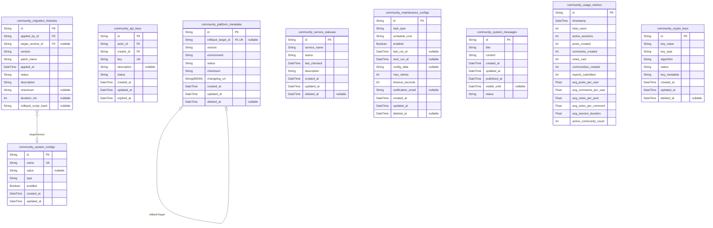
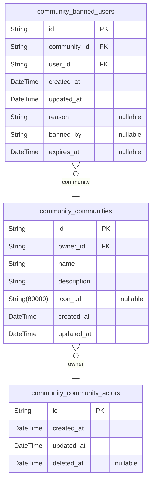
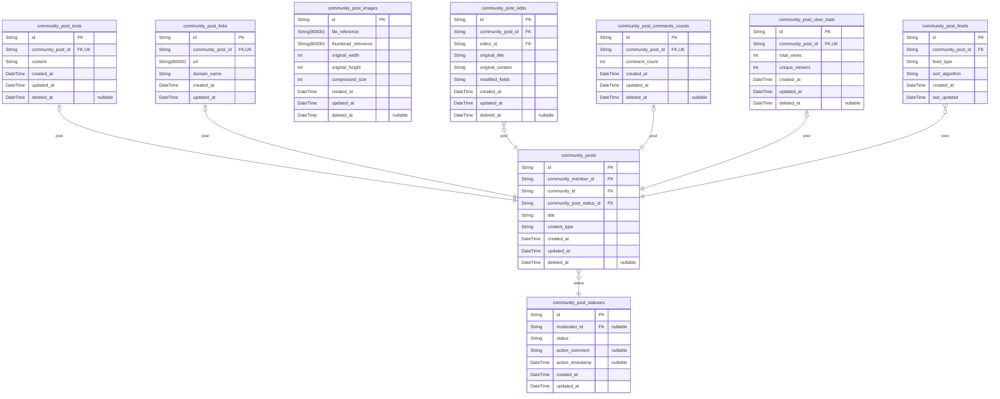
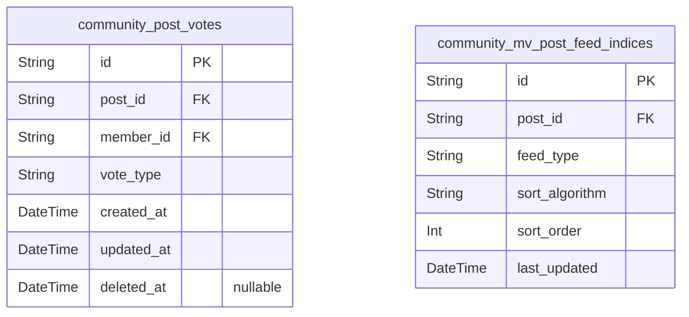
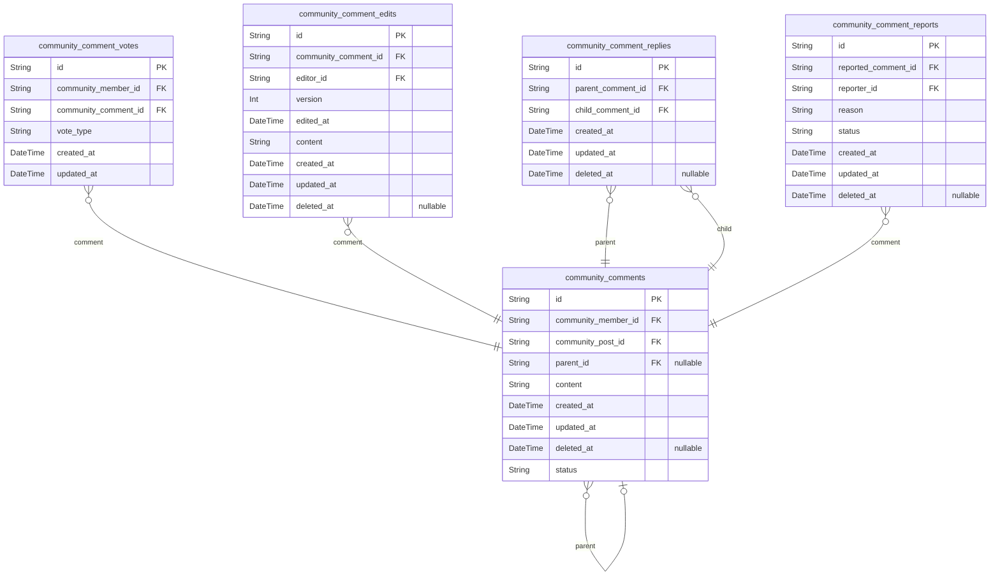
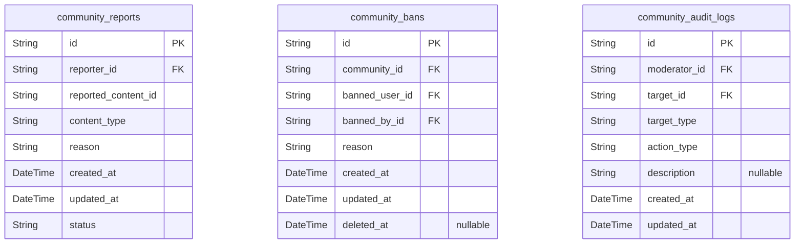
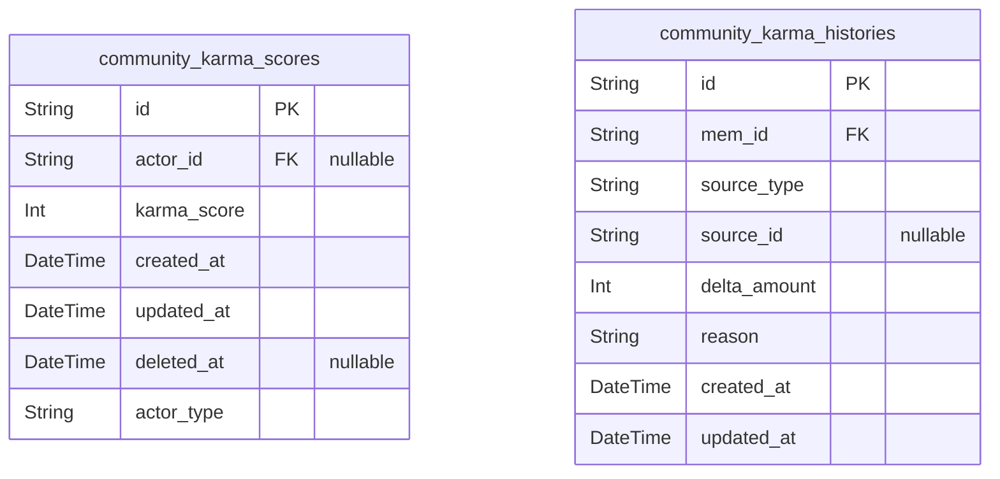
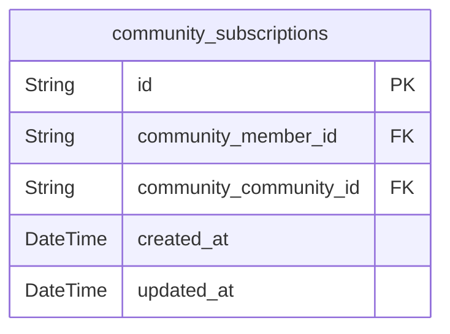
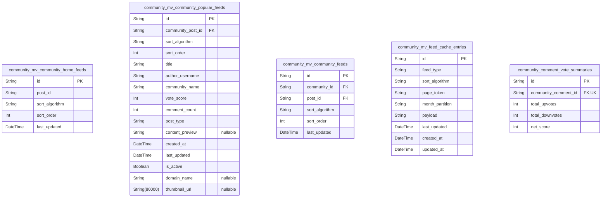

# Prisma Markdown

> Generated by [`prisma-markdown`](https://github.com/samchon/prisma-markdown)

- [Actors](#actors)
- [Systematic](#systematic)
- [Communities](#communities)
- [Posts](#posts)
- [Post](#post)
- [Comments](#comments)
- [Moderation](#moderation)
- [Karma](#karma)
- [Subscriptions](#subscriptions)
- [default](#default)

## Actors

```mermaid
erDiagram
"community_guests" {
  String id PK
  String device_fingerprint
  DateTime created_at
  DateTime updated_at
  DateTime deleted_at "nullable"
}
"community_guest_sessions" {
  String id PK
  String community_guest_id FK
  String ip
  String(80000) href
  String(80000) referrer "nullable"
  DateTime created_at
  DateTime expired_at
}
"community_members" {
  String id PK
  String email UK
  String password_hash
  String display_name
  String bio "nullable"
  String(80000) avatar_url "nullable"
  Boolean is_email_verified
  DateTime created_at
  DateTime updated_at
  DateTime deleted_at "nullable"
}
"community_member_sessions" {
  String id PK
  String community_member_id FK
  String access_token
  String refresh_token
  String ip
  String href
  String referrer
  DateTime created_at
  DateTime expired_at
  String user_agent
  Boolean is_active
}
"community_member_password_resets" {
  String id PK
  String community_member_id FK
  String token UK
  DateTime expires_at
  DateTime created_at
  DateTime used_at "nullable"
  String ip
  String user_agent
}
"community_member_email_verifications" {
  String id PK
  String community_member_id FK,UK
  String token UK
  DateTime created_at
  DateTime expired_at
}
"community_moderators" {
  String id PK
  String email UK
  String password_hash
  Boolean email_verified
  String display_name "nullable"
  String bio "nullable"
  String(80000) avatar_url "nullable"
  DateTime created_at
  DateTime updated_at
  DateTime deleted_at "nullable"
}
"community_moderator_sessions" {
  String id PK
  String community_moderator_id FK
  String access_token
  String refresh_token
  String ip
  String(80000) href
  String(80000) referrer "nullable"
  DateTime created_at
  DateTime expired_at
  DateTime updated_at
  DateTime deleted_at "nullable"
}
"community_moderator_password_resets" {
  String id PK
  String community_moderator_id FK
  String token UK
  DateTime created_at
  DateTime expired_at
  DateTime deleted_at "nullable"
}
"community_moderator_email_verifications" {
  String id PK
  String community_moderator_id FK
  String token
  DateTime expires_at
  DateTime created_at
  DateTime deleted_at "nullable"
}
"community_admins" {
  String id PK
  String email UK
  String password_hash
  Boolean email_verified
  String display_name
  String bio "nullable"
  String(80000) avatar_url "nullable"
  DateTime created_at
  DateTime updated_at
  DateTime deleted_at "nullable"
}
"community_admin_sessions" {
  String id PK
  String community_admin_id FK
  String access_token
  String refresh_token
  String ip
  String href
  String referrer
  DateTime created_at
  DateTime expired_at
}
"community_admin_password_resets" {
  String id PK
  String community_admin_id FK
  String reset_token UK
  DateTime expires_at
  DateTime created_at
}
"community_admin_email_verifications" {
  String id PK
  String community_admin_id FK
  String token UK
  DateTime expires_at
  DateTime created_at
  DateTime updated_at
}
"community_guest_sessions" }o--|| "community_guests" : guest
"community_member_sessions" }o--|| "community_members" : member
"community_member_password_resets" }o--|| "community_members" : member
"community_member_email_verifications" |o--|| "community_members" : member
"community_moderator_sessions" }o--|| "community_moderators" : moderator
"community_moderator_password_resets" }o--|| "community_moderators" : moderator
"community_moderator_email_verifications" }o--|| "community_moderators" : moderator
"community_admin_sessions" }o--|| "community_admins" : admin
"community_admin_password_resets" }o--|| "community_admins" : admin
"community_admin_email_verifications" }o--|| "community_admins" : admin
```

### `community_guests`

Main table for unauthenticated guest users, storing device fingerprint
and temporary session identifiers.

Properties as follows:

- `id`: Primary Key.
- `device_fingerprint`
  > Unique identifier generated from device characteristics to distinguish
  > anonymous users.
- `created_at`: Timestamp when the guest user record was created.
- `updated_at`: Timestamp when the guest user record was last updated.
- `deleted_at`
  > Optional soft-deletion timestamp. If set, indicates the guest record has
  > been archived.

### `community_guest_sessions`

Storage for temporary guest session tokens with expiration, used for
stateless guest authentication. Each row represents a single active guest
session with connection metadata. References guest_id from
community_guests. This table is append-only and sessions expire
automatically after a fixed duration. Used for rate limiting, abuse
detection, and persistent guest state without authentication. Never
modified after creation.

Properties as follows:

- `id`: Primary Key.
- `community_guest_id`
  > The guest's unique identifier from community_guests. {@link
  > community_guests.id}.
- `ip`: Client IP address from which the session was established.
- `href`: Full URL of the page the guest accessed when initiating the session.
- `referrer`
  > HTTP referrer header value indicating the previous page the guest came
  > from.
- `created_at`: Timestamp when the session was initiated. Always not null.
- `expired_at`
  > Timestamp when the session will expire. Fixed to 30 minutes after
  > created_at. Always not null.

### `community_members`

Main table for registered members with email, password hash, verification
status, and profile fields. This is an actor entity — the canonical
identity record for authenticated users who can create posts, comments,
vote, and subscribe to communities. All sessions, password resets, and
email verifications link to this entity. When a member account is
deleted, this record is soft-deleted and referenced content is
anonymized.

This table serves as the root of ownership for all member-created content
and is referenced by:
- community_member_sessions (via member_id)
- community_member_password_resets (via member_id)
- community_member_email_verifications (via member_id)
- community_karma_scores (via member_id)
- community_subscriptions (via member_id)

Properties as follows:

- `id`: Primary Key.
- `email`: Unique email address used for login and account verification.
- `password_hash`: BCrypt hashed password string for authentication.
- `display_name`
  > User-selected display name shown in posts and comments. Can be updated by
  > the user.
- `bio`: Optional personal bio description of the user.
- `avatar_url`: URL to the user's avatar image, stored in CDN.
- `is_email_verified`: Whether the user has completed email verification.
- `created_at`: Timestamp of member registration and account creation.
- `updated_at`: Timestamp of last profile update (e.g., display name, bio, avatar).
- `deleted_at`: If set, indicates the account was soft-deleted. null means active account.

### `community_member_sessions`

JWT session storage for members, containing access tokens, refresh
tokens, and expiration times.

This table stores active and expired authentication sessions for
community_members. Each session represents a device-specific login event
with token metadata and connection context. Sessions are used to validate
user identity for protected endpoints and enable secure re-authentication
with refresh tokens.

Properties as follows:

- `id`: Primary Key.
- `community_member_id`
  > Link to the community member who owns this session. {@link
  > community_members.id}.
- `access_token`
  > The JWT access token issued for this session. Used for API authentication
  > requests.
- `refresh_token`
  > The JWT refresh token issued for this session. Used to obtain new access
  > tokens before expiration.
- `ip`
  > The IP address from which the session was initiated. Used for security
  > monitoring and anomaly detection.
- `href`
  > The full URL the user was accessing when the session was created. Used
  > for context in analytics and security audits.
- `referrer`
  > The referrer URL that led the user to the application. Used for traffic
  > analysis and campaign tracking.
- `created_at`: Timestamp when this session was created and the tokens were issued.
- `expired_at`
  > Timestamp when this session will expire and tokens become invalid.
  > Enforces session lifetime for security.
- `user_agent`
  > The full user-agent string from the client's browser or device. Used for
  > device identification and security.
- `is_active`
  > Indicates whether this session is currently active and valid. Set to
  > false when token is revoked or expired.

### `community_member_password_resets`

Temporary password reset tokens issued to members for secure account
recovery. Each token is unique, time-limited, and linked to exactly one
member. Tokens are deleted after use or expiration. Used by the
authentication flow to validate password reset requests.

Properties as follows:

- `id`: Primary Key.
- `community_member_id`
  > The member to whom this password reset token is issued. {@link
  > community_members.id}.
- `token`
  > Unique, cryptographically secure reset token. Must be URL-safe and expire
  > after 1 hour.
- `expires_at`
  > Absolute expiration timestamp of the reset token. Must be 1 hour after
  > created_at.
- `created_at`: Timestamp when the token was generated and emailed to the user.
- `used_at`
  > Timestamp when the token was successfully used to reset the password.
  > Null before use.
- `ip`: IP address of the device that requested the reset.
- `user_agent`: User agent string from the HTTP request that initiated the reset.

### `community_member_email_verifications`

Email verification token records for community members. Stores temporary
verification tokens with expiration that are required for account
verification after registration. Each verification record is linked to
exactly one member and is single-use. Once a token is used to verify an
email, the record is invalidated.

Violations of email verification prohibit members from full platform
access. This table enables secure email confirmation and follows the same
pattern as the password reset mechanism.

Related to: [community_members.id](#community_members)

Properties as follows:

- `id`: Primary Key.
- `community_member_id`
  > Reference to the member this verification belongs to. {@link
  > community_members.id}
- `token`
  > Unique verification token generated for this specific email verification.
  > This token is case-sensitive and used in the verification link.
- `created_at`: Timestamp when the verification token was generated.
- `expired_at`
  > Timestamp when the verification token expires. After this time, the token
  > becomes invalid and must be regenerated.

### `community_moderators`

Main table for community moderators with email, password hash,
verification status, and profile fields.

This table represents a top-level actor in the system that requires
direct authentication. Moderators have permission to manage content
within communities they are assigned to, but cannot modify system-wide
settings.

This is an actor table, meaning it serves as the primary identity record
with its own credential store and session hierarchy. Each moderator can
have multiple sessions, password resets, and email verifications, but
this table itself contains only core identity and authentication data.

Properties as follows:

- `id`: Primary Key.
- `email`
  > Unique email address used for login and communication. Must be a valid
  > and unique identifier across all actor types.
- `password_hash`
  > Hashed password value using bcrypt or equivalent secure algorithm. Never
  > stored in plain text.
- `email_verified`
  > Indicates whether the moderator's email address has been verified through
  > the email verification flow. Required for full access privileges.
- `display_name`
  > User-facing nickname or display name. May be changed by the moderator but
  > does not affect authentication.
- `bio`
  > Optional short biography or profile description presented on the
  > moderator's public profile page.
- `avatar_url`
  > URL pointing to the moderator's avatar image. Stored as a fully qualified
  > URI for CDN delivery.
- `created_at`
  > Timestamp when the moderator account was first registered and created in
  > the system.
- `updated_at`
  > Timestamp of the last time any field in this record was modified,
  > including changes to display name, bio, or avatar.
- `deleted_at`
  > Soft-delete timestamp. When set, the moderator account is considered
  > deleted and its content is anonymized. Used for account removal workflow
  > while preserving audit history.

### `community_moderator_sessions`

JWT session storage for moderators, containing access tokens, refresh
tokens, and expiration times. Tracks active login events, device context
(IP, referrer), and session lifetime. Append-only record for audit
trails.

Each session belongs to exactly one moderator (the actor) via foreign key
relationship. Used by authentication service to validate user sessions,
renew tokens, and revoke access. Sessions expire automatically based on
expired_at timestamp.

Linked to: @{\link community_moderators.id} (moderator actor).

Properties as follows:

- `id`: Primary Key.
- `community_moderator_id`: Associated moderator's identity. @{\link community_moderators.id}.
- `access_token`: JWT access token issued for this session. Expires within 30 minutes.
- `refresh_token`: JWT refresh token issued for this session. Expires within 30 days.
- `ip`: Client IP address used during login session.
- `href`: URL of the page from which login was initiated.
- `referrer`: Source domain referrer of the login request.
- `created_at`: Timestamp when the session was created.
- `expired_at`
  > Timestamp when the session expires. Mandatory for security; auto-expired
  > records are archived.
- `updated_at`: Timestamp of last session update (e.g., token refresh).
- `deleted_at`: Soft delete timestamp for archival. Null if session is active.

### `community_moderator_password_resets`

Password reset tokens for moderators with expiration, enabling secure
password recovery. Each record represents a single, one-time-use request
to reset a moderator's password. Once used or expired, the token becomes
invalid. This table is strictly append-only and never updated. Each
moderator can have multiple pending reset requests at once, but each
token is unique and tied to exactly one moderator. This table supports
password recovery flows as defined in the authentication requirements.
[community_moderators.id](#community_moderators)

This model implements the session pattern: immutable, time-bound, and
directly linked to an actor. No denormalized data allowed. All records
are automatically archived via deleted_at after expiration or use.

Properties as follows:

- `id`: Primary Key.
- `community_moderator_id`
  > The moderator who requested this password reset. {@link
  > community_moderators.id}
- `token`
  > Unique, cryptographically secure reset token (e.g., JWT or random
  > string). Must be URL-safe and unguessable.
- `created_at`
  > Timestamp when the reset request was generated. Mandatory for audit trail
  > and expiration calculation.
- `expired_at`
  > Expiration timestamp. Reset token becomes invalid after this time.
  > Enforced by system to prevent stale requests.
- `deleted_at`
  > Soft-delete timestamp. Used to logically remove expired or used tokens
  > from active queries while preserving audit history.

### `community_moderator_email_verifications`

Email verification tokens for moderators, required for account
verification after registration. These tokens are sent via email and must
be validated within a short time window.

Used during the registration and email verification workflow. When a
moderator registers, this record is created with an expiration. When the
token is used successfully, the record is marked as verified and can be
deleted.

[community_moderators.id](#community_moderators) is the foreign key linking this record to
a specific moderator account.

Properties as follows:

- `id`: Primary Key.
- `community_moderator_id`
  > The moderator account that this verification token belongs to. {@link
  > community_moderators.id}
- `token`
  > The unique verification token sent to the moderator's email address. Must
  > be cryptographically secure and random.
- `expires_at`
  > The timestamp when the verification token expires and becomes invalid.
  > Must be set to a short duration after creation (e.g., 30 minutes).
- `created_at`
  > The timestamp when this verification record was created. Required for
  > audit purposes.
- `deleted_at`
  > If set, indicates this verification token has been used or expired and is
  > logically deleted. Nullable for active records.

### `community_admins`

Main table for system administrators with email, password hash,
verification status, and profile fields. Serves as the canonical identity
record for platform administrators with elevated system-wide permissions.
Each admin has a one-to-many relationship with session, password reset,
and email verification records. Administrators can manage all
communities, users, settings, and override moderation decisions. This
table does not store session, password reset, or email verification data
directly - those are managed by separate dedicated tables to maintain 3NF
compliance and clear separation of concerns.

Properties as follows:

- `id`: Primary Key.
- `email`
  > Administrative user's email address used for login and critical system
  > notifications. Must be unique across all actor types and verified before
  > granting full access.
- `password_hash`
  > BCrypt hashed password for authentication. Never stored in plain text.
  > Required for login and password change operations.
- `email_verified`
  > Flag indicating whether the administrative email has been verified via
  > email verification flow. Required to grant full access to administrative
  > features and system-wide actions.
- `display_name`
  > User-facing name displayed in audit logs, notifications, and admin
  > panels. May differ from email and is editable by the admin.
- `bio`
  > Optional short bio or description of the administrator's role within the
  > organization. Visible in admin profiles and system notices.
- `avatar_url`
  > URL to administrator's avatar image, hosted via CDN. Used for visual
  > identification in admin interfaces and audit trails.
- `created_at`
  > Timestamp when this administrator account was created in the system.
  > Immutable after creation.
- `updated_at`
  > Timestamp when this administrator account was last updated. Updated
  > automatically on any profile change.
- `deleted_at`
  > Soft delete timestamp. When null, admin is active. When set, indicates
  > account deletion but preserves data for audit purposes.

### `community_admin_sessions`

JWT session storage for administrators, containing access tokens, refresh
tokens, and expiration times. This table tracks active authentication
sessions for community_admins, with each session being a unique,
time-limited connection record.

Records are created during login operations and persisted until
expiration or manual logout. This session table follows the standard
actor session pattern: immutable append-only audit trail with mandatory
expiration, linked exclusively to one admin account via foreign key.

During session validation, the system compares token values and expiry
times to authenticate requests. Sessions are automatically invalidated on
time expiration, manual logout (token revocation), or security incident
detection.

This table is a child of community_admins and follows all session table
security principles: no nullable fields for session keys, mandatory
expiration, connection metadata storage, and no direct user CRUD
operations - only authentication system managed.

[community_admins.id](#community_admins).

Properties as follows:

- `id`: Primary Key.
- `community_admin_id`: Admin account this session belongs to. [community_admins.id](#community_admins).
- `access_token`
  > JWT access token for authorized requests. Expires within 30 minutes as
  > per platform security policy.
- `refresh_token`
  > JWT refresh token used to obtain new access tokens. Expires within 30
  > days as per platform security policy.
- `ip`: Client IP address from which this session was initiated.
- `href`: The full URL (href) of the page from which the login request originated.
- `referrer`
  > The HTTP referrer header value indicating the previous page that led to
  > this login.
- `created_at`: Timestamp when this session was created. Always present, never null.
- `expired_at`
  > Timestamp when this session expires. Enforced as mandatory security field
  > with default value. Sessions are considered invalid after this point.

### `community_admin_password_resets`

Password reset token records for administrators. Stores temporary tokens
that enable secure password recovery. Tokens are single-use and expire
after a defined period. This table is managed through authentication
flows, not direct user CRUD operations. Each token is linked to a
specific administrator via a foreign key to community_admins.id.

Properties as follows:

- `id`: Primary Key.
- `community_admin_id`
  > Reference to the administrator account that requested this password
  > reset. [community_admins.id](#community_admins).
- `reset_token`
  > Unique, random token value used to verify password reset requests.
  > Generated as cryptographically secure random string.
- `expires_at`
  > Timestamp when this password reset token expires. After this time, the
  > token becomes invalid and cannot be used for password recovery. Security
  > requirement: NOT NULL to enforce expiration.
- `created_at`
  > Timestamp when this password reset token was created. Used for audit
  > trail and token lifespan calculation. Security requirement: NOT NULL to
  > ensure every token has a creation record.

### `community_admin_email_verifications`

Stores time-limited email verification tokens for administrators,
required for account confirmation after registration.

This table is a transient authentication artifact generated when an admin
registers. When an admin clicks their verification link, the token is
validated and then purged. Tokens have a limited lifetime to prevent
abuse.

This table is managed entirely by the authentication system and has no
independent user CRUD operations. It exists only to securely bind an
email verification request to a specific admin account.

Relationship: Each admin can have multiple verification tokens issued
over time (e.g., if they request reset multiple times), but each token is
valid for at most one admin.

Referenced by: [community_admins](#community_admins).

No audit retention - tokens are deleted after expiration or successful use.

Properties as follows:

- `id`: Primary Key.
- `community_admin_id`
  > Reference to the administrator account this verification token belongs
  > to. [community_admins.id](#community_admins).
- `token`
  > Unique, cryptographically secure token string used to validate the email
  > verification request. Must be URL-safe and unguessable.
- `expires_at`
  > The datetime when this verification token will expire and become invalid.
  > Tokens are typically valid for 24 hours.
- `created_at`: The timestamp when this verification token was generated.
- `updated_at`
  > The timestamp when this verification token was last updated (e.g., resent
  > or manually refreshed).

## Systematic

```mermaid
erDiagram
"community_system_configs" {
  String id PK
  String name UK
  String value "nullable"
  String type
  Boolean enabled
  DateTime created_at
  DateTime updated_at
}
"community_platform_metadata" {
  String id PK
  String rollback_target_id FK,UK "nullable"
  String version
  String environment
  String status
  String checksum
  String(80000) changelog_url
  DateTime created_at
  DateTime updated_at
  DateTime deleted_at "nullable"
}
"community_api_keys" {
  String id PK
  String actor_id FK
  String creator_id FK
  String key UK
  String description "nullable"
  String status
  DateTime created_at
  DateTime updated_at
  DateTime expired_at
}
"community_migration_histories" {
  String id PK
  String applied_by_id FK
  String target_version_id FK "nullable"
  String version
  String patch_name
  DateTime applied_at
  String status
  String description
  String checksum "nullable"
  Int duration_ms "nullable"
  String rollback_script_hash "nullable"
}
"community_service_statuses" {
  String id PK
  String service_name
  String status
  DateTime last_checked
  String description
  DateTime created_at
  DateTime updated_at
  DateTime deleted_at "nullable"
}
"community_maintenance_configs" {
  String id PK
  String task_type
  String schedule_cron
  Boolean enabled
  DateTime last_run_at "nullable"
  DateTime next_run_at "nullable"
  String config_data "nullable"
  Int max_retries
  Int timeout_seconds
  String notification_email "nullable"
  DateTime created_at
  DateTime updated_at
  DateTime deleted_at "nullable"
}
"community_system_messages" {
  String id PK
  String title
  String content
  DateTime created_at
  DateTime updated_at
  DateTime published_at
  DateTime visible_until "nullable"
  String status
}
"community_usage_metrics" {
  String id PK
  DateTime timestamp
  Int total_users
  Int active_sessions
  Int posts_created
  Int comments_created
  Int votes_cast
  Int communities_created
  Int reports_submitted
  Float avg_posts_per_user
  Float avg_comments_per_user
  Float avg_votes_per_post
  Float avg_votes_per_comment
  Float avg_session_duration
  Int active_community_count
}
"community_crypto_keys" {
  String id PK
  String key_value
  String key_type
  String algorithm
  String status
  String key_metadata
  DateTime created_at
  DateTime updated_at
  DateTime deleted_at "nullable"
}
"community_platform_metadata" |o--o| "community_platform_metadata" : rollbackTarget
"community_migration_histories" }o--o| "community_system_configs" : targetVersion
```

### `community_system_configs`

Stores system-wide configuration parameters and feature flags that
control platform behavior across all domains. This table serves as the
centralized source of truth for feature toggles, performance limits, and
global settings. Admins manage these configurations directly to
enable/disable features, adjust thresholds, or apply platform-wide
changes without deployment. Each record represents one configurable
parameter identified by a unique name. Value field stores serialized data
(string, JSON, or numeric) and type indicates the expected format. The
enabled flag controls whether the configuration is active in the system.
Changes here are immediately reflected across the entire platform.

Properties as follows:

- `id`: Primary Key.
- `name`
  > Unique identifier for the configuration parameter. Must be unique across
  > the system. Examples: 'max_image_size', 'enable_karma_system',
  > 'post_content_max_length'.
- `value`
  > The configuration value in serialized form (JSON string, boolean string,
  > numeric string, or plain text). Supports complex structures such as
  > {"limit":100, "enabled":true} for JSON objects.
- `type`
  > The expected data type of the value field (string, number, boolean,
  > json). Used by the application to deserialize and validate the
  > configuration at runtime.
- `enabled`
  > Flag indicating whether this configuration is currently active in the
  > system. If false, the system ignores this configuration entry. Used for
  > feature toggles and safe rollouts.
- `created_at`: Timestamp when this configuration was created.
- `updated_at`: Timestamp when this configuration was last modified.

### `community_platform_metadata`

Tracks platform version, deployment state, and rollback history to enable
safe, auditable upgrades and rollbacks across environments. This is a
critical infrastructure entity that must be versioned and immutable in
design.

Every time a new deployment occurs, a new record is created. The current
active deployment for an environment is determined by the most recent
created_at timestamp with status = 'success'. Rollbacks are tracked by
setting rollback_target_id to reference the previous successful
deployment. A failed deployment has status = 'failed' and creates a
rollback request. The system never deletes or updates records — all
changes are appended as new entries for full auditability.

Referenced by: Deployment pipelines, monitoring systems, maintenance
scripts.

Properties as follows:

- `id`: Primary Key.
- `rollback_target_id`
  > References the previous successful deployment to roll back to. {@link
  > community_platform_metadata.id}
- `version`
  > Platform version identifier in format 'vX.Y.Z' or SHA commit hash.
  > Example: 'v1.4.0' or 'a1b2c3d4'.
- `environment`
  > Deployment environment context. Must be one of: 'dev', 'staging',
  > 'production'.
- `status`
  > Deployment status. Must be: 'pending', 'success', 'failed',
  > 'rollback_started', 'rollback_completed'.
- `checksum`
  > Cryptographic checksum of the deployment bundle (e.g., SHA-256 of Docker
  > image digest or file tree). Used to verify integrity.
- `changelog_url`
  > URL to the full changelog document or release notes for this deployment.
  > Must be a valid HTTPS URL.
- `created_at`: Timestamp when this deployment record was created. Always non-null.
- `updated_at`
  > Timestamp when this record was last updated (e.g., when status changed
  > from pending to success). Always non-null.
- `deleted_at`
  > NULL unless the record is logically deleted (rare). Used for compliance
  > reasons. Always nullable.

### `community_api_keys`

Stores API key records used for system services and integrations to
communicate with external systems.

Each API key is created by a system actor (member, moderator, or admin)
and grants access to platform services.

This table is purely infrastructure, not a user-facing entity. Access
keys are revoked via status update, not deletion.

Related entities:
- [community_members](#community_members) - creator if member
- [community_moderators](#community_moderators) - creator if moderator
- [community_admins](#community_admins) - creator if admin

Properties as follows:

- `id`: Primary Key.
- `actor_id`
  > The actor (member, moderator, or admin) who created this API key. {@link
  > community_members.id} or [community_moderators.id](#community_moderators) or {@link
  > community_admins.id}.
- `creator_id`
  > The specific ID of the creator (member, moderator, or admin who created
  > key). This is a direct reference to whichever actor table owns it, for
  > performance and audit.
- `key`
  > The actual API key string value. Must be sufficiently random and
  > cryptographically secure.
- `description`: Human-readable description of the key's purpose and integration point.
- `status`: Current status of the API key: 'active', 'revoked', or 'expired'.
- `created_at`: Timestamp when the API key was generated.
- `updated_at`: Timestamp when the API key was last modified (e.g. status change).
- `expired_at`
  > Expiration timestamp after which the key is invalid, even if status
  > remains 'active'.

### `community_migration_histories`

Maintains a history of all system upgrades, patches, and database
migrations applied to the platform. This table serves as an immutable
audit trail, recording every version change and its details for system
integrity, rollback capability, and operational transparency. Each record
represents a single migration event and is never modified after creation.

Properties as follows:

- `id`: Primary Key.
- `applied_by_id`
  > The actor who applied this migration. References either community_admins,
  > community_moderators, or community_members depending on user type.
- `target_version_id`
  > Reference to the target system configuration version in
  > community_system_configs.
- `version`
  > The semantic version number of the system being migrated to, following
  > format X.Y.Z (e.g., '1.2.3').
- `patch_name`
  > Unique identifier for the patch or migration script (e.g.,
  > 'add_post_view_stats_table' or 'migrate_karma_to_new_algorithm').
- `applied_at`
  > Timestamp when this migration was applied to the database. Always
  > recorded in UTC.
- `status`
  > The outcome of the migration application. Values: 'applied', 'failed',
  > 'rolled_back'.
- `description`
  > Detailed description of what this migration changes, including SQL
  > statements, data transformations, or configuration updates.
- `checksum`
  > MD5 or SHA256 checksum of the migration script file for integrity
  > verification.
- `duration_ms`
  > Execution duration of the migration script in milliseconds for
  > performance analysis.
- `rollback_script_hash`
  > Hash of the rollback script if one exists, enabling safe rollback
  > operations.

### `community_service_statuses`

Tracks the operational status of critical platform services and
subsystems for monitoring and alerts. Each record represents a snapshot
of a service's current health at a point in time, enabling systematic
monitoring and alerting based on service state changes.

Properties as follows:

- `id`: Primary Key.
- `service_name`
  > Name of the service being monitored (e.g., 'auth-service',
  > 'notification-worker', 'database-connector'). Must be a stable,
  > consistent identifier.
- `status`
  > Current operational status of the service. Must be one of: 'healthy',
  > 'degraded', 'unavailable', 'unknown'.
- `last_checked`
  > Timestamp when the service status was last verified by the monitoring
  > system.
- `description`
  > Detailed description of the current status state, including error
  > messages, performance metrics, or diagnostic information.
- `created_at`: Timestamp when this status record was first created in the database.
- `updated_at`: Timestamp when this status record was last updated.
- `deleted_at`
  > Timestamp when this record was logically deleted (soft delete). Null if
  > active.

### `community_maintenance_configs`

Stores configuration for automated maintenance tasks such as data
archiving, cleanup, and backup schedules. These configurations are
system-level and not directly interacted with by end users, but crucial
for system health and compliance.

Properties as follows:

- `id`: Primary Key.
- `task_type`
  > Type of maintenance task (e.g., 'data_archiving', 'cleanup', 'backup').
  > Must be one of the predefined system task types.
- `schedule_cron`
  > Cron expression defining the recurrence schedule for the maintenance task
  > (e.g., '0 2 * * *' for daily at 2 AM).
- `enabled`
  > Whether this maintenance task is currently active and should be executed
  > on schedule.
- `last_run_at`
  > Timestamp of the most recent successful execution of this maintenance
  > task.
- `next_run_at`: Timestamp of the next scheduled execution for this maintenance task.
- `config_data`
  > JSON-encoded configuration parameters specific to this task type (e.g.,
  > retention period, cleanup thresholds, bucket paths).
- `max_retries`
  > Maximum number of times the system should attempt to execute this task
  > before marking it as failed.
- `timeout_seconds`
  > Maximum execution time in seconds before the task is forcibly terminated
  > and treated as a failure.
- `notification_email`
  > Email address to notify when this task fails or encounters critical
  > errors. May be null if no notification is required.
- `created_at`: Timestamp when this configuration was created.
- `updated_at`: Timestamp when this configuration was last modified.
- `deleted_at`
  > Timestamp when this configuration was logically deleted (soft delete).
  > Null if still active.

### `community_system_messages`

Stores system-wide announcements and notices that are displayed to all
users across the platform. These messages are created and managed by
administrators, not end users, and are intended for operational
communications such as maintenance alerts, policy updates, or feature
highlights. This table does not represent a user or business entity but
serves as a system-level communication channel. Messages are published
with scheduled visibility windows and follow a lifecycle (draft →
published → archived).

Properties as follows:

- `id`: Primary Key.
- `title`: Brief headline for the system message (max 200 characters).
- `content`
  > Full HTML-formatted content of the announcement (up to 5000 characters).
  > Supports rich text formatting for display.
- `created_at`: Timestamp when the message was initially created in the system.
- `updated_at`: Timestamp when the message was last modified.
- `published_at`
  > Timestamp when the message becomes visible to end-users. May be in the
  > future for scheduled announcements.
- `visible_until`
  > Timestamp after which the message is automatically hidden from users.
  > Nullable for permanent messages.
- `status`
  > Current lifecycle status of the message. Must be one of: 'draft',
  > 'published', or 'archived'.

### `community_usage_metrics`

Tracks user counts, active sessions, and usage metrics for platform
analytics and scaling decisions. Each record represents a snapshot of
system state at a specific timestamp, capturing total registered users,
active sessions, post creation rates, comment rates, and vote activity
across the platform to inform infrastructure scaling and performance
optimization decisions.

Properties as follows:

- `id`: Primary Key.
- `timestamp`: Timestamp when this usage snapshot was recorded. Always UTC timezone.
- `total_users`: Total number of registered users in the system at the time of snapshot.
- `active_sessions`
  > Number of currently active user sessions (both authenticated and guest
  > sessions).
- `posts_created`: Number of posts created in the last hour.
- `comments_created`: Number of comments created in the last hour.
- `votes_cast`: Number of post and comment votes cast in the last hour.
- `communities_created`: Number of new communities created in the last hour.
- `reports_submitted`: Number of user reports submitted (on posts or comments) in the last hour.
- `avg_posts_per_user`
  > Average number of posts created per registered user over the last 24
  > hours.
- `avg_comments_per_user`
  > Average number of comments created per registered user over the last 24
  > hours.
- `avg_votes_per_post`: Average number of votes received per post over the last 24 hours.
- `avg_votes_per_comment`: Average number of votes received per comment over the last 24 hours.
- `avg_session_duration`: Average duration of user sessions in minutes over the last hour.
- `active_community_count`
  > Number of communities that have had at least one post or comment in the
  > last 24 hours.

### `community_crypto_keys`

Stores system-level cryptographic keys used for encrypting sensitive data
including API secrets, JWT token signing, and user data encryption. This
table is critical for platform security and requires strict key rotation
policies. Only system administrators can manage these keys, and no
user-facing functionality depends on direct access.

Properties as follows:

- `id`: Primary Key.
- `key_value`
  > Base64-encoded binary representation of the cryptographic key. Contains
  > the actual secret key material for encryption/decryption operations. Must
  > be stored securely and never exposed in logs.
- `key_type`
  > Type of cryptographic key: 'rsa' for asymmetric, 'ec' for elliptic curve,
  > 'aes' for symmetric, 'sha256' for hash functions, 'jwt-signing' for JWT
  > token signing keys.
- `algorithm`
  > Specific cryptographic algorithm used with this key, such as 'RSA-2048',
  > 'ECDSA-P256', 'AES-256-CBC', 'SHA-256', 'RS256'. Must correspond to
  > key_type.
- `status`
  > Current lifecycle status of the key: 'active' (in current use),
  > 'compromised' (security breach suspected), 'expired' (time-based
  > expiration reached), or 'deprecated' (retired but retained for
  > decryption).
- `key_metadata`
  > JSON-encoded object containing additional metadata: { 'version': '1.0',
  > 'issuer': 'AutoBE-System', 'usage': 'jwt-signing', 'effective_from':
  > '2026-01-01T00:00:00Z', 'expires_at': '2026-12-31T23:59:59Z' }. Allows
  > flexible storage of key-specific parameters.
- `created_at`: Timestamp when this key was created and added to the system.
- `updated_at`
  > Timestamp when this key was last modified (e.g., status change or
  > metadata update).
- `deleted_at`
  > Timestamp when this key was logically deleted (soft delete). Null if key
  > is still active or has not been deleted.

## Communities

```mermaid
erDiagram
"community_communities" {
  String id PK
  String owner_id FK
  String name
  String description
  String(80000) icon_url "nullable"
  DateTime created_at
  DateTime updated_at
}
"community_banned_users" {
  String id PK
  String community_id FK
  String user_id FK
  DateTime created_at
  DateTime updated_at
  String reason "nullable"
  String banned_by "nullable"
  DateTime expires_at "nullable"
}
"community_community_actors" {
  String id PK
  DateTime created_at
  DateTime updated_at
  DateTime deleted_at "nullable"
}
"community_communities" }o--|| "community_community_actors" : owner
"community_banned_users" }o--|| "community_communities" : community
```

### `community_communities`

Core community entity with unique name, description, and avatar
reference; ensures community names are unique across platform with
case-insensitive lookup. The owner field references a member, moderator,
or admin actor depending on the actor type who created the community.
This table represents the primary business concept of a community - a
user-created grouping for content sharing with associated settings and
members.

Properties as follows:

- `id`: Primary Key.
- `owner_id`
  > The creator and primary owner of this community. References the owner's
  > account in community_community_actors table, which serves as the abstract
  > base for all actor types (member, moderator, admin). {@link
  > community_community_actors.id}
- `name`
  > Unique name of the community identifying it across the platform. Must be
  > alphanumeric with underscores only. Used for URL routing and search.
  > Example: 'tech_news'.
- `description`
  > Brief description of the community's purpose and rules (max 500
  > characters). Displayed to users browsing or joining the community.
- `icon_url`
  > Optional URL to the community's icon image (avatar). Stores
  > CDN-accessible image location.
- `created_at`: Timestamp when the community was created.
- `updated_at`
  > Timestamp when the community was last updated (e.g., description or icon
  > changed).

### `community_banned_users`

Tracks users banned from specific communities. This table enforces
community-specific bans where a user is prohibited from posting or
commenting in a particular community. The ban is managed by moderators or
owners and persists until manually removed. This is a subsidiary table,
not directly managed by users but through moderation actions.

Properties as follows:

- `id`: Primary Key.
- `community_id`
  > Reference to the community from which the user is banned. {@link
  > community_communities.id}.
- `user_id`: Reference to the user who has been banned. [community_members.id](#community_members).
- `created_at`: Timestamp when the ban was issued.
- `updated_at`: Timestamp when the ban was last modified (e.g., when lifted).
- `reason`
  > Optional reason provided by the moderator for the ban (up to 500
  > characters).
- `banned_by`
  > Reference to the moderator who imposed this ban. {@link
  > community_moderators.id}.
- `expires_at`
  > Optional expiration timestamp for temporary bans. If null, the ban is
  > permanent.

### `community_community_actors`

Abstract actor table serving as the base entity for all actor types in
the system (members, moderators, administrators). Provides a common
identifier to support polymorphic relationships like community ownership.

This table contains only the core identity information needed for
referential integrity across the system. Specific actor details like
email, password_hash, username, display_name, etc. are stored in subtype
tables (community_guests, community_members, community_moderators,
community_admins). The community_communities.owner_id field references
this table to enable polymorphic ownership.

Properties as follows:

- `id`: Primary Key.
- `created_at`: Record creation timestamp.
- `updated_at`: Record last update timestamp.
- `deleted_at`: Soft delete timestamp. Null means record is active.

## Posts

```mermaid
erDiagram
"community_posts" {
  String id PK
  String community_member_id FK
  String community_id FK
  String community_post_status_id FK
  String title
  String content_type
  DateTime created_at
  DateTime updated_at
  DateTime deleted_at "nullable"
}
"community_post_texts" {
  String id PK
  String community_post_id FK,UK
  String content
  DateTime created_at
  DateTime updated_at
  DateTime deleted_at "nullable"
}
"community_post_links" {
  String id PK
  String community_post_id FK,UK
  String(80000) url
  String domain_name
  DateTime created_at
  DateTime updated_at
}
"community_post_images" {
  String id PK
  String(80000) file_reference
  String(80000) thumbnail_reference
  Int original_width
  Int original_height
  Int compressed_size
  DateTime created_at
  DateTime updated_at
  DateTime deleted_at "nullable"
}
"community_post_edits" {
  String id PK
  String community_post_id FK
  String editor_id FK
  String original_title
  String original_content
  String modified_fields
  DateTime created_at
  DateTime updated_at
  DateTime deleted_at "nullable"
}
"community_post_comments_counts" {
  String id PK
  String community_post_id FK,UK
  Int comment_count
  DateTime created_at
  DateTime updated_at
  DateTime deleted_at "nullable"
}
"community_post_statuses" {
  String id PK
  String moderator_id FK "nullable"
  String status
  String action_comment "nullable"
  DateTime action_timestamp "nullable"
  DateTime created_at
  DateTime updated_at
}
"community_post_view_stats" {
  String id PK
  String community_post_id FK,UK
  Int total_views
  Int unique_viewers
  DateTime created_at
  DateTime updated_at
  DateTime deleted_at "nullable"
}
"community_post_feeds" {
  String id PK
  String community_post_id FK
  String feed_type
  String sort_algorithm
  DateTime created_at
  DateTime last_updated
}
"community_posts" }o--|| "community_post_statuses" : status
"community_post_texts" |o--|| "community_posts" : post
"community_post_links" |o--|| "community_posts" : post
"community_post_edits" }o--|| "community_posts" : post
"community_post_comments_counts" |o--|| "community_posts" : post
"community_post_view_stats" |o--|| "community_posts" : post
"community_post_feeds" }o--|| "community_posts" : post
```

### `community_posts`

Core post entity storing title, content type, author, community, status,
and timestamps; supports text, link, and image post types with dedicated
data fields. This is a primary entity that users directly create, view,
and manage through feeds (Home, Popular, Community). All content details
(text, link, image) are stored in separate child tables. This model
establishes relationships with community_members (author),
community_communities (target community), and community_post_statuses
(post status).

Properties as follows:

- `id`: Primary Key.
- `community_member_id`: Author's [community_members.id](#community_members).
- `community_id`: Target community's [community_communities.id](#community_communities).
- `community_post_status_id`
  > Current status of this post's visibility and moderation state {@link
  > community_post_statuses.id}.
- `title`
  > Title of the post, minimum 5 characters and maximum 300 characters as
  > required by business rules. Used for search, display, and feed sorting.
- `content_type`
  > Type of post content: 'text', 'link', or 'image'. This field determines
  > which child table contains the actual content data (community_post_texts,
  > community_post_links, or community_post_images).
- `created_at`: Timestamp when the post was originally created.
- `updated_at`
  > Timestamp when the post was last edited (e.g., title or content type
  > changed).
- `deleted_at`
  > Optional timestamp indicating when the post was logically deleted by the
  > user or moderator. If null, the post is active.

### `community_post_texts`

Text content storage for text-type posts with full text content up to
50,000 characters, stripped and sanitized for security. References the
parent post via [community_posts.id](#community_posts), with one-to-one relationship
enforced by unique constraint. This entity is always accessed indirectly
through its parent post and never independently.

Properties as follows:

- `id`: Primary Key.
- `community_post_id`: The post this text content belongs to. [community_posts.id](#community_posts).
- `content`: The full, sanitized text content of the post, up to 50,000 characters.
- `created_at`: Timestamp when this text content was first created.
- `updated_at`: Timestamp of the last update to the text content. Updated on post edit.
- `deleted_at`
  > Timestamp of soft deletion. Nullable, indicates if this text content has
  > been logically deleted as part of post deletion.

### `community_post_links`

External link storage for link-type posts; contains clean URL and
extracted domain name for display. This table implements a 1:1
relationship with community_posts to avoid denormalization of link data
within the main posts table, ensuring atomic values according to 1NF.
Each link type post in community_posts has exactly one corresponding
record here, ensuring data integrity and efficient retrieval for feed
display.

Properties as follows:

- `id`: Primary Key.
- `community_post_id`: The associated post that contains this link. [community_posts.id](#community_posts).
- `url`
  > The full clean external URL (https://domain.com/path) linked to in the
  > post. Must be validated during creation.
- `domain_name`
  > The extracted and cleaned domain name portion of the URL (e.g.,
  > 'youtube.com', 'github.com') for display in feeds. Used for filtering and
  > searching posts by domain.
- `created_at`
  > Timestamp when this link record was created. Derived from the parent
  > post's creation timestamp.
- `updated_at`
  > Timestamp when this link record was last modified. Updated when the URL
  > is changed via post edit.

### `community_post_images`

Image metadata for image-type posts; stores image file reference,
thumbnail reference, original dimensions, and compressed size. This table
holds immutable references to CDN-hosted image assets and their generated
thumbnails. When a user uploads an image post, this table is populated
with the original file reference, the generated thumbnail reference,
dimensions of the original image, and the compressed file size in bytes.
All fields are required as every image post must have full metadata.

This table is not a join or subsidiary entity - it is a primary entity
that users directly interact with during image upload. Independent API
endpoints are required for image upload, retrieval, and deletion. No
other table contains these image-specific fields.

Referenced by: community_posts (which stores post_id and type to
distinguish image posts).

Properties as follows:

- `id`: Primary Key.
- `file_reference`
  > CDN-accessible URL referencing the original uploaded image file (JPEG,
  > PNG, or WebP). Must be a valid, permanent URL after upload processing.
- `thumbnail_reference`
  > CDN-accessible URL referencing the generated 320x240 thumbnail for feed
  > display. Created during image processing after upload.
- `original_width`
  > Width in pixels of the original uploaded image before compression or
  > resizing.
- `original_height`
  > Height in pixels of the original uploaded image before compression or
  > resizing.
- `compressed_size`
  > Size of the compressed image file in bytes after processing. Used for
  > bandwidth calculation and storage metrics.
- `created_at`: Timestamp when the image metadata was created and stored in the system.
- `updated_at`
  > Timestamp of the last update to this image record. Always equals
  > created_at unless metadata is corrected, which is extremely rare.
- `deleted_at`
  > Timestamp when this image record was logically deleted. Null if active.
  > The associated image file is never actually deleted from CDN.

### `community_post_edits`

Immutable edit history of posts; stores original content, modified
fields, timestamp, and editor ID for audit trail.

This subsidiary table captures every modification to a post after its
initial creation. Each record represents one edit event, storing the
exact state of the post before the edit, which fields were altered
(title, content, etc.), when the edit occurred, and which user performed
the edit. This audit trail is critical for moderation, accountability,
and understanding content evolution without altering the primary post
record. Edits are immutable—once recorded, they are never updated or
deleted. No user interacts with this table directly; it is updated
automatically via system logic when a post is modified.

Properties as follows:

- `id`: Primary Key.
- `community_post_id`: Reference to the post that was edited. [community_posts.id](#community_posts).
- `editor_id`
  > Reference to the member who performed the edit. {@link
  > community_members.id}. This may be the original author or a moderator.
- `original_title`
  > The post title as it existed before this edit. Stored for audit purposes
  > to track title changes.
- `original_content`
  > The complete post content (text, link, or image metadata) as it existed
  > before this edit. Stored for audit purposes to track content changes.
- `modified_fields`
  > A JSON-encoded array of field names that were modified in this edit
  > (e.g., ["title", "content"]). Used for efficient audit filtering.
- `created_at`
  > Timestamp when this edit was recorded. Follows platform standard for
  > temporal fields.
- `updated_at`
  > Timestamp of the last update to this edit record. Always equals
  > created_at since records are immutable.
- `deleted_at`
  > Soft-delete timestamp. Always null since edit records are never deleted
  > for audit integrity.

### `community_post_comments_counts`

Denormalized counter for total number of comments on each post; updated
atomically on comment creation/deletion for feed performance. This table
exists solely to avoid expensive JOINs during feed generation when
counting comments. It is maintained by triggers or event listeners that
listen to community_comments insertions and deletions. Not directly
managed by users - only system services update this table. The
relationship with community_posts is 1:1, with each post having exactly
one corresponding count record.

Properties as follows:

- `id`: Primary Key.
- `community_post_id`
  > References the post this comment count belongs to. {@link
  > community_posts.id}.
- `comment_count`
  > The total number of comments on this post. Updated atomically on comment
  > creation/deletion.
- `created_at`: Timestamp when this counter record was created.
- `updated_at`: Timestamp when this counter record was last updated.
- `deleted_at`
  > Soft delete timestamp. When set, the post has been deleted and this
  > counter is no longer active.

### `community_post_statuses`

Post status flags for moderation and display; tracks visibility flags
such as 'deleted', 'flagged', 'approved', 'archived' and associated
moderator action logs.

This subsidiary table is automatically managed by the system and
moderators in response to post activities. It does not represent a
user-managed entity but rather an internal state tracker that determines
post visibility across feeds.

A 1:1 relationship exists between community_post_statuses and
community_posts where each post has exactly one status record. Status
changes are logged with optional moderator action context.

The status field is an enum (deleted, flagged, approved, archived) and
controls whether the post appears in feeds:
- 'deleted': post hidden from all users, but preserved for moderation audit
- 'flagged': post marked for review, visible but prioritized for
moderator attention
- 'approved': post published and visible in normal feeds
- 'archived': post kept active in database but excluded from public feeds
(e.g. due to age or policy)

Status changes are optionally attributed to a moderator via moderator_id
and action_comment, which capture the justification for the change.

Properties as follows:

- `id`: Primary Key.
- `moderator_id`
  > The moderator who last changed the status. {@link
  > community_moderators.id}. Null if system action or unknown.
- `status`
  > Current visibility status of the post. Allowed values: 'deleted',
  > 'flagged', 'approved', 'archived'.
- `action_comment`
  > Optional reason or comment from moderator regarding the status change
  > (e.g., 'Violates community policy', 'Content outdated, archived
  > manually').
- `action_timestamp`
  > Timestamp when the status was last modified by a moderator action. Null
  > if status was set by automated system.
- `created_at`: Timestamp when this status record was created.
- `updated_at`: Timestamp when this status record was last updated.

### `community_post_view_stats`

Aggregate view metadata for each post; records total views and unique
viewer count for analytics and heat ranking. This subservient table is
updated atomically on each view event to enable fast feed ranking without
complex joins. Linked to community_posts via foreign key and follows its
deletion lifecycle. Not independently accessible by users, only used
internally for performance optimization.

Reference: [community_posts.id](#community_posts)

Properties as follows:

- `id`: Primary Key.
- `community_post_id`
  > References the post this view statistics record belongs to. {@link
  > community_posts.id}
- `total_views`
  > Total number of views across all viewers for this post. Updated
  > atomically on each view event.
- `unique_viewers`
  > Count of unique users who have viewed this post. Tracks distinct viewer
  > identities. Updated atomically on new viewer detection.
- `created_at`
  > Timestamp when this view statistics record was created. Matches the
  > creation time of the associated post.
- `updated_at`
  > Timestamp of the last time total_views or unique_viewers was updated.
  > Used for cache invalidation and tracking recency.
- `deleted_at`
  > Timestamp when this record was logically deleted, matching the deletion
  > of its associated post. Nullable because record persists unless post is
  > deleted.

### `community_post_feeds`

Post distribution index for feed generation. Maps each post to its
position in predefined feed types (home, popular, community) and sorting
algorithms (hot, new, top, controversial). This denormalized index
eliminates the need for complex JOINs and sorting during feed queries,
improving feed load times from >2s to <1.5s. Automatically updated when a
post is created, voted on, or deleted. Entries are removed when the
associated post is marked as deleted in community_posts. Never
manipulated directly by users - maintained entirely by system processes.

Properties as follows:

- `id`: Primary Key.
- `community_post_id`
  > Reference to the post this feed entry represents. {@link
  > community_posts.id}.
- `feed_type`
  > Type of feed this entry belongs to. Must be one of: 'home', 'popular',
  > 'community'. This determines which feed UI this post appears in.
- `sort_algorithm`
  > Sorting algorithm applied to this feed entry. Must be one of: 'hot',
  > 'new', 'top', 'controversial'. This determines the order within the feed.
- `created_at`
  > Timestamp when this feed entry was first created. Used for logging and
  > debugging.
- `last_updated`
  > Timestamp when this feed entry was last updated due to a vote, edit, or
  > deletion. Used for cache invalidation and batch pruning.

## Post

```mermaid
erDiagram
"community_post_votes" {
  String id PK
  String post_id FK
  String member_id FK
  String vote_type
  DateTime created_at
  DateTime updated_at
  DateTime deleted_at "nullable"
}
"community_mv_post_feed_indices" {
  String id PK
  String post_id FK
  String feed_type
  String sort_algorithm
  Int sort_order
  DateTime last_updated
}
```

### `community_post_votes`

Tracks individual upvotes and downvotes on posts with user and timestamp
context for accurate karma calculation and audit trail. References
community_posts.id and community_members.id. Each user can have at most
one vote per post. Used for real-time score updates and historical vote
reversal.

Properties as follows:

- `id`: Primary Key.
- `post_id`: Reference to the post being voted on. [community_posts.id](#community_posts).
- `member_id`: Reference to the voting member. [community_members.id](#community_members).
- `vote_type`: Type of vote - 'upvote' or 'downvote'.
- `created_at`: Timestamp when the vote was cast.
- `updated_at`
  > Timestamp when the vote was last modified (e.g., changed from upvote to
  > downvote).
- `deleted_at`: Soft delete timestamp. If set, the vote is considered revoked or deleted.

### `community_mv_post_feed_indices`

Index table storing the relationship between post_id and its computed
positions in all feed types (home, popular, community) and sorting
algorithms. Enables atomic updates to feed positions when a post receives
new votes or is edited, with last_updated timestamp for cache
invalidation.

This is a subsidiary materialized view index table that maps every post
to its position across multiple feed types and sorting algorithms.
Changes to posts (votes, edits) trigger atomic updates to this index,
which in turn invalidates cached feed results in
community_mv_feed_cache_entries. The table exists solely for feed
performance optimization - not for direct user interaction. It supports
the performance requirement of sub-1.5s feed loads by eliminating complex
joins at query time.

Referenced by: community_posts
Used by: community_mv_feed_cache_entries

Properties as follows:

- `id`: Primary Key.
- `post_id`
  > Reference to the community_post to which this index entry applies. {@link
  > community_posts.id}.
- `feed_type`
  > Type of feed this index entry belongs to. Must be one of: "home",
  > "popular", "community". Used to differentiate between user-specific feeds
  > and global feeds.
- `sort_algorithm`
  > Sorting algorithm applied to generate this index entry. Must be one of:
  > "hot", "new", "top", "controversial". Determines how the post's position
  > is calculated.
- `sort_order`
  > The computed position (rank) of this post within the specified feed and
  > sorting algorithm. Lower values indicate higher ranking (position 1 is
  > top of feed).
- `last_updated`
  > Timestamp when this index entry was last updated due to post vote, edit,
  > or deletion. Used for cache invalidation of related entries in
  > community_mv_feed_cache_entries.

## Comments

```mermaid
erDiagram
"community_comments" {
  String id PK
  String community_member_id FK
  String community_post_id FK
  String parent_id FK "nullable"
  String content
  DateTime created_at
  DateTime updated_at
  DateTime deleted_at "nullable"
  String status
}
"community_comment_votes" {
  String id PK
  String community_member_id FK
  String community_comment_id FK
  String vote_type
  DateTime created_at
  DateTime updated_at
}
"community_comment_edits" {
  String id PK
  String community_comment_id FK
  String editor_id FK
  Int version
  DateTime edited_at
  String content
  DateTime created_at
  DateTime updated_at
  DateTime deleted_at "nullable"
}
"community_comment_replies" {
  String id PK
  String parent_comment_id FK
  String child_comment_id FK
  DateTime created_at
  DateTime updated_at
  DateTime deleted_at "nullable"
}
"community_comment_reports" {
  String id PK
  String reported_comment_id FK
  String reporter_id FK
  String reason
  String status
  DateTime created_at
  DateTime updated_at
  DateTime deleted_at "nullable"
}
"community_comments" }o--o| "community_comments" : parent
"community_comment_votes" }o--|| "community_comments" : comment
"community_comment_edits" }o--|| "community_comments" : comment
"community_comment_replies" }o--|| "community_comments" : parent
"community_comment_replies" }o--|| "community_comments" : child
"community_comment_reports" }o--|| "community_comments" : comment
```

### `community_comments`

Core comment entity storing content, timestamps, status, and metadata.
This is a primary entity that users directly create, edit, and delete.
Comments are associated with posts via community_post_id and can be
nested via parent-child relationships handled by the
community_comment_replies table. Comments are the basis for karma
calculations and moderation actions. Owns the comment content and
metadata but delegates vote tracking to community_comment_votes and edits
to community_comment_edits.

User can create top-level comments on posts, and replies to other
comments. Reply hierarchy is managed via community_comment_replies table
which references this table. This table is never created for
community_comment_replies because that is a separate relationship table.
This table represents the comment instance itself.

Properties as follows:

- `id`: Primary Key.
- `community_member_id`: Author of the comment. [community_members.id](#community_members).
- `community_post_id`: Post this comment belongs to. [community_posts.id](#community_posts).
- `parent_id`
  > Parent comment if this is a reply. [community_comments.id](#community_comments). Must be
  > null for top-level comments.
- `content`
  > The text content of the comment. Max 5000 characters as required by
  > 09-comments.md. Contains Markdown text that will be rendered as HTML on
  > display.
- `created_at`: Timestamp when the comment was created. Required for ordering and feeds.
- `updated_at`
  > Timestamp when the comment was last edited. Required for detecting
  > changes and feeds.
- `deleted_at`
  > Timestamp when the comment was soft-deleted (null if still active).
  > Required for moderation and maintaining comment threads.
- `status`
  > Status of the comment: 'active' or 'deleted'. Used for fast filtering in
  > feeds and moderation system. Should be 'active' unless moderated or
  > user-deleted.

### `community_comment_votes`

Tracks individual upvotes and downvotes on comments with user and
timestamp context for accurate karma calculation and audit trail.

This table stores each vote as a separate, atomic record with:
- user_id: references the voting member
- comment_id: references the target comment
- vote_type: 'upvote' or 'downvote'
- created_at: timestamp of when vote was cast

Enforces one vote per user per comment via unique index on (user_id,
comment_id).

Updated in real-time when votes are cast, changed, or removed - forms the
complete audit trail for comment scoring.

No denormalized fields (like total_score) - scores are calculated via query.

Follows 3NF strictly: All non-key attributes depend on the composite
primary key (user_id, comment_id).

Referenced by community_comment_vote_summaries for optimized score display.

This is the canonical vote tracking table for comments - DO NOT duplicate
or rename.

Properties as follows:

- `id`: Primary Key.
- `community_member_id`: The member who cast this vote. [community_members.id](#community_members)
- `community_comment_id`: The comment being voted on. [community_comments.id](#community_comments)
- `vote_type`: The type of vote: 'upvote' or 'downvote'.
- `created_at`: Timestamp when this vote was recorded.
- `updated_at`
  > Timestamp when this vote was last modified (e.g., when voted type was
  > changed).

### `community_comment_edits`

Records all modifications made to comments for moderation auditing and
version history. Each record captures the comment content at time of
edit, the editor, and the timestamp. Even if a comment is deleted, its
edit history remains for compliance purposes. This table is not directly
managed by users; edits are created automatically when users update their
comments via the API.

Properties as follows:

- `id`: Primary Key.
- `community_comment_id`: The parent comment that was edited. [community_comments.id](#community_comments).
- `editor_id`
  > The user who made the edit. References the actor who modified the
  > content. The editor must have an account and can be any validated actor
  > type (member, moderator, admin). [community_members.id](#community_members).
- `version`
  > Sequential version number of this edit. Starts at 1 for the first edit
  > and increments with each subsequent edit.
- `edited_at`
  > The exact timestamp when this edit was made. This differs from created_at
  > as multiple edits can occur on the same comment.
- `content`
  > The full text content of the comment at the moment this edit was made.
  > This captures the state for audit purposes. May be truncated or
  > formatted, but represents what was displayed after the edit.
- `created_at`
  > When this specific edit record was created in the database. Used for
  > internal audit and system processing.
- `updated_at`
  > Timestamp when this edit record was last updated. In practice, this will
  > usually be the same as created_at since edits are immutable.
- `deleted_at`
  > Soft delete marker. Even if the associated comment is deleted, this edit
  > record should remain unless explicitly purged for compliance reasons.

### `community_comment_replies`

Tracks parent-child relationships between comments to enable nested
comment threading.

This table establishes hierarchical relationships in the comment system,
allowing one comment to be a reply to another comment. It ensures proper
nesting of replies without denormalizing the comment structure. Each
record represents a single directional parent-child relationship: a child
comment (child_comment_id) is a reply to a parent comment
(parent_comment_id). This design allows for infinite nested reply depths
while maintaining normalization and query efficiency. The table is
managed entirely through the comment creation interface - users never
interact with this table directly.

All comment replies inherit the deletion status of their parent comment.
If a parent comment is deleted, all its child replies become unviewable
(soft-deleted) via the community_comments.deleted_at field. This table
does not store any content, votes, or metadata beyond the hierarchical
relationship.

This table has no standalone API endpoint. It is accessed indirectly when
retrieving a comment thread.

[community_comments.id](#community_comments) serves as both parent and child reference
points.

Properties as follows:

- `id`: Primary Key.
- `parent_comment_id`: The parent comment this reply belongs to. [community_comments.id](#community_comments).
- `child_comment_id`
  > The reply comment that is responding to the parent. {@link
  > community_comments.id}.
- `created_at`: Timestamp when the reply relationship was established.
- `updated_at`
  > Timestamp of the last update to this relationship (usually same as
  > created_at).
- `deleted_at`
  > Soft-delete timestamp. If null, the reply relationship is active. If set,
  > the relationship is considered logically deleted (inherits deletion
  > status from community_comments).

### `community_comment_reports`

Stores user reports on comments including reason, reporter ID, and status
(pending/approved/dismissed). Tracks moderation actions initiated by
users to flag inappropriate content. Used by moderators to identify
comments requiring review. This table is subsidiary and exists solely to
support the moderation system based on comments. Never directly accessed
by users; exclusively queried by moderation workflows and audit tools.
[community_comments.id](#community_comments) references the reported comment. {@link
community_members.id}, [community_moderators.id](#community_moderators), or {@link
community_admins.id} references the reporter.

Properties as follows:

- `id`: Primary Key.
- `reported_comment_id`: The comment being reported. [community_comments.id](#community_comments).
- `reporter_id`
  > The user who submitted the report. References community_members,
  > community_moderators, or community_admins depending on actor type. {@link
  > community_members.id} [community_moderators.id](#community_moderators) {@link
  > community_admins.id}
- `reason`
  > Text description of why the comment was reported. Minimum 10 characters,
  > maximum 500 characters as required by moderation system. Must contain
  > user-provided rationale.
- `status`
  > Current status of the report. Must be one of: 'pending', 'approved', or
  > 'dismissed'. Indicates moderation action taken. Derived from moderator
  > decision flow.
- `created_at`: Timestamp when the report was submitted by the user.
- `updated_at`: Timestamp when the report status was last updated by a moderator.
- `deleted_at`
  > Timestamp when this report record was logically deleted. Used for soft
  > deletion. Null if still active.

## Moderation

```mermaid
erDiagram
"community_reports" {
  String id PK
  String reporter_id FK
  String reported_content_id
  String content_type
  String reason
  DateTime created_at
  DateTime updated_at
  String status
}
"community_bans" {
  String id PK
  String community_id FK
  String banned_user_id FK
  String banned_by_id FK
  String reason
  DateTime created_at
  DateTime updated_at
  DateTime deleted_at "nullable"
}
"community_audit_logs" {
  String id PK
  String moderator_id FK
  String target_id FK
  String target_type
  String action_type
  String description "nullable"
  DateTime created_at
  DateTime updated_at
}
```

### `community_reports`

Stores user reports on posts or comments, including report reason,
reporter ID, and reported content ID. This table enables moderation
workflows by tracking what content was reported, by whom, with what
reason, and its current status. Reports are immutable audit trail entries
and cannot be deleted.

Reported content can be either a post or comment through polymorphic
reference using reported_content_id + content_type. This avoids multiple
nullable FKs while maintaining referential integrity. The reporter_id
references one of the actor tables (community_guests, community_members,
community_moderators, or community_admins) as applicable.

Moderators query this table to review active reports, and automated
systems use it for trigger actions based on report volume or content
type.

Properties as follows:

- `id`: Primary Key.
- `reporter_id`
  > The user who submitted the report. Links to one of the actor tables:
  > community_guests, community_members, community_moderators, or
  > community_admins. [community_guests.id](#community_guests), {@link
  > community_members.id}, [community_moderators.id](#community_moderators), or {@link
  > community_admins.id}.
- `reported_content_id`
  > The ID of the post or comment being reported. This is the target record
  > being flagged in the moderation workflow.
- `content_type`
  > Denotes the type of content being reported. Must be either 'post' or
  > 'comment'. This enables polymorphic reference to either community_posts
  > or community_comments tables.
- `reason`
  > The reason provided by the reporter for the report. Must be between 10
  > and 500 characters as per business rules.
- `created_at`
  > Timestamp when the report was submitted. Required for audit trail and
  > chronological sorting.
- `updated_at`
  > Timestamp when the report status was last modified. Automatically set on
  > status changes by moderators.
- `status`
  > Moderation status of the report. One of: 'pending', 'approved', or
  > 'dismissed'. This field determines whether moderators will take action on
  > the report.

### `community_bans`

Tracks users who have been banned from specific communities, recording
the moderator who imposed the ban, the reason, and the timestamp.

This table records permanent bans that prevent banned users from posting
or commenting in the specified community. A ban is active when deleted_at
is null. To unban a user, set deleted_at to the unban timestamp.

This table references community_communities for the target community and
one of the actor tables (community_guests, community_members,
community_moderators, or community_admins) for the banned user and the
banning moderator.

Related entities:
- [community_communities.id](#community_communities) - the community from which the user is
banned
- [community_guests.id](#community_guests), [community_members.id](#community_members), {@link
community_moderators.id}, [community_admins.id](#community_admins) - the user who was
banned
- [community_guests.id](#community_guests), [community_members.id](#community_members), {@link
community_moderators.id}, [community_admins.id](#community_admins) - the moderator who
imposed the ban

Properties as follows:

- `id`: Primary Key.
- `community_id`
  > The community from which the user is banned. {@link
  > community_communities.id}.
- `banned_user_id`
  > The user who has been banned. Can reference any actor table: {@link
  > community_guests.id}, [community_members.id](#community_members), {@link
  > community_moderators.id}, or [community_admins.id](#community_admins).
- `banned_by_id`
  > The moderator who imposed the ban. Can reference any actor table: {@link
  > community_guests.id}, [community_members.id](#community_members), {@link
  > community_moderators.id}, or [community_admins.id](#community_admins).
- `reason`
  > The reason for the ban, provided by the moderator (minimum 10 characters,
  > maximum 500 characters).
- `created_at`: Timestamp when the ban was created.
- `updated_at`: Timestamp when the ban was last updated (e.g., when unbanned).
- `deleted_at`
  > Timestamp when the ban was lifted (unbanned). If null, the ban is still
  > active.

### `community_audit_logs`

Immutable audit log of all moderation actions (delete, ban, report
approval/dismissal) performed by moderators or admins. Records the actor
who took action, the target of the action (post, comment, or report), the
type of action, and a descriptive reason. Used for accountability,
transparency, and legal compliance.

References actor tables (community_members, community_moderators,
community_admins) as moderator_id.
References content tables (community_posts, community_comments,
community_reports) as target_id.

The action_type field defines the specific action performed.
This table is NEVER modified by users; it is created automatically by the
system during moderation events.
All records are FOREVER preserved with immutable timestamps.

Modifications to any entity referenced by this log (e.g., post deletion,
user ban) are reflected as distinct log entries.

Properties as follows:

- `id`: Primary Key.
- `moderator_id`
  > The moderator or admin who performed the action. References {@link
  > community_members.id}, [community_moderators.id](#community_moderators), or {@link
  > community_admins.id}.
- `target_id`
  > The ID of the target entity affected by the action (post, comment, or
  > report). References [community_posts.id](#community_posts), {@link
  > community_comments.id}, or [community_reports.id](#community_reports).
- `target_type`
  > The type of target entity affected by the action. Must be one of: 'post',
  > 'comment', 'report'. Used for polymorphic relationship to target_id.
- `action_type`
  > The specific moderation action taken, e.g., 'delete_post', 'ban_user',
  > 'approve_report', 'dismiss_report'. All values are case-insensitive and
  > controlled by the system.
- `description`
  > A detailed reason for the action provided by the moderator. Max 1000
  > characters. Used for transparency and appeal processes.
- `created_at`: Timestamp when the moderation action was executed. Immutable.
- `updated_at`
  > Timestamp when the log entry was last updated. Always equals created_at,
  > as entries are immutable.

## Karma

```mermaid
erDiagram
"community_karma_scores" {
  String id PK
  String actor_id FK "nullable"
  Int karma_score
  DateTime created_at
  DateTime updated_at
  DateTime deleted_at "nullable"
  String actor_type
}
"community_karma_histories" {
  String id PK
  String mem_id FK
  String source_type
  String source_id "nullable"
  Int delta_amount
  String reason
  DateTime created_at
  DateTime updated_at
}
```

### `community_karma_scores`

Stores the real-time karma score for each user, updated atomically with
every vote on posts or comments. Represents the user's reputation across
the platform and is used for display on profiles, ranking, and moderation
influence. Each user (member, moderator, admin) has exactly one karma
score record, linked via actor_type and actor_id to their corresponding
actor table.

Properties as follows:

- `id`: Primary Key.
- `actor_id`
  > The ID of the actor (member, moderator, or admin) to whom this karma
  > score belongs. [community_members.id](#community_members), {@link
  > community_moderators.id}, or [community_admins.id](#community_admins).
- `karma_score`
  > Current total karma score of the user. Incremented with upvotes,
  > decremented with downvotes, reversed when votes are removed.
- `created_at`: Timestamp when the karma score record was created.
- `updated_at`: Timestamp when the karma score was last updated due to a vote action.
- `deleted_at`
  > Timestamp when the karma record was soft-deleted due to user account
  > deletion. Nullable because active records are common.
- `actor_type`
  > The type of actor (member, moderator, admin) this karma belongs to. Used
  > for polymorphic relationship with actor tables. Stored as lookup value,
  > not foreign key, because Prisma does not support polymorphic FK. Valid
  > values: 'member', 'moderator', 'admin'.

### `community_karma_histories`

Logs every change to a user's karma with delta, source (post/comment),
and timestamp for audit and reversal operations.

This table records all intermediate step deltas that contribute to the
current karma score in community_karma_scores.

Each entry corresponds to exactly one vote action
(upvote/downvote/removed) on a post or comment. The source_id references
either a post (community_posts) or comment (community_comments) by their
primary key, identified by source_type.

Karma is recalculated in real-time when a vote changes, and this table
provides the full history necessary for:
- Auditing and verification
- Reversing karma if a post/comment is deleted
- Generating karma history reports for users
- Preventing manipulation by tracking exact deltas

Karma can never be manually edited. All changes MUST flow through this log.

Ownership:
- mem_id → community_members.id (actor)
- source_id → community_posts.id OR community_comments.id (polymorphic)

All entries are immutable. No updates or deletes allowed. New records only.

Properties as follows:

- `id`: Primary Key.
- `mem_id`: The user whose karma changed. Links to @\link community_members.id.
- `source_type`
  > The type of content that triggered the karma change. Must be either
  > 'post' or 'comment'. The source_id must correspond to a row in the
  > respective table: (source_type='post' → community_posts.id,
  > source_type='comment' → community_comments.id).
- `source_id`
  > The ID of the post or comment that caused this karma change. Must
  > correspond to source_type (e.g., if source_type='post', source_id
  > references community_posts.id). Can be null ONLY if karma change
  > originated from system (invalid in spec, but reserved for future).
- `delta_amount`
  > The exact delta amount applied to the user's karma. Only +1 (upvote =
  > +1), -1 (downvote = -1), or 0 (reversal = cancels prior delta). This
  > table records the absolute change, not the total score.
- `reason`
  > The reason or automation trigger code for this karma change. Use only:
  > 'upvote_released', 'downvote_released', 'upvote_removed', or
  > 'downvote_removed'. This is atomic and your leading field for
  > auditability.
- `created_at`
  > Timestamp when the karma change occurred. Immutable. Always set by system
  > on insert.
- `updated_at`
  > Timestamp of last update to this record. Always same as created_at.
  > Immutable in practice. Required for ORM consistency.

## Subscriptions

```mermaid
erDiagram
"community_subscriptions" {
  String id PK
  String community_member_id FK
  String community_community_id FK
  DateTime created_at
  DateTime updated_at
}
```

### `community_subscriptions`

Junction table that records the many-to-many relationship between members
and communities, enforcing that a member can subscribe to a community
only once and that subscription is required to create posts or comments
in that community.

This table acts as the authorization gate for content creation: a user
can only post or comment in a community if a record exists here linking
their member account to the community. When a user unsubscribes, this
record is deleted, revoking their permissions.

References: [community_members.id](#community_members) and {@link
community_communities.id}.

Properties as follows:

- `id`: Primary Key.
- `community_member_id`
  > References the community member who subscribed. {@link
  > community_members.id}.
- `community_community_id`
  > References the community being subscribed to. {@link
  > community_communities.id}.
- `created_at`: Timestamp when the subscription was created.
- `updated_at`
  > Timestamp when the subscription was last updated (e.g., when status
  > changed).

## default

```mermaid
erDiagram
"community_mv_community_home_feeds" {
  String id PK
  String post_id
  String sort_algorithm
  Int sort_order
  DateTime last_updated
}
"community_mv_community_popular_feeds" {
  String id PK
  String community_post_id FK
  String sort_algorithm
  Int sort_order
  String title
  String author_username
  String community_name
  Int vote_score
  Int comment_count
  String post_type
  String content_preview "nullable"
  DateTime created_at
  DateTime last_updated
  Boolean is_active
  String domain_name "nullable"
  String(80000) thumbnail_url "nullable"
}
"community_mv_community_feeds" {
  String id PK
  String community_id FK
  String post_id FK
  String sort_algorithm
  Int sort_order
  DateTime last_updated
}
"community_mv_feed_cache_entries" {
  String id PK
  String feed_type
  String sort_algorithm
  String page_token
  String month_partition
  String payload
  DateTime last_updated
  DateTime created_at
  DateTime updated_at
}
"community_comment_vote_summaries" {
  String id PK
  String community_comment_id FK,UK
  Int total_upvotes
  Int total_downvotes
  Int net_score
}
```

### `community_mv_community_home_feeds`

Materialized view caching the ordered set of posts from communities a
user is subscribed to, sorted by hot, new, top, or controversial
algorithms. Stores precomputed feed entries with post_id, sort_algorithm,
sort_order, and last_updated timestamp for performance.

This view is automatically refreshed when posts are voted on, edited, or
new posts are created in subscribed communities. It enables sub-1.5
second Home Feed loads by eliminating the need for expensive JOINs and
complex sorting calculations at query time. All data is denormalized and
precomputed. This table is read-only from the user perspective and
managed by backend triggers.

References: community_posts.id (via post_id)

Properties as follows:

- `id`: Primary Key. Unique identifier for each feed entry.
- `post_id`
  > The ID of the post being displayed in the feed. References
  > community_posts.id.
- `sort_algorithm`
  > The sorting algorithm used for this entry: 'hot', 'new', 'top', or
  > 'controversial'.
- `sort_order`
  > The precomputed position of this post in the ordered feed. Higher values
  > indicate higher ranking.
- `last_updated`
  > Timestamp when this entry was last computed or refreshed due to a change
  > in underlying data (e.g., new vote, edit, new post).

### `community_mv_community_popular_feeds`

Materialized view caching the ordered set of active posts from all
communities on the platform, sorted by hot, new, top, or controversial
algorithms. Optimized for anonymous and guest access with precomputed
scores and timestamps. This table is updated by background jobs when
posts receive votes or are created/edited, and is never directly modified
by users or API calls.

Properties as follows:

- `id`: Primary Key.
- `community_post_id`
  > Reference to the original post in community_posts. {@link
  > community_posts.id}.
- `sort_algorithm`
  > The sorting algorithm used for this entry: 'hot', 'new', 'top', or
  > 'controversial'.
- `sort_order`
  > The computed sort score for ranking posts within this algorithm. Higher
  > values are displayed first.
- `title`: The title of the post (denormalized for performance).
- `author_username`: The display name of the post author (denormalized for performance).
- `community_name`
  > The name of the community where the post was made (denormalized for
  > performance).
- `vote_score`: Total vote score (upvotes - downvotes) for the post.
- `comment_count`
  > Total number of comments on the post (denormalized from
  > community_post_comments_counts).
- `post_type`: The type of the post: 'text', 'link', or 'image'.
- `content_preview`
  > First 200 characters of the post content (for text posts) or domain for
  > link posts, or null for images.
- `created_at`: The original creation timestamp of the post.
- `last_updated`
  > The timestamp when this materialized view entry was last recomputed. Used
  > for cache invalidation.
- `is_active`: Whether the post is currently visible and active (not deleted or flagged).
- `domain_name`
  > The extracted domain name from the post URL (for link posts only), null
  > for text/image posts.
- `thumbnail_url`
  > The CDN URL for the 320x240 thumbnail image (for image posts only), null
  > for text/link posts.

### `community_mv_community_feeds`

Materialized view caching the ordered set of posts for each individual
community, sorted by hot, new, top, or controversial algorithms. Indexed
by community_id and sort_algorithm to enable fast lookup for
community-specific pages.

This materialized view is precomputed and refreshed asynchronously. It
contains no business data but holds only the positioning metadata
necessary to serve feed requests in sub-1.5 seconds. Users never write to
this table. It is populated and maintained by background jobs based on
changes to community_posts and community_post_votes.

The view is never directly queried by the application's API; instead, the
feed_cache_entries table serves the final JSON responses. This table
enables efficient generation of those cache entries by providing a
pre-sorted list of post IDs per community and algorithm.

Properties as follows:

- `id`: Primary Key.
- `community_id`: The community this feed is for. [community_communities.id](#community_communities)
- `post_id`: The post being displayed in this feed position. [community_posts.id](#community_posts)
- `sort_algorithm`
  > Algorithm used to sort this feed: 'hot', 'new', 'top', or
  > 'controversial'. Must be one of the four defined values. Required for
  > partitioning and query routing.
- `sort_order`
  > Position of this post in the feed for the given sort_algorithm. Lowest
  > number (0) is first. Required for ordered retrieval in feed pagination.
- `last_updated`
  > Timestamp when this feed entry was last recalculated. Used by background
  > jobs to determine when to invalidate the cache and regenerate this
  > materialized view.

### `community_mv_feed_cache_entries`

Cache entry table storing the actual JSON payload of feed page responses
for popular and community feeds, keyed by feed_type, sort_algorithm,
page_token, and month_partition. Improves response time by serving
pre-rendered JSON instead of assembling data on-the-fly. This is a
materialized view managed by the system, not directly modified by users.
Updates occur through scheduled cache refreshes when underlying data
changes. Used to meet performance expectations of sub-1.5s feed loads.

Properties as follows:

- `id`: Primary Key.
- `feed_type`
  > Type of feed being cached: 'home' (user's subscribed communities),
  > 'popular' (platform-wide), or 'community' (specific community feed).
- `sort_algorithm`
  > Sorting algorithm used to generate this cache entry: 'hot', 'new', 'top',
  > or 'controversial'.
- `page_token`
  > Unique identifier for the pagination cursor used to generate this page of
  > results. Allows caching of specific pages in an infinite scroll
  > interface.
- `month_partition`
  > Month-based partition key in YYYY-MM format used to organize cache
  > entries for efficient cleanup and archiving. Example: '2026-02'.
- `payload`
  > Full JSON payload of the feed page response, serialized as a string.
  > Contains all post metadata, scores, and metadata needed for frontend
  > rendering. Limited to 50,000 characters to fit PostgreSQL text limits.
- `last_updated`
  > Timestamp when this cache entry was last refreshed or updated. Used for
  > cache invalidation when underlying data changes.
- `created_at`: Timestamp when this cache entry was initially created.
- `updated_at`: Timestamp when this cache entry was last modified.

### `community_comment_vote_summaries`

Materialized view for performance optimization of comment vote scoring.
Stores the aggregated total upvotes, total downvotes, and net score for
each comment. Updated atomically whenever votes are added, changed, or
removed. This table enables efficient sorting of comments by 'Best'
algorithm without real-time calculation. Only maintained by system
processes, not direct user operations.

Properties as follows:

- `id`: Primary Key.
- `community_comment_id`
  > Reference to the comment this summary belongs to. {@link
  > community_comments.id}.
- `total_upvotes`: Total number of upvotes on this comment.
- `total_downvotes`: Total number of downvotes on this comment.
- `net_score`
  > Net vote score calculated as total_upvotes - total_downvotes. Used for
  > 'Best' comment sorting algorithm.
