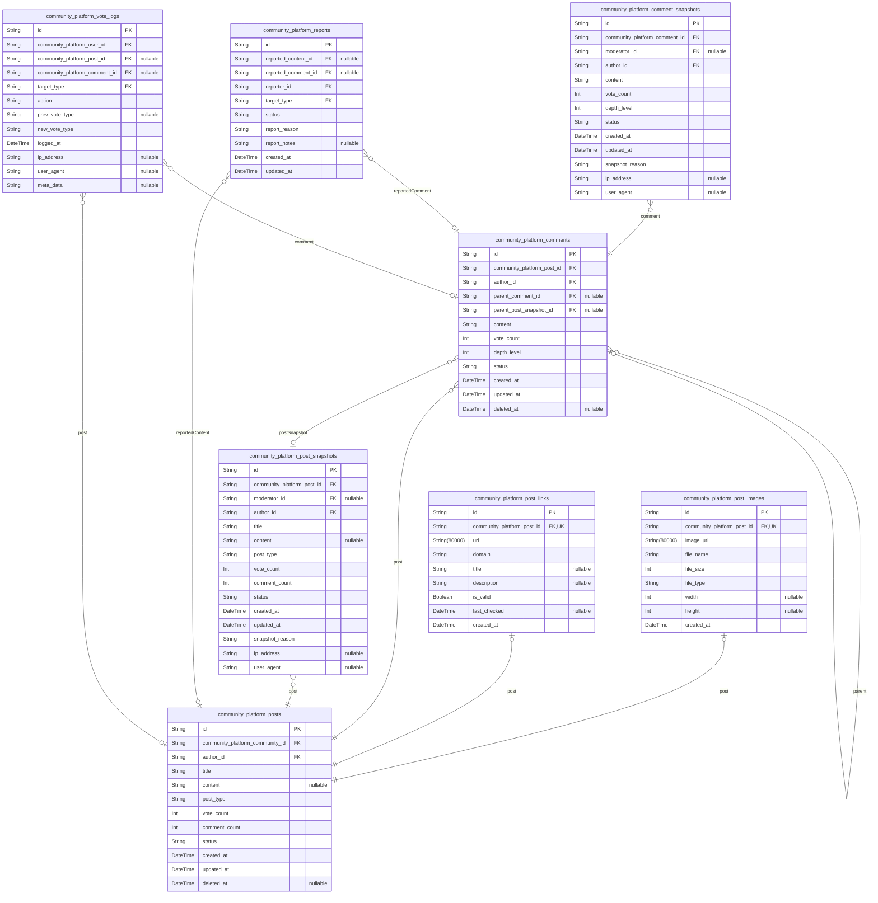

# Prisma Markdown

> Generated by [`prisma-markdown`](https://github.com/samchon/prisma-markdown)

- [Systematic](#systematic)
- [Actors](#actors)
- [Content](#content)
- [Votes](#votes)
- [Karma](#karma)
- [Subscriptions](#subscriptions)
- [Reports](#reports)
- [Logs](#logs)
- [Notifications](#notifications)
- [Integrations](#integrations)

## Systematic

### `community_platform_communities`

Core entity representing each community on the platform. Contains
essential metadata for community identification and discovery. This is a
primary entity as users directly interact with communities by
subscribing, viewing content, and participating.

Properties as follows:

- `id`: Primary Key.
- `name`
  > The unique, case-insensitive name identifier for the community (e.g.,
  > 'technology', 'gaming'). Must be unique across the platform and follow
  > naming conventions (alphanumeric and hyphens only).
- `description`
  > A brief description of the community's purpose and rules, displayed to
  > users.
- `created_at`: Timestamp indicating when the community was created.
- `is_public`
  > Flag indicating whether the community is publicly visible and joinable.
  > True for public communities, false for restricted communities.
- `nsfw`
  > Flag indicating whether the community contains Not Safe For Work content.
  > Requires explicit user settings to view.
- `post_review_mode`
  > Flag indicating whether all new posts in this community require moderator
  > approval before being published.
- `comment_review_mode`
  > Flag indicating whether all new comments in this community require
  > moderator approval before being published.
- `member_count`
  > The current number of users subscribed to this community. Updated on
  > subscription/unsubscription.
- `post_count`
  > The total number of posts created in this community. Updated on post
  > creation.

### `community_platform_community_settings`

Configuration settings that customize the behavior and appearance of each
community. These settings are specific to each community and govern
moderation, visibility, and user experience. This is a subsidiary entity
as it is always governed by and accessed through its parent community
entity.

Properties as follows:

- `id`: Primary Key.
- `community_platform_community_id`
  > The community this setting belongs to. {@link
  > community_platform_communities.id}.
- `title`
  > Custom display title for the community, which may differ from the public
  > 'name'. Used for branding.
- `banner_url`
  > URL to the community's banner image, displayed prominently on the
  > community page.
- `icon_url`: URL to the community's icon/logo, used as visual identifier in lists.
- `rules`
  > Detailed rules and guidelines for the community, more comprehensive than
  > the basic description.
- `moderator_invite_only`
  > Flag indicating whether only admins can invite new moderators. If false,
  > existing moderators can invite others.
- `allow_self_post`
  > Flag indicating whether new members can immediately create posts upon
  > joining, or if a waiting period is required.
- `created_at`: Timestamp indicating when these settings were initially configured.
- `updated_at`: Timestamp indicating when these settings were last updated.

### `community_platform_platform_settings`

Global platform-wide configuration settings that govern behavior across
all communities. These are system-level parameters set by administrators
to ensure consistency and compliance with platform policies. This is a
subsidiary entity as it is not directly interacted with by users but
governs system-wide functions.

Properties as follows:

- `id`: Primary Key.
- `max_community_members`
  > Maximum number of users allowed to subscribe to any single community.
  > Helps manage server load and community focus.
- `max_post_votes`
  > Maximum number of votes (upvotes and downvotes combined) that will be
  > counted for any single post. Higher thresholds are capped to prevent
  > karma inflation.
- `max_comment_depth`
  > Maximum depth (nested levels) allowed for comment threads. Reduces
  > performance overhead for deeply nested conversations.
- `post_edit_window_minutes`
  > Number of minutes after posting that the original author can edit their
  > post. Set to 15 minutes as per business rules.
- `comment_edit_window_minutes`
  > Number of minutes after commenting that the original author can edit
  > their comment. Set to 10 minutes as per business rules.
- `max_posts_per_hour`
  > Maximum number of posts a user can create in any given hour. Prevents
  > spam and bot behavior.
- `max_comments_per_hour`
  > Maximum number of comments a user can create in any given hour. Prevents
  > spam and bot behavior.
- `max_reports_per_day`
  > Maximum number of reports a user can submit in a 24-hour period. Prevents
  > report abuse.
- `max_community_creation_daily`
  > Maximum number of communities a single user can create in a 24-hour
  > period. Prevents community spam.
- `image_upload_max_size_mb`
  > Maximum file size (in MB) allowed for image uploads. Aligns with external
  > image hosting integration constraints.
- `default_sort_algorithm`
  > Default post sorting algorithm to use for community feeds. Value must be
  > one of: 'new', 'hot', 'top', 'controversial'.
- `karma_decay_rate`
  > Daily rate at which karma points decay for inactive users (e.g., 0.01
  > means 1% per day). Used to encourage ongoing participation. Currently set
  > to 0.0.
- `created_at`: Timestamp indicating when this platform-wide setting was created.
- `updated_at`: Timestamp indicating when this platform-wide setting was last updated.

### `community_platform_report_categories`

Enumeration of predefined categories for user-initiated content reports.
This table defines the options users can select when reporting a post or
comment. This is a subsidiary entity as it provides reference data for
the reporting mechanism but is not a primary business entity that users
manage directly.

Properties as follows:

- `id`: Primary Key.
- `name`
  > The internal, unique identifier for the report category (e.g., 'spam',
  > 'harassment').
- `display_name`
  > The human-readable name displayed to users when selecting a report reason
  > (e.g., 'Spam or advertisements').
- `description`
  > An optional detailed description explaining the types of content this
  > category applies to.
- `is_active`
  > Flag indicating whether this report category is currently active and
  > available for users to select. Used to disable categories without
  > deleting them.
- `priority`
  > A ranking value to determine the order in which report categories are
  > displayed to users in the UI (0=lowest, 999=highest).

### `community_platform_banned_words`

List of prohibited words, phrases, and patterns that are filtered from
user submissions (posts, comments) by automated moderation systems. This
table defines terms that trigger automatic flagging or rejection based on
AI moderation analysis. This is a subsidiary entity as it provides a
lookup list for the moderation system and is not a primary business
entity.

Properties as follows:

- `id`: Primary Key.
- `word`
  > The exact word, phrase, or regex pattern to be flagged or blocked. Must
  > be in lowercase for case-insensitive matching.
- `type`
  > The category of prohibited content this word belongs to. Values: 'spam',
  > 'harassment', 'nsfw', 'illegal', 'impersonation', 'other'.
- `is_regex`
  > Flag indicating if the 'word' field contains a regular expression
  > pattern, rather than a literal string to match.
- `is_exact_match`
  > Flag indicating if the match should be for an exact word boundary (e.g.,
  > 'win' should not match 'winner').
- `action`
  > The automated action to take when this word is detected. Values: 'flag',
  > 'block', 'warn'.
- `description`: Explanation noting why this term was added and its intended target.
- `created_at`: Timestamp indicating when this banned word was added to the system.
- `updated_at`: Timestamp indicating when this banned word was last modified.
- `is_active`
  > Flag indicating whether this entry is currently enforced. Used to disable
  > words without deleting them.

## Actors

### `community_platform_guest`

Guest users who are not authenticated and have limited viewing privileges
on the platform. Represents anonymous visitors before registration or
login.

Properties as follows:

- `id`: Primary Key.
- `created_at`: Timestamp when the guest session was initiated.
- `ip_address`: IP address of the guest user, useful for analytics and abuse detection.
- `user_agent`
  > The browser/user agent string of the guest visitor, used for device and
  > browser identification.
- `last_active`: Timestamp of the last page view or interaction by this guest.

### `community_platform_member`

Authenticated members who have completed email verification and can
participate in the community by posting, commenting, and voting.
Represents the core user base of the platform.

Properties as follows:

- `id`: Primary Key.
- `email`
  > Unique email address for authentication and notifications. Required for
  > all members.
- `username`
  > Display username that appears in posts and comments. Must be unique
  > across the platform.
- `password_hash`: BCrypt hashed password for authentication. Never stored in plaintext.
- `is_verified`
  > Flag indicating whether email verification is complete. Initially false
  > until verification link is clicked.
- `created_at`: Timestamp when the member account was created.
- `updated_at`: Timestamp when the member account was last updated.
- `deleted_at`
  > Soft delete timestamp. If null, account is active. If set, account is
  > deactivated.
- `karma`
  > Total karma score calculated from upvotes minus downvotes on all posts
  > and comments. Minimum value is 0.

### `community_platform_moderator`

A member assigned to moderate one or more specific communities. Has
administrative rights only within assigned communities. Represents the
community-level governance layer.

Properties as follows:

- `id`: Primary Key.
- `member_id`
  > The member who is granted moderator privileges. {@link
  > community_platform_member.id}.
- `community_id`
  > The community where this user serves as moderator. {@link
  > community_platform_communities.id}.
- `created_at`: Timestamp when moderator privileges were assigned.
- `notes`: Internal notes for administrators about this moderator assignment.

### `community_platform_admin`

Platform-wide administrators with full system access, including user
management, content moderation across communities, and configuration of
system-wide settings.

Properties as follows:

- `id`: Primary Key.
- `member_id`
  > The member who is granted admin privileges. {@link
  > community_platform_member.id}.
- `created_at`: Timestamp when admin privileges were granted.
- `access_level`
  > The level of administrative access. Values: 'standard', 'super' (super
  > admins can manage other admins).
- `notes`: Administrative notes about this admin's role and responsibilities.

### `community_platform_user_profiles`

Detailed profile information for members, including display name, avatar,
bio, and join date. Used to separate identity data from authentication
data for better security and flexibility.

Properties as follows:

- `id`: Primary Key.
- `member_id`
  > Primary link to the member account that owns this profile. {@link
  > community_platform_member.id}.
- `display_name`
  > Custom display name shown instead of username in UI. Can be null, in
  > which case username is used.
- `bio`: Short biography or description of the user. Limited to 400 characters.
- `avatar_url`
  > URL to the user's profile avatar image, stored in Cloudinary or similar
  > service.
- `join_date`
  > Date when the user registered on the platform. Set at account creation
  > and never changed.
- `location`: Geographic location entered by user, useful for local community discovery.

### `community_platform_user_sessions`

Active authentication sessions for members holding JWT tokens. Used for
managing user login states and enforcing session expiration.

Properties as follows:

- `id`: Primary Key.
- `member_id`
  > The member associated with this session. {@link
  > community_platform_member.id}.
- `refresh_token_hash`
  > Hashed refresh token for validating session renewals. Never stored in
  > plaintext.
- `access_token_hash`
  > Hashed access token for validating short-lived sessions. Never stored in
  > plaintext.
- `ip_address`: The IP address from which the session was initiated.
- `user_agent`: The browser user agent string when the session was created.
- `session_start`: Timestamp when the session was created.
- `session_expiry`: Timestamp when the session expires. Controls automatic logout.
- `is_active`
  > Indicates if the session is currently active (true) or invalidated
  > (false).
- `device_type`
  > Classification of device (web, ios, android, desktop) based on user-agent
  > analysis.

### `community_platform_email_verifications`

Records email verification tokens used during user registration and
re-verification processes. Ensures email ownership before granting
posting privileges.

Properties as follows:

- `id`: Primary Key.
- `member_id`
  > The member requiring email verification. {@link
  > community_platform_member.id}.
- `token`: Unique, randomly generated verification token sent via email.
- `token_hash`: Hashed version of the verification token for secure storage in database.
- `expires_at`
  > Expiration timestamp of the verification token. Tokens are valid for 24
  > hours.
- `sent_at`: Timestamp when the verification email was sent to the user.
- `is_used`
  > Flag indicating if the token has been successfully used to verify the
  > email.

### `community_platform_password_resets`

Stores password reset tokens for users who have forgotten their
passwords. Includes expiration and usage tracking to prevent brute force
and replay attacks.

Properties as follows:

- `id`: Primary Key.
- `member_id`
  > The member requesting a password reset. {@link
  > community_platform_member.id}.
- `token`: Unique, randomly generated reset token sent via email.
- `token_hash`: Hashed version of the reset token for secure storage in database.
- `expires_at`: Expiration timestamp of the reset token. Tokens are valid for 15 minutes.
- `requested_at`: Timestamp when the password reset request was initiated by the user.
- `is_used`: Flag indicating if the reset token has been used to change the password.

## Content

### `community_platform_posts`

Core content entity representing user posts in communities. Stores the
main content data including text, link, or image types, with metadata for
ranking algorithms and lifecycle tracking. Relationships with post
images, links, comments, votes, and snapshots ensure comprehensive
content management.

Properties as follows:

- `id`: Primary Key.
- `community_platform_community_id`
  > The community this post belongs to. {@link
  > community_platform_communities.id}.
- `author_id`: The user who created this post. [community_platform_member.id](#community_platform_member).
- `title`
  > The title of the post, limited to 300 characters. Must be present for all
  > post types.
- `content`
  > The main body text of the post, limited to 10,000 characters. Used for
  > text posts.
- `post_type`
  > The type of post: 'text', 'link', or 'image'. Determines which additional
  > fields are relevant.
- `vote_count`
  > The total vote score calculated as upvotes minus downvotes for ranking
  > purposes.
- `comment_count`: The total number of direct comments on this post.
- `status`
  > The moderation status: 'published', 'unreviewed', 'removed', or
  > 'archived'. Determines visibility.
- `created_at`: The timestamp when the post was submitted.
- `updated_at`: The timestamp when the post was last modified (e.g., edit, promotion).
- `deleted_at`: The timestamp when the post was soft-deleted. Null if still active.

### `community_platform_post_images`

Entity to store image metadata for posts. Associates uploaded image files
with their parent posts, preserving file information for display and CDN
serving. Normalized to avoid duplication of image data across posts.

Properties as follows:

- `id`: Primary Key.
- `community_platform_post_id`
  > The post this image is associated with. {@link
  > community_platform_posts.id}.
- `image_url`
  > The CDN URL where the image is hosted. Generated by external service
  > (e.g., Cloudinary).
- `file_name`: The original filename as uploaded by the user.
- `file_size`: The size of the image file in bytes.
- `file_type`: The MIME type of the image file (e.g., 'image/jpeg').
- `width`: The width of the image in pixels.
- `height`: The height of the image in pixels.
- `created_at`: The timestamp when the image was uploaded and associated with the post.

### `community_platform_post_links`

Entity to store link metadata for posts. Holds URL and metadata for
link-type posts, enabling link validation, preview generation, and
domain-based filtering. Normalized to allow multiple links per post if
needed in future.

Properties as follows:

- `id`: Primary Key.
- `community_platform_post_id`
  > The post this link is associated with. {@link
  > community_platform_posts.id}.
- `url`: The full URL of the linked resource. Must be a valid HTTP/HTTPS URL.
- `domain`: The extracted domain name of the URL for categorization and filtering.
- `title`: The title of the linked page, extracted from its HTML <title> tag.
- `description`
  > A short description of the linked page, extracted from its meta
  > description tag.
- `is_valid`
  > Indicates whether the URL responds with a 2xx status code during
  > validation.
- `last_checked`: The timestamp when the link was last validated for accessibility.
- `created_at`: The timestamp when the link was submitted and associated with the post.

### `community_platform_comments`

Entity representing user comments on posts and other comments. Supports
nested replies up to 8 levels, forming comment threads. Each comment is
linked to its post and parent comment (if nested), enabling hierarchical
display and evaluation.

Properties as follows:

- `id`: Primary Key.
- `community_platform_post_id`: The post this comment belongs to. [community_platform_posts.id](#community_platform_posts).
- `author_id`: The user who created this comment. [community_platform_member.id](#community_platform_member).
- `parent_comment_id`
  > The parent comment this is a reply to. {@link
  > community_platform_comments.id}. Null for top-level comments.
- `parent_post_snapshot_id`
  > Reference to the post's snapshot at time of comment. {@link
  > community_platform_post_snapshots.id}.
- `content`: The text content of the comment, limited to 2,000 characters.
- `vote_count`
  > The total vote score calculated as upvotes minus downvotes for ranking
  > purposes.
- `depth_level`
  > The nesting depth of this comment, with 1 being top-level and 8 being
  > maximum allowed.
- `status`
  > The moderation status: 'published', 'unreviewed', 'removed', or
  > 'archived'. Determines visibility.
- `created_at`: The timestamp when the comment was submitted.
- `updated_at`: The timestamp when the comment was last modified (e.g., edit).
- `deleted_at`: The timestamp when the comment was soft-deleted. Null if still active.

### `community_platform_post_snapshots`

Historical snapshot of a post's state at any point in time. Captures the
full data of a post at the moment of significant change (edit, report,
moderation) to preserve audit trail. All fields are denormalized copies
of the original post, ensuring complete historical accuracy, with
additional snapshot metadata.

Properties as follows:

- `id`: Primary Key.
- `community_platform_post_id`
  > The original post this snapshot is based on. {@link
  > community_platform_posts.id}.
- `moderator_id`
  > The moderator who triggered this snapshot (if any). {@link
  > community_platform_moderator.id}.
- `author_id`
  > The author of the post at the time of this snapshot. {@link
  > community_platform_member.id}.
- `title`: The title of the post at the time of this snapshot.
- `content`: The main body text of the post at the time of this snapshot.
- `post_type`: The type of post at the time of this snapshot: 'text', 'link', or 'image'.
- `vote_count`: The vote score of the post at the time of this snapshot.
- `comment_count`: The number of comments on the post at the time of this snapshot.
- `status`: The moderation status of the post at the time of this snapshot.
- `created_at`: The timestamp when this snapshot was created.
- `updated_at`
  > The timestamp when the original post was last modified before this
  > snapshot.
- `snapshot_reason`
  > The reason for creating this snapshot: 'edit', 'report', 'moderation',
  > 'system', or 'publish'.
- `ip_address`: The IP address of the user who triggered this snapshot (if applicable).
- `user_agent`: The user agent string of the client that triggered this snapshot.

### `community_platform_comment_snapshots`

Historical snapshot of a comment's state at any point in time. Captures
the full data of a comment at the moment of significant change (edit,
report, moderation) to preserve audit trail. All fields are denormalized
copies of the original comment, ensuring complete historical accuracy,
with additional snapshot metadata.

Properties as follows:

- `id`: Primary Key.
- `community_platform_comment_id`
  > The original comment this snapshot is based on. {@link
  > community_platform_comments.id}.
- `moderator_id`
  > The moderator who triggered this snapshot (if any). {@link
  > community_platform_moderator.id}.
- `author_id`
  > The author of the comment at the time of this snapshot. {@link
  > community_platform_member.id}.
- `content`: The text content of the comment at the time of this snapshot.
- `vote_count`: The vote score of the comment at the time of this snapshot.
- `depth_level`: The nesting depth of this comment at the time of this snapshot.
- `status`: The moderation status of the comment at the time of this snapshot.
- `created_at`: The timestamp when this snapshot was created.
- `updated_at`
  > The timestamp when the original comment was last modified before this
  > snapshot.
- `snapshot_reason`
  > The reason for creating this snapshot: 'edit', 'report', 'moderation',
  > 'system', or 'publish'.
- `ip_address`: The IP address of the user who triggered this snapshot (if applicable).
- `user_agent`: The user agent string of the client that triggered this snapshot.

### `community_platform_reports`

Primary entity representing user-submitted reports on content. Tracks the
lifecycle of content moderation requests with anonymized reporter
identity and status tracking. Reports are linked to either a post or
comment through foreign keys. This table serves as the central hub for
the moderation workflow, connecting reporters with content and subsequent
actions. It is referenced by the subsidiary tables
community_platform_report_actions and community_platform_report_comments.
This is a primary stance table because users directly create reports,
they have independent statuses (pending, dismissed, removed), and the
system must provide reporting, filtering, and resolution workflows for
these reports across the entire platform.

Properties as follows:

- `id`: Primary Key.
- `reported_content_id`
  > The post or comment being reported. Used to identify the target of the
  > report. [community_platform_posts.id](#community_platform_posts) or {@link
  > community_platform_comments.id}
- `reported_comment_id`
  > The specific comment being reported, if the report targets a comment
  > rather than a post. Used when report targets a comment. {@link
  > community_platform_comments.id}
- `reporter_id`
  > The user who submitted this report. The reporter's identity is anonymized
  > from the content author but stored for audit. {@link
  > community_platform_member.id}
- `target_type`
  > Discriminator indicating whether the report targets a 'post' or
  > 'comment'. Required to disambiguate the foreign key relationship. Values:
  > 'post', 'comment'.
- `status`
  > Current status of the report. Values: 'pending', 'dismissed', 'removed',
  > 'escalated'. This field controls moderation workflow progression.
- `report_reason`
  > The category of reason selected by the reporter. Values: 'spam',
  > 'harassment', 'inappropriate', 'other'. This provides initial
  > categorization for moderator triage.
- `report_notes`
  > Optional additional context provided by the reporter about why they are
  > reporting the content. Limited to 500 characters.
- `created_at`
  > Timestamp when the report was initially submitted by the user. Used for
  > audit trail and prioritization.
- `updated_at`
  > Timestamp of the last status update to this report. Used for tracking
  > resolution time and Moderation workflow progression.

### `community_platform_vote_logs`

A specialized log table that records every vote change event for audit
and debugging purposes. This complements the primary vote tables by
capturing full history including retractions and flips.

Properties as follows:

- `id`: Primary Key.
- `community_platform_user_id`
  > The user who performed the voting action. {@link
  > community_platform_user_profiles.id}.
- `community_platform_post_id`
  > The post affected by the vote action. {@link
  > community_platform_posts.id}. Nullable if action was on a comment.
- `community_platform_comment_id`
  > The comment affected by the vote action. {@link
  > community_platform_comments.id}. Nullable if action was on a post.
- `target_type`
  > Discriminator indicating whether the vote action targets a 'post' or
  > 'comment'. Required to disambiguate the foreign key relationship. Values:
  > 'post', 'comment'.
- `action`
  > Type of vote action: 'upvote', 'downvote', 'flip_to_upvote',
  > 'flip_to_downvote', 'retract'.
- `prev_vote_type`
  > The previous vote type before the action (if applicable). 'upvote',
  > 'downvote', or null for first vote.
- `new_vote_type`: The resulting vote type after the action: 'upvote' or 'downvote'.
- `logged_at`: Timestamp when the logging event occurred.
- `ip_address`: IP address of the client that performed the action (for abuse detection).
- `user_agent`: User agent string of the client device.
- `meta_data`
  > JSON string containing additional context about the event, e.g.,
  > in-browser timing, fencing meta, etc.

## Votes

### `community_platform_post_votes`

Tracks upvotes and downvotes on posts. Each vote is uniquely associated
with a user and post, enabling accurate ranking algorithms and preventing
duplicate voting.

Properties as follows:

- `id`: Primary Key.
- `community_platform_user_id`: The user who cast the vote. [community_platform_user_profiles.id](#community_platform_user_profiles).
- `community_platform_post_id`: The post being voted on. [community_platform_posts.id](#community_platform_posts).
- `vote_type`: The type of vote: 'upvote' or 'downvote'.
- `created_at`: Timestamp when the vote was cast.
- `updated_at`: Timestamp when the vote was last modified (e.g., flipped).

### `community_platform_comment_votes`

Tracks upvotes and downvotes on comments. Each vote is uniquely
associated with a user and comment, enabling accurate ranking and
preventing duplicate voting.

Properties as follows:

- `id`: Primary Key.
- `community_platform_user_id`: The user who cast the vote. [community_platform_user_profiles.id](#community_platform_user_profiles).
- `community_platform_comment_id`: The comment being voted on. [community_platform_comments.id](#community_platform_comments).
- `vote_type`: The type of vote: 'upvote' or 'downvote'.
- `created_at`: Timestamp when the vote was cast.
- `updated_at`: Timestamp when the vote was last modified (e.g., flipped).

## Karma

### `community_platform_user_karma`

Read-only derived value representing total karma score based on
aggregated upvotes minus downvotes on user's posts and comments. This
table exists for performance optimization to avoid expensive
recomputation during profile displays. Updated via background jobs or
database triggers when votes change. Never modified directly by users or
API calls.

Properties as follows:

- `id`: Primary Key.
- `user_id`
  > Reference to the user this karma score belongs to. {@link
  > community_platform_user_profiles.id}.
- `karma_score`
  > Total karma points calculated as sum of all upvotes minus downvotes
  > received on user's posts and comments. Never negative - max 1,000,000 per
  > business rules.
- `created_at`
  > Timestamp when this karma record was first calculated and stored.
  > Immutable.
- `updated_at`
  > Timestamp when this karma score was last recalculated. Updated via
  > background job when votes change.

## Subscriptions

### `community_platform_subscriptions`

Junction table establishing many-to-many relationship between users and
communities. This table tracks which communities each member subscribes
to, enabling personalized content feeds prioritizing subscribed
communities and enforcing subscription limits (max 1,000 per user). Each
subscription represents a user's active preference to receive content
from a community. Prohibited from duplicate subscriptions (unique
constraint on user_id + community_id). This is a primary entity because
users need to independently manage their subscriptions through profile
interfaces, search for subscribed communities, and the platform must
efficiently query "all communities subscribed to by user X" and "all
users subscribed to community Y" for feed prioritization logic. This
cannot be handled solely through parent entities - it requires dedicated
CRUD operations and indexing strategy for performance.

References: [community_platform_member.id](#community_platform_member) and {@link
community_platform_communities.id}

Properties as follows:

- `id`: Primary Key.
- `community_platform_member_id`: Reference to the subscribing member. [community_platform_member.id](#community_platform_member).
- `community_platform_communities_id`
  > Reference to the subscribed community. {@link
  > community_platform_communities.id}.
- `created_at`
  > Timestamp when the subscription was created. Used for sorting
  > subscriptions by recency.
- `updated_at`
  > Timestamp when the subscription was last updated. Used for tracking
  > changes to subscription state.
- `deleted_at`
  > Soft delete timestamp. When set, the subscription is considered inactive
  > and should be excluded from active feed queries. Null indicates an active
  > subscription.
- `active`
  > Current status of the subscription. True when subscription is active and
  > user can receive content from the community. False when subscription has
  > been deactivated (usually by user request or system cleanup). This flag
  > enables efficient filtering without needing to check deleted_at.

## Reports

### `community_platform_report_actions`

Records moderation actions taken on submitted reports. Contains audit
trail of moderator decisions (removal, dismissal, warning) performed on
reports. This table is strictly subsidiary - actions are created
automatically when moderators act on reports, not by users directly. It
links reports to the moderator who took action and captures the decision
type and optional notes. This table supports reporting KPIs like report
resolution time.

Properties as follows:

- `id`: Primary Key.
- `report_id`
  > The report this action was taken on. Required to link the action to the
  > original report. [community_platform_reports.id](#community_platform_reports)
- `moderator_id`
  > The user who took this moderation action. The moderator responsible for
  > the decision. [community_platform_moderator.id](#community_platform_moderator)
- `action_type`
  > The type of moderation action taken. Values: 'remove', 'dismiss', 'warn'.
  > Records the decision made by the moderator.
- `action_notes`
  > Optional internal notes from the moderator about why they took this
  > action. May include additional context not included in the report.
- `acted_at`
  > The exact timestamp when the moderator performed this action. Used to
  > calculate resolution time and audit trail.

### `community_platform_report_comments`

Stores optional additional text comments provided by reporters when
submitting a report. This supporting table provides context that
supplements the main report entity. These comments are displayed only to
moderators for better incident analysis and are not visible to the
content author or public. The table may be referenced from the primary
report to retrieve supplementary context but has no independent business
purpose beyond supporting the main report workflow.

Properties as follows:

- `id`: Primary Key.
- `report_id`
  > The report this comment belongs to. Required to link the comment to its
  > parent report. [community_platform_reports.id](#community_platform_reports)
- `comment_text`
  > The text of the comment provided by the reporter during report
  > submission. Limited to 200 characters to maintain focus.
- `created_at`
  > Timestamp when this comment was added by the reporter. Used for
  > chronological ordering of reporter context.

## Logs

### `community_platform_audit_logs`

Audit logs capturing all administrative and system actions for compliance
and forensic analysis. This table maintains an immutable record of all
system-level changes including user role modifications, admin actions,
and critical system events. Each log entry is associated with an actor
(user or system) and includes context about the action performed.

Properties as follows:

- `id`: Primary Key.
- `actor_user_id`
  > The user who performed the action. [community_platform_member.id](#community_platform_member)
  > or [community_platform_admin.id](#community_platform_admin).
- `target_user_id`
  > The user targeted by the action. [community_platform_member.id](#community_platform_member) or
  > [community_platform_admin.id](#community_platform_admin).
- `target_community_id`
  > The community targeted by the action. {@link
  > community_platform_communities.id}.
- `target_post_id`: The post targeted by the action. [community_platform_posts.id](#community_platform_posts).
- `target_comment_id`
  > The comment targeted by the action. {@link
  > community_platform_comments.id}.
- `target_report_id`: The report targeted by the action. [community_platform_reports.id](#community_platform_reports).
- `action_type_id`
  > The type of action performed. {@link
  > community_platform_report_categories.id}.
- `action_description`
  > Human-readable description of the action performed. Example: 'User banned
  > from community' or 'Admin modified community settings'.
- `ip_address`
  > Client IP address from which the action was initiated. Used for security
  > analysis and geolocation tracking.
- `user_agent`
  > User agent string from the client device that initiated the action. Helps
  > identify browser and device types.
- `created_at`
  > Timestamp when the audit log entry was created. Records the exact moment
  > the action occurred.
- `is_system_action`
  > Indicates whether the action was performed by the system (true) or by a
  > user (false). System actions include automated cleanup tasks, scheduled
  > maintenance, and automated moderation.

### `community_platform_security_logs`

Security logs capturing authentication events, failed login attempts,
session activities, and system security alerts. This table is critical
for detecting unauthorized access attempts, brute force attacks, and
potential security breaches. All security events are logged with high
fidelity to support forensic investigations.

Properties as follows:

- `id`: Primary Key.
- `user_id`
  > The user associated with this security event. {@link
  > community_platform_member.id}. Null for guest sessions.
- `session_id`
  > The user session that triggered this event. {@link
  > community_platform_user_sessions.id}.
- `event_type`
  > Type of security event. Enumerated values: 'login_attempt',
  > 'login_success', 'login_failure', 'session_created',
  > 'session_terminated', 'password_change', '2fa_enabled', '2fa_disabled'.
- `event_details`
  > Detailed description of the security event including error codes, device
  > fingerprints, and authentication method used. Example: 'Invalid
  > password', '2FA code rejected', 'New device: iPhone 13'.
- `ip_address`: Client IP address from which the security event originated.
- `user_agent`
  > User agent string from the client device that generated the security
  > event.
- `geolocation`
  > Geographic location inferred from IP address (country, city) for security
  > context.
- `created_at`: Timestamp when the security event occurred.
- `success`
  > Whether the security event was successful (true) or failed (false). For
  > login attempts: true = successful login, false = failed login.
- `action_taken`
  > Action taken by the system in response to this security event (if any).
  > Example: 'account_locked', 'otp_sent', 'session_terminated', 'none'.

### `community_platform_api_access_logs`

API access logs recording every HTTP request made to the platform's REST
API endpoints. This table is essential for monitoring API usage patterns,
detecting abuse, and identifying performance bottlenecks. All external
API calls are logged with complete request and response metadata.

Properties as follows:

- `id`: Primary Key.
- `user_id`
  > The authenticated user who made the API request. {@link
  > community_platform_member.id} or [community_platform_admin.id](#community_platform_admin).
  > Null for unauthenticated requests.
- `method`: HTTP method used in the request (GET, POST, PUT, DELETE, PATCH).
- `endpoint`
  > API endpoint that was accessed, including path parameters. Example:
  > '/api/v1/communities/r/{community_name}/posts'.
- `status_code`: HTTP status code returned to the client (e.g., 200, 401, 403, 429).
- `response_time_ms`
  > Time in milliseconds that the server took to process the request and
  > generate a response.
- `request_size_bytes`: Size in bytes of the HTTP request body.
- `response_size_bytes`: Size in bytes of the HTTP response body.
- `ip_address`: Client IP address that initiated the API request.
- `user_agent`: User agent string from the client device making the API request.
- `created_at`: Timestamp when the API request was received by the server.
- `rate_limit_remaining`
  > Remaining requests allowed in the current rate limit window for this
  > user/IP combination. -1 indicates no rate limiting applied.
- `auth_method`: Authentication method used: 'none', 'jwt', 'oauth', 'api_key'.
- `query_params`
  > String representation of the URL query parameters for the request.
  > Example: "sort=hot&limit=50".
- `headers`
  > JSON string representation of key HTTP headers sent with the request,
  > excluding sensitive headers like Authorization.
- `is_authenticated`: Whether the API request included valid authentication credentials.

## Notifications

### `community_platform_notifications`

Records all notifications sent to users, serving as an audit trail of
communication events. This table stores the core notification data
including type, content, recipient, and delivery status. It links to
existing user accounts through user_id and supports historical review of
all communications. Referenced by
community_platform_notification_preferences and
community_platform_notification_queue for processing and preference
management. [community_platform_member.id](#community_platform_member) and {@link
community_platform_admin.id} provide the user context.

Properties as follows:

- `id`: Primary Key.
- `user_id`
  > Target user's [community_platform_member.id](#community_platform_member) or {@link
  > community_platform_admin.id}.
- `related_post_id`
  > Reference to the post that triggered this notification, if applicable.
  > [community_platform_posts.id](#community_platform_posts).
- `related_comment_id`
  > Reference to the comment that triggered this notification, if applicable.
  > [community_platform_comments.id](#community_platform_comments).
- `related_report_id`
  > Reference to the report that triggered this notification, if applicable.
  > [community_platform_reports.id](#community_platform_reports).
- `related_community_id`
  > Reference to the community related to this notification, if applicable.
  > [community_platform_communities.id](#community_platform_communities).
- `type`
  > Notification type category (e.g., 'reply', 'karma_increase',
  > 'moderation_action', 'system_alert').
- `title`: Short summary or subject line of the notification.
- `content`
  > Full message content of the notification, which may include
  > HTML/formatted text for display.
- `status`
  > Delivery status of the notification: 'pending', 'sent', 'failed',
  > 'delivery_failed', 'read'. This enables tracking of delivery state for
  > system quality control and retry logic.
- `delivery_method`
  > Method used to deliver this notification: 'in_app', 'email', 'push', or
  > 'sms'. Corresponds to integration requirements in external integration
  > spec.
- `created_at`: Timestamp when the notification was generated and queued for delivery.
- `updated_at`
  > Timestamp of last update to the notification record (e.g., status change,
  > read status update).
- `deleted_at`
  > Soft delete timestamp for archival purposes. When null, the notification
  > is active.
- `metadata`
  > JSON string containing additional context data for the notification
  > (e.g., reply_count, karma_change_amount, reason_code, priority_level).

### `community_platform_notification_preferences`

Manages user-specific preferences for notification delivery and types.
This table allows users to opt-in or opt-out of specific notification
categories and delivery methods. It serves as the authoritative source
for determining whether a notification should be generated and delivered.
Referenced by the notification system to filter which notifications to
send to each user. [community_platform_member.id](#community_platform_member) and {@link
community_platform_admin.id} identify the user whose preferences are
being stored.

Properties as follows:

- `id`: Primary Key.
- `user_id`
  > Target user's [community_platform_member.id](#community_platform_member) or {@link
  > community_platform_admin.id}.
- `notification_type`
  > Type of notification this preference applies to (e.g., 'reply',
  > 'karma_increase', 'moderation_action', 'system_alert').
- `enabled`
  > Flag indicating whether this notification type is enabled for this user
  > (true) or disabled (false).
- `delivery_method`
  > Delivery method to which this preference applies: 'in_app', 'email',
  > 'push', 'sms'. Allows fine-grained control per delivery channel.
- `created_at`: Timestamp when this preference was created or first set.
- `updated_at`: Timestamp of last update to this preference.
- `deleted_at`
  > Soft delete timestamp for archival purposes. When null, the preference is
  > active.

### `community_platform_notification_queue`

Manages the notification delivery queue for asynchronous processing. This
subsidiary table tracks notifications that have been generated but not
yet delivered, including retry attempts and failure handling. It is
processed by background workers that pop items from the queue and attempt
delivery through configured channels (email, push, etc.). Status changes
are handled in this table, while final delivery status is recorded in
community_platform_notifications. This table is not directly managed by
users but is essential for the notification pipeline. Used by the
notification delivery system to ensure reliability and retry logic.

Properties as follows:

- `id`: Primary Key.
- `notification_id`
  > Reference to the notification record that is being processed. {@link
  > community_platform_notifications.id}.
- `status`
  > Queue state: 'pending', 'processing', 'failed', 'retrying'. Represents
  > the delivery queue status during processing.
- `retry_count`
  > Number of attempts made to deliver this notification. Starts at 0 and
  > increments with each retry.
- `max_retries`
  > Maximum number of retry attempts allowed before marking as permanently
  > failed. Standard value is 3 per integration spec.
- `next_retry_at`
  > Timestamp when the next retry attempt should be made. Uses exponential
  > backoff based on retry_count.
- `failure_reason`
  > Detailed reason for delivery failure, stored when status is 'failed'. May
  > include error codes from external services like SendGrid or Firebase.
- `created_at`: Timestamp when this queue item was created.
- `updated_at`
  > Timestamp of last update to this queue item (e.g., retry count increase,
  > status change).
- `processed_at`
  > Timestamp when this item was successfully processed and removed from the
  > queue.

## Integrations

### `community_platform_stripe_customers`

Stores Stripe customer identifiers for platform users to enable payment
processing integration. This table acts as an adapter between platform
user accounts and Stripe billing system. Each record maps a platform user
to their unique Stripe customer ID for recurring billing, invoice
management, and payment method storage. This ensures platform can process
payments without exposing Stripe internals to core business logic.

Properties as follows:

- `id`: Primary Key.
- `community_platform_member_id`: Reference to the platform user. [community_platform_member.id](#community_platform_member).
- `community_platform_user_profiles_id`
  > Reference to the user profile. {@link
  > community_platform_user_profiles.id}.
- `stripe_customer_id`
  > Unique identifier assigned by Stripe for this customer account. Must be
  > unique across all records.
- `payment_method_id`
  > Identifier for the default payment method stored in Stripe. Can be null
  > if no payment method is set.
- `created_at`: Timestamp when this customer record was created in the database.
- `updated_at`: Timestamp when this customer record was last updated.
- `is_active`
  > Indicates if the Stripe customer account is active and can process
  > payments.

### `community_platform_stripe_subscriptions`

Tracks Stripe subscription relationships between users and their paid
plans. Each record represents a subscription to a paid tier (Premium) in
the Stripe system, linked to a specific platform user. This table enables
seamless subscription management, billing cycle tracking, and churn
analysis while maintaining separation between platform logic and Stripe's
billing system.

Properties as follows:

- `id`: Primary Key.
- `community_platform_member_id`
  > Reference to the platform user who subscribed. {@link
  > community_platform_member.id}.
- `community_platform_stripe_customers_id`
  > Reference to the associated Stripe customer record. {@link
  > community_platform_stripe_customers.id}.
- `stripe_subscription_id`
  > Unique identifier assigned by Stripe for this subscription. Must be
  > unique across all records.
- `plan_id`: The Stripe plan identifier (e.g., premium_monthly, premium_annual).
- `status`
  > Current status of the subscription (active, canceled, past_due, unpaid,
  > trialing).
- `start_date`: When the subscription was activated.
- `current_period_start`: Start of the current billing period.
- `current_period_end`: End of the current billing period.
- `cancel_at_period_end`: True if subscription will be canceled at the end of the current period.
- `canceled_at`: When the subscription was canceled, if applicable.
- `created_at`: Timestamp when this subscription record was created in the database.
- `updated_at`: Timestamp when this subscription record was last updated.

### `community_platform_image_hosting`

Stores metadata for images uploaded to external hosting services
(Cloudinary or S3). This table acts as an adapter between platform posts
and external image storage systems. It maps platform-generated content to
external image URLs and metadata, allowing seamless integration with
image hosting providers while maintaining separation of concerns.

Properties as follows:

- `id`: Primary Key.
- `community_platform_posts_id`
  > Reference to the post containing this image. {@link
  > community_platform_posts.id}.
- `image_url`: The full URL to the hosted image on the external service.
- `public_id`
  > The unique identifier assigned by the image hosting service (Cloudinary
  > public ID or S3 key).
- `format`: The image format (jpg, png, webp, gif).
- `width`: Original width of the image in pixels.
- `height`: Original height of the image in pixels.
- `file_size`: Size of the original file in bytes.
- `created_at`: Timestamp when this image record was created in the database.
- `updated_at`: Timestamp when this image record was last updated.
- `is_original`
  > True if this is the original uploaded image, false if it's a processed
  > version.

### `community_platform_auth0_mappings`

Maps platform users to their external authentication provider identities
(Google, Apple, Microsoft, Twitter) via Auth0. This table enables
seamless social login integration by connecting platform user accounts to
their corresponding external provider identifiers while maintaining
separation between platform authentication and external identity systems.

Properties as follows:

- `id`: Primary Key.
- `community_platform_member_id`
  > Reference to the platform user account. {@link
  > community_platform_member.id}.
- `provider`: The external authentication provider (google, apple, microsoft, twitter).
- `provider_user_id`
  > The unique identifier assigned by the external authentication provider to
  > this user.
- `email`
  > The email address associated with this external account, used for
  > platform account linking.
- `created_at`: Timestamp when this mapping was created in the database.
- `updated_at`: Timestamp when this mapping was last updated.
- `is_primary`
  > True if this is the primary login method for the user, false if it's an
  > additional connection.

### `community_platform_perspective_api_results`

Stores analysis results from Google's Perspective API for content
moderation. This table captures toxicity scores and moderation
recommendations for posts and comments to enable automated content
flagging while maintaining privacy and separation from core platform
logic. Represents an adapter layer between platform content and external
AI moderation services.

Properties as follows:

- `id`: Primary Key.
- `community_platform_posts_id`
  > Reference to the post that was analyzed. {@link
  > community_platform_posts.id}.
- `community_platform_comments_id`
  > Reference to the comment that was analyzed. {@link
  > community_platform_comments.id}.
- `toxicity_score`
  > The toxicity score from Perspective API (0.0-1.0), where higher values
  > indicate more offensive content.
- `severe_toxicity_score`: The severe toxicity score from Perspective API (0.0-1.0).
- `obscene_score`: The obscenity score from Perspective API (0.0-1.0).
- `threat_score`: The threat score from Perspective API (0.0-1.0).
- `insult_score`: The insult score from Perspective API (0.0-1.0).
- `identity_attack_score`: The identity attack score from Perspective API (0.0-1.0).
- `spam_score`: The spam score from Perspective API (0.0-1.0).
- `created_at`: Timestamp when the API analysis was performed and record created.
- `action_recommendation`
  > The recommended moderation action from the API (none, flag, remove,
  > report).
- `api_request_id`: The unique identifier for this API request to the Perspective service.

### `community_platform_email_delivery_logs`

Tracks email delivery status and metadata for all platform notifications
sent through SendGrid. This table records delivery outcomes, errors, and
timestamps for every email sent, enabling monitoring of email service
reliability, troubleshooting delivery issues, and compliance with email
regulations. Acts as an audit trail for communication between platform
and email service provider.

Properties as follows:

- `id`: Primary Key.
- `community_platform_member_id`
  > Reference to the recipient user account. {@link
  > community_platform_member.id}.
- `community_platform_posts_id`
  > Reference to the post that triggered this email (e.g., post reply
  > notification). [community_platform_posts.id](#community_platform_posts).
- `community_platform_comments_id`
  > Reference to the comment that triggered this email (e.g., comment reply
  > notification). [community_platform_comments.id](#community_platform_comments).
- `recipient_email`: The email address of the recipient.
- `email_type`
  > The type of email sent (verification, password_reset, notification,
  > digest).
- `subject`: The email subject line.
- `template_id`: The SendGrid template identifier used for this email.
- `status`
  > The delivery status (sent, delivered, opened, clicked, bounced, dropped,
  > unsubscribe, spamreport).
- `error_code`: Error code if delivery failed (if applicable).
- `error_message`: Detailed error message if delivery failed (if applicable).
- `gateway_message_id`: The unique message ID assigned by SendGrid for this email.
- `click_count`: Number of times links in the email were clicked.
- `open_count`: Number of times the email was opened.
- `delivered_at`: Timestamp when email was successfully delivered.
- `sent_at`: Timestamp when email was sent to SendGrid API.
- `created_at`: Timestamp when this log record was created in the database.
