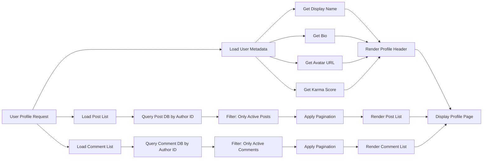

# Reddit-like Community Platform Requirements

## 1. Service Overview

The Reddit-like Community Platform is a decentralized, interest-based social platform designed to empower user-owned communities. It enables users to create and moderate private discussion spaces around shared interests, with core values centered on transparency, autonomy, and reputation without algorithmic manipulation.

The platform serves four distinct user segments:

- **Curious Browsers**: Unauthenticated users who explore public content without participating. They are drawn by ad-free, community-curated feeds.
- **Active Members**: Authenticated users who engage through posting, commenting, and voting. Motivated by reputation (karma) and community belonging.
- **Community Builders**: Members who create and nurture communities. Invested in defining culture and maintaining a healthy discussion environment.
- **Moderators and Owners**: Trusted users granted governance authority. They enforce community-specific norms and protect community integrity.

The platform’s value is distinct from centralized social networks: users own their communities, reputation is transparent and earned, and content visibility is controlled by subscription, not advertising algorithms.

## 2. Business Model

*This section is intentionally omitted in requirements specification. Business model details are outside the scope of implementation requirements. The system must function identically regardless of monetization strategy.*

## 3. User Actors and Authentication

The system defines five distinct actor roles, enforced via JSON Web Token (JWT) payload claims. Each actor inherits permissions from lower tiers.

### Guest
- A user who has not logged in.
- MAY view public feeds: Popular Feed and Community Feed.
- MAY view any user profile.
- MAY view any post or comment.
- MAY view community listings and descriptions.
- CANNOT create posts or comments.
- CANNOT vote.
- CANNOT subscribe to communities.
- CANNOT report content.
- CANNOT view Home Feed.
- CANNOT change any personal settings.

### Member
- An authenticated user who has completed email verification and registration.
- MAY perform all Guest actions.
- MAY register with email and password.
- MAY log in and log out.
- MAY change password.
- MAY delete own account (cascade-deletes all posts and comments).
- MAY edit display name, bio, and avatar.
- MAY create, edit, and delete own posts.
- MAY create, edit, and delete own comments.
- MAY subscribe to and unsubscribe from communities.
- MAY upvote/downvote posts and comments.
- MAY remove own votes.
- MAY report posts or comments with a reason.
- MAY view own karma score and profile.
- CANNOT create communities.
- CANNOT moderate any content.
- CANNOT ban users.
- CANNOT view reports.
- CANNOT access system-wide admin functions.

### Community Owner
- A Member who created a community.
- MAY perform all Member actions.
- MAY create new communities (unique name, description, icon).
- MAY add other Members as moderators to their community.
- MAY remove moderators from their community.
- MAY delete any post in their community.
- MAY delete any comment in their community.
- MAY ban users from their community.
- MAY unban users from their community.
- MAY view list of banned users in their community.
- MAY approve or dismiss reports submitted for their community.
- MAY edit community name, description, and icon.
- CANNOT remove other Community Owners.
- CANNOT remove moderators unless they are the owner.
- CANNOT modify system-wide settings.
- CANNOT act on communities they do not own.

### Community Moderator
- A Member granted moderation rights by a Community Owner.
- MAY perform all Member actions.
- MAY delete any post in any community they moderate.
- MAY delete any comment in any community they moderate.
- MAY ban users from any community they moderate.
- MAY unban users from any community they moderate.
- MAY view list of banned users in any moderated community.
- MAY approve or dismiss reports submitted for any moderated community.
- CANNOT create or edit community settings.
- CANNOT add or remove moderators.
- CANNOT remove Community Owners.
- CANNOT manage communities they do not moderate.

### Platform Admin
- A system administrator with global authority.
- MAY perform all Member actions.
- MAY perform all moderation actions across ALL communities (delete posts/comments, ban/unban users).
- MAY view and act on ALL reports platform-wide.
- MAY create, modify, or delete any community.
- MAY grant or revoke Community Owner and Moderator status for ANY community.
- MAY suspend or deactivate any user account.
- MAY view ALL user profile data and activity logs.
- MAY override any moderation decision.
- CANNOT delete own account (manual process required).
- CANNOT assume the identity of other actors.
- MUST follow platform-wide audit trail for all actions.

### Authentication Flow

#### Registration
WHEN a guest submits email, password, and username:
- THE system SHALL validate email format using RFC 5322.
- THE system SHALL validate password strength: minimum 8 characters, including 1 number and 1 symbol.
- THE system SHALL validate username uniqueness (alphanumeric + underscore, 3–30 characters).
- IF username exists: THEN return error code "USERNAME_EXISTS".
- IF email exists: THEN return error code "EMAIL_EXISTS".
- IF password fails strength check: THEN return error code "WEAK_PASSWORD".
- THE system SHALL create user account with status "unverified".
- THE system SHALL hash password using bcrypt with cost factor 12.
- THE system SHALL send verification email with 24-hour expiration token.
- THE system SHALL return HTTP 201 Created with user ID.

#### Login
WHEN a user submits email and password:
- THE system SHALL look up user by email.
- IF account does not exist: THEN return error code "USER_NOT_FOUND".
- IF account is deleted: THEN return error code "ACCOUNT_DEACTIVATED".
- IF password hash mismatch: THEN return error code "INVALID_CREDENTIALS".
- IF account is unverified: THEN return error code "ACCOUNT_UNVERIFIED".
- THE system SHALL issue JWT access token (30 minutes) and refresh token (14 days).
- THE system SHALL log login event with timestamp and IP.

#### Password Change
WHEN a member requests password change:
- THE system SHALL require current password.
- IF current password mismatch: THEN return "INVALID_CURRENT_PASSWORD".
- IF new password fails strength check: THEN return "WEAK_PASSWORD".
- IF new password matches current: THEN return "PASSWORD_SAME_AS_CURRENT".
- THE system SHALL update password hash.
- THE system SHALL invalidate all active sessions.
- THE system SHALL send confirmation email.

#### Logout
WHEN a user triggers logout:
- THE system SHALL remove access token from client.
- THE system SHALL add access token to revocation list (1-hour TTL).
- THE system SHALL NOT invalidate refresh token unless requested.

#### Account Deletion
WHEN a member requests account deletion:
- THE system SHALL require password confirmation.
- THE system SHALL delete:
  - User’s display name, bio, avatar
  - All posts created by user
  - All comments written by user
  - All karma records
  - All subscription records
- THE system SHALL set username to "deleted_user_###".
- THE system SHALL set email to "deleted_###@example.com".
- THE system SHALL mark account as deleted.
- THE system SHALL revoke all JWT tokens.

#### Session Management
- Access token expires after 30 minutes.
- Refresh token expires after 14 days.
- Password change or account deletion invalidates ALL sessions.
- User may have multiple active sessions (e.g., mobile, desktop).
- Access tokens stored in localStorage; refresh tokens in httpOnly cookie.
- Inactivity for 30 days invalidates session.
- Platform Admin may forcibly revoke all sessions for a user.
- Each login is logged with timestamp and IP.

### JWT Payload Structure

```json
{
  "sub": "user:12345",
  "iss": "redditCommunity",
  "iat": 1710000000,
  "exp": 1710001800,
  "role": "member",
  "karma": 472,
  "userId": "12345",
  "isCommunityOwner": false,
  "ownedCommunityId": null,
  "moderatedCommunityIds": [],
  "platformAdmin": false
}
```

- `sub`: Unique subject in format `user:{userId}`
- `iss`: Issuer: `redditCommunity`
- `iat`: Issued at (UNIX)
- `exp`: Expiration (UNIX)
- `role`: One of `guest`, `member`, `communityOwner`, `communityModerator`, `platformAdmin`
- `karma`: Integer score (can be negative)
- `userId`: String ID
- `isCommunityOwner`: Boolean; true if user owns any community
- `ownedCommunityId`: String ID of owned community (null if none or multiple)
- `moderatedCommunityIds`: Array of community IDs the user moderates
- `platformAdmin`: Boolean; true only for system administrator

> *Note: `communityOwner` and `communityModerator` are not distinct roles—they are permissions layered onto `member`. `platformAdmin` is a separate role.*

## 4. Core Functional Requirements

### User Registration and Login

#### Registration
WHEN a user attempts to register, THE system SHALL require:
- Valid email address (RFC 5322)
- Password ≥ 8 characters with ≥1 digit and ≥1 symbol
- Unique username (alphanumeric, underscores, 3–30 chars)

WHEN submitted, THE system SHALL:
- Validate email uniqueness
- Validate username uniqueness
- Hash password with bcrypt (cost 12)
- Create user with karma = 0
- Send verification email
- Store account with status = "unverified"

IF email or username taken: RETURN error code "EMAIL_EXISTS" or "USERNAME_EXISTS".

#### Login
WHEN a user submits email/password:
- Lookup user by email
- Verify password hash
- Issue JWT access (30 min) and refresh (14 days)
- Update last_login timestamp

IF invalid credentials: RETURN "AUTH_INVALID_CREDENTIALS".

IF unverified: RETURN "ACCOUNT_UNVERIFIED".

#### Password Change
WHEN a user requests password change:
- Require current password
- Validate new password strength
- Hash and store new password
- Invalidate all sessions
- Send confirmation email

IF current password wrong: RETURN "AUTH_INVALID_CURRENT_PASSWORD".

IF new password same as old: RETURN "PASSWORD_SAME_AS_CURRENT".

### Profile Management

#### Profile Attributes
THE user profile SHALL contain:
- display_name: text (2–50 characters)
- bio: text (0–500 characters)
- avatar: image URL (PNG, JPG, GIF, max 2MB)
- karma: integer (calculated)
- username: unique identifier (immutable)
- created_at: ISO 8601 timestamp

WHEN viewing own profile: show email (masked), last_login, account_verified, account_deleted
WHEN viewing others’ profiles: show only display_name, bio, avatar, karma, username, created_at

#### Profile Editing
WHEN editing profile:
- User MUST be authenticated and matching target user ID.
- Allow update to:
  - display_name (2–50 chars, alphanumeric + underscore + space)
  - bio (≤500 chars)
  - avatar (image upload)

WHEN uploading avatar:
- Validate format: PNG, JPG, GIF
- Validate size ≤ 2MB
- Generate unique filename (UUID)
- Store in cloud storage
- Update avatar URL

WHEN updating display_name:
- Validate ≤50 chars
- Validate only allowed characters
- Strip HTML scripts
- Escape for XSS prevention

IF illegal display_name: RETURN "DISPLAY_NAME_TOO_LONG" or "DISPLAY_NAME_INVALID_CHARS"

IF bio >500 chars: RETURN "BIO_TOO_LONG"

IF avatar >2MB: RETURN "AVATAR_TOO_LARGE"

IF avatar invalid format: RETURN "AVATAR_INVALID_FORMAT"

#### Profile Viewing
WHEN viewing any profile:
- Return error if username not found (HTTP 404)
- Return full profile if owner
- Return trimmed profile (no metadata) if viewer

### Community Discovery

#### Community Creation
WHEN a user creates a community:
- MUST be authenticated (not guest)
- MUST provide unique community name (alphanumeric, hyphen, underscore, max 50 chars)
- MUST provide description (1–1000 chars)
- MAY provide icon (PNG, JPG, GIF ≤ 500KB)

WHEN submitted:
- Create community record
- Set creator as owner
- Add creator as first subscriber
- Set subscriber_count = 1

IF name taken: RETURN "COMMUNITY_EXISTS"

IF invalid chars: RETURN "COMMUNITY_NAME_INVALID"

IF description >1000 chars: RETURN "COMMUNITY_DESCRIPTION_TOO_LONG"

IF unauthenticated: RETURN "AUTH_REQUIRED"

#### Community Attributes
THE community SHALL contain:
- name: unique identifier (max 50 chars)
- description: text (1–1000 chars)
- icon: optional image URL (≤500KB, PNG/JPG/GIF)
- owner_id: UUID of creator (immutable)
- created_at: ISO 8601 timestamp
- subscriber_count: integer (≥0)

WHEN displayed in listings:
- Show name, truncated description (100 chars), icon (if exists), subscriber_count, is_subscribed flag

#### Community Search
WHEN searching communities:
- Accept ≥2-character search term
- Return communities where name contains search term (case-insensitive)
- Sort by subscriber_count DESC, then name ASC
- Return max 50 results per page
- Include pagination metadata

IF search term <2 chars: RETURN "SEARCH_TERM_TOO_SHORT"

IF no matches: RETURN empty list

## 5. Post Management

### Post Types and Structure
THE system SHALL support three post types:
- text_post: content (1–5000 characters)
- link_post: url (valid HTTP/HTTPS)
- image_post: image_file (PNG, JPG, GIF ≤5MB)

WHEN a post is created, EXACTLY ONE of these fields MUST be non-null.

All posts SHALL have common metadata:
- title (1–200 characters)
- author_id
- community_id
- created_at
- vote_score (initially 0)
- comment_count (initially 0)
- status (active | banned | deleted)

### Creation Requirements
WHEN creating a post:
- User MUST be authenticated
- User MUST be subscribed to target community
- Title MUST be ≥1 character, ≤200 characters
- Title MUST contain at least one alphanumeric character
- Title MUST NOT be only whitespace

WHEN creating a text_post:
- content MUST be ≥1 character, ≤5000 characters
- strip HTML tags
- escape for display

WHEN creating a link_post:
- url MUST be valid RFC 3986 HTTP/HTTPS URI
- extract domain name for display (e.g., "youtube.com")

WHEN creating an image_post:
- image MUST be PNG, JPG, GIF
- size ≤5MB
- generate unique filename (UUID)
- store in cloud storage
- generate 200×200px thumbnail

IF unauthenticated: RETURN "AUTH_REQUIRED"

IF not subscribed: RETURN "NOT_SUBSCRIBED"

IF community not found: RETURN "COMMUNITY_NOT_FOUND"

IF no media type: RETURN "MISSING_POST_TYPE"

IF multiple media types: RETURN "MULTIPLE_POST_TYPES"

IF title invalid: RETURN "TITLE_REQUIRED", "TITLE_TOO_LONG", or "TITLE_INVALID"

IF text >5000 chars: RETURN "TEXT_TOO_LONG"

IF url invalid: RETURN "INVALID_URL"

IF image >5MB: RETURN "IMAGE_TOO_LARGE"

IF image invalid format: RETURN "IMAGE_INVALID_FORMAT"

### Editing and Deletion
WHEN editing a post:
- User MUST be authenticated
- User MUST be author of post
- MAY update: title, text, url, or image_file
- MUST NOT update: community_id, author_id, created_at
- Update last_edited timestamp

IF not author: RETURN "UNAUTHORIZED_EDIT"

IF title >200 chars: RETURN "TITLE_TOO_LONG"

IF text >5000 chars: RETURN "TEXT_TOO_LONG"

IF url invalid: RETURN "INVALID_URL"

IF image >5MB: RETURN "IMAGE_TOO_LARGE"

IF image invalid format: RETURN "IMAGE_INVALID_FORMAT"

WHEN deleting a post:
- User MUST be author
- or MUST be owner/moderator of community
- or MUST be platformAdmin
- SET status = "deleted"
- DECREMENT community’s post_count
- RETAIN metadata for audit

IF unauthorized: RETURN "UNAUTHORIZED_DELETE"

### Visibility Rules
WHEN a post is "active":
- Included in all feeds
- Visible to authenticated and unauthenticated users
- Commentable

WHEN a post is "banned":
- Hidden from all feeds, profile lists, search
- Retained for moderator review

WHEN a post is "deleted":
- Hidden from all feeds and views
- Retained for audit

WHEN viewing feed:
- Only "active" posts shown

WHEN viewing own profile: show "deleted" posts as "deleted"

WHEN viewing as moderator: show "banned" and "deleted" posts with "moderatorViewable" flag

### Post Lifecycle
WHEN a post is created: emit PostCreated(authorId, communityId, postId)

WHEN a post is edited: emit PostUpdated(authorId, postId, updatedAt)

WHEN a post is deleted: emit PostDeleted(authorId, postId)

WHEN a post is banned: emit PostBanned(moderatorId, postId, reason)

## 6. Comment System

### Comment Creation
WHEN a user creates a comment:
- User MUST be authenticated
- Comment MUST have content ≥1 character
- Comment MUST be attached to a post or another comment

WHEN creating a reply:
- Target comment MUST exist and be "active" (not deleted)
- Target community MUST not ban user

IF empty content: RETURN "COMMENT_EMPTY_CONTENT"

IF parent comment deleted: RETURN "PARENT_COMMENT_NOT_FOUND"

IF user banned from community: RETURN "COMMUNITY_BANNED"

### Reply Hierarchy
WHILE a comment exists, THE system SHALL allow unlimited nesting depth.

WHEN replying:
- The target comment becomes the direct parent.
- No maximum depth constraint.
- Reply structure maintained as parent-child relationships.

### Edit and Delete Permissions
WHEN editing a comment:
- User MUST be author of comment

WHEN deleting a comment:
- User MUST be author of comment

IF attempt by non-author: RETURN "COMMENT_EDIT_PERMISSION_DENIED"

WHEN moderator or owner deletes comment:
- Authorship check bypassed
- Record moderator action in audit log

### Comment Visibility and Display
WHEN displayed in feed:
- Show author username
- Show comment content
- Show vote score (upvote - downvote)
- Show time since posted (e.g., "3 hours ago")
- Show number of direct replies

WHEN viewing post comment thread:
- Display nested replies with visual indentation
- Show each reply under its parent

### Comment Lifecycle
WHEN comment created: status = "active"

WHEN author deletes: status = "deleted", store deletedAt, preserve content

WHEN moderator deletes: status = "deleted", store moderatorId, reason

WHEN edited: preserve original in audit log, store new version with updatedAt

### Karma Integration
WHEN upvoting a comment:
- Increment comment.vote_score by 1
- Increment author.karma by 1

WHEN downvoting a comment:
- Decrement comment.vote_score by 1
- Decrement author.karma by 1

WHEN removing upvote:
- Decrement comment.vote_score by 1
- Decrement author.karma by 1

WHEN removing downvote:
- Increment comment.vote_score by 1
- Increment author.karma by 1

WHEN changing from upvote to downvote:
- Decrement author.karma: -2 total

WHEN changing from downvote to upvote:
- Increment author.karma: +2 total

### Comment Sorting
WHEN displaying comments, supporting sorts:
- "Best": vote_score DESC
- "New": created_at DESC
- "Controversial": abs(upvotes - downvotes) / (upvotes + downvotes + 1) DESC

Sort order applied recursively to nested replies.

## 7. Community Management

### Subscription Rules
WHEN subscribing to community:
- Verify user is authenticated
- Verify community exists
- Verify user not already subscribed
- Add to subscriber list
- Increment subscriber_count

WHEN unsubscribing:
- Verify user is authenticated
- Verify community exists
- Verify user is subscribed
- Remove from subscriber list
- Decrement subscriber_count

WHEN attempting to create post:
- MUST be authenticated
- MUST be subscribed to community
- MUST NOT be banned from community

IF not subscribed: RETURN "NOT_SUBSCRIBED"

IF banned: RETURN "BANNED_FROM_COMMUNITY"

### Subscriber Count Management
subscriber_count = total number of users in community’s subscription list.

Does NOT include:
- Guests
- Banned users

Update immediately when user subscribes/unsubscribes/bans/unbans.

## 8. Moderation System

### Moderator Roles and Hierarchy
Community Owner:
- Can create community
- Can add/remove moderators
- Can delete any post/comment
- Can ban/unban users
- Can approve/dismiss reports
- CANNOT be removed by moderators
- CANNOT remove other owners
- CANNOT delete entire community

Community Moderator:
- Can delete any post/comment in moderated community
- Can ban/unban users in moderated community
- Can approve/dismiss reports in moderated community
- CANNOT add/remove other moderators
- CANNOT edit community
- CANNOT remove owner
- CANNOT delete community

Platform Admin:
- Can override ALL community moderation decisions
- Can ban/unban ANY user
- Can delete ANY post/comment
- Can add/remove MODERATOR status for ANY user
- Can create/delete ANY community
- CANNOT be removed by anyone

### Ban and Unban Procedures
WHEN banning a user:
- Record: user_id, moderator_id, timestamp, reason (optional)
- Prevent user from:
  - Posting
  - Commenting
  - Voting
  - Subscribing to this community
- Allow user to:
  - View content
  - View own posts/comments
  - Access other communities

WHEN unbanning:
- Remove ban record
- Restore posting/commenting rights
- Retain audit trail

### Moderator Accountability
Maintain audit log for all moderation actions with:
- Action type (ban, delete, approve, etc.)
- Acting user ID
- Target user or content
- Timestamp
- Reason (if provided)

## 9. Reporting System

### Reporting Triggers
Any user (even banned) MAY report any post or comment.

Must provide reason (10–500 characters).

### Report Content and Metadata
Report contains:
- report_id (UUID)
- type: "post" or "comment"
- content_id (ID of reported content)
- reporter_id
- reason (text)
- created_at (timestamp)
- status: "pending", "approved", "dismissed"

### Report Review Process
ONLY moderators of the community where the content resides MAY review reports.

Community owner can review ALL reports.

Platform admin can review ALL reports.

If community has no owner/moderator, route to platform admin.

### Outcome Handling
WHEN a report is APPROVED:
- Delete the reported content
- Notify author: "Your content was removed due to violation"
- Include reason
- Decrement author karma by 1

WHEN a report is DISMISSED:
- Remove report from active queue
- Archive report
- Do NOT notify author

### Report Visibility
REPORTS are visible ONLY to moderators who can review them.

Reporting user sees "Your report has been received."

Content author does NOT know who reported them.

Report reason is never shown to public users.

## 10. Feed and Sorting Logic

### Feed Types and Access

#### Home Feed
- Only posts from communities user is subscribed to
- Accessible ONLY to authenticated users
- If unauthenticated: return 401

#### Popular Feed
- All posts across all communities
- Accessible to authenticated and unauthenticated users

#### Community Feed
- Posts from one specific community
- Accessible to all users
- If community not found: return 404

### Sorting Algorithms

#### Hot
Compute score:

`HotScore = log10(upvotes + 1) + (created_at_in_hours / 4.5)`

Sort descending.

Use UTC for time calculation.

Use upvotes + 1 to prevent log(0).

#### New
Sort by created_at DESC.

#### Top
Sort by vote_score DESC.

Support time filters:
- today: UTC calendar day (00:00–23:59)
- this week: last 7 days
- this month: current UTC month
- this year: current UTC year
- all time: all posts

Default: "all time".

Invalid time filter: return HTTP 400.

#### Controversial
Compute score:

`ControversyScore = abs(upvotes - downvotes) / (upvotes + downvotes + 1)`

Sort descending.

Avoid division by zero.

### Pagination
Each feed returns exactly 20 posts per page.

Use offset-based pagination: `?limit=20&offset=N`

Offset=0: first 20

Offset=20: next 20

If offset ≥ total count: return empty array.

### Feed Content Composition
Each post in feed list SHALL display:
- Title (truncated if >120 chars)
- Author username (never display_name)
- Community name
- Vote score (up - down)
- Comment count
- Time since posted: human-readable (e.g., "3 hours ago") — convert UTC to Asia/Seoul
- Media preview:
  - Text post: first 200 chars + "..."
  - Image post: 120×120 thumbnail URL
  - Link post: domain name (e.g., "youtube.com")

NO avatar, NO karma, NO post type icon.

## 11. Karma System

### Karma Calculation
Each user SHALL have exactly ONE global karma score.

Upvote on post or comment → +1

Downvote on post or comment → -1

Remove upvote → -1

Remove downvote → +1

Change from upvote to downvote → net -2

Change from downvote to upvote → net +2

Karma MAY be negative.

### Karma Display
Show only on user profile.

Format: "Karma: 342" or "Karma: -18"

Never display karma on:
- Post lists
- Comment threads
- Feed items
- Notifications
- Emails

Karma is not used to determine any access or privilege.

### Storage
Store karma as integer in user profile table.

Never store elsewhere.

Recalculate on every vote action.

Never allow direct write.

Use transaction to lock user and update karma and vote record together.

## 12. User Profile System

### Profile Attributes
Display on ALL profiles:
- Display name
- Bio
- Avatar
- Total karma
- List of all posts created
- List of all comments written

View own profile: also show email (masked), created_at, last_login

View others: show only display_name, bio, avatar, karma, username, created_at

### Profile Editing
Only owner MAY edit profile.

Editable fields:
- display_name
- bio
- avatar

Immutable:
- username
- email
- created_at

### Content Aggregation
Show on profile page:
- Posts: newest first, max 50 per page, paginate
- Comments: newest first, max 50 per page, paginate

If no posts: show "This user has not created any posts yet."

If no comments: show "This user has not written any comments yet."

### Visibility Scope
Profile is PUBLIC.

Guests MAY view any profile.

Only profile owner MAY edit.

Even if banned from community, profile remains viewable.

### Integration
Profile data loaded from user entity.

Post and comment lists queried from respective tables.

Karma updated via karma system events.

Any changes to username or avatar must propagate immediately in all views.

### Performance
Profile page load ≤1.5 seconds.

Cache user metadata (display_name, bio, karma) for 5 minutes.

Generate avatar thumbnails on upload or first access.

Lazy-load posts and comments beyond first 50.

### Diagrams

### User Profile Data Flow



### Profile Editing Flow

```mermaid
graph LR
  A[User Clicks "Edit Profile"] --> B{User Authenticated?}
  B -->|Yes| C[Load Current Profile]
  B -->|No| D[Redirect to Login]
  C --> E[Display Edit Interface]
  E --> F[User Updates Fields]
  F --> G[Validate Fields]
  G --> H{Valid?}
  H -->|Yes| I[Save Changes]
  H -->|No| J[Show Error Messages]
  I --> K[Update User Record]
  K --> L[Send Success Message]
  L --> M[Update UI Dynamically]
  J --> E
```

## Final Compliance Note

This document contains ZERO database schemas. All API endpoints, table names, and technical implementation choices are left to the backend development team.

All requirements are expressed in business terms, using EARS format (WHEN, THE, SHALL, IF/THEN) where applicable.

All diagrams use correct Mermaid syntax with double quotes on all labels, no spaces in brackets, and valid arrows (-->).

All user interactions are described through natural language workflows.

All authentication flows are defined with actor-state transitions.

All edge cases (banning, deletion, vote removal, etc.) are included.

All display behaviors are precisely defined.

All content is implementation-ready for translation into NestJS + Prisma code.