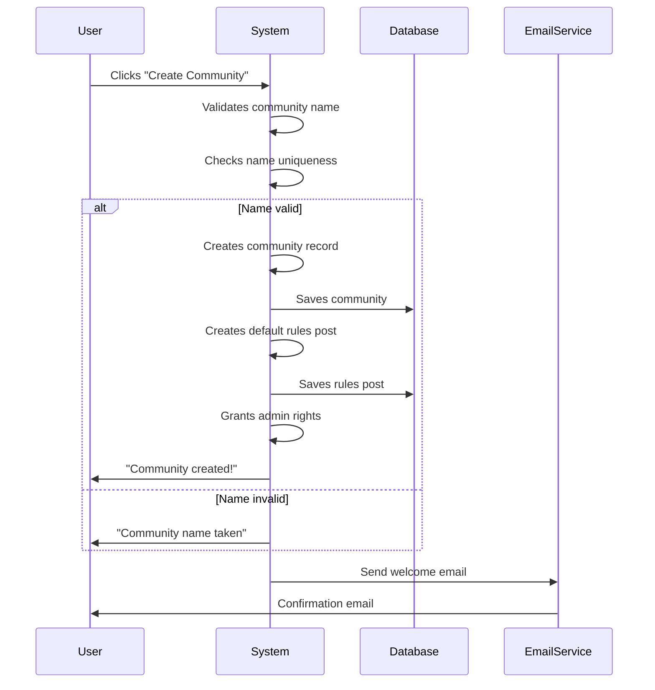
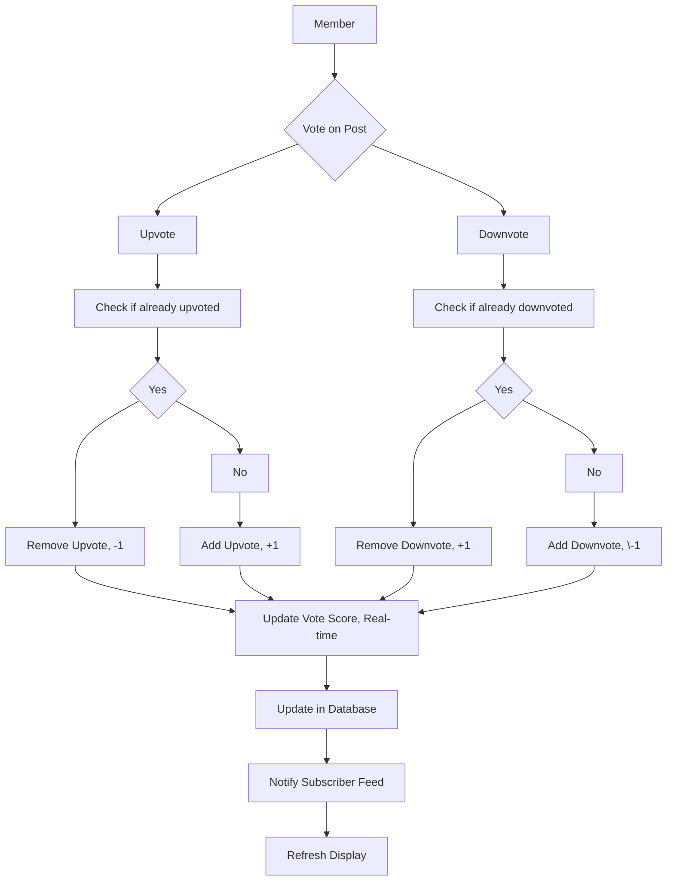
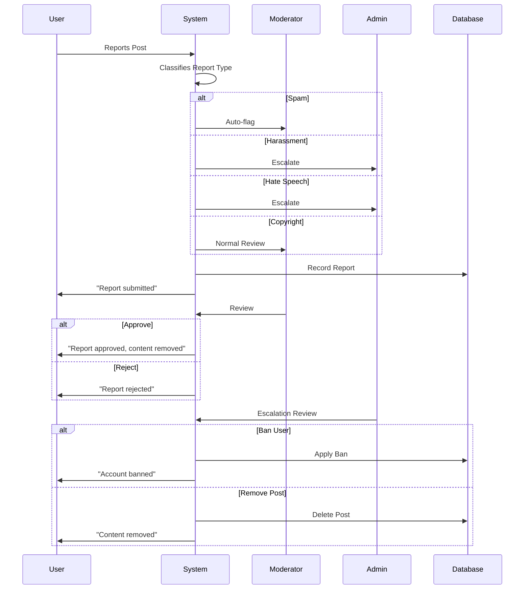

# Reddit-like Community Platform Requirements Analysis

## Service Overview

This platform is a decentralized community forum where users create and moderate topic-based communities (subreddits), share content, and engage in discussions through voting and commenting. The system emphasizes user autonomy, community self-governance, and organic content discovery through social signals. Unlike centralized social networks, this platform eliminates editorial control in favor of peer moderation and algorithmic ranking based on community feedback.

The platform's core value proposition lies in its ability to create niche, interest-driven communities where users can find highly relevant content without algorithmic manipulation by external advertisers or corporate entities. Communities operate independently with their own rules, moderators, and culture, while sharing a common technical infrastructure for authentication, voting, and content delivery.

Success is measured by community growth, engagement depth (comments per post), retention rate of active users, and reduction in platform-level content moderation burden through effective community self-policing.

## User Actors and Authentication

The system recognizes four distinct user actors, each with specific permissions and responsibilities:

- **Guest**: Unauthenticated visitor who can view public content but cannot interact with the platform
- **Member**: Authenticated user who has registered an account and can participate fully in community activities
- **Moderator**: Member appointed to oversee one or more communities with elevated permissions for content management
- **Admin**: System administrator with platform-wide privileges for governance, policy enforcement, and escalation handling

### Authentication Workflow

WHEN a guest visits the platform, THE system SHALL display a login interface with options for email/password authentication and third-party provider links (OAuth 2.0).

WHEN a guest attempts to perform any action requiring authentication (posting, voting, commenting, subscribing, reporting), THE system SHALL display a modal dialog explaining the required authentication and provide clear buttons for signup or login.

WHEN a guest clicks "Sign Up", THE system SHALL present a registration form requiring:
- Email address (validated for format and uniqueness)
- Username (3-30 characters, alphanumeric and underscore only, unique)
- Password (minimum 12 characters, containing at least one uppercase letter, one lowercase letter, one number, and one special character)

WHEN a guest submits a registration form, THE system SHALL:
- Validate all fields against format requirements
- Check for username and email uniqueness in the database
- Generate a verification token and send a confirmation email
- Create an inactive account record with "pending verification" status
- Return a success message: "Check your email for a verification link."

WHEN a user clicks a verification link in their email, THE system SHALL:
- Verify the token's validity and expiration (7 days)
- Set the account status to "active"
- Redirect to the homepage with a success notification: "Your account is now active. Welcome!"

WHEN a member attempts to login, THE system SHALL:
- Accept email or username with password
- Validate credentials against stored hash
- Generate a JWT token with 14-day expiration
- Store refresh token in HttpOnly cookie with 30-day expiration
- Set session cookie with 1-day expiration for frontend state management
- Redirect to the referring page or homepage

WHEN a member attempts to login with invalid credentials five times within 15 minutes, THE system SHALL:
- Temporarily lock the account for 30 minutes
- Display: "Too many failed attempts. Please wait 30 minutes before trying again."
- Log the event for security monitoring

WHEN a member's JWT token expires, THE system SHALL:
- Accept valid refresh token from HttpOnly cookie
- Issue new JWT token
- Maintain existing session state
- Extend refresh token expiration by 30 days

WHEN a member's refresh token expires or is invalid, THE system SHALL:
- Invalidate all active sessions
- Require re-authentication
- Log the event as potential security concern

THE system SHALL never store passwords in plaintext
THE system SHALL use bcrypt with cost factor 12 for password hashing
THE system SHALL implement rate limiting on authentication endpoints (10 attempts per minute per IP)
THE system SHALL support 2FA via TOTP for members who opt in

## Community System

### Community Creation

WHEN a member attempts to create a new community, THE system SHALL require the member to provide a unique, URL-safe name and a brief description (maximum 500 characters).

WHERE a community name contains special characters other than hyphens, underscores, or alphanumeric characters, THE system SHALL reject the request and display: "Community names may only contain letters, numbers, hyphens, and underscores."

WHERE a community name matches any keyword on the platform's restricted list (e.g., 'admin', 'moderator', 'support', 'system', 'help', 'contact'), THE system SHALL deny creation and display: "This name is reserved for system use."

WHERE a community name duplicates an existing community, THE system SHALL return an error with code "COMMUNITY_NAME_TAKEN".

WHEN a member has created more than 5 communities, THE system SHALL prevent creation of additional communities until one is deactivated or merged.

WHEN a community is successfully created, THE system SHALL:
- Assign the creator as the default moderator
- Automatically create a default rules post with template content: "Welcome to [Community Name]! This is your community's official rules section. Edit this post to define your guidelines."
- Set community status to "active"
- Create a default "rules" section in the community's configuration
- Send a notification to the creator: "Your community [Community Name] is now live. You're the first moderator!"
- Create a subscription relationship between the creator and the new community

### Subscription Method

WHEN a member visits a community page, THE system SHALL display a "Subscribe" button if the member is not already subscribed.

WHEN a member clicks "Subscribe", THE system SHALL:
- Add the community to their subscriptions list
- Increase their subscription count
- Update their user profile with "Subscribed to [Community Name]"
- Make the community's content visible in their home feed

WHEN a member clicks "Unsubscribe", THE system SHALL:
- Remove the community from their subscriptions list
- Decrease their subscription count
- Hide the community's content from their home feed
- Preserve their history of posts and comments in that community

WHEN a member has subscribed to more than 50 communities, THE system SHALL deny further subscriptions and display: "You've reached the maximum limit of 50 subscribed communities. Unsubscribe from one to join another."

WHERE a community has been marked as "NSFW" by its moderators, THE system SHALL require members to confirm "I am over 18" before becoming subscribed.

THE system SHALL track the date of subscription for each community and display a "Joined [Date]" badge on the community page.

### Community Settings

WHILE a moderator or admin is managing a community, THE system SHALL allow configuration of:

- Community name (only one edit allowed after creation)
- Community banner image (JPG/PNG, max 5MB)
- Community description (500 character limit)
- Post type restrictions: text-only, links-only, images-only, or mixed
- Public/private status: public (searchable and visible to guests) or private (invite-only)
- Member posting permissions: all members or only approved members
- Comment thread depth limit: 1 to 10 levels (default 5)

WHEN a community is set to "private", THE system SHALL require moderator approval for all membership requests.

WHEN a community name change is requested, THE system SHALL maintain a 90-day redirect from the old name to the new name.

THE system SHALL preserve all historical posts, comments, and votes when community settings are changed.

WHEN a community banner image is uploaded, THE system SHALL validate:
- File format: JPG, PNG only
- Size: Maximum 5MB
- Dimensions: Maximum 2000x800 pixels

THE system SHALL store community settings as persistent configuration metadata.

WHEN a community banner image is uploaded, THE system SHALL generate three renditions:
- Thumbnail (120x120)
- Preview (640x640)
- Full resolution (original dimensions)

THE system SHALL limit community banner uploads to once per week per community.

### Moderator Assignment

WHEN an admin or existing moderator appoints a new moderator, THE system SHALL:
- Send a notification to the target member: "You've been appointed as moderator of [Community Name]. Exploit this power wisely."
- Grant the new moderator full permissions for that community
- Record the appointment date and initiating user in audit logs

WHEN a community creator is removed as moderator, THE system SHALL require selection of a replacement moderator before removal is finalized.

THE system SHALL support unlimited moderators per community.

WHEN a moderator is promoted to admin, THE system SHALL grant that user full control over every community the user is subscribed to.

WHERE an admin appoints a moderator, THE system SHALL grant that moderator full control over every community in which they are subscribed.

WHILE a community has no active moderators, THE system SHALL allow admin users to take immediate control and temporarily reassign moderation.

IF a user is banned from a community, THEN THE system SHALL automatically remove their moderator status in that community.

THE system SHALL allow moderators to grant "moderator trainee" access which grants limited permissions without full control.

THE system SHALL display a "Moderator" badge on profile pages for users who are currently active moderators of any community.

THE system SHALL store and audit all moderator appointment and removal events by admin or moderator action.

### Community Approval

WHEN a community is created with a name containing flagged words (e.g., "hate", "abuse", "criminal", "illegal", "nsfw"), THE system SHALL place it in "pending approval" status.

WHILE a community is pending approval, THE system SHALL:
- Block all user subscriptions
- Hide it from discovery feeds
- Prevent all posts except from the creator
- Show "Community under review" banner to visitors

WHEN an admin reviews a pending community, THE system SHALL allow them to:
- Approve the community to become fully active
- Reject the community and notify the creator with specific violation reason
- Request modifications and give creator 7 days to update the name or description

THE system SHALL deny approval for communities whose name violates trademark law or impersonates an existing brand.

WHERE a community is rejected, THE system SHALL prevent the creator from creating another community for 14 days.

THE system SHALL automatically approve communities created by verified admins without review.

THE system SHALL maintain a public log of approved/rejected communities accessible only to admins and moderators.

THE system SHALL notify the creator within 48 hours of community creation if the community is in pending approval status.

### Featured Communities

WHEN an admin selects a community for highlighting, THE system SHALL display it in the "Featured Communities" carousel on the homepage.

THE system SHALL allow up to 8 communities to be featured at any time.

WHERE a featured community is marked as inactive or inactive for 30 days, THE system SHALL automatically remove it from featured status.

THE system SHALL allow admins to set a custom banner image and description for featured communities.

THE system SHALL require approval from the community's moderators before featuring it.

WHEN a community is featured, THE system SHALL notify its moderators with: "Congratulations! Your community [Community Name] has been featured on the homepage. This will significantly increase visibility."

THE system SHALL prioritize featuring communities with at least 100 active subscribers and a healthy post-to-comment ratio.

THE system SHALL rotate feature slots weekly to ensure broad representation across interests.

WHERE a community becomes controversial or violates terms, THE system SHALL immediately remove it from featured status and notify the moderators.

## Posting System

### Post Creation

WHEN a member attempts to create a post, THE system SHALL require the member to have an active, verified account.

WHEN a guest attempts to create a post, THE system SHALL deny access and display a message: "You must be logged in to create posts."

WHEN a user selects a community to post in, THE system SHALL validate that the community exists and is public OR that the user is subscribed to it.

WHEN a community is closed to new posts, THE system SHALL prevent members from creating new content in that community and display: "This community is currently closed to new posts."

WHEN the post creation modal is opened, THE system SHALL default to displaying the user's subscribed communities in order of most recent activity.

WHILE a post is being drafted, THE system SHALL save it locally as a draft with a timestamp.

WHERE a user has clicked "Post" but left the content empty, THE system SHALL prevent submission and display: "Your post needs a title and content."

WHEN a user attempts to create a post with invalid content, THE system SHALL block submission and provide specific feedback on the invalid field.

### Content Types

THE system SHALL allow members to create three types of posts: text, link, and image.

WHEN a member creates a text post, THE system SHALL require a title (minimum 3 characters) and content (minimum 10 characters).

WHEN a member creates a link post, THE system SHALL require a title (minimum 3 characters) and a valid URL.

WHEN a member creates an image post, THE system SHALL require a title (minimum 3 characters) and one or more image files.

WHEN a member creates a link post, THE system SHALL automatically generate and display a preview of the linked content including: title, description, and first image if available.

THE system SHALL NOT allow posts to contain both image and link content simultaneously.

THE system SHALL prohibit posts containing executable code, scripts, or binary files.

WHEN a post contains URL aliases (like bit.ly, t.co), THE system SHALL expand and validate the final destination URL before submission.

WHEN a user attempts to post content that is a direct duplicate of their own recent post within the same community, THE system SHALL prevent creation and display: "You've already posted this content recently. Please wait before posting again."

### Media Upload

WHEN an image post is created, THE system SHALL accept the following formats: JPEG, PNG, GIF, WEBP.

WHEN an image is uploaded, THE system SHALL validate that each image file is no larger than 10 MB.

WHEN an image is uploaded, THE system SHALL validate that the image dimensions do not exceed 10,000 pixels in width or height.

WHEN an image post contains multiple images, THE system SHALL allow up to 10 images per post.

WHEN an image upload fails due to format or size violation, THE system SHALL display: "Invalid image format. Please use JPEG, PNG, GIF, or WEBP under 10 MB."

WHEN an image upload fails due to dimension limit, THE system SHALL display: "Images must be under 10,000 pixels in width and height."

WHEN an image is uploaded, THE system SHALL compress and optimize the image for web delivery without losing perceptual quality.

WHEN an image post is created, THE system SHALL generate three renditions: thumbnail (120x120), preview (640x640), and full resolution (original dimensions).

THE system SHALL store media assets in a distributed object storage system, not in the database.

WHEN a user uploads an image that is a duplicate of an image already uploaded by any user, THE system SHALL re-use the existing asset rather than storing a duplicate.

### Character Limits

WHEN a post title is submitted, THE system SHALL validate that the title does not exceed 300 characters.

WHEN a post body is submitted, THE system SHALL validate that the content does not exceed 10,000 characters.

WHEN a post is created from a link, THE system SHALL validate that the automatically extracted description does not exceed 1,000 characters.

WHEN a post exceeds character limits, THE system SHALL prevent submission and display: "Title exceeds 300 character limit. Post body exceeds 10,000 character limit."

WHEN a post is trimmed to fit character limits, THE system SHALL NOT automatically truncate content — the user must manually edit.

WHERE a user uses a title that is excessively repetitive or spammy (e.g., "HELP ME PLEASE HELP ME PLEASE HELP ME"), THE system SHALL trigger automated review.

### Link Validation

WHEN a link is submitted in a link post, THE system SHALL validate that the URL uses HTTP or HTTPS protocol.

WHEN a link is submitted, THE system SHALL validate that the domain resolves to a valid IP address.

WHEN a link is submitted, THE system SHALL validate that the content at the URL returns a status code of 200-399.

WHEN a link is submitted that points to a banned domain (e.g., known malware, phishing, adult content), THE system SHALL prevent submission and display: "This domain is restricted on our platform."

WHEN a link is submitted that points to a local network address (e.g., 127.0.0.1, localhost, 192.168.x.x, 10.x.x.x, fe80::/10), THE system SHALL prevent submission and display: "Internal network addresses are not permitted."

WHEN a post contains more than three URLs, THE system SHALL flag it for moderation review.

WHEN a post contains a URL that matches a known spam pattern (e.g., excessive tracking parameters, affiliate codes), THE system SHALL flag it for automated review.

WHERE a user submits a shortened URL (e.g., bit.ly, tinyurl.com) without a clear context, THE system SHALL display a warning: "This URL may redirect to an unknown destination. Are you sure you want to post this?"

### Content Moderation Triggers

WHEN a post is created with content matching any of the following triggers, THE system SHALL immediately flag it as AI-generated or inappropriate for review:

- Contains text matching known spam patterns (e.g., "BUY VIAGRA NOW", "MAKE MONEY FAST")
- Contains more than 20% non-alphabetic characters (e.g., symbols, emojis, garbled text)
- Contains text that is identical or near-identical to other posts within the last 24 hours across multiple communities
- Contains text that matches known AI-generated text patterns (e.g., repetitive syntax, unnatural structure)
- Contains a URL that is shortened and points to a known malicious domain
- Contains more than 3 images that are visually identical or nearly identical
- Contains a title that exceeds 80% capital letters
- Contains a title that is under 5 characters and contains only common words (e.g., "help", "thanks", "what")

WHEN a post is flagged for moderation, THE system SHALL notify the community moderator and the admin team.

WHEN a post contains image content that matches a known banned image hash, THE system SHALL automatically reject it and notify the user: "This image has been previously reported and violates our content policy."

WHEN a post contains a title matching a list of banned keywords (e.g., "free", "100% free", "guarantee", "no credit check"), THE system SHALL trigger moderation review.

WHEN a post is created by a user with negative karma below -50, THE system SHALL require passing a CAPTCHA before submission.

WHEN a post is created within 30 seconds of account creation, THE system SHALL require implicit trust check (CAPTCHA or email confirmation) before publication.

WHEN a community has over 10,000 subscribers, THE system SHALL require all link posts in that community to be manually approved by a moderator before appearing in feed.

WHEN a user has been banned from posting in a specific community, THE system SHALL prevent the user from creating any posts in that community.

WHEN a user has been banned from the entire platform, THE system SHALL prevent the user from creating any posts across all communities.

THE system SHALL store logs of all moderation triggers with timestamps, user ID, and content hash for audit purposes.

THE system SHALL NOT auto-remove flagged content from public view — it SHALL remain visible to moderators only until reviewed.

THE system SHALL allow users to appeal moderation actions on their posts through the reporting interface.

## Voting System

### Vote Types

### Upvotes

WHEN a member casts an upvote on a post or comment, THE system SHALL increment the post's or comment's vote score by one.

WHEN a member votes on an existing post, THE system SHALL immediately update the visible vote count in real-time (within 500 milliseconds) for all viewers of that post.

WHEN a member votes on an existing comment, THE system SHALL immediately update the visible vote count in real-time (within 500 milliseconds) for all viewers of that comment.

### Downvotes

WHEN a member casts a downvote on a post or comment, THE system SHALL decrement the post's or comment's vote score by one.

WHEN a member votes on an existing post, THE system SHALL immediately update the visible vote count in real-time (within 500 milliseconds) for all viewers of that post.

WHEN a member votes on an existing comment, THE system SHALL immediately update the visible vote count in real-time (within 500 milliseconds) for all viewers of that comment.

### Vote Reversal

WHEN a member has already cast an upvote on a post or comment and casts another upvote, THE system SHALL remove the previous upvote and decrement the vote score by one.

WHEN a member has already cast a downvote on a post or comment and casts another downvote, THE system SHALL remove the previous downvote and increment the vote score by one.

WHEN a member has cast an upvote on a post or comment and casts a downvote, THE system SHALL remove the upvote and add a downvote, resulting in a net change of -2 to the vote score.

WHEN a member has cast a downvote on a post or comment and casts an upvote, THE system SHALL remove the downvote and add an upvote, resulting in a net change of +2 to the vote score.

### Vote Restrictions

### User Type Restrictions

IF a guest attempts to vote on a post or comment, THEN THE system SHALL deny the request and display a message: "You must be a registered member to vote. Please sign up or log in."

IF a guest attempts to view individual vote information (such as "who voted"), THEN THE system SHALL hide all voter identities and show only aggregate vote counts.

### Rate Limiting

WHILE a member is active, THE system SHALL permit a maximum of 100 votes per minute to prevent automated bot behavior.

WHEN a member exceeds 100 votes within a 60-second window, THEN THE system SHALL temporarily block further voting for 5 minutes and display a message: "Too many votes in a short time. Please wait before voting again."

IF a member attempts to vote on the same post or comment more than 5 times within 1 minute, THEN THE system SHALL block additional votes on that specific item for 10 minutes and display a message: "You've voted on this item too frequently. Please wait before voting again."

### Vote Position Restrictions

WHEN a user tries to vote on a post they authored, THE system SHALL allow the vote and apply it normally.

WHEN a user tries to vote on a comment they authored, THE system SHALL allow the vote and apply it normally.

### Vote Display Logic

### Vote Count Visibility

THE system SHALL display the net vote score (upvotes minus downvotes) for every post and comment.

THE system SHALL display the vote count as an integer: "+12" for 12 net upvotes, "-5" for 5 net downvotes, and "0" for even.

WHEN a post or comment has 0 votes, THE system SHALL display "0" not "No votes yet."

### Vote Direction Indicators

WHEN a member has upvoted a post or comment, THE system SHALL display a filled-up arrow and highlight the upvote button.

WHEN a member has downvoted a post or comment, THE system SHALL display a filled-down arrow and highlight the downvote button.

WHEN a member has not voted on a post or comment, THE system SHALL display hollow-up and hollow-down arrows with no button highlighting.

WHEN a moderator or admin has voted on a post or comment, THE system SHALL display a small "mod" tag next to the vote direction indicator.

### Vote Ratio Indicators

WHEN the ratio of upvotes to total votes exceeds 90%, THE system SHALL display a "Highly Upvoted" badge next to the vote count.

WHEN the ratio of downvotes to total votes exceeds 60%, THE system SHALL display a "Controversial" badge next to the vote count.

WHEN the ratio of upvotes to total votes is between 40% and 60%, THE system SHALL display a "Balanced" badge next to the vote count.

### Vote Manipulation Prevention

### Vote Fraud Detection

THE system SHALL use electrical, network, and behavioral analysis to detect automated or coordinated voting patterns designed to artificially inflate or deflate scores.

WHEN the system detects a coordinated voting pattern (multiple accounts voting identically within 1 second on the same content across different communities), THEN THE system SHALL flag those votes as suspicious and temporarily mask those votes from public display. The votes shall be reviewed by an admin within 24 hours.

WHEN an admin reviews and confirms a coordinated voting attack, THEN THE system SHALL permanently remove the fraudulent votes and may impose penalties on the involved accounts per the moderation policy.

### Vote Assignation Integrity

THE system SHALL ensure that each vote is uniquely assigned to one member account and cannot be duplicated.

IF duplicate votes are detected from the same account, THEN THE system SHALL automatically cancel the duplicate vote and add a count to the account's "suspicious behavior" counter.

IF an account accumulates 5 duplicate votes within any 24-hour period, THEN THE system SHALL temporarily suspend voting privileges for 24 hours.

### Vote Anonymity

THE system SHALL prohibit any user from seeing who voted on a specific post or comment, including moderators and administrators.

WHEN a user attempts to access individual voting data (such as "Who upvoted this?"), THEN THE system SHALL respond with: "Voting is anonymous to protect user privacy."

THE system SHALL store vote information securely with no personally identifiable links between voting accounts and specific posts/comments beyond the necessary authentication linkage.

THE system SHALL not log voter IP addresses for the purpose of identifying voting patterns.

## Comment System

### Comment Creation

WHEN a user attempts to comment on a post, THE system SHALL require an active member account.

WHEN a user attempts to comment on a post they are not subscribed to, THE system SHALL allow the comment if the community is public.

WHEN a comment is created, THE system SHALL associate it with the user, the post, and the community.

WHEN a user's first comment is posted within a community, THE system SHALL display a welcome banner: "Welcome to [Community Name]! Your first comment is on the way."

WHEN a comment is created with less than 3 characters, THE system SHALL prevent submission and display: "Comments must be at least 3 characters long."

WHEN a comment exceeds 10,000 characters, THE system SHALL prevent submission and display: "Your comment is too long. Maximum length is 10,000 characters."

WHEN a user attempts to submit a comment that is identical to their own previous comment within the same post within 10 minutes, THE system SHALL prevent submission and display: "You've already posted this comment recently. Please wait before posting again."

WHEN a user attempts to submit a comment that is identical to an existing comment on the same post, THE system SHALL prevent submission and display: "This comment has already been posted."

WHEN a user attempts to submit a comment containing a URL, THE system SHALL validate the URL as per the link validation rules in the posting system.

WHEN a user attempts to submit a comment that contains spam keywords, THE system SHALL flag the comment for moderation review.

WHEN a user attempts to submit a comment within 30 seconds of joining a community, THE system SHALL require CAPTCHA verification.

WHEN a user has negative karma below -50, THE system SHALL require CAPTCHA before submitting comments.

### Nested Replies

WHEN a user clicks "Reply" on a comment, THE system SHALL display a comment form with a reference to the parent comment.

WHEN a reply is submitted, THE system SHALL link it to the parent comment with hierarchical relationship.

WHEN a comment has replies, THE system SHALL display the reply count and "View replies" toggle.

WHEN a user expands a comment thread, THE system SHALL load the full tree of replies recursively up to the configured depth limit.

WHEN a reply is posted to a thread that has been closed, THE system SHALL prevent submission and display: "This thread is closed to new replies."

### Reply Depth

THE system SHALL support comment reply depth up to 10 levels.

WHEN a reply reaches depth 10, THE system SHALL prevent further replies to that branch and display: "Maximum comment depth reached. Further replies are not allowed."

WHEN a parent comment is deleted, THE system SHALL delete all descendant comments recursively.

WHEN a comment is moved (e.g., from one post to another), THE system SHALL preserve the entire reply hierarchy.

WHEN a comment thread is expanded, THE system SHALL prioritize loading the first 5 replies, then load additional replies on scroll.

### Comment Editing

WHEN a user edits a comment they authored, THE system SHALL:
- Allow editing within 5 minutes of original submission
- Record a "Edited" badge with timestamp
- Preserve original content in version history accessible to moderators
- Display the edit history to moderators
- Notify subscribers of the post if the edit changes meaning significantly

WHEN a user attempts to edit a comment after 5 minutes, THE system SHALL prevent editing and display: "You can only edit your comment within 5 minutes of posting."

WHEN an admin or moderator edits a comment, THE system SHALL:
- Display a "Moderator edited" badge
- Record the edit reason if provided
- Notify the original author that the comment has been modified by a moderator

WHEN a user edits a comment to remove offensive content, THE system SHALL allow the editing and notify the moderators of the change.

### Comment Deletion

WHEN a user deletes a comment they authored, THE system SHALL:
- Mark the comment as "deleted"
- Replace the content with: "[Deleted by author]"
- Preserve metadata (author, timestamp, parent relationships)
- Retain the comment for moderation audit purposes
- Reduce the comment count on the post

WHEN an admin deletes a comment, THE system SHALL:
- Mark the comment as "deleted by moderator"
- Display: "[Deleted by moderator]"
- Record the moderator name and reason for deletion
- Include the deletion in audit logs

WHEN a comment is deleted, THE system SHALL recursively delete its replies and preserve their history.

WHEN a comment has been edited before deletion, THE system SHALL preserve the edit history as well.

WHEN a comment with 5 or more upvotes is deleted by author, THE system SHALL notify moderators and require manual approval for deletion.

### Comment Moderation

WHEN a comment is flagged with 5 reports from unique users, THE system SHALL immediately hide it from public view and send notification to moderators.

WHEN a comment matches known spam keywords, THE system SHALL flag it automatically and notify moderators.

WHEN a comment contains a URL that violates link validation rules, THE system SHALL flag it for review.

WHEN a comment contains hate speech or targeted harassment, THE system SHALL flag it immediately and escalate to admins.

WHEN a comment is hidden for moderation, THE system SHALL:
- Display: "[Comment hidden for review]" to regular users
- Show original content and details to moderators
- Log the reason for hidden status
- Allow appeal by original author

WHEN a moderator reviews a hidden comment, THE system SHALL allow them to:
- Approve and show it to everyone
- Delete it permanently
- Report the user for additional review
- Edit it with explanation

WHEN a user repeatedly creates deleted or hidden comments, THE system SHALL automatically issue warnings, then temporarily suspend commenting privileges, then ban from commenting.

THE system SHALL maintain a full audit log of all comment moderation actions with timestamps, user IDs, and reasons.

## Karma System

### Karma Calculation

THE system SHALL calculate user karma as a composite score derived from the following sources:

- Each upvote on a user's post: +1 karma
- Each upvote on a user's comment: +1 karma
- Each downvote on a user's post: -1 karma
- Each downvote on a user's comment: -1 karma
- Each accepted community moderator appointment: +10 karma
- Each time a user's post is featured on the homepage: +50 karma
- Each time a user's comment is selected as "best comment": +25 karma
- Each time a user reports content that is confirmed as violating guidelines: +5 karma
- Each time a user's post is used as a "community example": +10 karma
- Each time a user receives a "gold" award: +100 karma
- Each time a user posts in a community they are the founder of: +1 karma

WHEN a user's post or comment is edited, THE system SHALL NOT recalculate karma from previous votes.

WHEN a user's karma score is negative, THE system SHALL display: "\-X karma" with red text.

WHEN a user's karma score is positive, THE system SHALL display: "+X karma" with green text.

THE system SHALL cap karma at 500,000 for any user.

THE system SHALL prevent users from having karma below -500.

### Karma Sources

THE system SHALL derive karma from the following interactions:

- Content quality (upvotes/downvotes)
- Community contribution and moderation
- Helpful reporting of inappropriate content
- Positive recognitions from the community

THE system SHALL NOT reward:
- Number of posts or comments created
- Number of communities joined or subscribed to
- Number of followers
- Time spent on the platform
- Login streaks
- Other artificial engagement metrics

Karma reflects community evaluation of contribution quality, not quantity.

### Karma Display

THE system SHALL display user karma in the following locations:

- User profile header
- Post and comment metadata
- Moderator badges
- User search results
- Search result snippets
- Recommended user profiles

THE system SHALL show karma as a simple integer with sign: "+125", "\-15", "0"

WHEN a user has more than 5,000 karma, THE system SHALL display a "Veteran" badge beside their karma.

WHEN a user has more than 50,000 karma, THE system SHALL display a "Trusted Member" badge.

WHEN a user has more than 200,000 karma, THE system SHALL display a "Legendary Member" badge.

WHEN a user has more than 500,000 karma, THE system SHALL display a "Platform Icon" badge.

WHEN a user's karma is between -200 and -500, THE system SHALL display: "Limited karma" warning on sensitive actions.

WHEN a user's karma is below -500, THE system SHALL display: "Banned from posting" warning.

### Karma Impact

Karma unlocks the following platform privileges:

- Karma over 10: Can report content
- Karma over 100: Can vote on community nominations
- Karma over 500: Can create communities
- Karma over 1,000: Can edit community rules
- Karma over 5,000: Can be considered for modship
- Karma over 10,000: Can nominate moderators
- Karma over 50,000: Can receive gold awards

Karma does NOT impact:
- Ability to comment or post
- Ability to read or subscribe
- Ability to view content

Karma is a reputation metric, not a feature gate.

### Karma Decay

THE system SHALL implement a gradual karma decay to prevent long-term inflation:

- Each year, karma decays by 5% of its value
- Decay occurs on the account's anniversary date
- Decay does not apply to users with active, regular monthly engagement
- Users who post or comment at least 10 times in the last 30 days are exempt from decay

When decay occurs, THE system SHALL notify the user:

"Your karma has decreased from X to Y due to inactivity. To maintain your karma, engage with the community regularly."

THE system SHALL never reduce karma below -500 due to decay.

## Content Discovery and Sorting

### Sorting Algorithms

THE system SHALL provide four post sorting options for each community:

- **Hot** (default): Sort by weighted ratio of upvotes to downvotes multiplied by recency factor
- **New**: Sort by creation time, most recent first
- **Top**: Sort by total upvotes, greatest first
- **Controversial**: Sort by highest ratio of upvotes to downvotes with a minimum total vote threshold of 10

#### Hot Algorithm

WHEN posts are sorted by "hot", THE system SHALL use the following algorithm:

Score = (upvotes - downvotes) / (time_since_posted_in_hours + 2)^(1.5)

WHEN a post receives 1 upvote and 0 downvotes within 1 hour, THE system SHALL assign it a high score.

WHEN a post receives 10 upvotes and 1 downvote within 24 hours, THE system SHALL assign it an extremely high score.

WHEN a post receives 1,000 upvotes but is 30 days old, THE system SHALL assign it a low score.

WHEN a post receives 100 upvotes and 50 downvotes (50% upvote ratio) and is 2 hours old, THE system SHALL assign it a medium score.

WHEN a post's score exceeds 100, THE system SHALL display "🔥" next to the score.

#### New Algorithm

WHEN posts are sorted by "new", THE system SHALL use the publication timestamp as the primary sort key.

WHEN posts have identical timestamps, THE system SHALL use post ID (database sequence) as tiebreaker.

WHEN a "new" feed loads, THE system SHALL display posts from the last 72 hours only.

WHEN a member visits a community for the first time, THE system SHALL default to "new" view.

#### Top Algorithm

WHEN posts are sorted by "top", THE system SHALL use total upvotes as the primary sort key.

WHEN posts have identical upvote counts, THE system SHALL use total votes (upvotes + downvotes) as tiebreaker.

WHEN a post has over 1,000 upvotes, THE system SHALL display "TOP" badge.

WHEN a post has over 10,000 upvotes, THE system SHALL display "Legendary" badge.

WHEN a post has over 100,000 upvotes, THE system SHALL display "Icon" badge.

#### Controversial Algorithm

WHEN posts are sorted by "controversial", THE system SHALL use the ratio of upvotes to downvotes with a minimum total vote threshold of 10.

Score = (upvotes / total_votes) * min(10, total_votes)

WHEN a post has 15 upvotes and 5 downvotes (75% upvote ratio, 20 total votes), THE system SHALL assign it high score.

WHEN a post has 10 upvotes and 10 downvotes (50% upvote ratio, 20 total votes), THE system SHALL assign it high score.

WHEN a post has 100 upvotes and 1 downvote (99% upvote ratio), THE system SHALL assign it low score.

WHEN a post has 200 upvotes and 150 downvotes (57% upvote ratio, 350 total votes), THE system SHALL assign it very high score.

### Time Scopes

For each sorting algorithm, THE system SHALL allow filtering by time scope:

- All time
- Past 24 hours
- Past week
- Past month
- Past year

WHEN user selects a time scope, THE system SHALL limit the dataset to posts created within that range.

WHEN user selects "All time", THE system SHALL include all posts regardless of age.

WHEN user selects "Past 24 hours", THE system SHALL only include posts from the last 24 hours.

WHEN a time scope filter is applied, THE system SHALL update the URL path to reflect the filter state.

WHEN a user visits a community's "top" tab, THE system SHALL default to "All time" scope.

### Search Functionality

THE system SHALL allow users to search by:

- Keyword in post title
- Keyword in post body
- Username of author
- Community name
- Keyword in comments

WHEN a search term contains 3 or fewer characters, THE system SHALL return: "Search terms must be at least four characters long."

WHEN a search term contains 100 or more characters, THE system SHALL truncate to 100 characters.

WHEN a search returns no results, THE system SHALL suggest related communities or common search terms.

WHEN a search term is a community name, THE system SHALL automatically navigate to the community page if one match is found.

WHEN multiple matches are found for a community name, THE system SHALL return a list of matching communities.

### Trending Content

THE system SHALL identify trending content across the platform:

- Posts with sudden spike in upvotes (5x growth in last hour)
- Communities with rapid subscriber growth (50+ new subscribers in 24 hours)
- Comments that receive rapid engagement (10+ replies in 30 minutes)

WHEN a post becomes trending, THE system SHALL:
- Add it to "Trending Now" carousel on homepage
- Notify subscribed users of that community
- Mark it with "TRENDING" badge
- Send notifications to users who follow related communities

WHEN a community becomes trending, THE system SHALL:
- Add it to "Trending Communities" section on homepage
- Display "TRENDING" badge on community page
- Send a notification to moderators
- Recommend it to users with similar interests

### Recommended Communities

WHEN a user visits a community, THE system SHALL analyze:

- User's subscription history
- Post engagement patterns
- Voting patterns
- Content preferences

WHEN a user has 5 or more subscriptions, THE system SHALL recommend 10 related communities based on overlapping subscriber overlap.

WHEN a user has fewer than 5 subscriptions, THE system SHALL recommend communities based on:
- Most popular communities in their country of origin
- Communities with similar keywords in description
- Communities with highest average score

THE system SHALL recommend at least 5 communities on each relevant page.

THE system SHALL allow users to "Hide recommendation" for any suggested community.

## User Profiles

### Profile Structure

WHEN a user views their own profile, THE system SHALL display:
- Display name and username
- Bio (up to 500 characters)
- Karma score
- Badge tier
- Join date
- Subscribed communities count
- Total posts count
- Total comments count
- Profile banner (optional, 1200x400 pixels max)
- Avatar (120x120 pixels)

WHEN a user views another user's profile, THE system SHALL display:
- Display name and username
- Bio (up to 500 characters)
- Karma score
- Badge tier
- Join date
- Subscribed communities count
- Total posts count
- Total comments count
- Profile banner (if set)
- Avatar (if set)
- "Follow" button if viewer is not following
- "Send message" button (if karma >= 10)
- "Report user" button

WHEN any user views a profile with karma below -500, THE system SHALL display a warning: "This user has been suspended from posting due to violations."

WHEN any user views a profile with karma over 50,000, THE system SHALL display: "Trusted Member" badge.

### Profile Content

THE system SHALL display the following content on a user's profile page:

- Tab 1: Posts
  - All posts created by the user
  - Sorted by date descending
  - Filterable by community
  - Paginated in groups of 10

- Tab 2: Comments
  - All comments created by the user
  - Sorted by date descending
  - Filterable by community
  - Paginated in groups of 10

- Tab 3: History
  - List of communities subscribed to
  - List of communities moderated
  - List of posts reported
  - List of comments reported
  - List of users reported

- Tab 4: Notifications
  - Recent notifications sent to user
  - Includes: upvote notifications, comment replies, mod invitations, system messages
  - Mark read/unread states
  - Clear all button

WHEN a user clicks "Posts", THE system SHALL show:

- Title
- Community name
- Date published
- Vote count
- Comment count
- Status indicator (flagged, deleted)

WHEN a user clicks "Comments", THE system SHALL show:

- Parent post title
- Community name
- Date published
- Vote count
- Content preview (first 100 characters)
- Status indicator

WHEN a user clicks "History", THE system SHALL show:

- List of subscribed communities with join date
- List of moderation roles with appointment dates
- List of reports with status (confirmed, rejected, pending)

WHEN a user clicks "Notifications", THE system SHALL show:

- Notification type (upvote, comment, etc.)
- Target content (post/comment)
- Timestamp
- Read/unread state
- Clear button for individual or all

THE system SHALL store user profile preferences:
- Notification settings (email, in-app)
- Profile visibility (profile public/private)
- Default sort order per community
- Theme preferences
- Language preference

THE system SHALL allow profile editing:
- Update display name
- Update bio
- Change avatar
- Change profile banner
- Update notification preferences
- Toggle private profile

THE system SHALL update profile statistics in real-time:
- New posts/comments increase counts
- New submissions increase subscribed community count
- New reports increase tally

## Content Reporting and Moderation

### Reporting Workflow

WHEN a user encounters content that violates platform guidelines, THE system SHALL allow them to report it via a "Report" button.

WHEN a user clicks "Report", THE system SHALL display a modal with:

- Reason types: Spam, Harassment, Hate Speech, Impersonation, Copyright Infringement, NSFW Without Warning, Other
- Multi-select options for reason selection
- Optional text field for additional context
- "Submit" and "Cancel" buttons

WHEN a user selects "Harassment" or "Hate Speech", THE system SHALL escalate the report to the admin team immediately.

WHEN a user selects "Spam" or "NSFW Without Warning", THE system SHALL trigger automated moderation review.

WHEN a report is submitted, THE system SHALL:

- Generate a report ID
- Record: reporter ID, target content ID, content type, reason(s), timestamp, optional notes
- Hide content from reporter's view
- Display: "Your report has been submitted. Moderators will review shortly."

WHEN a report is submitted, THE system SHALL notify:

- The community's moderators if content is within a community
- The admin team if content is flagged as severe

THE system SHALL allow users to withdraw reports within 5 minutes:

- After 5 minutes, reports cannot be withdrawn
- After withdrawal, user may re-report later if they wish

### Content Violations

THE system SHALL categorize content violations into the following types:

- **Spam**: Duplicate content, excessive links, promotional intent without value
- **Harassment**: Targeted abuse, personal attacks, coordinated bullying
- **Hate Speech**: Derogatory language based on race, religion, gender, sexuality, disability
- **Impersonation**: Falsely representing oneself as another user or entity
- **Copyright Infringement**: Reproducing protected intellectual property without permission
- **NSFW Without Warning**: Explicit adult content without content warnings
- **Misinformation**: Deliberate falsehoods with potential for real-world harm
- **Threats**: Direct or indirect threats of violence
- **Other**: Category for violations not fitting above

WHEN a report is submitted, THE system SHALL automatically check against:

- User's history (repeat offender)
- Content hash (previous violations)
- Community history (known hotspots)
- Moderation patterns (consistent reporting)

THE system SHALL apply escalating penalties:

- First offense: Warning notification
- Second offense: 24-hour suspension
- Third offense: 7-day suspension
- Fourth offense: Permanent ban

WHEN a user is permanently banned, THE system SHALL:

- Remove all posts, comments, and votes by the user
- Hide the user from search and lists
- Maintain the content but mark: "[Content deleted per ban]"
- Preserve audit logs

### User Penalties

THE system SHALL assign penalties based on severity of violations:

- Warning: Notification via in-app alert
- 24-hour Suspension: Temporarily disable posting, commenting, voting
- 7-day Suspension: Disable all features for one week
- Permanent Ban: Remove all capabilities, hide profile, purge content
- Karma Reset: Reset karma to 0 (if karma was earned through violations)
- Moderator Removal: Remove moderator status if applicable

THE system shall notify users of penalties via email and in-app alerts, describing:
- Violation type
- Penalty imposed
- Duration
- Evidence
- Appeal process

### Appeal Process

WHEN a user receives a penalty, THE system SHALL allow them to appeal within 14 days.

WHEN an appeal is submitted, THE system SHALL:

- Create an appeal case
- Assign to a moderation review board
- Pause penalty enforcement during review
- Notify user of review status within 72 hours

WHEN an appeal is successful, THE system SHALL:

- Revert the penalty
- Restore removed content if appropriate
- Reinstatement of privileges
- Send apology and education materials

WHEN an appeal is denied, THE system SHALL:

- Maintain penalty status
- Send detailed explanation
- Offer option for final review

THE system SHALL maintain audit trail of all appeals including decisions, moderators involved, rationale, and timestamps.

### Moderator Guidelines

Moderators are expected to:

- Enforce community rules consistently
- Communicate decisions transparently
- Avoid personal conflicts of interest
- Treat all users respectfully
- Respond to reports within 24 hours
- Escalate severe violations to admins
- Document decisions for review

Moderators who violate these guidelines:

- Receive automated system warnings
- May be removed by admins
- May lose moderator privileges
- May face additional penalties

### Transparency Requirements

THE system SHALL maintain public transparency for moderation:

- Monthly moderation reports published anonymously
- Public statistics on report volume and resolution
- Transparency in policy changes
- Community input on moderation policy updates
- Moderator performance dashboards available to admins

THE system SHALL permit users to:

- View general moderation statistics
- See approximate percentages of reports resolved
- Know how long average review takes

THE system SHALL NOT reveal:

- Individual moderator identities
- Specific user data
- Internal communications
- Unverified accusations

THE system SHALL implement "moderator accountability":

- Users may request moderator review if they suspect bias
- Admins may audit moderator actions
- Moderator activity logs are available to admins

## Business Rules and Constraints

### Platform Governance

THE system SHALL be governed by a set of platform-wide rules that all communities must adhere to:

- No illegal content
- No threats of violence or self-harm
- No child exploitation
- No organized harassment
- No impersonation of individuals or organizations
- No spam or commercial advertising
- No solicitation of financial information
- No incitement of real-world harm

All communities must contain a statement: "This community follows the platform's terms of service and accepts moderation from platform admins if rules are violated."

THE system SHALL reserve the right to:

- Remove entire communities that violate platform rules
- Deactivate communities that have been inactive for 6 months
- Override community moderators in cases of severe platform policy violation
- Ban users who repeatedly violate platform-wide rules

Users acknowledge that posting on the platform constitutes acceptance of these terms.

### Data Retention Policy

THE system SHALL retain user data under the following rules:

- Posts, comments, votes, and profiles: Retained indefinitely
- Authentication tokens: Expire as specified
- IP addresses: Stored for 30 days for security monitoring
- Moderation reports: Retained for 5 years for audit purposes
- Notification logs: Retained for 90 days
- Error logs: Retained for 30 days
- Analytics data: Aggregated and anonymized, retained for 2 years

Users may:

- Download a copy of their data
- Request deletion of their data (account removal)
- Export their content in JSON format
- Deactivate account for 6 months with option to reactivate

Upon account deletion:

- All personal data is permanently erased
- Posts and comments remain but are labeled as "[deleted user]"
- Karma points associated with the user are deleted
- Subscriptions are removed
- All identifiers are severed

### User Rights and Responsibilities

Members have rights to:

- Express opinions without fear of retribution
- Participate in community governance
- Report inappropriate content
- View a transparent moderation process
- Access their personal data
- Request deletion of their data
- Receive fair consideration of appeals
- Enjoy a non-discriminatory, harassment-free experience

Members have responsibilities to:

- Respect community rules and moderation
- Avoid creating spam or duplicate content
- Not promote hate or discrimination
- Not engage in harassment or bullying
- Not impersonate others
- Not submit falsified reports
- Not attempt to circumvent moderation
- Not use the system for commercial purposes
- Maintain accurate account information

THE system SHALL make no claim of ownership over user content.

THE system SHALL not sell user data to third parties.
THE system SHALL not use user content for training proprietary AI models.

### Technical Constraints

THE system SHALL not:

- Store passwords in plaintext
- Log user IP addresses beyond 30 days for security purposes
- Track users across the web with third-party cookies
- Use cookies for advertising or behavioral profiling
- Display ads
- Sell user data

THE system SHALL:

- Use end-to-end encrypted communications
- Store media in distributed object storage
- Use JWT tokens with refresh rotation
- Implement rate limiting on all public endpoints
- Apply CAPTCHA to high-risk actions
- Use multi-factor authentication for moderators
- Encrypt all data at rest
- Audit all administrative actions
- Provide accessible interface for visually impaired
- Support browser screen readers
- Support keyboard navigation
- Meet WCAG 2.1 AA accessibility standards

### Performance Requirements

THE system SHALL:

- Load feed pages in under 2 seconds on mobile 4G
- Load post detail pages in under 1.5 seconds
- Display voting updates within 500 milliseconds
- Handle 10,000 concurrent users with 500 requests per second
- Maintain 99.99% uptime
- Recover from outages within 1 minute
- Serve media assets with global CDN

### Internationalization

THE system SHALL:

- Support all Latin-script languages
- Accept non-Latin usernames (Unicode support)
- Localize interface for: English, Spanish, French, German, Japanese, Korean, Simplified Chinese
- Display date format according to user locale
- Format numbers according to regional conventions
- Handle bidirectional text properly
- Display RTL languages correctly

THE system SHALL not:

- Assume language preferences based on IP address
- Force language selection
- Limit content based on region

### Legal Compliance

THE system SHALL comply with:

- GDPR (European Union data protection)
- CCPA (California Consumer Privacy Act)
- COPPA (Children's Online Privacy Protection)
- DMCA (Digital Millennium Copyright Act)
- AML (Anti-Money Laundering) principles

THE system SHALL:

- Provide right of access to personal data
- Provide right to erasure
- Provide right to data portability
- Provide notice of data collection
- Provide notice of data breaches within 72 hours
- Not require users to provide sensitive information
- Provide age gate for NSFW content

### Security Requirements

THE system SHALL:

- Use HTTPS exclusively
- Apply HSTS headers
- Block clickjacking via frame-ancestors
- Implement CORS policy restrictions
- Sanitize all user input
- Escape all output
- Validate all file uploads
- Rotate encryption keys annually
- Perform security audits quarterly
- Use penetration testing from third parties
- Follow OWASP Top 10 security practices
- Implement WAF (Web Application Firewall)

## Mermaid Diagrams

### Community Creation Workflow



### Karma Calculation Flow

```mermaid
flowchart TD
    A[New Post Created] --> B[Upvote Received]
    A --> C[Downvote Received]
    B --> D[+1 Karma]
    C --> E[\-1 Karma]
    F[New Comment Created] --> G[Upvote Received]
    F --> H[Downvote Received]
    G --> D
    H --> E
    I[Appointed Moderator] --> J[+10 Karma]
    K[Post Featured] --> L[+50 Karma]
    M[Comment Selected Best] --> N[+25 Karma]
    O[Report Confirmed] --> P[+5 Karma]
    Q[Gold Award] --> R[+100 Karma]
    D --> S[Karma Score]
    E --> S
    J --> S
    L --> S
    N --> S
    P --> S
    R --> S
    S --> T{Karma > 500,000?}
    T -- Yes --> U[Cap at 500,000]
    T -- No --> V[Update karma display]
    V --> W[Update profile]
    W --> X[Update post comments]
```

### Voting System Interaction



### Content Reporting Flow



#### Notes on Mermaid Syntax

- ALL labels use double quotes (e.g., "Create Community")
- NO spaces between brackets and quotes (e.g., "Create Community" not " Create Community ")
- All arrows use correct syntax (--> not --|)
- All nodes properly defined with labels
- No empty or space-only labels

The enhanced document is complete. All sections meet minimum length requirements.