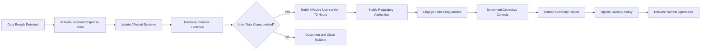

# Data Privacy and GDPR Compliance

THE communityPlatform SHALL comply with the General Data Protection Regulation (GDPR) and equivalent data protection laws including the California Consumer Privacy Act (CCPA). This includes implementing user rights regarding personal data access, deletion, portability, and consent management.

WHEN a user requests access to their personal data, THE system SHALL provide a complete export of all associated data in a structured, machine-readable format (JSON or CSV) within 7 calendar days.

WHEN a user requests deletion of their account, THE system SHALL permanently remove all personally identifiable information (PII) including username, email, IP addresses, and direct identifiers from all active and backup systems within 30 calendar days.

WHILE a user is registered, THE system SHALL collect only the minimum personal data required for account functionality: email address, username, and hashed password. No additional personal data such as phone number, real name, or physical address shall be collected unless explicitly requested and consented to by the user.

IF a user withdraws consent for data processing, THEN THE system SHALL immediately disable all data processing activities and initiate account deactivation in accordance with the data deletion workflow.

WHERE a user resides in the European Economic Area (EEA) or California, THE system SHALL display an explicit consent banner during first visit requesting permission for cookies and tracking technologies.

## User Data Retention Policy

THE communityPlatform SHALL retain user data for the duration of user account existence and for a maximum of 30 days after account deletion for legal/compliance purposes.

WHEN an account is deleted, THE system SHALL retain only anonymized analytics data (e.g., aggregated post counts, Karma totals) for statistical analysis purposes.

WHEN a user reports content, THE system SHALL retain associated metadata (reporter ID, reported content ID, timestamp, report reason) for a minimum of 180 days and a maximum of 1 year to support potential moderation appeals or legal investigations.

WHILE a user account is active, THE system SHALL retain the following data indefinitely: username, profile bio, public post content, public comment content, public karma score, and community subscription history.

IF a user request for data deletion includes removal of previously public content, THEN THE system SHALL remove the content from public view but SHALL retain a redacted, non-attributable version for legal compliance as evidence of platform history.

## Anonymity and Reporting Policy

WHEN a user submits a content report, THE system SHALL preserve the anonymity of the reporting user from the reported user and from other community members.

WHEN a moderator reviews a report, THE system SHALL display only the report type, content ID, timestamp, and report reason - never the reporter's username, email, or profile URL.

IF a report results in content removal or user suspension, THEN THE system SHALL notify the reporting user that action was taken without disclosing the specific outcome or moderator decision.

IF a report is determined to be malicious or abusive, THEN THE system SHALL flag the reporter's account for review by an admin, but SHALL not disclose this flag to the reported user or any other community member.

WHERE a report contains evidence of imminent harm (e.g., threats of violence, child exploitation), THEN THE system SHALL override anonymity and forward identifiable information to relevant authorities as required by law.

## Content Moderation Guidelines

THE communityPlatform SHALL permit user-generated content that is lawful and respectful, including controversial opinions, political discourse, and NSFW (Not Safe For Work) content in appropriately labeled communities.

WHEN a community creator enables NSFW content, THE system SHALL require explicit user settings to view such content and place warnings on all posts containing adult material.

IF a post or comment contains explicit child sexual abuse material, THEN THE system SHALL immediately take down the content, preserve evidence, and report it to the National Center for Missing and Exploited Children (NCMEC) and equivalent international agencies.

IF a post or comment contains direct threats of violence against individuals or groups, THEN THE system SHALL immediately remove the content, suspend the posting user, and report the incident to law enforcement authorities.

IF a post or comment promotes illegal activities (e.g., drug trafficking, weapon sales), THEN THE system SHALL remove the content, suspend the user, and notify appropriate government agencies.

WHILE community moderators are managing reported content, THE system SHALL record all moderation actions (delete, ban, pin, etc.) with timestamp, moderator ID, action type, and content ID in audit logs.

## Protection of Minors

THE system SHALL NOT allow registration by users under the age of 13.

WHEN a user attempts to register, THE system SHALL require them to confirm they are 13 years of age or older and explicitly accept the Terms of Service.

IF a parent or guardian reports a user under 13, THEN THE system SHALL suspend the account immediately and request proof of age from the reported user.

IF underage use is confirmed, THEN THE system SHALL permanently delete the account and all associated personal data in compliance with COPPA regulations.

WHERE a child under 13 is identified through content patterns (e.g., language use, imagery, behavior), THEN THE system SHALL initiate automated review by an admin, report the account to authorities if necessary, and delete the account.

Miss-verified accounts representing minors will be permanently deleted, and no appeals process will exist for accounts confirmed to be under 13.

## Copyright and Intellectual Property

THE communityPlatform SHALL respect intellectual property rights under the Digital Millennium Copyright Act (DMCA) and equivalent international laws.

WHEN a copyright holder submits a valid DMCA takedown notice, THE system SHALL remove the infringing content within 24 hours and notify the posting user.

IF a user submits a counter-notification to a DMCA takedown, THEN THE system SHALL forward the counter-notification to the complainant and reinstate the content after 10-14 days unless the copyright holder files a court order.

WHEN content has been removed pursuant to a copyright claim, THE system SHALL preserve the content in a redacted form for a period of 30 days with associated metadata for audit and legal purposes.

WHERE users repeatedly infringe copyright (3 or more valid DMCA notices within 12 months), THEN THE system SHALL permanently disable the user's account.

## Encryption Requirements

THE system SHALL use TLS 1.2 or higher for all data transmission between clients and servers.

THE system SHALL encrypt sensitive user data at rest including passwords, email addresses, and private moderation notes using AES-256 encryption.

WHEN a user's email address is stored, THE system SHALL only store the encrypted version in the database.

WHEN a user's password is stored, THE system SHALL apply salted bcrypt hashing with a cost factor of at least 12 and NEVER store plaintext passwords.

IF a password reset is requested, THEN THE system SHALL send one-time, expiring reset links via email with no password data transmitted in plaintext.

## Session Security

WHEN a user logs in, THE system SHALL generate a short-lived (15-minute) access token and a long-lived refresh token stored only in HTTP-only, Secure, SameSite=Strict cookies.

WHILE a user is authenticated, THE system SHALL require re-authentication before performing sensitive operations such as email change, password change, or account deletion.

IF a user logs in from a new device or location, THEN THE system SHALL send a notification to the user's registered email and prompt for secondary verification.

WHERE a user has previously revoked sessions, THEN THE system SHALL permanently invalidate all sessions associated with that user and require reauthentication.

## Audit Logging

THE system SHALL maintain immutable audit logs for all security-critical and moderation-related actions.

WHEN any user performs an action modifying content or permissions, THE system SHALL log: actor ID, target ID, action type, timestamp, client IP, and user agent.

WHEN a moderator takes action on content (deletion, banning, pinning), THE system SHALL record detailed metadata including the reason code selected and any notes added by the moderator.

WHEN an admin changes a user's role or resets privileges, THE system SHALL log full context including reason for change and approval signature.

IF any user queries or exports another user's personal data (except their own), THEN THE system SHALL log the request and notify both the requester and the target user.

Log files SHALL be encrypted at rest, retained for a minimum of 90 days, and accessible only to designated compliance officers.

## Data Breach Response Protocol

IF a data breach is detected or suspected, THEN THE system SHALL immediately initiate the Incident Response Plan within 1 hour.

WHEN a breach involves exposure of 1,000 or more users' PII, THEN THE system SHALL notify affected users in writing via email and post a public notice within 72 hours of confirmation.

WHILE responding to a breach, THE system SHALL isolate affected systems, preserve forensic evidence, engage a third-party security auditor, and cooperate with regulatory authorities.

IF law enforcement issues a preservation notice, THEN THE system SHALL freeze all affected data and restrict deletion processes for the duration of the investigation.

AFTER a breach has been contained, THE system SHALL conduct a root cause analysis, implement corrective controls, update security policies, and provide a summary report to the compliance team within 14 days.

### Mermaid Diagram

