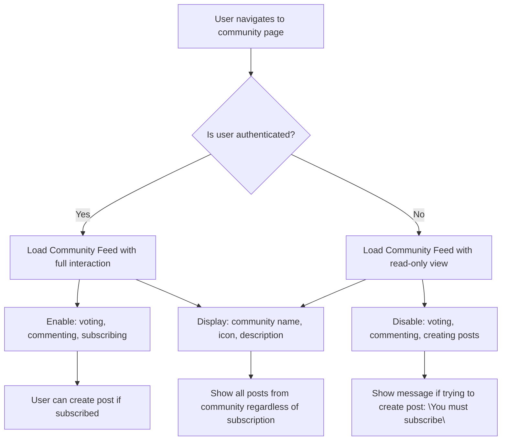

# Post Feeds Specification

## Home Feed Logic

WHEN a member is logged in, THE system SHALL display the Home Feed as their default view.

WHEN a member views the Home Feed, THE system SHALL show only posts from communities they are subscribed to.

WHEN a member unsubscribes from a community, THE system SHALL immediately stop showing posts from that community in their Home Feed.

WHEN a member subscribes to a new community, THE system SHALL include posts from that community in their Home Feed on the next feed load.

WHILE a member is logged in, THE system SHALL prioritize displaying their Home Feed over other feeds unless explicitly navigated elsewhere.

IF a member attempts to access the Home Feed while not authenticated, THEN THE system SHALL redirect them to the Popular Feed with a prompt to login.

IF a member has not subscribed to any communities, THEN THE system SHALL display a message: "You haven't subscribed to any communities yet. Explore popular communities to get started."

## Popular Feed Logic

THE system SHALL make the Popular Feed available to all users, including guests and unauthenticated visitors.

WHEN a user accesses the Popular Feed, THE system SHALL show posts from all communities on the platform, regardless of subscription status.

THE system SHALL NOT require authentication to view the Popular Feed.

WHILE the Popular Feed is active, THE system SHALL ensure that all posts are publicly accessible, even if the user is not subscribed to their originating community.

WHEN a guest accesses the Popular Feed, THE system SHALL display all content features except voting, commenting, and creating posts.

WHEN a member accesses the Popular Feed, THE system SHALL retain their ability to vote, comment, and subscribe to communities, but these actions do not affect the feed's content composition.

## Community Feed Logic

WHEN a user navigates to a specific community page, THE system SHALL display the Community Feed for that community.

THE system SHALL display all posts in a community's feed to both authenticated and unauthenticated users.

WHEN a user is not subscribed to a community, THE system SHALL still show all posts from that community in its Community Feed.

WHEN a user views a Community Feed, THE system SHALL display the community's name, icon, and description prominently at the top.

WHEN a user attempts to create a post in a community where they are not subscribed, THEN THE system SHALL prevent submission and show: "You must be subscribed to this community to create posts."

WHEN a user is banned from a community, THEN THE system SHALL hide all their posts from that community's feed (but not from their own profile or other feeds).

## Sorting Algorithms

### Hot Sorting

WHEN the Hot sort is selected, THE system SHALL rank posts using an algorithm based on recent activity and engagement.

THE system SHALL calculate a Hot score as: (log(upvotes + 1)) + (hours since posted) * 0.1 - (hours since posted) * 0.2

WHILE a post is older than 24 hours, THE system SHALL reduce its Hot score gradually.

WHILE a post receives more than 10 votes in the last hour, THE system SHALL boost its visibility to the top of the Hot feed.

WHEN a post receives no votes in the last 7 days, THE system SHALL remove it from the Hot feed.

### New Sorting

WHEN the New sort is selected, THE system SHALL rank posts by creation time in descending order (most recent first).

THE system SHALL ignore vote scores, comment counts, or community popularity in New sorting.

WHEN two posts have identical creation times, THE system SHALL use their database ID as a tiebreaker.

WHILE new posts are being created, THE system SHALL update the New feed in real-time with a 1-second delay.

### Top Sorting

WHEN the Top sort is selected, THE system SHALL calculate the highest vote score (upvotes - downvotes) for each post.

WHEN a time filter is applied to Top sorting (Today, This Week, This Month, This Year, All Time), THE system SHALL filter posts by creation date before sorting by score.

WHEN no time filter is selected, THE system SHALL use 'All Time' as the default.

WHEN a post's vote score is negative, THE system SHALL still include it in the Top feed if it ranks highly.

WHEN two posts have identical scores, THE system SHALL sort by creation time (newer first).

### Controversial Sorting

WHEN the Controversial sort is selected, THE system SHALL rank posts with a high total number of votes but a score close to zero.

THE system SHALL calculate a Controversial score using: (upvotes + downvotes) * (1 - abs(score) / (upvotes + downvotes + 1))

WHEN a post has fewer than 10 total votes, THE system SHALL exclude it from the Controversial feed.

WHEN an upvote and downvote are balanced exactly (score = 0), THE system SHALL award the highest Controversial score.

WHEN a post has 100 total votes but a score of +1 or -1, THE system SHALL rank it highly in the Controversial feed.

WHEN a post has one upvote and no downvotes, THE system SHALL exclude it from the Controversial feed.

## Pagination Strategy

WHEN any feed is loaded, THE system SHALL initially return 20 posts per page.

WHEN a user scrolls to the bottom of the feed, THE system SHALL load the next page of 20 posts automatically (infinite scroll).

WHEN a user clicks on a new sort option, THE system SHALL reset pagination to page 1 and reload the feed.

WHEN a user navigates from one feed type to another, THE system SHALL clear the current feed data and load the new feed from page 1.

WHEN users navigate back to a previously viewed feed, THE system SHALL retain their scroll position but reload the feed content to ensure data freshness.

MOBILE CONSTRAINT: EACH PAGE LOAD SHALL NOT EXCEED 200KB of JSON payload.

## Feed Loading Performance

THE system SHALL ensure that all feeds load in under 1.5 seconds on slow 3G connections.

WHILE the feed is loading, THE system SHALL display a skeleton loading UI with placeholder cards matching the post structure.

WHEN a post's content is updated (edit/delete), THE system SHALL update its state in all feeds within 3 seconds.

WHEN a user's vote changes, THE system SHALL update the post's vote score in their currently viewed feed within 1 second.

THE system SHALL cache feed responses for 10 minutes to reduce server load for anonymous users.

Following third-party cookie policies, THE system SHALL NOT use browser caching for members on authenticated feeds unless tokens are included in cache keys.

## Guest Access Rules

IF a user is not logged in (guest), THEN THE system SHALL allow viewing of all feeds.

IF a user is not logged in, THEN THE system SHALL disable all interactive features: voting, commenting, creating posts, and subscribing.

IF a user is not logged in and attempts to vote, THEN THE system SHALL display a modal: "You must be logged in to vote."

IF a user is not logged in and attempts to comment, THEN THE system SHALL display a modal: "You must be logged in to comment."

IF a user is not logged in and attempts to subscribe, THEN THE system SHALL display a modal: "You must be logged in to subscribe to communities."

## Feed Personalization

THE system SHALL NOT personalize the Popular Feed based on user behavior, interests, or past activity.

THE system SHALL NOT display ads in any feed.

THE system SHALL NOT show recommended posts based on a user's subscription history unless explicitly requested.

IF a user has never interacted with the platform, THE system SHALL display the most popular posts on the Popular Feed (by total upvotes) as the default.

THE system SHALL NOT filter or suppress content based on political, social, or ideological views.

WHEN a user reports a post, THE system SHALL NOT automatically hide it from any feed until a moderator takes action.

## Community Feed Diagram

