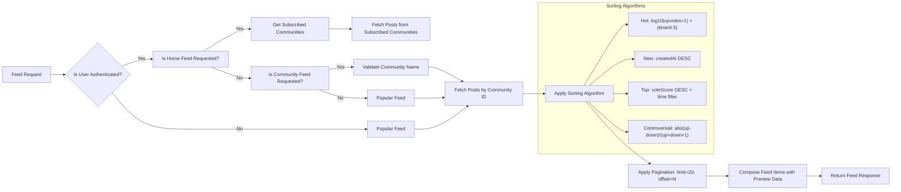

# Feed and Sorting Logic

## Feed Types and Access Rules

### Home Feed
- WHEN a logged-in member requests the Home Feed, THE system SHALL return posts only from communities the member is subscribed to.
- WHILE the user is authenticated, THE system SHALL allow access to the Home Feed.
- IF the user is not authenticated (guest), THEN THE system SHALL return HTTP 401 with error code FEED_ACCESS_DENIED and redirect to login.
- THE system SHALL NOT display any posts from unsubscribed communities in the Home Feed.
- THE system SHALL include all posts the user has subscribed to, even if the community is inactive.

### Popular Feed
- WHEN any user (authenticated or guest) requests the Popular Feed, THE system SHALL return posts from all communities across the platform.
- THE system SHALL NOT require authentication to access the Popular Feed.
- THE system SHALL include all public posts regardless of subscription status.

### Community Feed
- WHEN a user requests the Community Feed for a specific community, THE system SHALL return all posts belonging to that community.
- THE system SHALL allow access to the Community Feed regardless of authentication status.
- IF the community does not exist, THEN THE system SHALL return HTTP 404 with error code COMMUNITY_NOT_FOUND.
- THE system SHALL validate community name case-insensitively during lookup.

## Sorting Algorithms

### Hot Sorting
- WHEN the Hot sorting option is selected, THE system SHALL calculate a score for each post using the formula: 
  `HotScore = log10(Upvotes + 1) + (CreationTimeInHours / 4.5)`
- THE system SHALL use UTC timestamp of post creation for time calculation.
- THE system SHALL use natural logarithm base 10 for the vote component.
- WHERE vote count is zero, THE system SHALL treat it as 1 to prevent log(0).
- THE system SHALL sort posts in descending order by HotScore.

### New Sorting
- WHEN the New sorting option is selected, THE system SHALL sort posts by creation timestamp in descending order (most recent first).
- THE system SHALL use the exact creation timestamp (ISO 8601 format) for comparison.

### Top Sorting
- WHEN the Top sorting option is selected, THE system SHALL sort posts by total vote score in descending order.
- WHERE a time filter is specified, THE system SHALL restrict posts to those created within the selected period.
- THE system SHALL support five time filters: "today", "this week", "this month", "this year", "all time".
- IF the time filter is not specified, THEN THE system SHALL default to "all time".
- THE system SHALL interpret "today" as the current UTC calendar day (00:00:00 to 23:59:59 UTC).
- THE system SHALL interpret "this week" as the past seven days from current UTC date.
- THE system SHALL interpret "this month" as the current UTC calendar month.
- THE system SHALL interpret "this year" as the current UTC calendar year.
- THE system SHALL interpret "all time" as encompassing all posts created since platform inception.

### Controversial Sorting
- WHEN the Controversial sorting option is selected, THE system SHALL calculate a controversy score using the formula:
  `ControversyScore = abs(Upvotes - Downvotes) / (Upvotes + Downvotes + 1)`
- THE system SHALL sort posts in descending order by ControversyScore.
- WHERE total votes are zero, THE system SHALL assign a ControversyScore of 0.
- THE system SHALL avoid division by zero by adding 1 to the denominator.
- THE goal is to surface posts with high engagement but near-zero net score.

## Time Filters

- THE platform SHALL explicitly support the following time filters for Top sorting: "today", "this week", "this month", "this year", "all time".
- Where no time filter is provided, THE system SHALL use "all time" as default.
- THE system SHALL not accept any other time filter values.
- IF an unsupported time filter is submitted, THEN THE system SHALL reject with HTTP 400 error code INVALID_TIME_FILTER.

## Pagination

- WHEN a feed is requested, THE system SHALL return exactly 20 posts per page.
- THE system SHALL support pagination using offset-based cursor: `?limit=20&offset=N`
- THE system SHALL calculate offset from 0, where offset=0 returns first 20 items, offset=20 returns items 21-40, etc.
- THE system SHALL not use pagination token or cursor-based pagination.
- IF the requested offset exceeds total post count, THEN THE system SHALL return an empty array.

## Feed Content Composition

When viewing any feed, each post in the list SHALL display the following elements:

- Title: The exact title text of the post (truncated if exceeding 120 characters)
- Author username: The username of the post creator (never display display name)
- Community name: The unique name of the community where the post was created
- Vote score: Total upvotes minus downvotes, displayed as a number (positive or negative)
- Comment count: Total number of direct comments on the post (not nested replies)
- Time since posted: Human-readable relative time (e.g., "3 hours ago", "2 days ago") calculated from UTC creation time to current system time (Asia/Seoul timezone conversion)
- Media preview:
  - FOR TEXT POSTS: The first 200 characters of content, with trailing "..."
  - FOR IMAGE POSTS: A thumbnail URL (120x120px) of the uploaded image
  - FOR LINK POSTS: The domain name extracted from the URL (e.g., "youtube.com", "github.com"), with no protocol or path

- THE system SHALL NOT display the full content of any post in the feed list.
- THE system SHALL NOT display avatar images in feed list items.
- THE system SHALL NOT display karma score of the author in the feed list.
- THE system SHALL NOT display post type icon (text/link/image) in feed list.

## Feed Generation Rules

- THE system SHALL generate feed results dynamically on every request.
- THE system SHALL NOT cache feed results permanently.
- Where performance requirements apply, THE system SHALL use indexed database queries for sorting and filtering.
- THE system SHALL use PostgreSQL with B-tree indexes on: post.authorId, post.communityId, post.createdAt, post.voteScore.
- Where pagination is requested, THE system SHALL use LIMIT and OFFSET clauses in SQL.

## Edge Cases

- IF a post’s community is deleted after the post is created, THEN THE system SHALL still display the post using the community name at time of creation.
- IF a user changes their username, THEN THE system SHALL continue displaying the username at time of post creation in feed items.
- IF a vote is removed, THEN THE system SHALL recalculate the feed score immediately and re-sort all affected posts.
- IF a post is updated after creation, THEN THE system SHALL NOT alter its position in New or Hot feeds.
- IF a user is banned from a community, THEN THE system SHALL filter their posts out of the Community Feed for that community, but posts remain visible in Home and Popular feeds if the user is subscribed elsewhere.

## Integration Requirements

- This document references:
  - [Karma System](./11-karma-system.md) for vote impact calculation
  - [Post Management](./05-post-management.md) for post types and content handling
  - [User Actors](./03-user-actors.md) for authentication state determination
  - [Community Management](./07-community-management.md) for subscription validation

All components MUST be synchronized to ensure consistent feed behavior across the system.

## Performance Requirements

- THE system SHALL serve feed requests in under 1.5 seconds for 95% of queries with 1,000+ posts.
- THE system SHALL respond to feed requests within 500ms for 90% of queries.
- WHERE a user has 100+ subscriptions, THE system SHALL handle Home Feed generation without timeouts.
- THE system SHALL use query optimization and indexing to prevent full-table scans.

## Error Handling

- IF a community name is invalid or not found in Community Feed request, THEN THE system SHALL return HTTP 404.
- IF post pagination parameters are negative or non-integer, THEN THE system SHALL return HTTP 400.
- IF user attempts to access Home Feed while unauthenticated, THEN THE system SHALL return HTTP 401.
- IF sorting algorithm receives malformed time filter, THEN THE system SHALL return HTTP 400 with error code INVALID_TIME_FILTER.

## User Experience Expectations

- Feed loading SHALL feel "instant" for users on modern networks.
- Scroll performance SHALL be smooth with 60 FPS on mobile devices.
- No post shall disappear or reappear unexpectedly during scrolling due to recalculation.
- Feed shall always reflect the user’s current subscription status in real time.

## Business Rules

- THE system SHALL not expose vote counts of users who voted on a post.
- THE system SHALL not reveal whether a user has voted on a post to other users.
- THE system SHALL prevent users from seeing posts in Home Feed that belong to communities they unsubscribed from.
- THE system SHALL allow users to subscribe to and unsubscribe from communities at any time, with feed updates reflected immediately.

## Final Notes

- The algorithm design balances engagement, recency, and relevance while remaining computationally feasible at scale.
- All date/time calculations SHALL use UTC internally, with display conversion to local time zone (Asia/Seoul) only for human-readable "time ago" texts.
- No external services or third-party libraries shall be used for sorting logic; all algorithms shall be implemented in native backend code.

## Mermaid Diagram

> *Developer Note: This document defines **business requirements only**. All technical implementations (architecture, APIs, database design, etc.) are at the discretion of the development team.*