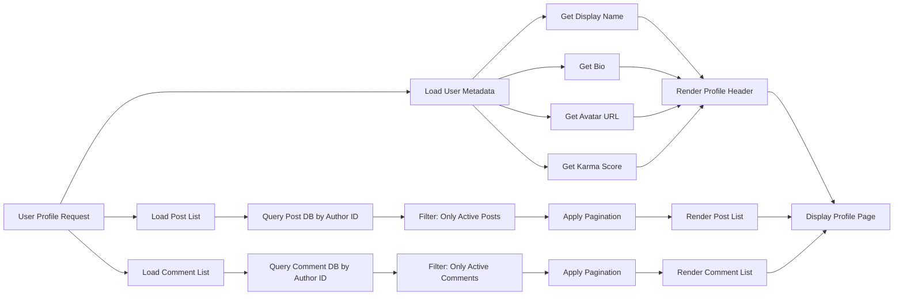
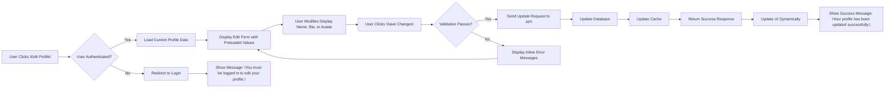
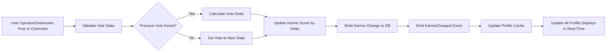
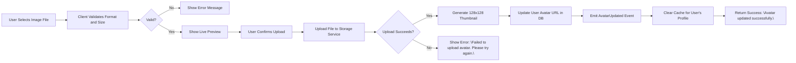
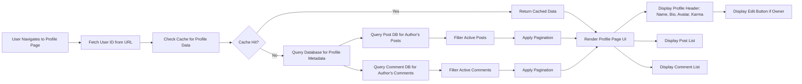

# User Profile System Requirements

## Profile Attributes

### Profile Display Components

THE system SHALL display the following information on every user profile page:

- Display name (text field)
- Bio (multi-line text field)
- Avatar image (URL reference)
- Total karma score (single numeric value)
- List of all posts created by the user
- List of all comments written by the user

### Display Name Requirements

THE system SHALL require a display name for every user profile.

WHEN a user creates a profile, THE system SHALL assign a default display name equal to their username if no custom display name is provided during registration.

WHEN a user edits their profile, THE system SHALL allow them to change their display name to any non-empty string up to 50 characters.

IF the new display name is empty or contains only whitespace, THEN THE system SHALL reject the update and show an error message: "Display name cannot be empty."

WHEN a display name is modified, THE system SHALL update it immediately on all profile pages where the user appears.

WHERE a user has no custom display name set, THE system SHALL display their username as the display name.

### Bio Requirements

THE system SHALL allow users to set a bio of up to 500 characters.

WHEN a user's bio is empty or consists only of whitespace, THE system SHALL display the message: "This user has not written a bio yet."

WHEN a user updates their bio, THE system SHALL trim leading and trailing whitespace and store the cleaned content.

IF a bio exceeds 500 characters, THEN THE system SHALL truncate it to 500 characters and notify the user: "Bio truncated to 500 characters."

### Avatar Image Requirements

THE system SHALL support avatar images in JPEG, PNG, and WebP formats.

WHEN a user uploads an avatar, THE system SHALL accept files up to 5MB in size.

IF a user uploads an avatar file larger than 5MB, THEN THE system SHALL reject the upload and show: "Avatar file must be 5MB or smaller."

IF a user uploads a non-image file (e.g., PDF, MP4), THEN THE system SHALL reject the upload and show: "Only JPEG, PNG, or WebP images are allowed for avatars."

WHEN an avatar image is set, THE system SHALL generate and store a 128x128 pixel thumbnail version.

WHEN a user removes their avatar, THE system SHALL revert to displaying a default avatar icon.

## Karma Display

### Karma Calculation

THE system SHALL maintain a single karma score per user across all communities.

WHEN a comment or post receives an upvote from another user, THE system SHALL increase the author's karma by 1.

WHEN a comment or post receives a downvote from another user, THE system SHALL decrease the author's karma by 1.

WHEN a user removes their upvote from a comment or post, THE system SHALL decrease the author's karma by 1.

WHEN a user changes their vote from upvote to downvote on a comment or post, THE system SHALL decrease the author's karma by 2 (remove +1 and add -1).

WHEN a user changes their vote from downvote to upvote on a comment or post, THE system SHALL increase the author's karma by 2 (remove -1 and add +1).

WHEN a user removes their downvote from a comment or post, THE system SHALL increase the author's karma by 1.

THE system SHALL allow karma scores to be negative.

THE system SHALL display the karma score as a whole number without decimal points (integer only).

### Karma Display Rules

THE system SHALL display the user's total karma score on their profile page.

THE system SHALL display the karma score in a prominent location directly below the bio, in a distinct visual style (e.g., bold text with a different color).

WHEN a user's karma score is positive, THE system SHALL display it with a plus sign: "+1234".

WHEN a user's karma score is zero or negative, THE system SHALL display it without a plus sign: "0" or "-45".

WHERE a user has never received any votes, THE system SHALL display: "0 karma".

## Content Aggregation

### Post Aggregation

WHEN displaying a user's profile page, THE system SHALL fetch and display all posts created by that user.

WHEN a post is deleted by its author or a moderator, THE system SHALL remove it from the user's profile post list immediately.

WHEN a post becomes unlisted or hidden due to moderation action, THE system SHALL exclude it from the profile post list.

WHEN a user creates a new post, THE system SHALL add it to the top of the post list on their profile page.

THE system SHALL order posts on the profile page by creation time, newest first.

THE system SHALL display a maximum of 50 posts per page on the profile page.

WHEN a user has more than 50 posts, THE system SHALL provide pagination with "Previous" and "Next" buttons.

WHEN a user has no posts, THE system SHALL display the message: "This user has not created any posts yet."

### Comment Aggregation

WHEN displaying a user's profile page, THE system SHALL fetch and display all comments written by that user.

WHEN a comment is deleted by its author or a moderator, THE system SHALL remove it from the user's profile comment list immediately.

WHEN a comment becomes unlisted or hidden due to moderation action, THE system SHALL exclude it from the profile comment list.

WHEN a user writes a new comment, THE system SHALL add it to the top of the comment list on their profile page.

THE system SHALL order comments on the profile page by creation time, newest first.

THE system SHALL display a maximum of 50 comments per page on the profile page.

WHEN a user has more than 50 comments, THE system SHALL provide pagination with "Previous" and "Next" buttons.

WHEN a user has no comments, THE system SHALL display the message: "This user has not written any comments yet."

### Profile View Behavior

THE system SHALL allow all users (including guests) to view any user's profile page.

WHEN a user is banned from a community, THE system SHALL NOT conceal their profile from the public.

WHEN a user reports inappropriate content on their profile, THE system SHALL handle it via the global Reporting System, not through profile hiding.

THE system SHALL NOT support private profiles or hidden profiles.

WHEN a profile is viewed, THE system SHALL log analytics for: page views, unique viewers, and referral sources, but SHALL NOT disclose this data to any other user.

## Visibility Scope

### Profile Visibility Requirements

THE system SHALL make every user's profile page publicly accessible without authentication.

WHEN a user is banned from a community, THE system SHALL NOT conceal their profile from the public.

WHEN a user reports inappropriate content on their profile, THE system SHALL handle it via the global Reporting System, not through profile hiding.

THE system SHALL NOT support private profiles or hidden profiles.

WHEN a profile is viewed, THE system SHALL log analytics for: page views, unique viewers, and referral sources, but SHALL NOT disclose this data to any other user.

## Profile Editing

### Edit Permissions

WHEN a user attempts to edit their profile, THE system SHALL verify they are authenticated and are editing their own profile.

IF a user attempts to edit another user's profile, THEN THE system SHALL return HTTP 403 Forbidden with error code AUTH_PROFILE_EDIT_FORBIDDEN.

IF a user attempts to edit their profile while not logged in, THEN THE system SHALL redirect them to the login page with a message: "You must be logged in to edit your profile."

### Editable Attributes

THE system SHALL allow a user to edit the following profile attributes:
- Display name (text, 50 character limit)
- Bio (text, 500 character limit)
- Avatar image (file upload, 5MB max)

THE system SHALL NOT allow users to edit their username, email, or creation date.

WHEN a user sets a new avatar, THE system SHALL immediately generate a 128x128 pixel thumbnail.

WHEN a user chooses to remove their avatar, THE system SHALL unset the avatar field and revert to default.

WHEN a user changes their display name, THE system SHALL update the display name across all post and comment author displays immediately.

WHEN a user changes their bio, THE system SHALL update it immediately and clear any cached profile data for that user.

### Editing Interface

WHEN a user accesses their profile editing page, THE system SHALL preload the current values of display name, bio, and avatar preview.

THE system SHALL provide a "Save Changes" button and a "Cancel" button.

WHEN the "Save Changes" button is clicked, THE system SHALL validate all fields before submission.

IF validation fails, THE system SHALL show specific error messages for each field:
- "Display name must be between 1 and 50 characters."
- "Bio must be 500 characters or fewer."
- "Avatar must be a JPEG, PNG, or WebP image under 5MB."

WHEN all changes are valid and saved, THE system SHALL show a success message: "Your profile has been updated successfully."

THE system SHALL not reload the page after saving changes—update content dynamically using client-side rendering.

### Avatar Upload Interface

WHEN a user uploads an avatar, THE system SHALL display a live preview of the uploaded image before submission.

WHEN a user cancels an avatar upload, THE system SHALL revert to the previous avatar or default if none existed.

WHEN a user uploads a new avatar, THE system SHALL disable the "Save Changes" button until the preview completes.

THE system SHALL show an upload progress indicator during file transfer.

IF the upload fails at the server level, THE system SHALL show: "Failed to upload avatar. Please try again." AND preserve the previous avatar.

## Integration with Other Systems

### Authentication Integration

WHEN a user logs in, THE system SHALL load their profile data (display name, bio, avatar, karma) into the authenticated session.

WHEN a user logs out, THE system SHALL clear their profile session data.

WHEN a user is authenticated, THE system SHALL display a "Edit Profile" button on their own profile page.

WHEN a user is not authenticated, THE system SHALL NOT display the "Edit Profile" button on any profile page.

### Karma System Integration

THE system SHALL update the user's karma score when any vote-related event occurs in the Post Management or Comment System.

THE system SHALL listen for events from the Karma System and update the profile karma display accordingly.

THE system SHALL ensure karma updates are consistent across the platform (profile page, post author lists, comment author lists).

### Post and Comment System Integration

THE system SHALL query the Post Management and Comment System to retrieve the full list of posts and comments authored by a user.

THE system SHALL receive notifications when posts or comments are deleted and update the profile aggregation accordingly.

THE system SHALL support pagination and sorting from the Post and Comment systems when displaying aggregated content.

### Feed System Integration

WHEN a user visits another user's profile page, THE system SHALL NOT influence the home feed, popular feed, or community feed behavior.

THE system SHALL ensure profile visits do not trigger any voting or subscription actions.

### Community System Integration

THE system SHALL NOT display community subscription status on profile pages.

THE system SHALL NOT show the user's subscribed communities on their profile page.

THE system SHALL NOT allow users to follow other users or view a list of their followers.

## Error Handling

### Profile Loading Errors

IF a user profile does not exist (invalid user ID), THEN THE system SHALL return HTTP 404 Not Found with error code USER_PROFILE_NOT_FOUND.

IF there is a system failure when loading a user's profile, THEN THE system SHALL display: "Unable to load profile at this time. Please try again later."

IF the profile page fails to load karma data, THE system SHALL still display the profile with: "Karma data unavailable."

IF the profile page fails to load posts or comments, THE system SHALL still display the profile with: "Posts unavailable." or "Comments unavailable." respectively.

### Editing Errors

WHEN a user submits a profile update with invalid data, THE system SHALL reject the request and re-display the form with inline error messages for each field.

WHEN a user's session expires during profile editing, THE system SHALL redirect to login and preserve their edits locally until they log back in.

WHEN the avatar upload service is unavailable, THE system SHALL show: "Avatar upload service temporarily unavailable. Please try again later."

All errors shall be logged for system monitoring but shall not expose stack traces or sensitive data to end users.

## Performance Requirements

THE system SHALL load a user profile page within 1.5 seconds for 95% of requests under moderate load (100 concurrent users).

WHEN displaying a profile with 100+ posts or comments, THE system SHALL implement lazy-loading for items beyond the first 50.

WHEN a user views their own profile, THE system SHALL pre-fetch their 5 most recent posts and comments in the background during page load.

THE system SHALL cache profile data (display name, bio, karma) in memory for 5 minutes to reduce database load.

THE system SHALL generate avatar thumbnails on upload or request to avoid runtime processing delays.

## Business Rules

THE system SHALL never allow non-authenticated users to edit any profile data.

THE system SHALL never permit users to see another user's email address, password, or any private authentication details.

THE system SHALL always display consistent author information (display name, karma) across all profile pages, post headers, and comment threads.

THE system SHALL treat each user as a single profile entity regardless of the number of communities they belong to.

THE system SHALL not merge or link multiple usernames to a single profile under any circumstance.

THE system SHALL never auto-generate or suggest display names to users.

THE system SHALL allow display names to include Unicode characters common to the Latin script (e.g. accents, umlauts, currency symbols).

THE system SHALL enforce that display names do not contain HTML, JavaScript, or markup tags. They shall be rendered text-only for security.

WHEN a user's display name contains profanity or offensive content, THE system SHALL NOT auto-censor it—instead, moderators may report it through the Reporting System.

THE system SHALL NOT display any user's IP address, device information, or location data on profile pages.

THE system SHALL NOT provide direct messaging between users on profile pages.

THE system SHALL NOT allow users to add social media links to their profile.

THE system SHALL display all content on the profile page using the same text rendering and font styling as the rest of the platform.

## Diagrams

### User Profile Data Flow

### Profile Editing Flow

### Karma Update Process

### Avatar Upload Process

### Profile Page Rendering Flow

<!-- END OF DOCUMENT -->
<!-- SUMMARY CHARACTER COUNT: 11,794 -->