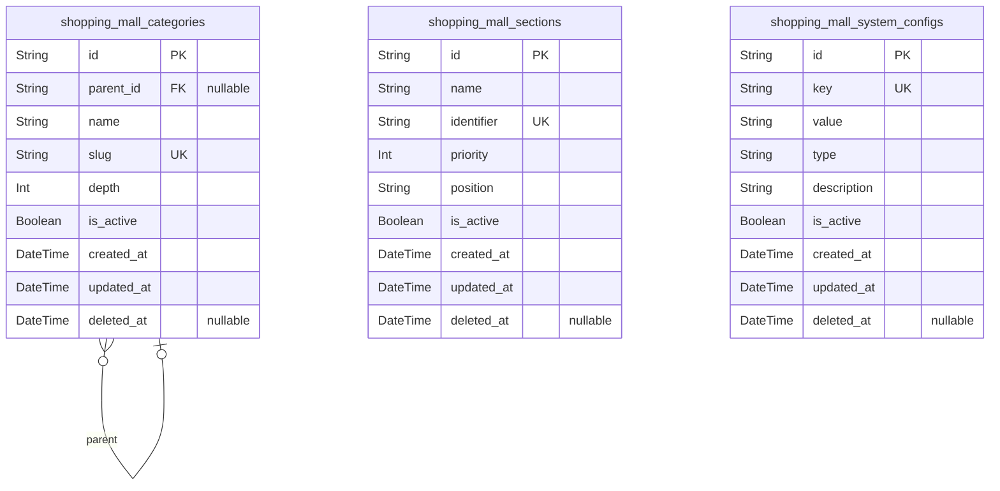
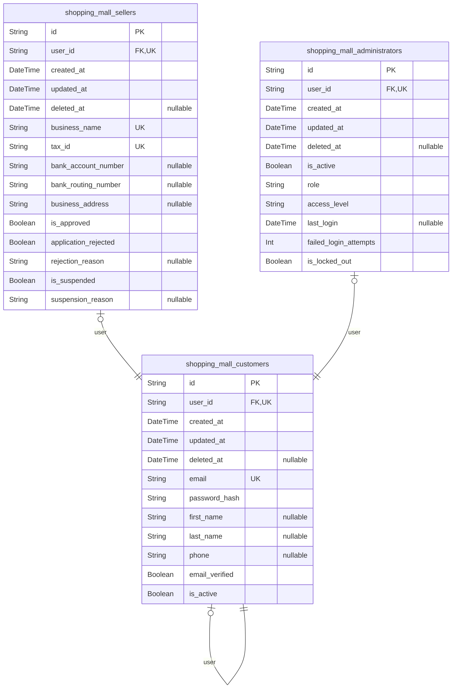
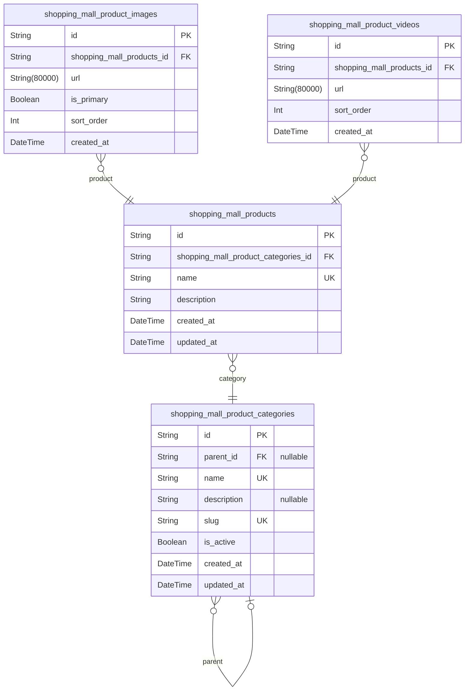
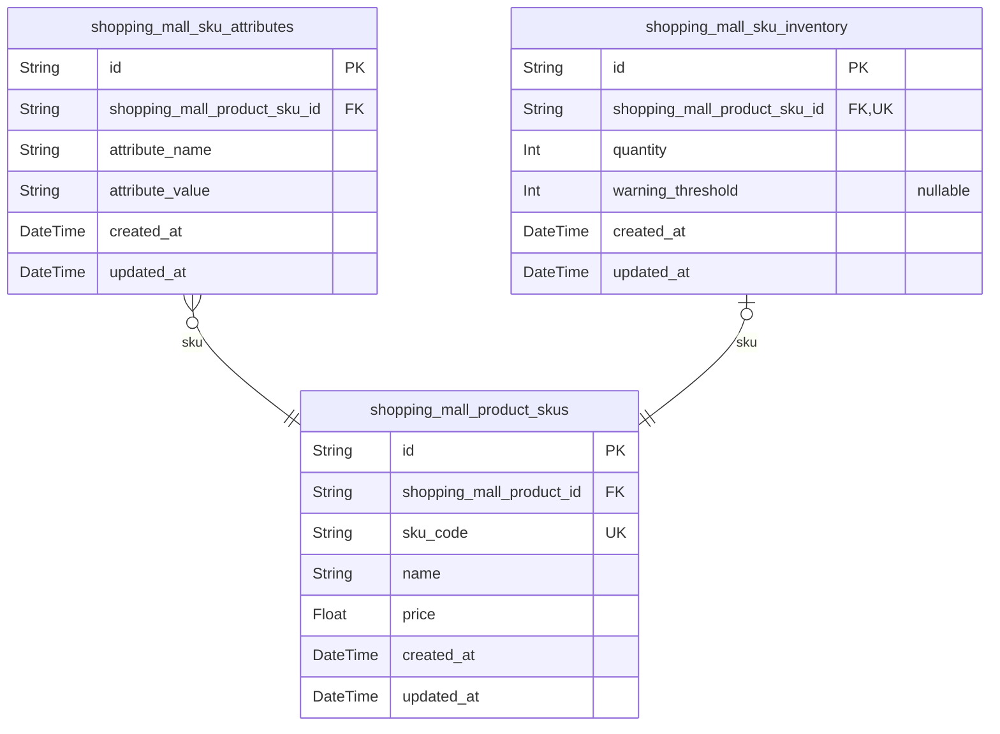
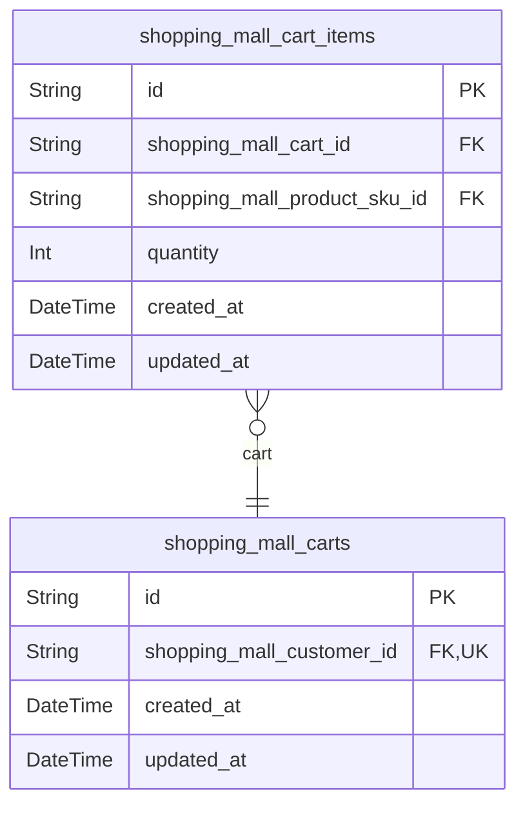
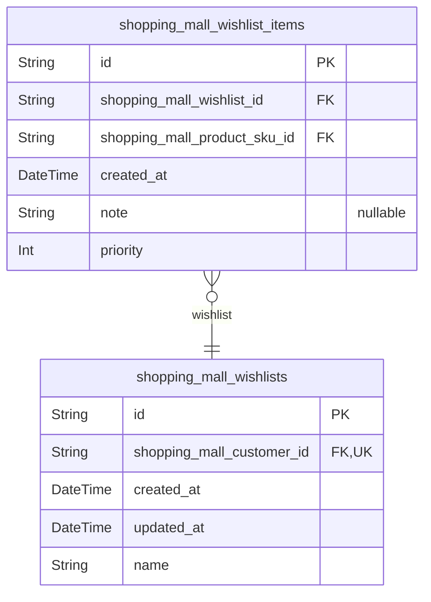
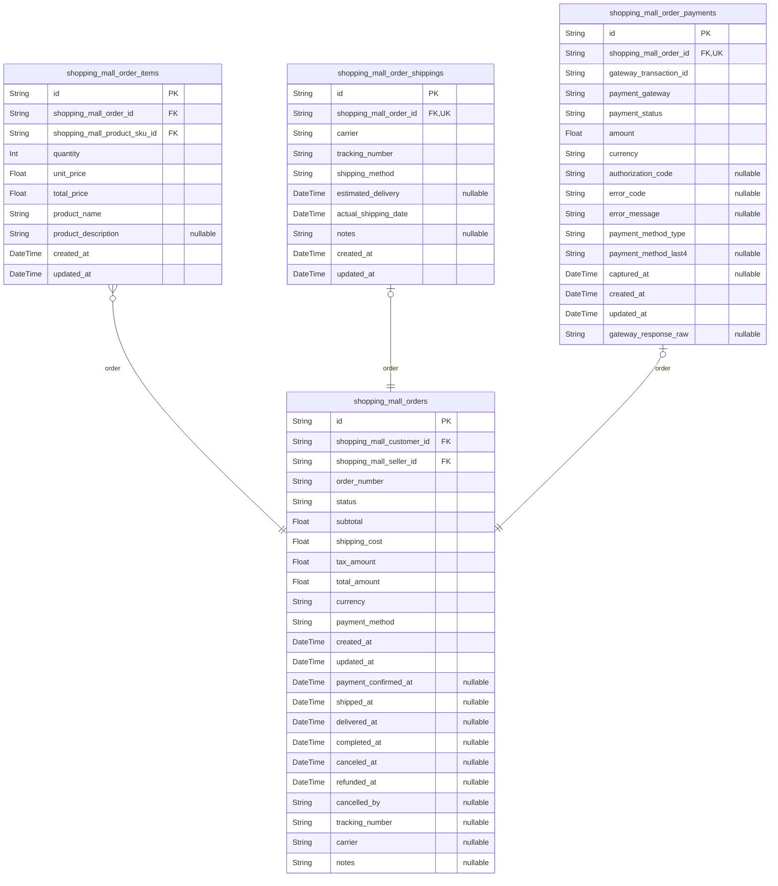
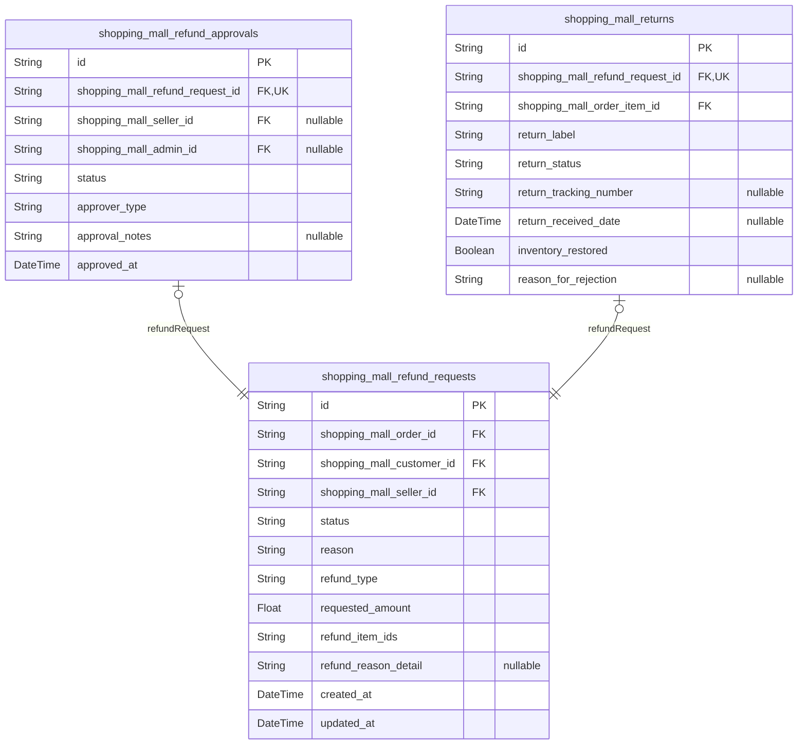
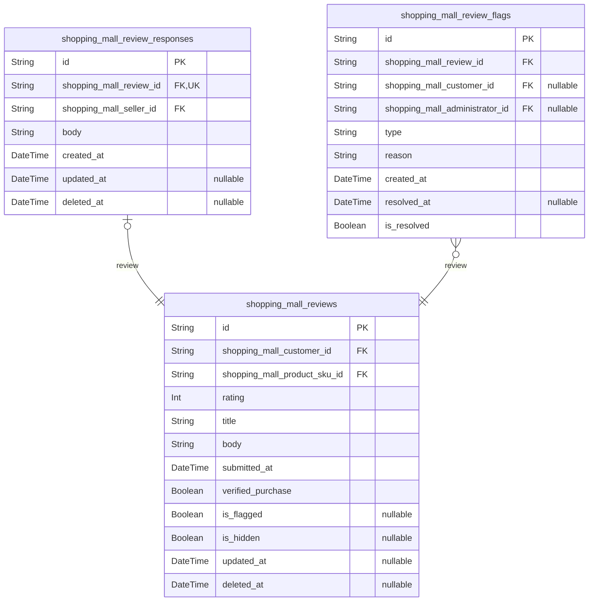
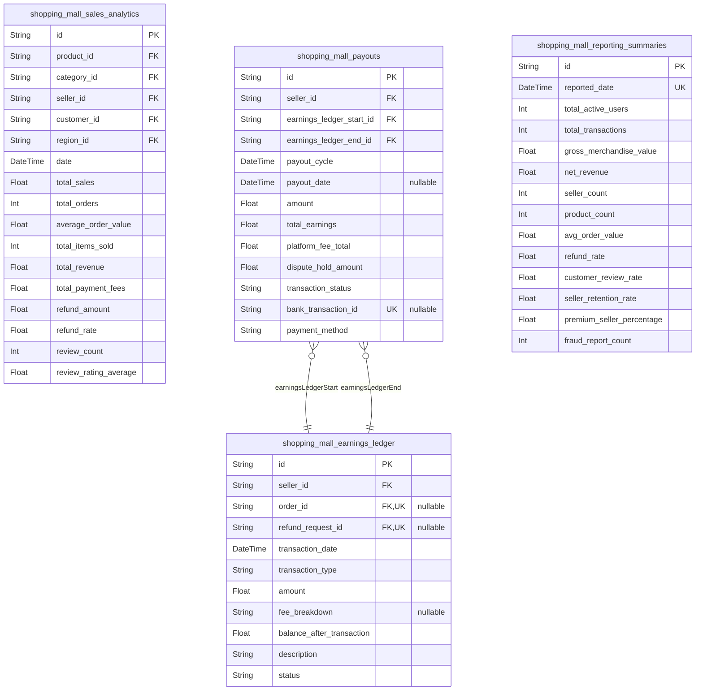

# Prisma Markdown

> Generated by [`prisma-markdown`](https://github.com/samchon/prisma-markdown)

- [Systematic](#systematic)
- [Actors](#actors)
- [Products](#products)
- [SKUs](#skus)
- [Carts](#carts)
- [Wishlists](#wishlists)
- [Orders](#orders)
- [Refunds](#refunds)
- [Reviews](#reviews)
- [Analytics](#analytics)

## Systematic

### `shopping_mall_categories`

Stores the hierarchical category structure used to organize products in
the catalog. Categories form the taxonomy that enables navigation and
filtering in the frontend. This table enables parent-child relationships
for multi-level category trees, such as 'Electronics > Computers >
Laptops'. Each category has its own display name, URL slug, and active
status. This model is referenced by shopping_mall_product_categories but
is never directly manipulated by end-users.

Properties as follows:

- `id`: Primary Key.
- `parent_id`: Parent category in hierarchical tree. [shopping_mall_categories.id](#shopping_mall_categories).
- `name`
  > Display name of the category as shown to customers. Example:
  > 'Electronics'.
- `slug`
  > URL-friendly identifier for the category. Used in routing and SEO. Must
  > be unique. Example: 'electronics'.
- `depth`
  > Nesting level of the category in the hierarchy. Root categories have
  > depth 0, children have depth 1+.
- `is_active`
  > Indicates whether the category is active and visible to customers.
  > Inactive categories are hidden but preserved for historical reference.
- `created_at`: Timestamp when the category was created.
- `updated_at`: Timestamp when the category was last updated.
- `deleted_at`: Timestamp when the category was soft-deleted. Null if active.

### `shopping_mall_sections`

Defines UI sections used across the platform for layout configuration.
Sections represent content areas on pages such as 'hero-banner',
'featured-products', 'recommendations'. Each section has a unique
identifier for programmatic reference, a display name, priority for
ordering, and position for placement. Admins configure these sections to
control page layouts, but customers never interact with them directly.

Properties as follows:

- `id`: Primary Key.
- `name`
  > Display name of the section for admin interface. Example: 'Hero Banner
  > Section'.
- `identifier`
  > Unique system identifier used in code and templates to reference this
  > section. Must be unique. Example: 'hero-banner'.
- `priority`
  > Ordering priority for displaying sections on a page. Higher values appear
  > first.
- `position`
  > Location where this section should be rendered. Examples: 'top',
  > 'sidebar', 'footer', 'middle'.
- `is_active`
  > Controls whether the section is active and rendered on pages. Inactive
  > sections are hidden from display.
- `created_at`: Timestamp when the section was created.
- `updated_at`: Timestamp when the section was last updated.
- `deleted_at`: Timestamp when the section was soft-deleted. Null if active.

### `shopping_mall_system_configs`

Stores global system configuration parameters that control platform
behavior. Configuration values are stored as JSON strings to support
complex structures while maintaining a simple key-value schema. This
table enables dynamic configuration changes without code deployment.
Values are consumed by application services and admin tools. Key examples
include 'payment_gateway_settings', 'refund_policy_defaults',
'review_auto_moderation_rules'. This table is managed exclusively by
system administrators via backend interfaces.

Properties as follows:

- `id`: Primary Key.
- `key`
  > Unique system-wide key identifying the configuration parameter. Must be
  > unique. Example: 'payment_gateway_fee_percent'.
- `value`
  > JSON-encoded value of the configuration parameter. Supports strings,
  > numbers, booleans, arrays, and objects. Must be valid JSON.
- `type`
  > Type classification of the configuration value. Used for validation and
  > UI rendering. Allowed values: 'string', 'int', 'boolean', 'json'.
- `description`
  > Human-readable description explaining the purpose and expected format of
  > this configuration parameter.
- `is_active`
  > Indicates if the configuration is currently active. Inactive
  > configurations are ignored by system processes.
- `created_at`: Timestamp when the configuration was created.
- `updated_at`: Timestamp when the configuration was last updated.
- `deleted_at`: Timestamp when the configuration was soft-deleted. Null if active.

## Actors

### `shopping_mall_customers`

Customer account information. Each customer has a unique identity with
authentication credentials and profile details. This table represents the
core user entity for platform consumers who browse, purchase, and review
products.

Properties as follows:

- `id`: Primary Key.
- `user_id`: References the user account. [shopping_mall_customers.id](#shopping_mall_customers).
- `created_at`: Timestamp when the customer account was created.
- `updated_at`: Timestamp when the customer account was last updated.
- `deleted_at`
  > Timestamp when the customer account was soft-deleted. If null, account is
  > active.
- `email`: Customer's primary email address for account login and communication.
- `password_hash`: Hashed password for authentication. Never store plain text passwords.
- `first_name`: Customer's first name as provided during registration.
- `last_name`: Customer's last name as provided during registration.
- `phone`: Customer's phone number for order notifications and contact.
- `email_verified`: Indicates if customer has verified their email address.
- `is_active`
  > Determines if the customer account is active and can log in. Suspended
  > accounts set this to false.

### `shopping_mall_sellers`

Seller account information. Represents business entities that list and
sell products on the platform. Each seller is associated with a verified
user account and requires admin approval before gaining publishing
rights.

Properties as follows:

- `id`: Primary Key.
- `user_id`: References the user account. [shopping_mall_customers.id](#shopping_mall_customers).
- `created_at`: Timestamp when the seller account was created.
- `updated_at`: Timestamp when the seller account was last updated.
- `deleted_at`
  > Timestamp when the seller account was soft-deleted. If null, account is
  > active.
- `business_name`: Legal business name of the seller entity.
- `tax_id`: Tax identification number for the seller business.
- `bank_account_number`: Bank account number for seller payouts.
- `bank_routing_number`: Bank routing number for seller payouts.
- `business_address`: Physical business address for legal and tax purposes.
- `is_approved`
  > Indicates if seller has been approved by admin. Only approved sellers can
  > list products.
- `application_rejected`: Indicates if the seller application was rejected.
- `rejection_reason`
  > Reason for seller application rejection. Only populated if
  > application_rejected is true.
- `is_suspended`: Indicates if the seller account has been suspended by admin.
- `suspension_reason`: Reason for seller suspension. Only populated if is_suspended is true.

### `shopping_mall_administrators`

System administrator accounts with full platform governance capabilities.
These accounts have elevated permissions to manage users, products,
orders, refunds, and approve seller applications.

Properties as follows:

- `id`: Primary Key.
- `user_id`: References the user account. [shopping_mall_customers.id](#shopping_mall_customers).
- `created_at`: Timestamp when the administrator account was created.
- `updated_at`: Timestamp when the administrator account was last updated.
- `deleted_at`
  > Timestamp when the administrator account was soft-deleted. If null,
  > account is active.
- `is_active`: Determines if the administrator account is active and can log in.
- `role`
  > Administrative role, typically 'super_admin' or 'support_admin' based on
  > permissions level.
- `access_level`
  > Level of administrative access. 'full' gives complete control, 'limited'
  > restricts sensitive actions.
- `last_login`: Timestamp of last successful login for this admin account.
- `failed_login_attempts`: Count of consecutive failed login attempts. Used for security lockout.
- `is_locked_out`
  > Indicates if the account has been locked due to excessive failed login
  > attempts.

## Products

### `shopping_mall_products`

Main product entity representing items available for sale in the shopping
mall platform. Each product has a unique identifier and serves as the
foundation for product variants (SKUs).

Properties as follows:

- `id`: Primary Key.
- `shopping_mall_product_categories_id`
  > Category to which this product belongs. {@link
  > shopping_mall_product_categories.id}.
- `name`: The display name of the product.
- `description`
  > Detailed description of the product, including features and
  > specifications.
- `created_at`: Timestamp when this product record was created.
- `updated_at`: Timestamp when this product record was last updated.

### `shopping_mall_product_images`

Images associated with products in the catalog. Supports multiple images
per product for comprehensive visual presentation.

Properties as follows:

- `id`: Primary Key.
- `shopping_mall_products_id`: Product to which this image belongs. [shopping_mall_products.id](#shopping_mall_products).
- `url`: Full URL or path to the image file.
- `is_primary`
  > Indicates whether this image is the primary (featured) image for the
  > product.
- `sort_order`
  > Order index for displaying images in galleries. Lower numbers appear
  > first.
- `created_at`: Timestamp when this image was uploaded.

### `shopping_mall_product_videos`

Videos associated with products in the catalog. Supports up to two videos
per product for enhanced product demonstrations.

Properties as follows:

- `id`: Primary Key.
- `shopping_mall_products_id`: Product to which this video belongs. [shopping_mall_products.id](#shopping_mall_products).
- `url`: Full URL or path to the video file.
- `sort_order`: Order index for displaying videos. Lower numbers appear first.
- `created_at`: Timestamp when this video was uploaded.

### `shopping_mall_product_categories`

Product categories for organizing products in a hierarchical structure.
Each category serves as a filterable group for product discovery.

Properties as follows:

- `id`: Primary Key.
- `parent_id`
  > Parent category if this is a subcategory. {@link
  > shopping_mall_product_categories.id}.
- `name`: Display name of the category.
- `description`: Optional description of the category's purpose or content.
- `slug`: URL-friendly identifier for the category (used in routing).
- `is_active`: Whether this category is currently active and visible to customers.
- `created_at`: Timestamp when this category was created.
- `updated_at`: Timestamp when this category was last updated.

## SKUs

### `shopping_mall_product_skus`

Represents individual product variants (SKUs) that represent atomic sale
units. Each SKU has unique pricing, attributes, and inventory. Managed
directly by sellers through product listing interface. Customers select
SKUs for purchase in cart and orders. Required for inventory tracking and
order fulfillment. References master product.

Properties as follows:

- `id`: Primary Key.
- `shopping_mall_product_id`
  > Reference to the master product this SKU belongs to. {@link
  > shopping_mall_products.id}.
- `sku_code`: Unique system-generated SKU code (e.g., SH-RED-M-2024).
- `name`: Display name of the SKU variant (e.g., 'Red, Medium').
- `price`: Individual price for this specific SKU variant. Must be greater than 0.
- `created_at`: Timestamp when this SKU was created.
- `updated_at`: Timestamp when this SKU was last updated.

### `shopping_mall_sku_attributes`

Stores attribute name-value pairs for each SKU. Maintains normalized
representation of variant characteristics like color, size, material.
Each record belongs to exactly one SKU. Used to build dynamic product
configurators and display variant options. This table enables flexible
product variants without schema changes.

Properties as follows:

- `id`: Primary Key.
- `shopping_mall_product_sku_id`
  > Reference to the SKU this attribute belongs to. {@link
  > shopping_mall_product_skus.id}.
- `attribute_name`
  > Name of the attribute (e.g., 'Color', 'Size', 'Material'). Locked after
  > first SKU creation.
- `attribute_value`
  > Value of the attribute for this particular SKU (e.g., 'Red', 'Medium',
  > 'Cotton').
- `created_at`: Timestamp when this attribute was added to the SKU.
- `updated_at`: Timestamp when this attribute was last modified.

### `shopping_mall_sku_inventory`

Tracks real-time inventory levels per SKU for accurate stock management.
Directly impacts product availability on the storefront. Sellers update
inventory here. System validates cart and checkout against this
inventory. Updated atomically during order processing to prevent
oversell.

Properties as follows:

- `id`: Primary Key.
- `shopping_mall_product_sku_id`
  > Reference to the SKU this inventory record belongs to. One-to-one
  > relationship. [shopping_mall_product_skus.id](#shopping_mall_product_skus).
- `quantity`: Current available inventory count for this SKU. Must be >= 0.
- `warning_threshold`
  > Inventory level at which 'Low Stock' warning should be displayed.
  > Optional.
- `created_at`: Timestamp when inventory record was created.
- `updated_at`: Timestamp when inventory was last updated.

## Carts

### `shopping_mall_carts`

Temporarily stores a customer's shopping cart before checkout. Each user
has at most one active cart. This table serves as a container for cart
items and is cleared upon successful purchase. Maintains session state
across devices but is not intended for long-term persistence or auditing.

Properties as follows:

- `id`: Primary Key.
- `shopping_mall_customer_id`
  > References the customer who owns this cart. {@link
  > shopping_mall_customers.id}.
- `created_at`: Timestamp when the cart was first created.
- `updated_at`: Timestamp when the cart was last modified (added/removed items).

### `shopping_mall_cart_items`

Stores individual product variants (SKUs) added to a customer's cart.
Each row represents one product quantity in the cart. This table is
exclusively managed through its parent cart and has no direct user-facing
API. Cart items are cleared upon order completion.

Properties as follows:

- `id`: Primary Key.
- `shopping_mall_cart_id`
  > References the parent cart that contains this item. {@link
  > shopping_mall_carts.id}.
- `shopping_mall_product_sku_id`
  > References the specific product variant (SKU) in this cart item. {@link
  > shopping_mall_product_skus.id}.
- `quantity`: Number of units of this SKU in the cart. Must be greater than zero.
- `created_at`: Timestamp when this item was added to the cart.
- `updated_at`: Timestamp when this item's quantity was last modified.

## Wishlists

### `shopping_mall_wishlists`

Main wishlist entity that represents a user's personal collection of
items they wish to purchase in the future. Each wishlist belongs to a
single customer and contains multiple wishlist items. This model serves
as the container for wishlist_items and connects user identity with
product interest data.

Properties as follows:

- `id`: Primary Key.
- `shopping_mall_customer_id`: Belongs to the customer's [shopping_mall_customers.id](#shopping_mall_customers).
- `created_at`: Timestamp when this wishlist was created.
- `updated_at`: Timestamp when this wishlist was last updated.
- `name`
  > Display name of the wishlist. Defaults to 'My Wishlist' for standard user
  > wishlists.

### `shopping_mall_wishlist_items`

Individual items saved in a customer's wishlist. Each item represents a
specific product variant (SKU) that a customer has expressed interest in
for future purchase. This table links wishlists to specific product SKUs
and maintains user-specific product interest data.

Properties as follows:

- `id`: Primary Key.
- `shopping_mall_wishlist_id`: Belongs to the wishlist [shopping_mall_wishlists.id](#shopping_mall_wishlists).
- `shopping_mall_product_sku_id`
  > References the specific product variant (SKU) that is saved in this
  > wishlist [shopping_mall_product_skus.id](#shopping_mall_product_skus).
- `created_at`: Timestamp when this item was added to the wishlist.
- `note`
  > Optional private note from the customer about this wishlist item (e.g.,
  > 'Gift for birthday','Looking for sale').
- `priority`
  > Customer-defined priority level for this item (1-5, where 5 is highest
  > interest). Default is 3 (medium priority).

## Orders

### `shopping_mall_orders`

Main order record representing a customer purchase transaction. Each
order is tied to exactly one customer and contains multiple order items.

Properties as follows:

- `id`: Primary Key.
- `shopping_mall_customer_id`: The customer who placed this order. [shopping_mall_customers.id](#shopping_mall_customers).
- `shopping_mall_seller_id`: The seller who fulfilled this order. [shopping_mall_sellers.id](#shopping_mall_sellers).
- `order_number`: Unique order number in format 'ORD-YYYYMMDD-XXXXX'.
- `status`
  > Current status of the order. Must be one of: 'Created', 'Paid', 'Awaiting
  > Shipment', 'Shipped', 'Delivered', 'Completed', 'Canceled', 'Refunded'.
- `subtotal`: Total value of all order items before shipping and tax.
- `shipping_cost`: Cost of shipping for this order.
- `tax_amount`: Total tax amount calculated for this order based on shipping address.
- `total_amount`: Final total amount (subtotal + shipping + tax).
- `currency`: Currency code for this order (e.g., 'USD').
- `payment_method`: Payment method used (e.g., 'Credit Card ending in 4242').
- `created_at`: Timestamp when the order was initially created.
- `updated_at`: Timestamp when the order was last updated.
- `payment_confirmed_at`: Timestamp when payment was successfully confirmed.
- `shipped_at`: Timestamp when the order was marked as shipped by the seller.
- `delivered_at`: Timestamp when the order was marked as delivered.
- `completed_at`
  > Timestamp when the order automatically transitioned to 'Completed' status
  > (48 hours after delivery).
- `canceled_at`: Timestamp when the order was canceled by customer or seller.
- `refunded_at`: Timestamp when the order was fully refunded.
- `cancelled_by`: System-generated reason for cancellation ('customer', 'seller', 'admin').
- `tracking_number`: Primary tracking number for the order overview (if available).
- `carrier`: Primary shipping carrier name for the order overview (if available).
- `notes`
  > Any additional notes or special instructions for this order (e.g., 'Leave
  > at front door').

### `shopping_mall_order_items`

Line items that make up a shopping_mall_order, representing each SKU
purchased, with its specific pricing and quantities.

Properties as follows:

- `id`: Primary Key.
- `shopping_mall_order_id`: The order this item belongs to. [shopping_mall_orders.id](#shopping_mall_orders).
- `shopping_mall_product_sku_id`
  > The specific product SKU variant that was purchased. {@link
  > shopping_mall_product_skus.id}.
- `quantity`: Number of units of this SKU purchased.
- `unit_price`: Price per unit of this SKU at the time of purchase.
- `total_price`: Total price for this line item (unit_price * quantity).
- `product_name`: Product name as it was at time of purchase for audit trail.
- `product_description`: Product description as it was at time of purchase for audit trail.
- `created_at`: Timestamp when this order item was created.
- `updated_at`: Timestamp when this order item was updated.

### `shopping_mall_order_shippings`

Shipping details associated with an order, capturing carrier and tracking
information provided by seller at time of fulfillment.

Properties as follows:

- `id`: Primary Key.
- `shopping_mall_order_id`
  > The order this shipping record belongs to. {@link
  > shopping_mall_orders.id}.
- `carrier`: The shipping carrier name (e.g., 'UPS', 'FedEx').
- `tracking_number`: The unique tracking number provided by the carrier.
- `shipping_method`: Type of shipping selected: 'Standard', 'Expedited', 'Overnight'.
- `estimated_delivery`: Estimated delivery date provided by the seller.
- `actual_shipping_date`: Actual date and time when the seller marked the order as shipped.
- `notes`: Any additional shipping instructions provided by seller.
- `created_at`: Timestamp when this shipping record was created.
- `updated_at`: Timestamp when this shipping record was last updated.

### `shopping_mall_order_payments`

Payment transaction records for each order, capturing details from the
payment gateway for reconciliation.

Properties as follows:

- `id`: Primary Key.
- `shopping_mall_order_id`: The order this payment record belongs to. [shopping_mall_orders.id](#shopping_mall_orders).
- `gateway_transaction_id`: Unique transaction ID from the external payment gateway.
- `payment_gateway`
  > The payment gateway provider used (e.g., 'Stripe', 'PayPal'), not
  > specified in business logic but captured for technical reconciliation.
- `payment_status`
  > Status of the payment transaction: 'Pending', 'Approved', 'Declined',
  > 'Timeout', 'Unknown', 'Refunded'.
- `amount`: Amount charged to the payment method for this transaction.
- `currency`: Currency code used for this payment transaction.
- `authorization_code`: Authorization code returned by the payment gateway if approved.
- `error_code`: Error code returned by the payment gateway in case of failure.
- `error_message`: Human-readable error message from the payment gateway.
- `payment_method_type`
  > Type of payment method used: 'Credit Card', 'Debit Card', 'Digital
  > Wallet'.
- `payment_method_last4`: Last 4 digits of the payment method card number.
- `captured_at`: Timestamp when payment was captured (completed).
- `created_at`: Timestamp when this payment record was created.
- `updated_at`: Timestamp when this payment record was last updated.
- `gateway_response_raw`
  > Raw response JSON from the payment gateway for audit and debugging
  > purposes.

## Refunds

### `shopping_mall_refund_requests`

Record of refund requests initiated by customers after order delivery.
Each request is tied to an order and specifies items, reason, and
requested amount for financial reversal. This is a primary table allowing
independent lookup, filtering, and management by customer support agents.

Properties as follows:

- `id`: Primary Key.
- `shopping_mall_order_id`
  > The order for which the refund is being requested. {@link
  > shopping_mall_orders.id}.
- `shopping_mall_customer_id`
  > The customer who initiated the refund request. {@link
  > shopping_mall_customers.id}.
- `shopping_mall_seller_id`
  > The seller whose product is being returned. {@link
  > shopping_mall_sellers.id}.
- `status`
  > Current status of the refund request. Values: 'requested', 'approved',
  > 'denied', 'auto-approved', 'completed'.
- `reason`
  > Category reason for refund selection from predefined list: 'Damaged
  > items', 'Incorrect item', 'Item not as described', 'Didn't receive',
  > 'Changed mind'.
- `refund_type`: Type of refund: 'full' or 'partial'.
- `requested_amount`
  > Amount of money requested for refund in USD. Must be positive and cannot
  > exceed order value.
- `refund_item_ids`
  > Comma-separated list of order_item_ids being refunded. Format:
  > 'uuid,uuid,uuid'.
- `refund_reason_detail`
  > Additional explanation provided by customer regarding the refund reason.
  > Not required.
- `created_at`: Timestamp when the refund request was submitted.
- `updated_at`: Timestamp when the refund request was last updated.

### `shopping_mall_refund_approvals`

Audit trail of actions taken on refund requests by sellers or
administrators. Records approval/denial decisions, timestamps, and notes.
This is a subsidiary table managed solely through the refund_request
workflow, not directly by end users.

Properties as follows:

- `id`: Primary Key.
- `shopping_mall_refund_request_id`
  > The refund request being approved or denied. {@link
  > shopping_mall_refund_requests.id}.
- `shopping_mall_seller_id`
  > The seller who approved or denied this refund request. Null if approved
  > by admin. [shopping_mall_sellers.id](#shopping_mall_sellers).
- `shopping_mall_admin_id`
  > The admin who approved or denied this refund request. Null if approved by
  > seller. [shopping_mall_administrators.id](#shopping_mall_administrators).
- `status`: Final status of approval: 'approved', 'denied', 'auto-approved'.
- `approver_type`: Type of entity who made the decision: 'seller' or 'admin'.
- `approval_notes`
  > Optional reason or justification provided by the approver for
  > approval/denial.
- `approved_at`: Timestamp when the decision was made.

### `shopping_mall_returns`

Track return logistics for approved refund requests. Stores return
shipping details, tracking, and physical item receipt status. This is a
subsidiary table triggered by refund approval and managed by fulfillment
logistics, not by end users or sellers.

Properties as follows:

- `id`: Primary Key.
- `shopping_mall_refund_request_id`
  > The refund request that triggered this return. {@link
  > shopping_mall_refund_requests.id}.
- `shopping_mall_order_item_id`
  > The specific order item being returned. {@link
  > shopping_mall_order_items.id}.
- `return_label`: Generated return shipping label ID or URL used for customer return.
- `return_status`
  > Current return logistics status: 'label_generated', 'shipped',
  > 'received', 'rejected', 'canceled'.
- `return_tracking_number`
  > Tracking number provided by customer when shipping item back. Optional
  > unless 'shipped' status.
- `return_received_date`
  > Date when seller physically received the returned item. Null until
  > received.
- `inventory_restored`
  > Whether returned item quantity has been restored to seller's inventory.
  > True = restored.
- `reason_for_rejection`
  > Reason seller rejected returned item (e.g., 'not as described', 'damaged
  > during return', 'wrong item').

## Reviews

### `shopping_mall_reviews`

Customer reviews for products, linked to both the customer who submitted
it and the product being reviewed. This model captures the core feedback
mechanism of the platform. Verified purchase status is enforced through
linkage to the order system. All reviews are immutable after creation,
but can be flagged for moderation.

Properties as follows:

- `id`: Primary Key.
- `shopping_mall_customer_id`
  > The customer who submitted this review. {@link
  > shopping_mall_customers.id}.
- `shopping_mall_product_sku_id`
  > The specific product variant (SKU) that the review is about. {@link
  > shopping_mall_product_skus.id}.
- `rating`
  > The star rating given by the customer, on a scale of 1 to 5. Must be a
  > whole number.
- `title`
  > The title or headline of the review, summarizing the experience in a few
  > words.
- `body`
  > The full written review content provided by the customer. Can be a
  > detailed description of their experience.
- `submitted_at`
  > The timestamp when the customer submitted the review. This is
  > automatically set upon creation.
- `verified_purchase`
  > Indicates whether the review is from a customer who actually purchased
  > this specific SKU. Set to true only if a matching, completed order exists
  > in the order system.
- `is_flagged`
  > Indicates if this review has been flagged for moderation by the system or
  > by other users. Triggered by content filters or user reports.
- `is_hidden`
  > Indicates if the review is hidden from public view, either due to pending
  > moderation, admin action, or a violation of content guidelines.
- `updated_at`
  > The timestamp when the review was last edited, up to 14 days after its
  > initial submission.
- `deleted_at`
  > The timestamp when the review was soft-deleted by an administrator. A
  > soft delete allows for audit traceability.

### `shopping_mall_review_responses`

Public responses from sellers to customer reviews. These responses are
posted to provide feedback, clarification, or customer service on the
product review. Each response is linked to a single review and cannot
exist without one. Seller responses are considered part of the public
product page dialogue.

Properties as follows:

- `id`: Primary Key.
- `shopping_mall_review_id`
  > The review this response is replying to. {@link
  > shopping_mall_reviews.id}. This relationship is required and the review
  > must be visible (not hidden).
- `shopping_mall_seller_id`
  > The seller who authored this response. [shopping_mall_sellers.id](#shopping_mall_sellers).
  > This links the response directly to the seller's product.
- `body`
  > The text content of the seller's reply to the customer review. Limited to
  > 500 characters to encourage concise and professional communication.
- `created_at`
  > The timestamp when this seller response was published. This is
  > automatically set upon creation.
- `updated_at`
  > The timestamp when this seller response was last edited. Includes
  > versioning of replies.
- `deleted_at`
  > The timestamp when this response was removed. This occurs automatically
  > if its associated review is hidden or deleted by an admin.

### `shopping_mall_review_flags`

System records for badges, reports, or flags on reviews. When a review is
flagged by a user or by automated content filters, this table logs the
event. Any interaction that triggers a moderation action (user report,
system flag) is stored here for audit trail purposes.

Properties as follows:

- `id`: Primary Key.
- `shopping_mall_review_id`
  > The review that has been flagged or reported. {@link
  > shopping_mall_reviews.id}.
- `shopping_mall_customer_id`
  > The customer who flagged or reported this review. {@link
  > shopping_mall_customers.id}. This field is null if the flag was created
  > by the system's automated filter.
- `shopping_mall_administrator_id`
  > The admin who manually applied this flag, typically after review. {@link
  > shopping_mall_administrators.id}. This is null for automated flags.
- `type`
  > The categorization of the flag. Must be one of: 'customer_report',
  > 'system_flag', 'admin_flag'. This defines how the flag was created.
- `reason`
  > The specific reason provided for the flag. For user reports, this is the
  > selection from a predefined list (spam, profanity, etc.). For system
  > flags, this is the matching filter rule name. For admin flags, this is
  > the discretion of the admin.
- `created_at`: The timestamp when the flag was created and logged in the system.
- `resolved_at`
  > The timestamp when the flag was acted upon (review hidden or unflagged)
  > by an admin. Null if unresolved.
- `is_resolved`
  > Indicates whether the flagged review has been reviewed and acted upon by
  > an admin. True when resolved_at is set.

## Analytics

### `shopping_mall_sales_analytics`

Aggregate sales data for analytical reporting and business insights. This
table contains pre-computed metrics derived from order and payment data
to support executive dashboards and financial reporting. It is populated
by batch processes and never updated by user actions. All data is
aggregated by day, product category, seller, and region to enable
performance analysis.

Properties as follows:

- `id`: Primary Key.
- `product_id`
  > Reference to the product in shopping_mall_products. {@link
  > shopping_mall_products.id}.
- `category_id`
  > Reference to the category in shopping_mall_categories. {@link
  > shopping_mall_categories.id}.
- `seller_id`
  > Reference to the seller in shopping_mall_sellers. {@link
  > shopping_mall_sellers.id}.
- `customer_id`
  > Reference to the customer in shopping_mall_customers. {@link
  > shopping_mall_customers.id}.
- `region_id`
  > Reference to the region from system configuration. {@link
  > shopping_mall_system_configs.id}.
- `date`
  > The date for which these sales metrics are aggregated, stored in
  > Asia/Seoul timezone.
- `total_sales`: Total sales amount (before fees) for all orders on this date, in USD.
- `total_orders`: Total number of completed orders on this date.
- `average_order_value`
  > Average order value across all orders on this date, calculated as
  > total_sales / total_orders.
- `total_items_sold`
  > Total number of individual product units sold across all orders on this
  > date.
- `total_revenue`
  > Total platform revenue (after 8% transaction fee deduction) from sales on
  > this date, in USD.
- `total_payment_fees`
  > Total payment gateway fees paid by the platform for transactions on this
  > date, in USD (2.9% + $0.30 per transaction).
- `refund_amount`: Total refund amount processed for orders on this date, in USD.
- `refund_rate`
  > Rate of refunds as percentage of total sales for this date (refund_amount
  > / total_sales * 100).
- `review_count`: Total number of reviews submitted for products on this date.
- `review_rating_average`: Average rating score from all reviews submitted for products on this date.

### `shopping_mall_earnings_ledger`

Detailed earnings tracking for each seller, calculated from order
transactions and fees. This ledger records all earnings adjustments
including sales, platform fees, payments, refunds, and bonuses. It
enables real-time financial tracking for sellers and is updated by
transactional events as they occur. All amounts are in USD.

Properties as follows:

- `id`: Primary Key.
- `seller_id`
  > Reference to the seller who earned this income. {@link
  > shopping_mall_sellers.id}.
- `order_id`
  > Reference to the originating order that generated this earnings entry.
  > [shopping_mall_orders.id](#shopping_mall_orders).
- `refund_request_id`
  > Reference to the refund request if this entry is a refund adjustment.
  > [shopping_mall_refund_requests.id](#shopping_mall_refund_requests).
- `transaction_date`: The date and time when the earning was recorded (in Asia/Seoul timezone).
- `transaction_type`
  > Type of earnings transaction: 'SALE', 'PLATFORM_FEE', 'REFUND', 'BONUS',
  > 'WITHDRAWAL'.
- `amount`
  > The monetary amount in USD for this transaction. Positive for earnings,
  > negative for deductions.
- `fee_breakdown`
  > JSON string containing breakdown of fees applied: e.g., {"platform_fee":
  > 5.6, "payment_gateway_fee": 1.2}
- `balance_after_transaction`: The seller's running balance in USD after this transaction is applied.
- `description`
  > Human-readable description of the transaction for audit and
  > reconciliation (e.g., 'Sale of Product XYZ - Order ORD-20250101-00123').
- `status`
  > Status of this earnings entry: 'PENDING', 'APPROVED', 'REJECTED',
  > 'SUPERSEDED'.

### `shopping_mall_payouts`

Record of scheduled and processed payouts to sellers. Tracks all payouts
made by the platform to sellers' bank accounts. Payouts are calculated
and executed weekly, aggregating earnings from the previous week and
applying any business rules such as minimum thresholds or pending
disputes.

Properties as follows:

- `id`: Primary Key.
- `seller_id`
  > Reference to the seller receiving this payout. {@link
  > shopping_mall_sellers.id}.
- `earnings_ledger_start_id`
  > Reference to the earliest earnings ledger entry included in this payout
  > period. [shopping_mall_earnings_ledger.id](#shopping_mall_earnings_ledger).
- `earnings_ledger_end_id`
  > Reference to the latest earnings ledger entry included in this payout
  > period. [shopping_mall_earnings_ledger.id](#shopping_mall_earnings_ledger).
- `payout_cycle`
  > The start of the weekly payout cycle for which this payout was generated,
  > stored in Asia/Seoul timezone.
- `payout_date`
  > The date this payout was processed and transferred to the seller's bank
  > account.
- `amount`
  > Total net payout amount to seller after all deductions (platform fee,
  > pending disputes), in USD.
- `total_earnings`
  > Gross total earnings from the accounting period before any deductions, in
  > USD.
- `platform_fee_total`
  > Total platform fee deducted from total earnings during this cycle (15% of
  > net revenue), in USD.
- `dispute_hold_amount`: Amount withheld due to open disputes or pending refund requests, in USD.
- `transaction_status`
  > Current status of payout: 'INITIATED', 'PROCESSING', 'COMPLETED',
  > 'FAILED', 'CANCELLED'.
- `bank_transaction_id`
  > Unique identifier from the bank or payment processor for the transaction,
  > if available.
- `payment_method`
  > The payment method used for this payout (e.g., 'ACH', 'Wire Transfer',
  > 'PayPal').

### `shopping_mall_reporting_summaries`

High-level aggregated summaries to support executive dashboards and
monthly reports. This table contains key performance indicators (KPIs)
calculated daily from the sales analytics and earnings ledger tables. It
enables fast dashboard loading by avoiding complex joins and aggregations
directly on transactional data.

Properties as follows:

- `id`: Primary Key.
- `reported_date`
  > The date for which these summary metrics are calculated and reported, in
  > Asia/Seoul timezone.
- `total_active_users`
  > Total number of active users (customers + sellers) with logins in the
  > last 7 days on this date.
- `total_transactions`: Total number of completed orders processed as of this date.
- `gross_merchandise_value`: Total value of all completed orders before any fees or refunds, in USD.
- `net_revenue`: Total platform revenue after transaction fee (8%) deduction, in USD.
- `seller_count`: Total number of approved sellers on the platform as of this date.
- `product_count`: Total number of products listed across all sellers as of this date.
- `avg_order_value`
  > Average order value across all transactions, calculated daily as
  > gross_merchandise_value / total_transactions.
- `refund_rate`
  > Percentage of transactions refunded as of this date (calculated from
  > refund amount / gross_merchandise_value).
- `customer_review_rate`
  > Percentage of completed orders that have received a verified review as of
  > this date.
- `seller_retention_rate`
  > Percentage of sellers who made at least one sale in the past 60 days,
  > calculated daily.
- `premium_seller_percentage`
  > Percentage of active sellers subscribed to Premium Store tier as of this
  > date.
- `fraud_report_count`
  > Total number of reported fraud incidents involving users or sellers as of
  > this date.
