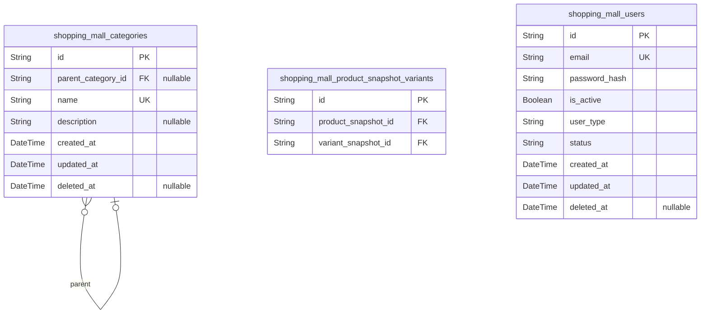
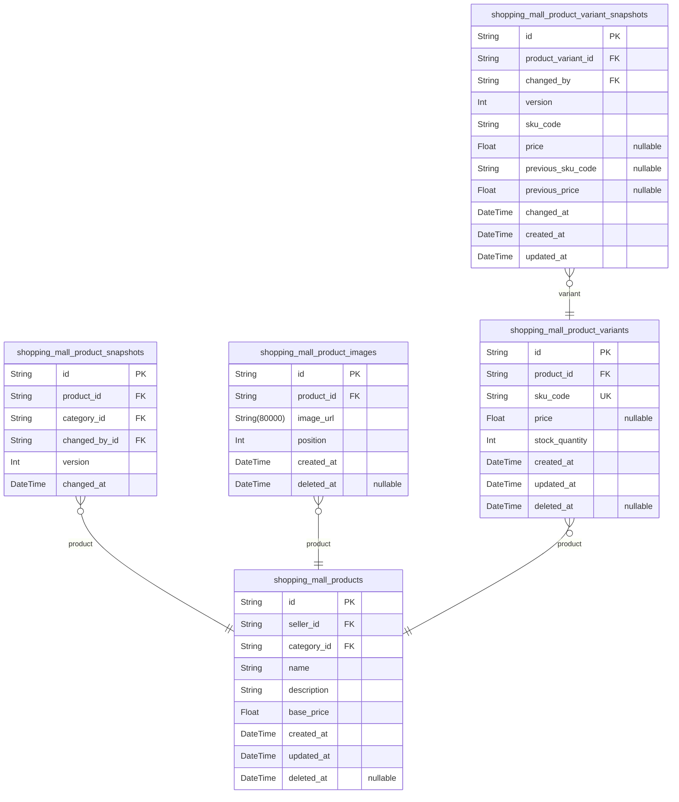
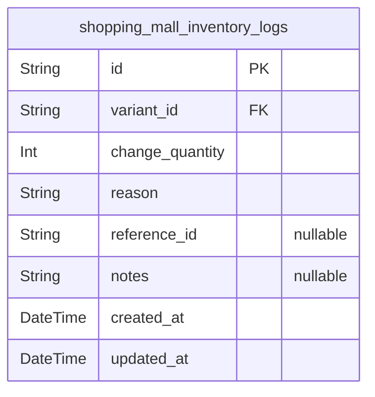
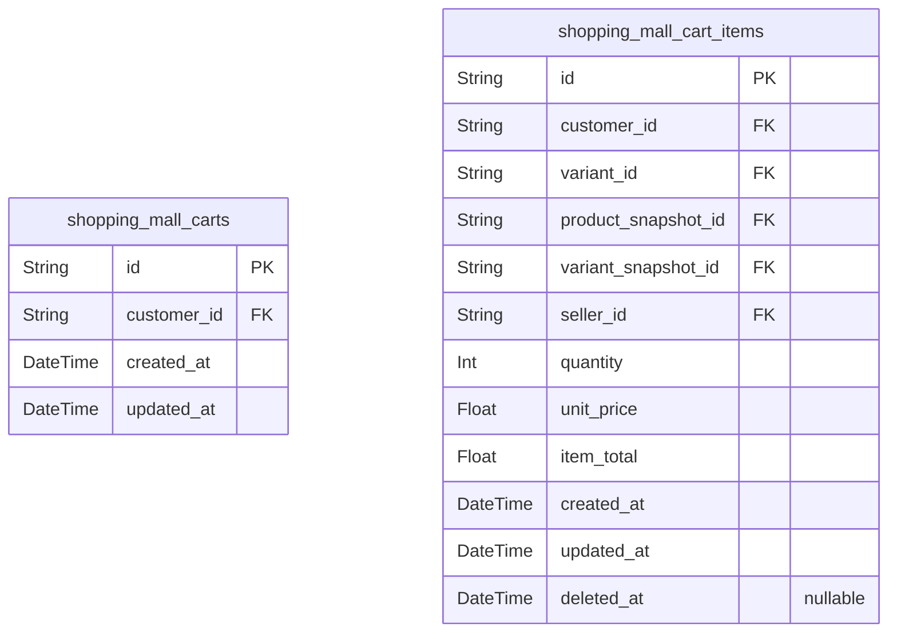
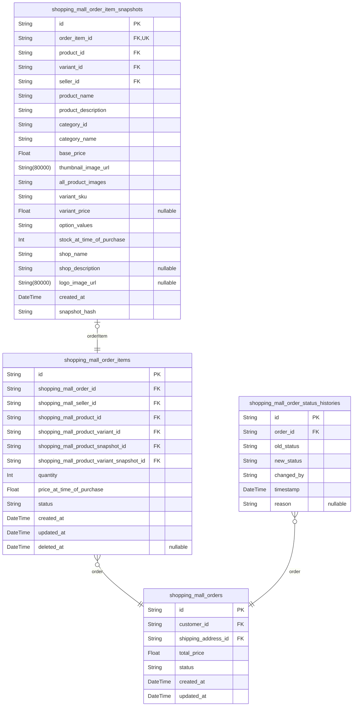
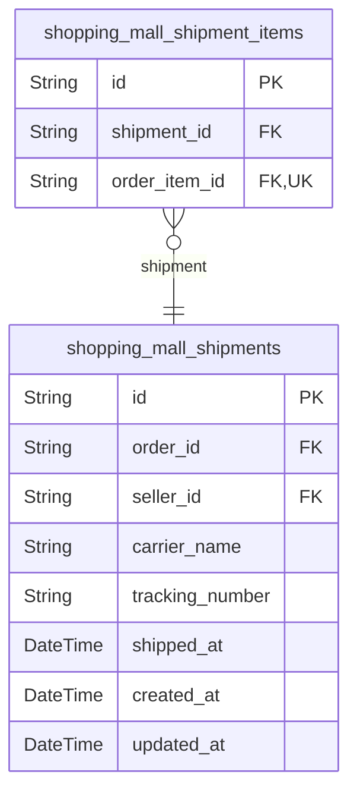
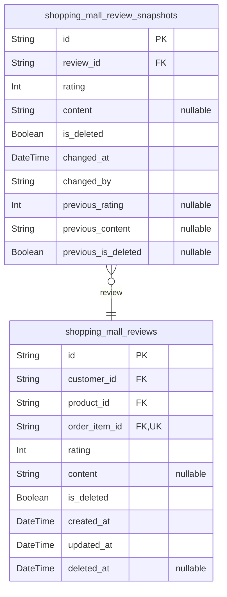
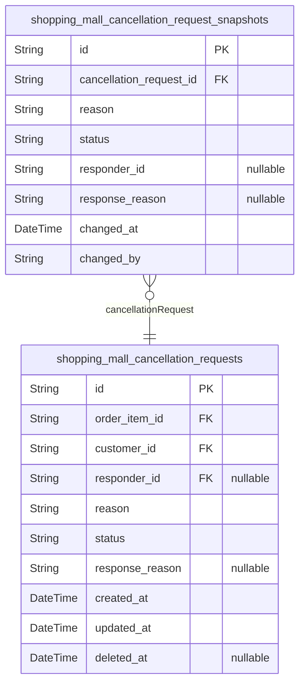
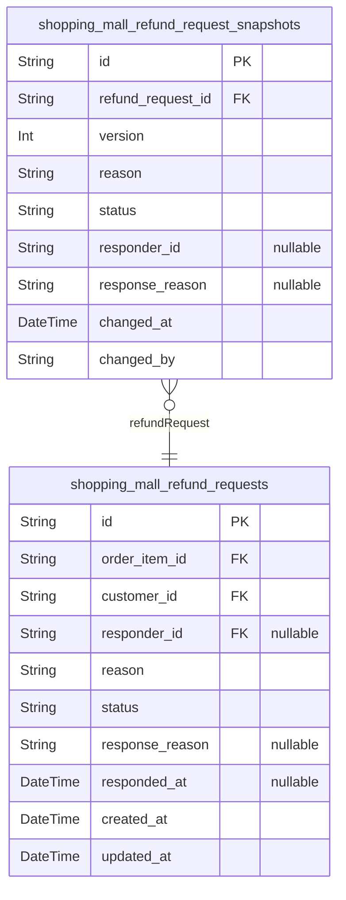

# Prisma Markdown

> Generated by [`prisma-markdown`](https://github.com/samchon/prisma-markdown)

- [Actors](#actors)
- [Systematic](#systematic)
- [Products](#products)
- [Inventory](#inventory)
- [Carts](#carts)
- [Orders](#orders)
- [Shipping](#shipping)
- [Reviews](#reviews)
- [Cancellations](#cancellations)
- [Refunds](#refunds)

## Actors

```mermaid
erDiagram
"shopping_mall_customers" {
  String id PK
  String email UK
  String password_hash
  String display_name "nullable"
  String phone_number "nullable"
  DateTime created_at
  DateTime updated_at
  DateTime deleted_at "nullable"
}
"shopping_mall_customer_sessions" {
  String id PK
  String shopping_mall_customer_id FK
  String ip
  String href
  String referrer
  DateTime created_at
  DateTime expired_at
}
"shopping_mall_customer_password_resets" {
  String id PK
  String shopping_mall_customer_id FK
  String token UK
  DateTime expires_at
  DateTime created_at
  DateTime updated_at
  DateTime deleted_at "nullable"
}
"shopping_mall_customer_email_verifications" {
  String id PK
  String shopping_mall_customer_id FK,UK
  String token UK
  DateTime expires_at
  DateTime created_at
  DateTime updated_at
  DateTime verified_at "nullable"
}
"shopping_mall_sellers" {
  String id PK
  String email UK
  String password_hash
  Boolean is_active
  String status
  String rejection_reason "nullable"
  DateTime created_at
  DateTime approved_at "nullable"
  DateTime deleted_at "nullable"
  DateTime suspended_at "nullable"
}
"shopping_mall_seller_sessions" {
  String id PK
  String shopping_mall_seller_id FK
  String ip
  String(80000) href
  String(80000) referrer "nullable"
  DateTime created_at
  DateTime expired_at
}
"shopping_mall_seller_password_resets" {
  String id PK
  String seller_id FK
  String token UK
  DateTime expires_at
  DateTime created_at
  DateTime used_at "nullable"
}
"shopping_mall_seller_email_verifications" {
  String id PK
  String shopping_mall_seller_id FK
  String token UK
  DateTime expires_at
  Boolean used
  DateTime created_at
  DateTime updated_at
  DateTime deleted_at "nullable"
}
"shopping_mall_admins" {
  String id PK
  String email UK
  String password_hash
  Boolean is_active
  String status
  DateTime created_at
  DateTime updated_at
  DateTime deleted_at "nullable"
  DateTime suspended_at "nullable"
}
"shopping_mall_admin_sessions" {
  String id PK
  String shopping_mall_admin_id FK
  String ip
  String(80000) href
  String(80000) referrer "nullable"
  DateTime created_at
  DateTime expired_at
}
"shopping_mall_admin_password_resets" {
  String id PK
  String admin_id FK
  String token UK
  DateTime expires_at
  DateTime used_at "nullable"
  String ip
  String user_agent
  DateTime created_at
  DateTime updated_at
}
"shopping_mall_admin_email_verifications" {
  String id PK
  String admin_id FK,UK
  String email UK
  DateTime expires_at
  DateTime created_at
  DateTime verified_at "nullable"
  String token UK
}
"shopping_mall_customer_sessions" }o--|| "shopping_mall_customers" : customer
"shopping_mall_customer_password_resets" }o--|| "shopping_mall_customers" : customer
"shopping_mall_customer_email_verifications" |o--|| "shopping_mall_customers" : customer
"shopping_mall_seller_sessions" }o--|| "shopping_mall_sellers" : seller
"shopping_mall_seller_password_resets" }o--|| "shopping_mall_sellers" : seller
"shopping_mall_seller_email_verifications" }o--|| "shopping_mall_sellers" : seller
"shopping_mall_admin_sessions" }o--|| "shopping_mall_admins" : admin
"shopping_mall_admin_password_resets" }o--|| "shopping_mall_admins" : admin
"shopping_mall_admin_email_verifications" |o--|| "shopping_mall_admins" : admin
```

### `shopping_mall_customers`

Main actor table for registered customer accounts with email/password
authentication credentials. This table serves as the canonical identity
record for customers, enabling authentication, session management, and
ownership of orders, reviews, and wishlists. Customers are distinct
actors with login capability and their own session lifecycle. Profile
fields like display_name and phone_number are optional and not part of
authentication.

Properties as follows:

- `id`: Primary Key.
- `email`: Unique email address used for login and authentication.
- `password_hash`: Hashed password for authentication.
- `display_name`: Optional display name shown to other users. May be null if not set.
- `phone_number`
  > Optional phone number for contact purposes. May be null if not provided
  > during registration.
- `created_at`: Timestamp when the customer account was registered.
- `updated_at`
  > Timestamp of the last update to the customer account. Updated when any
  > profile field is modified.
- `deleted_at`
  > Timestamp when the customer account was logically deleted. If null,
  > account is active. Preserves order history and review data after deletion
  > per 02-user-actors.md.

### `shopping_mall_customer_sessions`

JWT session tokens for customer authentication with access and refresh
tokens. This table logs each login event, stores the client's connection
context (IP, referrer), and tracks session expiration for security.

Properties as follows:

- `id`: Primary Key.
- `shopping_mall_customer_id`
  > Reference to the customer who initiated this session. {@link
  > shopping_mall_customers.id}.
- `ip`: Client's IP address at login time.
- `href`: URL of the page where login occurred.
- `referrer`: Referrer header from the client's browser.
- `created_at`: Timestamp when the session was created.
- `expired_at`
  > Timestamp when the session expires. Always set to 30 minutes after
  > created_at for access token, 30 days after for refresh token. Never null
  > for security.

### `shopping_mall_customer_password_resets`

Password reset tokens with expiration for customer account recovery. Each
token is single-use and expires after 2 hours. This table exists to
support the authentication flow for customer actors, allowing secure
account recovery via email link.

Properties as follows:

- `id`: Primary Key.
- `shopping_mall_customer_id`
  > Customer's account requesting password reset. {@link
  > shopping_mall_customers.id}.
- `token`
  > Randomly generated cryptographic token for password reset link. Must be
  > unique and single-use.
- `expires_at`
  > Date and time when this reset token will expire (always 2 hours after
  > creation).
- `created_at`: Timestamp when the password reset request was created.
- `updated_at`: Timestamp when this record was last updated (not reset token itself).
- `deleted_at`: Soft delete timestamp. Null if active, set when reset is used or expired.

### `shopping_mall_customer_email_verifications`

Email verification token for customer registration confirmation. Each
token is a single-use, time-limited string issued when a customer
registers, requiring verification before account activation. Tied to a
customer account and expires after short duration. This is a session-type
table capturing ephemeral authentication state.

Referenced by: shopping_mall_customers (via customer_id).
Linked to: customer account lifecycle.

Automatically deleted upon successful verification or expiration. No
audit or versioning required as per business rule.

Note: Not a snapshot or primary entity - purely a transient verification
mechanism for actor authentication flow.

Properties as follows:

- `id`: Primary Key.
- `shopping_mall_customer_id`: Belongs to customer account. [shopping_mall_customers.id](#shopping_mall_customers).
- `token`: Unique verification token. Generated as cryptographically random string.
- `expires_at`
  > When this token expires. Must be enforced by the application to
  > invalidate after short duration (typically 1 hour).
- `created_at`
  > When the verification request was issued. Automatically generated by
  > system.
- `updated_at`
  > Timestamp of last update to this record. Used for internal system
  > consistency.
- `verified_at`
  > Timestamp when this verification was successfully completed. Null until
  > verified.

### `shopping_mall_sellers`

Main table for registered seller accounts with email/password
authentication credentials. This is an actor entity that represents a
business entity capable of listing products, managing inventory,
fulfilling orders, and interacting with customer inquiries. Sellers
require distinct authentication flow and identity separate from
customers. All profile metadata (shop name, description, logo) are
preserved immutably via snapshots in
shopping_mall_seller_profile_snapshots; this table contains only
authentication and identity lifecycle data. Never contains editable
profile fields - those are managed by snapshot system to ensure
transactional integrity.

This table is never referenced by any child table with a foreign key
pointing to it. Instead, child tables like shopping_mall_seller_sessions,
shopping_mall_seller_password_resets, and
shopping_mall_seller_email_verifications reference this table using
foreign keys in the direction child→parent.

Seller status (pending, approved, rejected) is managed as a plain field
to reflect onboarding state, not as a separate table because it
represents the lifecycle state of the actor identity rather than a
business entity relationship. Suspension (suspended_at) is a temporal
flag for account management.

All fields are non-nullable except deleted_at and suspended_at, following
soft-delete pattern. The email must be unique to ensure singular identity
per account. Password_hash stores bcrypt hash, not plaintext.

All timestamps are stored as UTC with timezone and use ISO 8601 format at
application layer.

See also: shopping_mall_seller_profile_snapshots (for immutable profile
changes), shopping_mall_seller_sessions (for authentication sessions),
shopping_mall_seller_password_resets (for recovery workflows).

Properties as follows:

- `id`: Primary Key.
- `email`
  > Unique email address used for authentication and communication. Must be
  > valid email format.
- `password_hash`
  > BCrypt hash of the seller's password. Never stored as plaintext. Used for
  > authentication during login.
- `is_active`
  > Whether the seller account is active and permitted to perform actions.
  > Defaults to true. Set to false only on deletion or suspension.
- `status`
  > Onboarding status of the seller: 'pending' (registration submitted),
  > 'approved' (verified and active), or 'rejected' (denied by admin).
  > Immutable after initial set.
- `rejection_reason`
  > Reason provided by admin when seller registration is rejected. Preserved
  > in audit trail but not displayed to seller after approval.
- `created_at`
  > Timestamp when seller account was created. Immutable and set at
  > registration.
- `approved_at`
  > Timestamp when seller registration was approved by admin. Null until
  > approved.
- `deleted_at`
  > Soft delete timestamp. If null, account is active. If set, account is
  > logically deleted and login disabled. Account data preserved for
  > historical audit.
- `suspended_at`
  > Timestamp when seller account was suspended by admin. Null if not
  > suspended. Suspended sellers cannot list new products or process orders.

### `shopping_mall_seller_sessions`

JWT session tokens for seller authentication with access and refresh tokens.

This table tracks active login sessions for sellers. Each session is tied
to a single seller and includes connection metadata for security
auditing.

Session records are append-only and automatically expired after 30
minutes for access tokens or 30 days for refresh tokens. They are never
updated—only created and deleted.

Reference: @\link shopping_mall_sellers.id

Not used for direct user operations—managed only by authentication service.

Properties as follows:

- `id`: Primary Key.
- `shopping_mall_seller_id`
  > The seller's account this session belongs to. {@link
  > shopping_mall_sellers.id}.
- `ip`: Client's IP address used to establish this session.
- `href`: Complete URL path the user was visiting when initiating this session.
- `referrer`: Original URL the user came from before entering the platform.
- `created_at`: Timestamp when this session was created (ISO 8601 UTC).
- `expired_at`
  > Timestamp when this session expires (ISO 8601 UTC). Always set to 30
  > minutes or 30 days after creation.

### `shopping_mall_seller_password_resets`

Temporary password reset tokens for seller account recovery. Each token
is unique, time-limited, and single-use. Expires 1 hour after creation.
Associated with a specific seller account via foreign key. Tokens are
invalidated after use or expiration and not soft-deleted.

This table is a session entity that supports the authentication flow
described in 02-user-actors.md: when a seller requests password reset, a
unique token is issued and stored here. The seller clicks the reset link
containing the token, which validates the session and allows password
change. After use, the token is removed from the system.

This table is a child of shopping_mall_sellers (actor). Seller accounts
can have zero or more password reset requests over time. Each request is
an ephemeral session. It is NOT a user profile, product, order, or review
- it is purely an authentication event.

Relates to: [shopping_mall_sellers.id](#shopping_mall_sellers)

Properties as follows:

- `id`: Primary Key.
- `seller_id`
  > The seller account that requested this password reset. {@link
  > shopping_mall_sellers.id}.
- `token`: Unique, cryptographically random reset token. Expires after 1 hour.
- `expires_at`
  > Absolute timestamp when this token expires. Mandatory, not null. Must be
  > exactly 1 hour after created_at.
- `created_at`: Timestamp when this reset request was issued. Mandatory, not null.
- `used_at`
  > Timestamp when this token was successfully consumed to reset password.
  > Null until used.

### `shopping_mall_seller_email_verifications`

Email verification tokens for seller registration confirmation. Used to
validate seller email address during account registration. Once used, the
token becomes invalid. Tokens expire after 24 hours for security. This
table is append-only and never modified, ensuring immutability and
auditability of email verification events.

Each record is tied to exactly one seller account via seller_id. When a
seller registers, a record is created. When the seller clicks the
verification link, the used flag is set to true. Expired or used tokens
are eventually purged by system jobs. No data is deleted — only
soft-deleted via deleted_at for compliance.

Never used for password reset or other purposes. Exclusive to email
verification for seller sign-up.

Properties as follows:

- `id`: Primary Key.
- `shopping_mall_seller_id`
  > Reference to the seller account that requested this email verification.
  > [shopping_mall_sellers.id](#shopping_mall_sellers).
- `token`
  > Unique cryptographic token generated for email verification link. Never
  > reused.
- `expires_at`
  > Timestamp when this verification token expires. Must be 24 hours after
  > creation. Enforced by application logic and system cleanup jobs.
- `used`
  > Indicates if the verification token has been successfully used to confirm
  > the seller's email address. Once true, this token is invalid for future
  > use.
- `created_at`: Timestamp when this verification request was initiated.
- `updated_at`
  > Timestamp when the token was marked as used. Zeroed initially, then set
  > to current time when used.
- `deleted_at`
  > Soft-deletion timestamp. Used for compliance and audit trail retention.
  > Records are never physically deleted, only marked as deleted.

### `shopping_mall_admins`

Main table for system administrators with email/password authentication
credentials. Represents a distinct actor type with elevated permissions.
Administrators control seller approvals, category management, order
oversight, and user management. Each admin has a unique email and
password_hash. Admin accounts may be suspended but not deleted.
Soft-deletion via deleted_at is supported. Session management, password
resets, and email verifications are handled by separate actor-specific
tables (shopping_mall_admin_sessions,
shopping_mall_admin_password_resets,
shopping_mall_admin_email_verifications).

Properties as follows:

- `id`: Primary Key.
- `email`
  > Unique email address used for login and communication. Must be verified
  > during registration.
- `password_hash`
  > Hashed password for authentication. Never stored in plaintext. Generated
  > using secure hashing algorithm (bcrypt).
- `is_active`
  > Indicates if the admin account is active and able to log in. Default is
  > true.
- `status`
  > Administrative status of the account: 'active', 'suspended', or
  > 'deleted'. Used to control system access independently of is_active flag.
- `created_at`: Timestamp when the admin account was created. Required and immutable.
- `updated_at`
  > Timestamp when the admin account was last modified. Updated on any
  > profile change.
- `deleted_at`
  > Soft delete timestamp. When set, the account is logically deleted but
  > preserved for audit. Null means active.
- `suspended_at`
  > Timestamp when the admin account was suspended. Null means not suspended.
  > Used to track suspension history and duration.

### `shopping_mall_admin_sessions`

JWT session tokens for administrator authentication with access and
refresh tokens. Tracks active login sessions for admin actors, storing
connection metadata such as IP address, browser referrer, and session
endpoints. This table is append-only and never modified after creation.
Each session is tied to exactly one admin via admin_id, enforcing 1:N
relationship. Sessions expire automatically and are invalidated upon
logout or timeout.

Properties as follows:

- `id`: Primary Key.
- `shopping_mall_admin_id`
  > References the admin actor who initiated this session. {@link
  > shopping_mall_admins.id}.
- `ip`: IPv4 or IPv6 address of the client device at login time.
- `href`
  > Full URL of the page where the admin logged in, including query
  > parameters.
- `referrer`
  > Referrer URL from which the admin navigated to the login page. May be
  > empty if directly accessed.
- `created_at`: Timestamp when the session was created. Always in UTC.
- `expired_at`
  > Timestamp when the session will expire. Set at login based on token
  > longevity. Never nullable - enforced for security.

### `shopping_mall_admin_password_resets`

Password reset tokens issued to administrators for account recovery. Each
token is one-time use, has a fixed expiration, and tracks the IP and user
agent of the reset request. Immutable audit trail that ensures security
and compliance.

Properties as follows:

- `id`: Primary Key.
- `admin_id`: Admin who requested the password reset. [shopping_mall_admins.id](#shopping_mall_admins).
- `token`
  > Unique cryptographic token generated for password reset. Must be stored
  > securely and used only once.
- `expires_at`
  > Timestamp when the reset token expires. After this time, the token is
  > invalid and cannot be used.
- `used_at`
  > Timestamp when the token was used to reset the password. Null until first
  > use.
- `ip`: IP address from which the password reset request was initiated.
- `user_agent`
  > User agent string of the client device that initiated the password reset
  > request.
- `created_at`: Timestamp when the password reset request was created.
- `updated_at`: Timestamp when the record was last updated (e.g., when token was used).

### `shopping_mall_admin_email_verifications`

Email verification tokens for administrator registration confirmation.
Used to verify email ownership during admin account registration. Each
token is valid for a limited time and can only be used once. This table
is part of the authentication infrastructure for admin actors and follows
the same pattern as customer and seller email verification systems.

Properties as follows:

- `id`: Primary Key.
- `admin_id`
  > Administrator account this verification token belongs to. {@link
  > shopping_mall_admins.id}.
- `email`
  > The administrator's email address being verified. This is stored here for
  > audit purposes, though the primary identity is in shopping_mall_admins.
- `expires_at`
  > Expiration timestamp for this verification token. After this time, the
  > token is invalid and must be re-requested.
- `created_at`: Timestamp when this verification token was created and sent.
- `verified_at`
  > Timestamp when this email was successfully verified. Null until
  > verification occurs.
- `token`: Unique verification token generated for this email verification request.

## Systematic

```mermaid
erDiagram
"shopping_mall_categories" {
  String id PK
  String parent_category_id FK "nullable"
  String name UK
  String description "nullable"
  DateTime created_at
  DateTime updated_at
  DateTime deleted_at "nullable"
}
"shopping_mall_product_snapshot_variants" {
  String id PK
  String product_snapshot_id FK
  String variant_snapshot_id FK
}
"shopping_mall_users" {
  String id PK
  String email UK
  String password_hash
  Boolean is_active
  String user_type
  String status
  DateTime created_at
  DateTime updated_at
  DateTime deleted_at "nullable"
}
"shopping_mall_categories" }o--o| "shopping_mall_categories" : parent
```

### `shopping_mall_categories`

Product categories for hierarchical organization of products, with
optional parent-child relationships and soft delete support.

Categories enable structured navigation and product classification. Each
category may belong to a parent category to create multi-level
hierarchies (e.g., Electronics > Computers > Laptops). Admins manage
category names, descriptions, and hierarchy. Deleted categories are
soft-deleted to preserve product associations in historical data. No
product or variant snapshots are stored here — these are handled by
independent components.

Used in: Product catalog lookup, storefront navigation, filtering, and
search.

Properties as follows:

- `id`: Primary Key.
- `parent_category_id`
  > Parent category in hierarchical structure. {@link
  > shopping_mall_categories.id}.
- `name`
  > Unique, human-readable name of the category (e.g., 'Electronics',
  > 'Clothing'). Must be unique across all categories.
- `description`
  > Detailed description of the category's contents or purpose. Optional
  > field for additional context.
- `created_at`: Timestamp when the category was created.
- `updated_at`: Timestamp when the category was last edited.
- `deleted_at`: Timestamp when the category was soft-deleted. Null if still active.

### `shopping_mall_product_snapshot_variants`

Junction table linking product snapshots to their variant snapshots at
time of product edit, preserving variant state context. This table does
not store business data — it is purely a reference for reconstructing the
exact variant state included in a product snapshot during an edit
operation. Used for historical reconstruction during audit or dispute
resolution.

Properties as follows:

- `id`: Primary Key.
- `product_snapshot_id`
  > References the product snapshot record that includes this variant state.
  > [shopping_mall_product_snapshots.id](#shopping_mall_product_snapshots).
- `variant_snapshot_id`
  > References the immutable variant snapshot at the time of product edit.
  > [shopping_mall_product_variant_snapshots.id](#shopping_mall_product_variant_snapshots).

### `shopping_mall_users`

Unified identity table for customers, sellers, and administrators. Serves
as the root authentication entity. Each record represents a unique actor
with email/password credentials. User type is discriminated by
'user_type' field (customer/seller/admin), but profile-specific data
(name, shop, roles) are stored in domain-specific tables to adhere to 3NF
and snapshot principles. This table is never updated for profile changes
— only soft-deleted or archived. All authentication session records
reference this table.

Properties as follows:

- `id`: Primary Key.
- `email`
  > Unique email address for authentication. Must be valid and unique across
  > all actors.
- `password_hash`: BCrypt hash of the user's password. Never store plain text.
- `is_active`
  > Indicates if the account is active and can log in. Set to false on
  > deletion or suspension.
- `user_type`
  > Discriminator for actor type: 'customer', 'seller', or 'admin'.
  > Determines which domain table (shopping_mall_customers,
  > shopping_mall_sellers, shopping_mall_admins) holds profile data.
- `status`
  > Current status of the account. Valid values: 'active', 'suspended',
  > 'deleted'. For actors: 'deleted' means account-level soft deletion, not
  > data purge.
- `created_at`: Timestamp when the account was registered. Immutable.
- `updated_at`
  > Timestamp of last authentication or status change. Updated on password
  > change or suspend.
- `deleted_at`
  > Soft deletion timestamp. If set, account is considered logically deleted
  > and cannot authenticate.

## Products

```mermaid
erDiagram
"shopping_mall_products" {
  String id PK
  String seller_id FK
  String category_id FK
  String name
  String description
  Float base_price
  DateTime created_at
  DateTime updated_at
  DateTime deleted_at "nullable"
}
"shopping_mall_product_snapshots" {
  String id PK
  String product_id FK
  String category_id FK
  String changed_by_id FK
  Int version
  DateTime changed_at
}
"shopping_mall_product_images" {
  String id PK
  String product_id FK
  String(80000) image_url
  Int position
  DateTime created_at
  DateTime deleted_at "nullable"
}
"shopping_mall_product_variants" {
  String id PK
  String product_id FK
  String sku_code UK
  Float price "nullable"
  Int stock_quantity
  DateTime created_at
  DateTime updated_at
  DateTime deleted_at "nullable"
}
"shopping_mall_product_variant_snapshots" {
  String id PK
  String product_variant_id FK
  String changed_by FK
  Int version
  String sku_code
  Float price "nullable"
  String previous_sku_code "nullable"
  Float previous_price "nullable"
  DateTime changed_at
  DateTime created_at
  DateTime updated_at
}
"shopping_mall_product_snapshots" }o--|| "shopping_mall_products" : product
"shopping_mall_product_images" }o--|| "shopping_mall_products" : product
"shopping_mall_product_variants" }o--|| "shopping_mall_products" : product
"shopping_mall_product_variant_snapshots" }o--|| "shopping_mall_product_variants" : variant
```

### `shopping_mall_products`

Core product catalog entries with name, description, category, and base
price linked to seller.

This table stores the current active state of each product. Every time a
seller modifies the product's name, description, category, or base price,
a new immutable snapshot is created in shopping_mall_product_snapshots to
preserve the historical state. The product in this table represents the
latest version available for purchase. Products can be logically deleted
via deleted_at for compliance and audit purposes, but all past snapshots
remain intact.

This table is referenced by shopping_mall_product_images,
shopping_mall_product_variants, and
shopping_mall_product_snapshot_variants. It does not store variant
details, images, or pricing overrides—all of which are stored in their
respective tables and captured in snapshots.

Properties as follows:

- `id`: Primary Key.
- `seller_id`
  > Seller who owns and manages this product. {@link
  > shopping_mall_sellers.id}.
- `category_id`
  > Primary category this product belongs to. {@link
  > shopping_mall_categories.id}.
- `name`: The current name of the product as displayed to customers.
- `description`
  > The current full description of the product, including features and
  > specifications.
- `base_price`
  > The current base price of the product, before variant-specific pricing
  > overrides.
- `created_at`: Timestamp when the product was created in the catalog.
- `updated_at`: Timestamp when the product was last modified.
- `deleted_at`
  > Timestamp when the product was logically deleted. NULL means active. Used
  > for soft delete compliance.

### `shopping_mall_product_snapshots`

Immutably preserved versions of product metadata at time of change. Each
snapshot captures the exact state of a product (name, description,
category, base price) whenever a seller or admin makes an edit. Used for
audit trail, legal compliance, and dispute resolution. References live
product and category through foreign keys, preserving historical context.
Never modified after creation.

Properties as follows:

- `id`: Primary Key.
- `product_id`
  > Reference to the live product being snapshotted. {@link
  > shopping_mall_products.id}.
- `category_id`
  > Reference to the product's category at time of snapshot. {@link
  > shopping_mall_categories.id}.
- `changed_by_id`
  > Reference to the actor (customer, seller, or admin) who created this
  > snapshot. [shopping_mall_users.id](#shopping_mall_users).
- `version`
  > Sequential integer representing the version number of this snapshot.
  > Starts at 1 for the first snapshot after product creation and increments
  > on every edit.
- `changed_at`
  > Timestamp when this snapshot was created, capturing the exact moment of
  > the product edit.

### `shopping_mall_product_images`

Multiple images associated with each product, trackable by position and
deletion status. Images are managed exclusively through the parent
product entity and do not have independent API endpoints. Each image is
stored as a single record with immutable URL and position ordering.
Deletion is soft-deleted to preserve historical accuracy for product
snapshots.

Properties as follows:

- `id`: Primary Key.
- `product_id`
  > Reference to the product this image belongs to. {@link
  > shopping_mall_products.id}.
- `image_url`: URL path to the stored image file. Immutable once saved.
- `position`
  > Order position of the image in the product's image gallery. Used for
  > display sequence. Minimum value: 0.
- `created_at`: Timestamp when the image was first uploaded and recorded in the system.
- `deleted_at`: Timestamp when the image was logically deleted. Null if still active.

### `shopping_mall_product_variants`

Product variants with unique SKU codes, pricing overrides, and stock
quantities. Each variant represents a distinct product configuration
(e.g., color, size) and is linked to a specific product. Variants are
immutable in historical orders through snapshots. This is a primary
entity with independent CRUD operations and direct API endpoints for
sellers to manage.

Relates to: shopping_mall_products (one-to-many). Variants are created,
edited, and deleted by sellers. Each variant has a unique SKC code (SKU)
used for inventory tracking. Stock quantity is updated via inventory_logs
on order, restock, cancellation, or refund.

Cannot be deleted if any order item exists in 'paid' or 'shipped' status.
Must preserve all variant snapshots via
shopping_mall_product_variant_snapshots.

Reference: 04-product-management.md, 05-inventory-handling.md,
12-snapshot-principle.md

Properties as follows:

- `id`: Primary Key.
- `product_id`: The product this variant belongs to. [shopping_mall_products.id](#shopping_mall_products)
- `sku_code`
  > Unique Stock Keeping Unit (SKU) code for this variant. Must be
  > alphanumeric, 3-20 characters. Unique across all variants.
- `price`
  > Optional price override for this variant. If null, uses product's
  > base_price. Must be zero or greater.
- `stock_quantity`
  > Current inventory quantity for this variant. Updated by inventory_logs
  > when order is placed, restocked, cancelled, or refunded.
- `created_at`: Timestamp when this variant was created.
- `updated_at`: Timestamp when this variant was last updated.
- `deleted_at`
  > Soft delete timestamp. If null, variant is active. If set, variant is
  > deleted and cannot be purchased.

### `shopping_mall_product_variant_snapshots`

Immutable snapshots of product variant states (SKU, price) at time of
modification, versioned for audit. Each record captures the exact SKU
code and price of a variant at the moment it was edited by a seller or
admin. Maintains a full history of changes with versioning, enabling
precise reconstruction of product pricing and configuration history for
dispute resolution, compliance, and financial auditing. This table never
updates or deletes records - only appends new versions. All fields are
preserved exactly as they existed at the time of change, including
previous values for comparison.

Properties as follows:

- `id`: Primary Key.
- `product_variant_id`
  > The product variant being snapshot. References the live variant in
  > shopping_mall_product_variants.
- `changed_by`
  > The actor who modified the variant (seller or admin). References
  > shopping_mall_sellers or shopping_mall_admins.
- `version`
  > Sequential version number indicating order of changes. Starts at 1 for
  > first snapshot after variant creation.
- `sku_code`: The exact SKU code of the variant at the time of this snapshot.
- `price`
  > The exact price of the variant at the time of this snapshot, in decimal
  > currency format.
- `previous_sku_code`: The SKU code of the variant before this change. Null for first snapshot.
- `previous_price`: The price of the variant before this change. Null for first snapshot.
- `changed_at`: Timestamp when the variant was modified and this snapshot was created.
- `created_at`: Timestamp when this snapshot record was created in database.
- `updated_at`
  > Timestamp of last update to this snapshot record (always same as
  > created_at due to immutability).

## Inventory

```mermaid
erDiagram
"shopping_mall_inventory_logs" {
  String id PK
  String variant_id FK
  Int change_quantity
  String reason
  String reference_id "nullable"
  String notes "nullable"
  DateTime created_at
  DateTime updated_at
}
```

### `shopping_mall_inventory_logs`

Immutable history of all inventory changes: restocks, order deductions,
cancellations, refunds, and manual adjustments. Each record represents a
single atomic change to variant stock quantity, with reason, timestamp,
and optional reference to origin (e.g., order item). This is a pure event
log, not a state table. No modification or deletion is ever allowed.
Query pattern: retrieve all changes for a variant ordered by timestamp
DESC. Used by application layer to calculate real-time stock levels.

This table enforces First Normal Form: every field is atomic. All
relationships are through foreign key variant_id. Never stores product
name, price, or seller info — only variant_id and change.

Examples:
- A customer purchases 2 units → change_quantity: -2, reason: "order",
reference_id: "ord_item_abc"
- Seller restocks 10 units → change_quantity: +10, reason: "restock",
reference_id: null
- Cancellation approved → change_quantity: +1, reason: "cancellation",
reference_id: "ord_item_abc"
- Admin manually adjusts → change_quantity: +3, reason: "adjustment",
reference_id: null

Properties as follows:

- `id`: Primary Key.
- `variant_id`
  > Reference to the product variant that experienced the inventory change.
  > [shopping_mall_product_variants.id](#shopping_mall_product_variants).
- `change_quantity`
  > The quantity change. Positive for restock or refund, negative for order
  > or depletion. Must never be zero.
- `reason`
  > The business reason for this inventory change. Must be one of: 'restock',
  > 'order', 'cancellation', 'refund', 'adjustment', 'loss'. Defined by
  > business rules in 05-inventory-handling.md.
- `reference_id`
  > Optional reference to the source that triggered this change. For example:
  > order_item_id for order/refund/cancellation, or adjustment_id for manual
  > changes. When null, change was initiated by seller or admin without a
  > direct order reference.
- `notes`
  > Optional descriptive notes about the change, e.g., 'Batch #A123
  > restocked', 'Lost in transit'. Used primarily for internal admin context.
  > Never used for calculation.
- `created_at`: Timestamp when this inventory event was recorded. Always in UTC.
- `updated_at`
  > Timestamp when this record was last updated. For audit logs, this is
  > typically identical to created_at since records are immutable.

## Carts

```mermaid
erDiagram
"shopping_mall_carts" {
  String id PK
  String customer_id FK
  DateTime created_at
  DateTime updated_at
}
"shopping_mall_cart_items" {
  String id PK
  String customer_id FK
  String variant_id FK
  String product_snapshot_id FK
  String variant_snapshot_id FK
  String seller_id FK
  Int quantity
  Float unit_price
  Float item_total
  DateTime created_at
  DateTime updated_at
  DateTime deleted_at "nullable"
}
```

### `shopping_mall_carts`

Container table that groups a customer's active cart items. Associates
customer with their current cart session. This table does not store
product or variant data - those are stored in shopping_mall_cart_items.
Each customer has at most one active cart.

Properties as follows:

- `id`: Primary Key.
- `customer_id`: Customer who owns this cart. [shopping_mall_customers.id](#shopping_mall_customers).
- `created_at`: Timestamp when cart was created.
- `updated_at`
  > Timestamp when cart was last modified (e.g., when items were added or
  > removed).

### `shopping_mall_cart_items`

Individual item in a customer's shopping cart, capturing immutable
snapshot data of product, variant, and seller profile as they existed at
the moment of addition to cart. This table ensures that pricing, product
description, variant options, and seller identity are preserved exactly
as the customer saw them, even if those details change later. This table
is a subsidiary entity — it has no independent existence outside the cart
context and is automatically consumed during checkout to create order
items. No user interacts with cart items directly; they are always
managed through the cart container (shopping_mall_carts).

Properties as follows:

- `id`: Primary Key.
- `customer_id`
  > Reference to the customer who added this item to cart. {@link
  > shopping_mall_customers.id}.
- `variant_id`
  > Reference to the product variant at time of addition. {@link
  > shopping_mall_product_variants.id}.
- `product_snapshot_id`
  > Immutable snapshot of the product state (name, description, category,
  > base price, images) as it appeared at time of cart addition. {@link
  > shopping_mall_product_snapshots.id}.
- `variant_snapshot_id`
  > Immutable snapshot of the variant state (SKU, price override) as it
  > appeared at time of cart addition. {@link
  > shopping_mall_product_variant_snapshots.id}.
- `seller_id`
  > Reference to the seller who listed the product at time of cart addition.
  > [shopping_mall_sellers.id](#shopping_mall_sellers). This replaces non-existent
  > seller_profile_snapshot_id. Seller name/logo are immutable actor
  > attributes stored in shopping_mall_sellers.
- `quantity`: Number of units of this variant added to cart. Must be ≥1.
- `unit_price`
  > Exact unit price of the variant at the time it was added to cart, copied
  > from snapshot.
- `item_total`
  > Total price for this cart item (quantity × unit_price). Calculated at
  > addition time and preserved for audit.
- `created_at`: Timestamp when this item was added to the cart. Always immutable.
- `updated_at`: Timestamp when this item was last modified (e.g., quantity changed).
- `deleted_at`
  > Soft delete timestamp. If null, item is still in cart. If set, item has
  > been removed from cart.

## Orders

```mermaid
erDiagram
"shopping_mall_orders" {
  String id PK
  String customer_id FK
  String shipping_address_id FK
  Float total_price
  String status
  DateTime created_at
  DateTime updated_at
}
"shopping_mall_order_items" {
  String id PK
  String shopping_mall_order_id FK
  String shopping_mall_seller_id FK
  String shopping_mall_product_id FK
  String shopping_mall_product_variant_id FK
  String shopping_mall_product_snapshot_id FK
  String shopping_mall_product_variant_snapshot_id FK
  Int quantity
  Float price_at_time_of_purchase
  String status
  DateTime created_at
  DateTime updated_at
  DateTime deleted_at "nullable"
}
"shopping_mall_order_item_snapshots" {
  String id PK
  String order_item_id FK,UK
  String product_id FK
  String variant_id FK
  String seller_id FK
  String product_name
  String product_description
  String category_id
  String category_name
  Float base_price
  String(80000) thumbnail_image_url
  String all_product_images
  String variant_sku
  Float variant_price "nullable"
  String option_values
  Int stock_at_time_of_purchase
  String shop_name
  String shop_description "nullable"
  String(80000) logo_image_url "nullable"
  DateTime created_at
  String snapshot_hash
}
"shopping_mall_order_status_histories" {
  String id PK
  String order_id FK
  String old_status
  String new_status
  String changed_by
  DateTime timestamp
  String reason "nullable"
}
"shopping_mall_order_items" }o--|| "shopping_mall_orders" : order
"shopping_mall_order_item_snapshots" |o--|| "shopping_mall_order_items" : orderItem
"shopping_mall_order_status_histories" }o--|| "shopping_mall_orders" : order
```

### `shopping_mall_orders`

Root record of a completed purchase transaction with fixed pricing and
shipping address snapshot. This is an immutable financial record that
cannot be altered after creation. Order status is derived from its order
items and must be tracked via shopping_mall_order_status_histories. All
product, variant, and seller details are preserved as snapshots in
shopping_mall_order_items and shopping_mall_order_item_snapshots, not
duplicated here. This table serves as the anchor for order-level
reporting, financial reconciliation, and customer order history.

Properties as follows:

- `id`: Primary Key.
- `customer_id`: Customer who placed this order. [shopping_mall_customers.id](#shopping_mall_customers).
- `shipping_address_id`
  > Customer's shipping address chosen at checkout. Stored as a reference to
  > the customer record, since shopping_mall_addresses does not exist. Per
  > 02-user-actors.md, customer addresses are managed as a collection within
  > shopping_mall_customers. This reference identifies the selected address
  > from the customer's address list, not as direct foreign key to a separate
  > address table.
- `total_price`
  > Total order amount at time of checkout, including tax but excluding
  > discounts. Stored as immutable snapshot value. Never recalculated.
- `status`
  > Current status of the entire order, derived from its order items: paid,
  > shipped, delivered, cancelled, refunded, partially_completed. Immutable
  > after assignment.
- `created_at`: Timestamp when payment was confirmed and order was created. Always in UTC.
- `updated_at`
  > Timestamp of last status change to this order, triggered by order item
  > status update. Always in UTC.

### `shopping_mall_order_items`

Individual line items within an order, each linked to immutable product,
variant, and seller snapshots at time of purchase. This table anchors
financial accountability: every price, product description, variant
option, and seller profile shown to the customer at checkout is
permanently recorded here regardless of subsequent edits. No updates
allowed after creation — the snapshot reference ensures audit trail
integrity for disputes, refunds, and compliance. This is a primary entity
with independent CRUD access for administrators to audit, filter by
status, and reconcile inventory.

Properties as follows:

- `id`: Primary Key.
- `shopping_mall_order_id`
  > Reference to the parent order this item belongs to. {@link
  > shopping_mall_orders.id}.
- `shopping_mall_seller_id`
  > Seller who listed the product at time of purchase. {@link
  > shopping_mall_sellers.id}.
- `shopping_mall_product_id`
  > Parent product referenced at time of purchase. {@link
  > shopping_mall_products.id}.
- `shopping_mall_product_variant_id`
  > Specific product variant chosen by customer at time of purchase. {@link
  > shopping_mall_product_variants.id}.
- `shopping_mall_product_snapshot_id`
  > Immutable snapshot of product state (name, description, base price) at
  > time of purchase. [shopping_mall_product_snapshots.id](#shopping_mall_product_snapshots).
- `shopping_mall_product_variant_snapshot_id`
  > Immutable snapshot of variant state (SKU, price override) at time of
  > purchase. [shopping_mall_product_variant_snapshots.id](#shopping_mall_product_variant_snapshots).
- `quantity`: Number of units purchased. Always ≥1.
- `price_at_time_of_purchase`
  > Unit price of variant exactly as it was at time of purchase. Never
  > recalculated. Used for revenue tracking and dispute resolution.
- `status`
  > Current status of this order item. Must be one of: 'paid', 'shipped',
  > 'delivered', 'cancelled', 'refunded'. Defined by 07-order-management.md.
- `created_at`: Timestamp when this order item was created at the time of order placement.
- `updated_at`: Timestamp of the last status change event for this item.
- `deleted_at`
  > Soft delete timestamp. Only set if item is purged for compliance reasons
  > (never in normal operation).

### `shopping_mall_order_item_snapshots`

Immutable snapshot of product, variant, and seller state captured at the
exact moment of order creation. This record preserves the exact product
name, description, category, base price, and images; variant SKU, option
values, and price; and seller profile name, description, and logo—at the
time of purchase. Used for dispute resolution, audit trails, and legal
compliance, ensuring that all transaction data remains unaltered forever.
This snapshot is referenced by order_item and never updated after
creation.

Properties as follows:

- `id`: Primary Key.
- `order_item_id`
  > Reference to the order item that this snapshot belongs to. {@link
  > shopping_mall_order_items.id}.
- `product_id`
  > Product ID as it existed at time of purchase. {@link
  > shopping_mall_products.id}.
- `variant_id`
  > Product variant ID as it existed at time of purchase. {@link
  > shopping_mall_product_variants.id}.
- `seller_id`
  > Seller ID as it existed at time of purchase. {@link
  > shopping_mall_sellers.id}.
- `product_name`: Exact product name as it appeared at the time of purchase.
- `product_description`: Exact product description as it appeared at the time of purchase.
- `category_id`
  > Category ID as it existed at time of purchase. {@link
  > shopping_mall_categories.id}.
- `category_name`: Exact category name as it appeared at time of purchase.
- `base_price`
  > Base price of the product as it existed at time of purchase, in decimal
  > format.
- `thumbnail_image_url`: URL of the primary product image as it appeared at time of purchase.
- `all_product_images`
  > JSON array of all product image URLs as they existed at time of purchase,
  > in order.
- `variant_sku`: Exact SKU code of the variant as it existed at time of purchase.
- `variant_price`
  > Price override of the variant as it existed at time of purchase, in
  > decimal format (nullable if no override).
- `option_values`
  > JSON object containing all option name-value pairs (e.g., {"color":
  > "red", "size": "large"}) as they existed at time of purchase.
- `stock_at_time_of_purchase`: Stock quantity of the variant at the exact time of purchase.
- `shop_name`: Exact shop name of the seller as it appeared at time of purchase.
- `shop_description`: Exact shop description of the seller as it appeared at time of purchase.
- `logo_image_url`: Logo URL of the seller’s profile as it appeared at time of purchase.
- `created_at`: Timestamp when this snapshot was created (matches order creation time).
- `snapshot_hash`
  > SHA-256 cryptographic hash of the entire snapshot data for integrity
  > verification.

### `shopping_mall_order_status_histories`

Immutable audit trail of all status transitions for the entire order,
recording who and when each change occurred at the order level. This
table captures every transition (paid → shipped → delivered → cancelled →
refunded → partially_completed) with the previous state, new state, actor
responsible, timestamp, and optional reason for audit and compliance.
Designed to support administrative oversight and dispute resolution per
07-order-management.md.

Properties as follows:

- `id`: Primary Key.
- `order_id`
  > References the parent order that changed status. {@link
  > shopping_mall_orders.id}.
- `old_status`
  > The previous order status before the change. One of: 'paid', 'shipped',
  > 'delivered', 'cancelled', 'refunded', 'partially_completed'.
- `new_status`
  > The new order status after the change. One of: 'paid', 'shipped',
  > 'delivered', 'cancelled', 'refunded', 'partially_completed'.
- `changed_by`
  > Who triggered the status change. One of: 'system', 'customer', 'seller',
  > 'admin'.
- `timestamp`: Exact timestamp when the status change occurred, in UTC.
- `reason`
  > Optional brief reason for the status change, e.g., 'Automatically marked
  > as delivered after 14 days', 'Customer requested cancellation', 'Admin
  > overridden'. Max 500 characters.

## Shipping

```mermaid
erDiagram
"shopping_mall_shipments" {
  String id PK
  String order_id FK
  String seller_id FK
  String carrier_name
  String tracking_number
  DateTime shipped_at
  DateTime created_at
  DateTime updated_at
}
"shopping_mall_shipment_items" {
  String id PK
  String shipment_id FK
  String order_item_id FK,UK
}
"shopping_mall_shipment_items" }o--|| "shopping_mall_shipments" : shipment
```

### `shopping_mall_shipments`

Represents a physical shipment created by a seller containing one or more
order items. Captures carrier and tracking number at time of shipment
creation. This is a primary business entity allowing independent tracking
and management of physical deliveries. Each shipment links to a single
order and seller, enabling accountability and logistical visibility. The
shipment record is permanent and immutable and does not represent
financial state or inventory changes — those are captured in order and
inventory components.

Properties as follows:

- `id`: Primary Key.
- `order_id`
  > The order that this shipment is fulfilling. {@link
  > shopping_mall_orders.id}.
- `seller_id`
  > The seller who created and shipped this shipment. {@link
  > shopping_mall_sellers.id}.
- `carrier_name`
  > The name of the carrier or courier service handling this shipment (e.g.,
  > FedEx, UPS, local postal).
- `tracking_number`
  > The unique tracking number assigned by the carrier for this shipment.
  > Used by customers to track delivery progress.
- `shipped_at`
  > The exact timestamp when this shipment was created and dispatched by the
  > seller.
- `created_at`
  > When this shipment record was initially created in the system. Matches
  > shipped_at for consistency.
- `updated_at`
  > When this shipment record was last updated. Typically only updated when
  > tracking status is manually synced or corrected.

### `shopping_mall_shipment_items`

Junction table that associates each order item with a specific shipment.
Enforces that each order item belongs to exactly one shipment. This table
does not store any business data, only foreign key relationships to
maintain the 1:1 relationship between order_item_id and shipment_id as
required by the shipping workflow. Every shipment item represents an
order item that has been included in a physical shipment. This table is
immutable after insertion.

Properties as follows:

- `id`: Primary Key.
- `shipment_id`
  > References the parent shipment entity. This foreign key defines which
  > shipment this order item belongs to. [shopping_mall_shipments.id](#shopping_mall_shipments).
- `order_item_id`
  > References the order item being shipped. Unique constraint ensures one
  > order item is associated with only one shipment. {@link
  > shopping_mall_order_items.id}.

## Reviews

```mermaid
erDiagram
"shopping_mall_reviews" {
  String id PK
  String customer_id FK
  String product_id FK
  String order_item_id FK,UK
  Int rating
  String content "nullable"
  Boolean is_deleted
  DateTime created_at
  DateTime updated_at
  DateTime deleted_at "nullable"
}
"shopping_mall_review_snapshots" {
  String id PK
  String review_id FK
  Int rating
  String content "nullable"
  Boolean is_deleted
  DateTime changed_at
  String changed_by
  Int previous_rating "nullable"
  String previous_content "nullable"
  Boolean previous_is_deleted "nullable"
}
"shopping_mall_review_snapshots" }o--|| "shopping_mall_reviews" : review
```

### `shopping_mall_reviews`

Customer reviews with rating, content, and deletion status. Each review
is tied to a specific order item to enforce eligibility (only delivered
items may be reviewed). Reviews are independently managed entities,
allowing customers to create, edit, and delete feedback, while
maintaining audit trails via snapshots in shopping_mall_review_snapshots.
This table captures the active state of reviews and serves as the source
for display and moderation, with immutable historical records preserved
in the snapshot table.

Properties as follows:

- `id`: Primary Key.
- `customer_id`: Customer who wrote the review. [shopping_mall_customers.id](#shopping_mall_customers).
- `product_id`: Product being reviewed. [shopping_mall_products.id](#shopping_mall_products).
- `order_item_id`
  > Order item that qualifies this review. Must be linked to a delivered
  > order item. [shopping_mall_order_items.id](#shopping_mall_order_items).
- `rating`: Customer's rating from 1 to 5 (inclusive). Required for review submission.
- `content`: Optional textual feedback provided by the customer.
- `is_deleted`
  > Flag indicating whether the review has been logically deleted by customer
  > or admin. True if deleted, false if active.
- `created_at`: Timestamp when the review was created.
- `updated_at`: Timestamp when the review was last updated. Updated on edit or deletion.
- `deleted_at`
  > Timestamp when the review was logically deleted. Nullable; if null,
  > review is active.

### `shopping_mall_review_snapshots`

Immutable historical snapshots of review changes including previous
rating, content, and deletion status, with change timestamps and actor
who made the change. Each snapshot represents a point-in-time state of a
review's content and status (including deletion status). This table
preserves full revision history for audit, dispute resolution, and
integrity verification. New rows are added whenever a review is edited
(up to 500 characters) or deleted, always preserving previous state
values. Related to shopping_mall_reviews via review_id. Read-only for
customers and administrators.

Properties as follows:

- `id`: Primary Key.
- `review_id`
  > Reference to the original review in shopping_mall_reviews. {@link
  > shopping_mall_reviews.id}.
- `rating`: The review's rating (1-5) at the time this snapshot was taken.
- `content`
  > The review's text content at time of this snapshot. Null if review was
  > created with no content.
- `is_deleted`
  > The deletion status of the review at the time of this snapshot (true if
  > deleted at that moment).
- `changed_at`: UTC timestamp when this snapshot was created.
- `changed_by`: Actor who triggered the change: either 'customer' or 'admin'.
- `previous_rating`
  > Previous rating value before this change. Null if this is the first
  > snapshot.
- `previous_content`
  > Previous content value before this change. Null if this is the first
  > snapshot or previous content was null.
- `previous_is_deleted`
  > Previous deletion status before this change. Null if this is the first
  > snapshot.

## Cancellations

```mermaid
erDiagram
"shopping_mall_cancellation_requests" {
  String id PK
  String order_item_id FK
  String customer_id FK
  String responder_id FK "nullable"
  String reason
  String status
  String response_reason "nullable"
  DateTime created_at
  DateTime updated_at
  DateTime deleted_at "nullable"
}
"shopping_mall_cancellation_request_snapshots" {
  String id PK
  String cancellation_request_id FK
  String reason
  String status
  String responder_id "nullable"
  String response_reason "nullable"
  DateTime changed_at
  String changed_by
}
"shopping_mall_cancellation_request_snapshots" }o--|| "shopping_mall_cancellation_requests" : cancellationRequest
```

### `shopping_mall_cancellation_requests`

Customer-initiated cancellation requests for order items, with
pending/approved/rejected status and seller/admin response. Each request
is tied to a specific order item and customer. When approved, triggers
inventory restoration and order item status change to cancelled. Seller
or admin must respond with approval or rejection and reason. All requests
are immutable in their state after creation; changes are recorded in the
snapshot table.

Properties as follows:

- `id`: Primary Key.
- `order_item_id`
  > Reference to the order item for which cancellation is requested. {@link
  > shopping_mall_order_items.id}.
- `customer_id`
  > The customer who initiated the cancellation request. {@link
  > shopping_mall_customers.id}.
- `responder_id`
  > The seller or admin who responded to this request. Null until response is
  > made. [shopping_mall_users.id](#shopping_mall_users).
- `reason`
  > Text explanation provided by customer for requesting cancellation.
  > Minimum 10 characters, maximum 500.
- `status`
  > Current status of the cancellation request: 'pending', 'approved', or
  > 'rejected'. Must be one of these three values.
- `response_reason`
  > Text reason provided by seller or admin when approving or rejecting the
  > request. Only populated when status is 'approved' or 'rejected'.
- `created_at`: Timestamp when the cancellation request was created. Immutable.
- `updated_at`
  > Timestamp when the request status was last updated, e.g., when approved
  > or rejected.
- `deleted_at`
  > Soft delete timestamp. Requests are never permanently deleted, but
  > soft-deleted if invalid or duplicate.

### `shopping_mall_cancellation_request_snapshots`

Immutable snapshots of cancellation request state at each status change,
for audit and historical reference. Captures the exact state of the
cancellation request (reason, status, responder, response reason)
whenever it transitions. All data is preserved forever. This table is
write-once and read-only. Used by administrators and customers to resolve
disputes about cancellation decisions. Every change to a cancellation
request creates a new snapshot, preserving the previous state. Never
updated or deleted.
- Each snapshot corresponds to exactly one cancellation request
- Versioned by chronological changed_at timestamp
- Status transitions: pending → approved/rejected
- Captures responder and reason for rejection/approval
- Does not duplicate product or order data - those are in OrderItem
snapshots

Properties as follows:

- `id`: Primary Key.
- `cancellation_request_id`
  > References the associated cancellation request. {@link
  > shopping_mall_cancellation_requests.id}.
- `reason`
  > The exact cancellation reason provided by the customer at the time of
  > request.
- `status`
  > The status of the cancellation request at the time of this snapshot. Must
  > be one of: 'pending', 'approved', 'rejected'.
- `responder_id`
  > The ID of the seller or admin who responded to the request. Null if
  > pending.
- `response_reason`
  > The reason provided by the responder when approving or rejecting the
  > request. Null if pending.
- `changed_at`
  > The exact timestamp when this snapshot was created (i.e., when the status
  > changed).
- `changed_by`
  > The actor type that created this snapshot: 'customer' (when request
  > created), 'seller' (when responding), or 'admin' (when overriding).

## Refunds

```mermaid
erDiagram
"shopping_mall_refund_requests" {
  String id PK
  String order_item_id FK
  String customer_id FK
  String responder_id FK "nullable"
  String reason
  String status
  String response_reason "nullable"
  DateTime responded_at "nullable"
  DateTime created_at
  DateTime updated_at
}
"shopping_mall_refund_request_snapshots" {
  String id PK
  String refund_request_id FK
  Int version
  String reason
  String status
  String responder_id "nullable"
  String response_reason "nullable"
  DateTime changed_at
  String changed_by
}
"shopping_mall_refund_request_snapshots" }o--|| "shopping_mall_refund_requests" : refundRequest
```

### `shopping_mall_refund_requests`

Customer-initiated refund requests for delivered order items with 7-day
window. Records status, reason, timestamps, and responder. Immutable
status flow: pending → approved/rejected. Preserves request context for
audit and reconciliation.

Properties as follows:

- `id`: Primary Key.
- `order_item_id`
  > The order item for which the refund is requested. {@link
  > shopping_mall_order_items.id}.
- `customer_id`
  > The customer who initiated the refund request. {@link
  > shopping_mall_customers.id}.
- `responder_id`
  > The seller or admin who responded to the refund request. {@link
  > shopping_mall_sellers.id} or [shopping_mall_admins.id](#shopping_mall_admins). Nullable
  > until resolved.
- `reason`
  > The reason provided by the customer for requesting the refund. Minimum 10
  > characters, maximum 500 characters.
- `status`
  > Current status of the refund request. Values: 'pending', 'approved',
  > 'rejected'. Follows approval workflow.
- `response_reason`
  > Optional reason provided by the responder. Required if status is
  > 'rejected'.
- `responded_at`
  > Timestamp when the refund request received a response. Nullable until
  > resolved.
- `created_at`: The creation timestamp of the refund request.
- `updated_at`: The last update timestamp of the refund request.

### `shopping_mall_refund_request_snapshots`

Immutable snapshots of refund requests at time of creation or resolution.
Preserves state for audit, reconciliation, and compliance. Each row
represents a versioned state of a refund request when it was created or
changed (approved/rejected). This table has no direct user interaction —
it is written only by system logic when a refund request is created or
updated.

Properties as follows:

- `id`: Primary Key.
- `refund_request_id`
  > Reference to the parent refund request entity. {@link
  > shopping_mall_refund_requests.id}.
- `version`
  > Incremental version number for this snapshot. Starts at 1 for initial
  > creation and increments on each status change. Used to order historical
  > states chronologically.
- `reason`
  > The customer's reason for request as provided at time of snapshot
  > creation or update.
- `status`
  > The status of the refund request at the time this snapshot was taken.
  > Must be one of: pending, approved, rejected.
- `responder_id`
  > The ID of the actor (seller or admin) who responded to the request. Must
  > be null if status is 'pending'.
- `response_reason`
  > The seller's or admin's reason for approving or rejecting the request.
  > Must be null if status is 'pending'.
- `changed_at`
  > Timestamp indicating when this snapshot was created or updated. Must be
  > the exact moment the state changed (creation, approval, or rejection).
- `changed_by`
  > Actor type responsible for the change that triggered this snapshot. Must
  > be one of: 'customer' (for creation), 'seller', or 'admin'.
