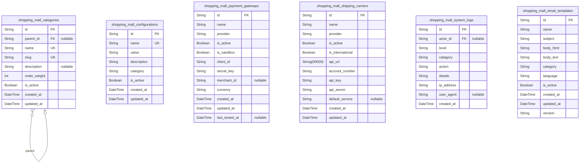
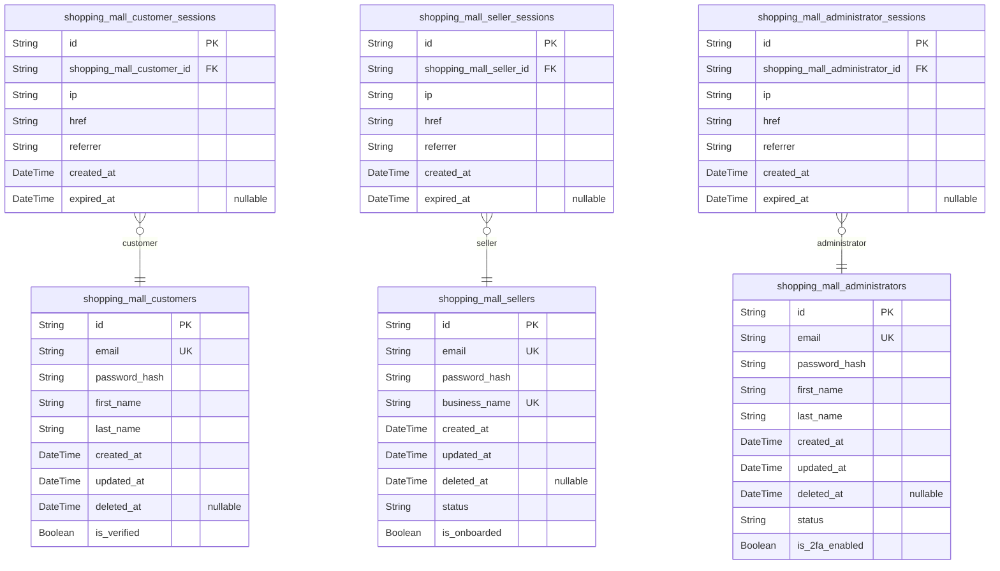
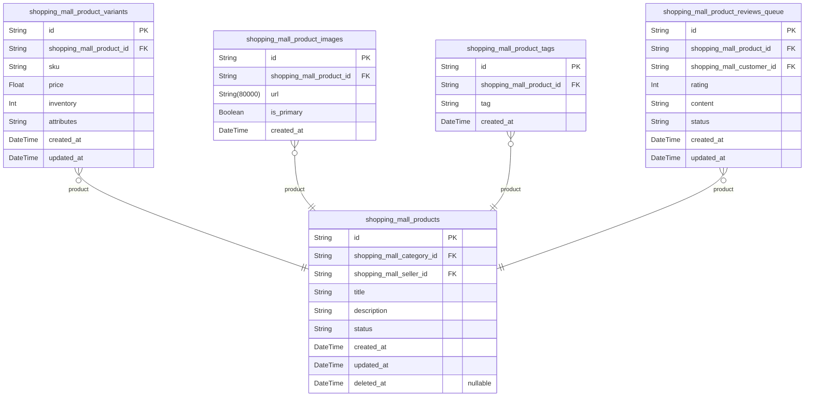
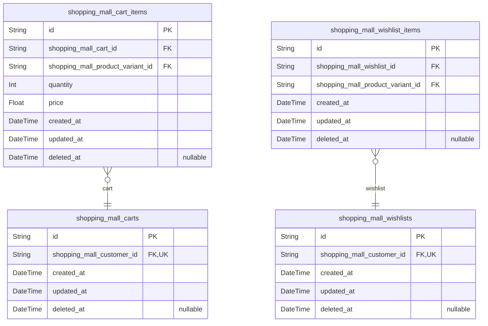
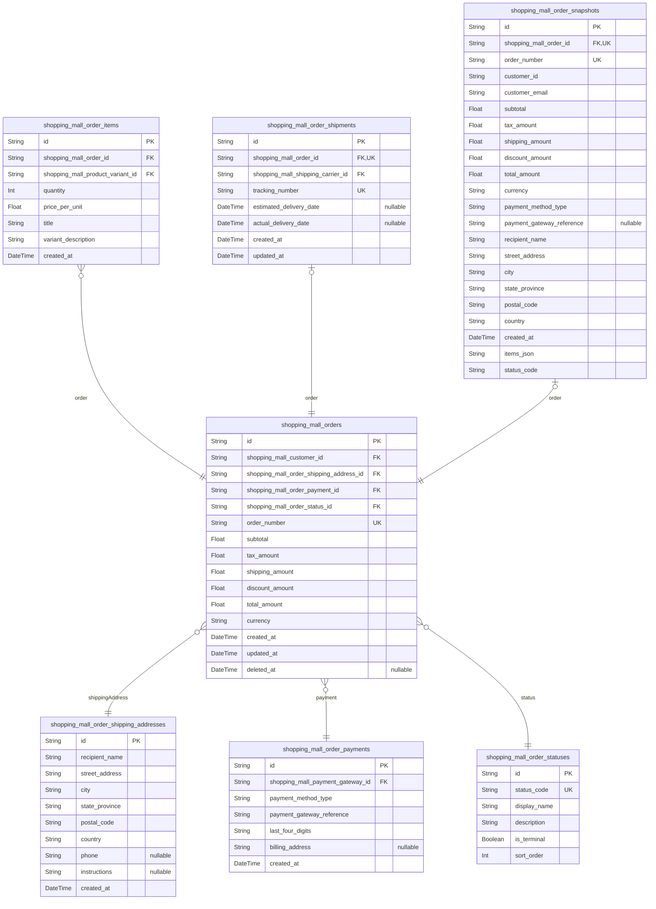
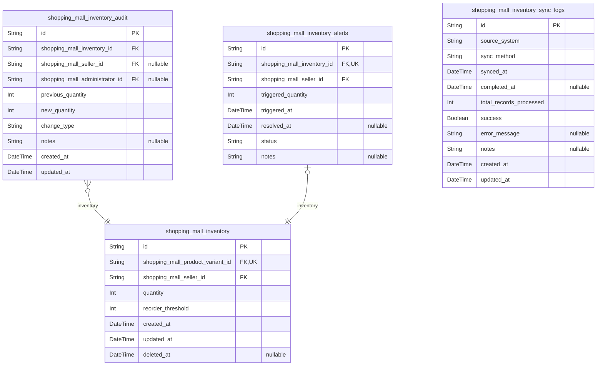
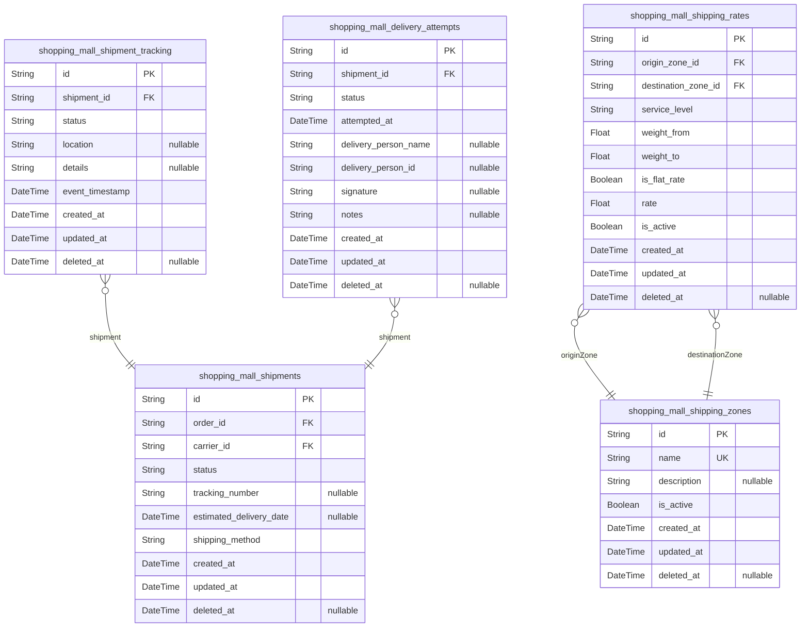
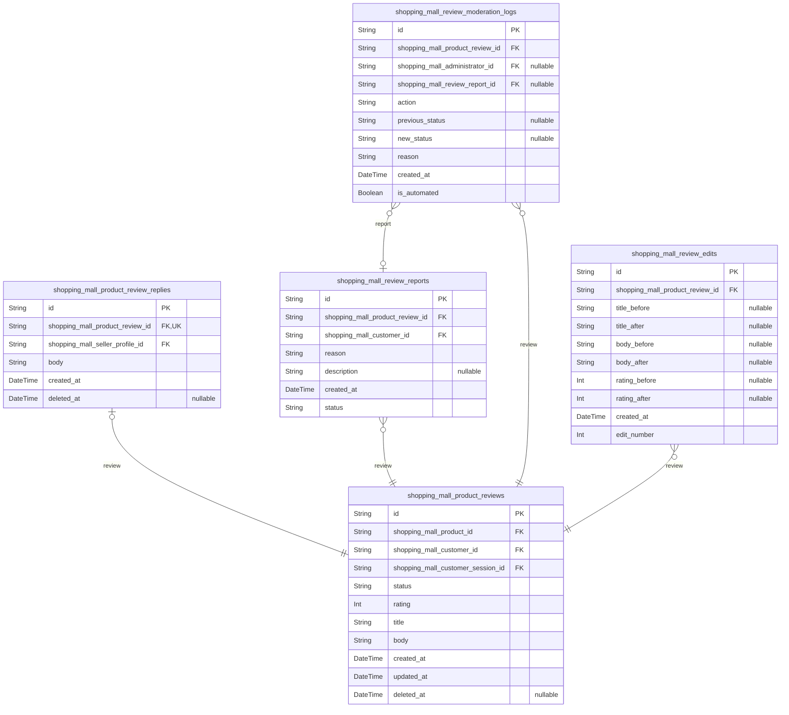
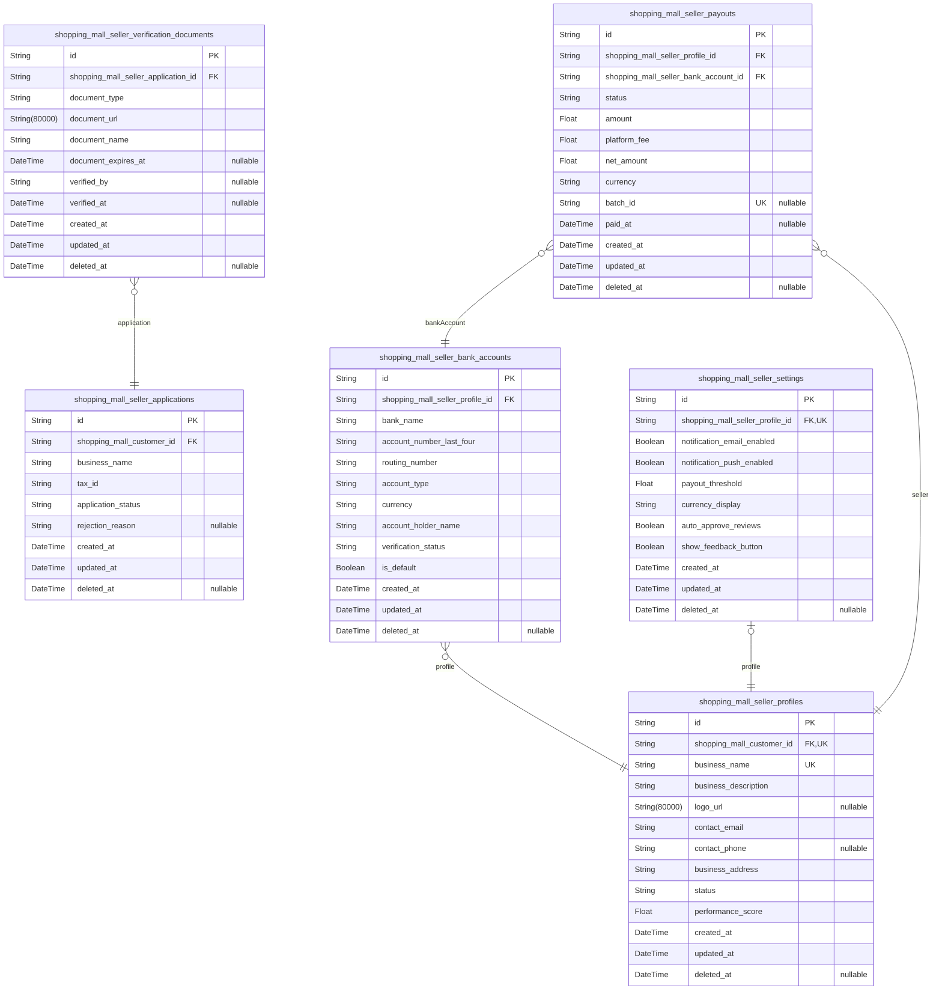
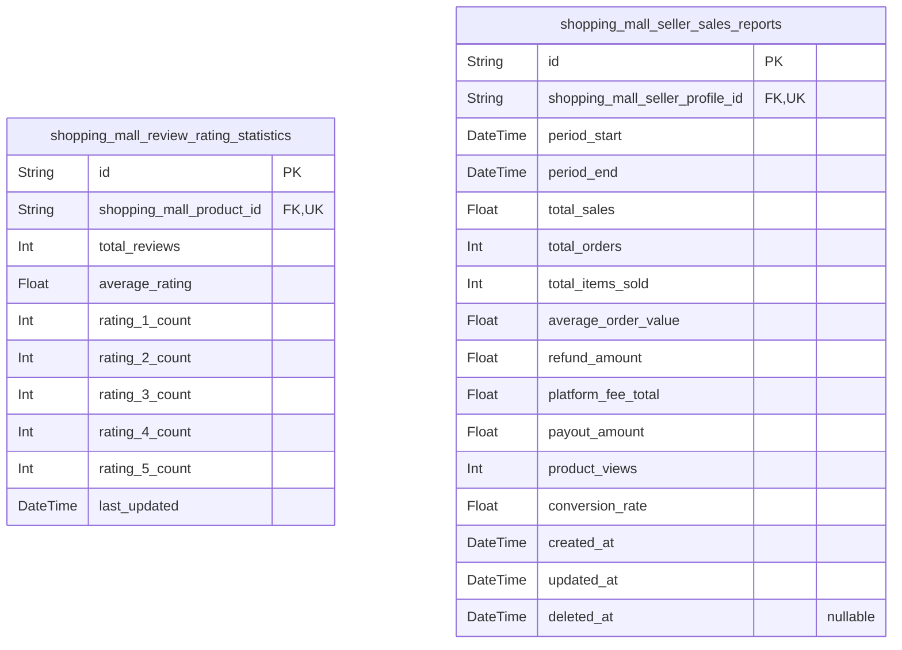

# Prisma Markdown

> Generated by [`prisma-markdown`](https://github.com/samchon/prisma-markdown)

- [Systematic](#systematic)
- [Actors](#actors)
- [Products](#products)
- [Carts](#carts)
- [Orders](#orders)
- [Inventory](#inventory)
- [Shipping](#shipping)
- [Reviews](#reviews)
- [Sellers](#sellers)
- [Admin](#admin)
- [default](#default)

## Systematic

```mermaid
erDiagram
"shopping_mall_categories" {
  String id PK
  String parent_id FK "nullable"
  String name UK
  String slug UK
  String description "nullable"
  Int order_weight
  Boolean is_active
  DateTime created_at
  DateTime updated_at
}
"shopping_mall_configurations" {
  String id PK
  String name UK
  String value
  String description
  String category
  Boolean is_active
  DateTime created_at
  DateTime updated_at
}
"shopping_mall_payment_gateways" {
  String id PK
  String name
  String provider
  Boolean is_active
  Boolean is_sandbox
  String client_id
  String secret_key
  String merchant_id "nullable"
  String currency
  DateTime created_at
  DateTime updated_at
  DateTime last_tested_at "nullable"
}
"shopping_mall_shipping_carriers" {
  String id PK
  String name
  String provider
  Boolean is_active
  Boolean is_international
  String(80000) api_url
  String account_number
  String api_key
  String api_secret
  String default_service "nullable"
  DateTime created_at
  DateTime updated_at
}
"shopping_mall_system_logs" {
  String id PK
  String actor_id FK "nullable"
  String level
  String category
  String action
  String details
  String ip_address
  String user_agent "nullable"
  DateTime created_at
}
"shopping_mall_email_templates" {
  String id PK
  String name
  String subject
  String body_html
  String body_text
  String category
  String language
  Boolean is_active
  DateTime created_at
  DateTime updated_at
  String version
}
"shopping_mall_categories" }o--o| "shopping_mall_categories" : parent
```

### `shopping_mall_categories`

Product category hierarchy for the shopping platform.

Defines the hierarchical taxonomy of product categories used for catalog
organization and navigation.
Each category can have a parent category to form a tree structure,
supporting multi-level categorization.

Categories are managed exclusively by admin users and determine how
products are grouped for display in storefront navigation.

The category tree is cached for performance, and changes to parent
categories will update all child category display paths.

This entity is referenced by shopping_mall_products to associate products
with their categorization.

Properties as follows:

- `id`: Primary Key.
- `parent_id`: Parent category in the hierarchy. [shopping_mall_categories.id](#shopping_mall_categories).
- `name`
  > The display name of the category (e.g., 'Electronics', 'Clothing'). Must
  > be unique within scope.
- `slug`
  > URL-friendly identifier for the category, generated from name. Used in
  > product URLs and SEO.
- `description`: Detailed description of the category's purpose and included products.
- `order_weight`: Determines display order in navigation menus. Lower values appear first.
- `is_active`
  > Controls whether category is visible to customers. Inactive categories
  > are hidden from storefront.
- `created_at`: Timestamp when the category was created.
- `updated_at`: Timestamp when the category was last updated.

### `shopping_mall_configurations`

System-wide configuration settings that control platform behavior.

Stores key-value pairs of runtime configuration options that affect
platform functionality.

Each configuration item is identified by a unique name and has a string
value that may represent boolean, numeric, or string configurations.

The configuration system supports dynamic updates without requiring code
deployment.

The system reads these configurations at service startup and caches them
for performance.

This is a single-point-of-truth for system settings and overrides default
values across all platform components.

Properties as follows:

- `id`: Primary Key.
- `name`
  > Unique configuration key identifier (e.g., 'payment_gateway_type',
  > 'max_cart_items'). Must be unique.
- `value`
  > The configuration value stored as string. Can represent boolean
  > ('true'/'false'), numeric ('123'), or string patterns.
- `description`
  > Human-readable explanation of what this configuration controls and
  > acceptable values.
- `category`
  > Logical grouping of related configurations (e.g., 'payments', 'shipping',
  > 'security').
- `is_active`: Whether this configuration is currently active and applied by the system.
- `created_at`: Timestamp when the configuration was created or first registered.
- `updated_at`: Timestamp when the configuration was last modified.

### `shopping_mall_payment_gateways`

Payment gateway configurations for processing transactions.

Defines the connection parameters and settings for external payment
processors (e.g., Stripe, PayPal, KakaoPay).

Each gateway instance represents a specific configuration for one payment
provider with different credentials for sandbox and production
environments.

The system routes payments to the appropriate gateway based on customer
region, currency, and configured preference.

This entity stores secure credentials (encryped) to communicate with
external payment APIs.

Multiple gateways can be configured simultaneously to provide payment
method options to customers.

Properties as follows:

- `id`: Primary Key.
- `name`
  > Display name of the payment gateway (e.g., 'Stripe', 'PayPal',
  > 'KakaoPay').
- `provider`
  > External provider system name (e.g., 'stripe', 'paypal', 'kakaopay').
  > Must match supported provider code.
- `is_active`: Whether this gateway is enabled for customer transactions.
- `is_sandbox`
  > Indicates whether this configuration uses sandbox/test mode (true) or
  > production mode (false).
- `client_id`
  > Client/public identifier provided by the payment provider. Stored
  > encrypted.
- `secret_key`
  > Secret/private key provided by the payment provider. Stored encrypted and
  > never exposed.
- `merchant_id`: Merchant account identifier assigned by the payment provider.
- `currency`
  > Primary currency supported by this gateway configuration (e.g., 'USD',
  > 'KRW').
- `created_at`: Timestamp when the gateway configuration was created.
- `updated_at`: Timestamp when the gateway configuration was last modified.
- `last_tested_at`
  > Timestamp when this gateway configuration was last successfully tested
  > for connectivity.

### `shopping_mall_shipping_carriers`

Delivery carrier configurations for order fulfillment.

Defines the connection settings for logistics providers (e.g., FedEx,
DHL, CJ Logistics) used for shipment tracking and label generation.

Each carrier record contains authentication credentials, API endpoints,
and service options for integration.

This entity enables the system to support multiple international carriers
with region-specific settings.

The carrier selection during checkout determines shipping method
availability and rate calculation.

This configuration is used by the system to generate shipping labels,
track packages, and fetch delivery statuses.

Properties as follows:

- `id`: Primary Key.
- `name`: Display name of the carrier (e.g., 'FedEx', 'DHL', 'CJ Logistics').
- `provider`
  > External provider system name (e.g., 'fedex', 'dhl', 'cjs'). Must match
  > supported provider code.
- `is_active`
  > Whether this carrier is enabled for shipping label generation and
  > tracking.
- `is_international`: Indicates whether this carrier supports international shipments.
- `api_url`: Base API endpoint URL for the carrier's services.
- `account_number`: Carrier account number assigned to the merchant. Stored encrypted.
- `api_key`: API authentication key. Stored encrypted.
- `api_secret`: API secret token. Stored encrypted.
- `default_service`
  > Default service level (e.g., 'standard', 'express', 'overnight') for this
  > carrier.
- `created_at`: Timestamp when the carrier configuration was created.
- `updated_at`: Timestamp when the carrier configuration was last modified.

### `shopping_mall_system_logs`

Audit logs of system events and administrative actions.

Records critical system events for security, debugging, and compliance
purposes.

Contains immutable records of user actions, system errors, configuration
changes, and security events.

This table is append-only and never modified or deleted after creation.

The logs are used for forensic analysis, traceability of administrative
actions, and compliance auditing.

System logs provide a full history that can be queried for
troubleshooting and investigation.

Properties as follows:

- `id`: Primary Key.
- `actor_id`
  > The user or system component that performed the action. {@link
  > shopping_mall_administrators.id} or [shopping_mall_sellers.id](#shopping_mall_sellers) or
  > [shopping_mall_customers.id](#shopping_mall_customers).
- `level`: Log severity level (error, warning, info, debug, audit).
- `category`: Category of the event (e.g., 'auth', 'payment', 'inventory', 'config').
- `action`
  > Specific action performed (e.g., 'login', 'update_config',
  > 'process_refund').
- `details`
  > JSON string containing detailed context of the event, including
  > parameters and object states.
- `ip_address`: Source IP address of the request that triggered this log entry.
- `user_agent`: User agent string from the client making the request.
- `created_at`: Timestamp when the event was logged. Immutable after creation.

### `shopping_mall_email_templates`

Pre-defined email templates for system-generated communications.

Stores the content structure for automated emails sent to customers,
sellers, and administrators.

Each template includes subject line, HTML body, and plain text version,
with placeholders for dynamic content.

Template fields are parsed at send time to substitute values like
{{customer_name}}, {{order_id}}, {{delivery_date}}.

This allows easy modification of email content without code changes and
supports multiple languages.

Templates are versioned and can be previewed and tested by admins before
deployment.

Properties as follows:

- `id`: Primary Key.
- `name`
  > Unique identifier for the template (e.g., 'order_confirmation',
  > 'password_reset').
- `subject`: Email subject line with optional placeholders like {{customer_name}}.
- `body_html`
  > HTML content of the email, with placeholders for dynamic content like
  > {{order_id}} or {{total_amount}}.
- `body_text`
  > Plain text version of the email content for clients that don't support
  > HTML.
- `category`
  > Logical category of the email (e.g., 'transactional', 'marketing',
  > 'notification').
- `language`: Language code this template is written in (e.g., 'en', 'ko').
- `is_active`: Whether this template version is currently active and used by the system.
- `created_at`: Timestamp when this template version was created.
- `updated_at`: Timestamp when this template version was last modified.
- `version`
  > Version identifier for template editing and rollback purposes (e.g.,
  > 'v1.2').

## Actors

```mermaid
erDiagram
"shopping_mall_customers" {
  String id PK
  String email UK
  String password_hash
  String first_name
  String last_name
  DateTime created_at
  DateTime updated_at
  DateTime deleted_at "nullable"
  Boolean is_verified
}
"shopping_mall_customer_sessions" {
  String id PK
  String shopping_mall_customer_id FK
  String ip
  String href
  String referrer
  DateTime created_at
  DateTime expired_at "nullable"
}
"shopping_mall_sellers" {
  String id PK
  String email UK
  String password_hash
  String business_name UK
  DateTime created_at
  DateTime updated_at
  DateTime deleted_at "nullable"
  String status
  Boolean is_onboarded
}
"shopping_mall_seller_sessions" {
  String id PK
  String shopping_mall_seller_id FK
  String ip
  String href
  String referrer
  DateTime created_at
  DateTime expired_at "nullable"
}
"shopping_mall_administrators" {
  String id PK
  String email UK
  String password_hash
  String first_name
  String last_name
  DateTime created_at
  DateTime updated_at
  DateTime deleted_at "nullable"
  String status
  Boolean is_2fa_enabled
}
"shopping_mall_administrator_sessions" {
  String id PK
  String shopping_mall_administrator_id FK
  String ip
  String href
  String referrer
  DateTime created_at
  DateTime expired_at "nullable"
}
"shopping_mall_customer_sessions" }o--|| "shopping_mall_customers" : customer
"shopping_mall_seller_sessions" }o--|| "shopping_mall_sellers" : seller
"shopping_mall_administrator_sessions" }o--|| "shopping_mall_administrators" : administrator
```

### `shopping_mall_customers`

Primary customer identity and authentication entity.

Stores core identity information for customers who interact with the
shopping mall platform. This entity represents a registered user who can
browse products, create wishlists, add items to cart, and place orders.
Customers must authenticate with email and password to access protected
features.

Relationships:
- Each customer can have multiple sessions documented in
shopping_mall_customer_sessions
- Each customer can have multiple carts in shopping_mall_carts
- Each customer can have multiple wishlists in shopping_mall_wishlists
- Each customer can have multiple orders in shopping_mall_orders
- Each customer can have multiple reviews in shopping_mall_product_reviews

Soft deletion is supported to maintain audit compliance while allowing
account deactivation.

Properties as follows:

- `id`: Primary Key.
- `email`
  > Unique email address used for authentication and communication. Required
  > for login.
- `password_hash`
  > BCrypt-hashed password for authentication. Never stored in plaintext.
  > Required for login functionality.
- `first_name`: Customer's first name for personalization and communication.
- `last_name`: Customer's last name for personalization and communication.
- `created_at`: Timestamp when the customer account was created.
- `updated_at`: Timestamp when the customer account was last updated.
- `deleted_at`
  > Timestamp when the customer account was soft-deleted, or null if active.
  > Used for compliance and reversibility.
- `is_verified`
  > Indicates whether the customer has verified their email address. Required
  > to access shopping and order functions.

### `shopping_mall_customer_sessions`

Customer authentication session tracking table.

Tracks active and expired sessions for customer authentication. Each
customer can have multiple concurrent sessions across devices. Sessions
are used to maintain authenticated state across requests and track login
activity for security auditing.

This table follows the mandatory session pattern: no additional fields
allowed beyond specification.

Relationships:
- Each session belongs to exactly one customer via
shopping_mall_customers.id
- Each session has a single customer context for identity linkage

Session lives from creation to expiration or manual logout.

This table is not independently managed by users but is maintained by the
authentication system.

Properties as follows:

- `id`: Primary Key.
- `shopping_mall_customer_id`
  > Reference to the customer who owns this session. {@link
  > shopping_mall_customers.id}.
- `ip`: IP address from which the session was created.
- `href`: Full URL of the page from which the login request originated.
- `referrer`: Source URL that referred the user to the login page.
- `created_at`: Timestamp when the session was created.
- `expired_at`: Timestamp when the session expires; null if still active.

### `shopping_mall_sellers`

Primary seller identity and business authentication entity.

Represents a business or individual who lists and sells products on the
shopping mall platform. Sellers must complete an approval process before
being granted selling privileges.

Relationships:
- Each seller can have multiple sessions in shopping_mall_seller_sessions
- Each seller can have multiple products in shopping_mall_products
- Each seller can have multiple product reviews in
shopping_mall_product_reviews
- Each seller can have multiple orders in shopping_mall_orders
- Each seller can have multiple payouts in shopping_mall_seller_payouts

Soft deletion is supported, and status tracking manages the onboarding
workflow (pending, approved, rejected, suspended).

Properties as follows:

- `id`: Primary Key.
- `email`: Unique business email address used for authentication and communication.
- `password_hash`: BCrypt-hashed password for authentication. Never stored in plaintext.
- `business_name`: Legal name of the business or seller.
- `created_at`: Timestamp when the seller account was created.
- `updated_at`: Timestamp when the seller account was last updated.
- `deleted_at`: Timestamp when the seller account was soft-deleted, or null if active.
- `status`
  > Status of the seller account: 'pending_approval', 'approved', 'rejected',
  > 'suspended'. Controls access to selling features.
- `is_onboarded`
  > Indicates whether seller has completed bank account setup and
  > verification. Required before listing products.

### `shopping_mall_seller_sessions`

Seller authentication session tracking table.

Tracks active and expired sessions for seller authentication. Each seller
can have multiple concurrent sessions across devices for managing their
storefront.

This table follows the mandatory session pattern: no additional fields
allowed beyond specification.

Relationships:
- Each session belongs to exactly one seller via shopping_mall_sellers.id

Session lives from creation to expiration or manual logout.

This table is not independently managed by users but is maintained by the
authentication system.

Properties as follows:

- `id`: Primary Key.
- `shopping_mall_seller_id`
  > Reference to the seller who owns this session. {@link
  > shopping_mall_sellers.id}.
- `ip`: IP address from which the session was created.
- `href`: Full URL of the page from which the login request originated.
- `referrer`: Source URL that referred the user to the login page.
- `created_at`: Timestamp when the session was created.
- `expired_at`: Timestamp when the session expires; null if still active.

### `shopping_mall_administrators`

Primary administrative identity entity with elevated permissions.

Represents platform administrators with system-wide management
permissions including user management, product moderation, seller
approval, and refund handling. These accounts require enhanced security
controls including 2FA and audit logging.

Relationships:
- Each admin can have multiple sessions in
shopping_mall_administrator_sessions
- Each admin can perform multiple actions logged in
shopping_mall_admin_actions
- Each admin can resolve disputes logged in
shopping_mall_admin_dispute_resolutions

Soft deletion is supported to maintain audit trail while allowing account
deactivation.

Properties as follows:

- `id`: Primary Key.
- `email`
  > Unique administration email address used for authentication and
  > communication.
- `password_hash`: BCrypt-hashed password for authentication. Never stored in plaintext.
- `first_name`: Administrator's first name for identification and communication.
- `last_name`: Administrator's last name for identification and communication.
- `created_at`: Timestamp when the admin account was created.
- `updated_at`: Timestamp when the admin account was last updated.
- `deleted_at`: Timestamp when the admin account was soft-deleted, or null if active.
- `status`
  > Status of the admin account: 'active', 'suspended', 'disabled'. Controls
  > system access.
- `is_2fa_enabled`
  > Indicates whether two-factor authentication is enabled for this admin
  > account, mandatory for security.

### `shopping_mall_administrator_sessions`

Administrator authentication session tracking table.

Tracks active and expired sessions for admin authentication. Admins
require higher security standards and can have multiple concurrent
sessions for system management.

This table follows the mandatory session pattern: no additional fields
allowed beyond specification.

Relationships:
- Each session belongs to exactly one admin via
shopping_mall_administrators.id

Session lives from creation to expiration or manual logout.

This table is not independently managed by users but is maintained by the
authentication system.

Properties as follows:

- `id`: Primary Key.
- `shopping_mall_administrator_id`
  > Reference to the administrator who owns this session. {@link
  > shopping_mall_administrators.id}.
- `ip`: IP address from which the session was created.
- `href`: Full URL of the page from which the login request originated.
- `referrer`: Source URL that referred the user to the login page.
- `created_at`: Timestamp when the session was created.
- `expired_at`: Timestamp when the session expires; null if still active.

## Products

```mermaid
erDiagram
"shopping_mall_products" {
  String id PK
  String shopping_mall_category_id FK
  String shopping_mall_seller_id FK
  String title
  String description
  String status
  DateTime created_at
  DateTime updated_at
  DateTime deleted_at "nullable"
}
"shopping_mall_product_variants" {
  String id PK
  String shopping_mall_product_id FK
  String sku
  Float price
  Int inventory
  String attributes
  DateTime created_at
  DateTime updated_at
}
"shopping_mall_product_images" {
  String id PK
  String shopping_mall_product_id FK
  String(80000) url
  Boolean is_primary
  DateTime created_at
}
"shopping_mall_product_tags" {
  String id PK
  String shopping_mall_product_id FK
  String tag
  DateTime created_at
}
"shopping_mall_product_reviews_queue" {
  String id PK
  String shopping_mall_product_id FK
  String shopping_mall_customer_id FK
  Int rating
  String content
  String status
  DateTime created_at
  DateTime updated_at
}
"shopping_mall_product_variants" }o--|| "shopping_mall_products" : product
"shopping_mall_product_images" }o--|| "shopping_mall_products" : product
"shopping_mall_product_tags" }o--|| "shopping_mall_products" : product
"shopping_mall_product_reviews_queue" }o--|| "shopping_mall_products" : product
```

### `shopping_mall_products`

Core product listings in the shopping mall catalog.

Represents the main product offering with shared attributes like title,
description, and category. Each product can have multiple variants with
different pricing and inventory. Products have lifecycle states: draft,
active, and inactive.

Products are directly searchable and browsable by customers through
category navigation and global search. Sellers create and manage products
in their dashboards with status controls. Products remain in the system
even when inactive or deleted to preserve historical order data for
reporting and compliance.

Properties as follows:

- `id`: Primary Key.
- `shopping_mall_category_id`: Category this product belongs to. [shopping_mall_categories.id](#shopping_mall_categories).
- `shopping_mall_seller_id`
  > Seller who created and manages this product. {@link
  > shopping_mall_sellers.id}.
- `title`
  > Product title displayed in listings and search results. Must be 3-200
  > characters.
- `description`
  > Detailed product description explaining features, specifications, and
  > usage. Must be 10-5000 characters.
- `status`
  > Product lifecycle state: draft, active, inactive. Controls visibility to
  > customers. Only active products are searchable.
- `created_at`: Timestamp when product was created.
- `updated_at`
  > Timestamp of last product update, including status changes or metadata
  > edits.
- `deleted_at`
  > Soft delete timestamp. When set, product becomes archived and invisible
  > to customers. Historical order data preserved.

### `shopping_mall_product_variants`

Specific configurations of a product with individual pricing and inventory.

Each variant represents a unique combination of attributes like color,
size, or material. Variants inherit core attributes of the parent product
but have unique SKU, price, and stock quantity. Linked directly to a
product and cannot exist independently.

Variants are not directly searchable by customers — they appear as
selectable options on the product detail page. Inventory is tracked per
variant, allowing accurate stock allocation during cart addition and
checkout operations.

Properties as follows:

- `id`: Primary Key.
- `shopping_mall_product_id`
  > The parent product this variant belongs to. {@link
  > shopping_mall_products.id}.
- `sku`
  > Unique Stock Keeping Unit identifier in format
  > {CATEGORYCODE}-{COLOR}-{SIZE}-{SEQ}. Auto-generated during creation.
- `price`: Retail price of this variant in USD. Must be between $0.01 and $9,999.99.
- `inventory`
  > Current available inventory quantity for this variant. Updated
  > automatically on order confirmation and returns.
- `attributes`
  > JSON string containing key-value pairs of variant attributes (e.g.,
  > {\"color\": \"red\", \"size\": \"L\"}). Used for frontend display and
  > filtering.
- `created_at`: Timestamp when this variant was created.
- `updated_at`: Timestamp of last update to price, inventory, or attributes.

### `shopping_mall_product_images`

Product images attached to specific products for visual display.

Each image is associated with a product and stores reference to the image
file URL. Used to enhance product detail pages and search listings.
Multiple images per product are allowed.

Images are not standalone entities — they are always managed through
their parent product's API. Used for store presentation, but do not
require independent addressability or search.

Properties as follows:

- `id`: Primary Key.
- `shopping_mall_product_id`: The product this image belongs to. [shopping_mall_products.id](#shopping_mall_products).
- `url`
  > Full URL to the image file. Must be a valid web-accessible URI
  > (HTTP/HTTPS).
- `is_primary`
  > True if this image should be used as the main product thumbnail. Only one
  > image per product can be primary.
- `created_at`: Timestamp when this image was uploaded.

### `shopping_mall_product_tags`

Tags assigned to products for categorization, filtering, and search
optimization.

Associates descriptive keywords or categories to products (e.g.,
"on-sale", "eco-friendly", "best-seller"). Helps improve discoverability
and supports customer filtering criteria.

Each tag is bound to a single product and can be reused across multiple
products. Tags are managed through product edit interfaces and do not
require dedicated API endpoints.

Properties as follows:

- `id`: Primary Key.
- `shopping_mall_product_id`: The product this tag belongs to. [shopping_mall_products.id](#shopping_mall_products).
- `tag`
  > The text value of the tag. Must be 1-50 characters, alphanumeric and
  > hyphen/underscore only.
- `created_at`: Timestamp when this tag was added to the product.

### `shopping_mall_product_reviews_queue`

Queue for pending product reviews awaiting admin moderation.

Contains customer-submitted reviews that require manual review before
being published. Used to enforce community guidelines, filter spam, and
prevent inappropriate content from appearing publicly.

Reviews in the queue are not visible to customers. This table is the
interface for admin moderation workflows and must support independent
search, filtering, and approval/rejection operations by administrators.
It is a system-managed administrative table and not directly accessible
or creatable by customers. All entries are populated automatically by
customer review submission system with status pending, and only admins
can change the status to approved or rejected.

Properties as follows:

- `id`: Primary Key.
- `shopping_mall_product_id`: Product being reviewed. [shopping_mall_products.id](#shopping_mall_products).
- `shopping_mall_customer_id`: Customer who submitted the review. [shopping_mall_customers.id](#shopping_mall_customers).
- `rating`: Star rating from 1 to 5 submitted by customer.
- `content`
  > Text content of the review, limited to 1000 characters. May contain
  > profanity or spam requiring moderation.
- `status`
  > Moderation status: pending, approved, rejected. Only reviews with status
  > 'approved' are published to the product.
- `created_at`: Timestamp when the customer submitted the review.
- `updated_at`: Timestamp when the review status was last updated by an admin.

## Carts

```mermaid
erDiagram
"shopping_mall_carts" {
  String id PK
  String shopping_mall_customer_id FK,UK
  DateTime created_at
  DateTime updated_at
  DateTime deleted_at "nullable"
}
"shopping_mall_cart_items" {
  String id PK
  String shopping_mall_cart_id FK
  String shopping_mall_product_variant_id FK
  Int quantity
  Float price
  DateTime created_at
  DateTime updated_at
  DateTime deleted_at "nullable"
}
"shopping_mall_wishlists" {
  String id PK
  String shopping_mall_customer_id FK,UK
  DateTime created_at
  DateTime updated_at
  DateTime deleted_at "nullable"
}
"shopping_mall_wishlist_items" {
  String id PK
  String shopping_mall_wishlist_id FK
  String shopping_mall_product_variant_id FK
  DateTime created_at
  DateTime updated_at
  DateTime deleted_at "nullable"
}
"shopping_mall_cart_items" }o--|| "shopping_mall_carts" : cart
"shopping_mall_wishlist_items" }o--|| "shopping_mall_wishlists" : wishlist
```

### `shopping_mall_carts`

Primary shopping cart container for each customer.

Represents the user's active shopping cart that holds multiple cart items
before checkout.
Each cart is associated with exactly one customer and contains a
collection of cart items with product variants, quantities, and prices at
the time they were added.

Carts remain active until the user checks out or explicitly empties their
cart. Cart items can be added, removed, or have their quantities
modified. The cart itself does not store product prices directly but
references cart_items which capture the price snapshot at addition time.

Carts are retained for active sessions and can be restored across devices
via authenticated sessions. When a cart is checked out, its items are
moved to order_items and the cart is cleared but not deleted.

Soft delete capability allows users to restore accidentally deleted carts
within a limited time window for customer experience purposes.

Properties as follows:

- `id`: Primary Key.
- `shopping_mall_customer_id`: Customer's primary key. [shopping_mall_customers.id](#shopping_mall_customers).
- `created_at`: Timestamp when the shopping cart was created.
- `updated_at`: Timestamp when the shopping cart was last modified (items added/removed).
- `deleted_at`
  > Soft delete timestamp. If null, cart is active. If set, cart is marked
  > for deletion but record preserved for audit.

### `shopping_mall_cart_items`

Individual items within a customer's shopping cart with price snapshot.

Represents a specific product variant added to a shopping cart with its
quantity and price as it was at the time of addition.

Each cart item is linked to a specific shopping_mall_carts record and a
shopping_mall_product_variants record. The price is stored as a snapshot
to ensure the customer pays the correct price even if the product's price
changes later.

This table follows the snapshot pattern to record state at time of cart
addition, preserving historical pricing and variant details for accurate
billing and audit trails.

Cart items can be removed from the cart (soft delete) but are retained in
the database for order history and return purposes. Quantity can be
modified while the item remains in the cart, but the price snapshot is
immutable once item is added.

The combination of cart_id and product_variant_id must be unique to
prevent duplicate items in the same cart.

Properties as follows:

- `id`: Primary Key.
- `shopping_mall_cart_id`: Shopping cart that contains this item. [shopping_mall_carts.id](#shopping_mall_carts).
- `shopping_mall_product_variant_id`
  > Product variant that was added to cart. {@link
  > shopping_mall_product_variants.id}.
- `quantity`: Number of units of this variant added to the cart. Must be at least 1.
- `price`
  > Unit price of the product variant at the time it was added to the cart.
  > This is a snapshot value to preserve pricing accuracy for billing, even
  > if the product price changes later.
- `created_at`: Timestamp when this cart item was added to the cart.
- `updated_at`: Timestamp when this cart item's quantity was last modified.
- `deleted_at`
  > Soft delete timestamp. If null, item is in cart. If set, item has been
  > removed from cart but record preserved for audit and order history.

### `shopping_mall_wishlists`

Primary wishlist container for each customer.

Represents the user's personal list of products they are interested in
purchasing in the future.

Each wishlist is associated with exactly one customer and contains a
collection of wishlist items with product variants.

Wishlists remain active indefinitely unless the user explicitly deletes
them. Items in the wishlist do not imply intent to purchase but indicate
interest for future consideration.

Wishlists can be shared with others in some contexts (as per business
policy, not implemented in this schema) but are primarily private to the
user. Users can move items between wishlist and cart.

Soft delete capability allows users to restore accidentally deleted
wishlists within a limited time window for customer experience purposes.

Properties as follows:

- `id`: Primary Key.
- `shopping_mall_customer_id`: Customer's primary key. [shopping_mall_customers.id](#shopping_mall_customers).
- `created_at`: Timestamp when the wishlist was created.
- `updated_at`: Timestamp when the wishlist was last modified (items added/removed).
- `deleted_at`
  > Soft delete timestamp. If null, wishlist is active. If set, wishlist is
  > marked for deletion but record preserved for audit.

### `shopping_mall_wishlist_items`

Individual items within a customer's wishlist.

Represents a specific product variant added to a wishlist with its
timestamp.

Each wishlist item is linked to a specific shopping_mall_wishlists record
and a shopping_mall_product_variants record.

This table follows a snapshot pattern to record the variant state at time
of addition for consistency in gift suggestions and future purchase
intent tracking.

Wishlist items can be removed from the wishlist (soft delete) but are
retained in the database for audit trails and to support "restored from
wishlist" functionality.

Unlike cart items, wishlist items do not store price information since
they don't represent immediate purchase intent. The price is always read
from the current product variant when the wishlist item is viewed.

The combination of wishlist_id and product_variant_id must be unique to
prevent duplicate items in the same wishlist.

Properties as follows:

- `id`: Primary Key.
- `shopping_mall_wishlist_id`: Wishlist that contains this item. [shopping_mall_wishlists.id](#shopping_mall_wishlists).
- `shopping_mall_product_variant_id`
  > Product variant that was added to wishlist. {@link
  > shopping_mall_product_variants.id}.
- `created_at`: Timestamp when this wishlist item was added to the wishlist.
- `updated_at`: Timestamp when this wishlist item was last modified (reordered or moved).
- `deleted_at`
  > Soft delete timestamp. If null, item is in wishlist. If set, item has
  > been removed from wishlist but record preserved for audit and recovery.

## Orders

```mermaid
erDiagram
"shopping_mall_orders" {
  String id PK
  String shopping_mall_customer_id FK
  String shopping_mall_order_shipping_address_id FK
  String shopping_mall_order_payment_id FK
  String shopping_mall_order_status_id FK
  String order_number UK
  Float subtotal
  Float tax_amount
  Float shipping_amount
  Float discount_amount
  Float total_amount
  String currency
  DateTime created_at
  DateTime updated_at
  DateTime deleted_at "nullable"
}
"shopping_mall_order_items" {
  String id PK
  String shopping_mall_order_id FK
  String shopping_mall_product_variant_id FK
  Int quantity
  Float price_per_unit
  String title
  String variant_description
  DateTime created_at
}
"shopping_mall_order_payments" {
  String id PK
  String shopping_mall_payment_gateway_id FK
  String payment_method_type
  String payment_gateway_reference
  String last_four_digits
  String billing_address "nullable"
  DateTime created_at
}
"shopping_mall_order_shipping_addresses" {
  String id PK
  String recipient_name
  String street_address
  String city
  String state_province
  String postal_code
  String country
  String phone "nullable"
  String instructions "nullable"
  DateTime created_at
}
"shopping_mall_order_shipments" {
  String id PK
  String shopping_mall_order_id FK,UK
  String shopping_mall_shipping_carrier_id FK
  String tracking_number UK
  DateTime estimated_delivery_date "nullable"
  DateTime actual_delivery_date "nullable"
  DateTime created_at
  DateTime updated_at
}
"shopping_mall_order_statuses" {
  String id PK
  String status_code UK
  String display_name
  String description
  Boolean is_terminal
  Int sort_order
}
"shopping_mall_order_snapshots" {
  String id PK
  String shopping_mall_order_id FK,UK
  String order_number UK
  String customer_id
  String customer_email
  Float subtotal
  Float tax_amount
  Float shipping_amount
  Float discount_amount
  Float total_amount
  String currency
  String payment_method_type
  String payment_gateway_reference "nullable"
  String recipient_name
  String street_address
  String city
  String state_province
  String postal_code
  String country
  DateTime created_at
  String items_json
  String status_code
}
"shopping_mall_orders" }o--|| "shopping_mall_order_shipping_addresses" : shippingAddress
"shopping_mall_orders" }o--|| "shopping_mall_order_payments" : payment
"shopping_mall_orders" }o--|| "shopping_mall_order_statuses" : status
"shopping_mall_order_items" }o--|| "shopping_mall_orders" : order
"shopping_mall_order_shipments" |o--|| "shopping_mall_orders" : order
"shopping_mall_order_snapshots" |o--|| "shopping_mall_orders" : order
```

### `shopping_mall_orders`

Core order record representing a customer's purchase transaction.

Each order captures the state of a customer's purchase at the moment of
confirmation, referencing the customer, shipping address, payment
details, and order items. The order total, tax, shipping, and discount
values are snapshotted to ensure financial integrity even if product
prices or fees change later.

Orders transition through multiple statuses (pending_payment, confirmed,
shipped, delivered, canceled, refunded) as part of the fulfillment
workflow. Once an order is confirmed, all associated data becomes
immutable except for status updates.

The order record serves as the central anchor for all subsequent
operations including fulfillment, returns, disputes, and reporting.
Reference to customer_id links to the shopping_mall_customers table for
customer identity, while references to other entities provide contextual
data for business operations.

Properties as follows:

- `id`: Primary Key.
- `shopping_mall_customer_id`: Customer who placed this order. [shopping_mall_customers.id](#shopping_mall_customers).
- `shopping_mall_order_shipping_address_id`
  > Shipping address used for this order. {@link
  > shopping_mall_order_shipping_addresses.id}.
- `shopping_mall_order_payment_id`
  > Payment detail record for this order. {@link
  > shopping_mall_order_payments.id}.
- `shopping_mall_order_status_id`: Current status of this order. [shopping_mall_order_statuses.id](#shopping_mall_order_statuses).
- `order_number`
  > Unique sequential order identifier generated at time of purchase. Format:
  > ORD-YYYYMMDD-XXXXX.
- `subtotal`
  > Sum of all order items' prices at time of purchase (before tax and
  > shipping).
- `tax_amount`
  > Tax amount calculated and locked at time of purchase based on shipping
  > address and product types.
- `shipping_amount`: Shipping cost locked at checkout based on selected method and destination.
- `discount_amount`
  > Total discount value applied at time of purchase, including promo codes
  > and loyalty discounts.
- `total_amount`
  > Final order total locked at checkout (subtotal + tax + shipping -
  > discount).
- `currency`
  > Currency code used for this transaction (e.g., USD, KRW, EUR). Matches
  > the customer's region.
- `created_at`: Timestamp when this order was created.
- `updated_at`: Timestamp when this order was last updated.
- `deleted_at`
  > Timestamp when this order was soft-deleted (e.g., via cancellation
  > request or admin action). Nullable for active orders.

### `shopping_mall_order_items`

Individual line items within an order, capturing product details at time
of purchase.

Each order item represents one product variant purchased in an order,
with specific pricing and quantity locked at checkout. This table ensures
the transaction record remains accurate even if the underlying product
variant's price or availability changes later.

The item references the shopping_mall_product_variants table to identify
the specific product variant, but all pricing data is stored directly in
this table to maintain historical integrity. Inventory reduction occurs
through payment confirmation, and these items are not connected to cart
items which represent intent rather than commitment.

Order items are managed exclusively through their parent
shopping_mall_orders table and do not have direct user interaction
outside the context of an order.

Properties as follows:

- `id`: Primary Key.
- `shopping_mall_order_id`: Order that this item belongs to. [shopping_mall_orders.id](#shopping_mall_orders).
- `shopping_mall_product_variant_id`: Product variant purchased. [shopping_mall_product_variants.id](#shopping_mall_product_variants).
- `quantity`: Number of units of this variant purchased. Must be positive integer.
- `price_per_unit`
  > Price of this variant at time of purchase, including any variant-specific
  > adjustments.
- `title`
  > Product title as it appeared at time of purchase, for historical
  > reference.
- `variant_description`
  > Variant-specific attributes (e.g., color, size) as they appeared at time
  > of purchase, for historical reference.
- `created_at`: Timestamp when this order item was created.

### `shopping_mall_order_payments`

Payment details captured at time of checkout for financial record and
dispute resolution.

This table stores the payment method type and reference identifiers
(e.g., payment gateway token) but never stores sensitive card data.
Payment information is snapshotted to ensure accurate reconciliation even
if payment methods are modified or removed from customer profiles later.

The actual payment processing occurs through a third-party gateway, and
this table records only the reference information needed for audit,
refund processing, and customer communication.

Payment details are managed exclusively through the parent
shopping_mall_orders table and are not directly manipulated by users.

Properties as follows:

- `id`: Primary Key.
- `shopping_mall_payment_gateway_id`
  > Payment gateway used for this transaction. {@link
  > shopping_mall_payment_gateways.id}.
- `payment_method_type`
  > Type of payment method used: 'credit_card', 'digital_wallet',
  > 'bank_transfer'.
- `payment_gateway_reference`
  > Token or identifier returned by payment gateway (e.g., payment_intent_id,
  > transaction_id). Never stores full card numbers.
- `last_four_digits`
  > Last four digits of the payment method for customer reference (e.g., 4242
  > for a credit card).
- `billing_address`
  > Billing address as provided during checkout, stored for reconciliation
  > purposes.
- `created_at`: Timestamp when this payment record was created.

### `shopping_mall_order_shipping_addresses`

Immutable snapshot of the shipping address at time of purchase for
accurate fulfillment completion.

Unlike customer profile addresses, this table captures the exact address
information as provided during checkout, including any manual
corrections. This ensures fulfillment is never affected by subsequent
changes to a customer's default address.

The address fields are stored as plain text strings since they represent
a single point-in-time snapshot, not a linked relational entity. This
table has no direct user interaction beyond the checkout process and is
always managed as part of an order record.

Properties as follows:

- `id`: Primary Key.
- `recipient_name`: Full name of the person receiving the package.
- `street_address`: Full street address including building number and unit, if applicable.
- `city`: City or town name where delivery is being made.
- `state_province`: State, province, or region name (e.g., California, Seoul, Ontario).
- `postal_code`: Postal code or zip code for the delivery location.
- `country`: Country name (e.g., South Korea, United States) in full form for clarity.
- `phone`: Phone number for courier delivery attempts or delivery coordination.
- `instructions`
  > Special delivery instructions provided by customer (e.g., "Leave at back
  > door").
- `created_at`: Timestamp when this shipping address snapshot was created.

### `shopping_mall_order_shipments`

Tracking information for physically shipped orders, linked to carrier
services.

This table captures the carrier and tracking details when a seller marks
an order as shipped. The tracking number and carrier name allow customers
and support teams to monitor delivery progress through external logistics
systems.

Shipment records are generated only once the order status transitions to
"shipped" and are solely managed by the system in response to seller
actions, not directly by customers.

Properties as follows:

- `id`: Primary Key.
- `shopping_mall_order_id`: Order being shipped. [shopping_mall_orders.id](#shopping_mall_orders).
- `shopping_mall_shipping_carrier_id`
  > Logistics provider handling this shipment. {@link
  > shopping_mall_shipping_carriers.id}.
- `tracking_number`
  > Carrier-specific tracking number assigned to this shipment. Format
  > depends on carrier (e.g., 1Z999AA12345678908).
- `estimated_delivery_date`
  > Estimated arrival date provided by the carrier at time of shipment
  > generation.
- `actual_delivery_date`
  > Actual date when carrier confirmed delivery (auto-filled via webhook or
  > manual update).
- `created_at`: Timestamp when this shipment record was created.
- `updated_at`
  > Timestamp when this shipment record was last updated (e.g., tracking
  > status change).

### `shopping_mall_order_statuses`

Reference table defining the valid status codes for order lifecycle
management.

This table contains the authoritative list of all possible statuses an
order can have throughout its lifecycle, allowing consistent status
transitions and business rule enforcement. Each status has a code and
description used across the system for display, logic, and reporting.

This is a lookup table that is referenced by shopping_mall_orders but
does not contain data directly manipulated by users. Its content is
maintained by platform administrators and is used to enforce valid status
transitions in business workflows.

Properties as follows:

- `id`: Primary Key.
- `status_code`
  > Unique identifier for the status (e.g., 'pending_payment', 'confirmed',
  > 'shipped', 'delivered', 'canceled', 'refunded'). Lowercase with
  > underlines.
- `display_name`
  > Human-readable name of the status shown to users (e.g., "Pending
  > Payment", "Order Confirmed").
- `description`
  > Detailed description explaining the status meaning and typical use case
  > in the order lifecycle.
- `is_terminal`
  > Indicates whether this status ends the order lifecycle (e.g., delivered,
  > canceled, refunded). If true, no further status changes are allowed.
- `sort_order`
  > Numeric order for displaying statuses in chronological sequence (lower
  > numbers = earlier in lifecycle).

### `shopping_mall_order_snapshots`

Historical audit records capturing the complete state of orders at time
of confirmation.

This snapshot table preserves a point-in-time copy of critical order data
including items, pricing, shipping, and payment details as they existed
at the moment the order was confirmed. This ensures financial accuracy
for refunds, disputes, tax reporting, and compliance even when source
data changes.

All data in this table is immutable and append-only. Snapshots are
generated automatically when an order transitions from "pending_payment"
to "confirmed". No user or system modification of this table is permitted
after creation. This table is read-only for operational purposes and used
for compliance audits and historical reporting.

Properties as follows:

- `id`: Primary Key.
- `shopping_mall_order_id`
  > Original order this snapshot was created from. {@link
  > shopping_mall_orders.id}.
- `order_number`: The order number at time of snapshot.
- `customer_id`: Customer ID that placed the order at time of snapshot.
- `customer_email`: Customer email address at time of snapshot.
- `subtotal`
  > Sum of all order items' prices at time of snapshot (before tax and
  > shipping).
- `tax_amount`
  > Tax amount calculated and locked at time of snapshot based on shipping
  > address and product types.
- `shipping_amount`
  > Shipping cost locked at snapshot time based on selected method and
  > destination.
- `discount_amount`: Total discount value applied at snapshot time.
- `total_amount`
  > Final order total locked at snapshot time (subtotal + tax + shipping -
  > discount).
- `currency`: Currency code used for transaction at time of snapshot.
- `payment_method_type`
  > Payment method type used at time of snapshot (credit_card,
  > digital_wallet, bank_transfer).
- `payment_gateway_reference`: Payment gateway reference identifier at time of snapshot.
- `recipient_name`: Recipient name from shipping address at time of snapshot.
- `street_address`: Street address from shipping address at time of snapshot.
- `city`: City from shipping address at time of snapshot.
- `state_province`: State/province from shipping address at time of snapshot.
- `postal_code`: Postal code from shipping address at time of snapshot.
- `country`: Country from shipping address at time of snapshot.
- `created_at`
  > Timestamp when this snapshot was created (same as order confirmed
  > timestamp).
- `items_json`
  > JSON array containing all order items with product descriptions,
  > quantities, and prices at snapshot time. Format:
  > [{"product_id":"uuid","variant":"string","quantity":int,"price":double}].
- `status_code`: Status code of the order at the time this snapshot was created.

## Inventory

```mermaid
erDiagram
"shopping_mall_inventory" {
  String id PK
  String shopping_mall_product_variant_id FK,UK
  String shopping_mall_seller_id FK
  Int quantity
  Int reorder_threshold
  DateTime created_at
  DateTime updated_at
  DateTime deleted_at "nullable"
}
"shopping_mall_inventory_audit" {
  String id PK
  String shopping_mall_inventory_id FK
  String shopping_mall_seller_id FK "nullable"
  String shopping_mall_administrator_id FK "nullable"
  Int previous_quantity
  Int new_quantity
  String change_type
  String notes "nullable"
  DateTime created_at
  DateTime updated_at
}
"shopping_mall_inventory_alerts" {
  String id PK
  String shopping_mall_inventory_id FK,UK
  String shopping_mall_seller_id FK
  Int triggered_quantity
  DateTime triggered_at
  DateTime resolved_at "nullable"
  String status
  String notes "nullable"
}
"shopping_mall_inventory_sync_logs" {
  String id PK
  String source_system
  String sync_method
  DateTime synced_at
  DateTime completed_at "nullable"
  Int total_records_processed
  Boolean success
  String error_message "nullable"
  String notes "nullable"
  DateTime created_at
  DateTime updated_at
}
"shopping_mall_inventory_audit" }o--|| "shopping_mall_inventory" : inventory
"shopping_mall_inventory_alerts" |o--|| "shopping_mall_inventory" : inventory
```

### `shopping_mall_inventory`

Tracks current stock levels for each product variant.

Maintains the real-time inventory count for every product variant in the
system. This table is the single source of truth for available stock
quantities that are used during order processing, cart additions, and
checkout validations.

Each record corresponds to one product variant and must always have a
non-negative quantity. Stock levels are atomic and updated through
transactions to prevent overselling. The quantity field is modified by
order confirmations (decrease), cancellations (increase), and manual
corrections.

This entity is referenced by shopping_mall_inventory_audit for change
tracking and shopping_mall_inventory_alerts for threshold monitoring.
Foreign keys link to product_variants and sellers to maintain
accountability.

Properties as follows:

- `id`: Primary Key.
- `shopping_mall_product_variant_id`
  > The product variant whose inventory is being tracked. {@link
  > shopping_mall_product_variants.id}.
- `shopping_mall_seller_id`: The seller who owns this inventory. [shopping_mall_sellers.id](#shopping_mall_sellers).
- `quantity`
  > Current available stock quantity. Must be 0 or greater. This is the
  > primary source of truth for inventory availability during purchases.
- `reorder_threshold`
  > Minimum quantity threshold that triggers low-stock alerts. When inventory
  > falls below this value, an alert is generated to notify the seller.
- `created_at`: Timestamp when this inventory record was first created.
- `updated_at`
  > Timestamp when this inventory record was last updated (quantity or
  > threshold changed).
- `deleted_at`
  > Timestamp when this inventory record was logically deleted (archived).
  > Null if active.

### `shopping_mall_inventory_audit`

Records all historical changes to inventory quantities with context.

An immutable audit trail that captures every inventory adjustment event.
Each record represents a delta change to inventory quantity, including
the user who made the change, the reason, previous and new quantities,
and timestamps.

This table is essential for compliance, reconciliation, and
troubleshooting inventory discrepancies. It supports detailed forensic
analysis of stock movements. Changes are made through system events
(order confirmations), manual corrections, or sync operations.

The table links to the modified inventory record, the acting user (seller
or admin), and includes a change type category for filtering. The notes
field can contain detailed descriptions of the adjustment reason.

Properties as follows:

- `id`: Primary Key.
- `shopping_mall_inventory_id`
  > The inventory record that was modified. {@link
  > shopping_mall_inventory.id}.
- `shopping_mall_seller_id`
  > The seller who made this inventory adjustment (if applicable). {@link
  > shopping_mall_sellers.id}.
- `shopping_mall_administrator_id`
  > The admin who made this inventory adjustment (if applicable). {@link
  > shopping_mall_administrators.id}.
- `previous_quantity`
  > Inventory quantity before this change. Allows calculation of delta
  > (current - previous) for audit purposes.
- `new_quantity`
  > Inventory quantity after this change. This represents the new state after
  > the adjustment.
- `change_type`
  > Category describing why this change occurred. Valid values:
  > "order_confirmation", "order_cancellation", "manual_correction",
  > "sync_receipt", "sync_adjustment", "system_reset".
- `notes`
  > Additional context about this inventory change. May include reasons like
  > "Restocked after vendor delivery" or "Q3 inventory adjustment - count
  > verified." Used for searchable audit trail.
- `created_at`: Timestamp when this audit record was created.
- `updated_at`
  > Timestamp when this audit record was last updated (typically not changed
  > after creation).

### `shopping_mall_inventory_alerts`

Tracks automated low-stock alerts for product variants.

Automatically generated records that notify sellers when their inventory
falls below the defined reorder threshold. Each alert represents a single
monitoring event and is marked as either active, resolved, or suppressed.

Alerts are created when inventory quantity drops to or below the
threshold set in shopping_mall_inventory. Each alert is resolved when
inventory is replenished above the threshold. Alerts help ensure sellers
maintain optimal stock levels and avoid lost sales.

Alerts can be manually suppressed if inventory is known to be temporarily
unavailable but remains correct in the system. Each alert is linked to
the specific inventory record and the seller who owns it.

Properties as follows:

- `id`: Primary Key.
- `shopping_mall_inventory_id`
  > The inventory record that triggered this alert. {@link
  > shopping_mall_inventory.id}.
- `shopping_mall_seller_id`
  > The seller who is notified by this alert. {@link
  > shopping_mall_sellers.id}.
- `triggered_quantity`
  > The inventory quantity at the time the alert was triggered. This is the
  > exact value that fell below the threshold.
- `triggered_at`
  > Timestamp when the inventory quantity first fell below the reorder
  > threshold and the alert was generated.
- `resolved_at`
  > Timestamp when the alert was resolved (inventory replenished above
  > threshold). Null if active.
- `status`
  > Current status of the alert. Valid values: "active", "resolved",
  > "suppressed". Active = inventory still below threshold. Resolved =
  > inventory restored. Suppressed = alert manually suspended.
- `notes`
  > Optional notes when an alert is manually suppressed. For example:
  > "Inventory down due to maintenance, expected restock in 2 days".

### `shopping_mall_inventory_sync_logs`

Logs synchronization events between external warehouse systems and the
platform's inventory.

Maintains a record of all automated inventory sync operations from
external logistics partners, warehouse management systems, or physical
counting devices. Each entry represents a batch sync operation that may
update multiple inventory records.

This table is critical for reconciling system inventory with external
sources. Sync logs capture the source system, sync method, timing,
success status, and processed quantity changes. They allow administrators
to trace inventory discrepancies back to external sync events.

Each sync operation may involve hundreds of inventory updates, all
tracked through this log entry and linked to corresponding
inventory_audit entries via common timestamp ranges.

Properties as follows:

- `id`: Primary Key.
- `source_system`
  > The external system from which inventory data was synced. Examples:
  > "WarehouseHub-PROD", "VendoraAPI", "ManualCount_20240515".
- `sync_method`
  > How the sync was performed. Valid values: "api_polling", "webhook_push",
  > "bulk_csv_upload", "manual_import".
- `synced_at`
  > Timestamp when this sync operation began and the data was received by the
  > platform.
- `completed_at`
  > Timestamp when this sync operation completed processing. Null if still in
  > progress.
- `total_records_processed`: Total number of inventory records affected by this sync operation.
- `success`
  > Indicates whether the sync operation completed successfully without
  > errors.
- `error_message`
  > Detailed description of any error that occurred during the sync. Null if
  > success = true.
- `notes`
  > Additional context about this sync operation, such as batch ID from
  > external system or filename of uploaded CSV.
- `created_at`: Timestamp when this log record was created in the system.
- `updated_at`
  > Timestamp when this log record was last updated (when updated from
  > pending to completed).

## Shipping

```mermaid
erDiagram
"shopping_mall_shipments" {
  String id PK
  String order_id FK
  String carrier_id FK
  String status
  String tracking_number "nullable"
  DateTime estimated_delivery_date "nullable"
  String shipping_method
  DateTime created_at
  DateTime updated_at
  DateTime deleted_at "nullable"
}
"shopping_mall_shipment_tracking" {
  String id PK
  String shipment_id FK
  String status
  String location "nullable"
  String details "nullable"
  DateTime event_timestamp
  DateTime created_at
  DateTime updated_at
  DateTime deleted_at "nullable"
}
"shopping_mall_delivery_attempts" {
  String id PK
  String shipment_id FK
  String status
  DateTime attempted_at
  String delivery_person_name "nullable"
  String delivery_person_id "nullable"
  String signature "nullable"
  String notes "nullable"
  DateTime created_at
  DateTime updated_at
  DateTime deleted_at "nullable"
}
"shopping_mall_shipping_zones" {
  String id PK
  String name UK
  String description "nullable"
  Boolean is_active
  DateTime created_at
  DateTime updated_at
  DateTime deleted_at "nullable"
}
"shopping_mall_shipping_rates" {
  String id PK
  String origin_zone_id FK
  String destination_zone_id FK
  String service_level
  Float weight_from
  Float weight_to
  Boolean is_flat_rate
  Float rate
  Boolean is_active
  DateTime created_at
  DateTime updated_at
  DateTime deleted_at "nullable"
}
"shopping_mall_shipment_tracking" }o--|| "shopping_mall_shipments" : shipment
"shopping_mall_delivery_attempts" }o--|| "shopping_mall_shipments" : shipment
"shopping_mall_shipping_rates" }o--|| "shopping_mall_shipping_zones" : originZone
"shopping_mall_shipping_rates" }o--|| "shopping_mall_shipping_zones" : destinationZone
```

### `shopping_mall_shipments`

Core shipment entity that links orders to carrier logistics and tracking.

Represents the physical transportation of purchased goods from seller to
customer. Each shipment is tied to a specific order and carrier, with
tracking information managed separately in shipment_tracking and
delivery_attempts tables.

Important for audit trails during delivery disputes and logistics
performance analysis. Soft deletion is supported to maintain historical
records even if shipments are cancelled or voided.

Relates to orders via order_id and to carriers via carrier_id. The status
field reflects order lifecycle state, while tracking and delivery
attempts are handled as separate entities for real-time carrier updates.

Properties as follows:

- `id`: Primary Key.
- `order_id`
  > The associated order this shipment belongs to. {@link
  > shopping_mall_orders.id}.
- `carrier_id`
  > The shipping carrier responsible for this shipment. {@link
  > shopping_mall_shipping_carriers.id}.
- `status`
  > Current status of the shipment. Valid values: pending, shipped,
  > out_for_delivery, delivered, returned_to_sender, cancelled. Follows order
  > lifecycle transitions.
- `tracking_number`
  > The carrier's unique tracking identifier for this shipment. Format varies
  > by carrier (e.g., 123456789012, 9400110200000000000000). Used to link to
  > carrier's tracking system.
- `estimated_delivery_date`
  > Predicted date and time of delivery based on carrier's service level and
  > origin/destination.
- `shipping_method`: Type of shipping service selected (e.g., standard, express, overnight).
- `created_at`: Timestamp when this shipment record was created in the system.
- `updated_at`: Timestamp when this shipment record was last updated.
- `deleted_at`
  > Timestamp when this shipment was soft-deleted (e.g., cancelled). NULL if
  > still active.

### `shopping_mall_shipment_tracking`

Event log of carrier-provided tracking status updates for each shipment.

Represents discrete, timestamped status events from external carriers
(e.g., "shipped", "in transit", "out for delivery", "delivered"). Unlike
the main shipment status field (which reflects business state), this
table captures granular carrier updates in real time.

This is a subsidiary table managed exclusively through its parent
shipment. Each tracking event is immutable once created and cannot be
modified or deleted. The status field is critical for accurate delivery
predictions, customer notifications, and dispute resolution.

Historical tracking data helps evaluate carrier performance and
investigate delivery issues. This table enables real-time customer
tracking pages without coupling system state to carrier API responses.

Properties as follows:

- `id`: Primary Key.
- `shipment_id`
  > The shipment this tracking event belongs to. {@link
  > shopping_mall_shipments.id}.
- `status`
  > Specific carrier-provided status event (e.g., shipped, delivered,
  > delivery_attempt_failed, customs_clearance_completed). Follows carrier's
  > standard status codes.
- `location`
  > Geographical location (city, region, country) where this status update
  > was recorded by the carrier.
- `details`
  > Additional carrier-provided details about this status update (e.g., 'Left
  > at front door', 'Attempted delivery - no one home', 'Delayed by
  > weather').
- `event_timestamp`
  > The exact timestamp when this status update was received from the
  > carrier's system. This may differ significantly from system.timestamp.
- `created_at`: Timestamp when this tracking event was recorded in the system.
- `updated_at`: Timestamp when this tracking event was last updated (if applicable).
- `deleted_at`
  > Timestamp when this tracking record was soft-deleted. Should always be
  > NULL as tracking events are immutable.

### `shopping_mall_delivery_attempts`

Record of every delivery attempt made on a shipment, including outcomes
and customer interactions.

Captures specific delivery event details such as time attempted, outcome
(success/failure), delivery personnel actions, and customer responses.
Each delivery attempt during a shipment's lifecycle is logged as a
separate record.

The status field categorizes the result of each attempt: delivered,
failed, refused, partial_delivery. This table is essential for
investigating delivery failures, documenting proof of attempt, and
managing re-delivery requests.

This is a subsidiary table managed through its parent shipment. Attempt
records are append-only and immutable, preserving an audit trail of
delivery efforts that corresponds to tracking events.

Properties as follows:

- `id`: Primary Key.
- `shipment_id`
  > The shipment this delivery attempt belongs to. {@link
  > shopping_mall_shipments.id}.
- `status`
  > Outcome of the delivery attempt. Valid values: delivered, failed,
  > refused, partial_delivery, attempted_but_not_handled.
- `attempted_at`: The exact date and time when the delivery attempt occurred.
- `delivery_person_name`
  > Name of the delivery person who attempted delivery (if available from
  > carrier).
- `delivery_person_id`: Unique identifier assigned by the carrier to the delivery personnel.
- `signature`
  > Digital signature collected from customer (base64-encoded or link to
  > image). NULL if no signature was required or collected.
- `notes`
  > Additional context from driver (e.g., 'Left with neighbor', 'Doorbell
  > rang but no answer', 'Customer requested to leave at back door').
- `created_at`: Timestamp when this delivery attempt record was created.
- `updated_at`: Timestamp when this delivery attempt record was last modified.
- `deleted_at`
  > Timestamp when this delivery attempt was soft-deleted. Should always be
  > NULL as delivery attempts are immutable historical records.

### `shopping_mall_shipping_zones`

Geographic regions used by the platform to define shipping rate
boundaries and service availability.

Defines standardized shipping zones (geographic areas) that determine
applicable rates based on origin and destination. Zones can represent
cities, states, countries, or custom regions defined by the
platform/operator.

This is a primary entity because it serves as a reference table used by
the shipping_rates table to correlate prices with destinations. Zones are
manually managed by platform admins and are not tied to specific user
data.

Useful for excluding certain areas from delivery, defining service tiers,
and calculating shipping costs accurately.

Properties as follows:

- `id`: Primary Key.
- `name`
  > Human-readable name of the zone (e.g., 'Zone 1: Seoul Metropolitan Area',
  > 'International: Europe'). Must be unique within the system.
- `description`
  > Detailed description of boundaries, included regions, and any special
  > rules for this zone.
- `is_active`
  > Whether this zone is currently active for shipping. Inactive zones cannot
  > be selected for new rates.
- `created_at`: Timestamp when this zone was created.
- `updated_at`: Timestamp when this zone was last updated.
- `deleted_at`: Timestamp when this zone was soft-deleted. NULL if still active.

### `shopping_mall_shipping_rates`

Pricing rules for shipping based on zones, weights, and service levels.

Defines the cost structure for shipping based on origin zone, destination
zone, package weight, and requested service (standard, express, etc.).
These rates are established by platform administrators or derived from
carrier agreements and used during checkout to calculate shipping fees.

A primary entity because it represents a core business rule that
customers directly interact with when choosing shipping options. Rates
are ruled by the platform rather than the seller and can be updated
globally. Each rate record is associated with a specific origin and
destination zone combination.

The flat rate or weight-based pricing is stored as a double precision
value. This table is referenced during cart calculations to determine
final shipping cost presented to the customer.

Properties as follows:

- `id`: Primary Key.
- `origin_zone_id`
  > The shipping zone from which this shipment originates. Typically the
  > seller's location. [shopping_mall_shipping_zones.id](#shopping_mall_shipping_zones).
- `destination_zone_id`
  > The shipping zone where this shipment is being delivered. Typically the
  > buyer's location. [shopping_mall_shipping_zones.id](#shopping_mall_shipping_zones).
- `service_level`
  > Type of shipping service this rate applies to. Valid values: standard,
  > express, overnight, same_day, economy. Must be aligned with carrier
  > offerings.
- `weight_from`
  > Minimum weight (in kg) for this rate tier. For example, if weight_from=0
  > and weight_to=1, this rate applies to items weighing 0 to 1 kg.
- `weight_to`
  > Maximum weight (in kg) for this rate tier. For example, if weight_from=0
  > and weight_to=1, this rate applies to items weighing 0 to 1 kg.
- `is_flat_rate`
  > If true, the rate applies regardless of weight within the defined range.
  > If false, the rate is calculated based on weight and rate per kg.
- `rate`
  > The shipping cost in USD for this rate. When is_flat_rate=true, this is
  > the fixed fee. When false, this is the cost per kilogram.
- `is_active`: Whether this rate is currently active for use during checkout.
- `created_at`: Timestamp when this rate was created.
- `updated_at`: Timestamp when this rate was last updated.
- `deleted_at`: Timestamp when this rate was soft-deleted. NULL if still active.

## Reviews

```mermaid
erDiagram
"shopping_mall_product_reviews" {
  String id PK
  String shopping_mall_product_id FK
  String shopping_mall_customer_id FK
  String shopping_mall_customer_session_id FK
  String status
  Int rating
  String title
  String body
  DateTime created_at
  DateTime updated_at
  DateTime deleted_at "nullable"
}
"shopping_mall_product_review_replies" {
  String id PK
  String shopping_mall_product_review_id FK,UK
  String shopping_mall_seller_profile_id FK
  String body
  DateTime created_at
  DateTime deleted_at "nullable"
}
"shopping_mall_review_reports" {
  String id PK
  String shopping_mall_product_review_id FK
  String shopping_mall_customer_id FK
  String reason
  String description "nullable"
  DateTime created_at
  String status
}
"shopping_mall_review_moderation_logs" {
  String id PK
  String shopping_mall_product_review_id FK
  String shopping_mall_administrator_id FK "nullable"
  String shopping_mall_review_report_id FK "nullable"
  String action
  String previous_status "nullable"
  String new_status "nullable"
  String reason
  DateTime created_at
  Boolean is_automated
}
"shopping_mall_review_edits" {
  String id PK
  String shopping_mall_product_review_id FK
  String title_before "nullable"
  String title_after "nullable"
  String body_before "nullable"
  String body_after "nullable"
  Int rating_before "nullable"
  Int rating_after "nullable"
  DateTime created_at
  Int edit_number
}
"shopping_mall_product_review_replies" |o--|| "shopping_mall_product_reviews" : review
"shopping_mall_review_reports" }o--|| "shopping_mall_product_reviews" : review
"shopping_mall_review_moderation_logs" }o--|| "shopping_mall_product_reviews" : review
"shopping_mall_review_moderation_logs" }o--o| "shopping_mall_review_reports" : report
"shopping_mall_review_edits" }o--|| "shopping_mall_product_reviews" : review
```

### `shopping_mall_product_reviews`

Customer-submitted product reviews with moderation status.

Each review represents a customer's feedback on a purchased product.
Reviews go through a moderation lifecycle before becoming publicly
visible. The content is stored as a snapshot at time of submission to
preserve user intent and prevent tampering after moderation decisions.

Reviews are associated with products and customers, and their status
(pending/approved/rejected) determines visibility. Customers can only
have one review per product, with a 48-hour edit window before review
becomes final.

All draft and rejected reviews are preserved for audit purposes only.

Properties as follows:

- `id`: Primary Key.
- `shopping_mall_product_id`: Product being reviewed. [shopping_mall_products.id](#shopping_mall_products).
- `shopping_mall_customer_id`: Customer who wrote the review. [shopping_mall_customers.id](#shopping_mall_customers).
- `shopping_mall_customer_session_id`
  > Customer's active session at time of submission. {@link
  > shopping_mall_customer_sessions.id}.
- `status`
  > Current moderation status of the review. Valid values: pending, approved,
  > rejected. Default is pending before moderation.
- `rating`
  > Star rating given by customer (1-5). Mandatory field. Must be integer
  > between 1 and 5.
- `title`: Brief headline or summary of the review. Maximum length: 200 characters.
- `body`
  > Detailed review content written by customer. Maximum length: 1000
  > characters.
- `created_at`
  > Timestamp when the review was originally submitted. Immutable after
  > creation.
- `updated_at`: Timestamp when the review was last modified (e.g., during edit window).
- `deleted_at`
  > Timestamp when the review was marked as deleted. Null if review is still
  > active.

### `shopping_mall_product_review_replies`

Seller responses to customer product reviews.

Seller replies are managed as separate entities following the review's
moderation lifecycle. These responses appear publicly only after the
parent review has been approved.

Only the original seller of the product may reply to a review, and each
review may have only one reply. Admin recommendations may be marked
separately.

Seller replies have no separate moderation status - their visibility is
tied to the parent review's approval state. Replies are not editable
after submission to maintain transparency.

Properties as follows:

- `id`: Primary Key.
- `shopping_mall_product_review_id`
  > The customer review being replied to. {@link
  > shopping_mall_product_reviews.id}.
- `shopping_mall_seller_profile_id`
  > Seller profile who wrote this reply. {@link
  > shopping_mall_seller_profiles.id}.
- `body`
  > Text response from the seller to the customer review. Maximum length: 500
  > characters.
- `created_at`: Timestamp of when the reply was submitted. Immutable after creation.
- `deleted_at`: Timestamp when the reply was marked as deleted. Null if still active.

### `shopping_mall_review_reports`

System-managed records of customer-reported problematic reviews.

Users may report reviews that violate community guidelines. Each report
includes the reporter's identity, reason for reporting, and timestamp.
Reports are automatically linked to the review being reported.

Reported reviews enter a moderation queue and are hidden from public view
until resolved. Each review may have multiple reports from different
users.

This table serves as an audit trail for moderation actions and is used to
identify patterns of abuse or malicious reporting.

Properties as follows:

- `id`: Primary Key.
- `shopping_mall_product_review_id`: Review being reported. [shopping_mall_product_reviews.id](#shopping_mall_product_reviews).
- `shopping_mall_customer_id`: Customer who submitted the report. [shopping_mall_customers.id](#shopping_mall_customers).
- `reason`
  > Reason for the report. Must be selected from predefined options: spam,
  > offensive, inaccurate, misleading, impersonation.
- `description`
  > Optional detailed explanation provided by the reporter. Maximum length:
  > 1000 characters.
- `created_at`: Timestamp when the report was submitted.
- `status`
  > Current state of this report: pending, reviewed, dismissed, action_taken.
  > Default is pending.

### `shopping_mall_review_moderation_logs`

Immutable audit trail of all moderation actions taken on reviews.

Every status change, report resolution, or admin intervention on a review
is recorded here with full context. This table follows an append-only
pattern and cannot be modified after creation.

Modifications include: approval/rejection of reviews, dismissal of
reports, deletion, and edits to ratings broken by policy violations.

Each log entry records the actor (admin or automated system), action
performed, previous state, new state, and timestamp. This enables full
transparency in the moderation process and provides auditability for
compliance.

Properties as follows:

- `id`: Primary Key.
- `shopping_mall_product_review_id`
  > The review affected by this moderation action. {@link
  > shopping_mall_product_reviews.id}.
- `shopping_mall_administrator_id`
  > Admin who performed this action. [shopping_mall_administrators.id](#shopping_mall_administrators).
  > If automated, use null.
- `shopping_mall_review_report_id`
  > Report that triggered this moderation action (if applicable). {@link
  > shopping_mall_review_reports.id}.
- `action`
  > Type of moderation action performed: approved, rejected, reported,
  > resolved, deleted, edited, flagged, restored, bulk_action.
- `previous_status`
  > The review's status before this action. Null if no prior status (e.g.,
  > creation).
- `new_status`: The review's status after this action. Null if deleted.
- `reason`
  > Explanation for the moderation decision. Mandatory for admin actions;
  > auto-generated for automated actions.
- `created_at`: Timestamp when the moderation action was performed. Immutable record.
- `is_automated`
  > Flag indicating if this action was performed by an automated system
  > rather than an admin. True for machine actions, false for human.

### `shopping_mall_review_edits`

Immutable audit trail of all edits made to product reviews during the
48-hour edit window.

This table logs every content modification to a review within its
editable period before final submission. Each edit captures the full
revision state, timestamp, and context.

This audit trail is mandatory per "Review and Rating Rules" to support
moderation decisions, detect abuse during edit windows, and enable
potential rollback features.

All edits are immutable records created by the system when customers
update their reviews. The table is append-only and never modified after
creation.

Important: This table is not publicly exposed but used internally by the
moderation system to track revision history.

Properties as follows:

- `id`: Primary Key.
- `shopping_mall_product_review_id`
  > The review for which this edit was made. {@link
  > shopping_mall_product_reviews.id}.
- `title_before`
  > Review title state before this edit. Full text snapshot of the previous
  > version.
- `title_after`: Review title state after this edit. Full text snapshot of the new version.
- `body_before`
  > Review body state before this edit. Full text snapshot of the previous
  > version.
- `body_after`: Review body state after this edit. Full text snapshot of the new version.
- `rating_before`: Star rating state before this edit. Previous value (1-5) if changed.
- `rating_after`: Star rating state after this edit. New value (1-5) if changed.
- `created_at`
  > Timestamp when this edit was recorded. Immutable record of when the
  > change occurred.
- `edit_number`
  > Sequential number of this edit in the series for this review. Starts at 1
  > for first edit.

## Sellers

```mermaid
erDiagram
"shopping_mall_seller_applications" {
  String id PK
  String shopping_mall_customer_id FK
  String business_name
  String tax_id
  String application_status
  String rejection_reason "nullable"
  DateTime created_at
  DateTime updated_at
  DateTime deleted_at "nullable"
}
"shopping_mall_seller_verification_documents" {
  String id PK
  String shopping_mall_seller_application_id FK
  String document_type
  String(80000) document_url
  String document_name
  DateTime document_expires_at "nullable"
  String verified_by "nullable"
  DateTime verified_at "nullable"
  DateTime created_at
  DateTime updated_at
  DateTime deleted_at "nullable"
}
"shopping_mall_seller_bank_accounts" {
  String id PK
  String shopping_mall_seller_profile_id FK
  String bank_name
  String account_number_last_four
  String routing_number
  String account_type
  String currency
  String account_holder_name
  String verification_status
  Boolean is_default
  DateTime created_at
  DateTime updated_at
  DateTime deleted_at "nullable"
}
"shopping_mall_seller_profiles" {
  String id PK
  String shopping_mall_customer_id FK,UK
  String business_name UK
  String business_description
  String(80000) logo_url "nullable"
  String contact_email
  String contact_phone "nullable"
  String business_address
  String status
  Float performance_score
  DateTime created_at
  DateTime updated_at
  DateTime deleted_at "nullable"
}
"shopping_mall_seller_settings" {
  String id PK
  String shopping_mall_seller_profile_id FK,UK
  Boolean notification_email_enabled
  Boolean notification_push_enabled
  Float payout_threshold
  String currency_display
  Boolean auto_approve_reviews
  Boolean show_feedback_button
  DateTime created_at
  DateTime updated_at
  DateTime deleted_at "nullable"
}
"shopping_mall_seller_payouts" {
  String id PK
  String shopping_mall_seller_profile_id FK
  String shopping_mall_seller_bank_account_id FK
  String status
  Float amount
  Float platform_fee
  Float net_amount
  String currency
  String batch_id UK "nullable"
  DateTime paid_at "nullable"
  DateTime created_at
  DateTime updated_at
  DateTime deleted_at "nullable"
}
"shopping_mall_seller_verification_documents" }o--|| "shopping_mall_seller_applications" : application
"shopping_mall_seller_bank_accounts" }o--|| "shopping_mall_seller_profiles" : profile
"shopping_mall_seller_settings" |o--|| "shopping_mall_seller_profiles" : profile
"shopping_mall_seller_payouts" }o--|| "shopping_mall_seller_profiles" : seller
"shopping_mall_seller_payouts" }o--|| "shopping_mall_seller_bank_accounts" : bankAccount
```

### `shopping_mall_seller_applications`

Seller application records submitted by new business entities seeking to
join the marketplace.

Tracks the complete lifecycle of seller registration, from initial
application submission through admin review and approval/rejection.
Applications must be approved before sellers can list products or access
financial systems. Each application links to corresponding verification
documents and creates a seller profile upon approval.

Integration with identity services for independent authentication.
Applications maintain audit trails with timestamps and admin review
history. Soft deletion preserves data for compliance while allowing
administrative cleanup.

Properties as follows:

- `id`: Primary Key.
- `shopping_mall_customer_id`: Applying customer's [shopping_mall_customers.id](#shopping_mall_customers).
- `business_name`: Legal business name as registered with government authorities.
- `tax_id`: Government-issued tax identification number for business validation.
- `application_status`: Current status of the application: pending_review, approved, rejected.
- `rejection_reason`
  > Admin-provided reason for application rejection. Required when status is
  > 'rejected'.
- `created_at`: Timestamp when the application was submitted.
- `updated_at`: Timestamp when the application status was last updated.
- `deleted_at`: Timestamp when the application was soft-deleted by admin action.

### `shopping_mall_seller_verification_documents`

Documents submitted by sellers to verify their business identity and
legitimacy.

Contains scanned copies of government-issued documents including business
license, tax documentation, and bank account verification. Each document
is linked to a seller application and must be approved before seller
account activation. Documents are stored securely with encrypted access
controls.

The document upload process is managed through the seller application
workflow. All documents have an expiration date and require periodic
re-verification. Documents are only accessible to approved admin staff
and are archived when the seller account is terminated.

Properties as follows:

- `id`: Primary Key.
- `shopping_mall_seller_application_id`
  > Associated seller application {@link
  > shopping_mall_seller_applications.id}.
- `document_type`
  > Type of document: business_license, tax_certificate, bank_statement,
  > government_id.
- `document_url`: Secure URL to the uploaded document file in object storage.
- `document_name`: Original filename uploaded by the seller.
- `document_expires_at`: Expiry date of the document when re-verification will be required.
- `verified_by`
  > Admin user who reviewed and approved the document {@link
  > shopping_mall_administrators.id}.
- `verified_at`: Timestamp when the document was verified by an admin.
- `created_at`: Timestamp when the document was uploaded.
- `updated_at`: Timestamp when the document metadata was last updated.
- `deleted_at`: Timestamp when the document was soft-deleted by admin action.

### `shopping_mall_seller_bank_accounts`

Bank account information for sellers to receive payout disbursements.

Stores secure banking details for each approved seller to enable
automated payments. Account information is retrieved through tokenized
payment system integration to ensure PCI compliance. Each seller can have
one or more bank accounts for different currencies or financial
institutions.

Bank accounts are verified through micro-deposits before being enabled
for payouts. Account details are never stored in plaintext and are only
accessible to treasury and accounting departments. Account changes
require admin approval and audit logging.

Properties as follows:

- `id`: Primary Key.
- `shopping_mall_seller_profile_id`: Associated seller profile [shopping_mall_seller_profiles.id](#shopping_mall_seller_profiles).
- `bank_name`: Name of the financial institution holding the account.
- `account_number_last_four`: Last four digits of the bank account for user identification.
- `routing_number`: Bank routing number for domestic transfers.
- `account_type`: Type of account: checking, savings, business.
- `currency`: Currency of the bank account (ISO 4217 code).
- `account_holder_name`: Full legal name of the account holder as it appears on bank records.
- `verification_status`: Status of bank account verification: pending, verified, failed.
- `is_default`: Indicates if this is the default payout account for the seller.
- `created_at`: Timestamp when the bank account was added to the system.
- `updated_at`: Timestamp when the bank account information was last modified.
- `deleted_at`: Timestamp when the bank account was soft-deleted by admin action.

### `shopping_mall_seller_profiles`

Core seller identity and business profile information.

Represents the main entity that stores the seller's personalized
information including business name, description, logo, and contact
details. Each seller has exactly one profile that serves as their public
presence on the marketplace. Profiles are continuously updated by sellers
and contain both public-facing and administrative data.

Profiles are linked to applications during onboarding and to bank
accounts for financial operations. Profile information controls
storefront appearance and determines which seller-related features are
available. Profile updates are audited for security and compliance.

Properties as follows:

- `id`: Primary Key.
- `shopping_mall_customer_id`
  > Original customer account from which seller status was granted {@link
  > shopping_mall_customers.id}.
- `business_name`: Public-facing name of the seller's business.
- `business_description`
  > Detailed description of the seller's business, products, and values.
  > Limited to 500 characters.
- `logo_url`: Secure URL to the seller's logo image file in object storage.
- `contact_email`: Business contact email for customer inquiries.
- `contact_phone`: Business contact phone number.
- `business_address`: Legal business address matching government verification documents.
- `status`: Seller account status: active, inactive, suspended, terminated.
- `performance_score`
  > Composite performance rating based on customer feedback, shipping speed,
  > and dispute rates.
- `created_at`: Timestamp when the seller profile was activated.
- `updated_at`: Timestamp when the seller profile was last updated.
- `deleted_at`: Timestamp when the seller profile was soft-deleted by admin action.

### `shopping_mall_seller_settings`

Configuration preferences and operational settings for seller accounts.

Stores user-defined preferences and configuration options that control
seller behavior on the platform. Settings include notification
preferences, payout thresholds, currency display options, and display
settings for storefronts. Settings are applied at the seller profile
level and may have defaults inherited from system configuration.

Settings are modified through a self-service interface and should not
affect other sellers. Setting changes trigger audit logging for security.
The profile of this table is subsidiary because it is always managed
through the seller profile interface, not independently.

Properties as follows:

- `id`: Primary Key.
- `shopping_mall_seller_profile_id`: Associated seller profile [shopping_mall_seller_profiles.id](#shopping_mall_seller_profiles).
- `notification_email_enabled`
  > Whether email notifications are enabled for order, payment, and review
  > updates.
- `notification_push_enabled`: Whether push notifications are enabled for critical alerts.
- `payout_threshold`: Minimum balance required to request a payout (in local currency).
- `currency_display`: Preferred currency for display in seller dashboard (ISO 4217 code).
- `auto_approve_reviews`: Whether reviews should be auto-approved without admin moderation.
- `show_feedback_button`: Whether to display the feedback button to customers on storefront.
- `created_at`: Timestamp when the settings were created for this seller profile.
- `updated_at`: Timestamp when the settings were last modified.
- `deleted_at`: Timestamp when the settings were soft-deleted by admin action.

### `shopping_mall_seller_payouts`

Financial disbursements sent to sellers for their sales revenue.

Tracks all payout transactions from the platform to seller bank accounts.
Each payout represents a payment to a seller for accumulated sales
revenue, after deducting platform fees. Payouts are batched daily and
processed through the payment gateway system.

Payouts have distinct status states based on processing stage. Payouts
can be canceled if initiated in error. Payout history is critical for
accounting and tax compliance. Timestamps include creation, processing,
and completion times for full auditability.

Properties as follows:

- `id`: Primary Key.
- `shopping_mall_seller_profile_id`: Seller receiving the payout [shopping_mall_seller_profiles.id](#shopping_mall_seller_profiles).
- `shopping_mall_seller_bank_account_id`
  > Bank account receiving the payout {@link
  > shopping_mall_seller_bank_accounts.id}.
- `status`: Payout status: requested, processing, completed, failed, canceled.
- `amount`: Total payout amount in local currency before platform fees.
- `platform_fee`: Platform's service fee deducted from payout amount.
- `net_amount`: Net amount credited to seller's bank account (amount - platform_fee).
- `currency`: Currency of the payout (ISO 4217 code).
- `batch_id`
  > Identifier for the batch of payouts processed together in the payment
  > gateway.
- `paid_at`: Timestamp when funds were successfully transferred to the bank account.
- `created_at`: Timestamp when the payout request was initiated.
- `updated_at`: Timestamp when the payout status was last updated.
- `deleted_at`: Timestamp when the payout was soft-deleted by admin action.

## Admin

```mermaid
erDiagram
"shopping_mall_admin_actions" {
  String id PK
  String administrator_id FK
  String action_type
  String target_resource_id
  String target_resource_type
  String action_description "nullable"
  String ip_address
  String user_agent "nullable"
  DateTime created_at
  DateTime updated_at
  DateTime deleted_at "nullable"
}
"shopping_mall_admin_audit_logs" {
  String id PK
  String administrator_id FK
  String setting_name
  String old_value "nullable"
  String new_value "nullable"
  String change_reason
  String setting_type
  DateTime created_at
  DateTime updated_at
  DateTime deleted_at "nullable"
}
"shopping_mall_admin_dispute_resolutions" {
  String id PK
  String administrator_id FK
  String order_id FK,UK
  String status
  String resolution_type
  Float refund_amount "nullable"
  String resolution_notes
  DateTime resolution_date
  DateTime created_at
  DateTime updated_at
  DateTime deleted_at "nullable"
}
"shopping_mall_admin_permissions" {
  String id PK
  String administrator_id FK
  String permission_group
  String permission
  String scope "nullable"
  DateTime effective_from
  DateTime effective_until "nullable"
  DateTime created_at
  DateTime updated_at
  DateTime deleted_at "nullable"
}
"shopping_mall_admin_settings" {
  String id PK
  String proposed_by_admin_id FK
  String approved_by_admin_id FK "nullable"
  String setting_key UK
  String current_value
  String proposed_value
  String status
  String proposal_reason
  String approval_reason "nullable"
  DateTime created_at
  DateTime updated_at
  DateTime deleted_at "nullable"
}
"shopping_mall_admin_system_notifications" {
  String id PK
  String administrator_id FK
  String notification_type
  String title
  String message
  String target_audience
  String send_status
  DateTime scheduled_delivery "nullable"
  DateTime sent_at "nullable"
  DateTime created_at
  DateTime updated_at
  DateTime deleted_at "nullable"
}
```

### `shopping_mall_admin_actions`

Records all administrative actions performed on the platform.

Tracks every action taken by an administrator including user suspensions,
product removals, order cancellations, and policy changes. Each action is
associated with a specific administrator and contains context about the
target resource and the action performed. This table serves as the
primary audit log for platform governance and compliance.

All actions are immutable records. No direct user modifications are
permitted. After creation, the only permitted operation is soft deletion
with a reason for archival purposes.

This information is critical for forensic investigations, regulatory
compliance (GDPR, CCPA), and internal accountability.

Properties as follows:

- `id`: Primary Key.
- `administrator_id`
  > Administrator who performed this action. {@link
  > shopping_mall_administrators.id}.
- `action_type`
  > Type of administrative action performed. Examples: 'suspend_user',
  > 'approve_seller', 'remove_product', 'refund_order', 'delete_review'.
- `target_resource_id`
  > ID of the target resource affected (e.g., user_id, product_id, order_id,
  > review_id). It can reference any other entity in the system.
- `target_resource_type`
  > Type of the target resource affected (e.g., 'shopping_mall_customers',
  > 'shopping_mall_products', 'shopping_mall_orders',
  > 'shopping_mall_product_reviews'). Used to determine the relationship
  > context.
- `action_description`
  > Detailed description of the action performed, including real-time
  > context, configuration changes, and human-readable explanation of what
  > was done.
- `ip_address`
  > IP address from which the administrative action was performed. Useful for
  > security analysis and detecting unusual activity.
- `user_agent`
  > User agent string from the administrator's browser or application client.
  > Helps identify device and client used for inspection.
- `created_at`
  > Timestamp when this administrative action was recorded. Always populated
  > and immutable.
- `updated_at`
  > Timestamp when this record was last modified. Updated when status changes
  > or description is edited.
- `deleted_at`
  > Timestamp when this admin action was soft-deleted. If null, the record is
  > active. Used for compliance purposes to preserve audit trails while
  > hiding from UI.

### `shopping_mall_admin_audit_logs`

Comprehensive audit trail of all system configurations and administrative
boundary changes.

This table captures every configuration change and policy modification
made by administrators. Unlike admin_actions, which logs actions on
business entities, this table logs changes to the system's core rules and
rules engine itself.

Includes changes to: permission sets, system settings, approval
workflows, rate limits, product categories, and content moderation rules.
Every modification is recorded with before/after values and the
administrator responsible.

Critical for compliance, reproducibility, and understanding how system
behavior evolved over time. Every setting change is immutable after
creation and preserved for audit.

Properties as follows:

- `id`: Primary Key.
- `administrator_id`
  > Administrator who performed this configuration change. {@link
  > shopping_mall_administrators.id}.
- `setting_name`
  > Name of the system setting or policy that was changed. Examples:
  > 'max_review_length', 'refund_period_days',
  > 'seller_verification_threshold'.
- `old_value`
  > The previous value of the setting before the change. Stored as string
  > representation to handle any data type (JSON, number, string, boolean).
- `new_value`
  > The new value assigned to the setting after the change. Stored as string
  > representation to handle any data type (JSON, number, string, boolean).
- `change_reason`
  > Explanation from the administrator for why this change was made. Required
  > field for all configuration alterations.
- `setting_type`
  > Category of system setting changed. Examples: 'security', 'payment',
  > 'shipping', 'moderation', 'user_permissions', 'business_rules'.
- `created_at`
  > Timestamp when this configuration change was recorded. Always populated
  > and immutable.
- `updated_at`
  > Timestamp when this audit record was last modified. Updated when metadata
  > is edited.
- `deleted_at`
  > Timestamp when this admin audit log was soft-deleted. If null, the record
  > is active. Used for compliance purposes to preserve audit trails while
  > hiding from UI.

### `shopping_mall_admin_dispute_resolutions`

Logs final resolutions for customer disputes handled by administrative
staff.

Captures the complete lifecycle and outcome of every customer dispute
case resolved by an admin. Includes all relevant context, communication
history, evidence reviewed, financial adjustments, and final decision
rationale.

This table is the authoritative record of how disputes were settled,
ensuring accountability, consistency, and legal compliance. Each dispute
is resolved by exactly one admin, and the outcome is final and
unchangeable after resolution.

The resolution status is critical for reporting on dispute patterns,
seller performance, and platform fairness.

Properties as follows:

- `id`: Primary Key.
- `administrator_id`
  > Administrator who resolved this dispute case. {@link
  > shopping_mall_administrators.id}.
- `order_id`: Order ID related to this dispute case. [shopping_mall_orders.id](#shopping_mall_orders).
- `status`
  > Current status of the dispute resolution. Valid values: 'pending_review',
  > 'resolved_refund', 'resolved_no_refund', 'resolved_partial',
  > 'escalated_to_owner'.
- `resolution_type`
  > Type of resolution applied. Examples: 'full_refund', 'partial_refund',
  > 'replacement', 'store_credit', 'dismissed'.
- `refund_amount`
  > Amount of money refunded to customer in USD, if applicable. Null if no
  > refund was issued.
- `resolution_notes`
  > Detailed notes explaining the reasoning behind the resolution, including
  > evidence considered, policy exceptions, and contact with customer/seller.
- `resolution_date`
  > Date and time when the dispute was officially resolved by the admin. This
  > is immutable once set.
- `created_at`
  > Timestamp when this dispute record was created in the system. Always
  > populated and immutable.
- `updated_at`
  > Timestamp when this dispute record was last modified. Updated when status
  > or resolution notes change.
- `deleted_at`
  > Timestamp when this dispute resolution was soft-deleted. If null, the
  > record is active. Used for compliance purposes to preserve audit trails
  > while hiding from UI.

### `shopping_mall_admin_permissions`

Defines and manages the permission sets and access roles for
administrative users.

Stores the granular permission rules that determine what actions each
admin can perform. Unlike role-based access control, this system supports
fine-grained permissions on a per-action basis.

Administrators inherit permissions through assigned permission sets. Each
admin can belong to one or more permission groups. This allows flexible
delegation of responsibilities without direct hierarchy.

Includes all permissions for user management, product moderation, order
handling, financial adjustments, and system configuration.

This table represents the blueprint for access control and must be
protected against unauthorized modification.

Properties as follows:

- `id`: Primary Key.
- `administrator_id`
  > Administrator to whom this permission set is directly assigned. {@link
  > shopping_mall_administrators.id}.
- `permission_group`
  > Name of the permission group this assignment belongs to. Examples:
  > 'moderator', 'finance', 'logging_admin', 'super_admin'.
- `permission`
  > Specific permission granted. Examples: 'user_suspend', 'product_remove',
  > 'order_refund', 'setting_change', 'view_all_audit_logs'.
- `scope`
  > Scope of this permission. Examples: 'global' (all entities),
  > 'seller_specific' (only seller's products), 'category_specific' (certain
  > categories).
- `effective_from`: Date and time when this permission assignment becomes active.
- `effective_until`
  > Date and time when this permission assignment expires. If null,
  > permission is permanent.
- `created_at`
  > Timestamp when this permission assignment was created. Always populated
  > and immutable.
- `updated_at`
  > Timestamp when this permission assignment was last modified. Updated when
  > effective dates change.
- `deleted_at`
  > Timestamp when this permission assignment was soft-deleted. If null, the
  > record is active. Used for compliance purposes to preserve audit trails
  > while hiding from UI.

### `shopping_mall_admin_settings`

Contains operational and policy settings managed by administrators with
workflow states.

Stores system-wide configuration options that require approval and
lifecycle management, such as platform fees, refund windows, review
policies, and moderation thresholds. Unlike audit logs, this table
represents the current live configuration with status tracking.

Each setting can be proposed, approved, or rejected, providing an audit
trail for changes. Only approved settings are active in the system.
Configuration changes never overwrite directly - they go through a review
workflow.

This table ensures complete transparency and accountability for any
change that affects platform-wide business rules or user experience.

Properties as follows:

- `id`: Primary Key.
- `proposed_by_admin_id`
  > Administrator who proposed this setting change. {@link
  > shopping_mall_administrators.id}.
- `approved_by_admin_id`
  > Administrator who approved this setting change. Null if not approved yet.
  > [shopping_mall_administrators.id](#shopping_mall_administrators).
- `setting_key`
  > Unique identifier for this system setting. Examples:
  > 'platform_fee_percentage', 'refund_window_days',
  > 'review_moderation_time', 'inventory_low_threshold'.
- `current_value`
  > The value currently active in the system. Represented as string to handle
  > any data type (JSON, number, string, boolean).
- `proposed_value`
  > The value proposed to replace the current value. Represented as string to
  > handle any data type (JSON, number, string, boolean).
- `status`
  > Current status of this configuration change. Valid values: 'draft',
  > 'submitted', 'approved', 'rejected', 'deprecated'.
- `proposal_reason`
  > Reason provided by the proposing admin for this change. Required for all
  > proposals.
- `approval_reason`
  > Reason provided by the approving admin for accepting this change.
  > Required when status is 'approved'.
- `created_at`
  > Timestamp when this setting proposal was created. Always populated and
  > immutable.
- `updated_at`
  > Timestamp when this setting record was last modified. Updated when status
  > changes.
- `deleted_at`
  > Timestamp when this setting was soft-deleted. If null, the record is
  > active. Used for compliance purposes to preserve audit trails while
  > hiding from UI.

### `shopping_mall_admin_system_notifications`

A centralized system for sending broadcast notifications from admin
system to users in response to critical events.

Tracks all system-wide notifications delivered to users as a result of
administrative actions or system events. Examples: platform maintenance
announcements, policy updates, service outages, or important
platform-wide changes.

This table is distinct from user-specific alerts (e.g., order updates)
and serves as the official communication channel for platform-level
announcements that affect all users or specific user segments.

Notifications may be targeted by user role, region, or specific user
segments, and are archived after delivery for audit and compliance.

Properties as follows:

- `id`: Primary Key.
- `administrator_id`
  > Administrator who initiated this system notification. {@link
  > shopping_mall_administrators.id}.
- `notification_type`
  > Category of this notification. Examples: 'maintenance', 'policy_update',
  > 'security_alert', 'system_outage', 'feature_launch'.
- `title`
  > Short title for the notification. This is the subject line that appears
  > in UI and email.
- `message`
  > Full body of the notification message. May contain HTML for formatting.
  > Targeted at end users.
- `target_audience`
  > Who should receive this notification. Examples: 'all_users', 'customers',
  > 'sellers', 'admin_only', 'region:asia'.
- `send_status`
  > Current delivery status of this notification. Examples: 'draft',
  > 'scheduled', 'sent', 'partial_failure', 'failed'.
- `scheduled_delivery`
  > Date and time when this notification is scheduled to be delivered. May be
  > in the future.
- `sent_at`
  > Date and time when this notification was actually delivered to users.
  > Null before delivery.
- `created_at`
  > Timestamp when this notification record was created. Always populated and
  > immutable.
- `updated_at`
  > Timestamp when this notification record was last modified. Updated when
  > status, schedule, or target changes.
- `deleted_at`
  > Timestamp when this notification was soft-deleted. If null, the record is
  > active. Used for compliance purposes to preserve audit trails while
  > hiding from UI.

## default

```mermaid
erDiagram
"shopping_mall_review_rating_statistics" {
  String id PK
  String shopping_mall_product_id FK,UK
  Int total_reviews
  Float average_rating
  Int rating_1_count
  Int rating_2_count
  Int rating_3_count
  Int rating_4_count
  Int rating_5_count
  DateTime last_updated
}
"shopping_mall_seller_sales_reports" {
  String id PK
  String shopping_mall_seller_profile_id FK,UK
  DateTime period_start
  DateTime period_end
  Float total_sales
  Int total_orders
  Int total_items_sold
  Float average_order_value
  Float refund_amount
  Float platform_fee_total
  Float payout_amount
  Int product_views
  Float conversion_rate
  DateTime created_at
  DateTime updated_at
  DateTime deleted_at "nullable"
}
```

### `shopping_mall_review_rating_statistics`

Materialized view for weekly product review rating statistics with
calculated metrics.

This table is a read-only, fully denormalized aggregation of review data
used to optimize performance of product rating displays. The values are
computed nightly by a backend job and refreshed automatically.

This entity maintains the following denormalized calculations: total
reviews, average rating, rating distribution (1-5 star counts), and total
helpful votes. All metrics are stored as snapshots to avoid on-the-fly
computation.

The data is sourced entirely from shopping_mall_product_reviews with
status=approved and doesn't include deleted or pending reviews.

Properties as follows:

- `id`: Primary Key.
- `shopping_mall_product_id`: Product these statistics are for. [shopping_mall_products.id](#shopping_mall_products).
- `total_reviews`
  > Total number of approved reviews for this product. Recalculated daily
  > from shopping_mall_product_reviews.
- `average_rating`
  > Weighted average of all approved reviews for this product (1-5 scale).
  > Calculated as SUM(rating)/total_reviews.
- `rating_1_count`: Number of 1-star reviews for this product. Only counts approved reviews.
- `rating_2_count`: Number of 2-star reviews for this product. Only counts approved reviews.
- `rating_3_count`: Number of 3-star reviews for this product. Only counts approved reviews.
- `rating_4_count`: Number of 4-star reviews for this product. Only counts approved reviews.
- `rating_5_count`: Number of 5-star reviews for this product. Only counts approved reviews.
- `last_updated`
  > Timestamp when these statistics were last recalculated. Does not reflect
  > individual review changes.

### `shopping_mall_seller_sales_reports`

Accumulated sales data and financial metrics for seller performance
analysis.

Contains aggregated, read-only sales data generated from seller
transactions. This table serves as a materialized view for performance
metrics and includes daily, weekly, monthly, and year-to-date summaries.
Reports are automatically generated and referenced by sellers through
their dashboard interface.

All data in this table is derived from other transactions and should not
be modified directly. The table is structured as a subsidiary entity
since it's generated by the system and never created by users. All fields
are read-only and updated by scheduled jobs.

Properties as follows:

- `id`: Primary Key.
- `shopping_mall_seller_profile_id`
  > Seller for whom the sales report is generated {@link
  > shopping_mall_seller_profiles.id}.
- `period_start`: Start date of the reporting period (usually the first day of the period).
- `period_end`: End date of the reporting period (usually the last day of the period).
- `total_sales`: Total gross sales amount for the period before platform fees.
- `total_orders`: Total number of completed orders during the period.
- `total_items_sold`: Total number of product units sold during the period.
- `average_order_value`: Average value of orders during the period (total_sales / total_orders).
- `refund_amount`: Total amount of refunds processed during the period.
- `platform_fee_total`: Total platform fees collected from seller sales during the period.
- `payout_amount`: Total amount paid out to seller during the period.
- `product_views`: Total number of product listing views during the period.
- `conversion_rate`
  > Customer conversion rate calculated as (total_orders / product_views) *
  > 100.
- `created_at`: Timestamp when this report snapshot was generated.
- `updated_at`: Timestamp when this report was last recalculated.
- `deleted_at`: Timestamp when this report was soft-deleted by admin action.
