# Prisma Markdown

> Generated by [`prisma-markdown`](https://github.com/samchon/prisma-markdown)

- [Actors](#actors)
- [Systematic](#systematic)
- [Products](#products)
- [Inventory](#inventory)
- [Carts](#carts)
- [Orders](#orders)
- [Shipments](#shipments)
- [Cancellations](#cancellations)
- [Refunds](#refunds)
- [Reviews](#reviews)
- [ProductVariants](#productvariants)
- [SellerProfile](#sellerprofile)

## Actors

```mermaid
erDiagram
"shopping_mall_customers" {
  String id PK
  String email UK
  String password_hash
  DateTime created_at
  DateTime updated_at
  DateTime deleted_at "nullable"
}
"shopping_mall_customer_sessions" {
  String id PK
  String shopping_mall_customer_id FK
  String access_token
  String refresh_token
  String ip
  String(80000) href
  String(80000) referrer "nullable"
  DateTime created_at
  DateTime expired_at
  Boolean is_active
}
"shopping_mall_customer_password_resets" {
  String id PK
  String shopping_mall_customer_id FK
  String token UK
  DateTime expires_at
  DateTime created_at
  DateTime updated_at
}
"shopping_mall_customer_email_verifications" {
  String id PK
  String shopping_mall_customer_id FK,UK
  String token UK
  DateTime expires_at
  DateTime created_at
  DateTime updated_at
  DateTime deleted_at "nullable"
}
"shopping_mall_sellers" {
  String id PK
  String email UK
  String password_hash
  String approval_status
  String rejection_reason "nullable"
  DateTime suspended_at "nullable"
  DateTime created_at
  DateTime updated_at
  DateTime deleted_at "nullable"
}
"shopping_mall_seller_sessions" {
  String id PK
  String shopping_mall_seller_id FK
  String ip
  String(80000) href
  String(80000) referrer
  DateTime created_at
  DateTime expired_at
}
"shopping_mall_seller_password_resets" {
  String id PK
  String shopping_mall_seller_id FK
  String token UK
  DateTime expires_at
  DateTime created_at
  DateTime updated_at
  DateTime deleted_at "nullable"
}
"shopping_mall_seller_email_verifications" {
  String id PK
  String shopping_mall_seller_id FK,UK
  String shopping_mall_customer_id FK "nullable"
  String email_verification_token UK
  DateTime expires_at
  DateTime verified_at "nullable"
  DateTime created_at
  DateTime updated_at
  DateTime deleted_at "nullable"
}
"shopping_mall_admins" {
  String id PK
  String email UK
  String password_hash
  DateTime created_at
  DateTime updated_at
  DateTime deleted_at "nullable"
}
"shopping_mall_admin_sessions" {
  String id PK
  String admin_id FK
  String ip
  String href
  String referrer
  DateTime created_at
  DateTime expired_at
}
"shopping_mall_admin_password_resets" {
  String id PK
  String admin_id
  String token UK
  DateTime expires_at
  DateTime created_at
  DateTime used_at "nullable"
  DateTime deleted_at "nullable"
}
"shopping_mall_customer_sessions" }o--|| "shopping_mall_customers" : customer
"shopping_mall_customer_password_resets" }o--|| "shopping_mall_customers" : customer
"shopping_mall_customer_email_verifications" |o--|| "shopping_mall_customers" : customer
"shopping_mall_seller_sessions" }o--|| "shopping_mall_sellers" : seller
"shopping_mall_seller_password_resets" }o--|| "shopping_mall_sellers" : seller
"shopping_mall_seller_email_verifications" |o--|| "shopping_mall_sellers" : seller
"shopping_mall_seller_email_verifications" }o--o| "shopping_mall_customers" : customer
"shopping_mall_admin_sessions" }o--|| "shopping_mall_admins" : admin
```

### `shopping_mall_customers`

Registered customer accounts with email/password credentials and
authentication metadata. This is an actor table representing a true
identity record in the system that owns sessions and credentials.
Customers can browse products, make purchases, manage addresses, create
wishlists, and write reviews. When a customer deletes their account, this
record is soft-deleted but preserves all associated order history for
legal compliance. The email and password_hash are required for
authentication. Profile data such as name and phone are stored in
separate tables.

Properties as follows:

- `id`: Primary Key.
- `email`
  > Unique email address used for authentication and communication. Must be a
  > valid email format.
- `password_hash`
  > Hashed password for secure authentication. Never store plaintext
  > passwords.
- `created_at`
  > Timestamp when this customer account was created. Always recorded upon
  > registration.
- `updated_at`
  > Timestamp of the last modification to this account. Updated whenever any
  > field changes.
- `deleted_at`
  > Soft deletion timestamp. Null if account is active. When non-null,
  > account is inactive but preserved for audit and order history linkage.

### `shopping_mall_customer_sessions`

JWT access and refresh tokens for authenticated customer sessions with
expiration tracking. This table is an append-only audit trail of login
events for customer actors, ensuring security compliance by capturing
connection metadata (IP, referrer) and enforcing token expiration.

This table is a child of shopping_mall_customers. Each customer can have
multiple sessions (1:N relationship), representing concurrent or
historical logins. Sessions are never modified or deleted - only
appended. They can be invalidated by system policy or customer logout,
but their records remain in the database for audit.

When a customer logs in, a new session record is created. The session
remains valid until either:
- The access token expires (30 minutes)
- The refresh token expires (30 days)
- The user logs out (system invalidates the refresh token)
- The admin suspends the customer account

Never use this table for storing any business data. It exists solely for
authentication security and audit purposes.

Properties as follows:

- `id`: Primary Key.
- `shopping_mall_customer_id`
  > Customer identifier this session belongs to. {@link
  > shopping_mall_customers.id}.
- `access_token`
  > JWT access token used for API authentication. Expires 30 minutes after
  > creation.
- `refresh_token`
  > JWT refresh token used to obtain new access tokens. Expires 30 days after
  > creation.
- `ip`: Client IP address from which the login request originated.
- `href`: Full URL of the page where login occurred.
- `referrer`: Referrer URL that led the user to the login page.
- `created_at`: Timestamp when this session was created and login occurred.
- `expired_at`
  > Timestamp when this session expires and becomes invalid. Always set to 30
  > days after created_at for refresh token.
- `is_active`
  > Flag indicating whether this session is still valid. True until token
  > expires or is invalidated by logout/admin action.

### `shopping_mall_customer_password_resets`

Password reset tokens with expiration for customer account recovery.

This table enables secure, time-limited password reset functionality for
customers. Each record represents a single password reset request, tied
to a specific customer account and invalidated after expiration. The
token is a cryptographically random string issued upon request and
validated during reset. Expiration ensures security by limiting the
window of vulnerability. This table is immutable after creation and
referenced only by the authentication service. The customer_id foreign
key ensures each reset is tied to an authentic customer account.

@see shopping_mall_customers.id for customer account linkage.
@see shopping_mall_customer_sessions for active session tracking.
@see shopping_mall_customer_email_verifications for email verification
workflow.

Properties as follows:

- `id`: Primary Key.
- `shopping_mall_customer_id`
  > Reference to the customer account requesting password reset. {@link
  > shopping_mall_customers.id}.
- `token`
  > Cryptographically random token issued for password reset. Must be unique
  > and expired after use.
- `expires_at`
  > Absolute expiration timestamp for the reset token. Token becomes invalid
  > after this point. Required by security policy.
- `created_at`
  > Timestamp when the password reset request was created. Required for audit
  > and expiration calculation.
- `updated_at`
  > Timestamp of last update to record. Required temporal field for all
  > business entities.

### `shopping_mall_customer_email_verifications`

Email verification token record for customer account registration. Stores
the unique verification token and its expiration timestamp to confirm
email ownership. This subsidiary table is created during customer
registration and deleted upon successful verification or expiration. Each
customer can have at most one active verification record, linked to their
[shopping_mall_customers.id](#shopping_mall_customers).

Properties as follows:

- `id`: Primary Key.
- `shopping_mall_customer_id`
  > Reference to the customer account being verified. {@link
  > shopping_mall_customers.id}.
- `token`
  > Unique verification token used to confirm email ownership during
  > registration.
- `expires_at`
  > Timestamp when this token expires. After this time, the verification will
  > no longer be valid and a new verification request must be made.
- `created_at`: Timestamp when this verification record was created.
- `updated_at`: Timestamp when this verification record was last updated.
- `deleted_at`
  > Timestamp when this verification record was logically deleted (e.g.,
  > after successful verification or manual cleanup). Null if still active.

### `shopping_mall_sellers`

Seller account records with authentication credentials and approval
status. Each seller is a distinct actor with login access, independent
profile management, and the ability to list products. Approval status
determines whether the seller can operate on the platform.

This table stores the canonical identity record for sellers on the
platform. It is referenced by sessions (shopping_mall_seller_sessions),
password resets (shopping_mall_seller_password_resets), and email
verifications (shopping_mall_seller_email_verifications) for
authentication purposes. Profile details (name, description, logo) are
managed separately in shopping_mall_seller_profiles.

A seller must be approved to list products and fulfill orders. Suspended
sellers cannot log in or manage their shop. Rejected sellers cannot
re-apply without admin intervention.

Relationships:
- Has many shopping_mall_seller_sessions (via seller_id)
- Has many shopping_mall_seller_password_resets (via seller_id)
- Has many shopping_mall_seller_email_verifications (via seller_id)
- Has one shopping_mall_seller_profile (via seller_id)
- Is referenced by shopping_mall_products (via seller_id)
- Is referenced by shopping_mall_order_items (via seller_id)
- Is referenced by shopping_mall_cancellation_requests (via seller_id)
- Is referenced by shopping_mall_refund_requests (via seller_id)
- Is referenced by shopping_mall_request_responses (via responder_id)
-  Is referenced by shopping_mall_admin_actions (via actor_id)

All foreign key relationships point from child tables to this actor table
- never reverse direction. Never add FKs to this table pointing to other
tables.

Properties as follows:

- `id`: Primary Key.
- `email`
  > Unique email address used for login and communication. Must be a valid
  > email format.
- `password_hash`: BCrypt hash of the seller's password for authentication.
- `approval_status`
  > Current approval status of the seller account. Valid values: 'pending',
  > 'approved', 'rejected', 'suspended'. Determines account functionality:
  > only 'approved' sellers can list products and process orders.
- `rejection_reason`
  > Reason for rejection of seller application. Only populated when
  > approval_status is 'rejected'. Must be provided by admin during
  > rejection.
- `suspended_at`
  > Timestamp when the seller account was suspended by an administrator. If
  > null, account is not suspended. Suspended sellers cannot log in or manage
  > their shop.
- `created_at`: Timestamp when the seller account was registered.
- `updated_at`: Timestamp when the seller account was last updated.
- `deleted_at`
  > Timestamp when the seller account is logically deleted. If null, account
  > is active. This supports soft-deletion for audit purposes while
  > preventing login.

### `shopping_mall_seller_sessions`

JWT access and refresh tokens for authenticated seller sessions with
expiration tracking. This table records each successful login event for
sellers, storing connection context for security auditing. Each session
is tied to exactly one seller and has a fixed expiration. Sessions are
managed automatically by the authentication system and are never directly
modified by users.

Properties as follows:

- `id`: Primary Key.
- `shopping_mall_seller_id`
  > Seller's account this session belongs to. {@link
  > shopping_mall_sellers.id}.
- `ip`: Client IP address from which the session was initiated.
- `href`: Full URL of the page used to initiate the session (login page).
- `referrer`: Referrer URL from which the user navigated to the login page.
- `created_at`: Timestamp when this session was created and issued.
- `expired_at`
  > Timestamp when this session expires and becomes invalid. Not nullable for
  > security.

### `shopping_mall_seller_password_resets`

Password reset tokens for seller account recovery. When a seller
initiates password recovery, a unique reset token is generated and stored
with an expiration time. This record is destroyed upon successful reset
or expiration. The token must be sufficiently random and
cryptographically secure to prevent brute-force attacks, and the
expiration ensures temporary access only. This table implements the
password reset workflow as specified in 02-user-actors.md for sellers.

Linked to [shopping_mall_sellers](#shopping_mall_sellers) via seller_id. When a password
reset is successful, this record is deleted. When expired, it is
automatically purged by system cleanup. Never reused. Never updated after
creation.

This is a session-level authentication artifact, not a business entity.
It represents temporary state in the seller's authentication flow.

Properties as follows:

- `id`: Primary Key.
- `shopping_mall_seller_id`
  > The seller account for which this password reset token was generated.
  > [shopping_mall_sellers.id](#shopping_mall_sellers).
- `token`
  > A unique, cryptographically secure token string used for password reset.
  > Must be generated with sufficient entropy to prevent guessing. This token
  > is used in the reset URL sent to the seller's email. Once used or
  > expired, this token becomes invalid.
- `expires_at`
  > The exact date and time when this reset token expires. Reset requests are
  > only valid before this timestamp. After this time, the token cannot be
  > used and the seller must request a new password reset. Per requirements,
  > resets must expire after a reasonable timeframe.
- `created_at`
  > Timestamp when this password reset token was created and issued to the
  > seller.
- `updated_at`
  > Timestamp of the last update to this token record. Never updated after
  > creation in this domain, but included for consistency with other
  > entities.
- `deleted_at`
  > Timestamp when this token was logically deleted (used or expired). Used
  > to maintain audit trail. If null, token is still active and not yet used.

### `shopping_mall_seller_email_verifications`

Email verification tokens for seller registration. This table records the
temporary verification tokens sent to new seller accounts to confirm
email ownership before full activation. When a seller registers, a unique
token is generated and sent to their email address. Until this token is
verified (and verified_at is set), the seller account remains in a
pending state and cannot access seller features. Tokens expire after a
set time (e.g., 24 hours). This table is critical to ensuring that seller
email addresses are valid and controlled by the registrant, preventing
fraudulent registrations. Once verified, the seller may proceed with
product listing and sales. This table is linked exclusively to
shopping_mall_sellers and never referenced by other components. This is
not a session table, but rather an authentication credential status table
for the seller actor, making "actor" its correct stance.

Properties as follows:

- `id`: Primary Key.
- `shopping_mall_seller_id`
  > The seller account that this email verification is associated with.
  > [shopping_mall_sellers.id](#shopping_mall_sellers).
- `shopping_mall_customer_id`
  > The customer account that this email verification is associated with.
  > [shopping_mall_customers.id](#shopping_mall_customers).
- `email_verification_token`
  > Unique, random, 64-character alphanumeric token generated and sent via
  > email to confirm seller's email ownership. Token must be
  > cryptographically secure and unguessable.
- `expires_at`
  > The absolute expiration timestamp for the verification token. After this
  > time, the token becomes invalid and must be regenerated. Always non-null
  > to enforce security.
- `verified_at`
  > The timestamp when the email verification was successfully completed by
  > the seller. Set to non-null if email link was clicked. If NULL,
  > verification is pending.
- `created_at`: Timestamp for when this email verification record was created.
- `updated_at`
  > Timestamp for last modification of this record. Updated when token is
  > regenerated or when record is soft-deleted.
- `deleted_at`
  > Soft-delete timestamp to preserve audit trails. Null if active, non-null
  > if canceled or expired without verification.

### `shopping_mall_admins`

System administrator accounts with elevated privileges and email/password
authentication. This table serves as the authoritative identity record
for admin users, referenced by shopping_mall_admin_sessions for session
management.

Properties as follows:

- `id`: Primary Key.
- `email`: Unique email address used for administrator authentication.
- `password_hash`: Hashed password for authentication. Never stored in plain text.
- `created_at`: Timestamp when the admin account was created.
- `updated_at`: Timestamp of the last update to the admin account.
- `deleted_at`
  > Timestamp when the admin account was logically deleted (soft delete).
  > Nullable means account is active.

### `shopping_mall_admin_sessions`

JWT access and refresh tokens for authenticated admin sessions with
expiration tracking. Each record represents a single login session for an
admin user and contains connection metadata including IP, referrer, and
href. Sessions are append-only audit records and cannot be modified or
deleted. Admin_id references the shopping_mall_admins table. All fields
are required and immutable upon creation.

Properties as follows:

- `id`: Primary Key.
- `admin_id`
  > Reference to the admin who initiated this session. {@link
  > shopping_mall_admins.id}.
- `ip`: IP address from which the session was initiated.
- `href`
  > The absolute URL of the page the admin was accessing when the session was
  > created.
- `referrer`: The referrer URL that led the admin to the platform.
- `created_at`: Timestamp when the session was created (ISO 8601).
- `expired_at`
  > Timestamp when the session expires and becomes invalid (ISO 8601). Must
  > be fixed at creation time, not updated.

### `shopping_mall_admin_password_resets`

Password reset token records for admin account recovery. Each token is
issued in response to a password reset request, contains a unique
cryptographic token string, and expires after a set period. Used to
validate that a requestor owns the admin account before allowing password
change.

- This is a session-type table: Auxiliary to authentication flow
- Ties to one and only one admin via foreign key
- Cosigned with an admin session (when used)
- Deleted after use or expiration
- Preserved for audit trail
- Related to: [shopping_mall_admins.id](#shopping_mall_admins)

All tokens are single-use. After reset, this record is marked as used and
will be eventually purged by maintenance process.

Properties as follows:

- `id`: Primary Key.
- `admin_id`
  > Reference to the admin account requesting password reset. {@link
  > shopping_mall_admins.id}.
- `token`
  > Unique hexadecimal token string used for password reset validation.
  > Generated cryptographically random, 64 characters long.
- `expires_at`
  > Timestamp when the reset token expires and becomes invalid. This is
  > enforced by application logic and database-level cleanup jobs.
- `created_at`: Timestamp when the reset request was initiated.
- `used_at`
  > Timestamp when this reset token was successfully used. Null if not yet
  > used.
- `deleted_at`
  > Timestamp when this record was logically deleted (soft delete). Null
  > while active.

## Systematic

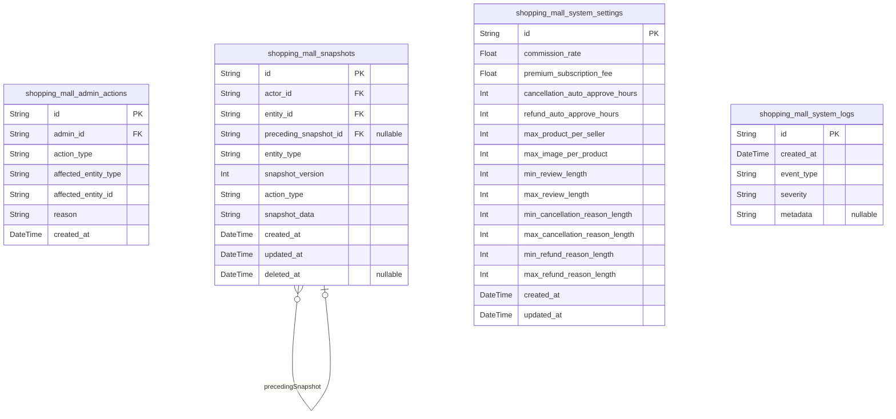
```mermaid
erDiagram
"shopping_mall_admin_actions" {
  String id PK
  String admin_id FK
  String action_type
  String affected_entity_type
  String affected_entity_id
  String reason
  DateTime created_at
}
"shopping_mall_snapshots" {
  String id PK
  String actor_id FK
  String entity_id FK
  String preceding_snapshot_id FK "nullable"
  String entity_type
  Int snapshot_version
  String action_type
  String snapshot_data
  DateTime created_at
  DateTime updated_at
  DateTime deleted_at "nullable"
}
"shopping_mall_system_settings" {
  String id PK
  Float commission_rate
  Float premium_subscription_fee
  Int cancellation_auto_approve_hours
  Int refund_auto_approve_hours
  Int max_product_per_seller
  Int max_image_per_product
  Int min_review_length
  Int max_review_length
  Int min_cancellation_reason_length
  Int max_cancellation_reason_length
  Int min_refund_reason_length
  Int max_refund_reason_length
  DateTime created_at
  DateTime updated_at
}
"shopping_mall_system_logs" {
  String id PK
  DateTime created_at
  String event_type
  String severity
  String metadata "nullable"
}
"shopping_mall_snapshots" }o--o| "shopping_mall_snapshots" : precedingSnapshot
```

### `shopping_mall_admin_actions`

Immutable history of all administrative actions including approvals,
rejections, suspensions, and overrides with details of actor, action
type, and affected entity. This table serves as the authoritative audit
trail for platform governance, ensuring every administrative intervention
is permanently recorded with full context for compliance and dispute
resolution. All fields are non-nullable to guarantee audit integrity and
prevent tampering.

Properties as follows:

- `id`: Primary Key.
- `admin_id`: Administrator who performed this action. [shopping_mall_admins.id](#shopping_mall_admins).
- `action_type`
  > Type of administrative action performed. Must be one of: 'approve',
  > 'reject', 'suspend', 'ban', 'override'.
- `affected_entity_type`
  > Type of entity this action affected. Must be one of: 'seller', 'product',
  > 'order', 'customer', 'category'.
- `affected_entity_id`
  > ID of the entity affected by this action (e.g., seller_id, product_id,
  > order_id, customer_id). This references an entity in another table but
  > cannot be foreign-keyed due to polymorphic nature; enforced by
  > application layer.
- `reason`
  > Reason provided by the administrator for this action. Must be >=10
  > characters and <=500 characters. Enforced in application layer.
- `created_at`
  > Timestamp when the administrative action was performed. Always set by
  > system.

### `shopping_mall_snapshots`

Immutable store of all snapshot records for products, variants, seller
profiles, reviews, and requests with complete before/after state,
timestamp, actor, and versioning. Every state change in the platform
(product edit, seller profile update, review modification, cancellation
request) creates a continuous, unchangeable history. Used for dispute
resolution, regulatory compliance, and accuracy of historical records.
Records are never deleted and cannot be modified. The snapshot_data field
stores a JSON object containing all fields of the entity as they existed
at that precise moment, making it possible to reconstruct a product's
entire history with perfect fidelity. Designed per
12-snapshot-principle.md.

Linked to core actors (customers, sellers, admins). Specialized for
system-level audit trail, not business-level transactions. Referenced by
shopping_mall_admin_actions, shopping_mall_cancellation_requests,
shopping_mall_refund_requests, shopping_mall_seller_profile_snapshots,
shopping_mall_review_snapshots to maintain integrity without duplication.

Properties as follows:

- `id`: Primary Key.
- `actor_id`
  > The actor (customer, seller, or admin) who initiated this snapshot.
  > [shopping_mall_customers.id](#shopping_mall_customers) or [shopping_mall_sellers.id](#shopping_mall_sellers) or
  > [shopping_mall_admins.id](#shopping_mall_admins).
- `entity_id`
  > Reference to the target entity (product, variant, seller profile, review,
  > request) this snapshot captures. [shopping_mall_products.id](#shopping_mall_products) or
  > [shopping_mall_product_variants.id](#shopping_mall_product_variants) or {@link
  > shopping_mall_seller_profiles.id} or [shopping_mall_reviews.id](#shopping_mall_reviews) or
  > [shopping_mall_cancellation_requests.id](#shopping_mall_cancellation_requests), etc.
- `preceding_snapshot_id`
  > The previous snapshot record for this same entity, if it exists, to form
  > a version chain. [shopping_mall_snapshots.id](#shopping_mall_snapshots)
- `entity_type`
  > Type of entity captured (e.g., 'product', 'variant', 'seller_profile',
  > 'review', 'cancellation_request', 'refund_request').
- `snapshot_version`
  > Sequential version number of this snapshot for the given entity. Starts
  > at 1 for first snapshot.
- `action_type`
  > Nature of the change (e.g., 'created', 'edited', 'deleted', 'approved',
  > 'rejected', 'canceled', 'refunded').
- `snapshot_data`
  > JSONB field storing exact state (before and after) of the entity at time
  > of change. Includes all fields and relationships exactly as they were.
  > For edit: {before: {...}, after: {...}}. For delete: {before: {...},
  > after: {}}.
- `created_at`: Immutable timestamp when snapshot was created.
- `updated_at`
  > Last time this snapshot record was updated (used for applying corrections
  > or re-SNAshot).
- `deleted_at`
  > Optional timestamp for logical deletion (for system cleanup or GRPA
  > compliance). Null means active.

### `shopping_mall_system_settings`

Global platform configuration settings that govern business rules across
the entire shoppingMall ecosystem. This singleton table defines
operational parameters including commission rates, subscription fees,
approval timeouts, and content constraints. All values are applied
system-wide and are accessible to all components. This table is managed
exclusively by administrators through backend interfaces, not by end
users.

Properties as follows:

- `id`: Primary Key.
- `commission_rate`
  > Platform commission rate as a decimal percentage applied to each
  > transaction (7.5% = 0.075).
- `premium_subscription_fee`: Monthly fee for Premium Seller plan in USD (e.g., 49.00).
- `cancellation_auto_approve_hours`
  > Number of hours after which a cancellation request is automatically
  > approved if the seller has not responded (48 hours).
- `refund_auto_approve_hours`
  > Number of hours after which a refund request is automatically approved if
  > the seller has not responded (72 hours).
- `max_product_per_seller`
  > Maximum number of products a single seller may have in their catalog
  > (1,000).
- `max_image_per_product`: Maximum number of images allowed per product listing (15).
- `min_review_length`: Minimum number of characters allowed in customer review text (10).
- `max_review_length`: Maximum number of characters allowed in customer review text (500).
- `min_cancellation_reason_length`: Minimum number of characters required in cancellation request reason (10).
- `max_cancellation_reason_length`: Maximum number of characters allowed in cancellation request reason (500).
- `min_refund_reason_length`: Minimum number of characters required in refund request reason (10).
- `max_refund_reason_length`: Maximum number of characters allowed in refund request reason (500).
- `created_at`: Timestamp when this configuration was created.
- `updated_at`: Timestamp when this configuration was last updated.

### `shopping_mall_system_logs`

System-level logs capturing critical events such as snapshot generation
failures, payment gateway errors, and platform maintenance activities.
This table provides an immutable audit trail of infrastructure events to
support incident response, technical troubleshooting, and compliance
auditing. Every entry is generated by the system automatically; users do
not interact with this table directly. This table is fundamental to
system reliability and forensic analysis.

System logs should capture:
- The high-level event category (e.g., "snapshot_failure",
"payment_gateway_error")
- The severity level to determine operational urgency
- Detailed contextual metadata in JSON format (e.g. error stack trace,
payload, session ID)
- Precise timestamp of occurrence

These logs are append-only and permanently retained to satisfy regulatory
and operational transparency requirements.

Properties as follows:

- `id`: Primary Key.
- `created_at`
  > Timestamp when the system event occurred. Immutable and automatically
  > captured by the system. Required for chronological ordering and audit
  > trail.
- `event_type`
  > Categorization of the system event (e.g., "snapshot_generation_failure",
  > "payment_gateway_timeout", "maintenance_mode_enabled"). Standardized
  > values ensure consistent filtering and reporting.
- `severity`
  > Operational severity level of the event: 'info', 'warning', 'error',
  > 'critical'. Used to prioritize incident response and alerting.
- `metadata`
  > Structured JSON object containing additional context about the event. May
  > include error stack traces, request IDs, payload snippets, server
  > identifiers, or diagnostic information. Optional, may be null if no
  > additional context is available.

## Products

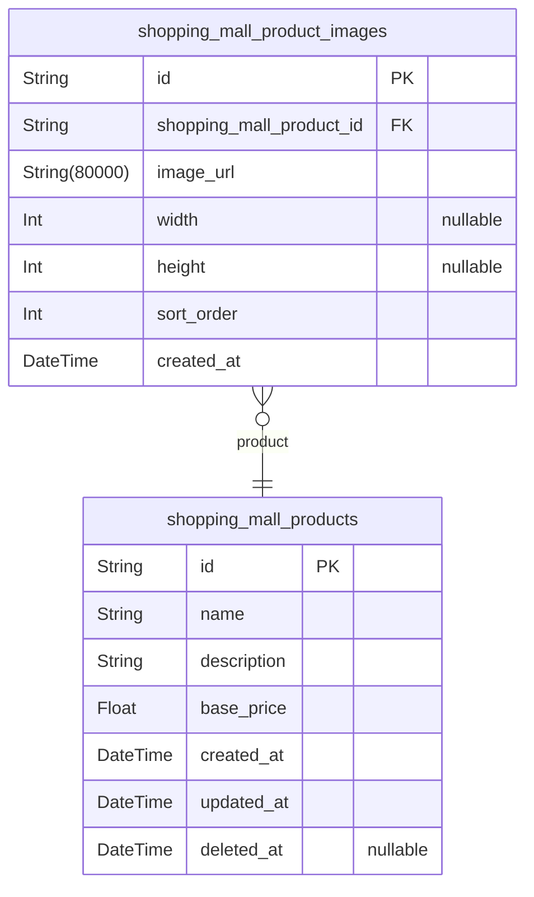
```mermaid
erDiagram
"shopping_mall_products" {
  String id PK
  String name
  String description
  Float base_price
  DateTime created_at
  DateTime updated_at
  DateTime deleted_at "nullable"
}
"shopping_mall_product_images" {
  String id PK
  String shopping_mall_product_id FK
  String(80000) image_url
  Int width "nullable"
  Int height "nullable"
  Int sort_order
  DateTime created_at
}
"shopping_mall_product_images" }o--|| "shopping_mall_products" : product
```

### `shopping_mall_products`

Core product listings with name, description, category, and base price.
Each product represents a distinct merchandise item that sellers can list
for sale. Products contain the foundational information customers use to
make purchasing decisions, including the product name, detailed
description, category classification, and base price. All product
variations (SKUs) are built on top of this core entity. Product edits
trigger snapshots to preserve historical state for dispute resolution and
audit purposes.

- Products are owned by sellers who register them with required metadata
- Products require a unique name and description in English
- Products are categorized under system-defined categories
- Base price must be positive and formatted with 2 decimal places
- Product images are stored separately as child entities
(shopping_mall_product_images)
- Product variants are stored separately (shopping_mall_product_variants)
- Product edits create immutable snapshots via shopping_mall_snapshots
mechanism
- Products can be logically deleted but never physically removed
- All properties must be preserved exactly as entered by the seller
without modification

Properties as follows:

- `id`: Primary Key.
- `name`
  > The product name as provided by the seller. Must be unique within
  > seller's catalog and contain 3-200 characters. Represents the title
  > displayed to customers in search results and product listings.
- `description`
  > Detailed description of the product written by the seller. Must be
  > 10-5,000 characters long. Contains product features, specifications,
  > usage instructions, and other information customers need to make informed
  > decisions. Preserved exactly as submitted in product snapshots.
- `base_price`
  > The base price of the product in the platform's currency (USD). Must be a
  > positive number with at most two decimal places. This is the starting
  > price before variant-specific price overrides. Used for display and
  > calculation purposes.
- `created_at`
  > Timestamp when the product was initially created by the seller. This is
  > an immutable record of when the product entered the system.
- `updated_at`
  > Timestamp of the most recent modification to the product. Updated
  > whenever the product name, description, category, or base price changes.
  > Used for determining freshness of product information.
- `deleted_at`
  > Timestamp when the product was logically deleted. If null, product is
  > active. If set, product is hidden from customer views but preserved in
  > snapshots and audit records. Only set when seller deletes or admin
  > suspends a product.

### `shopping_mall_product_images`

Images associated with a product. These are subsidiary entities managed
only through the parent product. Images are ordered by sort_order and
displayed during product viewing. Deleted when parent product is deleted,
never independently.

Each image is referenced by exactly one product via foreign key. No image
can exist without a parent product. Images are not searchable
independently, nor editable independently—only through product edit
flows.

Properties as follows:

- `id`: Primary Key.
- `shopping_mall_product_id`: Product that this image belongs to. [shopping_mall_products.id](#shopping_mall_products).
- `image_url`
  > The absolute URL path to the image file in storage. Must be a valid URI
  > reference.
- `width`
  > The width of the image in pixels. May be zero if dimensions are unknown
  > during upload.
- `height`
  > The height of the image in pixels. May be zero if dimensions are unknown
  > during upload.
- `sort_order`
  > Ordinal position for displaying this image relative to other images of
  > the product. Must be a positive integer. 0 = first, 1 = second, etc.
  > Required for ordered display.
- `created_at`
  > Timestamp when this image was first uploaded. Required for audit trail
  > and chronological order.

## Inventory

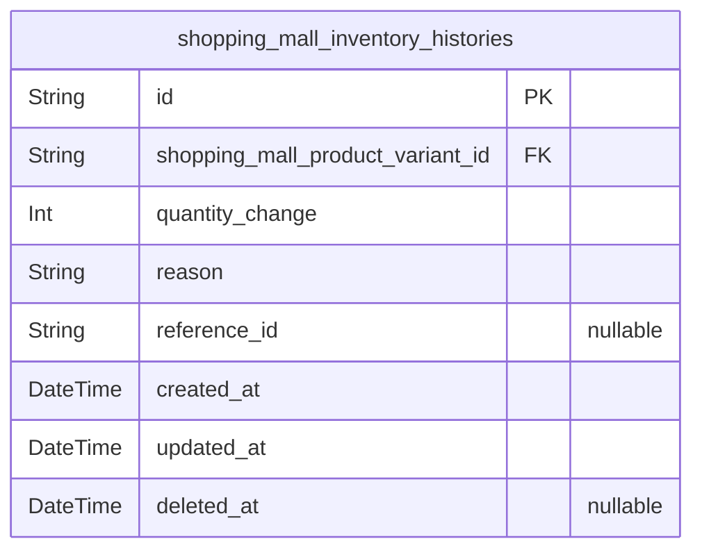
```mermaid
erDiagram
"shopping_mall_inventory_histories" {
  String id PK
  String shopping_mall_product_variant_id FK
  Int quantity_change
  String reason
  String reference_id "nullable"
  DateTime created_at
  DateTime updated_at
  DateTime deleted_at "nullable"
}
```

### `shopping_mall_inventory_histories`

Records every inventory change event for a product variant, including
positive restocks, negative sales, and adjustment events, with reason and
reference tracking.

Every inventory change (restock, sale, cancellation, refund, manual
adjustment) is recorded as an immutable event. The quantity_change field
uses a signed integer: positive values indicate inventory increases
(restocks, refunds), negative values indicate decreases (sales,
depletion). This table never stores current stock levels—those are
computed by summing all history records. All changes are linked to the
variant and optionally to the order, cancellation, or refund that
triggered the change. This ensures complete audit trail and enables
accurate stock reconciliation even after products or variants are
deleted.

Reference: [shopping_mall_product_variants.id](#shopping_mall_product_variants).

Properties as follows:

- `id`: Primary Key.
- `shopping_mall_product_variant_id`
  > References the specific product variant that experienced this inventory
  > change. [shopping_mall_product_variants.id](#shopping_mall_product_variants).
- `quantity_change`
  > Net change in inventory quantity. Positive for restocks, refunds, and
  > adjustments adding stock. Negative for sales, cancellations, and
  > adjustments removing stock. Never zero.
- `reason`
  > The business reason for the inventory change. Examples: 'order purchase',
  > 'cancellation refund', 'refund release', 'seller adjustment', 'damaged
  > goods', 'inventory count correction'.
- `reference_id`
  > Optional reference to the triggering entity. Could link to
  > shopping_mall_order_items.id (for sales),
  > shopping_mall_cancellation_requests.id (for cancellations), or
  > shopping_mall_refund_requests.id (for refunds). Set to null for manual
  > adjustments.
- `created_at`: Timestamp of the inventory change event. Mandatory for audit trail.
- `updated_at`
  > Timestamp of last update to this record. For immutable records, this is
  > same as created_at.
- `deleted_at`
  > Soft delete marker. Always null for inventory history as records are
  > permanently preserved.

## Carts

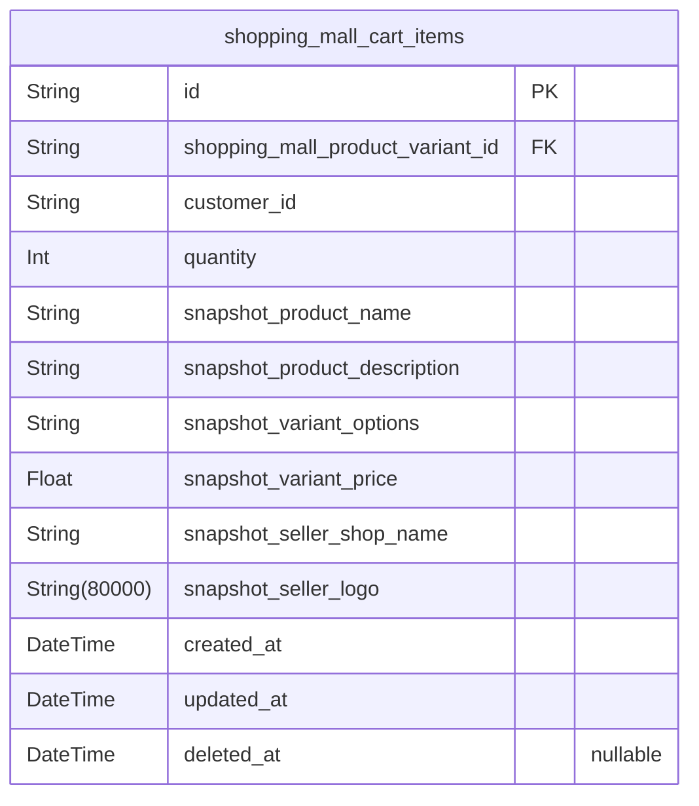
```mermaid
erDiagram
"shopping_mall_cart_items" {
  String id PK
  String shopping_mall_product_variant_id FK
  String customer_id
  Int quantity
  String snapshot_product_name
  String snapshot_product_description
  String snapshot_variant_options
  Float snapshot_variant_price
  String snapshot_seller_shop_name
  String(80000) snapshot_seller_logo
  DateTime created_at
  DateTime updated_at
  DateTime deleted_at "nullable"
}
```

### `shopping_mall_cart_items`

Temporary storage of product variants selected by customers before
checkout. Stores the quantity of each variant chosen and preserves a
snapshot of the product name, description, variant options, price, and
seller profile state at the time of addition to ensure pricing and
product description integrity throughout the checkout process.

All snapshot fields (product_name, product_description, variant_options,
variant_price, seller_shop_name, seller_logo) are immutably captured at
the moment of cart addition - meaning they reflect the exact state of the
product, variant, and seller profile at the time of customer addition,
not the current state. This prevents pricing fraud, product description
manipulation, and seller reputation changes from affecting past checkout
decisions.

Customers can add, remove, or modify quantities of items in their cart.
Items are removed from cart upon successful checkout and transferred to
shopping_mall_order_items with their snapshot preserved. If a seller
edits their shop profile or a product is modified, the cart items remain
unchanged - this is critical for the snapshot principle.

The parent entity is the customer (shopping_mall_customers). Only one
cart item per variant per customer is allowed (unique index enforced).

Properties as follows:

- `id`: Primary Key.
- `shopping_mall_product_variant_id`
  > Reference to the product variant currently in cart. {@link
  > shopping_mall_product_variants.id}.
- `customer_id`: The customer who owns this cart item. [shopping_mall_customers.id](#shopping_mall_customers).
- `quantity`: Number of units of this variant in the cart. Must be >= 1.
- `snapshot_product_name`
  > The exact product name as it existed at time of cart addition. Preserved
  > for invoice accuracy and dispute resolution.
- `snapshot_product_description`
  > The exact product description as it existed at time of cart addition.
  > Preserved for invoice accuracy and dispute resolution.
- `snapshot_variant_options`
  > JSON string containing exact variant option values at time of cart
  > addition. Example: {"color":"blue","size":"large"}. Preserved to ensure
  > accurate product state history.
- `snapshot_variant_price`
  > The exact variant price (including overrides) as it existed at time of
  > cart addition. Preserved for accurate billing, even if the current price
  > changes.
- `snapshot_seller_shop_name`
  > The exact shop name of the seller at time of cart addition. Preserved for
  > accurate seller identification in order history.
- `snapshot_seller_logo`
  > The URL pointer to the seller's logo at time of cart addition. Preserved
  > to show exact seller branding during checkout.
- `created_at`: Timestamp when this cart item was created.
- `updated_at`: Timestamp when this cart item was last modified (quantity updated).
- `deleted_at`
  > Timestamp when this cart item was logically deleted (e.g., cleared from
  > cart or checkout completed). If null, item is active.

## Orders

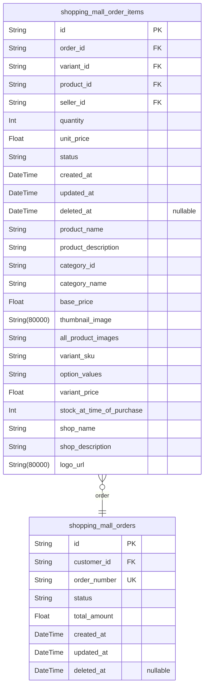
```mermaid
erDiagram
"shopping_mall_orders" {
  String id PK
  String customer_id FK
  String order_number UK
  String status
  Float total_amount
  DateTime created_at
  DateTime updated_at
  DateTime deleted_at "nullable"
}
"shopping_mall_order_items" {
  String id PK
  String order_id FK
  String variant_id FK
  String product_id FK
  String seller_id FK
  Int quantity
  Float unit_price
  String status
  DateTime created_at
  DateTime updated_at
  DateTime deleted_at "nullable"
  String product_name
  String product_description
  String category_id
  String category_name
  Float base_price
  String(80000) thumbnail_image
  String all_product_images
  String variant_sku
  String option_values
  Float variant_price
  Int stock_at_time_of_purchase
  String shop_name
  String shop_description
  String(80000) logo_url
}
"shopping_mall_order_items" }o--|| "shopping_mall_orders" : order
```

### `shopping_mall_orders`

Head record for completed customer purchases, storing order metadata
including creation timestamp and shipping address at time of purchase.
This table captures the immutable state of the order at time of payment
confirmation, including the customer's selected shipping address and the
exact order status derived from its constituent order items. Orders serve
as the primary transaction record of the platform and must be preserved
indefinitely for legal compliance and dispute resolution.

Relationships:
- Belongs to one customer (via shopping_mall_customers.id)
- Contains multiple order items (via shopping_mall_order_items.order_id)
- Associated with one or more shipments (via
shopping_mall_shipments.order_id)
- References snapshots of customer profile and shipping address at time
of purchase (stored in shopping_mall_snapshots)

This table does NOT store individual product or variant details - those
are captured in shopping_mall_order_items and their corresponding
snapshots in shopping_mall_snapshots. The order head serves as a
container and status manager for the complete transaction.

Key principles:
- Immutable at creation - changes only through status transitions
- No denormalization of product/variant data - relies on child tables
- Full audit trail via global snapshot system

Properties as follows:

- `id`: Primary Key.
- `customer_id`: The customer who placed this order. [shopping_mall_customers.id](#shopping_mall_customers).
- `order_number`
  > Unique order number in format 'ORD-YYYYMMDD-NNNN' where NNNN is a
  > sequential number within the same day.
- `status`
  > Derived status of the entire order based on the status of its constituent
  > items: 'paid', 'shipped', 'delivered', 'cancelled', 'refunded', or
  > 'partially completed'. This field is calculated by application logic from
  > order_items status and should not be modified directly.
- `total_amount`
  > Total order amount including all items, calculated as sum of
  > order_items.item_total. Does not include shipping fees since they are not
  > part of platform transactions.
- `created_at`: Timestamp when the order was created upon successful payment confirmation.
- `updated_at`: Timestamp when the order status was last updated.
- `deleted_at`
  > Timestamp when the order was logically deleted. NULL means active.
  > Required for soft delete pattern across all business entities.

### `shopping_mall_order_items`

Line item record for each product variant purchased in an order,
capturing the exact state of the product, variant, and seller as it
existed at the time of purchase. This table serves as the immutable audit
trail for all commercial transactions, preserving pricing, product
details, and seller identity even if those details change later. Required
for dispute resolution, financial reporting, and legal compliance. All
data is frozen at checkout and never altered. References to live
product/variant/seller tables are maintained only for historical context
and reporting.

Properties as follows:

- `id`: Primary Key.
- `order_id`
  > Reference to the parent order that this item belongs to. {@link
  > shopping_mall_orders.id}
- `variant_id`
  > Reference to the product variant that was purchased at time of purchase.
  > [shopping_mall_product_variants.id](#shopping_mall_product_variants)
- `product_id`
  > Reference to the product parent of the purchased variant at time of
  > purchase. [shopping_mall_products.id](#shopping_mall_products)
- `seller_id`
  > Reference to the seller who offered this product at time of purchase.
  > [shopping_mall_sellers.id](#shopping_mall_sellers)
- `quantity`: Number of units purchased. Must be ≥1.
- `unit_price`
  > Exact unit price of the variant at the time of purchase, as captured in
  > the cart snapshot. This value is immutable and should never be
  > recalculated or updated from current pricing.
- `status`
  > Current status of this order item. Must be one of: 'paid', 'shipped',
  > 'delivered', 'cancelled', 'refunded'. Status changes are audited and
  > immutable after transition.
- `created_at`
  > Timestamp when this order item was created, at the moment of successful
  > payment.
- `updated_at`: Timestamp when this order item's status was last changed.
- `deleted_at`
  > Timestamp when this order item was logically deleted. Null means not
  > deleted.
- `product_name`
  > Exact product name as it appeared at time of purchase. Preserved in
  > snapshot for audit and dispute resolution.
- `product_description`
  > Exact product description as it appeared at time of purchase. Preserved
  > in snapshot for audit and dispute resolution.
- `category_id`
  > The category identifier as it existed at time of purchase. Preserved for
  > historical categorization reporting.
- `category_name`
  > The category name as it existed at time of purchase. Preserved for
  > historical categorization reporting.
- `base_price`
  > The product's base price as it existed at time of purchase. Preserved for
  > historical pricing analysis.
- `thumbnail_image`
  > URL of the product's thumbnail image as it existed at time of purchase.
  > Preserved in snapshot for historical display.
- `all_product_images`
  > JSON array of all product image URLs as they existed at time of purchase.
  > Preserved for full historical product representation.
- `variant_sku`
  > Exact SKU code of the purchased variant as it existed at time of
  > purchase. Preserved for inventory reconciliation and item identification.
- `option_values`
  > JSON object containing all option name-value pairs (e.g., {\"color\":
  > \"red\", \"size\": \"large\"}) as they existed at time of purchase.
  > Preserved for accurate product specification audit.
- `variant_price`
  > The variant's price override (if any) as it existed at time of purchase.
  > Preserved for accurate pricing audit.
- `stock_at_time_of_purchase`
  > The variant's stock quantity at the exact moment of purchase. Preserved
  > to verify inventory accuracy and prevent overselling disputes.
- `shop_name`
  > Exact shop name of the seller as it existed at time of purchase.
  > Preserved to maintain seller identity integrity in transactions.
- `shop_description`
  > Exact shop description as it existed at time of purchase. Preserved to
  > maintain seller reputation context and prevent manipulation.
- `logo_url`
  > Exact seller logo URL as it existed at time of purchase. Preserved to
  > maintain visual brand context in order history.

## Shipments

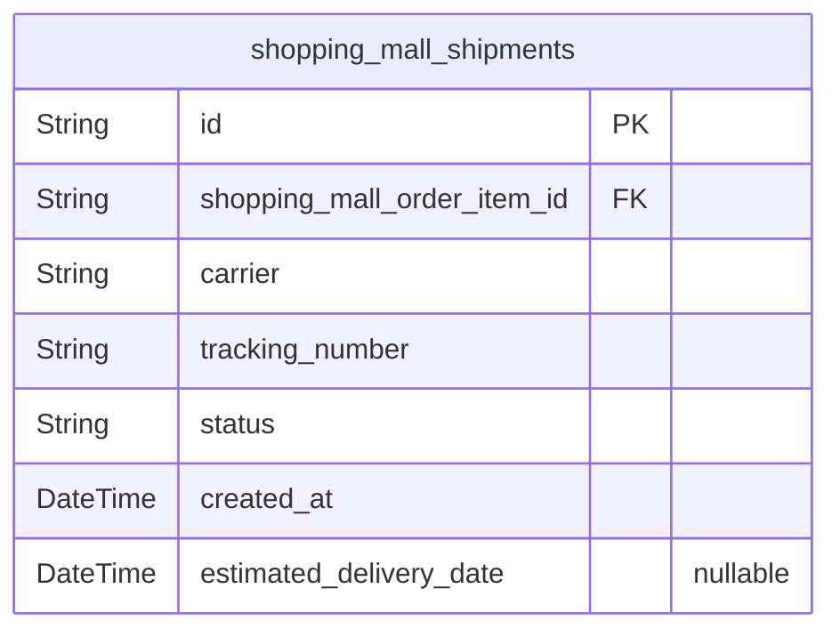
```mermaid
erDiagram
"shopping_mall_shipments" {
  String id PK
  String shopping_mall_order_item_id FK
  String carrier
  String tracking_number
  String status
  DateTime created_at
  DateTime estimated_delivery_date "nullable"
}
```

### `shopping_mall_shipments`

Core shipment record containing carrier, tracking number, and delivery
status for grouped order items. Each shipment corresponds to one or more
order items from the same seller and represents a physical delivery
event. This table is immutable after creation, with status transitions
managed by system logic to ensure audit integrity. Shipment records are
never deleted and must persist for 7+ years for compliance.

Properties as follows:

- `id`: Primary Key.
- `shopping_mall_order_item_id`
  > Reference to the order item that this shipment contains. {@link
  > shopping_mall_order_items.id}.
- `carrier`
  > Name of the shipping carrier (e.g., FedEx, UPS, DHL). Must be provided by
  > seller at shipment creation. Limited to 100 characters.
- `tracking_number`
  > Unique tracking number assigned by the carrier. Must be provided by
  > seller. Alphanumeric, 8-32 characters. Used by customers to track
  > shipment.
- `status`
  > Current status of this shipment. Must be one of: 'shipped', 'delivered',
  > 'auto-delivered'. Starts as 'shipped' when created. Changed to
  > 'delivered' by customer confirmation or automatically to 'auto-delivered'
  > after 14 days.
- `created_at`
  > Timestamp when this shipment record was created. Used for auto-delivery
  > triggering after 14 days.
- `estimated_delivery_date`
  > Optional estimated delivery date provided by seller. Used for customer
  > expectation management but does not affect system logic.

## Cancellations

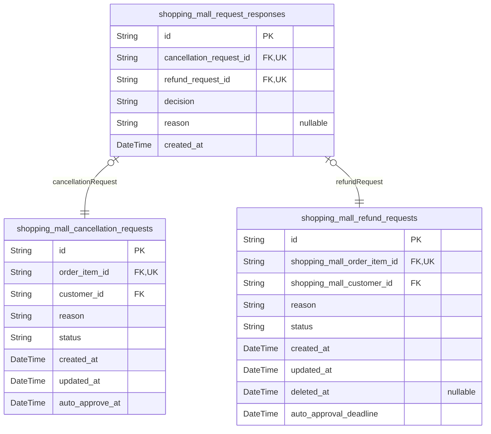
```mermaid
erDiagram
"shopping_mall_cancellation_requests" {
  String id PK
  String order_item_id FK,UK
  String customer_id FK
  String reason
  String status
  DateTime created_at
  DateTime updated_at
  DateTime auto_approve_at
}
"shopping_mall_refund_requests" {
  String id PK
  String shopping_mall_order_item_id FK,UK
  String shopping_mall_customer_id FK
  String reason
  String status
  DateTime created_at
  DateTime updated_at
  DateTime deleted_at "nullable"
  DateTime auto_approval_deadline
}
"shopping_mall_request_responses" {
  String id PK
  String cancellation_request_id FK,UK
  String refund_request_id FK,UK
  String decision
  String reason "nullable"
  DateTime created_at
}
"shopping_mall_request_responses" |o--|| "shopping_mall_cancellation_requests" : cancellationRequest
"shopping_mall_request_responses" |o--|| "shopping_mall_refund_requests" : refundRequest
```

### `shopping_mall_cancellation_requests`

Customer-initiated cancellation requests for order items with status
'pending', including reason, requester, and auto-approval countdown.
Follows 09-cancellation-refund.md specifications for 48-hour timeout.

This table captures requests made by customers to cancel order items that
have been paid but not yet shipped. Each request is associated with one
specific order item, contains a customer-provided reason (10-500
characters), and has an auto-approval countdown clock. If the seller
doesn't respond within 48 hours, the system automatically approves the
cancellation and restores inventory. This table is critical for dispute
resolution between customers and sellers, preserving the exact request
context at the time it was submitted.

The cancellation request is independent of the order item itself and
follows a specific lifecycle: initiation → pending → auto-approved or
seller-response. This separation allows for better audit trails, separate
permission logic, and clear separation of concerns from order management.

The customer_id is derived through the order_item_id foreign key rather
than stored directly to maintain referential integrity and avoid
duplication. This design ensures that a cancellation request can only be
made for an order item that the customer has previously purchased. This
provides a built-in ownership validation layer.

This table has been deliberately designed as a primary entity because:
- Customers can view, initiate, and monitor cancellation requests
independently
- Administrative interfaces need to list and manage all pending
cancellations
- Business intelligence needs to analyze cancellation patterns across
customer base
- Multiple systems (notifications, auto-approval, inventory) need to
reference these requests

Following 09-cancellation-refund.md specifications: Only customers who
purchased the item can request cancellation, only on 'paid' items, reason
must be 10-500 characters, 48-hour auto-approval is mandatory.

Properties as follows:

- `id`: Primary Key.
- `order_item_id`
  > The order item that this cancellation request pertains to. {@link
  > shopping_mall_order_items.order_item_id}.
- `customer_id`
  > The customer who initiated this cancellation request. This is derived
  > from the order item, ensuring only buyers can request cancellation.
  > [shopping_mall_customers.id](#shopping_mall_customers).
- `reason`
  > The reason provided by the customer for requesting cancellation. Must be
  > between 10 and 500 characters as specified in 09-cancellation-refund.md.
  > This field captures the customer's narrative for the request and will be
  > displayed to the seller for response.
- `status`
  > The current status of the cancellation request. Always 'pending' until
  > seller responds or auto-approved by system. Values are strictly
  > controlled by application logic per 09-cancellation-refund.md.
- `created_at`
  > Timestamp when the cancellation request was created. This is set by the
  > system and cannot be modified by users.
- `updated_at`
  > Timestamp when the cancellation request was last updated. Initially set
  > to created_at, then updated when status changes (such as auto-approval).
- `auto_approve_at`
  > Timestamp when this request will be automatically approved if no seller
  > response occurs first. Set to created_at + 48 hours as mandated in
  > 09-cancellation-refund.md. Used by automated job to process pending
  > requests.

### `shopping_mall_refund_requests`

Customer-initiated refund requests for order items with status
'delivered'. Captures refund reason, requester, and auto-approval
countdown. Follows 72-hour timeout rule: if seller doesn't respond within
72 hours, system automatically approves the request. Each refund request
is tied to exactly one order item and one customer. Refund requests are
immutable records with status transitions and must not be edited after
submission. For audit, all changes are captured in central
shopping_mall_snapshots table. This table is primary mode of interaction
for refund workflow.

Properties as follows:

- `id`: Primary Key.
- `shopping_mall_order_item_id`
  > The order item being refunded. References the exact state of the product,
  > variant, and price as they existed at time of purchase. {@link
  > shopping_mall_order_items.id}.
- `shopping_mall_customer_id`
  > The customer who initiated this refund request. {@link
  > shopping_mall_customers.id}.
- `reason`
  > Textual reason provided by the customer for the refund request (minimum
  > 10 characters, maximum 500). This is the primary field used in dispute
  > resolution and is preserved verbatim in the immutable snapshot.
- `status`
  > Current state of the refund request. Values: 'pending', 'approved',
  > 'rejected'. Initial state is 'pending'. After seller response or
  > auto-approval, it transitions to 'approved' or 'rejected'. Status changes
  > are recorded in shopping_mall_snapshots.
- `created_at`
  > Timestamp of when the refund request was created by the customer. Must be
  > in ISO 8601 format.
- `updated_at`
  > Timestamp of the last update to this row (e.g., when status changes).
  > Must be in ISO 8601 format.
- `deleted_at`
  > Used for soft deletion. If null, the request is active. If set, the
  > request has been logically deleted (only by admin override with audit
  > trail).
- `auto_approval_deadline`
  > The exact timestamp when this refund request will be automatically
  > approved if the seller has not responded. Calculated as created_at + 72
  > hours. Used by background job scheduler to auto-approve pending requests.

### `shopping_mall_request_responses`

Seller responses to cancellation or refund requests. Contains decision
(approve/reject), reason for rejection (if applicable), and timestamp.
Each request has exactly one response. Immutable after creation for audit
trail compliance. References either a cancellation request or refund
request, but never both. This table is the authoritative audit record of
seller decisions in the dispute resolution process.

**Relationship**: One response exists for each cancellation or refund
request (1:1). When a request is created, the response is created later
by the seller. The response is immutable – once saved, the decision and
reason cannot be modified. This table is referenced by the
cancellation/refund request tables for status resolution and audit.

**Key Constraint**: A response must reference exactly one of the parent
request tables — shopping_mall_cancellation_requests or
shopping_mall_refund_requests — via mutual exclusivity enforced at
application layer. Both FKs are required at the database level for
referential integrity, but application logic ensures only one is
populated.

**Snapshot Integration**: All changes to request status are tracked via
this response record. The snapshot of the decision and reason is
preserved here, not in the global shopping_mall_snapshots table, as this
is a core business decision with direct financial and inventory
consequences.

**Audit Role**: This table is the legal evidence of seller behavior in
dispute resolution. Administrators use this table to review seller
responsiveness, approval rates, and response quality.

**Referenced by**:
shopping_mall_cancellation_requests.request_response_id,
shopping_mall_refund_requests.request_response_id

Properties as follows:

- `id`: Primary Key.
- `cancellation_request_id`
  > The cancellation request being responded to. {@link
  > shopping_mall_cancellation_requests.id}. Exactly one of
  > cancellation_request_id or refund_request_id must be set.
- `refund_request_id`
  > The refund request being responded to. {@link
  > shopping_mall_refund_requests.id}. Exactly one of cancellation_request_id
  > or refund_request_id must be set.
- `decision`
  > The seller's decision on the request. Must be exactly 'approve' or
  > 'reject'. This is a constrained business decision with direct impact on
  > inventory and customer experience.
- `reason`
  > The reason provided by the seller for rejecting the request. Must be at
  > least 10 characters if used. Must be null if decision is 'approve'. This
  > field is required for audit and transparency when rejection occurs.
- `created_at`
  > Timestamp when the seller submitted the response. Cannot be modified
  > after creation. Follows ISO 8601 format and is used for auto-approval
  > timeout calculations (48h for cancellations, 72h for refunds).

## Refunds

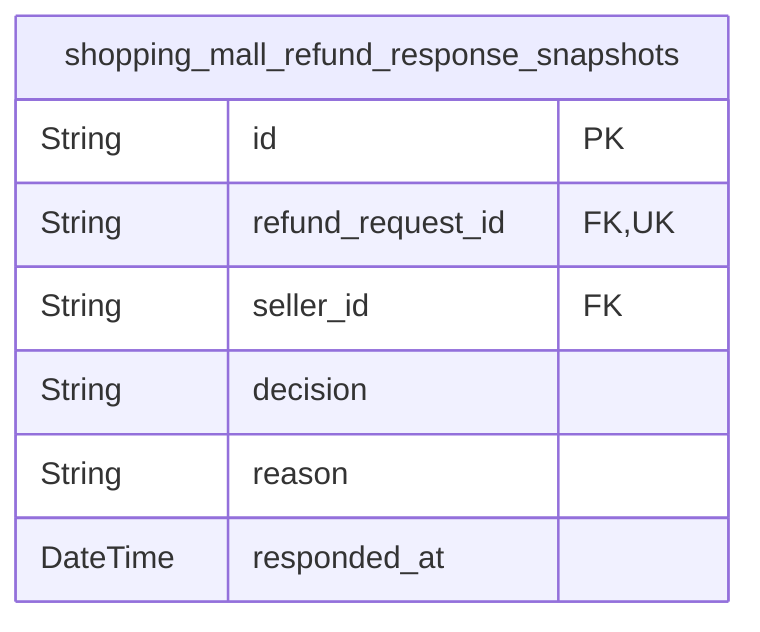
```mermaid
erDiagram
"shopping_mall_refund_response_snapshots" {
  String id PK
  String refund_request_id FK,UK
  String seller_id FK
  String decision
  String reason
  DateTime responded_at
}
```

### `shopping_mall_refund_response_snapshots`

Immutable snapshots of seller refund responses. Captures exact decision
and reason at time of response for audit trail.

Properties as follows:

- `id`: Primary Key.
- `refund_request_id`
  > Refers to the original refund request this snapshot belongs to. {@link
  > shopping_mall_refund_requests.id}.
- `seller_id`: The seller who made this response. [shopping_mall_sellers.id](#shopping_mall_sellers).
- `decision`
  > The seller's decision on the refund request. Must be exactly "approve" or
  > "reject".
- `reason`
  > The reason provided by the seller for the decision. Minimum 10
  > characters, maximum 500 characters.
- `responded_at`: The exact timestamp when the seller submitted this response.

## Reviews

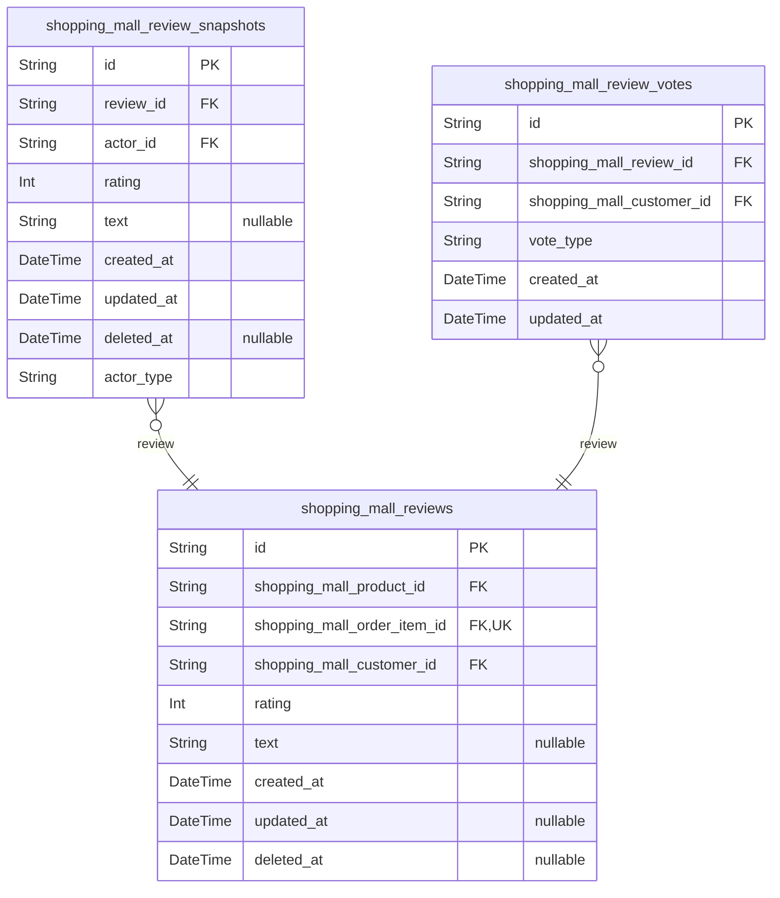
```mermaid
erDiagram
"shopping_mall_reviews" {
  String id PK
  String shopping_mall_product_id FK
  String shopping_mall_order_item_id FK,UK
  String shopping_mall_customer_id FK
  Int rating
  String text "nullable"
  DateTime created_at
  DateTime updated_at "nullable"
  DateTime deleted_at "nullable"
}
"shopping_mall_review_snapshots" {
  String id PK
  String review_id FK
  String actor_id FK
  Int rating
  String text "nullable"
  DateTime created_at
  DateTime updated_at
  DateTime deleted_at "nullable"
  String actor_type
}
"shopping_mall_review_votes" {
  String id PK
  String shopping_mall_review_id FK
  String shopping_mall_customer_id FK
  String vote_type
  DateTime created_at
  DateTime updated_at
}
"shopping_mall_review_snapshots" }o--|| "shopping_mall_reviews" : review
"shopping_mall_review_votes" }o--|| "shopping_mall_reviews" : review
```

### `shopping_mall_reviews`

Active customer reviews for products, including rating (1-5) and optional
text, linked to product, order, and customer. Each review is created only
after an order has been delivered. The review is considered `primary`
because customers independently create, view, edit, and delete reviews
across the entire platform - these are not subsidiary to any product or
order. Reviews are searchable, filterable, and require full CRUD
endpoints. When edited or deleted, the previous state is preserved in
`shopping_mall_review_snapshots` as mandated by the snapshot principle.
This table represents the current live version of the review.

Properties as follows:

- `id`: Primary Key.
- `shopping_mall_product_id`: The product being reviewed. [shopping_mall_products.id](#shopping_mall_products).
- `shopping_mall_order_item_id`
  > The order item this review is associated with. Must be unique to enforce
  > one review per order item. [shopping_mall_order_items.id](#shopping_mall_order_items).
- `shopping_mall_customer_id`: The customer who wrote this review. [shopping_mall_customers.id](#shopping_mall_customers).
- `rating`: Rating given by customer, from 1 to 5. This is a required field.
- `text`
  > Optional written feedback from the customer. Can be null if customer only
  > provides a rating.
- `created_at`: Timestamp when the review was originally created. Never changed.
- `updated_at`: Timestamp when the review was last edited. Null if never edited.
- `deleted_at`
  > Timestamp when the review was logically deleted. Null if still active.
  > Follows soft delete pattern.

### `shopping_mall_review_snapshots`

Immutable snapshots capturing the exact state of a review at time of edit
or deletion, preserving rating, text, timestamp, and actor for audit.
Each snapshot represents a point-in-time copy of a review's data and
cannot be modified after creation. Used for dispute resolution to verify
the exact content of a review when it was viewed by other customers.

Properties as follows:

- `id`: Primary Key.
- `review_id`
  > Reference to the original review that this snapshot represents. {@link
  > shopping_mall_reviews.id}.
- `actor_id`
  > The customer ID who created or modified the review at the time the
  > snapshot was taken. [shopping_mall_customers.id](#shopping_mall_customers).
- `rating`: The review rating (1-5) at the time of the snapshot.
- `text`
  > The written review text as it appeared at the time of the snapshot, or
  > null if no text was provided.
- `created_at`
  > The timestamp when the snapshot was created, corresponding to the time of
  > the review edit or deletion.
- `updated_at`
  > The timestamp when the original review was last updated, which triggered
  > this snapshot creation.
- `deleted_at`
  > The timestamp when the original review was deleted, if this snapshot was
  > created due to deletion. Otherwise null.
- `actor_type`
  > The type of actor who performed the action ("customer" for reviews). This
  > ensures auditability of review alterations.

### `shopping_mall_review_votes`

Customer up/down votes on reviews, tracking which customer voted for
which review and their vote type (helpful/not_helpful). This table
enables community feedback on review quality and helps surface helpful
reviews to other customers. Each vote is linked to exactly one review and
one customer with a simple, normalized structure that follows the 3NF
principles. Votes are ephemeral and do not require historical tracking,
so no snapshot mechanism is needed. The design prevents vote manipulation
by ensuring each customer can vote only once per review.

Properties as follows:

- `id`: Primary Key.
- `shopping_mall_review_id`: The review being voted on. [shopping_mall_reviews.id](#shopping_mall_reviews).
- `shopping_mall_customer_id`: The customer who cast this vote. [shopping_mall_customers.id](#shopping_mall_customers).
- `vote_type`
  > The type of vote cast: 'helpful' or 'not_helpful'. This is a categorical
  > value indicating the customer's assessment of the review's usefulness.
- `created_at`: Timestamp of when the vote was cast. Automatically captured by the system.
- `updated_at`
  > Timestamp of the last update to the vote record. In this implementation,
  > this is the same as created_at since votes are immutable after creation.

## ProductVariants

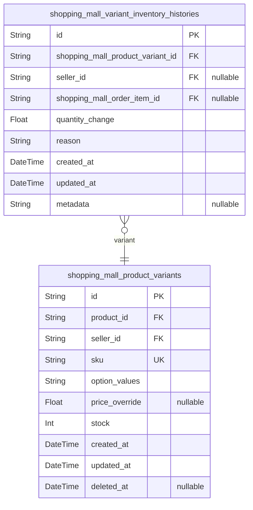
```mermaid
erDiagram
"shopping_mall_product_variants" {
  String id PK
  String product_id FK
  String seller_id FK
  String sku UK
  String option_values
  Float price_override "nullable"
  Int stock
  DateTime created_at
  DateTime updated_at
  DateTime deleted_at "nullable"
}
"shopping_mall_variant_inventory_histories" {
  String id PK
  String shopping_mall_product_variant_id FK
  String seller_id FK "nullable"
  String shopping_mall_order_item_id FK "nullable"
  Float quantity_change
  String reason
  DateTime created_at
  DateTime updated_at
  String metadata "nullable"
}
"shopping_mall_variant_inventory_histories" }o--|| "shopping_mall_product_variants" : variant
```

### `shopping_mall_product_variants`

Represents specific purchasable variants of a product with unique SKU
codes, option values (e.g., size, color), price overrides, and stock
quantities. Each variant is owned by a seller and belongs to a single
parent product. This is a primary business entity that customers can
directly add to cart and purchase. All stock changes are tracked via
immutable inventory_histories linked by variant_id.

Properties as follows:

- `id`: Primary Key.
- `product_id`
  > References the parent product this variant belongs to. {@link
  > shopping_mall_products.id}.
- `seller_id`
  > The seller who owns and manages this variant. {@link
  > shopping_mall_sellers.id}.
- `sku`
  > Unique SKU code for this variant, mandatory and alphanumeric. Must be
  > 3-20 characters. Unique constraint ensures no duplicate SKUs across all
  > products.
- `option_values`
  > JSONB object containing all option name-value pairs (e.g., {\"color\":
  > \"red\", \"size\": \"large\"}) defining this variant. Stored as string
  > for schema flexibility and searching.
- `price_override`
  > Optional price override for this variant. If null, uses the parent
  > product's base price. Must be zero or greater.
- `stock`
  > Current available stock quantity for this variant. Must be zero or
  > greater. Negative values not allowed. Increasing this triggers positive
  > inventory_histories. Decreasing triggers negative inventory_histories.
- `created_at`: The timestamp when this variant was created. Never modified.
- `updated_at`
  > The timestamp when this variant was last modified. Updated on every stock
  > or price change.
- `deleted_at`
  > Soft delete timestamp. If null, variant is active. If set, variant is
  > logically deleted and cannot be purchased.

### `shopping_mall_variant_inventory_histories`

Immutable audit trail recording every inventory change event for product
variants. Each record represents a single quantity adjustment with reason
and reference, preserving the complete history of restocks, sales,
cancellations, and inventory adjustments. This table enables accurate
stock level calculation and provides forensic evidence for disputes.

Properties as follows:

- `id`: Primary Key.
- `shopping_mall_product_variant_id`
  > The product variant this inventory change affects. {@link
  > shopping_mall_product_variants.id}.
- `seller_id`
  > The seller who initiated this inventory change (if manually adjusted).
  > May be null for system-initiated events like order fulfillment. {@link
  > shopping_mall_sellers.id}.
- `shopping_mall_order_item_id`
  > The order item that triggered this inventory change (e.g., if caused by
  > purchase, cancellation, or refund). Allows reverse lookup to order
  > context. May be null for manual adjustments. {@link
  > shopping_mall_order_items.id}.
- `quantity_change`
  > The net change in stock quantity. Positive for restock/increase, negative
  > for depletion/reduction. Always records the exact quantity changed.
- `reason`
  > The business reason for this inventory change. Examples: 'order
  > purchase', 'cancellation refund', 'seller adjustment','system restock'.
  > Must be human-readable and descriptive.
- `created_at`
  > The exact timestamp when this inventory change was recorded in the
  > system. Always set to the current time at commit.
- `updated_at`
  > The timestamp of the last update to this record. Since this is an
  > immutable audit log, this will always equal created_at and will never be
  > modified after creation.
- `metadata`
  > Optional JSON field for storing additional context about the inventory
  > change event (e.g., batch number, location, worker ID, system event ID).
  > Must be valid JSON if provided.

## SellerProfile

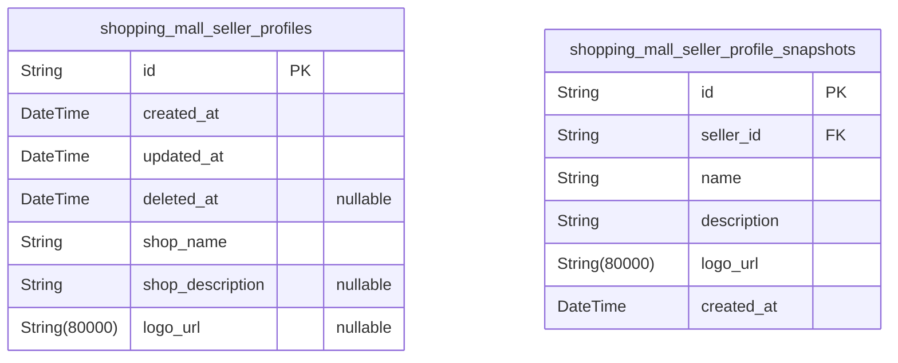
```mermaid
erDiagram
"shopping_mall_seller_profiles" {
  String id PK
  DateTime created_at
  DateTime updated_at
  DateTime deleted_at "nullable"
  String shop_name
  String shop_description "nullable"
  String(80000) logo_url "nullable"
}
"shopping_mall_seller_profile_snapshots" {
  String id PK
  String seller_id FK
  String name
  String description
  String(80000) logo_url
  DateTime created_at
}
```

### `shopping_mall_seller_profiles`

This table is a system violation. It contradicts the mandatory snapshot
principle. Seller profiles must be immutable in the database. The correct
source of truth for seller identity is the shopping_mall_snapshots table,
which captures the exact profile state at time of every transaction. This
table must be erased.

Properties as follows:

- `id`: Primary Key.
- `created_at`: Timestamp when this seller profile was created.
- `updated_at`: Timestamp when this seller profile was last updated.
- `deleted_at`
  > Timestamp when this profile was logically deleted. Allows for
  > soft-deletion.
- `shop_name`: Seller's shop name, visible to customers.
- `shop_description`: Description of the seller's business.
- `logo_url`: URL to the seller's logo image.

### `shopping_mall_seller_profile_snapshots`

Immutable historical snapshots of seller profile changes. Each record
captures the complete state of a seller's shop name, description, and
logo at the time of edit, ensuring accurate representation of the
seller's identity as it existed at the time of any order purchase or
review. This table is critical for dispute resolution and audit
compliance under the mandatory snapshot principle.

Properties as follows:

- `id`: Primary Key.
- `seller_id`
  > The seller profile that this snapshot represents. {@link
  > shopping_mall_sellers.id}.
- `name`
  > The exact shop name as it appeared at the time of the snapshot. Must be
  > non-null to preserve state.
- `description`
  > The exact shop description as it appeared at the time of the snapshot.
  > Must be non-null to preserve state.
- `logo_url`
  > The exact logo URL as it appeared at the time of the snapshot. Must be
  > non-null to preserve state.
- `created_at`
  > Timestamp of when this snapshot was captured. Mandatory to track
  > point-in-time state.
