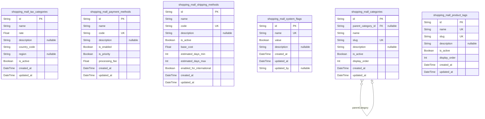
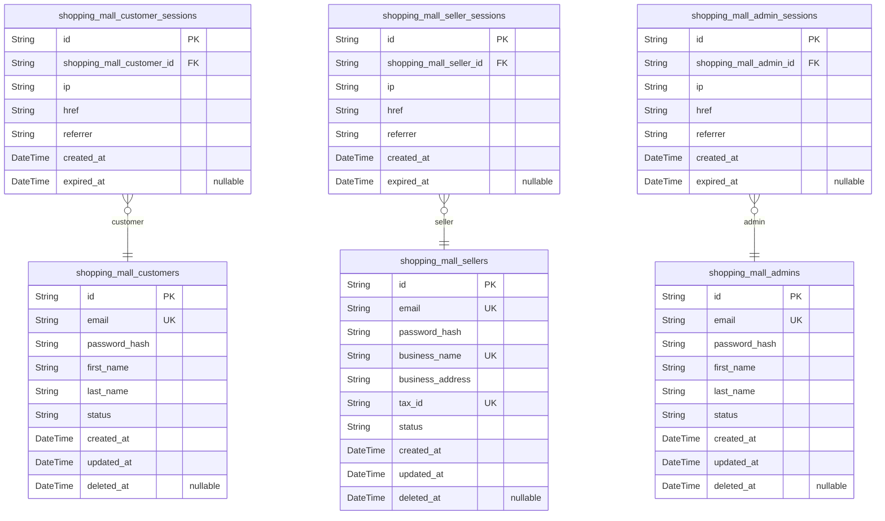
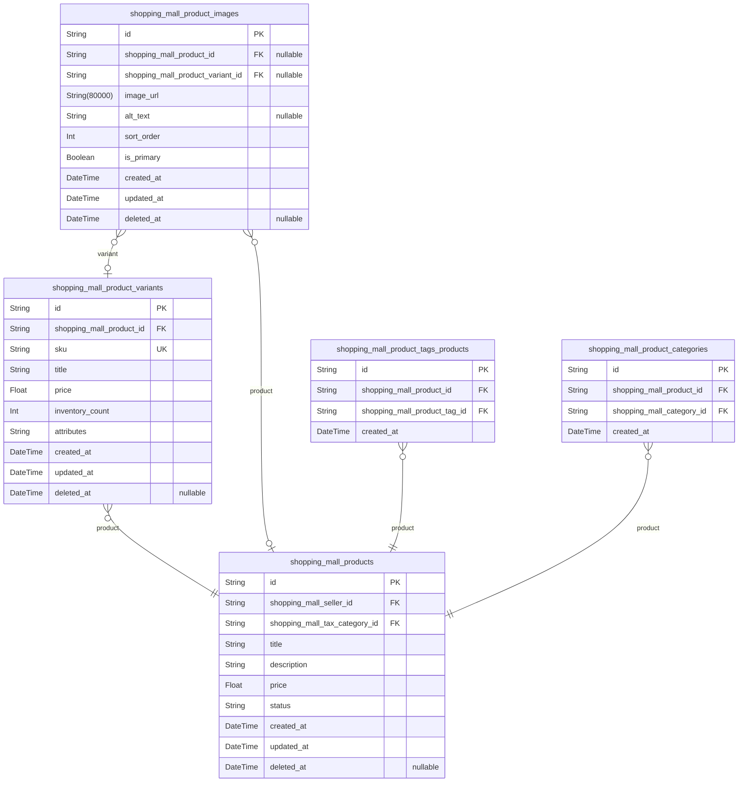
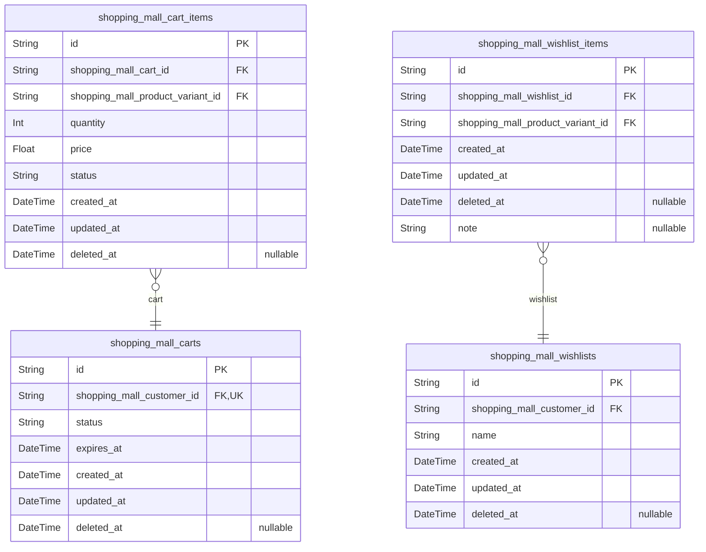
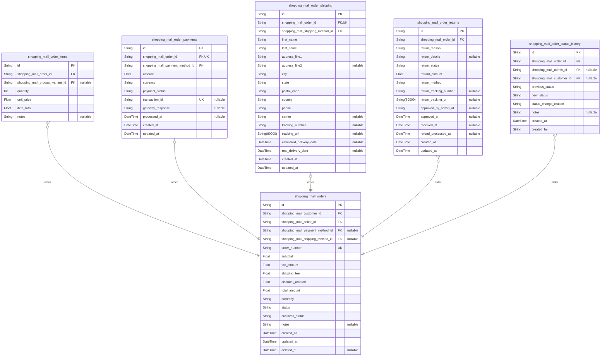
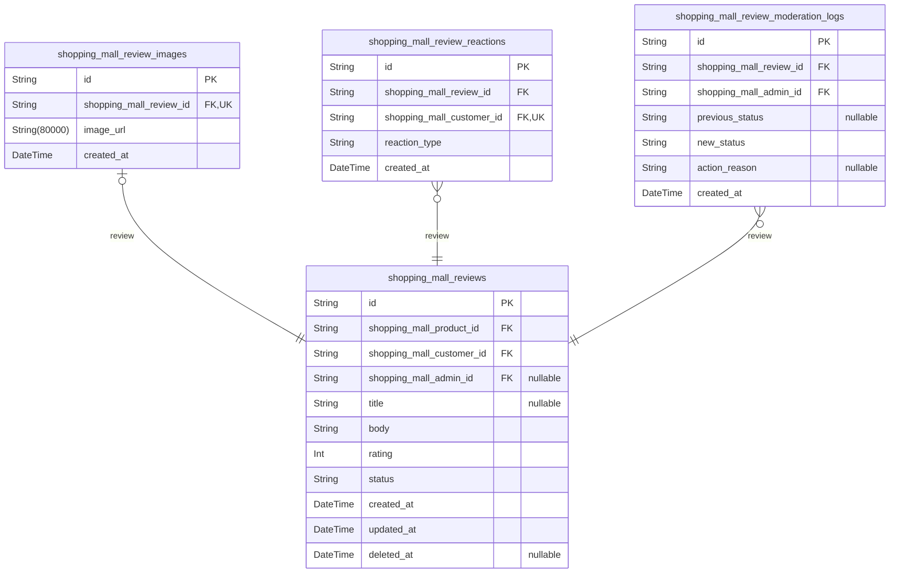
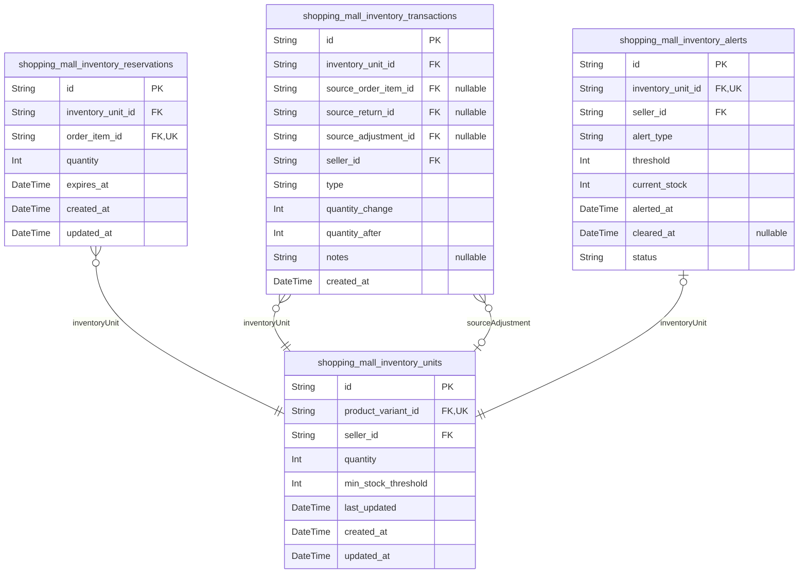
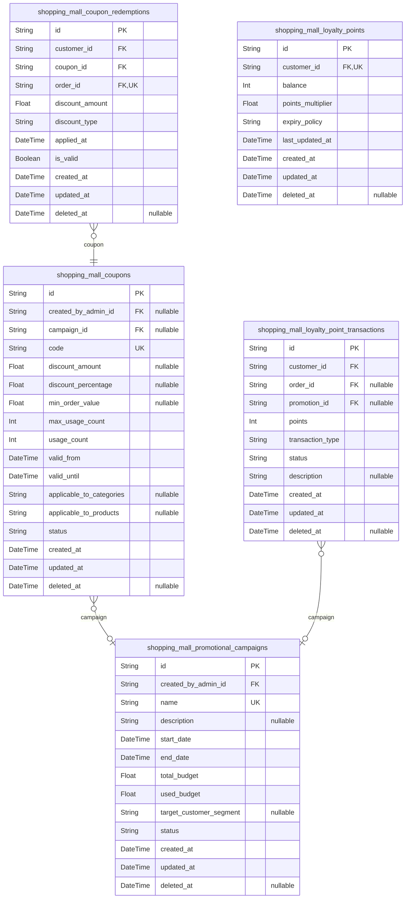
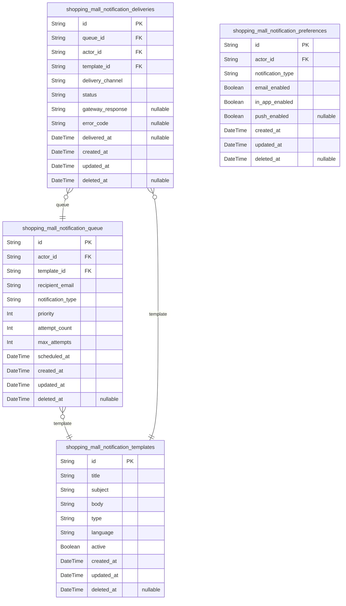
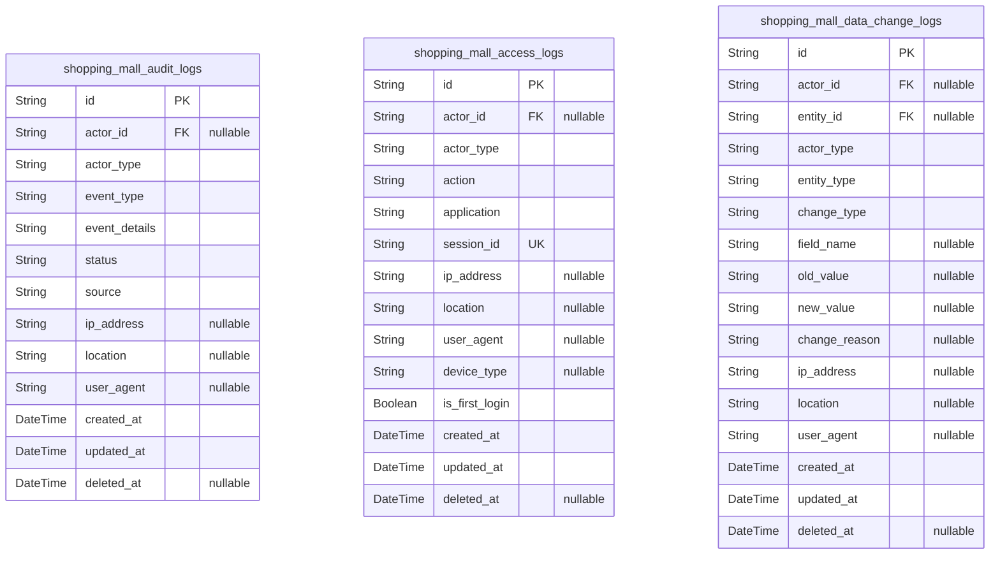

# Prisma Markdown

> Generated by [`prisma-markdown`](https://github.com/samchon/prisma-markdown)

- [Systematic](#systematic)
- [Actors](#actors)
- [Products](#products)
- [Carts](#carts)
- [Orders](#orders)
- [Reviews](#reviews)
- [Inventory](#inventory)
- [Promotions](#promotions)
- [Notifications](#notifications)
- [Audit](#audit)

## Systematic

```mermaid
erDiagram
"shopping_mall_tax_categories" {
  String id PK
  String name
  Float rate
  String description "nullable"
  String country_code
  String region "nullable"
  Boolean is_active
  DateTime created_at
  DateTime updated_at
}
"shopping_mall_payment_methods" {
  String id PK
  String name
  String code UK
  String description "nullable"
  Boolean is_enabled
  Boolean is_priority
  Float processing_fee
  DateTime created_at
  DateTime updated_at
}
"shopping_mall_shipping_methods" {
  String id PK
  String name
  String code UK
  String description "nullable"
  Boolean is_active
  Float base_cost
  Int estimated_days_min
  Int estimated_days_max
  Boolean enabled_for_international
  DateTime created_at
  DateTime updated_at
}
"shopping_mall_system_flags" {
  String id PK
  String name UK
  Boolean value
  String description "nullable"
  DateTime created_at
  DateTime updated_at
  String updated_by "nullable"
}
"shopping_mall_categories" {
  String id PK
  String parent_category_id FK "nullable"
  String name
  String slug UK
  String description "nullable"
  Boolean is_active
  Int display_order
  DateTime created_at
  DateTime updated_at
}
"shopping_mall_product_tags" {
  String id PK
  String name UK
  String slug UK
  String description "nullable"
  Boolean is_active
  Int display_order
  DateTime created_at
  DateTime updated_at
}
"shopping_mall_categories" }o--o| "shopping_mall_categories" : parentCategory
```

### `shopping_mall_tax_categories`

System-wide tax category definitions used for product pricing and order
calculations.

Defines standardized tax categories applied across all products and
orders. Each tax category represents a tax rate with associated
jurisdiction and description.

Used by shopping_mall_products, shopping_mall_orders, and
shopping_mall_order_items to determine applicable tax rates.

This table ensures consistent tax application across the system,
referenced by tax_category_id in product and order tables.

Properties as follows:

- `id`: Primary Key.
- `name`: Display name of the tax category (e.g., 'VAT', 'GST', 'Sales Tax').
- `rate`
  > Tax rate as decimal percentage (e.g., 0.08 for 8%). Must be between 0 and
  > 1.
- `description`
  > Detailed description of the tax category's jurisdiction and application
  > rules.
- `country_code`
  > ISO 3166-1 alpha-2 country code (e.g., 'US', 'JP', 'KR') where this tax
  > category applies.
- `region`
  > Specific region or state name where this tax category applies (e.g.,
  > 'California', 'Tokyo').
- `is_active`
  > Whether this tax category is currently active and applicable for new
  > orders.
- `created_at`: Timestamp when this tax category was created.
- `updated_at`: Timestamp when this tax category was last updated.

### `shopping_mall_payment_methods`

System-defined payment method types supported by the platform for
transaction processing.

Defines the payment methods that customers can use to complete
transactions. These are fixed system types, not user-specific payment
details.

Used by shopping_mall_order_payments to determine permitted payment types
and processing rules.

This table enables consistent payment handling across all orders,
referenced by payment_method_id in order payment records.

Properties as follows:

- `id`: Primary Key.
- `name`
  > Display name of the payment method (e.g., 'Credit Card', 'PayPal', 'Bank
  > Transfer').
- `code`
  > System code identifier for this payment method (e.g., 'CREDIT_CARD',
  > 'PAYPAL', 'BANK_TRANSFER'). Used in API and integration logic.
- `description`
  > Detailed description of how this payment method works and any special
  > requirements.
- `is_enabled`: Whether this payment method is currently enabled for customer use.
- `is_priority`
  > Whether this payment method is displayed as a priority option during
  > checkout.
- `processing_fee`
  > Fixed processing fee charged when using this payment method (in USD).
  > Zero if no fee.
- `created_at`: Timestamp when this payment method was added to the system.
- `updated_at`: Timestamp when this payment method was last updated.

### `shopping_mall_shipping_methods`

System-defined shipping options available to customers during checkout.

Defines the shipping methods that sellers can offer and customers can
select during checkout.

Used by shopping_mall_order_shipping to determine available shipping
options, costs, and delivery time estimates.

This table maintains standardized shipping configurations that can be
referenced by multiple sellers, linked to shipping_method_id in order
shipping records.

Properties as follows:

- `id`: Primary Key.
- `name`
  > Display name of the shipping method (e.g., 'Standard Delivery', 'Express
  > Shipping', 'Same-Day Pickup').
- `code`
  > System code identifier for this shipping method (e.g., 'STANDARD',
  > 'EXPRESS', 'PICKUP'). Used in logistics integrations.
- `description`
  > Detailed description of the shipping method's capabilities, restrictions,
  > and delivery window.
- `is_active`
  > Whether this shipping method is currently active and available to
  > customers.
- `base_cost`
  > Base shipping cost in USD for this method. May be overridden per seller
  > or order.
- `estimated_days_min`: Minimum number of business days for delivery using this method.
- `estimated_days_max`: Maximum number of business days for delivery using this method.
- `enabled_for_international`: Whether this shipping method can be used for international orders.
- `created_at`: Timestamp when this shipping method was added to the system.
- `updated_at`: Timestamp when this shipping method was last updated.

### `shopping_mall_system_flags`

Global system configuration flags that enable or disable platform-wide
features and behaviors.

Contains boolean flags that control platform functionality without
requiring code deployment. Used to toggle features on/off per environment
or business need.

Referenced by application services to determine system behavior, such as
allowing new registrations, payment processing, etc.

Properties as follows:

- `id`: Primary Key.
- `name`
  > Unique name of the system flag (e.g., 'ENABLE_NEW_REGISTRATIONS',
  > 'ALLOW_PAYMENT_PROCESSING', 'MAINTENANCE_MODE').
- `value`: Current state of the flag. True means enabled, false means disabled.
- `description`: Explanation of what this flag controls and its impact on system behavior.
- `created_at`: Timestamp when this system flag was created.
- `updated_at`: Timestamp when this system flag was last updated.
- `updated_by`
  > ID of the admin who last modified this flag, referencing
  > shopping_mall_admins.id.

### `shopping_mall_categories`

Hierarchical product category structure that organizes all products in
the marketplace.

Defines the complete category taxonomy used to classify products.
Categories support nesting (parent-child relationships) to create deep
hierarchies.

Used by shopping_mall_products, shopping_mall_product_categories to
determine product categorization and navigation.

This table creates the authoritative category structure referenced
throughout the system, linked by category_id in product category
mappings.

Properties as follows:

- `id`: Primary Key.
- `parent_category_id`
  > Parent category in the hierarchy. Referencing the same
  > shopping_mall_categories.id for nested categories. Null for top-level
  > categories.
- `name`: Display name of the category (e.g., 'Electronics', 'Books > Fiction').
- `slug`
  > URL-friendly identifier for this category (e.g., 'electronics',
  > 'books-fiction').
- `description`: Detailed description of the category and what products belong in it.
- `is_active`: Whether this category is currently active and visible to customers.
- `display_order`
  > Order in which this category should be displayed in UI lists. Lower
  > numbers appear first.
- `created_at`: Timestamp when this category was created.
- `updated_at`: Timestamp when this category was last updated.

### `shopping_mall_product_tags`

System-defined product tags for enhanced product categorization and
search filtering.

Defines a pool of standardized tags that can be applied to products to
improve search and filtering capabilities.

Used by shopping_mall_product_tags_products to associate tags with
products, enabling keyword-based discovery and faceted navigation.

This table creates a controlled vocabulary of tags that can be referenced
across all products, linked by tag_id in the junction table.

Properties as follows:

- `id`: Primary Key.
- `name`
  > Display name of the product tag (e.g., 'Organic', 'Wireless',
  > 'Heavy-Duty').
- `slug`
  > URL-friendly identifier for this tag (e.g., 'organic', 'wireless',
  > 'heavy-duty').
- `description`
  > Detailed description of what this tag represents and what products it
  > should be applied to.
- `is_active`: Whether this tag is currently active and available for selection.
- `display_order`
  > Order in which this tag should be displayed in UI lists. Lower numbers
  > appear first.
- `created_at`: Timestamp when this tag was created.
- `updated_at`: Timestamp when this tag was last updated.

## Actors

```mermaid
erDiagram
"shopping_mall_customers" {
  String id PK
  String email UK
  String password_hash
  String first_name
  String last_name
  String status
  DateTime created_at
  DateTime updated_at
  DateTime deleted_at "nullable"
}
"shopping_mall_customer_sessions" {
  String id PK
  String shopping_mall_customer_id FK
  String ip
  String href
  String referrer
  DateTime created_at
  DateTime expired_at "nullable"
}
"shopping_mall_sellers" {
  String id PK
  String email UK
  String password_hash
  String business_name UK
  String business_address
  String tax_id UK
  String status
  DateTime created_at
  DateTime updated_at
  DateTime deleted_at "nullable"
}
"shopping_mall_seller_sessions" {
  String id PK
  String shopping_mall_seller_id FK
  String ip
  String href
  String referrer
  DateTime created_at
  DateTime expired_at "nullable"
}
"shopping_mall_admins" {
  String id PK
  String email UK
  String password_hash
  String first_name
  String last_name
  String status
  DateTime created_at
  DateTime updated_at
  DateTime deleted_at "nullable"
}
"shopping_mall_admin_sessions" {
  String id PK
  String shopping_mall_admin_id FK
  String ip
  String href
  String referrer
  DateTime created_at
  DateTime expired_at "nullable"
}
"shopping_mall_customer_sessions" }o--|| "shopping_mall_customers" : customer
"shopping_mall_seller_sessions" }o--|| "shopping_mall_sellers" : seller
"shopping_mall_admin_sessions" }o--|| "shopping_mall_admins" : admin
```

### `shopping_mall_customers`

Primary customer identity record for the shoppingMall platform.

Stores core authentication and identification information for customers
who browse and purchase products. Each customer may have multiple active
sessions across different devices.

Relates to shopping_mall_customer_sessions for session management and to
shopping_mall_orders for order history.

Customers are created during registration and require email verification
before full access. May be suspended by admin but cannot be deleted.

Properties as follows:

- `id`: Primary Key.
- `email`
  > Customer's verified email address used for authentication and
  > notifications. Must be unique across all actors.
- `password_hash`
  > BCrypt-hashed password for authentication. Never stored in plain text.
  > Required for login functionality.
- `first_name`: Customer's first/legal name as provided during registration.
- `last_name`: Customer's last/legal name as provided during registration.
- `status`
  > Current account status. Valid values: 'active', 'suspended',
  > 'pending_verification'. Determines access to platform features.
- `created_at`
  > Timestamp when the customer account was created. Used for audit trails
  > and onboarding analytics.
- `updated_at`
  > Timestamp when the customer profile was last modified. Updated on
  > property changes or password reset.
- `deleted_at`
  > Soft-delete flag for account deactivation. When null, account is active;
  > when set, account is disabled but retained for compliance.

### `shopping_mall_customer_sessions`

Session record for authenticated customer interactions with the
shoppingMall platform.

Each session represents a single active login instance for a customer
across a specific device and network connection. Sessions are ephemeral
and managed by the authentication system.

Maintains connection context for customer interactions including IP
address, href, and referrer. Used for security monitoring and session
management.

Relates to shopping_mall_customers via customer_id foreign key.

Follows strict session table pattern: {actor_base}_sessions with
mandatory fields and index structure.

Properties as follows:

- `id`: Primary Key.
- `shopping_mall_customer_id`
  > Referenced customer account for this session. {@link
  > shopping_mall_customers.id}.
- `ip`
  > IP address from which the session was initiated. Used for security
  > monitoring and geolocation.
- `href`
  > Full URL of the application accessed during this session. Used for user
  > journey analysis.
- `referrer`
  > Source URL that led the user to the platform. Used for marketing
  > attribution and traffic analysis.
- `created_at`
  > Timestamp when the session was established. Used for session duration
  > calculation and audit trails.
- `expired_at`
  > Timestamp when this session will expire or was terminated. If null,
  > session is still active.

### `shopping_mall_sellers`

Primary seller identity record for businesses selling on the shoppingMall
platform.

Stores core authentication and identification information for business
sellers who list and manage products for sale. Each seller may have
multiple active sessions across different devices.

Relates to shopping_mall_seller_sessions for session management and to
shopping_mall_products for product listings.

Sellers are created during registration and require document verification
before active status. May be suspended by admin but cannot be deleted.

Properties as follows:

- `id`: Primary Key.
- `email`
  > Seller's verified business email address used for authentication and
  > notifications. Must be unique across all actors.
- `password_hash`
  > BCrypt-hashed password for authentication. Never stored in plain text.
  > Required for login functionality.
- `business_name`
  > Legal business name as registered with government authorities. Displayed
  > to customers on product listings.
- `business_address`
  > Physical business address for tax and regulatory purposes. Not displayed
  > to customers.
- `tax_id`
  > Official tax identification number issued by government authority. Used
  > for financial compliance.
- `status`
  > Current account status. Valid values: 'active', 'suspended',
  > 'pending_verification', 'rejected'. Determines ability to list products
  > and receive payments.
- `created_at`
  > Timestamp when the seller account was created. Used for audit trails and
  > onboarding analytics.
- `updated_at`
  > Timestamp when the seller profile or business information was last
  > modified.
- `deleted_at`
  > Soft-delete flag for account deactivation. When null, account is active;
  > when set, account is disabled but retained for compliance.

### `shopping_mall_seller_sessions`

Session record for authenticated seller interactions with the
shoppingMall platform.

Each session represents a single active login instance for a seller
across a specific device and network connection. Sessions are ephemeral
and managed by the authentication system.

Maintains connection context for seller interactions including IP
address, href, and referrer. Used for security monitoring and session
management.

Relates to shopping_mall_sellers via seller_id foreign key.

Follows strict session table pattern: {actor_base}_sessions with
mandatory fields and index structure.

Properties as follows:

- `id`: Primary Key.
- `shopping_mall_seller_id`
  > Referenced seller account for this session. {@link
  > shopping_mall_sellers.id}.
- `ip`
  > IP address from which the session was initiated. Used for security
  > monitoring and geolocation.
- `href`
  > Full URL of the application accessed during this session. Used for user
  > journey analysis.
- `referrer`
  > Source URL that led the user to the platform. Used for marketing
  > attribution and traffic analysis.
- `created_at`
  > Timestamp when the session was established. Used for session duration
  > calculation and audit trails.
- `expired_at`
  > Timestamp when this session will expire or was terminated. If null,
  > session is still active.

### `shopping_mall_admins`

Primary admin identity record for platform administrators managing the
shoppingMall platform.

Stores core authentication and identification information for platform
operators with elevated privileges to manage users, content, and system
settings.

Admins manage customer and seller accounts, moderate reviews,
approve/reject products, access financial reports, and perform
system-level actions.

Relates to shopping_mall_admin_sessions for session management.

Admins are manually created through internal processes. Cannot register
via public interface. Always requires MFA and strict access controls.

Properties as follows:

- `id`: Primary Key.
- `email`
  > Admin's verified email address used for authentication and notifications.
  > Must be unique across all actors.
- `password_hash`
  > BCrypt-hashed password for authentication. Never stored in plain text.
  > Required for login functionality.
- `first_name`: Admin's first/legal name as provided during onboarding.
- `last_name`: Admin's last/legal name as provided during onboarding.
- `status`
  > Current account status. Valid values: 'active', 'suspended',
  > 'pending_verification'. Determines access to admin interfaces.
- `created_at`
  > Timestamp when the admin account was created. Used for audit trails and
  > access control history.
- `updated_at`
  > Timestamp when the admin profile was last modified. Updated on property
  > changes or password reset.
- `deleted_at`
  > Soft-delete flag for account deactivation. When null, account is active;
  > when set, account is disabled but retained for compliance.

### `shopping_mall_admin_sessions`

Session record for authenticated admin interactions with the shoppingMall
platform.

Each session represents a single active login instance for an admin
across a specific device and network connection. Sessions are ephemeral
and managed by the authentication system.

Maintains connection context for admin interactions including IP address,
href, and referrer. Used for security monitoring and audit trails.

Relates to shopping_mall_admins via admin_id foreign key.

Follows strict session table pattern: {actor_base}_sessions with
mandatory fields and index structure.

Properties as follows:

- `id`: Primary Key.
- `shopping_mall_admin_id`
  > Referenced admin account for this session. {@link
  > shopping_mall_admins.id}.
- `ip`
  > IP address from which the session was initiated. Used for security
  > monitoring and geolocation.
- `href`
  > Full URL of the application accessed during this session. Used for user
  > journey analysis.
- `referrer`
  > Source URL that led the user to the platform. Used for marketing
  > attribution and traffic analysis.
- `created_at`
  > Timestamp when the session was established. Used for session duration
  > calculation and audit trails.
- `expired_at`
  > Timestamp when this session will expire or was terminated. If null,
  > session is still active.

## Products

```mermaid
erDiagram
"shopping_mall_products" {
  String id PK
  String shopping_mall_seller_id FK
  String shopping_mall_tax_category_id FK
  String title
  String description
  Float price
  String status
  DateTime created_at
  DateTime updated_at
  DateTime deleted_at "nullable"
}
"shopping_mall_product_variants" {
  String id PK
  String shopping_mall_product_id FK
  String sku UK
  String title
  Float price
  Int inventory_count
  String attributes
  DateTime created_at
  DateTime updated_at
  DateTime deleted_at "nullable"
}
"shopping_mall_product_images" {
  String id PK
  String shopping_mall_product_id FK "nullable"
  String shopping_mall_product_variant_id FK "nullable"
  String(80000) image_url
  String alt_text "nullable"
  Int sort_order
  Boolean is_primary
  DateTime created_at
  DateTime updated_at
  DateTime deleted_at "nullable"
}
"shopping_mall_product_tags_products" {
  String id PK
  String shopping_mall_product_id FK
  String shopping_mall_product_tag_id FK
  DateTime created_at
}
"shopping_mall_product_categories" {
  String id PK
  String shopping_mall_product_id FK
  String shopping_mall_category_id FK
  DateTime created_at
}
"shopping_mall_product_variants" }o--|| "shopping_mall_products" : product
"shopping_mall_product_images" }o--o| "shopping_mall_products" : product
"shopping_mall_product_images" }o--o| "shopping_mall_product_variants" : variant
"shopping_mall_product_tags_products" }o--|| "shopping_mall_products" : product
"shopping_mall_product_categories" }o--|| "shopping_mall_products" : product
```

### `shopping_mall_products`

Main product catalog entries representing distinct product offerings.

Each product represents a unique item available for sale with its
defining attributes like title, description, price, and category.
Products are created and managed by sellers and serve as the parent
entity for product variants (SKUs). Products can be published or archived
based on seller status and compliance.

When a product is published, it becomes visible to customers for browsing
and purchasing. Archived products remain in the system for historical
tracking and audit purposes but are not visible to customers. Products
are linked to categories and tags for improved discoverability and
search.

Properties as follows:

- `id`: Primary Key.
- `shopping_mall_seller_id`: Owner seller. [shopping_mall_sellers.id](#shopping_mall_sellers).
- `shopping_mall_tax_category_id`: Tax classification category. [shopping_mall_tax_categories.id](#shopping_mall_tax_categories).
- `title`: Product title displayed to customers. Must be 3-100 characters.
- `description`
  > Detailed product description visible to customers. Minimum 20 characters,
  > maximum 2000 characters.
- `price`: Base price of the product in USD. Minimum $0.01, maximum $5000.00.
- `status`
  > Product availability status. Valid values: 'draft', 'published',
  > 'archived'. Determines visibility to customers.
- `created_at`: Timestamp when the product was created. Always recorded.
- `updated_at`: Timestamp of the last product update. Always updated on any modification.
- `deleted_at`
  > Timestamp when the product was marked for deletion. Indicates soft delete
  > status. Null means product is active.

### `shopping_mall_product_variants`

Product variants (SKUs) that represent distinct inventory items with
unique pricing and stock levels.

Each variant represents a specific configuration of a main product with
different attributes such as color, size, or style. Variants are
independent entities with their own pricing and inventory management,
allowing for precise stock control and personalized pricing.

Variants are always linked to a single parent product and cannot exist
without one. They enable the platform to handle complex products with
multiple options while maintaining accurate inventory and pricing data
for each configuration.

Properties as follows:

- `id`: Primary Key.
- `shopping_mall_product_id`: Parent product this variant belongs to. [shopping_mall_products.id](#shopping_mall_products).
- `sku`
  > Unique Stock Keeping Unit identifier for this variant. Must be globally
  > unique across all products and variants.
- `title`
  > Variant-specific title that describes the configuration (e.g., 'Red, Size
  > M').
- `price`
  > Specific price for this variant. Can differ from parent product base
  > price.
- `inventory_count`: Current available stock quantity for this variant. Must be 0 or greater.
- `attributes`
  > JSON-formatted string containing variant attributes (e.g., {"color":
  > "red", "size": "M"}). Used for filtering and display.
- `created_at`: Timestamp when the variant was created. Always recorded.
- `updated_at`: Timestamp of the last variant update. Always updated on any modification.
- `deleted_at`
  > Timestamp when the variant was marked for deletion. Indicates soft delete
  > status. Null means variant is active.

### `shopping_mall_product_images`

Product image files associated with products and variants.

Stores image metadata and file references for all visual content
associated with products. Each product may have multiple images, and each
image is linked to either a product or variant. Images are managed
through their parent entity and only exist in relation to a product.

Image files are referenced by URL or path, but actual file storage is
handled externally. This model ensures each image is properly attributed
and can be retrieved efficiently for display in product listings and
detail pages.

Properties as follows:

- `id`: Primary Key.
- `shopping_mall_product_id`: Parent product this image belongs to. [shopping_mall_products.id](#shopping_mall_products).
- `shopping_mall_product_variant_id`
  > Parent variant this image belongs to. {@link
  > shopping_mall_product_variants.id}.
- `image_url`: Public URL path to the image file. Must be a valid URI format.
- `alt_text`: Alternative text description for accessibility and SEO purposes.
- `sort_order`
  > Display order priority for viewing. Lower numbers display first. Must be
  > 0 or greater.
- `is_primary`
  > Flag indicating if this is the primary image for the product or variant.
  > Only one per product/variant can be primary.
- `created_at`: Timestamp when the image was added to the product or variant.
- `updated_at`
  > Timestamp of the last update to the image record. Always updated on any
  > modification.
- `deleted_at`
  > Timestamp when the image record was marked for deletion. Indicates soft
  > delete status. Null means image is active.

### `shopping_mall_product_tags_products`

Junction table for many-to-many relationship between products and tags.

Enables flexible tagging system where products can have multiple tags and
tags can be applied to multiple products. This table creates the link
between product catalog entries and their textual tags for improved
search, filtering, and categorization.

Tags are defined in the shopping_mall_product_tags table and represent
keywords or categories that help customers discover products. This
junction table allows for dynamic tagging without requiring schema
changes and supports complex queries on product attributes.

Properties as follows:

- `id`: Primary Key.
- `shopping_mall_product_id`: Product associated with this tag. [shopping_mall_products.id](#shopping_mall_products).
- `shopping_mall_product_tag_id`: Tag applied to this product. [shopping_mall_product_tags.id](#shopping_mall_product_tags).
- `created_at`: Timestamp when the tag was applied to the product.

### `shopping_mall_product_categories`

Junction table linking products to categories through a many-to-many
relationship.

Enables products to belong to multiple categories (e.g., a product can be
both 'Electronics' and 'Gifts'). Category hierarchy is managed in
shopping_mall_categories table, and this junction table defines the
association between products and their categories.

This approach allows flexible product categorization without duplicating
data and enables comprehensive category-based navigation and filtering in
the product catalog.

Properties as follows:

- `id`: Primary Key.
- `shopping_mall_product_id`: Product associated with this category. [shopping_mall_products.id](#shopping_mall_products).
- `shopping_mall_category_id`: Category this product belongs to. [shopping_mall_categories.id](#shopping_mall_categories).
- `created_at`: Timestamp when the product was assigned to this category.

## Carts

```mermaid
erDiagram
"shopping_mall_carts" {
  String id PK
  String shopping_mall_customer_id FK,UK
  String status
  DateTime expires_at
  DateTime created_at
  DateTime updated_at
  DateTime deleted_at "nullable"
}
"shopping_mall_cart_items" {
  String id PK
  String shopping_mall_cart_id FK
  String shopping_mall_product_variant_id FK
  Int quantity
  Float price
  String status
  DateTime created_at
  DateTime updated_at
  DateTime deleted_at "nullable"
}
"shopping_mall_wishlists" {
  String id PK
  String shopping_mall_customer_id FK
  String name
  DateTime created_at
  DateTime updated_at
  DateTime deleted_at "nullable"
}
"shopping_mall_wishlist_items" {
  String id PK
  String shopping_mall_wishlist_id FK
  String shopping_mall_product_variant_id FK
  DateTime created_at
  DateTime updated_at
  DateTime deleted_at "nullable"
  String note "nullable"
}
"shopping_mall_cart_items" }o--|| "shopping_mall_carts" : cart
"shopping_mall_wishlist_items" }o--|| "shopping_mall_wishlists" : wishlist
```

### `shopping_mall_carts`

Active shopping carts for customers, representing items selected for
immediate purchase.

Each cart represents a customer's active selection of products to
purchase, containing cart items that are held for a limited period before
expiring. Carts are temporary working areas for customer shopping
sessions and are distinct from wishlists which represent long-term
interest items.

Carts are linked to customers via customer_id and have an expiration date
after which they are automatically cleared. Carts are never shared
between customers and represent individual shopping sessions.

Properties as follows:

- `id`: Primary Key.
- `shopping_mall_customer_id`: Customer who owns this cart. [shopping_mall_customers.id](#shopping_mall_customers).
- `status`
  > Current state of the cart. Valid values: active, expired, checked_out.
  > Indicates whether the cart is ready for checkout, has expired, or been
  > converted to an order.
- `expires_at`
  > Datetime when this cart will expire and its items will be automatically
  > removed. Standard expiration is 24 hours from creation for logged-in
  > users, 7 days for anonymous users.
- `created_at`
  > Timestamp when this cart was created. Required for auditing cart
  > lifecycle.
- `updated_at`
  > Timestamp when this cart was last modified. Updated whenever items are
  > added, removed, or quantities changed.
- `deleted_at`
  > Soft delete timestamp indicating when this cart was removed. Used for
  > audit trails and potential recovery of abandoned carts (before permanent
  > purge).

### `shopping_mall_cart_items`

Individual items within a shopping cart, capturing product selections at
time of addition.

Cart items represent specific product variants selected by the customer
for purchase, with prices captured at the time of addition to ensure
consistency during checkout even if product prices change later. Each
cart item belongs exclusively to one cart and is removed upon checkout or
cart expiration.

This table stores the state of products at cart creation time to provide
price stability and prevent pricing disputes between customer and seller.
Cart items are ephemeral and only exist while the parent cart is active.

Properties as follows:

- `id`: Primary Key.
- `shopping_mall_cart_id`: Cart to which this item belongs. [shopping_mall_carts.id](#shopping_mall_carts).
- `shopping_mall_product_variant_id`
  > The specific product variant being added to cart. {@link
  > shopping_mall_product_variants.id}.
- `quantity`
  > Number of units of this product variant in the cart. Must be at least 1
  > and cannot exceed available inventory at time of addition.
- `price`
  > Unit price of the product variant at the exact moment it was added to the
  > cart. This ensures price stability during checkout even if product price
  > changes later.
- `status`
  > Current state of this cart item. Valid values: active, out_of_stock,
  > removed, checked_out. Active items are available for checkout,
  > out_of_stock items are marked when inventory changes, removed items were
  > manually deleted, and checked_out items were purchased in order.
- `created_at`
  > Timestamp when this cart item was added to the cart. Required for
  > auditing cart modifications and understanding purchase decisions.
- `updated_at`
  > Timestamp when this cart item was last modified. Updated when quantity
  > changes or status changes (e.g., from active to out_of_stock).
- `deleted_at`
  > Soft delete timestamp indicating when this cart item was removed. Used
  > for audit trails and understanding cart abandonment patterns.

### `shopping_mall_wishlists`

User-created lists of products for potential future purchase, persisting
across sessions.

Wishlists represent products that customers are interested in but are not
immediately purchasing. Unlike carts which are temporary working areas
for checkout, wishlists are persistent collections of items customers
want to consider later. Customers can maintain multiple wishlists with
custom names and organize products for future consideration.

Wishlists have no expiration and remain active until explicitly deleted
by the customer. They are independent of cart functionality and serve as
long-term interest tracking tools rather than purchasing tools.

Properties as follows:

- `id`: Primary Key.
- `shopping_mall_customer_id`: Customer who owns this wishlist. [shopping_mall_customers.id](#shopping_mall_customers).
- `name`
  > User-defined name for this wishlist. Examples: 'Future Gifts', 'Travel
  > Essentials', 'Home Improvement'. Maximum 100 characters.
- `created_at`
  > Timestamp when this wishlist was created. Required for audit trails and
  > understanding customer interest patterns over time.
- `updated_at`
  > Timestamp when this wishlist was last modified. Updated when items are
  > added, removed, or when name is changed.
- `deleted_at`
  > Soft delete timestamp indicating when this wishlist was removed. Used for
  > audit trails and potential recovery.

### `shopping_mall_wishlist_items`

Individual items within a wishlist, representing products of potential
future interest.

Wishlist items capture products that customers have expressed interest in
for possible future purchase. Unlike cart items, wishlist items do not
capture pricing at time of addition since prices may change over time and
these are not immediate purchases.

These items persist indefinitely until removed by the customer and serve
as long-term interest tracking rather than transactional records.
Wishlist items are organized within their parent wishlist and can be
reordered or annotated by the customer.

Properties as follows:

- `id`: Primary Key.
- `shopping_mall_wishlist_id`: Wishlist to which this item belongs. [shopping_mall_wishlists.id](#shopping_mall_wishlists).
- `shopping_mall_product_variant_id`
  > The specific product variant being saved to wishlist. {@link
  > shopping_mall_product_variants.id}.
- `created_at`
  > Timestamp when this item was added to the wishlist. Required for
  > understanding customer interest patterns and sequence of interest.
- `updated_at`
  > Timestamp when this wishlist item was last modified. Updated when note is
  > added or priority changes.
- `deleted_at`
  > Soft delete timestamp indicating when this wishlist item was removed.
  > Used for audit trails and understanding interest decay.
- `note`
  > Optional user-provided note about this wishlist item. Examples: 'For
  > birthday gift next month', 'Waiting for sale', 'Compare with other
  > brands'. Maximum 500 characters.

## Orders

```mermaid
erDiagram
"shopping_mall_orders" {
  String id PK
  String shopping_mall_customer_id FK
  String shopping_mall_seller_id FK
  String shopping_mall_payment_method_id FK "nullable"
  String shopping_mall_shipping_method_id FK "nullable"
  String order_number UK
  Float subtotal
  Float tax_amount
  Float shipping_fee
  Float discount_amount
  Float total_amount
  String currency
  String status
  String business_status
  String notes "nullable"
  DateTime created_at
  DateTime updated_at
  DateTime deleted_at "nullable"
}
"shopping_mall_order_items" {
  String id PK
  String shopping_mall_order_id FK
  String shopping_mall_product_variant_id FK "nullable"
  Int quantity
  Float unit_price
  Float item_total
  String notes "nullable"
}
"shopping_mall_order_payments" {
  String id PK
  String shopping_mall_order_id FK,UK
  String shopping_mall_payment_method_id FK
  Float amount
  String currency
  String payment_status
  String transaction_id UK "nullable"
  String gateway_response "nullable"
  DateTime processed_at "nullable"
  DateTime created_at
  DateTime updated_at
}
"shopping_mall_order_shipping" {
  String id PK
  String shopping_mall_order_id FK,UK
  String shopping_mall_shipping_method_id FK
  String first_name
  String last_name
  String address_line1
  String address_line2 "nullable"
  String city
  String state
  String postal_code
  String country
  String phone
  String carrier "nullable"
  String tracking_number "nullable"
  String(80000) tracking_url "nullable"
  DateTime estimated_delivery_date "nullable"
  DateTime real_delivery_date "nullable"
  DateTime created_at
  DateTime updated_at
}
"shopping_mall_order_returns" {
  String id PK
  String shopping_mall_order_id FK
  String return_reason
  String return_details "nullable"
  String return_status
  Float refund_amount
  String return_method
  String return_tracking_number "nullable"
  String(80000) return_tracking_url "nullable"
  String approved_by_admin_id "nullable"
  DateTime approved_at "nullable"
  DateTime received_at "nullable"
  DateTime refund_processed_at "nullable"
  DateTime created_at
  DateTime updated_at
}
"shopping_mall_order_status_history" {
  String id PK
  String shopping_mall_order_id FK
  String shopping_mall_admin_id FK "nullable"
  String shopping_mall_customer_id FK "nullable"
  String previous_status
  String new_status
  String status_change_reason
  String notes "nullable"
  DateTime created_at
  String created_by
}
"shopping_mall_order_items" }o--|| "shopping_mall_orders" : order
"shopping_mall_order_payments" |o--|| "shopping_mall_orders" : order
"shopping_mall_order_shipping" |o--|| "shopping_mall_orders" : order
"shopping_mall_order_returns" }o--|| "shopping_mall_orders" : order
"shopping_mall_order_status_history" }o--|| "shopping_mall_orders" : order
```

### `shopping_mall_orders`

Main order entity representing a customer's purchase transaction.

Captures the core details of each order placed through the shoppingMall
platform. Each order is linked to a specific customer and contains
product information, pricing, and overall order state. Orders can be
modified during the checkout process but become immutable once payment is
completed.

Orders form the central hub of the commerce workflow, connecting
customers, products, payments, shipping, and returns. The order status
progresses through defined lifecycle stages from creation to completion
or cancellation.

All order entities (items, payments, shipping, returns) reference this
parent order entity. Soft deletion supports order recovery before final
cancellation.

Properties as follows:

- `id`: Primary Key.
- `shopping_mall_customer_id`: Customer who placed this order. [shopping_mall_customers.id](#shopping_mall_customers).
- `shopping_mall_seller_id`
  > Primary seller responsible for fulfilling this order. {@link
  > shopping_mall_sellers.id}.
- `shopping_mall_payment_method_id`
  > Payment method used for this order. {@link
  > shopping_mall_payment_methods.id}.
- `shopping_mall_shipping_method_id`
  > Shipping method selected for this order. {@link
  > shopping_mall_shipping_methods.id}.
- `order_number`
  > Unique order identifier in format ORD-YYYYMMDD-NNNNN. Must be globally
  > unique.
- `subtotal`: Total price of all items before taxes and shipping. Excludes discounts.
- `tax_amount`: Total tax amount applied based on product categories and jurisdiction.
- `shipping_fee`: Total shipping cost based on selected shipping method and destination.
- `discount_amount`: Total discount applied from coupons or promotions.
- `total_amount`
  > Final amount due after applying taxes, shipping, and discounts. subtotal
  > + tax_amount + shipping_fee - discount_amount.
- `currency`
  > Currency code for this order (e.g., USD, KRW, EUR). Must match ISO 4217
  > standards.
- `status`
  > Current order status. Valid values: draft, pending_payment, paid,
  > confirmed, shipped, delivered, cancelled, refunded, completed.
- `business_status`
  > Additional business workflow status. Valid values: normal, fraud_review,
  > refund_requested, return_requested, disputed, completed.
- `notes`: Additional notes from customer during checkout. Limited to 500 characters.
- `created_at`
  > Timestamp when this order was created. Always set during order draft
  > creation.
- `updated_at`
  > Timestamp when this order was last modified. Updated on status changes,
  > shipping address updates, etc.
- `deleted_at`
  > Timestamp when this order was soft-deleted. NULL if active. Used for
  > order recovery and audit trails.

### `shopping_mall_order_items`

Individual product items within an order.

Represents the specific products, quantities, and pricing details of each
item in an order. Each order item references a specific product variant
and captures its price at the exact moment of purchase,
ensuring accurate historical records even if prices change later.

Order items are always created as part of order creation and are managed
exclusively through their parent order. They have no independent
existence outside of an order context.

The line item price reflects the exact price paid by the customer at
purchase time, which may differ from the current product price due to
promotions or price changes.

Properties as follows:

- `id`: Primary Key.
- `shopping_mall_order_id`: Parent order containing this item. [shopping_mall_orders.id](#shopping_mall_orders).
- `shopping_mall_product_variant_id`
  > Specific product variant being ordered. {@link
  > shopping_mall_product_variants.id}.
- `quantity`: Number of units of this item in the order. Must be greater than zero.
- `unit_price`
  > Price per unit at the time of purchase. This may differ from current
  > product price due to promotions or changes.
- `item_total`
  > Total cost for this line item (quantity × unit_price). Calculated field
  > preserved for auditing.
- `notes`
  > Special instructions from customer for this item (e.g., 'gift wrap', 'do
  > not open until Christmas'). Limited to 250 characters.

### `shopping_mall_order_payments`

Payment details for an order.

Captures all payment information for a specific order, including the
payment method, amount, transaction ID, and processing status. Each order
has exactly one payment record (1:1 relationship).

Payment records are created when the order enters 'pending_payment'
status and are updated throughout the payment lifecycle. This entity
enables detailed financial tracking and reconciliation.

The payment record is linked directly to the order and references the
payment method used. Payment status progresses from pending -> processing
-> authorized -> captured -> failed -> refunded.

Properties as follows:

- `id`: Primary Key.
- `shopping_mall_order_id`: Order this payment belongs to. [shopping_mall_orders.id](#shopping_mall_orders).
- `shopping_mall_payment_method_id`
  > Payment method used for this transaction. {@link
  > shopping_mall_payment_methods.id}.
- `amount`: Amount paid in the order's currency. Must match order.total_amount.
- `currency`: Currency code for this payment. Must match the order's currency.
- `payment_status`
  > Current payment status. Valid values: pending, processing, authorized,
  > captured, failed, refunded, chargeback.
- `transaction_id`
  > Unique identifier from the payment gateway (e.g., Stripe transaction ID).
  > Used for reconciliation.
- `gateway_response`
  > Raw response from the payment gateway. Used for debugging and fraud
  > analysis.
- `processed_at`: Timestamp when payment processing completed. NULL if still pending.
- `created_at`: Timestamp when payment record was created.
- `updated_at`
  > Timestamp when payment record was last updated (e.g., when status
  > changed).

### `shopping_mall_order_shipping`

Shipping details for an order.

Stores the complete shipping information for an order, including
destination address, shipping method, carrier details, and tracking
information.

Each order has exactly one shipping record (1:1 relationship). This
entity captures the shipping state at the time of order processing,
allowing accurate historical retrieval even if customer addresses change
later.

Shipping records are created when the order enters 'pending_payment'
status. Tracking numbers are populated when the seller marks the order as
shipped.

Properties as follows:

- `id`: Primary Key.
- `shopping_mall_order_id`
  > Order this shipping information belongs to. {@link
  > shopping_mall_orders.id}.
- `shopping_mall_shipping_method_id`
  > Shipping method selected for this order. {@link
  > shopping_mall_shipping_methods.id}.
- `first_name`: Recipient's first name for delivery. Required for shipping.
- `last_name`: Recipient's last name for delivery. Required for shipping.
- `address_line1`: Primary street address line for delivery.
- `address_line2`: Secondary address line (apartment, suite, etc.). Optional.
- `city`: City for delivery address.
- `state`: State, province, or region for delivery address.
- `postal_code`: Postal or ZIP code for delivery address.
- `country`: Country code for delivery address (ISO 3166-1 alpha-2 standard).
- `phone`: Contact phone number for delivery carrier.
- `carrier`: Carrier company name (e.g., FedEx, UPS, Korea Post).
- `tracking_number`
  > Tracking number provided by carrier. Populated when order is marked as
  > shipped.
- `tracking_url`: URL to track this shipment on the carrier's website.
- `estimated_delivery_date`: Estimated delivery date based on shipping method and destination.
- `real_delivery_date`: Actual delivery date when confirmed by carrier system.
- `created_at`: Timestamp when shipping record was created.
- `updated_at`
  > Timestamp when shipping record was last updated (e.g., when tracking
  > number was added).

### `shopping_mall_order_returns`

Return requests and processing details for orders.

Manages the return lifecycle for products purchased through orders. Each
return is associated with a specific order and tracks return status,
reason, and processing details.

Return records are created when a customer requests a return. They
capture the original order, products being returned, reason for return,
and processing status.

Returns follow a controlled workflow: requested -> approved -> received
-> refunded -> completed. This entity enables proper refund processing
and inventory reconciliation.

Properties as follows:

- `id`: Primary Key.
- `shopping_mall_order_id`
  > Original order for which return is requested. {@link
  > shopping_mall_orders.id}.
- `return_reason`
  > Primary reason for return. Valid values: wrong_item, damaged_item,
  > defective_item, too_expensive, changed_mind, no_longer_needed, other.
- `return_details`
  > Additional details explaining the return reason. Limited to 500
  > characters.
- `return_status`
  > Current return status. Valid values: requested, approved,
  > awaiting_return, received, refunded, completed, denied.
- `refund_amount`
  > Amount refunded to customer for this return. May be partial refund based
  > on product condition.
- `return_method`
  > Return method type. Valid values: mail_return, in_store_return,
  > pickup_return.
- `return_tracking_number`
  > Return shipping tracking number provided to customer. Populated when
  > return is approved.
- `return_tracking_url`: URL to track return shipment on carrier's website.
- `approved_by_admin_id`: Admin who approved this return request. [shopping_mall_admins.id](#shopping_mall_admins).
- `approved_at`: Timestamp when return was approved by admin.
- `received_at`: Timestamp when returned item was received at warehouse.
- `refund_processed_at`: Timestamp when refund was processed to customer.
- `created_at`: Timestamp when return request was created.
- `updated_at`: Timestamp when return record was last updated.

### `shopping_mall_order_status_history`

Historical record of order status changes.

This snapshot table captures point-in-time state changes for orders,
preserving the complete audit trail of how an order progressed through
its lifecycle.

Each record logs a specific status change event with timestamp, user who
made the change, and any associated notes. This enables forensic analysis
of order processing, dispute resolution, and compliance reporting.

This table follows the snapshot pattern, is append-only, and should never
be directly updated or deleted. The data here is used for business
intelligence and audit compliance.

Properties as follows:

- `id`: Primary Key.
- `shopping_mall_order_id`: Order this status change belongs to. [shopping_mall_orders.id](#shopping_mall_orders).
- `shopping_mall_admin_id`
  > Admin who initiated the status change (if applicable). {@link
  > shopping_mall_admins.id}.
- `shopping_mall_customer_id`
  > Customer who initiated the change (if applicable). {@link
  > shopping_mall_customers.id}.
- `previous_status`
  > Status value before the change. Valid values: draft, pending_payment,
  > paid, confirmed, shipped, delivered, cancelled, refunded, completed.
- `new_status`
  > Status value after the change. Valid values: draft, pending_payment,
  > paid, confirmed, shipped, delivered, cancelled, refunded, completed.
- `status_change_reason`
  > Reason for status change. Could be system action, customer request, or
  > admin intervention.
- `notes`: Additional context about the status change. Limited to 500 characters.
- `created_at`
  > Timestamp of exactly when the status change occurred. Always set at
  > creation.
- `created_by`
  > Indicates who initiated this status change: 'admin' or 'customer'.
  > Required for audit compliance.

## Reviews

```mermaid
erDiagram
"shopping_mall_reviews" {
  String id PK
  String shopping_mall_product_id FK
  String shopping_mall_customer_id FK
  String shopping_mall_admin_id FK "nullable"
  String title "nullable"
  String body
  Int rating
  String status
  DateTime created_at
  DateTime updated_at
  DateTime deleted_at "nullable"
}
"shopping_mall_review_images" {
  String id PK
  String shopping_mall_review_id FK,UK
  String(80000) image_url
  DateTime created_at
}
"shopping_mall_review_reactions" {
  String id PK
  String shopping_mall_review_id FK
  String shopping_mall_customer_id FK,UK
  String reaction_type
  DateTime created_at
}
"shopping_mall_review_moderation_logs" {
  String id PK
  String shopping_mall_review_id FK
  String shopping_mall_admin_id FK
  String previous_status "nullable"
  String new_status
  String action_reason "nullable"
  DateTime created_at
}
"shopping_mall_review_images" |o--|| "shopping_mall_reviews" : review
"shopping_mall_review_reactions" }o--|| "shopping_mall_reviews" : review
"shopping_mall_review_moderation_logs" }o--|| "shopping_mall_reviews" : review
```

### `shopping_mall_reviews`

Customer and seller reviews for products on the shoppingMall platform.

Stores user-generated feedback about products, including ratings, written
comments, and metadata about the review creation context. Each review is
associated with a specific product and created by either a customer or
seller. Reviews require moderation before becoming publicly visible and
support independent search, filtering, and management workflows.

Reviews have their own lifecycle independent of products - they can be
created, edited, reported, moderated, and deleted without affecting the
product listing itself. This separation allows for specialized review
moderation systems without polluting the product catalog service.

Properties as follows:

- `id`: Primary Key.
- `shopping_mall_product_id`: The product being reviewed. [shopping_mall_products.id](#shopping_mall_products).
- `shopping_mall_customer_id`: The customer who created this review. [shopping_mall_customers.id](#shopping_mall_customers).
- `shopping_mall_admin_id`: The admin who last moderated this review. [shopping_mall_admins.id](#shopping_mall_admins).
- `title`
  > The title or subject line of the review, if provided by the user. Limited
  > to 100 characters.
- `body`
  > The main content of the review. Must be at least 10 characters long and
  > contains the user's detailed feedback about the product.
- `rating`
  > The numeric rating given by the user, from 1 to 5 stars. This is the core
  > quantitative metric for product evaluation.
- `status`
  > The moderation status of the review. Valid values: 'pending',
  > 'published', 'rejected', 'hidden'. Indicates whether the review is
  > visible to customers.
- `created_at`: The timestamp when the review was originally created by the user.
- `updated_at`
  > The timestamp when the review was last modified (e.g., edited by user or
  > moderated by admin).
- `deleted_at`
  > The timestamp when the review was soft-deleted. If null, the review is
  > considered active. Used for audit trails and potential recovery.

### `shopping_mall_review_images`

Images uploaded by users to accompany their product reviews.

Stores image files that customers submit to support their written reviews
with visual evidence of product quality, usage, or issues. Each review
image is strictly associated with a single review and cannot exist
independently. Images are managed exclusively through their parent review
and are not directly accessible via independent API endpoints.

This subsidiary model supports rich content expression in reviews without
compromising the normalization of the primary review entity. Images may
be moderated or removed if they violate content policies.

Properties as follows:

- `id`: Primary Key.
- `shopping_mall_review_id`: The review this image belongs to. [shopping_mall_reviews.id](#shopping_mall_reviews).
- `image_url`
  > The secure URL pointing to the stored image file. All images are uploaded
  > to a content delivery network with permanent URLs.
- `created_at`: The timestamp when the image was uploaded to accompany the review.

### `shopping_mall_review_reactions`

User reactions (upvotes/downvotes) to product reviews.

Tracks how other users interact with reviews by providing simple feedback
mechanisms (like/dislike). These reactions help surface the most helpful
reviews and support moderation decisions. Reactions are supporting data
that have no independent existence outside their associated review and
are managed exclusively through review workflows.

This subsidiary model enables community-driven quality assessment of
reviews without requiring complex comment threads. Reactions are counted
to identify top-rated reviews and can inform moderator actions.

Properties as follows:

- `id`: Primary Key.
- `shopping_mall_review_id`: The review this reaction is applied to. [shopping_mall_reviews.id](#shopping_mall_reviews).
- `shopping_mall_customer_id`
  > The customer who submitted this reaction. {@link
  > shopping_mall_customers.id}.
- `reaction_type`
  > The type of reaction: 'upvote' or 'downvote'. Indicates whether the
  > reaction supports or contradicts the review content.
- `created_at`: The timestamp when the reaction was submitted.

### `shopping_mall_review_moderation_logs`

Historical audit trail of all moderation actions taken on reviews.

Records every change to a review's moderation status, along with the
admin who made the change, the reason for the action, and the exact
timestamp. This snapshot table preserves the complete history of
moderation decisions to ensure transparency, enable accountability, and
support compliance audits.

Each entry represents a point-in-time state of a review's moderation
status and cannot be modified. This is a strictly append-only table that
supports forensic analysis of moderation workflows and provides a
reliable audit trail for all review moderation decisions.

Properties as follows:

- `id`: Primary Key.
- `shopping_mall_review_id`: The review that was moderated. [shopping_mall_reviews.id](#shopping_mall_reviews).
- `shopping_mall_admin_id`
  > The admin who performed the moderation action. {@link
  > shopping_mall_admins.id}.
- `previous_status`
  > The moderation status of the review before this change. Values:
  > 'pending', 'published', 'rejected', 'hidden', or null.
- `new_status`
  > The moderation status of the review after this change. Values: 'pending',
  > 'published', 'rejected', 'hidden'.
- `action_reason`
  > The explanation provided by the moderator for this action. Often includes
  > policy violation codes or specific feedback for the reviewer.
- `created_at`: The exact timestamp when this moderation action was performed.

## Inventory

```mermaid
erDiagram
"shopping_mall_inventory_units" {
  String id PK
  String product_variant_id FK,UK
  String seller_id FK
  Int quantity
  Int min_stock_threshold
  DateTime last_updated
  DateTime created_at
  DateTime updated_at
}
"shopping_mall_inventory_reservations" {
  String id PK
  String inventory_unit_id FK
  String order_item_id FK,UK
  Int quantity
  DateTime expires_at
  DateTime created_at
  DateTime updated_at
}
"shopping_mall_inventory_transactions" {
  String id PK
  String inventory_unit_id FK
  String source_order_item_id FK "nullable"
  String source_return_id FK "nullable"
  String source_adjustment_id FK "nullable"
  String seller_id FK
  String type
  Int quantity_change
  Int quantity_after
  String notes "nullable"
  DateTime created_at
}
"shopping_mall_inventory_alerts" {
  String id PK
  String inventory_unit_id FK,UK
  String seller_id FK
  String alert_type
  Int threshold
  Int current_stock
  DateTime alerted_at
  DateTime cleared_at "nullable"
  String status
}
"shopping_mall_inventory_reservations" }o--|| "shopping_mall_inventory_units" : inventoryUnit
"shopping_mall_inventory_transactions" }o--|| "shopping_mall_inventory_units" : inventoryUnit
"shopping_mall_inventory_transactions" }o--o| "shopping_mall_inventory_units" : sourceAdjustment
"shopping_mall_inventory_alerts" |o--|| "shopping_mall_inventory_units" : inventoryUnit
```

### `shopping_mall_inventory_units`

Core inventory units tracking available stock for each product variant.

Represents the current available quantity of each product variant in the
warehouse. This is the authoritative source for stock availability during
checkout.

Each record corresponds to one unique product variant. The quantity field
reflects the actual available stock after all reservations and
allocations have been accounted for.

This table is the primary source for inventory availability checks during
order processing and should be accessed using atomic operations to
prevent race conditions.

Maintains the canonical stock count that is updated by
inventory_transactions.

Properties as follows:

- `id`: Primary Key.
- `product_variant_id`
  > Reference to the product variant this inventory unit tracks. {@link
  > shopping_mall_product_variants.id}.
- `seller_id`: Seller who owns this inventory. [shopping_mall_sellers.id](#shopping_mall_sellers).
- `quantity`: Current available stock quantity for this product variant. Must be >= 0.
- `min_stock_threshold`
  > Minimum stock level that triggers an alert. When stock falls below this
  > threshold, inventory_alerts are created.
- `last_updated`
  > Timestamp of the last inventory update. Used for cache invalidation and
  > sync processes.
- `created_at`: When this inventory record was first created in the system.
- `updated_at`: When this inventory record was last modified.

### `shopping_mall_inventory_reservations`

Temporary reservations of inventory units for pending orders.

Represents quantities of products that have been reserved for pending
orders but not yet confirmed as purchased. This table prevents
overselling by locking inventory during the checkout process.

Each reservation has a finite lifetime (typically 15 minutes) and is
automatically released if the payment doesn't complete. Reservations are
released when the order is canceled or after timeout.

This table links to order_items to track which specific order is
responsible for the reservation.

Properties as follows:

- `id`: Primary Key.
- `inventory_unit_id`
  > The inventory unit this reservation applies to. {@link
  > shopping_mall_inventory_units.id}.
- `order_item_id`
  > The order item that created this reservation. {@link
  > shopping_mall_order_items.id}.
- `quantity`: Number of items reserved. Must be > 0.
- `expires_at`
  > When this reservation will automatically expire if not converted to a
  > purchase. After this time, the reservation is canceled and inventory is
  > released.
- `created_at`: When this reservation was created.
- `updated_at`: When this reservation was last updated.

### `shopping_mall_inventory_transactions`

Audit trail of all inventory changes.

Provides a complete, immutable history of every inventory adjustment,
including reservations, allocations, returns, and corrections. This table
supports forensic analysis and reconciliation.

Each transaction represents a single atomic change to inventory quantity
and links to the source of that change (order, return, manual
adjustment).

This table is critical for financial audit compliance and inventory
reconciliation. It is append-only; records are never modified or deleted.

Properties as follows:

- `id`: Primary Key.
- `inventory_unit_id`
  > The inventory unit this transaction affected. {@link
  > shopping_mall_inventory_units.id}.
- `source_order_item_id`
  > The order item that triggered this transaction (if applicable). {@link
  > shopping_mall_order_items.id}.
- `source_return_id`
  > The return that triggered this transaction (if applicable). {@link
  > shopping_mall_order_returns.id}.
- `source_adjustment_id`: The manual adjustment record that caused this transaction (if applicable).
- `seller_id`: Seller associated with this transaction. [shopping_mall_sellers.id](#shopping_mall_sellers).
- `type`
  > Type of transaction. Valid values: 'reserved', 'allocated', 'released',
  > 'returned', 'adjusted'.
- `quantity_change`
  > Change in quantity. Positive for increases (returns, adjustments),
  > negative for decreases (reservations, allocations).
- `quantity_after`
  > Quantity of inventory after this transaction was applied. Used for audit
  > replay and reconciliation.
- `notes`
  > Additional context about this transaction (e.g., reason for adjustment,
  > source system). Max 500 characters.
- `created_at`: When this transaction was recorded in the system. This is immutable.

### `shopping_mall_inventory_alerts`

Notifications for inventory threshold breaches.

Tracks alerts generated when inventory levels fall below the configured
min_stock_threshold. These alerts trigger notifications to sellers and
may initiate automated reorder processes.

An alert is created when inventory_units.quantity drops below
min_stock_threshold and is cleared when inventory increases beyond
threshold.

This table provides historical visibility into stock issues and helps
identify products with recurring low inventory problems.

Properties as follows:

- `id`: Primary Key.
- `inventory_unit_id`
  > The inventory unit that generated this alert. {@link
  > shopping_mall_inventory_units.id}.
- `seller_id`
  > Seller owner of the inventory unit that triggered the alert. {@link
  > shopping_mall_sellers.id}.
- `alert_type`
  > Type of alert. Valid values: 'low_stock', 'critical_stock',
  > 'back_in_stock'.
- `threshold`: Stock threshold that triggered this alert.
- `current_stock`: Current stock quantity when this alert was triggered.
- `alerted_at`: When this alert was generated.
- `cleared_at`: When this alert was cleared (if cleared). Null if still active.
- `status`: Current status of the alert: 'active' or 'cleared'.

## Promotions

```mermaid
erDiagram
"shopping_mall_coupons" {
  String id PK
  String created_by_admin_id FK "nullable"
  String campaign_id FK "nullable"
  String code UK
  Float discount_amount "nullable"
  Float discount_percentage "nullable"
  Float min_order_value "nullable"
  Int max_usage_count
  Int usage_count
  DateTime valid_from
  DateTime valid_until
  String applicable_to_categories "nullable"
  String applicable_to_products "nullable"
  String status
  DateTime created_at
  DateTime updated_at
  DateTime deleted_at "nullable"
}
"shopping_mall_coupon_redemptions" {
  String id PK
  String customer_id FK
  String coupon_id FK
  String order_id FK,UK
  Float discount_amount
  String discount_type
  DateTime applied_at
  Boolean is_valid
  DateTime created_at
  DateTime updated_at
  DateTime deleted_at "nullable"
}
"shopping_mall_promotional_campaigns" {
  String id PK
  String created_by_admin_id FK
  String name UK
  String description "nullable"
  DateTime start_date
  DateTime end_date
  Float total_budget
  Float used_budget
  String target_customer_segment "nullable"
  String status
  DateTime created_at
  DateTime updated_at
  DateTime deleted_at "nullable"
}
"shopping_mall_loyalty_points" {
  String id PK
  String customer_id FK,UK
  Int balance
  Float points_multiplier
  String expiry_policy
  DateTime last_updated_at
  DateTime created_at
  DateTime updated_at
  DateTime deleted_at "nullable"
}
"shopping_mall_loyalty_point_transactions" {
  String id PK
  String customer_id FK
  String order_id FK "nullable"
  String promotion_id FK "nullable"
  Int points
  String transaction_type
  String status
  String description "nullable"
  DateTime created_at
  DateTime updated_at
  DateTime deleted_at "nullable"
}
"shopping_mall_coupons" }o--o| "shopping_mall_promotional_campaigns" : campaign
"shopping_mall_coupon_redemptions" }o--|| "shopping_mall_coupons" : coupon
"shopping_mall_loyalty_point_transactions" }o--o| "shopping_mall_promotional_campaigns" : campaign
```

### `shopping_mall_coupons`

Coupon codes issued for promotional discounts to customers.

Contains unique discount codes that customers can redeem during checkout.
Each coupon has specific terms including discount amount, expiration
date, usage limits, and eligibility criteria.

Coupons are created by admins or automated systems and distributed to
customers through marketing channels. They can be single-use or reusable,
with restrictions on minimum purchase amounts and product categories.

The coupon status indicates whether it's active, expired, or redeemed
beyond its limit. Coupon value can be fixed amount or percentage off.

Properties as follows:

- `id`: Primary Key.
- `created_by_admin_id`: Admin who created this coupon. [shopping_mall_admins.id](#shopping_mall_admins).
- `campaign_id`
  > Promotional campaign that issued this coupon. {@link
  > shopping_mall_promotional_campaigns.id}.
- `code`
  > Unique alphanumeric coupon code that customers enter at checkout. Must be
  > URL-safe and case-insensitive.
- `discount_amount`
  > Fixed monetary discount amount in USD. Either this field or
  > discount_percentage must be set, but not both.
- `discount_percentage`
  > Percentage discount applied to order total. Either this field or
  > discount_amount must be set, but not both. Must be between 0.1 and 100.
- `min_order_value`
  > Minimum order value required to use this coupon. Must be greater than 0.
  > If null, no minimum applies.
- `max_usage_count`
  > Maximum number of times this coupon can be redeemed across all customers.
  > Must be greater than 0.
- `usage_count`
  > Current number of times this coupon has been successfully redeemed. Must
  > be less than or equal to max_usage_count.
- `valid_from`
  > Date and time when the coupon becomes valid for redemption. Customers
  > cannot use it before this time.
- `valid_until`: Date and time when the coupon expires and can no longer be redeemed.
- `applicable_to_categories`
  > JSON array of category IDs that this coupon can be applied to. If null,
  > coupon applies to all categories.
- `applicable_to_products`
  > JSON array of product IDs that this coupon can be applied to. If null,
  > coupon applies to all products.
- `status`
  > Current status of the coupon. Valid values: 'active', 'expired',
  > 'limited_exceeded'. Indicates whether the coupon can be redeemed and why
  > it might be inactive.
- `created_at`: Timestamp when this coupon record was created in the system.
- `updated_at`: Timestamp when this coupon record was last updated.
- `deleted_at`
  > Timestamp when this coupon was logically deleted (soft delete). Null if
  > active.

### `shopping_mall_coupon_redemptions`

Records of individual coupon redemptions by customers during checkout.

Each redemption is an audit trail of when and how a specific coupon code
was used to discount a specific order. This table captures redemption
events with full context including user, order, and timestamp.

Redemption records are immutable once created and represent a single
successful application of a coupon to a single order. This table enables
tracking of redemption patterns, abuse detection, and financial
reconciliation.

Properties as follows:

- `id`: Primary Key.
- `customer_id`: Customer who redeemed this coupon. [shopping_mall_customers.id](#shopping_mall_customers).
- `coupon_id`
  > Coupon that was redeemed in this transaction. {@link
  > shopping_mall_coupons.id}.
- `order_id`
  > Order to which this coupon redemption was applied. {@link
  > shopping_mall_orders.id}.
- `discount_amount`
  > Actual monetary discount amount applied to this specific order. This may
  > be less than the coupon's stated discount if constrained by order value.
- `discount_type`
  > Type of discount applied: 'fixed_amount' or 'percentage'. Mirrors the
  > coupon's discount structure at redemption time.
- `applied_at`: Exact timestamp when this coupon was successfully applied during checkout.
- `is_valid`
  > Indicates whether the coupon redemption was valid at the time of
  > application. False if coupon was expired or invalidated after redemption
  > but before order confirmation.
- `created_at`: Timestamp when this redemption record was created in the system.
- `updated_at`: Timestamp when this redemption record was last updated.
- `deleted_at`
  > Timestamp when this redemption record was logically deleted (soft
  > delete). Null if active.

### `shopping_mall_promotional_campaigns`

Marketing campaigns that generate multiple coupons or offer special
promotions.

Represents promotional marketing initiatives with defined start/end
dates, target audience criteria, budget constraints, and performance
goals. Each campaign can generate multiple coupons and has overall usage
limits.

Campaigns are created by marketing teams and are the organizational unit
for managing multiple related promotions. This table defines the business
context and objectives behind coupon distributions.

Properties as follows:

- `id`: Primary Key.
- `created_by_admin_id`
  > Admin who created this promotional campaign. {@link
  > shopping_mall_admins.id}.
- `name`
  > Human-readable name of the promotional campaign used for internal
  > tracking and reporting.
- `description`
  > Detailed description of the campaign goals, target audience, and
  > promotional terms.
- `start_date`
  > Date and time when the campaign becomes active and coupons can begin
  > being issued.
- `end_date`: Date and time when the campaign ends and no new coupons can be generated.
- `total_budget`
  > Total monetary budget allocated for this campaign. This represents the
  > maximum total discount amount that can be redeemed across all coupons
  > from this campaign.
- `used_budget`
  > Total amount of discount already redeemed from coupons generated by this
  > campaign.
- `target_customer_segment`
  > JSON object defining customer targeting criteria (e.g., new customers
  > only, customers with purchase history > $100). Null means no
  > segmentation.
- `status`
  > Current status of the campaign. Valid values: 'draft', 'active',
  > 'paused', 'completed', 'expired'. Controls whether new coupons can be
  > generated.
- `created_at`: Timestamp when this campaign record was created in the system.
- `updated_at`: Timestamp when this campaign record was last updated.
- `deleted_at`
  > Timestamp when this campaign was logically deleted (soft delete). Null if
  > active.

### `shopping_mall_loyalty_points`

Accumulated loyalty points balance per customer for rewards.

Tracks the current balance of loyalty points for each customer based on
their purchase history and promotional activities. This is a running
balance that increases with purchases and decreases when redeemed.

Points are the currency in the loyalty program and can be redeemed for
discounts or rewards during checkout. The balance is updated based on
point transactions and represents the customer's current redeemable
value.

Properties as follows:

- `id`: Primary Key.
- `customer_id`
  > Customer who owns this loyalty balance. {@link
  > shopping_mall_customers.id}.
- `balance`
  > Current number of loyalty points available for redemption by this
  > customer. Points are non-transferable and non-refundable.
- `points_multiplier`
  > Multiplier that determines how much points are earned per dollar spent
  > (e.g., 1.0 means $1 = 1 point, 2.5 means $1 = 2.5 points).
- `expiry_policy`
  > Policy defining how loyalty points expire. Valid values: 'no_expiry',
  > '12_months', '24_months', '36_months'.
- `last_updated_at`
  > Timestamp of the last update to this balance, indicating when the last
  > point transaction occurred.
- `created_at`: Timestamp when this loyalty balance record was created in the system.
- `updated_at`: Timestamp when this loyalty balance record was last updated.
- `deleted_at`
  > Timestamp when this loyalty balance record was logically deleted (soft
  > delete). Null if active.

### `shopping_mall_loyalty_point_transactions`

Audit trail of individual points earned or redeemed by customers.

Each transaction represents a discrete event that changes a customer's
loyalty points balance, including rewards for purchases, bonus points, or
point redemptions.

This table provides complete traceability for every change to loyalty
balances, enabling reconciliation, fraud detection, and customer service
inquiries. Each transaction records the source, amount, and context of
the points change.

Properties as follows:

- `id`: Primary Key.
- `customer_id`
  > Customer who earned or redeemed these points. {@link
  > shopping_mall_customers.id}.
- `order_id`
  > Order that generated this point transaction (for purchase rewards).
  > [shopping_mall_orders.id](#shopping_mall_orders).
- `promotion_id`
  > Promotional campaign that granted this bonus point award. {@link
  > shopping_mall_promotional_campaigns.id}.
- `points`: Change in loyalty points (+ for earned, - for redeemed). Must be non-zero.
- `transaction_type`
  > Type of transaction: 'purchase_reward', 'sign_up_bonus',
  > 'referral_bonus', 'point_redemption', 'admin_adjustment'.
- `status`
  > Current status of the transaction: 'pending', 'completed', 'reversed'.
  > Indicates whether points have been applied to balance.
- `description`
  > Human-readable description of the transaction for customer notifications
  > and audit purposes.
- `created_at`: Timestamp when this transaction record was created in the system.
- `updated_at`: Timestamp when this transaction record was last updated.
- `deleted_at`
  > Timestamp when this transaction record was logically deleted (soft
  > delete). Null if active.

## Notifications

```mermaid
erDiagram
"shopping_mall_notification_templates" {
  String id PK
  String title
  String subject
  String body
  String type
  String language
  Boolean active
  DateTime created_at
  DateTime updated_at
  DateTime deleted_at "nullable"
}
"shopping_mall_notification_queue" {
  String id PK
  String actor_id FK
  String template_id FK
  String recipient_email
  String notification_type
  Int priority
  Int attempt_count
  Int max_attempts
  DateTime scheduled_at
  DateTime created_at
  DateTime updated_at
  DateTime deleted_at "nullable"
}
"shopping_mall_notification_deliveries" {
  String id PK
  String queue_id FK
  String actor_id FK
  String template_id FK
  String delivery_channel
  String status
  String gateway_response "nullable"
  String error_code "nullable"
  DateTime delivered_at "nullable"
  DateTime created_at
  DateTime updated_at
  DateTime deleted_at "nullable"
}
"shopping_mall_notification_preferences" {
  String id PK
  String actor_id FK
  String notification_type
  Boolean email_enabled
  Boolean in_app_enabled
  Boolean push_enabled "nullable"
  DateTime created_at
  DateTime updated_at
  DateTime deleted_at "nullable"
}
"shopping_mall_notification_queue" }o--|| "shopping_mall_notification_templates" : template
"shopping_mall_notification_deliveries" }o--|| "shopping_mall_notification_queue" : queue
"shopping_mall_notification_deliveries" }o--|| "shopping_mall_notification_templates" : template
```

### `shopping_mall_notification_templates`

System-defined notification templates for automatic message generation.

Contains pre-approved message templates used across the platform to
ensure consistent communication style and compliance. Templates are
referenced by notification system during message generation and are
configured at the system level by admins. Each template is versioned and
activated/deactivated as needed to support global communication changes
without code deployment.

Properties as follows:

- `id`: Primary Key.
- `title`
  > Human-readable title for the template, used in admin interfaces for
  > identification.
- `subject`
  > Email subject line template. May include placeholders like
  > {customer_name} or {order_id}.
- `body`
  > Main content body of the notification template. Supports templating
  > variables for dynamic content insertion. Used for both email and in-app
  > notifications.
- `type`
  > Category of notification. Defines the context for when this template is
  > triggered. Example values: order_confirmed, payment_failed,
  > seller_approved, review_published.
- `language`
  > Language of the template content (e.g., 'en', 'ko', 'es'). Supports
  > multilingual notification delivery.
- `active`
  > Indicates whether this template is currently active and available for use
  > in notifications. Inactive templates are archived but preserved for
  > audit.
- `created_at`: Timestamp when this template was created in the system.
- `updated_at`: Timestamp when this template was last modified.
- `deleted_at`
  > Soft delete timestamp. Indicates when the template was marked for
  > archival. Null means not deleted.

### `shopping_mall_notification_queue`

Transient queue for pending notifications awaiting delivery.

Holds notifications in a processing queue before they are dispatched.
Items in this table are consumed by background workers that handle
delivery via email, in-app, or push notification services. Each record
represents a single notification attempt and may be retried upon failure.
Queue entries are temporary and cleared upon successful delivery.

Properties as follows:

- `id`: Primary Key.
- `actor_id`
  > Target actor for this notification. References the actor who receives
  > this message. [shopping_mall_customers.id](#shopping_mall_customers), {@link
  > shopping_mall_sellers.id}, or [shopping_mall_admins.id](#shopping_mall_admins).
- `template_id`
  > Template used to generate this notification. {@link
  > shopping_mall_notification_templates.id}.
- `recipient_email`
  > Email address of the recipient. Retrieved from actor table at time of
  > queue entry. Used as fallback if direct email service fails.
- `notification_type`
  > Type of notification being queued. Must match the template's type. Used
  > for routing and filtering.
- `priority`
  > Delivery priority level: 1 (high), 2 (normal), 3 (low). High priority
  > messages are processed first.
- `attempt_count`
  > Number of times this notification has been attempted for delivery.
  > Incremented on each failure.
- `max_attempts`
  > Maximum number of delivery attempts allowed before the notification is
  > abandoned. Typically 3-5.
- `scheduled_at`
  > Timestamp when this notification should be processed. Allows for delayed
  > delivery (e.g., 24 hours after event).
- `created_at`: Timestamp when this queue entry was created.
- `updated_at`
  > Timestamp when this queue entry was last updated (e.g., attempt count
  > incremented).
- `deleted_at`
  > Soft delete timestamp. Used to mark entries as consumed or abandoned
  > after max attempts reached.

### `shopping_mall_notification_deliveries`

Audit trail of notification delivery attempts and outcomes.

Records every delivery event for compliance, debugging, and analytics.
Each record corresponds to one delivery attempt and captures whether it
succeeded, failed, or was skipped. Immutable history of communication to
users. Never updated after creation - new records are appended on
retries.

Properties as follows:

- `id`: Primary Key.
- `queue_id`
  > Reference to the queue entry that triggered this delivery attempt. {@link
  > shopping_mall_notification_queue.id}.
- `actor_id`
  > Actor who received this notification. [shopping_mall_customers.id](#shopping_mall_customers),
  > [shopping_mall_sellers.id](#shopping_mall_sellers), or [shopping_mall_admins.id](#shopping_mall_admins).
- `template_id`
  > Template used for this delivery attempt. {@link
  > shopping_mall_notification_templates.id}.
- `delivery_channel`: Channel used for delivery: 'email', 'in_app', or 'push'.
- `status`: Outcome of this delivery attempt. Values: 'success', 'failed', 'skipped'.
- `gateway_response`
  > Raw response received from the delivery service (e.g., SMTP server, push
  > notification provider). Used for debugging failures.
- `error_code`
  > Standardized error code if delivery failed (e.g., 'INVALID_EMAIL',
  > 'SERVICE_UNAVAILABLE', 'RATE_LIMITED').
- `delivered_at`
  > Timestamp when delivery was successfully completed. Null if delivery
  > failed or was skipped.
- `created_at`: Timestamp when this delivery record was created.
- `updated_at`
  > Timestamp when this delivery record was last updated (e.g., status
  > changed).
- `deleted_at`
  > Soft delete timestamp. Historical records are retained permanently and
  > this field is rarely used.

### `shopping_mall_notification_preferences`

User-configurable notification preferences per actor and notification type.

Allows customers, sellers, and admins to opt-in or opt-out of specific
notification types. These preferences are consulted by the system before
queuing any notification. Preferences are stored per actor and per
notification category to provide fine-grained control while preserving
default system behavior for unconfigured users.

Properties as follows:

- `id`: Primary Key.
- `actor_id`
  > Actor who owns these preferences. [shopping_mall_customers.id](#shopping_mall_customers),
  > [shopping_mall_sellers.id](#shopping_mall_sellers), or [shopping_mall_admins.id](#shopping_mall_admins).
- `notification_type`
  > The notification type this preference applies to (e.g., order_confirmed,
  > payment_failed, seller_approved). Must match template types.
- `email_enabled`
  > Whether to send this notification type via email. True by default for
  > most critical notifications.
- `in_app_enabled`
  > Whether to show this notification type as an in-app message. True for
  > most user-facing alerts.
- `push_enabled`
  > Whether to send this notification via push notifications (mobile app).
  > Null means inherit system default; true/false overrides default.
- `created_at`: Timestamp when this preference was first set or last modified.
- `updated_at`: Timestamp when this preference was last updated.
- `deleted_at`
  > Soft delete timestamp. Indicates when preference was archived. Null if
  > active and not deleted.

## Audit

```mermaid
erDiagram
"shopping_mall_audit_logs" {
  String id PK
  String actor_id FK "nullable"
  String actor_type
  String event_type
  String event_details
  String status
  String source
  String ip_address "nullable"
  String location "nullable"
  String user_agent "nullable"
  DateTime created_at
  DateTime updated_at
  DateTime deleted_at "nullable"
}
"shopping_mall_access_logs" {
  String id PK
  String actor_id FK "nullable"
  String actor_type
  String action
  String application
  String session_id UK
  String ip_address "nullable"
  String location "nullable"
  String user_agent "nullable"
  String device_type "nullable"
  Boolean is_first_login
  DateTime created_at
  DateTime updated_at
  DateTime deleted_at "nullable"
}
"shopping_mall_data_change_logs" {
  String id PK
  String actor_id FK "nullable"
  String entity_id FK "nullable"
  String actor_type
  String entity_type
  String change_type
  String field_name "nullable"
  String old_value "nullable"
  String new_value "nullable"
  String change_reason "nullable"
  String ip_address "nullable"
  String location "nullable"
  String user_agent "nullable"
  DateTime created_at
  DateTime updated_at
  DateTime deleted_at "nullable"
}
```

### `shopping_mall_audit_logs`

System audit logs recording critical security and compliance events
including authentication attempts, system configuration changes, and
administrative actions. These logs are essential for forensic analysis,
regulatory compliance, and identifying potential security breaches. All
entries are append-only and immutable once created.

Records every significant system event including login attempts, account
modifications, permission changes, and system flag activations. Links to
the actor (customer, seller, or admin) who triggered the event and
captures metadata about the action context.

This is a primary audit trail that supports legal compliance
requirements, internal security review, and incident investigation. Every
access to sensitive systems or data manipulation is captured here.

The data here is used for SOC 2, GDPR, and other regulatory reporting
requirements. Cannot be modified or deleted once recorded.

@link shopping_mall_customers.id, @link shopping_mall_sellers.id, @link
shopping_mall_admins.id

Properties as follows:

- `id`: Primary Key.
- `actor_id`
  > The actor who performed the action. [shopping_mall_customers.id](#shopping_mall_customers),
  > [shopping_mall_sellers.id](#shopping_mall_sellers), or [shopping_mall_admins.id](#shopping_mall_admins).
- `actor_type`
  > Type of actor who performed the action: 'customer', 'seller', or 'admin'.
  > Used for polymorphic relationship resolution.
- `event_type`
  > Category of the audit event (e.g., 'login', 'logout', 'password_change',
  > 'seller_approval', 'product_update', 'data_deletion').
- `event_details`
  > Detailed description of the event including coordinates, user agent, IP
  > address, and specific action performed.
- `status`: Success/failure status of the event: 'success', 'failed', 'denied'.
- `source`: Origin of the event: 'web', 'mobile', 'api', 'admin_dashboard'.
- `ip_address`: IP address from which the action was performed.
- `location`: Geographic location derived from IP address, if available.
- `user_agent`: HTTP User-Agent string identifying the client device and browser.
- `created_at`: Timestamp when the audit log entry was created. Always set by system.
- `updated_at`: Timestamp when the audit log entry was last updated. Always set by system.
- `deleted_at`
  > Timestamp when the log entry was logically deleted. For compliance,
  > should remain null in production environments.

### `shopping_mall_access_logs`

Access logs recording all authentication and system access events related
to user sessions. These logs establish a security trail showing who
accessed the system, when, and from where - critical for compliance and
security investigations.

Tracks each login attempt, successful session initiation, and logout
event. Associates each event with a specific actor (customer, seller, or
admin) and their authentication details.

This foundational log enables detection of unauthorized access patterns,
brute force attacks, and compromised accounts. Essential for SOC 2, ISO
27001, and financial compliance standards.

All entries are append-only and immutable. Never modified or deleted once
recorded.

@link shopping_mall_customers.id, @link shopping_mall_sellers.id, @link
shopping_mall_admins.id

Properties as follows:

- `id`: Primary Key.
- `actor_id`
  > The actor who initiated the session. [shopping_mall_customers.id](#shopping_mall_customers),
  > [shopping_mall_sellers.id](#shopping_mall_sellers), or [shopping_mall_admins.id](#shopping_mall_admins).
- `actor_type`: Type of actor who initiated access: 'customer', 'seller', or 'admin'.
- `action`
  > Type of access action: 'login', 'logout', 'session_refresh',
  > 'token_regeneration'.
- `application`
  > Application or service where access occurred: 'web_portal', 'mobile_app',
  > 'admin_dashboard'.
- `session_id`
  > Unique identifier for the user session. Correlates with active sessions
  > table.
- `ip_address`: IP address from which the access was initiated.
- `location`: Geographic location derived from IP address, if available.
- `user_agent`: HTTP User-Agent string identifying the client device and browser.
- `device_type`: Classification of device: 'desktop', 'mobile', 'tablet', 'unknown'.
- `is_first_login`: Indicates if this was the user's first successful login after registration
- `created_at`: Timestamp when the access log entry was created. Always set by system.
- `updated_at`
  > Timestamp when the access log entry was last updated. Always set by
  > system.
- `deleted_at`
  > Timestamp when the log entry was logically deleted. For compliance,
  > should remain null in production environments.

### `shopping_mall_data_change_logs`

Data change logs tracking all modifications to business-critical data
entities including order updates, product edits, customer profile
changes, and inventory adjustments. These logs provide a complete audit
trail for data integrity and regulatory compliance.

Record every create, update, and delete operation on entities like
products, orders, customers, sellers, and inventory. Capture both the
state before and after modification to establish historical accuracy.

This table serves as the comprehensive regulator of data truth -
essential for forensic investigations, customer disputes, and compliance
reporting under GDPR, CCPA, and BI guidelines.

All changes are immutable. Deleted fields are retained as historical
records - never physically erased.

@link shopping_mall_customers.id, @link shopping_mall_sellers.id, @link
shopping_mall_admins.id, @link shopping_mall_products.id, @link
shopping_mall_orders.id, @link shopping_mall_inventory_units.id

Properties as follows:

- `id`: Primary Key.
- `actor_id`
  > The actor who made the data change. [shopping_mall_customers.id](#shopping_mall_customers),
  > [shopping_mall_sellers.id](#shopping_mall_sellers), or [shopping_mall_admins.id](#shopping_mall_admins).
- `entity_id`
  > The ID of the entity being modified - references any business object:
  > product, order, customer, etc. Must be linked to the entity_type.
- `actor_type`: Type of actor who made the change: 'customer', 'seller', or 'admin'.
- `entity_type`
  > Type of entity being modified: 'product', 'order', 'customer', 'seller',
  > 'inventory', 'review', 'coupon', 'notification', etc.
- `change_type`: Type of data change: 'create', 'update', 'delete'.
- `field_name`: Specific field that was modified (e.g., 'price', 'status', 'email').
- `old_value`: Previous value before the change, stored as JSON for complex types.
- `new_value`: New value after the change, stored as JSON for complex types.
- `change_reason`
  > Context or reason for the change (e.g., 'customer modified profile',
  > 'admin approved seller').
- `ip_address`: IP address from which the change was made.
- `location`: Geographic location derived from IP address, if available.
- `user_agent`: HTTP User-Agent string identifying the client device and browser.
- `created_at`: Timestamp when the data change event was recorded. Always set by system.
- `updated_at`: Timestamp when the data change log was last updated. Always set by system.
- `deleted_at`
  > Timestamp when the log entry was logically deleted. For compliance,
  > should remain null in production environments.
