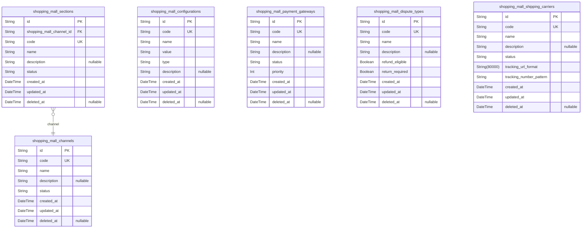
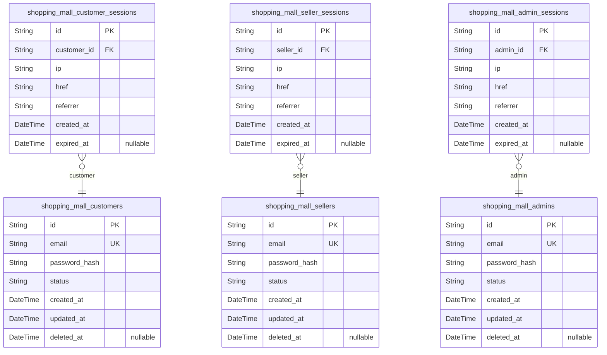
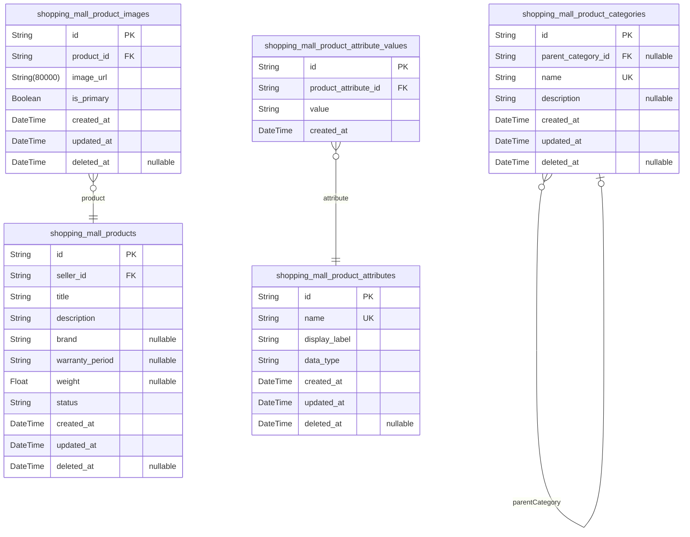
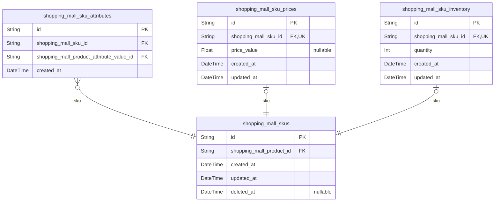
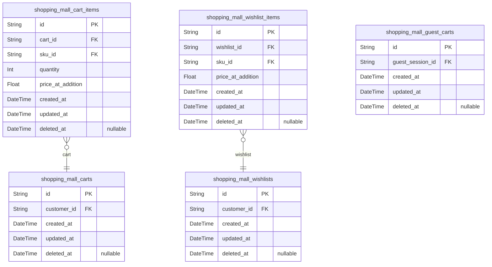
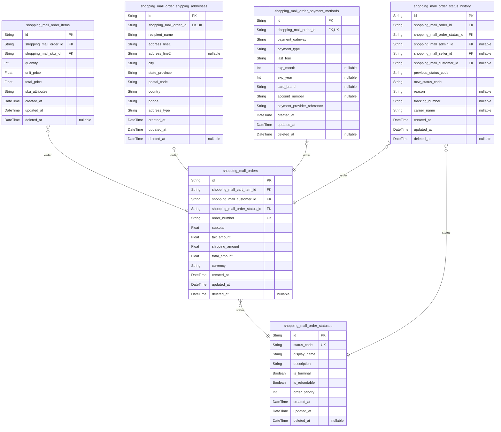
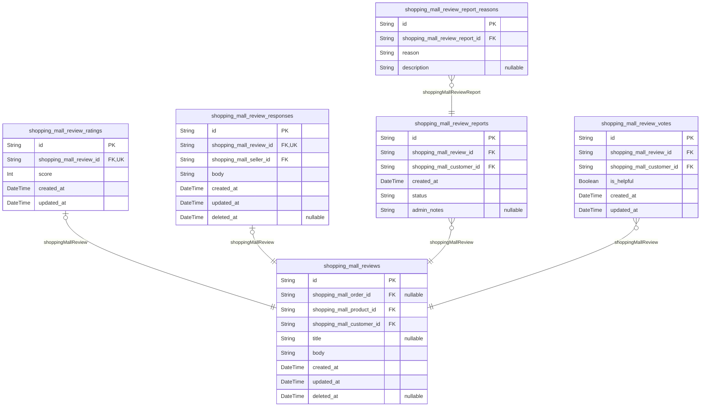
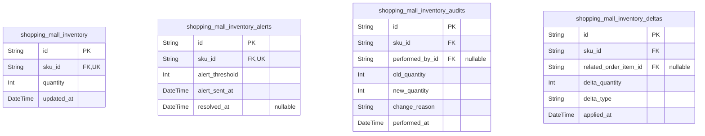
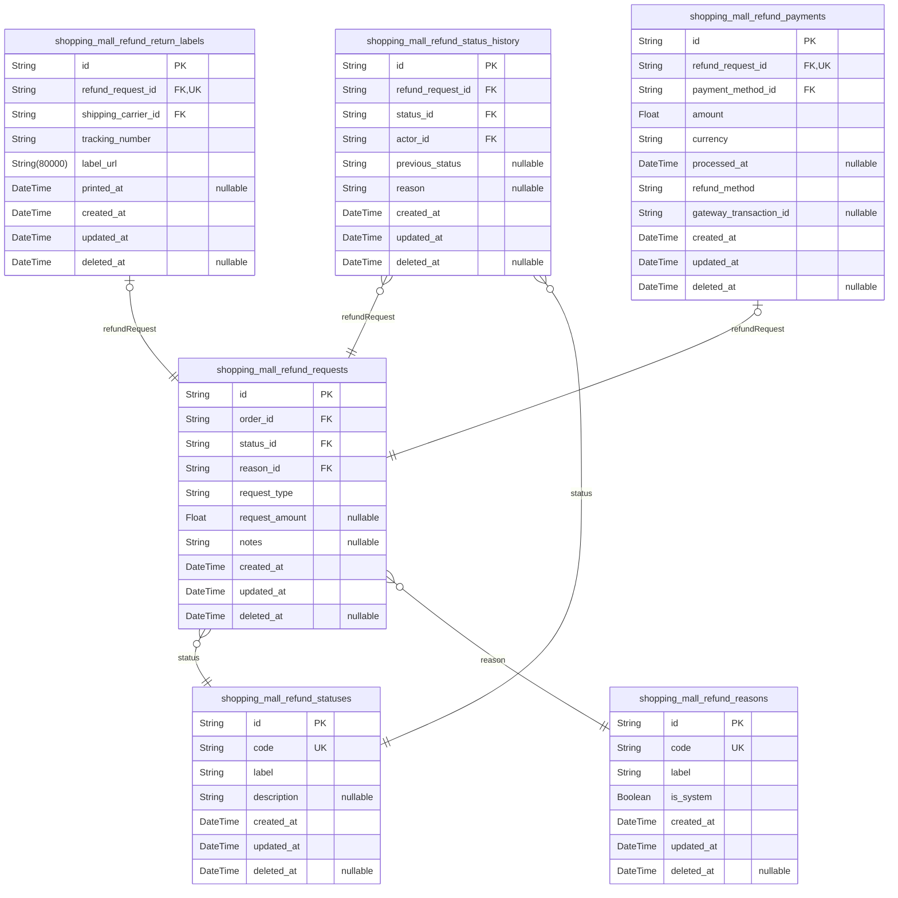
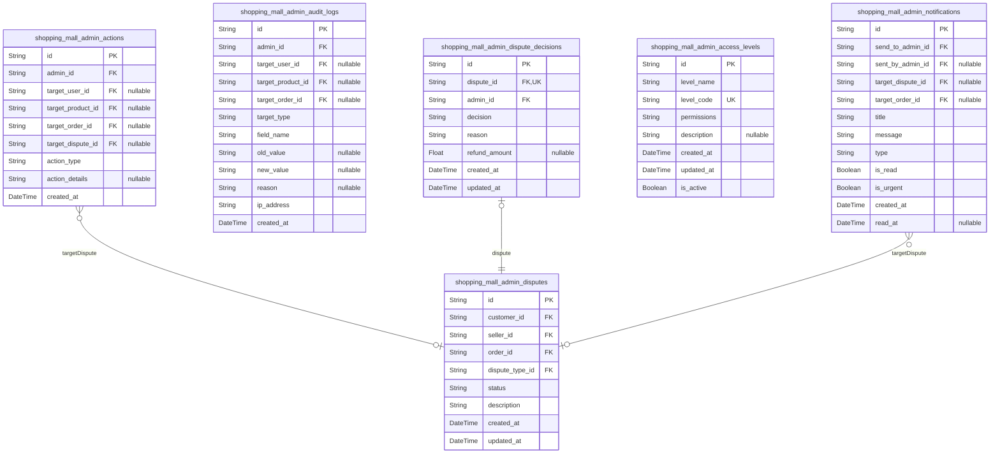

# Prisma Markdown

> Generated by [`prisma-markdown`](https://github.com/samchon/prisma-markdown)

- [Systematic](#systematic)
- [Actors](#actors)
- [Products](#products)
- [SKUs](#skus)
- [Carts](#carts)
- [Orders](#orders)
- [Reviews](#reviews)
- [Inventory](#inventory)
- [Refunds](#refunds)
- [Admin](#admin)

## Systematic

```mermaid
erDiagram
"shopping_mall_channels" {
  String id PK
  String code UK
  String name
  String description "nullable"
  String status
  DateTime created_at
  DateTime updated_at
  DateTime deleted_at "nullable"
}
"shopping_mall_sections" {
  String id PK
  String shopping_mall_channel_id FK
  String code UK
  String name
  String description "nullable"
  String status
  DateTime created_at
  DateTime updated_at
  DateTime deleted_at "nullable"
}
"shopping_mall_configurations" {
  String id PK
  String code UK
  String name
  String value
  String type
  String description "nullable"
  DateTime created_at
  DateTime updated_at
  DateTime deleted_at "nullable"
}
"shopping_mall_payment_gateways" {
  String id PK
  String code UK
  String name
  String description "nullable"
  String status
  Int priority
  DateTime created_at
  DateTime updated_at
  DateTime deleted_at "nullable"
}
"shopping_mall_dispute_types" {
  String id PK
  String code UK
  String name
  String description "nullable"
  Boolean refund_eligible
  Boolean return_required
  DateTime created_at
  DateTime updated_at
  DateTime deleted_at "nullable"
}
"shopping_mall_shipping_carriers" {
  String id PK
  String code UK
  String name
  String description "nullable"
  String status
  String(80000) tracking_url_format
  String tracking_number_pattern
  DateTime created_at
  DateTime updated_at
  DateTime deleted_at "nullable"
}
"shopping_mall_sections" }o--|| "shopping_mall_channels" : channel
```

### `shopping_mall_channels`

System channels for organizing content and features. Represents distinct
sections or areas of the platform like primary shopping, seller
marketplace, admin portal, etc. This is a reference table used by other
components to route functionality. Must maintain active/inactive states
for management.

@link shopping_mall_sections (1:N) - channels contain multiple sections
- 'active' status determines whether channel is visible to users
- 'code' is the internal identifier used in configuration

Properties as follows:

- `id`: Primary Key.
- `code`
  > Internal identifier code used in configuration files and system
  > references. Must be unique and snake_case format. Examples: 'sales',
  > 'sellerHub', 'adminDashboard'.
- `name`
  > Human-readable name of the channel displayed in admin interface.
  > Examples: 'Sales Channel', 'Seller Hub', 'Admin Dashboard'.
- `description`
  > Detailed description of the channel's purpose and scope. Used for admin
  > documentation.
- `status`
  > Active/inactive state of the channel. Only active channels are available
  > for assignment to sections and features. Values: 'active', 'inactive'.
- `created_at`
  > Timestamp when this channel was created. Standard temporal field for
  > audit trails.
- `updated_at`
  > Timestamp when this channel was last updated. Standard temporal field for
  > audit trails.
- `deleted_at`
  > Soft delete timestamp. Used for audit purposes when channels are
  > deactivated permanently. Null if not deleted.

### `shopping_mall_sections`

Content sections within channels, providing organization for user
interfaces and system navigation. Each section belongs to exactly one
channel and can be organized hierarchically. Used by frontend routing and
admin configuration.

Properties as follows:

- `id`: Primary Key.
- `shopping_mall_channel_id`: Section's parent channel. [shopping_mall_channels.id](#shopping_mall_channels).
- `code`
  > Internal identifier code used in configuration files and system
  > references. Must be unique across all sections and follow snake_case
  > format. Examples: 'productList', 'cartSummary', 'checkoutProcess'.
- `name`
  > Human-readable name of the section displayed in admin interface.
  > Examples: 'Product List', 'Cart Summary', 'Checkout Process'.
- `description`
  > Detailed description of the section's purpose and scope. Used for admin
  > documentation.
- `status`
  > Active/inactive state of the section. Only active sections are rendered
  > to users. Values: 'active', 'inactive'.
- `created_at`
  > Timestamp when this section was created. Standard temporal field for
  > audit trails.
- `updated_at`
  > Timestamp when this section was last updated. Standard temporal field for
  > audit trails.
- `deleted_at`
  > Soft delete timestamp. Used for audit purposes when sections are
  > deactivated permanently. Null if not deleted.

### `shopping_mall_configurations`

Global platform configuration settings that control behavior across the
system. These are key-value pairs that determine feature flags, business
rules, and operational parameters. No semantic structure assumed -
maintains flexibility for future configurations.

Properties as follows:

- `id`: Primary Key.
- `code`
  > Unique business key identifying this configuration setting. Follows
  > snake_case format with domain-specific prefixes. Examples:
  > 'platform_transaction_fee', 'payment_gateway_default',
  > 'max_items_in_cart'.
- `name`
  > Human-readable name for this configuration, shown in admin UI. Examples:
  > 'Platform Transaction Fee Percentage', 'Default Payment Gateway',
  > 'Maximum Items Allowed in Cart'.
- `value`
  > Configuration value as a string. Can represent JSON, boolean, number, or
  > text strings depending on context. Examples: '0.05', 'true', '{"enabled":
  > true}', 'stripe'.
- `type`
  > Data type of the configuration value. Used by admin interface for proper
  > rendering and parsing. Values: 'string', 'number', 'boolean', 'json'.
- `description`
  > Detailed description of the configuration's purpose, usage, and
  > acceptable values. Used for admin documentation.
- `created_at`
  > Timestamp when this configuration was created. Standard temporal field
  > for audit trails.
- `updated_at`
  > Timestamp when this configuration was last updated. Standard temporal
  > field for audit trails.
- `deleted_at`
  > Soft delete timestamp. Used for audit purposes when configurations are
  > deactivated permanently. Null if not deleted.

### `shopping_mall_payment_gateways`

Supported payment gateway configurations for processing transactions.
Defines which payment methods are available to customers and how they
integrate with the system. Used by checkout process to determine
available payment options.

Properties as follows:

- `id`: Primary Key.
- `code`
  > Internal identifier code used in configuration. Follows snake_case
  > format. Examples: 'stripe', 'paypal', 'bank_transfer'.
- `name`
  > Human-readable name of the payment gateway displayed to users. Examples:
  > 'Credit/Debit Card', 'PayPal', 'Bank Transfer'.
- `description`
  > Detailed description of the payment gateway's functionality and usage
  > notes for administrators and customers.
- `status`
  > Enabled/disabled state of the payment gateway. Only 'active' gateways are
  > shown to customers during checkout. Values: 'active', 'inactive'.
- `priority`
  > Display priority for payment methods in the UI. Higher values appear
  > first in the list. Range: 1-100.
- `created_at`
  > Timestamp when this payment gateway was configured. Standard temporal
  > field for audit trails.
- `updated_at`
  > Timestamp when this payment gateway was last updated. Standard temporal
  > field for audit trails.
- `deleted_at`
  > Soft delete timestamp. Used for audit purposes when payment gateways are
  > deactivated permanently. Null if not deleted.

### `shopping_mall_dispute_types`

Categorized dispute types for customer-seller conflicts, used to
standardize resolution processes. Each dispute type defines the category
and typical handling procedures. This is reference data used by the
dispute resolution system.

Properties as follows:

- `id`: Primary Key.
- `code`
  > System identifier code for the dispute type. Follows snake_case format.
  > Examples: 'product_damaged', 'wrong_item_received', 'not_delivered'.
- `name`
  > Human-readable name of the dispute category displayed in admin interface
  > and customer forms. Examples: 'Product Damaged', 'Wrong Item Received',
  > 'Item Not Delivered'.
- `description`
  > Detailed explanation of the dispute type, criteria for categorization,
  > and typical resolution steps. Used for admin training and customer
  > guidance.
- `refund_eligible`
  > Whether this dispute type typically qualifies for refund processing. True
  > for cases where customer is entitled to full or partial refund.
- `return_required`
  > Whether this dispute type typically requires the customer to return the
  > product. True for physical goods that must be returned for resolution.
- `created_at`
  > Timestamp when this dispute type was added to the system. Standard
  > temporal field for audit trails.
- `updated_at`
  > Timestamp when this dispute type was last updated. Standard temporal
  > field for audit trails.
- `deleted_at`
  > Soft delete timestamp. Used for audit purposes when dispute types are
  > deactivated permanently. Null if not deleted.

### `shopping_mall_shipping_carriers`

Supported shipping carriers for order fulfillment. Defines courier
partners that the platform integrates with for shipment tracking and
logistics management. Used by sellers to select shipping options and by
system to parse tracking data.

Properties as follows:

- `id`: Primary Key.
- `code`
  > Internal identifier code used in configuration and API integrations.
  > Follows snake_case format. Examples: 'fedex', 'ups', 'dhl', 'usps',
  > 'local_courier'.
- `name`
  > Human-readable name of the shipping carrier displayed to sellers and
  > customers. Examples: 'FedEx', 'UPS', 'DHL', 'USPS', 'Local Courier'.
- `description`
  > Detailed description of the carrier's service coverage, delivery times,
  > and integration requirements.
- `status`
  > Active/inactive state of the carrier integration. Only 'active' carriers
  > are available for selection during shipping. Values: 'active',
  > 'inactive'.
- `tracking_url_format`
  > URL template for generating tracking links using tracking numbers. Use
  > {tracking_number} as placeholder. Examples:
  > 'https://www.fedex.com/tracking?trackingnumber={tracking_number}'
- `tracking_number_pattern`
  > Regular expression pattern for validating tracking numbers format for
  > this carrier. Examples: '^[0-9]{12}$' for FedEx, '1Z[0-9A-Z]{16}$' for
  > UPS.
- `created_at`
  > Timestamp when this carrier was added to the system. Standard temporal
  > field for audit trails.
- `updated_at`
  > Timestamp when this carrier was last updated. Standard temporal field for
  > audit trails.
- `deleted_at`
  > Soft delete timestamp. Used for audit purposes when carriers are
  > deactivated permanently. Null if not deleted.

## Actors

```mermaid
erDiagram
"shopping_mall_customers" {
  String id PK
  String email UK
  String password_hash
  String status
  DateTime created_at
  DateTime updated_at
  DateTime deleted_at "nullable"
}
"shopping_mall_customer_sessions" {
  String id PK
  String customer_id FK
  String ip
  String href
  String referrer
  DateTime created_at
  DateTime expired_at "nullable"
}
"shopping_mall_sellers" {
  String id PK
  String email UK
  String password_hash
  String status
  DateTime created_at
  DateTime updated_at
  DateTime deleted_at "nullable"
}
"shopping_mall_seller_sessions" {
  String id PK
  String seller_id FK
  String ip
  String href
  String referrer
  DateTime created_at
  DateTime expired_at "nullable"
}
"shopping_mall_admins" {
  String id PK
  String email UK
  String password_hash
  String status
  DateTime created_at
  DateTime updated_at
  DateTime deleted_at "nullable"
}
"shopping_mall_admin_sessions" {
  String id PK
  String admin_id FK
  String ip
  String href
  String referrer
  DateTime created_at
  DateTime expired_at "nullable"
}
"shopping_mall_customer_sessions" }o--|| "shopping_mall_customers" : customer
"shopping_mall_seller_sessions" }o--|| "shopping_mall_sellers" : seller
"shopping_mall_admin_sessions" }o--|| "shopping_mall_admins" : admin
```

### `shopping_mall_customers`

Primary customer entity representing registered buyers on the
shoppingMall platform. Each customer has unique authentication
credentials and identity. This is a primary entity because customers
directly manage their accounts (registration, login, profile updates) and
require independent API endpoints for user management operations.
Customer account status can be active, suspended, banned, or pending
email verification. Note: This is not a person, but a connection basis
for purchasing activities.

Properties as follows:

- `id`: Primary Key.
- `email`
  > Customer's unique email address used for authentication and
  > communication. Must be unique across all customers.
- `password_hash`
  > Hashed password using secure algorithm for authentication. Never stored
  > as plain text. Required for login functionality.
- `status`
  > Account status of the customer. Valid values: "active", "suspended",
  > "banned", "pending_email_verification", "rejected". Controls access to
  > platform features.
- `created_at`
  > Timestamp when the customer account was created. Tracks account lifecycle
  > onset.
- `updated_at`
  > Timestamp when the customer account was last updated. Tracks active
  > account modifications.
- `deleted_at`
  > Timestamp when the customer account was soft-deleted. NULL if account is
  > still active. Enables account recovery and audit trails.

### `shopping_mall_customer_sessions`

Supporting entity for customer authentication sessions. Each record
represents an active or expired login session for a customer. This is a
subsidiary entity because sessions are managed entirely through customer
account operations (login creates session, logout invalidates session)
and do not require independent user-facing API endpoints. Mirroring the
required session table pattern: id, customer_id, ip, href, referrer,
created_at, expired_at with composite index.

Properties as follows:

- `id`: Primary Key.
- `customer_id`
  > Reference to the customer account that owns this session. {@link
  > shopping_mall_customers.id}
- `ip`: Client IP address from which the session was initiated.
- `href`: URL of the page where the session was initiated.
- `referrer`: Referrer URL that led the customer to the platform.
- `created_at`: Timestamp when this session was created and authenticated.
- `expired_at`
  > Timestamp when this session expired or was explicitly invalidated. NULL
  > if session is still active.

### `shopping_mall_sellers`

Primary seller entity representing registered merchants who list and sell
products on the shoppingMall platform. Each seller has unique
authentication credentials and identity. This is a primary entity because
sellers directly manage their merchant accounts (registration, login,
profile updates) and require independent API endpoints for dealer
management operations. Seller account status can be active, suspended,
banned, pending_review, or rejected. Note: This is not a person, but a
business entity for selling activities.

Properties as follows:

- `id`: Primary Key.
- `email`
  > Seller's unique email address used for authentication and communication.
  > Must be unique across all sellers.
- `password_hash`
  > Hashed password using secure algorithm for authentication. Never stored
  > as plain text. Required for login functionality.
- `status`
  > Account status of the seller. Valid values: "active", "suspended",
  > "banned", "pending_review", "rejected". Controls access to merchant
  > features.
- `created_at`
  > Timestamp when the seller account was created. Tracks account lifecycle
  > onset.
- `updated_at`
  > Timestamp when the seller account was last updated. Tracks active account
  > modifications.
- `deleted_at`
  > Timestamp when the seller account was soft-deleted. NULL if account is
  > still active. Enables account recovery and audit trails.

### `shopping_mall_seller_sessions`

Supporting entity for seller authentication sessions. Each record
represents an active or expired login session for a seller. This is a
subsidiary entity because sessions are managed entirely through seller
account operations (login creates session, logout invalidates session)
and do not require independent user-facing API endpoints. Mirroring the
required session table pattern: id, seller_id, ip, href, referrer,
created_at, expired_at with composite index.

Properties as follows:

- `id`: Primary Key.
- `seller_id`
  > Reference to the seller account that owns this session. {@link
  > shopping_mall_sellers.id}
- `ip`: Client IP address from which the session was initiated.
- `href`: URL of the page where the session was initiated.
- `referrer`: Referrer URL that led the seller to the platform.
- `created_at`: Timestamp when this session was created and authenticated.
- `expired_at`
  > Timestamp when this session expired or was explicitly invalidated. NULL
  > if session is still active.

### `shopping_mall_admins`

Primary admin entity representing platform administrators with full
system access and control. Each admin has unique authentication
credentials and identity. This is a primary entity because admins
directly manage their system accounts (login, logout, password reset) and
require independent API endpoints for administrative operations. Admin
account status can be active, suspended, or banned (rejected/pending not
applicable). Note: This is a system operator role with elevated
privileges.

Properties as follows:

- `id`: Primary Key.
- `email`
  > Admin's unique email address used for authentication and communication.
  > Must be unique across all admins.
- `password_hash`
  > Hashed password using secure algorithm for authentication. Never stored
  > as plain text. Required for login functionality.
- `status`
  > Account status of the admin. Valid values: "active", "suspended",
  > "banned". Controls access to system administration features.
- `created_at`
  > Timestamp when the admin account was created. Tracks account lifecycle
  > onset.
- `updated_at`
  > Timestamp when the admin account was last updated. Tracks active account
  > modifications.
- `deleted_at`
  > Timestamp when the admin account was soft-deleted. NULL if account is
  > still active. Enables account recovery and audit trails.

### `shopping_mall_admin_sessions`

Supporting entity for admin authentication sessions. Each record
represents an active or expired login session for an admin. This is a
subsidiary entity because sessions are managed entirely through admin
account operations (login creates session, logout invalidates session)
and do not require independent user-facing API endpoints. Mirroring the
required session table pattern: id, admin_id, ip, href, referrer,
created_at, expired_at with composite index.

Properties as follows:

- `id`: Primary Key.
- `admin_id`
  > Reference to the admin account that owns this session. {@link
  > shopping_mall_admins.id}
- `ip`: Client IP address from which the session was initiated.
- `href`: URL of the page where the session was initiated.
- `referrer`: Referrer URL that led the admin to the platform.
- `created_at`: Timestamp when this session was created and authenticated.
- `expired_at`
  > Timestamp when this session expired or was explicitly invalidated. NULL
  > if session is still active.

## Products

```mermaid
erDiagram
"shopping_mall_products" {
  String id PK
  String seller_id FK
  String title
  String description
  String brand "nullable"
  String warranty_period "nullable"
  Float weight "nullable"
  String status
  DateTime created_at
  DateTime updated_at
  DateTime deleted_at "nullable"
}
"shopping_mall_product_categories" {
  String id PK
  String parent_category_id FK "nullable"
  String name UK
  String description "nullable"
  DateTime created_at
  DateTime updated_at
  DateTime deleted_at "nullable"
}
"shopping_mall_product_attributes" {
  String id PK
  String name UK
  String display_label
  String data_type
  DateTime created_at
  DateTime updated_at
  DateTime deleted_at "nullable"
}
"shopping_mall_product_attribute_values" {
  String id PK
  String product_attribute_id FK
  String value
  DateTime created_at
}
"shopping_mall_product_images" {
  String id PK
  String product_id FK
  String(80000) image_url
  Boolean is_primary
  DateTime created_at
  DateTime updated_at
  DateTime deleted_at "nullable"
}
"shopping_mall_product_categories" }o--o| "shopping_mall_product_categories" : parentCategory
"shopping_mall_product_attribute_values" }o--|| "shopping_mall_product_attributes" : attribute
"shopping_mall_product_images" }o--|| "shopping_mall_products" : product
```

### `shopping_mall_products`

Main product entity representing items listed by sellers in the shopping
mall. Each product can have multiple variants (SKUs) managed in a
separate component. This table stores core product metadata. @link
shopping_mall_sellers.id represents the seller who created and owns this
product.

Properties as follows:

- `id`: Primary Key.
- `seller_id`: The seller who owns this product. @link shopping_mall_sellers.id.
- `title`: The title of the product shown to customers. Must be descriptive.
- `description`: Detailed description of the product including features and benefits.
- `brand`
  > Brand name associated with this product. Can be the seller's brand or
  > third-party.
- `warranty_period`
  > Duration of product warranty expressed in natural language (e.g., '1
  > year', 'Limited lifetime').
- `weight`
  > Weight of the product in kilograms (kg). Used for shipping cost
  > calculation.
- `status`
  > Current status of the product. Possible values: 'draft', 'active',
  > 'frozen'. Draft: not visible to customers. Active: visible and
  > purchasable. Frozen: hidden and non-purchasable, but retains history.
- `created_at`: Timestamp when the product was created.
- `updated_at`: Timestamp when the product was last updated.
- `deleted_at`
  > Timestamp when the product was logically deleted (soft delete). Null if
  > not deleted.

### `shopping_mall_product_categories`

Hierarchical categories for organizing products. Categories can have
parent-child relationships to form a tree structure. Customers browse and
filter products by category. Admins manage the category tree.

Properties as follows:

- `id`: Primary Key.
- `parent_category_id`
  > Parent category this category belongs to, if any. Self-referential
  > relationship. @link shopping_mall_product_categories.id.
- `name`
  > Human-readable name of the category displayed to users in UI (e.g.,
  > 'Electronics').
- `description`: Detailed description of the category's purpose and included products.
- `created_at`: Timestamp when the category was created.
- `updated_at`: Timestamp when the category was last updated.
- `deleted_at`
  > Timestamp when the category was logically deleted (soft delete). Null if
  > not deleted.

### `shopping_mall_product_attributes`

Definition of reusable product attributes such as color, size, material,
etc. Attributes are created once and can be applied to multiple products
to define variation options. Defined by admins or sellers with product
creation privileges.

Properties as follows:

- `id`: Primary Key.
- `name`
  > Internal name of the attribute (e.g., 'color'). Used in code and APIs.
  > Must be unique.
- `display_label`: Human-readable label of the attribute shown to users (e.g., 'Color').
- `data_type`
  > Data type of the attribute values. Possible values: 'text', 'select',
  > 'range'. Text: freeform string. Select: predefined choices. Range:
  > numeric range with min/max.
- `created_at`: Timestamp when the attribute was created.
- `updated_at`: Timestamp when the attribute was last updated.
- `deleted_at`
  > Timestamp when the attribute was logically deleted (soft delete). Null if
  > not deleted.

### `shopping_mall_product_attribute_values`

The actual values for a product attribute. Each value is linked to a
specific attribute (e.g., 'red' for 'color' attribute). These are managed
through the parent attribute and are subsidiary to it. Used to define
possible selections for SKUs.

Properties as follows:

- `id`: Primary Key.
- `product_attribute_id`
  > The attribute this value belongs to. @link
  > shopping_mall_product_attributes.id.
- `value`
  > The actual value (e.g., 'Red', 'Large', 'Cotton') that users can select.
  > Must be unique per attribute.
- `created_at`: Timestamp when this attribute value was created.

### `shopping_mall_product_images`

Images associated with products. A product can have multiple images
(e.g., multiple angles, details). One image can be marked as primary.
Images are managed as subsidiary to products.

Properties as follows:

- `id`: Primary Key.
- `product_id`: The product this image belongs to. @link shopping_mall_products.id.
- `image_url`: URL to the hosted image file. Must be a valid HTTP/HTTPS URI.
- `is_primary`
  > True if this is the primary image used as the product's thumbnail. Only
  > one image per product can be primary.
- `created_at`: Timestamp when the image was uploaded.
- `updated_at`: Timestamp when the image metadata was last updated.
- `deleted_at`
  > Timestamp when the image was logically deleted (soft delete). Null if not
  > deleted.

## SKUs

```mermaid
erDiagram
"shopping_mall_skus" {
  String id PK
  String shopping_mall_product_id FK
  DateTime created_at
  DateTime updated_at
  DateTime deleted_at "nullable"
}
"shopping_mall_sku_attributes" {
  String id PK
  String shopping_mall_sku_id FK
  String shopping_mall_product_attribute_value_id FK
  DateTime created_at
}
"shopping_mall_sku_prices" {
  String id PK
  String shopping_mall_sku_id FK,UK
  Float price_value "nullable"
  DateTime created_at
  DateTime updated_at
}
"shopping_mall_sku_inventory" {
  String id PK
  String shopping_mall_sku_id FK,UK
  Int quantity
  DateTime created_at
  DateTime updated_at
}
"shopping_mall_sku_attributes" }o--|| "shopping_mall_skus" : sku
"shopping_mall_sku_prices" |o--|| "shopping_mall_skus" : sku
"shopping_mall_sku_inventory" |o--|| "shopping_mall_skus" : sku
```

### `shopping_mall_skus`

Core SKU (Stock Keeping Unit) entity representing a unique variant of a
product defined by attribute combinations. Each SKU has independent
inventory and pricing. This table establishes the primary link between
products and their variants. Related to shopping_mall_products.id via
foreign key. Must never be modified directly by users - only through
product management with attribute selection.

Properties as follows:

- `id`: Primary Key.
- `shopping_mall_product_id`: The parent product this SKU belongs to. [shopping_mall_products.id](#shopping_mall_products).
- `created_at`: Timestamp when this SKU was created in the system.
- `updated_at`: Timestamp when this SKU was last updated.
- `deleted_at`
  > Soft delete indicator. When set, this SKU is considered archived and no
  > longer active in the catalog. Null means active.

### `shopping_mall_sku_attributes`

Junction table that establishes the many-to-many relationship between
SKUs (shopping_mall_skus) and product attribute values
(shopping_mall_product_attribute_values). Each row represents one
attribute value assigned to a specific SKU. For example, 'color=blue' or
'size=large'. Dynamically populated when a product with attributes is
created. Avoids denormalization of attribute values into the SKUs table.

Properties as follows:

- `id`: Primary Key.
- `shopping_mall_sku_id`
  > The SKU to which this attribute value is assigned. {@link
  > shopping_mall_skus.id}.
- `shopping_mall_product_attribute_value_id`
  > The specific attribute value (e.g., 'red', 'xl') assigned to this SKU.
  > [shopping_mall_product_attribute_values.id](#shopping_mall_product_attribute_values).
- `created_at`: Timestamp when this SKU-attribute relationship was created.

### `shopping_mall_sku_prices`

Stores override pricing for individual SKUs when the price differs from
the base product price. Default price inheritance is handled
application-side: if price_value is null, use product's base price.
Allows sellers to set different prices for different variants (e.g., size
XL costs more than size S). Only the active price for each SKU is stored
- no history kept here as price history is captured in order items. Never
calculate this value; store exact override amounts.

Properties as follows:

- `id`: Primary Key.
- `shopping_mall_sku_id`: The SKU for which this price is set. [shopping_mall_skus.id](#shopping_mall_skus).
- `price_value`
  > The override price for this SKU. Null means inherit parent product price.
  > Non-negative value.
- `created_at`: Timestamp when this price was created or last updated.
- `updated_at`: Timestamp when this price was last modified.

### `shopping_mall_sku_inventory`

Records the current inventory level for each SKU. This is the
authoritative source for stock quantity. Inventory automatically
decreases when an order is confirmed. May be manually increased by
sellers during restock. Zero inventory means the SKU is out-of-stock and
hidden from customers. No negative inventory allowed. This table is
updated atomically with order confirmation and direct seller adjustments.

Properties as follows:

- `id`: Primary Key.
- `shopping_mall_sku_id`: The SKU for which inventory is tracked. [shopping_mall_skus.id](#shopping_mall_skus).
- `quantity`
  > Current quantity in stock. Must be zero or positive integer. Zero means
  > the SKU is out of stock. Never negative.
- `created_at`: Timestamp when this inventory record was created.
- `updated_at`
  > Timestamp when this inventory level was last updated (e.g., by order or
  > seller restock).

## Carts

```mermaid
erDiagram
"shopping_mall_carts" {
  String id PK
  String customer_id FK
  DateTime created_at
  DateTime updated_at
  DateTime deleted_at "nullable"
}
"shopping_mall_cart_items" {
  String id PK
  String cart_id FK
  String sku_id FK
  Int quantity
  Float price_at_addition
  DateTime created_at
  DateTime updated_at
  DateTime deleted_at "nullable"
}
"shopping_mall_wishlists" {
  String id PK
  String customer_id FK
  DateTime created_at
  DateTime updated_at
  DateTime deleted_at "nullable"
}
"shopping_mall_wishlist_items" {
  String id PK
  String wishlist_id FK
  String sku_id FK
  Float price_at_addition
  DateTime created_at
  DateTime updated_at
  DateTime deleted_at "nullable"
}
"shopping_mall_guest_carts" {
  String id PK
  String guest_session_id FK
  DateTime created_at
  DateTime updated_at
  DateTime deleted_at "nullable"
}
"shopping_mall_cart_items" }o--|| "shopping_mall_carts" : cart
"shopping_mall_wishlist_items" }o--|| "shopping_mall_wishlists" : wishlist
```

### `shopping_mall_carts`

Active shopping carts owned by authenticated customers. Each cart
represents a session of product selections that the user intends to
purchase. Items are added and removed by the customer until checkout.
This is a primary entity because customers independently manage their
carts, view contents, and initiate checkout from this context. {@link
shopping_mall_cart_items} records belong to this cart.

Properties as follows:

- `id`: Primary Key.
- `customer_id`: Customer who owns this cart. [shopping_mall_customers.id](#shopping_mall_customers).
- `created_at`: When the cart was created. Always populated.
- `updated_at`: When the cart was last modified (item added/removed). Always populated.
- `deleted_at`
  > Soft delete timestamp. If null, cart is active. Used for user-initiated
  > cart deletion.

### `shopping_mall_cart_items`

Individual product items within a customer's active shopping cart. Each
item references a specific SKU and locks in the price at the time it was
added to the cart. This is a subsidiary entity because it only exists
within the context of a cart and is managed entirely through the parent
cart (do not create/modify directly). Cart items may be moved to wishlist
or removed. [shopping_mall_carts](#shopping_mall_carts) contains these items. {@link
shopping_mall_skus} represents the product variation stored.

Properties as follows:

- `id`: Primary Key.
- `cart_id`: Cart that contains this item. [shopping_mall_carts.id](#shopping_mall_carts).
- `sku_id`
  > The specific SKU (product variant) being added to cart. {@link
  > shopping_mall_skus.id}.
- `quantity`: Number of units of this SKU in the cart. Must be at least 1.
- `price_at_addition`
  > Price of the SKU at the time it was added to the cart. Maintains price
  > lock even if product price changes later. This ensures customer trust and
  > consistency during checkout.
- `created_at`: When this item was added to the cart. Always populated.
- `updated_at`
  > When this item's quantity was last modified or it was moved from
  > wishlist. Always populated.
- `deleted_at`
  > Soft delete timestamp. If null, item is active in cart. Used for item
  > removal.

### `shopping_mall_wishlists`

Active wishlists owned by authenticated customers. Each wishlist
represents items the customer has saved for future consideration. Unlike
carts, wishlists don't imply immediate purchase intent. This is a primary
entity because customers independently manage their wishlists (add/remove
items, view contents). [shopping_mall_wishlist_items](#shopping_mall_wishlist_items) records
belong to this wishlist.

Properties as follows:

- `id`: Primary Key.
- `customer_id`: Customer who owns this wishlist. [shopping_mall_customers.id](#shopping_mall_customers).
- `created_at`: When the wishlist was created. Always populated.
- `updated_at`
  > When the wishlist was last modified (item added/removed). Always
  > populated.
- `deleted_at`
  > Soft delete timestamp. If null, wishlist is active. Used for
  > user-initiated wishlist deletion.

### `shopping_mall_wishlist_items`

Individual product items within a customer's wishlist. Each item
references a specific SKU and locks in the price at the time it was added
to the wishlist. This is a subsidiary entity because it only exists
within the context of a wishlist and is managed entirely through the
parent wishlist (do not create/modify directly). Items may be moved to
cart or removed. [shopping_mall_wishlists](#shopping_mall_wishlists) contains these items.
[shopping_mall_skus](#shopping_mall_skus) represents the product variation stored.

Properties as follows:

- `id`: Primary Key.
- `wishlist_id`: Wishlist that contains this item. [shopping_mall_wishlists.id](#shopping_mall_wishlists).
- `sku_id`
  > The specific SKU (product variant) being saved to wishlist. {@link
  > shopping_mall_skus.id}.
- `price_at_addition`
  > Price of the SKU at the time it was added to the wishlist. Maintains
  > price lock even if product price changes later. Used for price-drop
  > notifications to customers.
- `created_at`: When this item was added to the wishlist. Always populated.
- `updated_at`
  > When this item was last modified (moved from cart or updated metadata).
  > Always populated.
- `deleted_at`
  > Soft delete timestamp. If null, item is active in wishlist. Used for item
  > removal.

### `shopping_mall_guest_carts`

Shopping carts for anonymous (guest) users who are not logged in. These
carts are tied to a browser session (guest_session_id) rather than a user
account. Used to allow guest users to add items to cart before login.
This is a primary entity because guests independently manage these carts
and may merge them when logging in. [shopping_mall_cart_items](#shopping_mall_cart_items)
records belong to this guest cart. {@link
shopping_mall_customer_sessions} stores session data.

Properties as follows:

- `id`: Primary Key.
- `guest_session_id`
  > The customer session tied to this guest cart. {@link
  > shopping_mall_customer_sessions.id}.
- `created_at`: When the guest cart was created. Always populated.
- `updated_at`
  > When the guest cart was last modified (item added/removed). Always
  > populated.
- `deleted_at`
  > Soft delete timestamp. If null, cart is active. Used for session
  > expiration (after 30 days).

## Orders

```mermaid
erDiagram
"shopping_mall_orders" {
  String id PK
  String shopping_mall_cart_item_id FK
  String shopping_mall_customer_id FK
  String shopping_mall_order_status_id FK
  String order_number UK
  Float subtotal
  Float tax_amount
  Float shipping_amount
  Float total_amount
  String currency
  DateTime created_at
  DateTime updated_at
  DateTime deleted_at "nullable"
}
"shopping_mall_order_items" {
  String id PK
  String shopping_mall_order_id FK
  String shopping_mall_sku_id FK
  Int quantity
  Float unit_price
  Float total_price
  String sku_attributes
  DateTime created_at
  DateTime updated_at
  DateTime deleted_at "nullable"
}
"shopping_mall_order_shipping_addresses" {
  String id PK
  String shopping_mall_order_id FK,UK
  String recipient_name
  String address_line1
  String address_line2 "nullable"
  String city
  String state_province
  String postal_code
  String country
  String phone
  String address_type
  DateTime created_at
  DateTime updated_at
  DateTime deleted_at "nullable"
}
"shopping_mall_order_payment_methods" {
  String id PK
  String shopping_mall_order_id FK,UK
  String payment_gateway
  String payment_type
  String last_four
  Int exp_month "nullable"
  Int exp_year "nullable"
  String card_brand "nullable"
  String account_number "nullable"
  String payment_provider_reference
  DateTime created_at
  DateTime updated_at
  DateTime deleted_at "nullable"
}
"shopping_mall_order_statuses" {
  String id PK
  String status_code UK
  String display_name
  String description
  Boolean is_terminal
  Boolean is_refundable
  Int order_priority
  DateTime created_at
  DateTime updated_at
  DateTime deleted_at "nullable"
}
"shopping_mall_order_status_history" {
  String id PK
  String shopping_mall_order_id FK
  String shopping_mall_order_status_id FK
  String shopping_mall_admin_id FK "nullable"
  String shopping_mall_seller_id FK "nullable"
  String shopping_mall_customer_id FK "nullable"
  String previous_status_code
  String new_status_code
  String reason "nullable"
  String tracking_number "nullable"
  String carrier_name "nullable"
  DateTime created_at
  DateTime updated_at
  DateTime deleted_at "nullable"
}
"shopping_mall_orders" }o--|| "shopping_mall_order_statuses" : status
"shopping_mall_order_items" }o--|| "shopping_mall_orders" : order
"shopping_mall_order_shipping_addresses" |o--|| "shopping_mall_orders" : order
"shopping_mall_order_payment_methods" |o--|| "shopping_mall_orders" : order
"shopping_mall_order_status_history" }o--|| "shopping_mall_orders" : order
"shopping_mall_order_status_history" }o--|| "shopping_mall_order_statuses" : status
```

### `shopping_mall_orders`

Immutable snapshot of a completed transaction at checkout time. Captures
the state of cart, shipping, payment, and totals exactly when the order
was placed. This table represents a persistent audit record of customer
purchases. Cannot be modified after creation. References cart items from
shopping_mall_cart_items at the time of purchase. Used by order tracking,
refund systems, and audit logs.

Properties as follows:

- `id`: Primary Key.
- `shopping_mall_cart_item_id`
  > Reference to the cart item state at time of purchase. {@link
  > shopping_mall_cart_items.id}. This is a snapshot reference, not a live
  > link to the current cart state.
- `shopping_mall_customer_id`
  > Customer who placed the order. [shopping_mall_customers.id](#shopping_mall_customers).
  > Snapshotted at order time for audit purposes.
- `shopping_mall_order_status_id`
  > Current status of this order. [shopping_mall_order_statuses.id](#shopping_mall_order_statuses).
  > References the approved status code.
- `order_number`
  > Unique, human-readable order identifier in format "ORD-YYYYMMDD-NNNN".
  > Used for customer communications and support.
- `subtotal`
  > Sum of all line item prices at time of order, before tax and shipping.
  > Locked at time of purchase and never changes.
- `tax_amount`
  > Sales tax amount calculated at time of checkout based on shipping
  > address. Fixed at order creation.
- `shipping_amount`
  > Shipping cost calculated at time of checkout based on address and weight.
  > Fixed at order creation.
- `total_amount`
  > Final amount charged to customer (subtotal + tax + shipping). Locked at
  > time of purchase.
- `currency`
  > Currency code used for this transaction (e.g., "USD", "EUR"). Should
  > match the payment method currency.
- `created_at`
  > Timestamp when the order was placed and transaction was confirmed.
  > Immutable.
- `updated_at`
  > Timestamp of the last status update. Updated whenever status changes via
  > shopping_mall_order_status_history.
- `deleted_at`
  > Soft delete marker. Allows for data retention for audit compliance while
  > hiding from normal queries. Never physically delete orders.

### `shopping_mall_order_items`

Represents individual line items in an order. Each row captures a product
SKU, quantity, and price at the exact moment of purchase. This is not a
reference to live inventory or cart items but a snapshot of the
transaction. All data is immutable after creation. Used for order
fulfillment, refund calculations, and revenue reporting.

Properties as follows:

- `id`: Primary Key.
- `shopping_mall_order_id`
  > Parent order that this line item belongs to. {@link
  > shopping_mall_orders.id}. Required to link to the transaction snapshot.
- `shopping_mall_sku_id`
  > The product SKU that was purchased at time of order. {@link
  > shopping_mall_skus.id}. Captured as a snapshot rather than a live
  > reference.
- `quantity`: Number of units purchased in this line item. Locked at time of checkout.
- `unit_price`
  > Price per unit at time of purchase. This is a snapshot of the SKU price
  > at checkout, which may differ from current market price.
- `total_price`
  > Total for this line item (quantity × unit_price). Calculated and locked
  > at order creation.
- `sku_attributes`
  > JSON representation of the SKU's specific attributes at purchase time
  > (e.g., color, size, material). Used for accurate fulfillment when SKU
  > details later change.
- `created_at`: Timestamp when this order line item was added to the order. Immutable.
- `updated_at`
  > Timestamp when this order item was last modified (rare, typically only
  > during refund adjustments).
- `deleted_at`
  > Soft delete marker. Allows for data retention for audit compliance while
  > hiding from normal queries. Never physically delete order items.

### `shopping_mall_order_shipping_addresses`

Snapshot of the shipping address as it existed at the time of order
placement. Contains all address details in plain text fields to ensure
consistency and auditability. Never references live customer addresses -
all data is copied from the customer's profile at checkout time and
preserved forever. Required for accurate fulfillment, dispute resolution,
and tax calculations.

Properties as follows:

- `id`: Primary Key.
- `shopping_mall_order_id`
  > The order this shipping address belongs to. {@link
  > shopping_mall_orders.id}. Required for linking address to transaction.
- `recipient_name`: Full name of the recipient as provided during checkout.
- `address_line1`: First line of the street address.
- `address_line2`: Second line of the street address (apt, suite, etc.). Optional.
- `city`: City name as provided during checkout.
- `state_province`: State, province, or region name as provided during checkout.
- `postal_code`: Postal or ZIP code as provided during checkout.
- `country`: Country name as provided during checkout (ISO 3166-1 alpha-2 format).
- `phone`: Phone number for delivery contact purposes.
- `address_type`: Label indicating address type ("home", "work", "other", or custom).
- `created_at`: Timestamp when this address snapshot was captured at checkout.
- `updated_at`
  > Timestamp of last modification (typically only during correcting delivery
  > attempts).
- `deleted_at`
  > Soft delete marker. Allows for data retention for audit compliance while
  > hiding from normal queries. Never physically delete address snapshots.

### `shopping_mall_order_payment_methods`

Snapshot of the payment method as it existed at the time of order
placement. This table stores obfuscated payment data (last 4 digits,
type, provider) rather than live references to customer payment profiles.
Used for transaction recording, dispute resolution, and refund
processing. Ensure PCI compliance by never storing sensitive payment
details.

Properties as follows:

- `id`: Primary Key.
- `shopping_mall_order_id`
  > The order this payment method was used for. {@link
  > shopping_mall_orders.id}. Required for linking to transaction.
- `payment_gateway`
  > Name of the payment processor used (e.g., "Stripe", "PayPal", "Adyen").
  > Must match shopping_mall_payment_gateways table entries.
- `payment_type`
  > Type of payment method ("credit_card", "debit_card", "digital_wallet",
  > "bank_transfer").
- `last_four`
  > Last four digits of the payment card or identifier. Used for customer
  > reference and reconciliation.
- `exp_month`
  > Expiration month of the card (1-12). For digital wallets or bank
  > transfers, this may be null.
- `exp_year`
  > Expiration year of the card (YYYY). For digital wallets or bank
  > transfers, this may be null.
- `card_brand`
  > Card brand name ("Visa", "MasterCard", "American Express", etc.). For
  > digital wallets or bank transfers, this may be null.
- `account_number`
  > Obfuscated account number for bank transfers or digital wallets. Always
  > masked, never complete.
- `payment_provider_reference`
  > Unique reference ID returned by the payment provider for this
  > transaction. Used for reconciliation and dispute resolution.
- `created_at`: Timestamp when this payment method snapshot was captured at checkout.
- `updated_at`
  > Timestamp of last modification (typically only during payment reversal or
  > processing errors).
- `deleted_at`
  > Soft delete marker. Allows for data retention for audit compliance while
  > hiding from normal queries. Never physically delete payment snapshots.

### `shopping_mall_order_statuses`

Reference table defining the valid status codes for order lifecycle
management. Acts as a lookup for the order_status_id in
shopping_mall_orders. This table provides consistent, standardized status
codes and human-readable descriptions for all orders across the system.
Used by UI for display, backend for state transitions, and reporting for
aggregation.

Properties as follows:

- `id`: Primary Key.
- `status_code`
  > Unique machine-readable status identifier (e.g., "pending", "processing",
  > "shipped", "delivered", "cancelled", "returned"). Must match status
  > transitions defined in order processing business logic.
- `display_name`
  > Human-readable name for display to customers and admins (e.g., "Order
  > Placed", "Processing Payment", "Shipped").
- `description`
  > Detailed description of what this status means in business terms and
  > system behavior.
- `is_terminal`
  > True if this status is final and no further transitions are allowed
  > (e.g., delivered, cancelled, returned). False if transitioning is still
  > possible.
- `is_refundable`
  > True if customers can request refunds while in this status. False if
  > refunds are prohibited (e.g., delivered status may allow refunds but
  > cancelled does not).
- `order_priority`
  > Numerical ranking for ordering statuses chronologically (e.g., pending=1,
  > processing=2, shipped=3, delivered=4). Used in status history timelines.
- `created_at`: Timestamp when this status definition was created or last updated.
- `updated_at`: Timestamp of last modification to this status definition.
- `deleted_at`
  > Soft delete marker. Allow deactivation of statuses without breaking
  > historical order data.

### `shopping_mall_order_status_history`

Append-only audit trail of all status transitions for each order. Records
every change in order status with timestamp and admin/user responsible.
This table ensures complete traceability and auditability for compliance,
dispute resolution, and forensic analysis. Never modify or delete entries
- only insert new records when status changes. Required by business rules
for payment, shipment, and refund processes.

Properties as follows:

- `id`: Primary Key.
- `shopping_mall_order_id`
  > The order this status change applies to. [shopping_mall_orders.id](#shopping_mall_orders).
  > Required to link status change to transaction.
- `shopping_mall_order_status_id`
  > The new order status after transition. {@link
  > shopping_mall_order_statuses.id}. Links to the status definition.
- `shopping_mall_admin_id`
  > The admin who triggered this status change (if applicable). {@link
  > shopping_mall_admins.id}. Optional for automated transitions.
- `shopping_mall_seller_id`
  > The seller who triggered this status change (e.g., marking as shipped).
  > [shopping_mall_sellers.id](#shopping_mall_sellers). Used for tracking responsibility.
- `shopping_mall_customer_id`
  > The customer who triggered this status change (e.g., requesting
  > cancellation). [shopping_mall_customers.id](#shopping_mall_customers). Used for
  > accountability.
- `previous_status_code`
  > The order status code before this transition (for comparison and audit
  > trail). Stored as string for audit purposes even if reference data
  > changes later.
- `new_status_code`
  > The order status code after this transition (for audit trail). Stored as
  > string for audit purposes even if reference data changes later.
- `reason`
  > Explanation for why this status change occurred. For admin actions:
  > "Overrode decision due to customer complaint". For seller: "Package
  > shipped with tracking #12345". For customer: "Requested cancellation
  > after event cancellation".
- `tracking_number`
  > Tracking number provided when order is marked as shipped. Optional field
  > only populated during 'shipped' status transitions.
- `carrier_name`
  > Shipping carrier name when tracking number is provided. Must match
  > shopping_mall_shipping_carriers entries or be free text.
- `created_at`
  > Timestamp when this status change occurred. Immutable record of
  > transition time.
- `updated_at`: Timestamp of last modification (should never be updated after creation).
- `deleted_at`
  > Soft delete marker. Never physically deleted - audit trails must be
  > preserved for legal compliance.

## Reviews

```mermaid
erDiagram
"shopping_mall_reviews" {
  String id PK
  String shopping_mall_order_id FK "nullable"
  String shopping_mall_product_id FK
  String shopping_mall_customer_id FK
  String title "nullable"
  String body
  DateTime created_at
  DateTime updated_at
  DateTime deleted_at "nullable"
}
"shopping_mall_review_ratings" {
  String id PK
  String shopping_mall_review_id FK,UK
  Int score
  DateTime created_at
  DateTime updated_at
}
"shopping_mall_review_responses" {
  String id PK
  String shopping_mall_review_id FK,UK
  String shopping_mall_seller_id FK
  String body
  DateTime created_at
  DateTime updated_at
  DateTime deleted_at "nullable"
}
"shopping_mall_review_reports" {
  String id PK
  String shopping_mall_review_id FK
  String shopping_mall_customer_id FK
  DateTime created_at
  String status
  String admin_notes "nullable"
}
"shopping_mall_review_report_reasons" {
  String id PK
  String shopping_mall_review_report_id FK
  String reason
  String description "nullable"
}
"shopping_mall_review_votes" {
  String id PK
  String shopping_mall_review_id FK
  String shopping_mall_customer_id FK
  Boolean is_helpful
  DateTime created_at
  DateTime updated_at
}
"shopping_mall_review_ratings" |o--|| "shopping_mall_reviews" : shoppingMallReview
"shopping_mall_review_responses" |o--|| "shopping_mall_reviews" : shoppingMallReview
"shopping_mall_review_reports" }o--|| "shopping_mall_reviews" : shoppingMallReview
"shopping_mall_review_report_reasons" }o--|| "shopping_mall_review_reports" : shoppingMallReviewReport
"shopping_mall_review_votes" }o--|| "shopping_mall_reviews" : shoppingMallReview
```

### `shopping_mall_reviews`

Core review entity representing customer feedback on products. A review
is only allowed after order delivery. Verified purchase status is
determined by existence of a related order. Includes review content and
basic metadata. [shopping_mall_orders.id](#shopping_mall_orders) for verified purchase
verification. [shopping_mall_products.id](#shopping_mall_products) for product reference.
[shopping_mall_customers.id](#shopping_mall_customers) for reviewer.

Properties as follows:

- `id`: Primary Key.
- `shopping_mall_order_id`
  > Order that was completed and enabled this review. {@link
  > shopping_mall_orders.id}. Required for verified purchase assessment.
- `shopping_mall_product_id`: Product that the review is about. [shopping_mall_products.id](#shopping_mall_products).
- `shopping_mall_customer_id`: Customer who wrote the review. [shopping_mall_customers.id](#shopping_mall_customers).
- `title`: Short title of the review (max 100 characters).
- `body`
  > Main review text content (max 2000 characters). Must be at least 10
  > characters.
- `created_at`: Timestamp when the review was created.
- `updated_at`: Timestamp when the review was last updated.
- `deleted_at`: Timestamp when the review was soft-deleted. Null if active.

### `shopping_mall_review_ratings`

Numeric rating scores (1-5 stars) associated with reviews. Each review
has exactly one rating. This entity is managed through its parent review
and does not require independent API endpoints. {@link
shopping_mall_reviews.id} for review reference.

Properties as follows:

- `id`: Primary Key.
- `shopping_mall_review_id`: The review this rating belongs to. [shopping_mall_reviews.id](#shopping_mall_reviews).
- `score`: Rating score from 1 to 5. Must be an integer between 1 and 5 inclusive.
- `created_at`: Timestamp when the rating was recorded.
- `updated_at`: Timestamp when the rating was last updated.

### `shopping_mall_review_responses`

Seller responses to customer reviews. Each review can have one response
per seller. Seller responses are editable for only 7 days after posting.
This is a supporting entity managed exclusively through its parent
review. [shopping_mall_reviews.id](#shopping_mall_reviews) for parent review. {@link
shopping_mall_sellers.id} for seller author.

Properties as follows:

- `id`: Primary Key.
- `shopping_mall_review_id`: The review that this response answers. [shopping_mall_reviews.id](#shopping_mall_reviews).
- `shopping_mall_seller_id`: The seller who wrote this response. [shopping_mall_sellers.id](#shopping_mall_sellers).
- `body`: Response content from seller (max 1000 characters).
- `created_at`: Timestamp when the response was posted.
- `updated_at`: Timestamp when the response was last updated.
- `deleted_at`: Timestamp when the response was soft-deleted. Null if active.

### `shopping_mall_review_reports`

Reports filed by customers to flag inappropriate or problematic reviews.
Each report is associated with one specific review and one reporter. Used
for moderation workflow. This is a system-maintained entity supporting
moderation and does not have independent user management. {@link
shopping_mall_reviews.id} for reported review. {@link
shopping_mall_customers.id} for reporter.

Properties as follows:

- `id`: Primary Key.
- `shopping_mall_review_id`: The review that has been reported. [shopping_mall_reviews.id](#shopping_mall_reviews).
- `shopping_mall_customer_id`: The customer who filed this report. [shopping_mall_customers.id](#shopping_mall_customers).
- `created_at`: Timestamp when the report was filed.
- `status`: Report status: 'pending', 'flagged', 'approved', 'rejected'.
- `admin_notes`: Internal notes from admin for report handling. Optional.

### `shopping_mall_review_report_reasons`

Reason codes for review reports. Each report can have multiple reasons.
Standardized list of report reasons enables consistent moderation. This
is a supporting entity that exists only as children of review reports.
[shopping_mall_review_reports.id](#shopping_mall_review_reports) for parent report.

Properties as follows:

- `id`: Primary Key.
- `shopping_mall_review_report_id`
  > The report this reason belongs to. {@link
  > shopping_mall_review_reports.id}.
- `reason`
  > Predefined reason for report: 'spam', 'inappropriate_content',
  > 'false_information', 'other'.
- `description`
  > Detailed description of the reported issue (if reason is 'other').
  > Optional.

### `shopping_mall_review_votes`

Helpful/not-helpful votes from customers on reviews. Each customer can
vote once per review. This is a supporting entity used for ranking review
quality and does not represent an independently managed entity. {@link
shopping_mall_reviews.id} for reviewed content. {@link
shopping_mall_customers.id} for voter.

Properties as follows:

- `id`: Primary Key.
- `shopping_mall_review_id`: The review that received this vote. [shopping_mall_reviews.id](#shopping_mall_reviews).
- `shopping_mall_customer_id`: The customer who cast this vote. [shopping_mall_customers.id](#shopping_mall_customers).
- `is_helpful`: True if vote is 'Helpful', false if 'Not Helpful'.
- `created_at`: Timestamp when the vote was cast.
- `updated_at`: Timestamp when the vote was updated (if changed).

## Inventory

```mermaid
erDiagram
"shopping_mall_inventory" {
  String id PK
  String sku_id FK,UK
  Int quantity
  DateTime updated_at
}
"shopping_mall_inventory_alerts" {
  String id PK
  String sku_id FK,UK
  Int alert_threshold
  DateTime alert_sent_at
  DateTime resolved_at "nullable"
}
"shopping_mall_inventory_audits" {
  String id PK
  String sku_id FK
  String performed_by_id FK "nullable"
  Int old_quantity
  Int new_quantity
  String change_reason
  DateTime performed_at
}
"shopping_mall_inventory_deltas" {
  String id PK
  String sku_id FK
  String related_order_item_id FK "nullable"
  Int delta_quantity
  String delta_type
  DateTime applied_at
}
```

### `shopping_mall_inventory`

Current inventory levels for each SKU. Represents the authoritative
source of stock quantity for each product variant. Updated atomically
when orders are confirmed or inventory is adjusted. This is the primary
entity for inventory management, and sellers and admins need to
independently view and modify these values.

This table should be referenced by shopping_mall_inventory_alerts,
shopping_mall_inventory_audits, and shopping_mall_inventory_deltas to
establish the inventory context for alerts, audits, and deltas.

Properties as follows:

- `id`: Primary Key.
- `sku_id`
  > Reference to the SKU whose inventory this record represents. {@link
  > shopping_mall_skus.id}.
- `quantity`
  > The current quantity of the product in stock. Must be zero or a positive
  > integer. Negative inventory is not permitted. This value is updated
  > atomically when orders are confirmed or inventory is manually adjusted.
- `updated_at`
  > Timestamp when this inventory record was last updated. Reflects the most
  > recent change to the stock quantity. Always updated when the quantity
  > changes.

### `shopping_mall_inventory_alerts`

Tracks inventory alerts for low-stock conditions. Whenever an inventory
quantity falls to 3 units or fewer, an alert record is created. This
table helps identify products that need replenishment. Alerts are
automatically created and resolved based on inventory changes.

This table is subsidiary to shopping_mall_inventory as it provides alert
state information that is managed automatically by the system based on
inventory levels. It doesn't need independent API endpoints, only
system-managed updates.

Properties as follows:

- `id`: Primary Key.
- `sku_id`
  > Reference to the SKU that triggered this low-stock alert. {@link
  > shopping_mall_skus.id}.
- `alert_threshold`
  > The fixed threshold at which the alert was triggered. Always 3 according
  > to business requirements, representing when inventory falls to 3 units or
  > fewer.
- `alert_sent_at`
  > Timestamp when the low-stock alert was first triggered and notification
  > was sent.
- `resolved_at`
  > Timestamp when the alert was resolved (when inventory increased above 3
  > units). Null means the alert is still active.

### `shopping_mall_inventory_audits`

Complete audit trail of all inventory changes. Every time inventory is
modified (through order confirmation, manual adjustment, or system
process), a record is created here with the old and new values. This
table captures the complete history for compliance and reconciliation.

This table is subsidiary to shopping_mall_inventory as it serves as an
audit trail for inventory changes. It's append-only and managed
automatically by system processes in response to inventory updates, not
directly by users.

Properties as follows:

- `id`: Primary Key.
- `sku_id`
  > Reference to the SKU whose inventory was changed. {@link
  > shopping_mall_skus.id}.
- `performed_by_id`
  > Reference to the actor who performed the inventory change. Either a
  > seller or admin who made a manual adjustment, or system-generated when
  > triggered by an order. [shopping_mall_sellers.id](#shopping_mall_sellers) or {@link
  > shopping_mall_admins.id}. This relationship references either seller or
  > admin based on context.
- `old_quantity`
  > The inventory quantity before the change occurred. Used to determine the
  > delta.
- `new_quantity`
  > The inventory quantity after the change occurred. Always the current
  > value stored in shopping_mall_inventory.
- `change_reason`
  > The business reason for the inventory change. Examples: 'Order
  > confirmed', 'Manual adjustment', 'Inventory correction'.
- `performed_at`
  > Timestamp when the inventory change was applied. Always matches the
  > updated_at of the corresponding shopping_mall_inventory record.

### `shopping_mall_inventory_deltas`

Tracks individual quantity changes (deltas) for inventory level
adjustments. Each record represents a single change to an inventory
quantity, recording the amount of change and its type. This complements
shopping_mall_inventory_audits by providing a granular view of inventory
changes, especially useful for reconciliation between inventory levels
and order history.

This table is subsidiary to shopping_mall_inventory as it provides
detailed change information that is automatically created by system
processes and referenced for analytics and reconciliation.

Properties as follows:

- `id`: Primary Key.
- `sku_id`
  > Reference to the SKU whose inventory changed. {@link
  > shopping_mall_skus.id}.
- `related_order_item_id`
  > Reference to the order item that caused this change, if applicable. For
  > example, when inventory is reduced by order confirmation. {@link
  > shopping_mall_order_items.id}.
- `delta_quantity`
  > The change in inventory quantity. Positive for restocks, negative for
  > sales or removals. Used to calculate total change without needing to
  > query original values.
- `delta_type`
  > Classification of the type of delta. Values: 'sale' (reduction due to
  > order), 'restock' (addition due to new inventory), 'adjustment' (manual
  > correction).
- `applied_at`
  > Timestamp when this delta was applied to inventory. Always matches the
  > performed_at in shopping_mall_inventory_audits for the same change.

## Refunds

```mermaid
erDiagram
"shopping_mall_refund_requests" {
  String id PK
  String order_id FK
  String status_id FK
  String reason_id FK
  String request_type
  Float request_amount "nullable"
  String notes "nullable"
  DateTime created_at
  DateTime updated_at
  DateTime deleted_at "nullable"
}
"shopping_mall_refund_statuses" {
  String id PK
  String code UK
  String label
  String description "nullable"
  DateTime created_at
  DateTime updated_at
  DateTime deleted_at "nullable"
}
"shopping_mall_refund_status_history" {
  String id PK
  String refund_request_id FK
  String status_id FK
  String actor_id FK
  String previous_status "nullable"
  String reason "nullable"
  DateTime created_at
  DateTime updated_at
  DateTime deleted_at "nullable"
}
"shopping_mall_refund_reasons" {
  String id PK
  String code UK
  String label
  Boolean is_system
  DateTime created_at
  DateTime updated_at
  DateTime deleted_at "nullable"
}
"shopping_mall_refund_return_labels" {
  String id PK
  String refund_request_id FK,UK
  String shipping_carrier_id FK
  String tracking_number
  String(80000) label_url
  DateTime printed_at "nullable"
  DateTime created_at
  DateTime updated_at
  DateTime deleted_at "nullable"
}
"shopping_mall_refund_payments" {
  String id PK
  String refund_request_id FK,UK
  String payment_method_id FK
  Float amount
  String currency
  DateTime processed_at "nullable"
  String refund_method
  String gateway_transaction_id "nullable"
  DateTime created_at
  DateTime updated_at
  DateTime deleted_at "nullable"
}
"shopping_mall_refund_requests" }o--|| "shopping_mall_refund_statuses" : status
"shopping_mall_refund_requests" }o--|| "shopping_mall_refund_reasons" : reason
"shopping_mall_refund_status_history" }o--|| "shopping_mall_refund_requests" : refundRequest
"shopping_mall_refund_status_history" }o--|| "shopping_mall_refund_statuses" : status
"shopping_mall_refund_return_labels" |o--|| "shopping_mall_refund_requests" : refundRequest
"shopping_mall_refund_payments" |o--|| "shopping_mall_refund_requests" : refundRequest
```

### `shopping_mall_refund_requests`

Main entity for refund requests representing the unified abstraction for
both customer-initiated and admin-initiated refund requests. This table
serves as the primary business entity for refunds, with ownership details
resolved through relationships to subtype entities
(shopping_mall_refund_request_of_customers and
shopping_mall_refund_request_of_admins). Contains all refund request
metadata independent of originator type.

Properties as follows:

- `id`: Primary Key.
- `order_id`
  > The order for which this refund is requested. {@link
  > shopping_mall_orders.id}.
- `status_id`
  > The current status of this refund request. {@link
  > shopping_mall_refund_statuses.id}.
- `reason_id`
  > The reason provided for the refund request. {@link
  > shopping_mall_refund_reasons.id}.
- `request_type`: Type of refund requested: 'full' or 'partial'.
- `request_amount`
  > The total amount requested for refund, if partial refund. Null for full
  > refunds.
- `notes`: Additional notes provided about the refund request.
- `created_at`: Timestamp when this refund request was created.
- `updated_at`: Timestamp when this refund request was last updated.
- `deleted_at`: Timestamp when this refund request was logically deleted (soft delete).

### `shopping_mall_refund_statuses`

Reference table containing all valid refund status codes. Documents the
state machine for refund processing lifecycle. Referenced by
shopping_mall_refund_requests. Used to track the current status of any
refund request.

Properties as follows:

- `id`: Primary Key.
- `code`
  > Machine-readable code for the status (e.g., "requested",
  > "seller_approved", "admin_denied").
- `label`
  > Human-readable label for the status (e.g., "Requested", "Seller
  > Approved", "Admin Denied").
- `description`: Detailed explanation of what the status means in the business context.
- `created_at`: Timestamp when this status was created.
- `updated_at`: Timestamp when this status was last updated.
- `deleted_at`: Timestamp when this status was logically deleted (soft delete).

### `shopping_mall_refund_status_history`

Snapshot table that captures every status change for a refund request.
Sequential, append-only history for audit trails. Each record represents
a point-in-time state of a refund request. Referenced by
shopping_mall_refund_requests.

Properties as follows:

- `id`: Primary Key.
- `refund_request_id`
  > The refund request that this status change belongs to. {@link
  > shopping_mall_refund_requests.id}.
- `status_id`: The new status code assigned. [shopping_mall_refund_statuses.id](#shopping_mall_refund_statuses).
- `actor_id`
  > The admin or customer who triggered this status change. {@link
  > shopping_mall_admins.id} or [shopping_mall_customers.id](#shopping_mall_customers).
- `previous_status`: The status code before the change, for audit purposes.
- `reason`: Explanation provided by the actor for the status change.
- `created_at`: Timestamp when this status change was recorded.
- `updated_at`: Timestamp when this history record was last updated.
- `deleted_at`: Timestamp when this history record was logically deleted (soft delete).

### `shopping_mall_refund_reasons`

Reference table that contains all valid refund reason codes and
descriptions. Used to standardize the reasons for refund requests.
Referenced by shopping_mall_refund_requests. Ensures consistent
categorization of refund types.

Properties as follows:

- `id`: Primary Key.
- `code`
  > Machine-readable code for the reason (e.g., "damaged", "wrong_item",
  > "not_delivered").
- `label`
  > Human-readable label for the reason (e.g., "Item Damaged", "Wrong Item
  > Received", "Item Not Delivered").
- `is_system`: True if this reason is predefined by the system, false if user-defined.
- `created_at`: Timestamp when this reason was created.
- `updated_at`: Timestamp when this reason was last updated.
- `deleted_at`: Timestamp when this reason was logically deleted (soft delete).

### `shopping_mall_refund_return_labels`

Supporting entity representing a prepaid shipping label for returning
refunded items. Created upon approval of a refund request. Each label is
associated with exactly one refund request. Managed through the return
process, not directly by users.

Properties as follows:

- `id`: Primary Key.
- `refund_request_id`
  > The refund request this label was generated for. {@link
  > shopping_mall_refund_requests.id}.
- `shipping_carrier_id`
  > The carrier used for return shipping. {@link
  > shopping_mall_shipping_carriers.id}.
- `tracking_number`
  > The actual tracking number assigned by the carrier for the return
  > shipment.
- `label_url`: URL to download the printable shipping label PDF.
- `printed_at`: Timestamp when the customer printed the shipping label, if applicable.
- `created_at`: Timestamp when this label was generated.
- `updated_at`: Timestamp when this label was last updated.
- `deleted_at`: Timestamp when this label was logically deleted (soft delete).

### `shopping_mall_refund_payments`

Supporting entity that tracks how a refund was processed. Determines if
refund went to original payment method or store credit. Each refund
request has exactly one payment record. Ensures proper accounting and
compliance.

Properties as follows:

- `id`: Primary Key.
- `refund_request_id`
  > The refund request this payment record belongs to. {@link
  > shopping_mall_refund_requests.id}.
- `payment_method_id`
  > The payment gateway method used for the refund. {@link
  > shopping_mall_payment_gateways.id}.
- `amount`: The total amount refunded in USD.
- `currency`: The currency of the refund amount (e.g., 'USD').
- `processed_at`
  > Timestamp when the refund was successfully processed by the payment
  > gateway.
- `refund_method`: How the refund was processed: 'original_payment' or 'store_credit'.
- `gateway_transaction_id`: The transaction ID returned by the payment gateway for this refund.
- `created_at`: Timestamp when this payment record was created.
- `updated_at`: Timestamp when this payment record was last updated.
- `deleted_at`: Timestamp when this payment record was logically deleted (soft delete).

## Admin

```mermaid
erDiagram
"shopping_mall_admin_actions" {
  String id PK
  String admin_id FK
  String target_user_id FK "nullable"
  String target_product_id FK "nullable"
  String target_order_id FK "nullable"
  String target_dispute_id FK "nullable"
  String action_type
  String action_details "nullable"
  DateTime created_at
}
"shopping_mall_admin_audit_logs" {
  String id PK
  String admin_id FK
  String target_user_id FK "nullable"
  String target_product_id FK "nullable"
  String target_order_id FK "nullable"
  String target_type
  String field_name
  String old_value "nullable"
  String new_value "nullable"
  String reason "nullable"
  String ip_address
  DateTime created_at
}
"shopping_mall_admin_disputes" {
  String id PK
  String customer_id FK
  String seller_id FK
  String order_id FK
  String dispute_type_id FK
  String status
  String description
  DateTime created_at
  DateTime updated_at
}
"shopping_mall_admin_dispute_decisions" {
  String id PK
  String dispute_id FK,UK
  String admin_id FK
  String decision
  String reason
  Float refund_amount "nullable"
  DateTime created_at
  DateTime updated_at
}
"shopping_mall_admin_access_levels" {
  String id PK
  String level_name
  String level_code UK
  String permissions
  String description "nullable"
  DateTime created_at
  DateTime updated_at
  Boolean is_active
}
"shopping_mall_admin_notifications" {
  String id PK
  String send_to_admin_id FK
  String sent_by_admin_id FK "nullable"
  String target_dispute_id FK "nullable"
  String target_order_id FK "nullable"
  String title
  String message
  String type
  Boolean is_read
  Boolean is_urgent
  DateTime created_at
  DateTime read_at "nullable"
}
"shopping_mall_admin_actions" }o--o| "shopping_mall_admin_disputes" : targetDispute
"shopping_mall_admin_dispute_decisions" |o--|| "shopping_mall_admin_disputes" : dispute
"shopping_mall_admin_notifications" }o--o| "shopping_mall_admin_disputes" : targetDispute
```

### `shopping_mall_admin_actions`

High-level administrative actions performed by admins on the platform.
This table tracks the essence of each admin action with references to the
target entity and the admin who performed it. Each row represents one
auditable action, such as suspending a user, overriding an order, or
modifying a product. This serves as the primary index for administrative
activity. All values are immutable for audit integrity. References to
existing entities using @link directives.

Properties as follows:

- `id`: Primary Key.
- `admin_id`: Admin who performed this action. [shopping_mall_admins.id](#shopping_mall_admins).
- `target_user_id`
  > User affected by this action (customer or seller). Nullable for non-user
  > actions. [shopping_mall_customers.id](#shopping_mall_customers) or {@link
  > shopping_mall_sellers.id}.
- `target_product_id`
  > Product affected by this action. Nullable for non-product actions. {@link
  > shopping_mall_products.id}.
- `target_order_id`
  > Order affected by this action. Nullable for non-order actions. {@link
  > shopping_mall_orders.id}.
- `target_dispute_id`
  > Dispute affected by this action. Nullable for non-dispute actions. {@link
  > shopping_mall_admin_disputes.id}.
- `action_type`
  > Type of administrative action taken. Examples: "suspend_user",
  > "override_order", "modify_product", "resolve_dispute". Values should
  > follow [snake_case] naming convention for consistency.
- `action_details`
  > Free-form text describing what was done, especially if more context than
  > the action_type can provide. Example: "Suspended seller due to fraudulent
  > pricing patterns."
- `created_at`
  > Timestamp when this administrative action was performed. This is
  > immutable and used for audit trail purposes.

### `shopping_mall_admin_audit_logs`

Detailed audit log tracking every change made by administrators. This
table captures specific alterations to objects (including before and
after state) and is used for forensic analysis. Unlike admin_actions,
this table logs field-level changes, making it essential for compliance
and detailed investigations. All records are append-only. References to
existing entities using @link directives.

Properties as follows:

- `id`: Primary Key.
- `admin_id`: Admin who made this audit change. [shopping_mall_admins.id](#shopping_mall_admins).
- `target_user_id`
  > User account affected by this audit change. Nullable for non-user
  > changes. [shopping_mall_customers.id](#shopping_mall_customers) or {@link
  > shopping_mall_sellers.id}.
- `target_product_id`
  > Product affected by this audit change. Nullable for non-product changes.
  > [shopping_mall_products.id](#shopping_mall_products).
- `target_order_id`
  > Order affected by this audit change. Nullable for non-order changes.
  > [shopping_mall_orders.id](#shopping_mall_orders).
- `target_type`
  > Type of target entity being modified (e.g., "user", "product", "order").
  > This helps direct queries without joining.
- `field_name`: Name of the field that was changed (e.g., "status", "price", "email").
- `old_value`
  > The value of the field before the administrative change. Stored as string
  > to handle any data type. Example: "active" or "59.99".
- `new_value`
  > The value of the field after the administrative change. Stored as string
  > to handle any data type. Example: "suspended" or "79.99".
- `reason`
  > Reason provided by the admin for making this change. Example: "User was
  > spamming reviews."
- `ip_address`
  > IP address from which the administrative action was performed. Used for
  > security forensics.
- `created_at`
  > Timestamp when this audit trail entry was created. This value is
  > immutable and preserved for historical accuracy.

### `shopping_mall_admin_disputes`

Stores customer-initiated or system-flagged disputes requiring
administrative resolution. A dispute represents an unresolved conflict
between a customer and seller regarding an order, product, or service,
escalated to admin for review. This table tracks the dispute lifecycle
from initiation to resolution. References to existing entities using

Properties as follows:

- `id`: Primary Key.
- `customer_id`: Customer who initiated the dispute. [shopping_mall_customers.id](#shopping_mall_customers).
- `seller_id`
  > Seller against whom the dispute was filed. {@link
  > shopping_mall_sellers.id}.
- `order_id`: Order related to this dispute. [shopping_mall_orders.id](#shopping_mall_orders).
- `dispute_type_id`: Category or type of dispute. [shopping_mall_dispute_types.id](#shopping_mall_dispute_types).
- `status`
  > Current status of the dispute. Examples: "open", "in_review", "resolved",
  > "declined".
- `description`
  > Detailed description of the dispute provided by the customer or system.
  > Example: "Received item was damaged and does not match product
  > description."
- `created_at`: Timestamp when the dispute was created.
- `updated_at`: Timestamp when the dispute status was last updated.

### `shopping_mall_admin_dispute_decisions`

Stores final decisions made by administrators on disputes. This table
links decisively to admin_disputes and records the outcome, admin
reasoning, and any associated actions (like refund or penalty). This
ensures a closed-loop audit trail for dispute resolutions. References to
existing entities using @link directives.

Properties as follows:

- `id`: Primary Key.
- `dispute_id`
  > The dispute this decision resolves. {@link
  > shopping_mall_admin_disputes.id}.
- `admin_id`: Admin who made this decision. [shopping_mall_admins.id](#shopping_mall_admins).
- `decision`
  > Final decision outcome. Examples: "refund_customer", "penalize_seller",
  > "denied", "both_fault".
- `reason`
  > Detailed reasoning for the administrator's decision. Must be legally
  > compliant and clear. Example: "Customer provided photo evidence of
  > damage; seller refused initial refund. Approved refund of $50.00."
- `refund_amount`
  > Amount of refund issued to customer as part of this decision. Null if no
  > refund was issued.
- `created_at`: Timestamp when this decision was recorded in the system.
- `updated_at`: Timestamp when this decision was last modified.

### `shopping_mall_admin_access_levels`

Defines and manages levels of administrative authority. This table allows
for fine-grained permission control by defining role tiers (e.g., Tier 1,
Tier 2) and associating them with specific permissions. This supports
scalable admin teams with different access rights. References to existing
entities using @link directives.

Properties as follows:

- `id`: Primary Key.
- `level_name`
  > Human-readable name of the access level. Examples: "Tier 1 - Basic",
  > "Tier 2 - Full", "Tier 3 - Super Admin".
- `level_code`
  > Programmatic code for this access level. Used internally to enforce
  > permissions via conditionals. Examples: "tier1", "tier2", "super".
- `permissions`
  > JSON-formatted string listing all permissions granted at this level, such
  > as ["manage_users", "override_orders", "modify_products",
  > "resolve_disputes"]. Always stored as a JSON array string for consistent
  > serialization.
- `description`: Additional description explaining this access level's purpose and scope.
- `created_at`: Timestamp when this access level was created.
- `updated_at`: Timestamp when this access level was last updated.
- `is_active`
  > Whether this access level is currently active and available for
  > assignment. Inactive levels can be retained for audit history.

### `shopping_mall_admin_notifications`

Tracks administrative notifications sent to admins or between admins
about system events requiring attention. This table acts as a
communication channel for urgent matters, such as flagged disputes,
low-stock alerts, or permission requests. Messages are marked read/unread
and can be queued for delivery. References to existing entities using

Properties as follows:

- `id`: Primary Key.
- `send_to_admin_id`: Admin who receives this notification. [shopping_mall_admins.id](#shopping_mall_admins).
- `sent_by_admin_id`
  > Admin who sent this notification. Nullable if system-initiated. {@link
  > shopping_mall_admins.id}.
- `target_dispute_id`
  > Dispute related to this notification. Nullable. {@link
  > shopping_mall_admin_disputes.id}.
- `target_order_id`
  > Order related to this notification. Nullable. {@link
  > shopping_mall_orders.id}.
- `title`
  > Brief subject line or title of the notification. Example: "Urgent:
  > High-value dispute requires review."
- `message`
  > Full body of the notification message, providing context and action
  > required. Example: "Customer has escalated dispute #12345 regarding order
  > #67890. Please review within 24 hours."
- `type`
  > Category of notification. Examples: "dispute_alert", "system_alert",
  > "request_approve", "policy_update".
- `is_read`: Flag indicating if the recipient has viewed the notification.
- `is_urgent`
  > Flag indicating if this notification requires immediate attention from
  > the recipient.
- `created_at`: Timestamp when the notification was generated and queued for delivery.
- `read_at`
  > Timestamp when the recipient marked the notification as read. Null if
  > unread.
