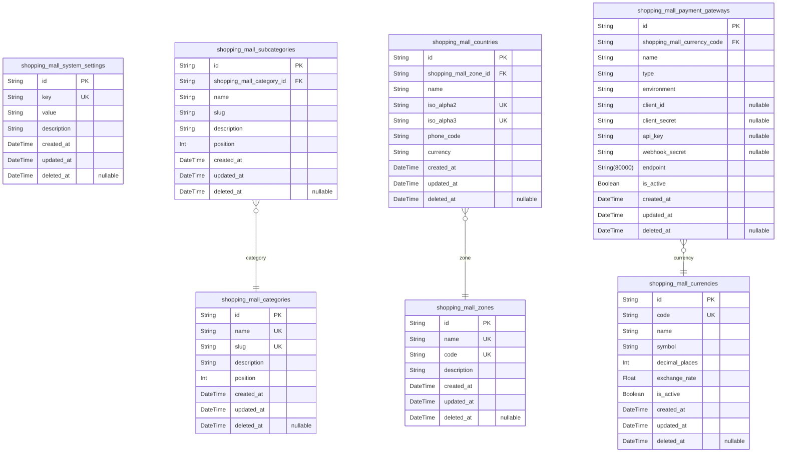
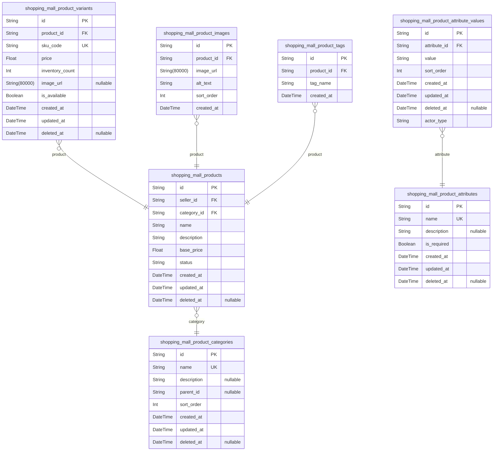
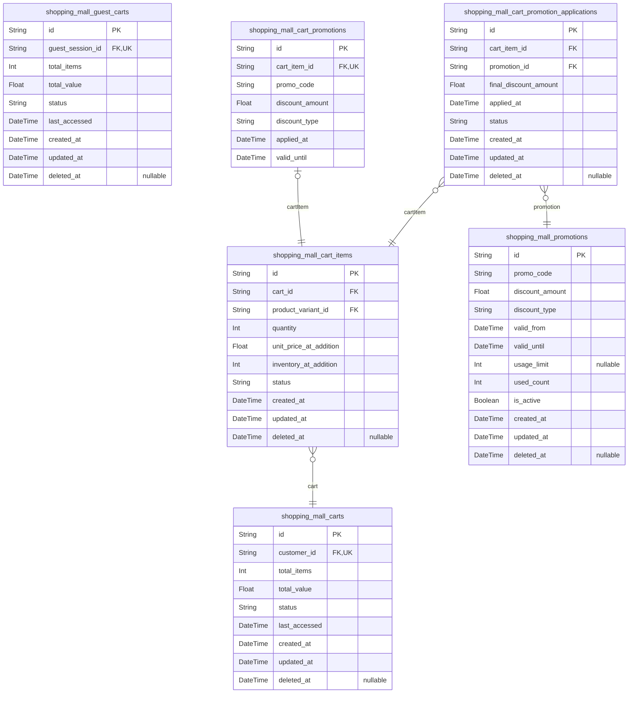
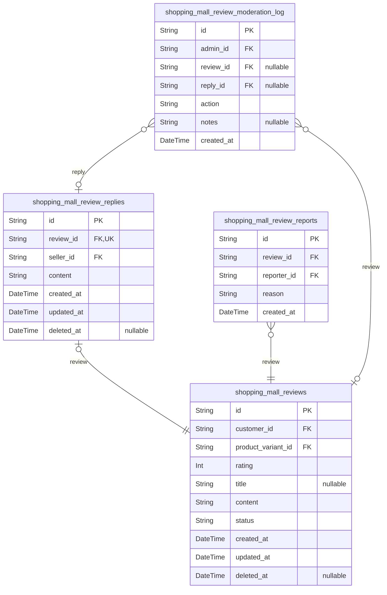
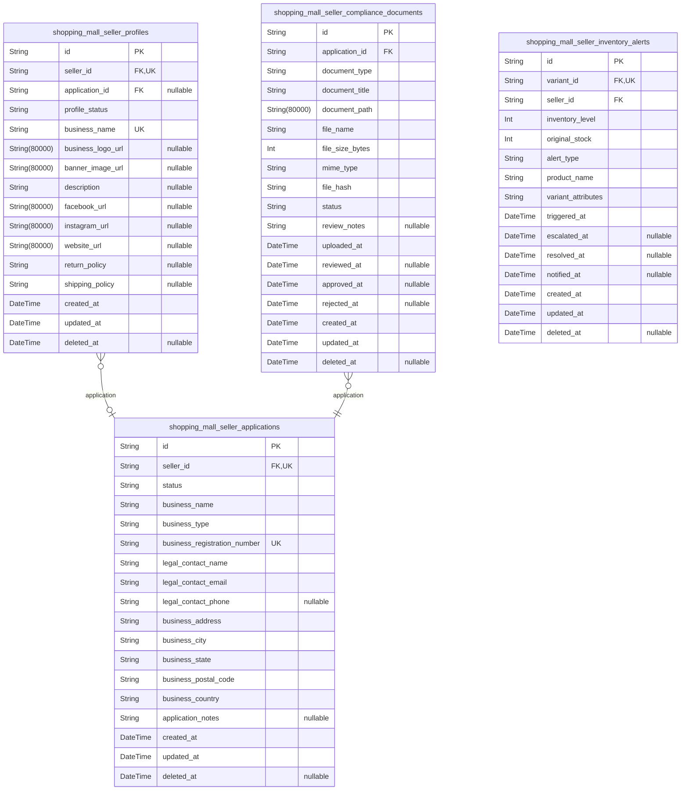
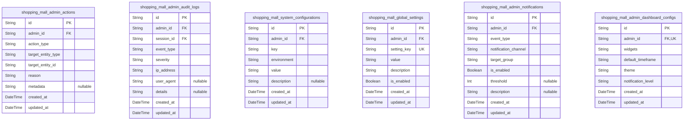
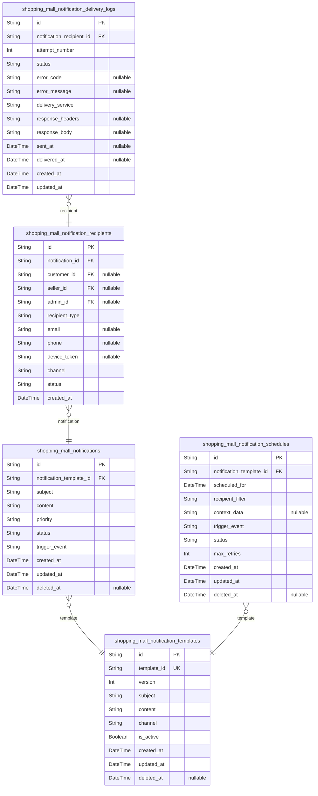
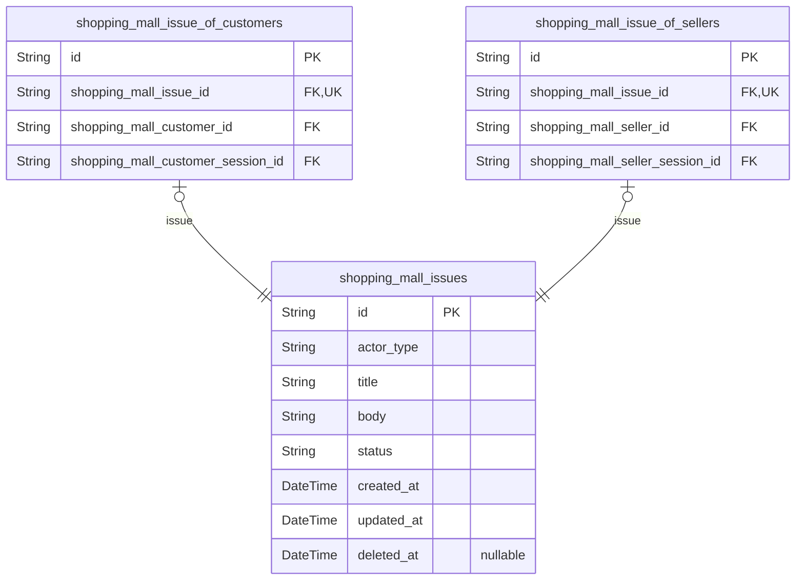
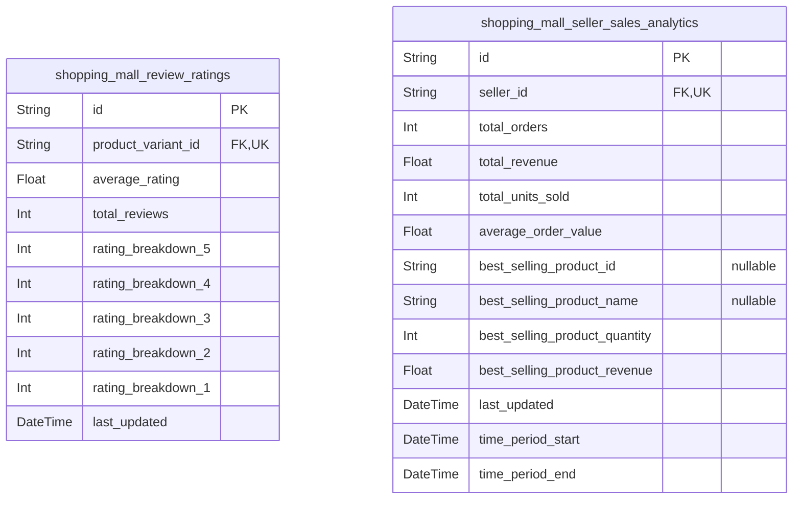

# Prisma Markdown

> Generated by [`prisma-markdown`](https://github.com/samchon/prisma-markdown)

- [Systematic](#systematic)
- [Actors](#actors)
- [Products](#products)
- [Carts](#carts)
- [Orders](#orders)
- [Reviews](#reviews)
- [Sellers](#sellers)
- [Admin](#admin)
- [Notifications](#notifications)
- [Issues](#issues)
- [default](#default)

## Systematic

```mermaid
erDiagram
"shopping_mall_system_settings" {
  String id PK
  String key UK
  String value
  String description
  DateTime created_at
  DateTime updated_at
  DateTime deleted_at "nullable"
}
"shopping_mall_categories" {
  String id PK
  String name UK
  String slug UK
  String description
  Int position
  DateTime created_at
  DateTime updated_at
  DateTime deleted_at "nullable"
}
"shopping_mall_subcategories" {
  String id PK
  String shopping_mall_category_id FK
  String name
  String slug
  String description
  Int position
  DateTime created_at
  DateTime updated_at
  DateTime deleted_at "nullable"
}
"shopping_mall_zones" {
  String id PK
  String name UK
  String code UK
  String description
  DateTime created_at
  DateTime updated_at
  DateTime deleted_at "nullable"
}
"shopping_mall_countries" {
  String id PK
  String shopping_mall_zone_id FK
  String name
  String iso_alpha2 UK
  String iso_alpha3 UK
  String phone_code
  String currency
  DateTime created_at
  DateTime updated_at
  DateTime deleted_at "nullable"
}
"shopping_mall_currencies" {
  String id PK
  String code UK
  String name
  String symbol
  Int decimal_places
  Float exchange_rate
  Boolean is_active
  DateTime created_at
  DateTime updated_at
  DateTime deleted_at "nullable"
}
"shopping_mall_payment_gateways" {
  String id PK
  String shopping_mall_currency_code FK
  String name
  String type
  String environment
  String client_id "nullable"
  String client_secret "nullable"
  String api_key "nullable"
  String webhook_secret "nullable"
  String(80000) endpoint
  Boolean is_active
  DateTime created_at
  DateTime updated_at
  DateTime deleted_at "nullable"
}
"shopping_mall_subcategories" }o--|| "shopping_mall_categories" : category
"shopping_mall_countries" }o--|| "shopping_mall_zones" : zone
"shopping_mall_payment_gateways" }o--|| "shopping_mall_currencies" : currency
```

### `shopping_mall_system_settings`

Core system configuration settings that control platform behavior and
feature flags.

Contains global configuration parameters that determine how the
shoppingMall platform operates. These settings are managed exclusively by
administrators through the admin dashboard and affect the entire system.

Examples: payment processing timeout, maximum cart items per user, review
moderation rules, and system-wide feature toggles.

This table serves as the central configuration hub. All other components
read from this table to determine their operational parameters. Changes
here are global and immediate. This table is not managed by customers or
sellers - only admins can modify its values.

Properties as follows:

- `id`: Primary Key.
- `key`
  > Unique identifier for the configuration setting. Must be unique across
  > all system settings. Examples: 'payment_timeout_seconds',
  > 'max_cart_items'.
- `value`
  > The configuration value as a string representation. Can be JSON for
  > complex configurations, boolean as 'true'/'false', or numeric values as
  > strings.
- `description`
  > Human-readable explanation of what this setting controls and its expected
  > values. Used by administrators for configuration guidance.
- `created_at`: Timestamp when this configuration setting was created.
- `updated_at`: Timestamp when this configuration setting was last modified.
- `deleted_at`
  > Timestamp when this configuration setting was logically deleted (soft
  > delete). NULL means active. Used for audit trails when settings are
  > removed.

### `shopping_mall_categories`

Top-level product categories that organize the shopping mall product
catalog.

Represents hierarchical category structure for organizing products into
logical groupings. Categories are managed exclusively by administrators
and serve as the foundation for product classification and search
filtering.

Each category can have multiple subcategories, forming a tree structure.
Categories are referenced by products to determine their classification.
Category names must be unique to prevent ambiguity in product
classification.

This is a taxonomic control table - content is curated by admin to ensure
consistent product organization across the platform.

Properties as follows:

- `id`: Primary Key.
- `name`
  > The display name of the category, such as 'Electronics', 'Fashion', 'Home
  > & Garden'. Must be unique across all top-level categories.
- `slug`
  > URL-friendly version of the category name. Used in product URLs for SEO
  > purposes. Example: 'electronics'. Must be unique.
- `description`
  > Detailed description of what types of products belong in this category.
  > Used for admin guidance and potentially in public category pages.
- `position`
  > Ordering position for display in the category navigation menu. Lower
  > numbers appear first. Ensures consistent ordering regardless of
  > alphabetical naming.
- `created_at`: Timestamp when this category was created.
- `updated_at`: Timestamp when this category was last modified.
- `deleted_at`
  > Timestamp when this category was logically deleted (soft delete). NULL
  > means active. When deleted, subcategories remain but product placement is
  > maintained for audit.

### `shopping_mall_subcategories`

Hierarchical subcategories nested under parent categories for detailed
product classification.

Represents the second level of the product taxonomy, providing more
granular organization beneath top-level categories. Subcategories link
directly to a parent category and are referenced by products for precise
classification.

This structure enables multi-level navigation (e.g., Electronics >
Computers > Laptops) while maintaining a clean category hierarchy.
Subcategories are managed exclusively by administrators to ensure
taxonomy consistency.

The combination of category_id and name must be unique to prevent
duplicate subcategories under the same parent.

Properties as follows:

- `id`: Primary Key.
- `shopping_mall_category_id`
  > Reference to the parent category that this subcategory belongs to. {@link
  > shopping_mall_categories.id}.
- `name`
  > The display name of the subcategory, such as 'Laptops', 'Smartphones',
  > 'T-Shirts'. Must be unique within its parent category.
- `slug`
  > URL-friendly version of the subcategory name. Used in product URLs for
  > SEO purposes. Example: 'laptops'. Must be unique within parent category.
- `description`
  > Detailed description of what types of products belong in this
  > subcategory. Used for admin guidance and potentially in public
  > subcategory pages.
- `position`
  > Ordering position for display in the subcategory navigation menu under
  > its parent. Lower numbers appear first. Ensures consistent ordering
  > regardless of alphabetical naming.
- `created_at`: Timestamp when this subcategory was created.
- `updated_at`: Timestamp when this subcategory was last modified.
- `deleted_at`
  > Timestamp when this subcategory was logically deleted (soft delete). NULL
  > means active. When deleted, products remain assigned but are inaccessible
  > through this subcategory path.

### `shopping_mall_zones`

Geographic zones used for shipping cost calculation, tax jurisdiction,
and delivery window definition.

Represents administrative or shipping zones that group multiple countries
or regions together for operational efficiency. These zones are used by
the system to determine shipping fees, tax rates, and delivery time
estimates based on destination.

Examples: 'North America', 'European Union', 'Asia-Pacific'. Zones
eliminate the need to configure individual countries and simplify complex
international fulfillment rules.

This is a critical component for international shipping functionality.
Shipping and tax systems reference zone records to apply the correct
rules automatically.

Properties as follows:

- `id`: Primary Key.
- `name`
  > Descriptive name of the geographic zone, such as 'North America' or
  > 'Southeast Asia'. Must be unique to avoid ambiguity.
- `code`
  > A standardized code for this zone. Favored formats: ISO 3166 region codes
  > or custom codes like 'NA-1', 'EU-EU'. Used internally for API
  > integrations and system references.
- `description`
  > Explanation of which countries or regions belong to this zone and the
  > operational rationale for grouping them together.
- `created_at`: Timestamp when this zone was created.
- `updated_at`: Timestamp when this zone was last modified.
- `deleted_at`
  > Timestamp when this zone was logically deleted (soft delete). NULL means
  > active. Deletion does not affect existing orders, but prevents new use in
  > fulfillment rules.

### `shopping_mall_countries`

List of countries supported for shipping and tax computation in the
shoppingMall platform.

Contains the complete set of sovereign states and territories where the
platform offers shipping and tax services. This table enables system-wide
lookup of country information for user address validation, tax
calculation, and international shipping zone assignment.

Each country is associated with a specific zone for operational handling.
Country data is standardized according to ISO 3166-1 alpha-2 and alpha-3
standards. This table is managed by admin-only and serves as the
authoritative source of country information.

Properties as follows:

- `id`: Primary Key.
- `shopping_mall_zone_id`
  > Reference to the geographic zone this country belongs to, used for
  > shipping and tax rule grouping. [shopping_mall_zones.id](#shopping_mall_zones).
- `name`
  > Full official name of the country, such as 'United States'. Used for
  > display and user-facing forms.
- `iso_alpha2`
  > Two-character ISO 3166-1 alpha-2 country code, such as 'US' for United
  > States. Must be unique and standardized.
- `iso_alpha3`
  > Three-character ISO 3166-1 alpha-3 country code, such as 'USA' for United
  > States. Must be unique and standardized.
- `phone_code`
  > International dialing code for the country, such as '+1' for United
  > States. Used for phone number formatting in user accounts.
- `currency`
  > ISO 4217 currency code for the country's primary currency, such as 'USD'
  > or 'EUR'. Used for default currency selection for users in that country.
- `created_at`: Timestamp when this country was added to the platform.
- `updated_at`: Timestamp when this country record was last modified.
- `deleted_at`
  > Timestamp when this country was logically deleted (soft delete). NULL
  > means active. Deletion does not affect existing orders, but prevents new
  > shipping addresses in this country.

### `shopping_mall_currencies`

Supported currencies for financial transactions on the shoppingMall
platform.

Defines all currencies accepted for pricing, payments, and settlement in
the platform. This table enables currency conversion, price display in
user-preferred currency, and financial reporting in multiple currencies.

Each currency includes exchange rate data, symbol, and formatting rules.
Admins can enable/disable currencies to match business operations in
different regions. This is the authoritative source for all monetary
values across the system.

Properties as follows:

- `id`: Primary Key.
- `code`
  > ISO 4217 three-letter currency code, such as 'USD', 'EUR', 'JPY'. Must be
  > unique and standardized.
- `name`
  > Full official name of the currency, such as 'United States Dollar' or
  > 'Euro'. Used for display purposes and reporting.
- `symbol`
  > Currency symbol for display, such as '$' for USD or '€' for EUR. Used in
  > product pricing and transaction displays.
- `decimal_places`
  > Number of decimal places the currency uses, typically 2 for major
  > currencies, 0 for Japanese Yen, etc. Used for price formatting and
  > calculations.
- `exchange_rate`
  > Current exchange rate relative to USD (1 USD = this value). Used for
  > dynamic currency conversion. Value is updated by automated currency
  > service.
- `is_active`
  > Whether this currency is currently enabled for use in transactions.
  > Disabled currencies can still appear in historical data but cannot be
  > selected for new transactions.
- `created_at`: Timestamp when this currency was added to the platform.
- `updated_at`: Timestamp when this currency record was last modified.
- `deleted_at`
  > Timestamp when this currency was logically deleted (soft delete). NULL
  > means active. Deletion does not affect historical transactions but
  > prevents future use.

### `shopping_mall_payment_gateways`

Integration configurations for external payment processing services used
by the shoppingMall platform.

Contains configuration details for all third-party payment processors
that the platform uses to handle customer payments. This includes
credentials, API endpoints, supported currencies, and feature
capabilities.

Each gateway configuration includes environment-specific settings (test
vs production) and enables the platform to support multiple payment
methods like credit cards, Apple Pay, PayPal, and BNPL services.

Administrators use this table to enable/disable gateways and configure
new payment providers. Payment processing systems reference this table to
initiate transactions.

This table is critical for financial operations and must be secured with
proper access controls.

Properties as follows:

- `id`: Primary Key.
- `shopping_mall_currency_code`
  > Reference to the primary currency used with this payment gateway. {@link
  > shopping_mall_currencies.id}. Used for default currency mapping.
- `name`
  > Readable name of the payment service provider, such as 'Stripe',
  > 'PayPal', or 'Klarna'. Used in admin interface and user-facing payment
  > options.
- `type`
  > The category or class of payment gateway. Valid values: 'card_processor',
  > 'digital_wallet', 'bnpl'. Used for system routing and feature flags.
- `environment`
  > Deployment environment where this configuration is active. Valid values:
  > 'production' or 'test'. Different credentials and endpoints for each
  > environment.
- `client_id`
  > API client identifier provided by the payment service. Sensitive data
  > stored encrypted at rest. Used for API authentication.
- `client_secret`
  > API client secret provided by the payment service. Sensitive data stored
  > encrypted at rest. Used for API authentication.
- `api_key`
  > Secret API key for authentication with the payment service. Sensitive
  > data stored encrypted at rest.
- `webhook_secret`
  > Secret used to verify authenticity of incoming webhooks from the payment
  > service. Sensitive data stored encrypted at rest.
- `endpoint`
  > Base API endpoint URL for the payment service integration. Must be a
  > valid HTTP/HTTPS URI.
- `is_active`
  > Whether this payment gateway is currently enabled and available for
  > customer transactions. When false, customers cannot select this payment
  > method.
- `created_at`
  > Timestamp when this payment gateway configuration was added to the
  > platform.
- `updated_at`: Timestamp when this payment gateway configuration was last modified.
- `deleted_at`
  > Timestamp when this payment gateway configuration was logically deleted
  > (soft delete). NULL means active. Deletion does not affect historical
  > transactions but prevents future use.

## Actors

```mermaid
erDiagram
"shopping_mall_guest" {
  String id PK
  DateTime created_at
  DateTime updated_at
  String last_seen_ip "nullable"
}
"shopping_mall_customer" {
  String id PK
  String email UK
  String password_hash
  String full_name "nullable"
  DateTime date_of_birth "nullable"
  String phone "nullable"
  String(80000) profile_photo_url "nullable"
  Boolean is_email_verified
  DateTime created_at
  DateTime updated_at
}
"shopping_mall_customer_sessions" {
  String id PK
  String shopping_mall_customer_id FK
  String ip
  String href
  String referrer "nullable"
  DateTime created_at
  DateTime expired_at "nullable"
}
"shopping_mall_seller" {
  String id PK
  String email UK
  String password_hash
  String business_name UK
  Boolean is_approved
  String approval_note "nullable"
  DateTime created_at
  DateTime updated_at
  DateTime last_login_at "nullable"
}
"shopping_mall_seller_sessions" {
  String id PK
  String shopping_mall_seller_id FK
  String ip
  String href
  String referrer "nullable"
  DateTime created_at
  DateTime expired_at "nullable"
}
"shopping_mall_admin" {
  String id PK
  String email UK
  String password_hash
  String full_name
  DateTime created_at
  DateTime updated_at
  DateTime last_login_at "nullable"
  Boolean is_active
}
"shopping_mall_admin_sessions" {
  String id PK
  String shopping_mall_admin_id FK
  String ip
  String href
  String referrer "nullable"
  DateTime created_at
  DateTime expired_at "nullable"
}
"shopping_mall_password_reset_tokens" {
  String id PK
  String shopping_mall_customer_id FK "nullable"
  String shopping_mall_seller_id FK "nullable"
  String shopping_mall_admin_id FK "nullable"
  String token UK
  DateTime expires_at
  DateTime created_at
  Boolean used
}
"shopping_mall_email_verification_tokens" {
  String id PK
  String shopping_mall_customer_id FK "nullable"
  String shopping_mall_seller_id FK "nullable"
  String shopping_mall_admin_id FK "nullable"
  String token UK
  DateTime expires_at
  DateTime created_at
  Boolean used
}
"shopping_mall_two_factor_secrets" {
  String id PK
  String shopping_mall_customer_id FK "nullable"
  String shopping_mall_seller_id FK "nullable"
  String shopping_mall_admin_id FK "nullable"
  String secret
  Boolean is_enabled
  String backup_codes "nullable"
  DateTime created_at
}
"shopping_mall_customer_sessions" }o--|| "shopping_mall_customer" : customer
"shopping_mall_seller_sessions" }o--|| "shopping_mall_seller" : seller
"shopping_mall_admin_sessions" }o--|| "shopping_mall_admin" : admin
"shopping_mall_password_reset_tokens" }o--o| "shopping_mall_customer" : customer
"shopping_mall_password_reset_tokens" }o--o| "shopping_mall_seller" : seller
"shopping_mall_password_reset_tokens" }o--o| "shopping_mall_admin" : admin
"shopping_mall_email_verification_tokens" }o--o| "shopping_mall_customer" : customer
"shopping_mall_email_verification_tokens" }o--o| "shopping_mall_seller" : seller
"shopping_mall_email_verification_tokens" }o--o| "shopping_mall_admin" : admin
"shopping_mall_two_factor_secrets" }o--o| "shopping_mall_customer" : customer
"shopping_mall_two_factor_secrets" }o--o| "shopping_mall_seller" : seller
"shopping_mall_two_factor_secrets" }o--o| "shopping_mall_admin" : admin
```

### `shopping_mall_guest`

Represents unauthenticated users who can browse the platform and initiate
registration.

This table stores minimal information about guests to enable
credential-less browsing and temporary cart persistence. Unlike
authenticated users, guests have no account, no persistent profile, and
no personal data beyond session tracking. They can create wishlists and
add to cart, but only temporarily until session expires or they
authenticate.

This table is optional and may be omitted if the platform prefers to
store guest state in client-side storage, but as per current guidelines
all user context must be in the DB. Each guest has a unique identifier
for session state continuity and analytics.

Properties as follows:

- `id`: Primary Key.
- `created_at`: Timestamp when the guest session was initiated.
- `updated_at`: Timestamp of the last activity by this guest during the session.
- `last_seen_ip`
  > The IP address last recorded for this guest. Used for analytics and fraud
  > detection.

### `shopping_mall_customer`

Represents an authenticated customer who can shop, manage wishlist, cart,
and personal profile.

This table stores the core identity information of customers who have
successfully registered and verified their email. Customers must
authenticate to access cart, wishlist, order history, and personal data.
This table enforces email uniqueness and securely stores password_hash
for authentication.

Customers can create multiple shipping addresses and initiate order
flows, but they are distinct from sellers and admins. This table is the
foundation for all customer-facing functionality.

Properties as follows:

- `id`: Primary Key.
- `email`
  > Customer's primary email address, used for login, communication, and
  > verification. Must be unique across all users.
- `password_hash`
  > Securely hashed password using bcrypt or equivalent. Never store plain
  > text passwords.
- `full_name`: Full legal name of the customer, as provided during registration.
- `date_of_birth`: Date of birth to ensure user is at least 13 years old per policy.
- `phone`
  > Optional phone number in E.164 format for SMS notifications and
  > verification.
- `profile_photo_url`
  > URL pointing to the customer's profile photo stored in CDN. Must be a
  > valid HTTPS URI.
- `is_email_verified`
  > Indicates whether the customer's email has been verified via link after
  > registration.
- `created_at`: Timestamp when the customer account was created and registered.
- `updated_at`: Timestamp of the last update to the customer profile.

### `shopping_mall_customer_sessions`

Stores active authentication sessions for customers.

This table is used to track user sessions after login. Each session maps
to exactly one customer and holds contextual data about the login event.
Sessions are managed internally to handle authentication lifecycle and
are not modified by users directly. This is a subsidiary system-managed
table.

No token values are stored here; only metadata about the connection.
Sessions expire after 30 days of inactivity or 1 hour with no activity,
and are purged automatically.

Properties as follows:

- `id`: Primary Key.
- `shopping_mall_customer_id`
  > Reference to the authenticated customer this session belongs to. {@link
  > shopping_mall_customer.id}
- `ip`: The IP address from which the user logged in.
- `href`: The URL (full path) where the user initiated the login session.
- `referrer`: The referring website or application that linked the user to the platform.
- `created_at`: Timestamp when the session was created (login time).
- `expired_at`
  > Timestamp when this session will expire. Must be set to 30 days after
  > creation.

### `shopping_mall_seller`

Represents an authenticated business entity that can list and manage
products on the platform.

This table stores identity information of vetted sellers who have been
approved by an admin. Sellers are distinct from customers and
admins—their core function is to manage inventory and fulfill orders.
This table includes password_hash for secure login and is linked to other
seller-specific tables.

Sellers must have their accounts approved before accessing seller tools.
They cannot initiate claims or vote on other sellers' content. Access to
this table is permission-limited to seller operations only.

Properties as follows:

- `id`: Primary Key.
- `email`
  > Seller's primary email address, used for login, communication, and
  > verification. Must be unique across all users.
- `password_hash`
  > Securely hashed password using bcrypt or equivalent. Never store plain
  > text passwords.
- `business_name`
  > Legal or trading name of the seller's business, as registered with
  > platform.
- `is_approved`
  > Indicates whether the seller application has been reviewed and approved
  > by an admin. Default false until approved.
- `approval_note`
  > Optional note from the approving admin regarding approval status or
  > conditions.
- `created_at`: Timestamp when the seller submitted the registration request.
- `updated_at`: Timestamp of the last update to the seller profile or approval status.
- `last_login_at`: Timestamp of the most recent successful login by this seller.

### `shopping_mall_seller_sessions`

Stores active authentication sessions for sellers.

This table tracks login sessions for sellers who manage product listings
and order fulfillment. Sessions are issued upon successful authentication
and expire after 30 days of inactivity. The seller can have multiple
concurrent sessions across devices.

This table is exclusively managed by the system and never modified
manually. It supports security monitoring and forced logout features.

Properties as follows:

- `id`: Primary Key.
- `shopping_mall_seller_id`
  > Reference to the authenticated seller this session belongs to. {@link
  > shopping_mall_seller.id}
- `ip`: The IP address from which the seller logged in.
- `href`: The URL (full path) where the seller initiated the login session.
- `referrer`
  > The referring website or application that linked the seller to the
  > platform.
- `created_at`: Timestamp when the session was created.
- `expired_at`
  > Timestamp when this session will expire. Must be set to 30 days after
  > creation.

### `shopping_mall_admin`

Represents a system administrator with full privileges over the
platform's configuration and moderation.

This table stores identity information for superusers who can manage
users, approve sellers, override inventory, manage categories, and review
content. Admins are manually invited and granted elevated permissions.
This table requires password_hash for login and is not accessible to
customers or sellers.

Each admin has a unique designated set of permissions encoded in the JWT.
This table enforces stricter authentication and session controls to
protect system integrity.

Properties as follows:

- `id`: Primary Key.
- `email`
  > Admin's primary email address, used for login and system communications.
  > Must be unique across all users.
- `password_hash`
  > Securely hashed password using bcrypt or equivalent. Never store plain
  > text passwords.
- `full_name`: Full legal name of the administrator.
- `created_at`: Timestamp when the admin account was created.
- `updated_at`: Timestamp of the last update to the admin profile.
- `last_login_at`: Timestamp of the most recent successful login by this admin.
- `is_active`
  > Indicates whether the admin account is currently active and permitted to
  > log in. Default true.

### `shopping_mall_admin_sessions`

Stores active authentication sessions for administrators.

This table tracks login sessions for system admins who have elevated
privileges. Admin sessions have a shorter expiration (1 hour) as per
security policy and require re-authentication after short periods of
inactivity.

Sessions are never allowed to persist beyond 1 hour unless manually
extended via admin flag. Multiple admin sessions across devices are
permitted. This table supports audit trails and forced logout features
for security.

Properties as follows:

- `id`: Primary Key.
- `shopping_mall_admin_id`
  > Reference to the authenticated admin this session belongs to. {@link
  > shopping_mall_admin.id}
- `ip`: The IP address from which the admin logged in.
- `href`: The URL (full path) where the admin initiated the login session.
- `referrer`
  > The referring website or application that linked the admin to the
  > platform.
- `created_at`: Timestamp when the session was created.
- `expired_at`
  > Timestamp when this session will expire. Must be set to 1 hour after
  > creation (or when transient override logs in).

### `shopping_mall_password_reset_tokens`

Stores tokens for password reset requests, valid for 15 minutes.

This table holds temporary tokens generated when users request to reset
their password. Each token is single-use and expires after 15 minutes.
When a token is used to reset a password, the system invalidates it
immediately.

All tokens are stored securely with no plaintext values. This table helps
prevent brute-force attacks by limiting token lifetime.

Takes precedence over email verification in case both exist simultaneously.

Properties as follows:

- `id`: Primary Key.
- `shopping_mall_customer_id`
  > Reference to the customer who requested the password reset. {@link
  > shopping_mall_customer.id}
- `shopping_mall_seller_id`
  > Reference to the seller who requested the password reset. {@link
  > shopping_mall_seller.id}
- `shopping_mall_admin_id`
  > Reference to the admin who requested the password reset. {@link
  > shopping_mall_admin.id}
- `token`
  > Randomly generated, cryptographically secure token for password reset.
  > Must be 64-character hash.
- `expires_at`
  > Timestamp when this token expires and becomes invalid. Must be set to 15
  > minutes after creation.
- `created_at`: Timestamp when this token was generated.
- `used`
  > Indicates whether this token has been used to reset the password. Default
  > false.

### `shopping_mall_email_verification_tokens`

Stores tokens for email verification after registration, valid for 24 hours.

This table holds verification tokens sent to users after they register.
Each token is single-use and expires after 24 hours. Once a token is used
to verify an email, it is marked as used and cannot be reused.

Checks against customer, seller, and admin tables to confirm the user
exists before validating. Used to prevent hijacked registrations.

Properties as follows:

- `id`: Primary Key.
- `shopping_mall_customer_id`
  > Reference to the customer whose email needs verification. {@link
  > shopping_mall_customer.id}
- `shopping_mall_seller_id`
  > Reference to the seller whose email needs verification. {@link
  > shopping_mall_seller.id}
- `shopping_mall_admin_id`
  > Reference to the admin whose email needs verification. {@link
  > shopping_mall_admin.id}
- `token`
  > Randomly generated, cryptographically secure token for email
  > verification. Must be 64-character hash.
- `expires_at`
  > Timestamp when this token expires and becomes invalid. Must be set to 24
  > hours after creation.
- `created_at`: Timestamp when this token was generated.
- `used`
  > Indicates whether this token has been used to verify the email. Default
  > false.

### `shopping_mall_two_factor_secrets`

Stores TOTP (Time-based One-Time Password) secrets for 2FA enrollment.

This table holds the base32-encoded secret keys used to generate 2FA
codes for users who enable two-factor authentication. Secrets are
encrypted at rest and tied to individual actor accounts.

2FA secrets are only set after user approval of an 2FA setup, and users
must validate the code before enrollment is final. This table supports
backup recovery codes as well.

This table replaces the need for SMS 2FA because TOTP is more secure.

Properties as follows:

- `id`: Primary Key.
- `shopping_mall_customer_id`
  > Reference to the customer who enabled 2FA. {@link
  > shopping_mall_customer.id}
- `shopping_mall_seller_id`: Reference to the seller who enabled 2FA. [shopping_mall_seller.id](#shopping_mall_seller)
- `shopping_mall_admin_id`: Reference to the admin who enabled 2FA. [shopping_mall_admin.id](#shopping_mall_admin)
- `secret`
  > Base32-encoded secret key used to generate TOTP codes. Must be 32
  > characters.
- `is_enabled`
  > Indicates whether 2FA is currently active for this account. Default false
  > until confirmed.
- `backup_codes`
  > JSON array of 10 one-time recovery codes (base64 encoded strings). Only
  > populated after 2FA is confirmed.
- `created_at`: Timestamp when the 2FA secret was generated.

## Products

```mermaid
erDiagram
"shopping_mall_products" {
  String id PK
  String seller_id FK
  String category_id FK
  String name
  String description
  Float base_price
  String status
  DateTime created_at
  DateTime updated_at
  DateTime deleted_at "nullable"
}
"shopping_mall_product_variants" {
  String id PK
  String product_id FK
  String sku_code UK
  Float price
  Int inventory_count
  String(80000) image_url "nullable"
  Boolean is_available
  DateTime created_at
  DateTime updated_at
  DateTime deleted_at "nullable"
}
"shopping_mall_product_images" {
  String id PK
  String product_id FK
  String(80000) image_url
  String alt_text
  Int sort_order
  DateTime created_at
}
"shopping_mall_product_attributes" {
  String id PK
  String name UK
  String description "nullable"
  Boolean is_required
  DateTime created_at
  DateTime updated_at
  DateTime deleted_at "nullable"
}
"shopping_mall_product_attribute_values" {
  String id PK
  String attribute_id FK
  String value
  Int sort_order
  DateTime created_at
  DateTime updated_at
  DateTime deleted_at "nullable"
  String actor_type
}
"shopping_mall_product_categories" {
  String id PK
  String name UK
  String description "nullable"
  String parent_id "nullable"
  Int sort_order
  DateTime created_at
  DateTime updated_at
  DateTime deleted_at "nullable"
}
"shopping_mall_product_tags" {
  String id PK
  String product_id FK
  String tag_name
  DateTime created_at
}
"shopping_mall_products" }o--|| "shopping_mall_product_categories" : category
"shopping_mall_product_variants" }o--|| "shopping_mall_products" : product
"shopping_mall_product_images" }o--|| "shopping_mall_products" : product
"shopping_mall_product_attribute_values" }o--|| "shopping_mall_product_attributes" : attribute
"shopping_mall_product_tags" }o--|| "shopping_mall_products" : product
```

### `shopping_mall_products`

Core product entity that defines the base product information including
title, description and status. Each product represents a conceptual item
for sale and may have one or more physically distinct variants (SKUs)
with different pricing and inventory levels.

Products are owned by a specific seller and their visibility in the
catalog is controlled by the status field. Store basic information that
applies to all variants of a product while variants hold the specific
sellable configurations.

Product history is preserved through timestamps and soft deletion
capability. Products with historical orders cannot be deleted, but can be
unpublished through status change.

Reference: [shopping_mall_product_variants](#shopping_mall_product_variants) for sellable variants.
[shopping_mall_seller](#shopping_mall_seller) for seller ownership. {@link
shopping_mall_product_attributes} for optional product attributes. {@link
shopping_mall_product_tags} for categorization and discovery.

Properties as follows:

- `id`: Primary Key.
- `seller_id`: Owner seller's [shopping_mall_seller.id](#shopping_mall_seller).
- `category_id`
  > Primary category of this product, related to {@link
  > shopping_mall_product_categories.id}.
- `name`: Product name/title as displayed to customers. Must be unique per seller.
- `description`
  > Detailed product description. Supports rich text formatting for sellers
  > to convey features and benefits.
- `base_price`
  > Starting price for the product. Varied by each variant (SKU). Corresponds
  > to the minimum available price among all variants.
- `status`
  > Product visibility status. Must be either 'active' or 'inactive'. Only
  > 'active' products are visible to customers for purchase. Default:
  > 'active'.
- `created_at`: Timestamp when this product was created. Automatically set upon creation.
- `updated_at`: Timestamp when this product was last modified. Updated on any edit.
- `deleted_at`
  > Soft deletion timestamp. If null, product is active. If set, product is
  > considered deleted and not visible to customers, though remains for
  > historical reference.

### `shopping_mall_product_variants`

Stock Keeping Unit (SKU) entity that represents a distinct, sellable
configuration of a product with unique inventory and pricing. Each
variant corresponds to a specific combination of attributes such as
color, size, material or other customizable options.

Variants enable atomic inventory management per physical product
configuration. While a product (shopping_mall_products) represents the
conceptual item, a variant represents what actually gets purchased,
shipped, and tracked in stock.

Every product must have at least one variant. Variants inherit their core
identity from the parent product but have independent pricing, inventory,
and image properties.

Referenced only through their parent product. Cannot exist independently
without a product.

Reference: [shopping_mall_products](#shopping_mall_products) for parent product. {@link
shopping_mall_product_attribute_values} for attribute configurations.

Properties as follows:

- `id`: Primary Key.
- `product_id`
  > Parent product this variant belongs to, referencing {@link
  > shopping_mall_products.id}.
- `sku_code`
  > Unique SKU code generated for this variant following pattern:
  > {PRODUCT_CODE}-{COLOR_CODE}-{SIZE_CODE}-{MATERIAL_CODE}-{OPTION_CODE}.
  > Ensures uniqueness across all variants in system.
- `price`
  > Specific price for this variant. Can differ from base product price. Each
  > variant must have an explicitly defined price.
- `inventory_count`
  > Current stock quantity available for this variant. Must be non-negative.
  > Product sale reduces this value. Only variants with inventory_count > 0
  > are available for purchase.
- `image_url`
  > URL to the primary image for this variant. Optional. If not provided,
  > uses the parent product's primary image.
- `is_available`
  > Whether this variant is available for purchase. Controls visibility in
  > UI. True if inventory_count > 0 and product status is 'active'. Managed
  > automatically based on inventory and product status.
- `created_at`: Timestamp when this variant was created. Automatically set upon creation.
- `updated_at`
  > Timestamp when this variant was last modified. Updated on inventory or
  > price changes.
- `deleted_at`
  > Soft deletion timestamp. If null, variant is active. If set, variant is
  > considered deleted and not available for purchase, though remains for
  > historical reference.

### `shopping_mall_product_images`

Images associated with products for visual representation. Each product
can have multiple images (up to 5 as per requirements) to showcase
different angles, details, or usage scenarios.

Images are managed as supporting entities tied to a specific product.
They do not represent independent business entities and are always
accessed through their parent product.

Used for display on product detail pages and search listings. When a
variant has its own image specified, it will override the product's
default image.

Reference: [shopping_mall_products](#shopping_mall_products) for parent product.

Properties as follows:

- `id`: Primary Key.
- `product_id`
  > Product this image belongs to, referencing {@link
  > shopping_mall_products.id}.
- `image_url`
  > URL to the image file hosted by system. Must be HTTPS and point to a
  > valid image format (JPG, PNG, GIF).
- `alt_text`
  > Alternative text description of the image for accessibility and SEO.
  > Required for screen readers and text-based browsers.
- `sort_order`
  > Display order of the image among other images for this product. Lower
  > values appear first. Ranges from 1-5 as per requirements. Default is 1
  > for first image, 2 for second, etc.
- `created_at`: Timestamp when this image was uploaded. Automatically set upon upload.

### `shopping_mall_product_attributes`

Attribute definitions for products, representing the types of
customizable properties that variants can have. These are categorical
definitions like 'Color', 'Size', or 'Material' that can be selected when
creating product variants.

Attribute definitions are created by admins or advanced sellers to
standardize variant options across the platform. They are meta-data
entities that enable consistent and maintainable variant creation.

Each attribute definition can have multiple possible values
(shopping_mall_product_attribute_values), but an attribute definition
itself is static and reusable across multiple products.

Never contains product-specific data. Purely a taxonomy definition
structure.

Reference: [shopping_mall_product_attribute_values](#shopping_mall_product_attribute_values) for possible
values of each attribute.

Properties as follows:

- `id`: Primary Key.
- `name`
  > Name of the attribute type, e.g., 'Color', 'Size', 'Material'. Must be
  > unique across all attribute definitions.
- `description`
  > Detailed description explaining what the attribute represents and how it
  > is used in product variants.
- `is_required`
  > Whether this attribute must be specified when creating a variant of a
  > product. True if customer must make a selection. False if optional.
- `created_at`
  > Timestamp when this attribute definition was created. Automatically set
  > upon creation.
- `updated_at`
  > Timestamp when this attribute definition was last modified. Updated on
  > any edit.
- `deleted_at`
  > Soft deletion timestamp. If null, attribute is active. If set, attribute
  > is considered deleted and cannot be used for new variants, though
  > existing variants remain valid.

### `shopping_mall_product_attribute_values`

Specific values for product attribute definitions. Represents the
individual options available for an attribute type (e.g., "Red", "Blue",
"S", "M" for a color or size attribute).

Each value is tied to a specific attribute definition and represents a
selectable option in variant creation. A variant selects multiple
attribute values across different attribute definitions to form a
complete configuration.

Enables a many-to-many relationship between attributes and variants
through the attribute_value_id in shopping_mall_product_variants. Allows
one attribute value to be reused across multiple products and variants.

Reference: [shopping_mall_product_attributes](#shopping_mall_product_attributes) for the attribute
definition. [shopping_mall_product_variants](#shopping_mall_product_variants) via junction for
variant usage.

Properties as follows:

- `id`: Primary Key.
- `attribute_id`
  > Reference to the attribute definition, {@link
  > shopping_mall_product_attributes.id}.
- `value`
  > The actual display value of the attribute, such as 'Red', 'Large',
  > 'Cotton'. Must be human-readable for customer display.
- `sort_order`
  > Display order of this value among other values for the same attribute.
  > Lower values appear first in UI.
- `created_at`
  > Timestamp when this attribute value was created. Automatically set upon
  > creation.
- `updated_at`
  > Timestamp when this attribute value was last modified. Updated on any
  > edit.
- `deleted_at`
  > Soft deletion timestamp. If null, attribute value is active. If set,
  > attribute value is considered deleted and cannot be selected for new
  > variants, though existing variants remain valid.
- `actor_type`
  > Type of actor that created or last modified this attribute value. Must be
  > either 'seller' or 'admin'. Required for audit trail to distinguish
  > origin of changes made by seller versus admin users.

### `shopping_mall_product_categories`

Category system for organizing products into hierarchical groupings. Used
to structure the product catalog and enable browsing by product families.

Each product belongs to exactly one primary category, which defines its
main classification in the system. Category structure is hierarchical and
managed by admin for consistency.

This table represents the actual category taxonomy used for product
categorization. Different from reference tables for general categories.

Reference: [shopping_mall_products](#shopping_mall_products) for products categorized under
this category.

Properties as follows:

- `id`: Primary Key.
- `name`
  > Display name of the category, e.g., 'Electronics', 'Clothing', 'Books'.
  > Must be unique within the category hierarchy.
- `description`
  > Detailed description of what products belong in this category and what
  > qualifies a product for inclusion.
- `parent_id`
  > Parent category ID for hierarchical nesting. NULL indicates top-level
  > category. Self-referential to form category tree structure.
- `sort_order`
  > Display order for categories at the same hierarchy level. Lower values
  > appear first in navigation menus.
- `created_at`: Timestamp when this category was created. Automatically set upon creation.
- `updated_at`: Timestamp when this category was last modified. Updated on any edit.
- `deleted_at`
  > Soft deletion timestamp. If null, category is active. If set, category is
  > considered deleted and no new products can be assigned to it, though
  > existing products remain categorized.

### `shopping_mall_product_tags`

Junction table representing the many-to-many relationship between
products and tags. Tags are keywords or phrases used for enhanced product
discovery, filtering, and search.

Each product can have multiple tags and each tag can be associated with
multiple products, making this a M:N relationship implemented through a
junction table.

Tags provide a flexible way to categorize products beyond the rigid
category hierarchy, enabling cross-cutting classification like
'bestseller', 'eco-friendly', 'on-sale', etc.

Reference: [shopping_mall_products](#shopping_mall_products) for products. {@link
shopping_mall_product_tags_definitions} for tag definitions (but those
aren't specified in target tables so we're using direct tagging).

Properties as follows:

- `id`: Primary Key.
- `product_id`
  > Product this tag is associated with, referencing {@link
  > shopping_mall_products.id}.
- `tag_name`
  > The actual tag keyword or phrase used for discovery and filtering. Must
  > be lowercase and alphanumeric with hyphens. Examples: "bestseller",
  > "eco-friendly", "limited-edition".
- `created_at`
  > Timestamp when this tag association was created. Automatically set upon
  > assignment.

## Carts

```mermaid
erDiagram
"shopping_mall_carts" {
  String id PK
  String customer_id FK,UK
  Int total_items
  Float total_value
  String status
  DateTime last_accessed
  DateTime created_at
  DateTime updated_at
  DateTime deleted_at "nullable"
}
"shopping_mall_cart_items" {
  String id PK
  String cart_id FK
  String product_variant_id FK
  Int quantity
  Float unit_price_at_addition
  Int inventory_at_addition
  String status
  DateTime created_at
  DateTime updated_at
  DateTime deleted_at "nullable"
}
"shopping_mall_guest_carts" {
  String id PK
  String guest_session_id FK,UK
  Int total_items
  Float total_value
  String status
  DateTime last_accessed
  DateTime created_at
  DateTime updated_at
  DateTime deleted_at "nullable"
}
"shopping_mall_cart_promotions" {
  String id PK
  String cart_item_id FK,UK
  String promo_code
  Float discount_amount
  String discount_type
  DateTime applied_at
  DateTime valid_until
}
"shopping_mall_promotions" {
  String id PK
  String promo_code
  Float discount_amount
  String discount_type
  DateTime valid_from
  DateTime valid_until
  Int usage_limit "nullable"
  Int used_count
  Boolean is_active
  DateTime created_at
  DateTime updated_at
  DateTime deleted_at "nullable"
}
"shopping_mall_cart_promotion_applications" {
  String id PK
  String cart_item_id FK
  String promotion_id FK
  Float final_discount_amount
  DateTime applied_at
  String status
  DateTime created_at
  DateTime updated_at
  DateTime deleted_at "nullable"
}
"shopping_mall_cart_items" }o--|| "shopping_mall_carts" : cart
"shopping_mall_cart_promotions" |o--|| "shopping_mall_cart_items" : cartItem
"shopping_mall_cart_promotion_applications" }o--|| "shopping_mall_cart_items" : cartItem
"shopping_mall_cart_promotion_applications" }o--|| "shopping_mall_promotions" : promotion
```

### `shopping_mall_carts`

Cart entity for authenticated customers that represents a collection of
items being considered for purchase.

This table stores all cart metadata for registered customers, including
total item count, total value, status, and timestamps.

Each record is associated with exactly one customer through the
customer_id foreign key.

The cart can exist in one of three states: 'active', 'abandoned', or
'converted'. It persists for up to 30 days after last access.

This is a primary entity because authenticated customers directly
interact with their cart (add, remove, update items) and require
independent API operations.

Due to direct specification requirement, this table is maintained
independently from guest carts even though structure is duplicated.

Properties as follows:

- `id`: Primary Key.
- `customer_id`
  > The authenticated customer who owns this cart. References {@link
  > shopping_mall_customer.id} (in otherTables).
- `total_items`
  > Total number of items currently in this cart. Updated when items are
  > added or removed.
- `total_value`
  > Total monetary value of all items in this cart. Calculated as sum of
  > (item quantity * unit price at addition). Excludes discounts and taxes.
- `status`
  > Current state of the cart. Valid values: 'active', 'abandoned',
  > 'converted'.
  >
  > - 'active': User has interacted recently and items are still valid.
  > - 'abandoned': User has not interacted for a defined period (7-30 days).
  > Items remain valid but may be deleted by cleanup job.
  > - 'converted': Cart has been successfully converted to an order. Items
  > are sealed and no longer modifiable.
- `last_accessed`
  > Timestamp of the last user interaction with this cart. Used for automatic
  > cleanup jobs to identify expired carts.
- `created_at`: Timestamp when this cart was initially created.
- `updated_at`: Timestamp when this cart was last modified.
- `deleted_at`
  > Timestamp when this cart was logically deleted. Null if cart is active.
  > Used for soft delete to preserve audit trails and allow for cart
  > recovery.

### `shopping_mall_cart_items`

Individual product items added to a cart by a user.

Each cart item represents one instance of a product variant (SKU) being
considered for purchase. It contains a snapshot of the product's price
and inventory state at the moment of addition to the cart, ensuring
transactional consistency regardless of future price or stock changes.

Cart items are primary entities because users can independently modify
them (add, remove, change quantity) even within the cart context, and
these operations require independent API endpoints for accurate state
management.

A cart item has a parent association to either shopping_mall_carts or
shopping_mall_guest_carts via cart_id, indicating which cart it belongs
to. It must reference a valid product variant from
shopping_mall_product_variants.

The status field indicates whether the item is still available or if its
inventory has been depleted. Users can see this status and manually
remove items marked as stale.

Properties as follows:

- `id`: Primary Key.
- `cart_id`
  > The cart this item belongs to. References [shopping_mall_carts.id](#shopping_mall_carts)
  > (for authenticated users) or [shopping_mall_guest_carts.id](#shopping_mall_guest_carts) (for
  > guests).
- `product_variant_id`
  > The specific product variant (SKU) being added. References {@link
  > shopping_mall_product_variants.id}.
- `quantity`
  > Number of units of this product variant in the cart. Minimum value is 1,
  > maximum is 100.
- `unit_price_at_addition`
  > The exact price of the product variant at the moment it was added to the
  > cart. Persisted to ensure consistent pricing during checkout, independent
  > of future price changes.
- `inventory_at_addition`
  > The available inventory count of this product variant at the moment it
  > was added to the cart. Used to validate availability during checkout.
- `status`
  > Current availability status of this cart item. Valid values: 'available',
  > 'out_of_stock', 'removed_by_user'.
  >
  > - 'available': Item is in stock and the cart item is valid.
  > - 'out_of_stock': The product variant's inventory has dropped to 0 since
  > this item was added.
  > - 'removed_by_user': User manually removed this item from cart.
- `created_at`: Timestamp when this cart item was added to the cart.
- `updated_at`: Timestamp when this cart item was last updated (e.g., quantity changed).
- `deleted_at`
  > Timestamp when this cart item was logically deleted. Null if the item
  > still exist in cart. Used for soft delete to preserve audit trails.

### `shopping_mall_guest_carts`

Cart entity for guest users that represents a collection of items being
considered for purchase.

This table stores all cart metadata for unauthenticated guests, including
total item count, total value, status, and timestamps.

Each record is associated with exactly one guest session through the
guest_session_id foreign key.

The cart can exist in one of three states: 'active', 'abandoned', or
'converted'. It persists for up to 7 days after last access.

This is a primary entity because guest users directly interact with their
cart (add, remove, update items) and require independent API operations
for guest session management.

Due to direct specification requirement, this table is maintained
independently from customer carts even though structure is duplicated.

Properties as follows:

- `id`: Primary Key.
- `guest_session_id`
  > The session identifier for the guest user. References {@link
  > shopping_mall_guest.id} (in otherTables). This defines which browser
  > session this cart belongs to.
- `total_items`
  > Total number of items currently in this cart. Updated when items are
  > added or removed.
- `total_value`
  > Total monetary value of all items in this cart. Calculated as sum of
  > (item quantity * unit price at addition). Excludes discounts and taxes.
- `status`
  > Current state of the cart. Valid values: 'active', 'abandoned',
  > 'converted'.
  >
  > - 'active': User has interacted recently and items are still valid.
  > - 'abandoned': User has not interacted for a defined period (7-30 days).
  > Items remain valid but may be deleted by cleanup job.
  > - 'converted': Cart has been successfully converted to an order. Items
  > are sealed and no longer modifiable.
- `last_accessed`
  > Timestamp of the last user interaction with this cart. Used for automatic
  > cleanup jobs to identify expired carts.
- `created_at`: Timestamp when this cart was initially created.
- `updated_at`: Timestamp when this cart was last modified.
- `deleted_at`
  > Timestamp when this cart was logically deleted. Null if cart is active.
  > Used for soft delete to preserve audit trails and allow for cart
  > recovery.

### `shopping_mall_cart_promotions`

Promotional discount codes applied to cart items.

This table represents specific promotional discounts applied to
individual cart items. Each record links a promotion code (e.g.,
'SAVE10') to a specific cart_item, enabling item-level discounts.

This design supports promotions such as 'Buy one, get one 50% off' or
'Apply coupon to specific items' rather than cart-wide discounts, which
allows for precise calculation and audit.

The promotion code value is stored as a string and referenced from an
external promo registry (not modeled here, per complexity). This table
only captures the application instance.

This table is subsidiary because its existence is entirely dependent on
the cart item. It has no standalone meaning and is managed entirely
through the cart item context.

Properties as follows:

- `id`: Primary Key.
- `cart_item_id`
  > The cart item to which this promotion is applied. References {@link
  > shopping_mall_cart_items.id}.
- `promo_code`
  > The ID or code name of the promotion being applied (e.g., 'SAVE10'). Must
  > be a valid promotion code as defined by admin. This links to an external
  > promotion system.
- `discount_amount`
  > The exact discount amount (in USD) applied to this cart item. This
  > represents the value reduced from the item's unit price_at_addition.
- `discount_type`
  > Type of discount applied. Valid values: 'percentage', 'fixed_amount'.
  >
  > - 'percentage': discount_amount represents a percentage of the item's
  > unit price.
  > - 'fixed_amount': discount_amount is a fixed USD value deducted from the
  > item.
- `applied_at`: Timestamp when this promotion code was applied to this cart item.
- `valid_until`
  > Expiration timestamp for this specific promotion application. Used to
  > validate if discount is still valid during checkout.

### `shopping_mall_promotions`

Central registry of promotional codes used across the shoppingMall platform.

This table stores the definition of promotion codes and their parameters,
such as discount type, amount, validity period, and usage limits.

This is a subsidiary entity because promotion codes are defined by
administrators and applied to cart items through the
promotion_applications table, but are not independently managed by users.

This table will replace the original shopping_mall_cart_promotions table
which incorrectly used a 1:1 relationship with cart items. Separating the
promotion definition from its application allows for the same promotion
to be reused across multiple cart items (e.g., buy one get one discount)
while maintaining data integrity.

Discouraging use of the original approach where promotion code was
duplicated on every cart item application - this would lead to data
inconsistency when promotion details changed.

When a promotion is modified, the definition in this table is updated,
and existing applications remain correct (they reference a snapshot of
the discount rules at time of application). This supports accurate audit
trails for financial reconciliation.

Properties as follows:

- `id`: Primary Key.
- `promo_code`
  > Unique identifier for the promotion (e.g., 'SAVE10', 'FREESHIP'). Must be
  > globally unique across all active promotions.
- `discount_amount`
  > The discount amount or percentage based on discount_type. For
  > fixed_amount, this represents USD value to deduct. For percentage, this
  > represents percentage of unit price to discount. All values expressed in
  > USD.
- `discount_type`
  > Type of discount applied. Valid values: 'percentage', 'fixed_amount'.
  >
  > - 'percentage': discount_amount represents a percentage of the cart
  > item's unit_price_at_addition to deduct.
  > - 'fixed_amount': discount_amount is a fixed USD amount to deduct from
  > the cart item's unit_price_at_addition.
- `valid_from`
  > Timestamp when this promotion becomes active. Promotions before this time
  > are not applicable.
- `valid_until`
  > Timestamp when this promotion expires. Promotions after this time are not
  > applicable.
- `usage_limit`
  > Maximum number of times this promotion can be applied across all cart
  > items. Null indicates unlimited usage.
- `used_count`
  > Current number of times this promotion has been applied to cart items.
  > Incremented when a cart_promotion_application is created.
- `is_active`
  > Whether this promotion is currently available for application. Set to
  > false to archive promotion without deletion.
- `created_at`: Timestamp when this promotion was created.
- `updated_at`: Timestamp when this promotion was last modified.
- `deleted_at`
  > Timestamp when this promotion was logically deleted. Null if promotion is
  > active. Used for soft delete to preserve audit trails for financial
  > reporting.

### `shopping_mall_cart_promotion_applications`

Instances of promotional codes applied to specific cart items.

This table represents the application of a promotion to a specific cart
item. Each record establishes the relationship between a promotion and a
cart item, storing the actual discount amount applied at time of
application.

This is a subsidiary entity because it has no standalone meaning and
exists only to connect cart items with promotions. It cannot be created,
updated, or deleted independently of its parent cart item.

This table replaces the incorrect 1:1 relationship between cart_items and
shopping_mall_cart_promotions, allowing multiple cart items to be
associated with the same promotion (e.g., buy one get one discount),
while still recording the exact discount applied to each item.

By separating the promotion definition (shopping_mall_promotions) from
its application (this table), we maintain normalization and ensure
financial accuracy even when promotions are modified after being applied.

Properties as follows:

- `id`: Primary Key.
- `cart_item_id`
  > The cart item to which this promotion is applied. References {@link
  > shopping_mall_cart_items.id}.
- `promotion_id`
  > The promotion definition being applied. References {@link
  > shopping_mall_promotions.id}.
- `final_discount_amount`
  > The exact discount amount (in USD) actually applied to this cart item.
  > Calculated as: promotion.discount_amount * (if percentage:
  > unit_price_at_addition / 100) or promotion.discount_amount (if
  > fixed_amount). This record is the immutable snapshot of discount applied
  > at time of application, even if the promotion definition changes later.
- `applied_at`: Timestamp when this promotion code was applied to this cart item.
- `status`
  > Current application status. Valid values: 'active', 'expired', 'invalid'.
  >
  > - 'active': The promotion is still valid and discount applies.
  > - 'expired': The promotion's valid_until has passed.
  > - 'invalid': The promotion's usage_limit has been reached or is inactive.
- `created_at`: Timestamp when this promotion application was created.
- `updated_at`
  > Timestamp when this promotion application was last updated (e.g., status
  > changed).
- `deleted_at`
  > Timestamp when this promotion application was logically deleted. Null if
  > still active. Used for soft delete to preserve audit trails.

## Orders

```mermaid
erDiagram
"shopping_mall_orders" {
  String id PK
  String customer_id FK
  String order_number
  Float subtotal
  Float shipping_cost
  Float tax_amount
  Float total_amount
  String currency
  String status
  String payment_status
  DateTime created_at
  DateTime updated_at
  DateTime deleted_at "nullable"
}
"shopping_mall_order_items" {
  String id PK
  String order_id FK
  String product_variant_id FK
  Int quantity
  Float unit_price
  Float total_price
  String variant_attributes
}
"shopping_mall_order_payments" {
  String id PK
  String order_id FK,UK
  String payment_gateway_id FK
  Float amount
  String currency
  String payment_method
  String payment_gateway_ref_id UK
  String status
  String failure_reason "nullable"
  DateTime transaction_date
  DateTime created_at
  DateTime updated_at
}
"shopping_mall_order_shippings" {
  String id PK
  String order_id FK,UK
  String zone_id FK
  String recipient_name
  String address_line1
  String address_line2 "nullable"
  String city
  String state_province
  String postal_code
  String country_code
  String phone "nullable"
  String shipping_method
  String carrier
  DateTime created_at
  DateTime updated_at "nullable"
}
"shopping_mall_order_statuses" {
  String id PK
  String order_id FK
  String status
  String notes "nullable"
  DateTime created_at
  DateTime updated_at
}
"shopping_mall_order_tracking_numbers" {
  String id PK
  String order_shipping_id FK,UK
  String tracking_number UK
  String(80000) tracking_url
  String carrier
  DateTime created_at
}
"shopping_mall_order_cancellations" {
  String id PK
  String order_id FK,UK
  String canceled_by FK
  String reason_code
  String reason_text "nullable"
  DateTime cancelled_at
}
"shopping_mall_order_refunds" {
  String id PK
  String order_id FK,UK
  String payment_id FK
  String refunded_by FK
  Float amount
  String currency
  String refund_type
  String reason_code
  String reason_text "nullable"
  String refund_gateway_ref_id UK "nullable"
  String status
  DateTime processed_at "nullable"
  DateTime created_at
}
"shopping_mall_order_notes" {
  String id PK
  String order_id FK
  String note_by FK
  String content
  DateTime created_at
}
"orders" {
  String id PK
  String customer_id FK
  String order_number
  Float subtotal
  Float shipping_cost
  Float tax_amount
  Float total_amount
  String currency
  String status
  String payment_status
  DateTime created_at
  DateTime updated_at
  DateTime deleted_at "nullable"
}
"order_items" {
  String id PK
  String order_id FK
  String product_variant_id FK
  Int quantity
  Float unit_price
  Float total_price
  String variant_attributes
}
"order_payments" {
  String id PK
  String order_id FK,UK
  String payment_gateway_id FK
  Float amount
  String currency
  String payment_method
  String payment_gateway_ref_id UK
  String status
  String failure_reason "nullable"
  DateTime transaction_date
  DateTime created_at
  DateTime updated_at
}
"order_shippings" {
  String id PK
  String order_id FK,UK
  String zone_id FK
  String recipient_name
  String address_line1
  String address_line2 "nullable"
  String city
  String state_province
  String postal_code
  String country_code
  String phone "nullable"
  String shipping_method
  String carrier
  DateTime created_at
  DateTime updated_at "nullable"
}
"order_statuses" {
  String id PK
  String order_id FK
  String status
  String notes "nullable"
  DateTime created_at
  DateTime updated_at
}
"order_tracking_numbers" {
  String id PK
  String order_shipping_id FK,UK
  String tracking_number UK
  String(80000) tracking_url
  String carrier
  DateTime created_at
}
"order_cancellations" {
  String id PK
  String order_id FK,UK
  String canceled_by FK
  String reason_code
  String reason_text "nullable"
  DateTime cancelled_at
}
"order_refunds" {
  String id PK
  String order_id FK,UK
  String payment_id FK
  String refunded_by FK
  Float amount
  String currency
  String refund_type
  String reason_code
  String reason_text "nullable"
  String refund_gateway_ref_id UK "nullable"
  String status
  DateTime processed_at "nullable"
  DateTime created_at
}
"order_notes" {
  String id PK
  String order_id FK
  String note_by FK
  String content
  DateTime created_at
}
"shopping_mall_order_items" }o--|| "shopping_mall_orders" : order
"shopping_mall_order_payments" |o--|| "shopping_mall_orders" : order
"shopping_mall_order_shippings" |o--|| "shopping_mall_orders" : order
"shopping_mall_order_statuses" }o--|| "shopping_mall_orders" : order
"shopping_mall_order_tracking_numbers" |o--|| "shopping_mall_order_shippings" : orderShipping
"shopping_mall_order_cancellations" |o--|| "shopping_mall_orders" : order
"shopping_mall_order_refunds" |o--|| "shopping_mall_orders" : order
"shopping_mall_order_refunds" }o--|| "shopping_mall_order_payments" : payment
"shopping_mall_order_notes" }o--|| "shopping_mall_orders" : order
"order_items" }o--|| "orders" : order
"order_payments" |o--|| "orders" : order
"order_shippings" |o--|| "orders" : order
"order_statuses" }o--|| "orders" : order
"order_tracking_numbers" |o--|| "order_shippings" : orderShipping
"order_cancellations" |o--|| "orders" : order
"order_refunds" |o--|| "orders" : order
"order_refunds" }o--|| "order_payments" : payment
"order_notes" }o--|| "orders" : order
```

### `shopping_mall_orders`

Core order entity representing a confirmed purchase transaction.

Captures the immutable state of an order at the time of payment
confirmation. This table serves as the root record for all order-related
events and is referenced by every other order table.

Each order has a unique status sequence tracked in
shopping_mall_order_statuses, payment details in
shopping_mall_order_payments, shipping information in
shopping_mall_order_shippings, and may be subject to cancellation or
refund events.

Orders are owned by customers and linked via customer_id to
shopping_mall_customer. Order total includes product prices locked at
time of purchase, shipping fees, and calculated taxes.

This table enforces business rules: order cancellations are allowed only
within 2 hours and refund requests require admin approval.

Properties as follows:

- `id`: Primary Key.
- `customer_id`: Customer who placed the order. [shopping_mall_customer.id](#shopping_mall_customer).
- `order_number`
  > Unique order identifier in format 'ORD-YYYYMMDD-XXXXXXXX' where XXXXXXXX
  > is 8 hex characters. Guaranteed globally unique.
- `subtotal`
  > Sum of product prices (from order_items) at time of purchase, before tax
  > and shipping. Locked at order creation.
- `shipping_cost`
  > Shipping fee calculated based on shipping address and method at time of
  > checkout.
- `tax_amount`
  > Sales tax calculated based on shipping address jurisdiction at time of
  > checkout.
- `total_amount`
  > Final order amount: subtotal + shipping_cost + tax_amount. Locked at time
  > of payment confirmation.
- `currency`
  > Currency code (e.g., 'USD') in which the order was processed, matching
  > shopping_mall_currencies.code.
- `status`
  > Current status of the order: 'Processing', 'Shipped', 'Out for Delivery',
  > 'Delivered', 'Cancelled'. Selected from ordered statuses in
  > shopping_mall_order_statuses.
- `payment_status`
  > Payment status: 'Pending Payment', 'Payment Processing', 'Paid', 'Payment
  > Declined', 'Payment Failed', 'Refunded', 'Chargeback Initiated'. Reflects
  > integration with payment gateway.
- `created_at`: Timestamp when the order was created in system. Immutable.
- `updated_at`: Timestamp of last update to order state (e.g., status change).
- `deleted_at`
  > Soft delete timestamp; if null, order is still active. Used for legal
  > compliance and order history persistence.

### `shopping_mall_order_items`

Individual line items within an order, representing specific product
variants (SKUs) purchased.

Each order item corresponds to one product variant with a specific
quantity, price, and attribute selection at the time of purchase. Prices
are locked at order creation and do not change with product updates.

This table supports vendor aggregation: one order may contain items from
multiple sellers via product variant ownership.

Items are never removed, even if product is deleted — they remain
historical records for refunds and disputes. No duplicate items per order
ID + variant ID combination is allowed.

Properties as follows:

- `id`: Primary Key.
- `order_id`: Parent order to which this item belongs. [shopping_mall_orders.id](#shopping_mall_orders).
- `product_variant_id`
  > The product variant (SKU) purchased. {@link
  > shopping_mall_product_variants.id}.
- `quantity`: Number of units of this product variant in this order. Must be >= 1.
- `unit_price`
  > Price per unit of this variant at time of order. Locked to prevent change
  > after purchase.
- `total_price`
  > Quantity multiplied by unit_price. Calculated at time of order creation
  > but stored for integrity.
- `variant_attributes`
  > JSON string describing the selected attributes for this variant (e.g.,
  > {"color": "Red", "size": "Large"}). Created from
  > shopping_mall_product_attributes and
  > shopping_mall_product_attribute_values.

### `shopping_mall_order_payments`

Records payment attempts and settlement details for each order.

Each order has exactly one payment record that stores payment method,
transaction ID, amount, and status returned by the payment gateway.

Payment data is never stored raw — only tokenized references and
gateways' response data are stored. This table is the single source of
truth for payment success/failure and refund eligibility.

Payment_Status in shopping_mall_orders is derived from this table's
status but stored for quick querying.

Properties as follows:

- `id`: Primary Key.
- `order_id`: The order this payment belongs to. [shopping_mall_orders.id](#shopping_mall_orders).
- `payment_gateway_id`
  > The payment provider used (e.g., Stripe, PayPal). {@link
  > shopping_mall_payment_gateways.id}.
- `amount`
  > Amount paid in order's currency. Should equal
  > shopping_mall_orders.total_amount.
- `currency`: Currency code of the payment. Must match order's currency.
- `payment_method`
  > Type of payment: 'credit_card', 'apple_pay', 'google_pay', 'paypal',
  > 'affirm', 'klarna'.
- `payment_gateway_ref_id`
  > Unique transaction ID provided by the payment gateway (e.g.,
  > 'ch_123456789').
- `status`
  > Status from payment gateway: 'pending', 'succeeded', 'failed',
  > 'declined', 'refund_initiated', 'chargeback_initiated'.
- `failure_reason`
  > Human-readable reason for failure if status = 'failed' or 'declined'
  > (e.g., 'insufficient_funds', 'expired_card').
- `transaction_date`: Timestamp when payment was processed by the gateway.
- `created_at`: Timestamp when this payment record was created in the system.
- `updated_at`: Timestamp when payment state was last updated.

### `shopping_mall_order_shippings`

Stores shipping configuration and destination details for each order.

Contains the shipping address, method chosen, and carrier-specific
settings at time of order confirmation.

This table determines tax calculation accuracy and estimated delivery time.

The address is saved as a snapshot and cannot be modified after order
payment is captured (per business rule).

Links to shopping_mall_zones for shipping rate calculation and
shopping_mall_countries for address validation.

Properties as follows:

- `id`: Primary Key.
- `order_id`: The order this shipping belongs to. [shopping_mall_orders.id](#shopping_mall_orders).
- `zone_id`
  > Geographic shipping zone used to calculate rates. {@link
  > shopping_mall_zones.id}.
- `recipient_name`: Full name of the recipient (first + last).
- `address_line1`: Primary street address (e.g., '123 Main Street').
- `address_line2`: Secondary address (e.g., apartment, unit, floor). Optional.
- `city`: City or town name.
- `state_province`: State, province, or region name.
- `postal_code`: Postal or ZIP code.
- `country_code`: ISO 3166-1 alpha-2 country code (e.g., 'US', 'JP').
- `phone`
  > Phone number of recipient in E.164 international format (e.g.,
  > '+1234567890').
- `shipping_method`: Selected delivery option (e.g., 'Standard', 'Expedited', 'Same-Day').
- `carrier`
  > Logistics carrier providing service (e.g., 'FedEx', 'UPS', 'DHL',
  > 'LocalCourier').
- `created_at`: Timestamp when shipping details were configured at checkout.
- `updated_at`: Timestamp if shipping details are modified by admin before shipment.

### `shopping_mall_order_statuses`

Historical audit trail of status changes for orders.

Each status transition results in a new row, immutable upon creation.
This table preserves the complete history of order lifecycle stages:
Processing → Shipped → Out for Delivery → Delivered → Cancelled.

No updates are permitted on existing records — only insertions of new
status entries. Sequential order is preserved by created_at.

Status transitions are auto-triggered by system events (e.g., payment
success, carrier scan). Admins may manually override status for exception
handling.

This table implements a snapshot architecture principle: re-construcing
an order's state at any point in time requires sequencing from this
table.

Properties as follows:

- `id`: Primary Key.
- `order_id`: The order this status change belongs to. [shopping_mall_orders.id](#shopping_mall_orders).
- `status`
  > The status value applied (e.g., 'Processing', 'Shipped'). Must be one of:
  > 'Processing', 'Shipped', 'Out for Delivery', 'Delivered', 'Cancelled'.
- `notes`
  > Optional reason or context for the status change (e.g., 'System initiated
  > after payment confirmation', 'Admin overrode due to customer request').
- `created_at`: Timestamp when this status change was recorded. Used to sequence history.
- `updated_at`: Always equals created_at; no updates permitted on snapshot records.

### `shopping_mall_order_tracking_numbers`

Tracks carrier-provided tracking numbers associated with shipped orders.

Each shipping can have only one tracking number per carrier instance.

Tracking numbers are validated against carrier format (e.g., 12-digit
numeric for FedEx, alphanumeric for DHL) upon entry.

The tracking number triggers automatic status updates via external
carrier APIs (when 'Shipped' → 'Out for Delivery' → 'Delivered').

This table stores tracking URLs to link to external carrier tracking pages.

Properties as follows:

- `id`: Primary Key.
- `order_shipping_id`
  > The shipping record this tracking number belongs to. {@link
  > shopping_mall_order_shippings.id}.
- `tracking_number`
  > Carrier-provided tracking identifier (e.g., '9400110898608891367704').
  > Must validate against carrier format.
- `tracking_url`
  > Direct URL to track this package on the carrier's website (e.g.,
  > 'https://www.fedex.com/tracking?track=9400110898608891367704').
- `carrier`
  > Carrier name matching the shipping record (e.g., 'FedEx', 'UPS', 'DHL').
  > Must be consistent with shopping_mall_order_shippings.carrier.
- `created_at`: Timestamp when tracking number was added to the system.

### `shopping_mall_order_cancellations`

Audit trail of cancellations for orders.

Only administrator-initiated cancellations are recorded here.
Customer-initiated cancellation requests are handled separately via
shopping_mall_order_refunds.

Cancellation is permanent and only allowed before shipment. After
shipment, refunds must be issued instead.

All cancellations must have a reason and are mediated by admin.

This table ensures immutable audit trail for regulatory compliance and
fraud detection.

Properties as follows:

- `id`: Primary Key.
- `order_id`: The order that was cancelled. [shopping_mall_orders.id](#shopping_mall_orders).
- `canceled_by`
  > Admin who approved or initiated the cancellation. {@link
  > shopping_mall_admin.id}.
- `reason_code`
  > Code for cancellation reason (e.g., 'customer_request',
  > 'payment_failure', 'inventory_unavailable').
- `reason_text`: Detailed description of why the cancellation was processed.
- `cancelled_at`: Timestamp when cancellation was confirmed and processed.

### `shopping_mall_order_refunds`

Audit trail of refund transactions initiated for orders.

Refunds are post-payment reversals approved by admin, typically for
cancellations after shipment or defective items.

Refunds are always recorded as a precise amount against the original
payment record.

The refund process is not automatic; requires admin verification.

This table records who authorized the refund, when, and the financial
impact on the seller's earnings.

Refunds may be partial or full, and can include return shipping
reimbursement.

Properties as follows:

- `id`: Primary Key.
- `order_id`: The order this refund applies to. [shopping_mall_orders.id](#shopping_mall_orders).
- `payment_id`
  > The original payment record being refunded. {@link
  > shopping_mall_order_payments.id}.
- `refunded_by`: Admin who authorized the refund. [shopping_mall_admin.id](#shopping_mall_admin).
- `amount`: Amount refunded in order's currency.
- `currency`: Currency code of the refund (must match order currency).
- `refund_type`: Type of refund: 'full', 'partial', 'return_shipping'.
- `reason_code`
  > Code for refund reason (e.g., 'customer_request', 'item_defective',
  > 'wrong_item_shipped').
- `reason_text`
  > Detailed description of refund reason provided by customer and approved
  > by admin.
- `refund_gateway_ref_id`: Unique refund transaction ID returned by payment gateway.
- `status`
  > Refund status: 'requested', 'approved', 'processing', 'completed',
  > 'failed'.
- `processed_at`: Timestamp when the refund was processed by the payment gateway.
- `created_at`: Timestamp when refund was requested (admin-approved).

### `shopping_mall_order_notes`

Internal notes added by admin or support staff regarding an order.

Used for communication between team members, documenting special
requests, system errors, or customer service interactions.

Notes are not visible to customers and are purely for internal audit and
coordination.

Each note is immutable once created. No edits or deletions are allowed —
only new entries are appended for additional context.

This table supports full-text search for internal investigations and
compliance auditing.

Properties as follows:

- `id`: Primary Key.
- `order_id`: The order this note relates to. [shopping_mall_orders.id](#shopping_mall_orders).
- `note_by`: Admin user who added the note. [shopping_mall_admin.id](#shopping_mall_admin).
- `content`
  > Free-form text note content documenting the context. Must be under 2000
  > characters.
- `created_at`: Timestamp when the note was added by the admin.

### `orders`

Core order entity representing a confirmed purchase transaction.

Captures the immutable state of an order at the time of payment
confirmation. This table serves as the root record for all order-related
events and is referenced by every other order table.

Each order has a unique status sequence tracked in order_statuses,
payment details in order_payments, shipping information in
order_shippings, and may be subject to cancellation or refund events.

Orders are owned by customers and linked via customer_id to
shopping_mall_customer. Order total includes product prices locked at
time of purchase, shipping fees, and calculated taxes.

This table enforces business rules: order cancellations are allowed only
within 2 hours and refund requests require admin approval.

Properties as follows:

- `id`: Primary Key.
- `customer_id`: Customer who placed the order. [shopping_mall_customer.id](#shopping_mall_customer).
- `order_number`
  > Unique order identifier in format 'ORD-YYYYMMDD-XXXXXXXX' where XXXXXXXX
  > is 8 hex characters. Guaranteed globally unique.
- `subtotal`
  > Sum of product prices (from order_items) at time of purchase, before tax
  > and shipping. Locked at order creation.
- `shipping_cost`
  > Shipping fee calculated based on shipping address and method at time of
  > checkout.
- `tax_amount`
  > Sales tax calculated based on shipping address jurisdiction at time of
  > checkout.
- `total_amount`
  > Final order amount: subtotal + shipping_cost + tax_amount. Locked at time
  > of payment confirmation.
- `currency`
  > Currency code (e.g., 'USD') in which the order was processed, matching
  > shopping_mall_currencies.code.
- `status`
  > Current status of the order: 'Processing', 'Shipped', 'Out for Delivery',
  > 'Delivered', 'Cancelled'. Selected from ordered statuses in
  > order_statuses.
- `payment_status`
  > Payment status: 'Pending Payment', 'Payment Processing', 'Paid', 'Payment
  > Declined', 'Payment Failed', 'Refunded', 'Chargeback Initiated'. Reflects
  > integration with payment gateway.
- `created_at`: Timestamp when the order was created in system. Immutable.
- `updated_at`: Timestamp of last update to order state (e.g., status change).
- `deleted_at`
  > Soft delete timestamp; if null, order is still active. Used for legal
  > compliance and order history persistence.

### `order_items`

Individual line items within an order, representing specific product
variants (SKUs) purchased.

Each order item corresponds to one product variant with a specific
quantity, price, and attribute selection at the time of purchase. Prices
are locked at order creation and do not change with product updates.

This table supports vendor aggregation: one order may contain items from
multiple sellers via product variant ownership.

Items are never removed, even if product is deleted — they remain
historical records for refunds and disputes. No duplicate items per order
ID + variant ID combination is allowed.

Properties as follows:

- `id`: Primary Key.
- `order_id`: Parent order to which this item belongs. [orders.id](#orders).
- `product_variant_id`
  > The product variant (SKU) purchased. {@link
  > shopping_mall_product_variants.id}.
- `quantity`: Number of units of this product variant in this order. Must be >= 1.
- `unit_price`
  > Price per unit of this variant at time of order. Locked to prevent change
  > after purchase.
- `total_price`
  > Quantity multiplied by unit_price. Calculated at time of order creation
  > but stored for integrity.
- `variant_attributes`
  > JSON string describing the selected attributes for this variant (e.g.,
  > {"color": "Red", "size": "Large"}). Created from
  > shopping_mall_product_attributes and
  > shopping_mall_product_attribute_values.

### `order_payments`

Records payment attempts and settlement details for each order.

Each order has exactly one payment record that stores payment method,
transaction ID, amount, and status returned by the payment gateway.

Payment data is never stored raw — only tokenized references and
gateways' response data are stored. This table is the single source of
truth for payment success/failure and refund eligibility.

Payment_Status in orders is derived from this table's status but stored
for quick querying.

Properties as follows:

- `id`: Primary Key.
- `order_id`: The order this payment belongs to. [orders.id](#orders).
- `payment_gateway_id`
  > The payment provider used (e.g., Stripe, PayPal). {@link
  > shopping_mall_payment_gateways.id}.
- `amount`: Amount paid in order's currency. Should equal orders.total_amount.
- `currency`: Currency code of the payment. Must match order's currency.
- `payment_method`
  > Type of payment: 'credit_card', 'apple_pay', 'google_pay', 'paypal',
  > 'affirm', 'klarna'.
- `payment_gateway_ref_id`
  > Unique transaction ID provided by the payment gateway (e.g.,
  > 'ch_123456789').
- `status`
  > Status from payment gateway: 'pending', 'succeeded', 'failed',
  > 'declined', 'refund_initiated', 'chargeback_initiated'.
- `failure_reason`
  > Human-readable reason for failure if status = 'failed' or 'declined'
  > (e.g., 'insufficient_funds', 'expired_card').
- `transaction_date`: Timestamp when payment was processed by the gateway.
- `created_at`: Timestamp when this payment record was created in the system.
- `updated_at`: Timestamp when payment state was last updated.

### `order_shippings`

Stores shipping configuration and destination details for each order.

Contains the shipping address, method chosen, and carrier-specific
settings at time of order confirmation.

This table determines tax calculation accuracy and estimated delivery time.

The address is saved as a snapshot and cannot be modified after order
payment is captured (per business rule).

Links to shopping_mall_zones for shipping rate calculation and
shopping_mall_countries for address validation.

Properties as follows:

- `id`: Primary Key.
- `order_id`: The order this shipping belongs to. [orders.id](#orders).
- `zone_id`
  > Geographic shipping zone used to calculate rates. {@link
  > shopping_mall_zones.id}.
- `recipient_name`: Full name of the recipient (first + last).
- `address_line1`: Primary street address (e.g., '123 Main Street').
- `address_line2`: Secondary address (e.g., apartment, unit, floor). Optional.
- `city`: City or town name.
- `state_province`: State, province, or region name.
- `postal_code`: Postal or ZIP code.
- `country_code`: ISO 3166-1 alpha-2 country code (e.g., 'US', 'JP').
- `phone`
  > Phone number of recipient in E.164 international format (e.g.,
  > '+1234567890').
- `shipping_method`: Selected delivery option (e.g., 'Standard', 'Expedited', 'Same-Day').
- `carrier`
  > Logistics carrier providing service (e.g., 'FedEx', 'UPS', 'DHL',
  > 'LocalCourier').
- `created_at`: Timestamp when shipping details were configured at checkout.
- `updated_at`: Timestamp if shipping details are modified by admin before shipment.

### `order_statuses`

Historical audit trail of status changes for orders.

Each status transition results in a new row, immutable upon creation.
This table preserves the complete history of order lifecycle stages:
Processing → Shipped → Out for Delivery → Delivered → Cancelled.

No updates are permitted on existing records — only insertions of new
status entries. Sequential order is preserved by created_at.

Status transitions are auto-triggered by system events (e.g., payment
success, carrier scan). Admins may manually override status for exception
handling.

This table implements a snapshot architecture principle: re-construcing
an order's state at any point in time requires sequencing from this
table.

Properties as follows:

- `id`: Primary Key.
- `order_id`: The order this status change belongs to. [orders.id](#orders).
- `status`
  > The status value applied (e.g., 'Processing', 'Shipped'). Must be one of:
  > 'Processing', 'Shipped', 'Out for Delivery', 'Delivered', 'Cancelled'.
- `notes`
  > Optional reason or context for the status change (e.g., 'System initiated
  > after payment confirmation', 'Admin overrode due to customer request').
- `created_at`: Timestamp when this status change was recorded. Used to sequence history.
- `updated_at`: Always equals created_at; no updates permitted on snapshot records.

### `order_tracking_numbers`

Tracks carrier-provided tracking numbers associated with shipped orders.

Each shipping can have only one tracking number per carrier instance.

Tracking numbers are validated against carrier format (e.g., 12-digit
numeric for FedEx, alphanumeric for DHL) upon entry.

The tracking number triggers automatic status updates via external
carrier APIs (when 'Shipped' → 'Out for Delivery' → 'Delivered').

This table stores tracking URLs to link to external carrier tracking pages.

Properties as follows:

- `id`: Primary Key.
- `order_shipping_id`
  > The shipping record this tracking number belongs to. {@link
  > order_shippings.id}.
- `tracking_number`
  > Carrier-provided tracking identifier (e.g., '9400110898608891367704').
  > Must validate against carrier format.
- `tracking_url`
  > Direct URL to track this package on the carrier's website (e.g.,
  > 'https://www.fedex.com/tracking?track=9400110898608891367704').
- `carrier`
  > Carrier name matching the shipping record (e.g., 'FedEx', 'UPS', 'DHL').
  > Must be consistent with order_shippings.carrier.
- `created_at`: Timestamp when tracking number was added to the system.

### `order_cancellations`

Audit trail of cancellations for orders.

Only administrator-initiated cancellations are recorded here.
Customer-initiated cancellation requests are handled separately via
order_refunds.

Cancellation is permanent and only allowed before shipment. After
shipment, refunds must be issued instead.

All cancellations must have a reason and are mediated by admin.

This table ensures immutable audit trail for regulatory compliance and
fraud detection.

Properties as follows:

- `id`: Primary Key.
- `order_id`: The order that was cancelled. [orders.id](#orders).
- `canceled_by`
  > Admin who approved or initiated the cancellation. {@link
  > shopping_mall_admin.id}.
- `reason_code`
  > Code for cancellation reason (e.g., 'customer_request',
  > 'payment_failure', 'inventory_unavailable').
- `reason_text`: Detailed description of why the cancellation was processed.
- `cancelled_at`: Timestamp when cancellation was confirmed and processed.

### `order_refunds`

Audit trail of refund transactions initiated for orders.

Refunds are post-payment reversals approved by admin, typically for
cancellations after shipment or defective items.

Refunds are always recorded as a precise amount against the original
payment record.

The refund process is not automatic; requires admin verification.

This table records who authorized the refund, when, and the financial
impact on the seller's earnings.

Refunds may be partial or full, and can include return shipping
reimbursement.

Properties as follows:

- `id`: Primary Key.
- `order_id`: The order this refund applies to. [orders.id](#orders).
- `payment_id`: The original payment record being refunded. [order_payments.id](#order_payments).
- `refunded_by`: Admin who authorized the refund. [shopping_mall_admin.id](#shopping_mall_admin).
- `amount`: Amount refunded in order's currency.
- `currency`: Currency code of the refund (must match order currency).
- `refund_type`: Type of refund: 'full', 'partial', 'return_shipping'.
- `reason_code`
  > Code for refund reason (e.g., 'customer_request', 'item_defective',
  > 'wrong_item_shipped').
- `reason_text`
  > Detailed description of refund reason provided by customer and approved
  > by admin.
- `refund_gateway_ref_id`: Unique refund transaction ID returned by payment gateway.
- `status`
  > Refund status: 'requested', 'approved', 'processing', 'completed',
  > 'failed'.
- `processed_at`: Timestamp when the refund was processed by the payment gateway.
- `created_at`: Timestamp when refund was requested (admin-approved).

### `order_notes`

Internal notes added by admin or support staff regarding an order.

Used for communication between team members, documenting special
requests, system errors, or customer service interactions.

Notes are not visible to customers and are purely for internal audit and
coordination.

Each note is immutable once created. No edits or deletions are allowed —
only new entries are appended for additional context.

This table supports full-text search for internal investigations and
compliance auditing.

Properties as follows:

- `id`: Primary Key.
- `order_id`: The order this note relates to. [orders.id](#orders).
- `note_by`: Admin user who added the note. [shopping_mall_admin.id](#shopping_mall_admin).
- `content`
  > Free-form text note content documenting the context. Must be under 2000
  > characters.
- `created_at`: Timestamp when the note was added by the admin.

## Reviews

```mermaid
erDiagram
"shopping_mall_reviews" {
  String id PK
  String customer_id FK
  String product_variant_id FK
  Int rating
  String title "nullable"
  String content
  String status
  DateTime created_at
  DateTime updated_at
  DateTime deleted_at "nullable"
}
"shopping_mall_review_replies" {
  String id PK
  String review_id FK,UK
  String seller_id FK
  String content
  DateTime created_at
  DateTime updated_at
  DateTime deleted_at "nullable"
}
"shopping_mall_review_reports" {
  String id PK
  String review_id FK
  String reporter_id FK
  String reason
  DateTime created_at
}
"shopping_mall_review_moderation_log" {
  String id PK
  String admin_id FK
  String review_id FK "nullable"
  String reply_id FK "nullable"
  String action
  String notes "nullable"
  DateTime created_at
}
"shopping_mall_review_replies" |o--|| "shopping_mall_reviews" : review
"shopping_mall_review_reports" }o--|| "shopping_mall_reviews" : review
"shopping_mall_review_moderation_log" }o--o| "shopping_mall_reviews" : review
"shopping_mall_review_moderation_log" }o--o| "shopping_mall_review_replies" : reply
```

### `shopping_mall_reviews`

Product reviews submitted by verified customers.

Stores written feedback from customers who have purchased a specific
product variant (SKU). Each review is linked to a specific customer and
product variant, ensuring the verified purchase badge can be accurately
displayed. Reviews start in PENDING status and must be approved by an
admin before being visible to the public.

This entity supports the core review functionality, including moderation,
abuse reporting, and historical tracking. Only authenticated customers
who have made a purchase can submit reviews, and each review is
permanently associated with the specific SKU variant purchased.

Soft deletion is supported for moderation purposes. When a review is
flagged or rejected, deleted_at is set. The system preserves all review
data in the database for legal and audit compliance regardless of
visibility.

Referenced by: shopping_mall_review_replies,
shopping_mall_review_reports, shopping_mall_review_moderation_log.

Properties as follows:

- `id`: Primary Key.
- `customer_id`: Customer who submitted this review. [shopping_mall_customer.id](#shopping_mall_customer).
- `product_variant_id`
  > Specific product variant (SKU) that this review is about. {@link
  > shopping_mall_product_variants.id}.
- `rating`
  > Star rating from 1 to 5, where 1 is Very Poor and 5 is Excellent.
  > Required field for all submissions.
- `title`
  > Title of the review (up to 100 characters). Usually a summary of the
  > customer's experience.
- `content`
  > Detailed review content written by the customer. Minimum 50 characters
  > required. Can contain comments about usability, quality, and overall
  > satisfaction.
- `status`
  > Moderation status of the review. Values: PENDING, APPROVED, REJECTED,
  > FLAGGED. Initially PENDING until an admin reviews it.
- `created_at`: Timestamp when this review was originally submitted.
- `updated_at`
  > Timestamp when this review was last updated (e.g., for edits or
  > moderation status changes).
- `deleted_at`
  > Timestamp when this review was soft-deleted (set by admin). Will be null
  > if the review is still active.

### `shopping_mall_review_replies`

Replies from sellers to customer reviews.

Seller responses to approved reviews on their products. Each reply is
linked to a specific review and is considered a subsidiary entity
originating from the seller's moderation workflow. Seller responses can
only be created once per review and cannot be edited after submission to
maintain integrity.

This entity exists only to support the customer's review by allowing
seller engagement. The content of replies is moderated by admins and
automatically flagged for abuse, profanity, or links.

Replies are not independently managed by users and are always associated
with a single, existing approved review. The system ensures sellers
cannot respond to their own reviews or to flagged/rejected reviews.

Referenced by: shopping_mall_review_moderation_log.

Properties as follows:

- `id`: Primary Key.
- `review_id`: The review this reply is responding to. [shopping_mall_reviews.id](#shopping_mall_reviews).
- `seller_id`: Seller who wrote this reply. [shopping_mall_seller.id](#shopping_mall_seller).
- `content`
  > Text of the seller's reply. Limited to 500 characters. Must be
  > professional and not contain promotional content, links, or profanity.
- `created_at`: Timestamp when this reply was submitted by the seller.
- `updated_at`
  > Timestamp when this reply was last updated (in practice, never updated
  > after initial creation).
- `deleted_at`
  > Timestamp when this reply was soft-deleted (usually by admin for
  > moderation violations). Will be null if the reply is still active.

### `shopping_mall_review_reports`

Abuse reports submitted by users against reviews.

Records user-initiated reports of inappropriate or abusive review
content. Each report is associated with a specific review, a reporting
user (customer), and includes a reason for the report. Reports help
trigger automatic and manual moderation workflows.

When a review receives three or more abuse reports within 24 hours, the
system automatically flags the review for admin review. Reports are
confidential - the reporting user's identity is not disclosed to the
review author or seller.

This is a subsidiary system-maintained entity that facilitates moderation
but is not directly managed by users individually.

Referenced by: shopping_mall_review_moderation_log.

Properties as follows:

- `id`: Primary Key.
- `review_id`: The review that was reported. [shopping_mall_reviews.id](#shopping_mall_reviews).
- `reporter_id`
  > Customer who submitted this abuse report. {@link
  > shopping_mall_customer.id}.
- `reason`
  > Predefined reason for the abuse report. Values: inappropriate_content,
  > misleading_info, spam_promotion.
- `created_at`: Timestamp when this abuse report was submitted by the user.

### `shopping_mall_review_moderation_log`

Audit trail of all moderation actions performed by admins on reviews and
replies.

Records every admin action related to review moderation, including
approval, rejection, flagging, deletion, and reply removal. This log is
essential for compliance, accountability, and dispute resolution.

Each entry contains the admin ID, target entity (review or reply), action
type, timestamp, and optional notes. This ensures complete transparency
of moderation decisions.

This is a subsidiary system-generated entity that captures administrative
activity and cannot be manually modified by users.

Referenced by: shopping_mall_reviews, shopping_mall_review_replies,
shopping_mall_review_reports.

Properties as follows:

- `id`: Primary Key.
- `admin_id`
  > Admin who performed this moderation action. {@link
  > shopping_mall_admin.id}.
- `review_id`
  > The review affected by this moderation action. {@link
  > shopping_mall_reviews.id}. Can be null if action was on a reply.
- `reply_id`
  > The seller reply affected by this moderation action. {@link
  > shopping_mall_review_replies.id}. Can be null if action was on a review.
- `action`
  > Type of moderation action performed. Values: APPROVE, REJECT, FLAG,
  > DELETE, UNFLAG, REMOVE_REPLY, EDIT_NOTE.
- `notes`
  > Optional internal notes from admin explaining the action taken. Used for
  > team communication and audit trail.
- `created_at`: Timestamp when this moderation action was performed.

## Sellers

```mermaid
erDiagram
"shopping_mall_seller_applications" {
  String id PK
  String seller_id FK,UK
  String status
  String business_name
  String business_type
  String business_registration_number UK
  String legal_contact_name
  String legal_contact_email
  String legal_contact_phone "nullable"
  String business_address
  String business_city
  String business_state
  String business_postal_code
  String business_country
  String application_notes "nullable"
  DateTime created_at
  DateTime updated_at
  DateTime deleted_at "nullable"
}
"shopping_mall_seller_profiles" {
  String id PK
  String seller_id FK,UK
  String application_id FK "nullable"
  String profile_status
  String business_name UK
  String(80000) business_logo_url "nullable"
  String(80000) banner_image_url "nullable"
  String description "nullable"
  String(80000) facebook_url "nullable"
  String(80000) instagram_url "nullable"
  String(80000) website_url "nullable"
  String return_policy "nullable"
  String shipping_policy "nullable"
  DateTime created_at
  DateTime updated_at
  DateTime deleted_at "nullable"
}
"shopping_mall_seller_compliance_documents" {
  String id PK
  String application_id FK
  String document_type
  String document_title
  String(80000) document_path
  String file_name
  Int file_size_bytes
  String mime_type
  String file_hash
  String status
  String review_notes "nullable"
  DateTime uploaded_at
  DateTime reviewed_at "nullable"
  DateTime approved_at "nullable"
  DateTime rejected_at "nullable"
  DateTime created_at
  DateTime updated_at
  DateTime deleted_at "nullable"
}
"shopping_mall_seller_inventory_alerts" {
  String id PK
  String variant_id FK,UK
  String seller_id FK
  Int inventory_level
  Int original_stock
  String alert_type
  String product_name
  String variant_attributes
  DateTime triggered_at
  DateTime escalated_at "nullable"
  DateTime resolved_at "nullable"
  DateTime notified_at "nullable"
  DateTime created_at
  DateTime updated_at
  DateTime deleted_at "nullable"
}
"shopping_mall_seller_profiles" }o--o| "shopping_mall_seller_applications" : application
"shopping_mall_seller_compliance_documents" }o--|| "shopping_mall_seller_applications" : application
```

### `shopping_mall_seller_applications`

Seller application records for new sellers seeking approval to list
products.

Tracks the entire application lifecycle from submission to
approval/rejection. Each record represents a seller's formal request to
become an approved seller on the platform. Contains all submitted
business information and documents, with a status field indicating
workflow progress. Seller application objects are created when a customer
requests seller status, and are reviewed and approved by admins before
the seller gains full access to seller tools.

Important note: This is distinct from the shopping_mall_seller table
which represents approved sellers with full access. This table contains
the application data prior to approval. After approval, a corresponding
shopping_mall_seller record is created, but this application record
remains for audit purposes.

Relationships: Referenced by shopping_mall_seller_compliance_documents
and linked to shopping_mall_seller via seller_id.
Related to: shopping_mall_seller_profiles (profile data is often copied
from this application during approval).

Properties as follows:

- `id`: Primary Key.
- `seller_id`
  > Reference to the seller account for which this application was submitted.
  > [shopping_mall_seller.id](#shopping_mall_seller)
- `status`
  > Current approval status of the seller application. Valid values:
  > 'pending', 'approved', 'rejected'.
- `business_name`: Legal name of the business or entity applying to be a seller.
- `business_type`
  > Type of business entity (e.g., 'sole_proprietorship', 'llc',
  > 'corporation').
- `business_registration_number`: Official business registration or tax ID number provided by the seller.
- `legal_contact_name`: Name of the legal representative of the business.
- `legal_contact_email`: Email address of the legal representative for official communications.
- `legal_contact_phone`: Phone number of the legal representative.
- `business_address`: Physical address of the business where it operates from.
- `business_city`: City where the business is located.
- `business_state`: State/province where the business is located.
- `business_postal_code`: Postal code of the business's physical location.
- `business_country`: Country where the business is legally registered.
- `application_notes`
  > Any additional notes or comments provided by the seller during
  > application.
- `created_at`: Timestamp when the seller application was created.
- `updated_at`: Timestamp when the seller application was last updated.
- `deleted_at`
  > Timestamp when this application was logically deleted (soft delete). Null
  > indicates active record.

### `shopping_mall_seller_profiles`

Detailed profile information for approved sellers on the platform.

Represents the primary, persistent identity of an approved seller after
their application has been approved by an admin. This profile contains
information used in public-facing storefronts and CMS dashboards. Seller
profiles are created upon approval of a shopping_mall_seller_application,
and updates made here will be reflected in the seller's public storefront
and backend dashboard.

Relationships: Directly linked to shopping_mall_seller (owner) and
references created shopping_mall_seller_applications for profile data
origins. Involved in shopping_mall_seller_sales_analytics aggregates.
Related to: shopping_mall_seller_applications (source of initial profile
data upon approval).

Properties as follows:

- `id`: Primary Key.
- `seller_id`
  > Reference to the seller account this profile belongs to. {@link
  > shopping_mall_seller.id}
- `application_id`
  > Reference to the original shopping_mall_seller_application that led to
  > this profile's creation. [shopping_mall_seller_applications.id](#shopping_mall_seller_applications)
- `profile_status`
  > Current status of the seller profile ('active', 'suspended'). Determines
  > public visibility and functionality access.
- `business_name`
  > Display name of the business for customers (may differ from legal
  > business name).
- `business_logo_url`: URL to the business logo image file stored in the file system.
- `banner_image_url`: URL to the banner image displayed on the seller's storefront.
- `description`
  > Business description shown to customers on the storefront, up to 2,000
  > characters.
- `facebook_url`: URL to the business's official Facebook page.
- `instagram_url`: URL to the business's official Instagram page.
- `website_url`: URL to the business's official website.
- `return_policy`: Seller's return policy details, up to 5,000 characters.
- `shipping_policy`: Seller's shipping policy details, up to 5,000 characters.
- `created_at`: Timestamp when this profile was created (when application was approved).
- `updated_at`: Timestamp when this profile was last updated.
- `deleted_at`
  > Timestamp when this profile was logically deleted (soft delete). Null
  > indicates active record.

### `shopping_mall_seller_compliance_documents`

Documents submitted by sellers for compliance verification purposes.

Tracks all official documents sellers must submit as part of the approval
process: business licenses, IDs, tax forms, etc. Each document is
associated with a specific seller application and has a lifecycle from
upload through review to approval or rejection. Currently stored as file
references in the file system, not physically stored in the database.

Relationships: Linked to shopping_mall_seller_applications (via
application_id) and referenced by shopping_mall_seller_profiles for
compliance status.
Related to: shopping_mall_seller_applications (parent entity) and
shopping_mall_admin_actions (audit trail of approvers).

Properties as follows:

- `id`: Primary Key.
- `application_id`
  > Reference to the seller application this document is associated with.
  > [shopping_mall_seller_applications.id](#shopping_mall_seller_applications)
- `document_type`
  > Type of document being submitted (e.g., 'business_license',
  > 'government_id', 'tax_certificate', 'bank_statement').
- `document_title`
  > User-provided title for this document (e.g., 'Business License - ABC
  > Company').
- `document_path`
  > URI path to the document file stored in cloud storage (e.g.,
  > 's3://bucket/seller-docs/uuid-file.pdf').
- `file_name`: Original filename of this document as uploaded by the seller.
- `file_size_bytes`: Size of the file in bytes, used for storage accounting.
- `mime_type`: MIME type of the uploaded file (e.g., 'application/pdf', 'image/jpeg').
- `file_hash`: SHA-256 hash of the file content, used for integrity verification.
- `status`
  > Current review status of this document ('uploaded', 'reviewed',
  > 'approved', 'rejected').
- `review_notes`: Notes from admins regarding the review of this document.
- `uploaded_at`: Timestamp when the seller uploaded this document.
- `reviewed_at`: Timestamp when the document was reviewed by an admin.
- `approved_at`: Timestamp when the document was approved by an admin.
- `rejected_at`: Timestamp when the document was rejected by an admin.
- `created_at`: Timestamp when this compliance document record was created.
- `updated_at`: Timestamp when this compliance document record was last updated.
- `deleted_at`
  > Timestamp when this compliance document record was logically deleted
  > (soft delete). Null indicates active record.

### `shopping_mall_seller_inventory_alerts`

Automatic inventory threshold alerts generated for sellers when stock
falls below defined levels.

System-generated notifications triggered by inventory monitoring jobs
that scan product variants and compare their stock levels against
configured thresholds (5% and 1% of original stock). Alerts are sent
through email and in-app notifications to help sellers manage
replenishment.

Relationships: Associated with shopping_mall_product_variants (through
variant_id) and linked to shopping_mall_seller via owner relationship.
Related to: shopping_mall_product_variants (source of inventory data).

Properties as follows:

- `id`: Primary Key.
- `variant_id`
  > Reference to the product variant that triggered this inventory alert.
  > [shopping_mall_product_variants.id](#shopping_mall_product_variants)
- `seller_id`
  > Reference to the seller who owns this product variant. {@link
  > shopping_mall_seller.id}
- `inventory_level`
  > Current inventory count of the product variant at the time the alert was
  > triggered.
- `original_stock`
  > Original stock quantity set when the variant was created (used to
  > calculate percentage thresholds).
- `alert_type`: Type of alert triggered ('low_stock_5_percent' or 'low_stock_1_percent').
- `product_name`: Name of the product associated with the affected variant.
- `variant_attributes`
  > JSON string representing the variant attributes (e.g.,
  > {"color":"red","size":"large"}).
- `triggered_at`
  > Timestamp when this inventory threshold was breached and the alert was
  > generated.
- `escalated_at`
  > Timestamp when the alert was escalated (5% alert triggered and then 1%
  > alert triggered later).
- `resolved_at`
  > Timestamp when the inventory level was replenished above the respective
  > threshold.
- `notified_at`
  > Timestamp when the notification (email, in-app) was successfully
  > delivered to the seller.
- `created_at`: Timestamp when this alert record was created.
- `updated_at`: Timestamp when this alert record was last updated.
- `deleted_at`
  > Timestamp when this alert record was logically deleted (soft delete).
  > Null indicates active record.

## Admin

```mermaid
erDiagram
"shopping_mall_admin_actions" {
  String id PK
  String admin_id FK
  String action_type
  String target_entity_type
  String target_entity_id
  String reason
  String metadata "nullable"
  DateTime created_at
  DateTime updated_at
}
"shopping_mall_admin_audit_logs" {
  String id PK
  String admin_id FK
  String session_id FK
  String event_type
  String severity
  String ip_address
  String user_agent "nullable"
  String details "nullable"
  DateTime created_at
  DateTime updated_at
}
"shopping_mall_system_configurations" {
  String id PK
  String admin_id FK
  String key
  String environment
  String value
  String description "nullable"
  DateTime created_at
  DateTime updated_at
}
"shopping_mall_global_settings" {
  String id PK
  String admin_id FK
  String setting_key UK
  String value
  String description
  Boolean is_enabled
  DateTime created_at
  DateTime updated_at
}
"shopping_mall_admin_notifications" {
  String id PK
  String admin_id FK
  String event_type
  String notification_channel
  String target_group
  Boolean is_enabled
  Int threshold "nullable"
  String description "nullable"
  DateTime created_at
  DateTime updated_at
}
"shopping_mall_admin_dashboard_configs" {
  String id PK
  String admin_id FK,UK
  String widgets
  String default_timeframe
  String theme
  String notification_level
  DateTime created_at
  DateTime updated_at
}
```

### `shopping_mall_admin_actions`

Records all actions performed by administrators on the system.

Captures a log of every administrative operation, such as user
suspension, product deletion, order override, or refund approval. Each
action is tied to an admin and an affected entity (e.g., a user, order,
or product). This table serves as the primary audit trail for
accountability.

Action types include: SUSPEND_USER, APPROVE_SELLER, DELETE_PRODUCT,
OVERRIDE_INVENTORY, APPROVE_REFUND, etc.

This table is immutable — once recorded, entries never change. No soft
delete capability is provided because administrative history is legally
required to be preserved.

References the shopping_mall_admin table to identify the acting admin,
and various other tables (shopping_mall_customer, shopping_mall_seller,
shopping_mall_orders, shopping_mall_products) to identify the target of
the action.

Properties as follows:

- `id`: Primary Key.
- `admin_id`
  > The administrator who performed this action. {@link
  > shopping_mall_admin.id}.
- `action_type`
  > Type of action performed. Examples: SUSPEND_USER, APPROVE_SELLER,
  > DELETE_PRODUCT, OVERRIDE_INVENTORY, APPROVE_REFUND, REJECT_REVIEW,
  > UPDATE_CONFIG. Must be one of the predefined administrative actions
  > supported by the system.
- `target_entity_type`
  > Type of entity affected by the action. Example values: 'customer',
  > 'seller', 'order', 'product', 'review', 'config'. Determines which table
  > contains the target_id reference.
- `target_entity_id`
  > ID of the affected entity (e.g., shopping_mall_customer.id,
  > shopping_mall_orders.id, etc.). The meaning depends on
  > target_entity_type.
- `reason`
  > Explanation provided by the admin for performing this action. Used for
  > audit trail and compliance review. May include comments like 'Fraud
  > detected' or 'Violation of TOS'.
- `metadata`
  > JSON string containing additional contextual data about the action (e.g.,
  > old/new values, specific parameters changed). Stored as text for
  > flexibility.
- `created_at`
  > Timestamp when the action was recorded. Always set by the system and
  > immutable.
- `updated_at`
  > Timestamp indicating when this record was last modified. In this table,
  > this will always equal created_at since entries are immutable.

### `shopping_mall_admin_audit_logs`

Comprehensive system-wide audit trail capturing all critical system
events involving administrators.

Records detailed system events related to administrative activities, such
as config changes, login attempts, permission changes, or security
alerts. This table is more granular than admin_actions and logs internal
system responses to admin behavior (e.g., attempted privilege
escalation).

Used for forensic analysis after security incidents or compliance
investigations. Every entry ties back to an admin session or
authentication context.

References shopping_mall_admin for identity and
shopping_mall_admin_sessions for session context. Ensures complete
accountability by logging both direct actions and system-detected
anomalies.

Properties as follows:

- `id`: Primary Key.
- `admin_id`
  > The administrator associated with this audit event. {@link
  > shopping_mall_admin.id}.
- `session_id`
  > The admin session during which the event occurred. {@link
  > shopping_mall_admin_sessions.id}.
- `event_type`
  > Type of audit event. Examples: ADMIN_LOGIN, PERMISSION_CHANGE,
  > CONFIG_UPDATE, PRIVILEGE_GRANT, SESSION_TERMINATED, FAILED_LOGIN_ATTEMPT,
  > EXTERNAL_API_ERROR.
- `severity`
  > Criticality level of the audit event. Values: LOW, MEDIUM, HIGH,
  > CRITICAL. Determines alerting behavior and urgency for review.
- `ip_address`
  > IP address from which the admin performed the action that triggered this
  > audit log.
- `user_agent`: Browser or client user agent string used by the admin during this event.
- `details`
  > Structured JSON string with detailed context for the audit event. May
  > include old/new values, error codes, or stack traces used for debugging.
- `created_at`
  > Time when the audit event was generated by the system. Always set
  > automatically.
- `updated_at`
  > Timestamp indicating when this audit record was last modified. Always
  > equals created_at since entries are immutable.

### `shopping_mall_system_configurations`

Central configuration store for system-wide operational parameters.

Defines global settings that are shared across all users and components,
such as tax rates, payment gateway preferences, email templates, pricing
cap settings, and notification thresholds. Minimizes hardcoding and
enables dynamic system behavior without deployments.

Each configuration is a key-value pair with an optionally scoped context
(e.g., 'default', 'US', 'EUR'). Values are stored as JSON strings to
handle complex structured data.

This table is managed exclusively by admins and is referenced by multiple
microservices during runtime for configuration resolution.

Properties as follows:

- `id`: Primary Key.
- `admin_id`
  > The administrator who last modified this configuration entry. {@link
  > shopping_mall_admin.id}.
- `key`
  > Unique configuration key. Must be unique across the entire system.
  > Format: domain.field.example (e.g., 'payment.gateway',
  > 'email.template.order_confirmation', 'pricing.max_seller_price').
- `environment`
  > Configuration scope or environment. Examples: 'default', 'production',
  > 'staging', 'US', 'EU'. Used for environment-specific or region-specific
  > overrides. Defaults to 'default'.
- `value`
  > JSON-formatted string containing the configuration value. Supports
  > strings, numbers, booleans, arrays, and objects. Example: '{"enabled":
  > true, "fee_percent": 0.08}'.
- `description`
  > Human-readable explanation of what this configuration controls. Used by
  > admin users to understand purpose. Example: 'Platform-wide transaction
  > fee percentage applied to all sales.'
- `created_at`: Timestamp when this configuration entry was created.
- `updated_at`: Timestamp when this configuration entry was last modified.

### `shopping_mall_global_settings`

Global system-wide operational settings that define the platform's behavior.

Contains non-configurable, core platform-wide policies governed by legal,
compliance, and security requirements. Unlike system_configurations
(which are dynamic and reconfigurable), these values are typically
hard-bound and require legal review to change.

Examples: GDPR retention periods, payment dispute window limits, refund
eligibility duration, maximum file size upload, or admin session timeout
levels.

Properties as follows:

- `id`: Primary Key.
- `admin_id`
  > The administrator who last modified this global setting. {@link
  > shopping_mall_admin.id}.
- `setting_key`
  > Unique identifier for the setting, using dot-notation for hierarchy.
  > Examples: 'compliance.refund_period_days',
  > 'security.max_session_duration_minutes', 'upload.max_image_size_mb'.
- `value`
  > Value of the setting, stored as string for compatibility. For numeric
  > values: '14'. For boolean: 'true'. For thresholds: '500'.
- `description`
  > Explanation of this setting, its legal or business rationale, and
  > consequences of change. Example: 'Maximum number of days a customer can
  > request a refund after delivery. Based on GDPR and local consumer laws.'
- `is_enabled`
  > Whether this setting is currently active in the system. Used for toggling
  > policies on/off without deletion.
- `created_at`: Date and time when this global setting was first created.
- `updated_at`: Date and time when this global setting was last modified.

### `shopping_mall_admin_notifications`

Management of notification triggers and rules for administrators.

Defines which administrative actions should trigger automated email or
dashboard alerts (e.g., suspicious login, failed payment, high-risk
refund request). Ensures that only critical events surface to the Admin
Dashboard to prevent alert fatigue.

Each record specifies an event type from system_internal_observations, a
target group (e.g., 'pending_admins', 'all_admins'), and whether the
notification is enabled.

Allows admins to customize their alerting preferences for compliance,
security, and operational monitoring.

Properties as follows:

- `id`: Primary Key.
- `admin_id`
  > The administrator who created or modified this notification rule. {@link
  > shopping_mall_admin.id}.
- `event_type`
  > Event type that triggers this notification. Examples:
  > 'ADMIN_LOGIN_FROM_NEW_DEVICE', 'HIGH_RISK_ORDER', 'SPAMMY_REVIEW',
  > 'TOP_SELLER_SUSPENDED'. Must correspond to system-generated event types
  > in audit logs.
- `notification_channel`
  > How the notification is delivered. Values: 'email', 'dashboard_alert',
  > 'sms', or 'all'.
- `target_group`
  > Group of admins who receive this notification. Examples: 'all_admins',
  > 'finance_team', 'security_team', 'support_lead'.
- `is_enabled`
  > Whether this notification rule is active. Useful for temporarily
  > disabling non-critical alerts during system maintenance.
- `threshold`
  > Optional numerical threshold. For example: 'Trigger notification after 3
  > failed login attempts within 10 minutes'.
- `description`
  > Description of what this notification is intended to help the admin
  > detect or respond to.
- `created_at`: Time when this notification rule was created.
- `updated_at`: Time when this notification rule was last modified.

### `shopping_mall_admin_dashboard_configs`

Personalized configuration for each admin's dashboard interface and
display preferences.

Stores user-specific UI preferences such as which widgets to show, their
order, default date ranges for analytics, chart types, and notification
visibility level. Respects individual workflow styles while maintaining
system-wide data integrity.

Each admin has one and only one dashboard configuration record. Changes
are applied immediately to the user's active session upon next page load.

Only editable by the admin themselves or by senior admins for
troubleshooting.

Properties as follows:

- `id`: Primary Key.
- `admin_id`
  > The administrator this configuration belongs to. {@link
  > shopping_mall_admin.id}.
- `widgets`
  > JSON array defining which dashboard widgets are visible and their order.
  > Example: ["order_volume", "admin_actions_count",
  > "recent_seller_approvals"]. Every admin must have at least one widget.
- `default_timeframe`
  > Default time range for analytics charts. Values: '7d', '30d', '90d',
  > 'ytd'.
- `theme`: User-selected UI theme. Values: 'light', 'dark', 'auto'.
- `notification_level`
  > How noisy notifications are for this admin. Values: 'high', 'medium',
  > 'low'. High = show all alerts. Low = show only CRITICAL events.
- `created_at`: Date and time when this configuration was first created.
- `updated_at`: Date and time when this configuration was last modified.

## Notifications

```mermaid
erDiagram
"shopping_mall_notifications" {
  String id PK
  String notification_template_id FK
  String subject
  String content
  String priority
  String status
  String trigger_event
  DateTime created_at
  DateTime updated_at
  DateTime deleted_at "nullable"
}
"shopping_mall_notification_templates" {
  String id PK
  String template_id UK
  Int version
  String subject
  String content
  String channel
  Boolean is_active
  DateTime created_at
  DateTime updated_at
  DateTime deleted_at "nullable"
}
"shopping_mall_notification_recipients" {
  String id PK
  String notification_id FK
  String customer_id FK "nullable"
  String seller_id FK "nullable"
  String admin_id FK "nullable"
  String recipient_type
  String email "nullable"
  String phone "nullable"
  String device_token "nullable"
  String channel
  String status
  DateTime created_at
}
"shopping_mall_notification_delivery_logs" {
  String id PK
  String notification_recipient_id FK
  Int attempt_number
  String status
  String error_code "nullable"
  String error_message "nullable"
  String delivery_service
  String response_headers "nullable"
  String response_body "nullable"
  DateTime sent_at "nullable"
  DateTime delivered_at "nullable"
  DateTime created_at
  DateTime updated_at
}
"shopping_mall_notification_schedules" {
  String id PK
  String notification_template_id FK
  DateTime scheduled_for
  String recipient_filter
  String context_data "nullable"
  String trigger_event
  String status
  Int max_retries
  DateTime created_at
  DateTime updated_at
  DateTime deleted_at "nullable"
}
"shopping_mall_notifications" }o--|| "shopping_mall_notification_templates" : template
"shopping_mall_notification_recipients" }o--|| "shopping_mall_notifications" : notification
"shopping_mall_notification_delivery_logs" }o--|| "shopping_mall_notification_recipients" : recipient
"shopping_mall_notification_schedules" }o--|| "shopping_mall_notification_templates" : template
```

### `shopping_mall_notifications`

Main notification records generated by system events or admin actions.

Represents individual notification messages triggered by business events
such as order status changes, review replies, or inventory alerts. Each
notification is queued for delivery and may have one or more recipients.
Notifications store the template used, subject, content, priority, and
delivery status.

Notifications are created by system processes (e.g., order fulfillment
completes) or admin actions (e.g., broadcast announcement). Notifications
persist for audit purposes even if delivery fails and are marked as
archived if outdated.

Each notification may have multiple recipients via
shopping_mall_notification_recipients. Delivery outcomes are tracked in
shopping_mall_notification_delivery_logs.

Soft delete is supported to preserve audit history while allowing logical
removal from active views.

Properties as follows:

- `id`: Primary Key.
- `notification_template_id`
  > Reference to the template used for this notification. {@link
  > shopping_mall_notification_templates.id}.
- `subject`
  > The subject line of the notification email or push notification message.
  > May be overridden per recipient via template variables but stored here as
  > resolved static value.
- `content`
  > The full body content of the notification. May be rendered HTML for email
  > or plain text for SMS. Generated by resolving template variables against
  > recipient context.
- `priority`
  > Priority level of the notification. Determines delivery urgency: 'low',
  > 'normal', 'high', 'critical'. Critical notifications bypass rate limits.
- `status`
  > Current delivery state of this notification: 'pending', 'scheduled',
  > 'sending', 'sent', 'failed', 'archived'. Pending means queued for
  > processing; sent means at least one recipient received it.
- `trigger_event`
  > Source event that triggered this notification (e.g., 'order_shipped',
  > 'review_submitted', 'admin_broadcast'). Used for analytics and system
  > debugging.
- `created_at`
  > Timestamp when this notification record was created in the system. Always
  > non-null.
- `updated_at`
  > Timestamp of the last update to this notification record. Updated when
  > status changes or retry occurs.
- `deleted_at`
  > Timestamp when this notification was logically deleted (soft delete).
  > Null if active. Used for audit trails and filtering active notifications.

### `shopping_mall_notification_templates`

Pre-defined notification templates used to generate standardized messages.

Templates serve as reusable message blueprints for common business events
such as order confirmations, password resets, and product reviews. Each
template includes a subject pattern and content body with placeholders
(e.g., {{customer_name}}, {{order_id}}).

Templates are managed exclusively by admins via the admin dashboard. They
support versioning through single active version; each update creates a
new record with the same template_id but a higher version number.
Template_id is preserved across versions for logical grouping.

Fields are static and rarely updated—changes require admin approval and
versioning to ensure historical notifications remain unchanged.

Template content may include dynamic variables that resolve at delivery
time using context from the trigger event and recipient.

Properties as follows:

- `id`: Primary Key.
- `template_id`
  > Human-readable identifier for the template type (e.g., 'order_shipped',
  > 'password_reset'). Used for programmatic lookup. Must be unique across
  > all versions.
- `version`
  > Version number of this template (e.g., 1, 2, 3). Higher versions
  > supersede older ones. The latest version with the same template_id is the
  > active one for new notifications.
- `subject`
  > Subject line template with placeholders like {{customer_name}}; will be
  > resolved before delivery. Supports variable interpolation.
- `content`
  > Full message body template with HTML or plain text and variables.
  > Supports conditional logic (e.g., ...).
- `channel`
  > Delivery channel this template is designed for: 'email', 'sms', 'in_app'.
  > Determines render format and delivery method.
- `is_active`
  > Whether this template version is active and available for new
  > notifications. Only one version per template_id should be active at a
  > time.
- `created_at`: When this template version was created. For historical tracking.
- `updated_at`: When this template version was last updated. Updated on every change.
- `deleted_at`
  > Timestamp when this template version was logically deleted. Null if
  > active. Used for audit trails and restores.

### `shopping_mall_notification_recipients`

Links notifications to their intended recipients and stores
channel-specific delivery details.

This table bridges notifications (shopping_mall_notifications) with
recipient actors (shopping_mall_customer, shopping_mall_seller,
shopping_mall_admin). Each notification can have multiple recipients, and
each recipient entry stores destination information like email, phone
number, or device token.

Recipient addresses are pulled from authoritative actor tables at time of
notification creation and stored here for consistency—even if the actor
changes their contact info later. This ensures notifications are
delivered to the address as it existed when the notification was
triggered.

Recipient entries are managed indirectly via the notification system and
never directly edited by end users.

Properties as follows:

- `id`: Primary Key.
- `notification_id`
  > Reference to the notification this recipient is associated with. {@link
  > shopping_mall_notifications.id}.
- `customer_id`
  > Reference to the customer recipient, if applicable. {@link
  > shopping_mall_customer.id}. Optional: null if recipient is not a
  > customer.
- `seller_id`
  > Reference to the seller recipient, if applicable. {@link
  > shopping_mall_seller.id}. Optional: null if recipient is not a seller.
- `admin_id`
  > Reference to the admin recipient, if applicable. {@link
  > shopping_mall_admin.id}. Optional: null if recipient is not an admin.
- `recipient_type`
  > Type of the recipient actor: 'customer', 'seller', or 'admin'. Determines
  > which ID field (customer_id, seller_id, admin_id) is populated.
- `email`
  > Email address of the recipient at the time of notification creation.
  > Copied from the actor's profile to ensure consistency even if the user
  > changes email later.
- `phone`
  > Phone number of the recipient at the time of notification creation, in
  > E.164 format. Copied from actor profile for SMS delivery. Null if not
  > used for this notification.
- `device_token`
  > Push notification token (e.g., Firebase token) for in-app notifications.
  > Null if in-app delivery is not used for this recipient.
- `channel`
  > How the recipient prefers to receive this notification: 'email', 'sms',
  > 'in_app', or 'all'. Can override template default channel.
- `status`
  > Current status of this recipient's delivery: 'pending', 'sent', 'failed',
  > 'unsubscribed'. Determines retry behavior and delivery status.
- `created_at`: When this recipient record was created alongside the notification.

### `shopping_mall_notification_delivery_logs`

Detailed logs of each attempted delivery of a notification to a recipient.

This table provides an audit trail of every delivery attempt, success,
failure, and retry. Each entry corresponds to one delivery attempt for
one recipient under one notification.

Logs capture admin and system actions including retry counts, error
codes, timestamps, and server responses. This allows for debugging,
compliance, and analytics on delivery reliability.

This is a subsidiary table: not directly accessed by users, only used
internally by the system and admin dashboard to track delivery health.

Properties as follows:

- `id`: Primary Key.
- `notification_recipient_id`
  > Reference to the recipient record this log belongs to. {@link
  > shopping_mall_notification_recipients.id}.
- `attempt_number`
  > Sequential number of this delivery attempt: 1 for first try, 2 for retry,
  > etc. Used for logging and backoff strategies.
- `status`
  > Final outcome of this attempt: 'queued', 'attempting', 'sent', 'failed',
  > 'bounced', 'rejected'. Failed cases include timeouts, authentication
  > failures, invalid addresses.
- `error_code`
  > Error code returned by the delivery service (e.g., 'email_invalid',
  > 'sms_limit_exceeded', 'api_timeout'). Null if successful.
- `error_message`
  > Detailed human-readable error message from the third-party service or
  > internal system. Used for debugging and support.
- `delivery_service`
  > Service provider used for this delivery: 'sendgrid', 'twilio',
  > 'firebase', 'internal_email'.
- `response_headers`
  > Raw HTTP headers returned by the external service for this attempt.
  > Stored as JSON string for debugging purposes.
- `response_body`
  > Raw HTTP response body returned by the external service for this attempt.
  > Stored as JSON string for debugging purposes.
- `sent_at`
  > Timestamp when this attempt was successfully sent to the external service
  > (e.g., when API call was made).
- `delivered_at`
  > Timestamp when the external service confirmed delivery to the recipient.
  > Only set for 'sent' or 'delivered' outcomes.
- `created_at`: Timestamp when this log entry was created in the database.
- `updated_at`
  > Timestamp when this log entry was last updated (e.g., status changed from
  > attempting to failed).

### `shopping_mall_notification_schedules`

Stores scheduled delivery requests for notifications that should be sent
at a future date and time.

Used for non-immediate notifications such as daily summaries, weekly
sales reports, scheduled reminders, or delivery notifications timed for
business hours. This table allows the system to decouple notification
generation from delivery timing.

Schedules are automatically consumed by a background job that checks for
pending schedules every minute. Upon firing, the system creates a
corresponding shopping_mall_notification and its recipients.

This table is critical for delayed delivery workflows but is managed
entirely by the system or admin—end users never interact with it
directly.

Properties as follows:

- `id`: Primary Key.
- `notification_template_id`
  > Reference to the template that will be used when this schedule triggers.
  > [shopping_mall_notification_templates.id](#shopping_mall_notification_templates).
- `scheduled_for`
  > The exact time this notification should be triggered and delivered. Must
  > be in the future. Once hit, system creates the notification and deletes
  > this schedule.
- `recipient_filter`
  > JSON string describing which actors should receive this scheduled
  > notification. Example: '{"role": "customer", "last_order_after":
  > "2025-11-01"}'. Used to dynamically determine recipients at trigger time.
- `context_data`
  > JSON string with key-value variables to inject into template during
  > processing (e.g., '{"sales_period": "Q4 2025"}'). Expands template
  > placeholders at delivery time.
- `trigger_event`
  > Event name that will be logged in the resulting notification (e.g.,
  > 'weekly_report_sent', 'reminder_alert').
- `status`
  > Current state of the schedule: 'pending', 'fired', 'cancelled',
  > 'expired'. Fired means succeeded; cancelled means manually stopped;
  > expired means scheduled_for has passed without firing.
- `max_retries`
  > Number of times to retry if the triggering fails (e.g., system offline).
  > Default is 3. Set to 0 for one-shot delivery.
- `created_at`: When this schedule was created.
- `updated_at`: When this schedule was last updated (e.g., cancelled or status changed).
- `deleted_at`
  > When this schedule was logically deleted (soft delete). Null if active.
  > Used for audit trails.

## Issues

```mermaid
erDiagram
"shopping_mall_issues" {
  String id PK
  String actor_type
  String title
  String body
  String status
  DateTime created_at
  DateTime updated_at
  DateTime deleted_at "nullable"
}
"shopping_mall_issue_of_customers" {
  String id PK
  String shopping_mall_issue_id FK,UK
  String shopping_mall_customer_id FK
  String shopping_mall_customer_session_id FK
}
"shopping_mall_issue_of_sellers" {
  String id PK
  String shopping_mall_issue_id FK,UK
  String shopping_mall_seller_id FK
  String shopping_mall_seller_session_id FK
}
"shopping_mall_issue_of_customers" |o--|| "shopping_mall_issues" : issue
"shopping_mall_issue_of_sellers" |o--|| "shopping_mall_issues" : issue
```

### `shopping_mall_issues`

Main entity representing issue reports from any actor type (customer or
seller). Holds shared attributes and tracks the actor type.

This is the central record for all issue reporting within the platform.
It acts as a polymorphic container that relates to either a customer or
seller through their respective subtype tables. This design ensures
referential integrity at the database level, preventing ambiguous or
invalid actor states (e.g., both actors set, neither actor set).

The actor_type field explicitly identifies whether the issue originates
from a customer or seller. This enables efficient querying and filtering
by actor type without any nullable fields. All shared issue metadata
(title, body, status) resides here, while actor-specific contextual data
(like sessions) is stored in the subtype entities.

This table is a primary entity because administrators and customers may
directly view, filter, and manage issues from the platform interface,
regardless of the actor type that reported them. It is referenced by the
two subtype tables with 1:1 relationships.

Properties as follows:

- `id`: Primary Key.
- `actor_type`
  > The type of actor who reported this issue. Must be either 'customer' or
  > 'seller'. This field enables the polymporphic pattern and replaces the
  > need for multiple nullable foreign keys.
- `title`
  > Concise summary of the reported issue. Often used as a subject line for
  > notifications and internal triaging.
- `body`
  > Detailed description of the issue provided by the reporting actor. May
  > include screenshots, timestamps, or contextual details about what
  > occurred.
- `status`
  > Current state of the issue report. Valid values: 'pending',
  > 'under_review', 'resolved', 'rejected'. New issues start as 'pending'.
  > Admins update the status as they process.
- `created_at`
  > Timestamp when the issue was first created and reported. This is
  > immutable.
- `updated_at`
  > Timestamp when any field in this record was last modified. Typically
  > updated when status changes.
- `deleted_at`
  > Soft delete timestamp. If null, the issue is active. When set, the issue
  > is considered archived and hidden from active views.

### `shopping_mall_issue_of_customers`

Subtype entity holding customer-specific contextual data linked to issues
reported by customers.

This table extends the main shopping_mall_issues entity with data
specific to customer-reported issues, including the customer ID and their
session at the time of reporting. This design replaces a nullable
customer_id field in the main table, enforcing referential integrity and
allowing the database to guarantee that every issue of this subtype is
linked to exactly one valid customer.

Each record in this table has a 1:1 relationship with exactly one record
in shopping_mall_issues. The same issue cannot be linked to both a
customer and a seller. Customer-specific session data is stored here to
provide context for the issue (e.g., device, location), which may be
different from seller context.

This table is subsidiary because it is always accessed through the main
shopping_mall_issues entity and is not directly managed by users via API
endpoints. It is managed automatically by the system when a customer
reports an issue.

Properties as follows:

- `id`: Primary Key.
- `shopping_mall_issue_id`
  > The main issue this customer-specific report belongs to. {@link
  > shopping_mall_issues.id}.
- `shopping_mall_customer_id`
  > The customer who reported this issue. [shopping_mall_customer.id](#shopping_mall_customer).
  > This field is non-nullable to enforce integrity.
- `shopping_mall_customer_session_id`
  > The customer's active session ID at the time the issue was reported.
  > [shopping_mall_customer_sessions.id](#shopping_mall_customer_sessions). Provides context about the
  > user's device, IP, and environment.

### `shopping_mall_issue_of_sellers`

Subtype entity holding seller-specific contextual data linked to issues
reported by sellers.

This table extends the main shopping_mall_issues entity with data
specific to seller-reported issues, including the seller ID and their
session at the time of reporting. This design replaces a nullable
seller_id field in the main table, enforcing referential integrity and
allowing the database to guarantee that every issue of this subtype is
linked to exactly one valid seller.

Each record in this table has a 1:1 relationship with exactly one record
in shopping_mall_issues. The same issue cannot be linked to both a seller
and a customer. Seller-specific session data is stored here for
accountability and audit purposes.

This table is subsidiary because it is always accessed through the main
shopping_mall_issues entity and is not directly managed by users via API
endpoints. It is created automatically by the system when a seller
reports an issue.

Properties as follows:

- `id`: Primary Key.
- `shopping_mall_issue_id`
  > The main issue this seller-specific report belongs to. {@link
  > shopping_mall_issues.id}.
- `shopping_mall_seller_id`
  > The seller who reported this issue. [shopping_mall_seller.id](#shopping_mall_seller). This
  > field is non-nullable to enforce integrity.
- `shopping_mall_seller_session_id`
  > The seller's active session ID at the time the issue was reported. {@link
  > shopping_mall_seller_sessions.id}. Provides context about the seller's
  > device, IP, and environment, which is critical for fraud detection and
  > dispute resolution.

## default

```mermaid
erDiagram
"shopping_mall_review_ratings" {
  String id PK
  String product_variant_id FK,UK
  Float average_rating
  Int total_reviews
  Int rating_breakdown_5
  Int rating_breakdown_4
  Int rating_breakdown_3
  Int rating_breakdown_2
  Int rating_breakdown_1
  DateTime last_updated
}
"shopping_mall_seller_sales_analytics" {
  String id PK
  String seller_id FK,UK
  Int total_orders
  Float total_revenue
  Int total_units_sold
  Float average_order_value
  String best_selling_product_id "nullable"
  String best_selling_product_name "nullable"
  Int best_selling_product_quantity
  Float best_selling_product_revenue
  DateTime last_updated
  DateTime time_period_start
  DateTime time_period_end
}
```

### `shopping_mall_review_ratings`

Historical aggregated ratings for each product variant, optimized for
read performance.

Materialized view that precomputes and stores aggregated review
statistics: average rating, total count, and distribution by star count.
This table improves query performance by eliminating real-time
aggregation over thousands of individual reviews.

The data in this table is automatically updated through background jobs
triggered by review status changes (APPROVED, REJECTED) and is never
directly modified by users or admin actions. Implemented as a
materialized view for read-heavy access patterns.

This is a subsidiary performance optimization entity with material flag
true. It is automatically maintained by system jobs and is not a direct
representation of business entities.

Properties as follows:

- `id`: Primary Key.
- `product_variant_id`
  > Product variant (SKU) being rated. {@link
  > shopping_mall_product_variants.id}.
- `average_rating`
  > Average star rating rounded to one decimal place. Calculated from
  > approved reviews only.
- `total_reviews`: Count of all approved reviews for this product variant.
- `rating_breakdown_5`: Number of 5-star reviews for this product variant.
- `rating_breakdown_4`: Number of 4-star reviews for this product variant.
- `rating_breakdown_3`: Number of 3-star reviews for this product variant.
- `rating_breakdown_2`: Number of 2-star reviews for this product variant.
- `rating_breakdown_1`: Number of 1-star reviews for this product variant.
- `last_updated`
  > Timestamp when this aggregated data was last recomputed by the background
  > job.

### `shopping_mall_seller_sales_analytics`

Aggregated sales performance data for each approved seller on the platform.

Stores pre-calculated sales metrics and analytics derived from order
transactions. These metrics are updated asynchronously by background jobs
based on payment records and order status changes. This table is
denormalized for performance optimization and contains no business rules
for transactional modifications, only read-only data used for seller
dashboards and reporting.

Relationships: References shopping_mall_seller for ownership. Created
from aggregation of shopping_mall_orders and shopping_mall_order_items.
Related to: shopping_mall_order_items (source data for calculations).

Properties as follows:

- `id`: Primary Key.
- `seller_id`
  > Reference to the seller whose sales data is being aggregated. {@link
  > shopping_mall_seller.id}
- `total_orders`
  > Total number of completed orders placed by all customers for this
  > seller's products.
- `total_revenue`
  > Total revenue generated from sales (sum of all order item totals before
  > platform commission).
- `total_units_sold`: Total number of product units sold across all orders for this seller.
- `average_order_value`
  > Average value of completed orders for this seller, calculated as
  > total_revenue / total_orders.
- `best_selling_product_id`
  > ID of the product variant with the highest sales volume. {@link
  > shopping_mall_product_variants.id}
- `best_selling_product_name`: Name of the best-selling product variant for this seller.
- `best_selling_product_quantity`: Total quantity sold of the best-selling product variant.
- `best_selling_product_revenue`: Total revenue generated by the best-selling product variant.
- `last_updated`
  > Timestamp when this analytics record was last updated by the background
  > job.
- `time_period_start`
  > Start date of the time period covered by this aggregation (e.g., last 30
  > days).
- `time_period_end`
  > End date of the time period covered by this aggregation (e.g., last 30
  > days).
