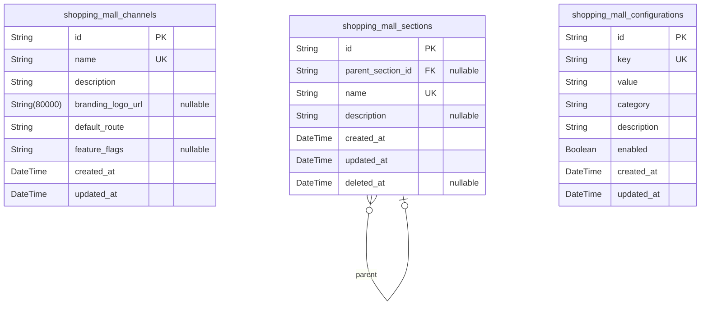
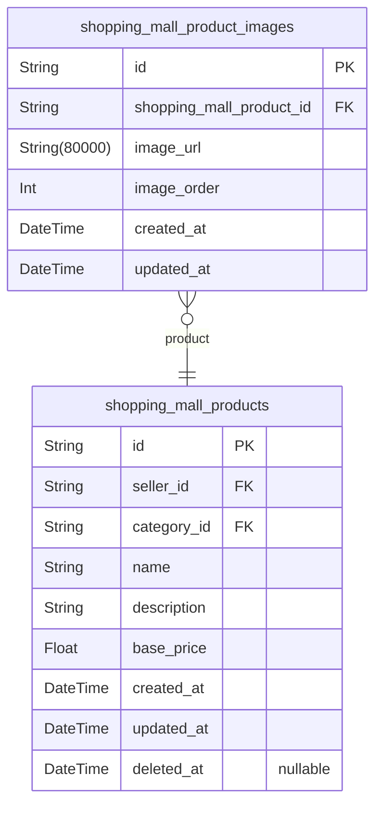
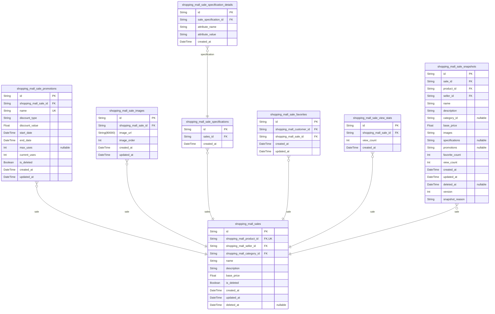
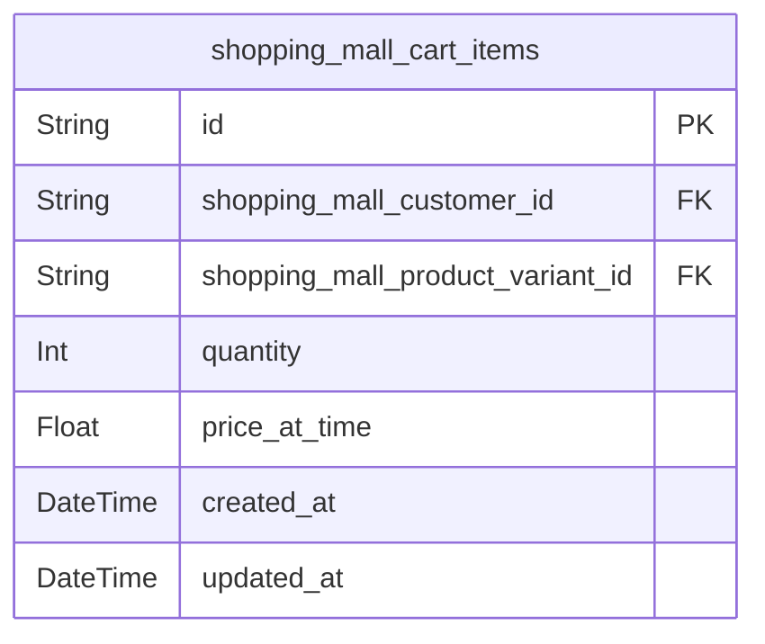
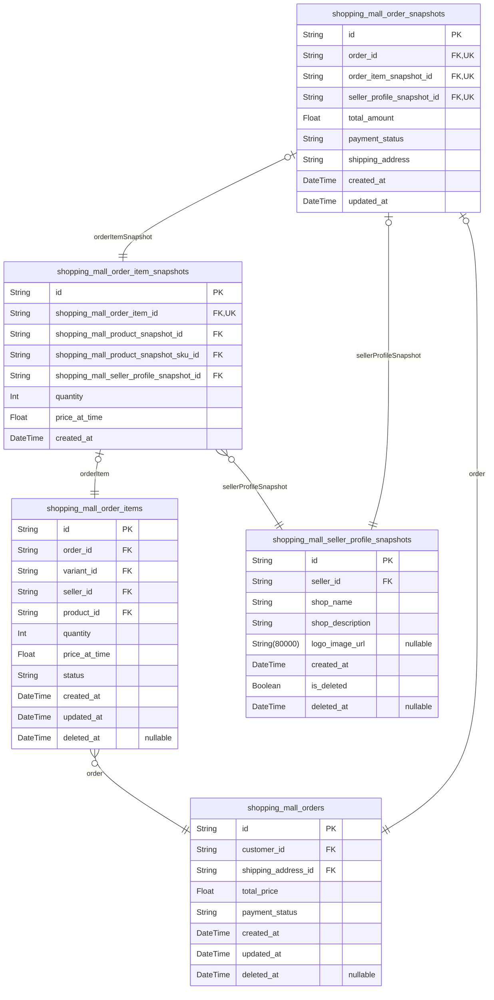
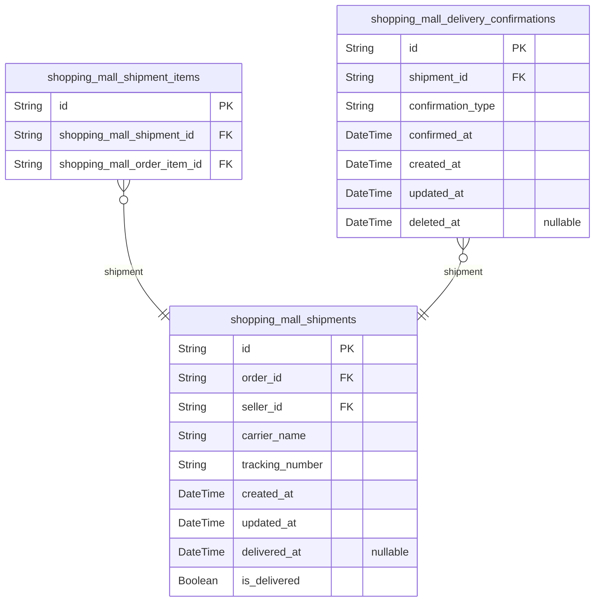
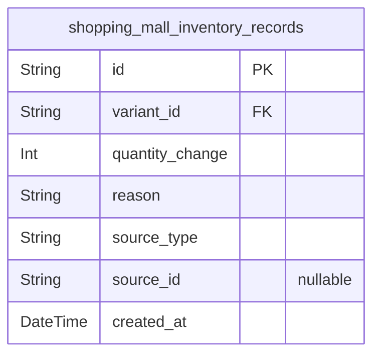
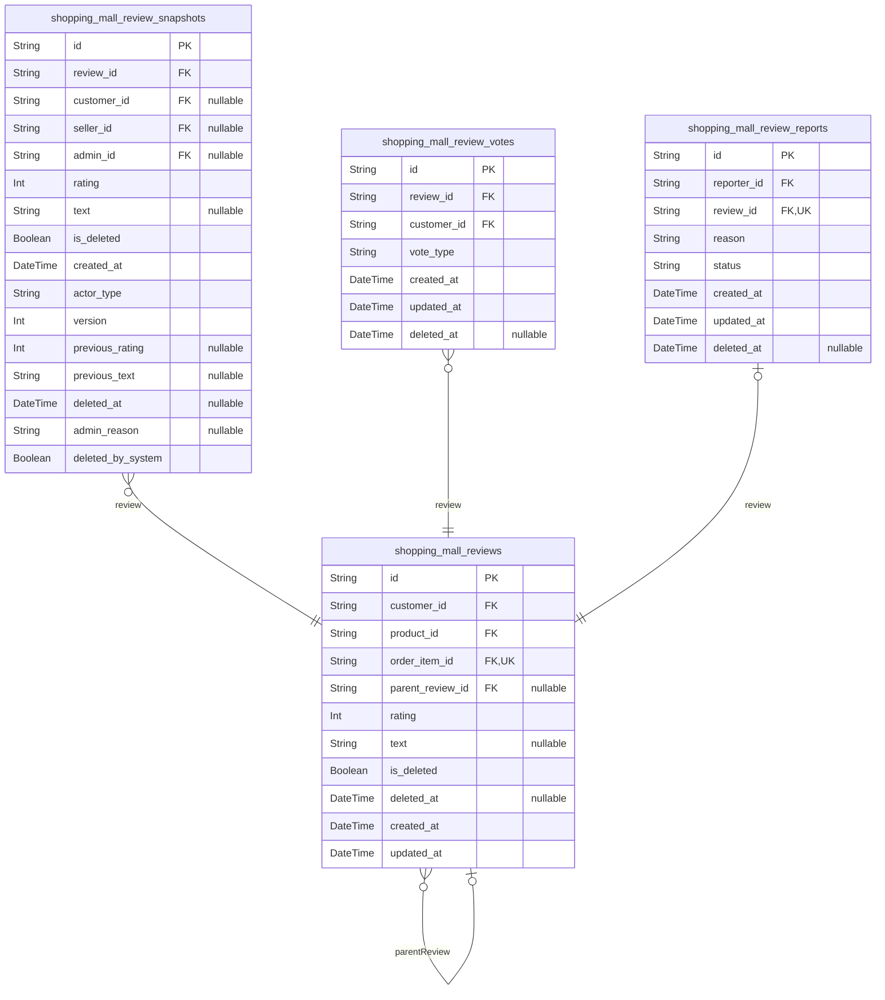
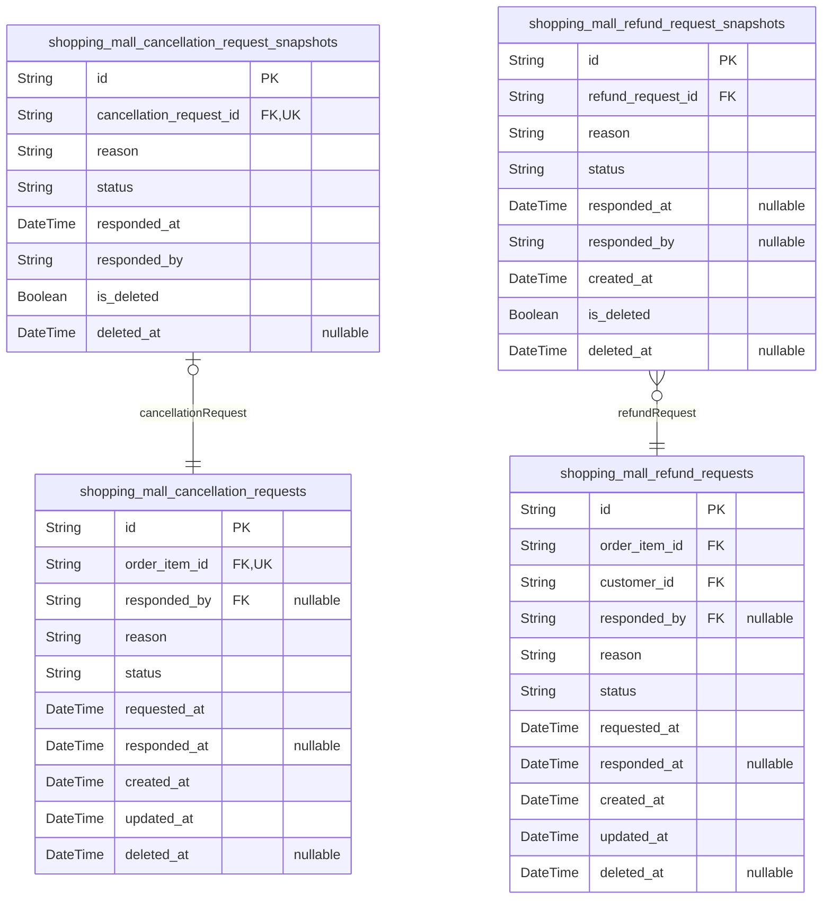

# Prisma Markdown

> Generated by [`prisma-markdown`](https://github.com/samchon/prisma-markdown)

- [Actors](#actors)
- [Systematic](#systematic)
- [Products](#products)
- [Sales](#sales)
- [Carts](#carts)
- [Orders](#orders)
- [Shipping](#shipping)
- [Inventory](#inventory)
- [Reviews](#reviews)
- [CancellationRefunds](#cancellationrefunds)

## Actors

```mermaid
erDiagram
"shopping_mall_customers" {
  String id PK
  String email UK
  String password_hash
  String display_name "nullable"
  String phone_number "nullable"
  DateTime created_at
  DateTime updated_at
  DateTime deleted_at "nullable"
}
"shopping_mall_customer_sessions" {
  String id PK
  String customer_id FK
  String ip
  String href
  String referrer
  DateTime created_at
  DateTime expired_at
}
"shopping_mall_customer_password_resets" {
  String id PK
  String customer_id FK
  String token UK
  DateTime expires_at
  DateTime created_at
  DateTime updated_at
  DateTime deleted_at "nullable"
}
"shopping_mall_customer_email_verifications" {
  String id PK
  String customer_id FK
  String email
  String verification_token UK
  DateTime expires_at
  String status
  DateTime created_at
  DateTime updated_at
  DateTime deleted_at "nullable"
}
"shopping_mall_sellers" {
  String id PK
  String user_id FK,UK
  String email UK
  String password_hash
  String shop_name UK
  String shop_description "nullable"
  String(80000) logo_image_url "nullable"
  Boolean is_approved
  String approval_rejection_reason "nullable"
  Boolean is_suspended
  String suspension_reason "nullable"
  DateTime created_at
  DateTime updated_at
  DateTime deleted_at "nullable"
}
"shopping_mall_seller_sessions" {
  String id PK
  String seller_id FK
  String ip
  String href
  String referrer
  DateTime created_at
  DateTime expired_at
}
"shopping_mall_seller_password_resets" {
  String id PK
  String seller_id FK
  String token UK
  DateTime expired_at
  DateTime created_at
  DateTime used_at "nullable"
}
"shopping_mall_seller_email_verifications" {
  String id PK
  String seller_id FK
  String token UK
  DateTime created_at
  DateTime expired_at
}
"shopping_mall_admins" {
  String id PK
  String email UK
  String password_hash
  DateTime created_at
  DateTime updated_at
  DateTime deleted_at "nullable"
  String totp_secret "nullable"
  Boolean totp_enabled
}
"shopping_mall_admin_sessions" {
  String id PK
  String admin_id FK
  String ip
  String href
  String referrer
  DateTime created_at
  DateTime expired_at
}
"shopping_mall_admin_password_resets" {
  String id PK
  String admin_id FK
  String token UK
  DateTime expires_at
  DateTime created_at
  DateTime used_at "nullable"
}
"shopping_mall_admin_email_verifications" {
  String id PK
  String admin_id FK,UK
  String token UK
  String email
  DateTime created_at
  DateTime expired_at
}
"shopping_mall_super_admins" {
  String id PK
  String email UK
  String password_hash
  DateTime created_at
  DateTime updated_at
  DateTime deleted_at "nullable"
  String role
}
"shopping_mall_super_admin_sessions" {
  String id PK
  String super_admin_id FK
  String ip
  String href
  String referrer
  DateTime created_at
  DateTime expired_at
}
"shopping_mall_super_admin_password_resets" {
  String id PK
  String super_admin_id FK
  String token
  DateTime created_at
  DateTime expires_at
}
"shopping_mall_super_admin_email_verifications" {
  String id PK
  String super_admin_id FK
  String token UK
  DateTime expires_at
  Boolean used
  DateTime created_at
}
"shopping_mall_customer_sessions" }o--|| "shopping_mall_customers" : customer
"shopping_mall_customer_password_resets" }o--|| "shopping_mall_customers" : customer
"shopping_mall_customer_email_verifications" }o--|| "shopping_mall_customers" : customer
"shopping_mall_sellers" |o--|| "shopping_mall_customers" : user
"shopping_mall_seller_sessions" }o--|| "shopping_mall_sellers" : seller
"shopping_mall_seller_password_resets" }o--|| "shopping_mall_sellers" : seller
"shopping_mall_seller_email_verifications" }o--|| "shopping_mall_sellers" : seller
"shopping_mall_admin_sessions" }o--|| "shopping_mall_admins" : admin
"shopping_mall_admin_password_resets" }o--|| "shopping_mall_admins" : admin
"shopping_mall_admin_email_verifications" |o--|| "shopping_mall_admins" : admin
"shopping_mall_super_admin_sessions" }o--|| "shopping_mall_super_admins" : superAdmin
"shopping_mall_super_admin_password_resets" }o--|| "shopping_mall_super_admins" : superAdmin
"shopping_mall_super_admin_email_verifications" }o--|| "shopping_mall_super_admins" : superAdmin
```

### `shopping_mall_customers`

Registered customer accounts with email/password authentication
credentials and profile information (display name, phone number).

Represents an authenticated actor in the system with dedicated session
management. Each customer account enables access to shopping cart, order
placement, product reviews, and wishlist functionality. The account
includes profile attributes for personalized experience while maintaining
separation between identity and transactional data.

Customer accounts are created during registration and can be deleted by
the user, but all associated order history and snapshots are preserved
for legal and audit purposes. When deleted, the account becomes inactive
but its transactional records remain intact for seller reference.

Email address serves as unique identifier for authentication and
communication. Password is securely hashed and never stored in plain
text. Display name is used for user interface presentation while phone
number enables SMS notifications.

Properties as follows:

- `id`: Primary Key.
- `email`
  > Customer email address used for authentication and communication. Must be
  > unique across all customers.
- `password_hash`
  > Cryptographically hashed password for secure authentication. Never stored
  > in plain text.
- `display_name`
  > Public display name for customer profile. May be edited by user during
  > account management.
- `phone_number`
  > Customer phone number for notifications and contact purposes. Optional
  > field.
- `created_at`: Timestamp when the customer account was created. Uses UTC timezone.
- `updated_at`
  > Timestamp of the last update to the customer account. Updated with every
  > profile change.
- `deleted_at`
  > Timestamp when the customer account was soft-deleted. If null, account is
  > active. This preserves audit trail while removing active access.

### `shopping_mall_customer_sessions`

JWT session tokens for customer authentication with access and refresh
token support.

Tracks login events for customers with connection context and session
lifecycle timestamps. This table provides an append-only audit trail of
authentication sessions with IP addresses, request URLs, and referrers.
Sessions are automatically expired after a limited period for security,
and cannot be deleted or modified once created.

Each session is tied to exactly one customer account. The system tracks
multiple concurrent sessions per customer. Admins can view this data for
security investigations but cannot directly manipulate session records -
they only expire sessions via revocation.

Properties as follows:

- `id`: Primary Key.
- `customer_id`: The customer this session belongs to. [shopping_mall_customers.id](#shopping_mall_customers).
- `ip`: IP address of the client device during login.
- `href`: URL of the connection request that initiated this session.
- `referrer`: Referrer URL from which the user arrived at the application.
- `created_at`: Timestamp when the session was created.
- `expired_at`
  > Timestamp when the session expires. Sessions must expire for security;
  > null values are prohibited except in explicitly requested unlimited
  > session cases.

### `shopping_mall_customer_password_resets`

Password reset tokens for customer accounts with expiration for secure
recovery workflow.

Stores temporary, single-use tokens issued to customers during password
recovery requests. Tokens are generated with cryptographic randomness and
must expire after a short period to prevent abuse. When a customer
requests password reset, the system generates one record with a unique
token and expiration time. Customers use this token to access the
password reset form. Once used or expired, the record is soft-deleted for
audit tracking.

This table is managed entirely by the authentication system. Customers
cannot directly create, update, or delete entries - they are generated
automatically during the reset workflow and cleaned up by background
processes. This design ensures secure, auditable password recovery
without exposing sensitive data.

Properties as follows:

- `id`: Primary Key.
- `customer_id`
  > Customer account requesting password reset. {@link
  > shopping_mall_customers.id}.
- `token`
  > Cryptographically secure, single-use token for password reset. Must be
  > uniquely generated and never reused.
- `expires_at`
  > Expiration timestamp after which the token becomes invalid. Must be set
  > to a short future time (e.g., 1-2 hours) for security.
- `created_at`
  > Timestamp when the password reset token was generated. Used for tracking
  > and audit.
- `updated_at`
  > Timestamp when the password reset token was last modified. For audit
  > trail, though typically only created once.
- `deleted_at`
  > Soft delete timestamp to maintain audit trail. When token is used or
  > expired, this field is populated to mark deletion without removing
  > record.

### `shopping_mall_customer_email_verifications`

Email verification tokens for customer registration and email change
workflows.

Stores temporary one-time-use verification tokens that customers use to
confirm their email addresses during registration or when changing their
registered email. Once verified, the token is marked as expired and
cannot be reused. This table supports tamper-proof user identity
verification via encrypted tokens with expiry and status tracking.

Tokens are generated during registration or email update and are consumed
only once. Upon successful verification, the customer's email status is
updated in the parent customer table, and the verification token is
marked as expired. Tokens expire after 24 hours for security.

This table is not directly modified by users — it is managed entirely by
the authentication system during the email verification workflow, and its
lifecycle is tied to the customer's email change or registration process.

Properties as follows:

- `id`: Primary Key.
- `customer_id`: Customer's account being verified. [shopping_mall_customers.id](#shopping_mall_customers).
- `email`: Email address to be verified. This must match the customer's target email.
- `verification_token`
  > Unique, cryptographically secure verification token for one-time use.
  > Used in the verification URL.
- `expires_at`
  > Expiry time of the verification token. Tokens expire 24 hours after
  > issuance for security.
- `status`
  > Current status of the verification token. Must be one of: pending,
  > verified, expired.
- `created_at`: Timestamp when this verification record was created.
- `updated_at`: Timestamp when this record was last updated (e.g., status change).
- `deleted_at`
  > Timestamp when this record was soft-deleted, if applicable. Used for
  > audit trails and compliance.

### `shopping_mall_sellers`

Registered seller accounts with email/password authentication credentials
and shop profile information.

Represents a true actor in the system with its own authentication flow,
distinct from customers and admins. Owns credentials and seller-specific
profile data such as shop_name, shop_description, and logo_image_url.
Serves as the root for permission and ownership relationships in the
shopping mall platform.

Users must sign up as sellers with email and password, then undergo
administrative approval before they can sell products. Suspended sellers
can still process existing orders but cannot create new products or edit
existing ones.

Account deletion is permitted only when no pending orders, cancellations,
or refunds exist. When deleted, the seller's profile information is
removed but order history and snapshots are preserved for audit and legal
purposes.

Properties as follows:

- `id`: Primary Key.
- `user_id`: Reference to the parent user record. [shopping_mall_customers.id](#shopping_mall_customers).
- `email`
  > Seller's email address used for authentication and communication. Must be
  > unique across all sellers.
- `password_hash`: Hashed password for authentication. Never store plain text passwords.
- `shop_name`
  > The public name of the seller's shop as displayed to customers. Required
  > for storefront identity.
- `shop_description`
  > Detailed description of the seller's shop, products, and value
  > proposition.
- `logo_image_url`: URL pointing to the seller's logo image used in shop display.
- `is_approved`
  > Indicates whether the seller account has been approved by an
  > administrator. Pending by default.
- `approval_rejection_reason`
  > If rejected, contains the reason provided by the administrator for the
  > rejection.
- `is_suspended`
  > Indicates whether the seller account has been suspended by an
  > administrator. Suspended sellers can still process existing orders but
  > cannot create new products.
- `suspension_reason`: If suspended, contains the reason provided by the administrator.
- `created_at`: Timestamp when this seller account was created.
- `updated_at`: Timestamp when this seller account was last updated.
- `deleted_at`
  > Timestamp when this seller account was deleted (soft delete). If null,
  > account is active.

### `shopping_mall_seller_sessions`

JWT session tokens for seller authentication with access and refresh
token support.

Tracks active login sessions for sellers using stateless JWT tokens. Each
session records the connection context including IP address, requested
URL, and referrer source. Sessions expire after a predetermined timeout
for security.

Repository for authentication state, managed through the authentication
workflow rather than direct CRUD operations. Every login creates a new
session, and logout or expiration invalidates the old one. This table is
append-only for audit purposes.

The seller_id references the dedicated seller actor table, ensuring that
each session is tied to exactly one approved seller account.

Properties as follows:

- `id`: Primary Key.
- `seller_id`: Seller's [shopping_mall_sellers.id](#shopping_mall_sellers).
- `ip`: Client IP address used for this session.
- `href`: URL accessed that initiated this session.
- `referrer`: Referrer URL that linked to this login page.
- `created_at`: Date and time when the session was created.
- `expired_at`
  > Date and time when the session expires. Sessions must expire for
  > security; unlimited sessions are not permitted unless explicitly
  > requested.

### `shopping_mall_seller_password_resets`

Password reset tokens with expiration for secure seller password recovery
workflow.

Stores temporary password reset tokens for seller accounts as a security
measure to facilitate password recovery. Each token is a unique, randomly
generated string with a limited validity period (usually 1 hour) to
prevent abuse.

When a seller initiates password reset, a new record is created with an
expiration timestamp. The token can only be used once to reset the
password to a new value, after which it becomes invalid. If the token
expires or is used, a new reset request must be initiated.

This table is not for persistent storage of passwords or credentials, but
for secure one-time password recovery operations with automatic cleanup
via token expiration.

Properties as follows:

- `id`: Primary Key.
- `seller_id`
  > The seller account for which this password reset token is issued. {@link
  > shopping_mall_sellers.id}.
- `token`
  > The unique, randomly generated password reset token. Must be a
  > cryptographically secure random string, typically 64+ characters in
  > length, to prevent brute-force attacks.
- `expired_at`
  > The timestamp when this password reset token will expire and become
  > invalid. Tokens typically expire after 1 hour (3600 seconds) for
  > security.
- `created_at`
  > When the password reset token was generated and issued. Used for
  > calculating remaining validity window.
- `used_at`
  > When this token was successfully used to reset the password. If null, the
  > token remains unused. Once used, the token becomes invalid and cannot be
  > used again.

### `shopping_mall_seller_email_verifications`

Email verification tokens for seller registration confirmation and email
change verification.

Tracks one-time use tokens sent to sellers to verify their email
addresses during registration or email change requests.

Each token has a short expiration period (typically 24-72 hours) for
security.
When a seller clicks the verification link, the token is consumed and the
seller's email is marked as verified in the main shopping_mall_sellers
table.
Expired or used tokens are automatically purged by system processes.

This table is append-only - no updates or deletions are performed by the
application.
Tokens are invalidated by expiration or usage, not by removal from the
table.

Only the seller who owns this verification token can use it to verify
their email.

The token value is stored in plaintext because it's a one-time use
cryptographic random string that should never be reused.

This table does not contain email addresses - they are referenced through
the seller_id foreign key to principle shopping_mall_sellers table.

Properties as follows:

- `id`: Primary Key.
- `seller_id`
  > Seller who owns this email verification token. {@link
  > shopping_mall_sellers.id}.
- `token`
  > Unique verification token sent to the seller's email address. This is a
  > randomly generated UUID string.
- `created_at`
  > When the verification token was generated. This is the timestamp of the
  > request to send verification.
- `expired_at`
  > When the verification token expires. Sessions must expire for security.
  > Default: 72 hours after created_at.

### `shopping_mall_admins`

Platform administrator accounts with email/password authentication and
2FA enforcement for elevated privileges.

Represents a core actor type in the system with distinct authentication
flow and elevated permissions that allow management of other
administrators, sellers, products, orders, and customer accounts.

This is a canonical identity record used across the system for permission
and ownership relationships. Each admin has a separate session table for
authentication tracking.

Admins can be promoted to super administrator role through proper
authorization workflow.

Soft deletion is supported to maintain audit trails while allowing
administrative account suspension.

The email address must be unique across all actor types (user, seller,
admin) to prevent duplicate account creation.

2FA (TOTP) is enforced for enhanced security when performing elevated
privilege operations.

Properties as follows:

- `id`: Primary Key.
- `email`
  > Unique email address for authentication. Must be unique across all actor
  > types (customer, seller, admin).
- `password_hash`
  > Hashed password for authentication using bcrypt or equivalent algorithm.
  > Never store plain text passwords.
- `created_at`: Timestamp when the admin account was created.
- `updated_at`: Timestamp when the admin account was last updated.
- `deleted_at`
  > Timestamp when the admin account was soft-deleted (if any). If null,
  > account is active.
- `totp_secret`
  > Base32 encoded secret key used for Time-Based One-Time Password (TOTP)
  > 2FA implementation. null if 2FA is not enabled.
- `totp_enabled`: Boolean flag indicating whether 2FA is enabled for this admin account.

### `shopping_mall_admin_sessions`

Tracks login sessions for administrators, capturing connection metadata
and temporal data for security audit trails.

This is an append-only session table that records every time an admin
logs into the system. Each record represents a unique authentication
session with details about the connection context and lifecycle.

Sessions are created during successful authentication and expire
according to security policy. The system never deletes session records -
they remain as an immutable audit trail of administrative activity.

The table enforces strong security by requiring all sessions to have a
non-null expiration time. Unlimited sessions are prohibited by default to
prevent security vulnerabilities.

Administrators can have multiple concurrent sessions, but each session is
bound to a specific admin actor and cannot be reused across different
actor types.

Properties as follows:

- `id`: Primary Key.
- `admin_id`
  > Administrator account that initiated this session. {@link
  > shopping_mall_admins.id}.
- `ip`: IP address from which the admin logged in.
- `href`
  > URL of the application that initiated this session (e.g.,
  > https://shopping-mall/admin/login).
- `referrer`
  > Referrer URL indicating where the admin came from before initiating the
  > login (e.g., https://google.com).
- `created_at`: Timestamp when the session was created.
- `expired_at`
  > Timestamp when the session expires. Must have a value; unlimited sessions
  > are prohibited for security.

### `shopping_mall_admin_password_resets`

Password reset tokens with expiration for secure administrator password
recovery workflow.

Stores temporary, single-use tokens generated when administrators request
password recovery. Each token is linked to a specific administrator
account and expires after a set time period to prevent token reuse and
enhance security.

When a reset request is made, a unique token is generated and emailed to
the administrator's registered email address. Once used to reset the
password, the token is invalidated (though the record is preserved for
audit purposes with a non-nullable expired_at field, in accordance with
requirement "reset tokens expire"; tokens are automatically expired on
use).

This table is purely a support entity for the authentication system, not
directly managed by users. It is automatically created upon password
reset request, updated upon token usage, but never directly queried or
modified by administrators. Its lifecycle is managed entirely by the
authentication system.

Properties as follows:

- `id`: Primary Key.
- `admin_id`
  > Administrator account associated with this password reset request. {@link
  > shopping_mall_admins.id}.
- `token`
  > Unique, randomly generated token used for password reset. Must be
  > cryptographically secure and unguessable.
- `expires_at`
  > Expiration timestamp for the password reset token. Token becomes invalid
  > after this time. Not nullable to enforce security - all tokens expire and
  > none are permanent.
- `created_at`
  > Timestamp when the password reset request was generated. Used for
  > auditing the sequence of reset events.
- `used_at`
  > Timestamp when this token was successfully used to reset the password. If
  > NULL, the token has not been used yet. When used, this field is set and
  > the token is considered invalid.

### `shopping_mall_admin_email_verifications`

Email verification tokens for administrator registration confirmation and
email change verification.

These temporary tokens enable secure authentication workflow for
administrator accounts during registration and email address changes.
Each token is unique and expires after a defined period, after which it
becomes invalid and must be regenerated.

The table tracks verification events tied to admin accounts, ensuring
security through time-limited tokens. Tokens are issued when an admin
registers or requests an email change, and must be validated before the
account can be activated or email updated.

Verification tokens are immutable once created. Only one active token can
exist per admin account at any time - previous tokens are automatically
invalidated upon new token generation.

This table follows the session pattern of tracking authentication
lifecycle events, with a one-to-many relationship to the admin actor
table where each admin can have multiple verification events throughout
their account lifecycle.

Properties as follows:

- `id`: Primary Key.
- `admin_id`
  > The administrator account this email verification token belongs to.
  > [shopping_mall_admins.id](#shopping_mall_admins).
- `token`
  > Unique verification token for email confirmation. Generated
  > cryptographically and sent to the user's email address.
- `email`
  > The email address being verified. This may be a new email address during
  > email change process or the primary email during registration.
- `created_at`: Timestamp when this verification token was created. Always non-null.
- `expired_at`
  > Timestamp when this verification token expires. Sessions must expire for
  > security - must be non-null as per session pattern.

### `shopping_mall_super_admins`

System super administrator accounts with full authority over all
administrators, using the same authentication pattern as regular
administrators.

This table represents the highest level of identity in the system, with
complete authority to manage all other administrator accounts including
promotion, demotion, and oversight of all platform operations. Each super
administrator has unique credentials and authentication flow that
establishes their identity for system control.

Super administrators can perform all actions that regular administrators
can, plus they have the exclusive ability to manage other administrators'
privileges, create and remove super administrator accounts, and oversee
system-wide configuration and governance.

This entity serves as the root of the administrative identity hierarchy,
with dedicated session tracking and password reset functionality managed
separately in the Actors component.

Soft deletion is supported to maintain audit trails while allowing
deactivation of super administrator accounts if necessary for security or
compliance reasons.

Properties as follows:

- `id`: Primary Key.
- `email`
  > Unique email address used for authentication and communication. Cannot be
  > duplicated across any actor type.
- `password_hash`
  > Hashed password for authentication. Never store plain text passwords.
  > Required for login functionality.
- `created_at`
  > Timestamp when the super administrator account was created. Used for
  > audit trails and account age analysis.
- `updated_at`
  > Timestamp when the super administrator account was last modified. Used to
  > track last activity and changes to account settings.
- `deleted_at`
  > Timestamp when the super administrator account was soft-deleted. Allows
  > account deactivation while preserving historical records for audit
  > purposes. Null indicates active account.
- `role`
  > Fixed value 'super' indicating this is a system super administrator
  > account. This distinguishes it from regular administrator accounts and
  > enforces elevated privilege levels.

### `shopping_mall_super_admin_sessions`

JWT session tokens for super administrator authentication with access and
refresh token support.

Tracks login sessions for super administrators, recording connection
context and temporal metadata for audit and security purposes. Each
session represents an active authentication session initiated by a
super_admin user.

Sessions are append-only audit records that cannot be modified or
deleted. When a super_admin logs in, a new session record is created.
When the session expires or is terminated, expired_at is set to the
termination time. This provides a complete history of super_admin access
patterns for security monitoring.

The system enforces session expiration to maintain security posture.
Unlimited sessions are prohibited unless explicitly requested by a
super_admin with appropriate justification.

Relationship: One super_admin can have multiple concurrent sessions, but
each session belongs to exactly one super_admin.

Properties as follows:

- `id`: Primary Key.
- `super_admin_id`
  > The super administrator account that owns this session. References the
  > super_admin's primary key. [shopping_mall_super_admins.id](#shopping_mall_super_admins).
- `ip`: The IP address from which the session was initiated.
- `href`: The URL of the page from which the user initiated the session.
- `referrer`: The referrer URL indicating the originating source of this connection.
- `created_at`
  > The exact timestamp when this session was created and authenticated. This
  > is immutable and represents the login event.
- `expired_at`
  > The timestamp when this session will expire. Sessions must expire for
  > security. This field is NOT NULL - unlimited sessions are prohibited as a
  > security vulnerability unless explicitly requested.

### `shopping_mall_super_admin_password_resets`

Password reset tokens with expiration for secure super administrator
password recovery workflow.

Expires automatically after 1 hour. Used only once per token. Each super
administrator can have at most one active password reset request at a
time. Reset token is invalidated upon successful password change or
expiration.

System generates a cryptographically random token when a super admin
initiates password recovery. Clear text passwords are never stored. Token
is securely transmitted via email and eliminated after successful use or
expiration.

Properties as follows:

- `id`: Primary Key.
- `super_admin_id`
  > Super administrator's account requesting password reset. {@link
  > shopping_mall_super_admins.id}.
- `token`
  > Cryptographically random, single-use token for password reset. Must be
  > URL-safe and expire after one hour.
- `created_at`: Timestamp when the password reset request was generated.
- `expires_at`
  > Timestamp when the password reset token expires. Must be exactly one hour
  > after created_at. Null means invalid/unassigned.

### `shopping_mall_super_admin_email_verifications`

Email verification tokens for super administrator registration
confirmation and email change verification.

Tracks temporary verification tokens sent to super administrators during
registration or email change workflows. Each token is unique and expires
after a set time period. Once used to verify an email address, the token
becomes invalid and cannot be reused.

This table is part of the authentication system for super_admin actors
and follows the same pattern as other actor verification tables in the
component. It serves as an append-only audit trail of email verification
attempts, ensuring secure account activation and email change validation.

The token field contains a cryptographically secure random string that
must be presented to complete the verification process. The expires_at
field ensures tokens have limited lifespans for security. The used field
tracks whether the token has been consumed during verification, which
prevents token replay attacks. The created_at field provides an immutable
timestamp of when the verification request was initiated.

Properties as follows:

- `id`: Primary Key.
- `super_admin_id`: Belonged super administrator's [shopping_mall_super_admins.id](#shopping_mall_super_admins).
- `token`
  > Unique cryptographically secure verification token. Must be unique across
  > all verifications.
- `expires_at`
  > Expiration timestamp for the verification token. After this time, the
  > token becomes invalid and cannot be used for verification.
- `used`
  > Indicates whether the verification token has been consumed. True if the
  > token was successfully used to verify an email address; false if still
  > pending or expired.
- `created_at`
  > Timestamp when the verification token was created and sent to the super
  > administrator. This is immutable and indicates when the registration or
  > email change request was initiated.

## Systematic

```mermaid
erDiagram
"shopping_mall_channels" {
  String id PK
  String name UK
  String description
  String(80000) branding_logo_url "nullable"
  String default_route
  String feature_flags "nullable"
  DateTime created_at
  DateTime updated_at
}
"shopping_mall_sections" {
  String id PK
  String parent_section_id FK "nullable"
  String name UK
  String description "nullable"
  DateTime created_at
  DateTime updated_at
  DateTime deleted_at "nullable"
}
"shopping_mall_configurations" {
  String id PK
  String key UK
  String value
  String category
  String description
  Boolean enabled
  DateTime created_at
  DateTime updated_at
}
"shopping_mall_sections" }o--o| "shopping_mall_sections" : parent
```

### `shopping_mall_channels`

Defines sales channels (e.g., online store, mobile app) with branding,
routing rules, and configuration settings.

Represents the different platforms through which the shopping mall
platform operates, such as web and mobile applications. Each channel has
its own configuration for branding, URL routing, and feature flags that
determine user experience and available functionality.

This is a system-level infrastructure table that supports the entire
commerce platform. It is not directly managed by customers or sellers,
but rather by system administrators through administrative tools. Changes
to channel configuration affect the behavior of the entire platform.

The branding logo and default route define the visual identity and entry
point of each channel. Feature flags control conditional activation of
platform features per channel, allowing targeted rollouts and A/B
testing.

Properties as follows:

- `id`: Primary Key.
- `name`
  > Unique identifier for the sales channel (e.g., "online_store",
  > "mobile_app"). Must be unique across all channels.
- `description`
  > Detailed description of the channel's purpose and scope, explaining what
  > types of users and functionalities it supports.
- `branding_logo_url`
  > URL to the logo image used to represent this channel in the user
  > interface. Optional, allows for custom branding per channel.
- `default_route`
  > The canonical URL path prefix or routing identifier for this channel.
  > Used to direct user requests to the appropriate application instance or
  > service.
- `feature_flags`
  > JSON string representation containing boolean flags that control feature
  > availability per channel. Examples: "{\"enable_wishlist\": true,
  > \"enable_mobile_payments\": false}". Allows targeted feature rollouts.
- `created_at`: Timestamp when this channel configuration was created in the system.
- `updated_at`: Timestamp when this channel configuration was last modified.

### `shopping_mall_sections`

Hierarchical sections within a shopping channel for organizing content
and products with one-level nesting support.

Defines organizational units that structure the product catalog and
content navigation within each sales channel. Sections can be parented to
other sections to create a controlled hierarchy (parent > child) with
exactly one level of nesting permitted.

Sections are managed exclusively by administrators through system
configuration, not by end users. They provide the structural framework
for product categorization and content organization within channels.

Each section has a unique name and optional description providing context
for its purpose. The parent-child relationship allows organization of
sections into logical groups without permitting deeper nesting that could
complicate navigation.

Changes to sections are tracked via system audit trails, and soft
deletion preserves historical configuration states while allowing for
reorganization and cleanup.

Properties as follows:

- `id`: Primary Key.
- `parent_section_id`
  > Parent section that this section belongs to, enabling one-level
  > hierarchical nesting. [shopping_mall_sections.id](#shopping_mall_sections).
- `name`
  > The unique name of the section used for identification and navigation.
  > Must be unique within its channel context.
- `description`
  > Optional detailed description explaining the purpose and content scope of
  > this section. Used for administrative reference and documentation.
- `created_at`: Timestamp when this section was created in the system.
- `updated_at`: Timestamp when this section was last modified.
- `deleted_at`
  > Soft delete timestamp. When non-null, indicates this section has been
  > logically deleted but preserved for audit history.

### `shopping_mall_configurations`

Global system-wide configuration settings and feature flags that control
platform behavior and functionality.

This table serves as the authoritative source for dynamic configuration
parameters that govern the behavior of the entire shopping mall platform.
Administrators use this to enable/disable features, configure business
rules, adjust thresholds, and adjust system behavior without code
deployments.

Each configuration entry has a unique key and a structured value stored
in JSONB format to support complex nested settings. The category field
organizes settings into logical groups (e.g., payment, shipping,
reviews). The enabled flag allows temporary deactivation of a setting
without deletion.

All changes to configuration records are captured via the platform's
snapshot system — every update operation creates an immutable snapshot in
the system's audit trail, preserving the previous value state for
compliance and verification.

Deleting configuration entries is strongly discouraged; instead,
administrators should disable them with enabled: false and deprecate the
key name. This preserves audit integrity and prevents breaking changes in
deployed systems.

Operators frequently query this table to determine active feature flags
and system behaviors in real-time. It is critical for zero-downtime
configuration updates during peak traffic.

Properties as follows:

- `id`: Primary Key.
- `key`
  > Unique identifier for the configuration setting. Must be globally unique
  > and follow snake_case naming convention (e.g., 'payment_gateway_enabled',
  > 'max_items_per_cart').
- `value`
  > Structured configuration value stored as JSONB. Can contain nested
  > objects, arrays, and primitive types (string, number, boolean, null).
  > Used for flexible, dynamic configuration structures.
- `category`
  > Logical category or namespace for this configuration. Used to group
  > related settings (e.g., 'payment', 'shipping', 'reviews', 'system').
- `description`
  > Human-readable description explaining the purpose and effect of this
  > configuration setting. Used by administrators to understand impact.
- `enabled`
  > Whether this configuration is active and being applied by the system. Set
  > to false to temporarily disable a setting without deletion.
- `created_at`
  > Timestamp of creation for this configuration record. Records when the
  > configuration was first introduced into the system.
- `updated_at`
  > Timestamp of last modification for this configuration record. Updated on
  > every change to track when the setting was last adjusted.

## Products

```mermaid
erDiagram
"shopping_mall_products" {
  String id PK
  String seller_id FK
  String category_id FK
  String name
  String description
  Float base_price
  DateTime created_at
  DateTime updated_at
  DateTime deleted_at "nullable"
}
"shopping_mall_product_images" {
  String id PK
  String shopping_mall_product_id FK
  String(80000) image_url
  Int image_order
  DateTime created_at
  DateTime updated_at
}
"shopping_mall_product_images" }o--|| "shopping_mall_products" : product
```

### `shopping_mall_products`

Core product entities with name, description, category, base price, and
seller association.

Represents products listed for sale by sellers. Each product belongs to
exactly one seller and one category.
Products are accessible to customers for browsing and purchase, but can
only be created, edited, or deleted by the owning seller.

Products are immutable in the sense that their specifications (name,
description, price) are preserved in snapshots when sold, but active
products can be modified by sellers.
When a product is deleted, it is soft-deleted (deleted_at set) and
becomes invisible to customers but remains accessible to administrators
for audit purposes.

Requires full CRUD operations for seller management and search/filtering
for customer discovery.

Properties as follows:

- `id`: Primary Key.
- `seller_id`
  > Seller who created and owns this product. {@link
  > shopping_mall_sellers.id}.
- `category_id`: Category this product belongs to. [shopping_mall_sections.id](#shopping_mall_sections).
- `name`
  > Name of the product shown to customers. Required field for product
  > discovery.
- `description`
  > Detailed description of the product including features, specifications,
  > and usage information.
- `base_price`
  > Base price of the product. This may be overridden by product variants
  > (SKUs) which can have different prices.
- `created_at`: Timestamp when this product was created.
- `updated_at`: Timestamp when this product was last updated.
- `deleted_at`
  > Timestamp when this product was soft-deleted. When null, product is
  > active. When set, product is hidden from customers.

### `shopping_mall_product_images`

Images associated with products, including display order and URLs.

Stores multiple visual representations of products with precise ordering
to determine thumbnail and display sequence. Each image is linked to a
single product and has an explicit display order (0-indexed). Images are
managed solely through their parent product - customers cannot upload or
modify images directly, and sellers manage them only as part of product
editing.

Every product edit creates a product snapshot that captures the exact set
of images at that moment, preserving historical state. This table only
stores current images in a normalized structure. When products are
deleted, the images are also removed from the system.

The image_order field ensures consistent visual presentation across the
platform, with order 0 being the primary or thumbnail image. The
image_url field stores absolute URLs to the hosted images on the media
server.

Properties as follows:

- `id`: Primary Key.
- `shopping_mall_product_id`: Product this image belongs to. [shopping_mall_products.id](#shopping_mall_products).
- `image_url`
  > Absolute URL to the hosted image, typically on an S3-compatible media
  > server.
- `image_order`
  > Display order of the image, 0-indexed, defining sequence for thumbnail
  > (0) and subsequent images.
- `created_at`: Timestamp when this image was first created and added to the product.
- `updated_at`: Timestamp when this image was last modified (reordered or replaced).

## Sales

```mermaid
erDiagram
"shopping_mall_sales" {
  String id PK
  String shopping_mall_product_id FK,UK
  String shopping_mall_seller_id FK
  String shopping_mall_category_id FK
  String name
  String description
  Float base_price
  Boolean is_deleted
  DateTime created_at
  DateTime updated_at
  DateTime deleted_at "nullable"
}
"shopping_mall_sale_promotions" {
  String id PK
  String shopping_mall_sale_id FK
  String name UK
  String discount_type
  Float discount_value
  DateTime start_date
  DateTime end_date
  Int max_uses "nullable"
  Int current_uses
  Boolean is_deleted
  DateTime created_at
  DateTime updated_at
}
"shopping_mall_sale_images" {
  String id PK
  String shopping_mall_sale_id FK
  String(80000) image_url
  Int image_order
  DateTime created_at
  DateTime updated_at
}
"shopping_mall_sale_specifications" {
  String id PK
  String sales_id FK
  DateTime created_at
}
"shopping_mall_sale_specification_details" {
  String id PK
  String sale_specification_id FK
  String attribute_name
  String attribute_value
  DateTime created_at
}
"shopping_mall_sale_favorites" {
  String id PK
  String shopping_mall_customer_id FK
  String shopping_mall_sale_id FK
  DateTime created_at
  DateTime updated_at
}
"shopping_mall_sale_view_stats" {
  String id PK
  String shopping_mall_sale_id FK
  Int view_count
  DateTime created_at
}
"shopping_mall_sale_snapshots" {
  String id PK
  String sale_id FK
  String product_id FK
  String seller_id FK
  String name
  String description
  String category_id "nullable"
  Float base_price
  String images
  String specifications "nullable"
  String promotions "nullable"
  Int favorite_count
  Int view_count
  DateTime created_at
  DateTime updated_at
  DateTime deleted_at "nullable"
  Int version
  String snapshot_reason
}
"shopping_mall_sale_promotions" }o--|| "shopping_mall_sales" : sale
"shopping_mall_sale_images" }o--|| "shopping_mall_sales" : sale
"shopping_mall_sale_specifications" }o--|| "shopping_mall_sales" : sales
"shopping_mall_sale_specification_details" }o--|| "shopping_mall_sale_specifications" : specification
"shopping_mall_sale_favorites" }o--|| "shopping_mall_sales" : sale
"shopping_mall_sale_view_stats" }o--|| "shopping_mall_sales" : sale
"shopping_mall_sale_snapshots" }o--|| "shopping_mall_sales" : sale
```

### `shopping_mall_sales`

Main sales listings with product details, pricing, and seller reference.

Represents the public-facing sales offering of products with specific
pricing, promotional context, and visibility controls. Each sales listing
is associated with a core product from the Products domain but may have
domain-specific variations in pricing, promotional context, and
visibility settings. Sales listings are the primary interface for
customers to browse and purchase products, with their visibility and
availability governed by the seller's active status.

Sales listings must maintain an immutable connection to their originating
product, preserving product information at the time of listing. When a
product is edited or its variants change, the existing sales listing
remains visible with its original attributes, but new sales listings can
be created for updated product versions. This ensures customers always
see the exact product presentation that was available when they selected
it for purchase.

Sales listings are subject to soft deletion for compliance with platform
policies - when deleted, they are hidden from view but preserved in the
database for audit purposes. The sales listing can be restored by
administrators if appropriate.

Properties as follows:

- `id`: Primary Key.
- `shopping_mall_product_id`
  > Reference to the core product entity from Products component. {@link
  > shopping_mall_products.id}.
- `shopping_mall_seller_id`
  > Reference to the seller who created this sales listing. {@link
  > shopping_mall_sellers.id}.
- `shopping_mall_category_id`
  > Reference to the category this sales listing belongs to. {@link
  > shopping_mall_sections.id}.
- `name`: Display name of the sales listing, shown to customers during browsing.
- `description`
  > Detailed description of the sales listing, including special features or
  > promotions.
- `base_price`
  > Base price of the product as displayed to customers, before any
  > promotions or discounts are applied.
- `is_deleted`
  > Flag indicating if the sales listing has been deleted. When true, the
  > sales listing is hidden from customers but preserved for audit purposes.
- `created_at`
  > Timestamp when the sales listing was initially created and made available
  > to customers.
- `updated_at`
  > Timestamp when the sales listing was last modified (name, description,
  > base_price, etc.).
- `deleted_at`
  > Timestamp when the sales listing was soft-deleted. NULL if the sales
  > listing is active.

### `shopping_mall_sale_promotions`

Active promotions and discounts applied to sales for pricing incentives.

Captures marketing campaigns that provide temporary price reductions or
incentives on specific sales listings. Promotions can be applied to one
or multiple sales and can be limited by time period and usage count.

Each promotion has a name, discount type (fixed amount or percentage),
discount value, start and end dates, maximum uses limit, and current
usage count. Promotions are created and managed by administrators or
sellers with appropriate permissions. The system automatically
enables/disables promotions based on date ranges and usage statistics.

Promotions are independent business entities that can be searched,
filtered by date, and managed in bulk. They affect multiple sales
listings simultaneously, making them a primary business concept requiring
full CRUD operations.

Soft deletion is supported to preserve historical promotions and audit
trails, but promotions are logically deleted by setting is_deleted flag
rather than removing records.

Properties as follows:

- `id`: Primary Key.
- `shopping_mall_sale_id`
  > The sale this promotion applies to. [shopping_mall_sales.id](#shopping_mall_sales). Many
  > promotions can apply to the same sale.
- `name`
  > The display name of the promotion for internal reference and user
  > interface. This is what staff see when managing promotions.
- `discount_type`
  > Type of discount being applied. Must be either 'fixed_amount' or
  > 'percentage' to ensure consistent calculation.
- `discount_value`
  > The value of the discount. For 'fixed_amount', this is the dollar amount
  > off. For 'percentage', this is the percentage (e.g., 0.2 for 20%).
- `start_date`
  > The date and time when the promotion becomes active and begins being
  > applied to sales.
- `end_date`
  > The date and time when the promotion expires and stops being applied to
  > sales.
- `max_uses`
  > Maximum number of times this promotion can be used in total. NULL means
  > unlimited uses.
- `current_uses`
  > Current count of how many times this promotion has been successfully
  > applied to a sale checkout.
- `is_deleted`
  > Logical deletion flag. If true, the promotion is no longer active but
  > preserved in history for audit purposes.
- `created_at`: Timestamp when this promotion record was created in the system.
- `updated_at`
  > Timestamp when this promotion record was last modified (e.g., name or
  > dates changed).

### `shopping_mall_sale_images`

Multiple image URLs for sales listings to showcase products visually.

Each image is associated with a specific sale listing and contributes to
the visual presentation of the product for customers. Images are used to
provide detailed views of products in sales listings, helping customers
make informed purchasing decisions. Images are uploaded and managed as
part of the sale listing creation and editing process, not as standalone
entities.

The image_order field determines display order within the sale listing,
with lower values appearing first. While images cannot be edited after
upload in the requirements specification, they can be removed by deleting
the entire sale listing. Sales listings may have multiple images to
showcase different angles, features, or conditions of the product.

Properties as follows:

- `id`: Primary Key.
- `shopping_mall_sale_id`
  > Belongs to the sales listing this image is associated with. {@link
  > shopping_mall_sales.id}.
- `image_url`
  > Fully qualified URL pointing to the image file stored on the content
  > delivery network. Must be a valid URI.
- `image_order`
  > Display order for this image within the sale listing. Lower values appear
  > first. Zero-indexed position that determines visual sequencing on the
  > product page.
- `created_at`
  > Timestamp when the image was uploaded and associated with the sale
  > listing.
- `updated_at`
  > Timestamp when the image metadata was last modified (e.g., image order
  > changed).

### `shopping_mall_sale_specifications`

Technical specifications and product attributes for sales items.

Stores structured attribute data for sales listings, capturing detailed
product characteristics relevant to potential buyers.
Each sales listing can have multiple specifications, which are immutable
and preserved in snapshots for historical accuracy.
This table serves as the parent container for detailed specification
attributes that are stored in the child table.

Specifications provide essential information beyond the basic product
listing, such as material composition,
size dimensions, compatibility information, or other technical details
that influence purchasing decisions.

This table is connected to the primary shopping_mall_sales entity and is
not independently managed by end users.
It is created and maintained as part of the product listing process by
sellers through the platform interface.

All specifications are preserved in snapshots when a sale listing is
modified or archived.

The child table shopping_mall_sale_specification_details contains the
actual attribute-value pairs in 1NF format.

Properties as follows:

- `id`: Primary Key.
- `sales_id`: Reference to the primary sales listing. [shopping_mall_sales.id](#shopping_mall_sales).
- `created_at`: Timestamp when this specification record was created.

### `shopping_mall_sale_specification_details`

Individual specification attributes for sales items, decomposed from
parent table for 1NF compliance.

Stores key-value pairs of technical specifications for sales listings,
with each attribute stored as a separate row.
This follows First Normal Form by eliminating the repeating group pattern
that would otherwise exist if specifications were stored as JSON arrays
or comma-separated values in the parent table.

Each record represents one specific attribute of a product, such as
"color", "material", "size", "weight", "resolution", or "compatibility".

Maintains referential integrity with the parent
shopping_mall_sale_specifications table.

All specification details are preserved in snapshots when the parent
listing is modified.

This subsidiary table is managed automatically through the parent sales
listing operations - users do not directly interact with this table.

The attribute name and value are stored as plain text to support maximum
flexibility across different product categories.

Properties as follows:

- `id`: Primary Key.
- `sale_specification_id`
  > Reference to the parent specification record. {@link
  > shopping_mall_sale_specifications.id}.
- `attribute_name`
  > The name of the technical specification attribute (e.g., "material",
  > "color", "size").
- `attribute_value`
  > The value of the technical specification attribute (e.g., "cotton",
  > "red", "L").
- `created_at`: Timestamp when this specification detail was created.

### `shopping_mall_sale_favorites`

Tracks customer favorite sales for wishlist functionality, allowing users
to bookmark products of interest.

Each record links a customer to a specific sale listing, enabling
persistent tracking of user interest. Favourites are managed entirely
within the customer's profile interface and do not require independent
API endpoints.

Sales are not duplicated in this table; each customer-sale pair is
unique. This table supports quick retrieval of a user's saved items for
display in their wishlist UI.

Relationships are maintained via foreign keys to customer and sale
entities. The record is deleted when a customer removes an item from
their wishlist.

No snapshots are needed for this entity as changes are directly managed
and deletions are immediate and intentional by the user.

Properties as follows:

- `id`: Primary Key.
- `shopping_mall_customer_id`: Customer who favorited this sale. [shopping_mall_customers.id](#shopping_mall_customers).
- `shopping_mall_sale_id`: Sale listing that was favorited. [shopping_mall_sales.id](#shopping_mall_sales).
- `created_at`: Timestamp when the sale was added to the customer's favorites.
- `updated_at`: Timestamp when the favorite record was last modified (e.g., when removed).

### `shopping_mall_sale_view_stats`

Analytics data tracking customer engagement with sales listings.

Records view counts for sales, capturing how many times a sales listing
has been viewed by customers. This is an append-only analytics table that
provides insight into customer interest and sales performance over time.

Each record represents a single viewing event for a specific sale at a
specific time. No updates are permitted - each view increments the count
and creates a new record. This design preserves raw engagement data for
accurate historical analysis and prevents data manipulation.

View count data is never directly edited by users and is not used in
business logic decisions - it is purely for reporting and insights. The
table ensures that every customer view is recorded in real-time with
precise timestamps, enabling accurate trend analysis and performance
benchmarking.

Properties as follows:

- `id`: Primary Key.
- `shopping_mall_sale_id`: References the sales listing being viewed. [shopping_mall_sales.id](#shopping_mall_sales).
- `view_count`
  > The number of views recorded in this event. Each record represents a
  > single viewing increment, so this value is typically 1.
- `created_at`
  > The exact timestamp when this view event was recorded. Always in UTC time
  > zone.

### `shopping_mall_sale_snapshots`

Immutable historical snapshots of sales listings for audit, compliance,
and historical reference.

Each snapshot captures the complete state of a sales listing at a
specific point in time, including product details, pricing, promotional
offers, visual presentation, and customer engagement data. This ensures
accurate historical records for dispute resolution, regulatory
compliance, and analytics.

Snapshots are created when a sales listing is modified or at the time of
product listing. The snapshot contains static data from the source sale
at the moment of capture and cannot be modified after creation. All
referenced entities (product, seller) are linked via foreign keys to
preserve context.

This system preserves the exact product name, description, category, base
price, images, specifications, active promotions, and favorite count as
they appeared to customers at the time of the sale. This is critical for
resolving customer disputes about product details or pricing
discrepancies.

Properties as follows:

- `id`: Primary Key.
- `sale_id`
  > Reference to the original sales listing that was snapshotted. {@link
  > shopping_mall_sales.id}.
- `product_id`: Reference to the core product entity. [shopping_mall_products.id](#shopping_mall_products).
- `seller_id`
  > Reference to the seller who created this sales listing. {@link
  > shopping_mall_sellers.id}.
- `name`: Product name as it appeared in the sales listing at snapshot time.
- `description`: Product description as it appeared in the sales listing at snapshot time.
- `category_id`
  > Category identifier for the product at snapshot time. Null if category
  > was deleted.
- `base_price`
  > Base price of the product at snapshot time in the currency used at time
  > of listing.
- `images`
  > Array of image URLs and their display order as they appeared in the sales
  > listing at snapshot time, stored as JSON string array of objects with
  > {url: string, order: number}.
- `specifications`
  > Product specifications and technical attributes as they appeared in the
  > sales listing at snapshot time, stored as JSON string object with
  > key-value pairs.
- `promotions`
  > Active promotions and discounts applied to this sale at snapshot time,
  > stored as JSON string array of objects with {type: string, value: double,
  > description: string}.
- `favorite_count`
  > Number of customer favorites for this sale at snapshot time, representing
  > customer interest at the moment of capture.
- `view_count`
  > Total number of views for this sale at snapshot time, representing
  > customer engagement at the moment of capture.
- `created_at`: Timestamp when this snapshot was created. Always recorded in UTC.
- `updated_at`
  > Timestamp of the last update to this snapshot record. Same as created_at
  > for immutable snapshots.
- `deleted_at`
  > Timestamp when this snapshot was logically deleted (rare). NULL means
  > active snapshot.
- `version`
  > Sequential version number for this sales snapshot. Each update to the
  > source sale increments this counter.
- `snapshot_reason`
  > Reason for snapshot creation: 'creation', 'update', or 'deletion'.
  > Indicates the event type that triggered this snapshot.

## Carts

```mermaid
erDiagram
"shopping_mall_cart_items" {
  String id PK
  String shopping_mall_customer_id FK
  String shopping_mall_product_variant_id FK
  Int quantity
  Float price_at_time
  DateTime created_at
  DateTime updated_at
}
```

### `shopping_mall_cart_items`

Temporary storage of product variants selected by customers before
checkout, with quantity and unit price captured at time of addition.

This table represents the current selection state of a customer's
shopping cart. Each record links a specific product variant to a customer
session, capturing the quantity chosen and the price at the time of
addition. Cart items are not persistent business entities but temporary
states that are cleared upon checkout.

Cart items are managed through direct customer operations: adding,
removing, and modifying quantities. The unit price is preserved from the
time of addition to ensure checkout accuracy even if product prices
change later.

When a customer proceeds to checkout, cart items are used to create order
items and then deleted. Cart items remain available for modification
until checkout is completed.

Properties as follows:

- `id`: Primary Key.
- `shopping_mall_customer_id`: The customer who owns this cart item. [shopping_mall_customers.id](#shopping_mall_customers).
- `shopping_mall_product_variant_id`
  > The product variant selected for this cart item. {@link
  > shopping_mall_sale_specifications.id}.
- `quantity`
  > The number of units of this variant that the customer has added to their
  > cart. Must be at least 1.
- `price_at_time`
  > The unit price of the product variant at the exact moment it was added to
  > the cart. This price is preserved to ensure accurate checkout
  > calculations even if the product price changes later.
- `created_at`: The timestamp when this cart item was created.
- `updated_at`
  > The timestamp when this cart item was last updated (e.g., quantity
  > changed).

## Orders

```mermaid
erDiagram
"shopping_mall_orders" {
  String id PK
  String customer_id FK
  String shipping_address_id FK
  Float total_price
  String payment_status
  DateTime created_at
  DateTime updated_at
  DateTime deleted_at "nullable"
}
"shopping_mall_order_items" {
  String id PK
  String order_id FK
  String variant_id FK
  String seller_id FK
  String product_id FK
  Int quantity
  Float price_at_time
  String status
  DateTime created_at
  DateTime updated_at
  DateTime deleted_at "nullable"
}
"shopping_mall_order_item_snapshots" {
  String id PK
  String shopping_mall_order_item_id FK,UK
  String shopping_mall_product_snapshot_id FK
  String shopping_mall_product_snapshot_sku_id FK
  String shopping_mall_seller_profile_snapshot_id FK
  Int quantity
  Float price_at_time
  DateTime created_at
}
"shopping_mall_seller_profile_snapshots" {
  String id PK
  String seller_id FK
  String shop_name
  String shop_description
  String(80000) logo_image_url "nullable"
  DateTime created_at
  Boolean is_deleted
  DateTime deleted_at "nullable"
}
"shopping_mall_order_snapshots" {
  String id PK
  String order_id FK,UK
  String order_item_snapshot_id FK,UK
  String seller_profile_snapshot_id FK,UK
  Float total_amount
  String payment_status
  String shipping_address
  DateTime created_at
  DateTime updated_at
}
"shopping_mall_order_items" }o--|| "shopping_mall_orders" : order
"shopping_mall_order_item_snapshots" |o--|| "shopping_mall_order_items" : orderItem
"shopping_mall_order_item_snapshots" }o--|| "shopping_mall_seller_profile_snapshots" : sellerProfileSnapshot
"shopping_mall_order_snapshots" |o--|| "shopping_mall_orders" : order
"shopping_mall_order_snapshots" |o--|| "shopping_mall_order_item_snapshots" : orderItemSnapshot
"shopping_mall_order_snapshots" |o--|| "shopping_mall_seller_profile_snapshots" : sellerProfileSnapshot
```

### `shopping_mall_orders`

Central order record capturing customer, payment, shipping address, and
total at transaction time.Each order represents a completed transaction
with immutable state from the moment of purchase. Orders track the
customer who initiated the transaction, the shipping address used, and
the total amount paid. Order status is not stored here but derived from
the statuses of its associated order items to allow individual item-level
status tracking and processing.

Orders are preserved permanently for business, legal, and audit purposes
even if customer accounts are deleted.

This entity is considered a primary table because users regularly view,
search, and manage their orders independently of other entities - they
need to browse order history, filter by date, search for specific orders,
and handle individual order issues through independent API operations.

Properties as follows:

- `id`: Primary Key.
- `customer_id`: The customer who placed this order. [shopping_mall_customers.id](#shopping_mall_customers).
- `shipping_address_id`
  > The shipping address used for delivery. {@link
  > shopping_mall_customer_sessions.id}.
- `total_price`
  > Total price of the order at the time of purchase, in USD. This is an
  > immutable snapshot of the price calculation, preserving transactional
  > integrity even if product prices change later.
- `payment_status`
  > Current payment status. Valid values: pending, succeeded, failed.
  > Reflects the final outcome from the external payment gateway.
- `created_at`
  > Timestamp when the order was created. Always set to the transaction time
  > and never modified afterward.
- `updated_at`
  > Timestamp of the last update to the order record. Updated when payment
  > status changes from pending to succeeded or failed.
- `deleted_at`
  > Soft delete timestamp. Records when this order was marked as deleted, but
  > order data remains for audit and legal purposes.

### `shopping_mall_order_items`

Individual purchased product variants within an order with independent
status and preserved unit price.

Each order item represents one variant purchased by a customer, with its
own quantity and price at time of purchase. Order items are grouped by
order but managed independently for status tracking, reporting, and
moderation.

An order can contain multiple items from different sellers. Each item's
status transitions independently: paid → shipped → delivered, or
cancelled/refunded. Status changes are tracked for reconciliation,
analytics, and dispute resolution.

Although associated with an order, order items require independent API
access for:
- Search: "Find all items delivered in last 30 days"
- Moderation: "Force-cancel specific item due to policy violation"
- Analytics: "Compare sales performance across product variants"
- Fulfillment: "List all items ready for shipment by seller"

The preserved price_at_time ensures billing accuracy even if product
prices change after purchase.

This table does not store product or variant details directly; it
references them through foreign keys to maintain data integrity through
snapshots.

Properties as follows:

- `id`: Primary Key.
- `order_id`: Reference to the parent order. [shopping_mall_orders.id](#shopping_mall_orders).
- `variant_id`
  > Reference to the purchased product variant. {@link
  > shopping_mall_sale_specifications.id}.
- `seller_id`
  > Reference to the seller who provided this product. {@link
  > shopping_mall_sellers.id}.
- `product_id`
  > Reference to the product that was purchased. {@link
  > shopping_mall_products.id}.
- `quantity`: Number of units purchased in this order item.
- `price_at_time`
  > The unit price of the variant at the exact moment of purchase. Preserved
  > for billing accuracy even if product price changes later.
- `status`
  > Current status of this order item. Valid values: paid, shipped,
  > delivered, cancelled, refunded. Status transitions follow business
  > workflow rules.
- `created_at`: Timestamp when this order item was created.
- `updated_at`: Timestamp when this order item was last updated.
- `deleted_at`
  > Soft delete timestamp. Records when this order item was marked as
  > deleted, but order item data remains for audit and legal purposes.

### `shopping_mall_order_item_snapshots`

Immutable record of product, variant, and seller state exactly as it
appeared at time of purchase.

Each order item snapshot captures the complete state of the purchased
product and its variant at the precise moment the order was placed. This
includes product name, description, category, base price, variant
options, variant price, and seller profile information (shop name, logo)
as they existed during checkout.

This snapshot enables audit trails for pricing disputes, product
description changes, and seller profile modifications. It ensures that
historical order records reflect the exact information presented to the
customer at time of purchase, regardless of future edits to the product,
variant, or seller profile.

The snapshot is created automatically when an order item is generated
during checkout and is never modified after creation. It links to the
immutable product snapshot, variant snapshot, and seller profile snapshot
that were current at purchase time.

Properties as follows:

- `id`: Primary Key.
- `shopping_mall_order_item_id`
  > Reference to the original order item this snapshot was created from.
  > [shopping_mall_order_items.id](#shopping_mall_order_items).
- `shopping_mall_product_snapshot_id`
  > Reference to the product state snapshot from the Products component.
  > [shopping_mall_sales.id](#shopping_mall_sales).
- `shopping_mall_product_snapshot_sku_id`
  > Reference to the variant state snapshot from the Products component.
  > [shopping_mall_sale_specifications.id](#shopping_mall_sale_specifications).
- `shopping_mall_seller_profile_snapshot_id`
  > Reference to the seller profile state snapshot from the Actors component.
  > [shopping_mall_seller_profile_snapshots.id](#shopping_mall_seller_profile_snapshots).
- `quantity`: Number of units purchased in this order item at the time of purchase.
- `price_at_time`
  > Price per unit as it appeared at the time of purchase, including any
  > variant-specific price override.
- `created_at`
  > Timestamp when this snapshot was created, matching the order placement
  > time.

### `shopping_mall_seller_profile_snapshots`

Immutable snapshot of a seller's shop profile at the moment an order was
placed.

Preserves the shop name, description, and logo image URL exactly as they
appeared during the order transaction to ensure accurate historical
representation for audit, dispute resolution, and customer reference.
This snapshot is created automatically whenever an order is placed and
referenced by order_item_snapshots. The snapshot is immutable and cannot
be altered after creation; any future changes to the seller's profile
create a new snapshot.

Each snapshot is linked to a specific seller via seller_id, allowing
traceability to the original account. The is_deleted flag indicates if
the seller was later banned or deactivated, preserving the profile state
at the time of purchase regardless of future account changes.

This table satisfies the snapshot principle by capturing non-volatile
business state and enables accurate representation of seller identity
throughout the order lifecycle.

Properties as follows:

- `id`: Primary Key.
- `seller_id`
  > Reference to the seller's profile at the time of snapshot. {@link
  > shopping_mall_sellers.id}.
- `shop_name`: The seller's shop name as it appeared at the time of order placement.
- `shop_description`
  > The seller's shop description as it appeared at the time of order
  > placement.
- `logo_image_url`
  > The URL of the seller's logo image as it appeared at the time of order
  > placement.
- `created_at`
  > Timestamp when this snapshot was created. Always matches the order
  > placement time.
- `is_deleted`
  > Indicates if the seller's account was later deleted or banned. If true,
  > this snapshot is preserved but the original profile cannot be
  > reactivated.
- `deleted_at`
  > Timestamp when the seller's account was deleted or banned. Only
  > applicable if is_deleted is true.

### `shopping_mall_order_snapshots`

Immutable snapshot capturing comprehensive order metadata at creation
time, including all referenced order items and seller profiles to ensure
historical accuracy for audit and dispute resolution.

This table preserves the complete state of an order as it existed at the
moment of purchase, including every product variant, seller profile, and
associated pricing. It serves as the single source of truth for dispute
resolution, financial audits, and regulatory compliance.

Each record links to all order item snapshots and seller profile
snapshots that were part of the original order, allowing complete
reconstruction of the purchase context even if products, prices, or
seller information have changed since.

No updates or deletions are permitted to maintain data integrity and
audit trail permanence. All references are immutable, ensuring that order
histories remain accurate regardless of subsequent system changes.

Properties as follows:

- `id`: Primary Key.
- `order_id`
  > Reference to the primary order record that this snapshot represents.
  > [shopping_mall_orders.id](#shopping_mall_orders).
- `order_item_snapshot_id`
  > Reference to the snapshot of product, variant, and seller state as it
  > appeared at time of purchase. {@link
  > shopping_mall_order_item_snapshots.id}.
- `seller_profile_snapshot_id`
  > Reference to the seller profile snapshot (shop name, description, logo)
  > as it appeared at time of order placement. {@link
  > shopping_mall_seller_profile_snapshots.id}.
- `total_amount`
  > Total monetary value of the order at the time of purchase, including all
  > items and any taxes or fees. This value is captured as the final amount
  > charged through payment processing.
- `payment_status`
  > Final payment status of the order at time of creation: "succeeded" or
  > "failed". Reflects the payment gateway's response during checkout, not
  > the order status.
- `shipping_address`
  > Serialized JSON string containing the exact shipping address details as
  > chosen at checkout: recipient name, phone, street, city, state, postal
  > code, and country. Captured at time of order placement. Stored as string
  > since Prisma uses string for JSON data representation.
- `created_at`
  > Timestamp when this order snapshot was created, matching the exact time
  > of order completion and payment confirmation. Uses UTC timezone.
- `updated_at`
  > Timestamp of the last update to this record. For snapshot tables, this is
  > typically identical to created_at as snapshots are immutable, but
  > included for schema consistency with other tables.

## Shipping

```mermaid
erDiagram
"shopping_mall_shipments" {
  String id PK
  String order_id FK
  String seller_id FK
  String carrier_name
  String tracking_number
  DateTime created_at
  DateTime updated_at
  DateTime delivered_at "nullable"
  Boolean is_delivered
}
"shopping_mall_shipment_items" {
  String id PK
  String shopping_mall_shipment_id FK
  String shopping_mall_order_item_id FK
}
"shopping_mall_delivery_confirmations" {
  String id PK
  String shipment_id FK
  String confirmation_type
  DateTime confirmed_at
  DateTime created_at
  DateTime updated_at
  DateTime deleted_at "nullable"
}
"shopping_mall_shipment_items" }o--|| "shopping_mall_shipments" : shipment
"shopping_mall_delivery_confirmations" }o--|| "shopping_mall_shipments" : shipment
```

### `shopping_mall_shipments`

A shipment package sent by a seller containing one or more order items
from the same seller.

Each shipment represents a physical shipping event where a seller bundles
one or more purchased items into a single package for delivery. The
shipment is managed indirectly by the seller through the shipping process
and is linked via junction table to the specific order items being
shipped.

The shipment contains the carrier information and tracking number that
customers use to monitor delivery status. Once created, the status of all
associated order items automatically updates to "shipped". Delivery
confirmation is tracked separately through the delivery_confirmations
table, which records customer-initiated and auto-triggered delivery
events.

The shipment record is immutable after creation except for delivery
status updates. It serves as the central logistical anchor point for
tracking physical delivery of purchased goods.

Related entities: shopping_mall_shipment_items (junction table),
shopping_mall_delivery_confirmations (delivery status events).

Properties as follows:

- `id`: Primary Key.
- `order_id`
  > The order that this shipment belongs to. This links the shipment to a
  > specific customer's purchase. [shopping_mall_orders.id](#shopping_mall_orders).
- `seller_id`
  > The seller who created this shipment and is responsible for fulfillment.
  > [shopping_mall_sellers.id](#shopping_mall_sellers).
- `carrier_name`
  > The name of the shipping carrier (e.g., 'FedEx', 'UPS', 'DHL'). This is
  > provided by the seller when creating the shipment.
- `tracking_number`
  > The tracking number assigned by the carrier for this shipment. Customers
  > use this number to track delivery progress.
- `created_at`
  > Timestamp when the shipment was created by the seller. This marks the
  > start of the delivery process.
- `updated_at`
  > Timestamp when the shipment record was last updated, typically when
  > delivery status or tracking information was modified.
- `delivered_at`
  > Timestamp when the shipment was confirmed as delivered. This is set
  > either when the customer confirms delivery or when the system
  > automatically marks it after 14 days.
- `is_delivered`
  > Boolean flag indicating whether the shipment has been delivered. This is
  > automatically updated when delivery is confirmed by customer or after 14
  > days.

### `shopping_mall_shipment_items`

Junction table that creates a many-to-many relationship between shipments
and order items, enforcing that all items in a shipment are from the same
order and seller.

This table is essential for the shipping workflow where a single shipment
(package) can contain multiple order items from the same order. Each
order item can only belong to one shipment, establishing a one-to-many
relationship from shipment to order items.

The junction table ensures data integrity by preventing order items from
being assigned to multiple shipments and by ensuring all items in a
shipment originate from a single order, which is required for efficient
logistics coordination and tracking.

Operations on this table are always mediated through the shipment and
order item endpoints - there are no direct user-facing operations on this
junction table.

Properties as follows:

- `id`: Primary Key.
- `shopping_mall_shipment_id`
  > References the shipment this item belongs to. {@link
  > shopping_mall_shipments.id}.
- `shopping_mall_order_item_id`
  > References the order item that is included in this shipment. {@link
  > shopping_mall_order_items.id}.

### `shopping_mall_delivery_confirmations`

Records customer-initiated and system-triggered delivery confirmations
per shipment.

Immutable audit trail that captures the exact moment delivery was
confirmed, whether by customer action or automatic system trigger after
14 days. Each record binds to exactly one shipment and records the type
of confirmation event. This table preserves the complete history of
delivery status changes for dispute resolution and operational analysis.

Customer-initiated confirmations occur when the recipient verifies
receipt by clicking a confirmation link or button. System-triggered
confirmations occur automatically after 14 days if no customer
confirmation has been recorded, ensuring delivery statuses are never left
in "shipped" limbo.

All records are immutable and are never updated or deleted, even if the
associated shipment is modified.

Properties as follows:

- `id`: Primary Key.
- `shipment_id`: The shipment being confirmed. [shopping_mall_shipments.id](#shopping_mall_shipments).
- `confirmation_type`: Type of delivery confirmation. Must be either 'customer' or 'system'.
- `confirmed_at`
  > Timestamp when delivery was confirmed - either by customer action or
  > system auto-trigger. This is the moment the status changed to delivered.
- `created_at`: When this record was created. Always equal to confirmed_at.
- `updated_at`
  > Timestamp of the last update to this record. This table should never be
  > updated, so this field is maintained for consistency.
- `deleted_at`
  > Soft delete flag. This table should never be deleted, as it represents an
  > immutable historical audit record. Set to null.

## Inventory

```mermaid
erDiagram
"shopping_mall_inventory_records" {
  String id PK
  String variant_id FK
  Int quantity_change
  String reason
  String source_type
  String source_id "nullable"
  DateTime created_at
}
```

### `shopping_mall_inventory_records`

Immutable records of all stock quantity changes for product variants,
including restocking, order fulfillment, cancellations, refunds, and
manual adjustments, with reason, actor, and source transaction reference.

This table tracks every change in stock quantity for product variants
across the entire platform. Each record represents one atomic change
event, whether it's due to order fulfillment (negative), customer
cancellation/refund (positive), seller restocking (positive), inventory
adjustment (positive/negative), or system processes.

The source_type field categorizes the origin of each change, and
source_id provides a reference to the specific order, cancellation
request, refund request, or adjustment record that caused this change.
This enables full traceability from inventory change back to its business
cause. The record is immutable and append-only, preserving the complete
inventory history as an audit trail for compliance and dispute
resolution.

The table does not store current stock, which must be calculated by
summing all records for a variant. This design ensures perfect
auditability and prevents data corruption or inconsistency from direct
updates to a stock quantity field.

Properties as follows:

- `id`: Primary Key.
- `variant_id`
  > References the product variant that experienced this stock quantity
  > change. [shopping_mall_sale_specifications.id](#shopping_mall_sale_specifications).
- `quantity_change`
  > Change in stock quantity. Positive values indicate restocking or reversal
  > (refund/cancellation), negative values indicate fulfillment.
- `reason`
  > Text description of why this change occurred (e.g., "Order #12345",
  > "Customer refund", "Manual adjustment for damaged goods").
- `source_type`
  > Category of the source event that triggered this inventory change. Must
  > be one of: order_placement, order_cancellation, order_refund, restock,
  > adjustment, system.
- `source_id`
  > Reference to the specific source transaction that caused this change. For
  > order_placement, this links to shopping_mall_order_items.id. For
  > order_cancellation, links to shopping_mall_cancellation_requests.id. For
  > order_refund, links to shopping_mall_refund_requests.id. For
  > restock/adjustment, this may be null if done directly by seller without a
  > formal request.
- `created_at`: Timestamp when this inventory change occurred. Always in UTC.

## Reviews

```mermaid
erDiagram
"shopping_mall_reviews" {
  String id PK
  String customer_id FK
  String product_id FK
  String order_item_id FK,UK
  String parent_review_id FK "nullable"
  Int rating
  String text "nullable"
  Boolean is_deleted
  DateTime deleted_at "nullable"
  DateTime created_at
  DateTime updated_at
}
"shopping_mall_review_snapshots" {
  String id PK
  String review_id FK
  String customer_id FK "nullable"
  String seller_id FK "nullable"
  String admin_id FK "nullable"
  Int rating
  String text "nullable"
  Boolean is_deleted
  DateTime created_at
  String actor_type
  Int version
  Int previous_rating "nullable"
  String previous_text "nullable"
  DateTime deleted_at "nullable"
  String admin_reason "nullable"
  Boolean deleted_by_system
}
"shopping_mall_review_votes" {
  String id PK
  String review_id FK
  String customer_id FK
  String vote_type
  DateTime created_at
  DateTime updated_at
  DateTime deleted_at "nullable"
}
"shopping_mall_review_reports" {
  String id PK
  String reporter_id FK
  String review_id FK,UK
  String reason
  String status
  DateTime created_at
  DateTime updated_at
  DateTime deleted_at "nullable"
}
"shopping_mall_reviews" }o--o| "shopping_mall_reviews" : parentReview
"shopping_mall_review_snapshots" }o--|| "shopping_mall_reviews" : review
"shopping_mall_review_votes" }o--|| "shopping_mall_reviews" : review
"shopping_mall_review_reports" |o--|| "shopping_mall_reviews" : review
```

### `shopping_mall_reviews`

Stores active customer reviews for products, linked to order items, with
rating and optional text content.

Each review is tied to a specific product purchase through the
order_item_id, ensuring eligibility for review submission only after
delivery. Reviews include a numeric rating (1-5 stars) and optional text
feedback from customers. A review may be edited by the customer after
creation, with changes tracked via snapshots in the
shopping_mall_review_snapshots table.

Reviews remain visible to customers and sellers even after deletion
(is_deleted = true), preserving their contribution to overall product
ratings while removing them from public display. Administrative deletion
removes the review from rating calculation entirely.

This entity forms the core of the product review system, enabling
peer-to-peer feedback that influences purchase decisions across the
shopping mall platform.

Properties as follows:

- `id`: Primary Key.
- `customer_id`: The customer who wrote this review. [shopping_mall_customers.id](#shopping_mall_customers).
- `product_id`: The product being reviewed. [shopping_mall_products.id](#shopping_mall_products).
- `order_item_id`
  > The specific order item this review is based on. Required to verify
  > purchase completion before reviewing. {@link
  > shopping_mall_order_items.id}.
- `parent_review_id`
  > For reply reviews (nested comments), this references the parent review
  > being replied to. A null value indicates a top-level review. {@link
  > shopping_mall_reviews.id}.
- `rating`
  > Numeric rating from 1 to 5 stars. Required field that drives product
  > average rating calculation. Only non-deleted reviews are included in
  > average calculation.
- `text`
  > Optional text content describing the customer's experience with the
  > product. May be null, empty, or contain detailed feedback.
- `is_deleted`
  > Marks whether the review has been deleted by the customer or admin. When
  > true, the review is hidden from public display but remains in the system
  > for rating calculation and audit purposes.
- `deleted_at`
  > Timestamp when the review was deleted. Will be null if the review is
  > active. Required for determining visibility and audit history.
- `created_at`
  > Timestamp when the review was first created. Immutable field that records
  > the initial submission time.
- `updated_at`
  > Timestamp when the review was last edited. Updated with each modification
  > by the customer.

### `shopping_mall_review_snapshots`

Immutable snapshots capturing the state of reviews at time of creation,
edit, or deletion, preserving before/after values and actor information.

Each snapshot records the complete state of a review at the moment of
change, providing an audit trail for dispute resolution, compliance, and
historical analysis. The system preserves every modification to a review
- whether initiated by the customer, the seller, or an administrator - to
ensure transparency and accountability in the review ecosystem.

Snapshots are the foundation of review integrity: they prevent tampering,
provide verifiable evidence of change history, and ensure that even
deleted reviews remain accessible for audit purposes. Each snapshot
contains every field that was modified, including rating, text content,
and deletion status, along with the identity of the actor who made the
change and the precise timestamp.

The data in these snapshots is used by customers to view their own review
history, by sellers to understand how their product's reviews have
evolved, and by administrators to investigate complaints or policy
violations. Critically, no snapshot can be modified or deleted once
created, ensuring complete integrity of the historical record.

Snapshots are referenced by the parent shopping_mall_reviews record
through review_id, and every snapshot contains both the previous and
current state of the review, enabling complete reconstruction of its
entire lifecycle from creation to final state.

Properties as follows:

- `id`: Primary Key.
- `review_id`
  > The parent review record being snapshotted. {@link
  > shopping_mall_reviews.id}.
- `customer_id`
  > The customer who made the review change, if applicable. {@link
  > shopping_mall_customers.id}.
- `seller_id`
  > The seller who responded to a review action, if applicable. {@link
  > shopping_mall_sellers.id}.
- `admin_id`
  > The administrator who performed moderation actions on the review. {@link
  > shopping_mall_admins.id}.
- `rating`
  > The numerical star rating (1-5) of the review at the time of this
  > snapshot. Always required.
- `text`
  > The full text content of the review at the time of this snapshot. Will be
  > null if text was cleared during edit or deletion.
- `is_deleted`
  > Whether the review was marked as deleted at the time of this snapshot.
  > False indicates active review, true indicates it has been deleted by
  > customer or admin.
- `created_at`
  > The precise timestamp (UTC) when this snapshot was created, recording
  > when the change occurred.
- `actor_type`
  > The type of actor that triggered this snapshot: 'customer' (review
  > created/edited/deleted by customer), 'admin' (review deleted or hidden by
  > administrator), or 'system' (automatic changes like auto-delivery).
- `version`
  > Sequential integer representing the revision number of this snapshot,
  > starting at 1 for the initial review creation. Each edit or deletion
  > increments by 1 to maintain chronological order.
- `previous_rating`
  > The previous rating value before this snapshot took effect, for edit
  > operations. Null when creating new review or if action is deletion.
- `previous_text`
  > The previous text content before this snapshot took effect, for edit
  > operations. Null when creating new review or if action is deletion.
- `deleted_at`
  > If the review was deleted in this snapshot, records the exact timestamp
  > of deletion. Null for active or edited reviews.
- `admin_reason`
  > The reason provided by an administrator for deleting or hiding the
  > review. Requires at least 10 characters when actor_type is 'admin'. Null
  > for customer-initiated actions.
- `deleted_by_system`
  > True if this deletion was triggered automatically by system rules (e.g.,
  > no action taken for 30 days). False if triggered by user or admin.

### `shopping_mall_review_votes`

Tracks up/down votes from customers on reviews to identify helpful content.

This table enables community moderation by allowing customers to indicate
whether a review was helpful. Each customer can cast exactly one vote per
review, with the vote type indicating up (helpful) or down (not helpful).
The voting system helps surface high-quality reviews to the top of
content lists and provides feedback to reviewers.

Votes are immutable after creation (no updates) but can be deleted if a
customer wishes to remove their vote. This table does not store the
content of the review itself but links directly to the review being voted
on via foreign key.

Properties as follows:

- `id`: Primary Key.
- `review_id`: The review being voted on. [shopping_mall_reviews.id](#shopping_mall_reviews).
- `customer_id`: The customer who cast this vote. [shopping_mall_customers.id](#shopping_mall_customers).
- `vote_type`
  > Type of vote: 'up' for helpful, 'down' for not helpful. Must always be
  > one of these two values.
- `created_at`: Timestamp when the vote was cast. Always set during creation, immutable.
- `updated_at`
  > Timestamp of the last update to this record. Only updated when the vote
  > is deleted (set to null).
- `deleted_at`
  > Timestamp when the vote was deleted by the customer (soft delete). If
  > null, vote is active.

### `shopping_mall_review_reports`

Reports of reviews for policy violations, including reporter identity,
reason for report, and status for administrative review.

This table captures user-initiated reports of reviews that violate
platform policies (e.g., profanity, spam, false information). Each report
is initiated by a customer, seller, or administrator and requires
administrative action to resolve. The system preserves a complete audit
trail of report creation, status changes, and resolution, aligning with
the platform's snapshot principle for all business-critical
modifications.

Reports are linked to both the user who submitted them (reporter) and the
review being reported. Administrators have full authority to review
reports and take appropriate actions, including hiding reviews from
public view or taking action against abusive reporters. Reports cannot be
modified once created, but their status evolves through the workflow from
pending → approved → rejected.

This entity follows the primary stance because administrators need
independent API access to list all reports, filter by status, search
report reasons, and update multiple reports in bulk without needing to
navigate through individual review details. The report itself is an
administrative work item with its own lifecycle, separate from the review
it concerns.

Properties as follows:

- `id`: Primary Key.
- `reporter_id`
  > The user who submitted this review report. This references the user_id in
  > the Actors component's customer table. {@link
  > shopping_mall_customers.id}.
- `review_id`
  > The specific review being reported. This references the review_id in the
  > Reviews component's shopping_mall_reviews table. {@link
  > shopping_mall_reviews.id}.
- `reason`
  > The reason provided by the reporter for this review report. Can include
  > text explaining why the review violates platform policy. Supports
  > full-text search for administrative review.
- `status`
  > Current status of this report. Valid values are: pending (initial state),
  > approved (verdict: report valid - review should be hidden), rejected
  > (verdict: report invalid - review remains visible). Status transitions
  > are immutable after administrative action.
- `created_at`: Timestamp when this report was created.
- `updated_at`: Timestamp when this report's status was last updated by an administrator.
- `deleted_at`
  > Timestamp when this report was logically deleted (soft delete). A report
  > remains visible in audit logs but is hidden from active management
  > interfaces if deleted.

## CancellationRefunds

```mermaid
erDiagram
"shopping_mall_cancellation_requests" {
  String id PK
  String order_item_id FK,UK
  String responded_by FK "nullable"
  String reason
  String status
  DateTime requested_at
  DateTime responded_at "nullable"
  DateTime created_at
  DateTime updated_at
  DateTime deleted_at "nullable"
}
"shopping_mall_refund_requests" {
  String id PK
  String order_item_id FK
  String customer_id FK
  String responded_by FK "nullable"
  String reason
  String status
  DateTime requested_at
  DateTime responded_at "nullable"
  DateTime created_at
  DateTime updated_at
  DateTime deleted_at "nullable"
}
"shopping_mall_cancellation_request_snapshots" {
  String id PK
  String cancellation_request_id FK,UK
  String reason
  String status
  DateTime responded_at
  String responded_by
  Boolean is_deleted
  DateTime deleted_at "nullable"
}
"shopping_mall_refund_request_snapshots" {
  String id PK
  String refund_request_id FK
  String reason
  String status
  DateTime responded_at "nullable"
  String responded_by "nullable"
  DateTime created_at
  Boolean is_deleted
  DateTime deleted_at "nullable"
}
"shopping_mall_cancellation_request_snapshots" |o--|| "shopping_mall_cancellation_requests" : cancellationRequest
"shopping_mall_refund_request_snapshots" }o--|| "shopping_mall_refund_requests" : refundRequest
```

### `shopping_mall_cancellation_requests`

Customer requests to cancel order items before shipment, containing
request reason, status (pending/approved/rejected), timestamps, and actor
references.

Stores cancellation requests initiated by customers for order items with
status "paid". Each request includes a reason for cancellation and tracks
the status of the request (pending, approved, or rejected). The request
is linked to a specific order item and records when it was created, when
a response was given, and by which actor (seller or administrator). This
table enables audit trails, approval workflows, and inventory restoration
upon approval.

The cancellation request lifecycle involves:
- Customer submits request with reason
- Seller or administrator reviews and responds
- Status transitions trigger snapshot creation
- If approved, inventory is restored via inventory_records
- If rejected, request remains closed

All data is preserved for compliance and dispute resolution purposes.

Properties as follows:

- `id`: Primary Key.
- `order_item_id`: The order item being canceled. [shopping_mall_order_items.id](#shopping_mall_order_items).
- `responded_by`
  > The actor (seller) who responded to the request. {@link
  > shopping_mall_sellers.id}.
- `reason`
  > The reason provided by the customer for requesting cancellation. Must be
  > a non-empty text field.
- `status`
  > Current status of the cancellation request. Valid values are: pending,
  > approved, rejected. Default is 'pending'.
- `requested_at`: Timestamp when the customer submitted the cancellation request.
- `responded_at`
  > Timestamp when a seller or administrator responded to the request. Null
  > until response is given.
- `created_at`
  > Timestamp when the record was created. Always equals requested_at at
  > creation.
- `updated_at`: Timestamp when the record was last updated (e.g., status change).
- `deleted_at`
  > Soft delete timestamp. Null while active. Set when request is purged or
  > archived.

### `shopping_mall_refund_requests`

Stores requests from customers to refund delivered order items,
containing request reason, status (pending/approved/rejected),
timestamps, and actor references.

Each refund request is initiated by a customer after their order item has
been marked as delivered. Customers provide a reason for the refund, and
sellers can approve or reject the request. Every status change must be
recorded in the corresponding snapshot table, preserving an immutable
audit trail.

The refund request record does not store inventory changes — those are
handled separately in the Inventory component. This table only captures
the request lifecycle, response, and status transition. Refund requests
cannot be created until the associated order item has been delivered, and
must be responded to within the platform's policy window.

Properties as follows:

- `id`: Primary Key.
- `order_item_id`
  > The order item for which this refund is requested. {@link
  > shopping_mall_order_items.id}.
- `customer_id`
  > The customer who initiated this refund request. {@link
  > shopping_mall_customers.id}.
- `responded_by`
  > The actor (seller) who responded to this refund request. {@link
  > shopping_mall_sellers.id}.
- `reason`
  > The reason provided by the customer for requesting a refund to the
  > seller. Typically includes product dissatisfaction, delivery issues, or
  > incorrect items.
- `status`
  > Current status of the refund request. Must be one of: pending, approved,
  > rejected. State transitions are controlled by business logic and require
  > a corresponding snapshot entry.
- `requested_at`
  > Timestamp when the refund request was initially submitted by the
  > customer. Always precedes any response timestamp.
- `responded_at`
  > Timestamp when a seller or admin responded to the refund request
  > (approved or rejected). Only set once request is responded to.
- `created_at`
  > Record creation timestamp for audit purposes. Never modified after
  > initial creation.
- `updated_at`
  > Timestamp of the last modification to this refund request record. Updated
  > whenever status or response fields change.
- `deleted_at`
  > Soft-delete timestamp. If set, the refund request is considered logically
  > deleted but remains in the database for audit purposes.

### `shopping_mall_cancellation_request_snapshots`

Immutable snapshots capturing cancellation request state (reason, status,
responder, timestamp) at each modification.

Preserves the exact state of cancellation requests for audit trail and
dispute resolution purposes.

When a cancellation request's status changes from pending to approved or
rejected, a snapshot is created
that captures the request's state at that moment, including the reason
text, the final status, the timestamp
when the response was made, and the user who made the response.

This snapshot is immutable and cannot be altered after creation,
providing a legally valid record
of the cancellation handling process.

These snapshots are referenced when resolving disputes about whether a
cancellation was properly
processed, approved, or rejected by a seller.

The is_deleted field and deleted_at field allow for the permanent removal
of data while preserving
history - a snapshot can be marked as deleted without eliminating its
record from the audit trail.

Properties as follows:

- `id`: Primary Key.
- `cancellation_request_id`
  > Reference to the cancellation_request being snapshotted. {@link
  > shopping_mall_cancellation_requests.id}.
- `reason`: The reason provided by the customer for requesting cancellation.
- `status`
  > The status of the cancellation request at the time of snapshot. Valid
  > values: pending, approved, rejected.
- `responded_at`
  > Timestamp when the seller responded to the cancellation request. This is
  > the snapshot creation time.
- `responded_by`: The user ID of the seller who responded to the cancellation request.
- `is_deleted`
  > Indicates whether this snapshot record itself has been logically deleted
  > (not applicable to the original cancellation request).
- `deleted_at`: When the snapshot was marked as deleted. NULL means not deleted.

### `shopping_mall_refund_request_snapshots`

Immutable snapshots capturing refund request state at each modification.

This table preserves the complete state of refund requests including
reason, status, timestamp, and responder information at the moment each
change occurred. These snapshots serve as an audit trail for financial
and customer service compliance purposes.

Each snapshot is immutable and represents a point-in-time state of a
refund_request. When a refund request's status changes from pending to
approved or rejected, a new snapshot is created to preserve both the
previous state and the updated state. This ensures complete traceability
for dispute resolution and regulatory compliance.

The table links to the main refund_request record through
refund_request_id and captures the business decision maker (responded_by)
along with the exact time of response (responded_at). This allows
administrators and customers to audit the entire history of refund
processing.

Properties as follows:

- `id`: Primary Key.
- `refund_request_id`
  > Reference to the main refund_request being snapshot. {@link
  > shopping_mall_refund_requests.id}.
- `reason`: The reason provided by the customer for requesting the refund.
- `status`
  > The state of the refund request at the time of this snapshot. Valid
  > values: 'pending', 'approved', 'rejected'.
- `responded_at`
  > The exact timestamp when the seller or administrator responded to the
  > refund request.
- `responded_by`
  > The user ID of the seller or administrator who responded to this refund
  > request. [shopping_mall_users.id](#shopping_mall_users).
- `created_at`: The timestamp when this snapshot record was created in the database.
- `is_deleted`
  > Indicates whether this snapshot was logically deleted in accordance with
  > retention policies.
- `deleted_at`: The timestamp when this snapshot was marked as deleted, if applicable.
