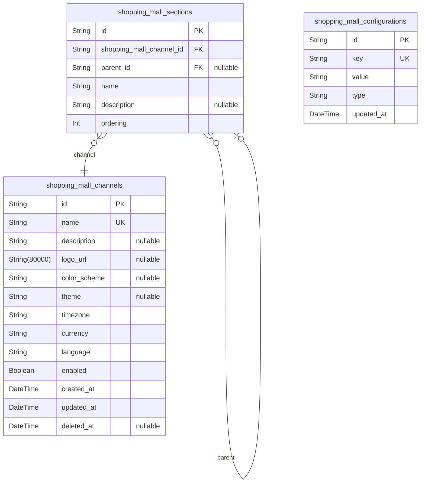
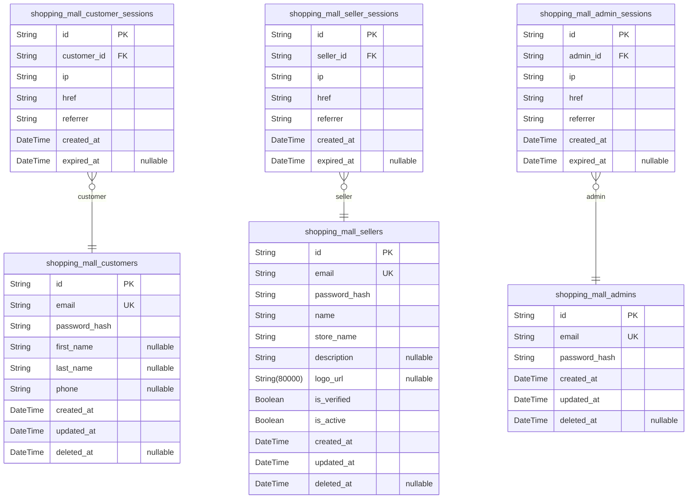
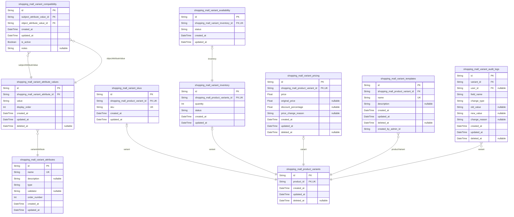
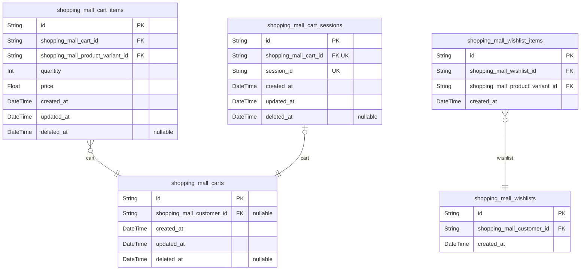
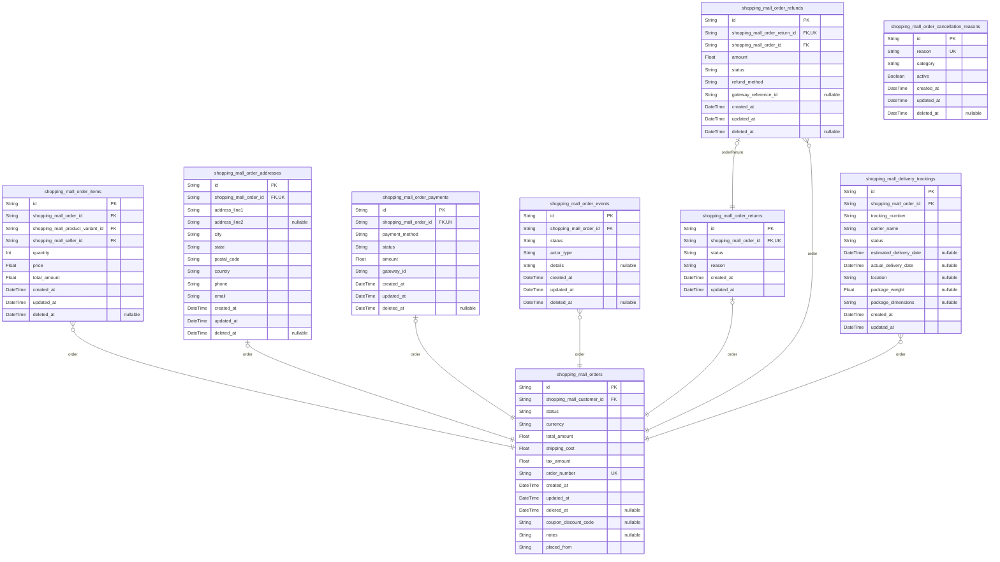
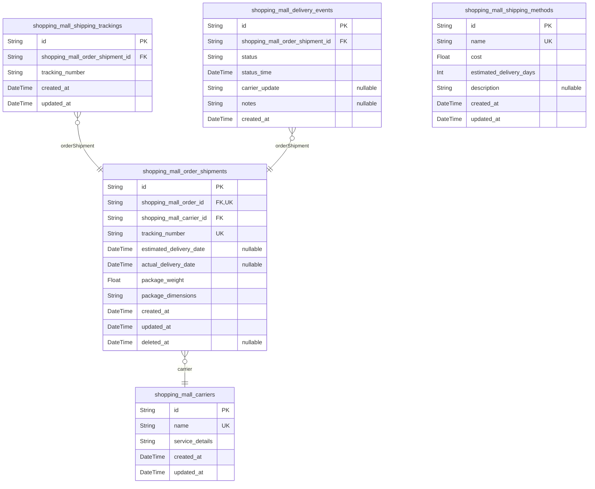
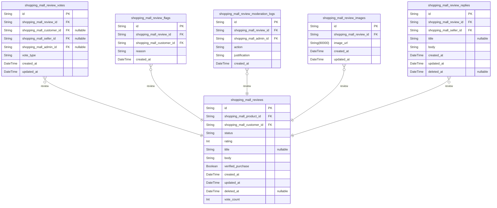
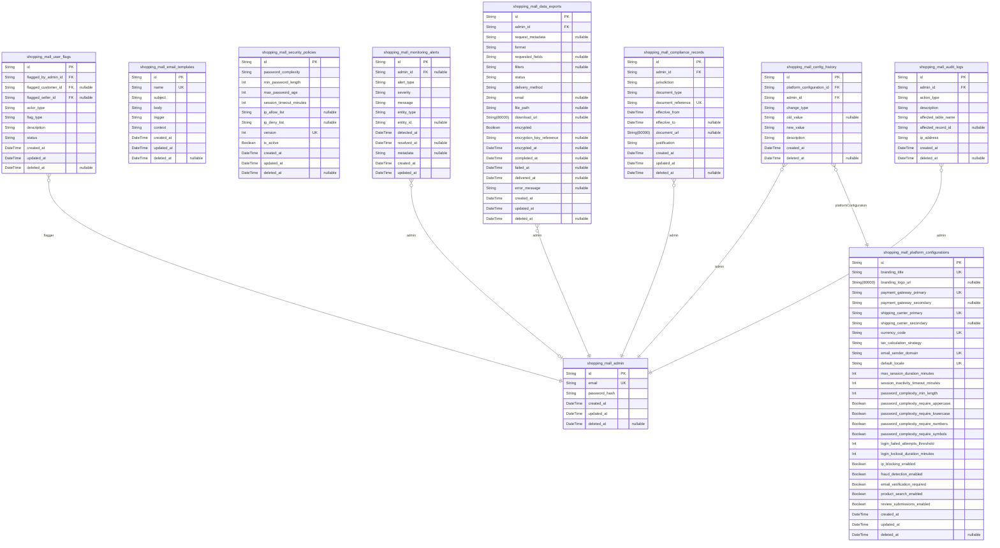

# Prisma Markdown

> Generated by [`prisma-markdown`](https://github.com/samchon/prisma-markdown)

- [Systematic](#systematic)
- [Actors](#actors)
- [Products](#products)
- [Variants](#variants)
- [Carts](#carts)
- [Orders](#orders)
- [Payments](#payments)
- [Shipping](#shipping)
- [Reviews](#reviews)
- [Sellers](#sellers)
- [Admin](#admin)

## Systematic

```mermaid
erDiagram
"shopping_mall_channels" {
  String id PK
  String name UK
  String description "nullable"
  String(80000) logo_url "nullable"
  String color_scheme "nullable"
  String theme "nullable"
  String timezone
  String currency
  String language
  Boolean enabled
  DateTime created_at
  DateTime updated_at
  DateTime deleted_at "nullable"
}
"shopping_mall_sections" {
  String id PK
  String shopping_mall_channel_id FK
  String parent_id FK "nullable"
  String name
  String description "nullable"
  Int ordering
}
"shopping_mall_configurations" {
  String id PK
  String key UK
  String value
  String type
  DateTime updated_at
}
"shopping_mall_sections" }o--|| "shopping_mall_channels" : channel
"shopping_mall_sections" }o--o| "shopping_mall_sections" : parent
```

### `shopping_mall_channels`

Represents sales channels (e.g., online store, mobile app) with branding,
configuration, and settings for multi-channel operations.

Each channel defines a distinct storefront experience with its own
branding, language, currency, and operational parameters.
Administrators create and manage multiple channels to serve different
markets, platforms, or customer segments with tailored experiences.

Channels can be enabled or disabled independently, allowing fine-grained
control over which storefronts are active.
All channel settings are applied at the platform infrastructure level,
influencing how products are displayed, how payments are routed, and how
orders are processed across different sales avenues.

Channels do not store business data directly but provide the
configuration context for all other business entities.

Properties as follows:

- `id`: Primary Key.
- `name`
  > Human-readable name of the sales channel (e.g., 'Online Store', 'Mobile
  > App', 'Wholesale Portal').
- `description`: Detailed description explaining the channel's purpose and target audience.
- `logo_url`: URL pointing to the channel's logo image for branding in UI.
- `color_scheme`
  > CSS color scheme definition for the channel's visual theme (e.g.,
  > '#FF0000, #0000FF' for red and blue).
- `theme`: UI theme identifier for the channel (e.g., 'light', 'dark', 'retro').
- `timezone`
  > IANA timezone identifier for the channel's operations (e.g.,
  > 'America/New_York', 'Asia/Seoul').
- `currency`
  > ISO 4217 currency code for pricing display and processing (e.g., 'USD',
  > 'KRW', 'EUR').
- `language`: ISO 639-1 language code for UI text (e.g., 'en', 'ko', 'ja').
- `enabled`
  > Whether this channel is active and visible to users. False means channel
  > is disabled but preserved for audit.
- `created_at`: Timestamp when the channel was created.
- `updated_at`: Timestamp when the channel was last updated.
- `deleted_at`
  > Soft delete timestamp; null means channel is active, value means channel
  > is archived.

### `shopping_mall_sections`

Hierarchical sections within channels for organizing products and
content, enabling multi-level navigation and content grouping.

Defines the tree structure of content sections within each sales channel
(e.g., online store, mobile app). Sections can be nested to create
multi-level navigation menus, with each section having a specific order
within its parent.

This table is used to build the content hierarchy that products and
categories are assigned to, determining how users discover and browse
offerings on the platform. It is a foundational system configuration
component maintained by administrators.

Sections are not directly accessible by customers or sellers but serve as
organizational containers for product categorization and content
presentation.

Properties as follows:

- `id`: Primary Key.
- `shopping_mall_channel_id`: Parent channel this section belongs to. [shopping_mall_channels.id](#shopping_mall_channels).
- `parent_id`
  > Parent section for hierarchical nesting. {@link
  > shopping_mall_sections.id}.
- `name`: Display name of the section used in navigation menus and UI.
- `description`
  > Detailed description explaining the purpose and scope of this section for
  > administrators.
- `ordering`
  > Display order of this section within its parent section or channel root.
  > Lower values appear first.

### `shopping_mall_configurations`

System-wide configuration settings, feature flags, and platform-wide
operational parameters that control core behavior.

Stores key-value configuration pairs that define platform behavior,
enable/disable features, and set operational thresholds. These settings
are managed exclusively by administrators through the admin dashboard and
apply globally across all system components. Configurations support
multiple data types (string, number, boolean, json) to accommodate
diverse system parameters such as payment gateway timeouts, default
shipping methods, feature toggles, and rate limits.

Configuration keys are unique and immutable in naming, but the values can
be updated by admins as needed. The system retrieves configurations at
startup and caches them to avoid database latency during request
processing. Changes to configurations require admin authentication and
are audited through the platform's admin audit system.

Properties as follows:

- `id`: Primary Key.
- `key`
  > Unique identifier for the configuration setting (e.g.,
  > "payment_gateway_timeout", "feature_flag_new_checkout"). Must be globally
  > unique across all configurations.
- `value`
  > String representation of the configuration value. Can encode string,
  > number, boolean, or JSON values. For numeric/boolean values, the string
  > representation follows standard conversion rules (e.g., "true", "42",
  > "{\"enabled\":true}").
- `type`
  > Data type classification of the configuration value. Valid values:
  > "string", "number", "boolean", "json". Determines how the value should be
  > interpreted and parsed by the application.
- `updated_at`
  > Timestamp when this configuration was last modified. Tracks when admins
  > last changed the value. No automatic update on read operations.

## Actors

```mermaid
erDiagram
"shopping_mall_customers" {
  String id PK
  String email UK
  String password_hash
  String first_name "nullable"
  String last_name "nullable"
  String phone "nullable"
  DateTime created_at
  DateTime updated_at
  DateTime deleted_at "nullable"
}
"shopping_mall_sellers" {
  String id PK
  String email UK
  String password_hash
  String name
  String store_name
  String description "nullable"
  String(80000) logo_url "nullable"
  Boolean is_verified
  Boolean is_active
  DateTime created_at
  DateTime updated_at
  DateTime deleted_at "nullable"
}
"shopping_mall_admins" {
  String id PK
  String email UK
  String password_hash
  DateTime created_at
  DateTime updated_at
  DateTime deleted_at "nullable"
}
"shopping_mall_customer_sessions" {
  String id PK
  String customer_id FK
  String ip
  String href
  String referrer
  DateTime created_at
  DateTime expired_at "nullable"
}
"shopping_mall_seller_sessions" {
  String id PK
  String seller_id FK
  String ip
  String href
  String referrer
  DateTime created_at
  DateTime expired_at "nullable"
}
"shopping_mall_admin_sessions" {
  String id PK
  String admin_id FK
  String ip
  String href
  String referrer
  DateTime created_at
  DateTime expired_at "nullable"
}
"shopping_mall_customer_sessions" }o--|| "shopping_mall_customers" : customer
"shopping_mall_seller_sessions" }o--|| "shopping_mall_sellers" : seller
"shopping_mall_admin_sessions" }o--|| "shopping_mall_admins" : admin
```

### `shopping_mall_customers`

Primary entity representing registered customers who can browse products,
add items to cart, place orders, manage shipping addresses, view order
history, write reviews, and create wishlists.

Stores authenticated customer identities with secure credentials and
personal information. Each customer has a unique email address and
password hash for secure login. This table serves as the foundation for
all customer interactions with the e-commerce platform.

Customers can create multiple sessions, place multiple orders, submit
reviews, create wishlists, and manage multiple shipping addresses - all
linked through foreign key relationships. This table is the central
identity record for all user-facing functionality and requires
independent CRUD operations for account management.

The soft delete pattern is implemented to maintain audit trails while
allowing account deactivation.

Properties as follows:

- `id`: Primary Key.
- `email`
  > Unique email address for customer authentication. Must be valid and
  > unique across all users.
- `password_hash`
  > Hashed password for authentication. Never stored as plain text. Required
  > for login functionality.
- `first_name`: Customer's first name for personalization and communication purposes.
- `last_name`: Customer's last name for personalization and communication purposes.
- `phone`: Optional phone number for SMS notifications and order updates.
- `created_at`: Timestamp when the customer account was created.
- `updated_at`: Timestamp when the customer account was last updated.
- `deleted_at`
  > Timestamp when the customer account was soft-deleted. Null means account
  > is active.

### `shopping_mall_sellers`

Primary entity representing business sellers who manage product
inventories, listings, and order fulfillments.

Represents business accounts that register to sell products on the
marketplace. Each seller has a unique identity with business name,
verification status, and contact information. Sellers manage their own
product catalogs, respond to customer questions and reviews, handle order
fulfillment, and view sales analytics.

This entity is distinct from customers and admins. Registered sellers can
create products, update inventory, fulfill orders, and manage their
business dashboard. Sellers require email authentication and password
storage for secure access.

Properties as follows:

- `id`: Primary Key.
- `email`
  > Business email address used for authentication and communication. Must be
  > unique across all sellers.
- `password_hash`
  > BCrypt-hashed password for authenticating seller login. Never stored as
  > plain text.
- `name`
  > Legal or registered business name used for official transactions and
  > communications.
- `store_name`
  > Brand name displayed to customers on the marketplace, which may differ
  > from the legal business name.
- `description`
  > Detailed description of the seller's business, products, or brand values
  > displayed on store page.
- `logo_url`
  > URL pointing to the seller's brand logo image displayed on product
  > listings and store page.
- `is_verified`
  > Indicates whether the seller's business identity has been verified by
  > platform administrators using submitted documentation.
- `is_active`
  > Determines if the seller account is currently active and can create
  > listings or receive orders. Set to false when suspended.
- `created_at`
  > Timestamp when the seller account was registered and created in the
  > system.
- `updated_at`: Timestamp of the most recent update to the seller's profile information.
- `deleted_at`
  > Timestamp when the seller account was soft-deleted (flagged as inactive).
  > Null indicates active account.

### `shopping_mall_admins`

Primary entity representing platform administrators with full system
control and moderation privileges.

Administrators have unrestricted access to manage users, products,
orders, configurations, and compliance settings. This table stores
essential authentication and identity information for system operators.
Unlike regular users, admins can be created, modified, or suspended by
other administrators through dedicated administrative workflows.

Each admin account is linked to a unique, verified email and must
authenticate with a password hash. All operations performed by admins are
captured in audit logs, and soft deletion is supported to preserve audit
trails while enabling access revocation.

Properties as follows:

- `id`: Primary Key.
- `email`
  > Unique email address used for administrative login and communication.
  > Must be verified and globally unique across all users.
- `password_hash`
  > BCrypt password hash for authentication. Never stores plain text
  > passwords. Required for all admin login sessions.
- `created_at`: Timestamp when the admin account was created. Immutable after creation.
- `updated_at`
  > Timestamp of the last update to the admin account. Updated on every
  > profile or credential modification.
- `deleted_at`
  > Soft delete timestamp. When set, the admin account is considered
  > deactivated and cannot authenticate. Used for access revocation while
  > preserving audit trail.

### `shopping_mall_customer_sessions`

Authentication sessions for customers, tracking login state, IP
addresses, and device context for security and audit purposes.

Each session represents a single authentication instance for a customer,
used to maintain state across HTTP requests. Sessions are automatically
created upon successful login and expire based on inactivity or manual
logout. No customer directly manages their sessions - they are handled by
the authentication system.

The session record includes connection metadata (IP, referrer, href) to
support security analysis and fraud detection. It links to the customer
entity via customer_id, ensuring accountability. Expired sessions are
cleaned system-wide but never deleted to preserve audit trails.

Sessions are managed exclusively through authentication flows - customers
cannot create, update, or delete sessions directly. This table serves
purely as an audit and security mechanism within the Actors component.

Properties as follows:

- `id`: Primary Key.
- `customer_id`
  > The customer who owns this authentication session. {@link
  > shopping_mall_customers.id}.
- `ip`
  > Client's IP address at time of session creation, used for security
  > monitoring and geolocation.
- `href`: The URL (href) from which the user initiated this authentication session.
- `referrer`
  > The referrer URL that led the user to the authentication endpoint, useful
  > for detecting organic vs. advertising traffic.
- `created_at`: Timestamp when this session was created during successful login.
- `expired_at`
  > Timestamp when this session expired due to inactivity, logout, or
  > timeout. Null indicates active session.

### `shopping_mall_seller_sessions`

Authentication sessions for sellers, tracking login state, device
context, and connection details.

Each session represents an isolated authentication context for a seller
during their interaction with the platform. Sessions are automatically
created upon successful login and expire according to system-defined
timeouts.

Sessions do not store credentials or tokens directly but maintain the
connection context including IP address, URL, and referrer for security
auditing and anomaly detection. Each session is linked to exactly one
seller and is terminated by expiration or explicit logout.

Session data is used for security monitoring, suspicious activity
detection, and authentication audit trails. Access to seller
functionality is controlled through active session validation.

Properties as follows:

- `id`: Primary Key.
- `seller_id`
  > The seller who owns this authentication session. {@link
  > shopping_mall_sellers.id}.
- `ip`
  > The IP address from which the seller initiated this session. Used for
  > security monitoring and location-based access control.
- `href`
  > The URL of the page where the seller authenticated. Captures entry point
  > for security and analytics purposes.
- `referrer`
  > The origin URL that directed the seller to the authentication page. Used
  > to identify traffic sources and potential phishing attempts.
- `created_at`
  > Timestamp when this session was created at the time of successful
  > authentication.
- `expired_at`
  > Timestamp when this session will expire. Sessions automatically terminate
  > after this time unless refreshed.

### `shopping_mall_admin_sessions`

Authentication sessions for administrators, tracking login state, tokens,
and device context.

Tracks active and recently expired administrative sessions for audit and
security monitoring purposes. Each session is tied to one specific
administrator and records connection details including IP address,
referrer, and connection URL.

Sessions are automatically expired after a configurable timeout period.
The expired_at field indicates when the session ended naturally, while
persisted sessions without an expired_at are considered active.

This table is managed exclusively through the authentication system and
has no direct user interface. Admins do not interact with or manage these
sessions directly - they are maintained by the platform's identity
service.

Properties as follows:

- `id`: Primary Key.
- `admin_id`: Administrator this session belongs to. [shopping_mall_admins.id](#shopping_mall_admins)
- `ip`: IP address from which the session was initiated.
- `href`: URL of the connection endpoint.
- `referrer`: Referrer URL that initiated this session.
- `created_at`: Timestamp when this session was created.
- `expired_at`: Timestamp when this session expired. Null indicates an active session.

## Products

```mermaid
erDiagram
"shopping_mall_categories" {
  String id PK
  String parent_id FK "nullable"
  String name
  String description "nullable"
  Int ordering
  DateTime created_at
  DateTime updated_at
  DateTime deleted_at "nullable"
}
"shopping_mall_products" {
  String id PK
  String shopping_mall_category_id FK
  String name
  String description
  String status
  DateTime created_at
  DateTime updated_at
  DateTime deleted_at "nullable"
}
"shopping_mall_product_secondary_categories" {
  String id PK
  String shopping_mall_product_id FK
  String shopping_mall_category_id FK
}
"shopping_mall_product_attributes" {
  String id PK
  String name UK
  String description
  Int sort_order
}
"shopping_mall_product_attribute_values" {
  String id PK
  String shopping_mall_product_attribute_id FK
  String value
  String description "nullable"
  DateTime created_at
  DateTime updated_at
}
"shopping_mall_product_variant_attributes" {
  String id PK
  String product_variant_id FK
  String product_attribute_value_id FK
}
"shopping_mall_product_images" {
  String id PK
  String shopping_mall_product_id FK
  String(80000) image_url
  Int image_order
  Boolean is_primary
  DateTime created_at
  DateTime updated_at
  DateTime deleted_at "nullable"
}
"shopping_mall_product_tags" {
  String id PK
  String name UK
  DateTime created_at
  DateTime updated_at
}
"shopping_mall_product_reviews" {
  String id PK
  String shopping_mall_product_id FK
  String shopping_mall_customer_id FK
  Int rating
  String review_text
  String status
  DateTime created_at
  DateTime updated_at
  DateTime deleted_at "nullable"
}
"shopping_mall_product_review_votes" {
  String id PK
  String shopping_mall_product_review_id FK
  String shopping_mall_customer_id FK
  String vote_type
  DateTime created_at
}
"shopping_mall_product_questions" {
  String id PK
  String shopping_mall_product_id FK
  String shopping_mall_customer_id FK
  String title
  String body
  DateTime created_at
  DateTime updated_at
  DateTime deleted_at "nullable"
}
"shopping_mall_product_answers" {
  String id PK
  String shopping_mall_product_question_id FK,UK
  String shopping_mall_seller_id FK
  String title
  String body
  DateTime created_at
  DateTime updated_at
  DateTime deleted_at "nullable"
}
"shopping_mall_product_view_stats" {
  String id PK
  String shopping_mall_product_id FK
  Int view_count
  Float click_through_rate
  Float engagement_score
  DateTime created_at
  DateTime updated_at
  DateTime deleted_at "nullable"
}
"shopping_mall_product_sales_stats" {
  String id PK
  String product_id FK
  Int units_sold
  Float total_revenue
  Float conversion_rate
  DateTime created_at
  DateTime updated_at
  DateTime deleted_at "nullable"
}
"shopping_mall_product_snapshots" {
  String id PK
  String shopping_mall_product_id FK
  String title
  String description
  String status
  String primary_category_id "nullable"
  String brand_id "nullable"
  DateTime created_at
  DateTime updated_at
  DateTime deleted_at "nullable"
}
"shopping_mall_product_brands" {
  String id PK
  String name UK
  String(80000) logo_url "nullable"
  DateTime created_at
  DateTime updated_at
}
"shopping_mall_product_variant_inventory" {
  String id PK
  String shopping_mall_product_variant_id FK,UK
  Int inventory_count
  String state
  DateTime created_at
  DateTime updated_at
  DateTime deleted_at "nullable"
}
"shopping_mall_product_variant_pricing" {
  String id PK
  String shopping_mall_product_variant_id FK,UK
  Float price
  DateTime created_at
  DateTime updated_at
  DateTime deleted_at "nullable"
}
"shopping_mall_categories" }o--o| "shopping_mall_categories" : parent
"shopping_mall_products" }o--|| "shopping_mall_categories" : category
"shopping_mall_product_secondary_categories" }o--|| "shopping_mall_products" : product
"shopping_mall_product_secondary_categories" }o--|| "shopping_mall_categories" : category
"shopping_mall_product_attribute_values" }o--|| "shopping_mall_product_attributes" : attribute
"shopping_mall_product_variant_attributes" }o--|| "shopping_mall_product_attribute_values" : attributeValue
"shopping_mall_product_images" }o--|| "shopping_mall_products" : product
"shopping_mall_product_reviews" }o--|| "shopping_mall_products" : product
"shopping_mall_product_review_votes" }o--|| "shopping_mall_product_reviews" : review
"shopping_mall_product_questions" }o--|| "shopping_mall_products" : product
"shopping_mall_product_answers" |o--|| "shopping_mall_product_questions" : question
"shopping_mall_product_view_stats" }o--|| "shopping_mall_products" : product
"shopping_mall_product_sales_stats" }o--|| "shopping_mall_products" : product
"shopping_mall_product_snapshots" }o--|| "shopping_mall_products" : product
```

### `shopping_mall_categories`

Hierarchical product categories for organizing products in catalog.

Stores the taxonomy structure of products with parent-child relationships
that enable multi-level navigation. Categories form the foundation of
product discovery, allowing users to browse products organized by type,
function, or other meaningful groupings.

Each category can have a parent category, creating a tree structure for
hierarchical classification. The category hierarchy supports
drag-and-drop reordering for business users to customize catalog
organization. Soft deletion is enabled to allow safe removal of
categories while preserving historical references in products and orders.

Properties as follows:

- `id`: Primary Key.
- `parent_id`
  > Parent category's [shopping_mall_categories.id](#shopping_mall_categories). Non-nullable to
  > enforce hierarchy root with explicit null reference.
- `name`
  > Display name of the category shown to customers. Max 100 characters. Must
  > be unique within same parent level.
- `description`
  > Detailed description of the category's purpose and contents. Used for SEO
  > and category landing pages.
- `ordering`
  > Position for sorting categories within parent. Lower numbers appear
  > first. Used for manual catalog organization.
- `created_at`
  > Timestamp when this category was created. Standard temporal field for all
  > business entities.
- `updated_at`
  > Timestamp when this category was last modified. Standard temporal field
  > for all business entities.
- `deleted_at`
  > Timestamp when this category was logically deleted. Enables soft deletion
  > for moderation purposes.

### `shopping_mall_products`

Core product entities with metadata including title, description, status,
images, and primary category reference.

Represents individual products offered for sale on the platform. Each
product serves as a catalog entry that can have multiple variants (SKUs)
defined in the shopping_mall_product_variants table. Product metadata is
displayed during customer browsing, search, and filtering operations.

Products maintain relationship with primary shopping_mall_categories and
optionally with multiple shopping_mall_product_secondary_categories for
improved discoverability. Product status determines visibility to
customers. The associated shopping_mall_product_images collection defines
the visual representation.

Soft deletion is enabled to allow content moderation without permanent
data loss. Audit trail of changes is maintained through update_at
timestamp.

Properties as follows:

- `id`: Primary Key.
- `shopping_mall_category_id`
  > Primary category this product belongs to. {@link
  > shopping_mall_categories.id}.
- `name`: Product display name shown to customers.
- `description`
  > Detailed product description explaining features, specification, and
  > usage instructions.
- `status`
  > Current product visibility status. Valid values: active, inactive, draft,
  > discontinued.
- `created_at`: Timestamp when the product record was initially created.
- `updated_at`: Timestamp when the product record was last modified.
- `deleted_at`
  > Timestamp when the product was logically deleted (soft delete). Null
  > indicates active record.

### `shopping_mall_product_secondary_categories`

Junction table linking products to secondary categories for improved
discoverability.

This table establishes a many-to-many relationship between products and
secondary categories, enabling products to belong to multiple category
paths beyond their primary category. This facilitates flexible product
organization and enhanced user navigation in the product catalog.

Each record represents a single association between a product and a
secondary category, with no additional attributes beyond the foreign
keys. This ensures strict normalization and prevents data redundancy. The
table is managed exclusively through product management interfaces and
does not require direct user interaction.

Properties as follows:

- `id`: Primary Key.
- `shopping_mall_product_id`
  > Product being associated with a secondary category. {@link
  > shopping_mall_products.id}.
- `shopping_mall_category_id`
  > Secondary category that this product belongs to. {@link
  > shopping_mall_categories.id}.

### `shopping_mall_product_attributes`

Definable attribute types for product variants such as color, size,
material, and other product characteristics.

Each attribute type represents a category of product characteristics that
can be assigned to products to enable variant creation. Administrators
define these attribute types in the system to standardize product
configuration across the catalog. Attribute types serve as the foundation
for product variants, where specific combinations of attribute values
create unique SKUs.

Attributes are reference data that remain stable over time and are used
by product management interfaces to construct product variants. They are
not directly modified by customers or sellers, but are managed by
platform administrators through the administrative dashboard.

Properties as follows:

- `id`: Primary Key.
- `name`
  > The name of the attribute type (e.g., 'Color', 'Size', 'Material'). Must
  > be unique across all attribute types to ensure consistent identification
  > for variant creation. Used as a display name in product configuration
  > interfaces.
- `description`
  > Detailed explanation of what this attribute type represents and how it
  > should be used in product configuration. Provides guidance for
  > administrators creating attribute values and helps ensure consistent
  > usage across the catalog.
- `sort_order`
  > Numeric value that determines the display order of attribute types in
  > product configuration interfaces. Lower values appear first. This allows
  > administrators to control the sequence in which attributes are presented
  > to users when configuring products or variants.

### `shopping_mall_product_attribute_values`

Specific values for product attribute types (e.g., 'Red', 'Large',
'Cotton').

Stores the possible values that can be assigned to product attributes,
enabling the creation of unique product variants. Each value is
associated with a specific attribute type from
shopping_mall_product_attributes and forms the building blocks for
variant combinations through shopping_mall_product_variant_attributes.

This table provides the reference data that allows customers to select
options like color, size, or material from predefined lists. Values are
managed by administrators through product catalog tools and never
directly edited by end users. The table supports text search for
filtering products by attribute values in the frontend UI.

Properties as follows:

- `id`: Primary Key.
- `shopping_mall_product_attribute_id`
  > Reference to the product attribute type this value belongs to. {@link
  > shopping_mall_product_attributes.id}.
- `value`
  > The actual attribute value (e.g., 'Red', 'Large', 'Cotton'). Must be
  > unique per attribute type to avoid duplication.
- `description`
  > Additional context about this attribute value when the value alone is not
  > descriptive enough (e.g., 'Dark Red' for a color).
- `created_at`: Timestamp of when this attribute value was created in the system.
- `updated_at`
  > Timestamp of the last time this attribute value was modified in the
  > system.

### `shopping_mall_product_variant_attributes`

Junction table mapping each product variant to its specific attribute
values (SKU to attribute-value pairs).

Defines the exact combination of attribute values that constitute each
product variant. This table establishes the relationship between a
product variant and the specific values of product attributes (e.g.,
size=Large, color=Blue) that define that variant's configuration.

Each row represents a single attribute-value assignment to a variant.
This allows a product to have multiple variants with different
combinations of attributes while ensuring data consistency and reducing
duplication.

The table is purely associative with no business state of its own - it
enables the product_variants system by providing the precise attribute
definitions for each variant SKU.

Properties as follows:

- `id`: Primary Key.
- `product_variant_id`
  > Product variant being configured. {@link
  > shopping_mall_product_variants.id}.
- `product_attribute_value_id`
  > Specific attribute value assigned to the variant. {@link
  > shopping_mall_product_attribute_values.id}.

### `shopping_mall_product_images`

Gallery images for products including primary image and up to five
additional images.

Stores digital media assets associated with products in the catalog. Each
image is linked to a single product and can be designated as the primary
display image for product listings. The system allows multiple images per
product to provide comprehensive visual representation of products,
including different angles, details, and usage scenarios.

Image URLs are stored as URIs and can reference hosted images on CDN or
internal storage systems. Images undergo content moderation and may be
soft-deleted based on policy violations or product updates. The primary
image field indicates which image should be displayed by default in
product listings and search results, ensuring consistent presentation
across the platform.

Properties as follows:

- `id`: Primary Key.
- `shopping_mall_product_id`
  > Reference to the product this image belongs to. {@link
  > shopping_mall_products.id}.
- `image_url`
  > URL of the product image stored in the media system. Must be a valid URI
  > to image file (PNG, JPEG, GIF, WebP).
- `image_order`
  > Display order of the image among product's images. Lower numbers shown
  > first in product gallery. Range: 1-99.
- `is_primary`
  > Indicates if this is the primary image for the product. Only one image
  > per product should be marked as primary. Used for product listings and
  > search results.
- `created_at`: Timestamp when the image was first uploaded to the system.
- `updated_at`
  > Timestamp when the image metadata was last modified (e.g., order or
  > primary flag changes).
- `deleted_at`
  > Timestamp when the image was soft-deleted, typically due to moderation
  > action or product update. Null indicates active status.

### `shopping_mall_product_tags`

Tags for products to mark promotions, featured items, or new arrivals
(e.g., 'New', 'Best Seller').

Provides metadata labels that can be assigned to products for
categorization, promotional display, and enhanced filtering. Tags are
managed exclusively through product management interfaces and are not
independently created or modified by end users. This table enables
dynamic categorization without requiring structural changes to the
product catalog.

Properties as follows:

- `id`: Primary Key.
- `name`
  > The tag name used for product categorization (e.g., 'New', 'Best Seller',
  > 'Sale'). Must be unique within the system to avoid ambiguity in product
  > listings.
- `created_at`
  > Timestamp when the tag was created in the system. Used for tracking when
  > promotional or featured status was initiated.
- `updated_at`
  > Timestamp when the tag was last modified. Updated whenever the tag name
  > is changed or its assignment to products is updated.

### `shopping_mall_product_reviews`

Customer reviews and ratings for products with text content and numeric
ratings.

Stores feedback provided by customers who have purchased products. Each
review represents a single assessment of a product, containing a numeric
rating (1-5) and optional textual feedback. Reviews must be verified by
the system to ensure the reviewer has completed a purchase of the
product.

Reviews remain visible to all users and can be flagged for moderation.
Moderators may approve, reject, or delete reviews based on community
guidelines. Reviewers can edit their reviews until they are moderated.
Each review is uniquely tied to both the product and the customer who
created it.

The review status field indicates whether the review is pending review
(moderation), approved, or rejected. Soft deletion is supported for
moderation purposes while preserving audit trails.

Properties as follows:

- `id`: Primary Key.
- `shopping_mall_product_id`: Reference to the reviewed product's [shopping_mall_products.id](#shopping_mall_products).
- `shopping_mall_customer_id`: Reference to the review author's [shopping_mall_customers.id](#shopping_mall_customers).
- `rating`
  > Numerical rating given by the customer, from 1 (lowest) to 5 (highest).
  > Must be an integer between 1 and 5 inclusive.
- `review_text`
  > Textual content of the customer review. Must be between 50 and 2000
  > characters long, containing the customer's detailed feedback about the
  > product.
- `status`
  > Current review status: 'pending' (awaiting moderation), 'approved'
  > (publicly visible), or 'rejected' (hidden from view).
- `created_at`: Timestamp when the review was originally submitted by the customer.
- `updated_at`: Timestamp when the review was last modified by the customer or moderator.
- `deleted_at`
  > Timestamp when the review was soft-deleted by a moderator. If null, the
  > review is active.

### `shopping_mall_product_review_votes`

Tracks helpful/unhelpful votes on product reviews to surface the most
valuable customer feedback.

Each vote represents a customer's assessment of whether a specific
product review was helpful or unhelpful. This system enables community
moderation by identifying high-quality reviews that receive multiple
helpful votes, while low-quality or irrelevant reviews receive unhelpful
votes. The counts of helpful versus unhelpful votes determine which
reviews are prominently surfaced to other customers.

Votes are immutable once recorded - customers can only vote once per
review, and votes cannot be changed or revoked. This table strictly
supports the primary product_reviews entity and has no independent
business operations.

Properties as follows:

- `id`: Primary Key.
- `shopping_mall_product_review_id`
  > The product review being voted on. {@link
  > shopping_mall_product_reviews.id}.
- `shopping_mall_customer_id`: The customer who cast this vote. [shopping_mall_customers.id](#shopping_mall_customers).
- `vote_type`
  > The type of vote cast by the customer. Valid values: 'helpful' or
  > 'unhelpful'. Represents the customer's assessment of the review's
  > quality.
- `created_at`
  > Timestamp when the vote was submitted by the customer. Records when the
  > community feedback was provided for audit and sorting purposes.

### `shopping_mall_product_questions`

Customer questions about products listed for sale.

Stores inquiries from customers seeking additional product information
before making a purchase decision. Each question is associated with a
specific product and created by an authenticated customer through their
active session.

Questions remain attached to the sale even if the product details change,
providing historical context. Customers can ask multiple questions per
product, and each question can receive one answer from the seller.

The question content includes title and body fields for structured
inquiry formatting. Soft deletion is supported to maintain audit trails
while allowing content moderation.

Properties as follows:

- `id`: Primary Key.
- `shopping_mall_product_id`: The product this question pertains to. [shopping_mall_products.id](#shopping_mall_products).
- `shopping_mall_customer_id`
  > The customer who created this question. {@link
  > shopping_mall_customers.id}.
- `title`: Short title summarizing the customer's question about the product.
- `body`: Detailed description of the customer's question about the product.
- `created_at`: Timestamp when this question was created.
- `updated_at`: Timestamp when this question was last updated.
- `deleted_at`
  > Timestamp when this question was soft-deleted (for moderation). Null if
  > active.

### `shopping_mall_product_answers`

Seller responses to customer questions about products.

Stores answers provided by sellers to questions raised by customers
regarding specific product listings. Each answer is linked to a single
product question and the responding seller, maintaining clear ownership
and auditability. Answers remain associated with the question even if the
product details change, providing historical context for the interaction.

Seller responses are visible to the customer who asked the question and
to other potential buyers, influencing purchasing decisions. The content
includes a title for quick summary and a body for detailed information.
Answers support soft deletion for moderation purposes, allowing removal
while preserving audit trails.

This entity enables direct communication between sellers and customers,
increasing product transparency and consumer trust.

Properties as follows:

- `id`: Primary Key.
- `shopping_mall_product_question_id`
  > The product question this answer responds to. {@link
  > shopping_mall_product_questions.id}.
- `shopping_mall_seller_id`: The seller who provided this answer. [shopping_mall_sellers.id](#shopping_mall_sellers).
- `title`
  > Brief summary of the answer, used for quick readability and search
  > indexing.
- `body`
  > Detailed response content from the seller to the customer's product
  > question.
- `created_at`: Timestamp when the answer was originally created.
- `updated_at`: Timestamp when the answer was last modified.
- `deleted_at`
  > Timestamp when the answer was soft-deleted (for moderation purposes). If
  > null, the answer is active.

### `shopping_mall_product_view_stats`

Analytics tracking product views, click-through rates, and engagement
metrics.

System-generated statistics that record how users interact with products
in the catalog.
Tracks the number of times a product is viewed, the rate at which users
click through to product detail pages, and an overall engagement score
based on interaction patterns.

Data is automatically updated by the system when products are displayed
to users.
Each record represents a snapshot of engagement metrics for a specific
product at a point in time.
This data supports product discovery optimization and recommendations
systems.

The table is updated frequently but never modified or deleted after
creation, making it append-only for analytical purposes.

Properties as follows:

- `id`: Primary Key.
- `shopping_mall_product_id`: Reference to the product being tracked. [shopping_mall_products.id](#shopping_mall_products).
- `view_count`: Total number of times this product has been viewed in the catalog.
- `click_through_rate`
  > Percentage of users who clicked through from product listing to product
  > detail page.
- `engagement_score`
  > Composite score measuring overall user engagement with this product
  > (0.0-1.0).
- `created_at`: Timestamp when the view statistics record was created.
- `updated_at`: Timestamp when the view statistics record was last updated.
- `deleted_at`: Soft delete timestamp for audit trail compliance.

### `shopping_mall_product_sales_stats`

Sales performance statistics aggregated per product to track units sold,
revenue, and conversion rates.

This table provides analytical insights into product market performance.
It is automatically updated by the system when orders are completed,
capturing the number of units sold, total revenue generated, and
conversion rate (sales over views) for each product.

Sales statistics are maintained independently from product metadata to
prevent data duplication and ensure consistent reporting, even if product
details change later.

The table is updated only by system processes and is not directly
modifiable by users or administrators. It enables performance analytics
dashboards, inventory forecasting, and marketing evaluation.

Properties as follows:

- `id`: Primary Key.
- `product_id`
  > Reference to the product this sales statistic belongs to. {@link
  > shopping_mall_products.id}.
- `units_sold`: Total number of units of this product sold.
- `total_revenue`
  > Total revenue generated from sales of this product, in USD with exactly
  > two decimal places.
- `conversion_rate`
  > Conversion rate as a decimal (e.g., 0.05 for 5%), calculated as
  > units_sold divided by product views (from
  > shopping_mall_product_view_stats).
- `created_at`: Timestamp when this sales statistic record was created.
- `updated_at`: Timestamp when this sales statistic record was last updated.
- `deleted_at`
  > Soft delete flag. Null means active; a timestamp indicates the record was
  > retired for audit purposes.

### `shopping_mall_product_snapshots`

Audit trail snapshots of product state at time of order to preserve
historical product information.

Captures immutable copies of product details as they existed at the
moment of purchase, ensuring accurate historical records for order
reconciliation, returns, and compliance audits. This table preserves
product titles, descriptions, images, categories, and other metadata even
when the master product record is modified or deleted.

Each snapshot is linked to the original product via
shopping_mall_products.id and represents the entire product state at
snapshot creation time. The table is designed to be append-only with soft
deletes to support moderation of inappropriate product representations in
historical orders.

Properties as follows:

- `id`: Primary Key.
- `shopping_mall_product_id`
  > Reference to the original product entity whose state was captured in this
  > snapshot. [shopping_mall_products.id](#shopping_mall_products).
- `title`
  > Product title as it appeared at time of snapshot creation. Copy of
  > shopping_mall_products.title at the moment this snapshot was taken.
- `description`
  > Product description as it appeared at time of snapshot creation. Copy of
  > shopping_mall_products.description at the moment this snapshot was taken.
- `status`
  > Current product status (active/inactive) at time of snapshot. Copy of
  > shopping_mall_products.status to maintain business state context for
  > historical orders.
- `primary_category_id`
  > Primary category ID reference as it existed at time of snapshot. Copy of
  > shopping_mall_products.primary_category_id. Can be null if product had no
  > primary category assigned.
- `brand_id`
  > Brand ID reference as it existed at time of snapshot. Copy of
  > shopping_mall_products.brand_id. Can be null if product had no brand
  > assigned.
- `created_at`
  > Timestamp when this snapshot was created (i.e., when the product state
  > was captured). This is not the product's creation date, but the snapshot
  > creation time.
- `updated_at`
  > Timestamp when this snapshot was last updated. For immutable snapshots,
  > this typically equals created_at but is included for system consistency.
- `deleted_at`
  > Soft delete flag indicating when this snapshot was marked for deletion.
  > Used for moderation of inappropriate product representations in
  > historical orders. If null, the record is considered active.

### `shopping_mall_product_brands`

Brand entities associated with products including name and optional logo
URL.

Represents manufacturers, designers, or product lines that produce or
market products in the catalog. Each brand serves as a categorization and
marketing anchor for associated products, helping customers identify and
trust product origins.

Brands are independently managed by administrators - new brands can be
created, existing ones can be updated, and brand information can be
removed from the catalog entirely. While products reference brands for
categorization, the brand entities themselves have independent lifecycle
management.

The logo URL field is optional to accommodate brands that don't have
official visual identities or when logo images are managed through
separate asset systems.

Properties as follows:

- `id`: Primary Key.
- `name`
  > Official name of the brand. Must be unique across the system to ensure
  > consistent product categorization and branding.
- `logo_url`
  > URL to the brand's official logo image. This is optional as some brands
  > may not have digital logos or may use alternative branding systems.
- `created_at`
  > Timestamp when this brand was created in the system. Used for audit trail
  > and chronological sorting.
- `updated_at`
  > Timestamp when this brand was last modified. Updated on any change to
  > brand name or logo.

### `shopping_mall_product_variant_inventory`

Tracks real-time inventory count and state for each product variant (SKU).

This table provides granular inventory management at the SKU level,
enabling accurate stock visibility, low-stock alerts, and sales
forecasting. Each record corresponds to exactly one product variant and
maintains its current inventory status.

Inventory state transitions (Available → Low → Out of Stock → Backordered
→ Discontinued) are driven by order fulfillment, returns, and restocking
operations. The system automatically updates inventory counts and states
without direct user intervention.

Soft deletion is supported to maintain audit trails while allowing
inventory records to be logically removed when variants are discontinued
permanently.

All inventory changes are tracked and verified through the
product_variant system to ensure transactional integrity.

Properties as follows:

- `id`: Primary Key.
- `shopping_mall_product_variant_id`
  > Reference to the product variant this inventory record belongs to. {@link
  > shopping_mall_product_variants.id}.
- `inventory_count`
  > Current quantity available in inventory. Must be non-negative. Updated
  > automatically through order, return, and restocking workflows.
- `state`
  > Current inventory state following state machine: Available, Low, Out of
  > Stock, Backordered, Discontinued. State transitions occur automatically
  > based on inventory count thresholds and business rules.
- `created_at`: Timestamp when this inventory record was first created.
- `updated_at`
  > Timestamp when this inventory record was last updated, including count or
  > state changes.
- `deleted_at`
  > Soft delete timestamp. If null, record is active. If set, record is
  > logically deleted but preserved for audit purposes.

### `shopping_mall_product_variant_pricing`

Stores individual prices for each product variant (SKU), overriding base
product price when specified.

This table enables variant-level pricing strategy where each unique SKU
can have its own price independent of the base product's default price.
The pricing data is used for product display, cart calculations, and
checkout processing.

Each price entry is associated with exactly one product variant via the
variant_id foreign key. In cases where no variant-specific price exists,
the base product price is used as fallback. This design allows for
flexible pricing tactics including promotional pricing, bulk discounts,
and special edition offerings.

All prices are stored in USD with exactly two decimal places as required.
The table supports soft deletion to maintain audit trails while allowing
for price adjustments or removal.

Properties as follows:

- `id`: Primary Key.
- `shopping_mall_product_variant_id`
  > Reference to the product variant this pricing record belongs to. {@link
  > shopping_mall_product_variants.id}
- `price`
  > Price of this product variant in USD, with exactly two decimal places.
  > Must be non-negative. This overrides the base product price when
  > specified.
- `created_at`
  > Timestamp when this pricing record was created. Always populated at
  > record creation.
- `updated_at`
  > Timestamp when this pricing record was last updated. Automatically
  > updated whenever the price changes.
- `deleted_at`
  > Timestamp when this pricing record was soft-deleted. Null if the record
  > is still active. Used for audit trail and potential recovery.

## Variants

```mermaid
erDiagram
"shopping_mall_variant_attributes" {
  String id PK
  String name UK
  String description "nullable"
  String type
  String validator "nullable"
  Int order_number
  DateTime created_at
  DateTime updated_at
}
"shopping_mall_variant_attribute_values" {
  String id PK
  String shopping_mall_variant_attribute_id FK
  String value
  Int display_order
  DateTime created_at
  DateTime updated_at
  DateTime deleted_at "nullable"
}
"shopping_mall_product_variants" {
  String id PK
  String product_id FK,UK
  DateTime created_at
  DateTime updated_at
  DateTime deleted_at "nullable"
}
"shopping_mall_variant_skus" {
  String id PK
  String shopping_mall_product_variant_id FK,UK
  String sku UK
  DateTime created_at
  DateTime updated_at
}
"shopping_mall_variant_inventory" {
  String id PK
  String shopping_mall_product_variants_id FK,UK
  Int quantity
  String status
  DateTime created_at
  DateTime updated_at
}
"shopping_mall_variant_pricing" {
  String id PK
  String shopping_mall_product_variant_id FK,UK
  Float price
  Float original_price "nullable"
  Float discount_percentage "nullable"
  String price_change_reason "nullable"
  DateTime created_at
  DateTime updated_at
  DateTime deleted_at "nullable"
}
"shopping_mall_variant_compatibility" {
  String id PK
  String subject_attribute_value_id FK
  String object_attribute_value_id FK
  DateTime created_at
  DateTime updated_at
  Boolean is_active
  String notes "nullable"
}
"shopping_mall_variant_templates" {
  String id PK
  String shopping_mall_product_variant_id FK
  String name UK
  String description "nullable"
  DateTime created_at
  DateTime updated_at
  DateTime deleted_at "nullable"
  String created_by_admin_id
}
"shopping_mall_variant_availability" {
  String id PK
  String shopping_mall_variant_inventory_id FK,UK
  String status
  DateTime created_at
  DateTime updated_at
}
"shopping_mall_variant_audit_logs" {
  String id PK
  String variant_id FK
  String user_id FK "nullable"
  String field_name
  String change_type
  String old_value "nullable"
  String new_value "nullable"
  String change_reason "nullable"
  DateTime created_at
  DateTime updated_at
  DateTime deleted_at "nullable"
}
"shopping_mall_variant_attribute_values" }o--|| "shopping_mall_variant_attributes" : variantAttribute
"shopping_mall_variant_skus" |o--|| "shopping_mall_product_variants" : variant
"shopping_mall_variant_inventory" |o--|| "shopping_mall_product_variants" : variant
"shopping_mall_variant_pricing" |o--|| "shopping_mall_product_variants" : variant
"shopping_mall_variant_compatibility" }o--|| "shopping_mall_variant_attribute_values" : subjectAttributeValue
"shopping_mall_variant_compatibility" }o--|| "shopping_mall_variant_attribute_values" : objectAttributeValue
"shopping_mall_variant_templates" }o--|| "shopping_mall_product_variants" : productVariant
"shopping_mall_variant_availability" |o--|| "shopping_mall_variant_inventory" : inventory
"shopping_mall_variant_audit_logs" }o--|| "shopping_mall_product_variants" : variant
```

### `shopping_mall_variant_attributes`

Stores definable attribute types for product variants (size, color,
material, etc.) with validation rules and sortable order.

This table defines the taxonomy of variant attributes that can be applied
to products across the catalog. Each row represents a distinct attribute
type (e.g., 'Color', 'Size', 'Material') with associated characteristics
that govern how values can be selected and validated.

Attribute types serve as templates for variant creation - they determine
what kind of options can be assigned to product variants. For example, a
'Color' attribute type might require users to select from a predefined
set of values, while a 'Memory Capacity' attribute type might accept
numeric input with validation constraints.

The order_number field controls the display sequence of attribute types
on product detail pages and during variant selection workflows.

The validator field contains JSON-formatted rules that specify
constraints for attribute values (minimum/maximum values, allowed
patterns, required formats), enabling dynamic UI validation for variant
selection.

This table is managed exclusively by administrators and contains
system-wide reference data that is referenced by all product variants in
the system.

Properties as follows:

- `id`: Primary Key.
- `name`
  > Unique display name for the attribute type (e.g., "Color", "Size",
  > "Material"). Must be human-readable and consistent across the system.
- `description`
  > Detailed explanation of the attribute type's purpose, usage, and business
  > context. May describe expected value patterns or system-wide conventions.
- `type`
  > Data type category for values of this attribute (e.g., "select", "text",
  > "number", "boolean"). Determines UI input type and validation logic.
- `validator`
  > JSON-formatted validation rules for attribute values. May include
  > minimum/maximum values, allowed patterns, required formats, or allowed
  > value sets depending on type.
- `order_number`
  > Integer sequence number that determines the display order of attribute
  > types on product pages and variant selection interfaces. Lower numbers
  > appear first.
- `created_at`: Timestamp when this attribute type was created in the system.
- `updated_at`: Timestamp when this attribute type was last modified.

### `shopping_mall_variant_attribute_values`

Individual valid values for each product variant attribute type, ensuring
consistency and preventing duplicates across products.

Each record represents a single possible value for a variant attribute
(e.g., 'Red' for color, 'Large' for size, 'Cotton' for material). Values
are strictly controlled by their parent attribute type to maintain data
integrity across the product catalog. This table serves as the
authoritative reference for available attribute values,
ensuring that when customers filter products or select variant
combinations, they only see valid, pre-approved options.

Values are managed through the variant_attributes system and are not
directly created by end users. This prevents inconsistent or invalid
attribute values from polluting the product catalog.

Properties as follows:

- `id`: Primary Key.
- `shopping_mall_variant_attribute_id`
  > The variant attribute this value belongs to. {@link
  > shopping_mall_variant_attributes.id}.
- `value`
  > The actual value of this attribute option (e.g., 'Red', 'Large',
  > 'Cotton'). Must be unique within its attribute type and contain only
  > alphanumeric characters, spaces, hyphens, and underscores.
- `display_order`
  > Determines the sort order in which this attribute value appears in user
  > interfaces (e.g., product filters, variant selectors). Lower numbers
  > appear first.
- `created_at`: Timestamp when this attribute value was created in the system.
- `updated_at`: Timestamp when this attribute value was last modified.
- `deleted_at`
  > Soft-delete timestamp marking when this attribute value was deactivated.
  > Null means active. Used for audit trail and potential reactivation.

### `shopping_mall_product_variants`

Represents each unique product variant as an independent entity with its
own SKU, pricing, and inventory state.

This table stores the core variant identity without storing attribute
relationships directly. Each variant represents a complete product
configuration that customers can select and purchase. Attributes are
managed separately via variant_attribute_combinations, enabling support
for multiple attribute selections (e.g., Size: Large AND Color: Blue AND
Material: Cotton) that are essential for modern e-commerce catalogs.

Variant combinations are formed dynamically through references to
variant_attribute_combinations, which maintain the many-to-many
relationship between product variants and their attribute values. This
separation follows 3NF normalization by decoupling variant definition
from attribute selection.

The variant is a primary entity requiring independent API access:
customers select variants directly, add them to cart, and checkout with
individual variant selections. Each variant must be uniquely
identifiable, queryable outside context of parent product, and support
individual inventory and pricing management.

Properties as follows:

- `id`: Primary Key.
- `product_id`: Product that this variant belongs to. [shopping_mall_products.id](#shopping_mall_products).
- `created_at`: Timestamp when this variant combination was created in the system.
- `updated_at`: Timestamp when this variant combination was last modified.
- `deleted_at`
  > Timestamp when this variant combination was logically deleted (soft
  > delete), or null if active.

### `shopping_mall_variant_skus`

Stores generated SKUs for product variants with encoding rules for
human-readable identification.

Each SKU is a unique identifier automatically generated by the system for
a specific combination of product attributes. SKU values follow
consistent encoding patterns to be readable and searchable, linking
directly to a single product variant.

This table is subsidiary because SKUs are system-generated and never
managed independently by users - they are always accessed through their
parent product_variants record. The system generates SKUs once when a
variant is created and never modifies them, ensuring stability in
inventory records and external systems that reference them.

The encoding rules used to construct each SKU are now normalized into a
separate encoding_rules table, referenced by ID to avoid duplication and
ensure consistent encoding logic across all SKUs.

Properties as follows:

- `id`: Primary Key.
- `shopping_mall_product_variant_id`
  > References the product variant this SKU is generated for. {@link
  > shopping_mall_product_variants.id}.
- `sku`
  > The unique stock keeping unit (SKU) generated for this product variant,
  > formatted according to the referenced encoding rule. This field must be
  > globally unique across all product variants.
- `created_at`
  > Timestamp when this SKU was generated and registered in the system.
  > Immutable after creation.
- `updated_at`
  > Timestamp of the last update to this record. Used for audit purposes and
  > cache invalidation, though SKU content never changes after creation.

### `shopping_mall_variant_inventory`

Tracks real-time inventory count per variant SKU with state machines for
available, low stock, out of stock, and backordered conditions.

Maintains current stock levels for each product variant (SKU) with status
indicators for inventory management workflows. The inventory state is
updated automatically when orders are placed, cancelled, or returned, and
when stock adjustments are made by administrators.

Each record is uniquely tied to a product variant and tracks the current
quantity available for sale along with its status. This table supports
the real-time display of inventory status on product pages through the
variant_availability table and the automated triggering of low-stock
alerts to inventory managers.

Inventory changes are audited in shopping_mall_variant_audit_logs, so
this table stores only the current state as a performance optimization.

Properties as follows:

- `id`: Primary Key.
- `shopping_mall_product_variants_id`
  > References the product variant this inventory record belongs to. {@link
  > shopping_mall_product_variants.id}.
- `quantity`
  > Current stock quantity for this variant. Must be a non-negative integer
  > reflecting available items. Negative values indicate backordered items
  > beyond on-hand inventory.
- `status`
  > Current inventory state with controlled values: 'available' (in stock),
  > 'low' (below reorder threshold), 'out_of_stock' (zero quantity),
  > 'backordered' (negative quantity meaning customer orders exceed on-hand
  > inventory).
- `created_at`
  > Timestamp when this inventory record was initially created. Records the
  > moment inventory tracking was activated for this variant.
- `updated_at`
  > Timestamp when this inventory record was last updated. Updated
  > automatically whenever quantity or status changes due to sales, returns,
  > or manual adjustments.

### `shopping_mall_variant_pricing`

Manages variant-specific pricing independent of base product prices,
including overrides, discounts, and zero-price out-of-stock flags.

Each variant can have its own price that overrides the parent product's
base price. This enables dynamic pricing strategies such as seasonal
discounts, promotional pricing, or out-of-stock status indication. Price
changes are tracked with full audit capability through the associated
audit log system.

The pricing system supports both positive prices for available variants
and zero-price flags for out-of-stock variants, providing a unified
pricing model that can handle all inventory states. Pricing data is
updated in real-time as inventory changes or promotions are applied.

Properties as follows:

- `id`: Primary Key.
- `shopping_mall_product_variant_id`
  > Reference to the product variant this pricing applies to. {@link
  > shopping_mall_product_variants.id}.
- `price`
  > The current price of this product variant. Positive values indicate
  > available price, zero value indicates out-of-stock status
  > (is_out_of_stock = true). Prices are stored in USD with exactly two
  > decimal places.
- `original_price`
  > The original price before any discount was applied. Used for calculating
  > discount percentages and showing 'was' pricing in UI. Null when no
  > discount has been applied.
- `discount_percentage`
  > The percentage discount applied to the original price. Used for
  > promotional pricing calculations. Null when no discount is active. Value
  > between 0.0 and 100.0 representing percentage.
- `price_change_reason`
  > Human-readable reason for the price change, stored for audit trail
  > purposes. Examples: 'Seasonal promotion', 'Inventory clearance',
  > 'Supplier price change', 'Manual adjustment by admin'.
- `created_at`
  > Timestamp when this pricing record was created. Used for audit trail and
  > chronological ordering of pricing changes.
- `updated_at`
  > Timestamp when this pricing record was last updated. Used for tracking
  > when pricing changes occurred and for conflict resolution.
- `deleted_at`
  > Timestamp when this pricing record was logically deleted. Implements soft
  > delete for audit trail preservation. Null indicates active record.

### `shopping_mall_variant_compatibility`

Defines dynamic compatibility rules between product variant attribute
combinations to disable unattainable selections in the UI.

Manages business rules that determine which combinations of attribute
values are permitted or prohibited when customers interact with product
variations. These rules prevent customers from selecting variant
combinations that are unavailable due to inventory constraints or
technical incompatibilities, improving user experience and preventing
invalid orders.

Each rule explicitly links a source attribute value with a target
attribute value that must be excluded when the source is selected. For
example: if color=red is selected, then size=large may be disabled if
inventory for red+large is unavailable.

This table enables real-time UI feedback during product configuration,
reducing cart abandonment and support inquiries from frustrated customers
trying to select impossible combinations.

Properties as follows:

- `id`: Primary Key.
- `subject_attribute_value_id`
  > The attribute value that triggers the compatibility rule. {@link
  > shopping_mall_variant_attribute_values.id}.
- `object_attribute_value_id`
  > The attribute value that is forbidden when the subject value is selected.
  > [shopping_mall_variant_attribute_values.id](#shopping_mall_variant_attribute_values).
- `created_at`: Timestamp when the compatibility rule was created.
- `updated_at`: Timestamp when the compatibility rule was last updated.
- `is_active`
  > Whether this compatibility rule is active and enforced in the UI. When
  > false, the rule is ignored during product configuration, allowing
  > previously blocked combinations. This enables temporary rule disablement
  > without deletion for testing or emergency overrides.
- `notes`
  > Optional administrative notes explaining the business rationale for this
  > compatibility rule (e.g., "Inventory sold out for this combination",
  > "Technical incompatibility between materials")

### `shopping_mall_variant_templates`

Presets of attribute combinations for commonly used products to
accelerate variant creation for administrators with predefined templates.

Stores reusable combinations of variant attributes (size, color,
material, etc.) as templates that administrators can apply to new
products, reducing manual configuration time. Each template references a
specific product variant combination and includes metadata for
identification and organization.

Templates are never exposed to end customers but are used exclusively by
admin users during product onboarding. They maintain no direct
relationship with inventory or pricing - those are derived from the
referenced product variant when the template is applied.

Properties as follows:

- `id`: Primary Key.
- `shopping_mall_product_variant_id`
  > Reference to the product variant this template represents. {@link
  > shopping_mall_product_variants.id}.
- `name`
  > Human-readable name for this template (e.g., 'Standard T-Shirt Sizes',
  > 'Premium Laptop Configurations').
- `description`
  > Detailed description of what this template includes and when it should be
  > used, for administrative clarity.
- `created_at`: Timestamp when this template was created.
- `updated_at`: Timestamp when this template was last modified.
- `deleted_at`: Soft delete timestamp - when this template was archived. Null if active.
- `created_by_admin_id`
  > Reference to the admin user who created this template. This references
  > shopping_mall_admin.id from the Admin component.

### `shopping_mall_variant_availability`

Tracks real-time variant availability status (green/yellow/red/gray)
displayed to users on product pages, updated immediately after inventory
changes.

This table provides a denormalized status indicator for customer-facing
display purposes. The availability status (red, yellow, green, gray) is
automatically calculated from the corresponding
shopping_mall_variant_inventory record, avoiding complex real-time
calculations during product page rendering.

Each record corresponds exactly to one product variant's inventory state
and is updated in real-time whenever inventory changes occur. The system
uses this table for high-performance display of availability status on
product pages without requiring joins or calculations during customer
browsing.

Note: This is a subsidiary table that is entirely maintained by system
processes responding to inventory changes in
shopping_mall_variant_inventory.

Properties as follows:

- `id`: Primary Key.
- `shopping_mall_variant_inventory_id`
  > Reference to the variant inventory record from which this availability
  > status is calculated. [shopping_mall_variant_inventory.id](#shopping_mall_variant_inventory).
- `status`
  > Current availability status displayed to users. Valid values: 'green' (in
  > stock), 'yellow' (low stock), 'red' (out of stock), 'gray'
  > (unavailable/discontinued).
- `created_at`: Timestamp when this availability status record was first created.
- `updated_at`
  > Timestamp when this availability status was last updated in response to
  > inventory changes.

### `shopping_mall_variant_audit_logs`

Immutable audit trail recording all changes to product variants,
including inventory, pricing, and attribute modifications.

Captures comprehensive historical data about every modification made to
variants, including who made the change, what property was changed, the
previous and new values, and the type of change operation. Essential for
compliance, debugging, and reconstruction of variant state over time.

Each audit record is immutable and created only when a change occurs. The
table follows an append-only pattern where records are never updated or
deleted. Soft delete capability is included for system-level purging
while maintaining legal compliance requirements.

Properties as follows:

- `id`: Primary Key.
- `variant_id`
  > Reference to the product variant that was modified. {@link
  > shopping_mall_product_variants.id}.
- `user_id`
  > Reference to the user who made the change (admin, seller, or customer).
  > [shopping_mall_admin.id](#shopping_mall_admin) if admin, [shopping_mall_sellers.id](#shopping_mall_sellers)
  > if seller, [shopping_mall_customers.id](#shopping_mall_customers) if customer. Nullable if
  > system-triggered change.
- `field_name`
  > The specific field that was modified (e.g., 'inventory_count', 'price',
  > 'attribute_values').
- `change_type`: Type of change operation performed: 'create', 'update', or 'delete'.
- `old_value`
  > JSON string representation of the property's value before the change.
  > Null for create operations.
- `new_value`
  > JSON string representation of the property's value after the change. Null
  > for delete operations.
- `change_reason`
  > Optional human-provided reason for the change, such as 'Price adjustment
  > for sale', 'Corrected inventory count', or 'Removed discontinued
  > variant'.
- `created_at`
  > Timestamp when the audit record was created, representing when the change
  > occurred.
- `updated_at`
  > Timestamp of the last update to this audit record (though records are
  > immutable, this field is kept for system consistency).
- `deleted_at`
  > Soft delete timestamp for system-level purging while maintaining
  > compliance requirements (GDPR, CCPA, tax jurisdiction retention laws).
  > Records are logically deleted but physically maintained to support audit
  > and legal requirements. This field is null for active records.

## Carts

```mermaid
erDiagram
"shopping_mall_carts" {
  String id PK
  String shopping_mall_customer_id FK "nullable"
  DateTime created_at
  DateTime updated_at
  DateTime deleted_at "nullable"
}
"shopping_mall_cart_items" {
  String id PK
  String shopping_mall_cart_id FK
  String shopping_mall_product_variant_id FK
  Int quantity
  Float price
  DateTime created_at
  DateTime updated_at
  DateTime deleted_at "nullable"
}
"shopping_mall_wishlists" {
  String id PK
  String shopping_mall_customer_id FK
  DateTime created_at
}
"shopping_mall_wishlist_items" {
  String id PK
  String shopping_mall_wishlist_id FK
  String shopping_mall_product_variant_id FK
  DateTime created_at
}
"shopping_mall_cart_sessions" {
  String id PK
  String shopping_mall_cart_id FK,UK
  String session_id UK
  DateTime created_at
  DateTime updated_at
  DateTime deleted_at "nullable"
}
"shopping_mall_cart_items" }o--|| "shopping_mall_carts" : cart
"shopping_mall_wishlist_items" }o--|| "shopping_mall_wishlists" : wishlist
"shopping_mall_cart_sessions" |o--|| "shopping_mall_carts" : cart
```

### `shopping_mall_carts`

Stores active shopping cart sessions for authenticated customers and
guest users with cart state tracking.

This is the primary container for shopping cart items, serving as the
central entity for cart management operations. Each cart represents a
collection of products a user intends to purchase.

For authenticated users, carts are linked to their customer_id, ensuring
persistent cart state across sessions and devices. For unauthenticated
guest users, carts are associated with a temporary cart_session_id that
is stored in browser localStorage and linked to this cart record.

Carts remain active until explicitly cleared by the user, converted to an
order, or automatically deleted after 30 days of inactivity (via
deleted_at timestamp). Users can modify cart contents regardless of
authentication state, but only authenticated users have cart persistence
across browser sessions.

Carts do not have standalone status fields; their state is inferred from
existence (active) or deletion (inactive). The shopping_mall_cart_items
table contains detailed line items with quantities and pricing.

Properties as follows:

- `id`: Primary Key.
- `shopping_mall_customer_id`
  > Reference to the authenticated customer who owns this cart. {@link
  > shopping_mall_customers.id}.
- `created_at`: Timestamp when the cart was first created.
- `updated_at`
  > Timestamp of the last modification (item added/removed/quantity changed)
  > to this cart.
- `deleted_at`
  > Timestamp when cart was deleted due to inactivity (30-day rule) or user
  > action. Null indicates active cart.

### `shopping_mall_cart_items`

Individual product variants added to shopping carts with quantities and
prices captured at time of addition.

Each item represents a specific product variant selected by a customer in
their cart, with the exact quantity and price at the moment of addition.
This captures the state of the cart at creation time, ensuring pricing
accuracy even if product prices change later. Items are exclusively
managed through their parent shopping_mall_carts entity and have no
independent API endpoints.

When a cart is converted to an order, these items are copied to
shopping_mall_order_items to preserve historical transaction data. Cart
items can be removed (soft-deleted) or updated in quantity while the cart
remains active, but are never edited after order conversion.

Properties as follows:

- `id`: Primary Key.
- `shopping_mall_cart_id`: Parent cart that contains this item. [shopping_mall_carts.id](#shopping_mall_carts).
- `shopping_mall_product_variant_id`
  > Product variant referenced by this cart item, specifying exact attributes
  > and SKU. [shopping_mall_product_variants.id](#shopping_mall_product_variants).
- `quantity`
  > Number of units of the product variant in the cart at the time of
  > addition. Must be positive.
- `price`
  > Price per unit of the product variant at the exact time it was added to
  > the cart. Stored as decimal with 2 places for financial accuracy.
- `created_at`
  > Timestamp when this cart item was added to the cart. Immutable after
  > creation.
- `updated_at`
  > Timestamp of the last update to this cart item's quantity or modification
  > state.
- `deleted_at`
  > Timestamp when this cart item was removed from the cart (soft delete).
  > Null when item is still active in cart.

### `shopping_mall_wishlists`

Stores customer wishlist collections as independent entities from
shopping carts for future consideration.

Represents curated collections of products that customers wish to
purchase in the future. Each wishlist is owned by a single authenticated
customer and persists independently of the shopping cart.

Wishlists enable customers to save products for later consideration
without committing to purchase. Multiple wishlists can be created per
customer for different purposes (e.g., gifts, future purchases, wishlists
for different occasions).

Wishlist items themselves are tracked in the shopping_mall_wishlist_items
table, which links to both the wishlist and the product variant.

Properties as follows:

- `id`: Primary Key.
- `shopping_mall_customer_id`: Customer who owns this wishlist. [shopping_mall_customers.id](#shopping_mall_customers).
- `created_at`
  > Timestamp when this wishlist was created. Used for durability and
  > expiration logic.

### `shopping_mall_wishlist_items`

Individual product variants added to customer wishlists.

Tracks which product variants customers have added to their wishlists for
future consideration. Each entry represents a single product variant in a
specific customer's wishlist, recording the time of addition.

Wishlist items are managed exclusively through their parent wishlist
entity - customers add or remove items as part of managing their wishlist
as a whole, not as individual items. These entries do not have
independent lifecycle management outside the context of their parent
wishlist.

Properties as follows:

- `id`: Primary Key.
- `shopping_mall_wishlist_id`: The wishlist this item belongs to. [shopping_mall_wishlists.id](#shopping_mall_wishlists).
- `shopping_mall_product_variant_id`
  > The product variant added to the wishlist. {@link
  > shopping_mall_product_variants.id}.
- `created_at`: Timestamp when this variant was added to the wishlist.

### `shopping_mall_cart_sessions`

Tracks temporary session identifiers and timestamps for guest carts to
enable persistence across sessions and 30-day expiration logic.

This subsidiary table enables guest users to maintain shopping cart data
across browser sessions without authentication. Each guest cart session
is linked to a specific shopping_mall_cart through a unique 1:1
relationship. The session_id serves as the persistent identifier stored
in browser localStorage for guest users.

The table tracks creation and last accessed timestamps to implement
automatic expiration of inactive guest carts after 30 days. When a guest
user registers as a customer, their guest cart session is linked to their
new customer account, maintaining cart continuity.

Properties as follows:

- `id`: Primary Key.
- `shopping_mall_cart_id`
  > Reference to the shopping_mall_carts entry that this session belongs to.
  > [shopping_mall_carts.id](#shopping_mall_carts).
- `session_id`
  > Temporary unique session identifier generated for guest cart persistence,
  > stored in browser localStorage.
- `created_at`: Timestamp when this guest cart session was first created.
- `updated_at`
  > Timestamp of the last access or update to this guest cart session, used
  > for 30-day expiration logic.
- `deleted_at`
  > Soft delete timestamp for expired guest cart sessions (30-day
  > inactivity). Null means active, non-null means expired and scheduled for
  > cleanup.

## Orders

```mermaid
erDiagram
"shopping_mall_orders" {
  String id PK
  String shopping_mall_customer_id FK
  String status
  String currency
  Float total_amount
  Float shipping_cost
  Float tax_amount
  String order_number UK
  DateTime created_at
  DateTime updated_at
  DateTime deleted_at "nullable"
  String coupon_discount_code "nullable"
  String notes "nullable"
  String placed_from
}
"shopping_mall_order_items" {
  String id PK
  String shopping_mall_order_id FK
  String shopping_mall_product_variant_id FK
  String shopping_mall_seller_id FK
  Int quantity
  Float price
  Float total_amount
  DateTime created_at
  DateTime updated_at
  DateTime deleted_at "nullable"
}
"shopping_mall_order_addresses" {
  String id PK
  String shopping_mall_order_id FK,UK
  String address_line1
  String address_line2 "nullable"
  String city
  String state
  String postal_code
  String country
  String phone
  String email
  DateTime created_at
  DateTime updated_at
  DateTime deleted_at "nullable"
}
"shopping_mall_order_payments" {
  String id PK
  String shopping_mall_order_id FK,UK
  String payment_method
  String status
  Float amount
  String gateway_id
  DateTime created_at
  DateTime updated_at
  DateTime deleted_at "nullable"
}
"shopping_mall_order_events" {
  String id PK
  String shopping_mall_order_id FK
  String status
  String actor_type
  String details "nullable"
  DateTime created_at
  DateTime updated_at
  DateTime deleted_at "nullable"
}
"shopping_mall_order_returns" {
  String id PK
  String shopping_mall_order_id FK,UK
  String status
  String reason
  DateTime created_at
  DateTime updated_at
}
"shopping_mall_order_refunds" {
  String id PK
  String shopping_mall_order_return_id FK,UK
  String shopping_mall_order_id FK
  Float amount
  String status
  String refund_method
  String gateway_reference_id "nullable"
  DateTime created_at
  DateTime updated_at
  DateTime deleted_at "nullable"
}
"shopping_mall_order_cancellation_reasons" {
  String id PK
  String reason UK
  String category
  Boolean active
  DateTime created_at
  DateTime updated_at
  DateTime deleted_at "nullable"
}
"shopping_mall_delivery_trackings" {
  String id PK
  String shopping_mall_order_id FK
  String tracking_number
  String carrier_name
  String status
  DateTime estimated_delivery_date "nullable"
  DateTime actual_delivery_date "nullable"
  String location "nullable"
  Float package_weight "nullable"
  String package_dimensions "nullable"
  DateTime created_at
  DateTime updated_at
}
"shopping_mall_order_items" }o--|| "shopping_mall_orders" : order
"shopping_mall_order_addresses" |o--|| "shopping_mall_orders" : order
"shopping_mall_order_payments" |o--|| "shopping_mall_orders" : order
"shopping_mall_order_events" }o--|| "shopping_mall_orders" : order
"shopping_mall_order_returns" |o--|| "shopping_mall_orders" : order
"shopping_mall_order_refunds" |o--|| "shopping_mall_order_returns" : orderReturn
"shopping_mall_order_refunds" }o--|| "shopping_mall_orders" : order
"shopping_mall_delivery_trackings" }o--|| "shopping_mall_orders" : order
```

### `shopping_mall_orders`

Main order record containing customer, status, total, and metadata for
each completed purchase transaction.

Stores the primary entity for all completed purchase transactions on the
platform. Each order represents a buyer's commitment to purchase one or
more products, with associated payment, shipping, and fulfillment
information captured at the time of creation.

The order record serves as the central hub for the entire transaction
lifecycle - connecting customers to their purchases, linking to payment
records, and anchoring shipping addresses. Historical state preservation
is maintained through immutable order items and address snapshots, while
the order itself tracks the overall transaction status.

Soft deletion is supported to maintain audit trails while allowing for
order cancellations and removals.

Properties as follows:

- `id`: Primary Key.
- `shopping_mall_customer_id`: Customer who placed this order. [shopping_mall_customers.id](#shopping_mall_customers).
- `status`
  > Current state of the order in its lifecycle. Valid values: pending,
  > confirmed, shipped, delivered, cancelled, returned, refunded. Status
  > transitions follow defined business rules with audit trail in
  > shopping_mall_order_events.
- `currency`
  > Currency code in ISO 4217 format (e.g., USD, EUR, JPY) used for this
  > order.
- `total_amount`
  > Total price of all items in this order at time of purchase, including
  > taxes and fees but excluding shipping costs.
- `shipping_cost`: Cost charged for shipping this order to the customer's address.
- `tax_amount`
  > Total tax amount calculated and charged for this order based on
  > jurisdiction and product types.
- `order_number`
  > Unique human-readable order identifier generated after order
  > confirmation. Format: ORD-YYYYMMDD-XXXXX.
- `created_at`: Timestamp when this order was initially created in the system.
- `updated_at`: Timestamp of the last update to this order record
- `deleted_at`
  > Timestamp when this order was soft-deleted (cancelled permanently). May
  > be null if order is still active.
- `coupon_discount_code`: Coupon code applied to this order, if any, for discount calculation.
- `notes`: Optional customer-provided notes or special instructions for this order.
- `placed_from`
  > Device or platform from which this order was placed (e.g., 'web',
  > 'android', 'ios').

### `shopping_mall_order_items`

Individual product items within an order, storing variant, quantity,
price, and seller reference at time of purchase.

Captures the exact product variant details, quantity, and price as they
existed at the time of order placement. This ensures historical accuracy
for order fulfillment, financial reconciliation, and customer inquiries,
even if product prices or inventory levels change later.

Each order item maintains a reference to its parent order, the specific
product variant purchased, and the seller who fulfilled the item. The
price is stored as a snapshot of the value at purchase time, not
calculated dynamically from current pricing data.

This table supports business requirements for detailed order history
analysis, refund processing, and accurate financial reporting based on
actual transaction details.

Properties as follows:

- `id`: Primary Key.
- `shopping_mall_order_id`: Parent order that contains this item. [shopping_mall_orders.id](#shopping_mall_orders).
- `shopping_mall_product_variant_id`
  > Product variant that was purchased. {@link
  > shopping_mall_product_variants.id}.
- `shopping_mall_seller_id`
  > Seller who provided this product variant. {@link
  > shopping_mall_sellers.id}.
- `quantity`
  > Number of units of the product variant purchased. Must be positive
  > integer.
- `price`
  > Unit price of the product variant at time of purchase. Stored as snapshot
  > value for historical accuracy.
- `total_amount`
  > Total cost of this order item (quantity × price). Calculated at order
  > creation but stored for performance.
- `created_at`: Timestamp when this order item was created. Always set at order placement.
- `updated_at`
  > Timestamp when this order item was last updated. Typically same as
  > created_at, as order items are immutable after creation.
- `deleted_at`
  > Soft delete timestamp. Used for audit trails and potential data purging
  > according to retention policy.

### `shopping_mall_order_addresses`

Shipping and billing address details captured at time of order placement,
ensuring historical accuracy regardless of later profile changes.

This table stores a snapshot of the customer's address information at the
exact moment an order is placed. Even if the customer later updates their
profile address, this record remains unchanged to provide an accurate
audit trail of what was specified during the purchase transaction.

This is a subsidiary table managed entirely through its parent order
entity and does not have independent API endpoints. It serves as a
critical component for order fulfillment, legal compliance, and financial
auditing.

Properties as follows:

- `id`: Primary Key.
- `shopping_mall_order_id`: Reference to the parent order. [shopping_mall_orders.id](#shopping_mall_orders).
- `address_line1`: First line of the street address (e.g., 123 Main Street). Required field.
- `address_line2`
  > Second line of the street address (e.g., Apt 5B, Suite 100). Optional
  > field for apartment or suite numbers.
- `city`: City or town name for the address. Required field.
- `state`
  > State, province, or region name for the address. Required for countries
  > with subdivisions.
- `postal_code`
  > Postal or ZIP code for the address. Required field for accurate shipping
  > calculations.
- `country`: Country name in full form (e.g., United States, Canada). Required field.
- `phone`
  > Contact phone number for delivery notifications and carrier coordination.
  > Required field.
- `email`
  > Email address for order confirmation and shipping notifications. Required
  > field.
- `created_at`
  > Timestamp when this address snapshot was created (when order was placed).
  > Always set to order creation time.
- `updated_at`
  > Timestamp of last update to this address record. Usually same as
  > created_at as addresses are immutable after creation.
- `deleted_at`
  > Soft delete timestamp indicating when this record was logically deleted.
  > Never physically removes data to preserve audit trail.

### `shopping_mall_order_payments`

Payment transaction details for orders, capturing method, status, gateway
ID, and amount at the time of processing.

Records all payment attempts associated with orders including
authorization, capture, refund, and failure states. Each payment record
is linked to exactly one order and captures the payment details at the
moment of transaction, ensuring historical accuracy even if payment
methods are later modified.

Used for financial reconciliation, audit trails, and reporting on payment
success rates. Integrates with payment gateways to store transaction IDs
and status updates. Supports refund processing through linked
shopping_mall_order_refunds table.

Important: This is a primary entity that requires independent management
for payment reconciliation workflows and financial reporting across the
entire system, not just within each order context.

Properties as follows:

- `id`: Primary Key.
- `shopping_mall_order_id`
  > The order this payment is associated with. {@link
  > shopping_mall_orders.id}.
- `payment_method`
  > Type of payment method used (credit_card, paypal, bank_transfer, crypto,
  > gift_card).
- `status`
  > Current payment status: pending, processing, authorized, captured,
  > declined, refunded, partially_refunded.
- `amount`: Payment amount in USD, matching the order total at time of payment.
- `gateway_id`
  > Unique transaction ID assigned by the payment gateway (e.g., Stripe,
  > PayPal).
- `created_at`: Timestamp when this payment record was initially created.
- `updated_at`: Timestamp of the last update to this payment record.
- `deleted_at`: Timestamp when this payment record was logically deleted (soft delete).

### `shopping_mall_order_events`

Immutable audit log of all status changes and key events in order
lifecycle, with timestamp and actor context.

Records every state transition in an order's journey, including who
initiated the change (customer, seller, admin, or system) and any
additional context. Essential for auditing, compliance, customer service
investigations, and system analytics.

Each event represents a single point-in-time status change. Events are
append-only and never modified after creation. The table supports
comprehensive reporting on order lifecycle patterns, delay causes, and
resolution times.

Properties as follows:

- `id`: Primary Key.
- `shopping_mall_order_id`: The order this event belongs to. [shopping_mall_orders.id](#shopping_mall_orders).
- `status`
  > The new status assigned to the order after this event. Valid values:
  > pending, confirmed, shipped, in_transit, out_for_delivery, delivered,
  > returned, cancelled, refunded.
- `actor_type`
  > Type of actor who initiated this event. Values: customer, seller, admin,
  > system.
- `details`
  > Additional context about the event, such as reason for cancellation,
  > message from seller, or system-generated notes.
- `created_at`: Timestamp when this event was created and recorded in the system.
- `updated_at`
  > Timestamp of the last update to this event record (rarely changed after
  > creation).
- `deleted_at`
  > Soft delete marker for audit trail integrity. If set, indicates this
  > event was logically deleted (very rare).

### `shopping_mall_order_returns`

Customer-initiated return requests for purchased items, tracking status,
reason, and linkage to refund processing.

Captures the complete lifecycle of return requests initiated by customers
after delivery of goods. Each return is tied to a specific order and may
result in a corresponding refund.

Returns remain attached to the original order even if the order data
changes, providing complete historical context for dispute resolution.
Customers can submit one return request per order, and each request
progresses through defined status stages from initiation to completion.

The reason field captures the customer's justification for return,
subject to moderation if flagged. Status transitions are tracked with
timestamps, and refunds are linked only when processed successfully.

Properties as follows:

- `id`: Primary Key.
- `shopping_mall_order_id`: The order this return request applies to. [shopping_mall_orders.id](#shopping_mall_orders).
- `status`
  > Current status of the return request. Valid values: requested, approved,
  > rejected, processed, completed.
- `reason`
  > Customer's detailed explanation for the return request. Must be between
  > 50-2000 characters as defined in requirements.
- `created_at`: Timestamp when the return request was initially submitted.
- `updated_at`: Timestamp of the last status change in this return request.

### `shopping_mall_order_refunds`

Records financial refunds issued for returned items or order adjustments.

Tracks the complete lifecycle of refund transactions initiated by
customer return requests. Each refund record is directly linked to a
specific return request and the parent order, ensuring traceability from
return through payout. Refunds are never created independently - they can
only be processed through the return workflow. The refund amount reflects
the amount authorized for repayment, which may differ from original
payment due to restocking fees or partial returns.

Status tracking allows accounting teams to reconcile refunds with bank
processing, identify failed or reversed transactions, and generate
financial reports.

Properties as follows:

- `id`: Primary Key.
- `shopping_mall_order_return_id`
  > The return request that triggered this refund. {@link
  > shopping_mall_order_returns.id}.
- `shopping_mall_order_id`
  > The original order for which this refund was processed. {@link
  > shopping_mall_orders.id}.
- `amount`
  > The total refund amount in USD. Equals the approved return amount minus
  > any restocking fees.
- `status`
  > Current status of the refund. Valid values: pending (awaiting
  > processing), processed (successfully paid), failed (payment gateway
  > error), reversed (funds returned to platform).
- `refund_method`
  > The method used to issue the refund. Values: original_payment (reversed
  > to original payment method), store_credit (credited to account),
  > bank_transfer (direct to bank account), check (physical mailed check).
- `gateway_reference_id`
  > The unique identifier assigned by the payment gateway for this refund
  > transaction. Useful for reconciliation and support.
- `created_at`: Timestamp when the refund record was created in the system.
- `updated_at`: Timestamp when the refund record was last updated (e.g., status change).
- `deleted_at`
  > Timestamp when this refund was logically deleted for audit compliance.
  > Null if still active.

### `shopping_mall_order_cancellation_reasons`

Structured lookup table for predefined reasons why orders are cancelled.

Enables analytics, policy enforcement, and automated workflows by
capturing standardized cancellation reasons. Admins can manage this list
to control which reasons are available to customers and which trigger
specific responses or reviews.

Each cancellation reason is associated with a category that groups
similar reasons (e.g., inventory_issue, customer_request, fraud_risk).
Reasons can be deactivated by setting active to false without deleting
them, preserving audit history. This table is referenced by
shopping_mall_orders when an order is cancelled.

This is a primary entity because admins must independently create,
update, activate, deactivate, and search cancellation reasons in the
administrative dashboard—each reason is a distinct policy control point
that does not depend on any order.

Properties as follows:

- `id`: Primary Key.
- `reason`
  > The human-readable cancellation reason text presented to customers or
  > used in reports. Must be unique and descriptive.
- `category`
  > Categorization of the cancellation reason (e.g., customer_request,
  > inventory_issue, fraud_risk, pricing_error, duplicate_order). Used for
  > filtering and reporting.
- `active`
  > Indicates whether the cancellation reason is currently active and
  > available for selection. Inactive reasons are preserved for historical
  > reporting.
- `created_at`: Timestamp when this cancellation reason was created.
- `updated_at`: Timestamp when this cancellation reason was last updated.
- `deleted_at`
  > Timestamp when this cancellation reason was logically deleted (soft
  > delete). Null if still active.

### `shopping_mall_delivery_trackings`

Logs individual delivery status events with timestamps, location data,
and carrier-provided updates for each order shipment.

Records every status change in the delivery lifecycle including shipped,
in_transit, out_for_delivery, and delivered states. Each record
represents a single point-in-time update from the carrier system,
capturing tracking number, carrier name, estimated delivery date, actual
delivery date, and location data as received directly from shipping
providers.

This table is append-only - existing records are never modified or
deleted. It serves as the official audit trail for delivery events,
enabling customers to track order progress and providing data for
analytics on delivery performance.

Records are created automatically by system integrations with FedEx, UPS,
DHL, and USPS APIs as delivery status updates are received. All events
are linked to their corresponding shopping_mall_orders record via foreign
key.

Properties as follows:

- `id`: Primary Key.
- `shopping_mall_order_id`
  > The order this delivery tracking event belongs to. {@link
  > shopping_mall_orders.id}.
- `tracking_number`
  > Unique tracking number assigned by the shipping carrier. This is the
  > primary identifier customers use to track their shipment.
- `carrier_name`
  > Name of the shipping carrier (e.g., 'FedEx', 'UPS', 'DHL', 'USPS')
  > providing the delivery service.
- `status`
  > Current delivery status of the shipment. Values: 'shipped', 'in_transit',
  > 'out_for_delivery', 'delivered'. Reflects the most recent update from the
  > carrier API.
- `estimated_delivery_date`
  > Date and time when the carrier estimates the package will be delivered,
  > provided by the carrier system.
- `actual_delivery_date`
  > Date and time when the package was actually delivered, as confirmed by
  > the carrier. Null until delivery occurs.
- `location`
  > Geographical location where the status update occurred. Usually the city
  > and state of the most recent scan point.
- `package_weight`: Weight of the package in kilograms as reported by the carrier system.
- `package_dimensions`
  > Dimensions of the package as reported by the carrier system, formatted as
  > "length x width x height" units.
- `created_at`: Timestamp when this delivery tracking event was recorded in the system.
- `updated_at`
  > Timestamp when this delivery tracking event was last modified in the
  > system.

## Payments

```mermaid
erDiagram
"shopping_mall_payment_methods" {
  String id PK
  String name
  String type
  String description "nullable"
  Boolean enabled
  String supported_currencies
  String regions
  String configuration
  DateTime created_at
  DateTime updated_at
  DateTime deleted_at "nullable"
}
"shopping_mall_payment_intents" {
  String id PK
  String shopping_mall_cart_id FK
  String shopping_mall_payment_method_id FK
  String shopping_mall_customer_id FK
  String intent_id UK
  String currency
  Float amount
  String status
  DateTime created_at
  DateTime updated_at
}
"shopping_mall_payments" {
  String id PK
  String shopping_mall_payment_intent_id FK,UK
  Float amount
  String currency
  String status
  DateTime created_at
  DateTime updated_at
  DateTime deleted_at "nullable"
}
"shopping_mall_payment_refunds" {
  String id PK
  String shopping_mall_payment_id FK
  Float refund_amount
  String refund_status
  String gateway_response_code "nullable"
  String gateway_response_message "nullable"
  DateTime created_at
  String refund_items "nullable"
  DateTime deleted_at "nullable"
}
"shopping_mall_payment_audit_logs" {
  String id PK
  String admin_id FK "nullable"
  String customer_id FK "nullable"
  String seller_id FK "nullable"
  String payment_intent_id FK "nullable"
  String payment_refund_id FK "nullable"
  String actor_type
  String payment_entity_type
  String old_value
  String new_value
  String reason
  DateTime created_at
  DateTime updated_at
  DateTime deleted_at "nullable"
}
"shopping_mall_payment_gateway_logs" {
  String id PK
  String payment_intent_id FK
  String request_payload
  String response_payload
  String error_code "nullable"
  Int response_time_ms
  Int retry_attempt
  DateTime created_at
  DateTime updated_at
  DateTime deleted_at "nullable"
}
"shopping_mall_payment_reconciliation" {
  String id PK
  String shopping_mall_payment_id FK "nullable"
  String shopping_mall_payment_gateway_log_id FK "nullable"
  String job_id
  DateTime job_date
  String status
  Float total_payments_expected
  Float total_payments_received
  Float difference_amount
  Int discrepancy_count
  String description "nullable"
  DateTime created_at
  DateTime updated_at
}
"shopping_mall_payment_regions" {
  String id PK
  String shopping_mall_payment_method_id FK
  String country_code
  String currency_code
}
"shopping_mall_payment_gateway_failovers" {
  String id PK
  String primary_gateway
  String secondary_gateway "nullable"
  String tertiary_gateway "nullable"
  DateTime last_failover_at "nullable"
  Int failover_count
  DateTime created_at
  DateTime updated_at
}
"shopping_mall_payment_tokenizations" {
  String id PK
  String customer_payment_token_id FK "nullable"
  String seller_payment_token_id FK "nullable"
  String actor_type
  String token_id
  String token_data
  String encrypted_key
  Boolean is_default
  DateTime created_at
  DateTime updated_at
  DateTime deleted_at "nullable"
  String payment_method_type
}
"shopping_mall_payment_disputes" {
  String id PK
  String shopping_mall_payment_id FK,UK
  String shopping_mall_customer_id FK
  String shopping_mall_seller_id FK "nullable"
  String shopping_mall_admin_id FK "nullable"
  String dispute_status
  String dispute_reason
  String dispute_description
  String(80000) evidence_url "nullable"
  String resolution_notes "nullable"
  DateTime created_at
  DateTime updated_at
  DateTime deleted_at "nullable"
}
"shopping_mall_payment_vault_entries" {
  String id PK
  String shopping_mall_customer_id FK
  String shopping_mall_payment_method_id FK
  String encrypted_data
  DateTime created_at
  DateTime updated_at
  DateTime deleted_at "nullable"
}
"shopping_mall_payment_exchange_rates" {
  String id PK
  String from_currency
  String to_currency
  Float exchange_rate
  String source_api
  DateTime locked_at
  DateTime created_at
  DateTime updated_at
}
"shopping_mall_payment_surcharge_rules" {
  String id PK
  String payment_method_id FK
  String region_id FK
  Float surcharge_amount
  DateTime effective_date
  DateTime created_at
  DateTime updated_at
}
"shopping_mall_payment_rate_limits" {
  String id PK
  String user_id FK "nullable"
  String ip
  Int attempts
  DateTime created_at
  DateTime expired_at
}
"shopping_mall_payment_notifications" {
  String id PK
  String template
  String notification_type
  String recipient_id
  String recipient_type
  String status
  DateTime sent_at
  DateTime read_at "nullable"
  DateTime created_at
  DateTime updated_at
}
"shopping_mall_payment_settings" {
  String id PK
  Int payment_timeout_seconds
  Int max_retry_attempts
  Int sla_threshold_minutes
  Boolean disable_card_payments
  Boolean disable_wallet_payments
  Boolean disable_crypto_payments
  Boolean enable_surcharge
  Boolean enable_rate_limiting
  Boolean enable_webhooks
  DateTime created_at
  DateTime updated_at
  DateTime deleted_at "nullable"
}
"shopping_mall_payment_cryptocurrency_conversions" {
  String id PK
  String shopping_mall_payment_id FK,UK
  Float fiat_amount
  Float locked_exchange_rate
  Boolean customer_confirmed
  String settlement_outcome
  DateTime created_at
  DateTime updated_at
}
"shopping_mall_payment_webhooks" {
  String id PK
  String(80000) url
  String event_types
  String status
  Int delivery_count
  DateTime last_delivery_at "nullable"
  String last_failure_reason "nullable"
  DateTime created_at
  DateTime updated_at
  DateTime deleted_at "nullable"
}
"shopping_mall_payment_batch_job_logs" {
  String id PK
  String job_type
  String status
  Int job_duration_ms
  String error_message "nullable"
  String metadata "nullable"
  DateTime created_at
}
"shopping_mall_payment_intents" }o--|| "shopping_mall_payment_methods" : paymentMethod
"shopping_mall_payments" |o--|| "shopping_mall_payment_intents" : paymentIntent
"shopping_mall_payment_refunds" }o--|| "shopping_mall_payments" : payment
"shopping_mall_payment_audit_logs" }o--o| "shopping_mall_payment_intents" : paymentIntent
"shopping_mall_payment_audit_logs" }o--o| "shopping_mall_payment_refunds" : paymentRefund
"shopping_mall_payment_gateway_logs" }o--|| "shopping_mall_payment_intents" : paymentIntent
"shopping_mall_payment_reconciliation" }o--o| "shopping_mall_payments" : payment
"shopping_mall_payment_reconciliation" }o--o| "shopping_mall_payment_gateway_logs" : gatewayLog
"shopping_mall_payment_regions" }o--|| "shopping_mall_payment_methods" : paymentMethod
"shopping_mall_payment_disputes" |o--|| "shopping_mall_payments" : payment
"shopping_mall_payment_vault_entries" }o--|| "shopping_mall_payment_methods" : paymentMethod
"shopping_mall_payment_surcharge_rules" }o--|| "shopping_mall_payment_methods" : paymentMethod
"shopping_mall_payment_surcharge_rules" }o--|| "shopping_mall_payment_regions" : region
"shopping_mall_payment_cryptocurrency_conversions" |o--|| "shopping_mall_payments" : payment
```

### `shopping_mall_payment_methods`

Stores supported payment methods with their configuration, enabled
status, and regional availability.

Defines all payment processing options available on the platform
including credit cards, digital wallets, bank transfers, and
cryptocurrency. Each payment method has unique parameters that control
how it functions, which currencies it supports, and which regions it's
available in.

Payment methods are managed by administrators through the admin
dashboard. When a payment method is enabled, it becomes available for
customers to select during checkout. Each payment method can have
arbitrary configuration parameters stored as JSON to accommodate
different gateway requirements (e.g., Stripe, PayPal, CoinBase).

The enabled flag controls whether customers can use this payment method.
The supported_currencies array defines which currencies this payment
method can process in the platform's base currency context. The regions
field defines geographic restrictions using ISO 3166 country codes.

All payment method modifications are tracked through the deleted_at field
for audit compliance.

Properties as follows:

- `id`: Primary Key.
- `name`
  > Display name of the payment method shown to customers (e.g., "Visa",
  > "Apple Pay", "Bank Transfer").
- `type`
  > Classification type of payment method: "credit_card", "digital_wallet",
  > "bank_transfer", "cryptocurrency", "alternative_payment".
- `description`
  > Detailed description explaining the payment method's usage, limitations,
  > and any customer instructions.
- `enabled`
  > Whether this payment method is currently available for customers to use
  > during checkout.
- `supported_currencies`
  > JSON array of ISO 4217 currency codes (e.g., ["USD", "EUR", "JPY"]) that
  > this payment method supports.
- `regions`
  > JSON array of ISO 3166-1 alpha-2 country codes (e.g., ["US", "CA", "JP"])
  > where this payment method is available.
- `configuration`
  > JSON object containing payment method-specific configuration parameters
  > (gateway IDs, API keys, rate limits, etc.).
- `created_at`: Timestamp when this payment method was created in the system.
- `updated_at`: Timestamp when this payment method was last modified.
- `deleted_at`
  > Timestamp when this payment method was logically deleted (soft delete)
  > for audit trail purposes.

### `shopping_mall_payment_intents`

Represents payment authorization requests with unique intent IDs, cart
totals, currency, and initial processing state before capture.

This table manages the authorization phase of payment processing, where a
customer initiates payment for their cart but the funds are not yet
captured. Each intent represents a pending payment transaction that may
be captured, declined, or expired. The intent is linked to the specific
cart being paid, the chosen payment method, and the customer authorizing
the payment. Payment intents are ephemeral objects created during
checkout and transition through states: pending → authorized → captured
or declined/expired.

Intents are not part of the core order system but serve as the mechanism
for external payment gateway authorization. They provide a standardized
interface for processing payments while decoupling financial operations
from order creation logic. The status field indicates the current
lifecycle stage of the payment authorization.

Properties as follows:

- `id`: Primary Key.
- `shopping_mall_cart_id`
  > Reference to the shopping cart being processed for payment. {@link
  > shopping_mall_carts.id}.
- `shopping_mall_payment_method_id`
  > Reference to the specific payment method selected for this authorization.
  > [shopping_mall_payment_methods.id](#shopping_mall_payment_methods).
- `shopping_mall_customer_id`
  > Reference to the customer who initiated this payment authorization.
  > [shopping_mall_customers.id](#shopping_mall_customers).
- `intent_id`
  > Unique identifier generated by the payment gateway for this authorization
  > request. Used for matching gateway responses and tracking in external
  > systems.
- `currency`
  > The currency code for this payment (e.g., 'USD', 'EUR', 'JPY'). Must
  > match the platform's supported currencies.
- `amount`
  > The total amount to be authorized in the specified currency. Must be
  > positive and include all cart items, taxes, and shipping charges at time
  > of authorization.
- `status`
  > Current lifecycle status of this payment intent. Valid values: 'pending'
  > (created but not yet sent to gateway), 'authorized' (gateway has approved
  > the authorization), 'captured' (funds have been successfully settled),
  > 'declined' (gateway rejected authorization), 'expired' (authorization
  > timed out without capture).
- `created_at`: Timestamp when this payment intent was first created in the system.
- `updated_at`
  > Timestamp when this payment intent was last updated (e.g., when status
  > changed).

### `shopping_mall_payments`

Core payment records tracking transaction lifecycle: created, processing,
authorized, captured, declined, refunded, or partially refunded status.

Stores individual payment transactions with their financial details and
lifecycle status. Each payment is linked to a payment intent that
captured the authorization request, and may be associated with a refund
if the transaction is reversed. Payment status evolves through various
states based on gateway responses and system validations.

This table forms the central record of completed payment operations and
is queried independently by users to check payment status, retry failed
payments, and view payment history.

The amount and currency are captured at transaction time to preserve
historical accuracy regardless of later currency fluctuations. Status
changes are tracked in the payment_audit_logs table for audit compliance.

Properties as follows:

- `id`: Primary Key.
- `shopping_mall_payment_intent_id`
  > Authorization request that initiated this payment. {@link
  > shopping_mall_payment_intents.id}.
- `amount`
  > Transaction amount in the specified currency. Captured at time of payment
  > processing to preserve historical accuracy regardless of later currency
  > fluctuations. Always expressed in the payment intent's currency.
- `currency`
  > ISO 4217 currency code for this transaction (e.g., USD, EUR, JPY).
  > Matches the currency of the linked payment intent and remains fixed for
  > historical accuracy.
- `status`
  > Current payment status. Valid values: created, processing, authorized,
  > captured, declined, refunded, partially_refunded. Follows payment
  > workflow: created -> processing -> (authorized -> captured) or declined
  > or voided. Refunded and partially_refunded indicate reversal of captured
  > amount.
- `created_at`
  > Timestamp when this payment record was created in the system,
  > corresponding to the initial payment request.
- `updated_at`
  > Timestamp when this payment record was last updated, typically when
  > status changes due to gateway response or system processing.
- `deleted_at`
  > Soft delete timestamp. Used to maintain audit trail compliance while
  > logically removing access to cancelled or invalidated payments. Payments
  > are never permanently deleted.

### `shopping_mall_payment_refunds`

Records refund requests initiated for processed payments, including
amount, status, and gateway response.

Captures permanent records of money returned to customers after
successful payment. Each refund is tied to an original payment
transaction and may apply to one or more order items. Refunds are
immutable financial records - once issued, their details cannot be
changed.

Supports partial refunds (when only part of the payment is returned) and
full refunds. The system tracks whether the refund was successfully
processed, declined, or is pending. Gateway-specific responses and error
codes are stored for reconciliation.

Refunds are never soft-deleted or updated - they form a permanent audit
trail of returned funds. Querying by refund status, payment reference, or
date range is common for finance reporting and dispute resolution.

Properties as follows:

- `id`: Primary Key.
- `shopping_mall_payment_id`
  > The original payment transaction being refunded. {@link
  > shopping_mall_payments.id}.
- `refund_amount`
  > The monetary value being refunded, expressed in the transaction's
  > original currency. Must be less than or equal to the original payment
  > amount.
- `refund_status`
  > Current state of this refund request: 'pending', 'succeeded', 'failed',
  > or 'partially_succeeded'. Determines if funds have been returned to
  > customer.
- `gateway_response_code`
  > The raw error or success code returned by the payment gateway during
  > refund processing.
- `gateway_response_message`
  > Human-readable message from the payment gateway about the refund status
  > or reason for failure.
- `created_at`
  > Timestamp when this refund request was created in the system. Never
  > updated - immutable audit record.
- `refund_items`
  > JSON array storing the list of order item IDs and refunded amounts for
  > partial refunds. Example: [{"order_item_id": "uuid", "amount": 25.50}].
- `deleted_at`
  > Soft-delete timestamp for audit trail compliance. If null, record is
  > active. If populated, the record has been logically deleted for
  > compliance purposes.

### `shopping_mall_payment_audit_logs`

Immutable audit trail of all payment status changes, including timestamp,
actor, old/new values, and reason for change.

Records every state transition in the payment processing lifecycle for
compliance, forensic analysis, and operational transparency. Each record
captures the exact state change that occurred, by which actor, and why it
happened.

The table uses a polymorphic actor reference system with actor_type and
actor_id to track changes made by customers, sellers, or administrators
without nullable fields. The payment_entity_type field identifies which
payment entity (payment, intent, refund) was modified, while old_value
and new_value store serialized JSON representations of the state before
and after the change.

The table follows an append-only pattern - records are never updated or
deleted, ensuring complete auditability. Each audit record is
automatically generated by the system during payment state transitions,
not initiated by direct user interaction.

Properties as follows:

- `id`: Primary Key.
- `admin_id`
  > Administrator who initiated the payment state change, if applicable.
  > [shopping_mall_admins.id](#shopping_mall_admins).
- `customer_id`
  > Customer involved in the payment state change, if applicable. {@link
  > shopping_mall_customers.id}.
- `seller_id`
  > Seller involved in the payment state change, if applicable. {@link
  > shopping_mall_sellers.id}.
- `payment_intent_id`
  > The payment intent that was audited, if applicable. {@link
  > shopping_mall_payment_intents.id}.
- `payment_refund_id`
  > The payment refund that was audited, if applicable. {@link
  > shopping_mall_payment_refunds.id}.
- `actor_type`
  > Type of actor who triggered the audit event (admin, customer, seller,
  > system). Used with actor_id to implement polymorphic ownership without
  > nullable foreign keys.
- `payment_entity_type`
  > Type of payment entity that was modified (payment, intent, refund). This
  > identifies which payment table the foreign key relates to for audit
  > context.
- `old_value`
  > Serialized JSON representation of the payment entity state BEFORE the
  > change occurred. This immutable record captures the exact state that was
  > modified.
- `new_value`
  > Serialized JSON representation of the payment entity state AFTER the
  > change occurred. This immutable record captures the new state that was
  > established.
- `reason`
  > Business reason for the payment state change. Examples: 'Customer
  > initiated refund', 'Payment gateway declined', 'System auto-retry',
  > 'Admin override'.
- `created_at`
  > Timestamp when this audit record was created. This is the point-in-time
  > when the payment state change was captured.
- `updated_at`
  > Timestamp when this audit record was last updated. In append-only audit
  > systems, this is typically identical to created_at since records are
  > never modified.
- `deleted_at`
  > Soft delete marker to maintain audit trail integrity. Even for audit
  > records, the system supports soft delete for compliance and data
  > retention policies without losing historical context.

### `shopping_mall_payment_gateway_logs`

Logs all communication with payment gateways including request/response
payloads, error codes, response times, and retry attempts.

Captures complete request and response data for every payment gateway
interaction to enable troubleshooting, security audits, and compliance
verification. Each log entry is tied to a specific payment intent,
creating a verifiable audit trail of all gateway communications during
payment processing.

The request and response payloads are stored as raw JSON strings to
preserve exact gateway interaction details. Error codes capture
standardized gateway responses while response_time_ms records performance
metrics critical for SLA monitoring. Retry attempts track system recovery
behaviors during gateway outages.

This table is purely operational logging and not directly user-managed.
It serves as the foundation for payment gateway diagnostics and
compliance reporting.

Properties as follows:

- `id`: Primary Key.
- `payment_intent_id`
  > The payment intent that triggered this gateway communication. {@link
  > shopping_mall_payment_intents.id}.
- `request_payload`
  > Raw JSON payload sent to the payment gateway. Stored as string to
  > preserve exact formatting and content for audit purposes.
- `response_payload`
  > Raw JSON response received from the payment gateway. Stored as string to
  > preserve exact formatting and content for audit purposes.
- `error_code`
  > Standardized error code returned by the payment gateway (e.g.,
  > 'gateway_timeout', 'insufficient_funds', 'card_declined'). Null when no
  > error occurred.
- `response_time_ms`
  > Response time in milliseconds from gateway request to response receipt.
  > Used for performance monitoring and SLA compliance.
- `retry_attempt`
  > Number of retry attempts made for this gateway communication. First
  > attempt is 0, subsequent retries increment by 1.
- `created_at`: Timestamp when this gateway communication log was created.
- `updated_at`: Timestamp when this gateway communication log was last updated.
- `deleted_at`
  > Soft delete timestamp. Used to maintain audit trail while logically
  > removing records from active views.

### `shopping_mall_payment_reconciliation`

Tracks payment reconciliation jobs comparing system records with gateway
settlement reports, flagging discrepancies for finance team.

System-generated audit table that records periodic reconciliation tasks
between the platform's payment records and external payment gateway
settlement reports. Each record represents one reconciliation cycle,
capturing the difference between internal ledger balances and external
system balances, along with detailed discrepancy information.

Reconciliation jobs are automatically triggered by batch processes and
serve as the primary source for financial audits. Finance teams use this
data to identify and resolve inconsistencies between the platform's
records and payment provider reports, ensuring monetary accuracy and
regulatory compliance.

Properties as follows:

- `id`: Primary Key.
- `shopping_mall_payment_id`
  > Reference to the payment record being reconciled. {@link
  > shopping_mall_payments.id}.
- `shopping_mall_payment_gateway_log_id`
  > Reference to the gateway settlement log record for comparison. {@link
  > shopping_mall_payment_gateway_logs.id}.
- `job_id`: Unique identifier for this reconciliation job, generated by the system.
- `job_date`: Date and time when the reconciliation job was executed.
- `status`
  > Current state of the reconciliation job: 'pending', 'in_progress',
  > 'completed', 'failed'.
- `total_payments_expected`: Total amount of payments expected from system records.
- `total_payments_received`: Total amount reported by the payment gateway for the same period.
- `difference_amount`
  > The monetary difference between expected and received amounts. Positive
  > means system has more than gateway, negative means gateway has more than
  > system.
- `discrepancy_count`
  > Number of individual payment transactions that did not match between
  > systems.
- `description`
  > Detailed description of reconciliation findings, including specific
  > transaction IDs that mismatched and reasons.
- `created_at`: Timestamp when this reconciliation record was created.
- `updated_at`: Timestamp when this reconciliation record was last updated.

### `shopping_mall_payment_regions`

Mapping of permitted payment methods by country and currency to enforce
regional restrictions automatically.

This configuration table defines which payment methods are available in
specific geographic and monetary jurisdictions. It enforces compliance
with regional payment regulations and merchant requirements by
restricting available payment options based on the customer's country and
transaction currency.

Each record represents a single permitted association between a payment
method and a specific country-currency combination. When a customer
initiates payment, the system queries this table to filter available
payment methods based on their location and transaction currency,
ensuring only compliant and supported methods are presented.

Properties as follows:

- `id`: Primary Key.
- `shopping_mall_payment_method_id`
  > The payment method that is permitted in this region. {@link
  > shopping_mall_payment_methods.id}.
- `country_code`
  > ISO 3166-1 alpha-2 country code (e.g., 'US', 'JP', 'BR') where this
  > payment method is enabled.
- `currency_code`
  > ISO 4217 currency code (e.g., 'USD', 'JPY', 'BRL') of transactions where
  > this payment method is permitted.

### `shopping_mall_payment_gateway_failovers`

Manages gateway failover configuration and history, tracking
primary/secondary/tertiary switches during outages.

Tracks the configuration of payment gateway failover hierarchy and
historical failover events to ensure payment processing continuity during
provider outages. Maintains the priority order of gateways (primary,
secondary, tertiary) and logs the timing and frequency of failover events
to support system reliability monitoring and incident analysis.

This is system configuration data accessed during payment processing but
not directly manipulated by end users. It's configured by administrators
through payment settings and directly referenced by the payment
processing engine to determine fallback routing strategies.

Properties as follows:

- `id`: Primary Key.
- `primary_gateway`
  > The primary payment gateway provider name that is used first for
  > processing payments.
- `secondary_gateway`
  > The secondary payment gateway provider name that is used as backup if the
  > primary fails.
- `tertiary_gateway`
  > The tertiary payment gateway provider name that is used as final backup
  > if both primary and secondary fail.
- `last_failover_at`
  > Timestamp of the most recent gateway failover event, indicating when the
  > system switched from primary to secondary/tertiary.
- `failover_count`
  > Total number of failover events recorded since configuration was created,
  > tracking system reliability.
- `created_at`
  > Timestamp when this failover configuration was initially created in the
  > system.
- `updated_at`: Timestamp when this failover configuration was last modified or updated.

### `shopping_mall_payment_tokenizations`

Securely stores tokenized payment credentials (card, wallet, crypto)
linked to users who explicitly consented to save payment methods.

Enables PCI-DSS compliant storage of payment information by replacing
sensitive data with tokens. Tokens are generated for customers and
sellers who choose to save payment methods, allowing future transactions
without re-entering card details. Each token is scoped to a specific
actor and can be revoked by deleting the record.

This table does not store raw card numbers, CVVs, or full primary account
numbers (PAN) — only masked representations and cryptographic tokens.
Data is encrypted at rest using AES-256 with a key managed by the vault
system.

Tokens are always accessed through their owning actor context (customer
or seller), never independently. This table supports payment method
management workflows where users add, remove, or update stored
credentials via their account settings.

Properties as follows:

- `id`: Primary Key.
- `customer_payment_token_id`
  > Reference to the customer who owns this payment token. Only populated
  > when actor_type is 'customer'. [shopping_mall_customers.id](#shopping_mall_customers).
- `seller_payment_token_id`
  > Reference to the seller who owns this payment token. Only populated when
  > actor_type is 'seller'. [shopping_mall_sellers.id](#shopping_mall_sellers).
- `actor_type`
  > Type of actor who owns this token. Value is either 'customer' or
  > 'seller'. Determines which foreign key field is populated.
- `token_id`
  > Unique identifier assigned by the payment gateway for the tokenized
  > credential. This is the value returned by the payment processor and used
  > in subsequent transactions.
- `token_data`
  > The actual encrypted token string provided by the gateway. May contain
  > masked card number (e.g., '****-****-****-1234') or wallet identifier.
  > Used for display and partial ID match during payment selection.
- `encrypted_key`
  > The AES-256 encrypted symmetric key used to decrypt the token_data,
  > stored separately for PCI-DSS compliance. Requires key management system
  > to decrypt.
- `is_default`
  > Indicates if this token is the default payment method for the actor. Only
  > one token per actor can be marked as default.
- `created_at`: Timestamp when the token was originally created and stored in the system.
- `updated_at`
  > Timestamp when the token was last updated (e.g., when marked as default
  > or when metadata changed).
- `deleted_at`
  > Timestamp when the token was logically deleted (soft delete). Indicates
  > the token is no longer valid. NULL if still active.
- `payment_method_type`
  > Type of payment method represented by this token: 'credit_card',
  > 'debit_card', 'digital_wallet', 'cryptocurrency'. Used for classification
  > and UI display.

### `shopping_mall_payment_disputes`

Handles chargeback and fraud disputes with status, evidence, associated
transactions, and resolution outcomes.

Tracks formal dispute cases initiated by customers or sellers regarding
payment transactions. Each dispute represents a formal challenge to a
payment's validity with supporting documentation and a clear resolution
path.

Disputes can be initiated by customers (claiming unauthorized charge,
incorrect amount) or sellers (claiming goods were delivered). Each
dispute is linked to a specific payment and may be assigned to an admin
for investigation.

The system maintains an audit trail of all dispute actions and preserves
evidence as referenced files or document links. Disputes progress through
defined statuses (open, under_review, resolved, cancelled) with final
outcomes recorded for financial reconciliation and compliance.

All dispute operations are managed independently - administrators can
search, filter, and resolve disputes regardless of the associated payment
or customer context.

Properties as follows:

- `id`: Primary Key.
- `shopping_mall_payment_id`
  > Associated payment transaction being disputed. {@link
  > shopping_mall_payments.id}.
- `shopping_mall_customer_id`: Customer who initiated the dispute. [shopping_mall_customers.id](#shopping_mall_customers).
- `shopping_mall_seller_id`
  > Seller against whom the dispute is filed. {@link
  > shopping_mall_sellers.id}.
- `shopping_mall_admin_id`
  > Administrator assigned to resolve this dispute. {@link
  > shopping_mall_admins.id}.
- `dispute_status`
  > Current status of the dispute. Valid values: open, under_review,
  > resolved, cancelled. Status transitions follow dispute workflow rules.
- `dispute_reason`
  > Category of dispute reason as defined by system standards (e.g.,
  > unauthorized_charge, goods_not_received, incorrect_amount,
  > duplicate_charge).
- `dispute_description`
  > Detailed textual description of the dispute issue, including timeline,
  > evidence references, and customer claims.
- `evidence_url`
  > URL to external evidence (e.g., delivery confirmation, transaction
  > receipt, communication logs) uploaded by dispute party.
- `resolution_notes`: Final resolution notes and decisions made by the assigned administrator.
- `created_at`: Timestamp when the dispute was filed.
- `updated_at`: Timestamp of the last status update or information update to this dispute.
- `deleted_at`
  > Timestamp when this dispute record was soft-deleted (for audit purposes).
  > Null if still active.

### `shopping_mall_payment_vault_entries`

Encrypted storage of sensitive payment data for PCI-DSS compliant
handling, never storing full PANs or CVVs.

Maintains encrypted payment tokenization records for saved payment
methods that customers have explicitly consented to store. This table
serves as a secure vault for payment credentials, ensuring compliance
with PCI-DSS standards by never storing raw card numbers or CVV codes.

Each entry is linked to a specific customer and payment method type. The
encrypted_data field contains encrypted tokenized values that can be
decrypted by the payment system's secure key management service when
initiating transactions.

Access to this data is strictly controlled by internal service layer
logic - customer or seller UIs never directly access vault entries. All
operations occur through payment processing system APIs.

Properties as follows:

- `id`: Primary Key.
- `shopping_mall_customer_id`
  > Customer who owns this payment credential. {@link
  > shopping_mall_customers.id}.
- `shopping_mall_payment_method_id`
  > Type of payment method this vault entry stores (credit card, PayPal,
  > etc.). [shopping_mall_payment_methods.id](#shopping_mall_payment_methods).
- `encrypted_data`
  > AES-256 encrypted payload containing masked card number, expiry date, and
  > payment token. Never contains full PAN or CVV as required by PCI-DSS.
- `created_at`: Timestamp when this vault entry was created and stored in the system.
- `updated_at`
  > Timestamp when this vault entry was last modified (e.g., when masked data
  > was updated).
- `deleted_at`
  > Timestamp when this vault entry was logically deleted (soft delete). Null
  > if still active.

### `shopping_mall_payment_exchange_rates`

Historical currency conversion rates locked at transaction time for
accurate financial reconciliation.

Records official exchange rates used during payment processing, capturing
the exact rate applied at the moment of transaction. These rates are
immutable historical records, never updated after creation, to ensure
audit-trail integrity for financial reporting and reconciliation.

Each entry represents a specific rate between two currencies as obtained
from a designated external API source. The system locks these rates when
a payment is processed, ensuring that the rate used for financial
calculations remains unchanged even if market rates fluctuate later.

This table serves as the authoritative source for historical currency
conversion values, critical for accounting, tax calculations, and
financial audits that require precise, unaltered transaction data.

Properties as follows:

- `id`: Primary Key.
- `from_currency`
  > The base currency code (ISO 4217) being converted from. Examples: 'USD',
  > 'EUR', 'JPY'. This represents the currency of the original transaction
  > amount.
- `to_currency`
  > The target currency code (ISO 4217) being converted to. Examples: 'USD',
  > 'EUR', 'JPY'. This represents the currency into which the original amount
  > was converted for the payment.
- `exchange_rate`
  > The exchange rate used for conversion. Represents how much of the
  > to_currency equals one unit of from_currency. For example, if 1 USD = 1.2
  > EUR, then exchange_rate = 1.2. Stored as a double for precise financial
  > calculations.
- `source_api`
  > The external financial API provider that supplied this exchange rate.
  > Examples: 'fixer.io', 'openexchangerates.org', 'currencyapi.com'. Used
  > for audit trail and to trace the source of rate data in case of disputes
  > or quality issues.
- `locked_at`
  > The precise timestamp when this exchange rate was locked for use in a
  > payment transaction. This is the critical point-in-time reference for
  > financial reconciliation. The rate at this exact moment is what was used
  > in the payment calculation and must remain unchanged forever.
- `created_at`
  > Timestamp when this exchange rate record was stored in the system.
  > Indicates when the rate was fetched and persisted by the system. For
  > audit purposes to determine how recently the rate was recorded.
- `updated_at`
  > Timestamp when this exchange rate record was last modified. In this
  > immutable rate table, this field is set identical to created_at since
  > rates are never updated after creation. Included for schema consistency
  > with other tables.

### `shopping_mall_payment_surcharge_rules`

Defines permitted surcharge amounts for specific payment methods by
region, compliant with legal restrictions.

Stores configuration rules that specify how much additional fee can be
applied to transactions based on the payment method and geographic
region. These rules are used during payment processing to automatically
calculate applicable surcharges while ensuring compliance with regional
laws that restrict or prohibit certain surcharges.

Each rule applies to a specific payment method (e.g., credit card,
digital wallet) in a specific country or region. The surcharge amount is
stored as a decimal value representing the percentage or flat fee that
can be added. Rules have effective dates to support historical tracking
and future-dated policy changes.

Properties as follows:

- `id`: Primary Key.
- `payment_method_id`
  > Reference to the payment method this surcharge rule applies to. {@link
  > shopping_mall_payment_methods.id}.
- `region_id`
  > Reference to the region this surcharge rule applies to. {@link
  > shopping_mall_payment_regions.id}.
- `surcharge_amount`
  > The amount of surcharge that can be applied, expressed as a decimal
  > percentage or flat fee. Positive values only, representing the surcharge
  > against the transaction amount.
- `effective_date`
  > The date and time when this surcharge rule becomes effective. Used for
  > managing future-dated policy changes and historical rule tracking.
- `created_at`: Timestamp when this surcharge rule was created in the system.
- `updated_at`: Timestamp when this surcharge rule was last modified.

### `shopping_mall_payment_rate_limits`

Tracks payment attempt rate limits per user and IP address to prevent
abuse and brute force attacks.

This subsidiary table automatically monitors and enforces rate limits on
payment operations by counting attempts made by authenticated users and
anonymous IPs. Records expire after a configured time window and are
automatically cleaned up, making this a transient tracking system without
long-term retention requirements.

The system counts attempts per user (when authenticated) and per IP
address (when anonymous), triggering system-level blocks when thresholds
are exceeded. This supports the payment-processing.md requirement for
rate limit enforcement without exposing internal thresholds to users or
requiring direct management.

Properties as follows:

- `id`: Primary Key.
- `user_id`
  > Identifies the authenticated user making payment attempts. This field is
  > null for anonymous users attempting payments. {@link
  > shopping_mall_customers.id}, [shopping_mall_sellers.id](#shopping_mall_sellers), or {@link
  > shopping_mall_admins.id}.
- `ip`
  > The client IP address making the payment attempt. This field is populated
  > for anonymous users and for tracking purposes even with authenticated
  > users.
- `attempts`
  > The number of payment attempts recorded within the current time window.
  > Resets upon expiration.
- `created_at`
  > The timestamp when this rate limit record was first created. Used for
  > determining the time window.
- `expired_at`
  > The timestamp when this rate limit record will expire and be considered
  > stale. After this point, the attempt counter resets.

### `shopping_mall_payment_notifications`

Stores message templates and delivery logs for payment status
notifications sent to customers via email and in-app alerts.

Records all system-generated notifications triggered by payment events
including payment success, failure, refunds, and status changes. This
table maintains an immutable audit trail of customer communications for
compliance and support purposes.

Each record captures the notification template used, delivery method
(email or app), recipient identifier, delivery status, and timestamps for
when notifications were sent and read. External systems can query this
table to verify communication occurred without exposing the actual
message content to the API layer.

Properties as follows:

- `id`: Primary Key.
- `template`
  > Identifier of the message template used for this notification (e.g.,
  > 'payment_success', 'refund_processed'). Reference to system-defined
  > notification templates.
- `notification_type`
  > Channel type used to deliver the notification: 'email' or 'app'. Defines
  > the delivery method and routing logic.
- `recipient_id`
  > Identifier of the recipient (customer or seller) who received the
  > notification. Links to customer_id or seller_id in Actors component.
- `recipient_type`
  > Type of recipient: 'customer' or 'seller'. Distinguishes notification
  > target within the Actors component.
- `status`
  > Delivery status of the notification: 'sent', 'delivered', 'open',
  > 'failed'. Tracks status through notification pipeline.
- `sent_at`
  > Timestamp when the notification was dispatched to the delivery system
  > (email gateway or push notification service).
- `read_at`
  > Timestamp when the recipient opened or viewed the notification in the app
  > or email client. NULL if never opened.
- `created_at`: Timestamp when this notification record was created in the database.
- `updated_at`
  > Timestamp when this notification record was last updated, typically when
  > status changes to 'delivered' or 'open'.

### `shopping_mall_payment_settings`

System-wide configuration for payment processing behavior including
timeout values, retry policies, SLA thresholds, and admin-controlled
feature flags.

This singleton configuration table controls global payment system
behavior across the entire platform. It determines how the system handles
payment timeouts, retry attempts, service level requirements, and which
payment methods are enabled or disabled. Administrators use the admin
dashboard to modify these settings, which take immediate effect
system-wide.

Each configuration change is tracked through the
created_at/updated_at/deleted_at temporal fields to maintain an audit
trail of payment policy evolution. This table does not represent any
business entity but rather the operational parameters controlling how
payment transactions are processed.

Properties as follows:

- `id`: Primary Key.
- `payment_timeout_seconds`
  > Maximum time in seconds that a payment authorization request will wait
  > for gateway response before timing out. Default: 30 seconds.
- `max_retry_attempts`
  > Maximum number of retry attempts for failed payment transactions before
  > marking as declined. Default: 3 attempts.
- `sla_threshold_minutes`
  > Service Level Agreement threshold in minutes for payment processing
  > completion. If processing exceeds this time, monitoring alerts are
  > triggered. Default: 15 minutes.
- `disable_card_payments`
  > Flag to disable all card-based payment methods (credit/debit)
  > system-wide. When true, card payments are not available for any customer.
- `disable_wallet_payments`
  > Flag to disable digital wallet payments (e.g. Apple Pay, Google Pay)
  > system-wide. When true, wallet payments are not available for any
  > customer.
- `disable_crypto_payments`
  > Flag to disable cryptocurrency payments system-wide. When true,
  > blockchain-based payments are not available for any customer.
- `enable_surcharge`
  > Flag to enable payment surcharges for specific payment methods as defined
  > in shopping_mall_payment_surcharge_rules table.
- `enable_rate_limiting`
  > Flag to enable rate limiting on payment attempts per user and IP address
  > to prevent abuse or brute force attacks.
- `enable_webhooks`
  > Flag to enable webhook notifications to external systems for real-time
  > payment status updates.
- `created_at`: Timestamp when this configuration was created in the system.
- `updated_at`: Timestamp when this configuration was last modified.
- `deleted_at`
  > Timestamp when this configuration was logically deleted (soft delete),
  > allowing audit trail of configuration changes.

### `shopping_mall_payment_cryptocurrency_conversions`

Records blockchain-based cryptocurrency payment conversions with locked
exchange rates at transaction time.

Captures the exact fiat currency amount received after cryptocurrency
conversion, using the exchange rate that was locked at the moment of
payment authorization. This ensures precise financial reconciliation
despite exchange rate volatility. Each record corresponds to exactly one
payment transaction and is automatically created when a cryptocurrency
payment is processed.

Tracks whether the customer explicitly confirmed the conversion amount
before completing the payment. Records the final settlement outcome
(success, failed, disputed) for accounting reconciliation. This table
provides immutable audit trail for crypto payments, fulfilling regulatory
compliance requirements for financial reporting and dispute resolution.

Properties as follows:

- `id`: Primary Key.
- `shopping_mall_payment_id`
  > The payment transaction this conversion record belongs to. {@link
  > shopping_mall_payments.id}.
- `fiat_amount`
  > The equivalent fiat amount (in USD) received from the cryptocurrency
  > conversion, locked at the time of payment authorization.
- `locked_exchange_rate`
  > The exchange rate (cryptocurrency per USD) that was locked at the time of
  > payment authorization. This ensures financial accuracy despite market
  > fluctuations.
- `customer_confirmed`
  > Whether the customer explicitly confirmed the conversion amount and rate
  > before completing the cryptocurrency payment transaction.
- `settlement_outcome`
  > The final settlement status of this cryptocurrency conversion. Possible
  > values: 'settled', 'failed', 'disputed'. Records the outcome for
  > accounting reconciliation.
- `created_at`
  > Timestamp when this cryptocurrency conversion record was created by the
  > system.
- `updated_at`
  > Timestamp when this record was last updated (typically when
  > settlement_outcome changes).

### `shopping_mall_payment_webhooks`

Tracks external webhook endpoints registered to receive real-time payment
status updates from the system.

Stores configuration for third-party systems that require asynchronous
notifications about payment events such as authorization, capture,
refund, or failure. These endpoints are automatically triggered by
payment status changes and are managed by system administrators through
the payment settings interface.

Each webhook represents a specific URL endpoint that receives HTTP POST
requests with payment event payloads. The system tracks delivery status,
retry attempts, and failures to ensure reliable event delivery. Webhooks
are associated with specific event types for targeted notifications and
are subject to delivery health monitoring.

Soft deletion is supported to maintain audit trails while allowing
configuration cleanup.

System-managed entity that supports payment processing but does not
require direct user interaction or independent API operations beyond
administrative configuration.

Properties as follows:

- `id`: Primary Key.
- `url`
  > The complete HTTPS endpoint URL where payment events will be delivered as
  > HTTP POST requests. Must be a valid, publicly accessible URL.
- `event_types`
  > JSON array string containing the payment event types this webhook
  > subscribes to. Valid values: 'payment_created', 'payment_authorized',
  > 'payment_captured', 'payment_refunded', 'payment_declined',
  > 'payment_dispute_opened', 'payment_dispute_closed'.
- `status`
  > Current status of the webhook endpoint. Valid values: 'active',
  > 'inactive', 'error', 'disabled'. Determines if delivery attempts will be
  > made.
- `delivery_count`
  > Total number of delivery attempts made to this webhook endpoint since its
  > creation. Increments with each attempt regardless of success or failure.
- `last_delivery_at`
  > Timestamp of the most recent delivery attempt to this webhook. This helps
  > monitor endpoint health and recency of activity.
- `last_failure_reason`
  > Human-readable description of the most recent delivery failure reason
  > (e.g., 'HTTP 500: Server Error', 'Connection timeout after 10s', 'SSL
  > certificate expired').
- `created_at`
  > Timestamp when this webhook configuration was initially registered in the
  > system.
- `updated_at`
  > Timestamp of the most recent modification to this webhook configuration
  > (e.g., status change, URL update, event type modification).
- `deleted_at`
  > Timestamp when this webhook configuration was marked for deletion,
  > enabling soft delete functionality for audit trail preservation. If null,
  > webhook is still active.

### `shopping_mall_payment_batch_job_logs`

Logs execution of daily background jobs for endpoint monitoring, backup,
reconciliation, and key rotation.

Tracks automated system processes that maintain payment system health,
including monitoring checks, security key rotations, reconciliation
procedures, and backup operations. Each entry represents a complete job
execution instance with its outcome and diagnostic details.

This table supports operational visibility for system administrators by
recording what jobs ran, when, how long they took, and whether they
succeeded or failed with any error details.

Properties as follows:

- `id`: Primary Key.
- `job_type`
  > Type of batch job executed. Valid values: 'monitoring', 'backup',
  > 'reconciliation', 'key_rotation', 'data_cleanup'. Specifies the
  > operational category of the background job.
- `status`
  > Execution status of the job. Valid values: 'success', 'failed',
  > 'partial_success', 'cancelled'. Indicates the final outcome of the batch
  > job execution.
- `job_duration_ms`
  > Duration of the job execution in milliseconds. Measures performance and
  > helps identify slow operations requiring optimization.
- `error_message`
  > Detailed error message if the job failed. Contains error codes, stack
  > traces, and diagnostic information to aid troubleshooting.
- `metadata`
  > JSON-formatted metadata about the job execution context. Stores
  > extensible information such as system variables, configuration versions,
  > or process-specific parameters in structured format.
- `created_at`
  > Timestamp when the job execution was logged. Records when the batch job
  > completed and was recorded in the system for audit trail.

## Shipping

```mermaid
erDiagram
"shopping_mall_carriers" {
  String id PK
  String name UK
  String service_details
  DateTime created_at
  DateTime updated_at
}
"shopping_mall_shipping_trackings" {
  String id PK
  String shopping_mall_order_shipment_id FK
  String tracking_number
  DateTime created_at
  DateTime updated_at
}
"shopping_mall_delivery_events" {
  String id PK
  String shopping_mall_order_shipment_id FK
  String status
  DateTime status_time
  String carrier_update "nullable"
  String notes "nullable"
  DateTime created_at
}
"shopping_mall_order_shipments" {
  String id PK
  String shopping_mall_order_id FK,UK
  String shopping_mall_carrier_id FK
  String tracking_number UK
  DateTime estimated_delivery_date "nullable"
  DateTime actual_delivery_date "nullable"
  Float package_weight
  String package_dimensions
  DateTime created_at
  DateTime updated_at
  DateTime deleted_at "nullable"
}
"shopping_mall_shipping_methods" {
  String id PK
  String name UK
  Float cost
  Int estimated_delivery_days
  String description "nullable"
  DateTime created_at
  DateTime updated_at
}
"shopping_mall_shipping_trackings" }o--|| "shopping_mall_order_shipments" : orderShipment
"shopping_mall_delivery_events" }o--|| "shopping_mall_order_shipments" : orderShipment
"shopping_mall_order_shipments" }o--|| "shopping_mall_carriers" : carrier
```

### `shopping_mall_carriers`

Represents shipping carriers that deliver orders, including name and
service details.

Stores identity and service information for third-party logistics
providers that handle order delivery from warehouse to customer. Each
carrier has a unique name and service description that defines its
delivery capabilities and characteristics.

This entity is referenced by shopping_mall_order_shipments to associate
orders with specific carriers. Carrier data is maintained by platform
administrators and not directly modified by end users.

Common carriers include FedEx, UPS, DHL, and USPS. Service details may
include delivery speed tiers, coverage areas, dimensional weight rules,
and API integration endpoints.

Properties as follows:

- `id`: Primary Key.
- `name`
  > Legal name of the shipping carrier (e.g., 'FedEx', 'UPS', 'DHL', 'USPS').
  > Must be unique across all carriers.
- `service_details`
  > Detailed description of the carrier's service offerings, including
  > delivery speed options, packaging requirements, tracking capabilities,
  > and geographic coverage. Used to inform users during shipping method
  > selection.
- `created_at`: Timestamp when the carrier record was created in the system.
- `updated_at`
  > Timestamp when the carrier record was last updated. Tracks administrative
  > changes to carrier information.

### `shopping_mall_shipping_trackings`

Stores shipping tracking numbers assigned to orders by carriers.

Contains the unique tracking identifiers provided by carriers (FedEx,
UPS, DHL, USPS) that allow customers and system to monitor the physical
delivery status of shipments. Each tracking number is bound to a specific
order shipment and can be used to query the carrier's API for real-time
location and delivery updates. This table serves as the core reference
point for delivery status tracking.

Tracking numbers are immutable once created and are never modified.
Status changes are tracked in the shopping_mall_delivery_events table,
which references this table via foreign key. This ensures data integrity
and maintains an audit trail of order delivery progress.

Properties as follows:

- `id`: Primary Key.
- `shopping_mall_order_shipment_id`
  > The order shipment this tracking number belongs to. {@link
  > shopping_mall_order_shipments.id}.
- `tracking_number`
  > The unique tracking identifier provided by the shipping carrier. This is
  > the customer-facing number used to track the package through the
  > carrier's system. Format varies by carrier (e.g., 1Z9999999999999999 for
  > UPS, 999999999999 for FedEx).
- `created_at`
  > Timestamp when this tracking record was created in the system. This
  > represents when the carrier provided the tracking number and the system
  > recorded it.
- `updated_at`
  > Timestamp when this tracking record was last updated in the system. This
  > occurs when the tracking number is first created or if there are
  > corrections to the carrier information.

### `shopping_mall_delivery_events`

Logs delivery status events received from shipping carriers for order
shipments.

Tracks real-time status updates from carriers such as FedEx, UPS, DHL,
and USPS at every milestone in the delivery process. Each event
represents a single status change from the carrier system, providing an
immutable audit trail of the shipment's journey.

This table is populated automatically by integration with carrier APIs
and is never directly modified by users. Status values follow the order
tracking workflow: "shipped", "in_transit", "out_for_delivery", and
"delivered".

The notes field captures carrier-provided comments about delays, delivery
attempts, or special conditions, enabling customer service teams to
investigate delivery issues.

Properties as follows:

- `id`: Primary Key.
- `shopping_mall_order_shipment_id`
  > Reference to the order shipment this delivery event belongs to. {@link
  > shopping_mall_order_shipments.id}.
- `status`
  > Current delivery status from carrier system. Valid values: 'shipped',
  > 'in_transit', 'out_for_delivery', 'delivered'.
- `status_time`
  > Timestamp when the carrier system reported this status update. This
  > represents the actual time the event occurred in the carrier's system.
- `carrier_update`
  > Raw status update text received from carrier API for this event, used for
  > debugging and reference.
- `notes`
  > Additional notes or comments provided by the carrier about this status
  > update, such as delivery attempt details, package damage, or special
  > instructions.
- `created_at`
  > System timestamp when this delivery event record was created in our
  > database.

### `shopping_mall_order_shipments`

Associates orders with specific carrier and tracking information for
physical shipment management.

Captures critical logistics data linking orders to carriers, tracking
numbers, and delivery expectations. This entity enables the shipping
process by storing the connection between an order and its tracking
details, allowing logistics teams, customer service, and customers to
track shipment progress independently of the order system.

The tracking_number is a unique identifier assigned by the carrier that
connects to carrier APIs for real-time status updates. The
estimated_delivery_date represents the carrier's projected delivery date
based on origin, destination, and service level. The actual_delivery_date
is updated when the package is confirmed delivered.

This table is primary because logistics teams need to independently
search, filter, and update shipment information without navigating
through orders. It supports critical operations like: tracking specific
shipments, updating tracking numbers, generating carrier reports, and
identifying shipments with delivery delays.

Properties as follows:

- `id`: Primary Key.
- `shopping_mall_order_id`: The order this shipment pertains to. [shopping_mall_orders.id](#shopping_mall_orders).
- `shopping_mall_carrier_id`
  > The carrier responsible for this shipment. {@link
  > shopping_mall_carriers.id}.
- `tracking_number`
  > Unique tracking number assigned by the carrier for this shipment. This
  > number is used to query carrier APIs for real-time delivery status
  > updates.
- `estimated_delivery_date`
  > The carrier's projected delivery date based on shipping method, origin,
  > destination, and transit time. This value is typically populated when the
  > package is handed off to the carrier.
- `actual_delivery_date`
  > The date and time the shipment was confirmed delivered. Updated when the
  > carrier provides final delivery confirmation.
- `package_weight`
  > Weight of the package in kilograms. Used by carriers to calculate
  > shipping rates and determine handling requirements.
- `package_dimensions`
  > Dimensions of the package in format "length x width x height" (e.g.,
  > "30x20x15cm"). Required for carrier shipping rate calculations and
  > handling specifications.
- `created_at`: Timestamp when this shipment record was created in the system.
- `updated_at`: Timestamp when this shipment record was last updated.
- `deleted_at`
  > Soft delete timestamp. When set, indicates this shipment record has been
  > logically deleted but preserved for audit trail purposes.

### `shopping_mall_shipping_methods`

Configuration options for available shipping methods that customers can
select during checkout.

Provides predefined shipping alternatives with associated delivery times
and costs. These methods are referenced by order_shipments to identify
which shipping service was chosen for a given order.

Shipping methods are configured by administrators and are not
independently managed by customers. Customer selection occurs through
order shipment creation, not through direct interaction with this table.

This table serves as reference data for the shipping subsystem, enabling
consistent pricing and delivery expectations across orders.

Properties as follows:

- `id`: Primary Key.
- `name`
  > Display name of the shipping method (e.g., 'Standard Ground', 'Express
  > 2-Day'). Must be unique for clear customer identification.
- `cost`
  > Fixed shipping cost in USD for this method. Zero is allowed for free
  > shipping options. All values stored with exactly 2 decimal places for
  > currency precision.
- `estimated_delivery_days`
  > Estimated number of business days for delivery using this method after
  > order processing. Used for delivery expectation management.
- `description`
  > Detailed description of the shipping method's features, conditions, or
  > restrictions (e.g., 'Available for orders over $50', 'Not available for
  > international shipments').
- `created_at`: Timestamp when this shipping method was created in the system.
- `updated_at`
  > Timestamp when this shipping method was last modified. Always updated on
  > any change to record.

## Reviews

```mermaid
erDiagram
"shopping_mall_reviews" {
  String id PK
  String shopping_mall_product_id FK
  String shopping_mall_customer_id FK
  String status
  Int rating
  String title "nullable"
  String body
  Boolean verified_purchase
  DateTime created_at
  DateTime updated_at
  DateTime deleted_at "nullable"
  Int vote_count
}
"shopping_mall_review_votes" {
  String id PK
  String shopping_mall_review_id FK
  String shopping_mall_customer_id FK "nullable"
  String shopping_mall_seller_id FK "nullable"
  String shopping_mall_admin_id FK "nullable"
  String vote_type
  DateTime created_at
  DateTime updated_at
}
"shopping_mall_review_flags" {
  String id PK
  String shopping_mall_review_id FK
  String shopping_mall_customer_id FK
  String reason
  DateTime created_at
}
"shopping_mall_review_moderation_logs" {
  String id PK
  String shopping_mall_review_id FK
  String shopping_mall_admin_id FK
  String action
  String justification
  DateTime created_at
}
"shopping_mall_review_images" {
  String id PK
  String shopping_mall_review_id FK
  String(80000) image_url
  DateTime created_at
  DateTime updated_at
}
"shopping_mall_review_replies" {
  String id PK
  String shopping_mall_review_id FK
  String shopping_mall_seller_id FK
  String title "nullable"
  String body
  DateTime created_at
  DateTime updated_at
  DateTime deleted_at "nullable"
}
"shopping_mall_review_votes" }o--|| "shopping_mall_reviews" : review
"shopping_mall_review_flags" }o--|| "shopping_mall_reviews" : review
"shopping_mall_review_moderation_logs" }o--|| "shopping_mall_reviews" : review
"shopping_mall_review_images" }o--|| "shopping_mall_reviews" : review
"shopping_mall_review_replies" }o--|| "shopping_mall_reviews" : review
```

### `shopping_mall_reviews`

Stores customer reviews for products with ratings, text content,
timestamps, and verification status.

Represents authentic user feedback on purchased products, serving as a
community reputation system. Each review is tied to a specific product
and created by an authenticated customer who has completed a purchase and
received delivery confirmation.

Reviews must contain between 50-2000 characters of text and can include
up to five supporting images. Customers can flag reviews as
inappropriate, and moderators can approve or reject flagged content. The
system prevents duplicate reviews from the same customer on the same
product within a 7-day window.

Reviews are independently managed by users - customers can view their own
reviews, edit or delete them (with moderation logs), and receive
responses from sellers. The review rating system helps surface
high-quality content through helpful/unhelpful voting mechanisms.

Review status tracks whether content has been approved, hidden, or
deleted by moderation. The verification field confirms the reviewer
completed a purchase and received the product before submitting feedback.

Properties as follows:

- `id`: Primary Key.
- `shopping_mall_product_id`: Product being reviewed. [shopping_mall_products.id](#shopping_mall_products).
- `shopping_mall_customer_id`: Customer who submitted the review. [shopping_mall_customers.id](#shopping_mall_customers).
- `status`
  > Current moderation status of the review. Valid values: pending, approved,
  > hidden, deleted. Default is 'pending' for new reviews.
- `rating`
  > Numeric rating from 1-5 based on customer satisfaction. 1 is lowest, 5 is
  > highest rating. This field directly captures the consumer's evaluation
  > without requiring indirect calculation through vote count.
- `title`
  > Optional short summary title for the review (up to 100 characters). Used
  > for quick preview display.
- `body`
  > Main content of the review with text between 50-2000 characters. Contains
  > detailed feedback about the product experience.
- `verified_purchase`
  > Indicates whether the review is from a verified purchase. Set to true
  > only after confirmed delivery of the product.
- `created_at`: Timestamp when the review was initially submitted.
- `updated_at`
  > Timestamp when the review was last modified, such as when edited by the
  > customer or moderated.
- `deleted_at`
  > Timestamp when the review was soft-deleted by moderation or the user.
  > Null indicates active review.
- `vote_count`
  > Aggregate vote count based on customer feedback for the review. Count of
  > helpful votes minus unhelpful votes. Initialized to 0 when review is
  > created.

### `shopping_mall_review_votes`

Tracks helpful/unhelpful votes on reviews by other users to surface
quality content.

Each vote represents a user's assessment of a review's usefulness. This
system helps highlight valuable reviews and identify low-quality content
through community moderation. All votes are tracked with absolute audit
trails to maintain transparency and prevent abuse.

Votes can be cast by customers, sellers, or administrators who view a
review. Once cast, votes can be changed or revoked by the user. The
system prevents users from voting on their own reviews.

The vote type is fixed to either 'helpful' or 'unhelpful' and cannot be
customized. Quality score calculations are performed in application layer
or materialized views, not stored in this table to maintain 3NF
compliance.

Properties as follows:

- `id`: Primary Key.
- `shopping_mall_review_id`: The review being voted on. [shopping_mall_reviews.id](#shopping_mall_reviews).
- `shopping_mall_customer_id`
  > The customer who cast this vote (if applicable). {@link
  > shopping_mall_customers.id}.
- `shopping_mall_seller_id`
  > The seller who cast this vote (if applicable). {@link
  > shopping_mall_sellers.id}.
- `shopping_mall_admin_id`
  > The administrator who cast this vote (if applicable). {@link
  > shopping_mall_admins.id}.
- `vote_type`
  > The classification of the vote as either 'helpful' or 'unhelpful'. This
  > standard value prevents subjective interpretations of voting intent.
- `created_at`
  > Timestamp when the vote was initially cast. Invariant after creation to
  > maintain audit integrity.
- `updated_at`
  > Timestamp when the vote was last modified (e.g., when a user changed
  > their vote). Updated on every change to track recency.

### `shopping_mall_review_flags`

Records user-reported flags on reviews for moderation review, including
reason codes and timestamps.

Each flag is created when a customer reports a review as inappropriate,
triggering a moderation workflow. Flags are immutable audit records that
capture the reason for reporting and the identity of the flagging user.

When a review accumulates 3 or more flags, it enters the moderation queue
for review by platform moderators. Moderators then use the flag reason
classifications to prioritize and resolve reports.

The flagging process does not modify the target review itself - the
target review remains unchanged until a moderator takes action. This
ensures review integrity while allowing community feedback.

Flag reasons are standardized to maintain consistency in moderation
decisions, with options like 'spam', 'inappropriate_content',
'false_information', 'harassment', and 'other'.

Properties as follows:

- `id`: Primary Key.
- `shopping_mall_review_id`: The review being flagged. [shopping_mall_reviews.id](#shopping_mall_reviews).
- `shopping_mall_customer_id`: The customer who submitted the flag. [shopping_mall_customers.id](#shopping_mall_customers).
- `reason`
  > Standardized reason code for the flag. Valid values: 'spam',
  > 'inappropriate_content', 'false_information', 'harassment', 'other'. Must
  > be a concise label identifying the nature of the reported issue.
- `created_at`
  > Timestamp when the flag was created. Always set to current system time
  > when flag is submitted. Used for moderation prioritization and audit
  > trails.

### `shopping_mall_review_moderation_logs`

Immutably logs all moderator decisions on flagged reviews with audit trail.

Records the actions taken by administrators when reviewing flagged
content, including approval, rejection, or other moderation decisions.
Each entry represents a discrete, immutable action taken in response to a
review flag.

The log captures the moderator identity, the specific review that was
moderated, the action taken, and the justification for the decision.
These records serve as permanent audit trails for content moderation
compliance and are never modified or deleted after creation.

Relevant for ensuring platform governance, legal compliance, and
transparency in content moderation workflows.

Properties as follows:

- `id`: Primary Key.
- `shopping_mall_review_id`
  > The review that was subject to this moderation action. {@link
  > shopping_mall_reviews.id}.
- `shopping_mall_admin_id`
  > The administrator who performed this moderation action. {@link
  > shopping_mall_admins.id}.
- `action`
  > The moderation action taken. Valid values: 'approve', 'reject', 'hide',
  > 'remove'.
- `justification`
  > The detailed reason provided by the moderator for their decision.
  > Typically 50-2000 characters, documenting policy violation rationale or
  > approval justification.
- `created_at`
  > The exact timestamp when this moderation action was performed. This is
  > never modified after creation as this is an immutable audit log.

### `shopping_mall_review_images`

Stores image files uploaded with product reviews for visual context.

Each image is associated with exactly one product review and serves as
supplementary visual evidence supporting the text review content. Images
are managed exclusively through their parent review and do not have
independent existence or management capabilities in the system.

Images are stored as secure URLs pointing to content delivery networks
(CDN) and are never stored directly in the database. The table maintains
audit trail through creation and update timestamps.

When a review is deleted, all associated images are automatically removed
through database cascade deletion rules.

Properties as follows:

- `id`: Primary Key.
- `shopping_mall_review_id`: The review this image belongs to. [shopping_mall_reviews.id](#shopping_mall_reviews).
- `image_url`
  > Secure URL pointing to the image asset stored on CDN. This is not a
  > database-stored file but a reference to external storage.
- `created_at`: Timestamp when this image was uploaded and associated with the review.
- `updated_at`
  > Timestamp when this image record was last modified (typically when image
  > metadata changes).

### `shopping_mall_review_replies`

Seller responses to customer reviews, maintaining separate conversation
threads.

Allows sellers to provide direct replies to customer reviews, enhancing
customer engagement and service quality. Each reply is associated with a
specific review and written by an authenticated seller through their
session.

Replies are managed entirely through the parent review interface -
sellers cannot create replies independently, and customers do not have
direct access to create or modify replies. Moderation of replies follows
the same flags and processes as reviews.

Replies are soft-deletable to allow removal of inappropriate content
while preserving audit history. The system maintains the reply's original
content even after deletion for compliance purposes.

Properties as follows:

- `id`: Primary Key.
- `shopping_mall_review_id`
  > Reference to the customer review being responded to. {@link
  > shopping_mall_reviews.id}.
- `shopping_mall_seller_id`
  > Reference to the seller who authored this reply. {@link
  > shopping_mall_sellers.id}.
- `title`
  > Optional short title for the seller's response. Typically used for
  > summary or attention-grabbing phrases.
- `body`
  > Core message content of the seller's reply. Limited to 2000 characters to
  > ensure concise, professional responses.
- `created_at`: Timestamp when the seller's reply was created.
- `updated_at`
  > Timestamp when the seller's reply was last modified. Used for auditing
  > and displaying "last updated" information.
- `deleted_at`
  > Timestamp when this reply was soft-deleted, typically by moderation. NULL
  > means reply is active and visible.

## Sellers

```mermaid
erDiagram
"shopping_mall_seller_verification_documents" {
  String id PK
  String shopping_mall_seller_id FK
  String document_type
  String(80000) document_url
  String status
  DateTime uploaded_at
  DateTime reviewed_at "nullable"
  String review_notes "nullable"
  DateTime created_at
  DateTime updated_at
  DateTime deleted_at "nullable"
}
"shopping_mall_seller_bank_accounts" {
  String id PK
  String shopping_mall_seller_id FK
  String account_holder_name
  String bank_name
  String account_number
  String routing_number
  String account_status
  DateTime created_at
  DateTime updated_at
  DateTime deleted_at "nullable"
}
"shopping_mall_seller_dashboard_settings" {
  String id PK
  String shopping_mall_seller_id FK,UK
  String notification_preferences
  String theme
  String layout
  String default_view
  String timezone
  String language
  DateTime created_at
  DateTime updated_at
  DateTime deleted_at "nullable"
  String status
}
"shopping_mall_seller_onboarding_completion" {
  String id PK
  String shopping_mall_seller_id FK
  String status
  DateTime completed_at "nullable"
  DateTime created_at
  DateTime updated_at
  DateTime deleted_at "nullable"
}
"shopping_mall_seller_performance_metrics" {
  String id PK
  String shopping_mall_seller_id FK,UK
  Float rating_avg
  Int response_time_avg
  Float fulfillment_rate
  Int disputes_count
  Int feedback_count
  DateTime created_at
  DateTime updated_at
}
"shopping_mall_seller_communication_logs" {
  String id PK
  String shopping_mall_seller_id FK
  String subject "nullable"
  String body
  String sender_type
  String recipient_type
  Boolean is_read
  DateTime created_at
  DateTime updated_at
  DateTime deleted_at "nullable"
}
"shopping_mall_seller_compliance_history" {
  String id PK
  String shopping_mall_seller_id FK
  String actor_type
  String actor_id
  String violation_type
  String description
  String severity
  String action_taken
  String evidence_reference "nullable"
  String metadata "nullable"
  DateTime created_at
  DateTime updated_at
  DateTime deleted_at "nullable"
}
"shopping_mall_seller_subscription_tiers" {
  String id PK
  String shopping_mall_seller_id FK,UK
  String tier_name
  String description "nullable"
  Float price
  DateTime created_at
  DateTime updated_at
  DateTime deleted_at "nullable"
}
```

### `shopping_mall_seller_verification_documents`

Stores business documentation (tax ID, license) submitted during seller
verification process.

This table captures official documentation that sellers submit to verify
their business identity and compliance with platform regulations. Each
document is linked to a specific seller and represents a single file or
record (such as tax identification certificate, business license, or
commercial registration). The document is stored as a secure URL
reference, with metadata tracking its type and approval status.

Documents remain associated with the seller even if their verification
status changes, providing a complete audit trail. The platform requires
sellers to submit at least one document to complete onboarding, and
documents may be requested for re-verification periodically.

Multiple document types may be submitted under the same seller, with each
document having independent status tracking for approval, rejection, or
pending review.

This table follows a subsidiary stance as documents are managed through
seller onboarding flows rather than independently by users.

Properties as follows:

- `id`: Primary Key.
- `shopping_mall_seller_id`
  > Seller's [shopping_mall_sellers.id](#shopping_mall_sellers) who submitted this
  > documentation.
- `document_type`
  > Type of business document submitted (e.g., 'tax_id', 'business_license',
  > 'commercial_registration'). Must be one of the predefined values in the
  > application.
- `document_url`
  > Secure URL pointing to the stored document file in cloud storage.
  > Generated by the system upon upload and must be publicly accessible with
  > a signed token.
- `status`
  > Current verification status of the document: 'pending_review',
  > 'approved', 'rejected', or 'expiring_soon'. Status evolves through
  > verification workflow.
- `uploaded_at`
  > Timestamp when the document was uploaded by the seller. Used for tracking
  > submission timelines.
- `reviewed_at`
  > Timestamp when the document was reviewed by platform staff. Null until
  > first review occurs.
- `review_notes`
  > Internal notes from platform reviewer explaining approval/rejection
  > decision. May include requests for additional documentation.
- `created_at`: Record creation timestamp in system. Always set automatically by database.
- `updated_at`
  > Last update timestamp in system. Automatically updated on any changes to
  > the document record.
- `deleted_at`
  > Soft delete timestamp for documentation that has been revoked or
  > replaced. Allows audit trail while logically removing from active view.

### `shopping_mall_seller_bank_accounts`

Bank account details for seller payouts, linked to verified sellers.

Stores financial information required for processing seller payouts and
settlements. Each record represents a single bank account associated with
a verified seller. This table enables automated payment routing to
sellers' financial institutions while ensuring compliance with financial
regulations and audit requirements.

Bank accounts are managed as part of the seller onboarding and
verification process. Sellers may have multiple bank accounts for
different purposes (e.g., primary, secondary) but must complete
verification to enable payout functionality. The account status controls
whether payouts can be processed to this account.

Properties as follows:

- `id`: Primary Key.
- `shopping_mall_seller_id`
  > Reference to the verified seller who owns this bank account. {@link
  > shopping_mall_sellers.id}.
- `account_holder_name`
  > Legal name of the account holder as registered with the bank. Must match
  > official identification documents submitted during seller verification.
- `bank_name`
  > Official name of the financial institution where the account is held.
  > Includes bank and branch information if needed.
- `account_number`
  > Bank account number. This is the primary account identifier used for
  > transfers and payments.
- `routing_number`
  > Bank routing number (ABA number in US). Used to route payments to the
  > correct financial institution.
- `account_status`
  > Current status of the bank account. Valid values: 'active', 'inactive',
  > 'verified', 'pending_verification', 'rejected'. Controls whether payouts
  > can be processed to this account.
- `created_at`: Timestamp when this bank account record was created in the system.
- `updated_at`: Timestamp when this bank account record was last updated.
- `deleted_at`
  > Optional timestamp for soft deletion. Indicates when this bank account
  > was deactivated or removed from active use.

### `shopping_mall_seller_dashboard_settings`

Seller-specific configuration preferences for dashboard interface and
notifications.

Stores customizable dashboard settings for sellers to personalize their
administrative interface experience. This includes notification
preferences, visual theme selection, default layout configuration,
timezone, and language settings. The settings are associated with and
managed through the seller's primary account in the Actors component.

The status field enables administrators to disable a seller's dashboard
access without deleting the profile, supporting compliance workflows for
account suspension.

Properties as follows:

- `id`: Primary Key.
- `shopping_mall_seller_id`
  > Seller account this dashboard setting belongs to. {@link
  > shopping_mall_sellers.id}.
- `notification_preferences`
  > JSON string storing notification preferences including email, in-app, and
  > SMS settings.
- `theme`
  > Preferred visual theme for dashboard UI. Values: 'light', 'dark',
  > 'system'.
- `layout`: Dashboard layout configuration in JSON format specifying widget positions.
- `default_view`
  > Default view to load when seller logs in. Values: 'dashboard', 'orders',
  > 'products', 'analytics'.
- `timezone`
  > Timezone setting for displaying timestamps in dashboard. Must be valid
  > IANA timezone identifier (e.g., 'Asia/Seoul').
- `language`
  > Preferred language for UI text. ISO 639-1 language code (e.g., 'en',
  > 'ko').
- `created_at`: Datetime when the dashboard settings were created. Always populated.
- `updated_at`: Datetime when the dashboard settings were last updated. Always populated.
- `deleted_at`: Timestamp marking when settings were logically deleted. Null if active.
- `status`
  > Current status of dashboard access. Values: 'active', 'disabled',
  > 'suspended'. Required for compliance with seller management requirements.

### `shopping_mall_seller_onboarding_completion`

Tracks the completion status of seller onboarding steps during registration.

Records the onboarding status of sellers through a normalized state value
rather than nullable flags. This table is updated as sellers progress
through the onboarding workflow, allowing the system to enforce
restrictions until complete.

The onboarding status is now tracked through a non-nullable 'status'
field with fixed values: 'in_progress', 'completed', or 'failed'. A
dedicated completion timestamp records when the process was successfully
finished.

Soft deletion is supported to maintain audit trails while allowing for
account reactivation or data correction.

This table is managed exclusively through seller registration flows and
does not require independent API operations.

Properties as follows:

- `id`: Primary Key.
- `shopping_mall_seller_id`
  > The seller account this onboarding status belongs to. {@link
  > shopping_mall_sellers.id}.
- `status`
  > Current state of seller onboarding. Valid values: 'in_progress' (initial
  > state), 'completed' (verified and setup complete), 'failed' (verification
  > failed and needs re-submission).
- `completed_at`
  > Timestamp when the seller successfully completed all onboarding steps.
  > Only populated when status is 'completed'.
- `created_at`: When the onboarding record was initially created.
- `updated_at`: When the onboarding status was last updated.
- `deleted_at`
  > Timestamp when this onboarding record was soft-deleted. Null indicates
  > active record.

### `shopping_mall_seller_performance_metrics`

Aggregated performance metrics for sellers, calculated by the platform
based on order fulfillment, customer feedback, and response times.

Tracks key performance indicators used to evaluate seller quality,
eligibility for platform promotions, and potential enforcement actions.
These metrics are automatically updated by the system based on seller
activities and customer interactions, and are not directly editable by
sellers themselves.

The metrics include average rating, average response time to customer
inquiries, order fulfillment rate, dispute count, and total feedback
received. This table enables platform-wide seller ranking, automated
promotion eligibility checks, and identification of underperforming
sellers for assistance or intervention.

Properties as follows:

- `id`: Primary Key.
- `shopping_mall_seller_id`
  > The seller this performance data belongs to. {@link
  > shopping_mall_sellers.id}.
- `rating_avg`
  > Average customer rating for this seller, calculated from all product
  > reviews. Value ranges from 1.0 to 5.0 with one decimal precision.
- `response_time_avg`
  > Average response time in hours for seller responses to customer
  > questions. Calculated from time of question creation to answer posting.
  > Values are in whole hours.
- `fulfillment_rate`
  > Percentage of orders shipped within promised timeframe, calculated as
  > (orders shipped on time / total orders) * 100. Values range from 0.0 to
  > 100.0.
- `disputes_count`
  > Total number of open and resolved disputes initiated by customers against
  > this seller over the past 90 days.
- `feedback_count`
  > Total number of customer feedback events (ratings, reviews, questions)
  > received from customers in the past 90 days.
- `created_at`
  > Timestamp when this performance metrics record was first created in the
  > system.
- `updated_at`
  > Timestamp when this performance metrics record was last updated by the
  > system's calculation job.

### `shopping_mall_seller_communication_logs`

Logs all internal messages between sellers and platform support for
dispute resolution.

Captures structured communication history that facilitates customer
service, policy enforcement, and conflict resolution between sellers and
platform administrators. Each log entry represents one message in a
thread, with metadata about sender, recipient, and context.

Messages are managed through seller profiles and admin dashboards as part
of dispute resolution workflows. The table serves as an audit trail for
platform moderation actions and provides evidence for compliance reviews.

Properties as follows:

- `id`: Primary Key.
- `shopping_mall_seller_id`
  > Seller who initiated or received the message. {@link
  > shopping_mall_sellers.id}.
- `subject`
  > Short subject or title of the communication. May be empty for simple
  > messages.
- `body`
  > Full text content of the communication message. Contains the complete
  > message body from sender.
- `sender_type`
  > Role of the sender: 'seller' or 'admin'. Indicates whether the message
  > originated from the seller or platform support team.
- `recipient_type`
  > Role of the recipient: 'seller' or 'admin'. Indicates whether the message
  > is addressed to the seller or platform support team.
- `is_read`
  > Flag indicating whether the recipient has read this message. Used to
  > track response status and manage communication flow.
- `created_at`: Timestamp when the communication was created and logged in the system.
- `updated_at`: Timestamp when the communication was last modified (e.g., marked as read).
- `deleted_at`
  > Timestamp when the communication was marked for deletion (soft delete).
  > Null if not deleted.

### `shopping_mall_seller_compliance_history`

Audit trail of compliance violations, warnings, and enforcement actions
taken against sellers.

Records all formal actions taken against sellers for policy violations
including warnings, suspensions, fines, and terminations. This table
serves as the permanent audit trail for compliance monitoring and
regulatory reporting.

Each entry represents a single enforcement action taken by platform
administrators, automated systems, or other authorized actors. Violations
are captured at time of action with immutable details including violation
type, description, severity level, and action taken. The record is linked
to the specific seller and the actor (admin, system, etc.) who executed
the action.

This table supports compliance reviews, regulatory audits, and historical
analysis of seller conduct patterns. No direct user interaction - records
are created exclusively by system when actors issue compliance actions.

Properties as follows:

- `id`: Primary Key.
- `shopping_mall_seller_id`
  > Seller who received the compliance action. {@link
  > shopping_mall_sellers.id}.
- `actor_type`
  > Type of actor initiating the compliance action: 'admin', 'system', or
  > other authorized actor type.
- `actor_id`
  > Identifier of the actor who performed the compliance action. Links to the
  > corresponding actor type table.
- `violation_type`
  > Type of violation (e.g., 'false advertising', 'counterfeit goods',
  > 'shipping delays', 'review manipulation', 'policy violation').
- `description`
  > Detailed description of the violation including evidence, timestamps, and
  > context where applicable.
- `severity`: Severity level of the violation: 'low', 'medium', 'high', 'critical'.
- `action_taken`
  > Action taken as result of violation: 'warning', 'fine', 'suspension',
  > 'termination', 'demotion', 'notification'.
- `evidence_reference`
  > Reference ID or link to supporting evidence (e.g., ticket number, report
  > ID, image ID).
- `metadata`
  > JSON object containing additional context not covered by standard fields
  > (e.g., specific policy clause violated, affected listings, duration of
  > suspension).
- `created_at`: Timestamp when the compliance action was recorded.
- `updated_at`: Timestamp when the record was last updated (for audit trail consistency).
- `deleted_at`
  > Soft delete timestamp for audit trail compliance. If null, record is
  > active.

### `shopping_mall_seller_subscription_tiers`

Tracks active subscription tiers for sellers, including premium features
and fees.

Records the subscription plan a seller has activated, including
associated costs, features, and duration. Each seller can have only one
active subscription tier at a time, managed through their seller account
profile. This table supports recurring billing and premium feature access
for seller accounts.

Subscription tiers represent different levels of service that sellers can
choose from (e.g., 'Basic', 'Standard', 'Premium') and are updated when
sellers upgrade, downgrade, or cancel their subscription. The system uses
this information to determine seller benefits, transaction fees, and
visibility privileges within the marketplace.

Properties as follows:

- `id`: Primary Key.
- `shopping_mall_seller_id`
  > The seller who owns this subscription tier. {@link
  > shopping_mall_sellers.id}.
- `tier_name`
  > Name of the subscription tier (e.g., 'Basic', 'Standard', 'Premium').
  > Must be a standardized, canonical value from a predefined set of tier
  > names.
- `description`
  > Detailed description of the features and benefits included in this
  > subscription tier.
- `price`
  > Monthly subscription fee in USD for this tier. Always stored as a
  > positive decimal number with two decimal places.
- `created_at`
  > Timestamp when this subscription tier was first created and activated for
  > the seller.
- `updated_at`
  > Timestamp of the last update to this subscription tier (e.g., when
  > upgraded, downgraded, or renewed).
- `deleted_at`
  > Timestamp of when this subscription tier was deactivated or canceled.
  > Null indicates active subscription.

## Admin

```mermaid
erDiagram
"shopping_mall_admin" {
  String id PK
  String email UK
  String password_hash
  DateTime created_at
  DateTime updated_at
  DateTime deleted_at "nullable"
}
"shopping_mall_audit_logs" {
  String id PK
  String admin_id FK
  String action_type
  String description
  String affected_table_name
  String affected_record_id "nullable"
  String ip_address
  DateTime created_at
  DateTime deleted_at "nullable"
}
"shopping_mall_platform_configurations" {
  String id PK
  String branding_title UK
  String(80000) branding_logo_url "nullable"
  String payment_gateway_primary UK
  String payment_gateway_secondary "nullable"
  String shipping_carrier_primary UK
  String shipping_carrier_secondary "nullable"
  String currency_code UK
  String tax_calculation_strategy
  String email_sender_domain UK
  String default_locale UK
  Int max_session_duration_minutes
  Int session_inactivity_timeout_minutes
  Int password_complexity_min_length
  Boolean password_complexity_require_uppercase
  Boolean password_complexity_require_lowercase
  Boolean password_complexity_require_numbers
  Boolean password_complexity_require_symbols
  Int login_failed_attempts_threshold
  Int login_lockout_duration_minutes
  Boolean ip_blocking_enabled
  Boolean fraud_detection_enabled
  Boolean email_verification_required
  Boolean product_search_enabled
  Boolean review_submissions_enabled
  DateTime created_at
  DateTime updated_at
  DateTime deleted_at "nullable"
}
"shopping_mall_email_templates" {
  String id PK
  String name UK
  String subject
  String body
  String trigger
  String context
  DateTime created_at
  DateTime updated_at
  DateTime deleted_at "nullable"
}
"shopping_mall_security_policies" {
  String id PK
  String password_complexity
  Int min_password_length
  Int max_password_age
  Int session_timeout_minutes
  String ip_allow_list "nullable"
  String ip_deny_list "nullable"
  Int version UK
  Boolean is_active
  DateTime created_at
  DateTime updated_at
  DateTime deleted_at "nullable"
}
"shopping_mall_compliance_records" {
  String id PK
  String admin_id FK
  String jurisdiction
  String document_type
  String document_reference UK
  DateTime effective_from
  DateTime effective_to "nullable"
  String(80000) document_url "nullable"
  String justification
  DateTime created_at
  DateTime updated_at
  DateTime deleted_at "nullable"
}
"shopping_mall_config_history" {
  String id PK
  String platform_configuration_id FK
  String admin_id FK
  String change_type
  String old_value "nullable"
  String new_value
  String description
  DateTime created_at
  DateTime deleted_at "nullable"
}
"shopping_mall_data_exports" {
  String id PK
  String admin_id FK
  String request_metadata "nullable"
  String format
  String requested_fields "nullable"
  String filters "nullable"
  String status
  String delivery_method
  String email "nullable"
  String file_path "nullable"
  String(80000) download_url "nullable"
  Boolean encrypted
  String encryption_key_reference "nullable"
  DateTime encrypted_at "nullable"
  DateTime completed_at "nullable"
  DateTime failed_at "nullable"
  DateTime delivered_at "nullable"
  String error_message "nullable"
  DateTime created_at
  DateTime updated_at
  DateTime deleted_at "nullable"
}
"shopping_mall_monitoring_alerts" {
  String id PK
  String admin_id FK "nullable"
  String alert_type
  String severity
  String message
  String entity_type
  String entity_id "nullable"
  DateTime detected_at
  DateTime resolved_at "nullable"
  String metadata "nullable"
  DateTime created_at
  DateTime updated_at
}
"shopping_mall_user_flags" {
  String id PK
  String flagged_by_admin_id FK
  String flagged_customer_id FK "nullable"
  String flagged_seller_id FK "nullable"
  String actor_type
  String flag_type
  String description
  String status
  DateTime created_at
  DateTime updated_at
  DateTime deleted_at "nullable"
}
"shopping_mall_audit_logs" }o--|| "shopping_mall_admin" : admin
"shopping_mall_compliance_records" }o--|| "shopping_mall_admin" : admin
"shopping_mall_config_history" }o--|| "shopping_mall_platform_configurations" : platformConfiguration
"shopping_mall_config_history" }o--|| "shopping_mall_admin" : admin
"shopping_mall_data_exports" }o--|| "shopping_mall_admin" : admin
"shopping_mall_monitoring_alerts" }o--o| "shopping_mall_admin" : admin
"shopping_mall_user_flags" }o--|| "shopping_mall_admin" : flagger
```

### `shopping_mall_admin`

Admin user accounts with credentials, permissions, and authentication
metadata.

Represents platform administrators with full system control and
moderation privileges across the entire shopping_mall ecosystem. This
entity serves as the authoritative source for administrative access,
enabling secure management of users, products, orders, configurations,
and system policies.

Each admin account is linked to a dedicated session table for
authentication tracking and security auditing. Admin accounts have the
highest privilege level and can perform any operation within the system,
including modifying other admins' permissions. Access is strictly
controlled through authentication and authorization mechanisms.

Properties as follows:

- `id`: Primary Key.
- `email`
  > Admin email address used for authentication and communication. Must be
  > unique across all admin accounts.
- `password_hash`
  > Cryptographic hash of the admin's password for secure authentication.
  > Never stored in plain text.
- `created_at`
  > Timestamp when the admin account was created. Used for auditing and
  > compliance tracking.
- `updated_at`
  > Timestamp when the admin account was last updated. Used for tracking
  > changes to admin metadata.
- `deleted_at`
  > Timestamp when the admin account was logically deleted. Supports soft
  > deletion for audit trails while maintaining referential integrity.

### `shopping_mall_audit_logs`

Immutable audit logs recording all administrative actions, including
actor, timestamp, IP, and change details.

Stores a comprehensive and tamper-proof history of all operations
performed by platform administrators. Each log entry captures what action
was taken, which admin performed it, what record was affected, and from
which IP address the action originated. This table serves as the primary
audit trail for compliance, security investigations, and operational
transparency.

Logs are immutable - once created, they are never modified or deleted
(though they may be logically soft-deleted to maintain audit integrity).
The description field captures rich context about the action performed,
enabling forensic analysis and regulatory reporting.

Properties as follows:

- `id`: Primary Key.
- `admin_id`
  > The admin user who performed the audited action. {@link
  > shopping_mall_admin.id}.
- `action_type`
  > Type of administrative action performed. Standardized values include:
  > create, update, delete, activate, deactivate, modify, approve, reject,
  > reset, export, configure, alert. Used for categorization and automated
  > alerting.
- `description`
  > Detailed textual description of the administrative action and its
  > context. May include specific values changed, affected record
  > identifiers, and reason for the action. Used for forensic analysis and
  > compliance reporting.
- `affected_table_name`
  > Name of the database table that was affected by this administrative
  > action (e.g., 'shopping_mall_users', 'shopping_mall_products',
  > 'shopping_mall_platform_configurations'). Enables quick identification of
  > impacted entities.
- `affected_record_id`
  > Primary key identifier of the specific record that was affected by this
  > administrative action, if applicable. Null when the action affects
  > multiple records or system-wide settings.
- `ip_address`
  > IP address from which the administrative action was initiated. Essential
  > for security monitoring, geolocation analysis, and detecting unauthorized
  > access patterns.
- `created_at`
  > Timestamp when this audit log entry was created. Always populated at the
  > moment the action occurred.
- `deleted_at`
  > Timestamp when this audit log entry was logically soft-deleted. Used to
  > maintain audit trail integrity while allowing compliance with data
  > retention policies and regulatory requirements.

### `shopping_mall_platform_configurations`

Platform-wide configuration settings including branding, payment,
shipping, and security parameters.

Stores core operational parameters that control system-wide behavior
across all components including customer experience, payment processing,
shipping integrations, and administrative security policies. This entity
represents the master configuration for the entire e-commerce platform
and is managed exclusively through the admin dashboard by platform
administrators.

Configuration values override default system behaviors and are loaded at
runtime by all services. Changes to this configuration are tracked in the
shopping_mall_config_history table to maintain audit trails and support
rollback capabilities. This table does not store historical versions but
rather the current active configuration state.

Properties as follows:

- `id`: Primary Key.
- `branding_title`
  > Primary brand name displayed throughout the platform. Used in headers,
  > emails, and UI elements. Must reflect the official company brand
  > identity.
- `branding_logo_url`
  > HTTP/HTTPS URL pointing to the platform's primary logo image. Used in UI
  > headers and email templates. Must be a publicly accessible, properly
  > formatted URI.
- `payment_gateway_primary`
  > Primary payment gateway identifier (e.g., 'stripe', 'paypal',
  > 'razorpay'). Determines the default payment processing provider for all
  > transactions when not overridden per region or method.
- `payment_gateway_secondary`
  > Secondary payment gateway identifier for failover purposes. Used when
  > primary gateway is unavailable. Must be a valid identifier from supported
  > payment providers.
- `shipping_carrier_primary`
  > Primary shipping carrier identifier (e.g., 'fedex', 'ups', 'dhl',
  > 'usps'). Used for default shipping method selection and rate calculation
  > when no specific carrier is chosen by the customer.
- `shipping_carrier_secondary`
  > Secondary shipping carrier identifier for fallback purposes. Used when
  > the primary carrier is unavailable or has service disruptions.
- `currency_code`
  > Base currency code (ISO 4217) used for all financial transactions on the
  > platform. Common values: USD, EUR, GBP, JPY. All monetary values are
  > stored in this currency unless overridden by multi-currency support.
- `tax_calculation_strategy`
  > Method for calculating sales tax: 'origin', 'destination',
  > 'business_address'. Determines whether tax is calculated based on seller
  > location, customer location, or registered business location.
- `email_sender_domain`
  > Domain used as the sender domain for all platform emails (e.g.,
  > 'notifications.shoppingmallsystem.com'). Must be DNS-verified and
  > configured with correct SPF/DKIM records for deliverability.
- `default_locale`
  > Default language and region locale for users who haven't set preferences.
  > Format: ISO 639-1 language code plus ISO 3166-1 alpha-2 country code
  > (e.g., 'en-US', 'ja-JP').
- `max_session_duration_minutes`
  > Maximum session duration in minutes for all user types (customers,
  > sellers, admins) before requiring re-authentication. Enforces security
  > policy for session management.
- `session_inactivity_timeout_minutes`
  > Inactivity timeout period in minutes after which user sessions are
  > automatically expired. Applies to all actor types regardless of session
  > type.
- `password_complexity_min_length`
  > Minimum character length required for passwords across all user types.
  > Enforces basic password strength standards.
- `password_complexity_require_uppercase`
  > Indicates whether passwords must contain at least one uppercase letter.
  > Part of password complexity rules enforced during registration and
  > password changes.
- `password_complexity_require_lowercase`
  > Indicates whether passwords must contain at least one lowercase letter.
  > Part of password complexity rules enforced during registration and
  > password changes.
- `password_complexity_require_numbers`
  > Indicates whether passwords must contain at least one numeric digit. Part
  > of password complexity rules enforced during registration and password
  > changes.
- `password_complexity_require_symbols`
  > Indicates whether passwords must contain at least one special symbol
  > (e.g., !@#$%^&*). Part of password complexity rules enforced during
  > registration and password changes.
- `login_failed_attempts_threshold`
  > Maximum number of failed login attempts allowed before account locking
  > mechanism activates. Prevents brute force attacks on user credentials.
- `login_lockout_duration_minutes`
  > Duration in minutes that an account remains locked after exceeding the
  > failed login attempts threshold. Provides temporary protection against
  > automated attacks.
- `ip_blocking_enabled`
  > Enables or disables automated IP blocking system that detects and blocks
  > malicious or suspicious IP addresses based on behavior patterns.
- `fraud_detection_enabled`
  > Enables or disables real-time fraud detection system that analyzes
  > transaction patterns, shipping addresses, and device fingerprints for
  > potential fraudulent activity.
- `email_verification_required`
  > Requires all new customers and sellers to verify their email address
  > before their accounts can be fully activated and utilized for
  > transactions.
- `product_search_enabled`
  > Enables or disables the product search functionality across all
  > storefronts. When disabled, product discovery is limited to category
  > browsing.
- `review_submissions_enabled`
  > Controls whether customers can submit product reviews. When disabled, all
  > review submission features are hidden and disabled throughout the
  > platform.
- `created_at`
  > Timestamp when this configuration record was created. Immutable record of
  > when the current configuration set became active.
- `updated_at`
  > Timestamp when this configuration record was last modified. Updated
  > automatically whenever any configuration field changes.
- `deleted_at`
  > Optional soft delete timestamp for audit purposes. When non-null,
  > indicates this configuration set has been retired and is no longer
  > active. Never deleted permanently.

### `shopping_mall_email_templates`

Email templates for administrative, customer, and seller notifications
with customizable content and trigger configurations.

Stores predefined email message templates used by the platform to send
automated notifications to users. These templates include subject lines
and body content that can be dynamically populated with user-specific
data. Admins can create, edit, and enable/disable templates for various
business scenarios such as order confirmations, password resets, policy
updates, and system alerts.

Templates are version-controlled through the platform's configuration
history system. The template content is separate from actual sent email
records to allow for template modifications without affecting historical
communications. Each template has a unique name used to reference it
programmatically.

Properties as follows:

- `id`: Primary Key.
- `name`
  > Unique identifier for the template used in code and configuration. Must
  > be machine-readable and unique across all templates.
- `subject`
  > The email subject line that will be used. May contain placeholders for
  > dynamic content such as {{user_name}} or {{order_id}}.
- `body`
  > The complete HTML content of the email template. Supports dynamic
  > placeholders that will be replaced with actual values when the email is
  > sent.
- `trigger`
  > The business event that triggers this template to be sent. Examples:
  > 'order_confirmation', 'password_reset', 'new_product_alert',
  > 'policy_update'.
- `context`
  > The intended recipient category for this template. Values: 'admin',
  > 'customer', 'seller'. Determines which users should receive this
  > notification.
- `created_at`: Timestamp when this email template was created in the system.
- `updated_at`: Timestamp when this email template was last modified.
- `deleted_at`
  > Timestamp marking when this template was logically deleted. Null
  > indicates the template is active.

### `shopping_mall_security_policies`

Platform-wide security policies governing admin login and session behavior.

Defines mandatory rules for password complexity, authentication session
duration, and IP access restrictions for all administrators. These
policies are enforced system-wide and managed independently by senior
administrators.

The policy record is versioned to maintain audit history of security
changes. When updated, the new policy replaces the previous active
version, while old versions are preserved for compliance audits. The
policy can be disabled by setting deleted_at, but never deleted
permanently to preserve audit trail.

This table does not store admin credentials - those reside in
shopping_mall_admin. This table defines the security rules those
credentials must meet and how sessions behave.

Properties as follows:

- `id`: Primary Key.
- `password_complexity`
  > Required password complexity pattern using regex (e.g.,
  > '^(?=.*[a-z])(?=.*[A-Z])(?=.*\d)(?=.*[!@#$%^&*]).{12,}
  > '). Enforces mandatory character types and minimum length.
- `min_password_length`
  > Minimum number of characters required in admin passwords. Must be at
  > least 12 according to enterprise security standards.
- `max_password_age`
  > Maximum age in days before admin passwords expire and must be changed.
  > Enforces regular credential rotation for security.
- `session_timeout_minutes`
  > Duration in minutes of inactivity after which admin sessions will expire
  > and require re-authentication. Applies to all admin sessions.
- `ip_allow_list`
  > Comma-separated list of allowed IP addresses or CIDR ranges (e.g.,
  > '192.168.1.0/24, 203.0.113.10'). Admins can only log in from these IPs if
  > list is defined.
- `ip_deny_list`
  > Comma-separated list of denied IP addresses or CIDR ranges (e.g.,
  > '192.0.2.1, 203.0.113.0/24'). Admins are blocked from logging in from
  > these IPs.
- `version`
  > Sequential version number for policy changes. Higher numbers indicate
  > newer policies. Used to identify the currently active security policy.
- `is_active`
  > Flag indicating whether this policy version is currently active and
  > enforced. Only one policy can be active at a time.
- `created_at`: Timestamp when this security policy version was created and initialized.
- `updated_at`: Timestamp when this security policy version was last modified.
- `deleted_at`
  > Timestamp when this policy version was logically deleted (soft delete).
  > Used to maintain audit history without permanent removal.

### `shopping_mall_compliance_records`

Immutable audit trail of regulatory compliance documentation for GDPR,
CCPA, and tax jurisdiction requirements.

Records all compliance-related documentation timestamps, jurisdiction
codes, and administrative verification details. Each record represents a
point-in-time snapshot of regulatory compliance status at the moment an
admin or system process confirms adherence to specific legal frameworks.

This table is append-only and never modified after creation. Deleted
records maintain their data with deleted_at timestamps to ensure complete
auditability for regulators. The table serves as legal evidence of
compliance and must preserve historical accuracy regardless of subsequent
system changes.

Properties as follows:

- `id`: Primary Key.
- `admin_id`
  > The administrative user who verified or recorded this compliance
  > document. [shopping_mall_admin.id](#shopping_mall_admin).
- `jurisdiction`
  > Regulatory jurisdiction code (e.g., 'GDPR-EU', 'CCPA-CA', 'Tax-GB')
  > identifying the compliance standard being documented.
- `document_type`
  > Type of compliance document (e.g., 'Data Processing Agreement', 'Privacy
  > Policy', 'Tax Registration Certificate').
- `document_reference`
  > Unique identifier or file reference for the compliance document (e.g.,
  > 'DOC-2026-001', 'GDPR-2026-ABCD').
- `effective_from`: The date and time from which this compliance record is legally effective.
- `effective_to`
  > The date and time until which this compliance record remains valid (null
  > if perpetual).
- `document_url`
  > URL to the stored document or digital certificate in the secure
  > compliance vault.
- `justification`
  > Detailed explanation provided by the admin or system regarding how this
  > record demonstrates compliance with the specified jurisdiction.
- `created_at`
  > Timestamp when this compliance record was first created and recorded in
  > the system.
- `updated_at`
  > Timestamp when this compliance record was last updated (only for
  > metadata, never for document content).
- `deleted_at`
  > Timestamp when this record was marked as deleted (soft delete) for audit
  > trail purposes. Null if active.

### `shopping_mall_config_history`

Historical snapshots of platform configuration changes for audit and
rollback purposes.

Records point-in-time states of platform-wide settings whenever changes
are made by administrators. Each entry captures the previous and current
values of a configuration along with metadata about the changer and
timestamp. This enables full audit trails, rollback capabilities, and
historical analysis of configuration evolution.

Used to track system-wide changes including branding, payment, shipping,
security parameters, and other platform configurations. The table follows
append-only pattern with no updates to existing records - new snapshots
are created for each configuration modification.

Properties as follows:

- `id`: Primary Key.
- `platform_configuration_id`
  > Configuration being modified. {@link
  > shopping_mall_platform_configurations.id}.
- `admin_id`: Admin who made the configuration change. [shopping_mall_admin.id](#shopping_mall_admin).
- `change_type`: Type of change performed: 'created', 'updated', or 'deleted'.
- `old_value`
  > JSON string representation of configuration values before the change.
  > Null for 'created' changes.
- `new_value`
  > JSON string representation of configuration values after the change. Null
  > only for 'deleted' changes.
- `description`
  > Human-readable description of the change reason or context provided by
  > the administrator.
- `created_at`
  > Timestamp when this configuration snapshot was created. Never updated -
  > immutable record of change time.
- `deleted_at`
  > Soft delete flag for compliance with audit trail requirements. Null
  > indicates active record.

### `shopping_mall_data_exports`

Admin-initiated data export requests for compliance, reporting, or
migration purposes.

Tracks requests made by administrators to export system data in specified
formats with filters and preferences. Each record represents a single
export job lifecycle from initiation to delivery. Export data is not
stored directly in this table but referenced via file paths or URLs.

Exports are triggered for compliance audits, data migration, analytics
reporting, or system backups. Administrators must specify format (CSV,
JSON, Excel), selection filters, and delivery method. System generates
the export asynchronously and records the outcome.

Export jobs may fail due to resource constraints, invalid filters, or
system errors. Successful exports are delivered via email attachment or
secure S3 link with optional encryption for sensitive data.

Properties as follows:

- `id`: Primary Key.
- `admin_id`
  > Admin user who initiated this export request. {@link
  > shopping_mall_admin.id}.
- `request_metadata`
  > Additional JSON metadata about the export request (e.g., custom filters,
  > advanced options). Store as serialized JSON string.
- `format`
  > Target export format (CSV, JSON, Excel). Valid values: 'csv', 'json',
  > 'excel'.
- `requested_fields`
  > Comma-separated list of fields requested for export (e.g.,
  > 'id,email,created_at,order_total').
- `filters`
  > JSON string encoding filters applied to data (e.g., status='completed',
  > date_range='2024-01-01..2024-12-31').
- `status`
  > Current status of the export request. Valid values: 'requested',
  > 'processing', 'completed', 'failed', 'delivered'.
- `delivery_method`
  > Method used to deliver the exported file. Valid values: 'email', 's3',
  > 'download_url'.
- `email`
  > Email address to which the exported file was sent (if
  > delivery_method='email').
- `file_path`
  > Full S3 filepath where the exported file is stored (if
  > delivery_method='s3').
- `download_url`
  > Temporary secure URL to download the exported file (if
  > delivery_method='download_url').
- `encrypted`: Whether the exported file was encrypted for security purposes.
- `encryption_key_reference`
  > Reference ID for the encryption key used (if encrypted=true). Links to
  > key management system.
- `encrypted_at`: Timestamp when the file was encrypted (if encrypted=true).
- `completed_at`: Timestamp when the export generation completed successfully.
- `failed_at`: Timestamp when the export failed (if status='failed').
- `delivered_at`
  > Timestamp when the file was successfully delivered or made available for
  > download.
- `error_message`
  > Detailed error message explaining why the export failed (if
  > status='failed').
- `created_at`: Timestamp when this export request was created.
- `updated_at`: Timestamp when this export record was last updated.
- `deleted_at`
  > Soft delete timestamp, used to mark records as logically deleted without
  > purging.

### `shopping_mall_monitoring_alerts`

System-generated alerts triggered by anomalies including inventory
errors, fraud detection, and performance thresholds.

Tracks critical system events that require administrative attention,
serving as a monitoring and alerting layer for platform governance.
Alerts are immutable system-generated events that are consumed through
administrative dashboards and reports, not user-managed entities.

Each alert includes type, severity, message, affected entity context, and
timestamps for detection and resolution. The system automatically
generates alerts based on predefined thresholds and anomaly detection
rules, creating an audit trail for operational oversight and incident
response.

Properties as follows:

- `id`: Primary Key.
- `admin_id`
  > Admin who resolved this alert, if applicable. {@link
  > shopping_mall_admin.id}.
- `alert_type`
  > Category of the alert (e.g., 'low_inventory', 'fraud_attempt',
  > 'payment_timeout'). Must be one of predefined system alert types for
  > consistent categorization.
- `severity`
  > Criticality level of the alert ('low', 'medium', 'high', 'critical').
  > Determines priority for administrative response and escalation paths.
- `message`
  > Detailed description of the alert including error codes, context, and
  > system-generated diagnostic information.
- `entity_type`
  > Type of system entity affected by the alert (e.g., 'product_variant',
  > 'order', 'payment', 'user', 'system').
- `entity_id`
  > ID of the specific system entity affected by this alert, if applicable
  > (e.g., product_variant_id, order_id). {@link
  > shopping_mall_product_variants.id} or other relevant entity. Null when
  > alert is system-wide.
- `detected_at`
  > Timestamp when the alert was detected by monitoring systems. This
  > represents the moment the anomaly was identified.
- `resolved_at`
  > Timestamp when the alert was resolved or acknowledged by an admin. Null
  > if still active. Indicates duration of alert exposure.
- `metadata`
  > JSON string containing additional structured context about the alert
  > (e.g., thresholds breached, metrics values, system state). For
  > machine-readable details beyond the message field.
- `created_at`
  > Timestamp when this alert record was created in the database. Always
  > matches detected_at but represents database insertion time.
- `updated_at`
  > Timestamp when this alert record was last updated (typically when
  > resolved). Used for change tracking and audit.

### `shopping_mall_user_flags`

User activity flags raised by admin monitoring for suspicious behavior,
duplicate accounts, and policy violations.

Tracks administrative flags on customer and seller accounts when systemic
anomalies, policy violations, or potential fraud are detected. Each flag
represents a potential security or compliance issue requiring review by
platform administrators.

Flags are created manually by admins during monitoring activities or
automatically by system alerts. They link to the specific user account
being flagged and capture the reason, type, and current status of the
flag. This table enables comprehensive monitoring, audit trails, and
targeted investigations by the security team.

Properties as follows:

- `id`: Primary Key.
- `flagged_by_admin_id`: The administrator who created this flag. [shopping_mall_admin.id](#shopping_mall_admin).
- `flagged_customer_id`: The customer account that was flagged. [shopping_mall_customers.id](#shopping_mall_customers).
- `flagged_seller_id`: The seller account that was flagged. [shopping_mall_sellers.id](#shopping_mall_sellers).
- `actor_type`
  > Type of actor being flagged: 'customer' or 'seller'. Used to determine
  > which foreign key field contains the targeted entity.
- `flag_type`
  > Category of the flag - e.g., 'duplicate_account', 'fraudulent_activity',
  > 'policy_violation', 'suspicious_behavior', 'inappropriate_content'.
- `description`
  > Detailed description of the flagged activity, including observations,
  > evidence, and context for investigation.
- `status`
  > Current status of the flag: 'active', 'resolved', or 'cancelled'. Only
  > active flags are considered for operational purposes.
- `created_at`: Timestamp when this flag was created by the admin.
- `updated_at`: Timestamp when this flag was last updated (e.g., status change).
- `deleted_at`
  > Timestamp when this flag was removed from active monitoring (soft
  > delete). If null, flag remains active.
